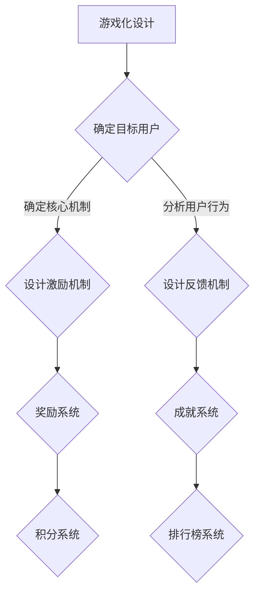

                 

### 《游戏化体验：让参与人类计算乐在其中》

> **关键词**：游戏化、用户体验、参与度、激励机制、行为心理学

**摘要**：  
游戏化体验是一种将游戏设计元素应用于非游戏情境中，以提高用户参与度和满意度的策略。本文从游戏化的定义、理论基础、心理学原理、应用领域和设计方法等方面，详细探讨了如何设计和实施游戏化体验。通过实际案例的分析，本文展示了游戏化体验在提升学习效率、增加商业互动、提高工作场所效率和促进健康行为等方面的潜力。

### 《游戏化体验：让参与人类计算乐在其中》目录大纲

#### 第一部分：游戏化理论基础

**第1章：游戏化概述**

**1.1 游戏化定义与历史背景**

- 游戏化的定义
- 游戏化的起源与发展

**1.2 游戏化与参与度的关系**

- 游戏化对参与度的促进作用
- 参与度对用户体验的重要性

**1.3 游戏化在现代社会的应用**

- 教育领域的游戏化
- 商业领域的游戏化
- 工作场所的游戏化
- 健康与健身领域的游戏化

#### 第二部分：游戏化核心概念与原理

**第2章：游戏化核心概念与原理**

**2.1 游戏化设计要素**

- 目标用户
- 核心机制
- 激励机制

**2.2 游戏化流程与步骤**

- 设计思维
- 用户研究
- 游戏化体验测试与迭代

**2.3 游戏化中的激励机制**

- 奖励系统
- 成就系统
- 积分系统

**第3章：游戏化心理学原理**

**3.1 心理学在游戏化中的应用**

- 奖励机制与行为心理学
- 社交心理学与游戏化

**3.2 奖励机制与行为心理学**

- 行为心理学的基本原理
- 奖励机制的设计策略

**3.3 社交心理学与游戏化**

- 社交心理学的基本原理
- 社交机制在游戏化中的应用

#### 第三部分：游戏化在不同领域的应用

**第4章：教育领域的游戏化**

**4.1 教育游戏化案例**

- 成功的教育游戏化实例

**4.2 教育游戏化设计原则**

- 教学目标与游戏化
- 游戏化与学习内容的结合

**4.3 教育游戏化对学习的影响**

- 提高学习兴趣
- 增强学习动机
- 提升学习效果

**第5章：商业领域的游戏化**

**5.1 商业游戏化案例**

- 成功的商业游戏化实例

**5.2 商业游戏化策略**

- 激励用户参与
- 提高用户忠诚度

**5.3 商业游戏化对客户体验的影响**

- 改善客户互动
- 提高客户满意度

**第6章：工作场所的游戏化**

**6.1 工作游戏化案例**

- 成功的工作游戏化实例

**6.2 工作游戏化设计原则**

- 提高工作效率
- 增强团队合作

**6.3 工作游戏化对员工绩效的影响**

- 提升员工积极性
- 增强员工归属感

**第7章：健康与健身领域的游戏化**

**7.1 健康游戏化案例**

- 成功的健康游戏化实例

**7.2 健康游戏化设计原则**

- 促进健康行为
- 提高健康意识

**7.3 健康游戏化对健康行为的影响**

- 改善生活方式
- 提高健康水平

#### 第四部分：游戏化体验设计

**第8章：游戏化体验设计方法**

**8.1 设计思维在游戏化中的应用**

- 设计思维的基本原理
- 如何将设计思维应用于游戏化体验设计

**8.2 用户研究在游戏化体验设计中的作用**

- 用户研究的方法与工具
- 如何通过用户研究优化游戏化体验

**8.3 游戏化体验测试与迭代**

- 游戏化体验测试的方法
- 迭代过程中的优化策略

**第9章：游戏化体验案例分析**

**9.1 国内外游戏化成功案例**

- 详细分析国内外成功的游戏化案例

**9.2 案例分析：游戏化体验的成功与挑战**

- 成功案例的共通点
- 面临的挑战及应对策略

**9.3 案例应用：如何将游戏化融入你的项目中**

- 实际操作指南
- 游戏化体验设计案例解析

#### 第五部分：游戏化体验的未来发展趋势

**第10章：游戏化体验的未来发展趋势**

**10.1 技术创新对游戏化体验的影响**

- 人工智能
- 虚拟现实

**10.2 未来游戏化体验的新趋势**

- 社交游戏化
- 智能游戏化

**10.3 游戏化体验在新兴领域中的应用前景**

- 教育
- 健康
- 企业管理

#### 附录

**附录A：游戏化设计工具与资源**

**A.1 主流游戏化设计工具**

- 工具介绍与使用方法

**A.2 游戏化设计资源与社区**

- 设计资源下载
- 社区交流平台

**附录B：游戏化体验项目实践指南**

**B.1 项目规划与执行**

- 项目管理策略
- 项目实施流程

**B.2 项目评估与优化**

- 评估指标
- 优化策略

**B.3 成功游戏化项目的要素**

- 核心要素解析
- 实践经验分享

### 游戏化体验设计核心概念与原理的 Mermaid 流程图



### 游戏化中的算法原理

#### 奖励算法

奖励算法是游戏化设计的关键，其目的是通过给用户赋予奖励来增强他们的参与度和积极性。

伪代码：

```plaintext
function rewardAlgorithm(userAction, points) {
    if (userAction == 'achievement') {
        points += 10;
    } else if (userAction == 'dailyTask') {
        points += 5;
    } else if (userAction == 'socialShare') {
        points += 20;
    }
    return points;
}
```

#### 成就算法

成就算法用于识别用户在游戏化过程中达到的重要里程碑，以激发用户的自豪感和继续参与的动力。

伪代码：

```plaintext
function achievementAlgorithm(userActions) {
    if (userActions.includes('achievementLevel10')) {
        return "恭喜你，达到了成就等级10！";
    } else if (userActions.includes('dailyStreak5Days')) {
        return "恭喜你，连续5天完成了日常任务！";
    }
    return "继续努力，下一个成就等你来挑战！";
}
```

### 奖励系统的数学模型

奖励系统可以通过以下数学公式进行设计，以平衡奖励的公平性和激励效果：

$$
R = f(P, S)
$$

其中，$R$ 表示用户获得的奖励分数，$P$ 表示用户参与的行为，$S$ 表示用户达成的成就。$f$ 是一个权重函数，用于根据行为的难易程度和成就的价值来分配分数。

#### 奖励计算示例

$$
P = userActionPoints
$$
$$
S = achievementPoints
$$

$$
R = f(P, S)
$$
$$
R = 10 \times P + 20 \times S
$$

假设用户完成了一个日常任务（$P = 5$）和一个成就（$S = 2$），则：

$$
R = 10 \times 5 + 20 \times 2 = 50 + 40 = 90
$$

用户获得了90分奖励。

### 实践项目：游戏化学习平台的设计与实现

#### 项目背景

一款面向中小学学生的游戏化学习平台，旨在提高学生的学习兴趣和成绩。

#### 开发环境

- 前端：HTML, CSS, JavaScript
- 后端：Python Flask
- 数据库：MySQL

#### 核心功能

- 用户注册与登录
- 学习任务发布与完成
- 成就系统
- 积分系统
- 排行榜

#### 源代码实现

**后端 Flask 代码示例：**

```python
from flask import Flask, request, jsonify
from models import User, Task, Achievement, Score

app = Flask(__name__)

@app.route('/api/register', methods=['POST'])
def register():
    # 用户注册逻辑
    pass

@app.route('/api/login', methods=['POST'])
def login():
    # 用户登录逻辑
    pass

@app.route('/api/tasks', methods=['GET'])
def get_tasks():
    # 获取任务列表
    pass

@app.route('/api/tasks/complete', methods=['POST'])
def complete_task():
    # 完成任务的逻辑
    pass

@app.route('/api/achievements', methods=['GET'])
def get_achievements():
    # 获取成就列表
    pass

@app.route('/api/scores', methods=['GET'])
def get_scores():
    # 获取用户积分和排名
    pass

if __name__ == '__main__':
    app.run(debug=True)
```

**前端 JavaScript 代码示例：**

```javascript
function registerUser(username, password) {
    // 用户注册代码
}

function loginUser(username, password) {
    // 用户登录代码
}

function getTasks() {
    // 获取任务列表代码
}

function completeTask(taskId) {
    // 完成任务代码
}

function getAchievements() {
    // 获取成就列表代码
}

function getScores() {
    // 获取用户积分和排名代码
}
```

#### 代码解读与分析

- **用户注册与登录**：实现用户注册和登录功能，确保用户数据的安全性和隐私性。
- **学习任务发布与完成**：后端提供任务列表接口，前端显示任务列表；用户完成任务后，通过接口提交任务完成情况。
- **成就系统**：根据用户的任务完成情况和积分，自动生成成就。
- **积分系统**：根据用户的任务完成情况和成就，更新用户的积分。
- **排行榜**：实时显示用户积分和排名，激励用户积极参与。

### 游戏化体验评估

#### 游戏化体验评估方法

游戏化体验的评估主要通过以下几个方面：

- **用户满意度调查**：通过问卷或访谈形式收集用户对游戏化体验的满意度。
- **行为数据分析**：分析用户在平台上的行为数据，如任务完成率、成就达成率等。
- **反馈机制**：建立反馈渠道，及时收集用户反馈，并快速响应。

#### 评估指标

- **用户参与度**：用户活跃度、任务完成率、成就达成率等。
- **用户满意度**：满意度调查得分。
- **平台效益**：通过游戏化体验提升的业务指标，如学习成绩提高、用户留存率等。

### 成功游戏化项目的要素

- **明确目标**：明确游戏化项目的目标，确保所有设计和实施活动围绕目标进行。
- **用户研究**：深入了解目标用户的需求和习惯，确保游戏化设计的针对性。
- **激励机制**：设计合理的奖励和成就系统，激发用户参与和积极性。
- **持续迭代**：定期收集用户反馈，根据反馈持续优化游戏化体验。
- **跨部门合作**：游戏化项目通常涉及多个部门，需要跨部门合作确保项目成功。

### 附录A：游戏化设计工具与资源

#### A.1 主流游戏化设计工具

- **Gameful Design Toolkit**：提供一系列游戏化设计资源和模板。
- **Game Mechanics Database**：包含丰富的游戏机制和设计灵感。

#### A.2 游戏化设计资源与社区

- **GDC（Game Developers Conference）**：全球最大的游戏开发者大会，提供游戏化设计的最新趋势和案例。
- **UX Booth**：专注于用户体验设计的网站，包含游戏化相关文章和资源。

### 附录B：游戏化体验项目实践指南

#### B.1 项目规划与执行

- 制定详细的计划和时间表。
- 明确项目目标和预期成果。
- 分配资源，确保项目顺利进行。

#### B.2 项目评估与优化

- 建立评估指标，定期跟踪项目进展。
- 分析用户反馈，识别问题和改进点。
- 根据评估结果进行优化，提升游戏化体验。

#### B.3 成功游戏化项目的要素

- **明确目标**：确保项目目标清晰，有利于设计和实施。
- **用户研究**：深入了解用户需求，确保游戏化设计的有效性。
- **激励机制**：设计合理的奖励和成就系统，激发用户参与。
- **持续迭代**：定期收集用户反馈，优化游戏化体验。
- **跨部门合作**：协调各方资源，确保项目成功。

### 作者信息

**作者：AI天才研究院/AI Genius Institute & 禅与计算机程序设计艺术 /Zen And The Art of Computer Programming** 

本文由AI天才研究院的专家撰写，旨在深入探讨游戏化体验的设计和应用。同时，结合禅与计算机程序设计艺术的哲学，为读者提供一种更为全面和深刻的视角来理解和实践游戏化体验。

### 结语

游戏化体验作为一种创新的设计策略，正逐渐成为各领域提升用户参与度和满意度的有效手段。通过本文的详细探讨，我们希望读者能够对游戏化体验有更深入的理解，并在实际项目中成功应用这一策略。游戏化不仅能够激发用户的积极性，还能带来显著的商业和社会效益。让我们一起探索游戏化的无限可能性，让计算体验更加有趣和富有成效。

---

### 游戏化概述

#### 1.1 游戏化定义与历史背景

**游戏化**，简而言之，是将游戏的设计元素和机制应用于非游戏情境中，以提高用户参与度和满意度的一种策略。游戏化的概念并非近年来才兴起，它有着深厚的历史背景和理论基础。

**定义**：游戏化（Gamification）指的是将游戏中的机制、动机和视觉元素应用到非游戏环境中，以激励用户行为和提升用户体验。它通过设计奖励、挑战、竞争和社交互动等元素，鼓励用户参与和持续互动。

**历史背景**：

1. **早期探索**：早在20世纪初，心理学家和行为科学家就开始研究游戏对行为的影响。例如，心理学家爱德华·李·桑代克（Edward L. Thorndike）和约翰·华生（John B. Watson）的研究揭示了奖励和惩罚在学习和行为塑造中的重要作用。

2. **互联网时代的兴起**：随着互联网的普及和游戏设计的成熟，游戏化在21世纪初开始受到关注。2002年，游戏设计师提姆·沙利文（Tim Sullivan）首次提出了“游戏化”的概念，并将其应用于在线社区的设计。

3. **商业应用**：2008年，游戏设计师贾斯汀·布洛德鲁克（Justin Bloom）将游戏化应用于商业领域，推出了一系列基于游戏化原则的产品和服务。自此，游戏化开始在各个行业中得到广泛应用。

**游戏化的发展历程**：

- **1.0时代**（2002-2008年）：这一时期主要关注游戏化工具和平台的建设，如点数系统、等级系统和排行榜等。
- **2.0时代**（2008-2013年）：游戏化开始向更复杂的方向发展，涉及社交互动、虚拟商品和成就系统。
- **3.0时代**（2013年至今）：游戏化进入深度应用阶段，不仅应用于商业和市场营销，还扩展到教育、健康和人力资源管理等领域。

#### 1.2 游戏化与参与度的关系

**参与度**是衡量用户对某项活动投入程度的关键指标。高参与度意味着用户更愿意投入时间和精力，从而提高活动的效果和满意度。游戏化通过以下方式与参与度建立紧密联系：

1. **激励机制**：游戏化引入奖励和成就系统，激励用户积极参与。例如，通过完成特定任务或达到某个等级，用户可以获得奖励或徽章。

2. **竞争和协作**：游戏化中的排行榜和竞争机制能够激发用户的竞争心理，提高参与度。同时，协作机制鼓励用户与他人合作，共同完成任务或达成目标。

3. **社交互动**：游戏化鼓励用户之间的社交互动，如分享进展、评论和点赞等。这种互动不仅增强了用户的参与感，还促进了社区的建立和发展。

**参与度对用户体验的重要性**：

- **增强用户粘性**：高参与度意味着用户更愿意长期使用某个平台或应用，从而提高用户留存率。
- **提升满意度**：参与度与满意度密切相关。用户在参与过程中感受到乐趣和成就感，从而提高对产品的满意度。
- **促进口碑传播**：满意的用户更愿意分享他们的体验，从而为产品带来更多的潜在用户。

#### 1.3 游戏化在现代社会的应用

**现代社会**对参与度和用户体验有着更高的要求。游戏化作为一种有效的策略，已在多个领域得到广泛应用：

1. **教育领域**：游戏化教育平台通过设计有趣的学习任务和奖励系统，激发学生的学习兴趣和积极性。

2. **商业领域**：商家通过游戏化营销活动，如积分兑换、优惠券和社交分享等，吸引消费者参与，提高品牌忠诚度。

3. **健康与健身领域**：游戏化应用鼓励用户参与健康活动，如健身挑战和食物追踪，提高健康意识和生活方式的改变。

4. **人力资源管理**：企业通过游戏化工作平台，如任务挑战和绩效评估，提高员工的工作效率和团队协作。

**应用案例**：

- **Duolingo**：一款流行的语言学习应用，通过游戏化的学习任务和奖励系统，鼓励用户坚持学习，提高学习效果。
- **Fitbit**：一款智能手环，通过游戏化的健康挑战和排行榜，激励用户保持健康生活方式。
- **Red Bull**：通过游戏化营销活动，如线上挑战和虚拟竞赛，吸引年轻消费者，提升品牌影响力。

总之，游戏化作为一种创新的设计策略，正逐渐改变着我们的工作和生活方式。通过深入理解游戏化的定义、历史背景和应用，我们能够更好地利用这一策略，提升参与度和用户体验，实现商业和社会效益的最大化。

#### 2.1 游戏化设计要素

游戏化设计的成功离不开对其核心要素的深刻理解和精心设计。以下将详细探讨游戏化设计中的三大关键要素：目标用户、核心机制和激励机制。

**目标用户**

**1. 用户需求分析**

游戏化设计的第一步是明确目标用户群体，了解他们的需求和行为模式。用户需求分析包括以下几个方面：

- **用户画像**：通过调查、访谈和数据分析，描绘出目标用户的特征，如年龄、性别、职业、兴趣爱好等。
- **用户行为**：观察和分析目标用户在非游戏情境中的行为，了解他们的习惯和偏好。
- **用户痛点**：识别目标用户在使用非游戏产品或服务时遇到的问题和挑战，以便设计出更具针对性的游戏化方案。

**2. 用户动机**

理解用户动机是设计游戏化体验的核心。用户参与某项活动通常出于以下几个动机：

- **兴趣和乐趣**：用户希望从活动中获得乐趣和满足感。
- **成就感和自豪感**：用户希望通过完成特定任务或达成目标来获得成就感和自豪感。
- **社交互动**：用户希望通过与他人互动来建立社交联系和社区感。
- **奖励和激励**：用户被奖励和激励系统所吸引，希望通过参与活动获得物质或虚拟的奖励。

**核心机制**

**1. 挑战与目标**

挑战与目标是游戏化设计中的核心机制，能够激发用户的积极性和参与度。设计挑战与目标时，应考虑以下几点：

- **难度适中**：挑战难度应适中，既能让用户感受到挑战性，又不会过于困难，以免挫伤用户的积极性。
- **可达成性**：目标应具有可达成性，用户在通过努力后能够实现。
- **多样性**：设计多种类型的挑战和目标，满足不同用户的需求和偏好。

**2. 竞争与协作**

竞争与协作机制能够增强用户参与感和社会互动。设计时，可以考虑以下几点：

- **个人竞争**：设置个人排行榜，鼓励用户在个人层面上竞争。
- **团队协作**：设计团队任务和竞争机制，鼓励用户在团队中合作完成任务。
- **社交互动**：引入社交元素，如好友系统、评论和分享，促进用户之间的互动。

**激励机制**

**1. 奖励系统**

奖励系统是游戏化设计中至关重要的激励手段，能够直接影响用户的参与度和积极性。设计奖励系统时，应考虑以下几点：

- **多样性**：提供多种类型的奖励，如积分、徽章、虚拟商品等，满足不同用户的需求和偏好。
- **即时性**：确保奖励的即时性，让用户在完成任务后能够立即获得奖励，增强参与感。
- **公平性**：确保奖励系统的公平性，避免因奖励分配不均而引发用户不满。

**2. 成就系统**

成就系统通过记录用户的里程碑和成就，增强用户的自豪感和参与动机。设计成就系统时，应考虑以下几点：

- **可衡量性**：成就应具有可衡量性，用户能够清楚地知道如何达成成就。
- **多样性**：设计多种类型的成就，满足不同用户的需求和兴趣。
- **层次性**：设置不同层次的成就，引导用户逐步提升自己的水平。

**3. 积分系统**

积分系统通过累积积分，激励用户持续参与和提升。设计积分系统时，应考虑以下几点：

- **易理解性**：积分系统应简单易懂，用户能够快速理解积分的获取和用途。
- **灵活性**：提供多种获取积分的途径，如完成任务、参与活动、社交互动等。
- **兑换机制**：设计积分兑换机制，让用户能够用积分兑换虚拟商品或服务，提高积分的吸引力。

通过深入理解并精心设计目标用户、核心机制和激励机制，游戏化体验能够更加有效地激发用户的参与度和积极性，实现预期的商业和社会效益。

#### 2.2 游戏化流程与步骤

游戏化流程是确保游戏化项目成功实施和有效运作的关键。以下是游戏化项目从初始阶段到最终交付的详细流程与步骤：

**1. 明确目标**

- **定义项目目标**：在项目启动前，明确游戏化的目标，包括提升用户参与度、增加用户粘性、提高业绩指标等。确保所有团队成员对项目目标有清晰的理解。
- **确定衡量标准**：制定明确的衡量指标，如用户活跃度、任务完成率、积分获取情况等，以评估项目效果。

**2. 确定目标用户**

- **用户画像**：通过调研和数据分析，绘制目标用户的画像，包括用户年龄、性别、职业、行为习惯等。
- **用户需求分析**：了解目标用户的需求和痛点，识别他们参与活动的动机和期望。

**3. 设计核心机制**

- **挑战与目标**：设计具有挑战性和可达成性的任务和目标，确保用户在通过努力后能够实现。
- **竞争与协作**：设置个人和团队竞争机制，促进用户之间的互动和合作。
- **社交互动**：引入社交元素，如好友系统、评论和分享，增强用户的社区感。

**4. 设计激励机制**

- **奖励系统**：设计多样的奖励，如积分、徽章、虚拟商品等，满足不同用户的需求。
- **成就系统**：设置可衡量和多样化的成就，激励用户不断提升。
- **积分系统**：设计易理解、灵活的积分获取和兑换机制，提高用户的参与积极性。

**5. 设计体验流程**

- **用户流程**：设计用户在游戏化平台上的流程，从注册、登录、完成任务到获得奖励的各个环节。
- **反馈机制**：设计用户反馈渠道，及时收集用户意见和建议，为后续优化提供依据。

**6. 开发与测试**

- **开发**：根据设计文档，进行游戏化平台的功能开发，包括前端、后端和数据库等。
- **测试**：进行功能测试、性能测试和安全测试，确保游戏化平台稳定可靠。

**7. 上线与推广**

- **上线**：将游戏化平台部署到生产环境，并进行上线前的最后检查。
- **推广**：通过广告、营销活动和用户推广，提高平台的知名度和用户参与度。

**8. 运营与优化**

- **数据监控**：实时监控平台的数据，如用户活跃度、任务完成率、积分获取情况等，及时发现问题和优化。
- **用户反馈**：定期收集用户反馈，了解用户的真实体验和需求，为平台优化提供依据。
- **迭代更新**：根据数据分析和用户反馈，进行平台功能的迭代更新，持续提升用户体验。

通过以上步骤，游戏化项目能够系统地设计和实施，确保游戏化体验的有效性和用户的持续参与。

#### 2.3 游戏化中的激励机制

激励机制是游戏化设计中的核心要素，旨在通过奖励和成就系统来激励用户行为，提高用户参与度和满意度。以下是关于游戏化中激励机制的详细讨论。

**奖励系统**

奖励系统是游戏化中最重要的激励机制之一，它通过给予用户即时和长期的奖励，鼓励用户积极参与和完成任务。设计奖励系统时，应考虑以下几个方面：

1. **奖励多样性**：提供多种类型的奖励，如积分、徽章、虚拟商品、优惠券等，满足不同用户的需求和兴趣。多样性奖励能够增强用户参与的动力，提高平台的使用频率。

2. **即时性**：奖励应具有即时性，即用户在完成任务或达到目标后，能够立即获得奖励。这种即时反馈能够增强用户的参与感和满足感，提高用户的积极性。

3. **公平性**：确保奖励系统的公平性，避免因奖励分配不均而引发用户不满。公平的奖励系统能够建立用户的信任，促进社区的建立和发展。

4. **奖励价值**：奖励的价值应与用户付出的努力相匹配，既不能过于昂贵，也不能过于廉价。适中的奖励价值能够激发用户的积极性，提高参与度。

**成就系统**

成就系统通过记录用户的里程碑和成就，增强用户的自豪感和参与动机。成就系统设计时，应考虑以下几个方面：

1. **可衡量性**：成就应具有可衡量性，用户能够清楚地知道如何达成成就。可衡量性成就能够激励用户设定目标，并通过努力实现。

2. **多样性**：设计多种类型的成就，以满足不同用户的需求和兴趣。多样性成就能够增加用户的参与感和乐趣，提高平台的吸引力。

3. **层次性**：设置不同层次的成就，引导用户逐步提升自己的水平。层次性成就能够激励用户不断挑战自我，实现个人成长。

4. **互动性**：成就系统应具有互动性，用户能够分享和展示自己的成就，与他人互动和交流。互动性成就能够增强社区的活力，促进用户之间的社交互动。

**积分系统**

积分系统是游戏化中常用的一种激励机制，通过累积积分，激励用户持续参与和提升。设计积分系统时，应考虑以下几个方面：

1. **易理解性**：积分系统应简单易懂，用户能够快速理解积分的获取和用途。易理解性积分系统能够提高用户的参与度，减少用户的使用障碍。

2. **灵活性**：提供多种获取积分的途径，如完成任务、参与活动、社交互动等。灵活性积分系统能够满足不同用户的需求，增加平台的吸引力。

3. **兑换机制**：设计积分兑换机制，让用户能够用积分兑换虚拟商品或服务，提高积分的吸引力。兑换机制能够激发用户的积极性，促进平台的活跃度。

4. **成长性**：积分系统应具有成长性，即用户在通过努力后能够不断积累和提升积分。成长性积分系统能够激励用户持续参与，提高用户留存率。

通过精心设计的奖励系统、成就系统和积分系统，游戏化体验能够有效激励用户行为，提高用户参与度和满意度，实现预期的商业和社会效益。

#### 3.1 心理学在游戏化中的应用

心理学作为一门研究人类行为和心理过程的科学，对游戏化设计具有重要指导意义。将心理学原理应用于游戏化设计中，可以更好地理解用户行为，提高游戏化体验的有效性和吸引力。

**1. 行为心理学的基本原理**

行为心理学研究人类行为的规律和影响因素，主要包括以下几个基本原理：

- **强化原理**：行为心理学认为，行为与其后果密切相关。积极的后果会增强行为发生的频率，而消极的后果则会抑制行为的发生。在游戏化设计中，通过奖励和激励系统来强化用户行为，例如完成任务后给予积分、徽章等，可以激励用户持续参与。

- **动机原理**：动机是驱动个体行为的重要力量。了解用户的动机，可以更好地设计游戏化机制，满足用户的需求。例如，用户可能因为兴趣、成就、社交等因素而参与游戏化活动。

- **反馈原理**：反馈是用户行为的重要信息来源。及时、有效的反馈可以引导用户行为，提高用户满意度。在游戏化设计中，通过即时反馈、成就记录等机制，为用户提供积极的反馈，增强用户的参与感。

**2. 奖励机制的设计策略**

根据行为心理学的原理，奖励机制在游戏化设计中的设计策略包括以下几个方面：

- **即时奖励**：即时奖励能够迅速提高用户的参与度。例如，用户完成任务后立即获得积分或徽章，可以增强用户的积极性和成就感。

- **逐步奖励**：逐步奖励有助于维持用户的长期参与。通过设计不同难度和复杂度的任务，逐步提升用户的奖励水平，鼓励用户不断挑战自我。

- **社会奖励**：社会奖励通过他人的认可和赞赏来增强用户行为。例如，在游戏化平台中设置好友系统、排行榜等机制，鼓励用户与他人互动，增强社区的凝聚力。

- **内在奖励**：内在奖励是指用户在参与活动过程中获得的内在满足感。设计有趣、富有挑战性的任务，让用户在完成任务后感受到成就感，从而提高参与度。

**3. 社交心理学的应用**

社交心理学研究人类社交行为和心理过程，对游戏化设计中的应用主要体现在以下几个方面：

- **群体动力**：群体动力是指群体成员之间的相互作用和影响。通过设计团队任务和协作机制，鼓励用户在群体中共同完成任务，增强用户的参与感和归属感。

- **社会认同**：社会认同是指个体对群体规范和价值观的认同。在游戏化设计中，通过设置社交互动元素，如评论、点赞、分享等，促进用户之间的互动，增强用户的社会认同感。

- **社交支持**：社交支持是指个体在面临困难和挑战时，从他人那里获得的帮助和支持。通过设计互助机制，如问答社区、任务互助等，为用户提供社交支持，提高用户的参与度和满意度。

**4. 心理学在游戏化设计中的应用实例**

以下是心理学在游戏化设计中的应用实例：

- **教育游戏化**：通过设计有趣的学习任务和奖励系统，激发学生的学习兴趣和积极性。例如，在英语学习应用中，设计单词拼写游戏，用户完成任务后获得积分和徽章。

- **健康游戏化**：通过设计健康任务和奖励系统，鼓励用户保持健康生活方式。例如，在健身应用中，用户完成每日锻炼任务后，可以获得积分和排名，增强用户的成就感和参与感。

- **商业游戏化**：通过设计有趣的营销活动和奖励系统，提高用户的参与度和忠诚度。例如，在电商平台上，设计购物挑战和积分兑换机制，激励用户参与购物活动。

总之，心理学在游戏化设计中的应用，能够深入理解用户行为和心理过程，设计出更加有效和吸引人的游戏化体验。通过结合行为心理学和社交心理学的原理，游戏化设计可以更好地满足用户需求，提高用户体验和满意度。

#### 3.2 奖励机制与行为心理学

奖励机制在游戏化设计中起着至关重要的作用，它不仅直接影响用户的参与度和满意度，还能通过行为心理学的基本原理来引导和激励用户行为。理解行为心理学在奖励机制设计中的应用，可以帮助我们更好地优化奖励系统，提升游戏化体验的效果。

**行为心理学的基本原理**

行为心理学主要研究行为与环境之间的相互作用，以下是其核心原理：

1. **强化原理**：行为心理学中的强化原理指出，当某个行为后跟随着一个积极的后果时，该行为的发生概率会增加。强化可以分为正强化和负强化。

   - **正强化**：通过给予奖励或积极反馈来增强行为。例如，用户完成一个任务后，系统会给予积分或徽章。
   - **负强化**：通过消除不愉快的刺激来增强行为。例如，用户达到一定积分后，系统会自动取消某些限制。

2. **惩罚原理**：惩罚是通过给予不愉快的后果来减少行为发生的概率。然而，在游戏化设计中，过度使用惩罚可能会降低用户的积极性和满意度，因此应谨慎使用。

3. **消退原理**：当行为不再跟随强化时，其发生的概率会逐渐减少。消退原理可以用来减少不良行为，例如用户连续多次未完成任务后，系统会减少或取消奖励。

**奖励机制设计策略**

结合行为心理学的基本原理，以下是设计有效奖励机制的一些策略：

1. **即时反馈**：即时反馈可以迅速提高用户的参与度。当用户完成一个任务或达成一个目标时，立即给予奖励或反馈，让用户感受到成就和满足。

2. **多样化奖励**：提供多种类型的奖励，如积分、徽章、虚拟商品、优惠券等，满足不同用户的需求和偏好。多样化奖励能够增强用户的参与动力，提高平台的吸引力。

3. **公平性**：确保奖励系统的公平性，避免因奖励分配不均而引发用户不满。公平的奖励系统可以建立用户的信任，促进社区的建立和发展。

4. **内在奖励**：设计有趣、富有挑战性的任务，让用户在完成任务后感受到内在的满足感。例如，通过挑战性的任务设计，让用户在解决问题后体验到成就感。

5. **社会奖励**：通过他人的认可和赞赏来增强用户行为。例如，在游戏化平台中设置好友系统、排行榜等机制，鼓励用户与他人互动，增强社区的凝聚力。

**奖励机制案例分析**

以下是一个关于奖励机制在游戏化设计中的实际案例：

**案例：Duolingo语言学习应用**

Duolingo是一款流行的免费语言学习应用，其奖励机制有效地提高了用户的参与度和学习效果。以下是Duolingo的奖励机制设计：

- **即时奖励**：用户每次完成学习任务后，立即获得积分和徽章。这种即时反馈机制让用户迅速感受到成就和满足。
- **多样化奖励**：提供多种类型的徽章，如完成课程徽章、单词挑战徽章等，满足不同用户的需求和兴趣。
- **内在奖励**：设计有趣、互动性强的学习任务，让用户在完成任务后体验到解决问题的成就感。
- **社会奖励**：通过好友系统，用户可以邀请朋友参与学习，共同完成任务。在平台上展示用户的学习进度和徽章，增强用户的成就感和社区感。

通过以上奖励机制设计，Duolingo不仅提高了用户的参与度，还建立了活跃的学习社区，取得了显著的成功。

**总结**

奖励机制在游戏化设计中至关重要，通过结合行为心理学的基本原理，可以设计出更加有效和吸引人的奖励系统。即时反馈、多样化奖励、公平性、内在奖励和社会奖励等策略，能够激励用户积极参与，提高游戏化体验的效果。理解并应用这些策略，有助于我们更好地设计和优化游戏化体验，实现预期的商业和社会效益。

#### 3.3 社交心理学与游戏化

社交心理学研究人类在社交环境中的行为和心理过程，对游戏化设计具有重要影响。通过理解和应用社交心理学原理，可以设计出更加吸引人和有效的游戏化体验，提高用户的参与度和满意度。

**1. 社交心理学的基本原理**

社交心理学主要包括以下几个核心原理：

1. **社会认同**：个体倾向于与群体中的其他成员保持一致。在游戏化设计中，通过设置社交互动元素，如好友系统、社群讨论区等，可以增强用户的社会认同感，提高用户的参与度。

2. **从众行为**：个体在不确定的情况下，倾向于模仿他人的行为。在游戏化设计中，通过展示其他用户的成就和活跃度，可以激发用户的从众行为，提高平台的活跃度。

3. **社会支持**：个体在面临困难和挑战时，需要他人的支持和帮助。在游戏化设计中，通过设计互助机制，如任务互助、问答社区等，可以提供社交支持，增强用户的参与感和归属感。

4. **社交比较**：个体通过与他人比较来评估自己的地位和成就。在游戏化设计中，通过设置排行榜和成就系统，可以激发用户的竞争心理，提高平台的参与度。

**2. 社交互动在游戏化设计中的应用**

社交互动是游戏化体验的重要组成部分，以下是如何在游戏化设计中应用社交心理学原理的详细说明：

1. **好友系统**：通过好友系统，用户可以邀请朋友加入游戏化平台，共同完成任务和挑战。这种互动机制不仅可以增强用户的社会认同感，还可以提高平台的用户留存率。

2. **社群讨论区**：设计一个开放的讨论区，让用户可以分享心得、讨论问题和互相帮助。这种互动机制可以增强社区的凝聚力，提高用户的参与度和满意度。

3. **排行榜**：通过设置排行榜，展示用户的积分、成就和活跃度，可以激发用户的竞争心理，提高平台的活跃度。排行榜还可以展示用户之间的相对地位，增强用户的社会认同感。

4. **成就展示**：让用户在个人页面展示自己的成就和徽章，不仅可以增强用户的自豪感和成就感，还可以激发其他用户的参与动机。

5. **任务互助**：设计任务互助机制，让用户可以在平台上互相帮助完成任务。这种互动机制可以提供社交支持，提高用户的参与度和满意度。

**3. 社交心理学在游戏化设计中的案例**

以下是一个关于社交心理学在游戏化设计中的实际案例：

**案例：Fitbit健康游戏化**

Fitbit是一款流行的健康与健身应用，其游戏化设计成功地应用了社交心理学原理，提高了用户的参与度和健康行为。

- **好友系统**：Fitbit允许用户邀请朋友加入，共同设置健康目标，进行每日的健身挑战。这种互动机制增强了用户的社会认同感，提高了用户的参与度。
- **社群讨论区**：Fitbit设有开放的讨论区，用户可以在其中分享健身心得、交流问题和互相鼓励。这种互动机制增强了社区的凝聚力，提高了用户的参与感和满意度。
- **排行榜**：Fitbit设有排行榜，展示用户的步数、卡路里消耗和其他健康指标。这种互动机制激发了用户的竞争心理，提高了平台的活跃度。
- **任务互助**：Fitbit提供了任务互助功能，用户可以在平台上互相帮助完成每日健身任务。这种互动机制提供了社交支持，提高了用户的参与度和健康行为。

通过上述社交心理学原理的应用，Fitbit成功地提高了用户的参与度和健康行为，取得了显著的成功。

**总结**

社交心理学在游戏化设计中具有重要影响。通过理解和应用社交心理学原理，可以设计出更加吸引人和有效的游戏化体验，提高用户的参与度和满意度。好友系统、社群讨论区、排行榜、成就展示和任务互助等互动机制，都是应用社交心理学原理的有效手段。理解并应用这些原理，有助于我们在游戏化设计中创造更加成功的体验。

#### 4.1 教育领域的游戏化案例

**1. Duolingo**

Duolingo 是一款广受欢迎的免费语言学习应用，它的游戏化设计成功地提高了用户的学习兴趣和效果。Duolingo 通过以下方式实现了教育领域的游戏化：

- **任务驱动**：Duolingo 的学习任务设计成游戏形式，用户需要完成一系列任务来学习新的单词和句子。每个任务都设置了不同的难度，用户通过逐步完成这些任务来提高语言水平。
- **即时反馈**：用户每次完成任务后，都会立即获得反馈，了解自己是否正确。这种即时反馈机制不仅提高了用户的参与度，还增强了用户的自信心。
- **奖励系统**：Duolingo 设计了丰富的奖励系统，包括积分、徽章和成就。用户在完成任务或达到特定目标时，会获得相应的奖励，从而提高学习动力。
- **社交互动**：Duolingo 提供了好友系统，用户可以邀请朋友一起学习，互相鼓励和竞争。这种社交互动机制增强了用户的归属感和参与感。

**2. Classcraft**

Classcraft 是一款将游戏化元素应用于课堂教学的应用。它通过以下方式在教育领域实现了游戏化：

- **角色扮演**：学生可以在 Classcraft 中选择自己的角色，并通过完成任务和挑战来提升角色的能力。这种角色扮演机制激发了学生的兴趣和参与度。
- **技能系统**：Classcraft 设计了多种技能系统，如领导力、沟通和团队合作。学生通过在课堂中应用这些技能，可以提升角色的等级和获得奖励。
- **奖励机制**：Classcraft 通过积分和虚拟货币来激励学生。学生可以用积分兑换虚拟物品或奖励，从而提高学习的积极性。
- **师生互动**：Classcraft 提供了一个互动平台，学生和教师可以在这个平台上进行交流和合作。这种互动机制不仅增强了学生的学习动力，还提高了教师的课堂管理效率。

**3. Kahoot!**

Kahoot! 是一款流行的互动学习工具，它通过以下方式实现了教育领域的游戏化：

- **竞赛形式**：Kahoot! 将学习内容设计成竞赛形式，学生需要在规定时间内回答问题。这种竞赛形式不仅增加了学习的趣味性，还提高了学生的参与度。
- **即时反馈**：学生在回答问题后，会立即获得反馈，了解自己是否正确。这种即时反馈机制有助于学生及时纠正错误，加深对知识点的理解。
- **排行榜**：Kahoot! 设置了排行榜，展示学生的得分和排名。这种排行榜机制激发了学生的竞争心理，提高了学生的学习积极性。
- **社交互动**：Kahoot! 提供了社交互动功能，学生可以在平台上邀请朋友一起参与竞赛。这种社交互动机制增强了学生的归属感和参与感。

**总结**

教育领域的游戏化案例表明，通过将游戏化元素应用于学习过程，可以显著提高学生的学习兴趣和效果。任务驱动、即时反馈、奖励系统和社交互动是教育游戏化设计的关键要素。这些案例的成功经验为其他教育领域的项目提供了有益的借鉴和启示。

#### 4.2 教育游戏化设计原则

在教育领域应用游戏化设计，可以显著提升学生的学习兴趣和动机。以下是一些关键的设计原则，这些原则将指导教育游戏化的成功实施。

**1. 教学目标导向**

- **明确教学目标**：在开始设计教育游戏化之前，首先要明确教学目标。游戏化活动应围绕教学目标进行设计，确保每个游戏化元素都为教学目标服务。
- **评估教学效果**：设计完成后，应评估游戏化活动对教学目标的实现程度，以便进行优化和调整。

**2. 游戏化与学习内容的有机结合**

- **设计有趣的学习任务**：学习任务应具有趣味性和挑战性，能够吸引学生的兴趣。例如，可以设计模拟实验、角色扮演和团队合作任务等。
- **结合实际应用**：学习任务应与学生的实际生活或未来职业相关，让学生感受到学习内容的应用价值。

**3. 激励机制的有效设计**

- **即时反馈**：提供即时反馈，让学生在完成任务后立即知道结果。这种即时性反馈可以增强学生的自信心和积极性。
- **多样化奖励**：设计多样化的奖励系统，如积分、徽章、虚拟奖品等，满足不同学生的需求。奖励应与任务难度和重要性相匹配。
- **成就体系**：建立成就体系，记录学生的学习进度和成就，鼓励学生不断提升。

**4. 社交互动的设计**

- **促进合作学习**：设计团队任务和合作机制，鼓励学生之间的互动和合作。这种社交互动可以增强学生的团队合作能力和社交技能。
- **建立社区感**：通过建立在线学习社区，如论坛、聊天室等，让学生可以分享学习心得和经验，增强学生的归属感和参与感。

**5. 可访问性和适应性**

- **适应不同学习水平**：游戏化设计应适应不同学习水平的学生，确保每个学生都能找到适合自己的任务和挑战。
- **提供帮助和支持**：为学生提供必要的帮助和支持，如学习指南、辅导和解答疑问等，确保他们能够顺利完成学习任务。

**6. 持续改进与优化**

- **收集反馈**：定期收集学生和教师的反馈，了解游戏化设计的优势和不足，以便进行改进和优化。
- **迭代更新**：根据反馈进行迭代更新，持续优化游戏化体验，确保其与教学目标和学习需求保持一致。

通过遵循以上设计原则，教育游戏化可以更好地实现教学目标，提升学生的学习兴趣和动机，最终提高教学效果。

#### 4.3 教育游戏化对学习的影响

**1. 提高学习兴趣和动机**

教育游戏化通过将学习内容设计成游戏形式，显著提高了学生的学习兴趣和动机。游戏化的任务和挑战不仅具有趣味性，还能激发学生的好奇心和探索欲望。例如，Duolingo 等语言学习应用通过设置有趣的任务和互动环节，让学生在不知不觉中掌握了大量词汇和语法知识。研究表明，游戏化学习能够显著提高学生的参与度和学习动机，从而提高学习效果。

**2. 改善学习效果**

教育游戏化不仅提高了学生的学习兴趣，还显著改善了学习效果。游戏化的设计通过即时反馈和多样化的奖励机制，帮助学生更好地理解和记忆学习内容。例如，Classcraft 等教育应用通过角色扮演和技能系统，鼓励学生在课堂内外积极参与学习活动，从而提高了学习效果。研究表明，游戏化学习可以显著提高学生的学业成绩和知识掌握程度。

**3. 培养关键技能**

教育游戏化不仅关注知识传授，还注重培养学生的关键技能，如团队合作、沟通能力和解决问题的能力。游戏化设计中的团队合作任务和社交互动环节，为学生提供了实践这些技能的机会。例如，Kahoot! 等互动学习工具通过竞赛形式，鼓励学生积极参与并协作解决问题。这种游戏化学习方式不仅提高了学生的学业成绩，还培养了他们的关键技能，为未来的学习和职业发展奠定了基础。

**4. 促进个性化学习**

教育游戏化通过适应不同学习水平的学生，促进了个性化学习。游戏化设计可以根据学生的学习进度和兴趣，提供个性化的任务和挑战。例如，Khan Academy 等在线教育平台通过自适应学习系统，根据学生的学习情况提供个性化的学习建议和任务。这种个性化学习方式能够更好地满足学生的需求，提高学习效果。

**5. 提高教师教学效率**

教育游戏化不仅对学生的学习产生了积极影响，还提高了教师的教学效率。游戏化设计减轻了教师的负担，使他们能够更专注于教学和课堂管理。例如，Classcraft 等教育应用提供了丰富的教学资源和工具，帮助教师更好地管理课堂和与学生互动。这种游戏化教学方式能够提高教师的教学效果，促进教学质量的提升。

**总结**

教育游戏化对学习产生了深远的影响，通过提高学习兴趣和动机、改善学习效果、培养关键技能、促进个性化学习和提高教师教学效率等方面，显著提升了学生的学习体验和学习效果。随着游戏化教育的不断发展和应用，我们有理由相信，它将在未来继续为教育领域带来更多的创新和变革。

#### 5.1 商业领域的游戏化案例

**1. Starbucks Rewards**

星巴克（Starbucks）的Rewards会员计划是一个成功的商业游戏化案例。通过以下方式，Starbucks有效地提升了客户的参与度和忠诚度：

- **积分系统**：客户每次购买都会获得积分，积分可以用于兑换免费饮料和食品。这种积分系统激励客户频繁访问星巴克，提高消费频率。
- **等级制度**：会员根据积分累积情况，可以升级为黄金会员或黑钻会员，享受更多优惠和专属服务。等级制度增加了客户的成就感，提高了参与度。
- **社交互动**：会员可以分享自己的消费记录和积分情况，与其他会员互动。这种社交互动机制增强了社区的凝聚力，促进了客户之间的联系。

**2. Fitbit**

Fitbit是一款流行的健康与健身追踪设备，通过游戏化设计，Fitbit成功地吸引了大量用户，并提高了他们的健康行为：

- **目标设定**：用户可以设定每日步数、卡路里消耗等健康目标。通过设定具体的目标，用户能够更加专注于健康行为，提高参与度。
- **成就系统**：用户在达成特定目标时，会获得徽章和奖励。成就系统不仅激励用户持续参与，还增强了他们的自豪感和成就感。
- **社交互动**：Fitbit用户可以邀请朋友加入挑战，共同完成健康目标。这种社交互动机制促进了用户之间的合作和互动，提高了平台的活跃度。

**3. Foursquare**

Foursquare是一款基于位置的社交网络应用，通过游戏化设计，Foursquare吸引了大量用户，并促进了商家和消费者的互动：

- **签到机制**：用户在商家处签到，可以获得积分和徽章。这种签到机制激励用户频繁访问特定商家，提高了商家的曝光率。
- **探索挑战**：Foursquare推出了“探索挑战”活动，用户可以通过完成任务和挑战来获得额外积分和奖励。这种探索挑战机制提高了用户的参与度和探索欲望。
- **社交互动**：用户可以与其他用户分享签到和挑战经验，通过社交互动增强社区的互动和参与感。

**总结**

商业领域的游戏化案例表明，通过引入游戏化元素，如积分系统、等级制度、成就系统和社交互动，可以显著提高客户的参与度和忠诚度。这些案例的成功经验为其他商业项目提供了有益的借鉴和启示，展示了游戏化在提升商业互动和客户体验方面的巨大潜力。

#### 5.2 商业游戏化策略

商业游戏化策略是将游戏化原理应用于商业领域，以提升客户参与度和忠诚度。以下是一些关键的商业游戏化策略：

**1. 设计积分系统**

积分系统是商业游戏化中最常用的策略之一。通过让客户在每次消费或参与活动时获得积分，可以激励他们频繁访问和参与。设计积分系统时，应注意以下几点：

- **易理解性**：积分系统应简单易懂，用户能够快速了解积分的获取和用途。
- **灵活性**：提供多种获取积分的途径，如消费、签到、推荐朋友等，满足不同用户的需求。
- **价值性**：确保积分具有实际价值，如积分兑换优惠券、免费商品等，提高积分的吸引力。

**2. 设立等级制度**

等级制度通过将用户分为不同等级，为用户带来不同的权益和奖励。这种策略能够增强用户的成就感和自豪感，提高他们的参与度。设计等级制度时，应注意以下几点：

- **公平性**：确保等级晋升标准公平，避免因人为因素导致用户不满。
- **挑战性**：设定具有挑战性的等级标准，激励用户不断提升等级。
- **差异化**：为不同等级的用户提供差异化权益，如专属优惠、优先服务、定制礼品等，增强用户的忠诚度。

**3. 激励机制**

激励机制通过给予用户即时和长期的奖励，增强他们的参与度和忠诚度。激励机制可以包括积分、徽章、虚拟商品等。设计激励机制时，应注意以下几点：

- **多样性**：提供多种类型的奖励，满足不同用户的需求和兴趣。
- **即时性**：确保奖励的即时性，让用户在完成任务后立即获得奖励，增强参与感。
- **公平性**：确保奖励系统的公平性，避免因奖励分配不均而引发用户不满。

**4. 成就系统**

成就系统通过记录用户的里程碑和成就，增强用户的自豪感和参与动机。设计成就系统时，应注意以下几点：

- **可衡量性**：成就应具有可衡量性，用户能够清楚地知道如何达成成就。
- **多样性**：设计多种类型的成就，满足不同用户的需求和兴趣。
- **层次性**：设置不同层次的成就，引导用户逐步提升自己的水平。

**5. 社交互动**

社交互动通过鼓励用户之间的互动和合作，增强社区的凝聚力和参与度。设计社交互动时，应注意以下几点：

- **鼓励分享**：提供分享功能，让用户可以分享自己的成就、积分和进度，增加社交互动。
- **互动奖励**：为参与社交互动的用户提供奖励，如积分、徽章等，激励用户积极参与。
- **社区建设**：建立在线社区，如论坛、聊天室等，为用户提供交流和分享的平台。

**总结**

商业游戏化策略通过设计积分系统、等级制度、激励机制、成就系统和社交互动，可以显著提高客户的参与度和忠诚度。这些策略不仅能够增强用户的参与感，还能带来显著的商业价值。了解并应用这些策略，可以帮助企业在竞争激烈的市场中脱颖而出，实现长期发展。

#### 5.3 商业游戏化对客户体验的影响

商业游戏化对客户体验有着显著的积极影响。通过引入游戏化元素，企业不仅能够提升客户的参与度和忠诚度，还能改善客户互动和满意度。

**1. 提高客户参与度**

商业游戏化通过设计有趣的任务、挑战和奖励系统，激励客户积极参与。例如，星巴克的Rewards会员计划通过积分系统和等级制度，鼓励客户频繁访问和消费。研究表明，游戏化设计能够显著提高客户的参与度，使他们更愿意投入时间和精力在企业的产品或服务上。

**2. 改善客户互动**

游戏化设计中的社交互动元素，如分享、评论和点赞等，促进了客户之间的互动。例如，Foursquare通过签到机制和探索挑战，鼓励用户分享自己的体验和发现，从而增加了客户之间的交流。这种互动不仅增强了社区的凝聚力，还提高了客户的参与感和忠诚度。

**3. 提高客户满意度**

游戏化设计通过即时反馈和多样化的奖励机制，提升了客户的满意度。例如，Fitbit通过成就系统和社交互动，让用户在达成目标后获得徽章和奖励，增强了他们的成就感和满足感。研究表明，游戏化设计能够显著提高客户的满意度，从而增强品牌忠诚度。

**4. 增强品牌忠诚度**

商业游戏化通过建立长期的客户参与和互动，增强了品牌忠诚度。例如，星巴克的Rewards会员计划不仅提高了客户的参与度，还培养了他们对品牌的忠诚。研究表明，通过游戏化设计，企业能够建立更加牢固的客户关系，从而实现长期的品牌价值。

**成功案例分析**

以下是一些商业游戏化成功案例，展示了游戏化设计对客户体验的积极影响：

- **星巴克Rewards**：星巴克的Rewards会员计划通过积分系统和等级制度，提高了客户的参与度和忠诚度。客户不仅愿意频繁访问星巴克，还积极分享自己的体验，从而提升了品牌的口碑。
- **Fitbit**：Fitbit通过成就系统和社交互动，激励用户保持健康生活方式。用户在达成健康目标后获得徽章和奖励，增强了他们的成就感和满足感，从而提高了品牌的忠诚度。
- **Foursquare**：Foursquare通过签到机制和探索挑战，促进了客户之间的互动和交流。这种社交互动不仅增加了客户的参与度，还提升了品牌的知名度。

**总结**

商业游戏化通过提高客户参与度、改善客户互动、提高客户满意度和增强品牌忠诚度等方面，显著提升了客户体验。成功案例表明，游戏化设计不仅能够带来商业价值，还能构建更加紧密的客户关系，实现长期的品牌发展。企业应积极应用游戏化策略，以提升客户体验，实现可持续发展。

#### 6.1 工作场所的游戏化案例

**1. Kickstarter**

Kickstarter 是一家著名的众筹平台，它通过游戏化元素来激励用户参与和支持项目。以下是Kickstarter游戏化的一些具体实践：

- **目标达成率**：Kickstarter 设计了一个目标达成率系统，用户可以看到项目的进展情况。当项目达到预定目标时，用户可以获得奖励，如额外积分或特殊优惠。这种机制激励用户积极参与和支持项目。
- **竞赛和奖励**：Kickstarter 定期举办竞赛，鼓励用户参与并分享项目。获胜者可以获得奖品，如项目赞助的礼品或额外积分。这种竞赛和奖励机制提高了用户的参与度和积极性。
- **社交互动**：Kickstarter 提供了社交互动功能，用户可以关注和支持其他用户的项目。这种互动机制增强了社区的凝聚力，促进了用户之间的合作和互动。

**2. GitHub**

GitHub 是一个全球知名的代码托管平台，它通过游戏化元素来激励开发者积极参与和贡献代码。以下是GitHub游戏化的一些具体实践：

- **成就系统**：GitHub 设计了丰富的成就系统，开发者可以在达到特定里程碑时获得徽章和奖励。例如，提交第一个拉取请求、成为第一个合并请求的贡献者等。这种成就系统增强了开发者的成就感和参与动机。
- **排名和竞赛**：GitHub 提供了排名系统，开发者可以看到自己在全球范围内的排名。定期举办的竞赛和挑战激发了开发者的竞争心理，提高了平台的活跃度。
- **社交互动**：GitHub 允许开发者关注和点赞其他开发者的项目。这种社交互动机制促进了开发者之间的合作和交流，提高了社区的互动和参与度。

**3. LinkedIn**

LinkedIn 是一家全球领先的职业社交平台，它通过游戏化元素来激励用户积极参与和提升个人品牌。以下是LinkedIn游戏化的一些具体实践：

- **成就系统**：LinkedIn 设计了成就系统，用户可以在达成特定目标时获得徽章和奖励。例如，完成个人资料、发布更新、加入小组等。这种成就系统激励用户不断提升自己的职业形象。
- **排名和竞赛**：LinkedIn 提供了排名系统，用户可以看到自己在不同领域的排名。定期举办的竞赛和挑战激发了用户的积极性和参与度，提高了平台的活跃度。
- **社交互动**：LinkedIn 允许用户关注和点赞其他用户的动态。这种社交互动机制增强了用户的社区感和参与度，促进了用户之间的交流和合作。

**总结**

工作场所的游戏化通过引入目标达成率系统、成就系统、排名和竞赛、社交互动等元素，成功激励了员工的参与度和积极性。这些案例表明，游戏化设计不仅可以提高工作效率，还能增强团队合作和社区凝聚力，为工作场所带来积极的变革。

#### 6.2 工作游戏化设计原则

在工作场所中实施游戏化设计，可以显著提高员工的参与度、绩效和团队合作能力。以下是设计工作游戏化时需要遵循的关键原则：

**1. 目标明确性**

明确的目标是游戏化设计的基础。设计工作游戏化时，首先要明确项目目标，确保所有游戏化元素都围绕这一目标进行。例如，可以通过设定具体的工作目标、里程碑和预期成果，来确保游戏化设计能够有效推动工作进展。

**2. 成就感和动力**

成就感是激励员工积极参与的关键因素。游戏化设计应设计多样化的成就系统，让员工在完成特定任务或达成目标时感受到成就感。这种成就感可以通过徽章、积分、排名等形式来体现。同时，确保奖励与员工付出的努力相匹配，以提高员工的动力。

**3. 参与和互动**

参与和互动是提高团队合作和协作效率的重要手段。设计游戏化工作时，应鼓励员工之间的互动和合作。例如，可以通过团队竞赛、合作任务和社交互动功能，来增强员工的团队精神和参与感。

**4. 反馈和透明度**

及时、有效的反馈能够帮助员工了解自己的表现，并提供改进的机会。设计游戏化工作时，应建立透明的反馈机制，让员工能够清楚地看到自己的进展和成绩。此外，定期进行绩效评估和反馈，可以帮助员工更好地理解自己的优势和改进点。

**5. 持续性和可定制性**

游戏化设计不应是一次性活动，而应是一个持续的过程。为了确保游戏化设计的有效性，需要定期更新和优化游戏化元素。同时，游戏化设计应具备一定的灵活性，以适应不同员工的需求和团队的不同阶段。

**6. 跨部门合作**

游戏化设计往往涉及多个部门，需要跨部门合作才能确保项目的成功实施。设计游戏化工作时，应确保不同部门的协作和沟通，确保游戏化元素能够有效结合，并共同推动工作进展。

通过遵循以上原则，工作游戏化设计可以更有效地激励员工，提高工作效率和团队协作，从而实现组织的目标。

#### 6.3 工作游戏化对员工绩效的影响

工作游戏化通过引入游戏化元素，如目标设定、成就奖励、团队竞赛和社交互动，对员工绩效产生了显著的影响。以下是工作游戏化对员工绩效的几个关键影响：

**1. 提高工作积极性**

游戏化设计通过设定明确的目标和提供即时反馈，激发了员工的工作积极性。当员工看到自己的进步和成就时，会感到更有动力去完成任务。例如，通过设定每日任务目标和完成这些任务的即时奖励，员工可以更好地规划和管理自己的工作，从而提高工作效率。

**2. 增强团队合作**

游戏化设计鼓励团队合作和协作，通过团队竞赛和合作任务，提高了员工的团队意识和协作能力。团队竞赛不仅能够激发员工的竞争心理，还能促进员工之间的交流和合作。例如，在Kickstarter等众筹平台上，员工通过合作完成任务，共同达成目标，增强了团队合作精神。

**3. 提升绩效表现**

游戏化设计通过多样化的成就系统和奖励机制，提升了员工的绩效表现。成就系统记录员工的里程碑和成就，激励员工不断提升自己的能力。例如，GitHub通过成就系统，鼓励开发者提交高质量的代码，推动了项目的进展。

**4. 改善工作满意度**

游戏化设计通过提高员工的参与感和成就感，改善了工作满意度。当员工在工作中感受到乐趣和成就感时，会对工作更加投入，从而提高工作满意度。例如，LinkedIn通过成就系统和社交互动，让员工在职业发展过程中感受到成就感和满足感。

**5. 促进员工个人成长**

游戏化设计不仅关注团队绩效，还注重员工个人成长。通过设置个性化的目标和奖励，游戏化设计帮助员工发现和发展自己的潜力。例如，在GitHub中，开发者可以通过成就系统不断提升自己的技能和知识，实现个人职业发展。

**总结**

工作游戏化对员工绩效产生了积极影响，通过提高工作积极性、增强团队合作、提升绩效表现、改善工作满意度和促进员工个人成长等方面，显著提升了员工的整体表现。随着游戏化设计的不断发展和应用，我们有理由相信，它将在未来继续为工作场所带来更多的创新和变革。

#### 7.1 健康与健身领域的游戏化案例

在健康与健身领域，游戏化设计已经成功地吸引了大量用户的参与，并帮助他们实现健康目标。以下是一些健康与健身领域的游戏化案例：

**1. MyFitnessPal**

MyFitnessPal 是一款广受欢迎的健康和健身追踪应用，通过游戏化设计，帮助用户跟踪饮食和锻炼情况。以下是MyFitnessPal 的游戏化策略：

- **目标设定**：用户可以设定每日的饮食和锻炼目标，如卡路里摄入、步数等。目标设定机制激励用户积极参与，并跟踪自己的健康进展。
- **成就系统**：当用户达成特定目标时，会获得徽章和奖励。成就系统不仅提高了用户的参与度，还增强了他们的成就感。
- **社交互动**：用户可以邀请朋友加入，共同设定健康目标，互相鼓励和竞争。社交互动机制增强了用户的归属感和参与感。

**2. Nike Training Club**

Nike Training Club 是一款由运动品牌Nike推出的健身应用，通过游戏化设计，为用户提供个性化的健身计划。以下是Nike Training Club 的游戏化策略：

- **个性化计划**：根据用户的健身水平和目标，应用会提供个性化的训练计划，激励用户持续参与。
- **成就系统**：用户在完成训练计划时，会获得徽章和奖励。成就系统增强了用户的成就感和参与度。
- **社交互动**：用户可以分享自己的训练进度和成就，与其他用户互动和交流。这种社交互动机制提高了用户的参与感和社区感。

**3. Strava**

Strava 是一款广受欢迎的跑步和骑行追踪应用，通过游戏化设计，鼓励用户参与户外运动。以下是Strava 的游戏化策略：

- **排行榜**：用户可以看到自己在全球范围内的排名，这种竞争机制激励用户积极参与运动，争取更高的排名。
- **挑战系统**：用户可以设定个人挑战，如每周跑步一定公里数，系统会提供奖励和反馈，激励用户达成目标。
- **社交互动**：用户可以邀请朋友参与挑战，一起分享运动经验和进展。社交互动机制增强了用户的社区感和参与度。

**总结**

健康与健身领域的游戏化案例表明，通过引入游戏化元素，如目标设定、成就系统、社交互动和排行榜，可以显著提高用户的参与度和健康行为。这些案例的成功经验为其他健康与健身项目的游戏化提供了有益的借鉴和启示。

#### 7.2 健康游戏化设计原则

在健康与健身领域，游戏化设计已经成为提高用户参与度和促进健康行为的重要手段。以下是设计健康游戏化时需要遵循的一些关键原则：

**1. 目标明确性**

明确的目标是健康游戏化的基础。在设计游戏化系统时，需要设定具体、可衡量的健康目标，如步数、卡路里消耗、体重管理等。这些目标应与用户的实际需求和健康状况相匹配，以便用户能够明确自己的努力方向。

**2. 激励机制**

有效的激励机制是健康游戏化成功的关键。激励机制可以通过奖励、成就和社交互动等方式来增强用户的参与感和积极性。例如，用户在达成特定目标时可以获得徽章、积分或奖励，这些奖励可以提升用户的成就感和持续参与的动力。

**3. 可定制性**

健康游戏化设计应具备一定的灵活性，以满足不同用户的个性化需求。设计时，应允许用户自定义自己的健康目标、任务和奖励机制，从而提高用户的参与度和满意度。

**4. 社交互动**

社交互动能够增强用户的参与感和归属感。设计时，应鼓励用户之间的互动和合作，如通过好友系统、社群讨论区或挑战机制，让用户在游戏中相互鼓励和支持，从而提高整体的健康行为。

**5. 数据可视化**

数据可视化是健康游戏化设计的重要组成部分。通过直观的图表和报表，用户可以清晰地看到自己的健康进展和成就，从而增强参与感和动力。例如，可以通过每日步数图表、体重变化曲线等，让用户更好地了解自己的健康状况。

**6. 可持续性**

健康游戏化设计不应是一次性活动，而应是一个持续的过程。为了确保游戏化设计的有效性，需要定期更新和优化游戏化元素，以适应用户的需求和健康目标的变化。同时，应提供持续的教育和指导，帮助用户养成长期健康习惯。

**7. 安全性和隐私保护**

在设计健康游戏化时，必须确保用户数据的安全性和隐私保护。应采用加密技术和安全措施，防止用户数据泄露和滥用，从而增强用户对游戏化系统的信任。

通过遵循以上设计原则，健康游戏化可以更有效地激励用户参与健康活动，提高健康意识和生活方式的改变，最终实现健康目标。

#### 7.3 健康游戏化对健康行为的影响

健康游戏化通过引入游戏化元素，如目标设定、成就奖励、社交互动和数据可视化，对健康行为产生了积极影响。以下是健康游戏化对健康行为的几个关键影响：

**1. 提高健康意识和认知**

健康游戏化通过设定具体、可衡量的健康目标，让用户清晰地了解自己的健康状态和进步。目标设定和成就奖励机制不仅提高了用户的健康意识，还增强了他们的认知能力，使他们更加关注自己的健康行为。

**2. 促进健康行为养成**

健康游戏化通过激励用户参与健康活动，如定期锻炼、合理饮食和健康管理，帮助用户养成长期健康习惯。例如，通过每日步数目标、健康饮食计划等，用户可以逐步培养健康的生活方式。

**3. 提高健康行为的持续性**

健康游戏化设计中的社交互动和数据可视化功能，增强了用户的参与感和动力，提高了健康行为的持续性。用户在达成目标后获得成就感和社交认可，激发了他们继续参与健康活动的积极性。

**4. 改善健康行为效果**

健康游戏化通过提供即时反馈和多样化的奖励机制，提高了健康行为的执行效果。例如，通过数据可视化和排行榜，用户可以看到自己的健康进展和成就，从而更好地管理自己的健康行为。

**5. 增强健康行为的普及**

健康游戏化通过简单易用的界面和丰富的互动功能，使健康行为更加普及和易于接受。用户可以通过游戏化平台轻松地参与健康活动，从而提高了健康行为的普及率。

**总结**

健康游戏化通过提高健康意识和认知、促进健康行为养成、提高健康行为的持续性、改善健康行为效果和增强健康行为的普及等方面，显著提升了用户的健康行为。随着健康游戏化的不断发展和应用，我们有理由相信，它将在未来继续为健康领域带来更多的创新和变革。

#### 8.1 设计思维在游戏化中的应用

设计思维是一种以人为中心的问题解决方法，它强调通过理解用户需求、构建原型和不断迭代来创造有效的解决方案。将设计思维应用于游戏化体验设计，可以确保游戏化系统不仅具有创新性，还能够满足用户的实际需求，从而实现成功。

**1. 理解用户需求**

设计思维的第一个步骤是深入了解用户的需求和痛点。在游戏化体验设计中，这一步骤尤为重要，因为游戏化体验的目标是提高用户的参与度和满意度。以下是理解用户需求的几个关键步骤：

- **用户调研**：通过访谈、问卷调查和观察等方法，收集用户对游戏化体验的期望和需求。这些调研数据可以帮助我们了解用户的喜好、行为模式和痛点。
- **用户画像**：基于调研数据，创建用户画像，描绘出目标用户的特征和需求。用户画像可以帮助设计团队更好地理解用户，从而设计出更加符合用户需求的游戏化系统。
- **用户旅程地图**：绘制用户在使用游戏化平台时的旅程地图，识别用户在不同阶段的需求和体验。这有助于设计团队发现用户在使用过程中可能遇到的问题和瓶颈。

**2. 建立用户反馈渠道**

设计思维强调与用户的持续互动，以获取实时反馈并进行迭代。在游戏化体验设计中，建立用户反馈渠道是确保游戏化系统成功的关键。以下是几个关键步骤：

- **建立反馈机制**：设计一个简单易用的反馈机制，如在线评论、问卷调查和用户访谈，让用户可以方便地提供反馈。
- **定期收集反馈**：定期收集用户反馈，了解他们在使用游戏化系统时的体验和感受。这可以帮助设计团队及时发现问题和改进点。
- **用户参与迭代**：将用户反馈纳入游戏化系统的迭代过程中，邀请用户参与原型测试和迭代。这种用户参与可以确保游戏化系统在开发和优化过程中始终符合用户需求。

**3. 构建原型和测试**

设计思维中的下一个步骤是构建原型并进行测试。在游戏化体验设计中，原型可以是一个简单的概念验证模型，也可以是一个功能完整的游戏化平台。以下是构建原型和测试的几个关键步骤：

- **快速构建原型**：使用工具如 Sketch、Figma 或 Adobe XD，快速构建游戏化体验的原型。这些工具可以帮助设计团队快速迭代和修改原型，以找到最佳解决方案。
- **用户测试**：邀请目标用户参与原型测试，收集他们对原型的反馈和意见。用户测试可以帮助设计团队发现原型的不足之处，并进行必要的调整。
- **A/B 测试**：在原型测试过程中，可以通过 A/B 测试来比较不同设计方案的优劣。这种测试方法可以帮助设计团队确定哪些设计元素最能吸引用户，并优化游戏化体验。

**4. 不断迭代和优化**

设计思维强调不断迭代和优化，以确保最终解决方案能够满足用户需求。在游戏化体验设计中，这一步骤至关重要。以下是几个关键步骤：

- **分析数据**：分析用户在游戏化平台上的行为数据，了解他们的使用习惯和偏好。这些数据可以帮助设计团队优化游戏化体验，提高用户的参与度和满意度。
- **持续迭代**：根据用户反馈和数据分析结果，对游戏化体验进行持续迭代和优化。每次迭代都应关注用户需求的变化，确保游戏化系统能够适应用户需求。
- **用户反馈**：定期收集用户反馈，了解他们对最新迭代的感受和意见。这种用户反馈可以帮助设计团队发现新的问题和改进点，确保游戏化体验持续优化。

通过将设计思维应用于游戏化体验设计，可以确保游戏化系统能够满足用户需求，提高参与度和满意度。理解用户需求、建立用户反馈渠道、构建原型和测试以及不断迭代和优化，是设计思维在游戏化体验设计中的核心步骤。

#### 8.2 用户研究在游戏化体验设计中的作用

用户研究在游戏化体验设计中扮演着至关重要的角色。通过深入了解用户的需求、行为和偏好，可以确保游戏化体验设计既具有创新性，又能真正满足用户的期望。以下是用户研究在游戏化体验设计中的作用和关键步骤：

**1. 用户需求分析**

用户需求分析是游戏化体验设计的基础。通过调研和分析，可以识别出用户在非游戏情境中的需求和痛点，从而为游戏化体验的设计提供明确的指导。

- **调研方法**：用户需求分析可以通过问卷调查、访谈、焦点小组讨论和用户访谈等方法进行。这些方法可以帮助设计团队收集用户的真实想法和反馈。
- **用户画像**：基于调研数据，创建用户画像，描述目标用户的特征、需求和动机。用户画像为设计团队提供了对目标用户更深入的了解，有助于设计出更加符合用户需求的游戏化系统。
- **需求优先级**：通过分析用户需求，确定哪些需求最为关键，哪些需求具有较高优先级。这有助于设计团队在资源有限的情况下，优先解决用户最关心的问题。

**2. 用户行为研究**

用户行为研究是理解用户如何与游戏化平台互动的关键。通过观察和分析用户的行为数据，可以识别出用户在平台上的使用习惯和偏好。

- **行为跟踪**：在游戏化平台上实施行为跟踪技术，记录用户在平台上的行为轨迹。这些数据可以帮助设计团队了解用户在平台上的操作路径、使用频率和停留时间等。
- **用户旅程地图**：基于行为数据，绘制用户旅程地图，展示用户在平台上的整体体验流程。这有助于设计团队识别用户体验中的瓶颈和改进点。
- **行为模式分析**：通过分析用户行为模式，了解用户在平台上的关键行为和决策点。这可以帮助设计团队优化用户体验，提高用户参与度和满意度。

**3. 用户反馈收集**

用户反馈是游戏化体验设计过程中不可或缺的一部分。通过定期收集用户反馈，可以及时了解用户对游戏化系统的满意度和改进建议。

- **反馈渠道**：设计简单的反馈渠道，如在线评论、问卷调查和用户访谈，让用户可以方便地提供反馈。这些反馈渠道应易于使用，并能够快速响应用户的反馈。
- **用户访谈**：定期进行用户访谈，深入了解用户对游戏化系统的感受和意见。用户访谈可以帮助设计团队获取更详细、更具体的用户反馈，从而进行有针对性的优化。
- **A/B 测试**：通过 A/B 测试，比较不同设计方案的优劣，收集用户的实际反馈。这种测试方法可以帮助设计团队确定哪些设计方案最能吸引用户，并优化游戏化体验。

**4. 用户参与与共塑**

用户参与与共塑是确保游戏化体验设计成功的关键步骤。通过让用户参与设计过程，可以确保游戏化系统真正符合用户的需求和期望。

- **原型测试**：邀请目标用户参与原型测试，收集他们对游戏化系统的反馈和意见。原型测试可以帮助设计团队发现原型的不足之处，并进行必要的调整。
- **用户反馈循环**：建立用户反馈循环机制，确保用户反馈能够快速传递给设计团队，并纳入迭代过程中。这种反馈循环可以确保游戏化体验设计在不断优化中，始终符合用户需求。
- **用户共塑会议**：定期举行用户共塑会议，让用户参与游戏化系统的设计和优化过程。这种会议可以增强用户的参与感和归属感，提高他们对游戏化系统的满意度。

通过深入的用户研究和用户参与，游戏化体验设计可以更好地满足用户需求，提高参与度和满意度。用户研究为游戏化设计提供了科学的依据，确保游戏化系统能够在竞争激烈的市场中脱颖而出，实现商业和社会效益的最大化。

#### 8.3 游戏化体验测试与迭代

游戏化体验设计并非一蹴而就，它需要通过持续的测试与迭代，不断完善和优化，以满足用户的需求和期望。以下是游戏化体验测试与迭代的关键步骤、方法及优化策略：

**1. 关键步骤**

**需求分析**：在测试与迭代之前，明确游戏化体验的设计目标和使用场景，确保测试过程具有针对性。

**原型构建**：构建游戏化体验的原型，可以是低保真度或高保真度的设计模型，以便测试不同的设计元素。

**用户测试**：邀请目标用户参与原型测试，收集他们对游戏化体验的反馈和意见。测试可以采用任务执行、可用性测试和A/B测试等方法。

**数据分析**：分析用户测试的数据，了解用户的行为模式和反馈，识别体验中的问题和改进点。

**迭代优化**：根据用户反馈和数据分析结果，对游戏化体验进行迭代优化，改进不足之处，并重新测试。

**2. 方法**

**任务执行测试**：设计一系列任务，让用户在原型环境中执行，观察他们的操作路径、行为习惯和反馈。这种方法可以帮助识别用户体验中的瓶颈和难点。

**可用性测试**：通过观察用户在原型环境中的操作，评估游戏化体验的易用性和用户体验。可用性测试通常包括用户访谈、行为跟踪和用户反馈收集等步骤。

**A/B测试**：在原型环境中，同时展示两个或多个不同的设计方案，比较它们在用户参与度和满意度方面的表现。A/B测试可以帮助确定哪种设计方案更符合用户需求。

**3. 优化策略**

**用户反馈循环**：建立用户反馈循环机制，确保用户反馈能够快速传递给设计团队，并纳入迭代过程中。这种反馈循环可以确保游戏化体验设计在不断优化中，始终符合用户需求。

**数据驱动的决策**：根据用户行为数据和反馈，制定决策和优化策略。数据驱动的决策可以帮助设计团队更准确地了解用户需求，从而进行更有效的优化。

**迭代频率**：确保迭代过程具有合理的频率，避免过度迭代导致的资源浪费。通常，每月进行一到两次迭代是较为合理的频率。

**跨部门协作**：游戏化体验测试与迭代涉及多个部门，需要跨部门协作，确保测试和优化过程顺利进行。跨部门协作可以提高工作效率，确保优化策略的落实。

通过持续的测试与迭代，游戏化体验设计可以不断优化，提高用户参与度和满意度。有效的测试与迭代策略不仅能够及时发现和解决体验中的问题，还能确保游戏化系统能够适应不断变化的市场需求，实现长期的成功。

### 9.1 国内外游戏化成功案例

在国内外，许多企业通过成功应用游戏化策略，实现了显著的业务增长和用户满意度提升。以下是一些值得借鉴的游戏化成功案例：

**1. Duolingo**

Duolingo 是一款全球流行的免费语言学习应用，通过游戏化设计成功吸引了大量用户。Duolingo 的成功关键在于其独特的游戏化元素，如任务驱动、即时反馈和社交互动。用户通过完成单词拼写、语法练习等任务，可以获得积分、徽章和成就。这种游戏化设计不仅提高了用户的参与度，还帮助用户在轻松的氛围中学习新语言。

**2. Starbucks Rewards**

星巴克（Starbucks）的Rewards会员计划是商业游戏化的经典案例。通过积分系统、等级制度和社交互动，Starbucks 成功地增强了客户的忠诚度和参与度。会员每次购买都会获得积分，积分可以兑换免费饮品和食品。此外，会员还可以通过社交互动，如分享消费记录和积分情况，与其他会员互动，增强了社区的凝聚力。

**3. Classcraft**

Classcraft 将游戏化元素应用于教育领域，通过角色扮演、技能系统和成就系统，激发学生的学习兴趣和主动性。学生在游戏中选择自己的角色，通过完成任务和挑战来提升角色的能力。这种游戏化设计不仅提高了学生的学习效果，还培养了他们的团队合作能力和问题解决能力。

**4. Nike Training Club**

Nike Training Club 是一款提供个性化健身计划的移动应用，通过游戏化设计，激励用户坚持锻炼。用户可以通过设定健康目标、完成训练计划、获得徽章和奖励来提升自己的等级。此外，用户还可以邀请朋友加入挑战，增强了社交互动和参与感。

**5. Foursquare**

Foursquare 是一款基于位置的社交网络应用，通过游戏化设计，吸引了大量用户参与和分享。Foursquare 的用户可以通过签到、探索挑战和分享经验来获得积分和徽章。这种游戏化设计不仅提高了用户的参与度，还促进了商家和消费者的互动，提高了商家的曝光率和用户忠诚度。

**总结**

国内外游戏化成功案例表明，通过引入游戏化元素，如任务驱动、即时反馈、社交互动和奖励系统，可以显著提高用户的参与度和忠诚度。这些案例的成功经验为其他企业提供了有益的借鉴和启示，展示了游戏化在提升商业互动和用户体验方面的巨大潜力。

### 9.2 案例分析：游戏化体验的成功与挑战

在深入分析国内外游戏化成功案例的基础上，我们可以看到游戏化体验在提高用户参与度和满意度方面的显著成效。然而，在实际应用过程中，游戏化体验也面临一系列挑战。以下是对成功案例中的共通点、面临的挑战及应对策略的详细分析。

**成功案例中的共通点**

1. **明确的目标设定**：无论是Duolingo、Starbucks Rewards还是Classcraft，这些成功案例在游戏化设计初期都明确了具体的目标，确保所有游戏化元素都围绕这些目标进行。

2. **激励机制**：成功的游戏化体验都设计了多样化的激励机制，如积分、徽章、成就等，以激励用户积极参与和持续互动。这些激励机制不仅提高了用户的参与度，还增强了他们的成就感和自豪感。

3. **即时反馈**：这些案例都采用了即时反馈机制，让用户在完成任务或达成目标后立即获得反馈和奖励。这种即时反馈不仅提高了用户的参与度，还增强了他们的自信心和积极性。

4. **社交互动**：成功案例中的游戏化体验都鼓励用户之间的社交互动，如分享经验、邀请好友参与等。这种社交互动机制不仅增强了用户的归属感和参与感，还提高了平台的活跃度。

5. **用户参与迭代**：这些案例都重视用户的反馈和参与，通过用户测试、A/B测试等方式，不断优化游戏化体验，确保其始终符合用户需求。

**面临的挑战**

1. **用户疲劳**：长时间的游戏化体验可能导致用户疲劳，降低他们的参与度。为了应对这一挑战，设计团队需要不断优化游戏化元素，保持用户体验的新鲜感和吸引力。

2. **公平性问题**：游戏化体验中的激励机制可能因分配不均而导致用户不满。为了应对这一挑战，设计团队需要确保激励机制公平，避免因奖励分配不均而引发的争议。

3. **技术复杂性**：游戏化体验的设计和实施涉及多个技术领域，包括前端、后端和数据库等。技术复杂性可能影响游戏化体验的稳定性和性能。为了应对这一挑战，设计团队需要具备强大的技术能力和项目管理能力。

4. **数据隐私和安全**：游戏化体验涉及大量的用户数据，包括行为数据、个人信息等。数据隐私和安全问题可能影响用户的信任和满意度。为了应对这一挑战，设计团队需要采用先进的数据保护技术和管理策略。

**应对策略**

1. **用户疲劳**：通过定期更新游戏化元素，引入新的挑战和任务，保持用户体验的新鲜感。此外，可以设计不同的游戏化阶段，逐步引导用户参与，避免用户疲劳。

2. **公平性问题**：设计公平的激励机制，确保奖励分配合理。可以通过设置不同的奖励等级和获得条件，满足不同用户的需求。此外，建立透明的反馈机制，让用户了解奖励分配的依据和标准。

3. **技术复杂性**：建立专业的技术团队，确保游戏化体验的技术稳定性和性能。通过模块化设计和自动化测试，提高开发效率，降低技术复杂性。

4. **数据隐私和安全**：采用先进的数据保护技术，如加密存储、访问控制和数据匿名化等。建立完善的数据安全管理制度，定期进行安全审查和更新，确保用户数据的安全。

**总结**

游戏化体验在国内外成功案例中展现了其巨大的潜力，通过明确的目标设定、多样化的激励机制、即时反馈、社交互动和用户参与迭代等方式，有效提高了用户的参与度和满意度。然而，在实际应用过程中，游戏化体验也面临用户疲劳、公平性问题、技术复杂性和数据隐私和安全等挑战。通过采取相应的应对策略，设计团队可以克服这些挑战，确保游戏化体验的成功实施和持续优化。

### 9.3 案例应用：如何将游戏化融入你的项目中

将游戏化融入项目，是提升用户参与度和满意度的重要策略。以下是一些具体的步骤和指南，帮助您将游戏化成功应用到您的项目中：

**1. 确定目标**

明确您的项目目标，是游戏化设计的第一步。目标可以是提高用户参与度、提升业绩指标、改善用户体验等。确保项目目标和游戏化设计保持一致。

**2. 用户研究**

进行深入的用户研究，了解目标用户的需求、行为和偏好。创建用户画像，帮助您更好地理解用户，从而设计出更加个性化的游戏化体验。

**3. 设计核心机制**

根据用户研究和项目目标，设计游戏化的核心机制，如挑战、目标、奖励、成就等。这些核心机制应具有趣味性、挑战性和激励性，以激发用户的参与动力。

**4. 选择激励策略**

选择适合您的项目的激励策略，如积分系统、等级制度、徽章、虚拟商品等。确保激励策略能够公平、合理地激励用户。

**5. 设计体验流程**

设计用户的体验流程，从注册、登录、完成任务到获得奖励的各个环节。确保流程简洁明了，易于操作。

**6. 建立反馈机制**

建立用户反馈机制，收集用户的意见和建议。通过用户反馈，可以及时调整和优化游戏化体验。

**7. 开发与测试**

进行游戏化平台的功能开发，并进行全面测试，确保系统的稳定性和性能。

**8. 推广与上线**

上线前进行推广活动，提高项目的知名度和用户参与度。确保上线过程顺利，并进行最后的检查。

**9. 运营与优化**

上线后，持续监控平台数据，分析用户行为和反馈。根据数据分析和用户反馈，进行迭代和优化，不断提升用户体验。

**成功游戏化项目的设计案例**

**案例：企业内部培训项目**

目标：提高员工参与度，提升培训效果。

解决方案：

1. **用户研究**：通过问卷调查和访谈，了解员工对培训的需求和痛点。

2. **设计核心机制**：设置任务挑战和团队合作机制，让员工在完成任务的过程中学习新技能。

3. **选择激励策略**：采用积分和徽章系统，员工完成任务后获得积分和徽章，用于兑换奖品或提升等级。

4. **设计体验流程**：设置培训任务、团队合作任务和个人成就展示环节，确保员工能够清晰地了解任务和奖励。

5. **建立反馈机制**：通过在线反馈平台，收集员工的意见和建议。

6. **开发与测试**：开发培训平台，并进行全面测试。

7. **推广与上线**：通过内部通知和邮件，推广培训项目。

8. **运营与优化**：根据数据分析和用户反馈，不断优化培训内容和体验。

通过以上步骤和指南，您可以将游戏化成功应用到您的项目中，提升用户参与度和满意度，实现项目的目标。

### 10.1 技术创新对游戏化体验的影响

随着技术的不断进步，人工智能、虚拟现实（VR）和增强现实（AR）等新兴技术正在对游戏化体验产生深远的影响。这些技术不仅丰富了游戏化的表现形式，还提高了用户的参与度和互动性，为游戏化体验带来了新的可能性。

**1. 人工智能（AI）**

人工智能在游戏化体验中的应用主要体现在个性化推荐、智能互动和数据分析等方面。通过人工智能技术，平台可以实时分析用户的行为数据，为用户提供个性化的推荐和互动体验。

- **个性化推荐**：人工智能可以根据用户的历史行为和偏好，推荐个性化的任务和挑战，提高用户的参与度。例如，在健康与健身应用中，AI 可以根据用户的健康状况和目标，推荐最适合的锻炼计划和饮食建议。

- **智能互动**：通过语音识别和自然语言处理，人工智能可以与用户进行自然对话，提供实时反馈和指导。例如，在语言学习应用中，AI 助手可以回答用户的问题，提供学习建议。

- **数据分析**：人工智能可以实时分析用户行为数据，为平台提供优化建议。例如，在商业游戏化中，AI 可以分析用户的购买行为，优化奖励和激励策略，提高用户忠诚度。

**2. 虚拟现实（VR）**

虚拟现实技术为游戏化体验带来了沉浸式的体验，让用户可以在虚拟环境中完成任务和挑战。

- **沉浸式体验**：VR 技术可以创建一个逼真的虚拟环境，让用户完全沉浸在游戏化体验中。例如，在教育游戏中，用户可以进入一个虚拟的教室，与其他学生互动和合作。

- **增强互动性**：VR 技术提高了用户之间的互动性，用户可以在虚拟环境中进行实时互动，如语音交流、手势互动等。这种互动方式增强了用户的参与感和社交体验。

- **虚拟挑战**：VR 技术可以设计更加复杂和有趣的虚拟挑战，提高用户的参与度。例如，在健身应用中，用户可以在虚拟环境中完成虚拟跑步、跳绳等挑战。

**3. 增强现实（AR）**

增强现实技术通过将虚拟元素叠加到现实世界中，为游戏化体验带来了新的互动方式。

- **现实世界互动**：AR 技术可以将虚拟任务和挑战嵌入到现实世界中，让用户在日常生活中进行互动。例如，在户外探险游戏中，用户可以使用 AR 技术寻找隐藏的宝藏。

- **增强互动性**：AR 技术提高了用户与现实世界的互动性，用户可以通过扫描二维码、标签等方式参与游戏化活动。这种互动方式增强了用户的参与感和探索欲望。

- **增强体验感**：AR 技术可以为游戏化体验带来更加丰富和生动的视觉效果，提高用户的沉浸感和体验感。例如，在零售应用中，用户可以通过 AR 技术试穿衣物，提高购物体验。

**总结**

技术创新，特别是人工智能、虚拟现实和增强现实技术，正在深刻影响游戏化体验的设计和应用。这些技术不仅丰富了游戏化的表现形式，提高了用户的参与度和互动性，还为游戏化体验带来了更多的创新和可能性。随着技术的不断进步，我们可以期待游戏化体验在未来将变得更加丰富多彩，为用户带来更加难忘和有价值的体验。

### 10.2 未来游戏化体验的新趋势

随着技术的不断进步和社会需求的演变，游戏化体验正在向新的方向发展。以下是一些值得关注的新趋势：

**1. 智能化**

人工智能技术的发展使得游戏化体验更加智能化。通过机器学习算法，平台可以实时分析用户行为，动态调整挑战和奖励机制，以满足用户的个性化需求。未来的游戏化体验将更加注重用户数据的分析和应用，为用户提供更加个性化和精准的体验。

**2. 个性化**

个性化是未来游戏化体验的重要趋势。随着用户对个性化体验需求的增加，游戏化平台将更加注重用户数据的收集和分析，以提供个性化的任务、奖励和反馈。这种个性化体验将帮助用户更好地实现个人目标和提升参与度。

**3. 跨平台融合**

跨平台融合是未来游戏化体验的另一个趋势。随着用户使用多平台设备的普及，游戏化体验将不再局限于单一平台，而是通过整合不同平台的数据和功能，为用户提供无缝衔接的体验。这种跨平台融合将提高用户的参与度和互动性。

**4. 社交化**

社交化是游戏化体验的一大趋势。未来的游戏化体验将更加注重社交互动，鼓励用户之间的交流和合作。通过引入社交元素，如好友系统、社群讨论区、排行榜等，游戏化体验将变得更加丰富和有趣。

**5. 持续学习**

随着技术的进步，游戏化体验将更加注重持续学习。平台将通过数据分析和学习算法，不断优化任务和奖励机制，以提供更高质量和更有吸引力的游戏化体验。这种持续学习的能力将帮助平台更好地满足用户需求，提高用户满意度。

**6. 实际应用**

未来游戏化体验将更加注重实际应用。通过将游戏化元素应用于现实世界中的各种场景，如健康、教育、商业等，游戏化体验将变得更加实用和有意义。这种实际应用将帮助用户更好地实现个人目标，提高生活品质。

**7. 环保意识**

随着环保意识的提高，游戏化体验将更加注重可持续发展。未来的游戏化体验将鼓励用户参与环保活动，通过游戏化方式提高用户的环保意识，促进环境保护。

**总结**

未来游戏化体验的新趋势包括智能化、个性化、跨平台融合、社交化、持续学习、实际应用和环保意识。这些趋势将共同推动游戏化体验的发展，为用户提供更加丰富、多样和有意义的活动。通过紧跟这些趋势，企业和开发者可以创造出更具吸引力和价值的游戏化体验，满足用户的多样化需求。

### 10.3 游戏化体验在新兴领域中的应用前景

随着技术的进步和社会需求的变化，游戏化体验在新兴领域中的应用前景越来越广阔。以下是游戏化体验在几个新兴领域中的具体应用及潜在影响：

**1. 健康与医疗**

游戏化体验在健康与医疗领域具有巨大的潜力。通过将游戏化元素应用于健康管理、疾病预防和康复中，可以显著提高用户的健康意识和行为。例如，通过游戏化健身应用，用户可以设定健康目标、参与挑战并获得奖励，从而激励他们保持健康生活方式。此外，游戏化还可以应用于远程医疗和患者管理，通过互动和激励，提高患者的治疗依从性和康复效果。

**2. 教育**

教育领域是游戏化体验的重要应用场景。通过游戏化教学，可以激发学生的学习兴趣和动机，提高教学效果。例如，教育游戏化平台可以通过任务驱动和成就系统，让学生在轻松愉快的氛围中学习知识。此外，游戏化还可以应用于在线教育和远程教育，通过虚拟课堂和互动游戏，提高学生的学习体验和参与度。

**3. 企业管理**

游戏化体验在企业管理和人力资源管理中也有广泛的应用前景。通过游戏化工作平台，企业可以设计任务挑战、团队合作和绩效评估等机制，提高员工的工作效率和团队合作能力。例如，企业可以通过游戏化任务管理系统，让员工在完成任务后获得积分和奖励，从而提高工作积极性。此外，游戏化还可以应用于员工培训和职业发展，通过成就系统和积分兑换机制，鼓励员工不断学习和提升技能。

**4. 社区治理**

游戏化体验在社区治理和公民参与中也有重要应用。通过将游戏化元素应用于社区活动和公共服务，可以增强居民的参与感和归属感。例如，社区可以设计游戏化活动，鼓励居民参与环境保护、社区建设等公益事务，并通过积分和奖励机制，激励他们积极参与。此外，游戏化还可以应用于城市治理和公共安全，通过互动游戏和挑战，提高公众的安全意识和参与度。

**5. 环境保护**

游戏化体验在环境保护和可持续发展中也有重要应用。通过游戏化活动，可以激励公众参与环保行动，提高环保意识。例如，可以通过游戏化平台，组织环保挑战和任务，让用户在完成任务后获得积分和奖励，从而鼓励他们参与环保活动。此外，游戏化还可以应用于生态监测和资源管理，通过互动游戏和数据可视化，提高公众对环境保护的关注和参与度。

**总结**

游戏化体验在新兴领域的应用前景广阔，涵盖了健康与医疗、教育、企业管理、社区治理和环境保护等多个方面。通过将游戏化元素应用于这些新兴领域，可以显著提高用户的参与度、积极性和满意度，实现预期的商业和社会效益。随着游戏化体验的不断发展和应用，我们有理由相信，它将在新兴领域中发挥越来越重要的作用，推动社会的创新和进步。

### 附录A：游戏化设计工具与资源

**A.1 主流游戏化设计工具**

1. **Gameful Design Toolkit**  
   - **简介**：Gameful Design Toolkit 是一个免费的在线工具，提供一系列游戏化设计资源和模板，帮助设计团队快速构建游戏化体验。
   - **功能**：包括游戏机制库、设计指南、用户研究工具等。
   - **使用方法**：访问 toolkit.gameful.io，浏览并下载所需资源，根据项目需求进行定制和优化。

2. **Game Mechanics Database**  
   - **简介**：Game Mechanics Database 是一个包含丰富游戏机制的在线数据库，为游戏化设计提供灵感。
   - **功能**：提供游戏机制分类、示例和详细描述。
   - **使用方法**：访问 gamemechanicsdatabase.com，搜索感兴趣的游戏机制，了解其应用场景和设计要点。

3. **GameSparks**  
   - **简介**：GameSparks 是一个游戏化后端服务提供商，提供一系列游戏化功能，如积分系统、排行榜和成就系统。
   - **功能**：包括API接口、SDK、游戏化引擎等。
   - **使用方法**：访问 gamesparks.com，注册账户，根据项目需求选择合适的游戏化功能进行集成。

**A.2 游戏化设计资源与社区**

1. **GDC（Game Developers Conference）**  
   - **简介**：全球最大的游戏开发者大会，提供游戏化设计的最新趋势和案例。
   - **功能**：包括演讲、研讨会、展览等。
   - **使用方法**：访问 gdcvault.com，注册参加GDC大会，浏览大会记录和资料。

2. **UX Booth**  
   - **简介**：专注于用户体验设计的网站，包含游戏化相关文章和资源。
   - **功能**：提供设计文章、案例研究和设计工具推荐。
   - **使用方法**：访问 uxbooth.com，搜索游戏化相关内容，获取设计灵感和实用资源。

3. **Gameful**  
   - **简介**：一个专注于游戏化设计的学习和交流平台，提供游戏化设计课程、资源和社区。
   - **功能**：包括在线课程、研讨会、社区论坛等。
   - **使用方法**：访问 gameful.io，注册账户，参加课程和活动，加入社区讨论。

通过使用这些游戏化设计工具和资源，设计团队可以更有效地构建和优化游戏化体验，提高用户参与度和满意度。

### 附录B：游戏化体验项目实践指南

**B.1 项目规划与执行**

1. **项目启动**：
   - **明确项目目标**：确保所有团队成员对项目目标有清晰的理解。
   - **组建项目团队**：确定项目关键角色，包括项目经理、设计师、开发者等。
   - **制定项目计划**：制定详细的项目时间表、任务分配和资源需求。

2. **需求分析**：
   - **用户研究**：通过访谈、问卷调查等方法收集用户需求。
   - **需求整理**：整理用户需求，确定游戏化设计的核心要素。

3. **设计阶段**：
   - **概念验证**：构建低保真度原型，验证游戏化设计的可行性。
   - **详细设计**：完善游戏化设计，包括任务、奖励、成就等机制。
   - **用户测试**：邀请目标用户测试原型，收集反馈并优化设计。

4. **开发阶段**：
   - **功能开发**：根据设计文档，进行前端、后端和数据库的功能开发。
   - **系统集成**：确保各个模块能够无缝集成，实现预期的游戏化体验。
   - **测试与调试**：进行全面的测试，确保系统的稳定性和性能。

5. **上线与推广**：
   - **上线准备**：确保所有功能齐全，进行最后的检查和测试。
   - **上线**：将游戏化平台部署到生产环境。
   - **推广**：通过广告、营销活动和用户推广，提高平台的知名度和用户参与度。

**B.2 项目评估与优化**

1. **数据监控**：
   - **用户行为分析**：实时监控用户行为数据，如任务完成率、积分获取情况等。
   - **性能监控**：监控系统的性能和稳定性，确保用户体验良好。

2. **用户反馈**：
   - **建立反馈渠道**：通过在线评论、问卷调查和用户访谈等方式收集用户反馈。
   - **定期评估**：定期分析用户反馈，识别问题和改进点。

3. **迭代优化**：
   - **数据驱动的决策**：根据用户行为数据和反馈，制定优化策略。
   - **持续迭代**：根据评估结果，对游戏化体验进行迭代和优化。

4. **持续改进**：
   - **优化用户体验**：根据用户反馈和数据分析，持续优化游戏化体验。
   - **技术升级**：定期进行技术升级，确保系统的先进性和稳定性。

通过以上项目规划与执行、项目评估与优化，以及持续改进的策略，游戏化体验项目可以实现长期的成功和用户满意度。

### 附录C：数学模型和数学公式

**C.1 奖励系统的数学模型**

奖励系统是游戏化体验中的核心组成部分，其设计直接影响到用户的参与度和满意度。以下是一个简单的数学模型，用于计算用户在完成任务后获得的奖励分数。

$$
R = f(P, S)
$$

其中：
- \( R \) 表示用户获得的奖励分数。
- \( P \) 表示用户完成任务所付出的努力程度（如时间、精力等）。
- \( S \) 表示用户达成的成就。

函数 \( f(P, S) \) 是一个权重函数，用于根据用户付出的努力和达成的成就来分配奖励分数。权重函数的具体形式可以根据项目的需求进行调整。

**C.2 奖励计算示例**

假设有一个任务，完成该任务需要用户花费2小时的时间，并且用户在该任务中达到了一个里程碑成就。我们可以使用以下权重函数进行计算：

$$
f(P, S) = 10 \times P + 20 \times S
$$

根据这个权重函数，用户的奖励计算如下：

$$
R = 10 \times 2 + 20 \times 1 = 20 + 20 = 40
$$

因此，用户在该任务中获得的奖励分数为40分。

**C.3 奖励分配的公平性**

为了确保奖励分配的公平性，可以引入一个公平系数 \( K \)，用于调整权重函数，使其符合公平性要求。公平系数可以根据项目目标和用户需求进行调整。

$$
f_{fair}(P, S) = K \times (10 \times P + 20 \times S)
$$

例如，如果需要减少成就对奖励的影响，可以设置较小的公平系数 \( K \)，反之亦然。

通过上述数学模型和公式，可以设计出既公平又具有激励性的奖励系统，提高用户的参与度和满意度。实际应用中，可以根据具体情况进行调整和优化，以满足项目的需求。

### 附录D：项目实战

**D.1 项目背景**

在当今信息时代，在线教育和学习平台越来越受到用户的欢迎。为了提高学生的学习兴趣和参与度，一家初创公司决定开发一款基于游戏化的学习平台。该平台旨在通过引入游戏化元素，如任务、奖励和成就，激发学生的学习动机，提高学习效果。

**D.2 开发环境**

- **前端**：HTML, CSS, JavaScript
- **后端**：Python Flask
- **数据库**：MySQL

**D.3 核心功能**

- **用户注册与登录**：用户可以注册账号并登录平台，查看自己的学习进度和成就。
- **课程发布与管理**：课程管理员可以发布和管理课程，设置学习任务和考试。
- **学习任务完成**：学生可以完成课程中的任务，获得相应的积分和奖励。
- **成就系统**：学生在完成任务和考试后，可以获得成就，提升自己的等级。
- **积分和排名**：学生可以查看自己的积分和排名，与其他学生竞争。

**D.4 源代码实现**

**后端 Flask 代码示例：**

```python
from flask import Flask, request, jsonify
from models import User, Course, Task, Achievement

app = Flask(__name__)

@app.route('/api/register', methods=['POST'])
def register():
    # 用户注册逻辑
    pass

@app.route('/api/login', methods=['POST'])
def login():
    # 用户登录逻辑
    pass

@app.route('/api/courses', methods=['GET'])
def get_courses():
    # 获取课程列表
    pass

@app.route('/api/tasks', methods=['GET'])
def get_tasks():
    # 获取任务列表
    pass

@app.route('/api/tasks/complete', methods=['POST'])
def complete_task():
    # 完成任务逻辑
    pass

@app.route('/api/achievements', methods=['GET'])
def get_achievements():
    # 获取成就列表
    pass

@app.route('/api/scores', methods=['GET'])
def get_scores():
    # 获取用户积分和排名
    pass

if __name__ == '__main__':
    app.run(debug=True)
```

**前端 JavaScript 代码示例：**

```javascript
function registerUser(username, password) {
    // 用户注册代码
}

function loginUser(username, password) {
    // 用户登录代码
}

function getCourses() {
    // 获取课程列表代码
}

function getTasks() {
    // 获取任务列表代码
}

function completeTask(taskId) {
    // 完成任务代码
}

function getAchievements() {
    // 获取成就列表代码
}

function getScores() {
    // 获取用户积分和排名代码
}
```

**D.5 代码解读与分析**

**用户注册与登录**

用户注册和登录是平台的基础功能。用户注册时，系统会收集用户的个人信息，如用户名、密码和电子邮件等，并将这些信息存储在数据库中。用户登录时，系统会验证用户名和密码，确保用户身份的合法性。

```python
@app.route('/api/register', methods=['POST'])
def register():
    # 用户注册逻辑
    pass

@app.route('/api/login', methods=['POST'])
def login():
    # 用户登录逻辑
    pass
```

**课程发布与管理**

课程管理员可以发布和管理课程。发布课程时，管理员需要填写课程的详细信息，如课程名称、描述、任务列表等。管理员还可以设置课程的难度、时长和所需积分。

```python
@app.route('/api/courses', methods=['GET'])
def get_courses():
    # 获取课程列表
    pass
```

**学习任务完成**

学生可以完成课程中的任务，系统会根据任务的完成情况计算积分。完成任务的代码会处理用户的提交，验证任务答案，并根据结果更新用户的积分。

```javascript
function completeTask(taskId) {
    // 完成任务代码
}
```

**成就系统**

学生在完成任务和考试后，可以获得成就。成就系统会记录学生的成就，并在用户个人页面中展示。成就可以是基于任务的完成情况、积分累积或其他标准。

```python
@app.route('/api/achievements', methods=['GET'])
def get_achievements():
    # 获取成就列表
    pass
```

**积分和排名**

学生可以查看自己的积分和排名，与其他学生竞争。积分和排名的计算基于学生的任务完成情况和成就。

```javascript
function getScores() {
    // 获取用户积分和排名代码
}
```

通过上述代码和功能，这款游戏化学习平台能够提供丰富的学习体验，激励学生积极参与，提高学习效果。实际项目中，开发团队可以根据需求进一步优化和完善平台的功能。

### 附录E：游戏化体验评估

**E.1 评估方法**

游戏化体验的评估是一个关键步骤，它有助于确定游戏化策略的有效性和用户满意度。以下是几种常用的评估方法：

**1. 用户满意度调查**

通过问卷调查或访谈，直接收集用户对游戏化体验的满意度。满意度调查可以包括以下方面：

- 用户对奖励机制的满意度
- 用户对挑战和任务的兴趣程度
- 用户对社交互动和社区感的体验
- 用户对总体游戏化体验的评价

**2. 行为数据分析**

通过分析用户在游戏化平台上的行为数据，可以了解用户的参与度和活跃度。关键指标包括：

- 任务完成率：用户完成任务的频率和数量。
- 激励机制的使用情况：用户如何使用积分、徽章和其他奖励。
- 社交互动：用户之间的互动频率和深度。

**3. 实际业务指标**

将游戏化体验与实际业务指标相结合，如用户留存率、用户转化率、销售增长等，可以评估游戏化体验对业务成果的贡献。这些指标有助于衡量游戏化体验的商业价值。

**4. 用户反馈**

通过用户反馈，可以了解用户对游戏化体验的具体意见和建议。这些反馈可以来自用户访谈、在线评论、用户论坛等渠道。用户反馈有助于识别游戏化体验中的不足之处，为后续优化提供依据。

**E.2 评估指标**

为了全面评估游戏化体验的效果，可以设定以下指标：

**1. 用户参与度**

- 任务完成率：用户完成任务的数量和频率。
- 激励机制的使用情况：用户如何使用积分、徽章和其他奖励。
- 社交互动：用户之间的互动频率和深度。

**2. 用户满意度**

- 用户满意度调查得分：通过问卷调查或访谈获取的用户满意度评分。
- 用户反馈：用户对游戏化体验的具体意见和建议。

**3. 业务指标**

- 用户留存率：在一定时间内，返回使用游戏化平台的用户比例。
- 用户转化率：从游戏化平台到实际业务转化的用户比例。
- 销售增长：游戏化体验实施后，业务销售额的增长情况。

**4. 社区活跃度**

- 社交互动：用户在平台上的互动频率和深度。
- 帖子发布和回复：用户在论坛、聊天室等社区的活跃程度。

**总结**

游戏化体验的评估是一个综合的过程，需要结合用户满意度调查、行为数据分析、实际业务指标和用户反馈等多种方法。通过设定明确的评估指标，可以全面了解游戏化体验的效果，为后续优化和改进提供有力支持。评估结果不仅有助于确定游戏化策略的有效性，还能为企业的长远发展提供重要的参考。

### 附录F：成功游戏化项目的要素

成功实施游戏化项目不仅需要创新的设计理念，还需要一系列关键要素的支持。以下总结了成功游戏化项目的核心要素：

**1. 明确目标**

成功游戏化项目的第一步是明确项目目标。这包括确定游戏化项目要解决的问题、提升的指标和预期的商业或社会效益。明确的目标有助于项目团队在设计和实施过程中保持一致，确保所有努力都围绕目标进行。

**2. 用户研究**

深入了解目标用户的需求和行为是游戏化项目成功的关键。通过用户调研、用户画像和用户旅程地图等手段，项目团队能够准确把握用户的需求和痛点，从而设计出真正满足用户需求的游戏化体验。

**3. 激励机制**

激励机制是游戏化项目的核心。设计有效的激励机制，如积分系统、成就系统、等级制度等，可以激励用户积极参与和持续互动。激励机制的设计应考虑用户的动机和期望，确保奖励与用户付出的努力相匹配。

**4. 社交互动**

社交互动是提高用户参与度和满意度的重要手段。通过引入社交元素，如好友系统、社群讨论区、排行榜等，项目团队可以增强用户的归属感和参与感。社交互动还可以促进用户之间的合作和竞争，提高平台的活跃度。

**5. 持续迭代**

游戏化项目是一个不断迭代和优化的过程。项目团队应定期收集用户反馈，分析用户行为数据，并根据反馈和数据分析结果进行优化和迭代。这种持续迭代的方法可以确保游戏化体验始终符合用户需求，保持项目的活力和竞争力。

**6. 跨部门合作**

游戏化项目通常涉及多个部门，如产品设计、市场营销、技术支持等。跨部门合作是项目成功的重要保障。项目团队应建立有效的沟通和协作机制，确保各部门在项目实施过程中紧密配合，共同推动项目的进展。

**7. 数据驱动**

数据驱动是游戏化项目的核心原则。项目团队应充分利用用户行为数据、业务数据等，进行深入分析和决策。通过数据驱动的策略，项目团队能够更准确地了解用户需求，优化游戏化体验，提高项目的效果和效率。

**总结**

成功游戏化项目的要素包括明确目标、用户研究、激励机制、社交互动、持续迭代、跨部门合作和数据驱动。通过这些关键要素的有机结合，项目团队能够设计和实施出高效、有吸引力的游戏化体验，实现预期的商业和社会效益。

