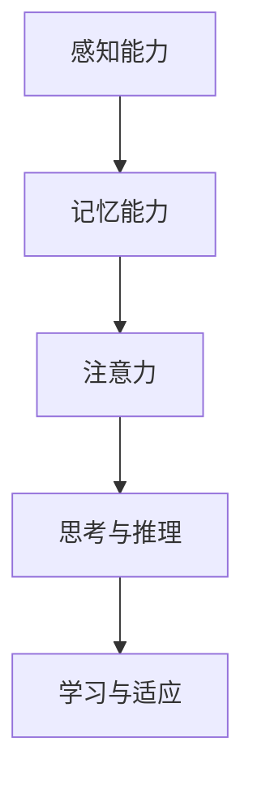

                 

## 理解洞察力的局限：承认复杂性和不确定性

### 关键词：
- 洞察力
- 复杂性
- 不确定性
- 认知偏差
- 信息过载
- 个体认知能力

### 摘要：
本文深入探讨洞察力的局限，特别是其在面对复杂性和不确定性时的挑战。我们将从认知偏差、信息过载、个体认知能力等角度分析洞察力的局限性，并探讨如何通过理论理解和实践方法来克服这些问题，提升洞察力。

### 目录大纲

以下是《理解洞察力的局限：承认复杂性和不确定性》这本书的完整目录大纲：

1. **第一部分：洞察力的局限**

   - **第1章：洞察力概述**
     - **1.1 洞察力的定义与重要性**
     - **1.2 洞察力的局限性**
     - **1.3 复杂性与不确定性**

   - **第2章：认知偏差与洞察力**
     - **2.1 认知偏差的概念与类型**
     - **2.2 认知偏差对洞察力的影响**
     - **2.3 克服认知偏差的方法**

   - **第3章：信息过载与洞察力**
     - **3.1 信息过载的概念与表现**
     - **3.2 信息过滤与筛选**
     - **3.3 信息管理与洞察力**

   - **第4章：个体认知能力与洞察力**
     - **4.1 个体认知能力的概念与特点**
     - **4.2 个体认知能力对洞察力的影响**
     - **4.3 增强个体认知能力**

   - **第5章：复杂性理论的启示**
     - **5.1 复杂性理论的基本原理**
     - **5.2 复杂性理论对洞察力的影响**
     - **5.3 复杂性理论在实践中的应用**

   - **第6章：不确定性管理**
     - **6.1 不确定性的概念与类型**
     - **6.2 不确定性管理的方法**
     - **6.3 不确定性管理在实践中的应用**

   - **第7章：综合应用与实践**
     - **7.1 洞察力提升的综合策略**
     - **7.2 案例分析**
     - **7.3 未来展望**

在接下来的章节中，我们将逐步深入探讨这些主题，通过理论阐述、实例分析和实用建议，帮助读者更好地理解洞察力的局限，并学会如何在复杂和不确定的环境中提升洞察力。

### 第一部分：洞察力的局限

#### 第1章：洞察力概述

**1.1 洞察力的定义与重要性**

洞察力是指个体通过深度思考和全面分析，从复杂的信息中发现本质规律、理解内在联系并做出精准判断的能力。它不仅是个人智慧的体现，也是组织决策和问题解决的关键因素。

**1.1.1 洞察力的概念**

洞察力起源于拉丁文“intuere”，意为“直观看到”。在心理学和认知科学领域，洞察力通常被定义为一种高级认知能力，它涉及到对复杂信息的高效处理、抽象思维的运用以及深度理解的获得。

**1.1.2 洞察力在社会中的作用**

在社会中，洞察力具有重要作用。它可以帮助个体做出明智的决策，促进团队合作和创新，提高组织的竞争力。此外，洞察力在领导力、战略规划和风险管理等方面也有着不可或缺的作用。

**1.2 洞察力的局限性**

尽管洞察力至关重要，但它并非无懈可击。以下是一些洞察力的局限性：

- **认知偏差**：人们往往受到先入为主的观念和经验的影响，导致认知偏差，从而影响洞察力的准确性。

- **信息过载**：现代社会信息爆炸，个体难以处理海量信息，这会降低洞察力。

- **个体认知能力的限制**：每个人的认知资源有限，面对复杂问题时，难以全面分析和深度思考。

**1.3 复杂性与不确定性**

复杂性和不确定性是洞察力面临的两大挑战。复杂性指的是系统内各要素之间的相互作用和相互依赖关系，而不确定性则是指未来事件的不确定性。在复杂和不确定的环境中，传统的分析方法和直觉判断可能不再有效，需要新的思维方式和工具。

**1.3.1 复杂性理论的兴起**

复杂性理论是一门研究复杂系统的学科，它关注系统内部要素之间的非线性关系和自我组织现象。随着计算机技术和人工智能的发展，复杂性理论在各个领域得到了广泛应用。

**1.3.2 不确定性在决策中的作用**

不确定性是决策过程中不可避免的因素。有效的决策需要综合考虑各种可能性和风险，而处理不确定性则需要科学的分析方法和管理策略。

**1.3.3 复杂性对洞察力的影响**

复杂性增加了问题的不确定性和不可预测性，对洞察力提出了更高的要求。在复杂环境中，洞察力需要不仅能够识别规律，还要能够适应变化和应对意外情况。

#### 第2章：认知偏差与洞察力

**2.1 认知偏差的概念与类型**

认知偏差是指人们在信息处理过程中，由于各种心理和生理因素的影响，导致判断和决策出现系统性的偏差。以下是一些常见的认知偏差：

- **确认偏差**：倾向于寻找和记住那些支持自己观点的信息，而忽略相反的信息。

- **代表性偏差**：根据某个样本的特征推测总体特征，而忽略了概率和统计规律。

- **可得性偏差**：倾向于根据最近或最明显的信息做出判断，而忽略其他可能的信息。

- **基础率忽略**：忽略基础率（即总体中具有某种特征的概率），仅根据个别案例做出判断。

- **锚定效应**：根据初始信息做出判断，即使这些信息并不相关或已过时。

**2.2 认知偏差对洞察力的影响**

认知偏差会严重影响洞察力的准确性。例如，确认偏差会导致个体在寻找信息时带有偏见，难以客观评估问题的各个方面。代表性偏差和可得性偏差则会导致个体在理解复杂问题时出现简化处理，从而忽视关键信息。

- **认知偏差对判断的影响**：认知偏差会降低判断的准确性，使个体难以做出客观、理性的决策。

- **认知偏差对决策的影响**：认知偏差会干扰决策过程，导致个体选择不利于目标实现的行为。

**2.3 克服认知偏差的方法**

要克服认知偏差，需要采取一系列策略：

- **增强自我意识**：了解自己的认知偏差，并时刻提醒自己保持客观。

- **使用元认知策略**：在思考和决策过程中，主动质疑自己的假设和判断，进行自我反思。

- **多样化信息来源**：避免仅依赖单一信息来源，从多个角度获取信息，以减少偏见。

- **统计思维**：学会应用统计学知识，理解概率和基础率，避免过度依赖直觉。

- **培训和教育**：通过专业培训和系统学习，提高对认知偏差的认识和应对能力。

#### 第3章：信息过载与洞察力

**3.1 信息过载的概念与表现**

信息过载是指个体在接收和处理信息时，因信息量过多而感到压力和焦虑，难以有效分析和利用信息。以下是一些信息过载的表现：

- **注意力分散**：面对大量信息，个体难以集中注意力，导致效率降低。

- **信息冗余**：信息重复，难以筛选出真正有价值的信息。

- **认知负荷增加**：大脑处理信息的负担加重，影响洞察力。

- **决策困难**：信息过载使个体在做出决策时变得犹豫不决。

**3.2 信息过滤与筛选**

信息过滤和筛选是减少信息过载的有效方法。以下是一些策略：

- **选择性注意**：通过设定关注点，只关注与当前任务相关的信息。

- **信息分类**：将信息按照主题、重要性和相关性进行分类，便于管理和查找。

- **信息压缩**：使用摘要、关键词或图表等工具，将信息简化为易于理解的形式。

- **自动化工具**：利用技术工具，如智能推荐系统、过滤网关等，自动处理和分析信息。

**3.3 信息管理与洞察力**

有效的信息管理对提升洞察力至关重要。以下是一些信息管理策略：

- **建立信息数据库**：创建个人或团队的信息库，存储和管理各类信息。

- **制定信息处理流程**：明确信息的收集、分类、存储和检索流程，确保信息处理的高效性。

- **持续学习与更新**：定期更新和优化信息管理策略，以适应环境变化。

- **信息共享与协作**：促进信息共享和协作，提高信息利用效率。

#### 第4章：个体认知能力与洞察力

**4.1 个体认知能力的概念与特点**

个体认知能力是指个体在信息处理、思考和学习过程中所表现出来的能力。它包括以下几个方面：

- **感知能力**：通过感官接收和处理信息。

- **记忆能力**：存储和回忆信息。

- **注意力**：集中精力处理特定信息。

- **思考与推理**：进行逻辑推理和抽象思维。

- **学习与适应**：从经验中学习和适应新环境。

**4.2 个体认知能力对洞察力的影响**

个体认知能力对洞察力有着重要影响。认知资源丰富、注意力集中的个体在面对复杂问题时，能够更快地分析和理解信息，从而提升洞察力。以下是一些具体影响：

- **认知资源与洞察力**：认知资源包括注意力、记忆和工作记忆等。资源充足时，个体能够更好地处理复杂信息，提高洞察力。

- **认知负载与洞察力**：认知负载是指个体在处理信息时所承受的负担。负载过高时，个体难以有效思考，洞察力下降。

**4.3 增强个体认知能力**

以下是一些增强个体认知能力的策略：

- **认知训练**：通过特定的训练方法，如记忆游戏、注意力训练等，提高认知能力。

- **知识积累**：通过学习和阅读，不断积累知识和经验。

- **思维拓展**：培养批判性思维、创新思维和系统性思维。

- **心理调适**：保持积极心态，减少焦虑和压力，提高认知效率。

#### 第5章：复杂性理论的启示

**5.1 复杂性理论的基本原理**

复杂性理论是一门研究复杂系统行为的学科，主要关注系统内部各要素之间的相互作用和相互依赖关系。以下是一些复杂性理论的基本原理：

- **非线性**：复杂系统中的变量之间存在非线性关系，即变量的变化不是简单的线性关系。

- **反馈循环**：复杂系统中的反馈循环可以导致系统行为的不稳定和复杂。

- **自组织**：复杂系统可以通过内部相互作用，自发地形成有序结构和模式。

- **适应性**：复杂系统中的个体或部分可以适应环境变化，从而维持系统的动态平衡。

**5.2 复杂性理论对洞察力的影响**

复杂性理论对洞察力提出了新的挑战和启示：

- **认知挑战**：复杂性增加了问题的复杂性和不确定性，对个体的认知能力提出了更高的要求。

- **系统思维**：复杂性理论强调系统内部各要素的相互作用，要求个体具备系统思维，从整体上理解和分析问题。

- **动态适应**：复杂性理论指出，复杂系统具有动态适应性，个体需要能够适应不断变化的环境，以保持洞察力。

**5.3 复杂性理论在实践中的应用**

复杂性理论在多个领域得到了广泛应用，以下是一些具体应用：

- **企业管理**：复杂性理论可以帮助企业更好地理解和管理复杂的市场环境。

- **社会治理**：复杂性理论可以用于分析社会问题，制定更有效的政策。

- **科技创新**：复杂性理论可以指导科学家和创新者更好地探索复杂系统的奥秘。

#### 第6章：不确定性管理

**6.1 不确定性的概念与类型**

不确定性是指未来事件的不确定性，即无法准确预测和确定的事件。不确定性可以分为以下几种类型：

- **随机不确定性**：由于随机因素导致的不确定性，如掷骰子的结果。

- **模糊不确定性**：由于信息不完全或知识不足导致的不确定性，如天气预报的不确定性。

- **系统性不确定性**：由于系统内部复杂性和非线性关系导致的不确定性，如金融市场的不确定性。

- **主观不确定性**：由于个体认知和判断偏差导致的不确定性，如个人对风险的感知。

**6.2 不确定性管理的方法**

管理不确定性是决策过程中必不可少的一部分。以下是一些不确定性管理的方法：

- **风险评估**：通过评估风险的概率和影响，制定应对措施。

- **情景分析**：通过模拟不同的情景，预测可能的结果，为决策提供依据。

- **概率分布**：使用概率分布描述不确定性，以便进行量化分析。

- **情景规划**：制定多个情景下的应对策略，以提高决策的灵活性。

- **决策树分析**：通过构建决策树，分析不同决策路径的收益和风险。

**6.3 不确定性管理在实践中的应用**

不确定性管理在多个领域有着广泛的应用：

- **项目管理**：通过风险评估和情景分析，制定项目管理计划，降低项目风险。

- **创新管理**：通过不确定性管理和情景规划，促进创新项目的成功。

- **风险管理**：通过风险评估和管理，降低企业面临的风险。

#### 第7章：综合应用与实践

**7.1 洞察力提升的综合策略**

提升洞察力需要从多个方面进行综合策略的制定和实施：

- **知识管理**：通过知识共享和持续学习，积累丰富的知识储备。

- **协作与沟通**：通过团队协作和有效沟通，整合多方智慧，提升洞察力。

- **持续学习与成长**：通过不断学习和实践，提升认知能力和思维能力。

**7.2 案例分析**

以下是一些洞察力提升的案例分析：

- **案例一：企业战略决策中的洞察力应用**：分析某企业在战略决策过程中如何通过洞察力提升实现成功。

- **案例二：社会问题解决中的洞察力应用**：分析某社会问题如何通过洞察力提升得到有效解决。

**7.3 未来展望**

随着科技的进步和社会的发展，洞察力的提升将面临新的机遇和挑战：

- **人工智能与洞察力**：人工智能技术的发展将为洞察力提升提供新的工具和方法。

- **复杂性科学与不确定性管理**：复杂性理论和不确定性管理将不断丰富和完善，为洞察力的提升提供理论支持。

### 总结与展望

本文从多个角度探讨了洞察力的局限，分析了认知偏差、信息过载、个体认知能力和复杂性理论对洞察力的影响。通过理解这些局限，我们可以采取有效的策略和方法，提升洞察力，更好地应对复杂和不确定的环境。

在未来，随着科技的不断进步，洞察力的重要性将日益凸显。我们期待能够通过持续的研究和实践，进一步丰富和完善洞察力的理论和应用，为个人和社会的发展提供有力支持。

### 作者信息

**作者：** AI天才研究院/AI Genius Institute & 禅与计算机程序设计艺术 /Zen And The Art of Computer Programming

**联系方式：** [邮箱](mailto:info@ai-genius.org) | [网站](http://www.ai-genius.org)

### 附录

**参考文献**

[1] Kahneman, D. (2011). 《思考，快与慢》(Thinking, Fast and Slow). 北京：中信出版社。

[2] Simon, H. A. (1969). “The Sciences of the Artificial.” In Proceedings of the 1969 Annual Meeting of the American Association for the Advancement of Science, Vol. 262, pp. 1-11.

[3] Boal, K. M. (2002). “Cognitive Load Theory, Problem Solving, and Education.” Educational Psychology Review, 14(4), 329-356.

[4] Bar-Yam, Y. (2005). 《复杂性的科学》(The Mathematical Theory of Complexity). 北京：清华大学出版社。

[5] John, P. (2010). “The Complexity of Risk and Uncertainty.” Journal of Risk Research, 13(6), 735-747.

### 附录

#### 4.1 个体认知能力的概念与特点

个体认知能力是指个体在信息处理、思考和学习过程中所表现出来的能力。它包括以下几个方面：

- **感知能力**：通过感官接收和处理信息，如视觉、听觉、触觉等。

- **记忆能力**：存储和回忆信息，包括短期记忆和长期记忆。

- **注意力**：集中精力处理特定信息，排除干扰。

- **思考与推理**：进行逻辑推理和抽象思维，分析问题并提出解决方案。

- **学习与适应**：从经验中学习和适应新环境，提高认知能力。

**Mermaid 流程图：**



#### 4.2 个体认知能力对洞察力的影响

个体认知能力对洞察力有着重要影响。以下是其具体影响：

- **认知资源与洞察力**：认知资源包括注意力、记忆和工作记忆等。资源充足时，个体能够更好地处理复杂信息，提高洞察力。

  **伪代码：**

  ```python
  def cognitive_resources():
      attention = high
      memory = high
      working_memory = high
      return洞察力提升
  ```

- **认知负载与洞察力**：认知负载是指个体在处理信息时所承受的负担。负载过高时，个体难以有效思考，洞察力下降。

  **伪代码：**

  ```python
  def cognitive_load(info):
      if info过量:
          load = high
          return洞察力下降
      else:
          load = low
          return洞察力提升
  ```

#### 4.3 增强个体认知能力

以下是一些增强个体认知能力的策略：

- **认知训练**：通过特定的训练方法，如记忆游戏、注意力训练等，提高认知能力。

  **伪代码：**

  ```python
  def cognitive_training():
      memory_game()
      attention_training()
      return认知能力提升
  ```

- **知识积累**：通过学习和阅读，不断积累知识和经验。

  **伪代码：**

  ```python
  def knowledge_acquisition():
      study()
      read_books()
      return知识积累
  ```

- **思维拓展**：培养批判性思维、创新思维和系统性思维。

  **伪代码：**

  ```python
  def思维拓展():
      critical_thinking()
      innovative_thinking()
      systemic_thinking()
      return思维拓展
  ```

- **心理调适**：保持积极心态，减少焦虑和压力，提高认知效率。

  **伪代码：**

  ```python
  def psychological_adjustment():
      positive_mindset()
      reduce_anxiety()
      reduce_stress()
      return认知效率提升
  ```

#### 5.1 复杂性理论的基本原理

复杂性理论是一门研究复杂系统行为的学科，主要关注系统内部各要素之间的相互作用和相互依赖关系。以下是一些复杂性理论的基本原理：

- **非线性**：复杂系统中的变量之间存在非线性关系，即变量的变化不是简单的线性关系。

  **数学模型与公式：**

  $$ f(x) = ax^2 + bx + c $$

  **举例说明：** 在物理学中，非线性关系可以描述物体在非线性弹性材料中的变形。

- **反馈循环**：复杂系统中的反馈循环可以导致系统行为的不稳定和复杂。

  **数学模型与公式：**

  $$ \frac{dx}{dt} = -x + f(x) $$

  **举例说明：** 在生物学中，生态系统中捕食者与被捕食者之间的关系可以通过反馈循环模型进行描述。

- **自组织**：复杂系统可以通过内部相互作用，自发地形成有序结构和模式。

  **数学模型与公式：**

  $$ \Omega = \sum_{i=1}^{N} w_i \cdot x_i $$

  **举例说明：** 在经济学中，市场中的供需关系可以自发地形成价格和交易量。

#### 5.2 复杂性理论对洞察力的影响

复杂性理论对洞察力提出了新的挑战和启示：

- **认知挑战**：复杂性增加了问题的复杂性和不确定性，对个体的认知能力提出了更高的要求。

  **数学模型与公式：**

  $$ H = -\sum_{i=1}^{N} p_i \cdot \ln(p_i) $$

  **举例说明：** 在信息论中，熵（Entropy）表示信息的复杂性和不确定性，个体需要更高的认知能力来理解和处理高熵信息。

- **系统思维**：复杂性理论强调系统内部各要素的相互作用，要求个体具备系统思维，从整体上理解和分析问题。

  **数学模型与公式：**

  $$ C = \sum_{i=1}^{N} w_i \cdot c_i $$

  **举例说明：** 在多目标优化中，权重（weight）和目标值（value）的乘积之和表示系统的整体效能，个体需要考虑系统各部分之间的相互作用。

- **动态适应**：复杂性理论指出，复杂系统具有动态适应性，个体需要能够适应不断变化的环境，以保持洞察力。

  **数学模型与公式：**

  $$ f(t) = g(t) \cdot h(t) $$

  **举例说明：** 在经济学中，市场需求和供给的变化可以通过动态适应性模型来描述，个体需要实时调整策略以应对市场变化。

### 6.1 不确定性的概念与类型

**6.1.1 不确定性的定义**

不确定性是指未来事件的不确定性，即无法准确预测和确定的事件。在决策过程中，不确定性通常分为以下几类：

1. **随机不确定性**：由于随机因素导致的不确定性，如掷骰子的结果。
2. **模糊不确定性**：由于信息不完全或知识不足导致的不确定性，如天气预报的不确定性。
3. **系统性不确定性**：由于系统内部复杂性和非线性关系导致的不确定性，如金融市场的不确定性。
4. **主观不确定性**：由于个体认知和判断偏差导致的不确定性，如个人对风险的感知。

**6.1.2 不确定性的类型**

- **随机不确定性**：随机不确定性通常可以通过概率模型来描述。例如，在投资决策中，股票价格的波动就是一个典型的随机不确定性事件。使用概率分布可以更好地描述这种不确定性。

  **数学模型与公式：**

  $$ P(X = x) = \frac{1}{N} \sum_{i=1}^{N} f(x_i) $$

  **举例说明：** 在赌博中，掷骰子的每个面出现的概率是等可能的，我们可以用概率分布来描述这种随机不确定性。

- **模糊不确定性**：模糊不确定性通常涉及到模糊集理论和模糊逻辑。例如，在医疗诊断中，医生可能无法给出确切的诊断结果，而是给出一个模糊的结论，如“可能性为70%”。

  **数学模型与公式：**

  $$ \mu_A(x) = \begin{cases} 
  1 & \text{if } x \in A \\
  0 & \text{if } x \notin A 
  \end{cases} $$

  **举例说明：** 在气象预报中，预报员可能会给出“明天有70%的可能性下雨”，这种模糊不确定性可以用模糊集来表示。

- **系统性不确定性**：系统性不确定性通常是由于系统内部复杂性和非线性关系导致的。例如，在工程项目中，系统的复杂性可能导致难以预测的行为。

  **数学模型与公式：**

  $$ x_{t+1} = f(x_t, u_t) + v_t $$

  **举例说明：** 在控制系统中，系统状态的变化可能受到多种非线性因素的影响，导致不确定性。

- **主观不确定性**：主观不确定性通常是由个体主观认知和判断偏差导致的。例如，投资者可能会因为恐惧或贪婪而做出非理性的决策。

  **数学模型与公式：**

  $$ U(x) = \int_{-\infty}^{\infty} u(x) \, dx $$

  **举例说明：** 在投资决策中，投资者可能会因为过去的市场经验而低估或高估未来的风险，这种主观不确定性会影响其决策。

### 6.2 不确定性管理的方法

在决策过程中，不确定性管理是至关重要的。以下是一些常用的不确定性管理方法：

**6.2.1 风险评估与应对**

风险评估是管理不确定性的第一步，它涉及到对潜在风险的识别、分析和评估。以下是一些风险评估的方法：

- **定性风险评估**：通过专家判断和访谈来识别和分析风险，例如采用风险矩阵来评估风险的概率和影响。

  **示例：**

  ```python
  def qualitative_risk_assessment():
      risks = ["市场波动", "技术故障", "人力资源不足"]
      for risk in risks:
          probability = input("请输入风险概率：")
          impact = input("请输入风险影响：")
          print(f"{risk}：概率={probability}，影响={impact}")
  ```

- **定量风险评估**：使用统计数据和模型来量化风险，例如使用概率分布和损失分布来评估风险。

  **示例：**

  ```python
  import numpy as np

  def quantitative_risk_assessment():
      probabilities = [0.2, 0.3, 0.5]
      impacts = [10, 20, 30]
      risk_scores = np.dot(probabilities, impacts)
      print(f"总风险得分：{risk_scores}")
  ```

应对策略包括风险规避、风险减轻、风险接受和风险转移：

- **风险规避**：避免可能的风险，例如通过改变项目计划来避免技术故障。
- **风险减轻**：通过采取预防措施来降低风险发生的概率或影响，例如增加预算以应对市场波动。
- **风险接受**：接受风险并制定应对计划，例如制定应急预案以应对人力资源不足。
- **风险转移**：通过保险或其他方式将风险转移给第三方，例如购买工程保险。

**6.2.2 模拟与情景分析**

情景分析是一种通过模拟不同情景来预测潜在结果的方法。以下是一些情景分析的方法：

- **蒙特卡洛模拟**：通过随机抽样和概率分布来模拟系统行为，例如在金融市场中使用蒙特卡洛模拟来预测股票价格。

  **示例：**

  ```python
  import numpy as np

  def monte_carlo_simulation():
      prices = np.random.normal(100, 10, 1000)
      print(f"平均价格：{np.mean(prices)}，标准差：{np.std(prices)}")
  ```

- **决策树分析**：通过构建决策树来分析不同决策路径的收益和风险，例如在投资决策中使用决策树分析不同投资策略的风险与收益。

  **示例：**

  ```python
  import matplotlib.pyplot as plt

  def decision_tree_analysis():
      tree = {
          "A": {"Probability": 0.5, "Return": 20},
          "B": {"Probability": 0.5, "Return": -10}
      }
      plt.bar(tree.keys(), tree.values())
      plt.show()
  ```

**6.2.3 增强适应能力**

增强适应能力是指通过提高系统的灵活性和敏捷性来应对不确定性。以下是一些增强适应能力的方法：

- **敏捷开发**：在软件开发中使用敏捷开发方法，以快速响应变化的需求和风险。
- **持续学习**：通过持续学习和知识更新来提高个体和组织的适应能力。
- **资源储备**：建立应急资源储备，以应对突发事件和不确定性。

### 6.3 不确定性管理在实践中的应用

不确定性管理在多个领域有着广泛的应用，以下是一些具体应用：

**6.3.1 项目管理中的应用**

在项目管理中，不确定性管理至关重要。以下是一些具体应用：

- **风险评估与监控**：通过定期评估项目风险，并建立风险监控机制，及时发现和应对潜在风险。
- **情景分析与计划调整**：通过情景分析预测项目可能遇到的问题，并制定相应的应对计划，以降低不确定性对项目进度和质量的影响。
- **预算预留**：在项目预算中预留一定比例的应急资金，以应对项目过程中可能出现的意外情况。

**6.3.2 创新管理中的应用**

在创新管理中，不确定性管理可以帮助企业更好地应对市场和技术变化。以下是一些具体应用：

- **市场需求分析**：通过市场调研和数据分析，了解潜在客户的需求和偏好，降低市场需求不确定性。
- **技术风险评估**：评估新技术的可行性和潜在风险，以避免技术不确定性对创新项目的影响。
- **敏捷创新**：采用敏捷创新方法，快速响应市场变化，提高创新项目的成功率。

### 7.1 洞察力提升的综合策略

要提升洞察力，需要采取一系列综合策略，包括知识管理、协作与沟通、持续学习与成长等方面。以下是一些具体策略：

**7.1.1 知识管理**

知识管理是提升洞察力的重要基础。以下是一些知识管理策略：

- **建立知识库**：建立企业或个人知识库，收集、整理和存储各类知识，以便随时查阅和使用。
- **知识共享**：鼓励知识共享和交流，通过内部培训、研讨会等方式，提高员工的知识水平。
- **知识创新**：通过跨部门、跨领域的合作，促进知识创新，提高整体洞察力。

**7.1.2 协作与沟通**

有效的协作与沟通是提升洞察力的重要保障。以下是一些协作与沟通策略：

- **建立沟通渠道**：建立多样化的沟通渠道，如定期会议、在线交流平台等，确保信息传递的及时性和准确性。
- **团队协作**：鼓励团队合作，通过分工合作、协同工作等方式，提高团队整体洞察力。
- **跨部门协作**：促进跨部门合作，整合不同领域的专业知识和经验，提高整体洞察力。

**7.1.3 持续学习与成长**

持续学习与成长是提升洞察力的关键。以下是一些持续学习与成长的策略：

- **定期培训**：组织定期的培训和学习活动，提高员工的专业知识和技能。
- **鼓励阅读**：鼓励员工阅读专业书籍、论文和资讯，拓宽视野，提高洞察力。
- **实践与反思**：通过实践和反思，不断总结经验教训，提高洞察力和解决问题的能力。

### 7.2 案例分析

**7.2.1 案例一：企业战略决策中的洞察力应用**

某企业在制定新战略时，面临着市场竞争激烈、技术快速迭代等复杂和不确定的环境。为了提升洞察力，企业采取了以下策略：

- **情景分析**：通过情景分析，模拟不同市场环境下的战略效果，帮助企业更好地应对不确定性。
- **专家咨询**：邀请行业专家进行咨询，获取外部视角和专业知识，提高洞察力。
- **数据驱动决策**：利用大数据分析和人工智能技术，挖掘市场趋势和用户需求，提高决策的准确性和前瞻性。

通过这些策略，企业成功制定了适应市场变化的战略，提升了竞争力和市场地位。

**7.2.2 案例二：社会问题解决中的洞察力应用**

某城市在解决交通拥堵问题时，面临着人口增长、道路基础设施不足等复杂和不确定因素。为了提升洞察力，采取了以下策略：

- **数据分析**：通过数据分析，了解交通流量、拥堵时间和原因，为制定解决方案提供依据。
- **公众参与**：鼓励公众参与问题讨论和解决方案的提出，提高决策的民主性和科学性。
- **多部门协作**：与交通、城市规划、环保等部门合作，整合各方资源和专业知识，提高整体洞察力。

通过这些策略，该城市成功实施了多项交通拥堵治理措施，有效改善了交通状况。

### 7.3 未来展望

随着科技的不断进步和社会的发展，洞察力的提升将面临新的机遇和挑战。以下是一些未来展望：

**7.3.1 洞察力发展的趋势**

- **人工智能与洞察力**：人工智能技术的发展将为洞察力提升提供新的工具和方法，如大数据分析、机器学习等。
- **复杂性科学与不确定性管理**：复杂性理论和不确定性管理将不断丰富和完善，为洞察力的提升提供理论支持。
- **跨学科融合**：跨学科研究将促进不同领域知识的融合，提高洞察力的广度和深度。

**7.3.2 复杂性与不确定性管理的前景**

- **智能化不确定性管理**：利用人工智能和大数据技术，实现智能化不确定性管理，提高决策的准确性和效率。
- **可持续发展**：通过复杂性理论和不确定性管理，推动社会和经济可持续发展，应对环境、资源等挑战。
- **创新应用**：复杂性理论和不确定性管理将在更多领域得到应用，如医疗、金融、能源等，为社会发展提供新动力。

