                 

### 第1章：认知神经科学的定义与发展

#### 1.1 认知神经科学的定义

认知神经科学（Cognitive Neuroscience）是一门结合了神经科学和认知科学的跨学科领域，旨在探索大脑如何支持认知功能，如感知、记忆、学习、语言、思维和问题解决。它采用实验方法、神经影像技术和其他神经科学工具来研究大脑的结构、功能和动态变化，以揭示认知过程的神经基础。

认知神经科学的核心概念包括认知功能与大脑结构的对应关系、神经信号传递机制、神经可塑性以及大脑网络的功能整合。通过这些研究，认知神经科学旨在理解大脑如何执行复杂的认知任务，并探究各种认知障碍和神经疾病的根源。

#### 1.2 认知神经科学的发展

认知神经科学的发展可以追溯到20世纪中期。当时，神经科学和认知科学开始逐渐分离，各自形成了独立的学科。然而，随着技术的进步，尤其是功能性磁共振成像（fMRI）和电生理技术的发展，研究者能够更加精确地观察大脑活动，从而推动了认知神经科学的发展。

在早期，认知神经科学的研究主要集中在局部脑区与特定认知功能的关系上。例如，研究者发现，前额叶与决策制定和规划有关，颞叶与语言理解有关，顶叶与空间认知有关。然而，随着技术的进步，研究者开始关注大脑网络的功能整合，即不同脑区之间的协同作用如何支持认知过程。

#### 1.3 洞察力与神经科学的联系

洞察力（Insight）是一种高级认知能力，涉及对复杂信息的快速理解和决策。认知神经科学研究揭示，洞察力与大脑前额叶、顶叶和颞叶等区域的活动密切相关。这些脑区在处理复杂问题、进行假设检验和决策制定中发挥着关键作用。

例如，研究发现，前额叶的执行功能与洞察力的形成有关，该区域的活动有助于进行复杂的逻辑推理和问题解决。此外，顶叶的神经元活动与空间认知和逻辑推理有关，颞叶的活动则与语言理解和记忆形成有关。这些脑区的协同作用有助于个体在面对复杂问题时，能够迅速找到解决方案。

综上所述，认知神经科学为我们理解洞察力的神经基础提供了重要的视角。通过深入研究大脑的结构和功能，我们可以更好地理解洞察力的本质，并为教育和职场中培养洞察力提供科学依据。

#### 1.1 认知神经科学的定义

认知神经科学是一门结合了神经科学和认知科学的跨学科领域，旨在探索大脑如何支持认知功能，如感知、记忆、学习、语言、思维和问题解决。它采用实验方法、神经影像技术和其他神经科学工具来研究大脑的结构、功能和动态变化，以揭示认知过程的神经基础。

认知神经科学的核心概念包括认知功能与大脑结构的对应关系、神经信号传递机制、神经可塑性以及大脑网络的功能整合。通过这些研究，认知神经科学旨在理解大脑如何执行复杂的认知任务，并探究各种认知障碍和神经疾病的根源。

#### 1.2 认知神经科学的发展

认知神经科学的发展可以追溯到20世纪中期。当时，神经科学和认知科学开始逐渐分离，各自形成了独立的学科。然而，随着技术的进步，尤其是功能性磁共振成像（fMRI）和电生理技术的发展，研究者能够更加精确地观察大脑活动，从而推动了认知神经科学的发展。

在早期，认知神经科学的研究主要集中在局部脑区与特定认知功能的关系上。例如，研究者发现，前额叶与决策制定和规划有关，颞叶与语言理解有关，顶叶与空间认知有关。然而，随着技术的进步，研究者开始关注大脑网络的功能整合，即不同脑区之间的协同作用如何支持认知过程。

#### 1.3 洞察力与神经科学的联系

洞察力（Insight）是一种高级认知能力，涉及对复杂信息的快速理解和决策。认知神经科学研究揭示，洞察力与大脑前额叶、顶叶和颞叶等区域的活动密切相关。这些脑区在处理复杂问题、进行假设检验和决策制定中发挥着关键作用。

例如，研究发现，前额叶的执行功能与洞察力的形成有关，该区域的活动有助于进行复杂的逻辑推理和问题解决。此外，顶叶的神经元活动与空间认知和逻辑推理有关，颞叶的活动则与语言理解和记忆形成有关。这些脑区的协同作用有助于个体在面对复杂问题时，能够迅速找到解决方案。

综上所述，认知神经科学为我们理解洞察力的神经基础提供了重要的视角。通过深入研究大脑的结构和功能，我们可以更好地理解洞察力的本质，并为教育和职场中培养洞察力提供科学依据。

#### 图 1.1：认知神经科学的基本概念和核心研究方法

该图展示了认知神经科学的核心概念、研究方法以及其应用领域。认知功能与大脑结构的关系是认知神经科学研究的基石，而神经信号传递机制、神经可塑性和大脑网络的功能整合则是理解认知过程的关键。通过神经影像技术和电生理技术，研究者能够深入了解大脑活动，为认知神经科学的研究提供有力支持。

#### 1.2 认知神经科学的发展

认知神经科学的发展历程可以追溯到20世纪中期，当时神经科学和认知科学开始逐渐分离，各自形成了独立的学科。然而，随着技术的进步，尤其是功能性磁共振成像（fMRI）和电生理技术的发展，认知神经科学开始迅速发展，成为一门跨学科的研究领域。

在早期，认知神经科学的研究主要集中在局部脑区与特定认知功能的关系上。例如，研究者通过电生理技术和神经影像技术发现，前额叶与决策制定和规划有关，颞叶与语言理解有关，顶叶与空间认知有关。这些发现揭示了不同脑区在特定认知功能中的作用，为认知神经科学奠定了基础。

然而，随着技术的进步，研究者开始关注大脑网络的功能整合，即不同脑区之间的协同作用如何支持认知过程。功能性磁共振成像（fMRI）和脑电图（EEG）等技术的应用使得研究者能够更精确地观察大脑活动，并发现大脑网络在认知任务中的动态变化。

#### 图 1.2：大脑网络的功能整合

该图展示了大脑网络的功能整合，其中默认网络、执行网络、注意网络、感知网络、情绪网络、记忆网络和语言网络等在认知过程中扮演重要角色。大脑网络的协同作用使得个体能够有效地处理复杂信息，进行问题解决和决策制定。

#### 1.3 洞察力与神经科学的联系

洞察力（Insight）是一种高级认知能力，涉及对复杂信息的快速理解和决策。认知神经科学研究揭示，洞察力与大脑前额叶、顶叶和颞叶等区域的活动密切相关。这些脑区在处理复杂问题、进行假设检验和决策制定中发挥着关键作用。

例如，研究发现，前额叶的执行功能与洞察力的形成有关，该区域的活动有助于进行复杂的逻辑推理和问题解决。此外，顶叶的神经元活动与空间认知和逻辑推理有关，颞叶的活动则与语言理解和记忆形成有关。这些脑区的协同作用有助于个体在面对复杂问题时，能够迅速找到解决方案。

#### 图 1.3：洞察力与神经科学的联系

该图展示了洞察力与神经科学的联系，其中前额叶、顶叶和颞叶等脑区在处理复杂问题、进行假设检验和决策制定中发挥着关键作用。这些脑区的协同作用使得个体能够有效地处理复杂信息，从而实现洞察力。

#### 1.2 认知神经科学的发展

认知神经科学的发展历程可以追溯到20世纪中期，当时神经科学和认知科学开始逐渐分离，各自形成了独立的学科。然而，随着技术的进步，尤其是功能性磁共振成像（fMRI）和电生理技术的发展，认知神经科学开始迅速发展，成为一门跨学科的研究领域。

在早期，认知神经科学的研究主要集中在局部脑区与特定认知功能的关系上。例如，研究者通过电生理技术和神经影像技术发现，前额叶与决策制定和规划有关，颞叶与语言理解有关，顶叶与空间认知有关。这些发现揭示了不同脑区在特定认知功能中的作用，为认知神经科学奠定了基础。

然而，随着技术的进步，研究者开始关注大脑网络的功能整合，即不同脑区之间的协同作用如何支持认知过程。功能性磁共振成像（fMRI）和脑电图（EEG）等技术的应用使得研究者能够更精确地观察大脑活动，并发现大脑网络在认知任务中的动态变化。

#### 图 1.2：大脑网络的功能整合

该图展示了大脑网络的功能整合，其中默认网络、执行网络、注意网络、感知网络、情绪网络、记忆网络和语言网络等在认知过程中扮演重要角色。大脑网络的协同作用使得个体能够有效地处理复杂信息，进行问题解决和决策制定。

#### 1.3 洞察力与神经科学的联系

洞察力（Insight）是一种高级认知能力，涉及对复杂信息的快速理解和决策。认知神经科学研究揭示，洞察力与大脑前额叶、顶叶和颞叶等区域的活动密切相关。这些脑区在处理复杂问题、进行假设检验和决策制定中发挥着关键作用。

例如，研究发现，前额叶的执行功能与洞察力的形成有关，该区域的活动有助于进行复杂的逻辑推理和问题解决。此外，顶叶的神经元活动与空间认知和逻辑推理有关，颞叶的活动则与语言理解和记忆形成有关。这些脑区的协同作用有助于个体在面对复杂问题时，能够迅速找到解决方案。

#### 图 1.3：洞察力与神经科学的联系

该图展示了洞察力与神经科学的联系，其中前额叶、顶叶和颞叶等脑区在处理复杂问题、进行假设检验和决策制定中发挥着关键作用。这些脑区的协同作用使得个体能够有效地处理复杂信息，从而实现洞察力。

### 第2章：大脑结构与其功能

#### 2.1 大脑的基本结构

大脑是人体最重要的器官之一，由多个不同的区域组成，每个区域都有其特定的功能和结构。大脑可以分为三个主要部分：大脑皮层、脑干和小脑。

- **大脑皮层**：大脑皮层是大脑最外层的一层，也是最复杂的一部分。它分为两个半球，负责高级认知功能，如思考、感知、记忆和语言。大脑皮层可以分为不同的脑区，如前额叶、顶叶、颞叶和枕叶，每个脑区都有其特定的功能。

- **脑干**：脑干连接大脑和脊髓，负责控制基本生命功能，如心跳、呼吸和消化。脑干还包括一些与运动控制、感觉和认知相关的结构，如丘脑和红核。

- **小脑**：小脑位于大脑的后下方，主要功能是协调运动和维持平衡。小脑还与认知功能有关，如注意力、学习和记忆。

#### 2.2 与洞察力相关的大脑区域

洞察力是一种高级认知能力，涉及对复杂信息的快速理解和决策。认知神经科学研究揭示了多个大脑区域在洞察力中的作用，其中最重要的包括：

- **前额叶**：前额叶是大脑皮层的一部分，主要负责执行功能，如决策制定、问题解决、规划和思考。前额叶与洞察力的形成密切相关，因为该区域参与了假设检验和逻辑推理。

- **顶叶**：顶叶与空间认知和逻辑推理有关，也是洞察力的重要组成部分。顶叶的神经元活动有助于处理复杂的抽象信息，从而实现洞察力。

- **颞叶**：颞叶与语言理解和记忆形成有关，对洞察力也有重要影响。颞叶中的神经元活动有助于从语言和其他形式的信息中提取意义。

#### 2.3 大脑功能区域之间的交互

大脑功能区域之间的交互对于实现洞察力至关重要。不同脑区之间的协同作用使得个体能够有效地处理复杂信息，进行问题解决和决策制定。

例如，前额叶与顶叶之间的交互有助于整合不同类型的信息，从而促进洞察力的形成。前额叶的执行功能可以指导顶叶进行复杂的逻辑推理，而顶叶的空间认知能力可以帮助前额叶进行问题解决。

此外，前额叶与颞叶之间的交互也对洞察力有重要影响。前额叶的决策制定能力可以指导颞叶从语言和其他形式的信息中提取意义，从而实现洞察力。

总之，大脑功能区域之间的交互是洞察力形成的关键。通过深入研究大脑的结构和功能，我们可以更好地理解洞察力的本质，并为教育和职场中培养洞察力提供科学依据。

#### 图 2.1：大脑的基本结构

该图展示了大脑的基本结构，包括大脑皮层、脑干和小脑。大脑皮层是大脑最外层的一层，分为前额叶、顶叶、颞叶、枕叶等不同的脑区。脑干连接大脑和脊髓，负责控制基本生命功能。小脑位于大脑的后下方，主要功能是协调运动和维持平衡。

#### 2.2 与洞察力相关的大脑区域

洞察力是一种高级认知能力，涉及对复杂信息的快速理解和决策。认知神经科学研究揭示了多个大脑区域在洞察力中的作用，其中最重要的包括：

- **前额叶**：前额叶是大脑皮层的一部分，主要负责执行功能，如决策制定、问题解决、规划和思考。前额叶与洞察力的形成密切相关，因为该区域参与了假设检验和逻辑推理。

- **顶叶**：顶叶与空间认知和逻辑推理有关，也是洞察力的重要组成部分。顶叶的神经元活动有助于处理复杂的抽象信息，从而实现洞察力。

- **颞叶**：颞叶与语言理解和记忆形成有关，对洞察力也有重要影响。颞叶中的神经元活动有助于从语言和其他形式的信息中提取意义。

#### 图 2.2：与洞察力相关的大脑区域

该图展示了与洞察力相关的大脑区域。前额叶与决策制定、问题解决、规划思考和假设检验密切相关，这些功能共同促进了洞察力的形成。顶叶参与空间认知和逻辑推理，颞叶则与语言理解和记忆形成有关，这些脑区之间的协同作用对于洞察力的实现至关重要。

#### 2.3 大脑功能区域之间的交互

大脑功能区域之间的交互对于实现洞察力至关重要。不同脑区之间的协同作用使得个体能够有效地处理复杂信息，进行问题解决和决策制定。

例如，前额叶与顶叶之间的交互有助于整合不同类型的信息，从而促进洞察力的形成。前额叶的执行功能可以指导顶叶进行复杂的逻辑推理，而顶叶的空间认知能力可以帮助前额叶进行问题解决。

此外，前额叶与颞叶之间的交互也对洞察力有重要影响。前额叶的决策制定能力可以指导颞叶从语言和其他形式的信息中提取意义，从而实现洞察力。

总之，大脑功能区域之间的交互是洞察力形成的关键。通过深入研究大脑的结构和功能，我们可以更好地理解洞察力的本质，并为教育和职场中培养洞察力提供科学依据。

#### 图 2.3：大脑功能区域之间的交互

该图展示了大脑功能区域之间的交互，包括前额叶、顶叶和颞叶。这些脑区通过协同作用，共同实现复杂的问题解决和洞察力形成。例如，前额叶的决策制定能力可以指导颞叶从语言和其他形式的信息中提取意义，而顶叶的空间认知能力可以帮助前额叶进行问题解决。这种协同作用使得个体能够有效地处理复杂信息，从而实现洞察力。

### 第3章：神经递质与洞察力

#### 3.1 神经递质的基本概念

神经递质（Neurotransmitters）是一种化学物质，负责在大脑神经元之间传递信号。它们通过突触前神经元释放，作用于突触后神经元的受体，从而传递神经信号。神经递质种类繁多，包括多巴胺、去甲肾上腺素、5-羟色胺、谷氨酸等。

- **多巴胺**：多巴胺与奖励和动机有关，参与决策制定、注意力调节和情绪控制。多巴胺的异常与精神分裂症、注意力缺陷多动障碍（ADHD）等疾病有关。

- **去甲肾上腺素**：去甲肾上腺素是一种兴奋性神经递质，与注意力、警觉性和情绪调节有关。去甲肾上腺素的异常与焦虑症、抑郁症等情绪障碍有关。

- **5-羟色胺**：5-羟色胺（也称为血清素）与情绪稳定、食欲和睡眠有关。5-羟色胺的异常与抑郁症、焦虑症等情绪障碍以及进食障碍有关。

- **谷氨酸**：谷氨酸是大脑中最主要的兴奋性神经递质，与学习、记忆和认知功能有关。谷氨酸的异常与神经退行性疾病，如阿尔茨海默病和帕金森病有关。

#### 3.2 神经递质与大脑功能的联系

神经递质在大脑功能中扮演着关键角色，调节神经元的活动和通信。不同神经递质在特定脑区发挥着不同的作用，从而影响认知功能。

- **多巴胺**：多巴胺与前额叶的功能密切相关，涉及决策制定、动机和注意力调节。研究发现，前额叶的多巴胺活动与洞察力有关，缺乏多巴胺可能导致洞察力下降。

- **去甲肾上腺素**：去甲肾上腺素与注意力和情绪调节有关。去甲肾上腺素的活动增强可以改善注意力，而过度活动可能导致焦虑和压力。

- **5-羟色胺**：5-羟色胺与情绪稳定、睡眠和食欲有关。5-羟色胺的异常与情绪障碍有关，例如抑郁症和焦虑症。研究表明，5-羟色胺的调节可能对提高洞察力有重要作用。

- **谷氨酸**：谷氨酸与学习、记忆和认知功能有关。谷氨酸的异常与神经退行性疾病有关，例如阿尔茨海默病和帕金森病。

#### 3.3 洞察力相关的神经递质

洞察力是一种高级认知能力，涉及对复杂信息的快速理解和决策。研究表明，多种神经递质在洞察力的形成和调节中发挥着重要作用。

- **多巴胺**：多巴胺与前额叶的执行功能密切相关，涉及问题解决和决策制定。多巴胺的异常可能导致洞察力下降，例如，精神分裂症患者的多巴胺功能可能异常。

- **5-羟色胺**：5-羟色胺与情绪稳定和注意力调节有关，对洞察力有重要影响。5-羟色胺的异常可能导致情绪障碍，从而影响洞察力。

- **谷氨酸**：谷氨酸与学习、记忆和认知功能有关，可能对洞察力有调节作用。谷氨酸的异常与神经退行性疾病有关，可能影响洞察力。

总之，神经递质在大脑功能中扮演着关键角色，调节神经元的活动和通信。多种神经递质在洞察力的形成和调节中发挥着重要作用，为理解洞察力的神经基础提供了新的视角。

#### 图 3.1：神经递质与大脑功能的联系

该图展示了神经递质与大脑功能的联系。多巴胺与决策制定、动机和注意力调节有关，去甲肾上腺素与注意力和情绪调节有关，5-羟色胺与情绪稳定、睡眠调节和抑郁症有关，谷氨酸与学习和记忆以及神经退行性疾病有关。这些神经递质在不同脑区发挥着不同的作用，共同调节大脑功能。

### 第4章：神经可塑性及其在洞察力中的作用

#### 4.1 神经可塑性的定义与机制

神经可塑性（Neuroplasticity）是指大脑神经元和神经网络在结构和功能上的适应性变化。这种适应性可以通过学习和经验来实现。神经可塑性是大脑在生命过程中不断调整和适应环境变化的能力，使得大脑能够适应新的挑战和需求。

神经可塑性主要包括以下几种机制：

- **突触可塑性**：突触是神经元之间的连接点，突触可塑性涉及突触强度的变化，即突触前神经元通过增加或减少释放神经递质来增强或减弱突触传递信号的能力。

- **突触发生**：突触发生是指新突触的形成，这通常发生在大脑发育过程中，但也可以通过学习和经验在成年大脑中发生。

- **轴突重塑**：轴突重塑是指神经元轴突的长度和方向发生变化，这可以改变神经网络的连接模式。

- **神经网络重组**：神经网络重组是指大脑中的神经网络在结构和功能上的重新组织，这可以发生在学习和记忆过程中。

#### 4.2 神经可塑性如何影响洞察力

神经可塑性在洞察力的形成和调节中起着至关重要的作用。洞察力是一种高级认知能力，涉及对复杂信息的快速理解和决策。以下是如何通过神经可塑性来影响洞察力的几个方面：

- **增强大脑网络的连接**：通过学习和经验，大脑中的不同网络可以更加紧密地连接，从而提高复杂信息处理的能力。这种连接增强有助于提高洞察力。

- **提高突触效率**：通过突触可塑性，突触传递信号的效率可以提升，这意味着神经元之间的通信更加高效。这种效率提高有助于加速复杂问题的解决，从而促进洞察力。

- **促进新的神经网络形成**：神经可塑性可以促进新的神经网络的形成，这有助于大脑更好地处理复杂的信息和任务。这种新网络的形成可以扩展大脑的认知能力，从而提高洞察力。

- **调节神经递质活动**：神经可塑性可以调节神经递质的活动，这有助于维持大脑内部的平衡。例如，多巴胺和5-羟色胺等神经递质的调节可以改善情绪和注意力，从而提高洞察力。

总之，神经可塑性是大脑在适应新环境和挑战过程中的一种基本机制。通过神经可塑性，大脑能够不断调整其结构和功能，从而提高洞察力。理解和利用神经可塑性，可以为教育和职场中培养洞察力提供新的策略和方法。

#### 图 4.1：神经可塑性的机制

该图展示了神经可塑性的机制，包括突触可塑性、突触发生、轴突重塑和神经网络重组。这些机制共同作用，使大脑能够适应新的环境和挑战，提高复杂信息处理能力和认知能力，从而促进洞察力的提升。

### 第5章：大脑网络与洞察力的关系

#### 5.1 大脑网络的基本概念

大脑网络（Brain Networks）是指在大脑中相互连接并协同工作的神经元群体。这些网络通过复杂的交互和通信，共同执行各种认知功能，如感知、记忆、学习、思考和解谜。大脑网络可以被视为大脑功能的模块，它们在不同的认知任务中发挥着关键作用。

大脑网络的基本概念包括：

- **连接性**：连接性是指神经元之间通过突触连接形成网络的能力。高连接性意味着网络中的节点（神经元）之间的联系更加紧密，从而提高了信息传递的速度和效率。

- **功能整合**：功能整合是指大脑网络中的不同区域通过协同工作，共同完成复杂的认知任务。例如，视觉处理网络、语言处理网络和运动控制网络可以协同工作，实现视觉引导的动作。

- **动态性**：大脑网络是动态的，其连接性和功能可以随着时间和任务的需求而变化。这种动态性使得大脑能够灵活地适应不同的环境和挑战。

- **效率**：大脑网络的效率是指网络在执行认知任务时的有效性和效率。高效的神经网络可以更快、更准确地处理信息，从而提高认知能力。

#### 5.2 洞察力与大脑网络的联系

洞察力是一种高级认知能力，涉及对复杂信息的快速理解和决策。研究表明，大脑网络在洞察力的形成和发挥中扮演着关键角色。以下是如何通过大脑网络来理解洞察力的几个方面：

- **前额叶网络**：前额叶网络是大脑中与洞察力密切相关的网络之一。前额叶区域，特别是前额叶背外侧网络，参与了决策制定、问题解决和假设检验。这些区域的活动有助于个体在面对复杂问题时，能够迅速找到解决方案。

- **顶叶网络**：顶叶网络，特别是顶叶内侧网络，与空间认知和逻辑推理有关。顶叶内侧网络的活动有助于处理复杂的抽象信息，从而实现洞察力。

- **颞叶网络**：颞叶网络，特别是颞叶内侧网络，与语言理解和记忆形成有关。颞叶内侧网络的活动有助于从语言和其他形式的信息中提取意义，从而促进洞察力。

- **默认网络**：默认网络是大脑中与内在思考和反省相关的网络。默认网络的活动有助于个体在面对复杂问题时，能够保持专注和深入思考，从而提高洞察力。

总之，大脑网络在洞察力的形成和发挥中发挥着关键作用。通过不同大脑网络的协同工作，个体能够有效地处理复杂信息，实现洞察力。理解大脑网络的工作机制，有助于为教育和职场中培养洞察力提供科学依据。

#### 图 5.1：大脑网络的基本概念

该图展示了大脑网络的基本概念和其在洞察力中的作用。前额叶网络、顶叶网络、颞叶网络和默认网络在不同的认知任务中发挥着关键作用，通过协同工作，共同实现洞察力。

### 第6章：神经科学与教育

#### 6.1 教育中的神经科学应用

神经科学在教育领域的应用正日益增多，为教育工作者提供了新的视角和方法。通过理解大脑在学习过程中的变化，教育者可以设计出更有效的教学策略，从而提高学生的学习效果。

- **学习模式的理解**：神经科学揭示了大脑在不同学习模式中的活动方式。例如，通过功能性磁共振成像（fMRI）技术，研究者发现大脑在处理语言、视觉和空间信息时，会激活不同的脑区。这些发现有助于教育者根据学生的认知特点，选择合适的学习方法。

- **记忆与注意力**：神经科学研究表明，记忆和注意力是学习过程中的关键因素。通过了解大脑记忆和注意力的机制，教育者可以设计出更有效的记忆策略和注意力训练方法，例如通过反复练习、多样化学习和互动式教学，来提高学生的学习效果。

- **大脑可塑性**：神经科学表明，大脑具有可塑性，这意味着通过适当的训练和刺激，大脑可以在结构和功能上进行改变。教育者可以利用这一原理，设计出个性化的学习计划，以促进学生的认知发展。

#### 6.2 神经科学对教育方法的启示

神经科学的发现对教育方法产生了深远的影响，以下是一些主要启示：

- **个性化教学**：神经科学研究表明，每个学生的大脑结构和功能都是独特的。因此，教育者应根据学生的个体差异，采用个性化的教学策略。例如，对于不同认知特点的学生，可以采用不同的教学方法和学习资源，以最大化他们的学习潜力。

- **互动式学习**：神经科学研究显示，互动式学习比被动式学习更能促进大脑的可塑性。通过小组讨论、角色扮演和项目式学习，学生可以更积极地参与学习过程，从而提高学习效果。

- **早期干预**：神经科学指出，早期干预对于儿童大脑的发展至关重要。通过早期教育项目，教育者可以及时发现和解决学生可能出现的认知问题，从而为他们的未来学习打下坚实的基础。

- **情绪与动机**：神经科学研究揭示了情绪和动机在学习中的作用。教育者应关注学生的情绪状态和动机水平，通过创建积极的学习环境和提供奖励机制，来提高学生的学习动力。

#### 6.3 提高学生洞察力的教育策略

洞察力是一种高级认知能力，对于学生的发展和未来的成功至关重要。以下是一些提高学生洞察力的教育策略：

- **批判性思维训练**：批判性思维训练有助于学生学会分析、评估和解决问题。教育者可以通过设计辩论、案例分析和问题解决活动，来培养学生的批判性思维能力。

- **创造性活动**：创造性活动鼓励学生探索新的想法和解决方案。通过艺术、科学实验和写作等创造性活动，学生可以锻炼他们的洞察力。

- **跨学科学习**：跨学科学习有助于学生将不同领域的知识整合起来，从而产生新的视角和理解。通过跨学科项目，学生可以学会从不同角度看待问题，提高洞察力。

- **问题解决策略**：教育者可以教授学生有效的问题解决策略，如分解问题、头脑风暴和假设检验。这些策略有助于学生在面对复杂问题时，能够迅速找到解决方案。

- **自我反思**：自我反思是培养洞察力的重要途径。通过定期进行自我反思，学生可以更好地理解自己的思维过程和情感状态，从而提高洞察力。

总之，神经科学为教育提供了丰富的理论和实践指导，有助于设计出更有效、更具个性化的教育策略。通过利用神经科学的发现，教育者可以更好地培养学生的洞察力，为他们的未来成功奠定基础。

#### 图 6.1：神经科学在教育中的应用

该图展示了神经科学在教育中的应用，包括学习模式理解、记忆与注意力、大脑可塑性、个性化教学、早期干预、互动式学习和积极学习环境等。这些应用为教育者提供了丰富的工具和方法，以设计出更有效的教育策略，从而提高学生的学习效果和洞察力。

### 第7章：神经科学与心理健康

#### 7.1 神经科学与心理健康的关系

神经科学与心理健康之间存在着密切的联系。心理健康问题，如抑郁症、焦虑症和压力，都与大脑的功能和结构有关。神经科学研究揭示了这些心理障碍的神经基础，提供了新的诊断和治疗策略。

- **抑郁症**：抑郁症是一种常见的心理障碍，其特征包括持续的悲伤、兴趣丧失、疲劳和自我价值感降低。研究表明，抑郁症与大脑中的神经递质失衡，如5-羟色胺和多巴胺有关。这些神经递质的异常活动影响了情绪调节和奖励机制。

- **焦虑症**：焦虑症包括广泛性焦虑症、社交焦虑症和恐慌障碍等。焦虑症患者往往表现出过度的担忧、紧张和恐惧。神经科学研究表明，焦虑症与大脑前额叶和边缘系统的活动异常有关。

- **压力**：长期的压力会导致大脑结构和功能的改变，如灰质减少和神经网络重构。压力还可能导致神经递质失衡，进一步影响心理健康。

#### 7.2 洞察力在心理健康中的作用

洞察力在心理健康中起着关键作用。它不仅有助于个体更好地理解和管理自己的情绪，还可以提高应对压力和心理健康问题的能力。

- **情绪调节**：洞察力有助于个体识别和接受自己的情绪，从而更好地调节情绪。具有较高洞察力的人能够更有效地处理负面情绪，如悲伤、焦虑和愤怒。

- **认知重构**：洞察力可以帮助个体重新审视自己的思维模式和行为习惯，从而进行认知重构。这种重构有助于打破负面思维循环，提高心理健康。

- **问题解决**：洞察力涉及对复杂信息的快速理解和决策。具有较高洞察力的人能够更好地识别问题的核心，并找到有效的解决方案，从而提高应对心理健康问题的能力。

#### 7.3 提高洞察力以促进心理健康的方法

通过提高洞察力，可以显著改善心理健康。以下是一些提高洞察力的方法：

- **认知训练**：认知训练，如记忆训练、注意力和决策制定训练，可以增强大脑功能，提高洞察力。

- **心理治疗**：认知行为疗法（CBT）已被证明可以提高洞察力。CBT通过帮助个体识别和改变负面思维模式，促进认知重构，从而提高洞察力。

- **冥想和正念练习**：冥想和正念练习有助于个体专注于当下，提高自我意识和情绪调节能力，从而提高洞察力。

- **社会支持**：社会支持网络可以提供情感支持和资源，帮助个体面对压力和心理健康问题。通过与他人交流和分享经验，个体可以提高洞察力。

- **健康生活方式**：健康的生活方式，如规律的锻炼、良好的饮食和充足的睡眠，有助于维持大脑健康，提高洞察力。

总之，神经科学与心理健康之间存在着紧密的联系。通过提高洞察力，可以改善心理健康，提高应对心理挑战的能力。理解和应用神经科学的发现，为心理健康教育和治疗提供了新的方向和方法。

#### 图 7.1：神经科学与心理健康的关系

该图展示了神经科学与心理健康的关系。神经递质失衡与抑郁症、焦虑症和压力有关，这些心理障碍与大脑结构和功能的变化有关。洞察力在情绪调节、认知重构和问题解决中起着关键作用，有助于改善心理健康。

### 第8章：神经科学与职场

#### 8.1 神经科学在职场中的应用

神经科学在职场中的应用正在不断扩展，为企业和组织提供了深入了解员工行为和能力的工具。以下是一些神经科学在职场中的应用领域：

- **员工评估**：神经科学技术，如脑电图（EEG）和功能性磁共振成像（fMRI），可以用于评估员工的大脑功能，包括注意力、认知能力和情绪状态。这些评估有助于企业识别最适合特定工作任务的员工。

- **压力管理**：通过理解大脑对压力的反应，企业可以设计出更有效的压力管理策略。例如，通过神经反馈技术，员工可以学习如何通过放松技巧和冥想来降低压力水平，从而提高工作效率和生产力。

- **团队合作**：神经科学研究表明，团队合作和社交互动对大脑功能有积极影响。企业可以利用这些发现，通过设计促进团队合作的活动和培训项目，提高员工之间的协作效率。

- **领导力发展**：神经科学可以帮助企业识别和培养具有有效领导能力的员工。通过分析大脑活动，企业可以了解领导者的决策风格、情绪调节能力和问题解决能力。

- **工作满意度**：神经科学揭示了大脑如何对工作环境和工作任务做出反应。企业可以利用这些发现，设计出更符合员工大脑需求的工作环境，从而提高员工的工作满意度和忠诚度。

#### 8.2 洞察力在职场中的重要性

洞察力在职场中是一种宝贵的技能，能够帮助员工更好地理解复杂问题，提出创新的解决方案。以下是洞察力在职场中的几个重要性方面：

- **决策制定**：洞察力使员工能够迅速识别问题的核心，从而做出更明智的决策。具有洞察力的员工能够预见潜在的风险和机会，从而在竞争激烈的环境中取得优势。

- **问题解决**：洞察力有助于员工从不同角度看待问题，找到创造性的解决方案。在面对复杂问题时，洞察力能够帮助员工迅速找到关键因素，并制定有效的解决方案。

- **团队合作**：洞察力能够促进团队合作和沟通。具有洞察力的员工能够更好地理解他人的观点和需求，从而更好地协调团队工作，提高团队整体绩效。

- **创新能力**：洞察力是创新思维的关键。具有洞察力的员工能够发现新的机会和趋势，从而推动企业的创新和发展。

- **领导力**：洞察力是有效领导力的重要组成部分。具有洞察力的领导者能够更好地理解员工的需求和动机，从而建立高效的团队，实现组织目标。

#### 8.3 提高职场洞察力的策略

为了提高员工的职场洞察力，企业可以采取以下策略：

- **培训与发展**：提供专业的培训课程，帮助员工提高批判性思维、问题解决和决策制定能力。这些培训可以包括案例研究、模拟训练和角色扮演等活动。

- **跨学科学习**：鼓励员工跨学科学习，通过学习不同领域的知识，员工可以拓宽视野，提高洞察力。

- **团队协作**：设计促进团队合作和知识共享的活动，如团队项目和工作坊。这些活动可以帮助员工从不同角度看待问题，提高洞察力。

- **挑战性任务**：为员工提供具有挑战性的工作任务，鼓励他们在实践中锻炼洞察力。通过解决复杂问题，员工可以提高洞察力和解决问题的能力。

- **反馈与反思**：提供反馈和反思的机会，帮助员工认识到自己的思维模式和行为习惯。通过不断反思和改进，员工可以不断提高洞察力。

总之，神经科学在职场中的应用为提高员工洞察力提供了新的方法和途径。通过实施有效的策略，企业可以培养具有洞察力的员工，从而在竞争激烈的市场中取得成功。

#### 图 8.1：神经科学在职场中的应用

该图展示了神经科学在职场中的应用领域，包括员工评估、压力管理、团队合作和领导力发展。这些应用有助于提高员工的认知能力和情绪状态，促进团队合作和领导力发展，从而提高职场洞察力和工作效率。

### 第9章：神经科学与创新

#### 9.1 神经科学对创新思维的影响

神经科学揭示了大脑在创造性思维过程中的作用，为理解创新思维的机制提供了新的视角。创新思维是一种高级认知能力，涉及对信息的独特理解和创造性的问题解决。以下是如何通过神经科学来理解创新思维的影响：

- **大脑前额叶**：大脑前额叶是创新思维的核心区域，特别是背外侧前额叶皮层。这一区域参与了复杂的决策制定、问题解决和创造性思考。研究表明，前额叶的神经元活动与创造性思维的流畅性和灵活性密切相关。

- **大脑顶叶**：大脑顶叶，特别是顶内前叶，与空间认知和抽象思维有关。顶叶的神经元活动有助于构建和理解复杂的概念，这对于创新思维至关重要。例如，顶叶的活动可以促进“思维可视化”，即通过形象化的方式理解和解决问题。

- **大脑颞叶**：大脑颞叶，特别是颞叶内侧，与语言理解和记忆形成有关。颞叶的活动有助于从语言和其他形式的信息中提取意义，这对于创新思维中的信息整合和构建新的概念框架非常重要。

- **默认网络**：默认网络是大脑中与内在思考和反省相关的网络，它在创造性思维中扮演着关键角色。默认网络的活动有助于个体在无意识状态下进行深度思考，从而激发创新的灵感。

#### 9.2 洞察力与创新思维的联系

洞察力是一种高级认知能力，涉及对复杂信息的快速理解和决策。洞察力与创新思维有着密切的联系，以下是如何通过洞察力来促进创新思维：

- **快速理解复杂信息**：洞察力使个体能够迅速抓住问题的核心，理解复杂信息的深层含义。这种快速理解能力有助于创新思维中的问题解决和概念构建。

- **创造性决策**：洞察力涉及对信息的独特解读和创造性决策。具有洞察力的人能够在面对挑战时，迅速提出创新的解决方案，推动创新思维的发展。

- **跨领域整合**：洞察力有助于个体将不同领域的知识整合起来，形成新的视角和理解。这种跨领域的整合能力是创新思维的重要驱动力。

- **适应性和灵活性**：洞察力使个体能够灵活应对变化和不确定性，这对于创新思维中的探索和实验至关重要。具有洞察力的人能够迅速调整自己的思维方式和策略，以应对新的挑战。

#### 9.3 培养洞察力以促进创新的方法

为了培养洞察力，从而促进创新思维，可以采取以下方法：

- **跨学科学习**：鼓励个体学习不同领域的知识，拓宽视野。跨学科的学习有助于个体从不同角度看待问题，提高洞察力。

- **问题解决训练**：通过解决复杂的问题和挑战，个体可以锻炼自己的洞察力。问题解决训练可以包括案例分析、模拟训练和实际项目。

- **创造性思维练习**：进行创造性思维练习，如头脑风暴、思维导图和创意写作，可以帮助个体锻炼洞察力和创新思维。

- **反思和反馈**：定期进行反思和接受反馈，有助于个体认识到自己的思维模式和行为习惯，从而进行改进。通过反思和反馈，个体可以不断提高洞察力。

- **实践经验**：参与实际的创新项目和实践，通过实际操作来锻炼洞察力和创新思维。实践经验可以帮助个体将理论知识应用于实际情境中，提高洞察力和创新能力。

总之，神经科学为我们理解创新思维的机制提供了重要的视角。通过培养洞察力，个体可以更好地理解复杂信息，提出创新的解决方案，从而促进创新思维的发展。理解和应用神经科学的发现，为培养创新思维提供了新的策略和方法。

#### 图 9.1：神经科学对创新思维的影响

该图展示了神经科学对创新思维的影响。大脑前额叶、顶叶和颞叶以及默认网络在不同认知任务中发挥着关键作用，共同促进创新思维的发展。这些脑区的协同工作有助于个体理解复杂信息，提出创新的解决方案。

### 第10章：神经科学与人工智能

#### 10.1 人工智能与神经科学的融合

人工智能（Artificial Intelligence, AI）和神经科学（Neuroscience）的融合为认知科学的研究带来了新的机遇。神经科学的原理和发现为人工智能系统的设计提供了理论基础，而人工智能技术的应用则促进了神经科学数据的处理和分析。

- **神经科学原理在AI中的应用**：神经科学研究了大脑的运作方式，包括神经网络的连接、神经元的活动和信号传递机制。这些原理可以用于设计更智能的人工智能系统。例如，深度学习（Deep Learning）中的神经网络灵感就来源于大脑的结构和功能。

- **AI技术在神经科学中的应用**：人工智能技术可以用于处理大量的神经科学数据，如脑电图（EEG）、功能性磁共振成像（fMRI）和脑磁图（MEG）等。这些数据通过机器学习算法进行分析，可以帮助研究者揭示大脑活动的规律和认知过程的机制。

#### 10.2 洞察力在人工智能中的应用

洞察力在人工智能系统中具有重要的应用价值。人工智能系统可以利用神经科学的原理来提高洞察力，从而在复杂问题解决和决策制定中发挥更有效的作用。

- **增强学习算法**：增强学习（Reinforcement Learning）是一种通过试错和反馈来学习策略的算法。在增强学习中，人工智能系统可以通过模仿人类大脑中的多巴胺奖励机制，提高洞察力和决策能力。例如，通过调整算法中的奖励机制，系统可以学会如何在复杂环境中找到最优策略。

- **多模态数据处理**：人工智能系统可以通过处理多种类型的数据，如文本、图像和声音，来提高洞察力。例如，在医疗诊断中，人工智能系统可以通过分析患者的病历、实验室检测结果和医学影像，提供更准确的诊断意见。

- **自然语言处理**：自然语言处理（Natural Language Processing, NLP）是人工智能的一个重要分支。通过利用神经科学中关于语言理解的研究成果，人工智能系统可以更好地理解和生成自然语言，从而提高洞察力。例如，在法律领域中，人工智能系统可以通过分析法律文件和案例，提供更准确的判例分析和法律建议。

#### 10.3 未来神经科学与人工智能的发展趋势

随着神经科学与人工智能的不断融合，未来有望实现以下发展趋势：

- **更智能的AI系统**：通过模拟大脑网络和神经信号传递机制，人工智能系统可以变得更加智能和灵活。这些系统将能够更好地处理复杂信息，进行问题解决和决策制定。

- **个性化AI应用**：人工智能系统可以通过分析个体的神经数据，提供个性化的服务和建议。例如，在教育领域中，个性化AI系统可以根据学生的神经活动，调整教学内容和方法，以提高学习效果。

- **跨学科合作**：神经科学与人工智能的融合将推动跨学科合作，促进新的研究突破。例如，生物医学工程、认知科学和社会科学等领域的研究者可以共同探索如何通过神经科学原理来改善人工智能系统的性能。

- **伦理和安全问题**：随着人工智能系统的智能化程度不断提高，如何确保这些系统的伦理性和安全性成为了一个重要议题。未来的研究需要关注如何制定合适的伦理规范和安全性标准，以保护用户隐私和确保人工智能系统的可靠运行。

总之，神经科学与人工智能的融合为认知科学的研究带来了新的机遇。通过理解和应用神经科学的原理，人工智能系统可以变得更加智能和灵活，为人类社会带来更多的创新和进步。

#### 图 10.1：神经科学与人工智能的融合

```mermaid
graph TD
A[神经科学原理] --> B[神经网络设计]
A --> C[信号传递机制]
B --> D[深度学习]
C --> E[增强学习]
D --> F[AI系统智能化]
E --> G[多模态数据处理]
D --> H[自然语言处理]
H --> I[个性化服务]
G --> J[医疗诊断]
A[AI技术在神经科学中的应用] --> K[数据分析]
K --> L[认知过程揭示]
L --> M[个性化调整]
I --> N[法律应用]
J --> O[跨学科合作]
O --> P[研究突破]
```

该图展示了神经科学与人工智能的融合，包括神经科学原理在神经网络设计和信号传递机制中的应用，以及AI技术在深度学习、增强学习和自然语言处理中的应用。这些融合有助于开发更智能、更灵活的人工智能系统，推动认知科学的研究进步。

### 第11章：神经科学与社会

#### 11.1 神经科学对社会的影响

神经科学的发展对社会产生了深远的影响。通过理解大脑的结构和功能，神经科学为许多领域提供了新的知识和工具，从而推动了社会进步。

- **医疗领域**：神经科学的研究为治疗神经系统疾病提供了新的方法。例如，通过功能磁共振成像（fMRI）和脑电图（EEG）等技术，医生可以更准确地诊断和监测神经系统疾病，如癫痫、帕金森病和阿尔茨海默病。此外，神经科学的研究还促进了神经康复技术的发展，帮助患者恢复功能。

- **教育领域**：神经科学为教育提供了新的视角和方法。通过了解大脑在学习过程中的变化，教育者可以设计出更有效的教学策略，以提高学生的学习效果。例如，神经科学研究揭示了大脑的可塑性，这为个性化教育和跨学科学习提供了理论基础。

- **法律领域**：神经科学在法律领域中的应用日益增多。通过神经影像技术和脑成像技术，法官和律师可以评估被告的刑事责任能力和精神状态。此外，神经科学研究还帮助解释了犯罪行为背后的神经机制，为刑事司法提供了新的视角。

- **心理健康领域**：神经科学研究揭示了心理健康问题的神经基础，为治疗和预防心理健康问题提供了新的方法。例如，认知行为疗法（CBT）已被证明可以改变大脑的神经活动，从而改善情绪和心理健康。

#### 11.2 社会因素对洞察力的影响

社会环境和文化背景对个体洞察力的发展具有重要影响。以下是如何通过社会因素来影响洞察力的一些例子：

- **社会支持**：社会支持可以增强个体的自信心和自尊心，从而提高洞察力。在充满支持的环境中，个体更容易尝试新事物和接受挑战，这有助于培养洞察力。

- **教育水平**：教育水平对洞察力有显著影响。受过良好教育的人通常具有更广泛的视野和知识储备，这有助于他们在面对复杂问题时，能够快速找到解决方案。

- **文化多样性**：文化多样性有助于个体从不同角度看待问题，从而提高洞察力。在多元文化背景下，个体可以接触到不同的观点和思维方式，这有助于培养批判性思维和创造性思维。

- **社会互动**：社会互动可以促进知识共享和经验交流，从而提高洞察力。通过与他人的交流和合作，个体可以学习到新的方法和策略，提高解决问题的能力。

- **社会挑战**：面对社会挑战，个体需要运用洞察力来应对。这种经历有助于个体锻炼洞察力，从而在未来的挑战中表现得更好。

总之，神经科学的发展对社会产生了深远的影响，而社会因素则对个体洞察力的发展起着关键作用。通过理解这些相互作用，我们可以更好地促进个体和社会的发展。

#### 图 11.1：神经科学对社会的影响

该图展示了神经科学对社会的影响，包括医疗、教育、法律和心理健康领域。通过这些应用，神经科学为各个领域提供了新的知识和工具，推动了社会进步。

### 第12章：未来洞察力的神经科学研究方向

#### 12.1 当前洞察力研究的热点与挑战

当前洞察力研究的热点主要集中在以下几个方面：

- **大脑网络的解析**：研究者致力于解析大脑网络的结构和功能，特别是不同脑区之间的相互作用。通过功能性磁共振成像（fMRI）和脑电图（EEG）等技术，研究者试图揭示洞察力形成过程中大脑网络的动态变化。

- **神经可塑性的机制**：神经可塑性是洞察力形成的关键因素，研究者正在深入探究其分子和细胞机制。例如，研究神经递质、受体和基因表达的变化，以了解它们如何影响洞察力的形成和调节。

- **跨学科融合**：神经科学与心理学、认知科学、计算机科学等领域的交叉研究，有助于从多角度理解洞察力的本质。例如，通过结合心理学实验和神经影像技术，研究者可以更全面地揭示洞察力的影响因素。

然而，洞察力研究也面临着一些挑战：

- **测量方法**：目前缺乏统一的测量洞察力的方法，这限制了研究的进展。研究者正在探索开发新的测量工具和指标，以更准确地评估洞察力。

- **个体差异**：不同个体之间的洞察力存在显著差异，研究如何在不同人群中发现和培养洞察力是一个重要课题。

- **环境影响**：社会环境和文化背景对洞察力的发展具有重要影响，研究者需要进一步探究这些因素如何影响个体的洞察力。

#### 12.2 未来洞察力研究的展望

未来洞察力研究有望在以下几个方面取得突破性进展：

- **个性化洞察力训练**：随着神经反馈技术和人工智能的发展，研究者可以开发个性化的洞察力训练方法。这些方法可以根据个体的神经特点和认知风格，提供定制化的训练计划，从而更有效地提高洞察力。

- **神经可塑性的优化**：研究者将继续深入探究神经可塑性的机制，寻找新的干预方法，以优化大脑的网络结构和功能。例如，通过基因编辑和神经调控技术，可以增强大脑的可塑性，从而提高洞察力。

- **多模态数据融合**：利用多模态数据，如脑电图（EEG）、功能性磁共振成像（fMRI）和基因表达数据，研究者可以更全面地理解洞察力的神经基础。这些数据可以揭示大脑在洞察力形成过程中的动态变化，为洞察力的培养提供新的视角。

- **跨学科合作**：跨学科合作将推动洞察力研究的深入发展。例如，结合心理学、认知科学、计算机科学和人工智能的研究成果，可以开发出新的认知训练工具和算法，从而提高洞察力的培养效果。

#### 12.3 科研人员与社会公众的责任与使命

科研人员在社会中扮演着关键角色，他们有责任推动神经科学的发展，为社会提供科学依据和技术支持。以下是一些具体的责任和使命：

- **知识传播**：科研人员应当积极参与科普活动，向公众传播神经科学知识，提高公众对神经科学的认识和兴趣。

- **科研伦理**：科研人员应严格遵守科研伦理规范，确保研究的透明性和可重复性。同时，应关注研究的潜在社会影响，确保研究的成果能够为人类带来福祉。

- **技术转化**：科研人员应积极推动研究成果的应用，将神经科学的发现转化为实际的产品和服务，如个性化的认知训练工具和神经康复技术。

- **社会参与**：科研人员应积极参与社会议题的讨论，为制定相关政策提供科学依据。例如，在教育和心理健康领域，科研人员可以提供专业建议，以促进社会的发展。

- **公众参与**：科研人员应鼓励公众参与神经科学研究，通过公众调查和参与式研究，收集多样化的数据，以更好地理解神经科学对社会的影响。

总之，科研人员有责任推动神经科学的发展，为社会提供科学依据和技术支持。同时，社会公众也应积极参与，理解和支持神经科学研究，共同推动人类社会的进步。

### 附录A：神经科学研究方法与工具

#### A.1 神经科学实验设计

神经科学实验设计是研究大脑功能的基础。一个完整的实验设计应包括以下几个关键步骤：

- **研究问题**：明确研究的目标和问题，这有助于指导整个实验过程。

- **实验假设**：基于现有理论和文献，提出实验假设，这些假设将是实验分析的核心。

- **实验对象选择**：根据研究目的，选择合适的实验对象，如健康志愿者、特定疾病患者等。

- **实验组和对照组**：设置实验组和对照组，以比较不同条件下的实验结果。对照组应尽量排除实验变量的影响。

- **实验变量和控制变量**：明确实验变量和控制变量。实验变量是研究的主要关注点，而控制变量则是为了保证实验结果的可靠性而控制的无关变量。

- **实验流程**：设计详细的实验流程，包括实验步骤、数据收集方法和时间安排等。

- **实验重复**：为了确保结果的可靠性，实验应进行多次重复，并计算平均值。

- **数据分析和统计**：对收集到的数据进行分析和统计，以验证实验假设。

#### A.2 神经科学数据分析方法

神经科学数据分析方法涉及多种技术，以下是一些常用的方法：

- **统计分析**：使用统计方法，如t检验、方差分析（ANOVA）和回归分析，来评估实验结果是否显著。

- **机器学习**：利用机器学习算法，如支持向量机（SVM）、随机森林（Random Forest）和深度学习，对神经科学数据进行分类和预测。

- **模式识别**：通过模式识别技术，如主成分分析（PCA）和独立成分分析（ICA），提取数据中的关键特征。

- **时频分析**：使用时频分析技术，如短时傅里叶变换（STFT）和小波变换，分析信号的时间域和频率域特征。

- **空间分析**：使用空间分析技术，如脑地图（Brain Maps）和功能连接分析（Functional Connectivity Analysis），揭示大脑活动在空间上的分布和关联。

#### A.3 神经科学常用工具与软件

神经科学研究中常用的工具和软件包括：

- **脑电图（EEG）**：用于记录大脑的电活动，常用的软件包括MATLAB、EEGLAB和FieldTrip。

- **功能性磁共振成像（fMRI）**：用于观察大脑的血流变化，常用的软件包括SPM、FSL和AFNI。

- **脑磁图（MEG）**：用于记录大脑的磁场活动，常用的软件包括MEGAN和fieldName。

- **脑成像分析软件**：如Brain Connectivity Toolbox和Neurosynth，用于分析脑成像数据。

- **编程语言**：如Python和MATLAB，广泛应用于神经科学数据处理和分析。

这些工具和软件为神经科学研究提供了强大的支持，使得研究者能够深入探索大脑的结构和功能。

### 附录B：推荐阅读

#### B.1 基础读物

1. **《认知神经科学导论》** by Michael S. Gazzaniga
2. **《神经科学原理》** by Mark F. Bear, Barry W. Connors,和Michael A. Paradiso
3. **《脑功能与脑疾病》** by James H. Austin

这些书籍为读者提供了神经科学的基础知识，适合初学者和有志于深入了解神经科学的人。

#### B.2 进阶读物

1. **《脑网络与认知功能》** by Peter Brown和John Duncan
2. **《神经可塑性：从基础到临床应用》** by Mark S. George
3. **《认知神经科学前沿》** by Morris Moscovitch

这些书籍深入探讨了神经科学的特定领域，适合有一定基础的研究者。

#### B.3 开放资源与工具

1. **OpenfMRI**：提供大量的fMRI数据集和工具，用于神经科学研究和教学。
2. **BrainMap**：一个基于Web的脑成像数据分析平台，支持多种脑成像技术。
3. **GitHub**：许多神经科学项目和工具的代码和文档开源，便于研究者下载和使用。

这些开放资源为神经科学研究提供了丰富的数据、工具和文献支持。

