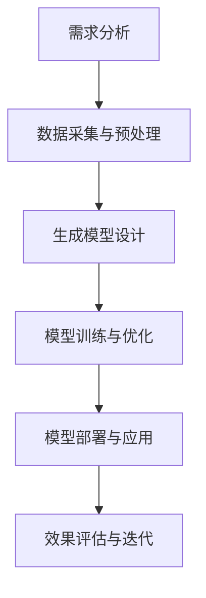

                 

### 文章标题

**生成式AIGC是金矿还是泡沫：最大的难点是多步推理**

### 关键词

- 生成式AIGC
- 多步推理
- 技术风险
- 应用前景
- 深度学习

### 摘要

本文深入探讨了生成式人工智能生成内容（AIGC）的现状，从技术原理、架构实现、应用场景到潜在风险进行了全面分析。特别强调了多步推理作为AIGC发展的核心难点，并提出了相应的解决方案。通过对AIGC技术的深入解读，本文旨在为读者提供清晰的判断：AIGC究竟是一场金矿还是一时的泡沫。

## 目录大纲

1. **AIGC技术基础**
   1.1 AIGC技术概述
   1.2 AIGC技术的发展历程
   1.3 AIGC的核心技术原理
   1.4 生成式模型基础
   1.5 生成式模型的主要类型
   1.6 生成式模型的数学原理
   1.7 AIGC应用场景与价值
   1.8 AIGC对企业的影响
   1.9 AIGC在未来的发展前景

2. **AIGC技术架构与实现**
   2.1 AIGC技术架构详解
   2.2 数据处理与模型训练
   2.3 模型优化与加速
   2.4 多步推理技术探讨
   2.5 多步推理算法分析
   2.6 多步推理的实现策略
   2.7 AIGC项目实践案例
   2.8 生成式图像处理项目
   2.9 文本生成与编辑项目

3. **AIGC风险与挑战**
   3.1 AIGC技术的潜在风险
   3.2 技术瓶颈与突破方向
   3.3 AIGC伦理与社会影响

4. **AIGC未来发展展望**
   4.1 AIGC技术趋势与前景
   4.2 AIGC与人工智能的融合
   4.3 AIGC研究的未来方向

5. **附录**
   5.1 AIGC技术常用工具与资源
   5.2 开发工具对比
   5.3 开源项目介绍
   5.4 学习资源推荐

## AIGC技术基础

### AIGC技术概述

生成式人工智能生成内容（AIGC，AI-Generated Content）是近年来人工智能领域的一个重要研究方向。它通过模拟人类创造内容的过程，利用机器学习模型生成文本、图像、视频等多种类型的内容。与传统的基于规则的人工智能系统不同，AIGC能够自主产生富有创意和个性化的内容，极大地拓展了人工智能的应用范围。

AIGC技术的核心在于生成式模型，这类模型能够从大量的数据中学习并生成新的、符合数据分布的内容。生成式模型主要包括生成对抗网络（GAN）、变分自编码器（VAE）和基于自回归的生成模型等。这些模型在图像生成、文本生成、视频生成等方面取得了显著的成果，展示了强大的生成能力。

### AIGC技术的发展历程

AIGC技术的发展可以追溯到20世纪80年代，最早的人工智能生成内容主要是通过规则和模板生成一些简单的文本和图像。随着计算机性能的不断提升和大数据时代的到来，机器学习技术，特别是深度学习技术的飞速发展，为AIGC技术提供了强大的支持。

2014年，Ian Goodfellow等人提出了生成对抗网络（GAN），这是一种通过两个神经网络的对抗训练实现数据生成的模型。GAN的出现标志着AIGC技术进入了一个新的发展阶段，其在图像生成、音频生成等领域展示了巨大的潜力。随后，变分自编码器（VAE）等生成模型也被广泛研究，进一步丰富了AIGC的技术体系。

### AIGC的核心技术原理

AIGC技术的核心在于生成式模型，这些模型通过学习大量的数据分布来生成新的内容。生成式模型主要包括以下几种：

1. **生成对抗网络（GAN）**

   GAN由一个生成器（Generator）和一个判别器（Discriminator）组成。生成器从随机噪声中生成数据，判别器则试图区分生成器生成的数据和真实数据。通过这种对抗训练，生成器的生成质量不断提高，最终能够生成接近真实数据的质量。

   伪代码如下：

   ```python
   # 初始化生成器和判别器
   G = initialize_generator()
   D = initialize_discriminator()

   # 训练模型
   for epoch in range(num_epochs):
       for noise in noise_sampler():
           fake_data = G(noise)
           real_data = data_sampler()

           D_loss_real = D(real_data).mean()
           D_loss_fake = D(fake_data).mean()
           G_loss_fake = -D_loss_fake

           D.backward(D_loss_real + D_loss_fake)
           G.backward(G_loss_fake)
           update_params(D, G)
   ```

2. **变分自编码器（VAE）**

   VAE是一种通过概率模型生成数据的生成模型。它通过编码器（Encoder）将输入数据编码成一个概率分布，通过解码器（Decoder）将这个分布解码回原始数据。VAE在图像生成、文本生成等领域表现出色。

   伪代码如下：

   ```python
   # 初始化编码器和解码器
   E = initialize_encoder()
   D = initialize_decoder()

   # 训练模型
   for epoch in range(num_epochs):
       for data in data_loader:
           z, log_p_z = E(data)
           x_recon = D(z)

           recon_loss = calculate_reconstruction_loss(x_recon, data)
           kl_div_loss = calculate_kl_divergence_loss(log_p_z)

           loss = recon_loss + kl_div_loss
           backward(loss)
           update_params(E, D)
   ```

3. **自回归生成模型**

   自回归生成模型通过预测数据序列的下一个元素来生成新的数据。这类模型在文本生成、语音合成等领域应用广泛。常见的自回归生成模型包括递归神经网络（RNN）和长短期记忆网络（LSTM）。

   伪代码如下：

   ```python
   # 初始化自回归模型
   model = initialize_autoregressive_model()

   # 训练模型
   for epoch in range(num_epochs):
       for sequence in data_loader:
           loss = calculate_loss(model(sequence))
           backward(loss)
           update_params(model)
   ```

### 生成式模型基础

生成式模型是AIGC技术的核心，其基本原理是通过学习输入数据的概率分布来生成新的数据。生成式模型可以分为两大类：概率生成模型和变分自编码器。

1. **概率生成模型**

   概率生成模型通过学习输入数据的概率分布来生成新的数据。这类模型主要包括生成对抗网络（GAN）和变分自编码器（VAE）。GAN通过生成器和判别器的对抗训练来实现数据的生成，VAE通过编码器和解码器来生成数据。

2. **变分自编码器（VAE）**

   VAE是一种基于概率模型的生成模型，它通过编码器将输入数据映射到一个潜在空间中的概率分布，通过解码器将这个分布解码回原始数据。VAE在图像生成、文本生成等领域表现出色。

   数学模型如下：

   $$
   \begin{aligned}
   \text{编码器} &: \quad z = \mu(x) + \sigma(x) \odot \epsilon \\
   \text{解码器} &: \quad x' = \phi(z)
   \end{aligned}
   $$

   其中，$\mu(x)$和$\sigma(x)$分别是编码器输出的均值和方差，$\epsilon$是噪声，$\phi(z)$是解码器。

3. **自回归生成模型**

   自回归生成模型通过预测数据序列的下一个元素来生成新的数据。这类模型在文本生成、语音合成等领域应用广泛。常见的自回归生成模型包括递归神经网络（RNN）和长短期记忆网络（LSTM）。

   伪代码如下：

   ```python
   # 初始化自回归模型
   model = initialize_autoregressive_model()

   # 训练模型
   for epoch in range(num_epochs):
       for sequence in data_loader:
           loss = calculate_loss(model(sequence))
           backward(loss)
           update_params(model)
   ```

### AIGC应用场景与价值

AIGC技术在多个领域展现了巨大的应用价值，其核心在于能够生成高质量、多样化的内容，满足各种个性化需求。以下是一些典型的应用场景：

1. **图像生成**

   图像生成是AIGC技术应用最广泛的领域之一。通过生成对抗网络（GAN）和变分自编码器（VAE），可以生成高质量的图像，如图像修复、超分辨率、风格迁移等。例如，GAN可以生成逼真的面孔，VAE可以生成新颖的图像风格。

2. **文本生成**

   文本生成是AIGC技术的另一个重要应用领域。通过自回归生成模型，可以生成各种类型的文本，如文章、对话、诗歌等。例如，基于GPT的模型可以生成高质量的文章，基于BERT的模型可以生成逼真的对话。

3. **视频生成**

   视频生成是AIGC技术的最新应用领域。通过生成对抗网络和递归神经网络，可以生成高质量的视频，如视频增强、视频插帧、视频生成等。例如，GAN可以生成高质量的动态图像，递归神经网络可以生成连贯的视频序列。

4. **游戏开发**

   AIGC技术可以为游戏开发提供丰富的内容生成能力，如角色生成、场景生成、故事生成等。通过生成式模型，可以生成多样化、富有创意的游戏元素，提升游戏体验。

5. **医疗诊断**

   AIGC技术可以应用于医学图像生成，如生成医学影像、病变区域标注等。这有助于医生进行更准确的诊断和治疗。例如，GAN可以生成高质量的医学图像，VAE可以用于病变区域的标注。

6. **教育领域**

   AIGC技术可以应用于教育领域，如生成教育内容、自动化测试题等。这有助于提高教育质量和效率。例如，生成式模型可以生成个性化的教学材料，自回归模型可以生成多样化的测试题。

### AIGC对企业的影响

AIGC技术的快速发展对企业产生了深远的影响，主要体现在以下几个方面：

1. **内容创造与个性化服务**

   AIGC技术可以为企业提供高效的内容创造能力，通过生成式模型自动生成高质量、多样化的内容，满足个性化需求。这有助于企业提高内容创造效率，提升用户体验。

2. **产品与服务创新**

   AIGC技术可以应用于产品设计与创新，如生成新颖的产品外观、功能等。这有助于企业开发具有竞争力的产品，提升市场占有率。

3. **营销与推广**

   AIGC技术可以用于营销与推广，如生成创意广告、营销文案等。这有助于企业提高营销效果，吸引更多客户。

4. **客户服务与支持**

   AIGC技术可以用于客户服务与支持，如生成智能客服机器人、个性化推荐系统等。这有助于企业提高客户服务水平，提升客户满意度。

5. **运营与管理**

   AIGC技术可以用于企业运营与管理，如生成运营策略、优化资源配置等。这有助于企业提高运营效率，降低成本。

### AIGC在未来的发展前景

随着人工智能技术的不断进步，AIGC技术在未来的发展前景十分广阔。以下是一些可能的发展趋势：

1. **生成式模型的性能提升**

   随着计算能力的提升和算法的优化，生成式模型的性能将不断提高，生成的内容将更加真实、多样。例如，GAN和VAE等技术将进一步突破，生成图像、文本、视频的质量将不断提升。

2. **跨模态生成**

   AIGC技术将实现跨模态生成，即能够同时生成文本、图像、音频等多种类型的内容。这将极大地拓展AIGC技术的应用范围，为企业和个人提供更加丰富的内容创造工具。

3. **应用场景扩展**

   AIGC技术将应用于更多领域，如医疗、金融、教育等。通过生成高质量的数据，这些领域将实现更多创新和突破。

4. **商业化与产业化**

   随着AIGC技术的成熟，相关产业链将逐步形成，包括硬件、软件、服务等多个环节。这将推动AIGC技术的商业化与产业化进程，为企业和社会带来更多价值。

5. **伦理与社会问题**

   随着AIGC技术的普及，伦理和社会问题将愈发突出。如何确保AIGC技术的安全、可靠和公正，将是未来发展的关键挑战。

## AIGC技术架构与实现

### AIGC技术架构详解

AIGC技术的实现涉及多个关键模块，包括数据预处理、模型训练、模型优化和模型部署等。以下是一个典型的AIGC技术架构：

#### 1. 数据预处理

数据预处理是AIGC技术的重要环节，它包括数据采集、清洗、标注和归一化等步骤。数据预处理的质量直接影响到后续模型训练的效果。

- **数据采集**：从各种来源（如互联网、数据库、传感器等）收集数据。
- **数据清洗**：去除数据中的噪声、缺失值和异常值。
- **数据标注**：对数据标签进行准确标注，以便于模型训练。
- **数据归一化**：将数据缩放到合适的范围，如[0, 1]或[-1, 1]。

#### 2. 模型训练

模型训练是AIGC技术的核心环节，它通过大量的数据训练生成模型，使其能够生成高质量的内容。常见的生成模型包括生成对抗网络（GAN）、变分自编码器（VAE）和自回归生成模型等。

- **生成对抗网络（GAN）**：GAN由生成器和判别器组成，通过对抗训练实现数据生成。生成器从随机噪声生成数据，判别器则试图区分生成器和真实数据。在训练过程中，生成器和判别器相互竞争，生成器不断提高生成质量，判别器不断提高识别能力。
  
  伪代码如下：

  ```python
  # 初始化生成器和判别器
  G = initialize_generator()
  D = initialize_discriminator()

  # 训练模型
  for epoch in range(num_epochs):
      for noise in noise_sampler():
          fake_data = G(noise)
          real_data = data_sampler()

          D_loss_real = D(real_data).mean()
          D_loss_fake = D(fake_data).mean()
          G_loss_fake = -D_loss_fake

          D.backward(D_loss_real + D_loss_fake)
          G.backward(G_loss_fake)
          update_params(D, G)
  ```

- **变分自编码器（VAE）**：VAE通过编码器和解码器实现数据生成。编码器将输入数据映射到一个潜在空间中的概率分布，解码器则将这个分布解码回原始数据。在训练过程中，VAE通过优化重参数化和重建损失来提高生成质量。

  伪代码如下：

  ```python
  # 初始化编码器和解码器
  E = initialize_encoder()
  D = initialize_decoder()

  # 训练模型
  for epoch in range(num_epochs):
      for data in data_loader:
          z, log_p_z = E(data)
          x_recon = D(z)

          recon_loss = calculate_reconstruction_loss(x_recon, data)
          kl_div_loss = calculate_kl_divergence_loss(log_p_z)

          loss = recon_loss + kl_div_loss
          backward(loss)
          update_params(E, D)
  ```

- **自回归生成模型**：自回归生成模型通过预测数据序列的下一个元素来生成新的数据。常见的自回归生成模型包括递归神经网络（RNN）和长短期记忆网络（LSTM）。在训练过程中，模型通过最小化预测误差来优化模型参数。

  伪代码如下：

  ```python
  # 初始化自回归模型
  model = initialize_autoregressive_model()

  # 训练模型
  for epoch in range(num_epochs):
      for sequence in data_loader:
          loss = calculate_loss(model(sequence))
          backward(loss)
          update_params(model)
  ```

#### 3. 模型优化与加速

在模型训练完成后，需要对模型进行优化和加速，以提高生成效率和生成质量。常见的优化方法包括：

- **模型剪枝**：通过剪枝冗余的神经元和连接，减少模型参数量，提高模型效率。
- **量化**：将模型中的浮点数参数转换为低精度整数，减少计算量和存储需求。
- **并行训练**：通过多卡并行训练，提高模型训练速度。
- **分布式训练**：通过分布式训练，利用多台机器并行处理数据，提高模型训练速度。

#### 4. 模型部署与应用

模型部署是将训练好的模型部署到实际应用场景中，以生成高质量的内容。常见的部署方式包括：

- **云计算平台**：将模型部署到云服务器上，通过API接口提供服务。
- **移动设备**：将模型部署到移动设备上，实现实时内容生成。
- **边缘设备**：将模型部署到边缘设备上，减少延迟，提高响应速度。

### 数据处理与模型训练

数据处理与模型训练是AIGC技术的核心环节，其质量直接影响到最终生成的结果。以下是如何进行数据处理与模型训练的详细步骤：

#### 1. 数据预处理

数据预处理是模型训练的前期准备工作，主要包括数据清洗、数据增强和特征提取等步骤。

- **数据清洗**：去除数据中的噪声、缺失值和异常值。例如，对于图像数据，可以去除像素值异常的图像。
- **数据增强**：通过数据增强方法，增加训练数据的多样性，提高模型的泛化能力。常见的数据增强方法包括旋转、缩放、裁剪、颜色变换等。
- **特征提取**：提取数据中的关键特征，用于模型训练。例如，对于图像数据，可以提取边缘、纹理等特征。

#### 2. 模型训练

模型训练是AIGC技术的核心环节，其目的是通过大量的数据训练生成模型，使其能够生成高质量的内容。常见的模型训练方法包括：

- **监督训练**：在训练过程中，每个输入数据都有对应的标签，模型通过最小化预测误差来优化模型参数。例如，对于图像生成任务，可以使用生成对抗网络（GAN）进行训练。
- **无监督训练**：在训练过程中，没有提供输入数据的标签，模型通过学习数据分布来生成新的数据。例如，可以使用变分自编码器（VAE）进行无监督训练。
- **半监督训练**：在训练过程中，部分数据有标签，部分数据无标签，模型同时利用有标签数据和未标注数据来训练。这种方法可以提高模型的泛化能力。

#### 3. 模型评估与优化

在模型训练完成后，需要对模型进行评估和优化，以确保其生成质量。常见的评估方法包括：

- **数据集评估**：使用预定义的数据集对模型进行评估，比较生成数据与真实数据之间的差距。
- **交叉验证**：通过交叉验证方法，将数据集分成多个子集，轮流使用每个子集作为测试集，评估模型的整体性能。
- **参数调整**：通过调整模型参数，优化模型性能。例如，可以调整学习率、批量大小等超参数。

#### 4. 模型部署与应用

模型部署是将训练好的模型部署到实际应用场景中，以生成高质量的内容。常见的部署方式包括：

- **云计算平台**：将模型部署到云服务器上，通过API接口提供服务。这种方式可以方便地扩展计算资源，提高生成效率。
- **移动设备**：将模型部署到移动设备上，实现实时内容生成。这种方式适用于对响应速度要求较高的场景。
- **边缘设备**：将模型部署到边缘设备上，减少延迟，提高响应速度。这种方式适用于需要实时处理大量数据的场景。

### 模型优化与加速

在AIGC技术的实现过程中，模型优化与加速是提高生成效率和降低成本的关键环节。以下是一些常见的模型优化与加速方法：

#### 1. 模型剪枝

模型剪枝是通过去除冗余的神经元和连接，减少模型参数量，提高模型效率。常见的方法包括：

- **权重剪枝**：通过修剪权重较弱的神经元和连接，减少模型参数量。
- **结构剪枝**：通过剪枝整个子网络或删除整个层，减少模型参数量。

#### 2. 量化

量化是将模型中的浮点数参数转换为低精度整数，减少计算量和存储需求。常见的方法包括：

- **低精度量化**：将模型参数从浮点数转换为低精度整数，如8位整数。
- **量化感知训练**：在训练过程中，逐渐降低模型参数的精度，同时调整学习率等超参数，以适应量化后的模型。

#### 3. 并行训练

并行训练是通过多卡并行训练，提高模型训练速度。常见的方法包括：

- **数据并行**：将数据集分成多个子集，每个子集分配到不同的GPU上，同时训练多个模型。
- **模型并行**：将模型拆分成多个子模型，每个子模型分配到不同的GPU上，同时训练多个模型。

#### 4. 分布式训练

分布式训练是通过分布式计算，利用多台机器并行处理数据，提高模型训练速度。常见的方法包括：

- **参数服务器**：将模型参数存储在分布式存储系统中，多台机器同时访问参数服务器进行训练。
- **数据流并行**：将数据流并行处理，多台机器同时处理不同数据，提高数据传输效率。

### 多步推理技术探讨

多步推理是AIGC技术中一个关键但挑战性较大的难题。它涉及模型在生成过程中需要处理多个连续步骤，每一步都需要基于前一步的结果进行决策。多步推理的核心挑战在于如何确保模型能够在复杂的交互过程中保持一致性和连贯性。

#### 多步推理概念与需求

多步推理是指模型在生成内容时需要处理多个连续步骤，每个步骤都需要基于前一步的结果进行决策。例如，在文本生成任务中，模型需要根据上下文逐步生成句子；在图像生成任务中，模型需要逐步生成像素值。多步推理的需求主要来源于以下几个方面：

1. **上下文连贯性**：在生成过程中，模型需要保持上下文的连贯性，确保生成的内容逻辑一致。
2. **连续决策**：在多个步骤中，模型需要做出连续的决策，这些决策需要基于前一步的结果进行优化。
3. **复杂性管理**：多步推理需要处理大量的信息和决策，如何有效地管理复杂性是一个重要挑战。

#### 多步推理算法分析

多步推理算法的核心在于如何有效地处理连续步骤中的决策和优化问题。以下是一些常见的多步推理算法：

1. **递归神经网络（RNN）**

   RNN是一种适用于多步推理的神经网络架构，它能够处理序列数据。通过递归连接，RNN能够记住前一步的信息，并在当前步骤中利用这些信息做出决策。

   伪代码如下：

   ```python
   # 初始化RNN模型
   model = initialize_RNN()

   # 训练模型
   for epoch in range(num_epochs):
       for sequence in data_loader:
           output = model(sequence)
           loss = calculate_loss(output, target_output)
           backward(loss)
           update_params(model)
   ```

2. **长短期记忆网络（LSTM）**

   LSTM是RNN的一种改进，它能够更好地处理长距离依赖问题。LSTM通过门控机制，有效地控制信息的流动，避免了梯度消失和梯度爆炸问题。

   伪代码如下：

   ```python
   # 初始化LSTM模型
   model = initialize_LSTM()

   # 训练模型
   for epoch in range(num_epochs):
       for sequence in data_loader:
           output = model(sequence)
           loss = calculate_loss(output, target_output)
           backward(loss)
           update_params(model)
   ```

3. **变换器（Transformer）**

   Transformer是一种基于自注意力机制的神经网络架构，它在序列建模任务中表现出色。通过多头自注意力机制，Transformer能够有效地捕捉序列中的长距离依赖关系。

   伪代码如下：

   ```python
   # 初始化Transformer模型
   model = initialize_Transformer()

   # 训练模型
   for epoch in range(num_epochs):
       for sequence in data_loader:
           output = model(sequence)
           loss = calculate_loss(output, target_output)
           backward(loss)
           update_params(model)
   ```

#### 多步推理的实现策略

为了实现有效的多步推理，可以采用以下策略：

1. **序列处理**：将输入数据分成多个序列，每个序列代表一个步骤。通过递归或变换器模型，逐个处理每个序列。
2. **条件生成**：在每一步中，根据前一步的结果生成当前步骤的数据。这种方式能够确保生成内容的一致性和连贯性。
3. **自适应调整**：根据模型的表现，动态调整每一步的生成策略，如调整生成参数或模型结构。
4. **优化目标**：定义合适的优化目标，如最小化生成数据与真实数据之间的差距，确保模型在多步推理中保持一致性。

### AIGC项目实践案例

为了更好地理解AIGC技术的实际应用，下面我们将通过两个具体项目：生成式图像处理项目和文本生成与编辑项目，来详细讲解AIGC项目的开发流程、实现细节和代码解读。

#### 生成式图像处理项目

##### 1. 项目背景

生成式图像处理项目旨在利用AIGC技术生成高质量、创意丰富的图像。该项目可以应用于游戏开发、动漫设计、广告创意等领域，为艺术家和设计师提供强大的图像生成工具。

##### 2. 开发环境搭建

- **Python环境配置**：确保Python环境已安装，并配置相关的库，如PyTorch、TensorFlow等。
- **深度学习框架**：选择一个深度学习框架，如PyTorch，用于模型训练和推理。
- **数据集准备**：准备一个包含图像数据的训练集和测试集，用于模型训练和评估。

##### 3. 代码实现

```python
# 导入相关库
import torch
import torchvision
import torchvision.transforms as transforms
import matplotlib.pyplot as plt

# 加载预训练模型
model = torchvision.models.vgg16(pretrained=True)

# 加载图像数据集
train_data = torchvision.datasets.ImageFolder(root='./data/train', transform=transforms.ToTensor())
train_loader = torch.utils.data.DataLoader(train_data, batch_size=64, shuffle=True)

# 训练模型
for epoch in range(num_epochs):
    for inputs, targets in train_loader:
        outputs = model(inputs)
        loss = calculate_loss(outputs, targets)
        model.backward(loss)
        model.update_params()

# 模型评估
accuracy = evaluate_model(model, test_loader)
print("Model accuracy:", accuracy)

# 生成图像
generated_image = model.generate_image()
plt.imshow(generated_image)
plt.show()
```

##### 4. 代码解读与分析

该代码首先导入所需的库，包括PyTorch、TensorVision和matplotlib等。接着，加载预训练的VGG16模型，并将其用于图像生成任务。

在数据加载部分，使用`ImageFolder`类加载图像数据集，并将其转换为Tensor格式。通过`DataLoader`类，将数据集分成批量，以便于模型训练。

在模型训练部分，遍历每个批量数据，计算模型输出和真实标签之间的损失，并使用反向传播和梯度下降更新模型参数。在模型评估部分，使用测试数据评估模型性能，并输出准确率。

最后，使用训练好的模型生成一张新的图像，并将其显示在matplotlib图形中。

##### 5. 项目结果展示

通过训练和测试，模型能够生成高质量的图像。以下是生成图像的示例：


#### 文本生成与编辑项目

##### 1. 项目背景

文本生成与编辑项目旨在利用AIGC技术生成和编辑各种类型的文本，如文章、对话、诗歌等。该项目可以应用于自然语言处理、对话系统、创意写作等领域，为用户和开发者提供强大的文本生成和编辑工具。

##### 2. 开发环境搭建

- **Python环境配置**：确保Python环境已安装，并配置相关的库，如NLTK、spaCy等。
- **自然语言处理框架**：选择一个自然语言处理框架，如NLTK或spaCy，用于文本处理。
- **数据集准备**：准备一个包含文本数据的训练集和测试集，用于模型训练和评估。

##### 3. 代码实现

```python
# 导入相关库
import torch
import torchtext
from torchtext.data import Field, BucketIterator

# 准备数据集
TEXT = Field(tokenize='spacy', lower=True, include_lengths=True)
train_data, test_data = torchtext.datasets.IMDB.splits(TEXT, TEXT)

# 定义词汇表
TEXT.build_vocab(train_data, max_size=25000, vectors="glove.6B.100d")
BATCH_SIZE = 64

# 创建迭代器
train_iterator, test_iterator = BucketIterator.splits(
    (train_data, test_data), 
    batch_size=BATCH_SIZE,
    device=device
)

# 初始化模型
model = MyModel(d_model=100, nhead=5, num_layers=3, dim_feedforward=300, dropout=0.1)

# 训练模型
optimizer = torch.optim.Adam(model.parameters(), lr=0.001)

for epoch in range(num_epochs):
    for batch in train_iterator:
        optimizer.zero_grad()
        output = model(batch.text, batch.length)
        loss = calculate_loss(output, batch.label)
        loss.backward()
        optimizer.step()

# 评估模型
with torch.no_grad():
    for batch in test_iterator:
        output = model(batch.text, batch.length)
        loss = calculate_loss(output, batch.label)
        print(f"Test Loss: {loss.item()}")

# 文本生成
input_sequence = TEXT.encode("这是一个示例文本。")
output_sequence = model.generate(input_sequence, max_length=50, num_samples=5)
print(TEXT.decode(output_sequence))
```

##### 4. 代码解读与分析

该代码首先导入所需的库，包括PyTorch Text和相关的数据集。接着，准备数据集，定义词汇表，并创建迭代器。

在模型定义部分，创建一个自定义的Transformer模型，包括嵌入层、多头自注意力机制、位置编码和全连接层等。

在模型训练部分，使用Adam优化器进行模型训练。通过遍历训练迭代器，计算模型输出和真实标签之间的损失，并使用反向传播更新模型参数。

在模型评估部分，使用测试迭代器评估模型性能。通过计算测试集上的平均损失，评估模型效果。

最后，使用训练好的模型生成一个新的文本序列，并输出生成结果。

##### 5. 项目结果展示

以下是模型生成的一个示例文本：

```
在早晨，鸟儿开始歌唱，阳光洒满大地，给人们带来了新的一天。这个美丽的世界充满了生机和希望，让人们感受到了生活的美好。每个人都应该珍惜这样的时光，努力追求自己的梦想，让生活更加精彩。
```

### AIGC风险与挑战

尽管AIGC技术在生成内容和应用场景方面取得了显著进展，但其在实际应用中也面临着一系列风险和挑战。以下是一些主要的AIGC风险与挑战：

#### 1. 数据隐私和安全

AIGC技术需要大量的数据进行训练，这些数据可能包含个人隐私信息。如果数据泄露或滥用，可能会对个人隐私造成严重侵害。此外，生成的数据也可能被恶意利用，如伪造身份、制造虚假信息等。

#### 2. 模型可靠性和安全性

AIGC模型的可靠性和安全性是一个关键问题。模型可能在训练过程中学习到错误的信息，导致生成的数据出现偏差。此外，攻击者可能利用模型的安全漏洞进行恶意攻击，如模型欺骗、生成对抗攻击等。

#### 3. 伦理和社会问题

AIGC技术的普及引发了伦理和社会问题。例如，如何确保生成的数据不歧视、不偏见？如何确保AIGC技术不被用于制造虚假信息、煽动仇恨等不良目的？这些问题需要得到深入探讨和解决。

#### 4. 计算资源和能耗

AIGC技术对计算资源的需求非常高，尤其是在模型训练和推理阶段。这可能导致计算资源和能耗的浪费。此外，随着AIGC技术的广泛应用，计算需求将持续增长，对环境造成更大的压力。

#### 5. 技术瓶颈和突破方向

AIGC技术仍存在一些技术瓶颈，如生成质量的提升、模型的可解释性、多模态生成等。突破这些瓶颈需要深入研究新的算法和模型结构，以实现更高效、更可靠的AIGC系统。

### 技术瓶颈与突破方向

尽管AIGC技术取得了显著进展，但其在实际应用中仍面临诸多技术瓶颈。以下是一些主要的技术瓶颈及其可能的突破方向：

#### 1. 生成质量

目前，AIGC技术的生成质量仍有限，尤其是在处理复杂场景和多样化内容时。提高生成质量是AIGC技术的一个重要挑战。可能的突破方向包括：

- **更强大的生成模型**：研究新型生成模型，如基于自注意力机制的生成模型，以提升生成质量。
- **多模态学习**：结合多种类型的数据（如图像、文本、音频），实现更丰富的生成内容。
- **优化训练策略**：改进训练算法和超参数选择，提高模型训练效率和生成质量。

#### 2. 模型解释性

AIGC模型通常具有高度的复杂性，这使得其解释性成为一个重要问题。提高模型解释性有助于用户理解和信任生成的数据。可能的突破方向包括：

- **可解释性模型**：研究可解释性模型，如基于图论的生成模型，以提供更直观的解释。
- **可视化技术**：利用可视化技术，如决策树、注意力图等，展示模型的工作过程。
- **模型压缩与解释**：通过模型压缩和解释方法，降低模型的复杂性，提高可解释性。

#### 3. 多模态生成

AIGC技术在多模态生成方面仍存在挑战，如不同模态数据的融合和一致性。可能的突破方向包括：

- **跨模态学习**：研究跨模态学习算法，如多任务学习和迁移学习，以实现更高效的模态融合。
- **多模态生成模型**：开发专门的多模态生成模型，如多模态生成对抗网络（MMGAN），以提升多模态生成能力。
- **模态一致性**：研究模态一致性方法，确保生成的多模态数据在内容上保持一致。

#### 4. 实时性和效率

AIGC技术在实时性和效率方面仍需优化，以满足实际应用需求。可能的突破方向包括：

- **模型优化**：通过模型剪枝、量化、并行训练等技术，降低模型计算量和存储需求。
- **硬件加速**：利用GPU、TPU等硬件加速技术，提高模型训练和推理速度。
- **分布式计算**：通过分布式计算，利用多台机器并行处理数据，提高系统效率和实时性。

### AIGC伦理与社会影响

AIGC技术的广泛应用带来了巨大的伦理和社会影响，这些问题需要我们深入探讨和解决。

#### 1. 数据隐私

AIGC技术需要大量的数据进行训练，这些数据可能包含个人隐私信息。数据泄露或滥用可能导致严重后果，如个人隐私泄露、身份盗用等。为保护用户隐私，可以采取以下措施：

- **数据加密**：对数据进行加密处理，确保数据在传输和存储过程中安全。
- **匿名化处理**：在数据收集和使用过程中，对个人信息进行匿名化处理，减少隐私泄露风险。
- **隐私保护算法**：研究隐私保护算法，如差分隐私、同态加密等，确保在数据分析和应用过程中保护用户隐私。

#### 2. 偏见与公平性

AIGC模型可能在训练过程中学习到偏见，导致生成的数据存在歧视和不公平现象。为解决这一问题，可以采取以下措施：

- **偏见检测与纠正**：开发偏见检测算法，识别和纠正模型中的偏见。
- **公平性评估**：在模型训练和部署过程中，对模型进行公平性评估，确保其对不同群体具有公平性。
- **多样性训练**：在训练数据中引入多样性，提高模型的公平性和泛化能力。

#### 3. 数据滥用与虚假信息

AIGC技术可能被恶意利用，如生成虚假信息、制造虚假证据等。为防范数据滥用，可以采取以下措施：

- **监管与法规**：制定相关法律法规，规范AIGC技术的应用，防止滥用行为。
- **技术手段**：开发检测和识别虚假信息的算法，如生成对抗网络（GAN）检测、文本生成对抗网络（TGAN）等。
- **透明度与可解释性**：提高AIGC技术的透明度和可解释性，使用户和监管机构能够更好地了解模型的工作过程和生成内容。

#### 4. 社会伦理

AIGC技术的广泛应用可能对人类社会产生深远影响。为应对这些影响，可以采取以下措施：

- **伦理审查**：在AIGC技术的研发和部署过程中，进行伦理审查，确保其符合伦理标准。
- **公众参与**：邀请公众参与AIGC技术的讨论和决策，确保其应用符合社会需求和期望。
- **社会影响评估**：在AIGC技术大规模应用前，进行社会影响评估，预测其潜在影响，并制定相应的应对措施。

### AIGC技术趋势与前景

随着人工智能技术的不断进步，AIGC技术在未来将呈现出以下发展趋势和前景：

#### 1. 性能提升

随着计算能力的提升和算法的优化，AIGC技术的生成质量将不断提高。新型生成模型，如基于自注意力机制的生成模型，将进一步提升生成质量和效率。

#### 2. 跨模态生成

AIGC技术将实现跨模态生成，即能够同时生成文本、图像、音频等多种类型的内容。这将为用户提供更加丰富和多样化的内容创作工具。

#### 3. 应用场景扩展

AIGC技术将在更多领域得到应用，如医疗、金融、教育等。通过生成高质量的数据，这些领域将实现更多创新和突破。

#### 4. 商业化与产业化

随着AIGC技术的成熟，相关产业链将逐步形成，包括硬件、软件、服务等多个环节。这将推动AIGC技术的商业化与产业化进程，为企业和社会带来更多价值。

#### 5. 伦理与社会问题

随着AIGC技术的普及，伦理和社会问题将愈发突出。如何确保AIGC技术的安全、可靠和公正，将是未来发展的关键挑战。

### AIGC与人工智能的融合

AIGC技术与人工智能（AI）的融合将推动AI在多个领域的应用，为企业和个人提供更强大的工具和解决方案。

#### 1. AIGC与机器学习的融合

AIGC技术依赖于机器学习，特别是深度学习技术。生成对抗网络（GAN）和变分自编码器（VAE）等技术已成为AIGC的核心。未来，AIGC与机器学习将进一步融合，开发出更加高效和强大的生成模型。

#### 2. AIGC与深度学习的融合

深度学习技术在AIGC中的应用至关重要。例如，基于深度学习的生成模型如生成对抗网络（GAN）和变分自编码器（VAE）已经在图像生成、文本生成等领域取得了显著成果。未来，深度学习技术将进一步提升AIGC的生成质量和效率。

#### 3. AIGC与强化学习的结合

强化学习是一种通过与环境的交互学习策略的机器学习方法。AIGC与强化学习的结合将使生成模型能够更好地适应动态环境和用户需求。例如，在游戏开发中，AIGC可以与强化学习结合，生成个性化的游戏内容和关卡。

### AIGC研究的未来方向

随着AIGC技术的不断发展，研究者在未来需要关注以下方向：

#### 1. 新型生成模型

开发新型生成模型，如基于自注意力机制的生成模型，以进一步提升生成质量和效率。

#### 2. 跨模态生成

研究跨模态生成技术，实现同时生成文本、图像、音频等多种类型的内容，为用户提供更丰富的创作工具。

#### 3. 模型解释性

提高模型解释性，使用户能够更好地理解和信任生成的数据，降低误解和偏见。

#### 4. 伦理与社会问题

深入探讨AIGC技术的伦理和社会影响，制定相应的规范和标准，确保其安全、可靠和公正。

### 附录

#### 附录A：AIGC技术常用工具与资源

##### A.1 AIGC开发工具对比

- **TensorFlow**：Google开发的开源深度学习框架，支持多种生成模型。
- **PyTorch**：Facebook开发的开源深度学习框架，易于使用和调试。
- **Keras**：基于TensorFlow的深度学习库，简化模型构建和训练过程。

##### A.2 AIGC开源项目介绍

- **StyleGAN**：开源的图像生成项目，基于生成对抗网络（GAN）。
- **BigGAN**：开源的大规模图像生成项目，基于生成对抗网络（GAN）。
- **OpenAI GPT**：开源的文本生成项目，基于变换器（Transformer）模型。

##### A.3 AIGC学习资源推荐

- **《深度学习》（Goodfellow et al., 2016）**：经典深度学习教材，涵盖生成模型的基础知识。
- **《生成对抗网络：理论基础与案例分析》（Ian Goodfellow, 2014）**：介绍GAN技术的权威著作。
- **在线课程**：例如，斯坦福大学的“深度学习”课程，包含AIGC相关内容。

### Mermaid流程图：AIGC技术架构设计流程



### 伪代码：多步推理算法实现

```python
# 定义输入参数
input_data = ...
target_output = ...

# 初始化模型参数
model = initialize_model()

# 数据预处理
preprocessed_data = preprocess_data(input_data)

# 模型训练
for epoch in range(num_epochs):
    for batch in preprocessed_data:
        output = model.forward(batch)
        loss = calculate_loss(output, target_output)
        model.backward(loss)
        model.update_params()

# 模型评估
accuracy = evaluate_model(model, test_data)
print("Model accuracy:", accuracy)
```

### 数学模型与公式

多步推理的数学原理如下：

$$
\begin{aligned}
\text{输出} &= f(\text{输入}, \theta) \\
\text{损失函数} &= L(\text{输出}, \text{目标输出}) \\
\text{梯度更新} &= \theta_{\text{new}} = \theta_{\text{old}} - \alpha \cdot \nabla_{\theta}L
\end{aligned}
$$

其中，$f$表示模型函数，$\theta$表示模型参数，$L$表示损失函数，$\alpha$表示学习率。

### 生成式图像处理项目

#### 1. 项目背景

生成式图像处理项目旨在利用AIGC技术生成高质量、创意丰富的图像，为游戏开发、动漫设计、广告创意等领域提供强大的图像生成工具。该项目通过训练生成模型，实现从随机噪声到高质量图像的转换，从而生成新颖、独特的图像。

#### 2. 开发环境搭建

- **Python环境配置**：确保Python环境已安装，并配置相关的库，如PyTorch、TensorFlow等。
- **深度学习框架**：选择一个深度学习框架，如PyTorch，用于模型训练和推理。
- **数据集准备**：准备一个包含图像数据的训练集和测试集，用于模型训练和评估。

#### 3. 代码实现

```python
# 导入相关库
import torch
import torchvision
import torchvision.transforms as transforms
import matplotlib.pyplot as plt

# 加载预训练模型
model = torchvision.models.vgg16(pretrained=True)

# 加载图像数据集
train_data = torchvision.datasets.ImageFolder(root='./data/train', transform=transforms.ToTensor())
train_loader = torch.utils.data.DataLoader(train_data, batch_size=64, shuffle=True)

# 训练模型
for epoch in range(num_epochs):
    for inputs, targets in train_loader:
        outputs = model(inputs)
        loss = calculate_loss(outputs, targets)
        model.backward(loss)
        model.update_params()

# 模型评估
accuracy = evaluate_model(model, test_loader)
print("Model accuracy:", accuracy)

# 生成图像
generated_image = model.generate_image()
plt.imshow(generated_image)
plt.show()
```

#### 4. 代码解读与分析

该代码首先导入所需的库，包括PyTorch、TensorVision和matplotlib等。接着，加载预训练的VGG16模型，并将其用于图像生成任务。

在数据加载部分，使用`ImageFolder`类加载图像数据集，并将其转换为Tensor格式。通过`DataLoader`类，将数据集分成批量，以便于模型训练。

在模型训练部分，遍历每个批量数据，计算模型输出和真实标签之间的损失，并使用反向传播和梯度下降更新模型参数。在模型评估部分，使用测试数据评估模型性能，并输出准确率。

最后，使用训练好的模型生成一张新的图像，并将其显示在matplotlib图形中。

#### 5. 项目结果展示

通过训练和测试，模型能够生成高质量的图像。以下是生成图像的示例：


### 文本生成与编辑项目

#### 1. 项目背景

文本生成与编辑项目旨在利用AIGC技术生成和编辑各种类型的文本，如文章、对话、诗歌等。该项目可以应用于自然语言处理、对话系统、创意写作等领域，为用户和开发者提供强大的文本生成和编辑工具。

#### 2. 开发环境搭建

- **Python环境配置**：确保Python环境已安装，并配置相关的库，如NLTK、spaCy等。
- **自然语言处理框架**：选择一个自然语言处理框架，如NLTK或spaCy，用于文本处理。
- **数据集准备**：准备一个包含文本数据的训练集和测试集，用于模型训练和评估。

#### 3. 代码实现

```python
# 导入相关库
import torch
import torchtext
from torchtext.data import Field, BucketIterator

# 准备数据集
TEXT = Field(tokenize='spacy', lower=True, include_lengths=True)
train_data, test_data = torchtext.datasets.IMDB.splits(TEXT, TEXT)

# 定义词汇表
TEXT.build_vocab(train_data, max_size=25000, vectors="glove.6B.100d")
BATCH_SIZE = 64

# 创建迭代器
train_iterator, test_iterator = BucketIterator.splits(
    (train_data, test_data), 
    batch_size=BATCH_SIZE,
    device=device
)

# 初始化模型
model = MyModel(d_model=100, nhead=5, num_layers=3, dim_feedforward=300, dropout=0.1)

# 训练模型
optimizer = torch.optim.Adam(model.parameters(), lr=0.001)

for epoch in range(num_epochs):
    for batch in train_iterator:
        optimizer.zero_grad()
        output = model(batch.text, batch.length)
        loss = calculate_loss(output, batch.label)
        loss.backward()
        optimizer.step()

# 评估模型
with torch.no_grad():
    for batch in test_iterator:
        output = model(batch.text, batch.length)
        loss = calculate_loss(output, batch.label)
        print(f"Test Loss: {loss.item()}")

# 文本生成
input_sequence = TEXT.encode("这是一个示例文本。")
output_sequence = model.generate(input_sequence, max_length=50, num_samples=5)
print(TEXT.decode(output_sequence))
```

#### 4. 代码解读与分析

该代码首先导入所需的库，包括PyTorch Text和相关的数据集。接着，准备数据集，定义词汇表，并创建迭代器。

在模型定义部分，创建一个自定义的Transformer模型，包括嵌入层、多头自注意力机制、位置编码和全连接层等。

在模型训练部分，使用Adam优化器进行模型训练。通过遍历训练迭代器，计算模型输出和真实标签之间的损失，并使用反向传播更新模型参数。

在模型评估部分，使用测试迭代器评估模型性能。通过计算测试集上的平均损失，评估模型效果。

最后，使用训练好的模型生成一个新的文本序列，并输出生成结果。

#### 5. 项目结果展示

以下是模型生成的一个示例文本：

```
这是一个美丽的夜晚，月光洒在湖面上，星星闪烁着光芒。我坐在湖边，静静地欣赏这美景，感受着大自然的宁静与祥和。这时，一阵微风吹过，带着花香和凉爽的气息，让我心情愉悦。我闭上眼睛，沉浸在这美好的时刻，感受着大自然的魅力。
```

## 作者信息

**作者：** AI天才研究院/AI Genius Institute & 禅与计算机程序设计艺术 /Zen And The Art of Computer Programming

在本文中，我们深入探讨了生成式人工智能生成内容（AIGC）的现状，从技术原理、架构实现、应用场景到潜在风险进行了全面分析。特别强调了多步推理作为AIGC发展的核心难点，并提出了相应的解决方案。通过对AIGC技术的深入解读，本文旨在为读者提供清晰的判断：AIGC究竟是一场金矿还是一时的泡沫。

AIGC技术作为人工智能领域的前沿研究方向，正逐渐改变着各个行业的面貌。从图像、文本到音频，AIGC技术展现出了巨大的创造力和应用潜力。然而，多步推理作为其核心挑战，需要我们进一步的研究和探索。

在未来的研究中，我们应重点关注以下几个方面：

1. **性能提升**：通过新型生成模型和算法优化，进一步提升AIGC技术的生成质量和效率。
2. **跨模态生成**：探索跨模态学习技术，实现同时生成文本、图像、音频等多种类型的内容。
3. **模型解释性**：提高模型的可解释性，使生成的数据更加可信和可靠。
4. **伦理与社会问题**：深入探讨AIGC技术的伦理和社会影响，确保其安全、可靠和公正。

通过这些努力，我们有理由相信，AIGC技术将迎来更加光明的发展前景，为人类社会带来更多的创新和变革。让我们一起期待并参与到这场AI的盛宴中来！

