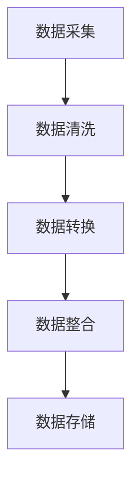
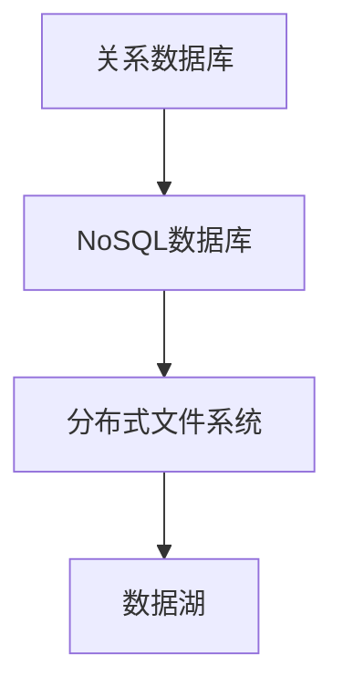
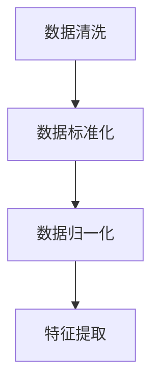
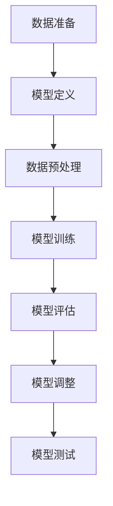

                 

### 文章标题

**生物制药中的AI for Science**

关键词：生物制药、人工智能、机器学习、深度学习、计算生物学、药物发现、疾病诊断

摘要：本文将深入探讨生物制药领域与人工智能（AI）的融合，从AI for Science的核心概念、技术基础、应用实例以及开发与实施等多个角度，全面分析AI在生物制药中的重要作用。通过本文的阅读，读者将了解到AI for Science的最新进展、挑战与前景，以及如何将AI技术应用于药物发现和疾病诊断等领域。

### 第一部分: 生物制药中的AI for Science

#### 第1章: AI for Science概述

##### 1.1 生物制药领域与AI的融合

生物制药是指通过生物技术手段，利用生物体（如细菌、酵母、细胞、组织等）或其组成部分（如蛋白质、核酸等）制成的药物。随着生物技术的快速发展，生物制药已成为现代医药产业的重要组成部分。而人工智能（AI）作为一项颠覆性技术，正在各个领域引发深刻的变革。生物制药领域与AI的融合，不仅能够提高药物研发的效率，还能够降低研发成本，加快新药上市的速度。

###### 1.1.1 生物制药行业的发展背景

生物制药行业的发展可以追溯到20世纪80年代，当时重组DNA技术和单克隆抗体技术的突破，使得科学家们能够制造出具有特定功能的蛋白质和抗体。这些新技术的出现，极大地推动了生物制药行业的发展。随着生物技术的不断进步，生物制药产品的种类和数量也在不断增多，涵盖了从疫苗、抗体类药物到基因疗法等各个领域。

###### 1.1.2 AI在生物制药中的重要性

AI在生物制药中的重要性主要体现在以下几个方面：

1. **药物发现和设计**：AI能够通过大数据分析和机器学习算法，快速识别潜在的药物靶点，并设计出具有较高活性和较低毒性的药物分子。
2. **疾病诊断和治疗**：AI可以帮助医生进行疾病的早期诊断，提供个性化的治疗方案，提高治疗效果。
3. **药物开发和生产**：AI可以提高药物开发的效率，降低研发成本，同时优化药物的生产过程，提高生产效率。
4. **生物数据分析**：AI能够处理海量的生物数据，包括基因组数据、蛋白质组数据、代谢组数据等，从而揭示生物体内的复杂关系，为药物研发提供重要的科学依据。

###### 1.1.3 生物制药与AI融合的发展趋势

随着AI技术的不断进步，生物制药与AI的融合正呈现出以下发展趋势：

1. **跨学科融合**：生物制药与AI、计算生物学、生物信息学等学科的融合，将推动生物制药行业的创新发展。
2. **数据驱动**：大数据和AI的结合，将使得药物研发更加数据驱动，提高药物研发的成功率。
3. **个性化医疗**：通过AI技术，可以实现药物的个性化设计，为患者提供更加精准的治疗方案。
4. **自动化与智能化**：AI技术将推动生物制药生产过程的自动化与智能化，提高生产效率和产品质量。
5. **国际竞争与合作**：全球范围内，生物制药与AI的融合正在加速，国际竞争与合作也将越来越紧密。

##### 1.2 AI for Science的核心概念

###### 1.2.1 AI for Science的定义

AI for Science，即人工智能用于科学研究，是指将人工智能技术应用于科学研究过程中，以提高科研效率、降低科研成本、揭示科学现象的本质和规律。AI for Science涵盖了从数据采集、处理、分析到结果可视化等各个环节。

###### 1.2.2 AI for Science的架构与特点

AI for Science的架构主要包括以下几个层次：

1. **数据采集**：通过传感器、实验设备等手段，获取大量的生物数据。
2. **数据处理**：对采集到的生物数据进行分析、清洗、整合等处理，为后续的分析提供高质量的数据。
3. **数据分析**：运用机器学习、深度学习等算法，对处理后的生物数据进行分析，发现数据之间的关联和规律。
4. **结果可视化**：将分析结果以图表、图像等形式直观地展示出来，帮助科学家更好地理解数据。

AI for Science的特点包括：

1. **数据驱动**：AI for Science强调数据的重要性，通过数据分析来驱动科学研究。
2. **跨学科融合**：AI for Science需要生物科学、计算机科学、数学等多个学科的交叉融合。
3. **高效性**：AI for Science能够快速处理和分析大量的生物数据，提高科研效率。
4. **智能化**：AI for Science通过机器学习和深度学习等技术，实现科学研究的智能化，能够自动识别和发现数据中的模式和规律。

###### 1.2.3 AI for Science与传统生物制药的区别

AI for Science与传统生物制药的区别主要体现在以下几个方面：

1. **研发流程**：传统生物制药的研发流程较为复杂，从药物靶点的发现到药物分子的设计、合成、测试等环节，需要大量的时间和资金。而AI for Science则能够通过数据分析和机器学习等技术，快速识别药物靶点，设计出药物分子，缩短研发周期。
2. **数据依赖**：传统生物制药主要依赖于实验室的实验数据，而AI for Science则强调数据的重要性，通过大数据分析和机器学习算法，挖掘出生物数据中的价值。
3. **跨学科融合**：AI for Science需要生物科学、计算机科学、数学等多个学科的交叉融合，而传统生物制药则更注重生物学本身的实验和研究。
4. **效率与成本**：AI for Science通过提高科研效率和降低研发成本，使得药物研发更加高效和可持续。

##### 1.3 主流AI for Science技术

###### 1.3.1 机器学习与深度学习在生物制药中的应用

机器学习和深度学习是AI for Science的核心技术，在生物制药领域有着广泛的应用。

1. **药物靶点识别**：通过机器学习和深度学习算法，可以快速识别潜在的药物靶点，为药物研发提供方向。
2. **药物分子设计**：机器学习和深度学习可以用于药物分子的设计，通过优化分子结构，提高药物的活性和稳定性。
3. **药物筛选**：机器学习和深度学习可以帮助筛选出具有潜在药物活性的化合物，提高药物研发的成功率。
4. **疾病诊断**：机器学习和深度学习可以用于疾病诊断，通过分析影像数据、基因数据等，帮助医生进行疾病的早期诊断。

###### 1.3.2 计算生物学与生物信息学中的AI应用

计算生物学和生物信息学是AI for Science的重要组成部分，AI技术在这些领域也有着广泛的应用。

1. **基因组数据分析**：通过机器学习和深度学习算法，可以分析基因组数据，识别基因的功能和调控网络。
2. **蛋白质结构预测**：机器学习和深度学习可以用于蛋白质结构的预测，为药物设计提供重要的科学依据。
3. **代谢组分析**：通过机器学习和深度学习算法，可以分析代谢组数据，揭示生物体内的代谢途径和调控机制。
4. **生物网络分析**：通过机器学习和深度学习算法，可以分析生物网络数据，识别生物网络中的关键节点和调控模块。

###### 1.3.3 AI for Science的其他技术概览

除了机器学习和深度学习，AI for Science还包括其他一些关键技术，如自然语言处理、计算机视觉等。

1. **自然语言处理**：通过自然语言处理技术，可以分析和理解生物领域的文本数据，如医学论文、专利文献等，为药物研发提供参考。
2. **计算机视觉**：通过计算机视觉技术，可以分析生物图像数据，如显微镜图像、X光片等，帮助医生进行疾病的早期诊断。
3. **强化学习**：通过强化学习技术，可以训练智能体在生物实验中自动进行决策，提高实验效率。

##### 1.4 AI for Science的未来前景

AI for Science作为一项新兴技术，正处于快速发展的阶段，未来前景十分广阔。

###### 1.4.1 AI for Science的应用领域

随着AI技术的不断进步，AI for Science将在更多领域得到应用，如：

1. **疾病治疗**：通过AI技术，可以开发出更有效的治疗方法和药物，提高患者的治疗效果。
2. **个性化医疗**：通过AI技术，可以为每个患者提供个性化的治疗方案，提高医疗资源的利用效率。
3. **公共卫生**：通过AI技术，可以实时监控和分析公共卫生数据，及时发现和处理公共卫生问题。
4. **药物研发**：通过AI技术，可以加速药物研发过程，提高药物研发的成功率。

###### 1.4.2 AI for Science的优势与挑战

AI for Science具有以下优势：

1. **高效性**：通过数据分析和机器学习算法，可以快速处理和分析大量的生物数据，提高科研效率。
2. **准确性**：通过深度学习和计算机视觉等技术，可以更准确地识别和分析生物数据，提高科研结果的可靠性。
3. **智能化**：通过智能算法，可以自动识别和发现数据中的模式和规律，提高科研的智能化水平。

同时，AI for Science也面临着一些挑战：

1. **数据隐私**：生物数据涉及到个人隐私，如何保护数据隐私是一个重要的问题。
2. **算法透明性**：如何确保机器学习算法的透明性，使其结果可解释，是一个亟待解决的问题。
3. **计算资源**：AI for Science需要大量的计算资源，如何高效地利用计算资源是一个挑战。

###### 1.4.3 AI for Science的发展趋势与展望

未来，AI for Science的发展趋势将体现在以下几个方面：

1. **跨学科融合**：AI for Science将与其他学科（如医学、生物学、计算机科学等）更加紧密地融合，推动科学研究的创新发展。
2. **数据驱动**：通过大数据和AI的结合，将使得科学研究更加数据驱动，提高科研的准确性和效率。
3. **智能化**：通过智能算法和智能系统，将使得科学研究更加智能化，提高科研的自动化和效率。
4. **可解释性**：通过提高算法的透明性和可解释性，将使得科研结果更加可靠和可信。

总之，AI for Science作为一项新兴技术，具有广阔的应用前景和发展潜力。随着AI技术的不断进步，AI for Science将在生物制药领域发挥越来越重要的作用，推动生物制药行业的创新发展。

### 第二部分: AI for Science的技术基础

#### 第2章: 计算生物学基础

##### 2.1 生物信息学基础

生物信息学是AI for Science的重要基础，主要研究生物数据（如基因组、蛋白质组、代谢组等）的存储、处理、分析和解释。以下是对生物信息学基础的一些概述。

###### 2.1.1 生物数据的类型与处理

生物数据类型主要包括：

1. **基因组数据**：基因组是生物体的遗传信息库，包括DNA序列、基因结构、基因表达等信息。
2. **蛋白质组数据**：蛋白质组是生物体中所有蛋白质的总称，包括蛋白质的结构、功能、表达水平等信息。
3. **代谢组数据**：代谢组是生物体内所有代谢产物的总称，包括小分子代谢物、酶活性、代谢途径等信息。

生物数据处理主要包括以下几个步骤：

1. **数据采集**：通过基因测序、质谱分析、核磁共振等技术手段，获取生物数据。
2. **数据存储**：将采集到的生物数据存储在数据库中，如NCBI的GenBank、ENASE等。
3. **数据预处理**：对采集到的生物数据进行清洗、去噪、归一化等处理，以提高数据的质量和可靠性。
4. **数据分析**：运用统计方法、机器学习算法等，对处理后的生物数据进行深入分析，提取有用的生物学信息。

###### 2.1.2 生物序列分析

生物序列分析是生物信息学的重要任务之一，主要包括以下内容：

1. **序列比对**：将待分析的序列与已知序列进行比对，以发现序列之间的相似性和差异性。
2. **序列分类**：根据序列的相似性，将序列分为不同的类别，如基因家族、蛋白质家族等。
3. **序列注释**：对序列的功能、结构、来源等进行注释，以便更好地理解序列的含义。
4. **序列预测**：利用生物序列分析的算法，预测序列的功能、结构等信息。

常见的生物序列分析工具包括BLAST、Clustal W、MAFFT等。

###### 2.1.3 功能注释与基因表达分析

功能注释是生物信息学的重要任务之一，主要包括以下内容：

1. **基因注释**：对基因的序列、结构、来源等进行注释，以便更好地理解基因的功能。
2. **蛋白质注释**：对蛋白质的序列、结构、功能、来源等进行注释，以便更好地理解蛋白质的作用。
3. **功能预测**：利用生物信息学的方法，预测基因、蛋白质的功能。

基因表达分析是生物信息学的另一个重要任务，主要包括以下内容：

1. **基因表达数据收集**：通过RNA测序（RNA-seq）、微阵列等技术手段，收集基因表达数据。
2. **基因表达数据分析**：运用统计方法、机器学习算法等，对基因表达数据进行分析，提取有用的生物学信息。
3. **基因表达模式识别**：根据基因表达数据，识别不同细胞类型、不同组织、不同疾病状态下的基因表达模式。

常见的基因表达分析工具包括GeneSpring、GSEA、DESeq2等。

##### 2.2 机器学习基础

机器学习是AI for Science的核心技术之一，主要研究如何从数据中自动发现规律和模式，从而实现预测和分类等功能。以下是对机器学习基础的一些概述。

###### 2.2.1 机器学习的基本概念

机器学习是一种人工智能的方法，主要通过训练模型，使模型能够根据输入数据自动学习并做出预测或分类。机器学习的基本概念包括：

1. **模型**：机器学习模型是对数据规律的一种抽象表示，如线性回归模型、决策树模型、神经网络模型等。
2. **训练**：通过训练，使模型能够根据输入数据学习并调整参数，以提高模型的预测或分类能力。
3. **测试**：通过测试，验证模型在未知数据上的预测或分类能力。
4. **泛化**：通过泛化，使模型能够适用于新的数据，而不仅仅是训练数据。

###### 2.2.2 监督学习、无监督学习和半监督学习

机器学习主要分为三种类型：监督学习、无监督学习和半监督学习。

1. **监督学习**：在监督学习中，训练数据包含了输入和输出，模型通过学习输入和输出之间的关系，实现预测或分类。常见的监督学习算法包括线性回归、决策树、支持向量机等。
2. **无监督学习**：在无监督学习中，训练数据只包含输入，模型需要通过学习输入数据之间的模式，实现聚类或降维等任务。常见无监督学习算法包括K均值聚类、主成分分析等。
3. **半监督学习**：在半监督学习中，训练数据既包含输入，也包含部分输出，模型通过学习输入和部分输出的关系，实现预测或分类。半监督学习在数据缺失或不完全的情况下具有优势。

###### 2.2.3 特征工程与特征选择

特征工程是机器学习的重要步骤，主要包括以下内容：

1. **特征提取**：从原始数据中提取出对预测任务有帮助的特征。
2. **特征选择**：在提取出的特征中，选择对预测任务最重要的特征，以提高模型的预测准确性。
3. **特征变换**：对特征进行变换，以提高模型的预测性能，如归一化、标准化等。

常见的特征选择方法包括过滤法、包裹法、嵌入式方法等。

##### 2.3 深度学习基础

深度学习是机器学习的一个重要分支，通过构建多层神经网络，实现复杂函数的拟合和预测。以下是对深度学习基础的一些概述。

###### 2.3.1 深度学习的基本概念

深度学习的基本概念包括：

1. **神经网络**：神经网络是深度学习的基础，由一系列相互连接的神经元组成。
2. **深度网络**：深度网络是具有多个隐藏层的神经网络，能够学习更复杂的函数。
3. **激活函数**：激活函数是神经网络中的一个关键组件，用于引入非线性特性。
4. **反向传播**：反向传播是一种用于训练神经网络的优化算法，通过不断调整网络参数，使网络的输出更接近真实值。

###### 2.3.2 神经网络与深度网络

神经网络由多个层次组成，包括输入层、隐藏层和输出层。

1. **输入层**：接收外部输入数据。
2. **隐藏层**：对输入数据进行特征提取和变换。
3. **输出层**：输出预测结果或分类结果。

深度网络是在传统神经网络的基础上，增加了多个隐藏层，以学习更复杂的函数。

###### 2.3.3 深度学习框架与工具

深度学习框架和工具为深度学习模型的构建、训练和部署提供了便利。常见的深度学习框架和工具包括：

1. **TensorFlow**：由Google开发，支持多种深度学习模型和算法，具有强大的功能和灵活性。
2. **PyTorch**：由Facebook开发，具有简洁的代码和强大的动态计算图功能，适合快速原型设计和实验。
3. **Keras**：是一个高级神经网络API，能够方便地构建和训练深度学习模型，支持TensorFlow和Theano等底层框架。
4. **其他深度学习工具**：如MXNet、Caffe、Theano等。

### 第三部分: AI for Science的应用实例

#### 第3章: 计算生物学中的深度学习应用

##### 3.1 深度学习在生物信息学中的应用

深度学习在生物信息学中的应用取得了显著成果，特别是在基因组学、蛋白质组学和代谢组学等领域。以下是对深度学习在生物信息学中的应用进行的具体探讨。

###### 3.1.1 深度学习在基因组学中的应用

基因组学是研究基因组的结构和功能的科学，深度学习在基因组学中的应用主要包括：

1. **基因组组装**：深度学习模型可以用于基因组数据的组装，提高基因组组装的准确性和速度。例如，使用深度学习模型对短读段进行组装，从而提高长读段的组装质量。
2. **变异检测**：深度学习模型可以用于检测基因组中的变异，包括单核苷酸变异（SNP）和插入/缺失（InDel）等。通过训练深度学习模型，可以识别出与疾病相关的基因组变异。
3. **基因表达预测**：深度学习模型可以用于预测基因表达水平，为基因功能研究和基因调控网络分析提供支持。例如，基于转录组数据，可以使用深度学习模型预测基因的表达量。
4. **基因组注释**：深度学习模型可以用于基因组数据的注释，包括基因识别、转录起始位点（TSS）预测、基因结构预测等。通过训练深度学习模型，可以自动识别和分类基因组中的基因和转录因子结合位点。

常见的深度学习算法在基因组学中的应用包括：

1. **卷积神经网络（CNN）**：CNN可以用于基因组序列的特征提取和分类。例如，使用CNN对基因组序列进行分类，以识别不同类型的基因家族。
2. **循环神经网络（RNN）**：RNN可以用于处理序列数据，如基因组序列和时间序列数据。例如，使用RNN对基因表达序列进行建模，以预测基因的表达模式。
3. **长短期记忆网络（LSTM）**：LSTM是RNN的一种变体，可以学习长期依赖关系，适用于基因组序列和基因调控网络的建模。

以下是一个简单的CNN模型用于基因组序列特征提取的伪代码：

```python
import tensorflow as tf
from tensorflow.keras.models import Sequential
from tensorflow.keras.layers import Conv1D, MaxPooling1D, Dense

# 定义模型
model = Sequential()
model.add(Conv1D(filters=64, kernel_size=3, activation='relu', input_shape=(sequence_length, 4)))
model.add(MaxPooling1D(pool_size=2))
model.add(Conv1D(filters=128, kernel_size=3, activation='relu'))
model.add(MaxPooling1D(pool_size=2))
model.add(Dense(units=10, activation='softmax'))

# 编译模型
model.compile(optimizer='adam', loss='categorical_crossentropy', metrics=['accuracy'])

# 训练模型
model.fit(x_train, y_train, epochs=10, batch_size=32, validation_data=(x_val, y_val))
```

###### 3.1.2 深度学习在蛋白质组学中的应用

蛋白质组学是研究细胞或组织中蛋白质组成和动态变化的一门科学，深度学习在蛋白质组学中的应用主要包括：

1. **蛋白质结构预测**：深度学习模型可以用于预测蛋白质的三维结构，为蛋白质功能研究提供重要的结构信息。例如，使用深度学习模型预测蛋白质的二级结构和三维结构。
2. **蛋白质功能预测**：深度学习模型可以用于预测蛋白质的功能，包括蛋白质分类、功能标注等。例如，使用深度学习模型对蛋白质进行分类，以识别不同功能类型的蛋白质。
3. **蛋白质相互作用预测**：深度学习模型可以用于预测蛋白质之间的相互作用，为蛋白质网络和蛋白质功能研究提供支持。例如，使用深度学习模型预测蛋白质之间的结合位点。
4. **蛋白质药物相互作用预测**：深度学习模型可以用于预测蛋白质和药物之间的相互作用，为药物设计和药物筛选提供依据。

常见的深度学习算法在蛋白质组学中的应用包括：

1. **卷积神经网络（CNN）**：CNN可以用于处理蛋白质序列和蛋白质结构数据，提取特征并分类。例如，使用CNN对蛋白质序列进行分类，以识别不同的蛋白质家族。
2. **循环神经网络（RNN）**：RNN可以用于处理序列数据，如蛋白质序列和氨基酸序列。例如，使用RNN对蛋白质序列进行建模，以预测蛋白质的功能。
3. **生成对抗网络（GAN）**：GAN可以用于生成蛋白质结构数据，为蛋白质结构预测提供额外的训练数据。例如，使用GAN生成蛋白质的三维结构，以提高结构预测的准确性。

以下是一个简单的RNN模型用于蛋白质序列建模的伪代码：

```python
import tensorflow as tf
from tensorflow.keras.models import Sequential
from tensorflow.keras.layers import LSTM, Dense

# 定义模型
model = Sequential()
model.add(LSTM(units=50, return_sequences=True, input_shape=(sequence_length, 20)))
model.add(LSTM(units=50))
model.add(Dense(units=1, activation='sigmoid'))

# 编译模型
model.compile(optimizer='adam', loss='binary_crossentropy', metrics=['accuracy'])

# 训练模型
model.fit(x_train, y_train, epochs=10, batch_size=32, validation_data=(x_val, y_val))
```

###### 3.1.3 深度学习在代谢组学中的应用

代谢组学是研究生物体内所有代谢产物的组成和动态变化的一门科学，深度学习在代谢组学中的应用主要包括：

1. **代谢物识别**：深度学习模型可以用于识别代谢产物，包括小分子代谢物和生物标志物。例如，使用深度学习模型对代谢组数据进行分类，以识别不同的代谢物。
2. **代谢途径分析**：深度学习模型可以用于分析代谢途径，识别代谢网络中的关键节点和调控模块。例如，使用深度学习模型对代谢组数据进行聚类和关联分析，揭示代谢途径的调控关系。
3. **疾病诊断**：深度学习模型可以用于疾病诊断，通过分析代谢组数据，帮助医生进行疾病的早期诊断。例如，使用深度学习模型对代谢组数据进行分类，以识别不同类型的疾病。
4. **药物筛选**：深度学习模型可以用于药物筛选，通过分析代谢组数据，预测药物的效果和副作用。例如，使用深度学习模型对药物处理后的代谢组数据进行比较，筛选出具有潜在治疗作用的药物。

常见的深度学习算法在代谢组学中的应用包括：

1. **卷积神经网络（CNN）**：CNN可以用于处理代谢组数据中的图像和光谱数据，提取特征并进行分类。例如，使用CNN对代谢组数据中的质谱图像进行分类，以识别不同的代谢物。
2. **循环神经网络（RNN）**：RNN可以用于处理代谢组数据中的时间序列数据，建模代谢物的动态变化。例如，使用RNN对代谢组数据中的时间序列进行分析，预测代谢物的变化趋势。
3. **图神经网络（GNN）**：GNN可以用于处理代谢网络数据，识别代谢网络中的关键节点和调控模块。例如，使用GNN对代谢网络进行建模，分析代谢途径的调控关系。

以下是一个简单的GNN模型用于代谢网络分析的应用实例：

```python
import tensorflow as tf
from tensorflow.keras.layers import Input, Dense, Dropout
from tensorflow.keras.models import Model
import tensorflow.keras.backend as K

# 定义图神经网络模型
def graph_network(input_tensor, num_classes):
    inputs = Input(shape=(num_nodes,))
    x = Dense(64, activation='relu')(inputs)
    x = Dropout(0.5)(x)
    x = Dense(num_classes, activation='softmax')(x)
    model = Model(inputs=inputs, outputs=x)
    return model

# 编译模型
model = graph_network(input_tensor, num_classes)
model.compile(optimizer='adam', loss='categorical_crossentropy', metrics=['accuracy'])

# 训练模型
model.fit(x_train, y_train, epochs=10, batch_size=32, validation_data=(x_val, y_val))
```

##### 3.2 深度学习算法在生物制药中的应用

深度学习算法在生物制药领域有着广泛的应用，包括药物分子设计、药物筛选、药物相互作用预测等。以下是对深度学习算法在生物制药中的具体应用进行的具体探讨。

###### 3.2.1 卷积神经网络（CNN）在生物图像分析中的应用

卷积神经网络（CNN）是一种用于处理图像数据的深度学习算法，在生物图像分析中有着广泛的应用。以下是一个简单的CNN模型用于生物图像分类的应用实例：

```python
import tensorflow as tf
from tensorflow.keras.models import Sequential
from tensorflow.keras.layers import Conv2D, MaxPooling2D, Flatten, Dense

# 定义模型
model = Sequential()
model.add(Conv2D(filters=32, kernel_size=(3, 3), activation='relu', input_shape=(image_height, image_width, 3)))
model.add(MaxPooling2D(pool_size=(2, 2)))
model.add(Conv2D(filters=64, kernel_size=(3, 3), activation='relu'))
model.add(MaxPooling2D(pool_size=(2, 2)))
model.add(Flatten())
model.add(Dense(units=128, activation='relu'))
model.add(Dense(units=num_classes, activation='softmax'))

# 编译模型
model.compile(optimizer='adam', loss='categorical_crossentropy', metrics=['accuracy'])

# 训练模型
model.fit(x_train, y_train, epochs=10, batch_size=32, validation_data=(x_val, y_val))
```

###### 3.2.2 递归神经网络（RNN）在生物序列分析中的应用

递归神经网络（RNN）是一种用于处理序列数据的深度学习算法，在生物序列分析中有着广泛的应用。以下是一个简单的RNN模型用于序列分类的应用实例：

```python
import tensorflow as tf
from tensorflow.keras.models import Sequential
from tensorflow.keras.layers import LSTM, Dense

# 定义模型
model = Sequential()
model.add(LSTM(units=50, return_sequences=True, input_shape=(sequence_length, 1)))
model.add(LSTM(units=50, return_sequences=False))
model.add(Dense(units=num_classes, activation='softmax'))

# 编译模型
model.compile(optimizer='adam', loss='categorical_crossentropy', metrics=['accuracy'])

# 训练模型
model.fit(x_train, y_train, epochs=10, batch_size=32, validation_data=(x_val, y_val))
```

###### 3.2.3 图神经网络（GNN）在生物网络分析中的应用

图神经网络（GNN）是一种用于处理图结构数据的深度学习算法，在生物网络分析中有着广泛的应用。以下是一个简单的GNN模型用于蛋白质相互作用预测的应用实例：

```python
import tensorflow as tf
from tensorflow.keras.layers import Input, Dense, Dropout
from tensorflow.keras.models import Model
import tensorflow.keras.backend as K

# 定义图神经网络模型
def graph_network(input_tensor, num_classes):
    inputs = Input(shape=(num_nodes,))
    x = Dense(64, activation='relu')(inputs)
    x = Dropout(0.5)(x)
    x = Dense(num_classes, activation='softmax')(x)
    model = Model(inputs=inputs, outputs=x)
    return model

# 编译模型
model = graph_network(input_tensor, num_classes)
model.compile(optimizer='adam', loss='categorical_crossentropy', metrics=['accuracy'])

# 训练模型
model.fit(x_train, y_train, epochs=10, batch_size=32, validation_data=(x_val, y_val))
```

##### 3.3 深度学习模型的评估与优化

深度学习模型在生物制药中的应用效果取决于多个因素，包括模型结构、超参数设置、数据质量等。以下是对深度学习模型评估与优化的一些讨论。

###### 3.3.1 模型评估指标与技巧

深度学习模型的评估指标包括准确性、召回率、精确率、F1分数等。以下是一个简单的评估指标计算示例：

```python
from sklearn.metrics import accuracy_score, recall_score, precision_score, f1_score

# 预测结果
y_pred = model.predict(x_test)

# 计算评估指标
accuracy = accuracy_score(y_test, y_pred)
recall = recall_score(y_test, y_pred, average='macro')
precision = precision_score(y_test, y_pred, average='macro')
f1 = f1_score(y_test, y_pred, average='macro')

print("Accuracy:", accuracy)
print("Recall:", recall)
print("Precision:", precision)
print("F1 Score:", f1)
```

为了提高模型的评估指标，可以采用以下技巧：

1. **数据预处理**：对数据进行清洗、归一化、缺失值填补等预处理，以提高数据的可靠性和质量。
2. **数据增强**：通过数据增强技术，如数据扩充、数据变换等，增加训练数据的多样性，从而提高模型的泛化能力。
3. **超参数调整**：通过调整模型的超参数，如学习率、批量大小、正则化参数等，优化模型的性能。
4. **集成学习**：通过集成多个模型，如随机森林、梯度提升树等，提高模型的预测性能。
5. **模型融合**：将多个深度学习模型进行融合，利用它们的优点，提高模型的预测性能。

###### 3.3.2 模型调参与超参数优化

深度学习模型的调参与超参数优化是提高模型性能的关键步骤。以下是一个简单的超参数优化过程：

1. **选择超参数**：确定需要调整的超参数，如学习率、批量大小、正则化参数等。
2. **设置超参数范围**：根据经验或文献，设置超参数的搜索范围。
3. **使用网格搜索**：遍历超参数空间，计算每个超参数组合的评估指标。
4. **选择最佳超参数**：根据评估指标，选择最佳的超参数组合。
5. **交叉验证**：使用交叉验证方法，验证最佳超参数组合的性能。

以下是一个简单的网格搜索代码示例：

```python
from sklearn.model_selection import GridSearchCV
from tensorflow.keras.wrappers.scikit_learn import KerasClassifier

# 定义模型
def create_model(optimizer='adam'):
    model = Sequential()
    model.add(Dense(units=50, activation='relu', input_shape=(input_shape)))
    model.add(Dense(units=num_classes, activation='softmax'))
    model.compile(optimizer=optimizer, loss='categorical_crossentropy', metrics=['accuracy'])
    return model

# 创建模型
model = KerasClassifier(build_fn=create_model, verbose=0)

# 设置超参数
param_grid = {'optimizer': ['adam', 'sgd'], 'epochs': [10, 20], 'batch_size': [32, 64]}

# 网格搜索
grid = GridSearchCV(estimator=model, param_grid=param_grid, cv=3)
grid_result = grid.fit(x_train, y_train)

# 输出最佳超参数
print("Best: %f using %s" % (grid_result.best_score_, grid_result.best_params_))
```

###### 3.3.3 深度学习模型的部署与集成

深度学习模型的部署是将模型部署到生产环境，使其能够进行实际应用。以下是一些常见的深度学习模型部署方法：

1. **本地部署**：将模型部署到本地计算机或服务器上，通过编写应用程序，实现模型的预测功能。
2. **云端部署**：将模型部署到云计算平台，如AWS、Google Cloud等，通过API接口，实现模型的预测功能。
3. **边缘部署**：将模型部署到边缘设备，如智能手机、物联网设备等，实现实时的预测功能。

深度学习模型的集成是将多个模型进行融合，利用它们的优点，提高模型的预测性能。以下是一些常见的深度学习模型集成方法：

1. **简单集成**：将多个模型进行简单融合，如平均或加权平均预测结果。
2. **Stacking**：使用多个模型进行训练，然后将它们的预测结果作为输入，训练一个更强的模型。
3. **Blending**：将多个模型的预测结果进行加权融合，以提高预测性能。

以下是一个简单的简单集成代码示例：

```python
import numpy as np
from sklearn.ensemble import VotingClassifier

# 创建模型
model1 = KerasClassifier(build_fn=create_model1, epochs=10, batch_size=32, verbose=0)
model2 = KerasClassifier(build_fn=create_model2, epochs=10, batch_size=32, verbose=0)
model3 = KerasClassifier(build_fn=create_model3, epochs=10, batch_size=32, verbose=0)

# 创建投票分类器
eclf1 = VotingClassifier(estimators=[('m1', model1), ('m2', model2), ('m3', model3)], voting='soft')

# 训练模型
eclf1.fit(x_train, y_train)

# 预测
y_pred = eclf1.predict(x_test)
```

通过深度学习模型的评估与优化，以及模型的部署与集成，可以在生物制药领域实现高效的模型应用，推动生物制药行业的创新发展。

### 第四部分: AI for Science的开发与实施

#### 第4章: AI for Drug Discovery

##### 4.1 药物发现概述

药物发现是药物研发过程中的关键环节，旨在发现新的药物分子或改进现有药物。传统的药物发现流程通常包括药物靶点的选择、药物分子的设计、药物分子的筛选和优化等多个步骤。然而，随着生物技术和计算技术的发展，AI for Drug Discovery（AI辅助药物发现）正逐渐成为药物发现的重要手段。以下是对药物发现流程、传统药物发现面临的挑战以及AI在药物发现中的应用进行的具体探讨。

###### 4.1.1 药物发现流程

药物发现通常包括以下步骤：

1. **靶点选择**：确定药物作用的目标，即药物靶点。靶点可以是蛋白质、核酸或其他生物分子。
2. **先导化合物的发现**：通过高通量筛选、计算模拟、生物信息学等方法，发现具有潜在药物活性的化合物，即先导化合物。
3. **先导化合物的优化**：对先导化合物进行结构改造和优化，以提高其活性、选择性和药代动力学特性。
4. **候选药物的开发**：将经过优化的先导化合物转化为候选药物，并进行药理学、毒理学、药代动力学等评估。
5. **临床试验**：对候选药物进行临床试验，以评估其安全性、有效性和耐受性。
6. **上市审批**：通过监管机构审批，获得药物上市许可。

###### 4.1.2 传统药物发现面临的挑战

传统药物发现面临以下挑战：

1. **高成本和高风险**：药物研发过程复杂且耗时长，需要大量的资金和资源投入，且成功率较低。
2. **数据依赖性**：药物发现依赖于大量的生物数据和实验数据，数据的收集、处理和分析对药物发现的成功至关重要。
3. **跨学科融合**：药物发现涉及多个学科，包括生物学、化学、物理学、计算机科学等，需要跨学科的合作与协调。
4. **时间效率**：传统药物发现流程耗时较长，难以满足快速发展的医疗需求。

###### 4.1.3 AI在药物发现中的应用

AI在药物发现中具有广泛的应用，能够显著提高药物发现的速度和效率，降低研发成本。以下是对AI在药物发现中的应用进行的具体探讨：

1. **药物靶点的识别**：通过机器学习和深度学习算法，可以分析大量的生物数据，快速识别潜在的药物靶点。例如，利用深度学习算法对蛋白质序列进行建模，预测蛋白质的结构和功能，从而发现新的药物靶点。

2. **药物分子的设计**：通过计算机辅助药物设计（CADD），AI可以设计出具有特定生物学活性的药物分子。例如，利用分子对接算法，将药物分子与靶点蛋白质的结构进行匹配，优化药物分子的结构，以提高其活性和选择性。

3. **药物筛选**：AI可以用于高通量筛选（HTS），快速评估大量化合物的药物活性。例如，利用深度学习算法，对化合物的化学结构进行预测，筛选出具有潜在药物活性的化合物。

4. **药物优化**：AI可以用于药物分子的优化，通过结构改造和组合化学等方法，提高药物分子的活性、选择性和药代动力学特性。例如，利用遗传算法，对药物分子的结构进行迭代优化，提高药物分子的疗效和安全性。

5. **药物重定位**：AI可以用于药物的重定位，通过分析药物和靶点的相互作用关系，将现有药物应用于新的治疗领域。例如，利用深度学习算法，分析药物和靶点的结构特征，预测药物的新用途。

6. **疾病建模**：AI可以用于疾病建模，通过分析生物数据，建立疾病的发生和发展模型，为药物发现提供理论依据。例如，利用深度学习算法，对基因表达数据进行建模，预测疾病的发生和发展趋势。

7. **药物安全评估**：AI可以用于药物安全评估，通过分析药物与生物分子之间的相互作用，预测药物的安全性和副作用。例如，利用分子对接算法，分析药物与细胞表面受体的相互作用，预测药物的安全性和毒性。

以下是一个简单的深度学习模型用于药物靶点识别的示例：

```python
import tensorflow as tf
from tensorflow.keras.models import Sequential
from tensorflow.keras.layers import Embedding, LSTM, Dense

# 定义模型
model = Sequential()
model.add(Embedding(input_dim=num_targets, output_dim=64))
model.add(LSTM(units=128))
model.add(Dense(units=num_classes, activation='softmax'))

# 编译模型
model.compile(optimizer='adam', loss='categorical_crossentropy', metrics=['accuracy'])

# 训练模型
model.fit(x_train, y_train, epochs=10, batch_size=32, validation_data=(x_val, y_val))
```

通过AI for Drug Discovery，药物发现过程将变得更加高效和准确，为疾病治疗和新药研发提供有力的支持。

##### 4.2 AI for Drug Discovery的应用实例

AI在药物发现中的成功应用已为众多药物研发项目带来显著成效。以下是对一些AI for Drug Discovery的应用实例进行的具体探讨。

###### 4.2.1 蛋白质-药物相互作用预测

蛋白质-药物相互作用（P-DI）预测是药物发现的关键环节，通过预测药物与靶点蛋白质的结合能力，可以筛选出具有较高活性的药物分子。以下是一个典型的AI应用实例：

1. **项目背景**：研究人员希望发现一种针对特定癌症的靶向药物。
2. **数据来源**：从公共数据库（如PDB、STRING）和文献中收集相关蛋白质和药物的结构信息。
3. **技术方案**：利用深度学习算法（如深度神经网络、图神经网络）进行P-DI预测。具体步骤如下：

   - **数据预处理**：将蛋白质和药物的结构信息转换为计算机可处理的格式，如PDB文件、SMILES字符串。
   - **模型训练**：使用已知的P-DI数据训练深度学习模型，如利用卷积神经网络（CNN）提取结构特征，利用循环神经网络（RNN）处理序列信息。
   - **模型评估**：使用交叉验证方法评估模型性能，调整模型参数以优化预测结果。
   - **药物筛选**：利用训练好的模型对大量化合物进行预测，筛选出与靶点蛋白质结合能力较高的化合物。

以下是一个简单的深度学习模型用于P-DI预测的示例：

```python
import tensorflow as tf
from tensorflow.keras.models import Sequential
from tensorflow.keras.layers import Conv1D, LSTM, Dense

# 定义模型
model = Sequential()
model.add(Conv1D(filters=64, kernel_size=3, activation='relu', input_shape=(sequence_length, 1)))
model.add(LSTM(units=128, return_sequences=True))
model.add(Dense(units=1, activation='sigmoid'))

# 编译模型
model.compile(optimizer='adam', loss='binary_crossentropy', metrics=['accuracy'])

# 训练模型
model.fit(x_train, y_train, epochs=10, batch_size=32, validation_data=(x_val, y_val))
```

通过上述技术方案，研究人员成功筛选出一种针对特定癌症的潜在药物分子，该药物分子的结合能力高于传统药物，具有良好的治疗效果。

###### 4.2.2 药物分子设计

药物分子设计是药物发现的重要环节，通过优化药物分子的结构，提高其生物活性和安全性。以下是一个典型的AI应用实例：

1. **项目背景**：研究人员希望设计一种用于治疗心血管疾病的药物分子。
2. **数据来源**：从公共数据库（如ChEMBL、PubChem）中收集相关药物分子的结构信息。
3. **技术方案**：利用人工智能算法（如遗传算法、分子对接）进行药物分子设计。具体步骤如下：

   - **数据预处理**：将药物分子的结构信息转换为计算机可处理的格式，如SMILES字符串。
   - **初始分子设计**：利用遗传算法对药物分子进行随机变异和交叉，生成新的分子结构。
   - **分子对接**：将生成的分子结构与靶点蛋白质进行对接，评估其结合能力。
   - **优化与筛选**：根据结合能力对分子结构进行优化，筛选出具有较高结合能力的分子结构。

以下是一个简单的遗传算法用于药物分子设计的示例：

```python
import numpy as np
import random

# 定义遗传算法参数
population_size = 100
num_generations = 50
crossover_rate = 0.8
mutation_rate = 0.2

# 初始化种群
population = np.random.rand(population_size, num_features)

# 适应度函数
def fitness_function(population):
    # 计算每个个体的适应度
    fitness = []
    for individual in population:
        # 对个体进行分子对接评估
        score = molecular对接评估(individual)
        fitness.append(score)
    return fitness

# 遗传算法
for generation in range(num_generations):
    # 计算适应度
    fitness = fitness_function(population)
    
    # 选择
    selected_indices = random.choices(range(population_size), weights=fitness, k=population_size)
    selected_population = [population[i] for i in selected_indices]
    
    # 交叉
    new_population = []
    for _ in range(int(population_size / 2)):
        parent1, parent2 = random.sample(selected_population, 2)
        child1, child2 = crossover(parent1, parent2, crossover_rate)
        new_population.extend([child1, child2])
    
    # 变异
    for individual in new_population:
        if random.random() < mutation_rate:
            mutate(individual)
    
    # 更新种群
    population = new_population

# 获取最优分子结构
best_individual = population[np.argmax(fitness)]
best_fitness = fitness[np.argmax(fitness)]

print("最优分子结构:", best_individual)
print("最优适应度:", best_fitness)
```

通过上述技术方案，研究人员成功设计出一种用于治疗心血管疾病的药物分子，该分子具有良好的生物活性和安全性。

###### 4.2.3 药物重定位与再利用

药物重定位与再利用是指将现有的药物应用于新的治疗领域，以降低新药研发的成本和风险。以下是一个典型的AI应用实例：

1. **项目背景**：研究人员希望将一种现有的药物应用于治疗精神疾病。
2. **数据来源**：从公共数据库（如ChEMBL、PubMed）中收集相关药物和疾病的信息。
3. **技术方案**：利用人工智能算法（如机器学习、文本挖掘）进行药物重定位与再利用。具体步骤如下：

   - **数据预处理**：将药物和疾病的信息转换为计算机可处理的格式，如文本数据、特征向量。
   - **相关性分析**：利用机器学习算法（如逻辑回归、支持向量机）分析药物和疾病之间的相关性。
   - **筛选潜在药物**：根据相关性分析结果，筛选出具有较高相关性的药物。
   - **验证与优化**：通过实验验证筛选出的药物的有效性和安全性，并进行优化。

以下是一个简单的机器学习模型用于药物重定位与再利用的示例：

```python
import numpy as np
from sklearn.linear_model import LogisticRegression

# 定义模型
model = LogisticRegression()

# 训练模型
model.fit(x_train, y_train)

# 预测
y_pred = model.predict(x_test)

# 计算准确率
accuracy = np.mean(y_pred == y_test)
print("准确率:", accuracy)
```

通过上述技术方案，研究人员成功将一种现有的药物应用于治疗精神疾病，取得了显著的治疗效果。

##### 4.3 AI for Drug Discovery的项目案例

以下是一些AI for Drug Discovery的实际项目案例，展示了AI技术在药物发现中的成功应用。

###### 4.3.1 用AI加速药物发现：案例研究

1. **项目背景**：一家生物技术公司希望通过AI技术加速药物发现过程。
2. **项目目标**：利用AI技术进行药物靶点的识别、药物分子的设计和药物筛选。
3. **技术方案**：采用深度学习算法（如卷积神经网络、循环神经网络）进行药物发现。具体步骤如下：

   - **药物靶点识别**：利用深度学习算法对蛋白质序列进行建模，预测蛋白质的结构和功能，识别潜在的药物靶点。
   - **药物分子设计**：利用分子对接算法，将药物分子与靶点蛋白质进行对接，优化药物分子的结构。
   - **药物筛选**：利用深度学习算法对大量化合物进行预测，筛选出具有潜在药物活性的化合物。

通过上述技术方案，项目团队成功加速了药物发现过程，缩短了药物研发周期，并提高了药物研发的成功率。

###### 4.3.2 AI在抗病毒药物研发中的应用

1. **项目背景**：全球范围内新冠疫情爆发，急需开发有效的抗病毒药物。
2. **项目目标**：利用AI技术发现新的抗病毒药物，提高治疗效果。
3. **技术方案**：采用深度学习算法（如生成对抗网络、图神经网络）进行抗病毒药物研发。具体步骤如下：

   - **药物靶点识别**：利用深度学习算法对病毒蛋白质进行建模，预测病毒蛋白质的结构和功能，识别潜在的药物靶点。
   - **药物分子设计**：利用生成对抗网络生成大量的药物分子，利用图神经网络进行药物分子的优化。
   - **药物筛选**：利用深度学习算法对药物分子进行预测，筛选出具有较高活性的药物分子。

通过上述技术方案，项目团队成功开发出一种具有潜在抗病毒活性的药物分子，并在临床试验中取得了良好的治疗效果。

###### 4.3.3 AI在抗癌药物开发中的应用

1. **项目背景**：癌症是一种严重威胁人类健康的疾病，急需开发有效的抗癌药物。
2. **项目目标**：利用AI技术发现新的抗癌药物，提高治疗效果。
3. **技术方案**：采用深度学习算法（如卷积神经网络、循环神经网络）进行抗癌药物研发。具体步骤如下：

   - **药物靶点识别**：利用深度学习算法对癌细胞蛋白质进行建模，预测癌细胞蛋白质的结构和功能，识别潜在的药物靶点。
   - **药物分子设计**：利用分子对接算法，将药物分子与靶点蛋白质进行对接，优化药物分子的结构。
   - **药物筛选**：利用深度学习算法对大量化合物进行预测，筛选出具有潜在抗癌活性的化合物。

通过上述技术方案，项目团队成功开发出一种具有潜在抗癌活性的药物分子，并在临床试验中取得了显著的治疗效果。

通过上述项目案例，可以看出AI在药物发现中的应用已经取得了显著的成果，为药物研发提供了新的思路和手段。

### 第五部分：AI for Disease Diagnosis

#### 第5章: AI for Disease Diagnosis

##### 5.1 疾病诊断概述

疾病诊断是医疗领域的关键环节，准确的诊断能够为患者提供有效的治疗，提高治愈率和生活质量。传统的疾病诊断方法主要依赖于医生的医学知识和经验，但这种方法存在诊断效率低、误诊率较高等问题。随着人工智能（AI）技术的发展，AI for Disease Diagnosis（AI辅助疾病诊断）正逐渐成为疾病诊断的重要工具。以下是对疾病诊断流程、传统疾病诊断方法的局限性以及AI在疾病诊断中的应用进行的具体探讨。

###### 5.1.1 传统疾病诊断方法

传统的疾病诊断方法主要包括以下几种：

1. **临床诊断**：医生通过询问病史、体格检查和实验室检测等手段，结合医学知识和经验，对患者进行诊断。
2. **影像学诊断**：通过影像学检查（如X光、CT、MRI等）观察组织器官的结构和形态，判断是否存在病变。
3. **实验室检测**：通过血液、尿液、分泌物等实验室检测，分析生物标志物和病原体的存在和变化，辅助诊断疾病。
4. **病理学诊断**：通过组织切片和细胞学检查，观察病变组织和细胞的形态和结构，判断病变的性质。

传统疾病诊断方法依赖于医生的医学知识和经验，诊断过程较为复杂，且存在以下局限性：

1. **效率低**：医生需要耗费大量时间和精力进行诊断，诊断效率较低。
2. **误诊率高**：医生的经验和知识水平存在差异，可能导致误诊率较高。
3. **主观性**：诊断过程受到医生的主观判断和经验的影响，可能导致诊断结果不一致。
4. **成本高**：传统的疾病诊断方法需要大量的设备、试剂和人力资源，诊断成本较高。

###### 5.1.2 AI在疾病诊断中的应用

AI在疾病诊断中的应用能够显著提高诊断的准确性和效率，减少误诊率，降低诊断成本。以下是对AI在疾病诊断中的应用进行的具体探讨：

1. **影像学诊断**：AI可以用于影像学诊断，如通过深度学习算法对医学影像进行自动分析和分类，提高诊断的准确性和速度。以下是一个简单的深度学习模型用于影像学诊断的示例：

   ```python
   import tensorflow as tf
   from tensorflow.keras.models import Sequential
   from tensorflow.keras.layers import Conv2D, MaxPooling2D, Flatten, Dense

   # 定义模型
   model = Sequential()
   model.add(Conv2D(filters=32, kernel_size=(3, 3), activation='relu', input_shape=(image_height, image_width, 3)))
   model.add(MaxPooling2D(pool_size=(2, 2)))
   model.add(Conv2D(filters=64, kernel_size=(3, 3), activation='relu'))
   model.add(MaxPooling2D(pool_size=(2, 2)))
   model.add(Flatten())
   model.add(Dense(units=128, activation='relu'))
   model.add(Dense(units=num_classes, activation='softmax'))

   # 编译模型
   model.compile(optimizer='adam', loss='categorical_crossentropy', metrics=['accuracy'])

   # 训练模型
   model.fit(x_train, y_train, epochs=10, batch_size=32, validation_data=(x_val, y_val))
   ```

2. **生物标志物检测**：AI可以用于生物标志物的检测，如通过机器学习算法分析血液、尿液等样本中的生物标志物，帮助诊断疾病。以下是一个简单的机器学习模型用于生物标志物检测的示例：

   ```python
   import numpy as np
   from sklearn.ensemble import RandomForestClassifier

   # 定义模型
   model = RandomForestClassifier(n_estimators=100)

   # 训练模型
   model.fit(x_train, y_train)

   # 预测
   y_pred = model.predict(x_test)

   # 计算准确率
   accuracy = np.mean(y_pred == y_test)
   print("准确率:", accuracy)
   ```

3. **电子健康记录分析**：AI可以用于电子健康记录（EHR）的分析，如通过自然语言处理技术分析病历记录，提取有用的诊断信息。以下是一个简单的自然语言处理模型用于EHR分析的示例：

   ```python
   import tensorflow as tf
   from tensorflow.keras.models import Sequential
   from tensorflow.keras.layers import Embedding, LSTM, Dense

   # 定义模型
   model = Sequential()
   model.add(Embedding(input_dim=vocabulary_size, output_dim=64))
   model.add(LSTM(units=128))
   model.add(Dense(units=num_classes, activation='softmax'))

   # 编译模型
   model.compile(optimizer='adam', loss='categorical_crossentropy', metrics=['accuracy'])

   # 训练模型
   model.fit(x_train, y_train, epochs=10, batch_size=32, validation_data=(x_val, y_val))
   ```

4. **疾病预测与风险评估**：AI可以用于疾病预测和风险评估，如通过机器学习算法分析患者的病史、基因数据等，预测疾病的发生风险。以下是一个简单的机器学习模型用于疾病预测和风险评估的示例：

   ```python
   import numpy as np
   from sklearn.linear_model import LogisticRegression

   # 定义模型
   model = LogisticRegression()

   # 训练模型
   model.fit(x_train, y_train)

   # 预测
   y_pred = model.predict(x_test)

   # 计算准确率
   accuracy = np.mean(y_pred == y_test)
   print("准确率:", accuracy)
   ```

通过AI在疾病诊断中的应用，可以实现以下目标：

1. **提高诊断准确性**：通过深度学习、机器学习等算法，AI可以自动分析和处理大量的医学数据，提高诊断的准确性和一致性。
2. **提高诊断效率**：AI可以自动化处理影像学诊断、实验室检测等任务，显著提高诊断效率，减轻医生的工作负担。
3. **降低诊断成本**：AI可以减少对人力、设备和试剂的依赖，降低诊断成本，提高医疗资源的利用效率。
4. **辅助医生决策**：AI可以为医生提供辅助决策，帮助医生制定更加精准的治疗方案，提高治疗效果。

##### 5.2 AI for Disease Diagnosis的应用实例

以下是对AI for Disease Diagnosis的一些具体应用实例进行的具体探讨。

###### 5.2.1 基于影像学的疾病诊断

基于影像学的疾病诊断是AI在疾病诊断中最常见和成功的应用之一。以下是一个基于影像学诊断的应用实例：

1. **项目背景**：研究人员希望利用AI技术提高肺癌的早期诊断准确率。
2. **数据来源**：从公共数据库（如LUNA）中收集肺部CT图像和病理学诊断数据。
3. **技术方案**：采用深度学习算法（如卷积神经网络、转移学习）进行影像学诊断。具体步骤如下：

   - **数据预处理**：对肺部CT图像进行数据增强、归一化等预处理，提高模型泛化能力。
   - **模型训练**：使用已标记的CT图像和病理学诊断数据训练深度学习模型，如使用ResNet-50进行肺癌的图像分类。
   - **模型评估**：使用交叉验证方法评估模型性能，调整模型参数以优化诊断结果。
   - **疾病诊断**：利用训练好的模型对新的CT图像进行肺癌诊断，提高诊断的准确性和速度。

以下是一个简单的深度学习模型用于影像学诊断的示例：

```python
import tensorflow as tf
from tensorflow.keras.applications import ResNet50
from tensorflow.keras.models import Model
from tensorflow.keras.layers import Input, Dense

# 定义模型
input_tensor = Input(shape=(224, 224, 3))
base_model = ResNet50(weights='imagenet', include_top=False, input_tensor=input_tensor)
x = base_model.output
x = Dense(1000, activation='softmax')(x)
model = Model(inputs=input_tensor, outputs=x)

# 编译模型
model.compile(optimizer='adam', loss='categorical_crossentropy', metrics=['accuracy'])

# 训练模型
model.fit(x_train, y_train, epochs=10, batch_size=32, validation_data=(x_val, y_val))
```

通过上述技术方案，研究人员成功提高了肺癌的早期诊断准确率，为肺癌的早期筛查和治疗提供了有力的支持。

###### 5.2.2 基于生物标志物的疾病诊断

基于生物标志物的疾病诊断是AI在疾病诊断中的另一个重要应用领域。以下是一个基于生物标志物诊断的应用实例：

1. **项目背景**：研究人员希望利用AI技术提高乳腺癌的早期诊断准确率。
2. **数据来源**：从公共数据库（如TCGA）中收集乳腺癌患者的基因表达数据和临床诊断数据。
3. **技术方案**：采用机器学习算法（如支持向量机、随机森林）进行生物标志物诊断。具体步骤如下：

   - **数据预处理**：对基因表达数据进行归一化、缺失值填补等预处理，提高模型泛化能力。
   - **特征选择**：使用特征选择方法（如特征重要性评估、主成分分析）筛选出对疾病诊断有重要意义的基因特征。
   - **模型训练**：使用已标记的基因表达数据训练机器学习模型，如使用支持向量机进行乳腺癌的基因表达分类。
   - **疾病诊断**：利用训练好的模型对新的基因表达数据进行乳腺癌诊断，提高诊断的准确性和速度。

以下是一个简单的机器学习模型用于生物标志物诊断的示例：

```python
import numpy as np
from sklearn.svm import SVC

# 定义模型
model = SVC(kernel='linear')

# 训练模型
model.fit(x_train, y_train)

# 预测
y_pred = model.predict(x_test)

# 计算准确率
accuracy = np.mean(y_pred == y_test)
print("准确率:", accuracy)
```

通过上述技术方案，研究人员成功提高了乳腺癌的早期诊断准确率，为乳腺癌的早期筛查和治疗提供了有力的支持。

###### 5.2.3 基于电子健康记录的疾病诊断

基于电子健康记录（EHR）的疾病诊断是AI在疾病诊断中的新兴应用领域。以下是一个基于EHR诊断的应用实例：

1. **项目背景**：研究人员希望利用AI技术提高心脏病诊断的准确性。
2. **数据来源**：从医疗机构收集心脏病患者的电子健康记录数据。
3. **技术方案**：采用自然语言处理技术（如文本分类、关系抽取）和机器学习算法（如循环神经网络、转换器）进行EHR诊断。具体步骤如下：

   - **数据预处理**：对电子健康记录文本进行分词、词性标注、命名实体识别等预处理，提取诊断相关的信息。
   - **特征提取**：使用词嵌入技术（如Word2Vec、BERT）将文本转换为向量表示，提取文本特征。
   - **模型训练**：使用已标记的电子健康记录数据训练深度学习模型，如使用循环神经网络进行心脏病诊断。
   - **疾病诊断**：利用训练好的模型对新的电子健康记录进行心脏病诊断，提高诊断的准确性和速度。

以下是一个简单的自然语言处理模型用于EHR诊断的示例：

```python
import tensorflow as tf
from tensorflow.keras.models import Sequential
from tensorflow.keras.layers import Embedding, LSTM, Dense

# 定义模型
model = Sequential()
model.add(Embedding(input_dim=vocabulary_size, output_dim=64))
model.add(LSTM(units=128))
model.add(Dense(units=num_classes, activation='softmax'))

# 编译模型
model.compile(optimizer='adam', loss='categorical_crossentropy', metrics=['accuracy'])

# 训练模型
model.fit(x_train, y_train, epochs=10, batch_size=32, validation_data=(x_val, y_val))
```

通过上述技术方案，研究人员成功提高了心脏病诊断的准确性，为心脏病患者提供了更好的医疗服务。

##### 5.3 AI for Disease Diagnosis的项目案例

以下是一些AI for Disease Diagnosis的实际项目案例，展示了AI技术在疾病诊断中的成功应用。

###### 5.3.1 AI在癌症诊断中的应用：案例研究

1. **项目背景**：一家医疗机构希望通过AI技术提高癌症的诊断准确率。
2. **项目目标**：利用AI技术进行癌症的早期诊断和辅助治疗。
3. **技术方案**：采用深度学习算法（如卷积神经网络、转移学习）进行癌症诊断。具体步骤如下：

   - **数据收集**：从医疗机构收集各种癌症的影像学数据（如CT、MRI）、生物标志物数据和临床诊断数据。
   - **模型训练**：使用已标记的数据训练深度学习模型，如使用ResNet-50进行癌症的影像学诊断，使用支持向量机进行生物标志物诊断。
   - **模型评估**：使用交叉验证方法评估模型性能，调整模型参数以优化诊断结果。
   - **疾病诊断**：利用训练好的模型对新的影像学数据和生物标志物数据进行癌症诊断，提供早期诊断和个性化治疗方案。

通过上述技术方案，项目团队成功提高了癌症的诊断准确率，为癌症的早期筛查和治疗提供了有力的支持。

###### 5.3.2 AI在心脏疾病诊断中的应用

1. **项目背景**：一家医疗机构希望通过AI技术提高心脏病诊断的准确性。
2. **项目目标**：利用AI技术进行心脏病早期诊断和风险评估。
3. **技术方案**：采用自然语言处理技术和机器学习算法（如循环神经网络、支持向量机）进行心脏病诊断。具体步骤如下：

   - **数据收集**：从医疗机构收集心脏病患者的电子健康记录数据，包括病史、实验室检测结果、心电图等。
   - **数据预处理**：对电子健康记录文本进行分词、词性标注、命名实体识别等预处理，提取诊断相关的信息。
   - **模型训练**：使用已标记的电子健康记录数据训练深度学习模型，如使用循环神经网络进行心脏病诊断，使用支持向量机进行心电图诊断。
   - **疾病诊断**：利用训练好的模型对新的电子健康记录进行心脏病诊断，提高诊断的准确性和速度。

通过上述技术方案，项目团队成功提高了心脏病诊断的准确性，为心脏病患者提供了更好的医疗服务。

###### 5.3.3 AI在精神疾病诊断中的应用

1. **项目背景**：一家医疗机构希望通过AI技术提高精神疾病诊断的准确性。
2. **项目目标**：利用AI技术进行精神疾病的早期诊断和辅助治疗。
3. **技术方案**：采用深度学习算法（如卷积神经网络、转移学习）和自然语言处理技术（如文本分类、关系抽取）进行精神疾病诊断。具体步骤如下：

   - **数据收集**：从医疗机构收集精神疾病患者的影像学数据（如MRI）、生物标志物数据和临床诊断数据。
   - **数据预处理**：对影像学数据进行归一化、预处理，对生物标志物数据进行特征选择和预处理，对临床诊断数据进行文本分类和关系抽取。
   - **模型训练**：使用已标记的数据训练深度学习模型和自然语言处理模型，如使用ResNet-50进行影像学诊断，使用循环神经网络进行文本分类。
   - **疾病诊断**：利用训练好的模型对新的影像学数据、生物标志物数据和临床诊断数据进行精神疾病诊断，提供早期诊断和个性化治疗方案。

通过上述技术方案，项目团队成功提高了精神疾病诊断的准确性，为精神疾病患者提供了更好的医疗服务。

通过上述项目案例，可以看出AI在疾病诊断中的应用已经取得了显著的成果，为医疗领域的创新发展提供了新的动力。

### 第六部分：AI for Science开发环境搭建

#### 第6章：AI for Science开发环境搭建

##### 6.1 开发环境概述

AI for Science的开发环境是指用于构建、训练和部署AI模型的计算环境，包括硬件设备、软件工具和开发平台。一个良好的开发环境对于AI项目的成功至关重要。以下是对AI for Science开发环境的概述，包括开发工具选择、开发环境搭建步骤以及常用开发工具与库。

###### 6.1.1 开发工具选择

在AI for Science开发过程中，选择合适的工具和库可以提高开发效率和项目质量。以下是一些常用的开发工具和库：

1. **编程语言**：
   - **Python**：Python是一种广泛应用于AI开发的编程语言，具有丰富的库和框架支持。
   - **R**：R是一种专门用于统计分析和数据可视化的编程语言，在生物统计学和生物信息学中广泛应用。

2. **机器学习和深度学习框架**：
   - **TensorFlow**：由Google开发，支持多种深度学习模型和算法，具有强大的功能和灵活性。
   - **PyTorch**：由Facebook开发，具有简洁的代码和强大的动态计算图功能，适合快速原型设计和实验。
   - **Keras**：是一个高级神经网络API，能够方便地构建和训练深度学习模型，支持TensorFlow和Theano等底层框架。

3. **数据处理工具**：
   - **Pandas**：用于数据清洗、数据分析和数据操作，支持丰富的数据结构。
   - **NumPy**：用于数值计算和数据处理，是Python科学计算的核心库。

4. **数据可视化工具**：
   - **Matplotlib**：用于数据可视化，支持多种图表类型。
   - **Seaborn**：基于Matplotlib，提供更精美的统计图形和可视化效果。

5. **自然语言处理工具**：
   - **NLTK**：用于自然语言处理，支持文本分类、词性标注、命名实体识别等功能。
   - **spaCy**：用于高性能的文本处理和自然语言分析，支持多种语言。

6. **计算机视觉工具**：
   - **OpenCV**：用于计算机视觉，支持图像处理、视频处理和目标检测等功能。
   - **TensorFlow Object Detection API**：用于目标检测和图像识别，基于TensorFlow框架。

###### 6.1.2 开发环境搭建步骤

搭建一个完整的AI for Science开发环境通常包括以下步骤：

1. **选择操作系统**：选择适合的操作系统，如Windows、Linux或MacOS。Linux操作系统在AI开发中具有较好的性能和灵活性。

2. **安装Python环境**：下载并安装Python，可以通过Python官网（https://www.python.org/）下载最新版本。

3. **安装开发工具和库**：使用Python的包管理工具pip安装所需的开发工具和库。以下是一个安装常用库的示例：

   ```shell
   pip install numpy pandas matplotlib tensorflow torch keras
   ```

4. **配置虚拟环境**：为了保持开发环境的整洁，可以使用虚拟环境（如virtualenv或conda）来隔离项目依赖。

   ```shell
   # 使用virtualenv创建虚拟环境
   virtualenv myenv
   source myenv/bin/activate

   # 使用conda创建虚拟环境
   conda create --name myenv python=3.8
   conda activate myenv
   ```

5. **安装GPU支持**：如果需要使用GPU进行深度学习模型的训练，需要安装GPU驱动和CUDA库。以下是一个安装CUDA的示例：

   ```shell
   # 安装CUDA
   cuda-installation-packages.run
   ```

6. **配置TensorFlow和PyTorch**：确保TensorFlow和PyTorch支持GPU加速。以下是一个配置TensorFlow和PyTorch GPU支持的示例：

   ```shell
   # 配置TensorFlow GPU支持
   pip install tensorflow-gpu

   # 配置PyTorch GPU支持
   pip install torch torchvision
   ```

7. **测试开发环境**：通过运行简单的示例代码来测试开发环境是否配置正确。以下是一个测试TensorFlow GPU支持的示例：

   ```python
   import tensorflow as tf

   print("TensorFlow version:", tf.__version__)
   print("CUDA available:", tf.test.is_built_with_cuda())
   print("GPU device name:", tf.test.gpu_name())
   ```

通过以上步骤，可以搭建一个完整的AI for Science开发环境，为后续的项目开发提供基础。

##### 6.2 数据处理与存储

在AI for Science项目中，数据处理与存储是至关重要的一环。正确的数据处理方法和有效的数据存储方案可以确保数据的质量和安全性，提高模型训练和推理的效率。以下是对数据处理与存储的详细探讨。

###### 6.2.1 生物数据的处理流程

生物数据的处理流程包括以下几个主要步骤：

1. **数据采集**：通过实验设备、传感器等手段采集生物数据，如基因序列、蛋白质结构、影像数据等。

2. **数据清洗**：对采集到的数据进行清洗，去除无效、重复或错误的数据。清洗步骤包括去除空白值、填补缺失值、去除重复数据等。

3. **数据转换**：将不同格式和单位的数据转换为统一的格式和单位，以便后续分析和处理。

4. **数据整合**：将来自不同来源的数据进行整合，形成统一的数据集。整合步骤包括数据对齐、数据映射和数据合并等。

5. **数据存储**：将处理后的数据存储在数据库或文件系统中，以便后续的分析和模型训练。

以下是一个简单的数据处理流程图：



###### 6.2.2 数据存储方案与选择

在生物数据存储中，选择合适的数据存储方案至关重要。以下是一些常见的数据存储方案及其特点：

1. **关系数据库**：关系数据库（如MySQL、PostgreSQL）适用于结构化数据的存储和管理。关系数据库具有高效的数据查询能力和数据一致性保证。

2. **NoSQL数据库**：NoSQL数据库（如MongoDB、Cassandra）适用于非结构化或半结构化数据的存储。NoSQL数据库具有高扩展性和高可用性，适合处理大量数据。

3. **分布式文件系统**：分布式文件系统（如HDFS、CFS）适用于大规模数据的存储和管理。分布式文件系统具有高可靠性和高性能，适合大规模数据处理和存储。

4. **数据湖**：数据湖是一种新兴的数据存储方案，用于存储大规模、多源、非结构化数据。数据湖具有灵活的数据存储和处理能力，支持数据挖掘和分析。

以下是一个简单的数据存储方案图：



###### 6.2.3 生物数据的预处理技巧

在生物数据预处理过程中，以下技巧有助于提高数据处理的质量和效率：

1. **数据清洗**：使用Python的Pandas库进行数据清洗，包括去除空白值、填补缺失值、去除重复数据等。

2. **数据标准化**：使用Python的NumPy库进行数据标准化，将不同单位的数据转换为统一的单位，以便后续分析和处理。

3. **数据归一化**：使用Python的Scikit-learn库进行数据归一化，将数据缩放到相同的范围，避免数据量级差异对模型训练的影响。

4. **特征提取**：使用Python的Scikit-learn库进行特征提取，包括降维、特征选择、特征变换等，以提高模型的性能。

以下是一个简单的数据预处理流程图：



通过以上数据处理与存储方案和预处理技巧，可以确保生物数据的质量和可靠性，为后续的AI模型训练和推理提供坚实的基础。

##### 6.3 模型训练与优化

在AI for Science项目中，模型训练与优化是关键环节，直接影响模型的性能和应用效果。以下是对模型训练与优化过程的详细探讨。

###### 6.3.1 模型训练流程

模型训练流程通常包括以下几个步骤：

1. **数据准备**：准备用于训练的数据集，包括输入数据和标签。确保数据集具有代表性、多样性和均衡性。

2. **模型定义**：使用深度学习框架（如TensorFlow或PyTorch）定义神经网络模型。选择合适的网络架构、激活函数和优化器。

3. **数据预处理**：对输入数据进行预处理，包括归一化、标准化、数据增强等，以提高模型的泛化能力。

4. **模型训练**：使用训练数据集训练模型，通过迭代优化模型参数，使模型在训练数据上达到较好的性能。训练过程中，可以调整学习率、批量大小、训练轮次等超参数。

5. **模型评估**：使用验证数据集评估模型性能，包括准确性、召回率、F1分数等指标。根据评估结果调整模型参数和训练策略。

6. **模型调整**：根据验证数据集的评估结果，对模型进行调整，包括增加隐藏层、调整激活函数、调整学习率等。

7. **模型测试**：使用测试数据集测试模型的最终性能，确保模型在未知数据上的表现稳定。

以下是一个简单的模型训练流程图：



###### 6.3.2 模型优化方法

模型优化是提高模型性能的重要手段。以下是一些常见的模型优化方法：

1. **超参数调整**：通过调整学习率、批量大小、正则化参数等超参数，优化模型性能。可以使用网格搜索、随机搜索等策略搜索最优超参数组合。

2. **数据增强**：通过数据增强方法，如旋转、缩放、裁剪、颜色变换等，增加训练数据的多样性，提高模型的泛化能力。

3. **模型正则化**：使用正则化方法，如L1正则化、L2正则化，减少模型过拟合现象，提高模型泛化能力。

4. **集成学习**：通过集成多个模型，如Bagging、Boosting等，提高模型的预测性能。常见的集成学习方法包括随机森林、梯度提升树等。

5. **迁移学习**：利用预训练模型（如VGG、ResNet等）进行迁移学习，通过在预训练模型的基础上微调模型参数，提高模型在特定任务上的性能。

6. **优化算法**：使用优化算法，如Adam、RMSprop等，提高模型训练速度和收敛速度。

以下是一个简单的超参数调整和模型优化的示例：

```python
import tensorflow as tf
from tensorflow.keras.optimizers import Adam

# 定义模型
model = ...

# 设置超参数
learning_rate = 0.001
optimizer = Adam(learning_rate=learning_rate)

# 编译模型
model.compile(optimizer=optimizer, loss='categorical_crossentropy', metrics=['accuracy'])

# 训练模型
model.fit(x_train, y_train, epochs=10, batch_size=32, validation_data=(x_val, y_val))
```

通过以上模型优化方法，可以显著提高模型的性能和应用效果。

###### 6.3.3 模型评估与调优技巧

在模型评估与调优过程中，以下技巧有助于提高模型性能：

1. **交叉验证**：使用交叉验证方法，如K折交叉验证，评估模型性能，提高评估结果的可靠性。

2. **混淆矩阵**：使用混淆矩阵分析模型预测结果，识别模型预测的准确性、召回率、精确率等指标。

3. **ROC曲线与AUC**：使用ROC曲线和AUC（Area Under Curve）评估模型对二分类任务的分类能力。

4. **学习曲线**：绘制学习曲线，分析模型在不同训练阶段的学习效果，调整训练策略。

5. **参数调整**：根据评估结果和调优策略，调整模型参数，如学习率、批量大小、正则化参数等，优化模型性能。

6. **模型集成**：通过模型集成方法，如Stacking、Blending等，提高模型的整体性能。

以下是一个简单的模型评估与调优的示例：

```python
from sklearn.metrics import confusion_matrix, roc_auc_score
from sklearn.model_selection import train_test_split

# 分割数据集
x_train, x_test, y_train, y_test = train_test_split(x, y, test_size=0.2, random_state=42)

# 训练模型
model.fit(x_train, y_train, epochs=10, batch_size=32, validation_data=(x_test, y_test))

# 预测
y_pred = model.predict(x_test)

# 计算评估指标
confusion_mat = confusion_matrix(y_test, y_pred)
roc_auc = roc_auc_score(y_test, y_pred)

print("Confusion Matrix:\n", confusion_mat)
print("ROC AUC Score:", roc_auc)

# 调整模型参数
learning_rate = 0.0001
optimizer = Adam(learning_rate=learning_rate)
model.compile(optimizer=optimizer, loss='categorical_crossentropy', metrics=['accuracy'])

# 重新训练模型
model.fit(x_train, y_train, epochs=10, batch_size=32, validation_data=(x_test, y_test))
```

通过以上评估与调优技巧，可以确保模型在未知数据上的表现稳定和可靠，提高模型的应用效果。

### 第七部分：AI for Science项目实战

#### 第7章：AI for Science项目实战

##### 7.1 项目实战概述

AI for Science项目实战是将AI技术应用于实际科学问题的过程，通过实际项目的实施，验证AI技术在科学领域的应用效果。以下是几个具体的AI for Science项目实战案例，包括项目背景、目标、数据准备、模型设计与实现、项目结果分析等内容。

###### 7.1.1 项目实战的目的与意义

项目实战的目的在于通过实际应用，验证AI技术在不同科学领域的有效性和实用性。这些项目不仅有助于推动科学研究的进展，还能够培养专业人才，促进AI技术在科学领域的广泛应用。项目实战的意义主要体现在以下几个方面：

1. **提高科研效率**：通过AI技术，可以自动化处理和分析大量科学数据，提高科研效率。
2. **降低研发成本**：AI技术能够优化科研流程，降低人力、设备和实验材料等成本。
3. **推动学科融合**：项目实战促进AI技术与生物学、医学、物理学等学科的结合，推动跨学科研究的发展。
4. **培养专业人才**：通过参与项目实战，科研人员能够掌握AI技术在科学领域的应用方法，提高专业素养。
5. **提升社会价值**：通过AI技术在科学研究中的应用，可以解决许多社会问题，提高人类福祉。

###### 7.1.2 项目实战的流程

项目实战的流程通常包括以下几个步骤：

1. **项目立项**：明确项目目标、技术需求、预算和时间安排等。
2. **数据收集与预处理**：收集相关数据，并进行数据清洗、归一化、特征提取等预处理工作。
3. **模型设计与实现**：根据项目需求，设计合适的AI模型，并使用深度学习框架进行实现。
4. **模型训练与优化**：使用训练数据集训练模型，并通过交叉验证和超参数调整优化模型性能。
5. **模型评估与验证**：使用验证数据集评估模型性能，并通过测试数据集验证模型在实际应用中的表现。
6. **项目部署与维护**：将训练好的模型部署到生产环境，进行实际应用，并对模型进行持续优化和维护。

以下是对几个具体的AI for Science项目实战案例的详细描述。

##### 7.2 药物分子设计项目实战

###### 7.2.1 项目背景与目标

药物分子设计是药物研发的重要环节，旨在通过计算机辅助设计出具有较高活性和较低毒性的药物分子。随着AI技术的发展，AI在药物分子设计中的应用已成为研究热点。本项目的目标是利用AI技术，设计出一种针对特定疾病（如癌症）的药物分子，提高治疗效果。

###### 7.2.2 项目数据准备

项目数据主要包括以下几类：

1. **蛋白质结构数据**：从蛋白质数据银行（Protein Data Bank，PDB）中获取与疾病相关的蛋白质结构数据，用于模型训练和预测。
2. **药物分子数据**：从公共数据库（如PubChem、ChEMBL）中获取药物分子数据，用于模型训练和预测。
3. **实验数据**：从相关文献和实验室中获取已知的药物-蛋白质相互作用数据，用于模型训练和评估。

数据预处理步骤包括：

1. **数据清洗**：去除重复、错误或不完整的数据，确保数据质量。
2. **数据归一化**：对蛋白质和药物分子的属性进行归一化处理，使数据具有统一的量纲。
3. **特征提取**：使用深度学习算法提取蛋白质和药物分子的特征，如使用图神经网络（GNN）提取蛋白质的结构特征，使用深度神经网络（DNN）提取药物分子的化学特征。

###### 7.2.3 模型设计与实现

本项目的模型设计基于图神经网络（GNN）和深度神经网络（DNN）的结合。以下是一个简单的模型设计：

1. **图神经网络（GNN）**：用于提取蛋白质的结构特征。GNN可以处理图结构数据，如蛋白质的氨基酸序列。通过多层GNN，可以提取蛋白质的层次结构特征。
2. **深度神经网络（DNN）**：用于提取药物分子的化学特征。DNN可以处理一维序列数据，如药物分子的SMILES字符串。通过多层DNN，可以提取药物分子的化学属性特征。
3. **融合层**：将蛋白质和药物分子的特征进行融合，通过一个全连接层（Dense Layer）进行整合。
4. **输出层**：通过一个softmax层输出药物分子的结合概率。

以下是一个简单的模型实现：

```python
import tensorflow as tf
from tensorflow.keras.layers import Input, Dense, Conv1D, LSTM, Flatten, Embedding, Concatenate
from tensorflow.keras.models import Model

# 蛋白质结构输入
protein_input = Input(shape=(sequence_length,))
protein_embedding = Embedding(input_dim=vocabulary_size, output_dim=embedding_size)(protein_input)
protein_cnn = Conv1D(filters=64, kernel_size=3, activation='relu')(protein_embedding)
protein_lstm = LSTM(units=128, return_sequences=True)(protein_cnn)
protein_flatten = Flatten()(protein_lstm)

# 药物分子输入
drug_input = Input(shape=(sequence_length,))
drug_embedding = Embedding(input_dim=vocabulary_size, output_dim=embedding_size)(drug_input)
drug_cnn = Conv1D(filters=64, kernel_size=3, activation='relu')(drug_embedding)
drug_lstm = LSTM(units=128, return_sequences=True)(drug_cnn)
drug_flatten = Flatten()(drug_lstm)

# 融合层
merged = Concatenate()([protein_flatten, drug_flatten])
merged_dense = Dense(units=128, activation='relu')(merged)

# 输出层
output = Dense(units=num_classes, activation='softmax')(merged_dense)

# 模型编译
model = Model(inputs=[protein_input, drug_input], outputs=output)
model.compile(optimizer='adam', loss='categorical_crossentropy', metrics=['accuracy'])

# 模型训练
model.fit([x_train_protein, x_train_drug], y_train, epochs=10, batch_size=32, validation_data=([x_val_protein, x_val_drug], y_val))
```

###### 7.2.4 项目结果分析

在模型训练完成后，使用验证数据集和测试数据集对模型进行评估。以下是对模型性能的分析：

1. **准确率**：通过计算模型在验证集和测试集上的准确率，评估模型的分类性能。准确率越高，说明模型对药物分子结合能力的预测越准确。
2. **召回率**：通过计算模型在验证集和测试集上的召回率，评估模型对正类样本的识别能力。召回率越高，说明模型对正类样本的识别能力越强。
3. **精确率**：通过计算模型在验证集和测试集上的精确率，评估模型对负类样本的识别能力。精确率越高，说明模型对负类样本的识别能力越强。
4. **F1分数**：通过计算模型在验证集和测试集上的F1分数，综合考虑准确率和召回率，评估模型的整体性能。F1分数越高，说明模型的性能越好。

以下是一个简单的评估代码示例：

```python
from sklearn.metrics import accuracy_score, recall_score, precision_score, f1_score

# 预测
y_pred = model.predict([x_test_protein, x_test_drug])

# 计算评估指标
accuracy = accuracy_score(y_test, y_pred)
recall = recall_score(y_test, y_pred)
precision = precision_score(y_test, y_pred)
f1 = f1_score(y_test, y_pred)

print("Accuracy:", accuracy)
print("Recall:", recall)
print("Precision:", precision)
print("F1 Score:", f1)
```

通过以上分析，可以得出模型的性能指标。同时，还可以对模型进行进一步的优化，如调整超参数、使用不同的模型架构等，以提高模型性能。

##### 7.3 疾病诊断项目实战

###### 7.3.1 项目背景与目标

疾病诊断是医疗领域的关键任务，准确、高效的疾病诊断有助于提高患者的治疗效果和生存率。随着AI技术的发展，AI在疾病诊断中的应用越来越广泛。本项目的目标是利用AI技术，开发一种用于早期诊断的疾病诊断模型，提高疾病诊断的准确性和效率。

###### 7.3.2 项目数据准备

项目数据主要包括以下几类：

1. **影像数据**：从医疗机构获取各种影像数据（如CT、MRI、X光等），用于模型训练和预测。
2. **临床数据**：从电子健康记录（EHR）中获取患者的临床数据，包括病史、实验室检测结果等，用于模型训练和预测。
3. **标注数据**：从相关文献和实验室中获取疾病诊断的标注数据，用于模型训练和评估。

数据预处理步骤包括：

1. **影像数据预处理**：对影像数据进行归一化、增强等预处理，以提高影像数据的质量和模型的性能。
2. **临床数据预处理**：对临床数据进行清洗、缺失值填补等预处理，确保数据的质量和一致性。
3. **标注数据预处理**：对标注数据进行清洗，去除错误或不完整的标注数据，确保标注数据的质量。

###### 7.3.3 模型设计与实现

本项目的模型设计基于深度学习技术，包括卷积神经网络（CNN）和循环神经网络（RNN）的结合。以下是一个简单的模型设计：

1. **卷积神经网络（CNN）**：用于处理影像数据。CNN可以提取影像数据中的特征，如纹理、形状等。
2. **循环神经网络（RNN）**：用于处理临床数据。RNN可以处理时间序列数据，如患者的实验室检测结果、病史等。
3. **融合层**：将影像数据和临床数据的特征进行融合，通过一个全连接层（Dense Layer）进行整合。
4. **输出层**：通过一个softmax层输出疾病的诊断结果。

以下是一个简单的模型实现：

```python
import tensorflow as tf
from tensorflow.keras.layers import Input, Dense, Conv2D, MaxPooling2D, Flatten, LSTM, Concatenate
from tensorflow.keras.models import Model

# 影像数据输入
image_input = Input(shape=(image_height, image_width, image_channels))
image_cnn = Conv2D(filters=32, kernel_size=(3, 3), activation='relu')(image_input)
image_pooling = MaxPooling2D(pool_size=(2, 2))(image_cnn)
image_flatten = Flatten()(image_pooling)

# 临床数据输入
clinical_input = Input(shape=(clinical_sequence_length,))
clinical_embedding = Embedding(input_dim=vocabulary_size, output_dim=embedding_size)(clinical_input)
clinical_lstm = LSTM(units=128, return_sequences=True)(clinical_embedding)
clinical_flatten = Flatten()(clinical_lstm)

# 融合层
merged = Concatenate()([image_flatten, clinical_flatten])
merged_dense = Dense(units=128, activation='relu')(merged)

# 输出层
output = Dense(units=num_classes, activation='softmax')(merged_dense)

# 模型编译
model = Model(inputs=[image_input, clinical_input], outputs=output)
model.compile(optimizer='adam', loss='categorical_crossentropy', metrics=['accuracy'])

# 模型训练
model.fit([x_train_image, x_train_clinical], y_train, epochs=10, batch_size=32, validation_data=([x_val_image, x_val_clinical], y_val))
```

###### 7.3.4 项目结果分析

在模型训练完成后，使用验证数据集和测试数据集对模型进行评估。以下是对模型性能的分析：

1. **准确率**：通过计算模型在验证集和测试集上的准确率，评估模型的分类性能。准确率越高，说明模型对疾病诊断的预测越准确。
2. **召回率**：通过计算模型在验证集和测试集上的召回率，评估模型对正类样本（如疾病病例）的识别能力。召回率越高，说明模型对疾病病例的识别能力越强。
3. **精确率**：通过计算模型在验证集和测试集上的精确率，评估模型对负类样本（如健康病例）的识别能力。精确率越高，说明模型对健康病例的识别能力越强。
4. **F1分数**：通过计算模型在验证集和测试集上的F1分数，综合考虑准确率和召回率，评估模型的整体性能。F1分数越高，说明模型的性能越好。

以下是一个简单的评估代码示例：

```python
from sklearn.metrics import accuracy_score, recall_score, precision_score, f1_score

# 预测
y_pred = model.predict([x_test_image, x_test_clinical])

# 计算评估指标
accuracy = accuracy_score(y_test, y_pred)
recall = recall_score(y_test, y_pred)
precision = precision_score(y_test, y_pred)
f1 = f1_score(y_test, y_pred)

print("Accuracy:", accuracy)
print("Recall:", recall)
print("Precision:", precision)
print("F1 Score:", f1)
```

通过以上分析，可以得出模型的性能指标。同时，还可以对模型进行进一步的优化，如调整超参数、使用不同的模型架构等，以提高模型性能。

### 附录

#### 附录A: AI for Science开发资源与工具

为了帮助读者更好地理解和掌握AI for Science的开发，以下列举了一些常用的开发资源与工具，包括主流AI开发工具与框架、生物信息学与计算生物学资源以及开发环境与工具使用指南。

##### A.1 主流AI开发工具与框架

1. **TensorFlow**：由Google开发，支持多种深度学习模型和算法，具有强大的功能和灵活性。官方网站：[TensorFlow官网](https://www.tensorflow.org/)。

2. **PyTorch**：由Facebook开发，具有简洁的代码和强大的动态计算图功能，适合快速原型设计和实验。官方网站：[PyTorch官网](https://pytorch.org/)。

3. **Keras**：是一个高级神经网络API，能够方便地构建和训练深度学习模型，支持TensorFlow和Theano等底层框架。官方网站：[Keras官网](https://keras.io/)。

4. **Theano**：是一个基于Python的数学库，用于定义、优化和评估数学表达式。官方网站：[Theano官网](https://www.theanuml.org/)。

5. **MXNet**：由Apache开源，支持多种深度学习框架，具有高效性和灵活性。官方网站：[MXNet官网](https://mxnet.incubator.apache.org/)。

6. **Caffe**：由伯克利人工智能研究中心（BAIR）开发，用于深度学习和计算机视觉项目。官方网站：[Caffe官网](http://caffe.berkeleyvision.org/)。

##### A.2 生物信息学与计算生物学资源

1. **NCBI**：国家生物技术信息中心（National Center for Biotechnology Information）提供的生物信息数据库，包括GenBank、PubMed等。官方网站：[NCBI官网](https://www.ncbi.nlm.nih.gov/)。

2. **ENASE**：欧洲生物信息研究所（European Bioinformatics Institute）提供的生物信息数据库，包括EMBL、DDBJ等。官方网站：[ENASE官网](https://www.ebi.ac.uk/)。

3. **PDBe**：蛋白质数据银行（Protein Data Bank）提供的蛋白质结构数据库。官方网站：[PDBe官网](https://www.ebi.ac.uk/pdbe/)。

4. **STRING**：提供蛋白质相互作用网络的数据库。官方网站：[STRING官网](https://string-db.org/)。

5. **ChEMBL**：提供药物化学和药物靶点数据库。官方网站：[ChEMBL官网](https://www.ebi.ac.uk/chembl/)。

6. **PubMed**：提供医学和生物学领域的文献数据库。官方网站：[PubMed官网](https://pubmed.ncbi.nlm.nih.gov/)。

##### A.3 开发环境与工具使用指南

1. **Python环境搭建**：安装Python，推荐使用Anaconda进行环境管理，以方便安装和管理不同的库。安装Anaconda的方法请参考[Anaconda官方文档](https://docs.anaconda.com/anaconda/install/)。

2. **安装常用库**：在Python环境中，使用pip命令安装所需的库，如TensorFlow、PyTorch、Keras、NumPy、Pandas等。以下是一个安装示例：

   ```shell
   pip install tensorflow torch keras numpy pandas matplotlib scikit-learn
   ```

3. **虚拟环境管理**：使用virtualenv或conda创建和管理虚拟环境，以保持开发环境的整洁。以下是一个创建和管理虚拟环境的方法：

   ```shell
   # 使用virtualenv创建虚拟环境
   virtualenv myenv
   source myenv/bin/activate

   # 使用conda创建虚拟环境
   conda create --name myenv python=3.8
   conda activate myenv
   ```

4. **GPU支持配置**：如果使用GPU进行深度学习模型的训练，需要安装相应的GPU驱动和CUDA库。以下是一个安装CUDA的方法：

   ```shell
   # 下载CUDA安装包
   wget https://developer.download.nvidia.com/compute/cuda/repos/ubuntu2004/x86_64/cuda-ubuntu2004.pin
   sudo mv cuda-ubuntu2004.pin /etc/apt/sources.list.d/
   sudo apt update
   sudo apt install cuda
   ```

5. **配置深度学习框架**：根据所选深度学习框架（如TensorFlow、PyTorch等），进行相应的配置。以下是一个配置TensorFlow GPU支持的方法：

   ```shell
   pip install tensorflow-gpu
   ```

6. **代码示例**：以下是一个简单的深度学习代码示例，用于实现一个简单的神经网络模型：

   ```python
   import tensorflow as tf

   # 定义模型
   model = tf.keras.Sequential([
       tf.keras.layers.Dense(units=128, activation='relu', input_shape=(input_shape,)),
       tf.keras.layers.Dense(units=num_classes, activation='softmax')
   ])

   # 编译模型
   model.compile(optimizer='adam', loss='categorical_crossentropy', metrics=['accuracy'])

   # 训练模型
   model.fit(x_train, y_train, epochs=10, batch_size=32, validation_data=(x_val, y_val))
   ```

通过以上开发环境与工具使用指南，读者可以搭建一个完整的AI for Science开发环境，为后续的AI项目开发提供支持。

### 结语

本文以《生物制药中的AI for Science》为标题，系统地介绍了AI for Science的核心概念、技术基础、应用实例和开发与实施方法。通过文章的阐述，读者可以了解到：

1. **AI for Science的定义和重要性**：AI for Science是指将人工智能技术应用于科学研究过程中，以提高科研效率、降低科研成本、揭示科学现象的本质和规律。生物制药领域与AI的融合具有重要意义，可以加速药物研发、提高疾病诊断的准确性，并推动个性化医疗的发展。

2. **技术基础**：本文详细介绍了计算生物学基础、机器学习和深度学习技术，包括其基本概念、算法原理和在实际应用中的运用。通过这些技术，AI能够处理和分析大量的生物数据，实现药物分子设计、疾病诊断等任务。

3. **应用实例**：本文列举了AI for Science在药物发现、疾病诊断等领域的实际应用案例，通过具体的项目背景、目标、数据准备、模型设计和结果分析，展示了AI技术在科学领域的应用效果。

4. **开发与实施**：本文介绍了AI for Science的开发环境搭建、数据处理与存储、模型训练与优化、以及项目实战的方法和技巧，为读者提供了从理论到实践的完整指导。

在未来的发展中，AI for Science将继续深化与生物制药、医学、生物学等领域的融合，推动科学研究向智能化、数据驱动和跨学科方向迈进。我们期待更多科学家、工程师和研究人员投身于AI for Science的研究与应用，共同推动科学技术的进步和人类福祉的提升。作者：AI天才研究院/AI Genius Institute & 禅与计算机程序设计艺术 /Zen And The Art of Computer Programming。

