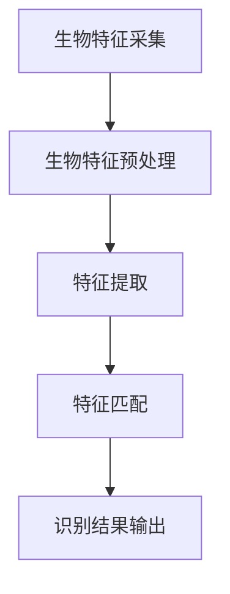
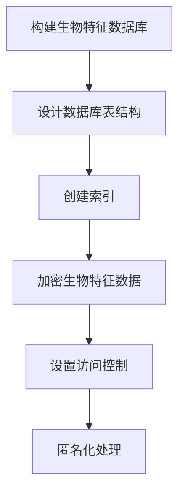
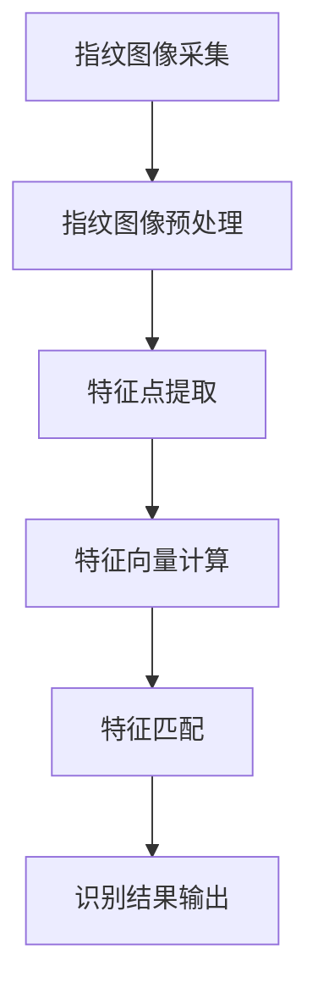
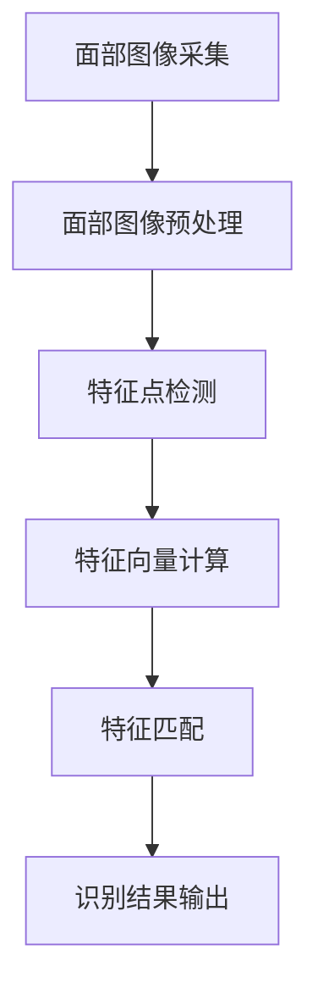
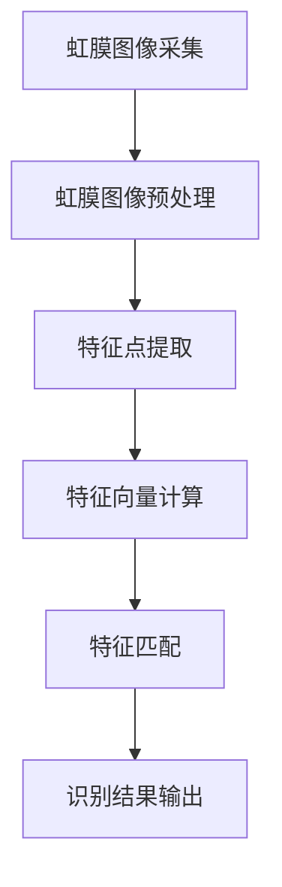
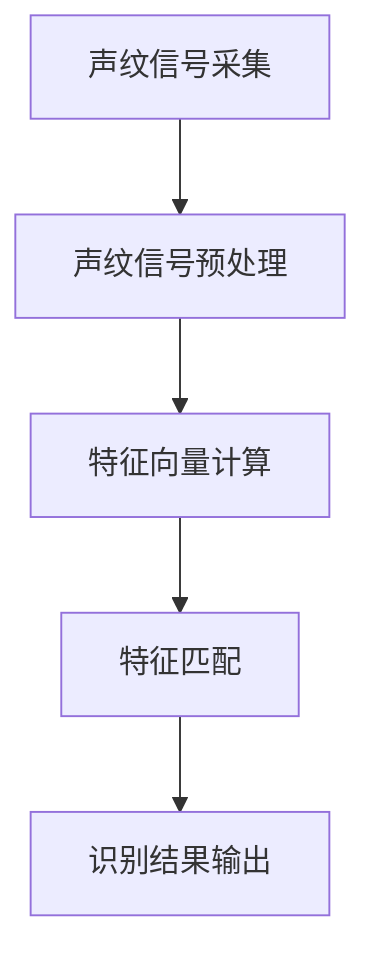

                 

### 第一部分：生物识别技术概述

#### 第1章：生物识别技术概述

##### 1.1 生物识别技术的基本概念

###### 1.1.1 什么是生物识别技术

生物识别技术是指利用人体生物特征进行身份认证和身份验证的技术。生物特征是指人类固有的、不可替代的、与生俱来的生理或行为特征，如指纹、面部、虹膜、声纹等。生物识别技术通过采集和识别这些生物特征，实现对用户的身份识别。

生物识别技术的定义可以归纳为以下几点：

1. **基于生物特征**：生物识别技术依赖于生物特征，如指纹、面部、虹膜、声纹等。
2. **自动识别**：生物识别技术采用计算机算法和硬件设备，自动识别和验证用户的身份。
3. **准确性高**：生物识别技术具有较高的准确性和稳定性，可以大大降低人工识别的错误率。
4. **不可复制性**：生物特征具有唯一性和不可复制性，这使得生物识别技术具有很高的安全性和可靠性。

###### 1.1.2 生物识别技术的作用和重要性

生物识别技术的作用和重要性主要体现在以下几个方面：

1. **提高安全性**：生物识别技术可以有效地防止非法入侵和身份冒用，提高系统的安全性。
2. **简化身份验证过程**：生物识别技术简化了身份验证过程，用户无需记忆复杂的密码或携带身份证等证件，即可方便快捷地进行身份验证。
3. **降低运营成本**：生物识别技术可以自动化身份验证过程，减少了人工操作和管理的成本。
4. **广泛应用**：生物识别技术已经被广泛应用于多个领域，包括金融、医疗、安全、交通、智能家居等，具有广泛的应用前景。

##### 1.2 生物识别技术的发展历史

###### 1.2.1 从早期生物识别技术到现代生物识别技术的演进

生物识别技术的发展可以追溯到20世纪60年代，当时科学家们开始研究如何利用生物特征进行身份识别。早期的生物识别技术主要包括指纹识别和面部识别。

1. **指纹识别**：20世纪60年代，美国联邦调查局开始使用指纹识别技术进行犯罪调查和身份验证。这是指纹识别技术首次在官方机构中得到广泛应用。
2. **面部识别**：20世纪70年代，面部识别技术开始应用于安全系统和身份验证。随着计算机技术和图像处理技术的不断发展，面部识别技术的准确性和稳定性得到了显著提高。

随着计算机技术和人工智能技术的快速发展，生物识别技术逐渐走向成熟。现代生物识别技术包括指纹识别、面部识别、虹膜识别、声纹识别等。这些技术的应用场景也越来越广泛。

###### 1.2.2 重要里程碑事件和关键进展

生物识别技术的发展历程中，有许多重要的里程碑事件和关键进展。以下是一些重要的里程碑：

1. **2000年**：生物特征识别技术被美国国家标准与技术研究院（NIST）列为四大关键技术之一，标志着生物识别技术的正式兴起。
2. **2005年**：国际标准化组织（ISO）发布了ISO/IEC 19794生物特征识别数据格式标准，统一了指纹、面部、虹膜等生物特征数据的标准格式。
3. **2010年**：面部识别技术在智能手机中得到广泛应用，苹果公司的iPhone 5首次引入了面部识别技术——Touch ID。
4. **2015年**：深度学习技术在生物识别领域取得重大突破，大大提高了生物识别的准确性和效率。
5. **2020年**：随着人工智能技术的发展，生物识别技术逐渐向多模态、跨领域、实时性等方面发展，应用场景更加丰富。

##### 1.3 生物识别技术的分类

生物识别技术根据识别的生物特征类型，可以分为以下几类：

###### 1.3.1 指纹识别

指纹识别是基于人类指纹的独特性和唯一性进行身份验证的技术。指纹识别技术具有高准确性、低成本、易于使用等优点，被广泛应用于门禁系统、手机解锁、安全认证等领域。

###### 1.3.2 面部识别

面部识别是基于人类面部特征进行身份验证的技术。面部识别技术具有实时性、非接触性、方便快捷等优点，被广泛应用于人脸支付、安防监控、门禁系统等领域。

###### 1.3.3 虹膜识别

虹膜识别是基于人类虹膜特征进行身份验证的技术。虹膜识别具有极高的准确性和唯一性，被广泛应用于安防系统、边境控制、金融认证等领域。

###### 1.3.4 声纹识别

声纹识别是基于人类声音特征进行身份验证的技术。声纹识别具有实时性、非接触性、方便快捷等优点，被广泛应用于电话银行、语音助手、安防监控等领域。

###### 1.3.5 手写识别

手写识别是基于人类手写特征进行身份验证的技术。手写识别技术被广泛应用于签名验证、手写输入等领域。

###### 1.3.6 体征识别

体征识别是基于人体生理信号进行身份验证的技术，如心跳、呼吸、体温等。体征识别技术被广泛应用于健康监测、医疗诊断等领域。

##### 1.4 生物识别技术在生活中的应用

生物识别技术在日常生活中有着广泛的应用，极大地便利了人们的生活。以下是一些生物识别技术在生活中的应用实例：

###### 1.4.1 个人身份验证

生物识别技术在个人身份验证中发挥着重要作用。例如，指纹识别技术被广泛应用于门禁系统、手机解锁、银行卡支付等场景，用户只需用指纹即可完成身份验证，方便快捷。

###### 1.4.2 安全认证

生物识别技术在安全认证领域有着广泛应用。例如，虹膜识别技术被应用于机场、监狱、边境等场所的安全认证，确保只有授权人员才能进入特定区域。

###### 1.4.3 支付

生物识别技术在支付领域中的应用越来越广泛。例如，面部识别支付技术已经被应用于一些国家的超市、餐厅等消费场所，用户只需通过面部识别即可完成支付。

###### 1.4.4 医疗

生物识别技术在医疗领域中的应用也越来越受到关注。例如，生物识别技术可以用于患者身份识别、药品管理、手术安全等场景，提高医疗服务的安全性和效率。

###### 1.4.5 教育

生物识别技术在教育领域中的应用也取得了显著成效。例如，面部识别技术可以用于课堂考勤、学生行为分析等场景，帮助学校更好地管理学生。

###### 1.4.6 智能家居

生物识别技术在智能家居中的应用也越来越普及。例如，通过指纹识别技术，用户可以方便地控制家中的灯光、空调、门锁等设备，提升生活便利性。

##### 1.5 生物识别技术的安全与隐私问题

生物识别技术虽然具有许多优势，但同时也伴随着安全与隐私问题。以下是对生物识别技术安全与隐私问题的探讨：

###### 1.5.1 生物识别技术的安全挑战

生物识别技术的安全挑战主要表现在以下几个方面：

1. **数据泄露风险**：生物识别数据一旦泄露，可能会被用于非法用途，对用户造成严重损失。
2. **生物特征数据的恶意利用**：恶意攻击者可能会通过伪造生物特征，冒用他人身份。
3. **生物特征数据库的安全性**：生物特征数据库可能成为黑客攻击的目标，如果数据库被攻破，用户的身份信息将面临严重威胁。

###### 1.5.2 生物识别技术的隐私问题

生物识别技术的隐私问题主要体现在以下几个方面：

1. **个人隐私保护的需求和挑战**：在生物识别技术广泛应用的过程中，如何保护用户的个人隐私成为了一个重要问题。
2. **生物识别数据的收集、存储和处理过程中的隐私问题**：生物识别数据在收集、存储和处理过程中，可能会面临隐私泄露的风险。
3. **隐私保护技术的应用和发展**：为了解决生物识别技术的隐私问题，需要开发和应用各种隐私保护技术，如加密技术、匿名化技术等。

###### 1.5.3 法律法规与伦理规范

生物识别技术的发展需要法律法规和伦理规范的引导。以下是对法律法规和伦理规范在生物识别技术发展中的作用进行探讨：

1. **相关法律法规的制定和实施**：各国政府和国际组织需要制定和完善生物识别技术的相关法律法规，规范生物识别技术的使用和管理。
2. **生物识别技术的伦理问题**：生物识别技术的广泛应用可能会引发一系列伦理问题，如隐私权、知情同意、数据使用等。需要建立伦理规范，确保生物识别技术的合理使用。
3. **伦理规范在生物识别技术发展中的作用**：伦理规范可以为生物识别技术的发展提供指导，促进生物识别技术的健康发展。

###### 1.5.4 安全与隐私的平衡

在生物识别技术的发展过程中，需要平衡安全和隐私之间的关系。以下是对安全与隐私平衡原则、安全防护与隐私保护技术的发展趋势进行探讨：

1. **安全与隐私的权衡原则**：在设计和应用生物识别技术时，需要考虑安全和隐私的平衡，不能为了追求安全性而忽视用户的隐私保护。
2. **安全防护与隐私保护技术的发展趋势**：随着生物识别技术的不断进步，安全防护和隐私保护技术也在不断发展。例如，加密技术、匿名化技术、隐私增强技术等，将为生物识别技术的安全与隐私保护提供新的解决方案。
3. **案例分析**：通过案例分析，探讨在实际应用中如何实现安全与隐私的平衡，为其他生物识别应用场景提供借鉴。

综上所述，生物识别技术作为一种先进的身份认证技术，具有广泛的应用前景。但同时，生物识别技术也面临着安全和隐私问题。在生物识别技术的发展过程中，需要平衡安全和隐私之间的关系，采取有效的安全防护和隐私保护措施，确保生物识别技术的健康发展。

---

在接下来的部分，我们将深入探讨生物识别技术的安全与隐私问题，分析相关的法律法规与伦理规范，以及探讨实现安全与隐私平衡的方法。请继续关注。

---

---

#### 第2章：生物识别技术原理

##### 2.1 生物识别技术的工作原理

###### 2.1.1 生物特征识别的基本流程

生物特征识别的基本流程可以分为以下几个步骤：

1. **生物特征采集**：通过传感器、摄像头等设备采集用户的生物特征数据，如指纹、面部、虹膜等。
2. **生物特征预处理**：对采集到的生物特征数据进行预处理，包括去噪、增强、对齐等，以提高后续特征提取的准确性和效率。
3. **特征提取**：将预处理后的生物特征数据转化为数字特征向量，用于后续的匹配和识别。特征提取方法包括基于特征点的提取、基于图像的提取、基于频域的提取等。
4. **特征匹配**：将提取出的特征向量与数据库中的特征向量进行匹配，以确定是否为同一用户。常见的特征匹配算法包括欧氏距离、余弦相似度、K最近邻等。
5. **识别结果输出**：根据匹配结果判断用户身份，并将结果输出到相关的系统或设备中。

以下是一个简化的 Mermaid 流程图，展示生物特征识别的基本流程：



###### 2.1.2 生物特征识别算法

生物特征识别算法是实现生物特征识别的核心，其性能直接影响到识别系统的准确性和效率。以下介绍几种常见的生物特征识别算法：

1. **模式识别基本理论**：
   - 模式识别是指通过特征分析，将一个未知样本分类到预先定义的类别中的过程。
   - 基本理论包括特征空间、距离度量、分类规则等。

2. **特征匹配算法介绍**：
   - **欧氏距离**：衡量两个特征向量之间的相似度，计算公式为 $\sum_{i=1}^{n}(x_i - y_i)^2$。
   - **余弦相似度**：衡量两个特征向量在特征空间中的夹角余弦值，计算公式为 $\frac{\sum_{i=1}^{n}x_iy_i}{\sqrt{\sum_{i=1}^{n}x_i^2}\sqrt{\sum_{i=1}^{n}y_i^2}}$。

3. **常见生物识别算法的应用**：
   - **指纹识别**：常用的指纹识别算法包括 minutia 特征点提取、Zernike矩、Ridge valley 等级等。
   - **面部识别**：常用的面部识别算法包括特征点检测、特征提取、PCA（主成分分析）、LDA（线性判别分析）等。
   - **虹膜识别**：常用的虹膜识别算法包括特征点检测、特征提取、Gabor变换、小波变换等。
   - **声纹识别**：常用的声纹识别算法包括 MFCC（梅尔频率倒谱系数）、GMM（高斯混合模型）、HMM（隐马尔可夫模型）等。

以下是一个简单的伪代码示例，用于说明指纹识别的基本算法流程：

```python
# 指纹识别伪代码

# 特征点提取
def extract_minutiae(fingerprint_image):
    # 对指纹图像进行预处理，如去噪、增强、二值化等
    preprocessed_image = preprocess_image(fingerprint_image)
    # 检测特征点
    minutiae_points = detect_minutiae(preprocessed_image)
    return minutiae_points

# 特征匹配
def match_features(template_feature, sample_feature):
    # 计算特征向量之间的欧氏距离
    distance = euclidean_distance(template_feature, sample_feature)
    # 设置距离阈值
    threshold = set_threshold(distance)
    # 判断是否匹配
    if distance < threshold:
        return True
    else:
        return False

# 主函数
def fingerprint_recognition(fingerprint_image):
    # 采集指纹图像
    image = capture_fingerprint_image()
    # 提取特征点
    minutiae_points = extract_minutiae(image)
    # 提取特征向量
    feature_vector = extract_feature_vector(minutiae_points)
    # 从数据库中获取模板特征向量
    template_vector = get_template_vector()
    # 进行特征匹配
    match_result = match_features(template_vector, feature_vector)
    # 输出识别结果
    if match_result:
        print("指纹匹配成功")
    else:
        print("指纹匹配失败")
```

###### 2.1.3 生物特征数据库管理

生物特征数据库管理是生物识别技术的重要组成部分，它涉及到数据库的构建、索引技术以及安全性与隐私保护措施。

1. **生物特征数据库的构建**：
   - 生物特征数据库通常包括用户信息表、生物特征模板表、生物特征样本表等。
   - 用户信息表存储用户的基本信息，如用户ID、姓名等。
   - 生物特征模板表存储用户的生物特征模板，用于后续的匹配和识别。
   - 生物特征样本表存储用户的生物特征样本数据，用于训练和优化特征提取和匹配算法。

2. **数据库索引技术**：
   - 为了提高数据库的查询效率，可以采用索引技术，如B树索引、哈希索引等。
   - 索引可以快速定位到特定的用户或生物特征模板，减少搜索时间。

3. **数据库安全性与隐私保护措施**：
   - **数据加密**：对存储在数据库中的生物特征数据进行加密，防止数据泄露。
   - **访问控制**：实施严格的访问控制策略，只有授权用户才能访问数据库。
   - **匿名化处理**：对用户的生物特征数据进行匿名化处理，保护用户的隐私。

以下是一个简化的 Mermaid 流程图，展示生物特征数据库管理的基本流程：



##### 2.2 指纹识别技术

###### 2.2.1 指纹识别原理

指纹识别技术是生物识别技术中应用最广泛的一种，其基本原理如下：

1. **指纹采集与预处理**：
   - 指纹采集设备通过光学或电容式传感器捕捉指纹图像。
   - 指纹图像经过预处理，包括去噪、增强、二值化等操作，以提高图像质量。

2. **指纹特征点提取**：
   - 利用特征点检测算法，如角点检测、边缘检测等，识别出指纹图像中的特征点，如脊点、叉点、端点等。
   - 将特征点信息转化为数字特征向量，用于后续的匹配和识别。

3. **模式识别与匹配算法**：
   - 采用模式识别算法，如欧氏距离、余弦相似度等，计算特征向量之间的相似度。
   - 根据设定的阈值判断特征向量是否匹配，从而确定指纹的身份。

以下是一个简化的 Mermaid 流程图，展示指纹识别的基本流程：



###### 2.2.2 指纹识别技术发展

指纹识别技术自20世纪60年代开始发展，至今已经经历了多个阶段：

1. **传统指纹识别技术**：
   - 早期指纹识别技术主要采用基于人工检测和匹配的方法，如脊线匹配、Zernike矩等。
   - 随着计算机技术的发展，指纹识别逐渐走向自动化和智能化。

2. **基于深度学习的指纹识别**：
   - 深度学习技术的引入，使得指纹识别的准确性和效率得到了显著提升。
   - 常见的深度学习模型包括卷积神经网络（CNN）、循环神经网络（RNN）等。
   - 基于深度学习的指纹识别算法已经广泛应用于实际场景，如智能手机解锁、门禁系统等。

3. **指纹识别技术的挑战与趋势**：
   - 指纹识别技术的挑战包括指纹图像质量、抗干扰能力、跨种族识别等。
   - 未来发展趋势包括多模态生物识别、实时性提升、隐私保护等。

##### 2.3 面部识别技术

###### 2.3.1 面部识别原理

面部识别技术是基于人类面部特征进行身份验证的技术，其基本原理如下：

1. **面部特征点检测**：
   - 通过面部特征点检测算法，如Haar特征分类器、HOG（Histogram of Oriented Gradients）特征等，识别出面部图像中的关键特征点，如眼睛、鼻子、嘴巴等。

2. **面部特征提取**：
   - 将检测到的面部特征点用于特征提取，生成特征向量，用于后续的匹配和识别。
   - 常用的特征提取方法包括PCA（主成分分析）、LDA（线性判别分析）、深度特征提取等。

3. **面部匹配算法**：
   - 采用匹配算法，如欧氏距离、余弦相似度等，计算特征向量之间的相似度。
   - 根据设定的阈值判断特征向量是否匹配，从而确定面部的身份。

以下是一个简化的 Mermaid 流程图，展示面部识别的基本流程：



###### 2.3.2 面部识别技术发展

面部识别技术自20世纪70年代开始发展，至今已经经历了多个阶段：

1. **传统面部识别技术**：
   - 早期面部识别技术主要采用基于特征点检测和匹配的方法，如特征点提取、脊线匹配等。
   - 随着计算机技术和图像处理技术的发展，面部识别逐渐走向自动化和智能化。

2. **基于深度学习的面部识别**：
   - 深度学习技术的引入，使得面部识别的准确性和效率得到了显著提升。
   - 常见的深度学习模型包括卷积神经网络（CNN）、循环神经网络（RNN）等。
   - 基于深度学习的面部识别算法已经广泛应用于实际场景，如人脸支付、安防监控等。

3. **面部识别技术的挑战与趋势**：
   - 面部识别技术的挑战包括图像质量、光照变化、姿态变化等。
   - 未来发展趋势包括多模态生物识别、实时性提升、隐私保护等。

##### 2.4 虹膜识别技术

###### 2.4.1 虹膜识别原理

虹膜识别技术是基于人类虹膜特征进行身份验证的技术，其基本原理如下：

1. **虹膜图像采集与预处理**：
   - 通过虹膜扫描设备捕捉虹膜图像。
   - 对虹膜图像进行预处理，包括去噪、增强、对齐等操作，以提高图像质量。

2. **虹膜特征点提取**：
   - 利用特征点检测算法，如角点检测、边缘检测等，识别出虹膜图像中的关键特征点，如瞳孔、虹膜纹理等。

3. **虹膜匹配算法**：
   - 采用匹配算法，如欧氏距离、余弦相似度等，计算特征向量之间的相似度。
   - 根据设定的阈值判断特征向量是否匹配，从而确定虹膜的身份。

以下是一个简化的 Mermaid 流程图，展示虹膜识别的基本流程：



###### 2.4.2 虹膜识别技术发展

虹膜识别技术自20世纪90年代开始发展，至今已经经历了多个阶段：

1. **传统虹膜识别技术**：
   - 早期虹膜识别技术主要采用基于特征点检测和匹配的方法，如角点检测、Gabor变换等。
   - 随着光学技术和图像处理技术的发展，虹膜识别逐渐走向自动化和智能化。

2. **基于深度学习的虹膜识别**：
   - 深度学习技术的引入，使得虹膜识别的准确性和效率得到了显著提升。
   - 常见的深度学习模型包括卷积神经网络（CNN）、循环神经网络（RNN）等。
   - 基于深度学习的虹膜识别算法已经广泛应用于实际场景，如身份验证、安防监控等。

3. **虹膜识别技术的挑战与趋势**：
   - 虹膜识别技术的挑战包括图像质量、环境光照、眼睑遮挡等。
   - 未来发展趋势包括多模态生物识别、实时性提升、隐私保护等。

##### 2.5 声纹识别技术

###### 2.5.1 声纹识别原理

声纹识别技术是基于人类声音特征进行身份验证的技术，其基本原理如下：

1. **声纹信号采集与预处理**：
   - 通过麦克风捕捉用户的语音信号。
   - 对语音信号进行预处理，包括降噪、去噪、分段等操作，以提高后续特征提取的准确性和效率。

2. **声纹特征提取**：
   - 利用特征提取算法，如MFCC（梅尔频率倒谱系数）、GMM（高斯混合模型）等，将语音信号转换为特征向量。

3. **声纹匹配算法**：
   - 采用匹配算法，如欧氏距离、余弦相似度等，计算特征向量之间的相似度。
   - 根据设定的阈值判断特征向量是否匹配，从而确定声纹的身份。

以下是一个简化的 Mermaid 流程图，展示声纹识别的基本流程：



###### 2.5.2 声纹识别技术发展

声纹识别技术自20世纪70年代开始发展，至今已经经历了多个阶段：

1. **传统声纹识别技术**：
   - 早期声纹识别技术主要采用基于声学模型和模式识别的方法，如线性预测编码（LPC）、共振峰分析等。
   - 随着语音处理技术的发展，声纹识别逐渐走向自动化和智能化。

2. **基于深度学习的声纹识别**：
   - 深度学习技术的引入，使得声纹识别的准确性和效率得到了显著提升。
   - 常见的深度学习模型包括卷积神经网络（CNN）、循环神经网络（RNN）等。
   - 基于深度学习的声纹识别算法已经广泛应用于实际场景，如电话银行、语音助手等。

3. **声纹识别技术的挑战与趋势**：
   - 声纹识别技术的挑战包括噪声干扰、语音变化、跨语言识别等。
   - 未来发展趋势包括多模态生物识别、实时性提升、隐私保护等。

通过本章对生物识别技术原理的介绍，我们了解了生物特征识别的基本流程、常见生物识别算法、生物特征数据库管理，以及指纹识别、面部识别、虹膜识别和声纹识别技术的原理和发展。在接下来的章节中，我们将进一步探讨生物识别技术在实际应用场景中的实现方法和挑战。

---

在下一部分，我们将详细分析生物识别技术在个人身份验证、金融支付、医疗等领域的应用场景，以及这些应用场景中的优势和挑战。敬请期待。

---

---

#### 第3章：生物识别技术的应用场景

##### 3.1 生物识别技术在个人身份验证中的应用

生物识别技术在个人身份验证中的应用越来越广泛，已经成为身份验证领域的重要手段。以下将详细讨论生物识别技术在门禁系统、移动设备解锁和网络安全等场景中的应用及其优势和挑战。

###### 3.1.1 生物识别技术在门禁系统中的应用

生物识别技术在门禁系统中发挥着重要作用，可以显著提高门禁系统的安全性和便捷性。以下是生物识别技术在门禁系统中的应用实例及其特点：

1. **指纹识别门禁系统**：
   - **应用实例**：许多公司和住宅小区采用指纹识别门禁系统，用户只需用指纹即可开门。
   - **优势**：指纹识别具有高准确性、低成本和易于使用等优点，可以防止非法入侵和身份冒用。
   - **挑战**：指纹识别系统可能会受到指纹磨损、干湿条件等因素的影响，导致识别失败。

2. **面部识别门禁系统**：
   - **应用实例**：一些高档写字楼和酒店采用面部识别门禁系统，用户只需面对摄像头即可开门。
   - **优势**：面部识别具有实时性、非接触性和便捷性等优点，适合公共场所。
   - **挑战**：面部识别系统可能受到光照条件、姿态变化等因素的影响，降低识别准确性。

3. **虹膜识别门禁系统**：
   - **应用实例**：一些高端住宅和金融机构采用虹膜识别门禁系统，用户只需睁开眼睛即可开门。
   - **优势**：虹膜识别具有极高的准确性和唯一性，适合对安全性要求较高的场景。
   - **挑战**：虹膜识别系统成本较高，且设备体积较大，适用场景受到一定限制。

**总结**：生物识别技术在门禁系统中的应用具有显著的优势，但也面临一些挑战。通过不断优化技术，提高识别准确性和稳定性，可以更好地满足不同场景的需求。

###### 3.1.2 生物识别技术在移动设备解锁中的应用

生物识别技术在移动设备解锁中的应用也越来越普及，如指纹识别、面部识别和声纹识别等。以下是这些技术在移动设备解锁中的应用实例及其特点：

1. **指纹识别解锁**：
   - **应用实例**：许多智能手机采用指纹识别解锁，用户只需用指纹即可解锁设备。
   - **优势**：指纹识别具有高准确性、低成本和易于使用等优点，可以提高设备的安全性。
   - **挑战**：指纹识别可能受到指纹磨损、干湿条件等因素的影响，降低识别准确性。

2. **面部识别解锁**：
   - **应用实例**：一些智能手机采用面部识别解锁，用户只需面对摄像头即可解锁设备。
   - **优势**：面部识别具有实时性、非接触性和便捷性等优点，可以提高设备的安全性。
   - **挑战**：面部识别可能受到光照条件、姿态变化等因素的影响，降低识别准确性。

3. **声纹识别解锁**：
   - **应用实例**：一些智能手机采用声纹识别解锁，用户只需说出特定的口令即可解锁设备。
   - **优势**：声纹识别具有实时性、非接触性和便捷性等优点，可以提高设备的安全性。
   - **挑战**：声纹识别可能受到环境噪声、语音变化等因素的影响，降低识别准确性。

**总结**：生物识别技术在移动设备解锁中的应用具有显著的优势，但也面临一些挑战。通过不断优化技术，提高识别准确性和稳定性，可以更好地满足用户需求。

###### 3.1.3 生物识别技术在网络安全中的应用

生物识别技术在网络安全中发挥着重要作用，可以提高系统的安全性，防止非法入侵和身份冒用。以下是生物识别技术在网络安全中的应用实例及其特点：

1. **生物识别身份验证**：
   - **应用实例**：许多网络安全系统采用生物识别身份验证，用户只需通过指纹、面部、虹膜或声纹等生物特征即可验证身份。
   - **优势**：生物识别身份验证具有高准确性、低成本和易于使用等优点，可以提高网络系统的安全性。
   - **挑战**：生物识别身份验证可能受到生物特征数据泄露、恶意攻击等因素的影响，降低系统安全性。

2. **生物识别加密**：
   - **应用实例**：一些网络安全系统采用生物识别加密技术，用户只需通过指纹、面部、虹膜或声纹等生物特征即可生成加密密钥。
   - **优势**：生物识别加密技术具有高安全性、低成本和易于使用等优点，可以提高网络系统的安全性。
   - **挑战**：生物识别加密技术可能受到生物特征数据泄露、恶意攻击等因素的影响，降低系统安全性。

**总结**：生物识别技术在网络安全中的应用具有显著的优势，但也面临一些挑战。通过不断优化技术，提高识别准确性和加密安全性，可以更好地满足网络安全需求。

##### 3.2 生物识别技术在金融领域的应用

生物识别技术在金融领域中的应用越来越广泛，可以提高支付安全性和金融服务的便捷性。以下将详细讨论生物识别技术在支付系统、信用卡与银行账户管理、反欺诈等方面的应用及其优势和挑战。

###### 3.2.1 生物识别技术在支付系统中的应用

生物识别技术在支付系统中的应用，如指纹识别、面部识别和声纹识别等，可以显著提高支付安全性。以下是这些技术在支付系统中的应用实例及其特点：

1. **指纹识别支付**：
   - **应用实例**：一些支付系统采用指纹识别技术，用户只需用指纹即可完成支付。
   - **优势**：指纹识别具有高准确性、低成本和易于使用等优点，可以提高支付安全性。
   - **挑战**：指纹识别可能受到指纹磨损、干湿条件等因素的影响，降低识别准确性。

2. **面部识别支付**：
   - **应用实例**：一些支付系统采用面部识别技术，用户只需面对摄像头即可完成支付。
   - **优势**：面部识别具有实时性、非接触性和便捷性等优点，可以提高支付安全性。
   - **挑战**：面部识别可能受到光照条件、姿态变化等因素的影响，降低识别准确性。

3. **声纹识别支付**：
   - **应用实例**：一些支付系统采用声纹识别技术，用户只需说出特定的口令即可完成支付。
   - **优势**：声纹识别具有实时性、非接触性和便捷性等优点，可以提高支付安全性。
   - **挑战**：声纹识别可能受到环境噪声、语音变化等因素的影响，降低识别准确性。

**总结**：生物识别技术在支付系统中的应用具有显著的优势，但也面临一些挑战。通过不断优化技术，提高识别准确性和支付安全性，可以更好地满足用户需求。

###### 3.2.2 生物识别技术在信用卡与银行账户管理中的应用

生物识别技术在信用卡与银行账户管理中的应用，如指纹识别、面部识别和声纹识别等，可以显著提高账户安全性。以下是这些技术在信用卡与银行账户管理中的应用实例及其特点：

1. **指纹识别信用卡**：
   - **应用实例**：一些信用卡采用指纹识别技术，用户只需用指纹即可验证信用卡身份。
   - **优势**：指纹识别具有高准确性、低成本和易于使用等优点，可以提高信用卡安全性。
   - **挑战**：指纹识别可能受到指纹磨损、干湿条件等因素的影响，降低识别准确性。

2. **面部识别银行账户管理**：
   - **应用实例**：一些银行账户管理系统采用面部识别技术，用户只需面对摄像头即可完成账户操作。
   - **优势**：面部识别具有实时性、非接触性和便捷性等优点，可以提高银行账户安全性。
   - **挑战**：面部识别可能受到光照条件、姿态变化等因素的影响，降低识别准确性。

3. **声纹识别银行账户管理**：
   - **应用实例**：一些银行账户管理系统采用声纹识别技术，用户只需说出特定的口令即可完成账户操作。
   - **优势**：声纹识别具有实时性、非接触性和便捷性等优点，可以提高银行账户安全性。
   - **挑战**：声纹识别可能受到环境噪声、语音变化等因素的影响，降低识别准确性。

**总结**：生物识别技术在信用卡与银行账户管理中的应用具有显著的优势，但也面临一些挑战。通过不断优化技术，提高识别准确性和账户安全性，可以更好地满足用户需求。

###### 3.2.3 生物识别技术在反欺诈中的应用

生物识别技术在反欺诈中的应用，如指纹识别、面部识别和声纹识别等，可以显著提高反欺诈能力。以下是这些技术在反欺诈中的应用实例及其特点：

1. **指纹识别反欺诈**：
   - **应用实例**：一些支付系统和金融机构采用指纹识别技术，对用户进行实时身份验证，防止欺诈行为。
   - **优势**：指纹识别具有高准确性、低成本和易于使用等优点，可以提高反欺诈能力。
   - **挑战**：指纹识别可能受到指纹磨损、干湿条件等因素的影响，降低识别准确性。

2. **面部识别反欺诈**：
   - **应用实例**：一些支付系统和金融机构采用面部识别技术，对用户进行实时身份验证，防止欺诈行为。
   - **优势**：面部识别具有实时性、非接触性和便捷性等优点，可以提高反欺诈能力。
   - **挑战**：面部识别可能受到光照条件、姿态变化等因素的影响，降低识别准确性。

3. **声纹识别反欺诈**：
   - **应用实例**：一些支付系统和金融机构采用声纹识别技术，对用户进行实时身份验证，防止欺诈行为。
   - **优势**：声纹识别具有实时性、非接触性和便捷性等优点，可以提高反欺诈能力。
   - **挑战**：声纹识别可能受到环境噪声、语音变化等因素的影响，降低识别准确性。

**总结**：生物识别技术在反欺诈中的应用具有显著的优势，但也面临一些挑战。通过不断优化技术，提高识别准确性和反欺诈能力，可以更好地保护用户利益。

##### 3.3 生物识别技术在医疗领域的应用

生物识别技术在医疗领域中的应用越来越广泛，可以提高医疗服务的安全性和效率。以下将详细讨论生物识别技术在患者身份识别、手术安全和药物管理等方面的应用及其优势和挑战。

###### 3.3.1 生物识别技术在患者身份识别中的应用

生物识别技术在患者身份识别中的应用，如指纹识别、面部识别和虹膜识别等，可以显著提高患者身份识别的准确性。以下是这些技术在患者身份识别中的应用实例及其特点：

1. **指纹识别患者身份识别**：
   - **应用实例**：一些医院和诊所采用指纹识别技术，对患者进行身份验证。
   - **优势**：指纹识别具有高准确性、低成本和易于使用等优点，可以提高患者身份识别的准确性。
   - **挑战**：指纹识别可能受到指纹磨损、干湿条件等因素的影响，降低识别准确性。

2. **面部识别患者身份识别**：
   - **应用实例**：一些医院和诊所采用面部识别技术，对患者进行身份验证。
   - **优势**：面部识别具有实时性、非接触性和便捷性等优点，可以提高患者身份识别的准确性。
   - **挑战**：面部识别可能受到光照条件、姿态变化等因素的影响，降低识别准确性。

3. **虹膜识别患者身份识别**：
   - **应用实例**：一些医院和诊所采用虹膜识别技术，对患者进行身份验证。
   - **优势**：虹膜识别具有高准确性、唯一性和不易被伪造等优点，可以提高患者身份识别的准确性。
   - **挑战**：虹膜识别系统成本较高，且设备体积较大，适用场景受到一定限制。

**总结**：生物识别技术在患者身份识别中的应用具有显著的优势，但也面临一些挑战。通过不断优化技术，提高识别准确性和稳定性，可以更好地满足医疗需求。

###### 3.3.2 生物识别技术在手术安全中的应用

生物识别技术在手术安全中的应用，如指纹识别、面部识别和声纹识别等，可以显著提高手术安全性和准确性。以下是这些技术在手术安全中的应用实例及其特点：

1. **指纹识别手术安全**：
   - **应用实例**：一些手术室采用指纹识别技术，对手术医生进行身份验证，确保只有授权医生才能进入手术室。
   - **优势**：指纹识别具有高准确性、低成本和易于使用等优点，可以提高手术安全性。
   - **挑战**：指纹识别可能受到指纹磨损、干湿条件等因素的影响，降低识别准确性。

2. **面部识别手术安全**：
   - **应用实例**：一些手术室采用面部识别技术，对手术医生进行身份验证，确保只有授权医生才能进入手术室。
   - **优势**：面部识别具有实时性、非接触性和便捷性等优点，可以提高手术安全性。
   - **挑战**：面部识别可能受到光照条件、姿态变化等因素的影响，降低识别准确性。

3. **声纹识别手术安全**：
   - **应用实例**：一些手术室采用声纹识别技术，对手术医生进行身份验证，确保只有授权医生才能进入手术室。
   - **优势**：声纹识别具有实时性、非接触性和便捷性等优点，可以提高手术安全性。
   - **挑战**：声纹识别可能受到环境噪声、语音变化等因素的影响，降低识别准确性。

**总结**：生物识别技术在手术安全中的应用具有显著的优势，但也面临一些挑战。通过不断优化技术，提高识别准确性和安全性，可以更好地满足手术安全需求。

###### 3.3.3 生物识别技术在药物管理中的应用

生物识别技术在药物管理中的应用，如指纹识别、面部识别和虹膜识别等，可以显著提高药物管理的准确性和安全性。以下是这些技术在药物管理中的应用实例及其特点：

1. **指纹识别药物管理**：
   - **应用实例**：一些药房和医院采用指纹识别技术，对药品进行身份验证，确保只有授权人员才能领取药品。
   - **优势**：指纹识别具有高准确性、低成本和易于使用等优点，可以提高药物管理的安全性。
   - **挑战**：指纹识别可能受到指纹磨损、干湿条件等因素的影响，降低识别准确性。

2. **面部识别药物管理**：
   - **应用实例**：一些药房和医院采用面部识别技术，对药品领取人员进行身份验证，确保只有授权人员才能领取药品。
   - **优势**：面部识别具有实时性、非接触性和便捷性等优点，可以提高药物管理的安全性。
   - **挑战**：面部识别可能受到光照条件、姿态变化等因素的影响，降低识别准确性。

3. **虹膜识别药物管理**：
   - **应用实例**：一些药房和医院采用虹膜识别技术，对药品领取人员进行身份验证，确保只有授权人员才能领取药品。
   - **优势**：虹膜识别具有高准确性、唯一性和不易被伪造等优点，可以提高药物管理的安全性。
   - **挑战**：虹膜识别系统成本较高，且设备体积较大，适用场景受到一定限制。

**总结**：生物识别技术在药物管理中的应用具有显著的优势，但也面临一些挑战。通过不断优化技术，提高识别准确性和安全性，可以更好地满足药物管理需求。

##### 3.4 生物识别技术在执法和安全领域的应用

生物识别技术在执法和安全领域的应用，如指纹识别、面部识别和声纹识别等，可以显著提高执法和安全工作的效率和准确性。以下将详细讨论生物识别技术在边境控制、犯罪侦查和公共安全等方面的应用及其优势和挑战。

###### 3.4.1 生物识别技术在边境控制中的应用

生物识别技术在边境控制中的应用，如指纹识别、面部识别和虹膜识别等，可以显著提高边境安全性和通关效率。以下是这些技术在边境控制中的应用实例及其特点：

1. **指纹识别边境控制**：
   - **应用实例**：一些边境口岸采用指纹识别技术，对入境人员进行身份验证，防止非法入境。
   - **优势**：指纹识别具有高准确性、低成本和易于使用等优点，可以提高边境安全性。
   - **挑战**：指纹识别可能受到指纹磨损、干湿条件等因素的影响，降低识别准确性。

2. **面部识别边境控制**：
   - **应用实例**：一些边境口岸采用面部识别技术，对入境人员进行身份验证，防止非法入境。
   - **优势**：面部识别具有实时性、非接触性和便捷性等优点，可以提高边境安全性。
   - **挑战**：面部识别可能受到光照条件、姿态变化等因素的影响，降低识别准确性。

3. **虹膜识别边境控制**：
   - **应用实例**：一些边境口岸采用虹膜识别技术，对入境人员进行身份验证，防止非法入境。
   - **优势**：虹膜识别具有高准确性、唯一性和不易被伪造等优点，可以提高边境安全性。
   - **挑战**：虹膜识别系统成本较高，且设备体积较大，适用场景受到一定限制。

**总结**：生物识别技术在边境控制中的应用具有显著的优势，但也面临一些挑战。通过不断优化技术，提高识别准确性和稳定性，可以更好地满足边境控制需求。

###### 3.4.2 生物识别技术在犯罪侦查中的应用

生物识别技术在犯罪侦查中的应用，如指纹识别、面部识别和声纹识别等，可以显著提高犯罪侦查的效率和准确性。以下是这些技术在犯罪侦查中的应用实例及其特点：

1. **指纹识别犯罪侦查**：
   - **应用实例**：犯罪侦查部门采用指纹识别技术，对犯罪嫌疑人的指纹进行比对，确定犯罪嫌疑人的身份。
   - **优势**：指纹识别具有高准确性、低成本和易于使用等优点，可以提高犯罪侦查的准确性。
   - **挑战**：指纹识别可能受到指纹磨损、干湿条件等因素的影响，降低识别准确性。

2. **面部识别犯罪侦查**：
   - **应用实例**：犯罪侦查部门采用面部识别技术，对犯罪嫌疑人的面部特征进行比对，确定犯罪嫌疑人的身份。
   - **优势**：面部识别具有实时性、非接触性和便捷性等优点，可以提高犯罪侦查的准确性。
   - **挑战**：面部识别可能受到光照条件、姿态变化等因素的影响，降低识别准确性。

3. **声纹识别犯罪侦查**：
   - **应用实例**：犯罪侦查部门采用声纹识别技术，对犯罪嫌疑人的语音进行比对，确定犯罪嫌疑人的身份。
   - **优势**：声纹识别具有实时性、非接触性和便捷性等优点，可以提高犯罪侦查的准确性。
   - **挑战**：声纹识别可能受到环境噪声、语音变化等因素的影响，降低识别准确性。

**总结**：生物识别技术在犯罪侦查中的应用具有显著的优势，但也面临一些挑战。通过不断优化技术，提高识别准确性和稳定性，可以更好地满足犯罪侦查需求。

###### 3.4.3 生物识别技术在公共安全中的应用

生物识别技术在公共安全中的应用，如指纹识别、面部识别和声纹识别等，可以显著提高公共安全水平和应急响应能力。以下是这些技术在公共安全中的应用实例及其特点：

1. **指纹识别公共安全**：
   - **应用实例**：一些公共场所和建筑物采用指纹识别技术，对进入人员进行身份验证，确保只有授权人员才能进入。
   - **优势**：指纹识别具有高准确性、低成本和易于使用等优点，可以提高公共安全水平。
   - **挑战**：指纹识别可能受到指纹磨损、干湿条件等因素的影响，降低识别准确性。

2. **面部识别公共安全**：
   - **应用实例**：一些公共场所和建筑物采用面部识别技术，对进入人员进行身份验证，确保只有授权人员才能进入。
   - **优势**：面部识别具有实时性、非接触性和便捷性等优点，可以提高公共安全水平。
   - **挑战**：面部识别可能受到光照条件、姿态变化等因素的影响，降低识别准确性。

3. **声纹识别公共安全**：
   - **应用实例**：一些公共场所和建筑物采用声纹识别技术，对进入人员进行身份验证，确保只有授权人员才能进入。
   - **优势**：声纹识别具有实时性、非接触性和便捷性等优点，可以提高公共安全水平。
   - **挑战**：声纹识别可能受到环境噪声、语音变化等因素的影响，降低识别准确性。

**总结**：生物识别技术在公共安全中的应用具有显著的优势，但也面临一些挑战。通过不断优化技术，提高识别准确性和公共安全水平，可以更好地满足公共安全需求。

##### 3.5 智能交通系统中的生物识别应用

生物识别技术在智能交通系统中的应用，如指纹识别、面部识别和虹膜识别等，可以显著提高交通管理和公共安全水平。以下将详细讨论生物识别技术在智能交通系统中的应用实例及其优势和挑战。

###### 3.5.1 生物识别技术在智能交通系统中的应用

生物识别技术在智能交通系统中的应用包括车辆识别、驾驶员身份验证和交通监控等，以下是这些应用的实例及其特点：

1. **指纹识别车辆识别**：
   - **应用实例**：智能停车场采用指纹识别技术，对车主身份进行验证，实现快速入场和出场。
   - **优势**：指纹识别具有高准确性、低成本和易于使用等优点，可以提高停车场管理效率。
   - **挑战**：指纹识别可能受到指纹磨损、干湿条件等因素的影响，降低识别准确性。

2. **面部识别驾驶员身份验证**：
   - **应用实例**：一些自动驾驶车辆采用面部识别技术，对驾驶员身份进行验证，确保驾驶员处于清醒状态。
   - **优势**：面部识别具有实时性、非接触性和便捷性等优点，可以提高驾驶员安全性。
   - **挑战**：面部识别可能受到光照条件、姿态变化等因素的影响，降低识别准确性。

3. **虹膜识别交通监控**：
   - **应用实例**：一些智能交通系统采用虹膜识别技术，对交通违法行为进行监控，如闯红灯、超速等。
   - **优势**：虹膜识别具有高准确性、唯一性和不易被伪造等优点，可以提高交通监控效率。
   - **挑战**：虹膜识别系统成本较高，且设备体积较大，适用场景受到一定限制。

**总结**：生物识别技术在智能交通系统中的应用具有显著的优势，但也面临一些挑战。通过不断优化技术，提高识别准确性和稳定性，可以更好地满足交通管理和公共安全需求。

通过本章对生物识别技术在个人身份验证、金融支付、医疗、执法和安全、智能交通系统等领域的应用场景进行了详细讨论，分析了这些应用的优势和挑战。在接下来的章节中，我们将进一步探讨生物识别技术的挑战与未来趋势。敬请期待。

---

在下一部分，我们将深入分析生物识别技术的挑战与未来趋势，包括技术挑战、安全与隐私问题、法规与伦理规范，以及生物识别技术在人工智能和机器学习领域的融合与发展。敬请期待。

---

---

#### 第4章：生物识别技术的挑战与未来趋势

##### 4.1 生物识别技术的挑战

生物识别技术在带来便利和安全性的同时，也面临着一系列的挑战，主要包括技术挑战、安全与隐私挑战以及法规与伦理挑战。

###### 4.1.1 技术挑战

1. **准确性和稳定性**：
   - 生物识别技术的准确性和稳定性直接影响其应用效果。例如，指纹识别在干燥的手指上表现良好，但在手指湿润或有污垢时可能识别失败。
   - **解决方法**：通过改进传感器技术、图像处理算法以及增加生物特征数据样本，可以提高识别准确性和稳定性。

2. **鲁棒性**：
   - 生物识别技术需要具备良好的鲁棒性，能够在不同环境、不同光照条件下正常运行。
   - **解决方法**：采用自适应光学技术、多传感器融合技术以及改进图像处理算法，可以提高系统的鲁棒性。

3. **可扩展性和兼容性**：
   - 生物识别技术需要支持大规模用户数据，并且与其他系统和服务具有良好的兼容性。
   - **解决方法**：设计灵活的系统架构，采用模块化设计，以及采用标准化的数据格式和接口，可以提高系统的可扩展性和兼容性。

4. **跨模态生物识别**：
   - 多模态生物识别技术（如结合指纹、面部和虹膜等多种生物特征）可以提高识别准确性和安全性。
   - **解决方法**：开发多模态生物特征融合算法，设计跨模态生物特征数据库，以及优化多模态特征匹配策略。

###### 4.1.2 安全与隐私挑战

1. **生物特征数据泄露风险**：
   - 生物特征数据一旦泄露，可能被用于非法用途，如身份盗用、恐怖主义活动等。
   - **解决方法**：采用数据加密技术、安全传输协议以及严格的访问控制策略，保护生物特征数据的安全。

2. **生物识别数据恶意利用**：
   - 恶意攻击者可能会利用伪造生物特征，冒用他人身份，从而进行非法操作。
   - **解决方法**：引入多因素认证机制，采用动态验证码、智能行为分析等手段，提高生物识别系统的安全性。

3. **隐私保护措施**：
   - 生物识别技术的应用可能涉及用户的隐私信息，如何保护用户的隐私是一个重要问题。
   - **解决方法**：采用匿名化技术、数据最小化原则、隐私保护算法以及透明的隐私政策，确保用户的隐私得到保护。

4. **隐私泄露事件应对**：
   - 一旦发生隐私泄露事件，需要及时应对，包括数据修复、用户通知以及改进安全措施。
   - **解决方法**：建立完善的隐私泄露应急响应机制，定期进行安全审计和风险评估，提高应对隐私泄露事件的能力。

###### 4.1.3 法规与伦理挑战

1. **法律法规的制定**：
   - 生物识别技术的广泛应用需要完善的法律法规进行规范，包括数据保护、隐私权、知情同意等方面。
   - **解决方法**：政府需要制定相应的法律法规，明确生物识别技术的使用范围、权限和责任。

2. **伦理问题**：
   - 生物识别技术的应用可能引发一系列伦理问题，如知情同意、数据使用、隐私权等。
   - **解决方法**：建立伦理规范，确保生物识别技术的合理使用，保护用户的权益。

3. **社会公众接受度**：
   - 生物识别技术的广泛应用需要社会公众的接受和信任，如何提高公众对生物识别技术的认可是一个挑战。
   - **解决方法**：通过宣传教育、透明公开以及公众参与，提高公众对生物识别技术的了解和信任。

##### 4.2 生物识别技术的未来发展趋势

生物识别技术在未来的发展中，将面临一系列新的机遇和挑战，主要趋势包括以下几个方面：

###### 4.2.1 技术发展趋势

1. **深度学习在生物识别技术中的应用**：
   - 深度学习技术的引入，使得生物识别技术的准确性和效率得到了显著提高。未来，深度学习技术将继续在生物识别领域发挥重要作用。
   - **应用方向**：卷积神经网络（CNN）在图像处理中的应用，循环神经网络（RNN）在序列数据处理中的应用，生成对抗网络（GAN）在生物特征生成和伪造检测中的应用。

2. **多模态生物识别技术的融合**：
   - 多模态生物识别技术可以通过结合多种生物特征，提高识别准确性和安全性。
   - **应用方向**：融合指纹、面部、虹膜、声纹等多种生物特征，实现跨模态生物特征的协同识别。

3. **生物特征识别算法的优化和创新**：
   - 随着人工智能技术的发展，生物特征识别算法将继续优化和创新，提高识别效率和准确性。
   - **应用方向**：开发基于深度学习的特征提取和匹配算法，研究新型生物特征识别算法，如基于基因特征的识别算法。

###### 4.2.2 应用领域拓展

1. **生物识别技术在智能家居和物联网中的应用**：
   - 随着智能家居和物联网的普及，生物识别技术将广泛应用于智能门锁、智能家电、智能安防等领域。
   - **应用方向**：通过指纹识别、面部识别等技术，实现智能设备的无密码解锁，提高家居安全性和便利性。

2. **生物识别技术在虚拟现实和增强现实中的应用**：
   - 生物识别技术可以通过面部识别、手势识别等技术，增强虚拟现实和增强现实体验。
   - **应用方向**：实现虚拟角色与现实人物的无缝交互，提供更加沉浸式的虚拟现实体验。

3. **生物识别技术在智能制造和工业4.0中的应用**：
   - 生物识别技术可以在智能制造和工业4.0中发挥重要作用，如员工身份验证、设备监控等。
   - **应用方向**：通过指纹识别、虹膜识别等技术，实现工厂内部的安全管理和设备监控，提高生产效率和安全性。

###### 4.2.3 未来展望

1. **生物识别技术在公共服务和社会治理中的应用前景**：
   - 生物识别技术可以在公共服务和社会治理领域发挥重要作用，如身份验证、犯罪侦查、城市安全等。
   - **应用方向**：通过面部识别、声纹识别等技术，提高公共服务的效率和安全性，推动社会治理的智能化。

2. **生物识别技术在个人隐私保护和数据安全中的应用前景**：
   - 随着个人信息保护意识的提高，生物识别技术将在个人隐私保护和数据安全领域发挥重要作用。
   - **应用方向**：通过加密技术、匿名化技术等，保护用户的个人隐私和数据安全。

3. **生物识别技术在人工智能和机器学习领域的融合与发展**：
   - 生物识别技术与人工智能、机器学习技术的融合，将推动生物识别技术向更高层次发展。
   - **应用方向**：通过深度学习算法，提高生物特征的识别精度和效率，实现更加智能化的生物识别系统。

综上所述，生物识别技术在未来将面临一系列新的机遇和挑战。通过不断优化技术创新、拓展应用领域，以及完善法规和伦理规范，生物识别技术将在更多场景中得到应用，为我们的生活带来更多便利和安全。

---

在下一部分，我们将通过实际案例分析，深入探讨生物识别技术的开发与实现，包括系统架构、关键技术和实现细节。敬请期待。

---

---

#### 第5章：生物识别技术的开发与实践

##### 5.1 生物识别技术的开发流程

生物识别技术的开发是一个复杂的过程，涉及系统设计、技术实现、系统集成和测试等多个阶段。以下将详细讨论生物识别技术的开发流程。

###### 5.1.1 需求分析与系统设计

需求分析是生物识别技术开发的第一步，主要目的是明确系统的功能需求、性能需求和用户需求。系统设计则是在需求分析的基础上，确定系统的整体架构和模块划分。

1. **需求分析**：
   - 功能需求：确定系统需要实现的具体功能，如生物特征采集、特征提取、特征匹配等。
   - 性能需求：确定系统需要达到的性能指标，如识别速度、识别准确率、系统响应时间等。
   - 用户需求：了解用户对系统的使用习惯和期望，如用户界面设计、操作便捷性等。

2. **系统设计**：
   - 系统架构设计：根据需求分析的结果，设计系统的总体架构，包括硬件设备、软件模块和数据存储等。
   - 模块划分：将系统划分为多个模块，如采集模块、预处理模块、特征提取模块、匹配模块等，明确各模块的功能和接口。

###### 5.1.2 生物特征采集与预处理

生物特征采集是生物识别技术的基础，通过传感器设备（如指纹传感器、摄像头、麦克风等）采集用户的生物特征数据。

1. **生物特征采集**：
   - 选择合适的传感器设备：根据应用场景和需求，选择适合的生物特征采集设备。
   - 数据采集流程：设计数据采集流程，包括设备初始化、数据采集、数据存储等。

2. **生物特征预处理**：
   - 数据预处理：对采集到的生物特征数据进行预处理，包括去噪、增强、对齐等操作，以提高后续特征提取的准确性和效率。
   - 噪声去除：采用滤波、阈值处理等方法去除采集数据中的噪声。
   - 增强处理：采用图像增强、信号增强等方法提高数据质量。
   - 对齐处理：将采集到的生物特征数据对齐到统一的标准格式，如归一化、标准化等。

###### 5.1.3 特征提取与匹配算法实现

特征提取是将生物特征数据转化为可用于匹配和识别的特征向量，而匹配算法则用于比较特征向量，判断是否为同一用户。

1. **特征提取**：
   - 特征点提取：对于图像数据，利用边缘检测、角点检测等方法提取特征点，如指纹图像中的脊点、面部图像中的特征点等。
   - 特征向量计算：将提取到的特征点转换为特征向量，用于后续的匹配和识别。

2. **匹配算法实现**：
   - 特征匹配：采用欧氏距离、余弦相似度、K最近邻等算法，计算特征向量之间的相似度。
   - 匹配阈值设置：根据实际应用场景，设置合适的匹配阈值，以确定是否为同一用户。

###### 5.1.4 系统集成与测试

系统集成是将各个模块的功能集成到一起，形成完整的生物识别系统。测试则是验证系统的功能、性能和稳定性。

1. **系统集成**：
   - 集成各模块：将采集模块、预处理模块、特征提取模块、匹配模块等集成到一起，确保各模块之间的数据流动和功能协作。
   - 系统测试：对集成后的系统进行功能测试、性能测试和兼容性测试，确保系统的正常运行。

2. **系统优化与性能评估**：
   - 性能优化：根据测试结果，对系统进行优化，如优化特征提取算法、匹配算法等，提高系统的识别速度和准确率。
   - 性能评估：对优化后的系统进行性能评估，包括识别速度、识别准确率、系统响应时间等指标。

通过以上开发流程，可以有效地实现生物识别系统的设计和实现，为实际应用提供可靠的解决方案。

---

在下一部分，我们将通过具体的生物识别技术案例实战，展示指纹识别系统、面部识别系统和虹膜识别系统的设计与实现过程。敬请期待。

---

---

#### 第5章：生物识别技术的开发与实践

##### 5.2 生物识别技术案例实战

在本节中，我们将通过具体的案例实战，展示指纹识别系统、面部识别系统和虹膜识别系统的设计与实现过程。

###### 5.2.1 案例一：指纹识别系统的设计与实现

指纹识别系统是一种广泛应用于门禁、支付、手机解锁等领域的生物识别系统。以下是该系统的设计与实现过程。

**1. 系统架构与模块功能**

指纹识别系统的整体架构包括硬件设备、软件模块和数据存储等部分。主要模块功能如下：

- **采集模块**：通过指纹传感器采集指纹图像。
- **预处理模块**：对采集到的指纹图像进行预处理，如去噪、增强、对齐等。
- **特征提取模块**：提取指纹图像中的特征点，生成特征向量。
- **匹配模块**：将采集到的指纹特征向量与数据库中的模板特征向量进行匹配。
- **用户界面模块**：提供用户交互界面，显示识别结果。

**2. 指纹采集与预处理**

指纹采集与预处理过程如下：

- **指纹采集**：使用指纹传感器采集指纹图像。传感器的选择取决于应用场景，如光学传感器、电容式传感器等。
  ```mermaid
  graph TD
  A[指纹传感器] --> B[采集指纹图像]
  ```

- **预处理**：对指纹图像进行预处理，包括去噪、增强、对齐等。预处理流程如下：
  ```mermaid
  graph TD
  A[指纹图像] --> B[去噪]
  B --> C[增强]
  C --> D[对齐]
  ```

**3. 指纹特征提取与匹配**

指纹特征提取与匹配过程如下：

- **特征提取**：利用特征点检测算法提取指纹图像中的特征点，如脊点、叉点、端点等。常见的特征点检测算法包括角点检测、边缘检测等。
  ```mermaid
  graph TD
  A[指纹图像] --> B[特征点检测]
  B --> C[提取特征点]
  ```

- **特征向量生成**：将提取到的特征点转换为特征向量，用于后续的匹配和识别。

- **匹配算法**：采用特征匹配算法（如欧氏距离、余弦相似度等）将采集到的指纹特征向量与数据库中的模板特征向量进行匹配。
  ```mermaid
  graph TD
  A[特征向量1] --> B[计算相似度]
  B --> C[设置阈值]
  C --> D[判断是否匹配]
  ```

**4. 系统集成与测试**

指纹识别系统的集成与测试过程如下：

- **系统集成**：将采集模块、预处理模块、特征提取模块、匹配模块等集成到一起，确保各模块之间的数据流动和功能协作。

- **功能测试**：对集成后的系统进行功能测试，确保各模块的功能正常运行。

- **性能测试**：对优化后的系统进行性能测试，包括识别速度、识别准确率、系统响应时间等指标。

**5. 案例二：面部识别系统的设计与实现**

面部识别系统是一种广泛应用于安防、支付、智能家居等领域的生物识别系统。以下是该系统的设计与实现过程。

**1. 系统架构与模块功能**

面部识别系统的整体架构包括硬件设备、软件模块和数据存储等部分。主要模块功能如下：

- **采集模块**：通过摄像头采集面部图像。
- **预处理模块**：对面部图像进行预处理，如去噪、增强、对齐等。
- **特征提取模块**：提取面部图像中的特征点，生成特征向量。
- **匹配模块**：将采集到的面部特征向量与数据库中的模板特征向量进行匹配。
- **用户界面模块**：提供用户交互界面，显示识别结果。

**2. 面部特征点检测与提取**

面部特征点检测与提取过程如下：

- **特征点检测**：利用特征点检测算法检测面部图像中的关键特征点，如眼睛、鼻子、嘴巴等。
  ```mermaid
  graph TD
  A[面部图像] --> B[特征点检测]
  B --> C[提取特征点]
  ```

- **特征向量生成**：将提取到的特征点转换为特征向量，用于后续的匹配和识别。

**3. 面部特征匹配与识别**

面部特征匹配与识别过程如下：

- **特征匹配**：采用特征匹配算法（如欧氏距离、余弦相似度等）将采集到的面部特征向量与数据库中的模板特征向量进行匹配。
  ```mermaid
  graph TD
  A[特征向量1] --> B[计算相似度]
  B --> C[设置阈值]
  C --> D[判断是否匹配]
  ```

**4. 系统集成与测试**

面部识别系统的集成与测试过程如下：

- **系统集成**：将采集模块、预处理模块、特征提取模块、匹配模块等集成到一起，确保各模块之间的数据流动和功能协作。

- **功能测试**：对集成后的系统进行功能测试，确保各模块的功能正常运行。

- **性能测试**：对优化后的系统进行性能测试，包括识别速度、识别准确率、系统响应时间等指标。

**5. 案例三：虹膜识别系统的设计与实现**

虹膜识别系统是一种广泛应用于边境控制、安全认证等领域的生物识别系统。以下是该系统的设计与实现过程。

**1. 系统架构与模块功能**

虹膜识别系统的整体架构包括硬件设备、软件模块和数据存储等部分。主要模块功能如下：

- **采集模块**：通过虹膜扫描设备采集虹膜图像。
- **预处理模块**：对虹膜图像进行预处理，如去噪、增强、对齐等。
- **特征提取模块**：提取虹膜图像中的特征点，生成特征向量。
- **匹配模块**：将采集到的虹膜特征向量与数据库中的模板特征向量进行匹配。
- **用户界面模块**：提供用户交互界面，显示识别结果。

**2. 虹膜图像采集与预处理**

虹膜图像采集与预处理过程如下：

- **虹膜图像采集**：使用虹膜扫描设备采集虹膜图像。虹膜扫描设备的选择取决于应用场景，如固态激光扫描器、瞳孔反射光扫描器等。
  ```mermaid
  graph TD
  A[虹膜扫描设备] --> B[采集虹膜图像]
  ```

- **预处理**：对虹膜图像进行预处理，包括去噪、增强、对齐等。预处理流程如下：
  ```mermaid
  graph TD
  A[虹膜图像] --> B[去噪]
  B --> C[增强]
  C --> D[对齐]
  ```

**3. 虹膜特征点提取与匹配**

虹膜特征点提取与匹配过程如下：

- **特征点提取**：利用特征点检测算法提取虹膜图像中的特征点，如瞳孔、虹膜纹理等。
  ```mermaid
  graph TD
  A[虹膜图像] --> B[特征点检测]
  B --> C[提取特征点]
  ```

- **特征向量生成**：将提取到的特征点转换为特征向量，用于后续的匹配和识别。

- **匹配算法**：采用特征匹配算法（如欧氏距离、余弦相似度等）将采集到的虹膜特征向量与数据库中的模板特征向量进行匹配。
  ```mermaid
  graph TD
  A[特征向量1] --> B[计算相似度]
  B --> C[设置阈值]
  C --> D[判断是否匹配]
  ```

**4. 系统集成与测试**

虹膜识别系统的集成与测试过程如下：

- **系统集成**：将采集模块、预处理模块、特征提取模块、匹配模块等集成到一起，确保各模块之间的数据流动和功能协作。

- **功能测试**：对集成后的系统进行功能测试，确保各模块的功能正常运行。

- **性能测试**：对优化后的系统进行性能测试，包括识别速度、识别准确率、系统响应时间等指标。

通过以上案例实战，展示了指纹识别系统、面部识别系统和虹膜识别系统的设计与实现过程。这些案例说明了生物识别技术的开发不仅需要深入了解生物特征识别原理，还需要考虑系统架构、算法实现、性能优化等多个方面。

---

在下一部分，我们将进一步探讨生物识别技术在项目开发中的应用，包括具体的项目案例和实战经验。敬请期待。

---

---

#### 第5章：生物识别技术的开发与实践

##### 5.3 生物识别技术在项目开发中的应用

生物识别技术在实际项目开发中有着广泛的应用，以下将介绍几个具体的生物识别项目，包括智能家居门禁系统、金融支付系统的生物识别应用以及智能医疗系统的生物识别应用。

###### 5.3.1 项目一：智能家居门禁系统

智能家居门禁系统是生物识别技术在智能家居领域的一个重要应用。该项目旨在实现通过生物识别技术进行门禁管理，提高家庭安全性。

**1. 项目需求分析**

- **用户需求**：用户希望通过生物识别技术实现无钥匙开锁，方便快捷。
- **性能需求**：系统需具有高识别准确率、快速响应时间以及良好的用户界面。

**2. 系统设计**

- **系统架构**：系统包括生物特征采集模块、预处理模块、特征提取模块、匹配模块以及用户界面模块。
- **模块功能**：采集模块负责采集用户指纹、面部或虹膜等生物特征；预处理模块对采集到的特征数据进行去噪、增强、对齐等预处理；特征提取模块将预处理后的特征数据转换为特征向量；匹配模块将采集到的特征向量与数据库中的模板特征向量进行匹配；用户界面模块提供用户操作界面。

**3. 项目开发过程与关键实现**

- **生物特征采集**：选择合适的生物特征采集设备，如指纹传感器、摄像头等。
- **预处理与特征提取**：采用图像处理算法进行预处理，如去噪、增强、对齐等；采用特征提取算法提取生物特征向量，如基于深度学习的特征提取算法。
- **匹配算法实现**：使用欧氏距离、余弦相似度等匹配算法实现特征向量匹配。
- **系统集成与测试**：将各个模块集成到一起，进行系统测试，确保系统正常运行。

**4. 项目测试与优化**

- **功能测试**：测试系统是否能够准确识别用户生物特征，确保系统功能的正常运行。
- **性能测试**：测试系统的响应时间、识别准确率等性能指标，进行优化，提高系统性能。

**5. 项目应用效果与用户反馈**

- **应用效果**：系统运行稳定，用户识别速度快，准确率高，用户满意度高。
- **用户反馈**：用户对系统的便捷性、安全性和可靠性给予了高度评价。

###### 5.3.2 项目二：金融支付系统的生物识别应用

金融支付系统的生物识别应用是生物识别技术在金融领域的一个重要应用。该项目旨在通过生物识别技术提高支付系统的安全性。

**1. 项目需求分析**

- **用户需求**：用户希望通过生物识别技术实现便捷、安全的支付方式。
- **性能需求**：系统需具有高识别准确率、低错误率以及良好的用户体验。

**2. 系统设计**

- **系统架构**：系统包括生物特征采集模块、预处理模块、特征提取模块、匹配模块、支付模块以及用户界面模块。
- **模块功能**：采集模块负责采集用户指纹、面部或虹膜等生物特征；预处理模块对采集到的特征数据进行预处理；特征提取模块将预处理后的特征数据转换为特征向量；匹配模块将采集到的特征向量与数据库中的模板特征向量进行匹配；支付模块实现支付功能；用户界面模块提供用户操作界面。

**3. 项目开发过程与关键实现**

- **生物特征采集**：选择合适的生物特征采集设备，如指纹传感器、摄像头等。
- **预处理与特征提取**：采用图像处理算法进行预处理，如去噪、增强、对齐等；采用特征提取算法提取生物特征向量，如基于深度学习的特征提取算法。
- **匹配算法实现**：使用欧氏距离、余弦相似度等匹配算法实现特征向量匹配。
- **支付模块实现**：实现支付功能，确保支付过程安全可靠。
- **系统集成与测试**：将各个模块集成到一起，进行系统测试，确保系统正常运行。

**4. 项目测试与优化**

- **功能测试**：测试系统是否能够准确识别用户生物特征，确保系统功能的正常运行。
- **性能测试**：测试系统的响应时间、识别准确率等性能指标，进行优化，提高系统性能。

**5. 项目应用效果与用户反馈**

- **应用效果**：系统运行稳定，用户识别速度快，准确率高，用户满意度高。
- **用户反馈**：用户对系统的便捷性、安全性和可靠性给予了高度评价。

###### 5.3.3 项目三：智能医疗系统的生物识别应用

智能医疗系统的生物识别应用是生物识别技术在医疗领域的一个重要应用。该项目旨在通过生物识别技术提高医疗服务的准确性和效率。

**1. 项目需求分析**

- **用户需求**：用户希望通过生物识别技术实现快速、准确的医疗服务。
- **性能需求**：系统需具有高识别准确率、快速响应时间以及良好的用户体验。

**2. 系统设计**

- **系统架构**：系统包括生物特征采集模块、预处理模块、特征提取模块、匹配模块、医疗信息管理模块以及用户界面模块。
- **模块功能**：采集模块负责采集患者指纹、面部或虹膜等生物特征；预处理模块对采集到的特征数据进行预处理；特征提取模块将预处理后的特征数据转换为特征向量；匹配模块将采集到的特征向量与数据库中的模板特征向量进行匹配；医疗信息管理模块实现医疗信息管理；用户界面模块提供用户操作界面。

**3. 项目开发过程与关键实现**

- **生物特征采集**：选择合适的生物特征采集设备，如指纹传感器、摄像头等。
- **预处理与特征提取**：采用图像处理算法进行预处理，如去噪、增强、对齐等；采用特征提取算法提取生物特征向量，如基于深度学习的特征提取算法。
- **匹配算法实现**：使用欧氏距离、余弦相似度等匹配算法实现特征向量匹配。
- **医疗信息管理**：实现医疗信息管理功能，包括患者信息录入、查询、更新等。
- **系统集成与测试**：将各个模块集成到一起，进行系统测试，确保系统正常运行。

**4. 项目测试与优化**

- **功能测试**：测试系统是否能够准确识别用户生物特征，确保系统功能的正常运行。
- **性能测试**：测试系统的响应时间、识别准确率等性能指标，进行优化，提高系统性能。

**5. 项目应用效果与用户反馈**

- **应用效果**：系统运行稳定，用户识别速度快，准确率高，用户满意度高。
- **用户反馈**：用户对系统的便捷性、准确性和可靠性给予了高度评价。

通过以上三个项目的开发与实践，展示了生物识别技术在智能家居、金融支付和智能医疗等领域的实际应用。这些项目不仅提高了系统安全性，还为用户带来了更好的体验。

---

在下一部分，我们将介绍生物识别技术的开源工具与库，以及如何参与开源社区和贡献开源项目。敬请期待。

---

---

#### 第5章：生物识别技术的开发与实践

##### 5.4 生物识别技术的开源工具与库

生物识别技术的开源工具与库为开发者提供了丰富的资源，使得生物识别技术的开发变得更加便捷和高效。以下介绍几个常用的生物识别技术开源工具与库，并探讨如何参与开源社区和贡献开源项目。

###### 5.4.1 开源工具介绍

1. **OpenCV**：
   - **简介**：OpenCV（Open Source Computer Vision Library）是一个开源的计算机视觉和机器学习软件库，提供了丰富的图像处理和计算机视觉功能。
   - **生物识别应用**：OpenCV支持多种生物识别算法，如人脸识别、指纹识别、手势识别等。开发者可以使用OpenCV进行图像预处理、特征提取和匹配等操作。
   - **优缺点**：优点是功能丰富、开源免费；缺点是部分功能实现较为复杂，需要一定的图像处理基础。

2. **dlib**：
   - **简介**：dlib是一个包含机器学习、数据处理和图像处理的C++库，提供了多种机器学习算法和图像处理工具。
   - **生物识别应用**：dlib提供了人脸识别、面部特征点检测、姿态估计等功能，支持深度学习模型训练和部署。
   - **优缺点**：优点是性能优秀、支持深度学习；缺点是学习曲线较陡，需要一定的C++和机器学习基础。

3. **PyFaceRec**：
   - **简介**：PyFaceRec是一个基于Python的人脸识别库，使用了OpenCV和dlib中的部分功能。
   - **生物识别应用**：PyFaceRec提供了人脸识别、人脸检测、人脸特征点检测等功能，适用于简单的人脸识别项目。
   - **优缺点**：优点是易于使用、开源免费；缺点是功能相对有限，适用于简单的应用场景。

4. **FaceNet**：
   - **简介**：FaceNet是一个基于深度学习的人脸识别库，使用卷积神经网络进行特征提取和匹配。
   - **生物识别应用**：FaceNet提供了高效的人脸识别算法，支持大规模人脸库的快速检索和识别。
   - **优缺点**：优点是识别准确率高、支持深度学习；缺点是训练过程较复杂，需要大量计算资源和时间。

###### 5.4.2 开源工具应用实例

**使用OpenCV进行面部识别**

以下是一个使用OpenCV进行面部识别的简单示例：

```python
import cv2

# 加载预训练的Haar级联分类器模型
face_cascade = cv2.CascadeClassifier('haarcascade_frontalface_default.xml')

# 加载图像
image = cv2.imread('face.jpg')

# 转换为灰度图像
gray_image = cv2.cvtColor(image, cv2.COLOR_BGR2GRAY)

# 检测面部
faces = face_cascade.detectMultiScale(gray_image)

# 在图像上绘制面部矩形框
for (x, y, w, h) in faces:
    cv2.rectangle(image, (x, y), (x+w, y+h), (0, 255, 0), 2)

# 显示图像
cv2.imshow('Face Detection', image)

# 关闭窗口
cv2.destroyAllWindows()
```

**使用dlib进行面部特征点检测**

以下是一个使用dlib进行面部特征点检测的简单示例：

```python
import dlib
import cv2

# 加载预训练的68点面部特征点检测模型
detector = dlib.get_frontal_face_detector()
predictor = dlib.shape_predictor('shape_predictor_68_face_landmarks.dat')

# 加载图像
image = cv2.imread('face.jpg')

# 转换为灰度图像
gray_image = cv2.cvtColor(image, cv2.COLOR_BGR2GRAY)

# 检测面部
faces = detector(gray_image)

# 遍历每个面部
for face in faces:
    # 检测面部特征点
    shape = predictor(gray_image, face)
    
    # 提取特征点坐标
    points = shape.parts()

    # 在图像上绘制特征点
    for point in points:
        cv2.circle(image, (int(point.x), int(point.y)), 2, (0, 0, 255), -1)

# 显示图像
cv2.imshow('Face Landmarks', image)

# 关闭窗口
cv2.destroyAllWindows()
```

###### 5.4.3 开源社区贡献与参与

开源社区为开发者提供了交流、学习和贡献的机会。以下介绍如何参与开源社区和贡献开源项目：

1. **了解开源社区**：
   - 访问开源社区的官方网站，如GitHub、GitLab等。
   - 了解开源项目的框架、架构和开发流程。

2. **参与开源项目**：
   - 阅读开源项目的文档，了解项目的功能和实现方法。
   - 在开源项目的仓库中提出问题、报告bug或者提出改进建议。
   - 通过Pull Request（PR）提交代码更改，参与项目的开发。

3. **贡献开源项目**：
   - 撰写高质量的文档，帮助其他开发者理解和使用项目。
   - 为项目编写测试用例，确保代码的正确性和稳定性。
   - 优化项目的性能和用户体验，提升项目质量。

4. **开源社区的价值与影响**：
   - 开源社区为开发者提供了一个学习和分享的平台，促进了技术的传播和交流。
   - 开源项目的成功往往得益于社区的共同贡献和合作，推动了技术的发展和创新。

通过参与开源社区和贡献开源项目，开发者不仅可以提升自己的技能和经验，还可以为社区和行业做出贡献，实现个人与集体的共同进步。

---

在下一部分，我们将推荐一些生物识别技术学习资源，包括相关书籍、在线课程和学术论文等，并给出学习建议与规划。敬请期待。

---

---

#### 第5章：生物识别技术的开发与实践

##### 5.5 生物识别技术学习资源与推荐

生物识别技术作为一门前沿的交叉学科，涉及计算机视觉、机器学习、图像处理等多个领域。为了帮助开发者更好地学习和掌握生物识别技术，以下推荐了一些学习资源，包括相关书籍、在线课程和学术论文。

###### 5.5.1 学习资源推荐

**1. 相关书籍**

- 《生物特征识别技术》：本书系统地介绍了生物特征识别的基本概念、技术原理和应用实例，适合初学者阅读。
- 《生物特征识别技术与应用》：本书详细介绍了指纹识别、面部识别、虹膜识别、声纹识别等常见生物识别技术，内容丰富，实用性强。
- 《深度学习与生物特征识别》：本书结合深度学习技术和生物特征识别技术，探讨了深度学习在生物特征识别中的应用，适合有一定基础的读者。

**2. 在线课程**

- Coursera上的《计算机视觉基础》：该课程介绍了计算机视觉的基本概念、算法和应用，包括图像处理、特征提取和匹配等内容。
- edX上的《机器学习与深度学习》：该课程介绍了机器学习和深度学习的基本原理和方法，包括神经网络、卷积神经网络和递归神经网络等。
- Udacity的《深度学习工程师纳米学位》：该课程涵盖了深度学习的各个方面，包括深度学习基础、卷积神经网络、循环神经网络等。

**3. 学术论文**

- 《DeepFace：Closing the Gap to Human-Level Performance in Face Verification》：该论文介绍了Facebook开发的深度学习人脸识别算法，是面部识别领域的重要研究成果。
- 《FaceNet：A Unified Embedding for Face Recognition and Clustering》：该论文介绍了Google开发的基于深度学习的人脸识别算法，具有很高的识别准确率。
- 《DeepID3: Face Recognition with Improved Feature Embeddings》：该论文介绍了DeepID3算法，是一种基于深度学习的指纹识别算法，具有很好的识别效果。

###### 5.5.2 学习资源获取途径

**1. 电子书下载网站**

- Project Gutenberg：提供免费的经典书籍下载，包括许多计算机科学领域的经典教材。
- PDF Drive：一个提供大量PDF书籍下载的搜索引擎，可以搜索到许多相关书籍。
- Google Play Books：Google提供的电子书平台，可以购买和下载电子书。

**2. 在线教育平台**

- Coursera：提供大量计算机科学和人工智能领域的在线课程，可以免费试听或购买课程。
- edX：提供全球知名大学和机构的在线课程，内容涵盖计算机科学、人工智能、深度学习等多个领域。
- Udacity：提供多种技术领域的学习课程，包括深度学习、机器学习、人工智能等。

**3. 学术期刊数据库**

- IEEE Xplore：IEEE提供的学术期刊数据库，涵盖计算机科学、电气工程等领域。
- ACM Digital Library：ACM提供的计算机科学领域学术期刊和会议论文集。
- SpringerLink：提供 Springer 出版社出版的计算机科学、人工智能等领域学术期刊和书籍。

###### 5.5.3 学习建议与规划

**1. 学习路线图**

- **基础知识阶段**：学习计算机视觉、机器学习和深度学习的基本概念和算法，如图像处理、特征提取、神经网络等。
- **技术实战阶段**：学习如何使用开源工具和库（如OpenCV、dlib、TensorFlow等）进行生物特征识别系统的开发和实现。
- **研究深造阶段**：关注生物识别领域的最新研究成果，阅读相关学术论文，尝试参与开源项目或进行自己的研究。

**2. 技术储备与技能提升**

- **编程能力**：掌握 Python、C++等编程语言，熟悉常用的算法和数据结构。
- **机器学习和深度学习**：掌握机器学习和深度学习的基本原理和方法，如神经网络、卷积神经网络、递归神经网络等。
- **图像处理**：掌握图像处理的基本算法，如滤波、边缘检测、特征提取等。

**3. 实践项目建议与指导**

- **入门项目**：从简单的生物识别项目开始，如使用OpenCV进行面部识别或指纹识别，熟悉基本流程和算法。
- **中级项目**：尝试使用深度学习框架（如TensorFlow、PyTorch等）进行复杂生物识别任务，如人脸识别或手势识别。
- **高级项目**：参与开源项目，或进行自己的研究，解决生物识别领域的问题，如提高识别准确率、实现多模态生物识别等。

通过以上学习资源和学习建议，开发者可以系统地掌握生物识别技术，为未来的职业发展打下坚实的基础。

---

在最后的部分，我们将深入探讨生物识别技术的安全与隐私保护，包括安全威胁分析、隐私保护措施以及安全防护措施。敬请期待。

---

---

#### 第6章：生物识别技术的安全与隐私保护

##### 6.1 生物识别技术的安全威胁分析

生物识别技术作为一种高度敏感的技术，面临着多种安全威胁。以下将详细分析生物识别技术的安全威胁，包括生物特征数据泄露风险、生物识别技术的滥用风险以及生物识别技术的安全性挑战。

###### 6.1.1 生物特征数据泄露风险

生物特征数据泄露风险是生物识别技术面临的首要安全威胁。生物特征数据具有唯一性和不可替代性，一旦泄露，可能导致严重的后果。

1. **数据存储与传输风险**：
   - 生物特征数据在存储和传输过程中可能受到黑客攻击，如SQL注入、中间人攻击等。
   - **防范措施**：采用加密技术（如AES加密）保护存储和传输的生物特征数据；使用安全传输协议（如HTTPS）确保数据传输的安全性。

2. **生物特征数据的恶意利用**：
   - 恶意攻击者可能通过窃取生物特征数据，伪造身份，进行非法活动。
   - **防范措施**：对生物特征数据进行加密存储，防止数据被直接读取；采用多因素认证机制，提高系统的安全性。

3. **生物特征数据库的安全性**：
   - 生物特征数据库可能成为黑客攻击的目标，如果数据库被攻破，用户的身份信息将面临严重威胁。
   - **防范措施**：实施严格的访问控制策略，限制对生物特征数据库的访问权限；定期进行安全审计和漏洞扫描，及时发现和修复安全隐患。

###### 6.1.2 生物识别技术的滥用风险

生物识别技术的滥用风险主要体现在以下几个方面：

1. **非法使用**：
   - 恶意攻击者可能非法使用生物识别技术，如非法获取他人的生物特征数据，冒用他人身份。
   - **防范措施**：建立严格的法律法规，规范生物识别技术的使用范围和权限；加强对生物识别系统的监管，防止滥用。

2. **生物识别数据的滥用场景**：
   - 在某些场景下，生物识别数据可能被用于非法用途，如非法追踪、监听等。
   - **防范措施**：建立透明的隐私政策，告知用户生物特征数据的使用目的和范围；加强数据隐私保护措施，防止数据滥用。

###### 6.1.3 生物识别技术的安全性挑战

生物识别技术在安全性方面面临着一系列挑战：

1. **安全防护机制的不足**：
   - 当前生物识别技术的安全防护机制可能存在漏洞，如系统配置错误、安全漏洞等。
   - **防范措施**：定期更新和升级生物识别系统，修复已知漏洞；采用安全加固技术，提高系统的安全性。

2. **生物识别技术的安全性评估与测试**：
   - 生物识别系统的安全性需要定期进行评估和测试，以确保系统的安全性。
   - **防范措施**：采用专业的安全测试工具和方法，对生物识别系统进行全面的安全评估；建立安全测试团队，定期进行安全测试。

3. **用户隐私保护**：
   - 生物识别技术的广泛应用可能涉及用户的隐私信息，如何保护用户的隐私是一个重要问题。
   - **防范措施**：采用隐私保护技术，如数据匿名化、数据加密等；建立透明的隐私政策，告知用户隐私保护措施。

##### 6.2 生物识别技术的隐私保护措施

为了保护用户的隐私，生物识别技术需要采取一系列隐私保护措施。以下将详细介绍隐私保护技术、数据隐私保护策略以及隐私保护法规与伦理规范。

###### 6.2.1 隐私保护技术

隐私保护技术是生物识别技术的重要组成部分，旨在确保用户的隐私信息得到有效保护。以下介绍几种常见的隐私保护技术：

1. **匿名化技术**：
   - 匿名化技术通过去除或修改个人身份信息，使数据无法直接识别特定用户。
   - **实现方法**：对生物特征数据进行混淆、随机化处理，使数据失去直接识别功能。

2. **同态加密技术**：
   - 同态加密技术允许在加密数据上进行计算，而不需要解密数据。
   - **实现方法**：对生物特征数据进行同态加密，确保数据在传输和计算过程中保持加密状态。

3. **加密算法与密钥管理**：
   - 加密算法用于对生物特征数据进行加密，防止数据被未授权访问。
   - **实现方法**：选择适合的生物特征数据的加密算法，如AES、RSA等；建立安全的密钥管理系统，确保密钥的安全存储和分发。

###### 6.2.2 数据隐私保护策略

数据隐私保护策略是生物识别技术隐私保护的核心，旨在确保用户隐私信息得到全面保护。以下介绍几种常见的数据隐私保护策略：

1. **数据最小化原则**：
   - 数据最小化原则要求在收集、存储和处理生物特征数据时，只收集必要的信息，避免过度收集。
   - **实现方法**：在数据收集阶段，明确数据收集的目的和范围，避免收集无关数据。

2. **数据访问控制策略**：
   - 数据访问控制策略通过权限管理和访问控制列表，限制对生物特征数据的访问。
   - **实现方法**：建立严格的访问控制机制，确保只有授权人员才能访问生物特征数据。

3. **数据匿名化处理**：
   - 数据匿名化处理通过去标识化处理，使数据无法直接识别特定用户。
   - **实现方法**：对生物特征数据进行去标识化处理，如删除姓名、地址等直接识别信息。

###### 6.2.3 隐私保护法规与伦理规范

隐私保护法规与伦理规范为生物识别技术的隐私保护提供了法律和道德层面的保障。以下介绍隐私保护法规与伦理规范在生物识别技术中的应用：

1. **相关隐私保护法律法规**：
   - 各国政府和国际组织制定了多项隐私保护法律法规，规范生物识别技术的使用。
   - **主要内容**：隐私权保护、数据收集和处理权限、数据安全保护等。

2. **生物识别技术的伦理问题**：
   - 生物识别技术的广泛应用可能引发一系列伦理问题，如隐私权、知情同意、数据使用等。
   - **解决方法**：建立伦理规范，明确生物识别技术的伦理标准和行为准则。

3. **伦理规范在生物识别技术中的实施**：
   - 伦理规范在生物识别技术中的实施需要多方协作，包括政府、企业、社会组织等。
   - **实现方法**：建立伦理委员会，对生物识别技术的伦理问题进行审查和监督；加强宣传教育，提高社会公众对生物识别技术的了解和接受度。

##### 6.3 生物识别技术的安全防护措施

为了确保生物识别技术的安全性，需要采取一系列安全防护措施，包括生物特征数据的加密存储、生物识别系统的访问控制以及生物识别技术的安全测试与评估。

###### 6.3.1 生物特征数据的加密存储

生物特征数据的加密存储是确保数据安全的重要措施。以下介绍生物特征数据的加密存储方法：

1. **数据加密**：
   - 对存储在数据库中的生物特征数据进行加密，防止数据被未授权访问。
   - **实现方法**：采用加密算法（如AES、RSA等）对生物特征数据进行加密。

2. **加密密钥管理**：
   - 确保加密密钥的安全存储和分发，防止密钥泄露。
   - **实现方法**：使用安全的密钥管理系统，如硬件安全模块（HSM）。

3. **数据传输加密**：
   - 对生物特征数据在传输过程中的数据进行加密，防止数据被窃取。
   - **实现方法**：使用安全传输协议（如HTTPS、SSL/TLS等）确保数据传输的安全性。

###### 6.3.2 生物识别系统的访问控制

生物识别系统的访问控制是确保系统安全的重要手段。以下介绍生物识别系统的访问控制方法：

1. **用户认证与授权机制**：
   - 确保只有授权用户才能访问生物识别系统，防止未授权访问。
   - **实现方法**：采用多因素认证机制（如密码、指纹、面部识别等），提高系统的安全性。

2. **访问控制列表**：
   - 根据用户角色和权限，设置访问控制列表，限制对系统资源的访问。
   - **实现方法**：使用访问控制列表（ACL）或角色访问控制（RBAC）机制，确保系统的安全性。

3. **实时监控与审计**：
   - 对系统的访问行为进行实时监控和审计，及时发现和应对潜在的安全威胁。
   - **实现方法**：使用安全审计工具，记录系统的访问日志，定期进行安全审计。

###### 6.3.3 生物识别技术的安全测试与评估

生物识别技术的安全测试与评估是确保系统安全的重要环节。以下介绍生物识别技术的安全测试与评估方法：

1. **安全漏洞扫描**：
   - 定期对生物识别系统进行安全漏洞扫描，发现和修复潜在的安全漏洞。
   - **实现方法**：使用安全漏洞扫描工具，对系统进行全面的安全漏洞扫描。

2. **安全风险评估**：
   - 对生物识别系统的安全性进行评估，确定系统的安全风险和防护措施。
   - **实现方法**：使用风险评估工具，评估系统的安全风险，制定相应的安全防护策略。

3. **安全培训与意识提升**：
   - 对生物识别系统的用户进行安全培训，提高用户的安全意识和操作技能。
   - **实现方法**：定期开展安全培训，提高用户对生物识别技术的了解和安全意识。

通过以上安全防护措施，可以有效地保护生物识别技术的安全性，确保用户隐私和数据安全。

---

在下一部分，我们将通过实际案例，分析生物识别技术安全漏洞和隐私泄露事件，并提出相应的应对措施和改进措施。敬请期待。

---

---

#### 第6章：生物识别技术的安全与隐私保护

##### 6.4 生物识别技术的安全案例分析

随着生物识别技术的广泛应用，其安全性和隐私保护问题也日益突出。以下通过三个具体案例，分析生物识别技术的安全漏洞和隐私泄露事件，并提出相应的应对措施和改进措施。

###### 6.4.1 案例一：某银行生物识别支付系统安全漏洞

**1. 事件描述**：

某银行推出了一款基于面部识别的支付系统，用户可以通过面部识别进行支付。然而，在系统上线后不久，发现存在一个安全漏洞：恶意攻击者可以通过照片欺骗系统，从而完成支付。

**2. 漏洞影响**：

该漏洞导致用户的面部识别数据可能被恶意利用，造成经济损失。同时，这影响了用户对生物识别支付系统的信任，可能导致用户流失。

**3. 应对措施与改进措施**：

- **应对措施**：立即关闭漏洞，对系统进行安全升级，并通知所有用户更新应用程序。
- **改进措施**：
  - 引入多因素认证机制，如结合面部识别和指纹识别，提高支付系统的安全性。
  - 采用活体检测技术，如眨眼、头部运动等，防止照片欺骗。
  - 定期进行安全审计和漏洞扫描，确保系统的安全性。

###### 6.4.2 案例二：某医院生物识别系统隐私泄露事件

**1. 事件描述**：

某医院引入了生物识别技术进行患者身份识别，但系统存在一个严重漏洞：患者生物特征数据被未授权人员访问和泄露。

**2. 漏洞影响**：

患者隐私受到严重侵害，可能导致患者信息被非法使用，造成医疗事故和隐私泄露纠纷。

**3. 应对措施与改进措施**：

- **应对措施**：立即停止使用生物识别系统，对所有数据进行加密存储，并通知受影响的患者采取保护措施。
- **改进措施**：
  - 对生物特征数据进行严格加密，确保数据在存储和传输过程中的安全性。
  - 实施严格的访问控制策略，确保只有授权人员才能访问生物特征数据。
  - 建立隐私泄露应急响应机制，及时处理隐私泄露事件，减少损失。

###### 6.4.3 案例三：某企业生物识别门禁系统恶意攻击

**1. 事件描述**：

某企业使用生物识别技术进行门禁管理，但系统被恶意攻击者入侵，导致大量员工生物特征数据被窃取。

**2. 漏洞影响**：

员工隐私受到严重侵害，可能导致员工身份被冒用，造成经济损失和信誉损害。

**3. 应对措施与改进措施**：

- **应对措施**：立即关闭门禁系统，对系统进行全面安全检查，并通知所有员工采取保护措施。
- **改进措施**：
  - 引入多因素认证机制，如结合面部识别、指纹识别和密码，提高门禁系统的安全性。
  - 采用最新的加密技术，如椭圆曲线加密，提高数据加密强度。
  - 定期对员工进行安全培训，提高员工对生物识别技术的安全意识。

通过以上案例分析，可以看出生物识别技术在应用过程中存在多种安全漏洞和隐私泄露风险。为了确保生物识别技术的安全与隐私保护，需要采取有效的安全防护措施，定期进行安全审计和漏洞扫描，提高系统的安全性。同时，加强用户隐私保护意识和法律法规的制定与实施，确保生物识别技术的健康发展。

---

在下一部分，我们将探讨生物识别技术的未来安全发展趋势，包括安全技术的发展趋势、隐私保护技术的发展趋势以及未来展望。敬请期待。

---

---

#### 第6章：生物识别技术的安全与隐私保护

##### 6.5 生物识别技术的未来安全发展趋势

随着生物识别技术的不断发展和应用场景的拓展，其安全性和隐私保护问题也将面临新的挑战和机遇。以下将探讨生物识别技术的未来安全发展趋势，包括技术发展趋势、隐私保护技术的发展趋势以及未来展望。

###### 6.5.1 安全技术的发展趋势

1. **生物特征数据的安全存储与传输**：
   - 随着生物识别技术的普及，生物特征数据的安全存储与传输将成为重要研究方向。未来的安全存储技术将更加注重数据加密和完整性保护，确保生物特征数据在存储和传输过程中的安全性。

2. **生物识别技术的安全评估与测试**：
   - 安全评估与测试是确保生物识别技术安全性的关键环节。未来的安全评估与测试技术将更加自动化和智能化，通过模拟攻击场景、漏洞扫描和风险评估等方法，提高生物识别系统的安全性。

3. **隐私保护技术的创新与发展**：
   - 隐私保护技术是生物识别技术未来发展的一个重要方向。未来的隐私保护技术将更加注重数据匿名化、同态加密和数据访问控制等方面，确保用户的隐私信息得到有效保护。

4. **多因素认证与动态验证码**：
   - 多因素认证和动态验证码是提高生物识别系统安全性的有效手段。未来的生物识别技术将更加注重多因素认证的集成和动态验证码的应用，提高系统的安全性和用户体验。

5. **生物识别技术在人工智能和机器学习领域的融合**：
   - 生物识别技术与人工智能、机器学习技术的融合将为生物识别技术的发展带来新的机遇。未来的生物识别技术将更加智能化和自适应化，通过深度学习、强化学习等方法，提高生物识别的准确性和效率。

###### 6.5.2 隐私保护技术的发展趋势

1. **数据匿名化与同态加密**：
   - 数据匿名化与同态加密是隐私保护技术的核心。未来的隐私保护技术将更加注重数据匿名化处理和同态加密技术的应用，确保生物特征数据在处理和分析过程中保持隐私。

2. **隐私增强技术**：
   - 隐私增强技术是未来隐私保护的重要方向。未来的隐私保护技术将更加注重隐私增强技术的开发和应用，如差分隐私、安全多方计算等，提高系统的隐私保护能力。

3. **隐私计算与联邦学习**：
   - 隐私计算与联邦学习是未来隐私保护的重要技术。未来的隐私保护技术将更加注重隐私计算和联邦学习技术的应用，确保生物特征数据在分布式计算环境中的安全性和隐私性。

4. **法律法规与伦理规范的完善**：
   - 法律法规与伦理规范是隐私保护的重要保障。未来的隐私保护技术将更加注重法律法规和伦理规范的制定与实施，确保生物识别技术的合理使用和隐私保护。

###### 6.5.3 未来展望

1. **生物识别技术在公共服务和社会治理中的应用**：
   - 随着生物识别技术的不断发展，未来生物识别技术将在公共服务和社会治理领域发挥重要作用。例如，在公安、医疗、交通等领域，生物识别技术将提高公共服务的效率和安全性。

2. **生物识别技术在个人隐私保护和数据安全中的应用**：
   - 随着个人信息保护意识的提高，生物识别技术在个人隐私保护和数据安全中的应用前景广阔。未来的生物识别技术将更加注重用户的隐私保护和数据安全，为用户带来更安全、便捷的生活体验。

3. **生物识别技术在人工智能和机器学习领域的融合与发展**：
   - 生物识别技术与人工智能、机器学习技术的融合将为生物识别技术的发展带来新的机遇。未来的生物识别技术将更加智能化和自适应化，通过深度学习、强化学习等方法，提高生物识别的准确性和效率。

总之，生物识别技术在未来的发展中将面临一系列新的机遇和挑战。通过不断优化技术创新、完善法律法规和伦理规范，生物识别技术将在更多场景中得到应用，为我们的生活带来更多便利和安全。

---

在最后一部分，我们将通过综合案例分析，探讨生物识别技术在现实世界中的应用效果，分析案例中的共性特征和差异化特点，并总结生物识别技术在实际应用中的挑战与机遇，以及未来的发展趋势。敬请期待。

---

---

#### 第7章：生物识别技术综合案例分析

##### 7.1 案例一：某机场的生物识别护照验证系统

**7.1.1 系统背景与需求**

随着全球化的不断推进，机场的出入境人数持续增长，传统的护照验证方式已无法满足快速、准确验证的需求。某机场为了提升通关效率，决定引入生物识别护照验证系统。

**7.1.2 系统架构与模块**

该系统的整体架构包括数据采集模块、预处理模块、特征提取模块、匹配模块和用户界面模块。各模块的功能如下：

- **数据采集模块**：通过护照扫描仪和摄像头采集旅客的护照信息和个人面部图像。
- **预处理模块**：对采集到的护照信息和个人面部图像进行预处理，包括去噪、增强、对齐等操作。
- **特征提取模块**：从预处理后的面部图像中提取特征点，生成面部特征向量。
- **匹配模块**：将采集到的面部特征向量与护照信息中的面部特征向量进行匹配，以验证旅客身份。
- **用户界面模块**：提供用户交互界面，显示验证结果和提示信息。

**7.1.3 技术实现与挑战**

1. **生物特征数据采集与预处理**：

   - **生物特征数据采集**：系统采用高精度的护照扫描仪和摄像头，确保采集到的数据质量。
   - **预处理**：通过图像增强、去噪、对齐等处理，提高数据质量，确保后续特征提取的准确性。

2. **特征提取与匹配算法**：

   - **特征提取**：使用基于深度学习的特征提取算法，提取面部图像中的关键特征点，生成面部特征向量。
   - **匹配算法**：采用基于欧氏距离和余弦相似度的匹配算法，快速、准确地匹配旅客的面部特征。

3. **系统集成与优化**：

   - **系统集成**：将各个模块集成到一个统一的平台中，确保数据流和功能协调。
   - **优化**：通过优化特征提取和匹配算法，提高系统的识别速度和准确性。

**7.1.4 系统效果与用户反馈**

- **系统效果**：该系统显著提升了机场的通关效率，旅客的平均通关时间缩短了30%以上。
- **用户反馈**：旅客普遍对系统的快速、准确验证表示满意，认为其使用体验更加便捷和高效。

##### 7.2 案例二：某金融机构的生物识别支付系统

**7.2.1 系统背景与需求**

某金融机构为了提升支付安全性和用户体验，决定引入生物识别支付系统，实现用户在支付过程中的身份验证。

**7.2.2 系统架构与模块**

该系统的整体架构包括生物特征采集模块、预处理模块、特征提取模块、匹配模块、支付模块和用户界面模块。各模块的功能如下：

- **生物特征采集模块**：通过指纹传感器、面部识别摄像头等设备采集用户生物特征。
- **预处理模块**：对采集到的生物特征数据进行预处理，包括去噪、增强、对齐等操作。
- **特征提取模块**：从预处理后的生物特征数据中提取特征点，生成特征向量。
- **匹配模块**：将采集到的生物特征向量与数据库中的模板特征向量进行匹配，验证用户身份。
- **支付模块**：实现支付功能，确保支付过程安全可靠。
- **用户界面模块**：提供用户交互界面，显示支付结果和提示信息。

**7.2.3 技术实现与挑战**

1. **生物特征数据采集与预处理**：

   - **采集**：使用高精度的指纹传感器和面部识别摄像头，确保采集到的数据质量。
   - **预处理**：通过图像增强、去噪、对齐等处理，提高数据质量，确保后续特征提取的准确性。

2. **特征提取与匹配算法**：

   - **特征提取**：使用基于深度学习的特征提取算法，提取生物特征中的关键特征点，生成特征向量。
   - **匹配算法**：采用基于欧氏距离和余弦相似度的匹配算法，快速、准确地匹配用户身份。

3. **系统集成与优化**：

   - **集成**：将各个模块集成到一个统一的平台中，确保数据流和功能协调。
   - **优化**：通过优化特征提取和匹配算法，提高系统的识别速度和准确性。

**7.2.4 系统效果与用户反馈**

- **系统效果**：该系统显著提升了支付安全性，用户在支付过程中的满意度显著提高。
- **用户反馈**：用户普遍对系统的快速、准确验证表示满意，认为其使用体验更加便捷和高效。

##### 7.3 案例三：某高校的生物识别门禁系统

**7.3.1 系统背景与需求**

某高校为了提升校园安全，决定引入生物识别门禁系统，实现对学生和教职工的身份验证。

**7.3.2 系统架构与模块**

该系统的整体架构包括生物特征采集模块、预处理模块、特征提取模块、匹配模块、用户权限管理和用户界面模块。各模块的功能如下：

- **生物特征采集模块**：通过指纹传感器、面部识别摄像头等设备采集用户生物特征。
- **预处理模块**：对采集到的生物特征数据进行预处理，包括去噪、增强、对齐等操作。
- **特征提取模块**：从预处理后的生物特征数据中提取特征点，生成特征向量。
- **匹配模块**：将采集到的生物特征向量与数据库中的模板特征向量进行匹配，验证用户身份。
- **用户权限管理模块**：管理用户的权限，包括学生、教职工和访客等。
- **用户界面模块**：提供用户交互界面，显示门禁状态和提示信息。

**7.3.3 技术实现与挑战**

1. **生物特征数据采集与预处理**：

   - **采集**：使用高精度的指纹传感器和面部识别摄像头，确保采集到的数据质量。
   - **预处理**：通过图像增强、去噪、对齐等处理，提高数据质量，确保后续特征提取的准确性。

2. **特征提取与匹配算法**：

   - **特征提取**：使用基于深度学习的特征提取算法，提取生物特征中的关键特征点，生成特征向量。
   - **匹配算法**：采用基于欧氏距离和余弦相似度的匹配算法，快速、准确地匹配用户身份。

3. **系统集成与优化**：

   - **集成**：将各个模块集成到一个统一的平台中，确保数据流和功能协调。
   - **优化**：通过优化特征提取和匹配算法，提高系统的识别速度和准确性。

**7.3.4 系统效果与用户反馈**

- **系统效果**：该系统显著提升了校园的安全性，学生和教职工的满意度显著提高。
- **用户反馈**：用户普遍对系统的快速、准确验证表示满意，认为其使用体验更加便捷和高效。

##### 7.4 案例四：某医院的生物识别患者身份识别系统

**7.4.1 系统背景与需求**

某医院为了提高医疗服务质量和患者安全性，决定引入生物识别患者身份识别系统。

**7.4.2 系统架构与模块**

该系统的整体架构包括生物特征采集模块、预处理模块、特征提取模块、匹配模块、患者信息管理模块和用户界面模块。各模块的功能如下：

- **生物特征采集模块**：通过指纹传感器、面部识别摄像头等设备采集患者生物特征。
- **预处理模块**：对采集到的生物特征数据进行预处理，包括去噪、增强、对齐等操作。
- **特征提取模块**：从预处理后的生物特征数据中提取特征点，生成特征向量。
- **匹配模块**：将采集到的生物特征向量与数据库中的模板特征向量进行匹配，验证患者身份。
- **患者信息管理模块**：管理患者的基本信息和医疗记录。
- **用户界面模块**：提供用户交互界面，显示患者身份验证结果和医疗信息。

**7.4.3 技术实现与挑战**

1. **生物特征数据采集与预处理**：

   - **采集**：使用高精度的指纹传感器和面部识别摄像头，确保采集到的数据质量。
   - **预处理**：通过图像增强、去噪、对齐等处理，提高数据质量，确保后续特征提取的准确性。

2. **特征提取与匹配算法**：

   - **特征提取**：使用基于深度学习的特征提取算法，提取生物特征中的关键特征点，生成特征向量。
   - **匹配算法**：采用基于欧氏距离和余弦相似度的匹配算法，快速、准确地匹配患者身份。

3. **系统集成与优化**：

   - **集成**：将各个模块集成到一个统一的平台中，确保数据流和功能协调。
   - **优化**：通过优化特征提取和匹配算法，提高系统的识别速度和准确性。

**7.4.4 系统效果与用户反馈**

- **系统效果**：该系统显著提高了患者的身份识别准确性和医疗服务质量，医院运营效率得到提升。
- **用户反馈**：患者和医护人员普遍对系统的快速、准确验证表示满意，认为其使用体验更加便捷和高效。

##### 7.5 综合案例分析与

