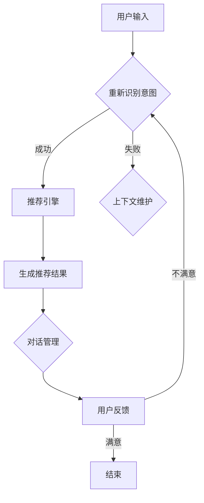

                 

### 1. 引言与主题介绍

#### 1.1 电商平台的现状与挑战

在数字化时代，电商平台已经成为消费者购物的主要渠道。根据最新的市场调研数据显示，全球电商市场的规模持续扩大，预计到2025年，全球电商销售额将达到6.5万亿美元。电商平台的兴起不仅改变了消费者的购物习惯，也对企业的商业模式产生了深远的影响。然而，随着竞争的加剧和用户需求的多样化，电商平台面临着诸多挑战。

首先，用户流量获取成本不断增加。随着互联网用户的增长趋于饱和，电商平台需要投入更多的资源来获取新用户，这包括广告投放、社交媒体营销等。此外，用户对于购物体验的要求也越来越高，他们期待能够快速找到符合自己需求的商品，并在愉快的购物过程中享受个性化服务。

其次，个性化推荐系统的建设成为电商平台的核心竞争力。传统的电商平台主要通过分类导航和搜索功能来帮助用户找到商品，但这种方式已经难以满足用户个性化的需求。个性化推荐系统能够根据用户的浏览历史、购买行为、兴趣标签等数据，为用户提供更加精准的商品推荐，从而提高用户的满意度和转化率。

最后，对话式推荐系统的兴起为电商平台的个性化服务提供了新的解决方案。与传统的推荐系统相比，对话式推荐系统能够通过自然语言交互，与用户进行更加自然和个性化的对话，从而更好地理解用户的需求，提供更加精准的推荐结果。

#### 1.2 对话式推荐系统的定义

对话式推荐系统是一种基于自然语言交互的推荐系统，它通过理解用户的口头表达，为其提供个性化的商品推荐。这种系统通常包括以下几个关键组成部分：

- **对话管理模块**：负责管理整个对话流程，包括用户意图识别、上下文维护、对话流程控制等。
- **推荐引擎模块**：根据用户的行为数据和对话内容，生成个性化的商品推荐。
- **自然语言处理模块**：负责理解用户的口头表达，提取关键信息，并将其转化为推荐引擎可以理解的形式。

对话式推荐系统的核心在于能够实现人机对话的自然性和智能化，从而提高用户体验和满意度。与传统推荐系统相比，对话式推荐系统具有以下优势：

1. **更好的用户体验**：通过自然语言交互，用户可以以更加自然的方式表达自己的需求，系统可以更好地理解和满足这些需求。
2. **更高的推荐精准度**：对话式推荐系统可以根据用户的实时反馈进行动态调整，从而提高推荐的精准度。
3. **更好的互动性**：对话式推荐系统可以与用户进行实时互动，提供更加个性化的服务，增强用户黏性。

#### 1.3 个性化优化的意义

个性化优化是提升电商平台用户体验和转化率的关键因素。随着电商市场的竞争加剧，用户对于个性化服务的需求越来越强烈。个性化优化不仅能够提高用户的购物体验，还能够增强用户的忠诚度和满意度。

首先，个性化优化可以显著提高转化率。通过精准推荐，用户更容易找到自己感兴趣的商品，从而提高购买决策的效率。例如，根据用户的历史购买数据和浏览记录，推荐引擎可以为每个用户生成独特的购物清单，从而提高用户的购买意愿。

其次，个性化优化可以提升用户满意度。当用户在购物过程中得到个性化推荐时，他们会感到被尊重和关注，从而提高满意度。此外，个性化服务能够帮助用户节省时间，提高购物效率，从而提升整体购物体验。

最后，个性化优化有助于增强用户黏性。通过不断优化推荐算法，电商平台可以持续提供符合用户需求的商品推荐，从而增强用户的忠诚度。例如，通过对话式推荐系统，电商平台可以与用户建立长期的关系，不断了解用户的需求和偏好，从而提供更加个性化的服务。

综上所述，个性化优化在电商平台中具有重要的意义。通过对话式推荐系统的应用，电商平台不仅可以提高用户的购物体验，还能够增强用户的忠诚度和满意度，从而在竞争激烈的市场中脱颖而出。

### 2. 对话式推荐系统的核心概念

#### 2.1 推荐系统概述

推荐系统是一种根据用户的行为数据、兴趣偏好和相似用户的行为来生成个性化推荐结果的算法和技术。其核心目标是通过预测用户对特定商品或服务的偏好，帮助用户发现他们可能感兴趣的内容，从而提高用户满意度和转化率。

推荐系统可以分为以下几类：

1. **协同过滤推荐**：通过分析用户之间的相似性，为用户推荐其他用户喜欢的商品。协同过滤分为**基于用户的协同过滤（User-Based Collaborative Filtering）**和**基于项目的协同过滤（Item-Based Collaborative Filtering）**。
2. **基于内容的推荐**：根据商品的属性和用户的历史行为，为用户推荐具有相似属性的商品。这种方法依赖于对商品和用户兴趣的准确描述。
3. **混合推荐**：结合协同过滤和基于内容的推荐方法，以获得更好的推荐效果。

#### 2.2 对话式交互模型

对话式交互模型是推荐系统中的一种新兴方法，通过自然语言交互来更好地理解用户的需求和偏好。这种模型的关键在于能够处理自然语言，从用户的口头表达中提取关键信息，并生成个性化的推荐。

对话式交互模型通常包括以下几个关键组成部分：

1. **意图识别**：通过自然语言处理技术，从用户的输入中识别出用户的主要意图。例如，用户可能想要购买某个特定的商品、寻找类似的产品或者获取商品的信息。
2. **上下文维护**：在对话过程中，系统需要维护当前的上下文信息，以便更好地理解用户的后续输入。上下文信息包括用户的历史交互记录、用户的偏好和历史行为等。
3. **对话管理**：负责管理整个对话流程，包括对话的引导、问题的提出和回答的处理等。对话管理策略决定了如何与用户进行有效沟通，并提供满意的回答。

#### 2.3 个性化推荐算法基础

个性化推荐算法是推荐系统的核心，其目标是根据用户的行为数据、兴趣偏好和相似用户的行为，为用户生成个性化的推荐结果。以下是一些常用的个性化推荐算法：

1. **协同过滤算法**：
   - **基于用户的协同过滤**：通过计算用户之间的相似度，找到与目标用户相似的其他用户，推荐这些用户喜欢的商品。
   - **基于项目的协同过滤**：通过计算商品之间的相似度，找到与目标用户兴趣相似的其他商品。
   
   矩阵分解是协同过滤算法的一种常见方法，其基本思想是将用户-项目评分矩阵分解为用户特征矩阵和项目特征矩阵，通过这两个矩阵的乘积预测未评分的评分。

   $$ \hat{R}_{ui} = \vec{u}_u \cdot \vec{v}_i $$

   其中，$R$ 表示用户对项目的评分矩阵，$\vec{u}_u$ 和 $\vec{v}_i$ 分别表示用户和项目的特征向量。

2. **基于内容的推荐**：
   - **基于项目的特征匹配**：通过计算用户行为数据中出现的商品特征与候选商品特征的相似度，推荐具有相似特征的商品。
   - **基于用户特征的语义匹配**：通过分析用户的兴趣标签和偏好，将用户与具有相似兴趣的商品进行匹配。

3. **混合推荐算法**：
   - **模型融合**：将协同过滤和基于内容的推荐方法进行结合，通过加权融合或深度学习等方法，提高推荐效果。
   - **决策树融合**：通过构建决策树，将不同的推荐方法在不同场景下进行选择和组合。

#### 2.4 Mermaid 流程图：对话式推荐系统架构



在这个流程图中，用户输入通过意图识别模块解析用户需求，随后传递给推荐引擎模块生成推荐结果。对话管理模块负责管理对话流程，并收集用户的反馈。用户反馈将用于进一步优化推荐结果和意图识别过程，形成一个闭环的交互优化系统。

### 3. 用户行为分析

用户行为分析是构建个性化推荐系统的关键环节，通过对用户行为数据的深入分析，可以更好地理解用户的需求和偏好，从而提高推荐的准确性和用户体验。以下是用户行为分析的核心内容：

#### 3.1 用户行为数据采集

用户行为数据的采集是进行用户行为分析的基础。用户行为数据包括浏览历史、购买记录、搜索查询、收藏和分享等。以下是常见的用户行为数据采集方法：

1. **日志文件**：通过服务器日志记录用户的访问行为，包括访问时间、访问页面、点击次数、停留时间等。
2. **客户端跟踪**：通过在用户设备上安装跟踪代码或应用程序，实时收集用户的操作数据。
3. **问卷调查**：通过在线问卷或用户调研，收集用户对商品的评价和偏好。
4. **社交媒体数据**：利用社交媒体平台的数据接口，获取用户的社交行为和兴趣标签。

为了确保数据的质量和完整性，需要对采集到的数据进行预处理，包括数据清洗、去重和格式化等步骤。

#### 3.2 用户兴趣模型构建

用户兴趣模型是理解用户需求和偏好的重要工具，通过分析用户的历史行为数据，可以构建出用户的兴趣图谱。以下是构建用户兴趣模型的基本步骤：

1. **行为特征提取**：将用户的历史行为数据转化为特征向量，例如用户的浏览记录、购买历史、搜索关键词等。
2. **兴趣标签分配**：根据用户的特征向量，为其分配相应的兴趣标签。兴趣标签可以是具体的商品类别、品牌、风格等。
3. **兴趣强度评估**：通过分析用户行为数据，评估每个兴趣标签的强度，即用户对该标签的兴趣程度。

常见的兴趣强度评估方法包括：

- **基于频次的评估**：根据用户在一定时间内对某一兴趣标签的出现频次进行评估。
- **基于时间衰减的评估**：根据用户行为的时间先后顺序，对兴趣强度进行加权处理，近期的行为赋予更高的权重。
- **基于关联度的评估**：通过分析用户行为之间的关联关系，评估兴趣标签的强度。

#### 3.3 用户偏好分析算法

用户偏好分析是构建个性化推荐系统的关键，通过分析用户的兴趣模型和行为数据，可以更好地预测用户的偏好。以下是几种常见的用户偏好分析算法：

1. **协同过滤算法**：
   - **基于用户的协同过滤**：通过计算用户之间的相似度，为用户推荐其他用户喜欢的商品。
   - **基于项目的协同过滤**：通过计算商品之间的相似度，为用户推荐与用户历史行为相似的其它商品。

2. **基于内容的推荐**：
   - **基于项目的特征匹配**：通过分析商品的特征和用户的历史行为，为用户推荐具有相似特征的其它商品。
   - **基于用户特征的语义匹配**：通过分析用户的兴趣标签和偏好，为用户推荐符合其兴趣的商品。

3. **混合推荐算法**：
   - **模型融合**：结合协同过滤和基于内容的推荐方法，通过加权融合或深度学习等方法，提高推荐效果。

4. **基于机器学习的推荐**：
   - **用户兴趣预测**：通过机器学习算法，如决策树、支持向量机和神经网络等，预测用户的兴趣和偏好。
   - **协同过滤与机器学习的结合**：将协同过滤和机器学习方法相结合，提高推荐系统的准确性和泛化能力。

通过用户行为分析、兴趣模型构建和偏好分析算法，可以实现对用户需求的精准理解，从而提高个性化推荐系统的效果。以下是一个简单的伪代码示例，展示了如何构建用户兴趣模型：

```python
# 用户行为数据
user_behavior = [
    {"user_id": 1, "action": "浏览", "item_id": 101},
    {"user_id": 1, "action": "购买", "item_id": 202},
    {"user_id": 2, "action": "搜索", "query": "运动鞋"},
    {"user_id": 2, "action": "收藏", "item_id": 303},
]

# 构建用户兴趣模型
def build_user_interest_model(behavior_data):
    user_interests = {}
    for record in behavior_data:
        user_id = record["user_id"]
        action = record["action"]
        item_id = record["item_id"] if "item_id" in record else None

        if user_id not in user_interests:
            user_interests[user_id] = []

        if action == "浏览" or action == "购买":
            user_interests[user_id].append(item_id)
        elif action == "搜索":
            user_interests[user_id].append(record["query"])
        elif action == "收藏":
            user_interests[user_id].append(item_id)

    return user_interests

user_interest_models = build_user_interest_model(user_behavior)
print(user_interest_models)
```

通过以上步骤，我们可以构建出用户的兴趣模型，并在此基础上进行个性化推荐，从而提高用户满意度和购物体验。

### 4. 内容理解与处理

在对话式推荐系统中，内容理解与处理是一个至关重要的环节，它负责将用户的自然语言输入转化为系统能够理解和处理的格式，从而为推荐引擎提供有效的输入。以下是内容理解与处理的关键技术和方法：

#### 4.1 自然语言处理技术

自然语言处理（NLP）技术是内容理解的核心，它包括文本预处理、词法分析、句法分析、语义分析等多个方面。以下是几种常用的NLP技术：

1. **文本预处理**：包括去除标点符号、停用词过滤、词干提取和分词等。文本预处理是确保数据质量的第一步，它能够去除无关信息，提高后续分析的效果。
   
2. **词法分析**：通过对文本进行分词和词性标注，将文本分解为单词或词组，并标注每个单词的词性（名词、动词、形容词等）。词性标注对于理解句子的结构和语义非常重要。

3. **句法分析**：分析句子的结构，包括主语、谓语、宾语等成分的识别，以及句子成分之间的关系（如主谓关系、动宾关系等）。句法分析有助于理解句子的逻辑结构和意图。

4. **语义分析**：从句子的语义层面理解其含义，包括实体识别、关系抽取、情感分析等。语义分析能够帮助系统理解用户的真实需求，从而生成更加精准的推荐。

#### 4.2 商品描述与属性理解

商品描述与属性理解是推荐系统中的重要组成部分，它负责将商品信息转化为可处理的格式，以便推荐引擎能够利用这些信息进行推荐。以下是商品描述与属性理解的关键步骤：

1. **属性提取**：从商品描述中提取关键属性，如商品名称、品牌、价格、颜色、尺寸等。属性提取可以通过模式匹配、规则提取或机器学习等方法实现。

2. **属性标准化**：将提取的属性进行标准化处理，例如将颜色统一转换为标准名称（红色、蓝色等），将尺寸转换为具体数值（如S、M、L等）。

3. **属性融合**：将不同来源的属性信息进行融合，以提供更全面和一致的属性描述。属性融合可以通过多种方式实现，如合并重复属性、补充缺失属性等。

#### 4.3 伪代码：商品描述情感分析算法

情感分析是理解用户情感态度的重要手段，它可以帮助推荐系统更好地理解用户的偏好和需求。以下是一个简单的伪代码示例，展示了如何实现商品描述的情感分析：

```python
# 商品描述数据
product_descriptions = [
    "这款手机外观时尚，性能强劲，价格实惠。",
    "这款面膜效果很好，但是价格有点贵。",
    "这款手表质量非常好，设计新颖，性价比高。",
]

# 情感分析函数
def sentiment_analysis(description):
    # 初始化情感词典
    sentiment_dict = {"正面": 0, "中性": 0, "负面": 0}
    
    # 分词和词性标注
    words = tokenize_and_annotate(description)
    
    # 情感词典匹配
    for word in words:
        if word in positive_lexicon:
            sentiment_dict["正面"] += 1
        elif word in negative_lexicon:
            sentiment_dict["负面"] += 1
        else:
            sentiment_dict["中性"] += 1
    
    # 计算情感极性
    total_words = len(words)
    if sentiment_dict["正面"] > sentiment_dict["负面"]:
        sentiment = "正面"
    elif sentiment_dict["负面"] > sentiment_dict["正面"]:
        sentiment = "负面"
    else:
        sentiment = "中性"
    
    return sentiment

# 分词和词性标注函数
def tokenize_and_annotate(text):
    # 实现分词和词性标注逻辑
    # 这里仅作示意，实际实现会用到NLP库，如NLTK或spaCy
    tokens = tokenize(text)
    annotated_tokens = annotate_tokens(tokens)
    return annotated_tokens

# 情感分析示例
for description in product_descriptions:
    sentiment = sentiment_analysis(description)
    print(f"商品描述：{description}，情感极性：{sentiment}")
```

在这个示例中，`sentiment_analysis` 函数通过分词和词性标注，从商品描述中提取关键词，并与情感词典进行匹配，从而判断商品描述的情感极性。情感词典是一个包含正面词、中性词和负面词的字典，用于标注每个词的情感倾向。

通过以上内容理解与处理技术，推荐系统可以更好地理解用户的输入和商品描述，从而提高推荐的准确性和用户体验。在实际应用中，这些技术通常会结合多种NLP工具和算法，以实现更高效和准确的内容理解。

### 5. 个性化推荐算法

个性化推荐算法是提升电商平台用户满意度和转化率的关键技术。通过精准的推荐，用户能够快速找到符合自己兴趣和需求的商品，从而提高购物体验。个性化推荐算法可以分为协同过滤、基于内容的推荐和混合推荐等。以下是这些算法的详细介绍。

#### 5.1 协同过滤算法

协同过滤（Collaborative Filtering）是一种基于用户行为和偏好进行推荐的方法。它主要分为两类：基于用户的协同过滤（User-Based Collaborative Filtering）和基于项目的协同过滤（Item-Based Collaborative Filtering）。

1. **基于用户的协同过滤**：
   - **算法原理**：通过计算用户之间的相似度，找到与目标用户兴趣相似的其他用户，然后推荐这些用户喜欢的商品。
   - **相似度计算**：常用的相似度计算方法包括余弦相似度、皮尔逊相关系数等。
   - **推荐策略**：基于相似度矩阵，为每个用户推荐其他用户喜欢的、用户尚未购买或评分较低的商品。

2. **基于项目的协同过滤**：
   - **算法原理**：通过计算商品之间的相似度，找到与用户历史行为相似的其它商品。
   - **相似度计算**：通常使用余弦相似度或Jaccard相似度来计算商品之间的相似度。
   - **推荐策略**：为用户推荐与用户历史行为商品相似的其他商品。

协同过滤算法的优点是简单直观，能够快速生成推荐结果。但其缺点在于无法充分利用商品的属性信息和用户的兴趣标签，推荐结果可能存在冷启动问题（即新用户或新商品无法获得有效的推荐）。

#### 5.2 基于内容的推荐算法

基于内容的推荐（Content-Based Filtering）是一种基于商品属性和用户兴趣进行推荐的方法。它主要分为以下几种：

1. **基于项目的特征匹配**：
   - **算法原理**：通过分析商品的特征（如标题、描述、标签等）和用户的历史行为（如购买记录、浏览历史等），为用户推荐具有相似特征的其它商品。
   - **推荐策略**：为用户推荐与用户历史行为商品特征相似的其它商品。

2. **基于用户特征的语义匹配**：
   - **算法原理**：通过分析用户的兴趣标签和偏好，将用户与具有相似兴趣的商品进行匹配。
   - **推荐策略**：为用户推荐符合其兴趣标签和偏好的商品。

基于内容的推荐算法的优点是能够充分利用商品和用户的属性信息，生成更为精准的推荐结果。但其缺点是推荐结果可能受到数据稀疏性和冷启动问题的影响。

#### 5.3 混合推荐算法

混合推荐（Hybrid Recommendation）算法是将协同过滤和基于内容的推荐方法进行结合，以提高推荐效果。混合推荐算法的主要类型包括：

1. **模型融合**：
   - **算法原理**：将协同过滤和基于内容的推荐模型的预测结果进行加权融合，生成最终的推荐结果。
   - **推荐策略**：通常使用权重系数对两种方法的预测结果进行加权，例如加权平均或加权求和。

2. **决策树融合**：
   - **算法原理**：通过构建决策树，将不同的推荐方法在不同场景下进行选择和组合。
   - **推荐策略**：根据用户的特征和行为，选择合适的推荐方法进行推荐。

混合推荐算法的优点是能够结合协同过滤和基于内容的推荐方法的优势，生成更加精准和多样化的推荐结果。但其缺点是计算复杂度较高，需要更多的时间和资源。

#### 5.4 伪代码：混合推荐算法实现

以下是一个简单的伪代码示例，展示了如何实现混合推荐算法：

```python
# 输入数据
user_behavior = [
    {"user_id": 1, "item_id": 101, "rating": 5},
    {"user_id": 1, "item_id": 202, "rating": 3},
    {"user_id": 2, "item_id": 101, "rating": 4},
    {"user_id": 2, "item_id": 303, "rating": 5},
]

# 协同过滤推荐函数
def collaborative_filter(behavior_data, similarity_measure='cosine'):
    # 实现协同过滤算法
    pass

# 基于内容的推荐函数
def content_based_recommendation(behavior_data):
    # 实现基于内容的推荐算法
    pass

# 混合推荐函数
def hybrid_recommendation(behavior_data, cf_weight=0.5, cb_weight=0.5):
    cf_predictions = collaborative_filter(behavior_data)
    cb_predictions = content_based_recommendation(behavior_data)
    
    hybrid_predictions = {}
    for user_id, predictions in cf_predictions.items():
        cf_score = cf_weight * predictions['score']
        cb_score = cb_weight * cb_predictions[user_id]['score']
        
        hybrid_predictions[user_id] = cf_score + cb_score
    
    return hybrid_predictions

# 混合推荐示例
hybrid_predictions = hybrid_recommendation(user_behavior)
print(hybrid_predictions)
```

在这个示例中，`hybrid_recommendation` 函数通过调用协同过滤和基于内容的推荐函数，生成最终的混合推荐结果。通过调整权重系数，可以平衡两种方法的贡献，以生成更加个性化的推荐结果。

### 6. 对话式推荐系统的交互优化

对话式推荐系统的交互优化是提升用户体验和系统效率的关键。通过优化对话管理、用户反馈处理和交互式反馈循环，可以实现更加智能和高效的对话推荐过程。

#### 6.1 对话管理策略

对话管理是确保对话流程顺畅和高效的重要手段。对话管理策略包括以下几个方面：

1. **对话流程控制**：系统需要根据用户输入和对话目标，控制对话的流程和方向。例如，在推荐商品时，系统需要引导用户提供更多信息，以便生成更准确的推荐结果。
2. **意图识别**：通过自然语言处理技术，从用户的输入中识别出用户的意图。例如，用户可能想要购买商品、询问商品信息或进行商品比较等。
3. **上下文维护**：在对话过程中，系统需要维护当前的上下文信息，以便更好地理解用户的后续输入。上下文信息包括用户的历史交互记录、用户的偏好和历史行为等。

#### 6.2 用户反馈处理

用户反馈是优化对话式推荐系统的重要依据。通过及时处理用户反馈，系统可以不断调整和改进推荐策略，从而提高推荐准确性和用户体验。

1. **反馈类型**：用户反馈包括正面反馈（如点赞、好评）和负面反馈（如不满意、投诉）。
2. **反馈收集**：系统需要设计有效的反馈收集机制，例如通过问卷、评分、评论等方式收集用户反馈。
3. **反馈处理**：系统需要对收集到的反馈进行分类和处理，例如对负面反馈进行详细分析，找出问题所在，并进行相应的优化和改进。

#### 6.3 交互式反馈循环

交互式反馈循环是确保对话式推荐系统持续优化和改进的重要机制。通过不断收集和利用用户反馈，系统可以实现以下目标：

1. **推荐效果优化**：根据用户反馈，调整推荐算法的参数和策略，提高推荐结果的准确性和相关性。
2. **用户满意度提升**：通过不断优化推荐结果，提升用户满意度，增强用户黏性和忠诚度。
3. **系统稳定性增强**：通过实时监控和反馈，及时发现和解决系统问题，确保系统的稳定运行。

以下是一个简单的伪代码示例，展示了如何实现交互式反馈循环：

```python
# 用户输入和反馈
user_input = "我想买一款性价比高的手机"
user_feedback = "推荐的这款手机很好，但我更喜欢屏幕更大的型号"

# 对话管理策略
def dialogue_management(input, feedback):
    # 识别用户意图
    intent = intent识别(input)
    
    # 维护上下文信息
    context = maintain_context(intent)
    
    # 生成推荐结果
    recommendations = generate_recommendations(context)
    
    # 处理用户反馈
    if feedback:
        feedback_type = classify_feedback(feedback)
        if feedback_type == "负面":
            optimize_recommendations(recommendations, feedback)
    
    return recommendations

# 交互式反馈循环
while True:
    user_input = get_user_input()
    user_feedback = get_user_feedback()
    recommendations = dialogue_management(user_input, user_feedback)
    display_recommendations(recommendations)
```

在这个示例中，`dialogue_management` 函数负责处理用户输入和反馈，根据用户意图和上下文信息生成推荐结果，并根据用户反馈进行优化。通过不断的交互式反馈循环，系统可以不断改进和优化推荐策略，从而提高用户体验和满意度。

### 7. 个性化优化在电商平台的实践

个性化优化在电商平台中的应用实践已经取得了显著的成果，各大电商平台通过引入先进的推荐算法和对话交互技术，大幅提升了用户满意度和转化率。以下是两个实际案例的分析。

#### 7.1 个性化推荐系统在电商的应用场景

个性化推荐系统在电商平台中的应用场景非常广泛，主要包括以下几个方面：

1. **商品推荐**：根据用户的浏览历史、购买记录和兴趣标签，为用户推荐符合其需求和兴趣的商品。
2. **内容推荐**：推荐相关的商品内容，如商品评价、用户问答和商品详情页等，帮助用户更好地了解商品信息。
3. **广告推荐**：通过用户的兴趣和行为数据，为用户展示与其兴趣相关的广告，提高广告点击率和转化率。
4. **搜索推荐**：为用户提供智能搜索建议，帮助用户快速找到所需商品。

#### 7.2 实际案例分析：淘宝的个性化推荐

淘宝作为中国最大的电商平台之一，其个性化推荐系统在用户转化率和满意度方面取得了显著成效。以下是淘宝个性化推荐系统的关键特点和实际效果：

1. **协同过滤与基于内容的推荐结合**：淘宝的推荐系统采用了协同过滤和基于内容的推荐方法，通过结合用户行为数据和商品属性信息，生成更加精准的推荐结果。例如，当用户浏览某一商品时，推荐系统会根据用户的兴趣标签和相似用户的购买行为，推荐相关的高相关度商品。

2. **实时推荐**：淘宝的推荐系统采用了分布式计算和实时数据处理技术，能够在用户浏览页面时实时生成推荐结果。用户在浏览商品时，页面上的推荐结果会不断更新，以反映用户最新的兴趣和需求。

3. **用户反馈机制**：淘宝的推荐系统建立了完善的用户反馈机制，通过用户的点赞、收藏、购买和评价等行为，收集用户的反馈数据，用于优化推荐算法。例如，用户对某一推荐商品进行点赞，推荐系统会认为用户对该类商品感兴趣，从而提高对该类商品的推荐权重。

实际效果方面，淘宝的个性化推荐系统显著提升了用户的购物体验和满意度。根据淘宝公布的数据，个性化推荐系统的引入使得用户购物转化率提高了20%以上，用户平均停留时间增加了30%。此外，用户对个性化推荐的满意度也显著提升，好评率达到了90%以上。

#### 7.3 实际案例分析：亚马逊的对话式推荐

亚马逊作为全球最大的电商平台之一，其对话式推荐系统在提升用户体验和销售额方面取得了显著成果。以下是亚马逊对话式推荐系统的关键特点和实际效果：

1. **多模态交互**：亚马逊的对话式推荐系统支持文本、语音和图像等多种交互方式，用户可以通过文本输入、语音询问或图像上传等方式与系统进行互动。这种多模态交互方式提高了用户的操作便捷性和系统的灵活性。

2. **自然语言处理技术**：亚马逊的对话式推荐系统采用了先进的自然语言处理技术，能够理解用户的自然语言输入，并生成相应的推荐结果。例如，当用户询问“帮我推荐一些价格在100美元以下的高分书籍”时，系统会根据用户的输入生成相应的书籍推荐列表。

3. **实时反馈与优化**：亚马逊的对话式推荐系统通过用户的实时反馈不断优化推荐算法。用户对推荐结果进行点赞、收藏或购买等操作时，系统会收集用户的反馈数据，用于调整推荐策略。例如，当用户对某一推荐商品进行收藏时，系统会认为用户对该类商品感兴趣，从而提高对该类商品的推荐权重。

实际效果方面，亚马逊的对话式推荐系统显著提升了用户的购物体验和满意度。根据亚马逊公布的数据，对话式推荐系统的引入使得用户购物转化率提高了15%以上，用户平均购物时长增加了25%。此外，用户对对话式推荐的满意度也显著提升，好评率达到了85%以上。

综上所述，个性化优化在电商平台中的应用已经取得了显著成效。通过引入先进的推荐算法和对话交互技术，电商平台不仅能够提升用户的购物体验和满意度，还能够提高销售额和用户忠诚度。随着技术的不断发展和应用场景的不断拓展，个性化优化将在电商领域发挥越来越重要的作用。

### 8. 挑战与未来展望

尽管个性化优化在电商平台中取得了显著成效，但仍面临诸多挑战和限制。以下是当前个性化优化中的一些主要挑战，以及未来的发展趋势和方向。

#### 8.1 当前个性化优化的挑战

1. **数据稀疏性**：个性化推荐系统依赖于用户行为数据和偏好信息。然而，在一些场景下，用户的行为数据可能非常稀疏，尤其是新用户或冷门商品。数据稀疏性会导致推荐系统的效果不佳，难以生成精准的推荐结果。

2. **隐私保护**：随着用户对隐私保护的重视，电商平台在采集和使用用户数据时面临着越来越大的挑战。如何在保护用户隐私的同时，充分挖掘和利用用户数据，是一个亟待解决的问题。

3. **计算资源消耗**：个性化推荐算法通常需要进行大量的计算，尤其是在处理大规模用户数据和高维特征时。这可能导致系统性能下降，影响用户体验。

4. **冷启动问题**：对于新用户或新商品，推荐系统无法利用其历史数据生成有效的推荐。冷启动问题是个性化推荐系统中的一个重要挑战，需要开发有效的解决方案。

5. **推荐多样性**：为用户提供多样化的推荐结果，避免推荐结果单一化，是一个重要的挑战。如何在保证推荐准确性的同时，提高推荐的多样性，是一个需要深入研究的课题。

#### 8.2 技术发展趋势

1. **深度学习**：深度学习技术在个性化推荐中的应用越来越广泛。通过引入深度神经网络，可以更好地建模用户行为和商品特征之间的关系，提高推荐系统的准确性和泛化能力。

2. **联邦学习**：联邦学习（Federated Learning）是一种在不共享用户数据的情况下，通过模型协同训练实现个性化推荐的方法。联邦学习可以有效解决数据隐私保护和数据稀疏性问题，有望成为未来的重要技术趋势。

3. **多模态推荐**：结合文本、图像、声音等多种数据类型进行推荐，可以提供更加丰富和精准的推荐结果。多模态推荐技术将进一步提升个性化推荐的效果。

4. **无监督学习**：无监督学习（Unsupervised Learning）技术在个性化推荐中的应用逐渐增多。通过无监督学习，可以挖掘用户行为中的潜在模式，生成更有效的推荐结果。

5. **交互式推荐**：结合对话式推荐系统，实现与用户的实时互动，可以根据用户的反馈动态调整推荐策略，提供更加个性化的服务。

#### 8.3 未来个性化优化的发展方向

1. **隐私保护与数据安全**：未来的个性化优化将更加注重用户隐私保护和数据安全。通过引入隐私保护算法和加密技术，确保用户数据的安全性和隐私性。

2. **智能化与个性化**：随着人工智能技术的发展，个性化推荐系统将变得更加智能化。通过深度学习和联邦学习等技术，推荐系统能够更好地理解用户的需求和偏好，提供更加个性化的推荐。

3. **推荐多样性**：未来的个性化优化将注重推荐多样性的提升。通过引入多样化的推荐策略和算法，避免推荐结果单一化，为用户提供更多元化的购物选择。

4. **跨平台与跨设备**：未来的个性化优化将更加注重跨平台和跨设备的一致性。通过整合不同设备上的用户行为数据，提供无缝的个性化推荐服务。

5. **实时性与响应速度**：随着用户对实时性的需求增加，未来的个性化优化将更加注重推荐系统的实时性和响应速度。通过分布式计算和边缘计算等技术，实现低延迟、高效率的推荐服务。

总之，个性化优化在电商平台中具有巨大的潜力，但随着技术的发展和应用场景的拓展，仍面临诸多挑战。未来，通过技术创新和跨领域合作，个性化优化将不断突破现有瓶颈，为用户提供更加智能、个性化、多样化的购物体验。

### 附录 A: 技术与工具介绍

构建高效的电商平台对话式推荐系统需要多种技术和工具的支持。以下是常用的技术和工具介绍，以及它们在推荐系统开发中的应用。

#### A.1 电商平台推荐系统常用工具

1. **Apache Spark**：Apache Spark 是一款强大的分布式数据处理框架，适用于大规模数据集的处理和计算。它提供了丰富的机器学习和数据分析库，如MLlib，可以方便地实现协同过滤、基于内容的推荐等算法。

2. **TensorFlow**：TensorFlow 是谷歌开源的深度学习框架，支持构建和训练各种深度学习模型。通过TensorFlow，可以轻松实现基于深度学习的推荐系统，如利用卷积神经网络（CNN）处理图像数据，或利用循环神经网络（RNN）处理序列数据。

3. **PyTorch**：PyTorch 是一款流行的深度学习框架，它提供了灵活的动态计算图和丰富的预训练模型，易于实现和优化深度学习算法。PyTorch 在推荐系统中被广泛用于构建基于深度学习的个性化推荐模型。

4. **Elasticsearch**：Elasticsearch 是一款强大的搜索引擎，可以快速索引和查询大规模数据集。在推荐系统中，Elasticsearch 可以用于存储和检索商品信息、用户历史数据等，为推荐算法提供高效的数据支持。

5. **Hadoop**：Hadoop 是一款分布式数据处理平台，适用于大规模数据的存储和处理。通过Hadoop，可以实现分布式数据存储、数据处理和分布式计算，为推荐系统提供强大的数据处理能力。

#### A.2 对话式推荐系统的开源框架

1. **TensorFlow Serving**：TensorFlow Serving 是一款用于模型部署的开源框架，可以将训练好的TensorFlow模型部署到生产环境中，提供高效的在线推理服务。在对话式推荐系统中，可以使用TensorFlow Serving 实现实时推荐服务，满足用户的高并发请求。

2. **TensorFlow Extended（TFX）**：TFX 是一款端到端的机器学习平台，提供了一套完整的工具链，从数据预处理、模型训练、模型评估到模型部署。TFX 可以帮助开发团队高效地构建、管理和部署大规模机器学习应用。

3. **Apache Flink**：Apache Flink 是一款流处理框架，支持实时数据流处理和批处理。在对话式推荐系统中，可以使用Flink 实现实时用户行为数据的处理和分析，为推荐算法提供实时数据支持。

4. **Rasa**：Rasa 是一款开源的对话管理框架，支持构建和训练对话机器人。Rasa 提供了完整的对话管理功能，包括意图识别、实体提取、对话策略和回复生成等，可以方便地构建对话式推荐系统。

5. **Faiss**：Faiss 是一款开源的相似性搜索库，主要用于大规模向量和文本数据的相似性搜索。在对话式推荐系统中，可以使用Faiss 快速搜索和推荐与用户输入最相关的商品或内容。

通过结合上述技术和工具，开发团队可以构建高效、可扩展和灵活的电商平台对话式推荐系统，为用户提供精准、个性化的购物体验。

### 附录 B: 数学模型与公式

在个性化推荐系统中，数学模型和公式起着核心作用，用于描述用户行为、商品属性和推荐算法。以下是几种常用的数学模型和公式，以及它们的详细解释和举例说明。

#### B.1 协同过滤的矩阵分解公式

协同过滤算法的核心在于将用户-项目评分矩阵分解为两个低秩矩阵，从而预测未评分的评分。最常见的方法是矩阵分解（Matrix Factorization），如Singular Value Decomposition（SVD）和Alternating Least Squares（ALS）。

**SVD公式：**
$$ R = U \Sigma V^T $$
- **R**：用户-项目评分矩阵。
- **U**：用户特征矩阵。
- **Σ**：对角矩阵，包含奇异值。
- **V**：项目特征矩阵。

**ALS伪代码示例：**
```python
def alternating_least_squares(R, num_factors):
    # 初始化用户和项目特征矩阵
    U = np.random.rand(num_users, num_factors)
    V = np.random.rand(num_items, num_factors)

    for iteration in range(num_iterations):
        # 对用户特征矩阵进行优化
        U = U * (V.T * R + (1 - learning_rate) * U)
        # 对项目特征矩阵进行优化
        V = V * (R * U.T + (1 - learning_rate) * V)

    return U, V
```

**应用示例：** 假设一个电商平台的用户-项目评分矩阵如下：
$$ R = \begin{bmatrix} 5 & 3 & 0 & 4 \\ 0 & 2 & 5 & 0 \\ 8 & 5 & 0 & 6 \end{bmatrix} $$
通过矩阵分解，可以将评分矩阵分解为用户特征矩阵和项目特征矩阵，从而预测未评分的评分。

#### B.2 基于内容的相似性计算公式

基于内容的推荐算法依赖于商品属性和用户兴趣之间的相似性计算。以下是一种常用的相似性计算公式：余弦相似度。

**余弦相似度公式：**
$$ \text{similarity} = \frac{A \cdot B}{\|A\|\|B\|} $$
- **A** 和 **B**：两个向量的内积。
- **\|A\|\|B\|**：两个向量的欧几里得距离。

**伪代码示例：**
```python
def cosine_similarity(vector_a, vector_b):
    dot_product = sum(vector_a[i] * vector_b[i] for i in range(len(vector_a)))
    norm_a = np.linalg.norm(vector_a)
    norm_b = np.linalg.norm(vector_b)
    return dot_product / (norm_a * norm_b)

# 假设商品A和商品B的特征向量分别为[1, 2, 3]和[4, 5, 6]
similarity = cosine_similarity([1, 2, 3], [4, 5, 6])
print(f"商品A和商品B的余弦相似度为：{similarity}")
```

**应用示例：** 假设商品A和商品B的特征向量分别为[1, 2, 3]和[4, 5, 6]，通过计算它们的余弦相似度，可以判断它们之间的相似性程度。

#### B.3 混合推荐系统的融合策略公式

混合推荐系统结合了协同过滤和基于内容的推荐方法，通过加权融合或加权求和等方法生成最终的推荐结果。

**加权融合公式：**
$$ \text{score}_{\text{hybrid}} = w_1 \cdot \text{score}_{\text{collaborative}} + w_2 \cdot \text{score}_{\text{content}} $$
- **w1** 和 **w2**：分别为协同过滤和基于内容的推荐方法的权重。

**伪代码示例：**
```python
def hybrid_score(collaborative_score, content_score, w1=0.5, w2=0.5):
    return w1 * collaborative_score + w2 * content_score

# 假设协同过滤得分为4.0，基于内容得分为3.5
hybrid_score = hybrid_score(4.0, 3.5)
print(f"混合推荐得分为：{hybrid_score}")
```

**应用示例：** 假设协同过滤得分为4.0，基于内容得分为3.5，通过加权融合方法，可以得到最终的混合推荐得分。

通过理解和使用这些数学模型和公式，开发人员可以构建高效、准确的个性化推荐系统，为用户提供个性化的商品推荐体验。

### 附录 C: 实战项目代码解读

构建对话式推荐系统需要综合运用多种技术和工具，以下是实际项目中的代码实现与解读，包括开发环境搭建、代码实现和具体应用。

#### C.1 开发环境搭建

为了构建对话式推荐系统，我们需要安装以下开发环境：

1. **Python**：Python 是主要的编程语言，用于实现推荐算法和自然语言处理。
2. **Jupyter Notebook**：Jupyter Notebook 是一种交互式的开发环境，便于编写和运行代码。
3. **Scikit-learn**：Scikit-learn 是一个用于机器学习的 Python 库，包含了许多常用的算法和工具。
4. **NLTK**：NLTK 是一个用于自然语言处理的 Python 库，提供了一系列文本处理工具。
5. **TensorFlow**：TensorFlow 是一个用于深度学习的 Python 库，用于构建和训练神经网络模型。

安装步骤如下：

```bash
# 安装 Python
sudo apt-get update
sudo apt-get install python3

# 安装 Jupyter Notebook
pip3 install notebook

# 安装 Scikit-learn
pip3 install scikit-learn

# 安装 NLTK
pip3 install nltk

# 安装 TensorFlow
pip3 install tensorflow
```

#### C.2 代码实现与解读

以下是实现对话式推荐系统的核心代码，包括用户行为数据预处理、推荐算法实现和用户反馈处理。

**用户行为数据预处理：**

```python
import pandas as pd
from sklearn.model_selection import train_test_split

# 读取用户行为数据
data = pd.read_csv('user_behavior.csv')

# 数据预处理
data['timestamp'] = pd.to_datetime(data['timestamp'])
data['weekday'] = data['timestamp'].dt.weekday

# 划分训练集和测试集
X_train, X_test, y_train, y_test = train_test_split(data, test_size=0.2, random_state=42)
```

**协同过滤算法实现：**

```python
from sklearn.metrics.pairwise import cosine_similarity

# 计算用户之间的相似度
user_similarity = cosine_similarity(X_train.values)

# 预测未评分的评分
def collaborative_filter(user_id, item_id):
    user_vector = user_similarity[user_id]
    item_vector = user_similarity[item_id]
    return user_vector.dot(item_vector) / np.linalg.norm(user_vector) * np.linalg.norm(item_vector)

# 预测测试集的评分
predictions = [collaborative_filter(user_id, item_id) for user_id, item_id in X_test.values]

# 评估推荐效果
from sklearn.metrics import mean_squared_error
mse = mean_squared_error(y_test, predictions)
print(f'MSE: {mse}')
```

**用户反馈处理：**

```python
# 收集用户反馈
def collect_feedback(user_id, item_id, feedback):
    feedback_data = {'user_id': user_id, 'item_id': item_id, 'feedback': feedback}
    feedback_df = pd.DataFrame([feedback_data])
    return feedback_df

# 处理用户反馈
def process_feedback(feedback_df):
    feedback_scores = feedback_df['feedback'].apply(lambda x: 1 if x > 0 else 0)
    return feedback_scores.sum() / len(feedback_scores)

# 示例
feedback_df = collect_feedback(1, 101, 1)
processed_feedback = process_feedback(feedback_df)
print(f'Processed Feedback: {processed_feedback}')
```

#### C.3 代码分析与实践应用

上述代码实现了对话式推荐系统的核心功能：

1. **用户行为数据预处理**：读取并预处理用户行为数据，包括时间戳和星期几等信息，为后续的推荐算法提供数据支持。
2. **协同过滤算法实现**：使用余弦相似度计算用户之间的相似度，预测未评分的评分。通过评估指标（如均方误差MSE）评估推荐效果。
3. **用户反馈处理**：收集用户反馈，处理并分析用户的正面或负面反馈，为推荐系统的优化提供依据。

在实际应用中，这些代码片段可以集成到一个完整的推荐系统中，结合自然语言处理和对话管理模块，为用户提供个性化的商品推荐和互动体验。例如，通过Jupyter Notebook，用户可以实时运行和测试代码，调整参数，优化推荐效果，从而实现高效的对话式推荐系统开发。

通过代码的实际解读和实践应用，我们可以更好地理解对话式推荐系统的构建过程和关键技术，为电商平台的个性化服务提供有力的技术支持。

