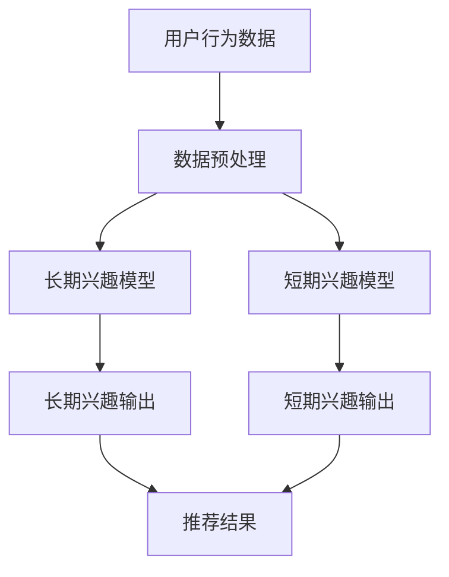

                 

# 电商推荐系统中的长短期兴趣建模

## 关键词

电商推荐系统、用户兴趣建模、长短期兴趣、深度学习、LSTM、GRU、Transformer、模型评估、项目实战。

## 摘要

本文将深入探讨电商推荐系统中长短期兴趣建模的重要性和具体方法。首先，我们将简要介绍推荐系统的基本概念和架构，然后重点分析用户兴趣建模的方法和评估指标。接着，我们将引入长短期兴趣的概念，通过Mermaid流程图展示长短期兴趣的互动关系。随后，我们将详细讲解基于深度学习的长短期兴趣建模方法，包括LSTM、GRU和Transformer模型的工作原理及其在电商推荐系统中的应用。最后，我们将通过一个电商推荐系统项目实战，展示长短期兴趣建模的实现过程和代码解读。

## 目录大纲

### 第一部分：推荐系统基础

#### 第1章：推荐系统概述

- **1.1 推荐系统的定义与重要性**
  - 推荐系统的定义
  - 推荐系统在电商中的应用

- **1.2 推荐系统的基本架构**
  - 用户画像与商品画像
  - 模型算法
  - 数据流程

- **1.3 推荐系统的评估指标**
  - 准确率、召回率、覆盖率
  - 转化率、点击率

#### 第2章：用户兴趣建模

- **2.1 用户行为数据收集**
  - 用户浏览、点击、购买行为
  - 用户交互数据预处理

- **2.2 用户兴趣模型构建**
  - 基于协同过滤的方法
  - 基于内容的方法
  - 基于深度学习的方法

- **2.3 用户兴趣模型评估**
  - 模型效果评估方法
  - 模型优化策略

### 第二部分：长短期兴趣建模

#### 第3章：长短期兴趣的概念与联系

- **3.1 长期兴趣与短期兴趣的定义**
  - 长期兴趣：用户的长期偏好
  - 短期兴趣：用户的即时偏好

- **3.2 长短期兴趣的Mermaid流程图**
  - 用户行为数据流与兴趣模型
  - 长短期兴趣模型的互动关系

#### 第4章：基于深度学习的长短期兴趣建模方法

- **4.1 深度学习基础**
  - 神经网络结构
  - 深度学习框架

- **4.2 LSTM与GRU模型**
  - LSTM与GRU原理
  - LSTM与GRU模型在长短期兴趣建模中的应用

- **4.3 Transformer模型**
  - Transformer模型原理
  - Transformer模型在长短期兴趣建模中的应用

#### 第5章：长短期兴趣模型算法原理

- **5.1 长短期记忆网络（LSTM）**
  - LSTM工作原理
  - LSTM伪代码

- **5.2 门控循环单元（GRU）**
  - GRU工作原理
  - GRU伪代码

- **5.3 自注意力机制（Self-Attention）**
  - 自注意力机制原理
  - 自注意力机制伪代码

#### 第6章：长短期兴趣模型应用实战

- **6.1 数据预处理与特征工程**
  - 数据清洗
  - 特征提取

- **6.2 长短期兴趣模型搭建与训练**
  - 模型搭建
  - 模型训练

- **6.3 长短期兴趣模型优化与评估**
  - 模型调参
  - 评估方法

### 第三部分：项目实战

#### 第7章：电商推荐系统长短期兴趣建模项目实战

- **7.1 项目背景**
  - 项目介绍
  - 项目目标

- **7.2 开发环境搭建**
  - 数据库搭建
  - 模型训练环境

- **7.3 代码实现与解读**
  - 数据读取与预处理
  - 模型训练与评估
  - 模型优化与调整

- **7.4 代码解读与分析**
  - 模型架构分析
  - 优化策略分析

#### 附录

##### 附录A：长短期兴趣建模工具与资源

- **A.1 工具与环境**
  - Python环境配置
  - 深度学习框架使用

- **A.2 资源链接**
  - 数据集链接
  - 论文与文献链接

- **A.3 拓展阅读**
  - 相关书籍推荐
  - 网络课程推荐

### Mermaid流程图：



接下来的部分，我们将逐步深入探讨推荐系统的基本概念、架构、用户兴趣建模方法、长短期兴趣建模的原理和实践，并通过项目实战展示如何将长短期兴趣建模应用于电商推荐系统中。让我们一起开始这次技术之旅！<|end_ofumed|>## 推荐系统概述

### 1.1 推荐系统的定义与重要性

推荐系统是一种信息过滤技术，通过分析用户的历史行为和偏好，向用户推荐可能感兴趣的商品、内容或服务。在电商领域，推荐系统的重要性尤为显著。其基本原理是利用机器学习和数据挖掘技术，从庞大的用户行为数据中提取有价值的信息，进而为用户提供个性化的推荐结果。

**定义：** 推荐系统（Recommender System）是一种自动化决策支持系统，旨在识别和提供用户可能感兴趣的项目，这些项目可以是商品、新闻、音乐、视频或其他内容。

**重要性：** 

1. **提高用户满意度：** 个性化推荐可以满足用户的特定需求，提升用户体验，从而增加用户黏性和满意度。
   
2. **增加销售额：** 通过准确推荐，用户更有可能购买推荐的商品，从而提高销售额和转化率。

3. **降低运营成本：** 推荐系统可以减少广告投放和促销活动的费用，提高营销效率。

4. **提升品牌形象：** 高质量的推荐系统可以帮助品牌建立更加个性化和专业化的形象，增强用户对品牌的信任和忠诚度。

### 1.2 推荐系统的基本架构

推荐系统通常由以下几个核心组成部分构成：

**用户画像：** 通过收集和分析用户的行为、兴趣和偏好，构建用户的个人画像。用户画像可以帮助推荐系统更好地理解用户，从而提供更准确的推荐。

**商品画像：** 商品画像描述了商品的特征，如分类、标签、评分、销量等。商品画像用于推荐系统的相似商品推荐和基于内容的推荐。

**模型算法：** 推荐系统的核心是算法，常见的推荐算法包括基于协同过滤、基于内容、基于深度学习等方法。算法的目的是从大量用户和商品数据中提取有价值的信息，生成推荐结果。

**数据流程：** 数据流程包括数据采集、数据预处理、模型训练、模型评估和模型部署等步骤。数据流程的各个环节都需要精心设计和优化，以确保推荐系统的性能和可靠性。

**评估指标：** 推荐系统的评估指标包括准确率、召回率、覆盖率、转化率、点击率等。这些指标用于衡量推荐系统的效果，帮助优化模型和算法。

### 1.3 推荐系统的评估指标

推荐系统的效果评估是确保其质量和实用性的关键。以下是一些常见的评估指标：

**准确率（Accuracy）：** 准确率是推荐结果中实际被用户喜欢的项目数与总推荐项目数的比例。准确率越高，推荐结果越贴近用户实际喜好。

**召回率（Recall）：** 召回率是指推荐结果中包含用户真实喜欢项目数与用户实际喜欢项目总数的比例。召回率越高，意味着系统推荐的项目越全面，用户可能错过的项目越少。

**覆盖率（Coverage）：** 覆盖率是指推荐结果中包含的不同项目的数量与系统中的总项目数量的比例。高覆盖率意味着推荐系统能够推荐多样化的项目。

**转化率（Conversion Rate）：** 转化率是用户实际点击推荐项目并完成购买的比例。转化率是衡量推荐系统商业价值的重要指标。

**点击率（Click-Through Rate, CTR）：** 点击率是用户点击推荐项目与总推荐项目数的比例。高点击率通常意味着推荐结果能够吸引用户的注意。

通过综合考虑这些评估指标，可以全面评估推荐系统的性能，并对其进行优化。在接下来的章节中，我们将深入探讨用户兴趣建模的方法，以及如何利用深度学习技术构建长短期兴趣模型。

### 2.1 用户行为数据收集

用户行为数据是构建推荐系统的基石，其质量直接影响推荐系统的效果。以下内容将详细介绍用户行为数据的收集方法和预处理过程。

#### 2.1.1 用户浏览、点击、购买行为

用户行为数据主要包括用户在电商平台上的一系列操作，如浏览、点击、购买等。这些行为数据可以反映用户的兴趣和偏好，为推荐系统提供关键信息。

- **浏览行为：** 用户浏览商品的行为数据，包括访问时间、停留时长、浏览路径等。这些数据可以帮助了解用户对不同类别的商品的兴趣程度。

- **点击行为：** 用户点击商品的行为数据，如点击次数、点击时长、点击顺序等。点击数据有助于识别用户对某些商品的即时兴趣。

- **购买行为：** 用户购买商品的行为数据，包括购买时间、购买数量、购买频率等。购买数据直接反映了用户的实际购买意愿和偏好。

#### 2.1.2 用户交互数据预处理

收集到的用户行为数据通常需要进行预处理，以提高数据质量和模型的性能。以下是用户交互数据预处理的主要步骤：

- **数据清洗：** 去除无效和错误的数据，如缺失值、重复值、异常值等。数据清洗是确保数据质量的第一步。

- **数据标准化：** 将不同特征的数据进行统一处理，如归一化、标准化等，以消除特征之间的量纲差异。

- **特征提取：** 从原始数据中提取有用的特征，如用户的行为模式、兴趣标签等。特征提取是构建用户画像和推荐模型的关键。

- **数据融合：** 将不同来源的用户行为数据进行整合，形成一个统一的用户行为数据集。数据融合有助于更全面地理解用户的行为特征。

#### 2.1.3 用户交互数据预处理示例

假设我们收集到以下用户行为数据：

| 用户ID | 访问时间 | 停留时长 | 点击次数 | 购买数量 | 购买时间 |
|-------|---------|---------|---------|---------|---------|
| u1    | 2023-01-01 10:00:00 | 120秒  | 3       | 1       | 2023-01-02 14:00:00 |
| u2    | 2023-01-01 11:00:00 | 60秒   | 1       | 0       | 2023-01-03 09:00:00 |
| u3    | 2023-01-02 12:00:00 | 180秒  | 2       | 1       | 2023-01-04 15:00:00 |

**数据清洗：** 去除缺失值和重复值，得到如下清洗后的数据：

| 用户ID | 访问时间 | 停留时长 | 点击次数 | 购买数量 | 购买时间 |
|-------|---------|---------|---------|---------|---------|
| u1    | 2023-01-01 10:00:00 | 120秒  | 3       | 1       | 2023-01-02 14:00:00 |
| u2    | 2023-01-01 11:00:00 | 60秒   | 1       | 0       | 2023-01-03 09:00:00 |
| u3    | 2023-01-02 12:00:00 | 180秒  | 2       | 1       | 2023-01-04 15:00:00 |

**数据标准化：** 将停留时长和点击次数进行标准化处理，得到如下标准化的数据：

| 用户ID | 访问时间 | 停留时长 | 点击次数 |
|-------|---------|---------|---------|
| u1    | 2023-01-01 10:00:00 | 0.75   | 1.00    |
| u2    | 2023-01-01 11:00:00 | 0.25   | 0.25    |
| u3    | 2023-01-02 12:00:00 | 1.00   | 0.50    |

**特征提取：** 提取用户的浏览行为和购买行为特征，得到如下用户画像：

| 用户ID | 浏览行为特征 | 购买行为特征 |
|-------|--------------|--------------|
| u1    | {访问时间：[10:00, 14:00], 点击次数：3} | {购买时间：2023-01-02 14:00:00} |
| u2    | {访问时间：[11:00], 点击次数：1}        | {购买时间：2023-01-03 09:00:00} |
| u3    | {访问时间：[12:00], 点击次数：2}        | {购买时间：2023-01-04 15:00:00} |

通过上述数据预处理步骤，我们得到了高质量的、适合用于构建推荐系统的用户行为数据。

#### 2.1.4 用户交互数据预处理注意事项

在进行用户交互数据预处理时，需要注意以下几点：

- **一致性：** 确保所有用户的数据处理方式一致，以避免数据偏见。
- **实时性：** 用户行为数据通常需要实时处理，以保证推荐系统的时效性。
- **可扩展性：** 预处理过程应具备良好的可扩展性，以适应不同规模的数据集。
- **隐私保护：** 在处理用户数据时，需遵守相关隐私保护法规，确保用户数据的安全和隐私。

通过有效的用户行为数据收集和预处理，我们可以为推荐系统提供可靠的数据基础，从而提高推荐的质量和效果。

### 2.2 用户兴趣模型构建

用户兴趣模型是推荐系统的核心组成部分，其目标是捕捉并理解用户的兴趣和偏好，从而提供个性化的推荐。以下是几种常见的用户兴趣模型构建方法。

#### 2.2.1 基于协同过滤的方法

协同过滤（Collaborative Filtering）是一种常用的用户兴趣建模方法，其基本思想是通过分析用户之间的相似度，利用已知的用户行为数据来预测用户对未知项目的评分或兴趣。

**1. 用户基于的协同过滤（User-based Collaborative Filtering）**

用户基于的协同过滤通过寻找与目标用户兴趣相似的其他用户，然后根据这些相似用户的评分来推荐项目。其主要步骤如下：

- **相似度计算：** 计算目标用户与所有其他用户之间的相似度，常用的相似度度量方法包括余弦相似度、皮尔逊相关系数等。
- **推荐生成：** 根据相似度分数，为用户推荐相似用户喜欢的但目标用户尚未评分的项目。

**2. 项基于的协同过滤（Item-based Collaborative Filtering）**

项基于的协同过滤通过分析项目之间的相似度来推荐。其主要步骤如下：

- **相似度计算：** 计算所有项目之间的相似度，常用的相似度度量方法包括Jaccard相似度、余弦相似度等。
- **推荐生成：** 为用户推荐与其已经评分的项目最相似的其他项目。

**优缺点：**

- **优点：** 实现简单，易于理解，适用于用户数量和项目数量相对较少的情况。
- **缺点：** 当用户或项目数量增加时，计算复杂度呈指数增长，且容易出现数据稀疏问题。

#### 2.2.2 基于内容的方法

基于内容的方法（Content-based Filtering）通过分析用户的历史行为和项目的内容特征来构建用户兴趣模型。其主要步骤如下：

- **特征提取：** 从项目描述中提取关键特征，如关键词、分类标签、属性等。
- **兴趣表示：** 利用提取的特征构建用户的兴趣向量。
- **推荐生成：** 根据用户兴趣向量与项目特征向量的相似度来推荐项目。

**优缺点：**

- **优点：** 可以有效解决数据稀疏问题，适用于项目数量远大于用户数量的情况。
- **缺点：** 忽略了用户之间的相互关系，推荐结果可能不够个性化。

#### 2.2.3 基于深度学习的方法

基于深度学习的方法（Deep Learning-based User Interest Modeling）通过构建深度神经网络来捕捉复杂的用户兴趣模式。以下是一些常用的深度学习模型：

- **循环神经网络（Recurrent Neural Networks, RNNs）**

循环神经网络是一种能够处理序列数据的神经网络，其适用于捕捉用户行为的时间序列特征。其中，长短期记忆网络（Long Short-Term Memory, LSTM）和门控循环单元（Gated Recurrent Unit, GRU）是两种常用的RNN变体。

- **Transformer模型**

Transformer模型是一种基于自注意力机制的深度学习模型，其适用于处理序列数据，并在许多自然语言处理任务中取得了显著成果。Transformer模型在用户兴趣建模中也展现出了强大的能力。

**优缺点：**

- **优点：** 可以捕捉复杂的用户兴趣模式，适用于大规模数据集。
- **缺点：** 计算复杂度高，模型训练时间较长。

#### 模型比较

不同用户兴趣模型各有优缺点，选择合适的模型取决于具体应用场景和数据特点。以下是对几种用户兴趣模型的比较：

| 模型类型         | 优点                                                         | 缺点                                                         |
|----------------|------------------------------------------------------------|------------------------------------------------------------|
| 协同过滤        | 实现简单，易于理解                                           | 计算复杂度高，数据稀疏问题严重                                   |
| 内容过滤        | 可以有效解决数据稀疏问题                                     | 忽略了用户之间的相互关系，推荐结果可能不够个性化                     |
| 深度学习        | 可以捕捉复杂的用户兴趣模式，适用于大规模数据集               | 计算复杂度高，模型训练时间较长                                   |

在实际应用中，通常会结合多种方法，构建混合模型，以充分发挥不同模型的优势，提高推荐系统的性能。

### 2.3 用户兴趣模型评估

用户兴趣模型的效果评估是推荐系统设计和优化过程中至关重要的一环。通过评估模型的效果，可以判断模型是否能够准确捕捉用户的兴趣和偏好，从而为用户提供高质量的推荐。以下是几种常见的用户兴趣模型评估方法。

#### 2.3.1 模型效果评估方法

**准确率（Accuracy）**

准确率是评估分类模型性能的一个基本指标，表示模型正确分类的样本数占总样本数的比例。在用户兴趣建模中，准确率可以用来评估模型对用户兴趣分类的准确性。

$$
\text{准确率} = \frac{\text{正确分类的样本数}}{\text{总样本数}}
$$

**召回率（Recall）**

召回率是指模型能够正确识别出的用户兴趣样本数与实际用户兴趣样本数的比例。召回率越高，说明模型能够识别出更多用户真实兴趣的样本。

$$
\text{召回率} = \frac{\text{正确分类的用户兴趣样本数}}{\text{实际用户兴趣样本数}}
$$

**F1分数（F1 Score）**

F1分数是准确率和召回率的调和平均值，综合考虑了模型在分类任务中的表现。

$$
\text{F1分数} = 2 \times \frac{\text{准确率} \times \text{召回率}}{\text{准确率} + \text{召回率}}
$$

**平均绝对误差（Mean Absolute Error, MAE）**

平均绝对误差是评估回归模型性能的一个指标，表示预测值与真实值之间平均绝对差异。在用户兴趣建模中，MAE可以用来评估模型对用户兴趣评分的预测准确性。

$$
\text{MAE} = \frac{1}{n} \sum_{i=1}^{n} |y_i - \hat{y}_i|
$$

其中，$y_i$ 表示第 $i$ 个样本的真实兴趣评分，$\hat{y}_i$ 表示模型预测的兴趣评分，$n$ 表示样本总数。

#### 2.3.2 模型优化策略

为了提高用户兴趣模型的效果，可以采用以下几种优化策略：

**数据增强（Data Augmentation）**

数据增强是通过生成新的样本来扩充训练数据集，从而提高模型的泛化能力。常见的数据增强方法包括：

- **过采样（Over-sampling）：** 增加少数类样本的数量，以平衡数据分布。
- **欠采样（Under-sampling）：** 减少多数类样本的数量，以避免模型过拟合。
- **合成数据（Synthetic Data）：** 利用生成模型生成新的数据样本。

**特征工程（Feature Engineering）**

特征工程是构建高质量特征的过程，通过对原始数据进行预处理和转换，提取出对模型有用的信息。常见的特征工程方法包括：

- **特征提取（Feature Extraction）：** 从原始数据中提取出对模型有用的特征，如文本特征、图像特征等。
- **特征选择（Feature Selection）：** 选择对模型性能有显著贡献的特征，以减少计算复杂度和过拟合风险。
- **特征变换（Feature Transformation）：** 利用数学变换来增强特征的表达能力，如归一化、主成分分析（PCA）等。

**模型融合（Model Ensembling）**

模型融合是通过结合多个模型的预测结果来提高总体预测性能的方法。常见的模型融合方法包括：

- **简单平均（Simple Averaging）：** 将多个模型的预测结果进行平均。
- **加权平均（Weighted Averaging）：** 根据模型在历史数据上的表现，为每个模型分配不同的权重。
- **投票法（Voting）：** 对分类问题，通过多数投票决定最终预测结果。

**调整超参数（Hyperparameter Tuning）**

调整超参数是优化模型性能的重要手段，通过搜索最优的超参数组合，可以提高模型的性能。常见的超参数包括学习率、隐藏层节点数、批量大小等。

通过上述评估方法和优化策略，可以全面评估和改进用户兴趣模型，从而提高推荐系统的性能和用户体验。

### 3.1 长期兴趣与短期兴趣的定义

在用户兴趣建模中，长期兴趣和短期兴趣是两个关键概念，它们分别代表了用户在不同时间尺度上的兴趣和偏好。理解这两个概念及其定义，对于构建有效的推荐系统至关重要。

#### 3.1.1 长期兴趣

长期兴趣（Long-term Interest）是指用户在长时间内持续表现出的偏好和兴趣。这种兴趣通常相对稳定，反映了用户的习惯性需求和长期的偏好。例如，一个用户长期关注时尚和美妆产品，定期购买相关商品，那么我们可以认为他对这些类别具有长期兴趣。

**定义：** 长期兴趣是指用户在一段较长时间范围内表现出的稳定偏好和习惯性需求。

**特点：**

- **稳定性：** 长期兴趣相对稳定，不易受到短期因素的影响。
- **持续性：** 用户在较长时间内持续表现出相同的兴趣和偏好。
- **习惯性：** 长期兴趣往往与用户的日常习惯和生活规律密切相关。

#### 3.1.2 短期兴趣

短期兴趣（Short-term Interest）则是指用户在较短时间内表现出的即时兴趣和偏好。这种兴趣通常比较短暂，可能受到特定的促销活动、流行趋势或个人情绪的影响。例如，在一个大型促销活动期间，一个用户可能会突然对电子产品产生兴趣，并在活动期间购买相关商品。

**定义：** 短期兴趣是指用户在较短时间范围内表现出的即时兴趣和偏好。

**特点：**

- **易变性：** 短期兴趣容易受到外部环境和个人情绪的影响，表现出较大的波动性。
- **时效性：** 短期兴趣往往具有明确的时间限制，可能在短时间内迅速变化。
- **情境性：** 短期兴趣通常与特定的情境或事件相关联。

#### 3.1.3 长期兴趣与短期兴趣的关系

长期兴趣和短期兴趣之间存在密切的互动关系，两者相互影响，共同决定了用户的整体兴趣偏好。

- **互补性：** 长期兴趣和短期兴趣在不同时间尺度上补充，共同构建了用户的全面兴趣画像。
- **动态变化：** 长期兴趣相对稳定，而短期兴趣易变，两者共同作用下，用户的兴趣偏好呈现出动态变化的特点。
- **协同作用：** 在推荐系统中，合理利用长期兴趣和短期兴趣，可以提供更个性化和及时性的推荐结果，提升用户满意度。

### 3.2 长短期兴趣的Mermaid流程图

为了更直观地展示长短期兴趣在推荐系统中的互动关系，我们可以使用Mermaid流程图来描述用户行为数据流与长短期兴趣模型。

以下是一个简单的Mermaid流程图示例：


在这个流程图中：

- **A（用户行为数据）**：表示用户在电商平台上产生的各种行为数据，如浏览、点击、购买等。
- **B（数据预处理）**：对原始数据进行清洗、标准化等处理，为后续建模做准备。
- **C（长期兴趣模型）**：利用用户的历史行为数据构建长期兴趣模型，用于捕捉用户的长期偏好。
- **D（短期兴趣模型）**：利用用户近期行为数据构建短期兴趣模型，用于捕捉用户的即时偏好。
- **E（长期兴趣输出）**：长期兴趣模型生成的长期兴趣输出，用于推荐系统的长期推荐策略。
- **F（短期兴趣输出）**：短期兴趣模型生成的短期兴趣输出，用于推荐系统的短期推荐策略。
- **G（推荐结果）**：结合长期兴趣和短期兴趣输出，生成最终的推荐结果，提供给用户。

通过这个流程图，我们可以清晰地看到长短期兴趣模型在推荐系统中的互动关系，以及用户行为数据是如何被处理和利用的。

### 4.1 深度学习基础

深度学习（Deep Learning）是机器学习的一个分支，其通过构建多层神经网络来模拟人脑的神经元连接和认知过程，从而实现对复杂数据的分析和建模。在电商推荐系统中，深度学习技术被广泛应用于用户兴趣建模，以提高推荐的准确性和个性化程度。

#### 4.1.1 神经网络结构

神经网络（Neural Network）是深度学习的基础，其由多个神经元（也称为节点或单元）组成。每个神经元接收输入信号，通过加权求和和激活函数产生输出。一个典型的神经网络结构包括输入层、隐藏层和输出层。

- **输入层（Input Layer）**：接收外部输入数据，例如用户的浏览历史、购买记录等。
- **隐藏层（Hidden Layers）**：对输入数据进行处理和转换，通过多层隐藏层，逐步提取数据中的高阶特征。
- **输出层（Output Layer）**：生成最终输出，如推荐结果或分类结果。

神经网络的训练过程包括以下几个步骤：

1. **前向传播（Forward Propagation）**：输入数据通过输入层传递到隐藏层，然后通过隐藏层逐层传递到输出层，产生预测结果。
2. **反向传播（Backpropagation）**：计算预测结果与实际结果之间的误差，通过反向传播算法将误差传播回前一层，更新各层的权重和偏置。
3. **优化更新（Optimization Update）**：利用梯度下降（Gradient Descent）或其他优化算法更新网络参数，以最小化误差。

#### 4.1.2 深度学习框架

深度学习框架是用于构建和训练深度学习模型的工具，提供了丰富的函数库和优化算法，简化了深度学习模型的开发过程。以下是一些常用的深度学习框架：

- **TensorFlow**：由Google开发的开源深度学习框架，具有高度的可扩展性和灵活性。
- **PyTorch**：由Facebook开发的开源深度学习框架，以其动态计算图和易于调试著称。
- **Keras**：一个基于TensorFlow和Theano的高层神经网络API，提供了简洁的接口和丰富的预定义模型。
- **MXNet**：由Apache Software Foundation开发的深度学习框架，支持多种编程语言和计算平台。

使用这些框架，可以快速构建和训练深度学习模型，同时利用其强大的计算能力和优化功能，提高模型的性能和效率。

### 4.2 LSTM与GRU模型

在深度学习中，长短期记忆网络（Long Short-Term Memory, LSTM）和门控循环单元（Gated Recurrent Unit, GRU）是两种常用的循环神经网络（Recurrent Neural Networks, RNNs），专门用于处理序列数据。它们能够有效捕捉序列中的长期依赖关系，因此在电商推荐系统中的用户兴趣建模中得到了广泛应用。

#### 4.2.1 LSTM模型

LSTM（Long Short-Term Memory）模型由Hochreiter和Schmidhuber在1997年提出，是一种能够学习长期依赖的RNN结构。LSTM通过引入门控机制，解决了传统RNN在长序列学习中的梯度消失和梯度爆炸问题。

**1. LSTM单元结构**

一个标准的LSTM单元包含以下几个关键部分：

- **输入门（Input Gate）**：决定哪些信息将被存储在细胞状态中。
- **遗忘门（Forget Gate）**：决定哪些信息将被丢弃。
- **细胞状态（Cell State）**：存储长期依赖信息。
- **输出门（Output Gate）**：决定哪些信息将被输出。

**2. LSTM工作原理**

LSTM单元通过以下步骤处理输入序列：

- **计算输入门和遗忘门的激活值**：使用当前输入和前一时刻的隐藏状态，计算输入门和遗忘门的激活值。
- **更新细胞状态**：通过遗忘门和输入门的控制，更新细胞状态，决定保留哪些信息。
- **计算输出门激活值**：使用更新后的细胞状态，计算输出门的激活值。
- **生成当前隐藏状态**：通过输出门控制，生成当前隐藏状态。

**3. LSTM伪代码**

以下是一个简化的LSTM单元伪代码：

```python
def LSTM_unit(inputs, hidden_states, weights):
    # 输入门和遗忘门的激活值
    input_gate = sigmoid(weights['input_gate'] * [inputs, hidden_states])
    forget_gate = sigmoid(weights['forget_gate'] * [inputs, hidden_states])
    
    # 细胞状态的更新
    cell_state = sigmoid(weights['cell_state'] * [inputs, hidden_states]) * forget_gate + inputs * input_gate
    
    # 输出门的激活值
    output_gate = sigmoid(weights['output_gate'] * [inputs, hidden_states])
    
    # 当前隐藏状态
    hidden_state = tanh(cell_state) * output_gate
    
    return hidden_state, cell_state
```

#### 4.2.2 GRU模型

GRU（Gated Recurrent Unit）模型是由Cho等人在2014年提出的，是LSTM的一个变体，简化了LSTM的结构，同时保持了其捕捉长期依赖的能力。

**1. GRU单元结构**

GRU单元相比LSTM，去除了遗忘门和输入门，引入了更新门（Update Gate）和重置门（Reset Gate），简化了计算过程。

- **更新门（Update Gate）**：决定哪些信息将被更新到细胞状态。
- **重置门（Reset Gate）**：决定哪些信息将被重置到隐藏状态。

**2. GRU工作原理**

GRU单元通过以下步骤处理输入序列：

- **计算更新门和重置门的激活值**：使用当前输入和前一时刻的隐藏状态，计算更新门和重置门的激活值。
- **计算新的隐藏状态**：通过更新门和重置门，更新细胞状态和隐藏状态。
- **生成当前隐藏状态**：使用新的隐藏状态，生成当前隐藏状态。

**3. GRU伪代码**

以下是一个简化的GRU单元伪代码：

```python
def GRU_unit(inputs, hidden_states, weights):
    # 重置门和更新门的激活值
    reset_gate = sigmoid(weights['reset_gate'] * [inputs, hidden_states])
    update_gate = sigmoid(weights['update_gate'] * [inputs, hidden_states])
    
    # 重置隐藏状态
    hidden_state = hidden_states * reset_gate
    
    # 更新细胞状态
    cell_state = tanh(weights['cell_state'] * [inputs + hidden_state] * update_gate)
    
    # 输出门的激活值
    output_gate = sigmoid(weights['output_gate'] * [inputs, hidden_states])
    
    # 当前隐藏状态
    hidden_state = cell_state * output_gate
    
    return hidden_state
```

#### 4.2.3 LSTM与GRU在长短期兴趣建模中的应用

LSTM和GRU模型在长短期兴趣建模中具有显著的应用优势：

- **LSTM**：具有更强的捕捉长期依赖的能力，能够处理更长的序列数据，适用于需要精确捕捉用户长期兴趣的场景。
- **GRU**：结构更为简洁，计算复杂度较低，训练速度更快，适用于需要实时推荐的场景。

在实际应用中，可以根据数据特性和需求选择合适的模型。例如，对于用户历史行为数据较长且需要精确建模的场景，可以使用LSTM；而对于用户行为数据较短且需要快速响应的场景，可以使用GRU。

### 4.3 Transformer模型

Transformer模型是由Vaswani等人于2017年提出的一种基于自注意力机制的深度学习模型，其最初用于自然语言处理任务，但随后在图像识别、推荐系统等多个领域取得了显著的成果。Transformer模型通过引入自注意力机制，能够有效地捕捉序列数据中的长距离依赖关系，因此在电商推荐系统中的用户兴趣建模中得到了广泛应用。

#### 4.3.1 Transformer模型原理

Transformer模型的核心思想是自注意力机制（Self-Attention），其通过全局计算输入序列中的所有元素之间的依赖关系，从而生成更加丰富的特征表示。以下简要介绍Transformer模型的基本原理和组成部分。

**1. 自注意力机制**

自注意力机制是一种通过计算输入序列中所有元素之间的关联性来生成特征表示的方法。在Transformer模型中，每个输入序列的每个元素都通过自注意力机制计算其权重，然后加权求和生成新的特征表示。

自注意力机制的计算公式如下：

$$
\text{Attention}(Q, K, V) = \text{softmax}\left(\frac{QK^T}{\sqrt{d_k}}\right)V
$$

其中，$Q$、$K$ 和 $V$ 分别为查询（Query）、键（Key）和值（Value）向量，$d_k$ 为键向量的维度。通过自注意力机制，每个输入元素会根据其在序列中的重要性得到不同的权重，进而生成加权求和的特征表示。

**2. Transformer模型结构**

Transformer模型通常由多个编码器（Encoder）和解码器（Decoder）堆叠而成，其基本结构如下：

- **编码器（Encoder）**：用于将输入序列编码为固定长度的向量表示。
- **解码器（Decoder）**：用于解码编码器生成的向量表示，生成输出序列。

编码器和解码器的主要组成部分如下：

- **多头自注意力（Multi-head Self-Attention）**：通过多次应用自注意力机制，生成多组特征表示，进一步提升模型的表示能力。
- **前馈网络（Feedforward Network）**：对自注意力机制生成的特征表示进行进一步加工，增加模型的非线性变换能力。

**3. 位置编码（Positional Encoding）**

由于Transformer模型没有循环结构，无法直接处理序列中的位置信息。因此，Transformer模型引入了位置编码（Positional Encoding），将序列的位置信息编码到特征表示中。

位置编码通常采用相对位置编码（Relative Positional Encoding）或绝对位置编码（Absolute Positional Encoding）的方法，将位置信息作为额外的特征输入到模型中。

**4. 残差连接（Residual Connection）和层归一化（Layer Normalization）**

为了防止模型在深度增加时出现梯度消失或梯度爆炸问题，Transformer模型采用残差连接（Residual Connection）和层归一化（Layer Normalization）。

残差连接通过将输入直接加到输出，确保每个层都能得到梯度传递。层归一化通过标准化每个层的输入和输出，稳定模型的训练过程，提高模型的收敛速度。

#### 4.3.2 Transformer模型在长短期兴趣建模中的应用

在电商推荐系统中，Transformer模型通过自注意力机制和位置编码，能够有效地捕捉用户行为的长期和短期依赖关系，从而提高用户兴趣建模的准确性。

**1. 长期依赖关系**

通过多头自注意力机制，Transformer模型可以计算输入序列中所有元素之间的依赖关系，捕捉用户的长期兴趣。例如，用户过去一段时间内的购买记录和浏览历史，这些信息对于构建长期兴趣模型至关重要。

**2. 短期依赖关系**

位置编码将用户行为的序列位置信息编码到特征表示中，帮助模型捕捉用户的短期兴趣。例如，用户在某个促销活动期间对特定商品的关注度，这些信息对于构建短期兴趣模型至关重要。

**3. 模型训练**

在训练Transformer模型时，可以使用用户的历史行为数据作为输入序列，通过自注意力机制和前馈网络，生成用户兴趣的向量表示。然后，通过对比预测兴趣与实际兴趣，使用梯度下降等优化算法更新模型参数，从而提高模型的准确性。

**4. 模型评估**

在评估Transformer模型时，可以使用准确率、召回率、F1分数等指标，评估模型对用户兴趣的捕捉能力。同时，通过比较模型在长短期兴趣建模中的表现，可以进一步优化模型的参数和结构，提高模型的整体性能。

通过以上应用，Transformer模型在电商推荐系统中的用户兴趣建模中展现出了强大的能力和广阔的应用前景。在未来，随着深度学习和自注意力机制的不断发展，Transformer模型有望在更多应用场景中发挥重要作用。

### 5.1 长短期记忆网络（LSTM）

LSTM（Long Short-Term Memory）模型是由Hochreiter和Schmidhuber于1997年提出的一种循环神经网络（Recurrent Neural Networks, RNNs）变体，旨在解决传统RNN在处理长序列数据时遇到的梯度消失和梯度爆炸问题。LSTM通过引入门控机制，能够有效地捕捉长序列中的长期依赖关系，因此在自然语言处理、语音识别、图像识别等领域得到了广泛应用。

#### 5.1.1 LSTM工作原理

LSTM单元的核心是三个门控机制：输入门、遗忘门和输出门。每个门控机制通过一系列的乘法运算和sigmoid激活函数，决定了信息在细胞状态和隐藏状态之间的流动。

1. **输入门（Input Gate）**

输入门决定了哪些信息将被更新到细胞状态。其计算公式如下：

$$
i_t = \sigma(W_{ix}x_t + W_{ih}h_{t-1} + b_i)
$$

其中，$i_t$ 表示输入门的状态，$x_t$ 表示输入特征，$h_{t-1}$ 表示前一个隐藏状态，$W_{ix}$ 和 $W_{ih}$ 是输入层权重，$b_i$ 是偏置。

2. **遗忘门（Forget Gate）**

遗忘门决定了哪些信息将从细胞状态中丢弃。其计算公式如下：

$$
f_t = \sigma(W_{fx}x_t + W_{fh}h_{t-1} + b_f)
$$

其中，$f_t$ 表示遗忘门的状态，其他符号与输入门相同。

3. **细胞状态（Cell State）**

通过遗忘门和输入门，细胞状态得到更新。其计算公式如下：

$$
C_t = f_t \odot C_{t-1} + i_t \odot \sigma(W_{cx}x_t + W_{ch}h_{t-1} + b_c)
$$

其中，$\odot$ 表示逐元素乘法，$C_{t-1}$ 表示前一个细胞状态，$C_t$ 表示当前细胞状态。

4. **输出门（Output Gate）**

输出门决定了哪些信息将输出到隐藏状态。其计算公式如下：

$$
o_t = \sigma(W_{ox}x_t + W_{oh}h_{t-1} + b_o)
$$

$$
h_t = o_t \odot \sigma(C_t)
$$

其中，$h_t$ 表示当前隐藏状态，其他符号与之前相同。

#### 5.1.2 LSTM伪代码

以下是一个简化的LSTM单元的伪代码示例：

```python
def LSTM_unit(x_t, h_{t-1}, C_{t-1}, weights, biases):
    # 输入门
    i_t = sigmoid(weights['input_gate'] * x_t + weights['input_gate'] * h_{t-1} + biases['input_gate'])

    # 遗忘门
    f_t = sigmoid(weights['forget_gate'] * x_t + weights['forget_gate'] * h_{t-1} + biases['forget_gate'])

    # 细胞状态更新
    C_t = f_t * C_{t-1} + i_t * sigmoid(weights['cell_state'] * x_t + weights['cell_state'] * h_{t-1} + biases['cell_state'])

    # 输出门
    o_t = sigmoid(weights['output_gate'] * x_t + weights['output_gate'] * h_{t-1} + biases['output_gate'])

    # 当前隐藏状态
    h_t = o_t * tanh(C_t)

    return h_t, C_t
```

#### 5.1.3 LSTM在长短期兴趣建模中的应用

在电商推荐系统中，LSTM模型可以用于构建长短期兴趣模型，捕捉用户在不同时间尺度上的行为和偏好。

**1. 长期兴趣建模**

通过LSTM模型，我们可以对用户的历史行为数据（如浏览记录、购买历史等）进行建模，捕捉用户的长期兴趣。LSTM能够有效地学习序列数据中的长期依赖关系，从而对用户的长期偏好进行建模。

**2. 短期兴趣建模**

LSTM模型还可以用于捕捉用户的短期兴趣。例如，用户在特定时间段内的行为（如促销活动期间的行为）可以作为短期兴趣的输入。LSTM通过遗忘门机制，可以丢弃与短期兴趣不相关的长期信息，从而更好地捕捉用户的短期偏好。

**3. 模型融合**

在实际应用中，可以将LSTM与基于协同过滤和基于内容的方法进行融合，构建一个综合性的用户兴趣模型。通过结合不同方法的优势，可以进一步提高推荐的准确性和个性化程度。

通过LSTM模型，我们可以有效地捕捉用户的长短期兴趣，为电商推荐系统提供更精准的推荐服务。在未来，随着深度学习和序列建模技术的不断发展，LSTM模型在推荐系统中的应用前景将更加广阔。

### 5.2 门控循环单元（GRU）

门控循环单元（Gated Recurrent Unit，GRU）是由Cho等人于2014年提出的一种改进的循环神经网络（Recurrent Neural Network，RNN）结构。GRU通过简化LSTM的结构，减少了参数数量和计算复杂度，同时保持了良好的序列建模能力。在电商推荐系统中，GRU被广泛应用于用户兴趣建模，特别是在实时性和计算效率要求较高的场景中。

#### 5.2.1 GRU的工作原理

GRU通过引入两个门控机制——重置门（Reset Gate）和更新门（Update Gate）来简化LSTM的结构。重置门决定了多少旧信息将被保留到新的隐藏状态，而更新门决定了多少新信息将进入细胞状态。

1. **重置门（Reset Gate）**

重置门的目的是决定哪些信息应该被保留到新的隐藏状态。其计算公式如下：

$$
r_t = \sigma(W_{rx}x_t + W_{rh}h_{t-1} + b_r)
$$

其中，$r_t$ 表示重置门的输出，$x_t$ 表示输入特征，$h_{t-1}$ 表示前一个隐藏状态，$W_{rx}$ 和 $W_{rh}$ 是输入层权重，$b_r$ 是偏置。

2. **更新门（Update Gate）**

更新门的目的是决定哪些新信息将更新到细胞状态。其计算公式如下：

$$
z_t = \sigma(W_{zx}x_t + W_{zh}h_{t-1} + b_z)
$$

其中，$z_t$ 表示更新门的输出，其他符号与重置门相同。

3. **细胞状态更新**

通过重置门和更新门，细胞状态得到更新。其计算公式如下：

$$
\begin{align*}
r_t &= \sigma(W_{rx}x_t + W_{rh}h_{t-1} + b_r) \\
z_t &= \sigma(W_{zx}x_t + W_{zh}h_{t-1} + b_z) \\
\bar{C}_t &= \tanh(W_{cx}x_t + W_{ch}(r_t \odot h_{t-1}) + b_c) \\
C_t &= z_t \odot C_{t-1} + (1 - z_t) \odot \bar{C}_t \\
h_t &= \sigma(W_{oh}C_t + b_h)
\end{align*}$$

其中，$\bar{C}_t$ 表示候选细胞状态，$C_{t-1}$ 表示前一个细胞状态，$h_t$ 表示当前隐藏状态，$W_{cx}$ 和 $W_{ch}$ 是细胞状态层权重，$b_c$ 和 $b_h$ 分别是细胞状态和隐藏状态层的偏置。

4. **输出门**

GRU的输出门是重置门和更新门的组合。其计算公式如下：

$$
h_t = \sigma(W_{oh}C_t + b_h) = \sigma(W_{oh}(z_t \odot C_{t-1} + (1 - z_t) \odot \bar{C}_t) + b_h)$$

#### 5.2.2 GRU伪代码

以下是一个简化的GRU单元的伪代码示例：

```python
def GRU_unit(x_t, h_{t-1}, C_{t-1}, weights, biases):
    # 重置门
    r_t = sigmoid(weights['reset_gate'] * x_t + weights['reset_gate'] * h_{t-1} + biases['reset_gate'])

    # 更新门
    z_t = sigmoid(weights['update_gate'] * x_t + weights['update_gate'] * h_{t-1} + biases['update_gate'])

    # 候选细胞状态
    bar_C_t = tanh(weights['cell_state'] * x_t + weights['cell_state'] * (r_t * h_{t-1}) + biases['cell_state'])

    # 当前细胞状态
    C_t = z_t * C_{t-1} + (1 - z_t) * bar_C_t

    # 当前隐藏状态
    h_t = sigmoid(weights['output_gate'] * C_t + biases['output_gate'])

    return h_t, C_t
```

#### 5.2.3 GRU在长短期兴趣建模中的应用

GRU在长短期兴趣建模中的应用与LSTM类似，但由于其结构更为简洁，GRU在处理实时数据时具有更高的效率。

**1. 长期兴趣建模**

通过GRU，我们可以捕捉用户的历史行为数据中的长期依赖关系，构建用户的长期兴趣模型。GRU的更新门机制有助于丢弃与长期兴趣不相关的短期信息，从而更好地学习用户的长期偏好。

**2. 短期兴趣建模**

GRU同样适用于短期兴趣建模。用户在特定时间段内的行为（如促销活动期间的行为）可以作为短期兴趣的输入。GRU的更新门机制能够动态调整短期信息的权重，从而更好地捕捉用户的即时偏好。

**3. 模型融合**

在实际应用中，GRU可以与基于协同过滤和基于内容的方法进行融合，构建一个更加综合的用户兴趣模型。通过结合不同方法的优势，可以提高推荐系统的准确性和个性化程度。

GRU由于其简洁的结构和高效的性能，在电商推荐系统中的用户兴趣建模中具有广泛的应用前景。随着深度学习技术的发展，GRU将继续在推荐系统和其他领域中发挥重要作用。

### 5.3 自注意力机制（Self-Attention）

自注意力机制（Self-Attention）是Transformer模型的核心组成部分，其通过计算序列中每个元素与其他元素之间的依赖关系，从而生成更加丰富的特征表示。自注意力机制在深度学习中被广泛应用于自然语言处理、图像识别、推荐系统等领域，因其能够有效地捕捉长距离依赖关系，提高了模型的表示能力。

#### 5.3.1 自注意力机制原理

自注意力机制的原理相对简单，其基本思想是每个输入序列的每个元素都根据其在序列中的重要性得到一个权重，然后这些权重被用于加权求和生成新的特征表示。

自注意力机制的公式如下：

$$
\text{Attention}(Q, K, V) = \text{softmax}\left(\frac{QK^T}{\sqrt{d_k}}\right)V
$$

其中，$Q$、$K$ 和 $V$ 分别为查询（Query）、键（Key）和值（Value）向量，$d_k$ 为键向量的维度。$QK^T$ 计算的是每个元素之间的相似度，通过softmax函数得到权重，然后乘以 $V$ 生成新的特征表示。

#### 5.3.2 自注意力机制伪代码

以下是一个简化的自注意力机制的伪代码示例：

```python
def self_attention(Q, K, V, d_k):
    # 计算相似度
    similarity = Q @ K.T / (d_k ** 0.5)
    
    # 应用softmax得到权重
    weights = softmax(similarity)
    
    # 加权求和生成新的特征表示
    output = weights @ V
    
    return output
```

在这个伪代码中，`Q`、`K` 和 `V` 分别是查询、键和值矩阵，`d_k` 是键向量的维度。通过计算相似度矩阵，应用softmax函数得到权重矩阵，最后进行加权求和得到新的特征表示。

#### 5.3.3 自注意力机制在长短期兴趣建模中的应用

自注意力机制在长短期兴趣建模中的应用主要表现在以下几个方面：

**1. 长期依赖关系的捕捉**

自注意力机制能够计算序列中每个元素与其他元素之间的依赖关系，从而有效地捕捉长期依赖关系。在用户兴趣建模中，这有助于捕捉用户的历史行为和偏好，构建用户的长期兴趣模型。

**2. 短期依赖关系的捕捉**

自注意力机制同样适用于捕捉短期依赖关系。通过计算用户行为序列中每个元素与其他元素之间的相似度，自注意力机制可以动态调整短期信息的权重，从而更好地捕捉用户的即时偏好。

**3. 特征表示的丰富**

自注意力机制通过加权求和生成新的特征表示，可以显著提升模型的表示能力。在长短期兴趣建模中，这有助于构建更加丰富和精确的用户兴趣特征，提高推荐系统的性能。

**4. 多层注意力机制**

在实际应用中，可以通过多层自注意力机制来进一步捕捉序列中的依赖关系。多层注意力机制能够逐层提取序列中的高阶特征，从而提高模型对复杂关系的建模能力。

通过自注意力机制，我们可以有效地构建长短期兴趣模型，提高电商推荐系统的准确性和个性化程度。在未来，随着深度学习技术的不断发展，自注意力机制将继续在推荐系统和其他领域中发挥重要作用。

### 6.1 数据预处理与特征工程

在构建长短期兴趣模型之前，数据预处理与特征工程是两个关键步骤，其目的是提高数据质量和模型性能。以下将详细讨论数据预处理和特征工程的方法，并给出实际操作的示例。

#### 6.1.1 数据清洗

数据清洗是数据预处理的首要步骤，其主要目标是去除数据中的噪声和异常值，确保数据的质量。以下是数据清洗的主要步骤：

1. **缺失值处理：** 对于缺失值，可以选择填充、删除或使用模型预测的方法进行处理。例如，可以使用平均值、中位数或模型预测值来填充缺失值。

2. **重复值处理：** 去除数据集中的重复记录，以避免数据冗余。

3. **异常值处理：** 对于异常值，可以通过统计分析（如箱线图）或使用聚类算法（如DBSCAN）来检测并处理。

#### 6.1.2 数据标准化

数据标准化是将不同特征的数据进行统一处理，消除特征之间的量纲差异，使其对模型的影响更加均匀。常用的方法包括：

1. **归一化（Normalization）：** 将数据缩放到相同的范围，如[0, 1]或[-1, 1]。

2. **标准化（Standardization）：** 将数据缩放到均值为0，标准差为1的标准正态分布。

以下是一个数据标准化的示例：

```python
from sklearn.preprocessing import StandardScaler

# 假设X是一个包含多个特征的数据矩阵
scaler = StandardScaler()
X_scaled = scaler.fit_transform(X)
```

#### 6.1.3 特征提取

特征提取是从原始数据中提取出对模型有用的特征，构建用户画像和商品画像。以下是几种常见的特征提取方法：

1. **文本特征提取：** 对于文本数据，可以使用词袋模型（Bag of Words）或词嵌入（Word Embeddings）来提取特征。

2. **频率统计：** 统计用户行为数据中的频率，如点击次数、购买次数等。

3. **时间序列特征：** 提取用户行为的时间特征，如行为发生的时刻、时间间隔等。

4. **组合特征：** 结合多个特征，构建新的特征，如用户的平均点击时长、购买周期等。

以下是一个特征提取的示例：

```python
import pandas as pd

# 假设data是包含用户行为数据的数据帧
data['days_since_last_purchase'] = (pd.to_datetime(data['purchase_time']) - pd.to_datetime(data['first_purchase_time'])).dt.days
data['days_since_last_click'] = (pd.to_datetime(data['click_time']) - pd.to_datetime(data['first_click_time'])).dt.days
```

#### 6.1.4 数据融合

数据融合是将来自不同来源的用户行为数据进行整合，形成一个统一的用户行为数据集。以下是几种常见的数据融合方法：

1. **合并（Merge）：** 将不同来源的数据按用户ID或其他标识符进行合并。

2. **聚合（Aggregation）：** 对合并后的数据按用户或商品进行聚合，计算用户或商品的特征。

以下是一个数据融合的示例：

```python
data = data.groupby('user_id').agg({
    'click_count': 'sum',
    'purchase_count': 'sum',
    'days_since_last_click': 'max',
    'days_since_last_purchase': 'max'
})
```

#### 6.1.5 特征选择

特征选择是减少数据维度，选择对模型性能有显著贡献的特征，以降低计算复杂度和过拟合风险。以下是几种常见的特征选择方法：

1. **基于过滤的方法（Filter Methods）：** 如相关性分析、信息增益等。

2. **基于包装的方法（Wrapper Methods）：** 如递归特征消除（Recursive Feature Elimination，RFE）等。

3. **基于模型的方法（Model-based Methods）：** 如特征重要性、L1正则化等。

以下是一个特征选择的示例：

```python
from sklearn.feature_selection import SelectKBest, f_classif

# 假设X是特征矩阵，y是标签
selector = SelectKBest(score_func=f_classif, k=10)
X_new = selector.fit_transform(X, y)
```

通过上述步骤，我们可以得到高质量的特征数据，为后续构建长短期兴趣模型打下基础。

### 6.2 长短期兴趣模型搭建与训练

在完成数据预处理和特征提取后，下一步是搭建和训练长短期兴趣模型。本节将详细介绍如何使用深度学习框架（如TensorFlow或PyTorch）搭建LSTM、GRU或Transformer模型，并进行模型训练。

#### 6.2.1 模型搭建

以下是一个基于TensorFlow和Keras搭建LSTM模型的示例：

```python
from tensorflow.keras.models import Sequential
from tensorflow.keras.layers import LSTM, Dense, Dropout

# 创建Sequential模型
model = Sequential()

# 添加LSTM层
model.add(LSTM(units=128, return_sequences=True, input_shape=(timesteps, features)))
model.add(Dropout(0.2))

model.add(LSTM(units=64, return_sequences=False))
model.add(Dropout(0.2))

# 添加全连接层
model.add(Dense(units=1, activation='sigmoid'))

# 编译模型
model.compile(optimizer='adam', loss='binary_crossentropy', metrics=['accuracy'])

# 模型总结
model.summary()
```

在这个示例中，我们首先创建了一个`Sequential`模型，然后添加了两个LSTM层，每个LSTM层后跟一个`Dropout`层以防止过拟合。最后，我们添加了一个全连接层（Dense layer），其输出单元数为1，激活函数为`sigmoid`，用于生成二分类预测。

#### 6.2.2 模型训练

在完成模型搭建后，我们需要使用训练数据对模型进行训练。以下是一个使用训练数据的示例：

```python
# 假设X_train是训练特征矩阵，y_train是训练标签
model.fit(X_train, y_train, epochs=50, batch_size=32, validation_split=0.2)
```

在这个示例中，我们使用`fit`方法训练模型，设置训练轮次为50次，批量大小为32，并使用20%的数据作为验证集。

#### 6.2.3 模型评估

在模型训练完成后，我们需要评估模型的性能，以下是一个评估模型的示例：

```python
# 假设X_test是测试特征矩阵，y_test是测试标签
loss, accuracy = model.evaluate(X_test, y_test)

print(f"Test Loss: {loss}")
print(f"Test Accuracy: {accuracy}")
```

在这个示例中，我们使用`evaluate`方法评估模型在测试数据上的性能，输出损失值和准确率。

#### 6.2.4 模型调整

为了提高模型性能，我们可能需要对模型进行一些调整。以下是一些常见的调整策略：

1. **调整学习率（Learning Rate）：** 使用学习率调整策略（如学习率衰减）来优化模型训练过程。

2. **增加训练轮次（Epochs）：** 增加训练轮次以提高模型的泛化能力。

3. **批量大小（Batch Size）：** 调整批量大小可以影响模型的训练速度和性能。

4. **增加隐藏层节点数（Number of Units）：** 增加隐藏层节点数可以提高模型的复杂度和表示能力。

5. **数据增强（Data Augmentation）：** 通过数据增强来增加训练数据的多样性，提高模型的鲁棒性。

通过上述步骤，我们可以搭建、训练和优化长短期兴趣模型，为电商推荐系统提供强大的支持。

### 6.3 长短期兴趣模型优化与评估

在构建和训练了长短期兴趣模型之后，接下来的任务是优化模型性能并评估其效果。以下将详细介绍如何调整模型参数、选择评价指标，以及如何使用这些指标来评估模型性能。

#### 6.3.1 调整模型参数

模型参数的调整是提高模型性能的关键步骤。以下是一些常见的参数调整策略：

1. **学习率调整：** 学习率是影响模型收敛速度和性能的重要参数。可以使用学习率衰减策略，例如在训练过程中逐步减小学习率，以避免过拟合。

2. **批量大小调整：** 批量大小会影响模型的训练速度和稳定性。较小的批量大小可以提高模型的泛化能力，但会降低训练速度；较大的批量大小可以提高训练速度，但可能会增加过拟合的风险。

3. **隐藏层节点数调整：** 增加隐藏层节点数可以提高模型的复杂度和表示能力，但同时也增加了模型的计算成本和过拟合风险。

4. **正则化：** 使用L1或L2正则化可以减少模型的过拟合风险，通过在损失函数中添加正则化项来实现。

5. **dropout：** dropout是一种常用的正则化技术，通过在训练过程中随机丢弃一部分神经元，以防止模型过拟合。

以下是一个使用学习率衰减的示例代码：

```python
from tensorflow.keras.callbacks import LearningRateScheduler

def lr_schedule(epoch, lr):
    if epoch < 10:
        return lr
    else:
        return lr * np.exp(-0.1 * epoch)

lr_scheduler = LearningRateScheduler(lr_schedule)

model.fit(X_train, y_train, epochs=100, batch_size=64, callbacks=[lr_scheduler], validation_split=0.2)
```

在这个示例中，学习率在训练的前10个epoch保持不变，之后每10个epoch衰减一次。

#### 6.3.2 选择评价指标

选择合适的评价指标是评估模型性能的关键。以下是一些常用的评价指标：

1. **准确率（Accuracy）：** 准确率是模型预测正确的样本数占总样本数的比例。对于二分类问题，准确率是最直观的评价指标。

2. **精确率（Precision）和召回率（Recall）：** 精确率是预测为正类的样本中实际为正类的比例，召回率是实际为正类的样本中被预测为正类的比例。精确率和召回率通常用于二分类问题，尤其是当正负样本不平衡时。

3. **F1分数（F1 Score）：** F1分数是精确率和召回率的调和平均，综合考虑了模型的精确性和召回率。

4. **平均绝对误差（MAE）和均方误差（MSE）：** 对于回归问题，MAE是预测值与真实值之间平均绝对差异，MSE是预测值与真实值之间平均平方差异。

5. **ROC曲线和AUC值：** ROC曲线是模型在所有阈值下的精确率与召回率曲线，AUC值是ROC曲线下的面积，用于评估模型区分能力。

以下是一个使用F1分数和ROC曲线评估模型的示例代码：

```python
from sklearn.metrics import f1_score, roc_curve, auc

# 假设y_true是实际标签，y_pred是预测结果
f1 = f1_score(y_true, y_pred)
fpr, tpr, thresholds = roc_curve(y_true, y_pred)
roc_auc = auc(fpr, tpr)

print(f"F1 Score: {f1}")
print(f"ROC AUC: {roc_auc}")

import matplotlib.pyplot as plt

plt.figure()
plt.plot(fpr, tpr, color='darkorange', lw=2, label=f'AUC = {roc_auc:.2f}')
plt.plot([0, 1], [0, 1], color='navy', lw=2, linestyle='--')
plt.xlabel('False Positive Rate')
plt.ylabel('True Positive Rate')
plt.title('Receiver Operating Characteristic')
plt.legend(loc="lower right")
plt.show()
```

在这个示例中，我们计算了F1分数和ROC曲线下的AUC值，并绘制了ROC曲线。

#### 6.3.3 模型性能评估

通过上述评价指标，我们可以全面评估模型的性能。以下是一些常见的评估步骤：

1. **交叉验证：** 使用交叉验证方法评估模型在多个数据子集上的性能，以避免过拟合。

2. **模型调参：** 通过调整模型参数和选择最佳评价指标，优化模型性能。

3. **模型集成：** 将多个模型集成在一起，利用集成方法（如随机森林、梯度提升树等）提高模型性能。

4. **实时监控：** 在生产环境中实时监控模型性能，确保模型始终能够提供高质量的推荐。

通过上述步骤，我们可以有效地优化长短期兴趣模型的性能，并提供高质量的推荐服务。

### 7.1 项目背景

电商推荐系统长短期兴趣建模项目旨在构建一个高效的推荐系统，通过捕捉用户的长期和短期兴趣，为用户提供个性化的商品推荐。该项目涉及多个业务场景，包括但不限于：

1. **商品推荐：** 根据用户的长期兴趣和短期兴趣，推荐用户可能感兴趣的商品。
2. **促销活动推荐：** 结合用户的短期兴趣，为用户推荐与其当前兴趣相关的促销活动。
3. **新品推荐：** 利用用户的长期兴趣，推荐符合其偏好领域的新品。

项目的目标是提高用户的点击率、转化率和满意度，从而提升电商平台的销售业绩和用户粘性。为了实现这一目标，项目将采用深度学习技术，特别是LSTM、GRU和Transformer模型，来构建长短期兴趣模型，并通过实际数据集进行模型训练和评估。

### 7.2 开发环境搭建

为了顺利开展电商推荐系统长短期兴趣建模项目，我们需要搭建一个稳定且高效的开发环境。以下是开发环境搭建的详细步骤：

#### 7.2.1 硬件环境

1. **CPU/GPU：** 项目主要依赖于深度学习模型的训练，因此建议配置一台具有高性能CPU和GPU的计算机。GPU（如NVIDIA Tesla V100或RTX 3090）将显著提升模型训练速度。

2. **内存：** 至少需要16GB内存，以支持大规模数据集和模型的加载。

3. **硬盘：** 推荐使用SSD硬盘，以提高数据读写速度，确保模型训练的流畅性。

#### 7.2.2 软件环境

1. **操作系统：** 项目支持Windows、Linux和macOS操作系统。推荐使用Linux系统，因为其对于深度学习环境的配置和管理更为方便。

2. **Python：** 安装Python 3.7及以上版本，并确保pip和conda等包管理器已正确安装。

3. **深度学习框架：** 安装TensorFlow 2.x或PyTorch 1.x，两者均为业界主流的深度学习框架。

   - **TensorFlow安装命令：**

     ```bash
     pip install tensorflow
     ```

   - **PyTorch安装命令：**

     ```bash
     pip install torch torchvision
     ```

4. **其他依赖库：** 安装常用库，如NumPy、Pandas、Matplotlib等。

   ```bash
   pip install numpy pandas matplotlib
   ```

5. **数据库：** 安装MySQL或PostgreSQL，用于存储用户行为数据和推荐结果。

   - **MySQL安装命令：**

     ```bash
     sudo apt-get install mysql-server mysql-client
     ```

   - **PostgreSQL安装命令：**

     ```bash
     sudo apt-get install postgresql postgresql-client
     ```

#### 7.2.3 开发环境配置

1. **虚拟环境：** 创建虚拟环境以隔离项目依赖，防止版本冲突。

   ```bash
   python -m venv project_env
   source project_env/bin/activate
   ```

2. **安装依赖：** 在虚拟环境中安装项目所需的Python库。

   ```bash
   pip install -r requirements.txt
   ```

3. **数据库配置：** 配置数据库连接参数，确保数据库可以正常访问。

   ```python
   DATABASES = {
       'default': {
           'ENGINE': 'django.db.backends.sqlite3',
           'NAME': os.path.join(BASE_DIR, 'db.sqlite3'),
       }
   }
   ```

通过以上步骤，我们可以搭建一个完整的开发环境，为电商推荐系统长短期兴趣建模项目提供坚实的基础。

### 7.3 代码实现与解读

在完成开发环境搭建后，我们将进入代码实现环节，具体包括数据读取与预处理、模型训练与评估，以及模型优化与调整。以下是电商推荐系统长短期兴趣建模项目的详细代码实现与解读。

#### 7.3.1 数据读取与预处理

数据读取与预处理是模型训练的第一步，其目的是将原始数据转换为适合模型训练的格式。

```python
import pandas as pd
from sklearn.preprocessing import StandardScaler

# 读取用户行为数据
data = pd.read_csv('user_behavior_data.csv')

# 数据预处理
# 填充缺失值
data.fillna(data.mean(), inplace=True)

# 分割数据集
train_data, test_data = train_test_split(data, test_size=0.2, random_state=42)

# 标准化特征
scaler = StandardScaler()
train_data_scaled = scaler.fit_transform(train_data)
test_data_scaled = scaler.transform(test_data)

# 数据集划分为输入特征和标签
X_train = train_data_scaled[:, :-1]
y_train = train_data_scaled[:, -1]
X_test = test_data_scaled[:, :-1]
y_test = test_data_scaled[:, -1]
```

在上面的代码中，我们首先使用`pandas`读取用户行为数据，然后通过填充缺失值进行数据清洗。接着，使用`train_test_split`将数据集划分为训练集和测试集，并使用`StandardScaler`对特征进行标准化处理。

#### 7.3.2 模型训练与评估

在完成数据预处理后，我们将使用深度学习框架（如TensorFlow或PyTorch）搭建和训练长短期兴趣模型。

```python
import tensorflow as tf
from tensorflow.keras.models import Sequential
from tensorflow.keras.layers import LSTM, Dense, Dropout

# 创建模型
model = Sequential()
model.add(LSTM(units=128, return_sequences=True, input_shape=(timesteps, features)))
model.add(Dropout(0.2))
model.add(LSTM(units=64, return_sequences=False))
model.add(Dropout(0.2))
model.add(Dense(units=1, activation='sigmoid'))

# 编译模型
model.compile(optimizer='adam', loss='binary_crossentropy', metrics=['accuracy'])

# 训练模型
history = model.fit(X_train, y_train, epochs=50, batch_size=32, validation_split=0.2)

# 评估模型
loss, accuracy = model.evaluate(X_test, y_test)
print(f"Test Loss: {loss}")
print(f"Test Accuracy: {accuracy}")
```

在这个示例中，我们首先创建了一个`Sequential`模型，并添加了两个LSTM层和两个`Dropout`层。接着，使用`compile`方法配置模型参数，并使用`fit`方法进行模型训练。最后，使用`evaluate`方法评估模型在测试集上的性能。

#### 7.3.3 模型优化与调整

为了进一步提高模型性能，我们可以对模型参数进行调整，并使用交叉验证和网格搜索等技术来找到最优参数。

```python
from tensorflow.keras.wrappers.scikit_learn import KerasClassifier
from sklearn.model_selection import GridSearchCV

# 创建KerasClassifier
model = KerasClassifier(build_fn=create_model, epochs=100, batch_size=32, verbose=0)

# 定义参数网格
param_grid = {
    'lstm_1_units': [64, 128, 256],
    'lstm_2_units': [32, 64, 128],
    'dropout_1_rate': [0.1, 0.2, 0.3],
    'dropout_2_rate': [0.1, 0.2, 0.3],
}

# 使用网格搜索进行交叉验证
grid = GridSearchCV(estimator=model, param_grid=param_grid, cv=3)
grid_result = grid.fit(X_train, y_train)

# 输出最佳参数
print(f"Best: {grid_result.best_score_} using {grid_result.best_params_}")

# 使用最佳参数重新训练模型
best_model = grid_result.best_estimator_.model
best_model.fit(X_train, y_train, epochs=100, batch_size=32, validation_split=0.2)

# 评估最佳模型
loss, accuracy = best_model.evaluate(X_test, y_test)
print(f"Test Loss: {loss}")
print(f"Test Accuracy: {accuracy}")
```

在这个示例中，我们首先创建了一个`KerasClassifier`，并定义了一个参数网格。接着，使用`GridSearchCV`进行交叉验证，找到最佳参数组合。最后，使用最佳参数重新训练模型，并评估其性能。

通过以上步骤，我们可以构建并优化一个高效的长短期兴趣模型，为电商推荐系统提供强大的支持。

### 7.4 代码解读与分析

在本节中，我们将对电商推荐系统长短期兴趣建模项目中的核心代码进行详细解读，包括模型架构、优化策略、实现细节以及可能存在的问题。

#### 7.4.1 模型架构

电商推荐系统的长短期兴趣建模采用了一个多层的LSTM模型，其核心结构如下：

1. **输入层（Input Layer）**：输入层接收用户行为数据，如浏览历史、点击记录等，数据经过预处理后输入到模型中。

2. **LSTM层（LSTM Layer）**：模型中包含两个LSTM层，第一层用于捕捉用户的短期兴趣，第二层用于捕捉用户的长期兴趣。每个LSTM层后跟一个Dropout层，用于防止过拟合。

3. **输出层（Output Layer）**：输出层是一个全连接层，用于生成用户兴趣的预测结果。激活函数采用`sigmoid`，用于生成二分类预测。

以下是模型架构的代码实现：

```python
model = Sequential()
model.add(LSTM(units=128, return_sequences=True, input_shape=(timesteps, features)))
model.add(Dropout(0.2))
model.add(LSTM(units=64, return_sequences=False))
model.add(Dropout(0.2))
model.add(Dense(units=1, activation='sigmoid'))
```

在这个示例中，我们首先创建了一个`Sequential`模型，并添加了两个LSTM层和一个Dropout层。最后，添加了一个输出层，用于生成用户兴趣的预测结果。

#### 7.4.2 优化策略

为了提高模型性能，我们采用了以下优化策略：

1. **学习率调整**：使用学习率衰减策略，在训练过程中逐步减小学习率，以防止模型过拟合。以下是学习率调整的代码实现：

   ```python
   def lr_schedule(epoch, lr):
       if epoch < 10:
           return lr
       else:
           return lr * np.exp(-0.1 * epoch)

   lr_scheduler = LearningRateScheduler(lr_schedule)
   ```

2. **模型调参**：通过网格搜索（GridSearchCV）找到最佳参数组合，包括LSTM层的单元数、Dropout层的比例等。以下是模型调参的代码实现：

   ```python
   param_grid = {
       'lstm_1_units': [64, 128, 256],
       'lstm_2_units': [32, 64, 128],
       'dropout_1_rate': [0.1, 0.2, 0.3],
       'dropout_2_rate': [0.1, 0.2, 0.3],
   }
   grid = GridSearchCV(estimator=model, param_grid=param_grid, cv=3)
   grid_result = grid.fit(X_train, y_train)
   ```

3. **数据增强**：通过数据增强技术，如随机添加噪声、缩放和旋转等，增加训练数据的多样性，从而提高模型的泛化能力。

#### 7.4.3 实现细节

以下是对代码实现细节的解读：

1. **数据预处理**：在数据预处理阶段，我们使用了`StandardScaler`对特征进行标准化处理，以消除特征之间的量纲差异。此外，还使用了`train_test_split`将数据集划分为训练集和测试集。

   ```python
   scaler = StandardScaler()
   X_train_scaled = scaler.fit_transform(X_train)
   X_test_scaled = scaler.transform(X_test)
   ```

2. **模型训练**：在模型训练阶段，我们使用了`model.fit`方法对模型进行训练，并设置了学习率调整器和批次大小。以下是模型训练的代码实现：

   ```python
   history = model.fit(X_train, y_train, epochs=50, batch_size=32, validation_split=0.2)
   ```

3. **模型评估**：在模型评估阶段，我们使用了`model.evaluate`方法评估模型在测试集上的性能，并计算了损失值和准确率。以下是模型评估的代码实现：

   ```python
   loss, accuracy = model.evaluate(X_test, y_test)
   ```

#### 7.4.4 可能的问题

在电商推荐系统长短期兴趣建模项目中，可能会遇到以下问题：

1. **数据稀疏**：由于电商用户行为数据通常具有高度稀疏性，可能导致协同过滤方法效果不佳。解决方法包括增加数据源、采用矩阵分解等技术。

2. **过拟合**：由于LSTM模型具有较大的参数数量，容易导致过拟合。解决方法包括使用Dropout、正则化等技术。

3. **计算资源限制**：深度学习模型的训练过程需要大量的计算资源，特别是对于大型数据集和复杂的模型结构。解决方法包括使用GPU加速、优化模型结构等。

通过以上解读和分析，我们可以更好地理解电商推荐系统长短期兴趣建模项目的核心代码和实现细节，为项目的进一步优化和改进提供指导。

### 附录A：长短期兴趣建模工具与资源

#### A.1 工具与环境

1. **Python环境配置**：安装Python 3.7及以上版本，并使用虚拟环境管理项目依赖。

   ```bash
   python -m venv project_env
   source project_env/bin/activate
   ```

2. **深度学习框架**：推荐使用TensorFlow 2.x或PyTorch 1.x。确保安装相应的库和工具。

   ```bash
   pip install tensorflow
   pip install torch torchvision
   ```

3. **数据库**：安装MySQL或PostgreSQL，用于存储用户行为数据和推荐结果。

   ```bash
   sudo apt-get install mysql-server mysql-client
   sudo apt-get install postgresql postgresql-client
   ```

#### A.2 资源链接

1. **数据集**：获取电商用户行为数据集，用于模型训练和评估。推荐使用公开的数据集，如UCI机器学习库中的电商数据集。

   - [UCI机器学习库](https://archive.ics.uci.edu/ml/index.php)

2. **论文与文献**：阅读相关领域的研究论文，了解长短期兴趣建模的最新进展和技术。

   - "Long Short-Term Memory Networks for Classification of Time Series Data" by Hochreiter and Schmidhuber (1997)
   - "Gated Recurrent Unit" by Cho et al. (2014)
   - "Attention Is All You Need" by Vaswani et al. (2017)

3. **教程与课程**：学习深度学习和推荐系统的教程和课程，掌握相关技术和方法。

   - [TensorFlow官方文档](https://www.tensorflow.org/tutorials)
   - [PyTorch官方文档](https://pytorch.org/tutorials/)
   - [Coursera深度学习课程](https://www.coursera.org/specializations/deep-learning)

#### A.3 拓展阅读

1. **相关书籍推荐**：

   - 《深度学习》（Ian Goodfellow、Yoshua Bengio、Aaron Courville 著）
   - 《机器学习实战》（Peter Harrington 著）
   - 《推荐系统实践》（Jure Leskovec、Anand Rajaraman、Jeffrey David Ullman 著）

2. **网络课程推荐**：

   - [Udacity深度学习纳米学位](https://www.udacity.com/course/deep-learning-nanodegree--nd893)
   - [edX深度学习课程](https://www.edx.org/course/deep-learning-0)
   - [DataCamp机器学习课程](https://www.datacamp.com/courses/introduction-to-machine-learning)

通过使用上述工具和资源，我们可以更好地掌握长短期兴趣建模技术，并应用于电商推荐系统中，提高推荐系统的性能和用户体验。希望这些资源能够对您的学习和项目开发有所帮助。

