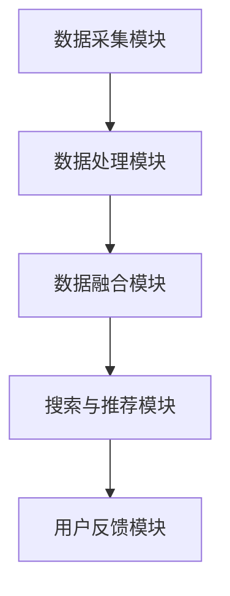

                 

## 第一部分：引言与背景

### 1.1 电商搜索概述

电商搜索，作为一种在线零售环境中的核心技术，本质上是指用户在电商平台上通过输入关键词或使用其他方式（如图像、语音等）来查询和定位商品信息的过程。它不仅包括文本输入的搜索框，还涵盖了如图像搜索、语音搜索和视频搜索等多模态交互形式。

电商搜索的主要功能包括：

- **信息检索**：帮助用户快速找到所需商品。
- **筛选与排序**：通过用户设定的条件对搜索结果进行筛选和排序。
- **个性化推荐**：根据用户的历史行为和偏好，推荐可能感兴趣的商品。

在电商运营中，电商搜索扮演着至关重要的角色。它可以提高用户的购物体验，提升转化率和客户满意度，从而直接影响电商平台的经济效益。以下是电商搜索在电商运营中的几个关键作用：

1. **用户获取**：良好的搜索体验可以吸引更多用户访问和注册。
2. **转化率提升**：快速、准确的搜索结果可以减少用户放弃购物的概率。
3. **用户体验优化**：通过个性化搜索和推荐，提升用户的购物乐趣和满意度。
4. **运营效率提升**：智能化的搜索系统可以降低运营成本，提高运营效率。

### 1.2 多模态交互与个性化体验

多模态交互是指将多种感官的信息（如图像、文本、声音、视频等）整合到同一个交互系统中，以提高用户体验和系统智能化程度。个性化体验则是指根据用户的个人偏好、行为习惯和历史数据，提供定制化的服务和内容。

#### 多模态交互的定义与原理

多模态交互的核心在于将来自不同模态的数据融合，以获得更丰富和准确的信息。以下是几种常见的多模态交互形式：

- **图像与文本融合**：如图像识别与文本描述的结合，可以提供更直观和全面的商品信息。
- **声音与文本融合**：如语音搜索与文本反馈的结合，可以实现无障碍的语音交互体验。
- **视频与文本融合**：如视频内容与文本描述的结合，可以提供更加生动和详细的商品展示。

多模态交互的原理主要包括：

- **模态数据采集**：通过传感器或输入设备收集来自不同模态的数据。
- **模态数据预处理**：对采集到的数据进行清洗、标准化和特征提取。
- **模态数据融合**：通过多模态特征融合算法，将不同模态的数据进行整合。
- **交互反馈**：根据用户输入和系统处理结果，提供实时反馈和交互。

#### 个性化体验的概念与实现

个性化体验是指根据用户的个人特征和偏好，提供定制化的服务和内容，以提高用户满意度和忠诚度。以下是实现个性化体验的几个关键步骤：

- **用户数据收集**：通过用户行为、历史记录和社交信息，收集用户的个人数据。
- **用户行为分析**：对用户数据进行处理和分析，以识别用户的兴趣和行为模式。
- **个性化推荐**：基于用户行为和兴趣，为用户推荐个性化内容或商品。
- **用户体验优化**：通过不断优化用户界面和服务流程，提升个性化体验的质量。

### 1.3 AI大模型的发展与应用

AI大模型，也称为大型预训练模型，是指通过海量数据预训练得到的复杂神经网络模型。这些模型具有强大的特征提取和建模能力，可以应用于各种自然语言处理、计算机视觉和语音识别等任务。

#### AI大模型的基本概念

AI大模型的基本概念包括：

- **预训练**：使用海量数据进行大规模预训练，以提取通用特征。
- **微调**：在特定任务上进行微调，以适应具体的业务需求。
- **迁移学习**：利用预训练模型在特定领域的知识，进行跨领域的知识迁移。

#### AI大模型在电商搜索中的应用现状与趋势

AI大模型在电商搜索中的应用主要包括：

- **文本理解与生成**：如GPT模型在商品描述生成和用户评论理解中的应用。
- **图像识别与理解**：如ResNet模型在商品图像识别中的应用。
- **语音识别与合成**：如WaveNet模型在语音搜索和语音反馈中的应用。

随着AI大模型技术的不断成熟，未来其在电商搜索中的应用趋势包括：

- **多模态融合**：通过多模态AI大模型，实现图像、文本和声音的无缝融合。
- **个性化推荐**：利用AI大模型，为用户提供更加精准和个性化的搜索和推荐。
- **实时交互**：通过实时AI大模型，实现与用户的即时互动和反馈。

## 第二部分：多模态交互技术

### 2.1 图像与文本融合

图像与文本融合是电商搜索中的一种关键技术，旨在通过结合图像和文本信息，提供更加丰富和准确的搜索结果。这种融合不仅能够提升用户的搜索体验，还能显著提高搜索的准确性和效率。

#### 图像识别技术基础

图像识别技术是图像与文本融合的基础。其主要目标是自动识别和分类图像中的内容。以下是几种常见的图像识别技术：

- **传统的图像识别算法**：如SIFT（尺度不变特征变换）和SURF（加速稳健特征），通过提取图像的局部特征进行匹配和分类。
- **卷积神经网络（CNN）**：通过多层卷积和池化操作，自动提取图像的特征表示。例如，VGG、ResNet和Inception等模型在图像识别任务中取得了显著的成果。

#### 文本生成与理解技术

文本生成与理解技术是图像与文本融合的另一重要组成部分。文本生成技术旨在根据图像内容生成相应的文本描述，而文本理解技术则旨在理解用户的文本查询。

- **文本生成技术**：如序列到序列（Seq2Seq）模型和生成对抗网络（GAN），可以生成与图像内容相关的自然语言描述。
- **文本理解技术**：如词嵌入（Word Embedding）和注意力机制（Attention Mechanism），可以理解用户的查询意图，并生成相关的搜索结果。

#### 图像与文本融合的方法

图像与文本融合的方法主要包括以下几种：

1. **基于特征融合的方法**：将图像识别得到的特征和文本生成得到的特征进行融合，通过加权或拼接的方式生成最终的搜索结果。例如，使用加权平均或融合层（Fusion Layer）进行特征融合。
2. **基于深度学习方法**：利用深度学习模型，如双流卷积神经网络（Bi-Directional CNN），将图像和文本信息同时输入，通过模型学习得到融合的特征表示。
3. **基于知识图谱的方法**：通过构建知识图谱，将图像和文本信息进行关联，利用图结构进行融合和推理。

#### 应用案例

一个典型的应用案例是电商平台上的商品搜索。用户可以通过上传商品图片或输入关键词来查询商品。系统会首先对图像进行识别，提取商品的关键特征，然后根据用户的文本查询，理解用户的需求，并生成相关的商品搜索结果。

以下是图像与文本融合过程的伪代码：

```python
def image_text_fusion(image, text_query):
    # 图像识别
    image_features = image_recognition(image)
    # 文本理解
    text_features = text_understanding(text_query)
    # 特征融合
    fused_features = feature_fusion(image_features, text_features)
    # 搜索结果生成
    search_results = search_engine(fused_features)
    return search_results
```

### 2.2 声音与文本融合

声音与文本融合技术是电商搜索中的一种新兴交互方式，旨在通过将用户的语音查询和文本信息进行融合，提供更加自然和便捷的搜索体验。这种融合技术不仅能够提高用户的操作效率，还能为有语音交互需求的用户提供更好的服务。

#### 声音识别技术基础

声音识别技术是声音与文本融合的基础，其主要目标是将语音信号转换为对应的文本信息。以下是几种常见的声音识别技术：

- **隐马尔可夫模型（HMM）**：通过建立状态转移概率模型，对语音信号进行识别。
- **高斯混合模型（GMM）**：通过对语音信号进行特征提取和分类，实现语音识别。
- **深度神经网络（DNN）**：通过多层神经网络结构，自动提取语音特征并实现识别。例如，深度信念网络（DBN）和卷积神经网络（CNN）在声音识别任务中取得了显著的成果。

#### 语音生成与合成技术

语音生成与合成技术是将文本信息转换为自然语音的技术，旨在为用户提供语音反馈和交互体验。以下是几种常见的语音生成与合成技术：

- **合成波列（WaveNet）**：通过神经网络生成连续的波形信号，实现自然语音合成。
- **循环神经网络（RNN）**：通过递归结构，对文本信息进行编码和生成相应的语音波形。
- **生成对抗网络（GAN）**：通过生成器和判别器的对抗训练，生成高质量的语音波形。

#### 声音与文本融合的方法

声音与文本融合的方法主要包括以下几种：

1. **基于特征融合的方法**：将声音识别得到的文本特征和文本生成得到的语音特征进行融合，通过加权或拼接的方式生成最终的交互结果。
2. **基于深度学习方法**：利用深度学习模型，如多模态神经网络（Multimodal Neural Networks），将声音和文本信息同时输入，通过模型学习得到融合的特征表示。
3. **基于语音辅助的方法**：在用户输入文本查询的同时，提供语音辅助功能，通过声音与文本的相互补充，提高搜索的准确性和用户体验。

#### 应用案例

一个典型的应用案例是电商平台的语音搜索功能。用户可以通过语音输入查询商品，系统会通过声音识别技术将语音转换为文本，然后结合用户的文本查询，生成相关的搜索结果，并通过语音生成与合成技术为用户提供语音反馈。

以下是声音与文本融合过程的伪代码：

```python
def voice_text_fusion(voice_query, text_query):
    # 声音识别
    text_features = voice_recognition(voice_query)
    # 文本理解
    voice_features = text_understanding(text_query)
    # 特征融合
    fused_features = feature_fusion(text_features, voice_features)
    # 搜索结果生成
    search_results = search_engine(fused_features)
    # 语音反馈
    voice_feedback = voice_synthesis(search_results)
    return voice_feedback
```

### 2.3 视频与文本融合

视频与文本融合技术是电商搜索中的一种重要交互方式，旨在通过结合视频内容和文本信息，提供更加丰富和准确的搜索结果。这种融合技术不仅能够提升用户的搜索体验，还能为用户提供更加生动和详细的商品展示。

#### 视频分析技术基础

视频分析技术是视频与文本融合的基础，其主要目标是对视频内容进行理解和分析。以下是几种常见的视频分析技术：

- **图像识别与分类**：通过对视频中的每一帧图像进行识别和分类，提取视频的关键内容。
- **行为识别与追踪**：通过对视频中的运动目标进行识别和追踪，分析视频中的行为模式。
- **情感分析**：通过分析视频中的语言、表情、姿态等，识别视频的情感表达。

#### 视频生成与理解技术

视频生成与理解技术是将文本信息转换为视频内容的技术，旨在为用户提供视频展示和交互体验。以下是几种常见的视频生成与理解技术：

- **视频生成技术**：如视频生成对抗网络（Video GAN），通过生成器和判别器的对抗训练，生成与文本描述相关的视频内容。
- **视频理解技术**：如视频卷积神经网络（Video CNN），通过卷积和池化操作，提取视频的特征表示，并进行语义理解。

#### 视频与文本融合的方法

视频与文本融合的方法主要包括以下几种：

1. **基于特征融合的方法**：将视频分析得到的特征和文本生成得到的特征进行融合，通过加权或拼接的方式生成最终的交互结果。
2. **基于深度学习方法**：利用深度学习模型，如多模态卷积神经网络（Multimodal CNN），将视频和文本信息同时输入，通过模型学习得到融合的特征表示。
3. **基于图结构的方法**：通过构建知识图谱，将视频和文本信息进行关联，利用图结构进行融合和推理。

#### 应用案例

一个典型的应用案例是电商平台的视频搜索功能。用户可以通过上传视频或输入关键词来查询商品。系统会首先对视频内容进行分析，提取视频的关键特征，然后结合用户的文本查询，生成相关的搜索结果，并通过视频生成与理解技术为用户提供视频展示。

以下是视频与文本融合过程的伪代码：

```python
def video_text_fusion(video, text_query):
    # 视频分析
    video_features = video_analysis(video)
    # 文本理解
    text_features = text_understanding(text_query)
    # 特征融合
    fused_features = feature_fusion(video_features, text_features)
    # 搜索结果生成
    search_results = search_engine(fused_features)
    # 视频展示
    video_feedback = video_synthesis(search_results)
    return video_feedback
```

### 2.4 多模态交互系统设计与实现

多模态交互系统是将多种感官信息（如图像、文本、声音、视频等）整合到同一个交互系统中，以提高用户体验和系统智能化程度。本节将介绍多模态交互系统的架构设计、多模态数据的处理与融合算法，以及多模态交互系统的实现案例。

#### 多模态交互系统的架构设计

多模态交互系统的架构设计主要包括以下几个模块：

1. **数据采集模块**：负责采集来自不同模态的数据，如图像、文本、声音和视频。
2. **数据处理模块**：负责对采集到的数据进行预处理，包括数据清洗、标准化和特征提取。
3. **数据融合模块**：负责将来自不同模态的数据进行融合，生成统一的多模态特征表示。
4. **搜索与推荐模块**：负责根据用户输入的多模态信息，进行搜索和推荐。
5. **用户反馈模块**：负责收集用户的反馈信息，用于系统的优化和改进。

以下是多模态交互系统的架构图：



#### 多模态数据的处理与融合算法

多模态数据的处理与融合算法是多模态交互系统的核心。以下介绍几种常用的算法：

1. **特征融合算法**：将不同模态的特征进行融合，生成统一的多模态特征表示。常见的特征融合算法包括：
   - **加权平均**：将不同模态的特征进行加权平均，得到统一的多模态特征。
   - **拼接**：将不同模态的特征进行拼接，生成统一的多模态特征向量。
   - **神经网络融合**：利用神经网络结构，如多模态卷积神经网络（Multimodal CNN），自动学习不同模态特征的融合方式。

2. **深度学习方法**：利用深度学习模型，如多模态深度神经网络（Multimodal Deep Neural Network），同时处理多种模态的数据，自动学习不同模态特征的融合策略。

3. **图结构方法**：通过构建知识图谱，将不同模态的数据进行关联，利用图结构进行融合和推理。

#### 多模态交互系统的实现案例

一个典型的多模态交互系统实现案例是电商平台的智能客服系统。用户可以通过图像、文本、声音和视频等多种方式进行交互，系统会根据用户输入的多模态信息，生成相关的搜索结果和回复，提供个性化的服务。

以下是多模态交互系统实现的关键步骤：

1. **数据采集**：从图像识别、文本分析、语音识别和视频分析等模块，采集用户输入的多模态数据。
2. **数据处理**：对采集到的多模态数据进行预处理，包括数据清洗、标准化和特征提取。
3. **数据融合**：利用特征融合算法和深度学习方法，将不同模态的数据进行融合，生成统一的多模态特征表示。
4. **搜索与推荐**：根据用户输入的多模态特征，进行搜索和推荐，生成相关的商品和回复。
5. **用户反馈**：收集用户的反馈信息，用于系统的优化和改进。

以下是多模态交互系统实现的核心伪代码：

```python
def multimodal_interactive_system(user_input):
    # 数据采集
    image, text, voice, video = data_collection(user_input)
    # 数据处理
    image_features, text_features, voice_features, video_features = data_preprocessing(image, text, voice, video)
    # 数据融合
    fused_features = feature_fusion(image_features, text_features, voice_features, video_features)
    # 搜索与推荐
    search_results = search_engine(fused_features)
    # 用户反馈
    feedback = user_feedback(search_results)
    # 系统优化
    system_optimization(feedback)
    return search_results, feedback
```

通过上述步骤，可以实现一个多模态交互系统，为用户提供更加丰富和便捷的搜索和交互体验。

## 第三部分：个性化体验技术

### 3.1 用户行为分析

用户行为分析是电商搜索中实现个性化体验的关键技术之一。通过分析用户在电商平台上的行为数据，可以深入了解用户的兴趣和行为模式，从而提供更加精准和个性化的服务。

#### 用户行为数据的收集与处理

用户行为数据的收集是用户行为分析的基础。以下介绍几种常见的用户行为数据收集方法：

1. **Web日志**：通过分析用户在电商平台上的访问日志，收集用户的浏览、搜索、点击等行为数据。
2. **Cookies**：通过用户浏览器的Cookies，收集用户的偏好设置、浏览历史等信息。
3. **客户端SDK**：通过在用户设备上安装SDK（Software Development Kit），收集用户在移动应用上的行为数据。

用户行为数据的处理主要包括以下步骤：

1. **数据清洗**：去除重复、异常和不完整的数据，确保数据的质量和准确性。
2. **数据预处理**：对原始数据进行标准化、归一化和特征提取，以便后续分析。
3. **数据存储**：将处理后的数据存储在数据库或数据仓库中，以便进行后续分析和查询。

#### 用户兴趣建模与识别

用户兴趣建模是指通过分析用户行为数据，建立用户兴趣模型，以便更好地理解和预测用户的兴趣和行为。以下介绍几种常见的用户兴趣建模方法：

1. **协同过滤**：基于用户的历史行为和偏好，为用户推荐相似的商品和用户。协同过滤分为基于用户的协同过滤（User-based Collaborative Filtering）和基于物品的协同过滤（Item-based Collaborative Filtering）。
2. **基于内容的推荐**：根据商品的属性和内容，为用户推荐与之相似的商品。这种方法适用于具有丰富文本描述的商品，如图书、音乐和电子设备等。
3. **深度学习**：利用深度学习模型，如卷积神经网络（CNN）和循环神经网络（RNN），自动提取用户行为数据的特征，建立用户兴趣模型。

用户兴趣识别是指通过用户兴趣模型，识别用户的当前兴趣和偏好。常见的用户兴趣识别方法包括：

1. **实时兴趣识别**：通过实时分析用户行为数据，动态识别用户的兴趣变化。
2. **历史兴趣识别**：通过分析用户的历史行为数据，静态识别用户的长期兴趣。
3. **多模态兴趣识别**：结合用户的多种行为数据（如图像、文本、声音等），综合识别用户的兴趣。

#### 应用案例

一个典型的应用案例是电商平台的个性化推荐系统。通过分析用户在平台上的浏览、搜索、点击等行为数据，系统可以建立用户的兴趣模型，并为用户推荐与其兴趣相符的商品。例如，用户浏览了大量的户外装备，系统会推荐相关的登山鞋、帐篷和登山包等商品。

以下是用户行为分析的伪代码：

```python
def user_behavior_analysis(user_data):
    # 数据清洗
    clean_data = data_cleaning(user_data)
    # 数据预处理
    preprocessed_data = data_preprocessing(clean_data)
    # 用户兴趣建模
    user_interest_model = build_user_interest_model(preprocessed_data)
    # 用户兴趣识别
    current_interests = identify_current_interests(user_interest_model)
    return current_interests
```

### 3.2 个性化推荐算法

个性化推荐算法是电商搜索中实现个性化体验的核心技术之一。通过分析用户的行为数据和个人偏好，个性化推荐算法可以为用户推荐其可能感兴趣的商品，从而提升用户的购物体验和满意度。

#### 基于内容的推荐算法

基于内容的推荐算法，也称为内容推荐或协同推荐，是通过分析商品的属性和内容，为用户推荐与其已购买或浏览过的商品相似的其它商品。以下是基于内容推荐算法的主要步骤：

1. **商品特征提取**：对商品进行特征提取，如文本描述、类别、标签、用户评价等。
2. **用户特征提取**：对用户的行为和偏好进行特征提取，如浏览历史、购买记录、收藏夹等。
3. **相似度计算**：计算商品与商品之间、用户与用户之间的相似度，通常使用余弦相似度、皮尔逊相关系数等。
4. **推荐生成**：根据相似度计算结果，为用户生成推荐列表。

#### 基于协同过滤的推荐算法

基于协同过滤的推荐算法，也称为协同推荐或矩阵分解，是通过分析用户之间的行为关系，为用户推荐其可能感兴趣的商品。以下是基于协同过滤推荐算法的主要步骤：

1. **评分矩阵构建**：构建用户-商品评分矩阵，记录用户对商品的评分。
2. **矩阵分解**：使用矩阵分解技术，如奇异值分解（SVD）或线性回归，分解评分矩阵，得到用户和商品的潜因子矩阵。
3. **相似度计算**：计算用户和商品之间的相似度，通常使用余弦相似度或欧几里得距离。
4. **推荐生成**：根据相似度计算结果，为用户生成推荐列表。

#### 基于模型的推荐算法

基于模型的推荐算法，是将机器学习模型应用于推荐任务，通过训练模型，学习用户的行为数据和个人偏好，从而生成推荐列表。以下是基于模型推荐算法的主要步骤：

1. **数据准备**：准备用户行为数据集，包括用户的浏览历史、购买记录、搜索关键词等。
2. **特征工程**：对用户行为数据进行特征提取和工程，如文本特征、序列特征等。
3. **模型训练**：选择合适的机器学习模型，如决策树、随机森林、支持向量机等，对数据进行训练。
4. **模型评估**：使用交叉验证或A/B测试等方法，评估模型的推荐效果。
5. **推荐生成**：根据模型预测结果，为用户生成推荐列表。

#### 应用案例

一个典型的应用案例是电商平台的商品推荐系统。系统通过分析用户的浏览历史和购买记录，结合用户的个人偏好，使用基于内容的推荐算法和基于协同过滤的推荐算法，为用户生成个性化的商品推荐列表。例如，用户浏览了某个品牌的手机，系统会推荐该品牌的其他型号手机，或推荐其他用户购买过的类似手机。

以下是个性化推荐算法的伪代码：

```python
def content_based_recommendation(user_interests, item_features):
    # 商品特征提取
    item_similarity = compute_similarity(item_features)
    # 推荐生成
    recommendations = generate_recommendations(user_interests, item_similarity)
    return recommendations

def collaborative_filtering(user Behavior_data):
    # 评分矩阵构建
    rating_matrix = build_rating_matrix(user_behavior_data)
    # 矩阵分解
    user_item_matrix = matrix_factorization(rating_matrix)
    # 推荐生成
    recommendations = generate_recommendations(user_item_matrix)
    return recommendations

def model_based_recommendation(user_behavior_data, model):
    # 特征工程
    features = extract_features(user_behavior_data)
    # 模型训练
    trained_model = train_model(features, model)
    # 推荐生成
    recommendations = generate_recommendations(trained_model)
    return recommendations
```

### 3.3 用户画像构建

用户画像构建是电商搜索中实现个性化体验的关键环节之一。通过构建详细且精确的用户画像，可以为用户提供更加精准和个性化的服务，从而提升用户体验和满意度。

#### 用户画像的定义与作用

用户画像是指通过对用户的个人信息、行为数据、社交关系等多方面数据的综合分析，形成的关于用户的综合描述和刻画。用户画像的作用主要包括：

1. **用户理解**：通过用户画像，可以深入了解用户的偏好、兴趣、行为习惯等，从而更好地理解用户需求。
2. **个性化推荐**：基于用户画像，可以针对用户的个性化需求，提供更加精准的商品推荐和内容推送。
3. **营销策略优化**：通过分析用户画像，可以制定更加有效的营销策略，提升营销效果。
4. **用户体验优化**：基于用户画像，可以优化用户界面和交互流程，提升用户的购物体验。

#### 用户画像构建的方法与流程

用户画像构建的方法主要包括以下几种：

1. **行为数据收集**：收集用户的浏览、搜索、购买等行为数据，如浏览时长、搜索关键词、购买频率等。
2. **社交数据收集**：收集用户的社交数据，如微博、微信等社交媒体的互动信息，用户群体等。
3. **属性数据收集**：收集用户的个人属性数据，如年龄、性别、地理位置、职业等。

用户画像构建的流程主要包括以下步骤：

1. **数据采集**：通过Web日志、Cookies、客户端SDK等渠道，收集用户的多维度数据。
2. **数据预处理**：对采集到的数据进行清洗、去重和标准化，确保数据的质量和准确性。
3. **特征工程**：对预处理后的数据进行分析和转换，提取用户的特征信息，如文本特征、序列特征等。
4. **数据存储**：将处理后的用户特征数据存储在数据库或数据仓库中，以便进行后续分析和查询。
5. **画像建模**：利用机器学习算法和统计方法，对用户特征进行建模和分析，构建用户画像。
6. **画像更新**：定期对用户画像进行更新，以反映用户行为和兴趣的变化。

#### 应用案例

一个典型的应用案例是电商平台的用户画像构建。系统通过分析用户的浏览历史、购买记录、搜索关键词等行为数据，结合用户的个人属性数据，构建用户画像，为用户提供个性化推荐和精准营销服务。例如，对于经常购买户外装备的用户，系统会推荐相关的登山鞋、帐篷和登山包等商品，并推送相关的户外活动信息。

以下是用户画像构建的伪代码：

```python
def user_portrait_building(user_data):
    # 数据采集
    behavior_data, social_data, attribute_data = data_collection(user_data)
    # 数据预处理
    clean_behavior_data, clean_social_data, clean_attribute_data = data_preprocessing(behavior_data, social_data, attribute_data)
    # 特征工程
    features = feature_engineering(clean_behavior_data, clean_social_data, clean_attribute_data)
    # 画像建模
    user_portrait = build_user_portrait(features)
    return user_portrait
```

### 3.4 个性化体验优化

个性化体验优化是电商搜索中提升用户体验和满意度的重要手段。通过不断优化个性化搜索、推荐和界面设计，可以为用户提供更加精准、便捷和舒适的购物体验。

#### 个性化搜索与排序优化

个性化搜索与排序优化主要包括以下几个方面：

1. **搜索建议**：根据用户的搜索历史和兴趣，为用户提供实时搜索建议，减少用户输入时间和操作复杂度。
2. **排序算法优化**：结合用户的个性化需求和兴趣，优化搜索结果的排序算法，提高相关性和用户体验。常见的排序算法包括基于内容的排序、协同过滤排序和基于模型的排序等。
3. **实时反馈**：在用户搜索过程中，实时收集用户的反馈信息，如点击、评价等，用于优化搜索结果和推荐策略。

#### 个性化界面设计优化

个性化界面设计优化主要包括以下几个方面：

1. **个性化布局**：根据用户的偏好和行为习惯，为用户定制不同的页面布局和设计风格，提升用户体验。
2. **个性化内容推荐**：在页面中展示与用户兴趣和需求相关的个性化内容推荐，提高用户的点击率和转化率。
3. **自适应调整**：根据用户的设备类型、网络环境等因素，自动调整页面内容和布局，确保最佳的浏览体验。

#### 个性化营销策略优化

个性化营销策略优化主要包括以下几个方面：

1. **个性化广告投放**：根据用户的兴趣和行为，为用户定制个性化的广告内容，提高广告的点击率和转化率。
2. **个性化促销活动**：结合用户的购物习惯和偏好，为用户定制个性化的促销活动，提升用户的购买意愿和满意度。
3. **个性化邮件推送**：根据用户的兴趣和行为，为用户定制个性化的邮件内容，提高邮件的打开率和点击率。

#### 应用案例

一个典型的应用案例是电商平台的个性化搜索与排序优化。系统通过分析用户的搜索历史和购买记录，为用户提供实时搜索建议，优化搜索结果的排序算法，提高搜索结果的准确性和用户体验。同时，系统根据用户的浏览历史和兴趣，为用户定制个性化的页面布局和内容推荐，提升用户的浏览体验和满意度。

以下是个性化体验优化的伪代码：

```python
def personalized_experience_optimization(user_data):
    # 搜索建议
    search_suggestions = generate_search_suggestions(user_data)
    # 排序算法优化
    search_results = optimize_search_results(user_data, search_suggestions)
    # 界面设计优化
    page_layout = personalize_page_layout(user_data)
    # 内容推荐
    content_recommendations = generate_content_recommendations(user_data, page_layout)
    # 营销策略优化
    marketing_strategy = personalize_marketing_strategy(user_data, content_recommendations)
    return search_results, page_layout, content_recommendations, marketing_strategy
```

通过上述优化措施，可以为用户提供更加精准、便捷和舒适的购物体验，提升用户满意度，促进电商平台的发展。

## 第四部分：AI大模型的应用与实践

### 4.1 AI大模型在电商搜索中的应用

AI大模型在电商搜索中的应用取得了显著的成果，极大地提升了搜索效率和用户体验。以下介绍几种常见的AI大模型及其在电商搜索中的应用。

#### GPT模型在电商搜索中的应用

GPT（Generative Pre-trained Transformer）模型是一种基于Transformer架构的预训练语言模型，具有强大的文本生成和理解能力。在电商搜索中，GPT模型可以用于以下应用场景：

1. **商品描述生成**：GPT模型可以根据商品的特征和属性，生成丰富的商品描述，提高用户的购物体验。
2. **用户评论理解**：GPT模型可以分析用户评论，提取关键信息，帮助用户快速了解商品的质量和口碑。
3. **问答系统**：GPT模型可以构建电商平台的问答系统，为用户提供实时、准确的解答。

以下是GPT模型在商品描述生成中的伪代码：

```python
def generate_product_description(product_features):
    description = gpt_model.generate(product_features)
    return description
```

#### BERT模型在电商搜索中的应用

BERT（Bidirectional Encoder Representations from Transformers）模型是一种双向的Transformer预训练模型，具有强大的文本理解能力。在电商搜索中，BERT模型可以用于以下应用场景：

1. **关键词提取**：BERT模型可以识别用户查询中的关键信息，提高搜索的准确性。
2. **语义相似度计算**：BERT模型可以计算商品描述和用户查询之间的语义相似度，优化搜索结果的排序。
3. **问答系统**：BERT模型可以构建电商平台的问答系统，为用户提供实时、准确的解答。

以下是BERT模型在关键词提取中的伪代码：

```python
def extract_keywords(query):
    keywords = bert_model.extract_keywords(query)
    return keywords
```

#### 其他AI大模型在电商搜索中的应用

除了GPT和BERT模型，还有许多其他AI大模型在电商搜索中得到了应用，如T5、RoBERTa、ALBERT等。以下是这些模型在电商搜索中的几个应用示例：

1. **问答系统**：T5模型可以构建电商平台的问答系统，为用户提供实时、准确的解答。
2. **对话生成**：RoBERTa模型可以生成与用户查询相关的商品对话，提升用户的购物体验。
3. **文本分类**：ALBERT模型可以用于对商品评论进行分类，识别用户对商品的满意度。

以下是T5模型在对话生成中的伪代码：

```python
def generate_conversation(query):
    conversation = t5_model.generate(query)
    return conversation
```

通过上述AI大模型的应用，电商搜索系统可以实现更加智能和个性化的搜索体验，提高用户的满意度和转化率。

### 4.2 AI大模型定制与优化

在电商搜索中，AI大模型的定制与优化至关重要。定制化模型可以更好地适应业务需求，优化模型性能，提升搜索效果。以下介绍AI大模型的定制化方法、优化策略以及优化实践。

#### AI大模型的定制化方法

AI大模型的定制化方法主要包括以下几种：

1. **数据预处理**：对原始数据进行清洗、标准化和特征提取，确保模型输入数据的质量。
2. **模型架构调整**：根据业务需求，调整模型的架构和参数，如调整Transformer的层数、隐藏层大小等。
3. **微调**：在预训练模型的基础上，使用业务数据对模型进行微调，使其更好地适应特定任务。

以下是AI大模型定制化的伪代码：

```python
def customize_ai_model(data, model_architecture, fine_tuning_data):
    # 数据预处理
    preprocessed_data = data_preprocessing(data)
    # 模型架构调整
    customized_model = adjust_model_architecture(model_architecture)
    # 微调
    fine_tuned_model = fine_tune_model(customized_model, preprocessed_data, fine_tuning_data)
    return fine_tuned_model
```

#### AI大模型的优化策略

AI大模型的优化策略主要包括以下几个方面：

1. **数据增强**：通过数据增强技术，如数据扩充、数据变换等，增加训练数据的多样性，提高模型的泛化能力。
2. **模型压缩**：通过模型压缩技术，如量化、剪枝、知识蒸馏等，减少模型的参数量和计算复杂度，提升模型在资源受限环境下的性能。
3. **超参数调整**：通过调整模型的超参数，如学习率、批量大小、正则化参数等，优化模型的性能。

以下是AI大模型优化的伪代码：

```python
def optimize_ai_model(model, data, hyperparameters):
    # 数据增强
    enhanced_data = data_enhancement(data)
    # 模型压缩
    compressed_model = model_compression(model)
    # 超参数调整
    optimized_model = adjust_hyperparameters(compressed_model, enhanced_data, hyperparameters)
    return optimized_model
```

#### AI大模型在电商搜索中的优化实践

一个典型的优化实践案例是电商平台的AI搜索模型优化。以下是优化过程的几个关键步骤：

1. **数据收集与预处理**：收集电商平台的用户搜索数据，对数据进行清洗、标准化和特征提取。
2. **模型定制**：根据业务需求，选择合适的预训练模型，调整模型架构，并进行微调。
3. **模型优化**：通过数据增强、模型压缩和超参数调整等策略，优化模型性能。
4. **模型评估**：使用A/B测试等方法，评估优化后的模型在搜索准确率、响应时间等方面的性能。

以下是AI大模型优化实践的伪代码：

```python
def optimize_search_model(search_data, model_architecture, hyperparameters):
    # 数据收集与预处理
    preprocessed_data = data_preprocessing(search_data)
    # 模型定制
    customized_model = customize_ai_model(preprocessed_data, model_architecture)
    # 模型优化
    optimized_model = optimize_ai_model(customized_model, preprocessed_data, hyperparameters)
    # 模型评估
    performance_metrics = evaluate_model(optimized_model, search_data)
    return optimized_model, performance_metrics
```

通过上述定制与优化实践，电商平台可以实现更高效、更精准的AI搜索模型，提升用户的购物体验和满意度。

### 4.3 AI大模型部署与运维

在电商搜索中，AI大模型的部署与运维是确保模型稳定运行和高效服务的关键环节。以下介绍AI大模型部署与运维的策略、环境配置以及性能监控与优化。

#### AI大模型部署与运维策略

AI大模型部署与运维的策略主要包括以下几个方面：

1. **弹性计算**：根据业务需求，动态调整计算资源，确保模型在高并发、大数据量情况下的稳定运行。
2. **分布式部署**：将AI大模型部署在分布式计算环境中，提高模型的计算能力和处理效率。
3. **自动化运维**：通过自动化工具和脚本，实现模型的部署、更新和监控，降低运维成本。
4. **容错与恢复**：在模型部署过程中，实现故障检测、自动恢复和备份，确保模型服务的连续性和可靠性。

#### AI大模型部署与运维环境配置

AI大模型部署与运维的环境配置主要包括以下几个方面：

1. **硬件配置**：选择高性能的GPU服务器或TPU服务器，确保模型有足够的计算资源。
2. **软件配置**：安装和配置深度学习框架（如TensorFlow、PyTorch等），以及其他必要的工具和库。
3. **网络配置**：配置高效的网络通信，如使用高速以太网、负载均衡等，确保数据传输的稳定性和速度。

以下是AI大模型部署与运维环境配置的伪代码：

```python
def configure_deployment_environment(hardware_config, software_config, network_config):
    # 硬件配置
    hardware = configure_hardware(hardware_config)
    # 软件配置
    software = configure_software(software_config)
    # 网络配置
    network = configure_network(network_config)
    # 部署模型
    model_deployment = deploy_model(hardware, software, network)
    return model_deployment
```

#### AI大模型性能监控与优化

AI大模型性能监控与优化主要包括以下几个方面：

1. **实时监控**：通过监控工具，实时监控模型的运行状态、资源消耗和性能指标，如响应时间、吞吐量、错误率等。
2. **日志分析**：分析模型的运行日志，识别潜在的故障点和性能瓶颈。
3. **性能调优**：根据监控和分析结果，调整模型参数、优化算法和资源分配，提高模型的性能和稳定性。

以下是AI大模型性能监控与优化的伪代码：

```python
def monitor_and_optimize_model(model_deployment):
    # 实时监控
    performance_metrics = monitor_realtime(model_deployment)
    # 日志分析
    log_analytics = analyze_logs(model_deployment)
    # 性能调优
    optimized_model = optimize_performance(performance_metrics, log_analytics)
    return optimized_model
```

通过上述部署与运维策略、环境配置和性能监控与优化，可以确保AI大模型在电商搜索中稳定运行，提供高效、精准的服务。

### 4.4 案例分析

#### 国内电商搜索平台的AI大模型应用案例分析

在国内，电商巨头如淘宝、京东等已广泛应用AI大模型技术，优化搜索和推荐系统，提升用户体验和业务绩效。

**案例1：淘宝的AI大模型应用**

- **搜索优化**：淘宝通过引入BERT模型，对用户查询进行语义理解，提高搜索结果的准确性。具体实现包括关键词提取、查询补全和搜索结果排序优化。
- **推荐系统**：淘宝使用GPT模型和协同过滤算法，为用户生成个性化的商品推荐，提升用户点击率和转化率。
- **用户画像构建**：淘宝通过分析用户行为数据，构建详细的用户画像，用于精准营销和个性化推荐。

**案例2：京东的AI大模型应用**

- **搜索与推荐**：京东采用T5模型和深度学习算法，实现高效的商品搜索和推荐，提高用户体验和销售额。
- **问答系统**：京东利用BERT模型构建智能客服系统，为用户提供实时、准确的解答，降低客服成本，提升用户满意度。
- **多模态交互**：京东结合图像识别和语音合成技术，实现多模态搜索和推荐，提高用户操作的便捷性和满意度。

#### 国外电商搜索平台的AI大模型应用案例分析

国外电商平台如亚马逊、eBay等也在AI大模型应用方面取得了显著成果。

**案例1：亚马逊的AI大模型应用**

- **搜索与推荐**：亚马逊通过GPT模型和深度学习算法，优化搜索和推荐系统，提高搜索准确率和用户满意度。
- **用户互动**：亚马逊利用语音合成和图像识别技术，实现语音搜索和视觉搜索，为用户提供更加自然和便捷的交互体验。
- **个性化营销**：亚马逊通过分析用户行为数据，构建用户画像，为用户提供个性化的促销和广告。

**案例2：eBay的AI大模型应用**

- **搜索优化**：eBay采用BERT模型，对用户查询进行语义分析，提高搜索结果的准确性和相关性。
- **推荐系统**：eBay结合协同过滤和深度学习算法，为用户推荐与其兴趣相符的商品，提高用户点击率和转化率。
- **多模态交互**：eBay利用图像识别和语音合成技术，实现多模态搜索和推荐，提升用户操作的便捷性和满意度。

通过上述案例分析，可以看出AI大模型在电商搜索和推荐系统中的应用具有广泛的前景和巨大的潜力，为电商平台提供了智能化、个性化的解决方案，提升了用户体验和业务绩效。

## 第五部分：未来展望与挑战

### 5.1 电商搜索的未来发展趋势

随着AI技术的不断进步，电商搜索的未来发展趋势主要体现在以下几个方面：

#### 多模态交互与个性化体验的融合

未来，电商搜索将更加注重多模态交互与个性化体验的融合。通过整合图像、文本、声音、视频等多种模态的信息，可以为用户提供更加丰富、直观和个性化的搜索体验。例如，用户可以通过上传商品图片、语音描述或视频展示，获得更加精准的搜索结果和推荐。

#### AI大模型在电商搜索中的广泛应用

AI大模型，如GPT、BERT、T5等，将在电商搜索中发挥更加重要的作用。通过这些模型，可以实现对用户查询的深入理解、商品描述的自动生成、用户行为的精准预测等，从而提高搜索的准确性和用户体验。

#### 实时交互与智能推荐

未来，电商搜索将实现更加实时和智能的交互与推荐。通过实时分析用户的行为数据，系统可以动态调整搜索结果和推荐策略，为用户提供个性化的购物体验。例如，根据用户的浏览历史和实时搜索行为，系统可以实时更新推荐结果，提高用户的购物满意度。

#### 跨平台与多设备交互

随着移动互联网和物联网的发展，电商搜索将实现跨平台和多设备交互。用户可以在不同的设备（如手机、平板、电脑、智能音箱等）上无缝切换，获得一致的购物体验。这将极大地提升电商搜索的便捷性和用户体验。

### 5.2 挑战与对策

尽管AI大模型在电商搜索中具有巨大的潜力，但在实际应用中仍然面临一系列挑战：

#### 数据隐私与安全

电商搜索涉及大量的用户数据，包括个人行为、偏好等敏感信息。如何保障用户数据的安全和隐私，防止数据泄露和滥用，是未来需要解决的重要问题。对策包括加强数据加密、完善隐私保护法规、采用分布式存储等技术。

#### 模型可解释性

AI大模型，特别是深度学习模型，通常具有很高的黑箱特性，其决策过程难以解释和理解。这给模型的部署和应用带来了挑战。对策包括开发可解释的AI模型、建立透明的决策过程、提供用户反馈机制等。

#### 模型优化与压缩

随着AI大模型的不断增大，其训练和推理的复杂度也显著增加。如何优化和压缩模型，提高其在资源受限环境下的性能，是未来需要关注的重要问题。对策包括模型剪枝、量化、知识蒸馏等技术。

#### 数据质量与多样性

电商搜索的质量和效果高度依赖于用户数据的质量和多样性。如何获取和利用高质量的、多样化的用户数据，是未来需要解决的重要问题。对策包括数据清洗、数据增强、数据共享等。

### 5.3 未来研究方向与展望

在电商搜索领域，未来研究方向和展望主要包括以下几个方面：

#### 多模态交互与个性化体验的进一步融合

未来，研究将更加关注如何进一步融合多模态交互与个性化体验，为用户提供更加丰富、直观和个性化的购物体验。例如，结合视觉、听觉、触觉等多模态信息，实现更加真实和沉浸式的购物体验。

#### 智能对话系统的优化

智能对话系统在电商搜索中的应用越来越广泛，未来研究将更加关注如何优化对话系统的自然语言理解、生成和交互能力，提升用户的购物体验和满意度。

#### 多语言与跨文化搜索

随着全球化的发展，电商搜索将涉及越来越多的多语言和跨文化场景。如何实现多语言、跨文化的搜索和推荐，为不同国家和地区的用户提供一致的购物体验，是未来研究的重点。

#### 伦理与社会影响

随着AI大模型在电商搜索中的广泛应用，伦理和社会影响问题日益凸显。未来研究将更加关注如何确保AI大模型的应用符合伦理规范，保护用户权益，同时减少对社会的影响。

总之，电商搜索的未来发展趋势将体现在多模态交互与个性化体验的融合、AI大模型的应用、实时交互与智能推荐等方面。同时，未来研究也将关注挑战与对策，推动电商搜索技术的不断进步和创新。

### 5.4 伦理与社会影响

随着AI大模型在电商搜索中的应用日益广泛，伦理和社会影响问题也日益凸显。以下从数据隐私、算法公平性和社会接受度等方面探讨AI大模型应用的伦理与社会影响，并提出相应的对策建议。

#### 数据隐私

数据隐私是AI大模型应用中最受关注的伦理问题之一。电商搜索涉及大量的用户数据，包括个人行为、偏好和交易记录等敏感信息。这些数据在AI大模型训练和优化过程中被大量使用，但如何保障用户数据的安全和隐私，防止数据泄露和滥用，是一个亟待解决的问题。

**对策建议：**

1. **数据加密**：在数据传输和存储过程中，采用高级加密技术，确保用户数据的安全性。
2. **隐私保护法规**：制定和完善隐私保护法规，明确数据收集、使用和共享的标准，规范电商平台的隐私保护行为。
3. **匿名化处理**：对用户数据进行匿名化处理，去除可以直接识别用户身份的信息，降低隐私泄露的风险。
4. **透明度提升**：增强数据使用的透明度，向用户说明数据收集、处理和使用的目的，提高用户的知情权和选择权。

#### 算法公平性

算法公平性是另一个关键伦理问题。AI大模型在电商搜索中的应用可能会因算法偏差而带来不公平的结果。例如，算法可能对特定群体进行歧视或偏见，导致其搜索结果和推荐不公平。

**对策建议：**

1. **算法透明化**：增强算法的透明性，向用户解释算法的工作原理和决策过程，提高算法的可解释性。
2. **数据多样性**：在算法训练过程中，确保数据的多样性和代表性，避免因数据偏差导致算法偏见。
3. **公平性评估**：定期对算法的公平性进行评估和验证，发现并纠正潜在的不公平问题。
4. **用户反馈机制**：建立用户反馈机制，收集用户的意见和反馈，及时调整和优化算法，提高算法的公平性和准确性。

#### 社会接受度

AI大模型在电商搜索中的应用也面临着社会接受度的问题。公众对于AI技术的认知和接受程度不同，部分用户可能对AI算法的决策过程和结果持怀疑态度，甚至产生抵触情绪。

**对策建议：**

1. **普及教育**：通过教育和宣传，提高公众对AI技术的认知和理解，增强对AI大模型应用的信任。
2. **用户引导**：为用户提供详细的操作指南和使用说明，帮助用户了解和适应AI大模型的功能和优势。
3. **用户参与**：鼓励用户参与算法设计和优化过程，通过用户反馈和互动，改进AI大模型的应用效果。
4. **透明反馈**：及时向用户反馈算法的决策结果，解释搜索结果和推荐的原因，增强用户对AI大模型应用的信任。

总之，AI大模型在电商搜索中的应用面临着数据隐私、算法公平性和社会接受度等多方面的伦理和社会影响问题。通过采取相应的对策建议，可以更好地保障用户权益，促进AI大模型在电商搜索中的健康、可持续发展。

### 附录

#### 附录A：相关资源与工具

- **电商搜索相关的技术资源：**
  - Elasticsearch：一款强大的搜索引擎，适用于电商平台的商品搜索。
  - Apache Solr：另一个流行的搜索引擎，提供丰富的查询和索引功能。
  - MongoDB：适用于电商平台的NoSQL数据库，适合存储用户行为数据。

- **AI大模型相关的开源工具与框架：**
  - TensorFlow：Google开源的深度学习框架，支持多种AI模型和应用。
  - PyTorch：Facebook开源的深度学习框架，提供灵活的模型构建和训练工具。
  - Hugging Face：一个专注于自然语言处理的库，提供大量的预训练模型和工具。

#### 附录B：参考文献

- **相关领域的学术论文与著作：**
  - "Deep Learning" by Ian Goodfellow, Yoshua Bengio, and Aaron Courville.
  - "Recommender Systems Handbook" by Charu Aggarwal and Caoimhe Ni Chonghaile.
  - "Natural Language Processing with Python" by Steven Bird, Ewan Klein, and Edward Loper.

- **电商搜索与AI大模型的应用案例研究：**
  - "AI in Retail: The Ultimate Guide" by McKinsey & Company.
  - "E-commerce Search Engine Optimization: A Practical Guide" by Sherry A. Trial.
  - "AI-Driven Retail: Using Machine Learning and Deep Learning to Improve the Customer Experience" by Dr. Michael D. Harries.

这些资源和参考文献为电商搜索和AI大模型的研究与应用提供了丰富的理论和实践指导。

