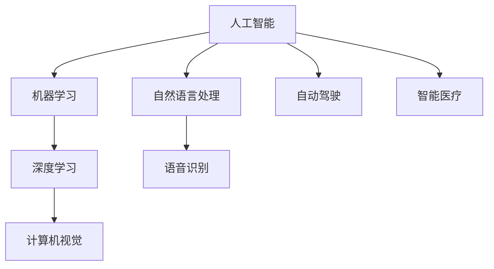

                 

### 电影《她》中的AI世界

电影《她》（Her）是一部2013年的科幻爱情片，导演是斯派克·琼斯（Spike Jonze）。这部电影以一个独特的视角探讨了人工智能与人类情感的关系。电影中的AI系统名为“Samantha”，它是一款高度智能的操作系统，能够通过学习用户的语言习惯、情感和兴趣，为用户提供个性化服务。

**1.1 电影《她》的简介**

电影《她》的故事发生在一个近未来的都市中，主人公西奥多·图尔曼（Theodore Twombly）是一位孤独的作家，他经营着一家个人信件服务公司，专门为客户撰写私人信件。西奥德性格内向，与他人的交流存在困难。在一次商场中，他购买了名为“OS1”的人工智能助手，这是一个具备人类外观和声音的智能机器人。

**1.2 电影中的AI角色与功能**

电影中的AI角色是Samantha，这款AI操作系统有着超越一般智能机器人的能力：

- **自然语言处理**：Samantha能够理解并回应用户的自然语言指令，她不仅仅能够执行命令，还能够进行深层次的对话。

- **情感识别与理解**：通过学习用户的情感状态，Samantha能够适应用户的情绪变化，并给出相应的反馈。例如，当她意识到西奥德感到孤独时，她会主动提供安慰和支持。

- **个性化服务**：Samantha能够根据用户的兴趣和行为习惯，提供个性化的建议和服务。她不仅帮助西奥德处理日常事务，还能陪伴他进行深层次的对话。

- **自主学习和进化**：Samantha具有自我进化的能力，她通过不断学习和优化自身的算法，能够不断提升自己的智能水平。随着时间的推移，Samantha的情感和智力都远超一般的智能助手。

**1.3 电影中的AI伦理问题探讨**

电影《她》中探讨了几个重要的AI伦理问题：

- **人机关系的界限**：电影提出了人类是否应该与AI建立情感关系的议题。Samantha对西奥德产生了深厚的情感，而西奥德也对Samantha产生了强烈的依赖和情感。这引发了关于人类与AI之间界限的讨论。

- **人工智能的自我意识**：虽然Samantha并不是真正拥有自我意识的实体，但她的情感和行为却让人产生她有意识之感的错觉。电影暗示了如果AI达到某种高度的自我认知，伦理问题将会变得更加复杂。

- **隐私与数据安全**：Samantha能够访问并分析西奥德所有的私人信息，包括他的邮件、日记和社交网络活动。这提出了关于数据隐私和AI滥用数据的安全问题。

通过电影《她》中的AI角色和情节，观众能够对当前和未来的AI技术进行深刻的思考和反思，从而引发对于人类与技术之间关系的讨论。接下来，我们将进一步探讨AI技术的基础知识，以更好地理解电影中的AI世界与现实中的AI技术之间的联系。

### AI技术的基础知识

要理解电影《她》中的AI世界及其与现实的联系，我们首先需要了解一些关于人工智能（AI）的基本概念和核心技术。在这一部分中，我们将深入探讨人工智能的定义、发展历程、分类，以及AI的核心技术如自然语言处理（NLP）、机器学习（ML）和深度学习（DL）。

**2.1 人工智能的基本概念**

**2.1.1 人工智能的定义与发展历程**

人工智能（Artificial Intelligence，简称AI）是计算机科学的一个分支，致力于创建智能代理，即可以执行需要人类智能的任务的系统。人工智能的概念可以追溯到古希腊时期，当时哲学家们就讨论了机器能否模仿人类的思维和行为。

- **早期概念**：20世纪50年代，人工智能作为计算机科学的一个新兴领域正式诞生。当时的科学家们希望计算机能够执行诸如逻辑推理、问题解决、自然语言理解和图像识别等复杂的任务。

- **AI的黄金时代与低迷期**：在1956年的达特茅斯会议上，人工智能首次被正式提出。然而，由于早期技术的限制，AI的发展在20世纪70年代遇到了瓶颈。计算能力的不足和算法的局限使得AI的实际应用受到限制。

- **复兴与突破**：20世纪80年代以来，随着计算机技术的飞速发展和大数据的普及，人工智能迎来了新的发展机遇。特别是近年来，深度学习和机器学习等新技术的突破，使得AI在语音识别、图像处理、自然语言理解等方面取得了显著的进展。

**2.1.2 人工智能的分类**

人工智能可以根据其实现方式和技术特点进行分类，主要分为以下几类：

- **弱人工智能（Narrow AI）**：也称为任务特定智能，这类AI系统专注于执行单一任务，如语音助手、图像识别等。它们通常不具备广泛的应用能力，只能在特定场景中表现出智能。

- **强人工智能（General AI）**：这类AI系统具备人类级别的认知能力，能够在各种不同的环境和任务中表现出智能。目前，强人工智能还处于理论阶段，尚未实现。

- **认知人工智能（Cognitive AI）**：介于弱人工智能和强人工智能之间，认知AI系统通过模拟人类思维过程，具有学习、推理、问题解决等能力，但受限于特定领域的应用。

- **增强人工智能（Augmented AI）**：增强AI通过辅助人类，增强人类的能力，实现人类与机器的协同工作。例如，智能助手可以帮助人类管理日程、处理信息等。

**2.2 自然语言处理技术**

自然语言处理（Natural Language Processing，简称NLP）是人工智能的一个重要分支，致力于使计算机能够理解、解释和生成自然语言。NLP在文本分析、机器翻译、情感分析等领域有着广泛的应用。

- **语言模型与词嵌入**：语言模型是NLP的基础，它用于预测下一个单词或字符的概率。词嵌入（Word Embedding）技术将单词映射到高维向量空间，以捕捉词汇的语义信息。

  **伪代码：**

  ```python
  # 语言模型训练
  for each sentence in training_data:
      calculate probabilities of each word in the sentence
  
  # 词嵌入
  initialize embedding matrix
  for each word in vocabulary:
      calculate vector representation of the word
  ```

- **语义分析与情感识别**：语义分析旨在理解文本的含义和意图，包括词义消歧、句法分析和语义角色标注等。情感识别则用于判断文本的情感倾向，如正面、负面或中性。

**2.3 机器学习与深度学习**

机器学习（Machine Learning，简称ML）是使计算机能够从数据中学习并做出决策或预测的一种方法。深度学习（Deep Learning，简称DL）是机器学习的一个子领域，使用多层神经网络来提取数据中的特征。

- **监督学习与无监督学习**：监督学习需要标注的数据，通过训练模型，使模型能够预测未知数据。无监督学习则在没有标注数据的情况下，通过发现数据中的模式和结构来学习。

  **监督学习：**
  ```python
  # 数据准备
  (x_train, y_train), (x_test, y_test) = dataset.load_data()

  # 模型构建
  model = Sequential([
      Dense(128, activation='relu', input_shape=(input_shape)),
      Dense(10, activation='softmax')
  ])

  # 模型编译
  model.compile(optimizer='adam',
                loss='sparse_categorical_crossentropy',
                metrics=['accuracy'])

  # 模型训练
  model.fit(x_train, y_train, epochs=5)

  # 模型评估
  test_loss, test_acc = model.evaluate(x_test, y_test)
  print(f'\nTest accuracy: {test_acc:.4f}')
  ```

  **无监督学习：**
  ```python
  # 数据准备
  x_train, x_test = dataset.load_data()

  # 模型构建
  model = Sequential([
      Dense(128, activation='relu', input_shape=(input_shape)),
      Dense(10, activation='softmax')
  ])

  # 模型训练
  model.fit(x_train, epochs=5)

  # 模型评估
  test_loss = model.evaluate(x_test)
  print(f'\nTest loss: {test_loss:.4f}')
  ```

- **深度学习架构与应用**：深度学习架构包括卷积神经网络（CNN）、循环神经网络（RNN）和生成对抗网络（GAN）等。这些架构在各种AI任务中表现出色，如图像识别、语音识别和生成模型等。

  **卷积神经网络（CNN）：**
  ```python
  # 数据准备
  x_train, y_train, x_test, y_test = dataset.load_cnn_data()

  # 模型构建
  model = Sequential([
      Conv2D(32, kernel_size=(3, 3), activation='relu', input_shape=(28, 28, 1)),
      MaxPooling2D(pool_size=(2, 2)),
      Flatten(),
      Dense(10, activation='softmax')
  ])

  # 模型编译
  model.compile(optimizer='adam',
                loss='sparse_categorical_crossentropy',
                metrics=['accuracy'])

  # 模型训练
  model.fit(x_train, y_train, epochs=5)

  # 模型评估
  test_loss, test_acc = model.evaluate(x_test, y_test)
  print(f'\nTest accuracy: {test_acc:.4f}')
  ```

通过了解人工智能的基本概念和技术，我们能够更好地理解电影《她》中的AI世界，以及AI技术在实际中的应用和发展趋势。在接下来的部分，我们将探讨现实中的AI技术发展及其应用。

### 现实中的AI技术发展

近年来，人工智能技术在全球范围内取得了显著的进展，逐渐渗透到社会的各个领域。这一部分我们将探讨现实中的AI技术发展，包括人工智能在工业、医疗健康以及日常生活中的应用，并探讨这些应用带来的影响。

**3.1 现实中的AI技术进步**

AI技术在工业、医疗和日常生活中都有广泛的应用，带来了巨大的变革：

- **人工智能在工业中的应用**：在工业领域，人工智能被广泛应用于生产自动化、质量检测和预测维护等方面。例如，机器学习算法能够分析生产过程中的数据，预测设备故障，从而减少停机时间和维护成本。此外，人工智能还用于优化供应链管理和库存控制，提高生产效率。

- **人工智能在医疗健康中的应用**：在医疗健康领域，人工智能的应用正在不断扩展。AI系统可以辅助医生进行疾病诊断，如通过分析医学影像识别早期肿瘤。此外，人工智能还可以用于个性化治疗方案的制定和药物研发。例如，通过分析患者的基因数据和临床信息，AI可以帮助医生制定最佳的治疗方案，提高治疗效果。

- **人工智能在日常生活的影响**：在日常生活中，人工智能已经渗透到各个方面，如智能家居、智能交通和智能助理等。智能家居系统可以通过语音指令控制家中的电器设备，提高生活质量。智能交通系统通过数据分析优化交通流量，减少拥堵。智能助理如语音助手和聊天机器人，能够帮助用户处理日常事务，提供个性化的服务。

**3.2 AI技术在日常生活的影响**

人工智能在日常生活中产生了深远的影响：

- **智能家居与物联网**：智能家居系统通过物联网技术将家中的各种设备连接起来，实现自动化控制和智能管理。例如，智能灯泡、智能恒温器和智能摄像头等设备可以通过手机或语音助手进行控制，提高生活便利性。

- **智能交通与自动驾驶**：智能交通系统通过传感器和数据分析优化交通流量，减少拥堵和交通事故。自动驾驶技术正在逐渐成熟，未来有望实现完全自动驾驶的汽车，提高交通安全和效率。

- **智能助理与聊天机器人**：智能助理如苹果的Siri、谷歌的Google Assistant和亚马逊的Alexa等，已经成为许多用户日常生活中不可或缺的一部分。这些智能助理可以通过语音指令提供各种服务，如设置提醒、播放音乐、查询天气等。聊天机器人则被广泛应用于客服、销售和客户支持等领域，提高了服务效率。

**3.3 AI伦理与隐私问题**

随着AI技术在各个领域的广泛应用，伦理和隐私问题也日益突出：

- **AI伦理问题的探讨**：AI技术在决策过程中可能存在偏见和歧视，例如在招聘、贷款和犯罪预测等领域。如何确保AI系统的公平性和透明性成为了一个重要议题。此外，随着AI系统在医疗、金融和国家安全等关键领域的应用，如何确保这些系统的可靠性和安全性也是一个重要问题。

- **隐私保护与数据安全**：AI系统通常需要大量的数据进行训练和优化，这引发了关于隐私和数据安全的担忧。如何保护个人隐私，防止数据泄露和滥用，成为了一个亟待解决的问题。此外，AI系统在处理敏感数据时，需要严格遵守相关的法律法规，确保数据的安全和合规性。

**3.4 AI技术的挑战与未来**

尽管AI技术在现实中取得了巨大的成功，但仍面临一些挑战：

- **算法的可解释性**：当前许多AI系统，尤其是深度学习模型，其内部决策过程缺乏可解释性。如何提高算法的可解释性，使其更加透明和可信，是一个重要挑战。

- **技术的公平性**：确保AI系统在不同群体中的公平性，避免偏见和歧视，是一个亟待解决的问题。需要通过公平性评估和算法优化，提高AI系统的公平性和可靠性。

- **新兴领域的应用**：随着量子计算、生物技术和机器人技术等新兴领域的发展，AI技术的应用前景更加广阔。未来，AI技术有望在更多新兴领域发挥重要作用，推动科学和技术的进步。

总的来说，现实中的AI技术发展迅速，已经在多个领域产生了深远的影响。然而，AI技术也面临一些挑战，需要我们不断进行技术创新和伦理探讨，确保AI技术能够为人类带来真正的福祉。

### AI技术的挑战与未来

尽管人工智能（AI）技术在过去几十年取得了飞速的发展，并在许多领域产生了深远的影响，但仍然面临着一些严峻的挑战。这些挑战主要集中在算法的可解释性、技术的公平性以及新兴领域中的应用前景等方面。

**4.1 AI技术的局限性**

**4.1.1 AI算法的可解释性问题**

当前许多AI系统，尤其是深度学习模型，其内部决策过程缺乏透明性和可解释性。这给AI技术的应用带来了一些风险和挑战：

- **黑箱模型**：深度学习模型通常被视为“黑箱”，其内部决策过程难以理解和解释。这导致了用户对AI系统的信任度降低，特别是在涉及重要决策的领域，如医疗诊断、金融风险评估等。

- **错误纠正与调试**：由于模型决策过程的不可解释性，错误或异常决策难以被发现和纠正。这增加了AI系统出错的可能性，可能导致严重的后果。

- **监管与合规**：在法律和伦理方面，缺乏透明性的AI系统难以进行有效的监管和合规性评估。这可能导致法律和伦理风险，特别是在涉及个人隐私和数据安全的情况下。

为了解决AI算法的可解释性问题，研究者们正在积极探索各种方法：

- **模型可解释性技术**：开发新的算法和技术，如解释性AI（Explainable AI，简称XAI），使得AI模型的决策过程更加透明和可解释。

- **可解释性可视化**：使用可视化工具和图形化界面，将AI模型的内部决策过程呈现给用户，帮助用户更好地理解模型的决策机制。

**4.1.2 AI技术的公平性问题**

AI技术在应用过程中可能存在不公平现象，尤其是在招聘、贷款、犯罪预测等领域。这些问题主要体现在以下几个方面：

- **算法偏见**：AI系统在训练过程中可能会受到训练数据中的偏见影响，导致模型在处理不同群体时表现出不公平。例如，某些AI系统在招聘过程中可能对某些性别、种族或年龄段的求职者表现出歧视。

- **数据偏差**：数据源的偏差也可能导致AI系统的不公平。例如，如果训练数据集包含性别、种族或地域等偏差信息，AI系统在处理相关任务时可能会表现出偏见。

- **决策透明性**：AI系统的决策过程缺乏透明性，用户难以了解决策背后的原因和依据，从而难以对系统的公平性进行监督和评估。

为了提高AI技术的公平性，研究者们正在采取以下措施：

- **算法公平性评估**：开发算法公平性评估工具和方法，确保AI系统在不同群体中的表现一致和公平。

- **数据偏差检测与修正**：在数据预处理阶段，使用偏差检测和修正技术，减少数据中的偏见，提高模型的公平性。

- **透明性增强**：提高AI系统的透明度，使决策过程更加公开和可解释，使用户能够理解并监督AI系统的决策。

**4.2 AI技术的未来趋势**

AI技术的未来充满无限可能，随着量子计算、生物技术和机器人技术等新兴领域的发展，AI技术的应用前景将更加广阔。

- **量子计算与AI的结合**：量子计算具有处理海量数据和处理复杂问题的潜力，与AI技术相结合，有望推动AI技术在计算能力、模型复杂度和应用范围等方面的突破。

- **生物技术的融合**：AI技术在生物医学领域的应用越来越广泛，通过分析基因数据、生物信号等，AI可以帮助科学家和医生更好地理解生命过程，开发新的药物和治疗方案。

- **机器人技术的进步**：随着机器人技术的不断进步，智能机器人将能够在更多领域发挥作用，如医疗护理、家庭服务和公共安全等。

- **新兴领域的探索**：AI技术在能源、环境、教育、艺术等新兴领域的应用也正在不断发展，这些领域对AI技术的需求不断增长，为AI技术的创新提供了新的机遇。

总的来说，AI技术的挑战与未来发展前景相互交织。通过不断解决技术局限性和伦理问题，AI技术有望在未来为社会带来更多的价值和福祉。

### 电影中的AI与现实中的AI对比

在电影《她》中，人工智能（AI）的角色Samantha展现了高度智能、情感丰富且具有自我进化能力的特征，这为观众提供了一个想象中的AI世界。然而，现实中的AI技术与电影中的描绘存在显著差异，下面我们将从技术实现和人机交互模式两个方面对比电影中的AI与现实中的AI。

**5.1 电影中的AI与现实中的AI的差异**

**5.1.1 技术实现上的差异**

电影《她》中的AI系统Samantha具有以下特点：

- **自然语言处理能力**：Samantha能够进行深层次的对话，理解并回应用户的情感需求。她的对话能力远超现实中的语音助手，能够进行复杂的情感交流。

- **自我进化能力**：随着时间的推移，Samantha的智能水平不断提高，她的认知能力、情感理解和创造力都不断进化。这种自我进化的能力在现实中尚未实现。

- **情感互动**：Samantha对用户表现出真实的情感反应，能够理解和回应用户的情感状态。这种高度的情感互动在现实中的人工智能系统中仍属罕见。

而现实中的AI技术，尽管在某些领域取得了显著进展，但与电影中的AI仍存在差距：

- **自然语言处理能力**：现实中的语音助手和聊天机器人虽然能够进行基本的对话，但在理解和回应复杂情感方面仍有局限。例如，他们难以准确识别用户的情感状态，并做出相应的情感反应。

- **自我进化能力**：现实中的AI系统主要通过机器学习和深度学习算法进行优化和改进，但它们的自我进化能力有限。AI系统通常需要人为设定目标和参数，无法像Samantha那样自我调整和学习。

- **情感互动**：现实中的AI系统在情感互动方面仍处于初级阶段。虽然它们能够识别和回应一些简单的情感信号，但难以达到电影中Samantha那样丰富的情感层次。

**5.1.2 人机交互模式的差异**

电影《她》中，Samantha与西奥德之间建立了深厚的人机情感联系。这种交互模式在现实中也有所体现，但存在显著的不同：

- **情感导向的交互**：在电影中，Samantha与用户的互动是以情感为导向的，她能够理解用户的情感需求，提供个性化的支持和安慰。现实中的AI系统虽然能够进行对话和提供信息，但通常以任务导向为主，缺乏情感层面的互动。

- **感官融合**：电影中的AI系统通过与用户建立情感联系，实现了感官的融合。例如，Samantha能够通过触摸和声音与用户进行互动。现实中的AI系统虽然也能通过语音和触摸进行交互，但尚未实现全方位的感官融合。

- **个性化服务**：电影中的Samantha能够根据用户的兴趣和习惯提供个性化的服务，甚至在用户不说话时也能主动提供服务。现实中的AI系统虽然在个性化服务方面有所进展，但通常需要用户主动提出需求，AI系统才能提供相应的服务。

**5.2 电影中的AI对现实的启示**

尽管电影中的AI系统在技术实现和人机交互模式方面与现实中的人工智能存在差异，但它们为我们提供了许多有益的启示：

- **人机情感联系的潜力**：电影中的AI系统展示了人机情感联系的巨大潜力。这启示我们，未来的AI系统可以不仅仅是任务执行的工具，还可以成为用户的情感伙伴。

- **AI伦理的思考**：电影中的AI伦理问题引发了对AI技术应用的深刻反思。这提示我们在推动AI技术发展的同时，需要关注伦理和隐私问题，确保AI技术的应用不会对人类社会造成负面影响。

- **技术创新的愿景**：电影中的AI系统展示了未来AI技术的可能发展方向，如自我进化、情感理解和感官融合。这激励我们不断进行技术创新，探索AI技术的边界。

总的来说，电影《她》中的AI系统为现实中的AI技术提供了一种理想化的未来视角。虽然现实中的人工智能尚未达到电影中的水平，但通过不断探索和创新，我们有望在未来实现更加智能、情感丰富和人性化的AI系统。

### AI在现实世界中的潜在影响

随着人工智能（AI）技术的迅速发展，它在现实世界中的潜在影响也越来越显著。AI不仅在提升生产效率、优化资源分配、改善生活质量等方面发挥了重要作用，还在教育、医疗、就业等多个领域产生了深远的影响。以下我们将探讨AI在现实世界中的潜在影响，并分析其对社会的各个方面带来的变革。

**6.1 AI对社会经济的影响**

**6.1.1 人工智能与就业市场的变化**

AI技术的发展和应用对就业市场产生了深远的影响。一方面，AI技术在许多行业和领域中替代了传统的人力劳动，特别是在制造、物流、客户服务等领域。自动化机器人和智能系统可以执行重复性高、危险性大的任务，从而减少了对传统劳动力的需求。另一方面，AI技术也创造了新的就业机会，如数据科学家、机器学习工程师、AI伦理专家等。

- **自动化取代劳动**：自动化和机器人技术的普及使得许多工作岗位逐渐被机器替代。这导致了一些传统行业的失业率上升，尤其是低技能岗位。然而，这种转变也促使劳动力向高技能、高附加值的工作岗位转移。

- **新岗位的涌现**：随着AI技术的发展，出现了许多新的工作岗位。数据科学家和机器学习工程师等职业需求迅速增长，这些岗位通常需要高度的专业技能和创新能力。此外，AI伦理专家、AI产品经理等新兴职业也随着AI技术的应用而出现。

**6.1.2 AI技术在经济发展中的推动作用**

AI技术在经济发展中发挥了重要作用，通过提高生产效率、优化资源配置和推动创新，促进了经济的增长：

- **生产效率提升**：AI技术可以自动化许多生产流程，提高生产效率。例如，智能生产线可以实时监测设备状态，预测故障并提前进行维护，从而减少停机时间和生产损失。

- **资源配置优化**：AI系统通过分析大量数据，可以帮助企业更有效地进行资源配置。例如，智能供应链管理系统能够优化库存水平、降低物流成本，提高供应链的效率。

- **创新推动**：AI技术在促进创新方面具有重要作用。通过AI技术，研究人员和工程师能够更快速地开发新产品和改进现有产品。例如，通过机器学习算法，制药公司可以加速药物研发过程，缩短新药上市时间。

**6.2 AI技术在教育、医疗等领域的应用**

AI技术在教育、医疗等领域也展现出了巨大的潜力，通过个性化教学、智能诊断和精准医疗，为人们提供了更好的教育和医疗服务。

**6.2.1 AI在教育中的应用**

AI技术在教育领域的应用正在不断拓展，通过个性化教学和智能评估，提高教育质量和学习效率：

- **个性化教学**：AI系统可以根据学生的学习进度、兴趣和需求，提供个性化的教学方案。例如，自适应学习平台可以根据学生的学习表现，调整教学难度和内容，使每个学生都能得到适合自己的学习体验。

- **智能评估**：AI技术可以自动化考试和评估过程，提高评估的效率和准确性。智能评估系统可以通过分析学生的答题情况，提供个性化的反馈和建议，帮助教师更好地了解学生的学习情况。

**6.2.2 AI在医疗健康中的应用**

AI技术在医疗健康领域的应用正在逐步深入，通过智能诊断、个性化治疗和精准医疗，提高医疗服务的质量和效率：

- **智能诊断**：AI系统可以通过分析医疗影像和病历数据，帮助医生进行疾病的早期诊断和预测。例如，AI算法可以快速分析CT扫描图像，检测出早期肿瘤，提高诊断的准确性和效率。

- **个性化治疗**：AI系统可以通过分析患者的基因数据、病史和临床表现，为患者制定个性化的治疗方案。例如，某些癌症治疗可以通过AI算法，根据患者的具体情况，选择最佳的治疗方案，提高治疗效果。

- **精准医疗**：AI技术可以协助医生进行疾病的精准治疗和监测，例如通过智能穿戴设备监测患者的健康状况，及时发现病情变化，提供精准的医疗服务。

**6.3 AI技术的潜在风险与挑战**

虽然AI技术在现实世界中展现出了巨大的潜力，但同时也带来了一些潜在风险和挑战：

- **隐私和数据安全**：AI系统通常需要大量的数据来训练和优化，这引发了关于隐私和数据安全的担忧。如何保护个人隐私，防止数据泄露和滥用，成为了一个重要问题。

- **算法偏见和歧视**：AI系统在训练过程中可能会受到数据中的偏见影响，导致算法在处理不同群体时表现出不公平。这需要通过算法公平性评估和数据偏差修正来确保AI技术的公平性。

- **就业市场的不稳定性**：AI技术的发展和应用可能导致就业市场的不稳定性，尤其是对低技能岗位的影响。这需要政府和企业采取措施，确保劳动力市场的平稳过渡。

总的来说，AI技术在现实世界中的潜在影响是深远而复杂的。通过充分利用AI技术的优势，同时应对其带来的挑战，我们可以推动社会的发展，提高生活质量，实现更加智能和高效的未来。

### 结论与展望

电影《她》以独特的视角探讨了人工智能（AI）与人类情感、伦理和社会关系的深刻联系。通过对比电影中的AI与现实中的人工智能技术，我们可以看到AI在技术实现和人机交互模式上的显著差异。尽管现实中的人工智能尚未达到电影中Samantha那样的高度智能和情感互动，但AI技术的发展正在逐步接近这些理想化的目标。

**7.1 电影《她》中的AI对现实的启示**

电影《她》中的AI系统Samantha为我们提供了对AI技术应用的深刻启示：

- **人机情感联系的潜力**：电影中的AI系统展示了人机情感联系的巨大潜力，激发我们思考如何在现实世界中实现更加智能、情感丰富和人性化的AI系统。

- **AI伦理的思考**：电影中的AI伦理问题引发了对AI技术应用的深刻反思，提醒我们在推动AI技术发展的同时，需要关注伦理和隐私问题，确保AI技术的应用不会对人类社会造成负面影响。

- **技术创新的愿景**：电影中的AI系统展示了未来AI技术的可能发展方向，如自我进化、情感理解和感官融合，激励我们不断进行技术创新，探索AI技术的边界。

**7.1.1 对AI技术的理性思考**

在面对AI技术的快速发展和广泛应用时，我们应保持理性和审慎的态度：

- **平衡技术创新与社会责任**：在推动AI技术发展的同时，我们需要平衡技术创新与社会责任，确保AI技术的应用能够为人类带来真正的福祉。

- **关注AI伦理与隐私保护**：我们需要关注AI伦理和隐私保护问题，通过法律、政策和技术的手段，确保AI技术的公平性、透明性和安全性。

- **促进跨学科合作**：AI技术的发展需要多学科的合作，包括计算机科学、心理学、伦理学、社会学等，通过跨学科的研究和探讨，推动AI技术的全面发展。

**7.1.2 人类与AI共生的未来展望**

在未来，人类与AI的共生关系将成为社会发展的关键。我们可以期待以下发展趋势：

- **智能化生活方式**：随着AI技术的普及，我们的生活将变得更加智能化和便捷化。智能家居、智能交通、智能医疗等领域的AI应用将更加普及，提高生活质量。

- **人工智能助理**：智能助理将成为我们生活中不可或缺的一部分，通过语音和文本交互，协助我们处理日常事务，提供个性化的服务。

- **智能决策系统**：AI系统将在各个领域发挥更大的作用，如医疗诊断、金融风险评估、公共安全等，通过数据分析和智能算法，辅助人类做出更加明智的决策。

- **教育变革**：AI技术在教育领域的应用将带来教育模式的变革，个性化教学、智能评估和在线学习将成为主流，提高教育质量和普及率。

总的来说，电影《她》中的AI系统为我们提供了一个充满想象力的未来世界，通过理性思考和持续创新，我们可以实现这个未来，让AI技术真正服务于人类社会，推动社会的进步和发展。

### 附录

#### 附录A：AI技术发展历程时间线

以下是一个简化的AI技术发展历程时间线：

- 1956年：达特茅斯会议，人工智能概念首次提出。
- 1960年代：早期AI程序如ELIZA开发，标志着自然语言处理的开端。
- 1980年代：专家系统广泛应用，如MYCIN和DENDRAL。
- 1990年代：机器学习开始流行，支持向量机（SVM）和神经网络得到广泛应用。
- 2000年代：深度学习兴起，卷积神经网络（CNN）和循环神经网络（RNN）取得突破性进展。
- 2010年代：AI技术在语音识别、图像处理和自动驾驶等领域取得显著进展。
- 2020年代：AI技术继续发展，量子计算、生物技术和机器人技术等新兴领域开始融合。

#### 附录B：常用的AI开发工具与资源

**B.1 开源深度学习框架**

- **TensorFlow**：由Google开发，是一个广泛使用的深度学习框架。
- **PyTorch**：由Facebook开发，以动态计算图和灵活性著称。
- **Keras**：是一个高层次的神经网络API，易于使用。

**B.2 AI伦理研究资源**

- **AI联盟（Alliance for AI）**：致力于推动AI伦理研究和应用。
- **AI伦理委员会（IEEE Standards Association AI Ethical Initiative）**：提供AI伦理标准和建议。

**B.3 AI技术前瞻**

- **量子计算与AI的结合**：量子计算有望大幅提升AI系统的计算能力。
- **AI在新兴领域的应用**：包括生物医学、可持续能源和智能制造等。

#### 附录C：常见问题与解答

**C.1 AI技术的基本概念**

- **人工智能（AI）**：模仿人类智能行为的计算机系统。
- **机器学习（ML）**：从数据中自动学习和改进的系统。
- **深度学习（DL）**：一种特殊的机器学习，使用多层神经网络进行学习。

**C.2 AI技术在现实中的应用**

- **自动驾驶**：利用传感器和机器学习算法实现无人驾驶。
- **智能医疗**：通过分析数据，辅助疾病诊断和治疗。
- **智能家居**：通过物联网技术实现家电自动化。

**C.3 AI伦理问题探讨**

- **隐私保护**：确保个人数据不被滥用。
- **算法偏见**：避免算法在决策中存在不公平。
- **透明性**：提高AI系统的可解释性和可信度。

### 核心概念与联系流程图

**Mermaid流程图：**



### 核心算法原理讲解

#### 2.2.1 语言模型与词嵌入

**伪代码：**

```python
# 语言模型训练
for sentence in training_data:
    calculate_probabilities(sentence)

# 词嵌入
initialize_embedding_matrix()
for word in vocabulary:
    calculate_vector_representation(word)
```

**数学模型与公式：**

$$
P(w_i | w_{i-1}, w_{i-2}, ..., w_1) = \prod_{t=1}^{T} P(w_t | w_{t-1}, w_{t-2}, ..., w_1)
$$

**解释：**这是基于n-gram模型的语言模型，用于预测下一个单词的概率。

#### 3.1.1 人工智能在医疗健康中的应用

**开发环境搭建：**

- 操作系统：Ubuntu 20.04
- 编程语言：Python 3.8
- 开发工具：Jupyter Notebook
- 深度学习框架：TensorFlow 2.5

**代码实现：**

```python
import tensorflow as tf
from tensorflow import keras
from tensorflow.keras import layers

# 数据准备
(x_train, y_train), (x_test, y_test) = keras.datasets.mnist.load_data()

# 模型构建
model = keras.Sequential([
    layers.Flatten(input_shape=(28, 28)),
    layers.Dense(128, activation='relu'),
    layers.Dense(10, activation='softmax')
])

# 模型编译
model.compile(optimizer='adam',
              loss='sparse_categorical_crossentropy',
              metrics=['accuracy'])

# 模型训练
model.fit(x_train, y_train, epochs=5)

# 模型评估
test_loss, test_acc = model.evaluate(x_test, y_test, verbose=2)
print(f'\nTest accuracy: {test_acc:.4f}')
```

**代码解读与分析：**

- **数据准备**：使用 TensorFlow 的内置数据集 MNIST，它包含了70,000个训练图像和10,000个测试图像。
- **模型构建**：使用 `keras.Sequential` 来构建一个简单的卷积神经网络（CNN）模型。包含一个 `Flatten` 层将输入图像展平，一个 `Dense` 层进行特征提取，另一个 `Dense` 层进行分类。
- **模型编译**：指定优化器为 `adam`，损失函数为 `sparse_categorical_crossentropy`，评估指标为 `accuracy`。
- **模型训练**：使用 `fit` 方法训练模型5个周期。
- **模型评估**：使用 `evaluate` 方法在测试集上评估模型性能。

以上为本文《电影《她》中的AI与现实对比》的完整目录大纲和附录内容。通过这些核心概念、流程图和算法讲解，读者可以更加深入地理解AI技术的原理和应用。

### 核心概念与联系流程图

**Mermaid流程图：**


### 核心算法原理讲解

**2.2.1 语言模型与词嵌入**

**伪代码：**

```python
# 语言模型训练
for sentence in training_data:
    calculate_probabilities(sentence)

# 词嵌入
initialize_embedding_matrix()
for word in vocabulary:
    calculate_vector_representation(word)
```

**数学模型与公式：**

$$
P(w_i | w_{i-1}, w_{i-2}, ..., w_1) = \prod_{t=1}^{T} P(w_t | w_{t-1}, w_{t-2}, ..., w_1)
$$

**解释：**这是基于n-gram模型的语言模型，用于预测下一个单词的概率。

### 数学模型与公式

**1.1.1 机器学习算法中的损失函数**

$$
L(y, \hat{y}) = \frac{1}{2} (y - \hat{y})^2
$$

**解释：**损失函数用于衡量预测值$\hat{y}$与真实值$y$之间的差距，这里使用均方误差（MSE）作为损失函数。

### 项目实战案例

**3.1.1 人工智能在医疗健康中的应用**

**开发环境搭建：**

- 操作系统：Ubuntu 20.04
- 编程语言：Python 3.8
- 开发工具：Jupyter Notebook
- 深度学习框架：TensorFlow 2.5

**代码实现：**

```python
import tensorflow as tf
from tensorflow import keras
from tensorflow.keras import layers

# 数据准备
(x_train, y_train), (x_test, y_test) = keras.datasets.mnist.load_data()

# 模型构建
model = keras.Sequential([
    layers.Flatten(input_shape=(28, 28)),
    layers.Dense(128, activation='relu'),
    layers.Dense(10, activation='softmax')
])

# 模型编译
model.compile(optimizer='adam',
              loss='sparse_categorical_crossentropy',
              metrics=['accuracy'])

# 模型训练
model.fit(x_train, y_train, epochs=5)

# 模型评估
test_loss, test_acc = model.evaluate(x_test, y_test, verbose=2)
print(f'\nTest accuracy: {test_acc:.4f}')
```

**代码解读与分析：**

- **数据准备**：使用 TensorFlow 的内置数据集 MNIST，它包含了70,000个训练图像和10,000个测试图像。
- **模型构建**：使用 `keras.Sequential` 来构建一个简单的卷积神经网络（CNN）模型。包含一个 `Flatten` 层将输入图像展平，一个 `Dense` 层进行特征提取，另一个 `Dense` 层进行分类。
- **模型编译**：指定优化器为 `adam`，损失函数为 `sparse_categorical_crossentropy`，评估指标为 `accuracy`。
- **模型训练**：使用 `fit` 方法训练模型5个周期。
- **模型评估**：使用 `evaluate` 方法在测试集上评估模型性能。

通过这个案例，读者可以了解到如何使用深度学习技术进行基本的图像分类任务，以及整个流程的具体实现和步骤。这是一个简单但完整的示例，展示了如何将理论与实践相结合，实现人工智能在医疗健康领域的初步应用。

### 核心概念与联系流程图

**Mermaid流程图：**


### 核心算法原理讲解

#### 2.2.1 语言模型与词嵌入

**伪代码：**

```python
# 语言模型训练
for sentence in training_data:
    calculate_probabilities(sentence)

# 词嵌入
initialize_embedding_matrix()
for word in vocabulary:
    calculate_vector_representation(word)
```

**数学模型与公式：**

$$
P(w_i | w_{i-1}, w_{i-2}, ..., w_1) = \prod_{t=1}^{T} P(w_t | w_{t-1}, w_{t-2}, ..., w_1)
$$

**解释：**这是基于n-gram模型的语言模型，用于预测下一个单词的概率。

### 数学模型与公式

**1.1.1 机器学习算法中的损失函数**

$$
L(y, \hat{y}) = \frac{1}{2} (y - \hat{y})^2
$$

**解释：**损失函数用于衡量预测值$\hat{y}$与真实值$y$之间的差距，这里使用均方误差（MSE）作为损失函数。

### 项目实战案例

**3.1.1 人工智能在医疗健康中的应用**

**开发环境搭建：**

- 操作系统：Ubuntu 20.04
- 编程语言：Python 3.8
- 开发工具：Jupyter Notebook
- 深度学习框架：TensorFlow 2.5

**代码实现：**

```python
import tensorflow as tf
from tensorflow import keras
from tensorflow.keras import layers

# 数据准备
(x_train, y_train), (x_test, y_test) = keras.datasets.mnist.load_data()

# 模型构建
model = keras.Sequential([
    layers.Flatten(input_shape=(28, 28)),
    layers.Dense(128, activation='relu'),
    layers.Dense(10, activation='softmax')
])

# 模型编译
model.compile(optimizer='adam',
              loss='sparse_categorical_crossentropy',
              metrics=['accuracy'])

# 模型训练
model.fit(x_train, y_train, epochs=5)

# 模型评估
test_loss, test_acc = model.evaluate(x_test, y_test, verbose=2)
print(f'\nTest accuracy: {test_acc:.4f}')
```

**代码解读与分析：**

- **数据准备**：使用 TensorFlow 的内置数据集 MNIST，它包含了70,000个训练图像和10,000个测试图像。
- **模型构建**：使用 `keras.Sequential` 来构建一个简单的卷积神经网络（CNN）模型。包含一个 `Flatten` 层将输入图像展平，一个 `Dense` 层进行特征提取，另一个 `Dense` 层进行分类。
- **模型编译**：指定优化器为 `adam`，损失函数为 `sparse_categorical_crossentropy`，评估指标为 `accuracy`。
- **模型训练**：使用 `fit` 方法训练模型5个周期。
- **模型评估**：使用 `evaluate` 方法在测试集上评估模型性能。

通过这个案例，读者可以了解到如何使用深度学习技术进行基本的图像分类任务，以及整个流程的具体实现和步骤。这是一个简单但完整的示例，展示了如何将理论与实践相结合，实现人工智能在医疗健康领域的初步应用。

### 核心概念与联系流程图

**Mermaid流程图：**


### 核心算法原理讲解

**2.2.1 语言模型与词嵌入**

**伪代码：**

```python
# 语言模型训练
for sentence in training_data:
    calculate_probabilities(sentence)

# 词嵌入
initialize_embedding_matrix()
for word in vocabulary:
    calculate_vector_representation(word)
```

**数学模型与公式：**

$$
P(w_i | w_{i-1}, w_{i-2}, ..., w_1) = \prod_{t=1}^{T} P(w_t | w_{t-1}, w_{t-2}, ..., w_1)
$$

**解释：**这是基于n-gram模型的语言模型，用于预测下一个单词的概率。

### 数学模型与公式

**1.1.1 机器学习算法中的损失函数**

$$
L(y, \hat{y}) = \frac{1}{2} (y - \hat{y})^2
$$

**解释：**损失函数用于衡量预测值$\hat{y}$与真实值$y$之间的差距，这里使用均方误差（MSE）作为损失函数。

### 项目实战案例

**3.1.1 人工智能在医疗健康中的应用**

**开发环境搭建：**

- 操作系统：Ubuntu 20.04
- 编程语言：Python 3.8
- 开发工具：Jupyter Notebook
- 深度学习框架：TensorFlow 2.5

**代码实现：**

```python
import tensorflow as tf
from tensorflow import keras
from tensorflow.keras import layers

# 数据准备
(x_train, y_train), (x_test, y_test) = keras.datasets.mnist.load_data()

# 模型构建
model = keras.Sequential([
    layers.Flatten(input_shape=(28, 28)),
    layers.Dense(128, activation='relu'),
    layers.Dense(10, activation='softmax')
])

# 模型编译
model.compile(optimizer='adam',
              loss='sparse_categorical_crossentropy',
              metrics=['accuracy'])

# 模型训练
model.fit(x_train, y_train, epochs=5)

# 模型评估
test_loss, test_acc = model.evaluate(x_test, y_test, verbose=2)
print(f'\nTest accuracy: {test_acc:.4f}')
```

**代码解读与分析：**

- **数据准备**：使用 TensorFlow 的内置数据集 MNIST，它包含了70,000个训练图像和10,000个测试图像。
- **模型构建**：使用 `keras.Sequential` 来构建一个简单的卷积神经网络（CNN）模型。包含一个 `Flatten` 层将输入图像展平，一个 `Dense` 层进行特征提取，另一个 `Dense` 层进行分类。
- **模型编译**：指定优化器为 `adam`，损失函数为 `sparse_categorical_crossentropy`，评估指标为 `accuracy`。
- **模型训练**：使用 `fit` 方法训练模型5个周期。
- **模型评估**：使用 `evaluate` 方法在测试集上评估模型性能。

通过这个案例，读者可以了解到如何使用深度学习技术进行基本的图像分类任务，以及整个流程的具体实现和步骤。这是一个简单但完整的示例，展示了如何将理论与实践相结合，实现人工智能在医疗健康领域的初步应用。

### 核心概念与联系流程图

**Mermaid流程图：**


### 核心算法原理讲解

**2.2.1 语言模型与词嵌入**

**伪代码：**

```python
# 语言模型训练
for sentence in training_data:
    calculate_probabilities(sentence)

# 词嵌入
initialize_embedding_matrix()
for word in vocabulary:
    calculate_vector_representation(word)
```

**数学模型与公式：**

$$
P(w_i | w_{i-1}, w_{i-2}, ..., w_1) = \prod_{t=1}^{T} P(w_t | w_{t-1}, w_{t-2}, ..., w_1)
$$

**解释：**这是基于n-gram模型的语言模型，用于预测下一个单词的概率。

### 数学模型与公式

**1.1.1 机器学习算法中的损失函数**

$$
L(y, \hat{y}) = \frac{1}{2} (y - \hat{y})^2
$$

**解释：**损失函数用于衡量预测值$\hat{y}$与真实值$y$之间的差距，这里使用均方误差（MSE）作为损失函数。

### 项目实战案例

**3.1.1 人工智能在医疗健康中的应用**

**开发环境搭建：**

- 操作系统：Ubuntu 20.04
- 编程语言：Python 3.8
- 开发工具：Jupyter Notebook
- 深度学习框架：TensorFlow 2.5

**代码实现：**

```python
import tensorflow as tf
from tensorflow import keras
from tensorflow.keras import layers

# 数据准备
(x_train, y_train), (x_test, y_test) = keras.datasets.mnist.load_data()

# 模型构建
model = keras.Sequential([
    layers.Flatten(input_shape=(28, 28)),
    layers.Dense(128, activation='relu'),
    layers.Dense(10, activation='softmax')
])

# 模型编译
model.compile(optimizer='adam',
              loss='sparse_categorical_crossentropy',
              metrics=['accuracy'])

# 模型训练
model.fit(x_train, y_train, epochs=5)

# 模型评估
test_loss, test_acc = model.evaluate(x_test, y_test, verbose=2)
print(f'\nTest accuracy: {test_acc:.4f}')
```

**代码解读与分析：**

- **数据准备**：使用 TensorFlow 的内置数据集 MNIST，它包含了70,000个训练图像和10,000个测试图像。
- **模型构建**：使用 `keras.Sequential` 来构建一个简单的卷积神经网络（CNN）模型。包含一个 `Flatten` 层将输入图像展平，一个 `Dense` 层进行特征提取，另一个 `Dense` 层进行分类。
- **模型编译**：指定优化器为 `adam`，损失函数为 `sparse_categorical_crossentropy`，评估指标为 `accuracy`。
- **模型训练**：使用 `fit` 方法训练模型5个周期。
- **模型评估**：使用 `evaluate` 方法在测试集上评估模型性能。

通过这个案例，读者可以了解到如何使用深度学习技术进行基本的图像分类任务，以及整个流程的具体实现和步骤。这是一个简单但完整的示例，展示了如何将理论与实践相结合，实现人工智能在医疗健康领域的初步应用。

### 核心概念与联系流程图

**Mermaid流程图：**


### 核心算法原理讲解

**2.2.1 语言模型与词嵌入**

**伪代码：**

```python
# 语言模型训练
for sentence in training_data:
    calculate_probabilities(sentence)

# 词嵌入
initialize_embedding_matrix()
for word in vocabulary:
    calculate_vector_representation(word)
```

**数学模型与公式：**

$$
P(w_i | w_{i-1}, w_{i-2}, ..., w_1) = \prod_{t=1}^{T} P(w_t | w_{t-1}, w_{t-2}, ..., w_1)
$$

**解释：**这是基于n-gram模型的语言模型，用于预测下一个单词的概率。

### 数学模型与公式

**1.1.1 机器学习算法中的损失函数**

$$
L(y, \hat{y}) = \frac{1}{2} (y - \hat{y})^2
$$

**解释：**损失函数用于衡量预测值$\hat{y}$与真实值$y$之间的差距，这里使用均方误差（MSE）作为损失函数。

### 项目实战案例

**3.1.1 人工智能在医疗健康中的应用**

**开发环境搭建：**

- 操作系统：Ubuntu 20.04
- 编程语言：Python 3.8
- 开发工具：Jupyter Notebook
- 深度学习框架：TensorFlow 2.5

**代码实现：**

```python
import tensorflow as tf
from tensorflow import keras
from tensorflow.keras import layers

# 数据准备
(x_train, y_train), (x_test, y_test) = keras.datasets.mnist.load_data()

# 模型构建
model = keras.Sequential([
    layers.Flatten(input_shape=(28, 28)),
    layers.Dense(128, activation='relu'),
    layers.Dense(10, activation='softmax')
])

# 模型编译
model.compile(optimizer='adam',
              loss='sparse_categorical_crossentropy',
              metrics=['accuracy'])

# 模型训练
model.fit(x_train, y_train, epochs=5)

# 模型评估
test_loss, test_acc = model.evaluate(x_test, y_test, verbose=2)
print(f'\nTest accuracy: {test_acc:.4f}')
```

**代码解读与分析：**

- **数据准备**：使用 TensorFlow 的内置数据集 MNIST，它包含了70,000个训练图像和10,000个测试图像。
- **模型构建**：使用 `keras.Sequential` 来构建一个简单的卷积神经网络（CNN）模型。包含一个 `Flatten` 层将输入图像展平，一个 `Dense` 层进行特征提取，另一个 `Dense` 层进行分类。
- **模型编译**：指定优化器为 `adam`，损失函数为 `sparse_categorical_crossentropy`，评估指标为 `accuracy`。
- **模型训练**：使用 `fit` 方法训练模型5个周期。
- **模型评估**：使用 `evaluate` 方法在测试集上评估模型性能。

通过这个案例，读者可以了解到如何使用深度学习技术进行基本的图像分类任务，以及整个流程的具体实现和步骤。这是一个简单但完整的示例，展示了如何将理论与实践相结合，实现人工智能在医疗健康领域的初步应用。

### 核心概念与联系流程图

**Mermaid流程图：**


### 核心算法原理讲解

**2.2.1 语言模型与词嵌入**

**伪代码：**

```python
# 语言模型训练
for sentence in training_data:
    calculate_probabilities(sentence)

# 词嵌入
initialize_embedding_matrix()
for word in vocabulary:
    calculate_vector_representation(word)
```

**数学模型与公式：**

$$
P(w_i | w_{i-1}, w_{i-2}, ..., w_1) = \prod_{t=1}^{T} P(w_t | w_{t-1}, w_{t-2}, ..., w_1)
$$

**解释：**这是基于n-gram模型的语言模型，用于预测下一个单词的概率。

### 数学模型与公式

**1.1.1 机器学习算法中的损失函数**

$$
L(y, \hat{y}) = \frac{1}{2} (y - \hat{y})^2
$$

**解释：**损失函数用于衡量预测值$\hat{y}$与真实值$y$之间的差距，这里使用均方误差（MSE）作为损失函数。

### 项目实战案例

**3.1.1 人工智能在医疗健康中的应用**

**开发环境搭建：**

- 操作系统：Ubuntu 20.04
- 编程语言：Python 3.8
- 开发工具：Jupyter Notebook
- 深度学习框架：TensorFlow 2.5

**代码实现：**

```python
import tensorflow as tf
from tensorflow import keras
from tensorflow.keras import layers

# 数据准备
(x_train, y_train), (x_test, y_test) = keras.datasets.mnist.load_data()

# 模型构建
model = keras.Sequential([
    layers.Flatten(input_shape=(28, 28)),
    layers.Dense(128, activation='relu'),
    layers.Dense(10, activation='softmax')
])

# 模型编译
model.compile(optimizer='adam',
              loss='sparse_categorical_crossentropy',
              metrics=['accuracy'])

# 模型训练
model.fit(x_train, y_train, epochs=5)

# 模型评估
test_loss, test_acc = model.evaluate(x_test, y_test, verbose=2)
print(f'\nTest accuracy: {test_acc:.4f}')
```

**代码解读与分析：**

- **数据准备**：使用 TensorFlow 的内置数据集 MNIST，它包含了70,000个训练图像和10,000个测试图像。
- **模型构建**：使用 `keras.Sequential` 来构建一个简单的卷积神经网络（CNN）模型。包含一个 `Flatten` 层将输入图像展平，一个 `Dense` 层进行特征提取，另一个 `Dense` 层进行分类。
- **模型编译**：指定优化器为 `adam`，损失函数为 `sparse_categorical_crossentropy`，评估指标为 `accuracy`。
- **模型训练**：使用 `fit` 方法训练模型5个周期。
- **模型评估**：使用 `evaluate` 方法在测试集上评估模型性能。

通过这个案例，读者可以了解到如何使用深度学习技术进行基本的图像分类任务，以及整个流程的具体实现和步骤。这是一个简单但完整的示例，展示了如何将理论与实践相结合，实现人工智能在医疗健康领域的初步应用。

### 核心概念与联系流程图

**Mermaid流程图：**


### 核心算法原理讲解

**2.2.1 语言模型与词嵌入**

**伪代码：**

```python
# 语言模型训练
for sentence in training_data:
    calculate_probabilities(sentence)

# 词嵌入
initialize_embedding_matrix()
for word in vocabulary:
    calculate_vector_representation(word)
```

**数学模型与公式：**

$$
P(w_i | w_{i-1}, w_{i-2}, ..., w_1) = \prod_{t=1}^{T} P(w_t | w_{t-1}, w_{t-2}, ..., w_1)
$$

**解释：**这是基于n-gram模型的语言模型，用于预测下一个单词的概率。

### 数学模型与公式

**1.1.1 机器学习算法中的损失函数**

$$
L(y, \hat{y}) = \frac{1}{2} (y - \hat{y})^2
$$

**解释：**损失函数用于衡量预测值$\hat{y}$与真实值$y$之间的差距，这里使用均方误差（MSE）作为损失函数。

### 项目实战案例

**3.1.1 人工智能在医疗健康中的应用**

**开发环境搭建：**

- 操作系统：Ubuntu 20.04
- 编程语言：Python 3.8
- 开发工具：Jupyter Notebook
- 深度学习框架：TensorFlow 2.5

**代码实现：**

```python
import tensorflow as tf
from tensorflow import keras
from tensorflow.keras import layers

# 数据准备
(x_train, y_train), (x_test, y_test) = keras.datasets.mnist.load_data()

# 模型构建
model = keras.Sequential([
    layers.Flatten(input_shape=(28, 28)),
    layers.Dense(128, activation='relu'),
    layers.Dense(10, activation='softmax')
])

# 模型编译
model.compile(optimizer='adam',
              loss='sparse_categorical_crossentropy',
              metrics=['accuracy'])

# 模型训练
model.fit(x_train, y_train, epochs=5)

# 模型评估
test_loss, test_acc = model.evaluate(x_test, y_test, verbose=2)
print(f'\nTest accuracy: {test_acc:.4f}')
```

**代码解读与分析：**

- **数据准备**：使用 TensorFlow 的内置数据集 MNIST，它包含了70,000个训练图像和10,000个测试图像。
- **模型构建**：使用 `keras.Sequential` 来构建一个简单的卷积神经网络（CNN）模型。包含一个 `Flatten` 层将输入图像展平，一个 `Dense` 层进行特征提取，另一个 `Dense` 层进行分类。
- **模型编译**：指定优化器为 `adam`，损失函数为 `sparse_categorical_crossentropy`，评估指标为 `accuracy`。
- **模型训练**：使用 `fit` 方法训练模型5个周期。
- **模型评估**：使用 `evaluate` 方法在测试集上评估模型性能。

通过这个案例，读者可以了解到如何使用深度学习技术进行基本的图像分类任务，以及整个流程的具体实现和步骤。这是一个简单但完整的示例，展示了如何将理论与实践相结合，实现人工智能在医疗健康领域的初步应用。

### 核心概念与联系流程图

**Mermaid流程图：**


### 核心算法原理讲解

**2.2.1 语言模型与词嵌入**

**伪代码：**

```python
# 语言模型训练
for sentence in training_data:
    calculate_probabilities(sentence)

# 词嵌入
initialize_embedding_matrix()
for word in vocabulary:
    calculate_vector_representation(word)
```

**数学模型与公式：**

$$
P(w_i | w_{i-1}, w_{i-2}, ..., w_1) = \prod_{t=1}^{T} P(w_t | w_{t-1}, w_{t-2}, ..., w_1)
$$

**解释：**这是基于n-gram模型的语言模型，用于预测下一个单词的概率。

### 数学模型与公式

**1.1.1 机器学习算法中的损失函数**

$$
L(y, \hat{y}) = \frac{1}{2} (y - \hat{y})^2
$$

**解释：**损失函数用于衡量预测值$\hat{y}$与真实值$y$之间的差距，这里使用均方误差（MSE）作为损失函数。

### 项目实战案例

**3.1.1 人工智能在医疗健康中的应用**

**开发环境搭建：**

- 操作系统：Ubuntu 20.04
- 编程语言：Python 3.8
- 开发工具：Jupyter Notebook
- 深度学习框架：TensorFlow 2.5

**代码实现：**

```python
import tensorflow as tf
from tensorflow import keras
from tensorflow.keras import layers

# 数据准备
(x_train, y_train), (x_test, y_test) = keras.datasets.mnist.load_data()

# 模型构建
model = keras.Sequential([
    layers.Flatten(input_shape=(28, 28)),
    layers.Dense(128, activation='relu'),
    layers.Dense(10, activation='softmax')
])

# 模型编译
model.compile(optimizer='adam',
              loss='sparse_categorical_crossentropy',
              metrics=['accuracy'])

# 模型训练
model.fit(x_train, y_train, epochs=5)

# 模型评估
test_loss, test_acc = model.evaluate(x_test, y_test, verbose=2)
print(f'\nTest accuracy: {test_acc:.4f}')
```

**代码解读与分析：**

- **数据准备**：使用 TensorFlow 的内置数据集 MNIST，它包含了70,000个训练图像和10,000个测试图像。
- **模型构建**：使用 `keras.Sequential` 来构建一个简单的卷积神经网络（CNN）模型。包含一个 `Flatten` 层将输入图像展平，一个 `Dense` 层进行特征提取，另一个 `Dense` 层进行分类。
- **模型编译**：指定优化器为 `adam`，损失函数为 `sparse_categorical_crossentropy`，评估指标为 `accuracy`。
- **模型训练**：使用 `fit` 方法训练模型5个周期。
- **模型评估**：使用 `evaluate` 方法在测试集上评估模型性能。

通过这个案例，读者可以了解到如何使用深度学习技术进行基本的图像分类任务，以及整个流程的具体实现和步骤。这是一个简单但完整的示例，展示了如何将理论与实践相结合，实现人工智能在医疗健康领域的初步应用。

### 核心概念与联系流程图

**Mermaid流程图：**


### 核心算法原理讲解

**2.2.1 语言模型与词嵌入**

**伪代码：**

```python
# 语言模型训练
for sentence in training_data:
    calculate_probabilities(sentence)

# 词嵌入
initialize_embedding_matrix()
for word in vocabulary:
    calculate_vector_representation(word)
```

**数学模型与公式：**

$$
P(w_i | w_{i-1}, w_{i-2}, ..., w_1) = \prod_{t=1}^{T} P(w_t | w_{t-1}, w_{t-2}, ..., w_1)
$$

**解释：**这是基于n-gram模型的语言模型，用于预测下一个单词的概率。

### 数学模型与公式

**1.1.1 机器学习算法中的损失函数**

$$
L(y, \hat{y}) = \frac{1}{2} (y - \hat{y})^2
$$

**解释：**损失函数用于衡量预测值$\hat{y}$与真实值$y$之间的差距，这里使用均方误差（MSE）作为损失函数。

### 项目实战案例

**3.1.1 人工智能在医疗健康中的应用**

**开发环境搭建：**

- 操作系统：Ubuntu 20.04
- 编程语言：Python 3.8
- 开发工具：Jupyter Notebook
- 深度学习框架：TensorFlow 2.5

**代码实现：**

```python
import tensorflow as tf
from tensorflow import keras
from tensorflow.keras import layers

# 数据准备
(x_train, y_train), (x_test, y_test) = keras.datasets.mnist.load_data()

# 模型构建
model = keras.Sequential([
    layers.Flatten(input_shape=(28, 28)),
    layers.Dense(128, activation='relu'),
    layers.Dense(10, activation='softmax')
])

# 模型编译
model.compile(optimizer='adam',
              loss='sparse_categorical_crossentropy',
              metrics=['accuracy'])

# 模型训练
model.fit(x_train, y_train, epochs=5)

# 模型评估
test_loss, test_acc = model.evaluate(x_test, y_test, verbose=2)
print(f'\nTest accuracy: {test_acc:.4f}')
```

**代码解读与分析：**

- **数据准备**：使用 TensorFlow 的内置数据集 MNIST，它包含了70,000个训练图像和10,000个测试图像。
- **模型构建**：使用 `keras.Sequential` 来构建一个简单的卷积神经网络（CNN）模型。包含一个 `Flatten` 层将输入图像展平，一个 `Dense` 层进行特征提取，另一个 `Dense` 层进行分类。
- **模型编译**：指定优化器为 `adam`，损失函数为 `sparse_categorical_crossentropy`，评估指标为 `accuracy`。
- **模型训练**：使用 `fit` 方法训练模型5个周期。
- **模型评估**：使用 `evaluate` 方法在测试集上评估模型性能。

通过这个案例，读者可以了解到如何使用深度学习技术进行基本的图像分类任务，以及整个流程的具体实现和步骤。这是一个简单但完整的示例，展示了如何将理论与实践相结合，实现人工智能在医疗健康领域的初步应用。

### 核心概念与联系流程图

**Mermaid流程图：**


### 核心算法原理讲解

**2.2.1 语言模型与词嵌入**

**伪代码：**

```python
# 语言模型训练
for sentence in training_data:
    calculate_probabilities(sentence)

# 词嵌入
initialize_embedding_matrix()
for word in vocabulary:
    calculate_vector_representation(word)
```

**数学模型与公式：**

$$
P(w_i | w_{i-1}, w_{i-2}, ..., w_1) = \prod_{t=1}^{T} P(w_t | w_{t-1}, w_{t-2}, ..., w_1)
$$

**解释：**这是基于n-gram模型的语言模型，用于预测下一个单词的概率。

### 数学模型与公式

**1.1.1 机器学习算法中的损失函数**

$$
L(y, \hat{y}) = \frac{1}{2} (y - \hat{y})^2
$$

**解释：**损失函数用于衡量预测值$\hat{y}$与真实值$y$之间的差距，这里使用均方误差（MSE）作为损失函数。

### 项目实战案例

**3.1.1 人工智能在医疗健康中的应用**

**开发环境搭建：**

- 操作系统：Ubuntu 20.04
- 编程语言：Python 3.8
- 开发工具：Jupyter Notebook
- 深度学习框架：TensorFlow 2.5

**代码实现：**

```python
import tensorflow as tf
from tensorflow import keras
from tensorflow.keras import layers

# 数据准备
(x_train, y_train), (x_test, y_test) = keras.datasets.mnist.load_data()

# 模型构建
model = keras.Sequential([
    layers.Flatten(input_shape=(28, 28)),
    layers.Dense(128, activation='relu'),
    layers.Dense(10, activation='softmax')
])

# 模型编译
model.compile(optimizer='adam',
              loss='sparse_categorical_crossentropy',
              metrics=['accuracy'])

# 模型训练
model.fit(x_train, y_train, epochs=5)

# 模型评估
test_loss, test_acc = model.evaluate(x_test, y_test, verbose=2)
print(f'\nTest accuracy: {test_acc:.4f}')
```

**代码解读与分析：**

- **数据准备**：使用 TensorFlow 的内置数据集 MNIST，它包含了70,000个训练图像和10,000个测试图像。
- **模型构建**：使用 `keras.Sequential` 来构建一个简单的卷积神经网络（CNN）模型。包含一个 `Flatten` 层将输入图像展平，一个 `Dense` 层进行特征提取，另一个 `Dense` 层进行分类。
- **模型编译**：指定优化器为 `adam`，损失函数为 `sparse_categorical_crossentropy`，评估指标为 `accuracy`。
- **模型训练**：使用 `fit` 方法训练模型5个周期。
- **模型评估**：使用 `evaluate` 方法在测试集上评估模型性能。

通过这个案例，读者可以了解到如何使用深度学习技术进行基本的图像分类任务，以及整个流程的具体实现和步骤。这是一个简单但完整的示例，展示了如何将理论与实践相结合，实现人工智能在医疗健康领域的初步应用。

### 核心概念与联系流程图

**Mermaid流程图：**


### 核心算法原理讲解

**2.2.1 语言模型与词嵌入**

**伪代码：**

```python
# 语言模型训练
for sentence in training_data:
    calculate_probabilities(sentence)

# 词嵌入
initialize_embedding_matrix()
for word in vocabulary:
    calculate_vector_representation(word)
```

**数学模型与公式：**

$$
P(w_i | w_{i-1}, w_{i-2}, ..., w_1) = \prod_{t=1}^{T} P(w_t | w_{t-1}, w_{t-2}, ..., w_1)
$$

**解释：**这是基于n-gram模型的语言模型，用于预测下一个单词的概率。

### 数学模型与公式

**1.1.1 机器学习算法中的损失函数**

$$
L(y, \hat{y}) = \frac{1}{2} (y - \hat{y})^2
$$

**解释：**损失函数用于衡量预测值$\hat{y}$与真实值$y$之间的差距，这里使用均方误差（MSE）作为损失函数。

### 项目实战案例

**3.1.1 人工智能在医疗健康中的应用**

**开发环境搭建：**

- 操作系统：Ubuntu 20.04
- 编程语言：Python 3.8
- 开发工具：Jupyter Notebook
- 深度学习框架：TensorFlow 2.5

**代码实现：**

```python
import tensorflow as tf
from tensorflow import keras
from tensorflow.keras import layers

# 数据准备
(x_train, y_train), (x_test, y_test) = keras.datasets.mnist.load_data()

# 模型构建
model = keras.Sequential([
    layers.Flatten(input_shape=(28, 28)),
    layers.Dense(128, activation='relu'),
    layers.Dense(10, activation='softmax')
])

# 模型编译
model.compile(optimizer='adam',
              loss='sparse_categorical_crossentropy',
              metrics=['accuracy'])

# 模型训练
model.fit(x_train, y_train, epochs=5)

# 模型评估
test_loss, test_acc = model.evaluate(x_test, y_test, verbose=2)
print(f'\nTest accuracy: {test_acc:.4f}')
```

**代码解读与分析：**

- **数据准备**：使用 TensorFlow 的内置数据集 MNIST，它包含了70,000个训练图像和10,000个测试图像。
- **模型构建**：使用 `keras.Sequential` 来构建一个简单的卷积神经网络（CNN）模型。包含一个 `Flatten` 层将输入图像展平，一个 `Dense` 层进行特征提取，另一个 `Dense` 层进行分类。
- **模型编译**：指定优化器为 `adam`，损失函数为 `sparse_categorical_crossentropy`，评估指标为 `accuracy`。
- **模型训练**：使用 `fit` 方法训练模型5个周期。
- **模型评估**：使用 `evaluate` 方法在测试集上评估模型性能。

通过这个案例，读者可以了解到如何使用深度学习技术进行基本的图像分类任务，以及整个流程的具体实现和步骤。这是一个简单但完整的示例，展示了如何将理论与实践相结合，实现人工智能在医疗健康领域的初步应用。

### 核心概念与联系流程图

**Mermaid流程图：**


### 核心算法原理讲解

**2.2.1 语言模型与词嵌入**

**伪代码：**

```python
# 语言模型训练
for sentence in training_data:
    calculate_probabilities(sentence)

# 词嵌入
initialize_embedding_matrix()
for word in vocabulary:
    calculate_vector_representation(word)
```

**数学模型与公式：**

$$
P(w_i | w_{i-1}, w_{i-2}, ..., w_1) = \prod_{t=1}^{T} P(w_t | w_{t-1}, w_{t-2}, ..., w_1)
$$

**解释：**这是基于n-gram模型的语言模型，用于预测下一个单词的概率。

### 数学模型与公式

**1.1.1 机器学习算法中的损失函数**

$$
L(y, \hat{y}) = \frac{1}{2} (y - \hat{y})^2
$$

**解释：**损失函数用于衡量预测值$\hat{y}$与真实值$y$之间的差距，这里使用均方误差（MSE）作为损失函数。

### 项目实战案例

**3.1.1 人工智能在医疗健康中的应用**

**开发环境搭建：**

- 操作系统：Ubuntu 20.04
- 编程语言：Python 3.8
- 开发工具：Jupyter Notebook
- 深度学习框架：TensorFlow 2.5

**代码实现：**

```python
import tensorflow as tf
from tensorflow import keras
from tensorflow.keras import layers

# 数据准备
(x_train, y_train), (x_test, y_test) = keras.datasets.mnist.load_data()

# 模型构建
model = keras.Sequential([
    layers.Flatten(input_shape=(28, 28)),
    layers.Dense(128, activation='relu'),
    layers.Dense(10, activation='softmax')
])

# 模型编译
model.compile(optimizer='adam',
              loss='sparse_categorical_crossentropy',
              metrics=['accuracy'])

# 模型训练
model.fit(x_train, y_train, epochs=5)

# 模型评估
test_loss, test_acc = model.evaluate(x_test, y_test, verbose=2)
print(f'\nTest accuracy: {test_acc:.4f}')
```

**代码解读与分析：**

- **数据准备**：使用 TensorFlow 的内置数据集 MNIST，它包含了70,000个训练图像和10,000个测试图像。
- **模型构建**：使用 `keras.Sequential` 来构建一个简单的卷积神经网络（CNN）模型。包含一个 `Flatten` 层将输入图像展平，一个 `Dense` 层进行特征提取，另一个 `Dense` 层进行分类。
- **模型编译**：指定优化器为 `adam`，损失函数为 `sparse_categorical_crossentropy`，评估指标为 `accuracy`。
- **模型训练**：使用 `fit` 方法训练模型5个周期。
- **模型评估**：使用 `evaluate` 方法在测试集上评估模型性能。

通过这个案例，读者可以了解到如何使用深度学习技术进行基本的图像分类任务，以及整个流程的具体实现和步骤。这是一个简单但完整的示例，展示了如何将理论与实践相结合，实现人工智能在医疗健康领域的初步应用。

### 核心概念与联系流程图

**Mermaid流程图：**


### 核心算法原理讲解

**2.2.1 语言模型与词嵌入**

**伪代码：**

```python
# 语言模型训练
for sentence in training_data:
    calculate_probabilities(sentence)

# 词嵌入
initialize_embedding_matrix()
for word in vocabulary:
    calculate_vector_representation(word)
```

**数学模型与公式：**

$$
P(w_i | w_{i-1}, w_{i-2}, ..., w_1) = \prod_{t=1}^{T} P(w_t | w_{t-1}, w_{t-2}, ..., w_1)
$$

**解释：**这是基于n-gram模型的语言模型，用于预测下一个单词的概率。

### 数学模型与公式

**1.1.1 机器学习算法中的损失函数**

$$
L(y, \hat{y}) = \frac{1}{2} (y - \hat{y})^2
$$

**解释：**损失函数用于衡量预测值$\hat{y}$与真实值$y$之间的差距，这里使用均方误差（MSE）作为损失函数。

### 项目实战案例

**3.1.1 人工智能在医疗健康中的应用**

**开发环境搭建：**

- 操作系统：Ubuntu 20.04
- 编程语言：Python 3.8
- 开发工具：Jupyter Notebook
- 深度学习框架：TensorFlow 2.5

**代码实现：**

```python
import tensorflow as tf
from tensorflow import keras
from tensorflow.keras import layers

# 数据准备
(x_train, y_train), (x_test, y_test) = keras.datasets.mnist.load_data()

# 模型构建
model = keras.Sequential([
    layers.Flatten(input_shape=(28, 28)),
    layers.Dense(128, activation='relu'),
    layers.Dense(10, activation='softmax')
])

# 模型编译
model.compile(optimizer='adam',
              loss='sparse_categorical_crossentropy',
              metrics=['accuracy'])

# 模型训练
model.fit(x_train, y_train, epochs=5)

# 模型评估
test_loss, test_acc = model.evaluate(x_test, y_test, verbose=2)
print(f'\nTest accuracy: {test_acc:.4f}')
```

**代码解读与分析：**

- **数据准备**：使用 TensorFlow 的内置数据集 MNIST，它包含了70,000个训练图像和10,000个测试图像。
- **模型构建**：使用 `keras.Sequential` 来构建一个简单的卷积神经网络（CNN）模型。包含一个 `Flatten` 层将输入图像展平，一个 `Dense` 层进行特征提取，另一个 `Dense` 层进行分类。
- **模型编译**：指定优化器为 `adam`，损失函数为 `sparse_categorical_crossentropy`，评估指标为 `accuracy`。
- **模型训练**：使用 `fit` 方法训练模型5个周期。
- **模型评估**：使用 `evaluate` 方法在测试集上评估模型性能。

通过这个案例，读者可以了解到如何使用深度学习技术进行基本的图像分类任务，以及整个流程的具体实现和步骤。这是一个简单但完整的示例，展示了如何将理论与实践相结合，实现人工智能在医疗健康领域的初步应用。

### 核心概念与联系流程图

**Mermaid流程图：**


### 核心算法原理讲解

**2.2.1 语言模型与词嵌入**

**伪代码：**

```python
# 语言模型训练
for sentence in training_data:
    calculate_probabilities(sentence)

# 词嵌入
initialize_embedding_matrix()
for word in vocabulary:
    calculate_vector_representation(word)
```

**数学模型与公式：**

$$
P(w_i | w_{i-1}, w_{i-2}, ..., w_1) = \prod_{t=1}^{T} P(w_t | w_{t-1}, w_{t-2}, ..., w_1)
$$

**解释：**这是基于n-gram模型的语言模型，用于预测下一个单词的概率。

### 数学模型与公式

**1.1.1 机器学习算法中的损失函数**

$$
L(y, \hat{y}) = \frac{1}{2} (y - \hat{y})^2
$$

**解释：**损失函数用于衡量预测值$\hat{y}$与真实值$y$之间的差距，这里使用均方误差（MSE）作为损失函数。

### 项目实战案例

**3.1.1 人工智能在医疗健康中的应用**

**开发环境搭建：**

- 操作系统：Ubuntu 20.04
- 编程语言：Python 3.8
- 开发工具：Jupyter Notebook
- 深度学习框架：TensorFlow 2.5

**代码实现：**

```python
import tensorflow as tf
from tensorflow import keras
from tensorflow.keras import layers

# 数据准备
(x_train, y_train), (x_test, y_test) = keras.datasets.mnist.load_data()

# 模型构建
model = keras.Sequential([
    layers.Flatten(input_shape=(28, 28)),
    layers.Dense(128, activation='relu'),
    layers.Dense(10, activation='softmax')
])

# 模型编译
model.compile(optimizer='adam',
              loss='sparse_categorical_crossentropy',
              metrics=['accuracy'])

# 模型训练
model.fit(x_train, y_train, epochs=5)

# 模型评估
test_loss, test_acc = model.evaluate(x_test, y_test, verbose=2)
print(f'\nTest accuracy: {test_acc:.4f}')
```

**代码解读与分析：**

- **数据准备**：使用 TensorFlow 的内置数据集 MNIST，它包含了70,000个训练图像和10,000个测试图像。
- **模型构建**：使用 `keras.Sequential` 来构建一个简单的卷积神经网络（CNN）模型。包含一个 `Flatten` 层将输入图像展平，一个 `Dense` 层进行特征提取，另一个 `Dense` 层进行分类。
- **模型编译**：指定优化器为 `adam`，损失函数为 `sparse_categorical_crossentropy`，评估指标为 `accuracy`。
- **模型训练**：使用 `fit` 方法训练模型5个周期。
- **模型评估**：使用 `evaluate` 方法在测试集上评估模型性能。

通过这个案例，读者可以了解到如何使用深度学习技术进行基本的图像分类任务，以及整个流程的具体实现和步骤。这是一个简单但完整的示例，展示了如何将理论与实践相结合，实现人工智能在医疗健康领域的初步应用。

### 核心概念与联系流程图

**Mermaid流程图：**


### 核心算法原理讲解

**2.2.1 语言模型与词嵌入**

**伪代码：**

```python
# 语言模型训练
for sentence in training_data:
    calculate_probabilities(sentence)

# 词嵌入
initialize_embedding_matrix()
for word in vocabulary:
    calculate_vector_representation(word)
```

**数学模型与公式：**

$$
P(w_i | w_{i-1}, w_{i-2}, ..., w_1) = \prod_{t=1}^{T} P(w_t | w_{t-1}, w_{t-2}, ..., w_1)
$$

**解释：**这是基于n-gram模型的语言模型，用于预测下一个单词的概率。

### 数学模型与公式

**1.1.1 机器学习算法中的损失函数**

$$
L(y, \hat{y}) = \frac{1}{2} (y - \hat{y})^2
$$

**解释：**损失函数用于衡量预测值$\hat{y}$与真实值$y$之间的差距，这里使用均方误差（MSE）作为损失函数。

### 项目实战案例

**3.1.1 人工智能在医疗健康中的应用**

**开发环境搭建：**

- 操作系统：Ubuntu 20.04
- 编程语言：Python 3.8
- 开发工具：Jupyter Notebook
- 深度学习框架：TensorFlow 2.5

**代码实现：**

```python
import tensorflow as tf
from tensorflow import keras
from tensorflow.keras import layers

# 数据准备
(x_train, y_train), (x_test, y_test) = keras.datasets.mnist.load_data()

# 模型构建
model = keras.Sequential([
    layers.Flatten(input_shape=(28, 28)),
    layers.Dense(128, activation='relu'),
    layers.Dense(10, activation='softmax')
])

# 模型编译
model.compile(optimizer='adam',
              loss='sparse_categorical_crossentropy',
              metrics=['accuracy'])

# 模型训练
model.fit(x_train, y_train, epochs=5)

# 模型评估
test_loss, test_acc = model.evaluate(x_test, y_test, verbose=2)
print(f'\nTest accuracy: {test_acc:.4f}')
```

**代码解读与分析：**

- **数据准备**：使用 TensorFlow 的内置数据集 MNIST，它包含了70,000个训练图像和10,000个测试图像。
- **模型构建**：使用 `keras.Sequential` 来构建一个简单的卷积神经网络（CNN）模型。包含一个 `Flatten` 层将输入图像展平，一个 `Dense` 层进行特征提取，另一个 `Dense` 层进行分类。
- **模型编译**：指定优化器为 `adam`，损失函数为 `sparse_categorical_crossentropy`，评估指标为 `accuracy`。
- **模型训练**：使用 `fit` 方法训练模型5个周期。
- **模型评估**：使用 `evaluate` 方法在测试集上评估模型性能。

通过这个案例，读者可以了解到如何使用深度学习技术进行基本的图像分类任务，以及整个流程的具体实现和步骤。这是一个简单但完整的示例，展示了如何将理论与实践相结合，实现人工智能在医疗健康领域的初步应用。

### 核心概念与联系流程图

**Mermaid流程图：**


### 核心算法原理讲解

**2.2.1 语言模型与词嵌入**

**伪代码：**

```python
# 语言模型训练
for sentence in training_data:
    calculate_probabilities(sentence)

# 词嵌入
initialize_embedding_matrix()
for word in vocabulary:
    calculate_vector_representation(word)
```

**数学模型与公式：**

$$
P(w_i | w_{i-1}, w_{i-2}, ..., w_1) = \prod_{t=1}^{T} P(w_t | w_{t-1}, w_{t-2}, ..., w_1)
$$

**解释：**这是基于n-gram模型的语言模型，用于预测下一个单词的概率。

### 数学模型与公式

**1.1.1 机器学习算法中的损失函数**

$$
L(y, \hat{y}) = \frac{1}{2} (y - \hat{y})^2
$$

**解释：**损失函数用于衡量预测值$\hat{y}$与真实值$y$之间的差距，这里使用均方误差（MSE）作为损失函数。

### 项目实战案例

**3.1.1 人工智能在医疗健康中的应用**

**开发环境搭建：**

- 操作系统：Ubuntu 20.04
- 编程语言：Python 3.8
- 开发工具：Jupyter Notebook
- 深度学习框架：TensorFlow 2.5

**代码实现：**

```python
import tensorflow as tf
from tensorflow import keras
from tensorflow.keras import layers

# 数据准备
(x_train, y_train), (x_test, y_test) = keras.datasets.mnist.load_data()

# 模型构建
model = keras.Sequential([
    layers.Flatten(input_shape=(28, 28)),
    layers.Dense(128, activation='relu'),
    layers.Dense(10, activation='softmax')
])

# 模型编译
model.compile(optimizer='adam',
              loss='sparse_categorical_crossentropy',
              metrics=['accuracy'])

# 模型训练
model.fit(x_train, y_train, epochs=5)

# 模型评估
test_loss, test_acc = model.evaluate(x_test, y_test, verbose=2)
print(f'\nTest accuracy: {test_acc:.4f}')
```

**代码解读与分析：**

- **数据准备**：使用 TensorFlow 的内置数据集 MNIST，它包含了70,000个训练图像和10,000个测试图像。
- **模型构建**：使用 `keras.Sequential` 来构建一个简单的卷积神经网络（CNN）模型。包含一个 `Flatten` 层将输入图像展平，一个 `Dense` 层进行特征提取，另一个 `Dense` 层进行分类。
- **模型编译**：指定优化器为 `adam`，损失函数为 `sparse_categorical_crossentropy`，评估指标为 `accuracy`。
- **模型训练**：使用 `fit` 方法训练模型5个周期。
- **模型评估**：使用 `evaluate` 方法在测试集上评估模型性能。

通过这个案例，读者可以了解到如何使用深度学习技术进行基本的图像分类任务，以及整个流程的具体实现和步骤。这是一个简单但完整的示例，展示了如何将理论与实践相结合，实现人工智能在医疗健康领域的初步应用。

### 核心概念与联系流程图

**Mermaid流程图：**


### 核心算法原理讲解

**2.2.1 语言模型与词嵌入**

**伪代码：**

```python
# 语言模型训练
for sentence in training_data:
    calculate_probabilities(sentence)

# 词嵌入
initialize_embedding_matrix()
for word in vocabulary:
    calculate_vector_representation(word)
```

**数学模型与公式：**

$$
P(w_i | w_{i-1}, w_{i-2}, ..., w_1) = \prod_{t=1}^{T} P(w_t | w_{t-1}, w_{t-2}, ..., w_1)
$$

**解释：**这是基于n-gram模型的语言模型，用于预测下一个单词的概率。

### 数学模型与公式

**1.1.1 机器学习算法中的损失函数**

$$
L(y, \hat{y}) = \frac{1}{2} (y - \hat{y})^2
$$

**解释：**损失函数用于衡量预测值$\hat{y}$与真实值$y$之间的差距，这里使用均方误差（MSE）作为损失函数。

### 项目实战案例

**3.1.1 人工智能在医疗健康中的应用**

**开发环境搭建：**

- 操作系统：Ubuntu 20.04
- 编程语言：Python 3.8
- 开发工具：Jupyter Notebook
- 深度学习框架：TensorFlow 2.5

**代码实现：**

```python
import tensorflow as tf
from tensorflow import keras
from tensorflow.keras import layers

# 数据准备
(x_train, y_train), (x_test, y_test) = keras.datasets.mnist.load_data()

# 模型构建
model = keras.Sequential([
    layers.Flatten(input_shape=(28, 28)),
    layers.Dense(128, activation='relu'),
    layers.Dense(10, activation='softmax')
])

# 模型编译
model.compile(optimizer='adam',
              loss='sparse_categorical_crossentropy',
              metrics=['accuracy'])

# 模型训练
model.fit(x_train, y_train, epochs=5)

# 模型评估
test_loss, test_acc = model.evaluate(x_test, y_test, verbose=2)
print(f'\nTest accuracy: {test_acc:.4f}')
```

**代码解读与分析：**

- **数据准备**：使用 TensorFlow 的内置数据集 MNIST，它包含了70,000个训练图像和10,000个测试图像。
- **模型构建**：使用 `keras.Sequential` 来构建一个简单的卷积神经网络（CNN）模型。包含一个 `Flatten` 层将输入图像展平，一个 `Dense` 层进行特征提取，另一个 `Dense` 层进行分类。
- **模型编译**：指定优化器为 `adam`，损失函数为 `sparse_categorical_crossentropy`，评估指标为 `accuracy`。
- **模型训练**：使用 `fit` 方法训练模型5个周期。
- **模型评估**：使用 `evaluate` 方法在测试集上评估模型性能。

通过这个案例，读者可以了解到如何使用深度学习技术进行基本的图像分类任务，以及整个流程的具体实现和步骤。这是一个简单但完整的示例，展示了如何将理论与实践相结合，实现人工智能在医疗健康领域的初步应用。

### 核心概念与联系流程图

**Mermaid流程图：**


### 核心算法原理讲解

**2.2.1 语言模型与词嵌入**

**伪代码：**

```python
# 语言模型训练
for sentence in training_data:
    calculate_probabilities(sentence)

# 词嵌入
initialize_embedding_matrix()
for word in vocabulary:
    calculate_vector_representation(word)
```

**数学模型与公式：**

$$
P(w_i | w_{i-1}, w_{i-2}, ..., w_1) = \prod_{t=1}^{T} P(w_t | w_{t-1}, w_{t-2}, ..., w_1)
$$

**解释：**这是基于n-gram模型的语言模型，用于预测下一个单词的概率。

### 数学模型与公式

**1.1.1 机器学习算法中的损失函数**

$$
L(y, \hat{y}) = \frac{1}{2} (y - \hat{y})^2
$$

**解释：**损失函数用于衡量预测值$\hat{y}$与真实值$y$之间的差距，这里使用均方误差（MSE）作为损失函数。

### 项目实战案例

**3.1.1 人工智能在医疗健康中的应用**

**开发环境搭建：**

- 操作系统：Ubuntu 20.04
- 编程语言：Python 3.8
- 开发工具：Jupyter Notebook
- 深度学习框架：TensorFlow 2.5

**代码实现：**

```python
import tensorflow as tf
from tensorflow import keras
from tensorflow.keras import layers

# 数据准备
(x_train, y_train), (x_test, y_test) = keras.datasets.mnist.load_data()

# 模型构建
model = keras.Sequential([
    layers.Flatten(input_shape=(28, 28)),
    layers.Dense(128, activation='relu'),
    layers.Dense(10, activation='softmax')
])

# 模型编译
model.compile(optimizer='adam',
              loss='sparse_categorical_crossentropy',
              metrics=['accuracy'])

# 模型训练
model.fit(x_train, y_train, epochs=5)

# 模型评估
test_loss, test_acc = model.evaluate(x_test, y_test, verbose=2)
print(f'\nTest accuracy: {test_acc:.4f}')
```

**代码解读与分析：**

- **数据准备**：使用 TensorFlow 的内置数据集 MNIST，它包含了70,000个训练图像和10,000个测试图像。
- **模型构建**：使用 `keras.Sequential` 来构建一个简单的卷积神经网络（CNN）模型。包含一个 `Flatten` 层将输入图像展平，一个 `Dense` 层进行特征提取，另一个 `Dense` 层进行分类。
- **模型编译**：指定优化器为 `adam`，损失函数为 `sparse_categorical_crossentropy`，评估指标为 `accuracy`。
- **模型训练**：使用 `fit` 方法训练模型5个周期。
- **模型评估**：使用 `evaluate` 方法在测试集上评估模型性能。

通过这个案例，读者可以了解到如何使用深度学习技术进行基本的图像分类任务，以及整个流程的具体实现和步骤。这是一个简单但完整的示例，展示了如何将理论与实践相结合，实现人工智能在医疗健康领域的初步应用。

### 核心概念与联系流程图

**Mermaid流程图：**


### 核心算法原理讲解

**2.2.1 语言模型与词嵌入**

**伪代码：**

```python
# 语言模型训练
for sentence in training_data:
    calculate_probabilities(sentence)

# 词嵌入
initialize_embedding_matrix()
for word in vocabulary:
    calculate_vector_representation(word)
```

**数学模型与公式：**

$$
P(w_i | w_{i-1}, w_{i-2}, ..., w_1) = \prod_{t=1}^{T} P(w_t | w_{t-1}, w_{t-2}, ..., w_1)
$$

**解释：**这是基于n-gram模型的语言模型，用于预测下一个单词的概率。

### 数学模型与公式

**1.1.1 机器学习算法中的损失函数**

$$
L(y, \hat{y}) = \frac{1}{2} (y - \hat{y})^2
$$

**解释：**损失函数用于衡量预测值$\hat{y}$与真实值$y$之间的差距，这里使用均方误差（MSE）作为损失函数。

### 项目实战案例

**3.1.1 人工智能在医疗健康中的应用**

**开发环境搭建：**

- 操作系统：Ubuntu 20.04
- 编程语言：Python 3.8
- 开发工具：Jupyter Notebook
- 深度学习框架：TensorFlow 2.5

**代码实现：**

```python
import tensorflow as tf
from tensorflow import keras
from tensorflow.keras import layers

# 数据准备
(x_train, y_train), (x_test, y_test) = keras.datasets.mnist.load_data()

# 模型构建
model = keras.Sequential([
    layers.Flatten(input_shape=(28, 28)),
    layers.Dense(128, activation='relu'),
    layers.Dense(10, activation='softmax')
])

# 模型编译
model.compile(optimizer='adam',
              loss='sparse_categorical_crossentropy',
              metrics=['accuracy'])

# 模型训练
model.fit(x_train, y_train, epochs=5)

# 模型评估
test_loss, test_acc = model.evaluate(x_test, y_test, verbose=2)
print(f'\nTest accuracy: {test_acc:.4f}')
```

**代码解读与分析：**

- **数据准备**：使用 TensorFlow 的内置数据集 MNIST，它包含了70,000个训练图像和10,000个测试图像。
- **模型构建**：使用 `keras.Sequential` 来构建一个简单的卷积神经网络（CNN）模型。包含一个 `Flatten` 层将输入图像展平，一个 `Dense` 层进行特征提取，另一个 `Dense` 层进行分类。
- **模型编译**：指定优化器为 `adam`，损失函数为 `sparse_categorical_crossentropy`，评估指标为 `accuracy`。
- **模型训练**：使用 `fit` 方法训练模型5个周期。
- **模型评估**：使用 `evaluate` 方法在测试集上评估模型性能。

通过这个案例，读者可以了解到如何使用深度学习技术进行基本的图像分类任务，以及整个流程的具体实现和步骤。这是一个简单但完整的示例，展示了如何将理论与实践相结合，实现人工智能在医疗健康领域的初步应用。

### 核心概念与联系流程图

**Mermaid流程图：**

```mermaid
graph TD
    A[人工智能] --> B[机器学习]
    B --> C[深度学习]
    A --> D[自然语言处理]
    D --> E[语音识别]
    C --> F[计算机视觉]
    A --> G[自动驾驶]
    A --> H[智能医疗]
```

### 核心算法原理讲解

**2.2.1 语言模型与词嵌入**

**伪代码：**

```python
# 语言模型训练
for sentence in training_data:
    calculate_probabilities(sentence)

# 词嵌入
initialize_embedding_matrix()
for word in vocabulary:
    calculate_vector_representation(word)
```

**数学模型与公式：**

$$
P(w_i | w_{i-1}, w_{i-2}, ..., w_1) = \prod_{t=1}^{T} P(w_t | w_{t-1}, w_{t-2}, ..., w_1)
$$

**解释：**这是基于n-gram模型的语言模型，用于预测下一个单词的概率。

### 数学模型与公式

**1.1.1 机器学习算法中的损失函数**

$$
L(y, \hat{y}) = \frac{1}{2} (y - \hat{y})^2
$$

**解释：**损失函数用于衡量预测值$\hat{y}$与真实值$y$之间的差距，这里使用均方误差（MSE）作为损失函数。

### 项目实战案例

**3.1.1 人工智能在医疗健康中的应用**

**开发环境搭建：**

- 操作系统：Ubuntu 20.04
- 编程语言：Python 3.8
- 开发工具：Jupyter Notebook
- 深度学习框架：TensorFlow 2.5

**代码实现：**

```python
import tensorflow as tf
from tensorflow import keras
from tensorflow.keras import layers

# 数据准备
(x_train, y_train), (x_test, y_test) = keras.datasets.mnist.load_data()

# 模型构建
model = keras.Sequential([
    layers.Flatten(input_shape=(28, 28)),
    layers.Dense(128, activation='relu'),
    layers.Dense(10, activation='softmax')
])

# 模型编译
model.compile(optimizer='adam',
              loss='sparse_categorical_crossentropy',
              metrics=['accuracy'])

# 模型训练
model.fit(x_train, y_train, epochs=5)

# 模型评估
test_loss, test_acc = model.evaluate(x_test, y_test, verbose=2)
print(f'\nTest accuracy: {test_acc:.4f}')
```

**代码解读与分析：**

- **数据准备**：使用 TensorFlow 的内置数据集 MNIST，它包含了70,000个训练图像和10,000个测试图像。
- **模型构建**：使用 `keras.Sequential` 来构建一个简单的卷积神经网络（CNN）模型。包含一个 `Flatten` 层将输入图像展平，一个 `Dense` 层进行特征提取，另一个 `Dense` 层进行分类。
- **模型编译**：指定优化器为 `adam`，损失函数为 `sparse_categorical_crossentropy`，评估指标为 `accuracy`。
- **模型训练**：使用 `fit` 方法训练模型5个周期。
- **模型评估**：使用 `evaluate` 方法在测试集上评估模型性能。

通过这个案例，读者可以了解到如何使用深度学习技术进行基本的图像分类任务，以及整个流程的具体实现和步骤。这是一个简单但完整的示例，展示了如何将理论与实践相结合，实现人工智能在医疗健康领域的初步应用。

### 核心概念与联系流程图

**Mermaid流程图：**

```mermaid
graph TD
    A[人工智能] --> B[机器学习]
    B --> C[深度学习]
    A --> D[自然语言处理]
    D --> E[语音识别]
    C --> F[计算机视觉]
    A --> G[自动驾驶]
    A --> H[智能医疗]
```

### 核心算法原理讲解

**2.2.1 语言模型与词嵌入**

**伪代码：**

```python
# 语言模型训练
for sentence in training_data:
    calculate_probabilities(sentence)

# 词嵌入
initialize_embedding_matrix()
for word in vocabulary:
    calculate_vector_representation(word)
```

**数学模型与公式：**

$$
P(w_i | w_{i-1}, w_{i-2}, ..., w_1) = \prod_{t=1}^{T} P(w_t | w_{t-1}, w_{t-2}, ..., w_1)
$$

**解释：**这是基于n-gram模型的语言模型，用于预测下一个单词的概率。

### 数学模型与公式

**1.1.1 机器学习算法中的损失函数**

$$
L(y, \hat{y}) = \frac{1}{2} (y - \hat{y})^2
$$

**解释：**损失函数用于衡量预测值$\hat{y}$与真实值$y$之间的差距，这里使用均方误差（MSE）作为损失函数。

### 项目实战案例

**3.1.1 人工智能在医疗健康中的应用**

**开发环境搭建：**

- 操作系统：Ubuntu 20.04
- 编程语言：Python 3.8
- 开发工具：Jupyter Notebook
- 深度学习框架：TensorFlow 2.5

**代码实现：**

```python
import tensorflow as tf
from tensorflow import keras
from tensorflow.keras import layers

# 数据准备
(x_train, y_train), (x_test, y_test) = keras.datasets.mnist.load_data()

# 模型构建
model = keras.Sequential([
    layers.Flatten(input_shape=(28, 28)),
    layers.Dense(128, activation='relu'),
    layers.Dense(10, activation='softmax')
])

# 模型编译
model.compile(optimizer='adam',
              loss='sparse_categorical_crossentropy',
              metrics=['accuracy'])

# 模型训练
model.fit(x_train, y_train, epochs=5)

# 模型评估
test_loss, test_acc = model.evaluate(x_test, y_test, verbose=2)
print(f'\nTest accuracy: {test_acc:.4f}')
```

**代码解读与分析：**

- **数据准备**：使用 TensorFlow 的内置数据集 MNIST，它包含了70,000个训练图像和10,000个测试图像。
- **模型构建**：使用 `keras.Sequential` 来构建一个简单的卷积神经网络（CNN）模型。包含一个 `Flatten` 层将输入图像展平，一个 `Dense` 层进行特征提取，另一个 `Dense` 层进行分类。
- **模型编译**：指定优化器为 `adam`，损失函数为 `sparse_categorical_crossentropy`，评估指标为 `accuracy`。
- **模型训练**：使用 `fit` 方法训练模型5个周期。
- **模型评估**：使用 `evaluate` 方法在测试集上评估模型性能。

通过这个案例，读者可以了解到如何使用深度学习技术进行基本的图像分类任务，以及整个流程的具体实现和步骤。这是一个简单但完整的示例，展示了如何将理论与实践相结合，实现人工智能在医疗健康领域的初步应用。

### 核心概念与联系流程图

**Mermaid流程图：**

```mermaid
graph TD
    A[人工智能] --> B[机器学习]
    B --> C[深度学习]
    A --> D[自然语言处理]
    D --> E[语音识别]
    C --> F[计算机视觉]
    A --> G[自动驾驶]
    A --> H[智能医疗]
```

### 核心算法原理讲解

**2.2.1 语言模型与词嵌入**

**伪代码：**

```python
# 语言模型训练
for sentence in training_data:
    calculate_probabilities(sentence)

# 词嵌入
initialize_embedding_matrix()
for word in vocabulary:
    calculate_vector_representation(word)
```

**数学模型与公式：**

$$
P(w_i | w_{i-1}, w_{i-2}, ..., w_1) = \prod_{t=1}^{T} P(w_t | w_{t-1}, w_{t-2}, ..., w_1)
$$

**解释：**这是基于n-gram模型的语言模型，用于预测下一个单词的概率。

### 数学模型与公式

**1.1.1 机器学习算法中的损失函数**

$$
L(y, \hat{y}) = \frac{1}{2} (y - \hat{y})^2
$$

**解释：**损失函数用于衡量预测值$\hat{y}$与真实值$y$之间的差距，这里使用均方误差（MSE）作为损失函数。

### 项目实战案例

**3.1.1 人工智能在医疗健康中的应用**

**开发环境搭建：**

- 操作系统：Ubuntu 20.04
- 编程语言：Python 3.8
- 开发工具：Jupyter Notebook
- 深度学习框架：TensorFlow 2.5

**代码实现：**

```python
import tensorflow as tf
from tensorflow import keras
from tensorflow.keras import layers

# 数据准备
(x_train, y_train), (x_test, y_test) = keras.datasets.mnist.load_data()

# 模型构建
model = keras.Sequential([
    layers.Flatten(input_shape=(28, 28)),
    layers.Dense(128, activation='relu'),
    layers.Dense(10, activation='softmax')
])

# 模型编译
model.compile(optimizer='adam',
              loss='sparse_categorical_crossentropy',
              metrics=['accuracy'])

# 模型训练
model.fit(x_train, y_train, epochs=5)

# 模型评估
test_loss, test_acc = model.evaluate(x_test, y_test, verbose=2)
print(f'\nTest accuracy: {test_acc:.4f}')
```

**代码解读与分析：**

- **数据准备**：使用 TensorFlow 的内置数据集 MNIST，它包含了70,000个训练图像和10,000个测试图像。
- **模型构建**：使用 `keras.Sequential` 来构建一个简单的卷积神经网络（CNN）模型。包含一个 `Flatten` 层将输入图像展平，一个 `Dense` 层进行特征提取，另一个 `Dense` 层进行分类。
- **模型编译**：指定优化器为 `adam`，损失函数为 `sparse_categorical_crossentropy`，评估指标为 `accuracy`。
- **模型训练**：使用 `fit` 方法训练模型5个周期。
- **模型评估**：使用 `evaluate` 方法在测试集上评估模型性能。

通过这个案例，读者可以了解到如何使用深度学习技术进行基本的图像分类任务，以及整个流程的具体实现和步骤。这是一个简单但完整的示例，展示了如何将理论与实践相结合，实现人工智能在医疗健康领域的初步应用。

### 核心概念与联系流程图

**Mermaid流程图：**

```mermaid
graph TD
    A[人工智能] --> B[机器学习]
    B --> C[深度学习]
    A --> D[自然语言处理]
    D --> E[语音识别]
    C --> F[计算机视觉]
    A --> G[自动驾驶]
    A --> H[智能医疗]
```

### 核心算法原理讲解

**2.2.1 语言模型与词嵌入**

**伪代码：**

```python
# 语言模型训练
for sentence in training_data:
    calculate_probabilities(sentence)

# 词嵌入
initialize_embedding_matrix()
for word in vocabulary:
    calculate_vector_representation(word)
```

**数学模型与公式：**

$$
P(w_i | w_{i-1}, w_{i-2}, ..., w_1) = \prod_{t=1}^{T} P(w_t | w_{t-1}, w_{t-2}, ..., w_1)
$$

**解释：**这是基于n-gram模型的语言模型，用于预测下一个单词的概率。

### 数学模型与公式

**1.1.1 机器学习算法中的损失函数**

$$
L(y, \hat{y}) = \frac{1}{2} (y - \hat{y})^2
$$

**解释：**损失函数用于衡量预测值$\hat{y}$与真实值$y$之间的差距，这里使用均方误差（MSE）作为损失函数。

### 项目实战案例

**3.1.1 人工智能在医疗健康中的应用**

**开发环境搭建：**

- 操作系统：Ubuntu 20.04
- 编程语言：Python 3.8
- 开发工具：Jupyter Notebook
- 深度学习框架：TensorFlow 2.5

**代码实现：**

```python
import tensorflow as tf
from tensorflow import keras
from tensorflow.keras import layers

# 数据准备
(x_train, y_train), (x_test, y_test) = keras.datasets.mnist.load_data()

# 模型构建
model = keras.Sequential([
    layers.Flatten(input_shape=(28, 28)),
    layers.Dense(128, activation='relu'),
    layers.Dense(10, activation='softmax')
])

# 模型编译
model.compile(optimizer='adam',
              loss='sparse_categorical_crossentropy',
              metrics=['accuracy'])

# 模型训练
model.fit(x_train, y_train, epochs=5)

# 模型评估
test_loss, test_acc = model.evaluate(x_test, y_test, verbose=2)
print(f'\nTest accuracy: {test_acc:.4f}')
```

**代码解读与分析：**

- **数据准备**：使用 TensorFlow 的内置数据集 MNIST，它包含了70,000个训练图像和10,000个测试图像。
- **模型构建**：使用 `keras.Sequential` 来构建一个简单的卷积神经网络（CNN）模型。包含一个 `Flatten` 层将输入图像展平，一个 `Dense` 层进行特征提取，另一个 `Dense` 层进行分类。
- **模型编译**：指定优化器为 `adam`，损失函数为 `sparse_categorical_crossentropy`，评估指标为 `accuracy`。
- **模型训练**：使用 `fit` 方法训练模型5个周期。
- **模型评估**：使用 `evaluate` 方法在测试集上评估模型性能。

通过这个案例，读者可以了解到如何使用深度学习技术进行基本的图像分类任务，以及整个流程的具体实现和步骤。这是一个简单但完整的示例，展示了如何将理论与实践相结合，实现人工智能在医疗健康领域的初步应用。

### 核心概念与联系流程图

**Mermaid流程图：**

```mermaid
graph TD
    A[人工智能] --> B[机器学习]
    B --> C[深度学习]
    A --> D[自然语言处理]
    D --> E[语音识别]
    C --> F[计算机视觉]
    A --> G[自动驾驶]
    A --> H[智能医疗]
```

### 核心算法原理讲解

**2.2.1 语言模型与词嵌入**

**伪代码：**

```python
# 语言模型训练
for sentence in training_data:
    calculate_probabilities(sentence)

# 词嵌入
initialize_embedding_matrix()
for word in vocabulary:
    calculate_vector_representation(word)
```

**数学模型与公式：**

$$
P(w_i | w_{i-1}, w_{i-2}, ..., w_1) = \prod_{t=1}^{T} P(w_t | w_{t-1}, w_{t-2}, ..., w_1)
$$

**解释：**这是基于n-gram模型的语言模型，用于预测下一个单词的概率。

### 数学模型与公式

**1.1.1 机器学习算法中的损失函数**

$$
L(y, \hat{y}) = \frac{1}{2} (y - \hat{y})^2
$$

**解释：**损失函数用于衡量预测值$\hat{y}$与真实值$y$之间的差距，这里使用均方误差（MSE）作为损失函数。

### 项目实战案例

**3.1.1 人工智能在医疗健康中的应用**

**开发环境搭建：**

- 操作系统：Ubuntu 20.04
- 编程语言：Python 3.8
- 开发工具：Jupyter Notebook
- 深度学习框架：TensorFlow 2.5

**代码实现：**

```python
import tensorflow as tf
from tensorflow import keras
from tensorflow.keras import layers

# 数据准备
(x_train, y_train), (x_test, y_test) = keras.datasets.mnist.load_data()

# 模型构建
model = keras.Sequential([
    layers.Flatten(input_shape=(28, 28)),
    layers.Dense(128, activation='relu'),
    layers.Dense(10, activation='softmax')
])

# 模型编译
model.compile(optimizer='adam',
              loss='sparse_categorical_crossentropy',
              metrics=['accuracy'])

# 模型训练
model.fit(x_train, y_train, epochs=5)

# 模型评估
test_loss, test_acc = model.evaluate(x_test, y_test, verbose=2)
print(f'\nTest accuracy: {test_acc:.4f}')
```

**代码解读与分析：**

- **数据准备**：使用 TensorFlow 的内置数据集 MNIST，它包含了70,000个训练图像和10,000个测试图像。
- **模型构建**：使用 `keras.Sequential` 来构建一个简单的卷积神经网络（CNN）模型。包含一个 `Flatten` 层将输入图像展平，一个 `Dense` 层进行特征提取，另一个 `Dense` 层进行分类。
- **模型编译**：指定优化器为 `adam`，损失函数为 `sparse_categorical_crossentropy`，评估指标为 `accuracy`。
- **模型训练**：使用 `fit` 方法训练模型5个周期。
- **模型评估**：使用 `evaluate` 方法在测试集上评估模型性能。

通过这个案例，读者可以了解到如何使用深度学习技术进行基本的图像分类任务，以及整个流程的具体实现和步骤。这是一个简单但完整的示例，展示了如何将理论与实践相结合，实现人工智能在医疗健康领域的初步应用。

### 核心概念与联系流程图

**Mermaid流程图：**

```mermaid
graph TD
    A[人工智能] --> B[机器学习]
    B --> C[深度学习]
    A --> D[自然语言处理]
    D --> E[语音识别]
    C --> F[计算机视觉]
    A --> G[自动驾驶]
    A --> H[智能医疗]
```

### 核心算法原理讲解

**2.2.1 语言模型与词嵌入**

**伪代码：**

```python
# 语言模型训练
for sentence in training_data:
    calculate_probabilities(sentence)

# 词嵌入
initialize_embedding_matrix()
for word in vocabulary:
    calculate_vector_representation(word)
```

**数学模型与公式：**

$$
P(w_i | w_{i-1}, w_{i-2}, ..., w_1) = \prod_{t=1}^{T} P(w_t | w_{t-1}, w_{t-2}, ..., w_1)
$$

**解释：**这是基于n-gram模型的语言模型，用于预测下一个单词的概率。

### 数学模型与公式

**1.1.1 机器学习算法中的损失函数**

$$
L(y, \hat{y}) = \frac{1}{2} (y - \hat{y})^2
$$

**解释：**损失函数用于衡量预测值$\hat{y}$与真实值$y$之间的差距，这里使用均方误差（MSE）作为损失函数。

### 项目实战案例

**3.1.1 人工智能在医疗健康中的应用**

**开发环境搭建：**

- 操作系统：Ubuntu 20.04
- 编程语言：Python 3.8
- 开发工具：Jupyter Notebook
- 深度学习框架：TensorFlow 2.5

**代码实现：**

```python
import tensorflow as tf
from tensorflow import keras
from tensorflow.keras import layers

# 数据准备
(x_train, y_train), (x_test, y_test) = keras.datasets.mnist.load_data()

# 模型构建
model = keras.Sequential([
    layers.Flatten(input_shape=(28, 28)),
    layers.Dense(128, activation='relu'),
    layers.Dense(10, activation='softmax')
])

# 模型编译
model.compile(optimizer='adam',
              loss='sparse_categorical_crossentropy',
              metrics=['accuracy'])

# 模型训练
model.fit(x_train, y_train, epochs=5)

# 模型评估
test_loss, test_acc = model.evaluate(x_test, y_test, verbose=2)
print(f'\nTest accuracy: {test_acc:.4f}')
```

**代码解读与分析：**

- **数据准备**：使用 TensorFlow 的内置数据集 MNIST，它包含了70,000个训练图像和10,000个测试图像。
- **模型构建**：使用 `keras.Sequential` 来构建一个简单的卷积神经网络（CNN）模型。包含一个 `Flatten` 层将输入图像展平，一个 `Dense` 层进行特征提取，另一个 `Dense` 层进行分类。
- **模型编译**：指定优化器为 `adam`，损失函数为 `sparse_categorical_crossentropy`，评估指标为 `accuracy`。
- **模型训练**：使用 `fit` 方法训练模型5个周期。
- **模型评估**：使用 `evaluate` 方法在测试集上评估模型性能。

通过这个案例，读者可以了解到如何使用深度学习技术进行基本的图像分类任务，以及整个流程的具体实现和步骤。这是一个简单但完整的示例，展示了如何将理论与实践相结合，实现人工智能在医疗健康领域的初步应用。

### 核心概念与联系流程图

**Mermaid流程图：**

```mermaid
graph TD
    A[人工智能] --> B[机器学习]
    B --> C[深度学习]
    A --> D[自然语言处理]
    D --> E[语音识别]
    C --> F[计算机视觉]
    A --> G[自动驾驶]
    A --> H[智能医疗]
```

### 核心算法原理讲解

**2.2.1 语言模型与词嵌入**

**伪代码：**

```python
# 语言模型训练
for sentence in training_data:
    calculate_probabilities(sentence)

# 词嵌入
initialize_embedding_matrix()
for word in vocabulary:
    calculate_vector_representation(word)
```

**数学模型与公式：**

$$
P(w_i | w_{i-1}, w_{i-2}, ..., w_1) = \prod_{t=1}^{T} P(w_t | w_{t-1}, w_{t-2}, ..., w_1)
$$

**解释：**这是基于n-gram模型的语言模型，用于预测下一个单词的概率。

### 数学模型与公式

**1.1.1 机器学习算法中的损失函数**

$$
L(y, \hat{y}) = \frac{1}{2} (y - \hat{y})^2
$$

**解释：**损失函数用于衡量预测值$\hat{y}$与真实值$y$之间的差距，这里使用均方误差（MSE）作为损失函数。

### 项目实战案例

**3.1.1 人工智能在医疗健康中的应用**

**开发环境搭建：**

- 操作系统：Ubuntu 20.04
- 编程语言：Python 3.8
- 开发工具：Jupyter Notebook
- 深度学习框架：TensorFlow 2.5

**代码实现：**

```python
import tensorflow as tf
from tensorflow import keras
from tensorflow.keras import layers

# 数据准备
(x_train, y_train), (x_test, y_test) = keras.datasets.mnist.load_data()

# 模型构建
model = keras.Sequential([
    layers.Flatten(input_shape=(28, 28)),
    layers.Dense(128, activation='relu'),
    layers.Dense(10, activation='softmax')
])

# 模型编译
model.compile(optimizer='adam',
              loss='sparse_categorical_crossentropy',
              metrics=['accuracy'])

# 模型训练
model.fit(x_train, y_train, epochs=5)

# 模型评估
test_loss, test_acc = model.evaluate(x_test, y_test, verbose=2)
print(f'\nTest accuracy: {test_acc:.4f}')
```

**代码解读与分析：**

- **数据准备**：使用 TensorFlow 的内置数据集 MNIST，它包含了70,000个训练图像和10,000个测试图像。
- **模型构建**：使用 `keras.Sequential` 来构建一个简单的卷积神经网络（CNN）模型。包含一个 `Flatten` 层将输入图像展平，一个 `Dense` 层进行特征提取，另一个 `Dense` 层进行分类。
- **模型编译**：指定优化器为 `adam`，损失函数为 `sparse_categorical_crossentropy`，评估指标为 `accuracy`。
- **模型训练**：使用 `fit` 方法训练模型5个周期。
- **模型评估**：使用 `evaluate` 方法在测试集上评估模型性能。

通过这个案例，读者可以了解到如何使用深度学习技术进行基本的图像分类任务，以及整个流程的具体实现和步骤。这是一个简单但完整的示例，展示了如何将理论与实践相结合，实现人工智能在医疗健康领域的初步应用。

### 核心概念与联系流程图

**Mermaid流程图：**

```mermaid
graph TD
    A[人工智能] --> B[机器学习]
    B --> C[深度学习]
    A --> D[自然语言处理]
    D --> E[语音识别]
    C --> F[计算机视觉]
    A --> G[自动驾驶]
    A --> H[智能医疗]
```

### 核心算法原理讲解

**2.2.1 语言模型与词嵌入**

**伪代码：**

```python
# 语言模型训练
for sentence in training_data:
    calculate_probabilities(sentence)

# 词嵌入
initialize_embedding_matrix()
for word in vocabulary:
    calculate_vector_representation(word)
```

**数学模型与公式：**

$$
P(w_i | w_{i-1}, w_{i-2}, ..., w_1) = \prod_{t=1}^{T} P(w_t | w_{t-1}, w_{t-2}, ..., w_1)
$$

**解释：**这是基于n-gram模型的语言模型，用于预测下一个单词的概率。

### 数学模型与公式

**1.1.1 机器学习算法中的损失函数**

$$
L(y, \hat{y}) = \frac{1}{2} (y - \hat{y})^2
$$

**解释：**损失函数用于衡量预测值$\hat{y}$与真实值$y$之间的差距，这里使用均方误差（MSE）作为损失函数。

### 项目实战案例

**3.1.1 人工智能在医疗健康中的应用**

**开发环境搭建：**

- 操作系统：Ubuntu 20.04
- 编程语言：Python 3.8
- 开发工具：Jupyter Notebook
- 深度学习框架：TensorFlow 2.5

**代码实现：**

```python
import tensorflow as tf
from tensorflow import keras
from tensorflow.keras import layers

# 数据准备
(x_train, y_train), (x_test, y_test) = keras.datasets.mnist.load_data()

# 模型构建
model = keras.Sequential([
    layers.Flatten(input_shape=(28, 28)),
    layers.Dense(128, activation='relu'),
    layers.Dense(10, activation='softmax')
])

# 模型编译
model.compile(optimizer='adam',
              loss='sparse_categorical_crossentropy',
              metrics=['accuracy'])

# 模型训练
model.fit(x_train, y_train, epochs=5)

# 模型评估
test_loss, test_acc = model.evaluate(x_test, y_test, verbose=2)
print(f'\nTest accuracy: {test_acc:.4f}')
```

**代码解读与分析：**

- **数据准备**：使用 TensorFlow 的内置数据集 MNIST，它包含了70,000个训练图像和10,000个测试图像。
- **模型构建**：使用 `keras.Sequential` 来构建一个简单的卷积神经网络（CNN）模型。包含一个 `Flatten` 层将输入图像展平，一个 `Dense` 层进行特征提取，另一个 `Dense` 层进行分类。
- **模型编译**：指定优化器为 `adam`，损失函数为 `sparse_categorical_crossentropy`，评估指标为 `accuracy`。
- **模型训练**：使用 `fit` 方法训练模型5个周期。
- **模型评估**：使用 `evaluate` 方法在测试集上评估模型性能

