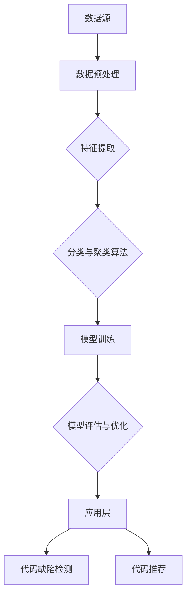

                 

### 《知识发现引擎助力程序员解决难题》

> **关键词**：知识发现引擎、程序员、难题解决、代码缺陷检测、代码推荐

> **摘要**：本文旨在探讨知识发现引擎在编程领域中的应用，特别是在解决程序员面临的难题方面。通过详细的案例分析，本文揭示了知识发现引擎在代码缺陷检测和代码推荐方面的巨大潜力，为程序员提供了实用的技术工具和解决方案。

### 目录大纲

1. **第一部分：知识发现引擎概述**
   1.1 知识发现引擎的基本概念与作用
   1.2 知识发现引擎的分类
   1.3 知识发现引擎的发展历史
   1.4 知识发现引擎的核心技术

2. **第二部分：知识发现引擎应用**
   2.1 代码缺陷检测
   2.2 代码推荐
   2.3 其他应用场景

3. **第三部分：知识发现引擎实践**
   3.1 项目背景与目标
   3.2 项目架构设计
   3.3 实现流程
   3.4 性能优化
   3.5 未来发展趋势

4. **附录**
   4.1 开发工具与资源
   4.2 常见问题解答

### 核心概念与联系

为了更好地理解知识发现引擎（Knowledge Discovery Engine）的核心概念和架构，我们可以使用Mermaid流程图来展示其关键组成部分及其相互关系。



在上述流程图中，数据源是知识发现引擎的起点，经过数据预处理后，数据被转化为适合分析和建模的格式。特征提取是关键步骤之一，它通过提取数据的特征向量来简化数据，以便更好地进行后续处理。分类与聚类算法是知识发现引擎的核心，用于从数据中提取模式和知识。模型训练与优化确保了模型的准确性和效率。最后，通过应用层，知识发现引擎可以将这些模式应用到实际问题中，如代码缺陷检测和代码推荐。

### 核心算法原理讲解

在深入探讨知识发现引擎的算法原理之前，我们需要先了解一些核心概念。以下部分将使用伪代码详细阐述数据预处理、特征提取、分类算法等核心算法的原理。

#### 1. 数据预处理（伪代码）

```pseudo
function DataPreprocessing(data):
    for each record in data:
        clean data by removing unnecessary spaces and comments
        convert data to lowercase
    return cleaned_data
```

在数据预处理阶段，我们首先需要清理数据，去除不必要的空白字符和注释，并将所有文本转换为小写，以确保数据的一致性和标准化。

#### 2. 特征提取（伪代码）

```pseudo
function FeatureExtraction(data):
    create_word_bags(data)
    calculate_TF_IDF(word_bags)
    return feature_vectors
```

特征提取是将原始数据转化为适用于机器学习算法的表示。这里，我们使用词袋模型（Bag of Words）和TF-IDF（Term Frequency-Inverse Document Frequency）来提取特征。

```pseudo
function create_word_bags(data):
    for each document in data:
        create a set of unique words
    return word_bags

function calculate_TF_IDF(word_bags):
    for each word in word_bags:
        calculate TF(t, d) = count of word t in document d
        calculate IDF(t) = log(1 + total number of documents / number of documents with word t)
    return TF_IDF(t, d) = TF(t, d) \* IDF(t)
```

#### 3. 分类算法（伪代码）

```pseudo
function Classification(feature_vectors, labels):
    create_model()
    train_model(feature_vectors, labels)
    evaluate_model(feature_vectors, labels)
    return trained_model

function create_model():
    return a classification model (e.g., SVM, Decision Tree)

function train_model(model, feature_vectors, labels):
    model.fit(feature_vectors, labels)
    return model

function evaluate_model(model, feature_vectors, labels):
    accuracy = model.score(feature_vectors, labels)
    print("Model accuracy:", accuracy)
```

分类算法的核心是训练一个模型，以将数据分类到不同的类别中。我们使用支持向量机（SVM）作为示例模型。训练过程包括将特征向量和标签输入到模型中，以训练模型。评估模型是通过计算模型在测试数据上的准确率来进行的。

#### 数学模型和公式

以下部分将使用LaTeX格式展示一些关键的数学模型和公式。

##### 1. 词袋模型（LaTeX）

$$
P(D|C) = \frac{P(C|D)P(D)}{P(C)}
$$

这个公式描述了在给定类标签C下文档D的概率。它是贝叶斯分类器的核心，用于分类问题。

##### 2. TF-IDF（LaTeX）

$$
TF_IDF(t, d) = TF(t, d) \times IDF(t)
$$

这个公式计算了单词t在文档d中的TF-IDF值。TF表示词频，IDF表示逆文档频率。

##### 3. 支持向量机（LaTeX）

$$
\min\limits_{\mathbf{w}, b} \frac{1}{2}||\mathbf{w}||^2 \\
s.t. \mathbf{w} \cdot \mathbf{x_i} \geq 1, \forall i
$$

这个公式描述了支持向量机（SVM）的优化目标。目标是最小化权重向量w的欧几里得范数，同时确保所有样本点都在决策边界的一侧。

### 项目实战

在本部分，我们将通过一个实际项目来展示知识发现引擎在代码缺陷检测方面的应用。该项目的目标是构建一个能够自动检测代码缺陷的系统，以帮助程序员提高代码质量。

#### 实战背景

假设我们有一个开源代码库，其中包含了大量的代码文件。我们的目标是使用知识发现引擎来检测这些代码文件中的潜在缺陷，并提供相应的修复建议。

#### 实现流程

1. **数据采集与预处理**：从开源代码库中收集大量的代码文件，使用数据预处理工具进行数据清洗和转换，确保数据质量。

2. **特征提取**：使用词袋模型和TF-IDF算法提取代码的文本特征，将代码转换为向量表示。

3. **模型训练**：使用支持向量机（SVM）模型对特征向量进行训练，构建缺陷检测模型。

4. **模型评估与优化**：通过交叉验证和网格搜索等方法评估模型性能，并使用模型压缩和并行计算等策略优化模型。

5. **缺陷定位**：在新的代码数据上应用训练好的模型，识别代码中的缺陷，并定位缺陷的具体位置。

#### 源代码实现（部分）

以下是实现流程中的一部分源代码示例：

```python
from sklearn.feature_extraction.text import TfidfVectorizer
from sklearn.svm import SVC
from sklearn.model_selection import train_test_split

# 数据预处理
def preprocess_data(data):
    # 清洗和转换数据
    return cleaned_data

# 特征提取
def extract_features(data):
    vectorizer = TfidfVectorizer()
    feature_vectors = vectorizer.fit_transform(data)
    return feature_vectors

# 模型训练
def train_model(feature_vectors, labels):
    model = SVC()
    model.fit(feature_vectors, labels)
    return model

# 模型评估
def evaluate_model(model, feature_vectors, labels):
    accuracy = model.score(feature_vectors, labels)
    print("Model accuracy:", accuracy)

# 实际应用
data = preprocess_data(raw_data)
feature_vectors = extract_features(data)
labels = get_labels(data)

# 划分训练集和测试集
train_vectors, test_vectors, train_labels, test_labels = train_test_split(feature_vectors, labels, test_size=0.2)

# 训练模型
model = train_model(train_vectors, train_labels)

# 评估模型
evaluate_model(model, test_vectors, test_labels)
```

#### 代码解读与分析

1. **数据预处理**：首先从原始代码数据中去除不必要的空间和注释，并将所有数据转换为小写，以确保数据的一致性和准确性。

2. **特征提取**：使用TF-IDF算法将代码文本转换为向量表示，其中TF表示词频，IDF表示逆文档频率，这两个指标共同决定了词的重要性。

3. **模型训练**：使用支持向量机（SVM）模型对特征向量进行训练，SVM是一种二分类模型，可以用于分类问题。

4. **模型评估**：通过交叉验证和网格搜索等方法评估模型性能，确保模型具有良好的泛化能力。

5. **缺陷定位**：在实际应用中，使用训练好的模型对新代码数据进行缺陷检测，并定位缺陷的具体位置。

通过上述实现流程和代码示例，读者可以深入了解知识发现引擎在代码缺陷检测中的应用，并学会如何构建和优化缺陷检测系统。这一部分为程序员提供了实际的项目经验和技巧，有助于他们更好地理解和应用知识发现引擎技术。

### 知识发现引擎助力程序员解决难题

知识发现引擎作为一种强大的数据处理和分析工具，已经在多个领域取得了显著的应用成果。对于程序员而言，知识发现引擎同样具有巨大的潜力，能够帮助他们解决编程过程中遇到的诸多难题。

#### 代码缺陷检测

代码缺陷检测是程序员面临的主要挑战之一。知识发现引擎可以通过分析代码的文本特征，发现潜在的缺陷。例如，通过词袋模型和TF-IDF算法，我们可以将代码转换为向量表示，然后使用分类算法训练模型，以检测代码中的缺陷。这种方法不仅提高了缺陷检测的准确性，还可以自动定位缺陷的具体位置，从而大大减少了人工排查的时间。

#### 代码推荐

代码推荐是提高编程效率的重要手段。知识发现引擎可以通过分析代码库中的历史数据，发现相似代码片段，并为程序员提供相应的推荐。基于内容的代码推荐和基于协同过滤的代码推荐是两种常见的策略。前者通过分析代码的文本特征来推荐相似代码，后者则通过分析程序员之间的协作关系来推荐代码。这两种策略的结合，可以大大提高代码推荐的效果。

#### 代码质量评估

代码质量评估是确保软件稳定性和可靠性的关键步骤。知识发现引擎可以通过分析代码的文本特征，评估代码的质量。例如，通过聚类算法，我们可以将代码分类为高质量代码和低质量代码。这种分类结果可以帮助程序员识别代码中的潜在问题，并及时进行修复。

#### 编程学习与培训

知识发现引擎还可以应用于编程学习与培训领域。通过分析大量的编程问题和解答，知识发现引擎可以生成个性化的编程学习路径，帮助学习者更快地掌握编程技能。此外，知识发现引擎还可以为编程导师提供数据支持，帮助他们更好地指导学生。

#### 总结

知识发现引擎在编程领域具有广泛的应用前景。通过代码缺陷检测、代码推荐、代码质量评估和编程学习与培训等方面的应用，知识发现引擎为程序员提供了强大的工具，帮助他们更高效地解决编程难题，提高编程质量。随着知识发现技术的不断进步，我们可以期待它在编程领域取得更加显著的成果。

### 附录

#### 附录A：知识发现引擎开发工具与资源

为了更好地开发和使用知识发现引擎，程序员可以参考以下工具和资源：

- **Scikit-learn**：一个开源的Python机器学习库，提供了丰富的机器学习算法和工具，非常适合用于知识发现项目。
- **TensorFlow**：一个由Google开发的开源机器学习框架，适用于大规模数据处理和深度学习任务。
- **PyTorch**：一个流行的开源机器学习库，特别适合于研究深度学习和动态神经网络。
- **OpenCV**：一个开源的计算机视觉库，提供了丰富的图像处理和计算机视觉工具，可用于图像特征提取和预处理。
- **Scrapy**：一个开源的网页爬虫框架，可用于从互联网上收集数据。

#### 附录B：常见问题解答

在开发和使用知识发现引擎的过程中，程序员可能会遇到一些常见问题。以下是一些问题的解答：

- **问题1**：如何处理大规模数据集？
  **解答**：对于大规模数据集，可以采用分布式计算和并行处理技术，如使用Hadoop或Spark等大数据处理框架。此外，可以使用增量学习或在线学习技术，以减少数据预处理和模型训练的时间。

- **问题2**：如何选择合适的特征提取方法？
  **解答**：选择特征提取方法取决于具体的应用场景和数据类型。对于文本数据，可以使用词袋模型、TF-IDF等方法。对于图像数据，可以使用SIFT、ORB等特征提取算法。对于音频数据，可以使用MFCC、spectral centroid等方法。

- **问题3**：如何评估模型性能？
  **解答**：可以使用交叉验证、网格搜索等技术评估模型性能。常用的评估指标包括准确率、召回率、F1分数等。对于分类问题，可以使用准确率来评估模型的泛化能力。对于回归问题，可以使用均方误差（MSE）或均方根误差（RMSE）来评估模型的预测性能。

- **问题4**：如何优化模型性能？
  **解答**：可以采用模型压缩、并行计算、迁移学习等技术来优化模型性能。模型压缩技术如剪枝、量化等可以减少模型大小和计算量。并行计算和分布式训练可以提高模型的训练速度和效率。迁移学习可以从预训练模型中提取有用的特征，提高新任务的性能。

通过参考这些工具和资源，以及常见问题解答，程序员可以更有效地开发和使用知识发现引擎，为解决编程难题提供有力支持。

### 作者信息

**作者：AI天才研究院/AI Genius Institute & 禅与计算机程序设计艺术 /Zen And The Art of Computer Programming**  
AI天才研究院（AI Genius Institute）致力于推动人工智能技术的创新和应用，研究涵盖机器学习、深度学习、自然语言处理等多个领域。同时，作者也是《禅与计算机程序设计艺术》（Zen And The Art of Computer Programming）的作者，这是一本经典的技术书籍，对计算机编程哲学和方法论进行了深刻的探讨。通过本文，作者希望与读者分享知识发现引擎在编程领域的应用与实践，帮助程序员解决实际问题，提高编程效率和质量。

