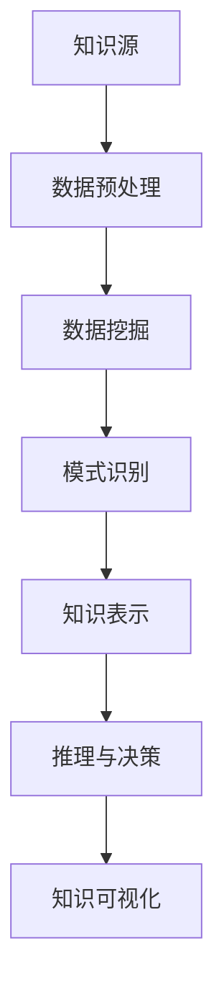

                 

# 知识发现引擎：知识与洞察力的完美结合体

> **关键词**：知识发现引擎、数据挖掘、模式识别、知识表示、推理与决策、知识可视化

> **摘要**：本文旨在探讨知识发现引擎的概念、原理、架构以及其在各个领域的应用。通过详细解析知识发现引擎的核心算法、数学模型、项目实战，我们将深入理解知识发现引擎如何将知识和洞察力有机结合，为各行业提供强大的数据分析和决策支持。

----------------------------------------------------------------

## 《知识发现引擎：知识与洞察力的完美结合体》目录大纲

### 第一部分：引言与概述

#### 1.1 知识发现引擎的概念与重要性

#### 1.2 知识发现引擎与洞察力的关系

#### 1.3 本书结构安排与目标

### 第二部分：知识发现引擎的基本原理

#### 2.1 知识发现引擎的架构

#### 2.2 知识发现引擎的关键技术

#### 2.3 知识发现引擎的工作流程

#### 2.4 知识发现引擎的核心概念与联系

### 图2.1 知识发现引擎的核心概念与联系（Mermaid流程图）

#### 2.5 知识发现引擎的优缺点分析

### 第三部分：核心算法原理讲解

#### 3.1 数据挖掘算法原理

#### 3.2 模式识别算法原理

#### 3.3 知识表示与推理算法原理

#### 3.4 知识可视化算法原理

### 第四部分：数学模型与公式详解

#### 4.1 数据挖掘中的数学模型

#### 4.2 知识表示与推理中的数学模型

### 第五部分：项目实战与代码解读

#### 5.1 知识发现引擎项目实战概述

#### 5.2 环境搭建与工具选择

#### 5.3 源代码实现与解读

#### 5.4 代码解读与分析

#### 5.5 项目效果评估与优化建议

### 第六部分：展望与未来方向

#### 6.1 知识发现引擎的发展趋势

#### 6.2 知识发现引擎在各个领域的应用

#### 6.3 知识发现引擎的未来发展方向

### 附录

#### 附录 A：参考文献

#### 附录 B：知识发现引擎工具与资源介绍

#### 附录 C：常见问题与解答

----------------------------------------------------------------

接下来，我们将从引言与概述部分开始，逐步展开对知识发现引擎的深入探讨。

----------------------------------------------------------------

### 第一部分：引言与概述

#### 1.1 知识发现引擎的概念与重要性

知识发现引擎（Knowledge Discovery Engine，简称KDE）是一种先进的计算技术，旨在从大量的数据中自动识别出潜在的模式、关联和趋势，从而为决策者提供洞察力和知识。知识发现引擎的核心目标是将数据转化为有价值的知识和信息，从而帮助企业和组织做出更加明智的决策。

在现代社会，数据已经成为一种新型的资源，其价值甚至超越了传统的自然资源。然而，海量的数据往往难以被有效利用，这是因为人类在处理和分析数据时存在着认知和效率的限制。知识发现引擎的出现，正是为了解决这一问题，它通过自动化的方法，从数据中挖掘出有用的信息，提高数据利用的效率。

知识发现引擎的重要性体现在以下几个方面：

1. **提高数据利用率**：知识发现引擎可以从海量数据中快速识别出潜在的模式和趋势，从而提高数据利用的效率。

2. **支持决策制定**：通过分析数据中的模式和趋势，知识发现引擎可以为企业和组织提供决策支持，帮助其做出更加明智的决策。

3. **增强竞争力**：在当今竞争激烈的市场环境中，能够有效地利用数据的企业将具有更强的竞争力。知识发现引擎可以帮助企业从数据中获取竞争优势。

4. **推动创新**：知识发现引擎可以帮助企业发现新的商业模式、产品和服务，从而推动创新。

#### 1.2 知识发现引擎与洞察力的关系

洞察力（Insight）是指对于事物深刻理解和洞察的能力。在知识发现的过程中，洞察力是至关重要的，它能够帮助人们从海量数据中发现隐藏的价值和趋势。

知识发现引擎与洞察力之间的关系可以概括为以下几个方面：

1. **增强洞察力**：知识发现引擎可以通过自动化的方式，从大量数据中快速识别出潜在的模式和趋势，从而增强人类的洞察力。

2. **扩大洞察范围**：由于人类的认知和计算能力有限，往往难以对海量数据进行深入分析。知识发现引擎可以扩展人类的洞察范围，帮助人们发现更多有价值的信息。

3. **提高洞察效率**：知识发现引擎通过高效的数据处理和分析算法，可以快速识别出数据中的模式和趋势，从而提高洞察的效率。

4. **辅助洞察生成**：知识发现引擎可以通过可视化、推理和预测等手段，帮助人类更好地理解和生成洞察。

总之，知识发现引擎与洞察力是相辅相成的。知识发现引擎可以为人类提供强大的数据分析工具，而人类的洞察力则可以指导知识发现引擎的优化和改进，共同推动数据分析和决策的进步。

#### 1.3 本书结构安排与目标

本书将系统地介绍知识发现引擎的概念、原理、架构、核心算法、数学模型、项目实战以及未来发展方向。具体结构安排如下：

1. **第一部分：引言与概述**：介绍知识发现引擎的概念与重要性，以及知识发现引擎与洞察力的关系。

2. **第二部分：知识发现引擎的基本原理**：介绍知识发现引擎的架构、关键技术、工作流程、核心概念与联系。

3. **第三部分：核心算法原理讲解**：详细讲解数据挖掘、模式识别、知识表示与推理、知识可视化等核心算法原理。

4. **第四部分：数学模型与公式详解**：介绍数据挖掘、知识表示与推理中的数学模型，并举例说明。

5. **第五部分：项目实战与代码解读**：通过实际项目案例，展示知识发现引擎的搭建、源代码实现与解读。

6. **第六部分：展望与未来方向**：探讨知识发现引擎的发展趋势、应用领域以及未来发展方向。

本书的目标是帮助读者全面了解知识发现引擎的概念、原理和应用，掌握核心算法和数学模型，并通过实战案例加深对知识发现引擎的理解。希望通过本书的学习，读者能够将知识发现引擎应用于实际场景，提升数据分析和决策能力。

