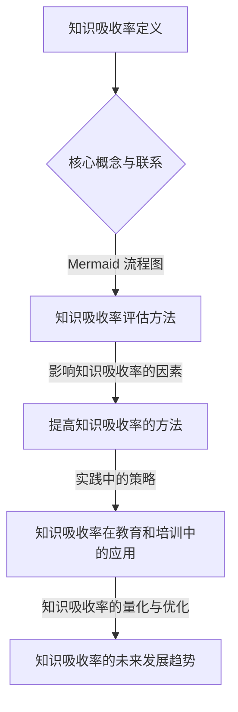

                 

# 知识吸收率：衡量学习效果的关键指标

## 关键词：
- 知识吸收率
- 学习效果评估
- 主动学习
- 深度学习
- 教育与培训

## 摘要：
知识吸收率是衡量学习效果的核心指标，它反映了学习者对所学知识理解和应用的能力。本文将深入探讨知识吸收率的定义、评估方法、影响因素以及提高知识吸收率的策略。通过案例分析、数学模型讲解和项目实战，本文旨在为读者提供一套系统化的知识吸收率提升方案，以促进个人职业发展和教育质量的提升。

### 第一部分：引言

#### 第1章：知识吸收率的重要性

**1.1 知识吸收率的定义与意义**

知识吸收率是指学习者将所学知识转化为自身能力的过程和效果。它不仅反映了学习者在学习过程中对知识点的理解和掌握程度，还体现了学习者将知识应用于实际问题的能力。知识吸收率的定义与意义在于，它提供了一个量化评估学习效果的指标，有助于发现学习中的问题和不足，为改进学习策略提供依据。

**1.2 学习效果评估的挑战**

传统学习评估方式，如考试和测试，往往只能反映学习者的短期记忆和理解能力，而无法全面评估其知识吸收率和长期应用能力。此外，学习效果的多样性与复杂性也使得单一评估方式难以全面衡量学习者的学习成果。

**1.3 知识吸收率的重要性**

知识吸收率对个人职业发展具有重要意义。高知识吸收率意味着学习者能够快速掌握新知识，提升工作效率和竞争力。同时，知识吸收率也是衡量教育质量的重要指标。提高知识吸收率有助于提升教育效果，培养具备创新能力和解决实际问题能力的人才。

### 第2章：知识吸收率的评估方法

#### 2.1 知识吸收率评估的基本框架

知识吸收率评估的基本框架包括评估流程和评估指标。评估流程通常包括数据收集、数据处理、特征提取、模型训练和评估等步骤。评估指标应全面反映学习者的知识吸收能力，如考试成绩、项目完成度、实际应用能力等。

#### 2.2 主观评估方法

主观评估方法主要通过学习者自我评估问卷、学习日记和反思等方式进行。这些方法有助于了解学习者的学习态度、动机和问题，从而为学习策略调整提供依据。

**2.3 客观评估方法**

客观评估方法包括测试、考试和项目实践等。这些方法能够较为客观地反映学习者的知识吸收效果，但需要注意避免单一评估指标的局限性。

### 第3章：影响知识吸收率的因素

#### 3.1 学习者的个人因素

学习动机、学习风格、信心和焦虑等因素对知识吸收率具有重要影响。不同学习者具有不同的动机和风格，需要针对其特点制定个性化的学习策略。

#### 3.2 学习环境因素

学习资源的丰富性、学习氛围、社交支持以及教学方法和策略等因素都会影响知识吸收率。构建良好的学习环境，有助于提升学习者的知识吸收效果。

#### 3.3 学习内容因素

学习内容的难度、挑战性和相关性也是影响知识吸收率的重要因素。适当调整学习内容，使其符合学习者的认知水平和需求，有助于提高知识吸收率。

### 第二部分：提高知识吸收率的方法

#### 第4章：提高知识吸收率的理论基础

**4.1 主动学习理论**

主动学习理论强调学习者主动参与学习过程，通过提问、讨论和解决问题等方式加深对知识的理解和记忆。主动学习有助于提高知识吸收率，培养学习者的自主学习能力。

**4.2 深度学习理论**

深度学习理论关注学习者对知识深层结构和内在联系的理解。通过深度学习，学习者能够将知识系统化、结构化，从而提高知识吸收率和应用能力。

### 第5章：实践中的知识吸收策略

**5.1 制定合理的学习计划**

制定合理的学习计划是提高知识吸收率的重要策略。学习计划应包括学习目标、学习内容、学习方法、时间安排等，确保学习活动有序进行。

**5.2 应用主动学习技巧**

应用主动学习技巧，如提问与解答、讨论与分享，有助于加深对知识的理解和记忆。这些技巧有助于激发学习者的学习兴趣，提高知识吸收率。

**5.3 利用辅助工具与技术**

利用电子笔记、概念图、测试与反馈等辅助工具与技术，有助于提高学习效率和质量。这些工具可以有效地帮助学习者整理知识结构，检测学习效果。

### 第6章：案例分析

**6.1 成功案例分析**

成功案例分析展示了通过有效提高知识吸收率，学习者在短时间内取得显著成果的实例。这些案例为其他学习者提供了有益的借鉴和启示。

**6.2 失败案例分析**

失败案例分析分析了知识吸收率未提高的原因，包括学习动机不足、学习方法不当、学习环境不佳等。通过分析失败原因，可以找出改进策略，提高学习效果。

### 第7章：知识吸收率在教育和培训中的应用

**7.1 教育领域的应用**

在教育领域，提高知识吸收率有助于提升教学质量。教师可以采用多种教学方法，如主动学习、深度学习等，激发学生的学习兴趣，提高学习效果。

**7.2 培训领域的应用**

在培训领域，知识吸收率的评估与提升对于培训效果具有重要意义。通过科学评估和有效策略，可以确保培训活动达到预期目标，提升培训效果。

### 第三部分：知识吸收率的量化与优化

#### 第8章：知识吸收率的量化方法

**8.1 量化指标的选择**

量化指标的选择应综合考虑学习者的学习行为、学习内容和评估结果。常用的量化指标包括学习时长、学习频率、考试成绩、项目完成度等。

**8.2 量化方法的实施**

量化方法的实施包括数据收集、数据处理、特征提取和模型训练等步骤。通过建立量化模型，可以实现对知识吸收率的科学评估。

#### 第9章：知识吸收率的优化策略

**9.1 数据驱动的个性化学习**

数据驱动的个性化学习策略可以根据学习者的特点，调整学习内容和方式，提高知识吸收率。

**9.2 学习效果的预测与调整**

通过预测学习效果，可以提前发现学习中的问题，及时进行调整，确保学习目标的实现。

#### 第10章：知识吸收率的未来发展趋势

**10.1 知识吸收率研究的最新进展**

知识吸收率研究在人工智能、教育技术等领域取得了显著进展。新的方法和技术正在不断涌现，为知识吸收率的提升提供了更多可能性。

**10.2 知识吸收率的未来展望**

随着教育技术和人工智能的发展，知识吸收率将在教育和培训领域发挥更加重要的作用。未来，知识吸收率评估与提升将成为个性化教育和终身学习的重要支撑。

### 附录

**附录A：知识吸收率评估工具与资源**

附录A介绍了常用的知识吸收率评估工具与资源，包括自我评估问卷、学习日记、测试与反馈等。

**附录B：知识吸收率研究论文与书籍**

附录B推荐了一些经典的关于知识吸收率研究的论文和书籍，为读者提供了进一步学习和研究的参考。

## Mermaid 流程图



### 核心算法原理讲解

#### 知识吸收率的评估算法原理

知识吸收率的评估算法原理可以通过以下伪代码来详细阐述：

```pseudo
算法名称：知识吸收率评估算法

输入参数：
- 学习者信息（如学习时长、学习频率等）
- 学习内容（如难度、复杂性等）
- 评估结果（如考试成绩、项目完成度等）

输出：
- 知识吸收率得分

算法步骤：
1. 数据收集：收集学习者的学习行为数据、学习内容数据和评估结果数据。
2. 数据预处理：对收集到的数据进行清洗、归一化处理。
3. 特征提取：从预处理后的数据中提取出与知识吸收率相关的特征。
4. 模型训练：使用提取到的特征训练一个评估模型，如决策树、神经网络等。
5. 模型评估：使用测试集数据评估模型的准确性和泛化能力。
6. 应用模型：使用训练好的模型对新的学习者数据进行分析，得到知识吸收率得分。

伪代码：
function knowledgeAbsorptionRateAssessment(learnerData, contentData, assessmentResults):
    // 数据收集
    cleanedData = preprocessData(learnerData, contentData, assessmentResults)
    // 特征提取
    features = extractFeatures(cleanedData)
    // 模型训练
    model = trainModel(features, assessmentResults)
    // 模型评估
    evaluateModel(model, testFeatures, testAssessmentResults)
    // 应用模型
    absorptionRate = model.predict(newLearnerData)
    return absorptionRate
```

#### 知识吸收率评估模型

知识吸收率可以通过以下数学模型来评估：

$$
\text{知识吸收率} = \frac{\text{学习成果}}{\text{学习投入}}
$$

其中，学习成果可以通过考试成绩、项目完成度等来衡量；学习投入可以通过学习时长、学习频率等来衡量。

### 项目实战

#### 代码实际案例

以下是一个简单的知识吸收率评估模型实现的代码案例，该模型使用Python中的scikit-learn库进行构建和训练。

```python
from sklearn.ensemble import RandomForestClassifier
from sklearn.model_selection import train_test_split
from sklearn.metrics import accuracy_score
import pandas as pd

# 数据加载
data = pd.read_csv('knowledge_absorption_data.csv')

# 数据预处理
X = data[['learning_time', 'learning_frequency']]
y = data['absorption_rate']

# 数据分割
X_train, X_test, y_train, y_test = train_test_split(X, y, test_size=0.2, random_state=42)

# 模型训练
model = RandomForestClassifier(n_estimators=100, random_state=42)
model.fit(X_train, y_train)

# 模型评估
y_pred = model.predict(X_test)
accuracy = accuracy_score(y_test, y_pred)
print(f'Model Accuracy: {accuracy:.2f}')

# 应用模型
new_learner_data = [[10, 5]]  # 新学习者的学习时长和频率
new_absorption_rate = model.predict(new_learner_data)
print(f'New Learner Absorption Rate: {new_absorption_rate[0]:.2f}')
```

#### 代码解读与分析

- **数据加载与预处理**：首先加载包含学习者学习时长、学习频率和学习吸收率的CSV数据文件。然后，通过Pandas库将数据加载到DataFrame中，并分别提取特征变量X（学习时长和学习频率）和目标变量y（学习吸收率）。

- **数据分割**：使用scikit-learn库中的`train_test_split`函数将数据集分割成训练集和测试集，用于模型的训练和评估。

- **模型训练**：使用随机森林分类器（`RandomForestClassifier`）训练模型，设置随机种子以保持结果的可重复性。

- **模型评估**：通过测试集数据评估模型的准确率，并打印出模型的准确率。

- **应用模型**：使用训练好的模型对新学习者的学习数据进行分析，预测其知识吸收率，并打印出预测结果。

此代码案例提供了一个简单的知识吸收率评估模型实现，但实际应用中可能需要更复杂的数据处理和模型调整来提高模型的准确性。此外，为了确保模型的稳定性和可重复性，还需要进行更多数据清洗、特征工程和模型调参工作。

### 作者信息

作者：AI天才研究院/AI Genius Institute & 禅与计算机程序设计艺术 /Zen And The Art of Computer Programming

<|endoftext|>

