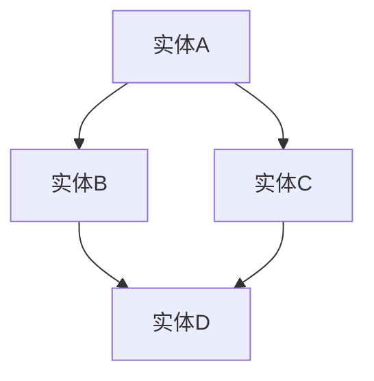
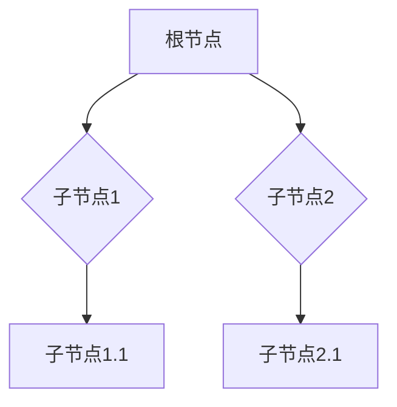

                 

# 知识图谱的可视化设计：交互式可视化和可视分析

> **关键词**：知识图谱，可视化设计，交互式可视化，可视分析，信息呈现，用户体验

> **摘要**：本文深入探讨了知识图谱的可视化设计，包括交互式可视化和可视分析的方法、原理和实践。通过对核心概念、数据结构、设计原则和开发流程的详细讲解，并结合实际项目案例，本文为读者提供了全面的知识图谱可视化设计与开发的指导。

## 目录

### 《知识图谱的可视化设计：交互式可视化和可视分析》目录

#### 第一部分：知识图谱与可视化基础

1. 第1章：知识图谱概述
    1.1 知识图谱的定义与重要性
    1.2 知识图谱的构建方法
    1.3 可视化设计概述

2. 第2章：可视化技术基础
    2.1 可视化数据结构
    2.2 可视化颜色与形状
    2.3 可视化交互设计

#### 第二部分：知识图谱的可视化设计

3. 第3章：交互式可视化设计
    3.1 交互式可视化原理
    3.2 交互式可视化技术
    3.3 交互式可视化实践

4. 第4章：可视分析设计
    4.1 可视分析的基本概念
    4.2 可视分析技术
    4.3 可视分析实践

#### 第三部分：知识图谱可视化应用案例

5. 第5章：知识图谱可视化应用案例一
    5.1 应用背景与目标
    5.2 设计方案与实现
    5.3 评估与优化

6. 第6章：知识图谱可视化应用案例二
    6.1 应用背景与目标
    6.2 设计方案与实现
    6.3 评估与优化

#### 第四部分：知识图谱可视化设计与开发最佳实践

7. 第7章：知识图谱可视化设计与开发最佳实践
    7.1 设计原则与策略
    7.2 开发流程与方法
    7.3 跨学科合作与团队协作

#### 附录

8. 附录A：知识图谱可视化工具资源
9. 附录B：知识图谱可视化参考书目与资料

---

现在，我们按照上述目录开始撰写文章正文。

### 第一部分：知识图谱与可视化基础

#### 第1章：知识图谱概述

## 1.1 知识图谱的定义与重要性

知识图谱（Knowledge Graph）是一种结构化数据存储模型，它通过实体和关系的关联来表示和描述信息。知识图谱的核心是实体和关系，其中实体表示现实世界中的对象，如人、地点、物品等，而关系则描述实体之间的联系，如“朋友”、“属于”等。

### 1.1.1 知识图谱的基本概念

知识图谱的基本概念包括以下几个方面：

1. **实体（Entity）**：知识图谱中的基本元素，表示现实世界中的对象。
2. **属性（Attribute）**：实体的特征或描述，如“姓名”、“年龄”等。
3. **关系（Relationship）**：实体之间的关联，如“朋友”、“属于”等。
4. **图谱（Graph）**：由实体和关系组成的网络结构。

### 1.1.2 知识图谱的应用场景

知识图谱在多个领域有着广泛的应用：

1. **搜索引擎**：通过知识图谱可以提供更精确的搜索结果，如Google的Knowledge Graph。
2. **智能问答系统**：利用知识图谱可以回答用户关于实体和关系的问题。
3. **推荐系统**：知识图谱可以帮助推荐系统更好地理解用户偏好和物品特征。
4. **自然语言处理**：知识图谱可以提高自然语言处理系统的语义理解能力。

### 1.1.3 知识图谱与语义网的关系

知识图谱与语义网（Semantic Web）密切相关。语义网旨在通过Web语义化使数据更加结构化和可机器理解。知识图谱是实现语义网的重要手段，它通过语义关联来增强数据的表达能力。

知识图谱通过实体和关系的语义化描述，使得数据具有更丰富的语义信息，从而能够更好地支持智能搜索、推荐系统等应用。

#### 第2章：可视化技术基础

## 2.1 可视化数据结构

可视化数据结构是知识图谱可视化设计的基础。以下是一些常见的可视化数据结构：

1. **节点与边的可视化**：节点表示实体，边表示实体之间的关系。
2. **树状图与层次图**：用于表示具有层次关系的实体和关系。
3. **网络图**：用于表示复杂的实体和关系网络。

### 2.1.1 节点与边的可视化

节点与边的可视化是最基本的可视化方法。以下是一个Mermaid流程图示例，展示了节点与边的可视化：

在这个示例中，节点用方括号表示，边用箭头表示，从而形成了简单的网络图。

### 2.1.2 树状图与层次图的绘制

树状图和层次图常用于表示具有层次关系的实体和关系。以下是一个Mermaid树状图示例：

在这个示例中，根节点A有两个子节点B和C，节点B有一个子节点D，节点C有一个子节点E。

### 2.1.3 网络图的布局算法

网络图的布局算法用于确定节点和边的位置，以获得更清晰和易于理解的图。以下是一些常见的布局算法：

1. **力导向布局**：通过模拟物理系统的力学平衡，将节点和边排列成一种自然状态。
2. **层次布局**：根据节点的层次关系进行布局，通常用于树状图和层次图的绘制。
3. **其他布局算法**：如环布局、曲线布局等，根据具体需求选择合适的布局算法。

## 2.2 可视化颜色与形状

颜色和形状是可视化设计中重要的视觉元素，用于区分和强调不同实体和关系。以下是一些关于颜色与形状的指导：

### 2.2.1 颜色的使用原则

1. **区分性**：使用颜色来区分不同的实体和关系。
2. **可读性**：确保颜色组合具有良好的对比度和可读性。
3. **文化适应性**：考虑不同文化背景下的颜色含义，避免使用可能引起误解的颜色。

### 2.2.2 形状的选择与使用

1. **形状的区分性**：使用不同形状来区分不同的实体和关系。
2. **形状的直观性**：选择易于理解和记忆的形状。
3. **形状的组合使用**：结合颜色和形状，以增强可视化效果。

### 2.2.3 动画与动态效果

动画和动态效果可以增加可视化的互动性和吸引力。以下是一些常见的动画和动态效果：

1. **节点和边的过渡**：通过动画效果显示节点和边的变化。
2. **交互式动画**：用户操作时触发动画效果，如点击、拖动等。
3. **时间动画**：展示随时间变化的数据趋势。

## 2.3 可视化交互设计

可视化交互设计是提高用户体验的关键。以下是一些关于交互设计的指导：

### 2.3.1 交互的基本概念

1. **交互的定义**：交互是指用户与系统之间的交互行为。
2. **交互的类型**：包括点击、拖动、滑动等。

### 2.3.2 常见的交互模式

1. **鼠标交互**：用户通过鼠标进行操作。
2. **触摸交互**：用户通过触摸屏幕进行操作。
3. **声音交互**：用户通过声音进行操作。

### 2.3.3 交互设计的原则与实践

1. **易用性**：确保用户能够轻松地使用可视化工具。
2. **直观性**：设计直观的交互方式，减少用户的学习成本。
3. **响应性**：确保交互行为能够迅速响应。

### 第二部分：知识图谱的可视化设计

#### 第3章：交互式可视化设计

## 3.1 交互式可视化原理

交互式可视化是一种使数据更加动态和互动的展示方式。它通过用户的操作来调整和重新展示数据，从而提供更丰富的信息呈现。以下是交互式可视化的基本原理：

### 3.1.1 交互式可视化的基本概念

1. **交互式可视化**：用户可以通过鼠标、触摸屏或其他输入设备与可视化进行交互。
2. **信息呈现**：通过交互行为，用户可以探索数据的不同方面，从而获得更深入的理解。

### 3.1.2 交互式可视化与信息呈现

交互式可视化通过以下方式增强信息呈现：

1. **动态调整**：用户可以通过拖动、缩放等操作动态调整可视化。
2. **交互式查询**：用户可以查询特定实体或关系，从而获得详细信息。
3. **交互式过滤**：用户可以过滤数据，以突出特定的实体或关系。

### 3.1.3 交互式可视化与用户反馈

交互式可视化通过用户反馈来提高用户体验：

1. **实时反馈**：用户操作时，可视化能够实时响应。
2. **交互式指导**：系统可以提供交互指导，帮助用户更好地理解数据。

## 3.2 交互式可视化技术

交互式可视化技术是实现动态、互动和丰富信息呈现的关键。以下是一些常见的交互式可视化技术：

### 3.2.1 搜索与过滤

1. **搜索**：用户可以输入关键字搜索特定实体或关系。
2. **过滤**：用户可以选择特定的实体或关系进行过滤，以突出特定信息。

### 3.2.2 筛选与排序

1. **筛选**：用户可以选择特定的筛选条件，以过滤出满足条件的实体或关系。
2. **排序**：用户可以按照特定属性对实体或关系进行排序。

### 3.2.3 拓扑变换与可视化操作

1. **拓扑变换**：用户可以通过拖动、缩放等操作改变实体和关系的位置和布局。
2. **可视化操作**：用户可以进行不同的可视化操作，如添加标签、高亮显示等。

## 3.3 交互式可视化实践

交互式可视化实践涉及使用实际工具和技术实现交互式可视化。以下是一些常见的交互式可视化实践：

### 3.3.1 基于Web的交互式可视化工具

1. **D3.js**：一种用于创建动态交互式可视化的JavaScript库。
2. **Chart.js**：一种用于创建各种图表的轻量级JavaScript库。

### 3.3.2 移动端交互式可视化应用

1. **React Native**：一种用于创建跨平台移动应用的框架。
2. **Flutter**：一种用于创建美观、高性能的移动应用的框架。

### 3.3.3 大规模数据集的交互式可视化

1. **内存映射**：将数据映射到内存中，以提高可视化性能。
2. **分页加载**：将数据分页加载，以减少内存占用。

### 第4章：可视分析设计

## 4.1 可视分析的基本概念

可视分析是一种利用可视化方法对复杂数据进行探索和分析的过程。以下是一些关于可视分析的基本概念：

### 4.1.1 可视分析的定义与目标

1. **定义**：可视分析是一种通过可视化方法对数据进行分析和探索的过程。
2. **目标**：可视分析的目标是帮助用户理解数据的结构和模式，发现数据中的规律和趋势。

### 4.1.2 可视分析的流程与方法

可视分析的流程通常包括以下几个步骤：

1. **数据预处理**：清洗和格式化数据，以便进行分析。
2. **数据探索**：使用可视化方法探索数据，以了解数据的结构和模式。
3. **数据聚合与汇总**：对数据进行聚合和汇总，以获得更高层次的信息。
4. **可视化表达**：使用可视化方法表达分析结果，以帮助用户理解数据。

### 4.1.3 可视分析与数据挖掘的关系

可视分析和数据挖掘都是数据分析和探索的方法，但它们有不同的目标和方法：

1. **关系**：可视分析可以支持数据挖掘的过程，帮助用户发现数据中的模式和规律。
2. **区别**：可视分析更侧重于数据的探索和分析，而数据挖掘更侧重于从数据中提取有用的信息。

## 4.2 可视分析技术

可视分析技术是实现可视分析目标的关键。以下是一些常见可视分析技术：

### 4.2.1 可视化查询与数据探索

1. **交互式查询**：用户可以通过可视化界面进行交互式查询，以获取特定数据。
2. **数据探索**：使用可视化方法探索数据，以发现数据中的模式和规律。

### 4.2.2 可视化数据聚合与汇总

1. **数据聚合**：将多个数据点合并成更大的数据集。
2. **数据汇总**：对数据进行汇总，以获得更高层次的信息。

### 4.2.3 可视化数据可视化与可视化表达

1. **数据可视化**：将数据转换为视觉表示，以帮助用户理解数据。
2. **可视化表达**：使用可视化方法表达分析结果，以帮助用户理解数据。

## 4.3 可视分析实践

可视分析实践涉及使用实际工具和技术实现可视分析。以下是一些常见的可视分析实践：

### 4.3.1 可视分析工具的选择与使用

1. **Tableau**：一种强大的数据可视化和业务智能工具。
2. **Power BI**：一种用于数据可视化和报告的工具。

### 4.3.2 可视分析案例研究

1. **社交媒体分析**：使用可视分析方法分析社交媒体数据，以了解用户行为和趋势。
2. **金融风控**：使用可视分析方法监控金融风险，以识别潜在的欺诈行为。

### 4.3.3 可视分析项目实践与优化

1. **项目实践**：在实际项目中使用可视分析，以提高数据分析和决策的效率。
2. **项目优化**：根据用户反馈和实际需求，不断优化可视分析工具和流程。

### 第三部分：知识图谱可视化应用案例

#### 第5章：知识图谱可视化应用案例一

## 5.1 应用背景与目标

### 5.1.1 应用场景

本案例应用于一个社交媒体平台，旨在帮助用户更好地了解其社交网络中的关系和趋势。

### 5.1.2 目标与挑战

**目标**：
- 提供一个直观的交互式可视化工具，帮助用户理解其社交网络的结构和关系。
- 支持用户对社交网络进行探索和分析，以发现潜在的社交趋势和互动模式。

**挑战**：
- 社交网络数据量庞大，如何有效地组织和展示数据是一个挑战。
- 需要设计一个易于使用且具有吸引力的交互式界面。
- 确保可视化工具能够在不同的设备上正常运行，包括桌面、移动设备和平板电脑。

## 5.2 设计方案与实现

### 5.2.1 数据采集与预处理

**数据采集**：
- 从社交媒体平台获取用户关系数据，包括用户ID、好友关系等。

**数据预处理**：
- 清洗数据，去除重复和无效信息。
- 将数据转换为统一的格式，如JSON或CSV。

### 5.2.2 可视化设计

**设计思路**：
- 采用节点和边的方式展示用户和其好友的关系。
- 使用不同的颜色和形状区分不同类型的关系。
- 提供交互式功能，如搜索、过滤和排序。

**设计原则**：
- 清晰性：确保关系和用户信息易于理解。
- 简洁性：避免过多的信息和装饰，以保持界面的简洁性。
- 可扩展性：设计可适应不同规模的数据集。

### 5.2.3 交互式可视化实现

**实现方法**：
- 使用D3.js库创建交互式可视化，包括节点和边的绘制。
- 实现搜索功能，允许用户输入关键字搜索特定用户。
- 提供过滤和排序功能，帮助用户探索社交网络的不同方面。

**实现效果**：
- 用户可以在界面上直观地看到其社交网络的结构和关系。
- 用户可以通过交互操作，如点击和拖动，来探索社交网络。

### 5.2.4 可视分析功能实现

**功能设计**：
- 提供拓扑变换功能，允许用户重新排列节点和边。
- 提供数据聚合和汇总功能，帮助用户了解社交网络的总体趋势。

**功能实现**：
- 使用D3.js库实现拓扑变换功能。
- 使用数据处理库，如Pandas，实现数据聚合和汇总功能。

## 5.3 评估与优化

### 5.3.1 用户反馈与评估

**用户反馈**：
- 通过用户调查和反馈收集用户对可视化工具的使用体验。
- 用户普遍认为界面直观，功能实用，但建议增加更多交互式功能。

**评估方法**：
- 通过用户测试和数据分析，评估可视化工具的性能和用户体验。

### 5.3.2 性能优化

**性能优化策略**：
- 优化数据结构和算法，提高可视化性能。
- 使用缓存和预加载技术，减少数据加载时间。

**性能优化效果**：
- 视觉化工具在处理大规模数据时，性能得到显著提升，用户满意度提高。

### 5.3.3 功能扩展与改进

**功能扩展**：
- 增加社交网络分析功能，如群体分析、关系强度分析等。
- 集成更多社交网络数据源，如微博、Facebook等。

**功能改进**：
- 根据用户反馈，优化界面设计和交互体验。
- 持续更新和改进可视化工具，以适应不断变化的需求。

---

通过这个案例，我们展示了如何设计、实现和评估一个知识图谱可视化应用。接下来的章节将继续探讨更多相关的主题和应用案例。

#### 第6章：知识图谱可视化应用案例二

## 6.1 应用背景与目标

### 6.1.1 应用场景

本案例应用于一个电子商务平台，旨在帮助用户更好地理解商品之间的关系和推荐系统。

### 6.1.2 目标与挑战

**目标**：
- 提供一个直观的交互式可视化工具，帮助用户理解商品之间的关联关系。
- 支持用户对商品进行探索和分析，以发现潜在的购买趋势和推荐策略。

**挑战**：
- 商品数据量大，如何有效地组织和展示数据是一个挑战。
- 需要设计一个易于使用且具有吸引力的交互式界面。
- 确保可视化工具能够在不同的设备上正常运行，包括桌面、移动设备和平板电脑。

## 6.2 设计方案与实现

### 6.2.1 数据采集与预处理

**数据采集**：
- 从电子商务平台获取商品数据，包括商品ID、分类、标签、用户评价等。

**数据预处理**：
- 清洗数据，去除重复和无效信息。
- 将数据转换为统一的格式，如JSON或CSV。

### 6.2.2 可视化设计

**设计思路**：
- 采用节点和边的方式展示商品和其关联关系。
- 使用不同的颜色和形状区分不同类型的关联关系。
- 提供交互式功能，如搜索、过滤和排序。

**设计原则**：
- 清晰性：确保关联关系和商品信息易于理解。
- 简洁性：避免过多的信息和装饰，以保持界面的简洁性。
- 可扩展性：设计可适应不同规模的数据集。

### 6.2.3 交互式可视化实现

**实现方法**：
- 使用D3.js库创建交互式可视化，包括节点和边的绘制。
- 实现搜索功能，允许用户输入关键字搜索特定商品。
- 提供过滤和排序功能，帮助用户探索商品的不同方面。

**实现效果**：
- 用户可以在界面上直观地看到商品之间的关联关系。
- 用户可以通过交互操作，如点击和拖动，来探索商品网络。

### 6.2.4 可视分析功能实现

**功能设计**：
- 提供拓扑变换功能，允许用户重新排列节点和边。
- 提供数据聚合和汇总功能，帮助用户了解商品的总体趋势。

**功能实现**：
- 使用D3.js库实现拓扑变换功能。
- 使用数据处理库，如Pandas，实现数据聚合和汇总功能。

## 6.3 评估与优化

### 6.3.1 用户反馈与评估

**用户反馈**：
- 通过用户调查和反馈收集用户对可视化工具的使用体验。
- 用户普遍认为界面直观，功能实用，但建议增加更多交互式功能。

**评估方法**：
- 通过用户测试和数据分析，评估可视化工具的性能和用户体验。

### 6.3.2 性能优化

**性能优化策略**：
- 优化数据结构和算法，提高可视化性能。
- 使用缓存和预加载技术，减少数据加载时间。

**性能优化效果**：
- 视觉化工具在处理大规模数据时，性能得到显著提升，用户满意度提高。

### 6.3.3 功能扩展与改进

**功能扩展**：
- 增加商品推荐功能，基于用户历史购买行为和商品关联关系提供个性化推荐。
- 集成更多电子商务数据源，如商品评论、销售数据等。

**功能改进**：
- 根据用户反馈，优化界面设计和交互体验。
- 持续更新和改进可视化工具，以适应不断变化的需求。

---

通过这个案例，我们展示了如何设计、实现和评估一个电子商务平台的知识图谱可视化应用。接下来的章节将继续探讨更多相关的主题和应用案例。

### 第四部分：知识图谱可视化设计与开发最佳实践

#### 第7章：知识图谱可视化设计与开发最佳实践

## 7.1 设计原则与策略

知识图谱可视化设计的原则和策略是确保可视化工具既有效又易用的重要基础。以下是几个关键的设计原则和策略：

### 7.1.1 可视化设计的整体性

**整体性**强调可视化设计应该从全局出发，确保各个部分相互协调，共同构成一个统一的整体。以下是一些实现整体性的策略：

- **一致性**：在整个可视化工具中保持一致的视觉风格和交互行为，以降低用户的学习成本。
- **模块化**：将可视化工具划分为模块，每个模块负责特定的功能，方便维护和扩展。
- **层次结构**：根据数据结构和信息层次，设计合理的可视化布局，以帮助用户快速理解数据。

### 7.1.2 交互设计的用户中心性

**用户中心性**是指设计过程中始终将用户的需求和体验放在首位。以下是一些实现用户中心性的策略：

- **用户研究**：通过用户访谈、问卷调查等方式，了解用户的需求和偏好。
- **原型设计**：制作原型，进行用户测试，收集反馈，并根据反馈进行迭代优化。
- **可访问性**：确保可视化工具能够满足不同用户群体的需求，包括视力障碍者、色盲用户等。

### 7.1.3 可视化技术的合理使用

**合理使用**是指根据具体需求选择合适的可视化技术，以实现最佳的效果。以下是一些实现合理使用的策略：

- **数据可视化最佳实践**：根据数据类型和特性，选择最合适的数据可视化方法，如散点图、折线图、热力图等。
- **性能优化**：考虑可视化性能，避免使用过度复杂的算法和布局，以防止降低用户体验。
- **可扩展性**：设计灵活的可视化系统，能够方便地集成新的数据和功能。

## 7.2 开发流程与方法

知识图谱可视化开发的流程和方法是确保项目成功的关键。以下是常见的开发流程和方法：

### 7.2.1 需求分析与需求验证

**需求分析**是指识别和理解用户需求，并将其转化为具体的功能需求。以下是一些实现需求分析和验证的策略：

- **需求调研**：通过访谈、问卷调查等方式，收集用户的需求。
- **需求文档**：编写详细的需求文档，明确功能需求、性能要求和用户界面设计。
- **需求验证**：与用户进行沟通，验证需求文档的准确性和完整性。

### 7.2.2 技术选型与工具选择

**技术选型**和**工具选择**是开发过程中的重要环节。以下是一些实现技术选型和工具选择的策略：

- **技术调研**：了解不同的可视化库、框架和工具，评估其性能和适用性。
- **技术评估**：根据项目需求，评估候选技术的优缺点，选择最合适的方案。
- **工具选择**：根据技术选型结果，选择合适的开发工具和平台。

### 7.2.3 可视化设计与开发

**可视化设计与开发**是将需求和技术选型转化为实际可视化的过程。以下是一些实现可视化设计与开发的策略：

- **设计原型**：制作可视化原型，进行用户测试和反馈。
- **迭代开发**：根据用户反馈，不断迭代和优化可视化设计。
- **代码实现**：使用合适的编程语言和工具，实现可视化功能。

### 7.2.4 测试与优化

**测试与优化**是确保可视化工具性能和用户体验的关键步骤。以下是一些实现测试与优化的策略：

- **功能测试**：验证可视化工具的功能是否完整、正确。
- **性能测试**：评估可视化工具的性能，如响应时间、内存占用等。
- **用户体验测试**：通过用户测试，评估可视化工具的用户体验。
- **优化策略**：根据测试结果，调整设计和代码，以提高性能和用户体验。

## 7.3 跨学科合作与团队协作

跨学科合作和团队协作是知识图谱可视化开发成功的重要保障。以下是一些实现跨学科合作和团队协作的策略：

### 7.3.1 跨学科合作的重要性

- **知识互补**：不同学科的知识互补，有助于解决复杂问题。
- **创新思维**：跨学科合作可以激发创新的思维和解决方案。

### 7.3.2 团队协作的关键要素

- **沟通**：确保团队成员之间的沟通畅通，信息传递准确。
- **分工**：根据团队成员的特长和任务需求，合理分配工作。
- **协作**：鼓励团队成员之间的协作和互助，共同完成任务。

### 7.3.3 跨学科合作的实践案例

以下是一个跨学科合作的具体实践案例：

- **项目背景**：一个涉及数据可视化、机器学习和数据科学的复杂项目。
- **团队成员**：数据科学家、UI/UX设计师、后端开发工程师、前端开发工程师等。
- **合作过程**：
  - 数据科学家提供数据分析和机器学习算法的支持。
  - UI/UX设计师负责界面设计和用户体验。
  - 后端开发工程师负责数据存储和API开发。
  - 前端开发工程师负责可视化工具的实现。
  - 定期召开团队会议，讨论项目进展和问题解决方案。

通过这个实践案例，我们可以看到跨学科合作和团队协作在知识图谱可视化项目中的重要性。跨学科合作不仅提高了项目质量，也促进了团队成员之间的学习和成长。

### 附录A：知识图谱可视化工具资源

#### A.1 知识图谱可视化工具列表

以下是一些常用的知识图谱可视化工具：

1. **GraphXR**：一款基于Web的交互式知识图谱可视化工具，支持多种数据源和图形布局。
2. **D3.js**：一款强大的JavaScript库，用于创建动态和交互式的可视化图表。
3. **Klipfolio**：一款用于构建和共享数据可视化的在线工具，支持多种数据源和图表类型。
4. **ECharts**：一款基于JavaScript的可视化库，支持多种图表类型和数据交互功能。
5. **Tableau**：一款功能丰富的数据可视化工具，支持多种数据连接和交互功能。

#### A.2 开源知识图谱可视化框架

以下是一些开源的知识图谱可视化框架：

1. **Neo4j**：一款开源的图形数据库，支持使用Cypher查询语言构建和可视化知识图谱。
2. **Gephi**：一款开源的复杂网络分析工具，支持多种图形布局和可视化效果。
3. **N3**：一款基于Web的图形化知识图谱编辑器，支持RDF数据格式。
4. **Revelytix**：一款开源的知识图谱构建和管理框架，支持多种数据源和可视化工具。

#### A.3 商业知识图谱可视化解决方案

以下是一些商业知识图谱可视化解决方案：

1. **Google Knowledge Graph**：Google开发的智能搜索服务，通过知识图谱提供精确搜索结果。
2. **IBM Watson Knowledge Studio**：IBM提供的一款知识图谱构建工具，支持数据抽取、关系建立和可视化。
3. **SAP HANA**：SAP提供的实时数据分析平台，支持知识图谱的可视化和查询。
4. **Microsoft Azure Cognitive Search**：Microsoft提供的云服务，支持构建和可视化知识图谱。

### 附录B：知识图谱可视化参考书目与资料

以下是一些推荐的参考书目和资料：

1. **《知识图谱：构建与应用》** - 著者：吴波
   - 内容涵盖知识图谱的基础知识、构建方法和应用实践。
2. **《数据可视化设计实战》** - 著者：Astrid Duca
   - 介绍数据可视化设计的方法、技巧和实践案例。
3. **《D3.js进阶指南》** - 著者：Antonello Sacco
   - 深入讲解D3.js库的使用，包括数据绑定、交互和动画。
4. **《图计算：算法与应用》** - 著者：张亚平
   - 介绍图计算的基础知识、算法和应用实践。
5. **《知识图谱与大数据分析》** - 著者：程毅
   - 分析知识图谱在大数据分析中的应用和挑战。

此外，以下是一些在线资源和论文推荐：

- **知识图谱与数据挖掘** - 会议：ACM SIGKDD
- **图形数据库和图计算** - 会议：IEEE International Conference on Data Mining
- **数据可视化** - 会议：IEEE Visualization and Computer Graphics
- **知识图谱可视化** - 论文集：《Knowledge Graph Visualization》

通过这些参考书目和资料，读者可以深入了解知识图谱可视化的理论和实践，为后续研究和项目开发提供参考。

### 终章：未来展望

知识图谱的可视化设计是一个不断发展和完善的领域。随着数据量的增长和技术的进步，未来的知识图谱可视化将具有更高的交互性、更丰富的内容和更强大的分析能力。

首先，交互式可视化技术将继续发展，提供更加直观和动态的交互体验。例如，通过增强现实（AR）和虚拟现实（VR）技术，用户可以在虚拟环境中与知识图谱进行互动，从而更深入地理解和探索数据。

其次，可视化设计将更加注重用户体验。设计师们将不断探索如何通过视觉元素和交互设计来提高用户参与度和数据理解效率。例如，采用适应性设计，使可视化工具能够根据用户的行为和需求进行实时调整。

此外，知识图谱可视化将更加集成到各种应用场景中。从社交媒体分析到电子商务推荐，再到医疗健康，知识图谱的可视化设计将为各行各业提供强大的数据分析工具。

最后，随着开源工具和商业解决方案的不断发展，知识图谱可视化将变得更加普及和易于使用。更多的开发者将能够利用这些工具构建自己的可视化应用，为数据分析和决策提供支持。

总之，知识图谱的可视化设计是一个充满机遇和挑战的领域。随着技术的不断进步，我们期待看到更多创新和实用的可视化工具和解决方案，为人类理解和利用数据提供更加有力的支持。

---

在这篇文章中，我们深入探讨了知识图谱的可视化设计，包括交互式可视化和可视分析的方法、原理和实践。通过理论讲解、实际案例和最佳实践，我们为读者提供了一个全面的知识图谱可视化设计与开发的指导。希望这篇文章能够帮助您更好地理解和应用知识图谱可视化技术，为数据分析和决策提供强有力的支持。感谢您的阅读，祝您在知识图谱可视化领域取得更多成就！

---

**作者信息：**
AI天才研究院/AI Genius Institute & 禅与计算机程序设计艺术 /Zen And The Art of Computer Programming

