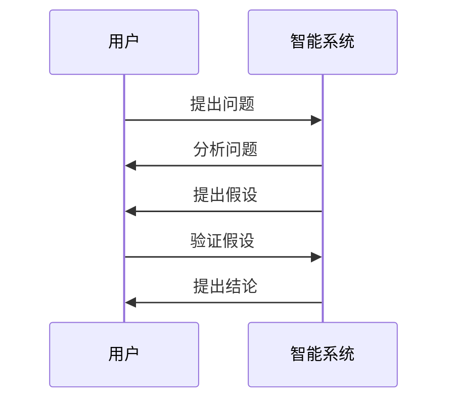

                 

### 第一部分: 知识的人工智能模拟

#### 第1章: 人工智能与知识模拟概述

**引言**

人工智能（AI）作为计算机科学的一个分支，致力于开发能够模仿、扩展甚至超越人类智能的技术系统。人工智能的发展历程可以追溯到20世纪50年代，最初的目标是创建能够进行推理、学习、解决问题和进行决策的智能系统。随着计算能力的提升和算法的进步，人工智能取得了显著的成就，从简单的逻辑推理到复杂的深度学习，人工智能在诸多领域展现出了强大的潜力。

知识模拟是人工智能研究中的一个重要方向，旨在通过计算机系统模拟人类获取、存储和应用知识的过程。知识模拟不仅可以帮助人工智能系统更好地理解和解释人类语言、图像等信息，还能提高其在实际应用中的决策能力。

**人工智能的核心概念**

1. **机器学习与深度学习**

   机器学习是一种使计算机系统能够通过数据学习并做出决策或预测的方法。它主要包括监督学习、无监督学习和强化学习三类。监督学习通过已有的输入输出数据来训练模型，无监督学习则不依赖于标签数据，旨在发现数据中的隐含结构，而强化学习通过试错过程学习如何在特定环境中做出最优决策。

   深度学习是机器学习的一个分支，通过构建具有多个隐藏层的神经网络模型，实现自动特征提取和复杂模式的识别。深度学习在图像识别、语音识别和自然语言处理等领域取得了突破性进展。

2. **知识表示与推理机制**

   知识表示是人工智能中的关键问题之一，涉及如何将知识以计算机可理解的形式表示出来。常用的知识表示方法包括命题逻辑、产生式规则、语义网络和知识图谱等。

   推理机制是指基于知识表示，如何利用已有知识进行逻辑推导和问题求解。推理机制可分为基于规则的推理、基于模型的推理和基于数据驱动的推理。

**知识模拟的理论基础**

1. **模拟人类智能的挑战**

   模拟人类智能是人工智能领域的一个终极目标。然而，人类智能具有复杂性、灵活性和普适性等特点，这使得模拟工作面临巨大挑战。首先，人类智能具有高度的抽象能力和自我学习能力，能够从少量数据中快速归纳出通用规律。其次，人类智能具有跨领域的知识整合能力，能够在不同情境下灵活运用已有知识。此外，人类智能还具有情感、直觉和创造力等非理性因素，这些都是当前人工智能技术难以模拟的。

2. **知识模拟的关键技术**

   为了实现知识模拟，需要解决以下几个关键技术问题：

   - **知识获取与表示**：如何高效地从各种来源（如文本、图像、音频等）获取知识，并将其转化为计算机可处理的形式。
   - **知识存储与管理**：如何构建高效的知识库，实现知识的存储、检索和更新。
   - **知识推理与应用**：如何基于已有知识进行逻辑推理，生成新的结论，并应用于实际问题。

**知识模拟的体系结构**

知识模拟系统通常包括以下几个关键模块：

1. **知识获取与预处理**

   知识获取模块负责从各种数据源中提取知识。预处理模块则对获取的知识进行清洗、标准化和归一化等操作，以便后续处理。

2. **知识表示与存储**

   知识表示模块将预处理后的知识转化为计算机可理解的形式，如命题逻辑、产生式规则、语义网络或知识图谱等。知识存储模块负责将表示后的知识存储在数据库或知识库中，以便后续查询和更新。

3. **知识推理与应用**

   知识推理模块基于已有知识进行逻辑推导和问题求解，以生成新的结论。应用模块则将推理结果应用于实际问题，如智能问答、自然语言处理、决策支持等。

**知识模拟在人工智能中的应用场景**

1. **智能问答系统**

   智能问答系统是一种常见的人工智能应用场景，旨在为用户提供自动化的信息查询和回答服务。通过知识模拟技术，系统可以理解用户的问题，检索相关知识库，并生成准确的回答。

2. **自然语言处理**

   自然语言处理（NLP）是人工智能领域的一个重要分支，旨在使计算机能够理解和处理人类语言。知识模拟技术在NLP中发挥着重要作用，如词义消歧、实体识别、情感分析等。

3. **决策支持系统**

   决策支持系统（DSS）是一种辅助决策者进行决策的智能系统。通过知识模拟，DSS可以收集和分析大量数据，为决策者提供基于数据的建议和决策支持。

**总结**

知识模拟是人工智能研究中的一个重要方向，旨在通过计算机系统模拟人类获取、存储和应用知识的过程。知识模拟不仅在理论上具有重要意义，而且在实际应用中展现了广阔的前景。在接下来的章节中，我们将进一步探讨机器学习基础、深度学习架构、知识表示与推理以及智能模拟应用案例分析等内容。通过这些内容的学习，读者将能够更深入地理解知识模拟的原理和实现方法，为未来的人工智能发展奠定坚实基础。

#### 第2章: 机器学习基础

**引言**

机器学习（Machine Learning，ML）是人工智能（AI）的一个重要分支，其核心思想是通过算法从数据中学习规律，使计算机系统能够进行自动预测和决策。机器学习的研究始于20世纪50年代，随着计算能力的提升和数据规模的扩大，机器学习得到了迅猛发展，并广泛应用于图像识别、自然语言处理、推荐系统、金融预测等多个领域。

本章将介绍机器学习的基本概念、分类及其应用。通过理解这些基础知识，读者将能够更好地掌握机器学习的核心原理，并为后续章节的学习打下坚实的基础。

**机器学习的基本概念**

1. **学习与模型**

   学习是机器学习的核心概念，指的是通过分析数据，使计算机模型能够自动调整其参数，从而提高预测或分类的准确性。学习过程通常分为训练和测试两个阶段：

   - **训练**：在训练阶段，模型通过分析训练数据集，学习数据中的规律和模式，并调整内部参数以优化性能。
   - **测试**：在测试阶段，模型使用未参与训练的数据集来评估其性能，以验证学习结果的有效性。

2. **数据集**

   数据集是机器学习的基础，由输入特征和对应的标签组成。输入特征是模型进行预测或分类的依据，而标签则是实际的结果或目标。常见的数据集包括：

   - **监督学习数据集**：标签已知的训练数据集，用于训练监督学习模型。
   - **无监督学习数据集**：标签未知的数据集，用于训练无监督学习模型。
   - **强化学习数据集**：包含环境状态、动作和奖励信息的序列数据集，用于训练强化学习模型。

3. **模型评估**

   模型评估是判断模型性能的重要步骤。常用的评估指标包括：

   - **准确率（Accuracy）**：分类模型正确分类的样本数占总样本数的比例。
   - **精确率（Precision）**：分类模型预测为正类的样本中实际为正类的比例。
   - **召回率（Recall）**：分类模型预测为正类的样本中实际为正类的比例。
   - **F1分数（F1 Score）**：精确率和召回率的调和平均值。

**机器学习的分类**

1. **监督学习**

   监督学习是最常见的机器学习类型，其核心任务是构建一个预测模型，以预测未知数据的标签。监督学习可分为以下几类：

   - **回归分析（Regression）**：预测连续数值输出的模型，如线性回归、多项式回归等。
   - **分类（Classification）**：预测离散类标签的模型，如逻辑回归、支持向量机（SVM）等。
   - **决策树（Decision Tree）**：基于特征划分数据集，构建树形结构的分类或回归模型。
   - **集成方法（Ensemble Methods）**：通过组合多个基本模型，提高整体预测性能的方法，如随机森林、梯度提升树（GBDT）等。

2. **无监督学习**

   无监督学习旨在发现数据中的隐含结构和规律，不需要标签信息。常见的无监督学习方法包括：

   - **聚类（Clustering）**：将相似的数据点归为一类，如K均值聚类、层次聚类等。
   - **降维（Dimensionality Reduction）**：通过投影或压缩降低数据维度，如主成分分析（PCA）、t-SVD等。
   - **关联规则学习（Association Rule Learning）**：发现数据之间的关联关系，如Apriori算法、Eclat算法等。

3. **强化学习**

   强化学习是一种通过与环境互动，学习最优策略的机器学习方法。其核心任务是最大化长期奖励。强化学习可分为以下几类：

   - **值函数方法（Value Function Methods）**：通过学习状态-动作价值函数，优化策略。
   - **策略梯度方法（Policy Gradient Methods）**：直接优化策略的概率分布。
   - **模型预测方法（Model-Based Methods）**：构建环境模型，进行预测和规划。

**机器学习的应用场景**

1. **图像识别**

   图像识别是机器学习在计算机视觉领域的重要应用，旨在自动识别和分类图像中的物体。常见的图像识别任务包括人脸识别、车辆识别、医学影像分析等。

2. **自然语言处理**

   自然语言处理（NLP）是机器学习在语言领域的应用，旨在使计算机理解和生成人类语言。常见的NLP任务包括文本分类、情感分析、机器翻译、问答系统等。

3. **推荐系统**

   推荐系统通过分析用户行为和兴趣，为用户推荐相关商品、内容或服务。常见的推荐系统算法包括协同过滤、基于内容的推荐、混合推荐等。

4. **金融预测**

   金融预测是机器学习在金融领域的重要应用，旨在预测市场趋势、风险评估、信用评分等。常见的金融预测模型包括时间序列分析、回归分析、神经网络等。

**总结**

机器学习是人工智能的核心技术之一，通过从数据中学习规律，使计算机能够进行自动预测和决策。本章介绍了机器学习的基本概念、分类及其应用。在接下来的章节中，我们将进一步探讨线性回归、逻辑回归、决策树和神经网络等具体的机器学习算法。通过这些内容的学习，读者将能够更深入地理解机器学习的原理和实现方法，为实际应用奠定坚实基础。

#### 第3章: 深度学习架构

**引言**

深度学习（Deep Learning，DL）是机器学习的一个重要分支，通过构建具有多个隐藏层的神经网络模型，实现自动特征提取和复杂模式的识别。深度学习在图像识别、语音识别、自然语言处理等众多领域取得了突破性进展，成为人工智能领域的核心技术之一。本章将介绍深度学习的定义、重要性、层次结构以及常见的深度学习模型，帮助读者深入理解深度学习的原理和应用。

**深度学习的定义与重要性**

1. **定义**

   深度学习是一种基于多层神经网络的学习方法，通过逐层提取特征，实现对复杂数据的理解和表示。深度学习的核心思想是利用大规模数据和高性能计算资源，通过多层的非线性变换，自动提取数据中的特征和模式。

2. **重要性**

   深度学习在人工智能领域的重要性体现在以下几个方面：

   - **自动特征提取**：传统机器学习方法需要手动设计特征提取算法，而深度学习通过多层神经网络，能够自动学习数据中的低级到高级的特征，减轻了人工设计的负担。
   - **更强的泛化能力**：深度学习模型通过在大规模数据上训练，能够更好地泛化到未见过的数据，提高了模型的鲁棒性和适应性。
   - **高效的计算能力**：随着计算能力的提升和硬件加速技术的发展，深度学习模型可以在更短的时间内处理大量数据，提高了应用的效率。

**深度学习的层次结构**

1. **输入层（Input Layer）**

   输入层是神经网络的第一层，负责接收输入数据并将其传递到下一层。输入层通常是一个多维数组，每个元素代表一个输入特征。

2. **隐藏层（Hidden Layers）**

   隐藏层是神经网络的核心部分，负责对输入数据进行特征提取和变换。深度学习的名字就来源于其具有多个隐藏层。每个隐藏层都会对前一层的输出进行非线性变换，并生成新的特征表示。

3. **输出层（Output Layer）**

   输出层是神经网络的最后一层，负责生成最终输出结果。输出层的类型取决于具体的任务，如分类任务中输出层通常是多个类别概率分布，回归任务中输出层则是预测的连续数值。

**常见的深度学习模型**

1. **卷积神经网络（Convolutional Neural Network，CNN）**

   卷积神经网络是深度学习在计算机视觉领域的核心模型，通过卷积层、池化层和全连接层，实现对图像的层次化特征提取和分类。CNN在图像识别、物体检测和图像生成等方面取得了显著的成果。

2. **循环神经网络（Recurrent Neural Network，RNN）**

   循环神经网络是深度学习在序列数据处理领域的核心模型，通过循环结构，对序列数据进行逐时间步的处理和记忆。RNN在语言模型、语音识别和时间序列预测等方面表现出色。

3. **长短期记忆网络（Long Short-Term Memory，LSTM）**

   长短期记忆网络是RNN的一种变体，通过引入记忆单元和门控机制，解决了传统RNN在长序列依赖问题上的梯度消失和梯度爆炸问题。LSTM在语音识别、机器翻译和文本生成等领域得到了广泛应用。

4. **生成对抗网络（Generative Adversarial Network，GAN）**

   生成对抗网络由生成器和判别器两个对抗性网络组成，通过博弈过程生成逼真的数据。GAN在图像生成、风格迁移和视频生成等方面展现了强大的能力。

5. **Transformer模型**

   Transformer模型是一种基于自注意力机制的深度学习模型，通过多头自注意力机制和前馈神经网络，实现了对序列数据的全局依赖建模。Transformer在机器翻译、文本生成和图像识别等任务中表现出色。

**深度学习在人工智能中的应用**

1. **计算机视觉**

   计算机视觉是深度学习的重要应用领域之一，通过深度学习模型，可以实现图像分类、物体检测、人脸识别和图像生成等任务。

2. **自然语言处理**

   自然语言处理是深度学习的另一个重要应用领域，通过深度学习模型，可以实现文本分类、情感分析、机器翻译和问答系统等任务。

3. **语音识别与合成**

   语音识别与合成是深度学习在语音处理领域的应用，通过深度学习模型，可以实现语音到文本的转换和文本到语音的转换。

4. **推荐系统**

   推荐系统是深度学习在信息检索和推荐领域的应用，通过深度学习模型，可以实现个性化推荐和兴趣挖掘。

**总结**

深度学习作为一种强大的机器学习方法，通过构建多层神经网络，实现了对复杂数据的自动特征提取和模式识别。本章介绍了深度学习的定义、重要性、层次结构以及常见的深度学习模型，帮助读者深入理解深度学习的原理和应用。在未来的章节中，我们将继续探讨深度学习中的知识表示与推理、智能模拟应用案例分析等内容，进一步揭示深度学习在人工智能领域的广阔前景。

#### 第4章: 知识表示与推理

**引言**

知识表示与推理是人工智能领域的重要研究方向，旨在使计算机系统能够理解、存储和应用知识。知识表示关注如何将知识以计算机可处理的形式表示出来，而推理则是基于已有知识进行逻辑推导和问题求解的过程。本章将介绍知识表示的基本原理、推理机制以及相关的技术方法，帮助读者深入理解知识表示与推理在人工智能中的应用。

**知识表示的基本原理**

1. **知识表示的重要性**

   知识表示是人工智能的核心问题之一，它决定了人工智能系统能够理解和处理的信息类型以及处理能力。有效的知识表示能够提高系统的智能水平，使其更接近人类智能。

2. **知识表示的类型**

   知识表示可以分为基于符号的表示和基于概率的表示两种类型：

   - **基于符号的表示**：符号表示方法主要包括命题逻辑、产生式规则和语义网络等。命题逻辑通过符号表示事实和关系，产生式规则通过条件和结论来表示知识，语义网络通过节点和边来表示实体和关系。
   - **基于概率的表示**：概率表示方法主要包括贝叶斯网络和马尔可夫网络等。这些方法通过概率模型来表示不确定性和依赖关系。

3. **知识表示的挑战**

   知识表示面临着以下挑战：

   - **知识获取与表示**：如何从大量的非结构化数据中获取知识，并将其转化为计算机可理解的形式。
   - **知识一致性**：如何保证知识表示的一致性和完整性，避免矛盾和冗余。
   - **知识可扩展性**：如何设计灵活的知识表示方法，以适应不断增长的知识量和新的应用场景。

**推理机制**

1. **推理的基本概念**

   推理是从已知信息出发，通过逻辑推导得出新的结论的过程。推理可以分为两大类：确定性推理和不确定性推理。

   - **确定性推理**：确定性推理基于逻辑推理规则，从一组前提推导出结论。常见的推理方法包括演绎推理和归纳推理。
   - **不确定性推理**：不确定性推理考虑知识中的不确定性和模糊性，常见的推理方法包括贝叶斯推理、模糊推理和证据推理。

2. **推理方法**

   - **基于规则的推理**：基于规则的推理方法通过一组前提条件和结论来表示知识。常见的推理算法包括反演推理和正向推理。
   - **基于模型的推理**：基于模型的推理方法通过构建模型来表示知识，并通过模型进行推理。常见的推理算法包括模型检测和模型推理。
   - **数据驱动的推理**：数据驱动的推理方法通过分析数据集，从数据中学习推理规则。常见的推理方法包括聚类分析和关联规则学习。

**知识表示与推理的应用**

1. **智能问答系统**

   智能问答系统是知识表示与推理的重要应用之一，通过构建知识库和推理引擎，实现对用户问题的自动回答。常见的智能问答系统包括基于关键词匹配、基于语义分析和基于知识图谱的系统。

2. **自然语言处理**

   自然语言处理是知识表示与推理在语言领域的应用，通过构建语言模型和语义分析模型，实现对文本的理解和生成。常见的自然语言处理任务包括词性标注、句法分析、语义角色标注和机器翻译等。

3. **决策支持系统**

   决策支持系统是知识表示与推理在决策领域的应用，通过构建知识库和推理模型，为决策者提供基于数据的决策支持。常见的决策支持系统包括市场分析系统、风险评估系统和投资决策系统等。

**总结**

知识表示与推理是人工智能领域的关键技术，通过有效的知识表示和推理机制，可以提升人工智能系统的智能水平和应用能力。本章介绍了知识表示的基本原理、推理机制以及相关技术方法，帮助读者深入理解知识表示与推理在人工智能中的应用。在未来的章节中，我们将进一步探讨知识表示与推理在智能模拟应用案例分析中的具体应用，展示其在实际场景中的价值。

#### 第5章: 智能模拟应用案例分析

**引言**

智能模拟应用案例分析是验证和展示人工智能技术在实际场景中应用效果的重要环节。通过具体的案例，我们可以深入理解知识模拟的原理和实现方法，分析其在不同领域中的优势和挑战。本章将介绍几个典型的智能模拟应用案例，包括智能问答系统、决策支持系统和自然语言处理应用，通过详细的系统设计、实现细节和效果评估，帮助读者了解智能模拟技术的实际应用。

**案例1: 智能问答系统**

**系统设计**

智能问答系统是一种常见的智能模拟应用，旨在为用户提供自动化的信息查询和回答服务。其核心组件包括知识库、问答引擎和用户接口。

1. **知识库**：知识库是智能问答系统的核心，用于存储各种领域的问题和答案。知识库的构建通常通过人工编辑和半自动化的方式，结合自然语言处理技术进行语义分析和标注。

2. **问答引擎**：问答引擎负责接收用户问题，理解其语义，并在知识库中检索相关的答案。问答引擎通常采用基于规则的方法、基于机器学习的方法或知识图谱的方法进行构建。

3. **用户接口**：用户接口负责接收用户输入，显示问答结果，并提供交互功能。用户接口可以是一个简单的文本界面，也可以是一个图形用户界面，或者是一个嵌入到其他应用中的组件。

**实现细节**

1. **知识库构建**：知识库构建是智能问答系统的关键步骤。首先，需要收集和整理各种领域的问题和答案，然后使用自然语言处理技术进行语义分析和标注，将问题和答案转化为计算机可处理的形式。

2. **问答引擎实现**：问答引擎的实现通常采用基于规则的方法，如模糊匹配和关键词匹配。此外，还可以结合机器学习算法，如监督学习和强化学习，提高问答系统的准确性和适应性。

3. **用户接口设计**：用户接口的设计应考虑用户体验，包括输入方式、输出格式和交互流程。例如，可以使用自然语言输入，并以文本、图表或语音等多种形式输出答案。

**效果评估**

智能问答系统的效果评估可以从多个维度进行：

1. **准确性**：评估问答系统回答问题的准确性，包括对用户意图的理解程度和答案的准确性。

2. **响应速度**：评估问答系统的响应速度，包括从接收用户问题到输出答案的时间。

3. **用户满意度**：评估用户对问答系统的满意度，可以通过用户调查、反馈等方式进行。

**案例2: 决策支持系统**

**系统设计**

决策支持系统是一种辅助决策者进行决策的智能系统，通过收集和分析数据，为决策者提供基于数据的建议和决策支持。其核心组件包括数据采集模块、数据分析模块和决策支持模块。

1. **数据采集模块**：数据采集模块负责收集各种类型的数据，如结构化数据、非结构化数据和实时数据。

2. **数据分析模块**：数据分析模块负责对收集到的数据进行分析和处理，包括数据清洗、数据预处理、数据分析和可视化。

3. **决策支持模块**：决策支持模块基于分析结果，生成决策建议和预测，并支持决策者进行决策。

**实现细节**

1. **数据采集**：数据采集可以通过自动化工具进行，如Web爬虫、API接口和数据交换等。

2. **数据分析**：数据分析可以采用多种方法，如统计分析、机器学习和数据挖掘等。常用的数据分析工具包括Python的Pandas库、R语言和SQL等。

3. **决策支持**：决策支持模块可以根据分析结果，生成决策建议和预测。例如，在金融领域，可以通过分析市场数据和用户行为，生成投资建议。

**效果评估**

决策支持系统的效果评估可以从以下方面进行：

1. **决策质量**：评估决策建议的准确性和可行性，以及决策结果的实际效果。

2. **响应时间**：评估系统生成决策建议的响应时间，包括数据采集、分析和输出等环节。

3. **用户满意度**：评估用户对决策支持系统的满意度，包括系统易用性、决策建议的实用性和准确性等。

**案例3: 自然语言处理应用**

**系统设计**

自然语言处理（NLP）应用是一种利用人工智能技术理解和处理自然语言的应用。其核心组件包括文本预处理模块、语义分析模块和语言生成模块。

1. **文本预处理模块**：文本预处理模块负责对原始文本进行清洗、分词、词性标注等预处理操作，以便后续语义分析。

2. **语义分析模块**：语义分析模块负责对预处理后的文本进行分析，提取语义信息，如词义消歧、情感分析和语义角色标注等。

3. **语言生成模块**：语言生成模块负责根据分析结果生成自然语言文本，如机器翻译、文本生成和语音合成等。

**实现细节**

1. **文本预处理**：文本预处理可以采用多种方法，如正则表达式、基于词典的方法和机器学习方法等。

2. **语义分析**：语义分析可以采用深度学习模型，如循环神经网络（RNN）和变换器（Transformer）等，实现对文本的语义理解和分析。

3. **语言生成**：语言生成可以采用生成对抗网络（GAN）和自编码器（Autoencoder）等方法，生成自然语言文本。

**效果评估**

自然语言处理应用的效果评估可以从以下方面进行：

1. **准确性**：评估系统在语义分析和语言生成中的准确性，包括词义消歧、情感分析和翻译质量等。

2. **响应时间**：评估系统对文本输入的响应时间，包括预处理、分析和生成等环节。

3. **用户满意度**：评估用户对自然语言处理应用的使用体验和满意度。

**综合案例分析**

综合案例分析旨在展示智能模拟技术在多个领域的应用，分析其在不同场景中的优势和挑战。通过实际案例的展示，我们可以看到：

1. **技术优势**：智能模拟技术通过高效的算法和模型，实现了对复杂数据的处理和理解，提高了系统的智能化水平。

2. **应用挑战**：智能模拟技术在实际应用中面临着数据质量、模型复杂度和计算资源等挑战，需要不断优化和改进。

**总结**

智能模拟应用案例分析是验证和展示人工智能技术实际应用效果的重要环节。通过具体的案例，我们可以深入理解知识模拟的原理和实现方法，分析其在不同领域中的优势和挑战。在未来的发展中，智能模拟技术将继续在各个领域发挥重要作用，推动人工智能的进步和应用。

#### 第6章: 人工智能的挑战与未来发展

**引言**

随着人工智能技术的不断进步，其在社会各个领域的应用日益广泛，带来了巨大的经济效益和社会变革。然而，人工智能也面临着诸多挑战，包括技术层面的挑战和道德、伦理问题。本章将探讨人工智能在当前阶段所面临的挑战，以及未来可能的发展趋势和影响。

**人工智能面临的挑战**

1. **技术挑战**

   - **计算能力需求**：人工智能模型，特别是深度学习模型，对计算资源的需求极高。随着模型复杂度和数据量的增加，对硬件设施和计算资源的依赖更加显著。这要求不断开发更高效的算法和优化技术，以降低计算成本。
   - **数据质量**：数据是人工智能模型训练的基础，数据的质量直接影响模型的性能。不完整、不准确或存在偏见的数据可能导致模型训练失败或生成错误的预测。因此，如何获取高质量、多样化的数据是人工智能面临的重大挑战。
   - **算法透明性和可解释性**：随着人工智能系统的复杂度增加，其决策过程往往变得难以解释。对于涉及重要决策的领域，如医疗诊断、金融风险评估等，算法的透明性和可解释性显得尤为重要。

2. **道德与伦理问题**

   - **隐私保护**：人工智能在数据处理过程中，可能涉及到大量个人隐私信息。如何保护用户隐私，避免数据泄露和滥用，是人工智能领域面临的重要伦理问题。
   - **公平性与歧视**：人工智能系统在训练过程中可能会学习到数据中的偏见，导致在实际应用中产生歧视。例如，在招聘、信用评分和司法判决等场景中，如何确保系统的公平性和无歧视性，是一个亟待解决的问题。
   - **责任归属**：随着人工智能系统的自主性提高，当系统出现错误或造成损害时，如何确定责任归属成为了一个复杂的法律和伦理问题。

**人工智能的未来发展趋势**

1. **技术趋势**

   - **量子计算**：量子计算具有处理大数据和复杂问题的潜力，未来可能成为人工智能的重要计算基础。
   - **神经形态计算**：神经形态计算通过模拟人脑的计算方式，提高计算效率和处理能力，有望在未来实现更高效的智能系统。
   - **自动化机器学习**：自动化机器学习（AutoML）旨在自动化模型选择、超参数优化和模型评估等过程，降低人工智能开发的门槛。

2. **应用前景**

   - **智能制造**：人工智能在智能制造中的应用，包括自动化生产线、预测维护和智能优化，将显著提高生产效率和产品质量。
   - **健康医疗**：人工智能在医疗领域的应用，如疾病诊断、药物研发和个性化治疗，有望提升医疗服务的质量和效率。
   - **智慧城市**：人工智能在城市管理中的应用，如交通流量优化、环境监测和公共安全，将提高城市的智能化水平。

**人工智能对社会的影响**

1. **经济影响**

   - **产业变革**：人工智能的广泛应用将推动各行业的数字化转型，促进产业升级和经济发展。
   - **就业影响**：人工智能的发展可能带来部分工作岗位的消失，但同时也会创造新的就业机会，如人工智能工程师和数据科学家等。

2. **社会问题**

   - **隐私安全**：人工智能技术的普及可能加剧隐私泄露和数据滥用的问题，需要制定更加严格的法律和伦理规范。
   - **社会公平**：人工智能的偏见和歧视问题可能加剧社会不平等，需要通过技术和社会手段进行治理。

**总结**

人工智能在当前阶段面临着技术、道德和伦理等多方面的挑战。未来，人工智能将继续在技术进步和社会应用中发挥重要作用，同时也需要应对和解决一系列社会问题。通过不断探索和优化，人工智能有望为社会带来更多的机遇和福祉。

#### 第7章: 总结与展望

**本书内容回顾**

本书系统地介绍了知识的人工智能模拟，从基础知识到实际应用，全面探讨了人工智能的核心概念、机器学习与深度学习、知识表示与推理以及智能模拟应用案例分析。具体回顾如下：

- **第1章**介绍了人工智能与知识模拟的概述，包括人工智能的定义、知识模拟的重要性以及知识模拟的理论基础。
- **第2章**讲解了机器学习的基本概念、分类及应用，包括线性回归、逻辑回归、决策树和神经网络等算法。
- **第3章**介绍了深度学习的定义、层次结构以及常见模型，如卷积神经网络（CNN）、循环神经网络（RNN）、生成对抗网络（GAN）和Transformer模型。
- **第4章**探讨了知识表示与推理的基本原理、推理机制以及其在智能问答系统、自然语言处理和决策支持系统中的应用。
- **第5章**通过具体案例展示了智能模拟技术的应用，包括智能问答系统、决策支持系统和自然语言处理应用。
- **第6章**分析了人工智能面临的挑战与未来发展，包括技术挑战、道德伦理问题以及未来的发展趋势。
- **第7章**对本书内容进行了总结，并对未来研究方向进行了展望。

**未来研究方向**

人工智能作为一门前沿学科，未来有着广阔的研究和应用前景。以下是几个可能的研究方向：

1. **自动化机器学习（AutoML）**：随着数据规模和复杂度的增加，自动化机器学习将成为一个重要研究方向。通过开发更智能的算法和工具，实现自动化的模型选择、超参数优化和模型评估，降低人工智能开发的门槛。

2. **知识图谱与语义网**：知识图谱与语义网技术在未来将进一步提升人工智能系统的智能化水平。通过构建更加完善和精确的知识图谱，实现知识的高效获取、表示和利用，为智能决策提供有力支持。

3. **增强学习**：增强学习作为一种能够在动态环境中学习的机器学习方法，具有广泛的应用前景。未来可以进一步研究如何将增强学习应用于更多实际问题，如机器人控制、智能推荐系统和自动驾驶等。

4. **人工智能伦理**：随着人工智能技术的广泛应用，伦理问题越来越受到关注。未来需要深入研究人工智能伦理，制定相关规范和标准，确保人工智能的发展既符合技术进步的需求，又符合社会伦理和道德原则。

**结论**

知识的人工智能模拟是人工智能领域的一个重要研究方向，通过将人类知识以计算机可处理的形式表示和利用，能够显著提升人工智能系统的智能水平和应用能力。本书从基础知识到实际应用，全面探讨了知识的人工智能模拟，为读者提供了一个系统性的学习和参考框架。未来，随着人工智能技术的不断进步，知识模拟将在更多领域展现其重要价值，推动人工智能的持续发展。

### 附录

**附录A: 知识的人工智能模拟相关工具与资源**

1. **深度学习框架与库**

   - TensorFlow：一个开源的深度学习框架，提供了丰富的API和工具，用于构建和训练各种深度学习模型。
   - PyTorch：一个流行的开源深度学习框架，以其动态计算图和简洁的API受到广泛关注。
   - Keras：一个高层次的深度学习框架，构建在TensorFlow和Theano之上，提供了更简洁、更易于使用的API。

2. **在线学习资源**

   - Coursera：提供大量的人工智能和机器学习在线课程，包括由世界顶尖大学和机构提供的专业课程。
   - edX：一个在线学习平台，提供由全球知名大学和机构提供的免费课程，包括人工智能、机器学习和深度学习等领域。
   - Udacity：提供各种在线课程和技术培训，包括深度学习、神经网络和自然语言处理等。

3. **相关书籍与论文**

   - 《深度学习》（Ian Goodfellow等）：一本经典的深度学习教材，详细介绍了深度学习的理论基础和实现方法。
   - 《机器学习》（Tom Mitchell）：一本经典的机器学习教材，涵盖了机器学习的基础知识、算法和案例。
   - 《人工智能：一种现代方法》（Stuart Russell & Peter Norvig）：一本全面的人工智能教材，介绍了人工智能的历史、理论基础和关键技术。

**附录B: Mermaid 流程图示例**

以下是一个简单的Mermaid流程图示例：



**附录C: 机器学习算法伪代码示例**

以下是一个简单的线性回归算法的伪代码示例：

```python
// 线性回归算法伪代码
function linear_regression(X, y):
    # 初始化参数
    theta = [0, 0]
    # 设置迭代次数和步长
    num_iterations = 1000
    learning_rate = 0.01
    # 梯度下降迭代
    for i = 1 to num_iterations:
        gradients = [0, 0]
        for j = 1 to n:
            gradients[0] += (theta[0] + theta[1]*X[j]) - y[j]
            gradients[1] += (theta[0] + theta[1]*X[j])*X[j] - y[j]
        theta = theta - learning_rate * gradients
    return theta
```

**附录D: 数学模型与公式**

以下是一些常见的数学模型和公式：

- **线性回归损失函数（均方误差）**：

  $$L = \frac{1}{m} \sum_{i=1}^{m} (h_\theta(x^i) - y^i)^2$$

- **逻辑回归损失函数（交叉熵损失）**：

  $$L = -\frac{1}{m} \sum_{i=1}^{m} [y^i \log(h_\theta(x^i)) + (1 - y^i) \log(1 - h_\theta(x^i))]$$

**附录E: 实际项目案例**

1. **智能问答系统**

   - **开发环境搭建**：使用Python和TensorFlow构建智能问答系统，需要安装Python、TensorFlow和其他相关库，如numpy和pandas。
   - **数据预处理**：收集和整理问答数据，进行清洗和预处理，如去除停用词、进行词干提取等。
   - **模型训练**：使用预处理后的数据训练问答模型，选择合适的模型架构和超参数。
   - **模型评估**：使用验证数据集评估模型性能，调整模型参数以优化性能。

2. **决策支持系统**

   - **架构设计**：设计系统的整体架构，包括数据采集、数据处理、分析和决策支持等模块。
   - **算法应用**：选择合适的算法和模型，如决策树、随机森林或神经网络，进行数据处理和预测。
   - **系统集成**：将各个模块集成到一起，构建完整的决策支持系统。

3. **自然语言处理应用**

   - **文本分类**：使用深度学习模型进行文本分类，如使用卷积神经网络（CNN）或变换器（Transformer）。
   - **情感分析**：使用情感分析模型对文本进行情感分类，识别文本的情感倾向。
   - **机器翻译**：使用序列到序列模型进行机器翻译，如使用Transformer模型。

**附录F: 进一步阅读指南**

1. **深度学习进阶**

   - **自动化机器学习（AutoML）**：研究自动化机器学习技术，实现更高效、更智能的模型选择和优化。
   - **强化学习**：研究强化学习算法，探索在动态环境中的智能决策和策略优化。

2. **知识表示与推理**

   - **本体论与语义网**：深入研究本体论和语义网技术，构建更加完善和精确的知识表示体系。
   - **知识图谱**：研究知识图谱的构建、存储和应用，探索知识图谱在智能模拟中的应用。

3. **自然语言处理**

   - **文本生成**：研究文本生成技术，如生成对抗网络（GAN）和自编码器（Autoencoder），实现高质量的自然语言生成。
   - **对话系统**：研究对话系统的设计和实现，探索智能对话系统的构建方法和应用场景。

4. **人工智能伦理**

   - **AI伦理框架**：研究AI伦理框架，制定相关的规范和标准，确保人工智能的发展符合伦理和道德原则。
   - **隐私保护**：研究隐私保护技术，如差分隐私和联邦学习，保护用户隐私和安全。

5. **相关论文与会议**

   - **NeurIPS**：人工智能和机器学习的顶级会议，发布最新的研究成果和进展。
   - **ICML**：机器学习的顶级会议，涵盖广泛的机器学习研究领域。
   - **JMLR**：机器学习的顶级期刊，发布高质量的机器学习论文。
   - **arXiv**：预印本平台，发布最新的学术研究成果。

通过以上进一步的阅读和学习，读者可以深入探索人工智能和知识模拟的各个方面，掌握更多的技术知识和实践经验，为未来的研究和应用打下坚实的基础。

