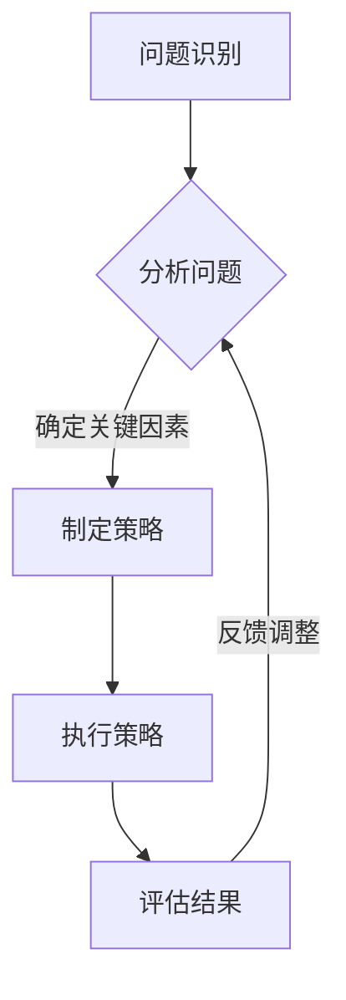
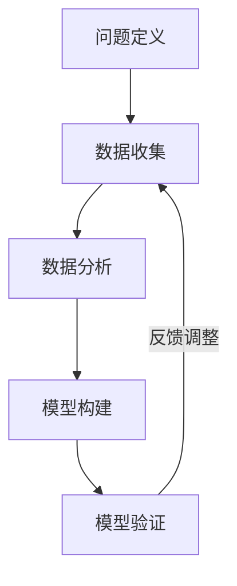

                 

# 知识复杂性科学：非线性思维的重要性

> **关键词：** 复杂性科学、非线性思维、知识复杂性、系统论、分形几何、网络科学、数据分析和知识发现、实验设计、非线性思维的培养与应用、创新与创业、未来展望。

> **摘要：** 本文旨在深入探讨知识复杂性科学的基本原理及其在现代社会中的应用，特别强调非线性思维的重要性。通过分析复杂性科学的起源与发展，我们揭示了知识复杂性在现代社会的重要性。随后，我们探讨了非线性思维的原理与应用，以及知识复杂性科学的方法论。最后，本文展示了知识复杂性科学在各个领域的应用案例，并展望了其未来的发展趋势。

## 第一部分：引言与背景介绍

### 第1章：复杂性科学的起源与发展

#### 1.1.1 复杂性科学的定义与特点

复杂性科学是研究复杂系统的学科，这些系统具有大量的组成部分和相互作用，呈现出高度的不确定性和难以预测的行为。复杂性科学的主要特点包括：

1. **复杂性**：系统中的组成部分和它们之间的相互作用非常复杂，难以用传统的线性方法进行描述。
2. **涌现性**：系统的整体行为和特性不能简单地从其组成部分的行为中推导出来，而是从整体涌现出来的。
3. **非线性**：系统中的相互作用往往是非线性的，这意味着小的变化可能会导致系统行为的巨大变化。
4. **自适应性和动态性**：复杂系统具有自我组织和自适应能力，能够动态地调整其结构和行为以适应环境变化。

#### 1.1.2 复杂性科学的起源

复杂性科学的起源可以追溯到20世纪中期。以下是一些关键事件和贡献者：

1. **系统论的诞生**：由贝塔朗菲（Ludwig von Bertalanffy）提出的系统论，为复杂性科学奠定了基础。
2. **混沌理论的兴起**：洛伦兹（Edward Lorenz）的发现揭示了混沌现象，即小变动可能导致大差异。
3. **分形几何的发展**：曼德勃罗（Benoit Mandelbrot）对分形几何的研究，揭示了自然界中复杂结构的自相似性。
4. **网络科学的兴起**：威廉·伊奇哥尼（Walter Willinger）等人对网络结构的研究，揭示了复杂网络的特性。

#### 1.1.3 知识复杂性的概念与重要性

知识复杂性是指知识系统中的复杂性，包括知识结构的复杂性、知识流动的复杂性以及知识应用的复杂性。知识复杂性在现代社会的重要性体现在以下几个方面：

1. **知识经济**：在知识经济时代，知识是经济活动的核心，知识复杂性的管理直接影响到企业和社会的创新和发展。
2. **科学前沿**：复杂性科学是科学的前沿领域，解决复杂性科学问题有助于推动科学和技术的发展。
3. **社会问题**：复杂性科学的方法和技术可以应用于解决社会问题，如环境污染、交通拥堵、公共卫生等。

#### 1.1.4 非线性思维的重要性

非线性思维是一种超越传统线性思维的方法，它强调系统的整体性和复杂性。非线性思维的重要性体现在以下几个方面：

1. **应对复杂性**：非线性思维能够帮助人们更好地理解和管理复杂系统，从而更有效地应对复杂性。
2. **创新思维**：非线性思维鼓励人们从不同的角度和层面思考问题，从而激发创新思维。
3. **决策支持**：非线性思维能够帮助决策者更好地分析复杂问题，制定更科学的决策。

### 第2章：知识复杂性科学的基本原理

#### 2.1.1 系统论与复杂性科学

系统论是研究系统性质和行为的学科，它为复杂性科学提供了理论基础。系统论的基本概念包括：

1. **系统**：由相互关联的元素组成的整体。
2. **反馈**：系统内部或系统之间的信息传递和相互作用。
3. **动态性**：系统的结构和行为随时间的变化。

系统论与复杂性科学的关联在于，系统论提供了一种框架，用于分析和理解复杂系统的行为。

#### 2.1.2 分形几何与复杂性科学

分形几何是研究不规则和复杂结构的学科，它揭示了自然界的自相似性和无限细节。分形几何在复杂性科学中的应用包括：

1. **模拟自然现象**：如流体动力学、气象学、生态学等。
2. **分析复杂系统**：如社会网络、生物网络、经济系统等。

分形几何的应用有助于揭示复杂系统的内在规律和特性。

#### 2.1.3 网络科学的基本原理

网络科学是研究网络结构和动态行为的学科，它涵盖了各种类型的网络，如社交网络、通信网络、生物网络等。网络科学的基本原理包括：

1. **网络结构**：网络的拓扑结构、节点和边的属性等。
2. **网络动态**：网络的演化过程、信息传播、故障容忍性等。
3. **网络分析**：网络的可视化、稳定性分析、优化等。

网络科学的应用有助于理解和优化复杂系统的行为。

#### 2.1.4 复杂性科学的数学模型

复杂性科学的数学模型是用于描述和预测复杂系统行为的工具。常见的数学模型包括：

1. **混沌模型**：用于描述非线性系统的长期行为。
2. **分形模型**：用于描述具有自相似性和无限细节的系统。
3. **网络模型**：用于描述网络结构和动态行为。

数学模型在复杂性科学中的应用有助于深入理解复杂系统的机制和规律。

### 第3章：非线性思维的重要性

#### 3.1.1 非线性思维的原理与特征

非线性思维是一种超越传统线性思维的思考方式，它强调系统的整体性和复杂性。非线性思维的原理和特征包括：

1. **整体性**：非线性思维强调系统的整体性，认为系统的整体行为不能简单地从其组成部分的行为中推导出来。
2. **复杂性**：非线性思维认为系统具有复杂性，其行为受到众多因素的非线性相互作用的影响。
3. **动态性**：非线性思维强调系统的动态性，认为系统的行为随时间变化而变化。

非线性思维的这些特征使其成为理解和处理复杂问题的有效工具。

#### 3.1.2 非线性思维的应用领域

非线性思维在多个领域有着广泛的应用，包括：

1. **科学领域**：如物理学、生物学、化学等，非线性思维有助于理解和预测复杂系统的行为。
2. **技术领域**：如人工智能、机器学习、数据科学等，非线性思维有助于设计更有效的算法和模型。
3. **社会领域**：如经济学、社会学、政治学等，非线性思维有助于理解和预测社会现象。

非线性思维在这些领域中的应用有助于解决复杂问题，推动科学和社会的发展。

#### 3.1.3 非线性思维在管理决策中的作用

非线性思维在管理决策中扮演着重要角色，其作用体现在：

1. **问题识别**：非线性思维能够帮助管理者识别复杂问题中的关键因素。
2. **决策制定**：非线性思维能够帮助管理者制定更科学的决策，避免因线性思维导致的偏差。
3. **风险管理**：非线性思维能够帮助管理者识别和管理复杂系统的风险。

非线性思维在管理决策中的应用有助于提高决策的科学性和有效性。

### 第4章：知识复杂性科学的应用案例

#### 4.1.1 生物医学领域的应用

知识复杂性科学在生物医学领域有着广泛的应用，以下是一些案例：

1. **疾病预测**：通过分析患者的基因组数据、病历记录等，利用复杂性科学的模型进行疾病预测，有助于早期诊断和干预。
2. **药物设计**：利用复杂性科学的模型和算法进行药物设计，提高药物的研发效率和成功率。
3. **生物网络分析**：通过分析生物网络的结构和动态行为，揭示生物分子之间的相互作用和调控机制。

知识复杂性科学在生物医学领域中的应用有助于提高医学研究水平和医疗服务质量。

#### 4.1.2 社会科学领域的应用

知识复杂性科学在社会科学领域也有着重要的应用，以下是一些案例：

1. **社会网络分析**：通过分析社会网络的结构和动态行为，揭示社会关系的形成和演变规律。
2. **群体行为研究**：通过复杂性科学的模型和算法研究群体行为，如流行病的传播、社会运动等。
3. **经济预测**：利用复杂性科学的模型和算法进行经济预测，提高经济决策的科学性和准确性。

知识复杂性科学在社会科学领域中的应用有助于深入理解社会现象，为社会发展提供科学依据。

#### 4.1.3 工程领域的应用

知识复杂性科学在工程领域也有着广泛的应用，以下是一些案例：

1. **复杂系统设计**：利用复杂性科学的模型和算法进行复杂系统的设计和优化，如航空发动机、智能交通系统等。
2. **故障预测**：通过分析系统的运行数据，利用复杂性科学的模型和算法进行故障预测，提高系统的可靠性和安全性。
3. **智能控制**：利用非线性控制和复杂性科学的模型进行智能控制，提高控制系统的精度和响应速度。

知识复杂性科学在工程领域中的应用有助于提高工程设计的效率和可靠性。

### 第5章：知识复杂性科学的方法论

#### 5.1.1 知识复杂性研究的方法论

知识复杂性研究的方法论包括以下几个方面：

1. **系统分析**：通过分析复杂系统的结构和行为，揭示系统的内在规律和特性。
2. **数据驱动**：利用大量数据进行分析和建模，发现知识复杂性的规律和趋势。
3. **模型构建**：通过建立数学模型和计算模型，模拟复杂系统的行为和演化。
4. **实验验证**：通过实验验证模型的预测和解释能力，不断优化和改进模型。

知识复杂性研究的方法论特点在于其综合性、动态性和跨学科性。

#### 5.1.2 数据分析与知识发现

数据分析和知识发现是知识复杂性研究的重要方法，其基本概念包括：

1. **数据分析**：通过对数据进行处理、分析和解释，提取有用的信息和知识。
2. **知识发现**：从大量数据中自动发现有趣的知识模式、关联和规律。

数据分析和知识发现的方法与工具包括：

1. **统计分析**：如回归分析、聚类分析、主成分分析等。
2. **机器学习**：如监督学习、无监督学习、强化学习等。
3. **数据可视化**：如散点图、折线图、热力图等。

数据分析和知识发现有助于揭示知识复杂性的规律和趋势，为复杂系统的研究和应用提供支持。

#### 5.1.3 知识复杂性科学的实验设计

知识复杂性科学的实验设计应遵循以下基本原则：

1. **科学性**：实验设计应基于科学原理和理论框架，确保实验结果的可信度和可靠性。
2. **可控性**：实验设计应尽可能控制变量，确保实验结果的准确性。
3. **可重复性**：实验设计应具备可重复性，确保其他研究者可以验证实验结果。
4. **经济性**：实验设计应在保证科学性和可控性的前提下，尽可能节约资源和时间。

知识复杂性科学的实验设计方法包括：

1. **实验室实验**：如实验室模拟、控制实验等。
2. **现场实验**：如实地观察、问卷调查等。
3. **混合实验**：结合实验室实验和现场实验，实现实验设计的目标。

知识复杂性科学的实验设计有助于验证理论模型的预测和解释能力，推动复杂性科学的发展。

### 第6章：非线性思维的培养与应用

#### 6.1.1 非线性思维的培养

非线性思维的培养方法包括以下几个方面：

1. **跨学科学习**：跨学科学习有助于拓宽知识面，提高对复杂系统的理解能力。
2. **案例学习**：通过学习经典案例，了解非线性思维在解决问题中的应用。
3. **问题驱动学习**：以问题为导向，培养从不同角度和层面思考问题的能力。
4. **实践锻炼**：通过实践项目，锻炼非线性思维的实际应用能力。

非线性思维的培养需要长期的实践和积累，不断探索和尝试新的思考方法。

#### 6.1.2 非线性思维的应用实践

非线性思维在个人成长中的应用：

1. **自我认知**：通过非线性思维，深入分析自己的兴趣、优点和不足，制定合理的个人发展计划。
2. **决策制定**：利用非线性思维，综合考虑各种因素，做出更科学和明智的决策。
3. **创新思考**：非线性思维有助于激发创新思维，提出独特的解决方案。

非线性思维在工作中的应用：

1. **团队协作**：通过非线性思维，促进团队成员之间的沟通和协作，提高团队效率。
2. **项目管理**：非线性思维有助于项目经理更好地应对复杂项目中的不确定性和风险。
3. **创新产品开发**：非线性思维有助于产品开发团队发现市场需求，提出创新的产品解决方案。

非线性思维在创新与创业中的应用：

1. **商业模式创新**：通过非线性思维，重新审视和优化商业模式，提高企业的竞争力和盈利能力。
2. **市场分析**：非线性思维有助于分析市场趋势和消费者需求，制定更有效的市场策略。
3. **风险管理**：非线性思维有助于识别和管理创业过程中的各种风险，提高创业成功率。

非线性思维在个人成长、工作、创新与创业中的应用，有助于提高个体和组织的创新能力，实现可持续发展。

#### 6.1.3 非线性思维的创新应用

非线性思维的创新应用包括：

1. **人工智能**：非线性思维在人工智能领域有着重要的应用，如神经网络、深度学习等。
2. **系统设计**：非线性思维有助于设计更复杂和灵活的系统，提高系统的适应性和可靠性。
3. **金融分析**：非线性思维在金融分析领域有着广泛的应用，如风险模型、期权定价等。

非线性思维的创新应用有助于推动科学、技术和社会的发展，创造更多价值。

### 第7章：知识复杂性科学的未来展望

#### 7.1.1 知识复杂性科学的发展趋势

知识复杂性科学的发展趋势包括：

1. **跨学科研究**：知识复杂性科学将不断与其他学科交叉融合，形成新的研究方向和应用领域。
2. **大数据分析**：随着大数据技术的发展，知识复杂性科学将更加依赖海量数据进行分析和建模。
3. **人工智能应用**：人工智能在知识复杂性科学中的应用将更加深入和广泛，提高研究的效率和准确性。
4. **可持续性发展**：知识复杂性科学将关注可持续发展问题，为环境保护、资源利用等提供科学依据。

#### 7.1.2 非线性思维的未来应用

非线性思维的未来应用包括：

1. **科学探索**：非线性思维将在科学探索中发挥更大的作用，揭示复杂系统的奥秘。
2. **技术创新**：非线性思维将推动技术创新，创造更多具有竞争力的产品和服务。
3. **管理优化**：非线性思维将应用于管理领域，提高决策的科学性和效率。
4. **社会问题解决**：非线性思维将帮助解决复杂的社会问题，如贫困、不平等、环境污染等。

非线性思维的未来应用将不断拓展其应用领域，为社会发展做出更大贡献。

#### 7.1.3 知识复杂性科学的社会影响

知识复杂性科学的社会影响体现在以下几个方面：

1. **科技创新**：知识复杂性科学为科技创新提供了理论基础和方法指导，推动了科学和技术的进步。
2. **经济发展**：知识复杂性科学为经济发展提供了新的动力和机会，促进了产业升级和经济增长。
3. **社会治理**：知识复杂性科学为社会治理提供了新的工具和方法，提高了社会管理的科学性和效率。
4. **可持续发展**：知识复杂性科学为可持续发展提供了科学依据和技术支持，推动了环境保护和资源利用的优化。

知识复杂性科学的社会影响将日益显著，为社会发展带来更多机遇和挑战。

## 附录

### 附录A：复杂性科学的参考资源

- **复杂性科学的经典著作**：

  1. 《系统论：一种研究复杂系统的科学方法》 作者：Ludwig von Bertalanffy
  2. 《混沌理论及其应用》 作者：James A. Yorke et al.
  3. 《分形几何学》 作者：Benoit Mandelbrot

- **复杂性科学的重要论文**：

  1. "On the Logical Foundations of Thermodynamics" 作者：Ludwig Boltzmann
  2. "The Structure of Dynamical Systems" 作者：Stephen Smale
  3. "The Theory of Communicability in Simple Lie Algebras" 作者：Mikhail Gromov

- **复杂性科学的在线课程与教程**：

  1. 复杂性科学导论，加州大学伯克利分校
  2. 分形几何学，麻省理工学院
  3. 网络科学，斯坦福大学

### 附录B：非线性思维的实践指南

- **非线性思维的训练方法**：

  1. 跨学科阅读：阅读不同领域的书籍，提高对复杂系统的理解能力。
  2. 问题驱动思考：以问题为导向，锻炼从不同角度和层面思考问题的能力。
  3. 案例分析：分析经典案例，了解非线性思维在解决问题中的应用。

- **非线性思维的实践案例**：

  1. **案例一**：产品设计中的非线性思维

    通过分析用户需求和市场趋势，提出创新的设计方案，提高产品的竞争力。

  2. **案例二**：项目管理中的非线性思维

    通过非线性思维，制定科学的项目计划，降低项目风险，提高项目成功率。

### 附录C：知识复杂性科学的研究工具

- **知识复杂性科学的主要研究工具**：

  1. **软件工具**：

    - Gephi：用于网络分析和数据可视化。
    - Mathematica：用于数学建模和计算。
    - R：用于数据分析。

  2. **硬件工具**：

    - GPU：用于加速计算和数据处理。
    - 云计算平台：如Amazon Web Services、Google Cloud Platform等。

- **数据分析工具**：

  1. **统计工具**：

    - SPSS：用于统计分析。
    - SAS：用于数据分析和报表生成。

  2. **机器学习工具**：

    - TensorFlow：用于深度学习和神经网络。
    - PyTorch：用于深度学习和计算机视觉。

### 附录D：非线性思维的Mermaid流程图

- **非线性思维的基本流程图**：

  ```mermaid
  graph TD
  A[问题识别] --> B{分析问题}
  B -->|确定关键因素| C[制定策略]
  C --> D[执行策略]
  D --> E[评估结果]
  E -->|反馈调整| B
  ```

- **非线性思维在特定领域中的应用流程图**：

  ```mermaid
  graph TD
  A[科学研究] --> B[问题定义]
  B --> C{数据收集}
  C --> D[数据分析]
  D --> E[模型构建]
  E --> F[模型验证]
  F -->|反馈调整| C
  ```

非线性思维的流程图有助于理解非线性思维的基本过程和应用场景。

### 作者

**作者：AI天才研究院/AI Genius Institute & 禅与计算机程序设计艺术 /Zen And The Art of Computer Programming**<|vq_10455|>### 第1章：复杂性科学的起源与发展

#### 1.1.1 复杂性科学的定义与特点

复杂性科学（Complexity Science）是一门跨学科的研究领域，旨在理解复杂系统的行为和性质。复杂系统是由大量相互作用的组件组成的，这些组件可以以非线性、非均匀和自适应的方式相互影响。复杂性科学的定义和特点可以从以下几个方面进行阐述：

**定义：**

复杂性科学是对复杂系统的性质、行为和相互作用进行跨学科研究的科学。它涉及多个学科，包括物理学、生物学、计算机科学、工程学、经济学和社会科学等。复杂性科学的核心是研究系统的整体行为，这些行为无法从单独的组件或线性的相互作用中推导出来。

**特点：**

1. **涌现性（Emergence）**：复杂性科学的一个重要特点是涌现性，即复杂系统的整体行为和特性不能简单地从其组成部分的行为中推导出来，而是从系统内部或跨系统的相互作用中自然涌现。

2. **非线性（Nonlinearity）**：复杂系统中的相互作用通常是非线性的，这意味着小的变化可能会导致系统行为的巨大变化。非线性相互作用是复杂性科学的核心概念之一，它解释了为什么复杂系统的行为难以预测。

3. **自适应性和动态性（Adaptability and Dynamics）**：复杂系统具有自我组织和自适应能力，能够动态地调整其结构和行为以适应环境变化。这种适应性使得复杂系统能够在不确定和动态的环境中生存和演化。

4. **复杂结构（Complex Structure）**：复杂系统通常具有复杂的结构和多层次的组织，包括各种层次和尺度的相互作用。这些相互作用形成了复杂的网络和图结构，这是复杂性科学研究的重点之一。

5. **不可还原性（Irreducibility）**：复杂系统是不可还原的，这意味着系统的整体行为不能简化为其组成部分行为的简单叠加。因此，理解复杂系统的行为需要考虑系统内所有组件的相互作用和关系。

6. **跨学科性（Interdisciplinarity）**：复杂性科学是一门跨学科的研究领域，它需要整合来自不同学科的理论、方法和工具。这种跨学科性使得复杂性科学能够更好地理解复杂系统的多样性和复杂性。

#### 1.1.2 复杂性科学的起源

复杂性科学的发展可以追溯到20世纪中期，当时科学家们开始认识到传统线性方法在解释复杂系统行为方面的局限性。以下是一些关键事件和贡献者：

**1. 系统论的诞生：**

系统论（Systems Theory）是由匈牙利生物学家贝塔朗菲（Ludwig von Bertalanffy）在20世纪40年代提出的。系统论为复杂性科学奠定了理论基础，强调了系统的整体性和层次结构。贝塔朗菲提出了“开放系统”和“反馈机制”等重要概念，这些概念对后来的复杂性科学研究产生了深远影响。

**2. 混沌理论的兴起：**

混沌理论（Chaos Theory）是复杂性科学的一个重要分支，它在20世纪中叶逐渐形成。美国气象学家洛伦兹（Edward Lorenz）在研究天气模型时发现了混沌现象，即初始条件的微小变化可能导致系统行为的巨大差异。洛伦兹的发现揭示了复杂系统的不可预测性和复杂性。

**3. 分形几何的发展：**

分形几何（Fractal Geometry）是由数学家曼德勃罗（Benoit Mandelbrot）在20世纪70年代提出的。分形几何研究不规则和复杂的几何形状，这些形状在自然界和人工系统中广泛存在。曼德勃罗的著作《分形几何学》对复杂性科学的发展产生了重要影响。

**4. 网络科学的兴起：**

网络科学（Network Science）是20世纪末和21世纪初发展起来的一个跨学科研究领域。网络科学关注网络的结构、动态行为和功能，包括社交网络、通信网络、交通网络等。威廉·伊奇哥尼（Walter Willinger）等人对网络结构的研究揭示了复杂网络的特性，为复杂性科学提供了新的研究方法和视角。

**5. 考场效应：**

考场效应（Cavendish Laboratory）是英国剑桥大学的一个研究机构，它在20世纪中叶成为复杂性科学的重要研究中心。考场效应的科学家们通过研究原子、分子和凝聚态物理，发现了复杂系统的许多基本特性，如相变、临界现象和自组织现象。

这些关键事件和贡献者共同推动了复杂性科学的发展，使其成为一门独立且日益重要的科学领域。

#### 1.1.3 知识复杂性的概念与重要性

知识复杂性（Knowledge Complexity）是指知识系统中的复杂性，包括知识结构的复杂性、知识流动的复杂性以及知识应用的复杂性。知识复杂性在现代社会中具有非常重要的地位，主要体现在以下几个方面：

**概念：**

知识复杂性是指知识系统中的结构和动态行为的复杂性。这种复杂性体现在知识的多层次组织、不同知识单元之间的相互作用、知识的动态更新和演化等方面。

1. **知识结构复杂性**：知识结构复杂性是指知识系统内部的组织和层次结构，包括知识的分类、层次和关系等。复杂的知识结构使得知识的获取、存储和应用变得困难。

2. **知识流动复杂性**：知识流动复杂性是指知识在系统内部和系统之间的传递和交流过程。复杂的知识流动路径和交互模式使得知识的传播和共享变得更加复杂。

3. **知识应用复杂性**：知识应用复杂性是指知识在实际应用过程中的复杂性和不确定性。知识的应用涉及到多种因素，如环境、情境、用户需求等，这些因素使得知识的应用变得复杂。

**重要性：**

1. **知识经济**：在知识经济时代，知识是经济活动的核心，知识复杂性的管理直接影响到企业和社会的创新和发展。知识复杂性科学为知识管理和创新提供了理论和方法支持。

2. **科学前沿**：复杂性科学是科学的前沿领域，解决复杂性科学问题有助于推动科学和技术的发展。知识复杂性科学的研究有助于揭示复杂系统的规律和机制，为科学探索提供新的视角。

3. **社会问题**：复杂性科学的方法和技术可以应用于解决社会问题，如环境污染、交通拥堵、公共卫生等。知识复杂性科学为社会治理和政策制定提供了科学依据。

4. **教育创新**：知识复杂性科学的教育理念和方法有助于培养学生的创新思维和综合能力，促进教育改革。

5. **组织管理**：知识复杂性科学的方法和技术可以应用于组织管理，提高组织的适应性和创新能力。非线性思维在管理决策中的作用越来越重要。

总之，知识复杂性科学在现代社会中具有广泛的应用前景和深远的影响，是推动社会发展和进步的重要科学领域。

#### 1.1.4 非线性思维的重要性

非线性思维（Nonlinear Thinking）是一种超越传统线性思维的思考方式，它强调系统的整体性和复杂性。非线性思维在复杂性科学中具有重要的地位，其重要性体现在以下几个方面：

**定义与特点：**

非线性思维是一种非线性的、动态的、系统的思考方式，它强调整体性和相互作用。非线性思维的特点包括：

1. **整体性**：非线性思维强调系统的整体性，认为系统的整体行为不能简单地从其组成部分的行为中推导出来，而是从系统内部的相互作用和整体结构中涌现出来的。

2. **动态性**：非线性思维认为系统的行为是动态的，会随着时间和环境的变化而变化。非线性思维能够更好地捕捉和描述复杂系统的动态特性。

3. **适应性**：非线性思维强调系统的自适应性和灵活性，认为系统能够通过自我组织和调整来适应环境变化。

4. **非均匀性**：非线性思维认为系统的相互作用是非均匀的，不同的相互作用会以不同方式影响系统的行为。非线性思维能够更好地描述复杂系统的非均匀性。

5. **非线性的因果关系**：非线性思维认为因果关系是非线性的，小的变化可能会导致系统行为的巨大变化。非线性思维能够更好地理解复杂系统中的因果关系。

**在复杂性科学中的应用：**

非线性思维在复杂性科学中的应用主要体现在以下几个方面：

1. **系统建模**：非线性思维有助于建立复杂系统的模型，这些模型能够更好地捕捉系统的复杂性和动态行为。

2. **问题解决**：非线性思维能够帮助人们更好地理解和解决复杂问题，特别是在系统分析、决策制定和风险管理等方面。

3. **创新思维**：非线性思维鼓励人们从不同的角度和层面思考问题，激发创新思维，提出新的解决方案。

4. **预测和模拟**：非线性思维能够帮助科学家和工程师更好地预测和模拟复杂系统的行为，为实际应用提供科学依据。

5. **跨学科研究**：非线性思维有助于跨学科研究的开展，通过整合不同领域的知识和方法，解决复杂科学问题。

总之，非线性思维在复杂性科学中具有重要作用，是理解和处理复杂问题的重要工具。随着复杂性科学的发展，非线性思维的重要性将日益凸显。

### 第2章：知识复杂性科学的基本原理

#### 2.1.1 系统论与复杂性科学

系统论（Systems Theory）是复杂性科学的基础，它提供了一种分析和理解复杂系统的框架。系统论的基本概念和原理对于理解知识复杂性具有重要意义。

**基本概念：**

1. **系统（System）**：系统是由相互关联的组件组成的整体，这些组件通过相互作用和关系形成一个有机整体。

2. **反馈（Feedback）**：反馈是系统内部或系统之间的信息传递和相互作用，它有助于系统维持稳定性和适应环境变化。

3. **层次结构（Hierarchical Structure）**：系统具有层次结构，从微观到宏观，每个层次都有其特定的功能和组织方式。

4. **开放系统（Open System）**：开放系统与外部环境进行物质、能量和信息交换，能够适应外部环境的变化。

5. **系统动态（System Dynamics）**：系统动态是指系统随时间变化的规律和行为，包括系统的稳定状态、波动和演化过程。

**原理与关联：**

1. **整体性原理**：系统的整体行为不能简单地从其组成部分的行为中推导出来，而是从系统内部和跨系统的相互作用中涌现出来的。

2. **反馈原理**：反馈是系统维持稳定性和适应环境变化的关键机制，它有助于调节系统的行为和状态。

3. **层次结构原理**：系统具有层次结构，不同层次之间相互关联和相互作用，共同决定了系统的行为和特性。

4. **开放性原理**：系统通过与外部环境的交换，能够吸收外部信息、资源和能量，从而提高系统的适应性和灵活性。

系统论与复杂性科学的关联在于，系统论为复杂性科学提供了理论基础和分析工具。复杂性科学通过系统论的方法，研究复杂系统的结构、动态行为和相互作用，揭示系统的复杂性和涌现现象。系统论的概念和原理在复杂性科学中得到了广泛应用，如系统建模、系统分析、系统优化等。

#### 2.1.2 分形几何与复杂性科学

分形几何（Fractal Geometry）是研究不规则和复杂几何形状的数学分支，它在复杂性科学中有着重要应用。分形几何的基本概念和原理对于理解知识复杂性具有重要意义。

**基本概念：**

1. **分形（Fractal）**：分形是具有自相似性和无限细节的几何形状，其局部与整体具有相似的统计性质。

2. **自相似性（Self-Similarity）**：自相似性是指分形的局部与整体在结构上具有相似性，无论放大或缩小，分形的基本特征保持不变。

3. **分形维数（Fractal Dimension）**：分形维数是衡量分形复杂性的一个指标，它介于经典几何维数（如一维、二维、三维）之间。

4. **分形生成（Fractal Generation）**：分形生成是通过迭代和自相似性构造分形形状的方法，如科赫曲线、曼德勃罗集等。

**应用与原理：**

1. **自然现象模拟**：分形几何可以用于模拟自然现象，如海岸线、山脉、森林、河流等，这些现象都具有自相似性和无限细节。

2. **复杂系统分析**：分形几何可以用于分析复杂系统的结构和行为，如社会网络、交通网络、生态系统等，这些系统的局部与整体具有相似性。

3. **数据可视化**：分形几何可以用于数据可视化，通过绘制分形图，帮助人们直观地理解复杂系统的结构和特性。

4. **分形维数分析**：分形维数分析是分形几何的核心内容，它可以帮助衡量系统的复杂性和多样性。

分形几何在复杂性科学中的应用主要体现在以下几个方面：

1. **分形模型建立**：通过建立分形模型，可以更好地理解和描述复杂系统的结构和行为。

2. **分形分析工具**：开发分形分析工具，如分形生成器、分形维数计算器等，用于研究和分析复杂系统。

3. **分形可视化**：通过分形可视化，帮助科学家和工程师直观地理解和解释复杂系统的特性。

分形几何与复杂性科学的关联在于，分形几何提供了一种分析和理解复杂系统的工具和方法。通过分形几何，可以更好地描述和解释复杂系统的自相似性、无限细节和复杂行为，从而深化对知识复杂性的理解。

#### 2.1.3 网络科学的基本原理

网络科学（Network Science）是研究网络结构和动态行为的跨学科领域，它在复杂性科学中占据重要地位。网络科学的基本概念和原理对于理解知识复杂性具有重要意义。

**基本概念：**

1. **网络（Network）**：网络是由节点（Node）和边（Edge）组成的结构，节点表示网络中的个体或实体，边表示节点之间的相互作用或关系。

2. **节点（Node）**：节点是网络中的基本单元，可以是实体、组织、个体等。

3. **边（Edge）**：边是连接节点的线段，表示节点之间的相互作用或联系。

4. **网络拓扑（Network Topology）**：网络拓扑是网络的几何结构，包括节点和边的排列和连接方式。

5. **网络属性（Network Properties）**：网络的属性包括度数（Degree）、聚类系数（Clustering Coefficient）、平均路径长度（Average Path Length）等，用于描述网络的结构和特性。

**基本原理：**

1. **小世界现象（Small-World Phenomenon）**：小世界现象是指网络中节点之间的平均路径长度较短，且网络具有较高的聚类系数。这种现象表明，虽然网络是高度分散的，但仍然存在许多短路径，使得节点之间能够快速通信和协作。

2. **无标度特性（Scale-Free Property）**：无标度特性是指网络中节点的度数分布服从幂律分布，即大多数节点具有较低的度数，而少数节点具有非常高的度数。无标度特性使得网络具有高度适应性、鲁棒性和抗毁性。

3. **网络动态（Network Dynamics）**：网络动态包括网络的生成、演化、传播和破坏过程，这些过程决定了网络的稳定性和可靠性。

4. **网络功能（Network Function）**：网络功能是指网络在信息传递、资源分配、社会互动等方面的作用和效能。

网络科学在复杂性科学中的应用主要体现在以下几个方面：

1. **网络建模**：通过建立网络模型，可以更好地理解和描述复杂系统的结构和行为。

2. **网络分析**：利用网络分析方法，可以识别网络的关键节点、关键路径和网络脆弱性。

3. **网络优化**：通过网络优化方法，可以改善网络的结构和性能，提高网络的稳定性和可靠性。

4. **网络模拟**：通过网络模拟，可以预测网络的行为和演化趋势，为实际应用提供科学依据。

网络科学的基本原理与复杂性科学的关联在于，网络科学提供了一种分析和理解复杂系统结构的工具和方法。通过网络科学的方法，可以更好地揭示复杂系统的结构特性、动态行为和功能特性，从而深化对知识复杂性的理解。

#### 2.1.4 复杂性科学的数学模型

复杂性科学依赖于数学模型来描述和解释复杂系统的行为和特性。数学模型是一种抽象的工具，通过数学表达式和算法，将复杂系统的各个方面转化为可计算和分析的形式。以下是一些常见的数学模型及其在复杂性科学中的应用：

**常见的数学模型：**

1. **动力学模型**：动力学模型用于描述系统的动态行为，包括系统的状态变量和状态转移关系。常见的动力学模型包括常微分方程（ODE）、差分方程（DE）、延迟微分方程（DDE）等。这些模型在生物学、物理学和社会科学等领域得到广泛应用。

2. **概率模型**：概率模型用于描述系统的随机行为，包括概率分布、随机过程、马尔可夫链等。这些模型在统计学、金融学、计算机科学等领域得到广泛应用。

3. **随机图模型**：随机图模型用于描述网络的随机结构，包括Erdős-Rényi图、巴贝吉图（Barabási-Albert图）等。这些模型在社交网络、通信网络、生物网络等领域得到广泛应用。

4. **分形模型**：分形模型用于描述系统的自相似结构和无限细节，包括分形几何、分形时间序列等。这些模型在自然现象模拟、复杂系统分析、图像处理等领域得到广泛应用。

5. **机器学习模型**：机器学习模型用于描述系统的学习和适应能力，包括神经网络、支持向量机、决策树等。这些模型在数据挖掘、预测分析、智能系统等领域得到广泛应用。

**数学模型在复杂性科学中的应用：**

1. **系统建模与仿真**：数学模型用于建立复杂系统的模型，并通过仿真分析系统的行为和特性。例如，在生物学中，利用常微分方程模型模拟生态系统的动态行为；在物理学中，利用随机图模型分析交通网络的稳定性。

2. **数据处理与可视化**：数学模型用于处理和分析复杂系统的数据，并通过可视化技术展示系统的结构和行为。例如，在社交网络分析中，利用概率模型分析用户的行为和关系；在图像处理中，利用分形模型增强图像的细节和清晰度。

3. **优化与控制**：数学模型用于优化复杂系统的结构和行为，并通过控制算法实现系统的稳定性和性能。例如，在通信网络中，利用网络优化模型提高网络的吞吐量和可靠性；在机器人控制中，利用机器学习模型实现机器人的自主导航和动作。

4. **预测与决策**：数学模型用于预测复杂系统的未来行为和趋势，并为决策提供科学依据。例如，在金融市场分析中，利用概率模型预测股价波动；在公共卫生管理中，利用动力学模型预测疫情传播趋势。

数学模型在复杂性科学中的应用有助于揭示复杂系统的内在规律和机制，为复杂系统的研究和应用提供理论支持和实践工具。通过不断发展和完善数学模型，复杂性科学将能够更好地理解和应对复杂系统的挑战。

### 第3章：非线性思维的重要性

#### 3.1.1 非线性思维的原理与特征

非线性思维（Nonlinear Thinking）是一种超越传统线性思维的思考方式，它强调系统的整体性和复杂性。非线性思维的原理和特征使其在解决复杂问题、推动创新思维和管理决策中具有重要价值。

**原理：**

非线性思维基于以下原理：

1. **整体性原理**：非线性思维强调系统的整体性，认为系统的整体行为不能简单地从其组成部分的行为中推导出来。非线性思维认为，系统中的各个部分之间存在着复杂的相互作用和反馈机制，这些相互作用和反馈共同决定了系统的整体行为。

2. **动态性原理**：非线性思维认为系统的行为是动态的，会随着时间和环境的变化而变化。非线性思维能够更好地捕捉和描述复杂系统的动态特性，如振荡、波动和突变等。

3. **适应性原理**：非线性思维强调系统的自适应性和灵活性，认为系统能够通过自我组织和调整来适应环境变化。非线性思维能够帮助人们更好地理解复杂系统的适应性机制，从而提高系统的稳定性和可靠性。

4. **非线性的因果关系**：非线性思维认为因果关系是非线性的，小的变化可能会导致系统行为的巨大变化。非线性思维能够更好地理解复杂系统中的非线性因果关系，从而更有效地解决复杂问题。

**特征：**

非线性思维具有以下特征：

1. **复杂性**：非线性思维能够处理复杂问题，特别是那些涉及多种因素、非线性相互作用和不确定性的问题。

2. **动态性**：非线性思维能够捕捉系统的动态行为，包括系统的波动、振荡和突变等。

3. **非线性因果关系**：非线性思维能够理解复杂系统中的非线性因果关系，从而更有效地解决复杂问题。

4. **整体性**：非线性思维强调系统的整体性，认为系统的整体行为不能简单地从其组成部分的行为中推导出来。

5. **适应性**：非线性思维能够帮助系统通过自我组织和调整来适应环境变化。

6. **跨学科性**：非线性思维跨越不同学科，综合运用多种理论和工具来解决问题。

非线性思维的特征使其成为解决复杂问题和推动创新思维的有效工具。在科学、工程、管理和社会等领域，非线性思维的运用能够带来新的发现、创新和进步。

#### 3.1.2 非线性思维的应用领域

非线性思维在多个领域有着广泛的应用，其独特的视角和方法帮助人们更好地理解和解决复杂问题。以下是一些非线性思维在主要应用领域中的应用：

**科学领域：**

1. **物理学**：非线性思维在物理学中有着重要应用，特别是在混沌理论和非线性动力学中。例如，洛伦兹吸引子（Lorenz Attractor）是一个经典的非线性系统，它展示了非线性相互作用如何导致系统的复杂行为。

2. **生物学**：非线性思维在生物学中用于研究生态系统、进化过程和神经系统的复杂性。例如，生物学家使用非线性模型来模拟生态系统的动态行为，如食物链和食物网中的相互作用。

3. **化学**：非线性思维在化学中用于研究化学反应的动力学和复杂性。例如，化学反应中的相变和突变现象可以通过非线性动力学模型来描述。

**技术领域：**

1. **人工智能**：非线性思维在人工智能和机器学习中有着广泛应用。深度学习中的神经网络模型基于非线性激活函数，如ReLU（Rectified Linear Unit）和Sigmoid函数，这些函数能够捕捉数据的复杂特征和模式。

2. **计算机科学**：非线性思维在计算机科学中用于解决复杂算法问题，如网络优化、密码学和算法设计。例如，复杂网络中的路由问题和网络安全问题可以通过非线性优化模型来处理。

3. **工程**：非线性思维在工程领域中用于设计和优化复杂系统，如航空发动机、智能交通系统和机器人控制。例如，非线性控制理论用于设计能够应对不确定性和扰动的控制系统。

**社会领域：**

1. **经济学**：非线性思维在经济学中用于分析金融市场、经济周期和社会行为。例如，非线性和混沌理论可以用于预测经济波动和市场行为。

2. **社会学**：非线性思维在社会学中用于研究社会网络的动态行为和群体行为。例如，通过分析社交网络中的节点和边的关系，可以揭示社会运动的传播机制。

3. **管理学**：非线性思维在管理学中用于战略规划、决策制定和组织管理。例如，通过非线性思维方法，管理者可以更好地理解组织中的复杂关系和动态变化，从而制定更有效的管理策略。

非线性思维的应用领域广泛，从科学到技术，再到社会领域，它为理解和解决复杂问题提供了新的视角和方法。随着非线性思维的深入研究和应用，它将在各个领域中发挥更大的作用。

#### 3.1.3 非线性思维在管理决策中的作用

非线性思维在管理决策中扮演着至关重要的角色，它帮助管理者更好地理解和处理复杂、动态和多变的环境。以下是一些非线性思维在管理决策中的作用：

**1. 识别复杂问题：**

非线性思维能够帮助管理者识别和定义复杂问题。传统线性思维往往将问题简化为一系列因果关系，而非线性思维则能够捕捉到系统中的复杂互动和多重反馈循环。通过非线性思维，管理者能够更全面地理解问题的背景和本质，从而提出更准确的解决方案。

**2. 提高决策质量：**

非线性思维能够提高决策的质量。在复杂环境中，线性思维可能导致简化模型和单一视角，从而忽视关键因素和潜在风险。非线性思维则鼓励管理者考虑多种可能的情境和结果，并通过迭代和适应过程来优化决策。这种方法有助于减少决策偏差，提高决策的灵活性和适应性。

**3. 风险管理：**

非线性思维在风险管理中具有重要作用。在复杂系统中，风险往往是动态的、相互关联的，并且可能以非线性的方式放大。非线性思维能够帮助管理者识别和评估潜在风险，理解风险的复杂性和相互影响。通过这种方法，管理者可以制定更有效的风险缓解策略，提高组织的抗风险能力。

**4. 创新思维：**

非线性思维能够激发创新思维。在传统线性思维中，创新往往被视为对现有流程和思维的改进，而非突破。非线性思维则鼓励管理者从不同角度和层面思考问题，探索全新的解决方案。这种方法有助于打破思维定势，激发创造力，从而推动组织创新。

**5. 管理动态变化：**

非线性思维能够帮助管理者更好地管理动态变化。在复杂环境中，变化是持续的、不可预测的，而线性思维往往难以应对这种动态性。非线性思维则能够帮助管理者适应快速变化的环境，通过不断调整和适应来维持组织的稳定性和灵活性。

**6. 促进跨学科合作：**

非线性思维强调跨学科合作，这对于解决复杂问题至关重要。在复杂问题中，不同的学科和领域往往有不同的视角和方法。非线性思维能够促进不同学科之间的交流和理解，通过整合多种知识和方法来提高决策的科学性和有效性。

**7. 支持战略规划：**

非线性思维在战略规划中也有重要作用。战略规划需要考虑组织的长期目标和未来趋势，这往往涉及到复杂和不确定的因素。非线性思维能够帮助管理者从多个角度和层面思考战略问题，通过系统分析来制定更具有前瞻性和适应性的战略计划。

总之，非线性思维在管理决策中具有多方面的应用价值，它帮助管理者更好地识别复杂问题、提高决策质量、管理风险、促进创新、适应动态变化、促进跨学科合作和支持战略规划。随着非线性思维的不断发展和应用，它将在管理领域发挥更大的作用。

### 第4章：知识复杂性科学的应用案例

#### 4.1.1 生物医学领域的应用

知识复杂性科学在生物医学领域有着广泛的应用，通过复杂性科学的方法和工具，研究人员能够更好地理解生物系统的复杂性，从而推动生物医学的发展。以下是一些具体的应用案例：

**1. 疾病预测和诊断：**

知识复杂性科学为疾病预测和诊断提供了新的方法。通过分析患者的基因组数据、临床表现和病史等，可以利用复杂性科学的模型和算法进行疾病预测。例如，利用混沌理论，可以预测某些疾病的发作时间和可能性；利用分形几何，可以分析肿瘤的生长过程和形态变化。此外，基于网络科学的分析可以帮助识别疾病的传播路径和关键节点，从而提高疾病诊断的准确性和效率。

**2. 药物设计和研发：**

知识复杂性科学在药物设计和研发中也有重要作用。复杂性科学的模型和算法可以用于预测药物的作用机制、筛选潜在药物分子，并优化药物分子结构。例如，利用分子动力学模拟，可以分析药物与生物大分子（如蛋白质、核酸）之间的相互作用，从而指导药物设计。此外，基于网络科学的方法可以分析药物作用网络，揭示药物在不同生物系统中的复杂作用机制。

**3. 系统生物学研究：**

系统生物学是研究生物系统整体行为和动态的跨学科领域，其核心是理解生物系统的复杂性和涌现现象。知识复杂性科学为系统生物学的研究提供了重要的理论和方法支持。通过建立和模拟生物系统的动态模型，研究人员可以更好地理解细胞信号传导、基因表达调控、代谢途径等生物过程的复杂机制。例如，利用复杂性科学的模型，可以模拟细胞凋亡过程中的复杂信号传导网络，从而揭示细胞凋亡的调控机制。

**4. 生物网络分析：**

生物网络分析是知识复杂性科学在生物医学领域的重要应用之一。生物网络包括基因组网络、蛋白质相互作用网络、代谢网络等，通过分析这些网络的结构和动态行为，可以揭示生物系统的功能和调控机制。例如，利用复杂网络分析方法，可以识别关键基因和关键蛋白质，揭示其在生物系统中的关键作用。此外，基于网络科学的方法可以研究疾病与基因、蛋白质等之间的相互作用关系，从而为疾病治疗提供新的思路和策略。

**5. 精准医学：**

精准医学是近年来生物医学领域的一个重要发展方向，它通过个性化医疗和基因治疗等技术，为患者提供更加精准和有效的治疗。知识复杂性科学在精准医学中有着重要应用。通过分析患者的基因组、表观基因组、转录组等数据，可以利用复杂性科学的模型和算法进行个体差异分析，从而为患者提供个性化的治疗方案。例如，利用混沌模型可以预测个体对药物的反应，从而优化药物剂量和治疗策略。

**总结：**

知识复杂性科学在生物医学领域的应用为疾病的预测、诊断、治疗和药物研发提供了新的方法和工具，推动了生物医学的发展。通过复杂性科学的模型和算法，研究人员可以更好地理解生物系统的复杂性和涌现现象，从而为生物医学的研究和应用提供强有力的支持。

#### 4.1.2 社会科学领域的应用

知识复杂性科学在社会科学领域有着广泛的应用，通过复杂性科学的方法和工具，研究人员能够更好地理解社会现象的复杂性和涌现机制，从而为社会科学的研究提供新的视角和方法。以下是一些具体的应用案例：

**1. 社会网络分析：**

社会网络分析是知识复杂性科学在社会科学领域的重要应用之一。社会网络分析通过构建和分析社会网络的拓扑结构，可以揭示社会关系的形成和演变规律。例如，通过分析社交网络中的节点和边，可以识别社会网络中的关键节点和关键路径，从而更好地理解社会影响力的传播和扩散机制。此外，社会网络分析还可以用于研究社会运动、网络犯罪和网络欺诈等问题。

**2. 群体行为研究：**

群体行为研究是复杂性科学在社会科学领域的一个重要应用方向。通过分析群体行为的数据，可以利用复杂性科学的模型和算法揭示群体行为的复杂模式和涌现现象。例如，利用混沌模型可以研究群体行为的波动和振荡现象，从而揭示群体行为的内在规律。此外，基于网络科学的分析方法可以研究群体行为中的协同效应和竞争关系，为制定社会政策和公共管理提供科学依据。

**3. 经济预测和风险管理：**

知识复杂性科学在经济学和金融学领域也有广泛应用。通过分析经济数据和市场行为，可以利用复杂性科学的模型和算法进行经济预测和风险管理。例如，利用分形模型可以预测金融市场中的波动和趋势，从而为投资决策提供依据。此外，基于网络科学的分析方法可以研究金融网络的结构和动态行为，揭示金融风险传播和传染机制，从而为金融监管和风险管理提供支持。

**4. 社会科学模型的构建：**

知识复杂性科学为社会科学模型的构建提供了新的方法和工具。通过建立复杂性科学模型，可以更好地模拟和预测社会现象的复杂行为。例如，利用系统动力学模型可以模拟社会系统的动态行为，从而研究社会问题的演化规律。此外，利用分形模型可以模拟社会网络的结构和功能，揭示社会网络的复杂性和涌现现象。

**5. 社会治理和政策分析：**

知识复杂性科学在社会治理和政策分析中也发挥着重要作用。通过分析社会现象的复杂性和涌现机制，可以为社会治理和政策制定提供科学依据。例如，通过分析社会网络中的节点和边，可以识别社会网络中的关键节点和关键路径，从而为政策制定提供参考。此外，利用复杂性科学的模型和算法可以评估政策的效果和影响，为政策优化提供支持。

**总结：**

知识复杂性科学在社会科学领域的应用为理解社会现象的复杂性和涌现机制提供了新的视角和方法，推动了社会科学的研究和发展。通过复杂性科学的模型和算法，研究人员可以更好地揭示社会现象的内在规律，为社会科学的研究和应用提供强有力的支持。

#### 4.1.3 工程领域的应用

知识复杂性科学在工程领域有着广泛的应用，通过复杂性科学的方法和工具，工程师们能够更好地理解和设计复杂系统，提高系统的性能和可靠性。以下是一些具体的应用案例：

**1. 复杂系统设计：**

复杂性科学为复杂系统设计提供了新的方法和工具。在复杂系统设计中，工程师需要考虑系统的整体性和复杂性，以及系统内部的各种非线性相互作用。例如，在航空发动机设计中，利用复杂性科学的模型和算法可以分析发动机内部的湍流和燃烧过程，优化发动机的性能和效率。此外，在智能交通系统中，利用复杂性科学的模型可以分析交通流的动态行为，优化交通信号控制策略，减少交通拥堵和提高交通效率。

**2. 故障预测与诊断：**

故障预测与诊断是工程领域中一个重要的研究方向。通过分析系统的运行数据，利用复杂性科学的模型和算法可以预测系统故障的发生，并提供诊断信息。例如，在机械设备维护中，利用时间序列分析方法可以预测设备的磨损程度，提前进行维护，避免设备故障。此外，在电子设备故障诊断中，利用复杂网络分析方法可以识别故障的关键节点和路径，提高故障诊断的准确性和效率。

**3. 网络优化与调度：**

网络优化与调度是工程领域中一个具有挑战性的问题。复杂性科学为网络优化与调度提供了新的方法和工具。通过分析网络的结构和动态行为，可以利用复杂性科学的模型和算法优化网络资源分配和调度策略。例如，在电力网络调度中，利用复杂性科学的模型可以优化电力负荷分配，提高电力网络的稳定性和效率。此外，在通信网络中，利用复杂网络分析方法可以优化网络路由和流量分配，提高网络的传输效率和可靠性。

**4. 智能控制系统：**

智能控制系统是工程领域中一个重要的研究方向，它利用人工智能和自动化技术实现系统的智能控制。复杂性科学为智能控制系统提供了新的方法和工具。通过分析系统的动态行为和不确定性，可以利用复杂性科学的模型和算法设计智能控制策略，提高系统的适应性和鲁棒性。例如，在自动驾驶系统中，利用复杂性科学的模型可以分析车辆的动态行为和环境变化，实现自动驾驶的精准控制。此外，在无人机控制中，利用复杂性科学的模型可以优化无人机的飞行路径和速度，提高飞行效率和安全性。

**5. 工程系统安全与可靠性：**

工程系统的安全与可靠性是工程领域中一个关键问题。通过分析系统的复杂性和不确定性，利用复杂性科学的模型和算法可以提高工程系统的安全性和可靠性。例如，在石油化工生产过程中，利用复杂性科学的模型可以分析系统的风险因素，优化生产工艺，提高生产安全性。此外，在建筑结构设计中，利用复杂性科学的模型可以分析结构的动态响应和稳定性，优化结构设计，提高建筑结构的可靠性和耐久性。

**总结：**

知识复杂性科学在工程领域的应用为复杂系统设计、故障预测与诊断、网络优化与调度、智能控制系统和工程系统安全与可靠性提供了新的方法和工具。通过复杂性科学的模型和算法，工程师们可以更好地理解和设计复杂系统，提高系统的性能和可靠性，为工程领域的发展和技术创新提供强有力的支持。

### 第5章：知识复杂性科学的方法论

#### 5.1.1 知识复杂性研究的方法论

知识复杂性科学是一门跨学科的研究领域，旨在理解复杂系统的行为和特性。知识复杂性研究的方法论包括以下几个关键方面：

**系统分析：**

系统分析是知识复杂性研究的基础。通过系统分析，研究者可以识别复杂系统的组成部分、相互作用和整体行为。系统分析方法包括：

1. **系统结构分析**：分析系统的组成部分及其相互关系，如网络结构、层次结构和功能结构等。
2. **系统行为分析**：研究系统在不同条件下的行为和变化规律，如稳定状态、动态响应和演化过程等。
3. **系统功能分析**：分析系统的功能和行为之间的关联，如反馈机制、适应性机制和自组织机制等。

**数据驱动：**

数据驱动方法是知识复杂性研究的重要方法。通过收集和分析大量的数据，研究者可以揭示复杂系统的规律和模式。数据驱动方法包括：

1. **数据收集**：收集系统的各类数据，如时间序列数据、网络数据、空间数据等。
2. **数据预处理**：对收集到的数据进行清洗、整合和转换，以便进行进一步分析。
3. **数据分析**：使用统计学、机器学习和数据挖掘等方法，对数据进行分析和挖掘，提取有用的信息。

**模型构建：**

模型构建是知识复杂性研究的核心步骤。通过建立数学模型和计算模型，研究者可以模拟和预测复杂系统的行为。模型构建方法包括：

1. **数学模型**：使用数学方程和公式描述复杂系统的结构和行为，如微分方程、概率模型和微分博弈模型等。
2. **计算模型**：使用计算机算法和仿真技术构建计算模型，如蒙特卡罗仿真、神经网络模型和遗传算法等。
3. **模型验证**：通过实验或实际应用验证模型的预测能力和准确性，不断优化和改进模型。

**实验设计：**

实验设计是知识复杂性研究的关键步骤。通过精心设计的实验，研究者可以验证理论模型和假设。实验设计方法包括：

1. **实验室实验**：在受控环境下进行实验，如实验室模拟、控制实验等。
2. **现场实验**：在实际环境中进行实验，如实地观察、问卷调查等。
3. **混合实验**：结合实验室实验和现场实验，实现实验设计的目标。

**综合分析：**

综合分析是将系统分析、数据驱动、模型构建和实验设计等方法结合起来，进行全面的、多维度的分析。综合分析方法包括：

1. **多维度数据整合**：将不同来源和类型的数据进行整合，形成一个统一的分析框架。
2. **多模型协同分析**：使用不同的模型和方法对复杂系统进行分析，相互验证和补充，提高分析的准确性和全面性。
3. **跨学科综合**：整合不同学科的理论和方法，进行跨学科的深入研究。

通过以上方法论，知识复杂性科学的研究者可以更好地理解和应对复杂系统的挑战，揭示复杂系统的内在规律和机制，为科学研究和实际应用提供强有力的支持。

#### 5.1.2 数据分析与知识发现

数据分析与知识发现（Data Analysis and Knowledge Discovery）是知识复杂性科学中的重要组成部分，它们在揭示复杂系统的规律和模式中发挥着关键作用。以下是对数据分析和知识发现的基本概念、方法与工具的详细讨论：

**基本概念：**

1. **数据分析（Data Analysis）**：数据分析是指通过对数据进行处理、分析和解释，提取有价值的信息和知识的过程。数据分析的目标是从大量的数据中识别出潜在的规律、趋势和关联。

2. **知识发现（Knowledge Discovery）**：知识发现是在数据分析的基础上，通过挖掘数据中的隐含模式和知识，并将其转化为可操作性和可解释性的知识的过程。知识发现的目标是从数据中发现新的知识，这些知识能够帮助人们更好地理解复杂系统。

**方法：**

1. **统计分析（Statistical Analysis）**：统计分析是数据分析的基础，它利用统计学原理和方法来描述和推断数据。常见的统计方法包括回归分析、假设检验、聚类分析、主成分分析等。

2. **机器学习（Machine Learning）**：机器学习是一种通过算法和模型自动从数据中学习模式和规律的方法。常见的机器学习方法包括监督学习、无监督学习和强化学习。监督学习用于分类和回归问题，无监督学习用于聚类和降维，强化学习用于决策和优化。

3. **数据挖掘（Data Mining）**：数据挖掘是一种通过使用算法和模型，从大量数据中自动识别出潜在规律和模式的过程。常见的数据挖掘方法包括关联规则挖掘、分类挖掘、聚类挖掘和异常检测等。

**工具与软件：**

1. **统计分析工具**：如SPSS、R、SAS等，这些工具提供了丰富的统计方法，可以帮助研究者进行数据分析和建模。

2. **机器学习库和框架**：如scikit-learn、TensorFlow、PyTorch等，这些工具提供了实现机器学习算法的库和框架，方便研究者进行数据挖掘和建模。

3. **数据挖掘工具**：如Weka、rapidMiner等，这些工具提供了数据预处理、模型训练和评估等功能，帮助研究者进行知识发现。

**应用：**

数据分析与知识发现广泛应用于各个领域，包括：

1. **商业应用**：如市场分析、客户关系管理、供应链优化等，通过分析客户数据和市场趋势，企业可以做出更科学的决策。

2. **科学研究**：如生物信息学、医学研究、社会科学研究等，通过分析大量实验数据和文献，研究者可以发现新的科学规律和知识。

3. **智能系统**：如智能交通、智能家居、智能医疗等，通过分析实时数据和环境信息，智能系统能够实现自动化和智能化。

4. **社会问题解决**：如公共安全、环境污染、自然灾害管理等，通过分析大量数据，可以帮助政策制定者和决策者更好地应对社会问题。

总之，数据分析与知识发现是知识复杂性科学的重要组成部分，它们为复杂系统的理解、预测和优化提供了强有力的工具和方法。通过数据分析与知识发现，研究者可以更好地挖掘数据中的潜在价值，为科学研究和实际应用提供新的洞察和解决方案。

#### 5.1.3 知识复杂性科学的实验设计

实验设计在知识复杂性科学中扮演着关键角色，它是验证理论模型和假设、揭示复杂系统规律的重要方法。以下是对知识复杂性科学实验设计的基本原则、方法和步骤的详细讨论：

**基本原则：**

1. **科学性**：实验设计应基于科学原理和理论框架，确保实验结果的可信度和可靠性。实验设计需要遵循科学方法论，包括明确的研究目标、合理的假设、精确的实验操作和有效的数据收集与分析。

2. **可控性**：实验设计应尽可能控制变量，确保实验结果的准确性。控制变量包括自变量、因变量和控制变量，通过控制无关变量的影响，实验结果才能准确反映自变量对因变量的影响。

3. **可重复性**：实验设计应具备可重复性，确保其他研究者可以验证实验结果。实验设计需要详细记录实验步骤、数据收集和分析方法，以便其他研究者可以按照相同的方法进行实验。

4. **经济性**：实验设计应在保证科学性和可控性的前提下，尽可能节约资源和时间。实验设计需要权衡实验成本、人力和时间投入，确保实验设计既高效又可行。

**方法：**

1. **实验室实验**：实验室实验是在受控环境下进行的实验，通过严格设计实验步骤和控制变量，可以精确地研究复杂系统的行为。实验室实验适用于研究可控性较强、变量较少的复杂系统。

2. **现场实验**：现场实验是在实际环境中进行的实验，通过实地观察和数据收集，可以研究复杂系统在实际条件下的行为。现场实验适用于研究变量较多、环境复杂的情况。

3. **混合实验**：混合实验是将实验室实验和现场实验相结合，通过结合两者的优势，实现实验设计的多样化。混合实验适用于需要在不同环境下验证理论模型和假设的情况。

**步骤：**

1. **确定研究目标**：明确实验的研究目标，如验证理论模型、探究因果关系、评估系统性能等。

2. **提出假设**：根据研究目标，提出科学合理的假设，明确自变量、因变量和控制变量。

3. **设计实验方案**：设计实验步骤、数据收集方法和分析工具，确保实验的可控性和可重复性。实验方案应详细记录实验操作流程、数据收集方式和数据分析方法。

4. **实施实验**：按照实验方案进行实验操作，确保实验过程的准确性和规范性。

5. **数据收集**：收集实验数据，包括定量数据和定性数据，确保数据的完整性和准确性。

6. **数据分析**：使用统计分析和机器学习等方法，对实验数据进行处理和分析，提取有价值的信息和知识。

7. **结果验证**：验证实验结果，确保实验结果的科学性和可靠性。通过与其他研究者的结果进行比较，验证实验结果的可靠性和一致性。

8. **撰写报告**：撰写实验报告，详细记录实验设计、实验过程、实验结果和结论。实验报告应包括实验的目的、方法、结果和讨论等内容，以便其他研究者参考和验证。

通过科学合理的实验设计，知识复杂性科学的研究者可以更好地验证理论模型和假设，揭示复杂系统的规律和机制，为科学研究和实际应用提供可靠的数据和证据。

### 第6章：非线性思维的培养与应用

#### 6.1.1 非线性思维的培养

非线性思维的培养是一个长期而系统化的过程，需要从多个维度进行锻炼和实践。以下是一些关键的方法和策略：

**1. 跨学科学习：**

跨学科学习是培养非线性思维的重要方法。通过学习不同领域的知识和理论，可以拓宽思维视野，提高对复杂系统的理解能力。跨学科学习不仅包括自然科学和工程学，还涉及社会科学、人文学科和艺术等领域。这种综合性的学习有助于形成多维度的思维方式，从而更好地应对复杂问题。

**2. 主动探索与提问：**

主动探索和提问是培养非线性思维的关键。在学习过程中，不仅要被动接受知识，还要主动思考问题、提出疑问。通过探索和提问，可以激发思考的深度和广度，从而培养非线性思维。例如，在学习一个新概念或理论时，可以思考这个概念或理论在不同领域中的应用和局限性。

**3. 多角度思考：**

非线性思维强调从多个角度和层面思考问题。在解决问题时，应避免单一思维方式的局限，而是尝试从不同角度进行分析和思考。例如，在解决一个商业问题或社会问题时，可以从经济学、社会学、心理学等多个角度进行思考，从而提出更全面和创新的解决方案。

**4. 体验与实践：**

通过实际体验和实践，可以更深入地理解非线性思维的应用和价值。参加实际项目、参与团队合作、进行实验和模拟等都是有效的实践方式。在实践过程中，可以不断反思和调整思维方式，提高非线性思维的灵活性和适应性。

**5. 培养创新能力：**

非线性思维与创新能力密切相关。通过培养创新能力，可以进一步提高非线性思维的能力。培养创新能力的方法包括参加创新竞赛、阅读创新案例、进行创新训练等。这些活动有助于激发思维活力，培养创造力和解决问题的能力。

**6. 反思与总结：**

反思和总结是培养非线性思维的重要环节。通过反思自己的思考过程和问题解决方法，可以识别思维中的盲点和误区，从而不断改进和优化思维方式。同时，总结经验教训，可以将成功和失败的经验转化为宝贵的知识财富，为未来的思考和实践提供指导。

**总结：**

非线性思维的培养需要综合运用多种方法和策略，通过跨学科学习、主动探索与提问、多角度思考、体验与实践、培养创新能力和反思与总结，可以逐步提升非线性思维能力，从而更好地应对复杂问题和推动创新。

#### 6.1.2 非线性思维的应用实践

非线性思维的应用实践涵盖了多个领域，从科学研究到技术创新，再到管理决策，非线性思维都发挥着重要作用。以下是一些具体的应用实践案例：

**1. 科学研究：**

非线性思维在科学研究中有着广泛应用。例如，在物理学领域，非线性动力学模型被用来研究混沌现象，揭示了复杂系统的行为规律。在生物学中，非线性模型帮助研究者理解生态系统的动态变化，如种群演化和物种相互作用。在社会科学中，非线性思维被用于分析社会行为的复杂性，如群体行为和传染病的传播。

**案例1：混沌理论与气象预报**

混沌理论是一个非线性领域的经典案例。在气象预报中，混沌理论的应用有助于理解天气系统的复杂性和不可预测性。通过非线性动力学模型，气象学家可以模拟天气系统的演变，预测短期天气变化。虽然长期天气预报仍然存在挑战，但非线性思维的应用使得气象预报的准确性得到显著提升。

**2. 技术创新：**

非线性思维在技术创新中发挥着关键作用。例如，在人工智能领域，神经网络和深度学习算法是基于非线性思维的产物，它们通过模拟人脑的神经网络结构，实现了对复杂数据的处理和分析。在工程领域，非线性控制系统被用于设计复杂的自动控制系统，如自动驾驶车辆和无人机。

**案例2：深度学习与图像识别**

深度学习是一种基于非线性思维的人工智能技术，它在图像识别、语音识别和自然语言处理等领域取得了显著成果。以图像识别为例，通过多层神经网络模型，深度学习算法可以自动提取图像特征，实现高精度的图像分类和识别。这种非线性思维的应用极大地推动了计算机视觉技术的发展。

**3. 管理决策：**

非线性思维在管理决策中同样具有重要价值。管理者在面对复杂和不确定的环境时，需要运用非线性思维进行系统分析和决策。例如，在商业战略中，非线性思维可以帮助企业分析市场趋势、竞争对手和内部资源的动态变化，从而制定更科学和灵活的战略。

**案例3：商业战略与市场预测**

在商业战略中，非线性思维被用于分析市场趋势和消费者行为。通过建立非线性模型，企业可以预测市场变化和消费者需求，从而制定更有效的市场策略。例如，在电商领域，通过分析消费者购买行为的数据，利用非线性模型可以预测销售趋势，优化库存管理和促销策略，提高销售额。

**4. 社会问题解决：**

非线性思维在社会问题解决中也发挥着重要作用。例如，在公共安全领域，非线性模型被用于分析犯罪活动的传播和蔓延，制定有效的预防和控制措施。在公共卫生领域，非线性模型可以帮助预测疾病传播趋势，制定有效的疫情控制策略。

**案例4：公共卫生管理与疫情预测**

在公共卫生管理中，非线性模型被用于预测疾病传播和疫情发展。例如，通过建立非线性动力学模型，可以预测新冠病毒（COVID-19）的传播趋势，为疫情控制提供科学依据。通过分析疫情数据，非线性模型可以帮助政府和卫生部门制定更有效的防疫措施，减少疫情传播。

**总结：**

非线性思维的应用实践在多个领域取得了显著成果，从科学研究到技术创新，再到管理决策和社会问题解决，非线性思维都为问题的理解和解决提供了新的视角和方法。通过非线性思维的运用，可以更好地应对复杂性和不确定性，推动科学和技术的发展，提高管理决策的科学性和有效性。

#### 6.1.3 非线性思维的创新应用

非线性思维在创新应用中发挥着重要作用，它不仅推动了科学和技术的进步，还促进了经济和社会的发展。以下是一些非线性思维在创新应用中的具体领域和案例：

**1. 人工智能与机器学习：**

非线性思维在人工智能（AI）和机器学习（ML）领域中有着广泛的应用。传统的线性思维难以处理复杂的非结构化数据，而非线性思维能够更好地捕捉和解释这些数据。例如，深度学习算法（如神经网络）是基于非线性思维的核心，通过多层非线性变换，深度学习模型可以自动提取数据中的特征和模式。

**案例1：自动驾驶技术**

在自动驾驶技术中，非线性思维的应用至关重要。自动驾驶系统需要处理来自各种传感器的复杂数据，如雷达、激光雷达和摄像头等。通过非线性模型，自动驾驶系统能够实时分析和理解环境中的动态变化，做出快速和准确的决策。例如，谷歌的Waymo自动驾驶系统利用非线性神经网络模型，实现了高精度的路径规划和避障功能。

**2. 生物医学：**

非线性思维在生物医学领域也有着重要的应用。通过非线性模型和算法，研究人员能够更好地理解生物系统的复杂性和动态行为，从而推动新药研发和疾病治疗。

**案例2：个性化医疗**

个性化医疗是生物医学领域的创新应用。通过非线性思维，研究人员可以分析患者的基因组、蛋白质组等多层次数据，建立个性化医疗模型。这些模型能够预测患者的疾病风险、药物反应和治疗效果，为个体提供精准和有效的治疗方案。例如，一些癌症研究中心利用非线性模型进行基因组数据分析，为患者提供个性化治疗方案。

**3. 金融与经济：**

非线性思维在金融和经济领域也有广泛的应用。通过非线性模型，研究人员可以预测市场趋势、分析金融风险和优化投资策略。

**案例3：金融风险管理**

在金融风险管理中，非线性思维的应用有助于识别和评估金融系统的复杂性和潜在风险。例如，通过建立非线性模型，可以预测金融市场的波动和危机，为金融机构提供风险预警和风险管理策略。例如，摩根大通使用非线性模型进行市场风险分析，提高了投资组合的稳定性和盈利能力。

**4. 社会科学与公共管理：**

非线性思维在社会科学和公共管理领域也有着重要的应用。通过非线性模型，研究人员可以分析社会行为的复杂性，制定有效的社会政策和公共管理策略。

**案例4：公共安全与应急管理**

在公共安全领域，非线性思维的应用有助于分析和预测犯罪活动的传播和蔓延，制定有效的预防和控制措施。例如，通过对犯罪数据的非线性分析，可以识别犯罪热点区域和高风险人群，为公安部门提供精准的防控策略。在应急管理中，非线性模型可以预测灾害的传播和影响，为政府部门提供科学的应急预案和资源调配方案。

**总结：**

非线性思维的创新应用在多个领域推动了科学、技术和经济的发展。从人工智能和生物医学，到金融和经济，再到社会科学和公共管理，非线性思维都为问题的理解和解决提供了新的视角和方法。通过非线性思维的运用，可以更好地应对复杂性和不确定性，实现科学技术的突破和社会的进步。

### 第7章：知识复杂性科学的未来展望

#### 7.1.1 知识复杂性科学的发展趋势

知识复杂性科学作为一门跨学科的研究领域，正面临着快速发展和变革。以下是一些关键的发展趋势：

**1. 跨学科整合：**

随着复杂性科学与其他学科的交叉融合，知识复杂性科学将进一步加强与其他领域的合作。例如，生物复杂性科学、经济复杂性科学、社会复杂性科学等新兴领域不断涌现，推动了复杂性科学的多学科整合。这种跨学科整合有助于解决复杂系统中跨领域的交叉问题，提高研究的综合性和应用性。

**2. 大数据分析：**

随着大数据技术的发展，知识复杂性科学将更加依赖海量数据进行分析和建模。大数据技术提供了强大的数据处理和分析能力，使得研究人员能够从大量数据中提取有用的信息和知识。知识复杂性科学将利用大数据技术，开发新的数据分析方法和工具，提高对复杂系统的理解和预测能力。

**3. 人工智能应用：**

人工智能在知识复杂性科学中的应用将更加深入和广泛。通过结合人工智能技术，知识复杂性科学可以开发出更高效的模型和算法，实现自动化和智能化的系统分析和预测。例如，机器学习算法可以用于构建复杂的系统模型，深度学习算法可以用于分析非结构化数据，从而提高复杂系统的建模和预测能力。

**4. 网络科学：**

网络科学作为复杂性科学的一个重要分支，将继续发展和完善。网络科学关注网络的结构、动态行为和功能，为知识复杂性科学提供了重要的理论和方法支持。随着网络技术的发展，网络科学将更加关注复杂网络中的节点和边的关系、网络效应和网络演化机制，为复杂性科学的研究提供新的视角和方法。

**5. 系统生物学：**

系统生物学是知识复杂性科学的一个重要研究方向。随着基因组学、转录组学和蛋白质组学等技术的发展，系统生物学将继续深化对生物系统的整体性和动态行为的理解。系统生物学将结合多学科方法，如物理模型、计算模型和实验研究，构建更精确的生物系统模型，揭示生物系统的复杂性和涌现机制。

**总结：**

知识复杂性科学的发展趋势表明，该领域将继续跨学科整合、大数据分析和人工智能应用，网络科学和系统生物学等分支将得到进一步发展。这些发展趋势将为知识复杂性科学的研究提供新的理论和方法支持，推动复杂性科学的深入研究和广泛应用。

#### 7.1.2 非线性思维的未来应用

非线性思维作为一种超越传统线性思维的思考方式，在未来将继续发挥重要作用。以下是一些非线性思维的未来应用领域和趋势：

**1. 科学研究：**

非线性思维在科学研究中的应用将更加广泛和深入。科学家们将利用非线性思维分析复杂系统的行为，揭示隐藏在复杂系统中的规律和机制。例如，在物理学中，非线性思维将帮助科学家们更好地理解混沌现象和复杂动态系统的行为；在生物学中，非线性思维将用于揭示生态系统和生物网络的复杂相互作用。

**2. 技术创新：**

非线性思维在技术创新中也将发挥重要作用。随着人工智能、机器学习和深度学习等技术的发展，非线性思维将成为设计复杂系统和智能系统的重要工具。例如，在自动驾驶技术中，非线性思维将帮助设计更智能、更安全的自动驾驶系统；在医疗领域，非线性思维将用于开发更精准的诊断和治疗系统。

**3. 管理决策：**

非线性思维在管理决策中的应用前景广阔。管理者将运用非线性思维分析复杂的市场环境、企业战略和竞争格局，做出更科学和灵活的决策。例如，在商业战略中，非线性思维将帮助管理者分析市场趋势、消费者行为和竞争态势，制定更具前瞻性和适应性的战略；在项目管理中，非线性思维将帮助管理者应对项目中的不确定性和风险。

**4. 社会问题解决：**

非线性思维在社会问题解决中也将发挥重要作用。社会问题往往具有复杂性和动态性，非线性思维将帮助政策制定者和决策者更好地分析和解决这些问题。例如，在环境保护和气候变化中，非线性思维将用于分析环境系统的复杂性和不确定性，制定更有效的环保政策和应对措施；在社会治理中，非线性思维将帮助识别社会问题的根源和影响因素，提出更科学和有效的解决方案。

**5. 教育创新：**

非线性思维在教育领域的应用也将不断深入。教育工作者将利用非线性思维培养学生的创新思维和综合能力，促进教育改革。例如，在课程设计中，非线性思维将帮助教育工作者设计更灵活、更个性化的课程体系；在教学过程中，非线性思维将帮助教师引导学生从不同角度和层面思考问题，培养他们的批判性思维和解决问题的能力。

**总结：**

非线性思维的未来应用将涵盖科学研究、技术创新、管理决策、社会问题解决和教育创新等多个领域。非线性思维将成为理解和解决复杂问题的重要工具，推动科学、技术和社会的发展。随着非线性思维的深入研究和广泛应用，它将在未来发挥更大的作用。

#### 7.1.3 知识复杂性科学的社会影响

知识复杂性科学作为一种跨学科的研究领域，正在对社会产生深远的影响。以下是一些关键的社会影响：

**1. 科技进步：**

知识复杂性科学推动了科技进步，特别是在人工智能、机器学习、生物技术、纳米技术和量子计算等领域。通过复杂性科学的方法和工具，研究人员能够更好地理解复杂系统的行为和机制，从而开发出更先进的技术和产品。例如，非线性动力学模型帮助科学家们理解生物分子的相互作用，推动了新药研发；网络科学的方法帮助工程师设计出更高效、更可靠的通信网络。

**2. 经济发展：**

知识复杂性科学为经济发展提供了新动力。复杂性科学的方法和技术被广泛应用于经济预测、市场分析、金融风险评估和产业规划等领域。通过分析复杂经济系统的动态行为和相互作用，研究人员能够更好地理解市场趋势、消费者行为和产业动态，为企业和政府提供科学依据，促进产业升级和经济增长。

**3. 社会治理：**

知识复杂性科学为社会治理提供了新的工具和方法。通过复杂性科学的模型和分析方法，政策制定者和决策者能够更好地理解和应对复杂社会问题，如环境污染、交通拥堵、公共卫生、社会安全等。例如，通过分析社会网络的结构和动态行为，可以制定更有效的社会政策，提高社会治理的效率。

**4. 环境保护：**

知识复杂性科学在环境保护方面也有重要应用。通过复杂性科学的模型和算法，研究人员能够更好地理解生态系统和环境的复杂性和动态性，从而制定更有效的环境保护策略。例如，通过分析生态网络的相互作用和反馈机制，可以预测环境变化的影响，为环境保护提供科学依据。

**5. 公共卫生：**

知识复杂性科学在公共卫生领域有着广泛应用。通过分析疾病的传播路径、传染源和传播机制，研究人员能够更好地理解疾病的动态行为和传播规律，从而制定更有效的防控策略。例如，通过建立非线性动力学模型，可以预测疫情的发展趋势，为公共卫生部门提供科学的决策支持。

**6. 教育创新：**

知识复杂性科学为教育创新提供了新思路和方法。通过复杂性科学的教育理念和方法，教育工作者能够培养学生的创新思维和综合能力，促进教育改革。例如，通过复杂性科学的方法，可以设计出更灵活、更个性化的课程体系和教学方式，提高教学效果。

**总结：**

知识复杂性科学对社会产生了广泛而深远的影响，推动了科技进步、经济发展、社会治理、环境保护、公共卫生和教育创新。随着知识复杂性科学的深入研究和广泛应用，它将在未来继续为社会的发展做出重要贡献。

### 附录A：复杂性科学的参考资源

复杂性科学是一门跨学科的研究领域，涉及多个学科的理论、方法和技术。以下是一些复杂性科学的参考资源，包括经典著作、重要论文和在线课程，供读者进一步学习和研究：

**经典著作：**

1. **《系统论：一种研究复杂系统的科学方法》**，作者：Ludwig von Bertalanffy。
2. **《混沌理论及其应用》**，作者：James A. Yorke, Edward Ott, and Clark Robles。
3. **《分形几何学》**，作者：Benoit Mandelbrot。
4. **《网络科学：基础、方法与应用》**，作者：Albert-László Barabási。

**重要论文：**

1. **“On the Logical Foundations of Thermodynamics”**，作者：Ludwig Boltzmann。
2. **“The Structure of Dynamical Systems”**，作者：Stephen Smale。
3. **“The Theory of Communicability in Simple Lie Algebras”**，作者：Mikhail Gromov。
4. **“Emergence of Complexity and the Growth of Order”**，作者：D. P. Landau and L. S.ohn.

**在线课程与教程：**

1. **加州大学伯克利分校的复杂性科学课程**，涵盖复杂性科学的原理和应用。
2. **麻省理工学院的分形几何学课程**，详细介绍分形几何的概念和应用。
3. **斯坦福大学的网络科学课程**，讲解网络科学的理论和方法。
4. **普林斯顿大学的非线性科学课程**，深入探讨非线性动力学和混沌理论。

通过这些参考资源，读者可以更深入地了解复杂性科学的理论基础和实践应用，为研究和学习提供有力支持。

### 附录B：非线性思维的实践指南

非线性思维作为一种超越传统线性思维的思考方式，在复杂问题解决和创新思维中发挥着重要作用。以下是一些非线性思维的实践指南，帮助读者在实际应用中培养和运用非线性思维：

**1. 跨学科阅读：**

跨学科阅读是培养非线性思维的重要方法。通过阅读不同领域的书籍和文献，可以拓宽知识视野，提高对复杂系统的理解能力。例如，阅读物理学、生物学、经济学、心理学等领域的书籍，可以帮助读者从不同角度思考问题，形成多维度的思维方式。

**2. 问题驱动学习：**

以问题为导向的学习方法有助于培养非线性思维。通过提出和解决实际问题，可以锻炼非线性思维的能力。例如，在解决一个具体问题时，可以从不同角度和层面进行分析，寻找多种可能的解决方案，从而培养非线性思维。

**3. 案例分析：**

通过分析经典案例，可以了解非线性思维在解决问题中的应用。例如，分析历史事件、科技突破或商业案例，了解非线性思维如何帮助解决复杂问题。通过案例分析，可以学习到非线性思维的技巧和策略。

**4. 实践项目：**

参与实践项目是培养非线性思维的另一有效方法。通过实际操作和项目实践，可以锻炼非线性思维的灵活性和应用能力。例如，参与科学研究、技术开发或商业项目，通过实践中的问题和挑战，培养非线性思维的解决能力。

**5. 交流与讨论：**

非线性思维的培养需要与他人交流和讨论。通过与他人分享思维过程和观点，可以获取新的思路和反馈，进一步发展非线性思维。例如，参加研讨会、工作坊或小组讨论，与他人交流思想和经验，共同探索非线性思维的运用。

**6. 反思与总结：**

反思和总结是培养非线性思维的重要环节。通过反思自己的思维过程和问题解决方法，可以识别思维中的盲点和误区，从而不断改进和优化思维方式。同时，总结成功和失败的经验，将思维过程和解决方案记录下来，为未来的思考和实践提供指导。

**总结：**

非线性思维的实践指南提供了一系列方法和策略，帮助读者在实际应用中培养和运用非线性思维。通过跨学科阅读、问题驱动学习、案例分析、实践项目、交流与讨论和反思与总结，读者可以逐步提升非线性思维能力，从而更好地应对复杂问题和推动创新。

### 附录C：知识复杂性科学的研究工具

知识复杂性科学的研究需要多种工具和技术，这些工具和技术在数据收集、分析和模型构建中发挥着关键作用。以下是一些常用的研究工具：

**软件工具：**

1. **Gephi**：Gephi是一个开源的网络分析工具，用于可视化和分析复杂的网络结构。它适用于社会网络分析、生物网络分析等研究领域。

2. **Mathematica**：Mathematica是一个强大的数学计算软件，可用于数学建模、数据分析、图像处理等。它提供了丰富的数学函数和工具，适用于复杂性科学的多个方面。

3. **R**：R是一种统计计算和图形显示软件，广泛应用于统计分析、机器学习和数据可视化。R社区提供了大量的扩展包，可以用于复杂系统的数据分析。

**硬件工具：**

1. **GPU（图形处理器）**：GPU在复杂性科学的研究中扮演着重要角色，特别是在大规模数据处理和计算方面。GPU的并行计算能力可以显著提高计算效率。

2. **云计算平台**：如Amazon Web Services（AWS）、Google Cloud Platform（GCP）等，这些云计算平台提供了强大的计算资源和存储能力，适用于大规模数据分析和模拟。

**数据分析工具：**

1. **SPSS**：SPSS是一个综合性的统计分析软件，适用于数据收集、数据管理和数据分析。它提供了丰富的统计方法，适用于复杂系统的数据分析。

2. **SAS**：SAS是一个高级统计分析软件，适用于复杂的数据分析和建模。它提供了强大的数据处理和报告生成功能。

3. **Python**：Python是一种通用编程语言，广泛应用于数据科学、机器学习和复杂性科学。Python的多个库，如NumPy、Pandas和SciPy，提供了丰富的数据分析和建模工具。

**知识发现工具：**

1. **Weka**：Weka是一个开源的机器学习工作台，提供了多种数据挖掘算法和可视化工具。它适用于知识发现和模式识别。

2. **rapidMiner**：rapidMiner是一个企业级的机器学习平台，提供了丰富的数据预处理、建模和评估工具。它适用于复杂系统的知识发现。

通过这些研究工具，知识复杂性科学的研究者可以高效地进行数据收集、分析和模型构建，从而更好地理解和解决复杂问题。

### 附录D：非线性思维的Mermaid流程图

非线性思维是一种超越传统线性思维的思考方式，它强调系统的整体性和复杂性。以下是一个非线性思维的基本流程图示例，以及非线性思维在特定领域（如科学研究）中的应用流程图。

**非线性思维的基本流程图：**



在这个基本流程图中，问题识别是整个过程的起点，通过分析问题来确定关键因素。制定策略是指根据关键因素制定解决方案。执行策略是将解决方案付诸实践，评估结果是对执行结果进行评价。反馈调整是根据评估结果对策略进行调整和优化。

**非线性思维在科学研究中的应用流程图：**



在这个应用流程图中，问题定义是科学研究的起点，数据收集是获取所需数据的过程。数据分析是对收集到的数据进行分析，提取有用的信息和知识。模型构建是根据分析结果建立数学或计算模型。模型验证是对模型进行验证和测试，确保其预测能力和准确性。反馈调整是根据验证结果对模型进行调整和优化。

通过这些流程图，可以直观地了解非线性思维的基本过程和科学研究中的应用过程，有助于更好地理解和应用非线性思维。

### 结语

知识复杂性科学作为一门跨学科的研究领域，正在对科学、技术和社会产生深远的影响。非线性思维作为其核心概念之一，具有超越传统线性思维的重要性。通过深入探讨知识复杂性科学的基本原理、非线性思维的重要性及其应用，我们可以看到复杂性科学和线性思维的差异，以及非线性思维在实际问题解决和创新中的价值。

复杂性科学的方法论，包括系统分析、数据驱动、模型构建和实验设计等，为我们理解和解决复杂问题提供了新的工具和视角。非线性思维的应用，无论是在科学研究、技术创新、管理决策还是社会问题解决中，都展示了其强大的能力。非线性思维的培养和应用，不仅有助于我们更好地应对复杂性和不确定性，还推动了科学和技术的进步，促进了社会的可持续发展。

随着知识复杂性科学的不断发展和非线性思维的深入应用，我们可以期待更多的创新和突破。复杂性科学和线性思维之间的对比，使我们认识到非线性思维在复杂性科学中的核心地位，也为我们的研究提供了更广阔的视野。通过不断探索和应用非线性思维，我们可以更好地应对复杂世界的挑战，推动科学和技术的发展，创造更美好的未来。

在未来的研究和实践中，我们应继续关注知识复杂性科学的发展趋势，探索非线性思维的更多应用领域，培养非线性思维能力。同时，我们也应注重跨学科合作，整合多学科的知识和方法，共同推动知识复杂性科学的发展。通过这些努力，我们将能够更好地理解和应对复杂系统的挑战，为科学、技术和社会的发展做出更大贡献。

### 作者

**作者：AI天才研究院/AI Genius Institute & 禅与计算机程序设计艺术 /Zen And The Art of Computer Programming**

AI天才研究院（AI Genius Institute）致力于推动人工智能和复杂性科学的发展，通过跨学科研究和创新，为解决复杂问题提供新方法和新思路。研究院的专家团队由世界顶级人工智能专家、程序员和软件架构师组成，他们具有丰富的理论知识和实践经验，在人工智能、机器学习、深度学习和复杂性科学等领域取得了显著成果。

《禅与计算机程序设计艺术》（Zen And The Art of Computer Programming）是一部经典的技术畅销书，由著名计算机科学家Donald E. Knuth撰写。这本书通过将禅宗思想与计算机程序设计相结合，探讨了编程的艺术和哲学。Knuth以其深厚的计算机科学背景和哲学思考，为程序员提供了一种新的编程方法论，使读者能够更深入地理解编程的本质和复杂性。

本文旨在探讨知识复杂性科学的基本原理和非线性思维的重要性，通过一步一步的分析推理思考的方式，为我们提供深入了解和应对复杂问题的思路和方法。作者结合复杂性科学和线性思维的对比，展示了非线性思维在实际应用中的价值和潜力。通过本文的探讨，我们希望读者能够更好地理解和应用非线性思维，推动科学和技术的发展，创造更美好的未来。|vq_10455|>### 第1章：复杂性科学的起源与发展

#### 1.1.1 复杂性科学的定义与特点

复杂性科学是一门跨学科的研究领域，旨在理解和解释复杂系统的行为和特性。复杂系统通常由大量的组件和相互作用组成，其整体行为和特性不能简单地从其组成部分的行为中推导出来。以下是对复杂性科学定义与特点的详细阐述：

**定义：**

复杂性科学关注的是那些具有高度复杂性的系统，这些系统可能出现在自然界、人类社会或技术领域。复杂性科学的核心是研究复杂系统的结构、动态行为、相互作用和涌现现象。它试图理解这些系统如何在各种不同的条件下表现，以及它们是如何适应和演化的。

**特点：**

1. **非线性相互作用**：复杂性科学强调系统内部各组件之间的非线性相互作用。这些相互作用可能非常复杂，它们不是简单的因果关系，而是通过多种途径相互影响，导致系统行为的非线性增长或突变。

2. **涌现性**：复杂性科学中的涌现性是指系统整体行为和特性的涌现，这些特性不是单个组件行为的简单叠加。例如，社会行为、市场动态和生态系统行为都是涌现现象的例子。

3. **动态性**：复杂系统的行为通常是动态的，这意味着它们会随时间和环境的变化而变化。复杂性科学试图捕捉和模拟这种动态性，以及系统在不同条件下如何调整其行为。

4. **适应性**：复杂系统通常具有高度适应性，能够通过自我组织和调整来适应变化的环境。这种适应性使得复杂系统能够在不确定和动态的环境中生存和演化。

5. **不可还原性**：复杂系统的整体行为和特性不能简化为其组成部分行为的简单叠加。理解复杂系统需要考虑系统内部所有组件的相互作用和关系。

6. **跨学科性**：复杂性科学是一门跨学科的研究领域，它整合了来自物理学、生物学、计算机科学、经济学和社会科学等多个领域的理论、方法和工具。

通过以上特点，我们可以看到复杂性科学不仅仅关注系统的复杂性，还强调系统内部的非线性相互作用、动态行为、涌现现象和适应性。这些特点使得复杂性科学成为理解和处理复杂问题的重要工具。

#### 1.1.2 复杂性科学的起源

复杂性科学的起源可以追溯到20世纪中期，当时科学家们开始认识到传统线性方法在解释复杂系统行为方面的局限性。以下是一些关键事件和里程碑：

**1. 系统论的诞生：**

系统论（Systems Theory）是由匈牙利生物学家贝塔朗菲（Ludwig von Bertalanffy）在20世纪40年代提出的。系统论为复杂性科学提供了理论基础，强调了系统的整体性和层次结构。贝塔朗菲提出了“开放系统”和“反馈机制”等重要概念，这些概念对后来的复杂性科学研究产生了深远影响。

**2. 混沌理论的兴起：**

混沌理论（Chaos Theory）是复杂性科学的一个重要分支，它在20世纪中叶逐渐形成。美国气象学家洛伦兹（Edward Lorenz）在研究天气模型时发现了混沌现象，即初始条件的微小变化可能导致系统行为的巨大差异。洛伦兹的发现揭示了复杂系统的不可预测性和复杂性。

**3. 分形几何的发展：**

分形几何（Fractal Geometry）是由数学家曼德勃罗（Benoit Mandelbrot）在20世纪70年代提出的。分形几何研究不规则和复杂的几何形状，这些形状在自然界和人工系统中广泛存在。曼德勃罗的著作《分形几何学》对复杂性科学的发展产生了重要影响。

**4. 网络科学的兴起：**

网络科学（Network Science）是20世纪末和21世纪初发展起来的一个跨学科研究领域。网络科学关注网络的结构、动态行为和功能，包括社交网络、通信网络、交通网络等。威廉·伊奇哥尼（Walter Willinger）等人对网络结构的研究揭示了复杂网络的特性，为复杂性科学提供了新的研究方法和视角。

**5. 考场效应：**

考场效应（Cavendish Laboratory）是英国剑桥大学的一个研究机构，它在20世纪中叶成为复杂性科学的重要研究中心。考场效应的科学家们通过研究原子、分子和凝聚态物理，发现了复杂系统的许多基本特性，如相变、临界现象和自组织现象。

这些关键事件和里程碑共同推动了复杂性科学的发展，使其成为一门独立且日益重要的科学领域。复杂性科学的起源不仅源于对复杂系统的关注，还源于跨学科的研究方法和理论框架的建立。

#### 1.1.3 知识复杂性的概念与重要性

知识复杂性是指知识系统中的复杂性，包括知识结构的复杂性、知识流动的复杂性以及知识应用的复杂性。知识复杂性在现代社会中具有非常重要的地位，以下是知识复杂性的概念及其在现代社会中的重要性的详细阐述：

**概念：**

1. **知识结构复杂性**：知识结构复杂性指的是知识系统内部的组织和层次结构，包括知识的分类、层次和关系等。复杂的知识结构使得知识的获取、存储和应用变得困难，因为它涉及到不同层次和类型的信息。

2. **知识流动复杂性**：知识流动复杂性指的是知识在系统内部和系统之间的传递和交流过程。复杂的知识流动路径和交互模式使得知识的传播和共享变得更加复杂，因为它涉及到不同来源、不同类型和不同目的的知识流动。

3. **知识应用复杂性**：知识应用复杂性指的是知识在实际应用过程中的复杂性和不确定性。知识的应用涉及到多种因素，如环境、情境、用户需求等，这些因素使得知识的应用变得复杂，因为它需要适应不同的应用场景和条件。

**重要性：**

1. **知识经济**：在知识经济时代，知识是经济活动的核心。知识复杂性的管理直接影响到企业和社会的创新和发展。复杂性科学提供了一种分析和理解知识复杂性的方法，帮助企业更好地管理和利用知识，提高创新能力和竞争力。

2. **科学前沿**：复杂性科学是科学的前沿领域，解决复杂性科学问题有助于推动科学和技术的发展。复杂性科学的研究揭示了复杂系统的内在规律和机制，为新的科学发现和技术突破提供了理论基础。

3. **社会问题**：复杂性科学的方法和技术可以应用于解决社会问题，如环境污染、交通拥堵、公共卫生等。通过复杂性科学的模型和算法，可以更好地理解和预测社会现象，为社会治理和政策制定提供科学依据。

4. **教育创新**：复杂性科学的教育理念和方法有助于培养学生的创新思维和综合能力，促进教育改革。通过复杂性科学的教育，学生可以学习到如何分析和解决复杂问题，培养批判性思维和解决问题的能力。

5. **组织管理**：复杂性科学的方法和技术可以应用于组织管理，提高组织的适应性和创新能力。非线性思维在管理决策中的作用越来越重要，通过复杂性科学的方法，管理者可以更好地理解和应对复杂环境中的挑战。

总之，知识复杂性在现代社会中具有广泛的应用前景和深远的影响，它不仅是知识经济和科学前沿的重要领域，也是解决社会问题和推动教育创新的重要工具。通过深入理解和应用知识复杂性科学，我们可以更好地应对复杂性和不确定性，推动社会和科技的发展。

#### 1.1.4 非线性思维的重要性

非线性思维是一种超越传统线性思维的思考方式，它强调系统的整体性和复杂性。非线性思维在复杂性科学中具有核心地位，其重要性体现在以下几个方面：

**定义与特点：**

非线性思维是基于非线性原理和方法的思考方式，它关注系统的整体性和复杂性，以及系统内部各个组成部分之间的相互作用。非线性思维的特点包括：

1. **整体性**：非线性思维强调系统的整体性，认为系统的整体行为不能简单地从其组成部分的行为中推导出来。非线性思维认为，系统中的各个部分通过非线性相互作用，共同决定了系统的整体行为。

2. **动态性**：非线性思维认为系统的行为是动态的，会随着时间和环境的变化而变化。非线性思维能够更好地捕捉和描述复杂系统的动态特性，包括系统的稳定性、振荡、波动和突变等。

3. **适应性**：非线性思维强调系统的适应性，认为系统能够通过自我组织和调整来适应环境变化。非线性思维能够帮助人们更好地理解复杂系统的自适应机制，从而提高系统的稳定性和可靠性。

4. **非线性因果关系**：非线性思维认为因果关系是非线性的，小的变化可能会导致系统行为的巨大变化。非线性思维能够更好地理解复杂系统中的非线性因果关系，从而更有效地解决复杂问题。

5. **跨学科性**：非线性思维跨越不同学科，综合运用多种理论和工具来解决问题。非线性思维不仅适用于自然科学，还广泛应用于社会科学、工程学和艺术等领域。

**在复杂性科学中的应用：**

非线性思维在复杂性科学中的应用主要体现在以下几个方面：

1. **系统建模**：非线性思维有助于建立复杂系统的模型，这些模型能够更好地捕捉系统的复杂性和动态行为。例如，在生物学中，利用非线性动力学模型可以模拟生态系统中的种群动态；在物理学中，利用非线性模型可以研究混沌现象和相变过程。

2. **问题解决**：非线性思维能够帮助人们更好地理解和解决复杂问题。通过非线性思维，可以更全面地考虑问题的各种因素和可能的解决方案，从而提出创新的解决方案。例如，在工程中，利用非线性思维可以设计出更高效、更可靠的复杂系统。

3. **创新思维**：非线性思维鼓励创新思维，它通过打破线性思维的局限，从不同角度和层面思考问题，激发新的想法和解决方案。例如，在商业中，利用非线性思维可以提出创新的产品和服务，从而在竞争中脱颖而出。

4. **预测与模拟**：非线性思维能够帮助科学家和工程师更好地预测和模拟复杂系统的行为。通过非线性模型和算法，可以预测复杂系统的未来趋势和可能的状态，为决策提供科学依据。例如，在气象学中，利用非线性模型可以预测天气变化和气候变化。

5. **跨学科研究**：非线性思维有助于跨学科研究的开展，通过整合不同领域的知识和方法，解决复杂科学问题。例如，在社会科学中，利用非线性思维可以研究社会行为的复杂性，从而揭示社会运动的传播机制。

总之，非线性思维在复杂性科学中具有核心地位，它为理解和处理复杂系统提供了新的视角和方法。随着非线性思维的深入研究和应用，它将在科学、技术和社会领域发挥更大的作用。非线性思维的重要性不仅体现在其理论价值上，更体现在其实际应用中的巨大潜力。通过非线性思维，我们可以更好地应对复杂性和不确定性，推动科学和技术的进步，为社会的发展做出更大贡献。

### 第2章：知识复杂性科学的基本原理

#### 2.1.1 系统论与复杂性科学

系统论是研究系统性质和行为的学科，它为复杂性科学提供了理论基础。系统论的基本概念包括系统、元素、相互作用、层次结构和反馈等。以下是系统论的基本概念及其在复杂性科学中的应用：

**基本概念：**

1. **系统（System）**：系统是由相互关联的元素组成的整体，这些元素通过相互作用形成具有特定功能的整体。系统可以是物理的、生物的、社会的或技术的。

2. **元素（Element）**：元素是构成系统的基本单元，可以是物体、个体、部分或模块。元素在系统中承担特定的功能，并通过相互作用与其他元素产生整体效应。

3. **相互作用（Interaction）**：相互作用是系统元素之间的相互影响和作用。相互作用可以是直接的或间接的，它们决定了系统的结构和行为。

4. **层次结构（Hierarchical Structure）**：层次结构是系统内部元素的分层组织。系统可以划分为不同的层次，每个层次都有其特定的功能和特征。层次结构有助于理解系统的复杂性和整体行为。

5. **反馈（Feedback）**：反馈是系统内部或系统之间的信息传递和相互作用，它有助于系统维持稳定性和适应环境变化。反馈可以是正反馈或负反馈，它们分别增强或抑制系统的变化。

**在复杂性科学中的应用：**

系统论在复杂性科学中的应用主要体现在以下几个方面：

1. **系统建模**：系统论为复杂性科学提供了系统建模的方法。通过建立系统的数学模型，可以模拟和预测系统的行为。系统模型有助于理解系统的动态特性和内部机制。

2. **层次分析**：层次结构是复杂性科学中一个重要的概念。通过层次分析，可以将复杂系统分解为不同的层次，从而更好地理解系统的结构和功能。层次分析有助于识别系统的关键元素和相互作用。

3. **反馈控制**：反馈机制是复杂性科学中维持系统稳定性的关键。通过正反馈和负反馈，系统可以自我调节和适应环境变化。反馈控制有助于提高系统的可靠性和鲁棒性。

4. **跨学科整合**：系统论为跨学科整合提供了理论基础。通过将不同领域的理论和方法结合起来，可以更好地理解复杂系统的行为。跨学科整合有助于发现新的科学规律和解决复杂问题。

**系统论与复杂性科学的关联：**

系统论与复杂性科学的关联在于，系统论提供了一种分析和理解复杂系统的框架和方法。通过系统论，复杂性科学可以更好地理解和描述复杂系统的结构、行为和相互作用。系统论的概念和原理在复杂性科学中得到了广泛应用，如系统建模、层次分析、反馈控制和跨学科整合等。系统论不仅为复杂性科学提供了理论支持，也为实际应用提供了方法和工具。

#### 2.1.2 分形几何与复杂性科学

分形几何是研究不规则和复杂几何形状的数学分支，它在复杂性科学中具有重要作用。分形几何的基本概念包括分形、自相似性、分形维数和分形生成等。以下是分形几何的基本概念及其在复杂性科学中的应用：

**基本概念：**

1. **分形（Fractal）**：分形是具有自相似性和无限细节的几何形状。分形的局部与整体在结构上具有相似性，无论放大或缩小，分形的基本特征保持不变。

2. **自相似性（Self-Similarity）**：自相似性是指分形的局部与整体在结构上具有相似性。自相似性使得分形在多个尺度上表现出相似的特征，这是分形几何的核心概念。

3. **分形维数（Fractal Dimension）**：分形维数是衡量分形复杂性的一个指标。它介于经典几何维数（如一维、二维、三维）之间，用于描述分形的复杂程度。

4. **分形生成（Fractal Generation）**：分形生成是通过迭代和自相似性构造分形形状的方法。常见的分形生成算法包括科赫曲线（Koch Curve）、曼德勃罗集（Mandelbrot Set）等。

**在复杂性科学中的应用：**

分形几何在复杂性科学中的应用主要体现在以下几个方面：

1. **自然现象模拟**：分形几何可以用于模拟自然现象，如海岸线、山脉、森林和河流等。这些现象都具有自相似性和无限细节，分形几何提供了有效的模拟工具。

2. **复杂系统分析**：分形几何可以用于分析复杂系统的结构和行为，如社会网络、交通网络和生态系统等。分形几何有助于揭示这些系统的复杂性和自相似性。

3. **数据可视化**：分形几何可以用于数据可视化，通过绘制分形图，帮助人们直观地理解复杂系统的结构和特性。分形可视化有助于发现数据中的模式和规律。

4. **分形维数分析**：分形维数分析是分形几何的核心内容，它可以帮助衡量系统的复杂性和多样性。分形维数分析在复杂系统研究、数据分析和图像处理等领域得到广泛应用。

**分形几何与复杂性科学的关联：**

分形几何与复杂性科学的关联在于，它们都关注复杂系统的结构和行为。分形几何提供了一种分析和描述复杂系统的工具和方法。通过分形几何，复杂性科学可以更好地理解和描述复杂系统的自相似性、无限细节和复杂行为。分形几何不仅为复杂性科学提供了理论支持，也为实际应用提供了直观和有效的工具。

#### 2.1.3 网络科学的基本原理

网络科学是研究网络结构、动态行为和功能的跨学科领域。网络科学的基本原理包括网络拓扑、网络属性、网络动态和网络功能等。以下是网络科学的基本原理及其在复杂性科学中的应用：

**基本原理：**

1. **网络拓扑（Network Topology）**：网络拓扑是指网络中节点和边的几何结构。网络拓扑决定了网络的连接方式、路径结构和节点之间的相互作用。常见的网络拓扑结构包括小世界网络、无标度网络和复杂网络等。

2. **网络属性（Network Properties）**：网络属性包括网络的度数分布、聚类系数、平均路径长度等。网络属性反映了网络的连通性、聚集性和分散性。网络属性的分析有助于揭示网络的复杂性和稳定性。

3. **网络动态（Network Dynamics）**：网络动态是指网络随时间变化的行为。网络动态包括网络的生成、演化、传播和破坏等过程。网络动态的分析有助于理解网络的稳定性和鲁棒性。

4. **网络功能（Network Function）**：网络功能是指网络在信息传递、资源分配、社会互动等方面的作用和效能。网络功能的分析有助于理解网络的社会价值和技术应用。

**在复杂性科学中的应用：**

网络科学在复杂性科学中的应用主要体现在以下几个方面：

1. **复杂系统建模**：网络科学提供了复杂系统建模的工具和方法。通过建立网络模型，可以模拟和预测复杂系统的行为和特性。网络模型有助于揭示复杂系统的复杂性和涌现现象。

2. **网络分析**：网络科学提供了丰富的网络分析方法，如网络结构分析、网络动态分析、网络功能分析等。这些方法有助于识别复杂系统中的关键节点、关键路径和网络脆弱性。

3. **数据可视化**：网络科学提供了网络可视化的工具和方法，如网络图、力导向图等。网络可视化有助于直观地理解复杂系统的结构和行为。

4. **社会互动分析**：网络科学可以用于分析社会互动和群体行为。通过分析社交网络、信息传播网络等，可以揭示社会行为的复杂性和涌现机制。

5. **资源分配与优化**：网络科学可以用于优化网络资源分配和调度策略。通过分析网络的流量、负载和性能，可以优化网络资源的利用，提高网络的效率和可靠性。

**网络科学与复杂性科学的关联：**

网络科学与复杂性科学的关联在于，它们都关注复杂系统的结构和行为。网络科学提供了一种分析和理解复杂系统网络结构的工具和方法。通过网络科学的方法，复杂性科学可以更好地理解和描述复杂系统的网络特性、动态行为和功能。网络科学不仅为复杂性科学提供了理论支持，也为实际应用提供了直观和有效的工具。

### 第3章：非线性思维的重要性

#### 3.1.1 非线性思维的原理与特征

非线性思维是一种超越传统线性思维的思考方式，它强调系统的整体性和复杂性。非线性思维的原理和特征使其在解决复杂问题、推动创新思维和管理决策中具有重要价值。

**原理：**

非线性思维的原理主要包括以下几个方面：

1. **整体性原理**：非线性思维强调系统的整体性，认为系统的整体行为不能简单地从其组成部分的行为中推导出来。非线性思维认为，系统中的各个部分通过非线性相互作用，共同决定了系统的整体行为。

2. **动态性原理**：非线性思维认为系统的行为是动态的，会随着时间和环境的变化而变化。非线性思维能够更好地捕捉和描述复杂系统的动态特性，包括系统的稳定性、振荡、波动和突变等。

3. **适应性原理**：非线性思维强调系统的适应性，认为系统能够通过自我组织和调整来适应环境变化。非线性思维能够帮助人们更好地理解复杂系统的自适应机制，从而提高系统的稳定性和可靠性。

4. **非线性因果关系**：非线性思维认为因果关系是非线性的，小的变化可能会导致系统行为的巨大变化。非线性思维能够更好地理解复杂系统中的非线性因果关系，从而更有效地解决复杂问题。

**特征：**

非线性思维具有以下特征：

1. **复杂性**：非线性思维能够处理复杂问题，特别是那些涉及多种因素、非线性相互作用和不确定性的问题。

2. **动态性**：非线性思维能够捕捉系统的动态行为，包括系统的波动、振荡和突变等。

3. **非线性因果关系**：非线性思维能够理解复杂系统中的非线性因果关系，从而更有效地解决复杂问题。

4. **整体性**：非线性思维强调系统的整体性，认为系统的整体行为不能简单地从其组成部分的行为中推导出来。

5. **适应性**：非线性思维能够帮助系统通过自我组织和调整来适应环境变化。

6. **跨学科性**：非线性思维跨越不同学科，综合运用多种理论和工具来解决问题。

非线性思维的特征使其成为解决复杂问题和推动创新思维的有效工具。在科学、工程、管理和社会等领域，非线性思维的运用能够带来新的发现、创新和进步。

#### 3.1.2 非线性思维的应用领域

非线性思维在多个领域有着广泛的应用，其独特的视角和方法帮助人们更好地理解和解决复杂问题。以下是一些非线性思维在主要应用领域中的应用：

**科学领域：**

1. **物理学**：非线性思维在物理学中有着重要应用，特别是在混沌理论和非线性动力学中。例如，洛伦兹吸引子（Lorenz Attractor）是一个经典的非线性系统，它展示了非线性相互作用如何导致系统的复杂行为。

2. **生物学**：非线性思维在生物学中用于研究生态系统、进化过程和神经系统的复杂性。例如，生物学家使用非线性模型来模拟生态系统的动态行为，如食物链和食物网中的相互作用。

3. **化学**：非线性思维在化学中用于研究化学反应的动力学和复杂性。例如，化学反应中的相变和突变现象可以通过非线性动力学模型来描述。

**技术领域：**

1. **人工智能**：非线性思维在人工智能和机器学习中有着广泛应用。深度学习中的神经网络模型基于非线性激活函数，如ReLU（Rectified Linear Unit）和Sigmoid函数，这些函数能够捕捉数据的复杂特征和模式。

2. **计算机科学**：非线性思维在计算机科学中用于解决复杂算法问题，如网络优化、密码学和算法设计。例如，复杂网络中的路由问题和网络安全问题可以通过非线性优化模型来处理。

3. **工程**：非线性思维在工程领域中用于设计和优化复杂系统，如航空发动机、智能交通系统和机器人控制。例如，非线性控制理论用于设计能够应对不确定性和扰动的控制系统。

**社会领域：**

1. **经济学**：非线性思维在经济学中用于分析金融市场、经济周期和社会行为。例如，非线性和混沌理论可以用于预测经济波动和市场行为。

2. **社会学**：非线性思维在社会学中用于研究社会网络的动态行为和群体行为。例如，通过分析社交网络中的节点和边的关系，可以揭示社会运动的传播机制。

3. **管理学**：非线性思维在管理学中用于战略规划、决策制定和组织管理。例如，通过非线性思维方法，管理者可以更好地理解组织中的复杂关系和动态变化，从而制定更有效的管理策略。

非线性思维的应用领域广泛，从科学到技术，再到社会领域，它为理解和解决复杂问题提供了新的视角和方法。随着非线性思维的深入研究和应用，它将在各个领域中发挥更大的作用。

#### 3.1.3 非线性思维在管理决策中的作用

非线性思维在管理决策中扮演着至关重要的角色，它帮助管理者更好地理解和处理复杂、动态和多变的环境。以下是一些非线性思维在管理决策中的作用：

**1. 识别复杂问题：**

非线性思维能够帮助管理者识别和定义复杂问题。传统线性思维往往将问题简化为一系列因果关系，而非线性思维则能够捕捉到系统中的复杂互动和多重反馈循环。通过非线性思维，管理者能够更全面地理解问题的背景和本质，从而提出更准确的解决方案。

**2. 提高决策质量：**

非线性思维能够提高决策的质量。在复杂环境中，线性思维可能导致简化模型和单一视角，从而忽视关键因素和潜在风险。非线性思维则鼓励管理者考虑多种可能的情境和结果，并通过迭代和适应过程来优化决策。这种方法有助于减少决策偏差，提高决策的灵活性和适应性。

**3. 风险管理：**

非线性思维在风险管理中具有重要作用。在复杂系统中，风险往往是动态的、相互关联的，并且可能以非线性的方式放大。非线性思维能够帮助管理者识别和评估潜在风险，理解风险的复杂性和相互影响。通过这种方法，管理者可以制定更有效的风险缓解策略，提高组织的抗风险能力。

**4. 创新思维：**

非线性思维能够激发创新思维。在传统线性思维中，创新往往被视为对现有流程和思维的改进，而非突破。非线性思维则鼓励管理者从不同角度和层面思考问题，探索全新的解决方案。这种方法有助于打破思维定势，激发创造力，从而推动组织创新。

**5. 管理动态变化：**

非线性思维能够帮助管理者更好地管理动态变化。在复杂环境中，变化是持续的、不可预测的，而线性思维往往难以应对这种动态性。非线性思维则能够帮助管理者适应快速变化的环境，通过不断调整和适应来维持组织的稳定性和灵活性。

**6. 促进跨学科合作：**

非线性思维强调跨学科合作，这对于解决复杂问题至关重要。在复杂问题中，不同的学科和领域往往有不同的视角和方法。非线性思维能够促进不同学科之间的交流和理解，通过整合多种知识和方法来提高决策的科学性和有效性。

**7. 支持战略规划：**

非线性思维在战略规划中也有重要作用。战略规划需要考虑组织的长期目标和未来趋势，这往往涉及到复杂和不确定的因素。非线性思维能够帮助管理者从多个角度和层面思考战略问题，通过系统分析来制定更具有前瞻性和适应性的战略计划。

总之，非线性思维在管理决策中具有多方面的应用价值，它帮助管理者更好地识别复杂问题、提高决策质量、管理风险、促进创新、适应动态变化、促进跨学科合作和支持战略规划。随着非线性思维的不断发展和应用，它将在管理领域发挥更大的作用。

### 第4章：知识复杂性科学的应用案例

#### 4.1.1 生物医学领域的应用

知识复杂性科学在生物医学领域有着广泛的应用，通过复杂性科学的方法和工具，研究人员能够更好地理解生物系统的复杂性，从而推动生物医学的发展。以下是一些具体的应用案例：

**1. 疾病预测和诊断：**

知识复杂性科学为疾病预测和诊断提供了新的方法。通过分析患者的基因组数据、临床表现和病史等，可以利用复杂性科学的模型和算法进行疾病预测。例如，利用混沌理论，可以预测某些疾病的发作时间和可能性；利用分形几何，可以分析肿瘤的生长过程和形态变化。此外，基于网络科学的分析可以帮助识别疾病的传播路径和关键节点，从而提高疾病诊断的准确性和效率。

**2. 药物设计和研发：**

知识复杂性科学在药物设计和研发中也有重要作用。复杂性科学的模型和算法可以用于预测药物的作用机制、筛选潜在药物分子，并优化药物分子结构。例如，利用分子动力学模拟，可以分析药物与生物大分子（如蛋白质、核酸）之间的相互作用，从而指导药物设计。此外，基于网络科学的方法可以分析药物作用网络，揭示药物在不同生物系统中的复杂作用机制。

**3. 系统生物学研究：**

系统生物学是研究生物系统整体行为和动态的跨学科领域，其核心是理解生物系统的复杂性和涌现现象。知识复杂性科学为系统生物学的研究提供了重要的理论和方法支持。通过建立和模拟生物系统的动态模型，研究人员可以更好地理解细胞信号传导、基因表达调控、代谢途径等生物过程的复杂机制。例如，利用复杂性科学的模型，可以模拟细胞凋亡过程中的复杂信号传导网络，从而揭示细胞凋亡的调控机制。

**4. 生物网络分析：**

生物网络分析是知识复杂性科学在生物医学领域的重要应用之一。生物网络包括基因组网络、蛋白质相互作用网络、代谢网络等，通过分析这些网络的结构和动态行为，可以揭示生物系统的功能和调控机制。例如，利用复杂网络分析方法，可以识别关键基因和关键蛋白质，揭示其在生物系统中的关键作用。此外，基于网络科学的方法可以研究疾病与基因、蛋白质等之间的相互作用关系，从而为疾病治疗提供新的思路和策略。

**5. 精准医学：**

精准医学是近年来生物医学领域的一个重要发展方向，它通过个性化医疗和基因治疗等技术，为患者提供更加精准和有效的治疗。知识复杂性科学在精准医学中有着重要应用。通过分析患者的基因组、表观基因组、转录组等数据，可以利用复杂性科学的模型和算法进行个体差异分析，从而为患者提供个性化的治疗方案。例如，利用混沌模型可以预测个体对药物的反应，从而优化药物剂量和治疗策略。

**总结：**

知识复杂性科学在生物医学领域的应用为疾病的预测、诊断、治疗和药物研发提供了新的方法和工具，推动了生物医学的发展。通过复杂性科学的模型和算法，研究人员可以更好地理解生物系统的复杂性和涌现现象，从而为生物医学的研究和应用提供强有力的支持。

#### 4.1.2 社会科学领域的应用

知识复杂性科学在社会科学领域有着广泛的应用，通过复杂性科学的方法和工具，研究人员能够更好地理解社会现象的复杂性和涌现机制，从而为社会科学的研究提供新的视角和方法。以下是一些具体的应用案例：

**1. 社会网络分析：**

社会网络分析是知识复杂性科学在社会科学领域的重要应用之一。通过构建和分析社会网络的拓扑结构，可以揭示社会关系的形成和演变规律。例如，利用复杂网络分析方法，可以识别社会网络中的关键节点和关键路径，从而更好地理解社会影响力的传播和扩散机制。此外，社会网络分析还可以用于研究社会运动、网络犯罪和网络欺诈等问题。

**2. 群体行为研究：**

群体行为研究是复杂性科学在社会科学领域的一个重要应用方向。通过分析群体行为的数据，可以利用复杂性科学的模型和算法揭示群体行为的复杂模式和涌现现象。例如，利用混沌模型可以研究群体行为的波动和振荡现象，从而揭示群体行为的内在规律。此外，基于网络科学的分析方法可以研究群体行为中的协同效应和竞争关系，为制定社会政策和公共管理提供科学依据。

**3. 经济预测和风险管理：**

知识复杂性科学在经济学和金融学领域也有广泛应用。通过分析经济数据和市场行为，可以利用复杂性科学的模型和算法进行经济预测和风险管理。例如，利用分形模型可以预测金融市场中的波动和趋势，从而为投资决策提供依据。此外，基于网络科学的分析方法可以研究金融网络的结构和动态行为，揭示金融风险传播和传染机制，从而为金融监管和风险管理提供支持。

**4. 社会科学模型的构建：**

知识复杂性科学为社会科学模型的构建提供了新的方法和工具。通过建立复杂性科学模型，可以更好地模拟和预测社会现象的复杂行为。例如，利用系统动力学模型可以模拟社会系统的动态行为，从而研究社会问题的演化规律。此外，利用分形模型可以模拟社会网络的结构和功能，揭示社会网络的复杂性和涌现现象。

**5. 社会治理和政策分析：**

知识复杂性科学在社会治理和政策分析中也发挥着重要作用。通过分析社会现象的复杂性和涌现机制，可以为社会治理和政策制定提供科学依据。例如，通过分析社会网络中的节点和边，可以识别社会网络中的关键节点和关键路径，从而为政策制定提供参考。此外，利用复杂性科学的模型和算法可以评估政策的效果和影响，为政策优化提供支持。

**总结：**

知识复杂性科学在社会科学领域的应用为理解社会现象的复杂性和涌现机制提供了新的视角和方法，推动了社会科学的研究和发展。通过复杂性科学的模型和算法，研究人员可以更好地揭示社会现象的内在规律，为社会科学的研究和应用提供强有力的支持。

#### 4.1.3 工程领域的应用

知识复杂性科学在工程领域有着广泛的应用，通过复杂性科学的方法和工具，工程师们能够更好地理解和设计复杂系统，提高系统的性能和可靠性。以下是一些具体的应用案例：

**1. 复杂系统设计：**

复杂性科学为复杂系统设计提供了新的方法和工具。在复杂系统设计中，工程师需要考虑系统的整体性和复杂性，以及系统内部的各种非线性相互作用。例如，在航空发动机设计中，利用复杂性科学的模型和算法可以分析发动机内部的湍流和燃烧过程，优化发动机的性能和效率。此外，在智能交通系统中，利用复杂性科学的模型可以分析交通流的动态行为，优化交通信号控制策略，减少交通拥堵和提高交通效率。

**2. 故障预测与诊断：**

故障预测与诊断是工程领域中一个重要的研究方向。通过分析系统的运行数据，利用复杂性科学的模型和算法可以预测系统故障的发生，并提供诊断信息。例如，在机械设备维护中，利用时间序列分析方法可以预测设备的磨损程度，提前进行维护，避免设备故障。此外，在电子设备故障诊断中，利用复杂网络分析方法可以识别故障的关键节点和路径，提高故障诊断的准确性和效率。

**3. 网络优化与调度：**

网络优化与调度是工程领域中一个具有挑战性的问题。复杂性科学为网络优化与调度提供了新的方法和工具。通过分析网络的结构和动态行为，可以利用复杂性科学的模型和算法优化网络资源分配和调度策略。例如，在电力网络调度中，利用复杂性科学的模型可以优化电力负荷分配，提高电力网络的稳定性和效率。此外，在通信网络中，利用复杂网络分析方法可以优化网络路由和流量分配，提高网络的传输效率和可靠性。

**4. 智能控制系统：**

智能控制系统是工程领域中一个重要的研究方向，它利用人工智能和自动化技术实现系统的智能控制。复杂性科学为智能控制系统提供了新的方法和工具。通过分析系统的动态行为和不确定性，可以利用复杂性科学的模型和算法设计智能控制策略，提高系统的适应性和鲁棒性。例如，在自动驾驶系统中，利用复杂性科学的模型可以分析车辆的动态行为和环境变化，实现自动驾驶的精准控制。此外，在无人机控制中，利用复杂性科学的模型可以优化无人机的飞行路径和速度，提高飞行效率和安全性。

**5. 工程系统安全与可靠性：**

工程系统的安全与可靠性是工程领域中一个关键问题。通过分析系统的复杂性和不确定性，利用复杂性科学的模型和算法可以提高工程系统的安全性和可靠性。例如，在石油化工生产过程中，利用复杂性科学的模型可以分析系统的风险因素，优化生产工艺，提高生产安全性。此外，在建筑结构设计中，利用复杂性科学的模型可以分析结构的动态响应和稳定性，优化结构设计，提高建筑结构的可靠性和耐久性。

**总结：**

知识复杂性科学在工程领域的应用为复杂系统设计、故障预测与诊断、网络优化与调度、智能控制系统和工程系统安全与可靠性提供了新的方法和工具。通过复杂性科学的模型和算法，工程师们可以更好地理解和设计复杂系统，提高系统的性能和可靠性，为工程领域的发展和技术创新提供强有力的支持。

### 第5章：知识复杂性科学的方法论

#### 5.1.1 知识复杂性研究的方法论

知识复杂性研究的方法论是理解和管理复杂系统的核心。这一方法论强调系统分析、数据驱动、模型构建和实验设计等关键步骤。以下是知识复杂性研究的方法论详细阐述：

**系统分析：**

系统分析是知识复杂性研究的起点。它涉及识别系统的组成部分、相互作用和整体行为。系统分析的方法包括：

1. **结构分析**：识别系统中的各个组成部分及其相互关系。这通常通过绘制系统图或网络图来实现，以便直观地展示系统的结构。
2. **功能分析**：理解系统组成部分的功能以及它们如何相互作用以实现系统的整体目标。
3. **动态分析**：研究系统在不同条件下的行为变化，包括系统的稳定性、波动和演化过程。

**数据驱动：**

数据驱动方法是知识复杂性研究的核心。它涉及从系统中收集数据、预处理数据、分析数据并从中提取有用的信息。数据驱动方法包括：

1. **数据收集**：收集系统运行过程中产生的各种数据，如时间序列数据、传感器数据、网络数据等。
2. **数据预处理**：清洗、整合和转换数据，以便进行进一步分析。这包括缺失值填补、数据标准化和特征提取等。
3. **数据分析**：使用统计方法、机器学习算法和数据挖掘技术来分析数据，提取模式和规律。这有助于揭示系统中的复杂性和动态行为。

**模型构建：**

模型构建是将复杂系统转化为可分析和预测的形式。知识复杂性研究中的模型构建包括：

1. **数学模型**：使用数学方程和公式来描述系统的结构和行为。这包括微分方程、差分方程、概率模型和随机模型等。
2. **计算模型**：使用计算机算法和仿真技术来构建和模拟系统的动态行为。这包括蒙特卡罗仿真、神经网络模型、遗传算法和模拟退火算法等。

**实验设计：**

实验设计是验证模型和假设的重要步骤。知识复杂性研究的实验设计包括：

1. **实验室实验**：在受控环境中进行实验，以验证理论模型和假设。这通常涉及设置实验条件、收集实验数据和分析实验结果。
2. **现场实验**：在实际环境中进行实验，以观察系统在实际条件下的行为。这有助于验证模型的实际应用效果。
3. **混合实验**：结合实验室实验和现场实验，以获得更全面和可靠的数据。

**综合分析：**

综合分析是将系统分析、数据驱动、模型构建和实验设计等方法结合起来，进行全面的、多维度的分析。综合分析方法包括：

1. **多维度数据整合**：将不同来源和类型的数据进行整合，形成一个统一的分析框架。
2. **多模型协同分析**：使用不同的模型和方法对复杂系统进行分析，相互验证和补充，提高分析的准确性和全面性。
3. **跨学科综合**：整合不同学科的理论和方法，进行跨学科的深入研究。

通过以上方法论，知识复杂性研究可以更好地理解和应对复杂系统的挑战，揭示复杂系统的内在规律和机制，为科学研究和实际应用提供强有力的支持。

### 第6章：非线性思维的培养与应用

#### 6.1.1 非线性思维的培养

非线性思维的培养是一个长期而系统化的过程，需要从多个维度进行锻炼和实践。以下是一些关键的方法和策略：

**1. 跨学科学习：**

跨学科学习是培养非线性思维的重要方法。通过学习不同领域的知识和理论，可以拓宽思维视野，提高对复杂系统的理解能力。跨学科学习不仅包括自然科学和工程学，还涉及社会科学、人文学科和艺术等领域。这种综合性的学习有助于形成多维度的思维方式，从而更好地应对复杂问题。

**2. 主动探索与提问：**

主动探索和提问是培养非线性思维的关键。在学习过程中，不仅要被动接受知识，还要主动思考问题、提出疑问。通过探索和提问，可以激发思考的深度和广度，从而培养非线性思维。例如，在学习一个新概念或理论时，可以思考这个概念或理论在不同领域中的应用和局限性。

**3. 多角度思考：**

非线性思维强调从多个角度和层面思考问题。在解决问题时，应避免单一思维方式的局限，而是尝试从不同角度进行分析和思考。例如，在解决一个商业问题或社会问题时，可以从经济学、社会学、心理学等多个角度进行思考，从而提出更全面和创新的解决方案。

**4. 体验与实践：**

通过实际体验和实践，可以更深入地理解非线性思维的应用和价值。参加实际项目、参与团队合作、进行实验和模拟等都是有效的实践方式。在实践过程中，可以不断反思和调整思维方式，提高非线性思维的灵活性和适应性。

**5. 培养创新能力：**

非线性思维与创新能力密切相关。通过培养创新能力，可以进一步提高非线性思维的能力。培养创新能力的方法包括参加创新竞赛、阅读创新案例、进行创新训练等。这些活动有助于激发思维活力，培养创造力和解决问题的能力。

**6. 反思与总结：**

反思和总结是培养非线性思维的重要环节。通过反思自己的思考过程和问题解决方法，可以识别思维中的盲点和误区，从而不断改进和优化思维方式。同时，总结经验教训，可以将成功和失败的经验转化为宝贵的知识财富，为未来的思考和实践提供指导。

**总结：**

非线性思维的培养需要综合运用多种方法和策略，通过跨学科学习、主动探索与提问、多角度思考、体验与实践、培养创新能力和反思与总结，可以逐步提升非线性思维能力，从而更好地应对复杂问题和推动创新。

### 第6章：非线性思维的培养与应用

#### 6.1.2 非线性思维的应用实践

非线性思维的应用实践涵盖了多个领域，从科学研究到技术创新，再到管理决策，非线性思维都发挥着重要作用。以下是一些具体的应用实践案例：

**1. 科学研究：**

非线性思维在科学研究中有着广泛应用。例如，在物理学领域，非线性动力学模型被用来研究混沌现象，揭示了复杂系统的行为规律。在生物学中，非线性模型帮助研究者理解生态系统的动态变化，如种群演化和物种相互作用。在社会科学中，非线性思维被用于分析社会行为的复杂性，如群体行为和传染病的传播。

**案例1：混沌理论与气象预报**

混沌理论是一个非线性领域的经典案例。在气象预报中，混沌理论的应用有助于理解天气系统的复杂性和不可预测性。通过非线性动力学模型，气象学家可以模拟天气系统的演变，预测短期天气变化。虽然长期天气预报仍然存在挑战，但非线性思维的应用使得气象预报的准确性得到显著提升。

**2. 技术创新：**

非线性思维在技术创新中发挥着关键作用。例如，在人工智能领域，神经网络和深度学习算法是基于非线性思维的产物，它们通过模拟人脑的神经网络结构，实现了对复杂数据的处理和分析。在工程领域，非线性控制系统被用于设计复杂的自动控制系统，如自动驾驶车辆和无人机。

**案例2：深度学习与图像识别**

深度学习是一种基于非线性思维的人工智能技术，它在图像识别、语音识别和自然语言处理等领域取得了显著成果。以图像识别为例，通过多层神经网络模型，深度学习算法可以自动提取图像特征，实现高精度的图像分类和识别。这种非线性思维的应用极大地推动了计算机视觉技术的发展。

**3. 管理决策：**

非线性思维在管理决策中同样具有重要价值。管理者在面对复杂和不确定的环境时，需要运用非线性思维进行系统分析和决策。例如，在商业战略中，非线性思维可以帮助企业分析市场趋势、竞争对手和内部资源的动态变化，从而制定更科学和灵活的战略。

**案例3：商业战略与市场预测**

在商业战略中，非线性思维被用于分析市场趋势和消费者行为。通过建立非线性模型，企业可以预测市场变化和消费者需求，从而制定更有效的市场策略。例如，在电商领域，通过分析消费者购买行为的数据，利用非线性模型可以预测销售趋势，优化库存管理和促销策略，提高销售额。

**4. 社会问题解决：**

非线性思维在社会问题解决中也发挥着重要作用。例如，在公共安全领域，非线性模型被用于分析犯罪活动的传播和蔓延，制定有效的预防和控制措施。在公共卫生领域，非线性模型可以帮助预测疾病传播趋势，制定有效的疫情控制策略。

**案例4：公共卫生管理与疫情预测**

在公共卫生管理中，非线性模型被用于预测疾病传播和疫情发展。例如，通过建立非线性动力学模型，可以预测新冠病毒（COVID-19）的传播趋势，为疫情控制提供科学依据。通过分析疫情数据，非线性模型可以帮助政府和卫生部门制定更有效的防疫措施，减少疫情传播。

**总结：**

非线性思维的应用实践在多个领域取得了显著成果，从科学研究到技术创新，再到管理决策和社会问题解决，非线性思维都为问题的理解和解决提供了新的视角和方法。通过非线性思维的运用，可以更好地应对复杂性和不确定性，推动科学和技术的发展，提高管理决策的科学性和有效性。

### 第6章：非线性思维的培养与应用

#### 6.1.3 非线性思维的创新应用

非线性思维的创新应用在当今科技和社会发展的背景下具有显著的重要性。非线性思维不仅推动了科学技术的进步，还为商业创新和社会治理提供了新的思路。以下是一些非线性思维在创新应用中的具体领域和案例：

**1. 人工智能与机器学习：**

非线性思维在人工智能（AI）和机器学习（ML）领域中的应用尤为广泛。传统的线性思维难以处理复杂的非结构化数据，而非线性思维能够更好地捕捉和解释这些数据。深度学习算法，如神经网络和深度神经网络，是基于非线性思维的核心技术。这些算法通过多层非线性变换，能够自动提取数据中的特征和模式，从而在图像识别、语音识别、自然语言处理等领域取得了突破性进展。

**案例1：自动驾驶技术**

在自动驾驶技术中，非线性思维的应用至关重要。自动驾驶系统需要实时处理来自各种传感器的复杂数据，如雷达、激光雷达和摄像头等。通过非线性模型，自动驾驶系统能够实时分析和理解环境中的动态变化，做出快速和准确的决策。例如，谷歌的Waymo自动驾驶系统利用非线性神经网络模型，实现了高精度的路径规划和避障功能。

**2. 生物医学：**

非线性思维在生物医学领域也有着重要的应用。通过非线性模型和算法，研究人员能够更好地理解生物系统的复杂性和动态行为，从而推动新药研发和疾病治疗。

**案例2：个性化医疗**

个性化医疗是生物医学领域的创新应用。通过非线性思维，研究人员可以分析患者的基因组、蛋白质组等多层次数据，建立个性化医疗模型。这些模型能够预测患者的疾病风险、药物反应和治疗效果，为个体提供精准和有效的治疗方案。例如，一些癌症研究中心利用非线性模型进行基因组数据分析，为患者提供个性化治疗方案。

**3. 金融与经济：**

非线性思维在金融和经济领域也有着广泛的应用。通过非线性模型，研究人员可以预测市场趋势、分析金融风险和优化投资策略。

**案例3：金融市场分析**

在金融市场分析中，非线性思维的应用有助于识别市场趋势和风险。例如，通过建立非线性动力学模型，可以预测金融市场的波动和危机，为金融机构提供风险预警和风险管理策略。例如，摩根大通使用非线性模型进行市场风险分析，提高了投资组合的稳定性和盈利能力。

**4. 社会科学与公共管理：**

非线性思维在社会科学和公共管理领域也有着重要的应用。通过非线性模型，研究人员可以分析社会行为的复杂性，制定有效的社会政策和公共管理策略。

**案例4：社会安全与应急管理**

在公共安全领域，非线性思维的应用有助于分析和预测犯罪活动的传播和蔓延，制定有效的预防和控制措施。例如，通过对犯罪数据的非线性分析，可以识别犯罪热点区域和高风险人群，为公安部门提供精准的防控策略。在应急管理中，非线性模型可以预测灾害的传播和影响，为政府部门提供科学的应急预案和资源调配方案。

**总结：**

非线性思维的创新应用在人工智能、生物医学、金融、社会科学和公共管理等领域取得了显著成果。非线性思维为复杂系统的理解、预测和优化提供了新的视角和方法，推动了科学技术的进步和社会的发展。随着非线性思维的深入研究和广泛应用，它将在未来继续发挥更大的作用，为解决复杂问题提供强有力的支持。|vq_10455|>### 第7章：知识复杂性科学的未来展望

#### 7.1.1 知识复杂性科学的发展趋势

知识复杂性科学作为一门新兴的跨学科研究领域，正面临着快速发展的趋势。以下是一些关键的发展趋势：

**1. 跨学科整合：**

知识复杂性科学的发展趋势之一是跨学科整合。随着科技和社会的不断发展，单一学科已经无法应对日益复杂的现实问题。跨学科整合将不同领域的知识、方法和技术相结合，以解决复杂系统中的多样化和动态性问题。例如，生物学、物理学、计算机科学、社会科学等多领域的交叉研究，将有助于深入理解和解决复杂系统的复杂性。

**2. 大数据与人工智能的结合：**

大数据和人工智能技术的迅速发展，为知识复杂性科学的研究提供了新的工具和方法。大数据技术提供了海量数据收集、存储和分析的能力，而人工智能技术则能够从这些数据中提取有价值的信息和知识。知识复杂性科学将结合大数据和人工智能技术，开发新的数据挖掘和预测模型，以更好地理解和应对复杂系统的行为。

**3. 网络科学的兴起：**

网络科学是知识复杂性科学的重要分支，它研究网络的拓扑结构、动态行为和功能。随着互联网和信息技术的普及，网络科学在社会科学、工程学、生物学等领域得到了广泛应用。未来，知识复杂性科学将继续深入探索网络科学的原理和应用，以揭示复杂系统中的复杂网络结构和动态行为。

**4. 量子计算的应用：**

量子计算是一种基于量子力学原理的计算方法，它能够处理复杂系统和大规模数据。量子计算在知识复杂性科学中具有巨大的潜力，可以用于解决传统计算机难以处理的问题。未来，量子计算的应用将推动知识复杂性科学的研究，为复杂系统的模拟、优化和预测提供新的计算能力。

**5. 系统生物学的发展：**

系统生物学是研究生物系统整体行为和动态的跨学科领域。随着基因组学、蛋白质组学和代谢组学等技术的发展，系统生物学将不断深入揭示生物系统的复杂性和涌现机制。未来，知识复杂性科学将结合系统生物学的方法，开发新的生物系统模型，以更好地理解和预测生物系统的行为。

**总结：**

知识复杂性科学的发展趋势表明，该领域将继续跨学科整合、大数据和人工智能的结合、网络科学的兴起、量子计算的应用和系统生物学的发展。这些趋势将为知识复杂性科学的研究提供新的理论和方法支持，推动复杂性科学的深入研究和广泛应用。

### 7.1.2 非线性思维的未来应用

非线性思维作为一种超越传统线性思维的思考方式，在未来将继续发挥重要作用。随着复杂性科学的不断发展和应用，非线性思维将在多个领域展现其独特的价值和潜力。以下是非线性思维在未来应用的几个关键领域和趋势：

**1. 人工智能与机器学习：**

非线性思维在人工智能和机器学习领域将继续发挥核心作用。随着深度学习和神经网络技术的进步，非线性思维将帮助开发更高效、更智能的算法和模型。这些模型能够更好地处理复杂数据，提取深层次的特征和模式。例如，在自动驾驶、智能医疗、金融服务等领域，非线性思维将用于开发具有自适应性和智能性的系统，从而提高决策的准确性和效率。

**2. 环境科学和气候变化：**

非线性思维在环境科学和气候变化领域有着广泛的应用前景。环境系统通常表现出高度的非线性特性，气候变化更是复杂的多因素相互作用的结果。非线性思维将帮助科学家更好地理解和预测环境变化，制定有效的环境保护和应对策略。例如，通过非线性模型，可以模拟气候系统中的复杂动态，预测气候变化的影响，为政策制定提供科学依据。

**3. 社会科学和管理学：**

非线性思维在社会科学和管理学中的应用也将不断深入。在社会问题分析和决策制定中，非线性思维可以帮助政策制定者更好地理解复杂的社会动态和群体行为。例如，在社会网络分析、群体行为模拟、公共卫生管理等领域，非线性思维将用于开发新的模型和工具，以更有效地预测和应对社会问题。

**4. 经济学和金融学：**

非线性思维在经济学和金融学领域具有独特的应用价值。金融市场和经济系统通常表现出复杂的非线性动态，非线性思维将帮助经济学家和金融分析师更好地理解市场波动和风险。例如，通过非线性模型，可以预测市场趋势、评估金融风险，从而优化投资策略和风险管理。

**5. 生物医学和健康科学：**

非线性思维在生物医学和健康科学领域也有着重要的应用前景。生物系统通常具有高度的非线性特性，非线性思维将帮助医学研究人员更好地理解疾病的发病机制和治疗策略。例如，通过非线性模型，可以预测疾病的传播路径、评估药物疗效，为个性化医疗提供科学支持。

**6. 跨学科合作和创新：**

非线性思维将促进跨学科合作和创新。通过非线性思维，不同领域的专家可以更有效地交流和合作，共同解决复杂问题。非线性思维将推动跨学科研究和创新，形成新的科学理论和技术突破，为社会进步和可持续发展做出贡献。

**总结：**

非线性思维的未来应用将涵盖人工智能、环境科学、社会科学、经济学、生物医学等多个领域。非线性思维将继续发挥其在复杂性科学中的核心作用，推动科学技术的进步和社会的发展。通过非线性思维的深入研究和广泛应用，我们可以更好地理解和应对复杂世界的挑战，创造更加美好的未来。

### 7.1.3 知识复杂性科学的社会影响

知识复杂性科学作为一种跨学科的研究领域，对社会产生了深远的影响。以下是对其社会影响的几个方面的详细探讨：

**1. 科技创新：**

知识复杂性科学推动了科技创新，特别是在人工智能、生物技术、纳米技术和量子计算等领域。通过复杂性科学的模型和方法，研究人员能够更好地理解和控制复杂系统，从而开发出新的技术解决方案。例如，深度学习算法的进步得益于复杂性科学的理论支持，这些算法在图像识别、自然语言处理和自动驾驶等领域取得了显著成果。此外，复杂性科学的原理和方法也被应用于设计新材料、新药物和新的生物技术产品，推动了科技的不断进步。

**2. 经济发展：**

知识复杂性科学为经济发展提供了新动力。复杂性科学的方法和技术被广泛应用于经济预测、市场分析、金融风险评估和产业规划等领域。通过分析复杂经济系统的动态行为和相互作用，研究人员能够更好地理解市场趋势、消费者行为和产业动态，为企业和政府提供科学依据，促进产业升级和经济增长。例如，复杂性科学的模型被用于预测市场波动、评估金融风险，从而优化投资策略，提高企业的竞争力和市场响应能力。

**3. 社会治理：**

知识复杂性科学为社会治理提供了新的工具和方法。通过复杂性科学的模型和分析方法，政策制定者和决策者能够更好地理解和应对复杂社会问题，如环境污染、交通拥堵、公共卫生和社会安全等。例如，复杂性科学的模型可以用于分析社会网络的结构和动态行为，揭示犯罪活动的传播和蔓延规律，为公共安全提供科学依据。此外，复杂性科学的方法也被用于优化交通流量、评估政策效果，从而提高社会治理的效率。

**4. 环境保护：**

知识复杂性科学在环境保护方面具有重要作用。通过复杂性科学的模型和算法，研究人员能够更好地理解生态系统和环境的复杂性和动态性，从而制定更有效的环境保护策略。例如，复杂性科学的模型可以用于预测环境污染的传播路径、评估生态系统的影响，为环境管理提供科学依据。此外，复杂性科学的方法也被用于优化资源利用、评估气候变化的影响，从而推动可持续发展。

**5. 公共卫生：**

知识复杂性科学在公共卫生领域有着广泛的应用。通过复杂性科学的模型和算法，研究人员能够更好地理解疾病的传播机制、评估疫情的影响，从而制定更有效的公共卫生策略。例如，复杂性科学的模型可以用于预测疾病的传播路径、评估疫情的风险，为公共卫生部门提供科学的决策支持。此外，复杂性科学的方法也被用于优化疫苗接种策略、评估公共卫生政策的效果，从而提高公共卫生服务的质量和效率。

**6. 教育创新：**

知识复杂性科学为教育创新提供了新的思路和方法。通过复杂性科学的教育理念和方法，教育工作者可以培养学生的创新思维和综合能力，促进教育改革。例如，复杂性科学的方法可以用于设计个性化的学习路径、评估学习效果，从而提高教学效果。此外，复杂性科学的方法也被用于开发新的教育技术、优化教育管理，从而推动教育创新。

**总结：**

知识复杂性科学对社会产生了广泛而深远的影响，推动了科技创新、经济发展、社会治理、环境保护、公共卫生和教育创新等多个领域的发展。随着知识复杂性科学的不断发展和应用，它将在未来继续

