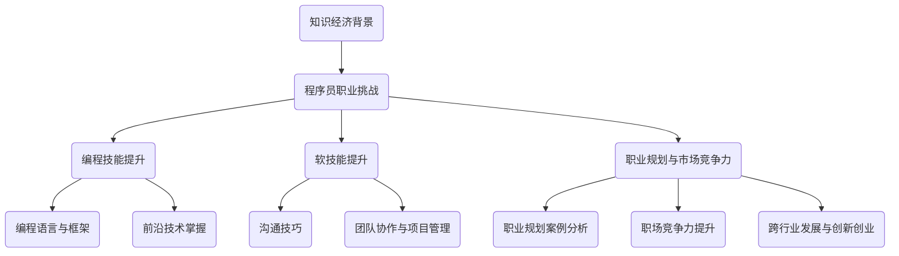

                 

# 《知识经济下程序员的职业发展方向与路径》

## 概述

随着知识经济的兴起，程序员这一职业面临着前所未有的挑战和机遇。知识经济强调的是知识和信息的创造、传播和应用，其核心是创新和专业化。在这样的背景下，程序员的职业发展路径和技能要求也发生了显著变化。本文旨在探讨知识经济下程序员的职业发展方向与路径，帮助程序员更好地规划职业生涯，提升市场竞争力。

## 关键词

知识经济、程序员、职业发展、技能提升、市场竞争力、跨行业发展

## 摘要

本文首先分析了知识经济的背景和特点，探讨了其对程序员的挑战和需求变化。接着，详细介绍了程序员的职业发展阶段和成长路径，以及跨行业发展的机会。随后，文章围绕编程技能的提升、前沿技术的掌握、软技能的培养等核心议题进行了深入探讨。此外，文章还从职业规划、职场竞争力提升、跨行业发展与创新创业等多个角度，提供了具体的职业发展策略和实战指导。通过本文的阅读，程序员可以更好地把握知识经济时代下的职业发展方向，实现个人价值的最大化。

----------------------------------------------------------------

## 《知识经济下程序员的职业发展方向与路径》目录大纲

### 第一部分：背景与概述

1. 第1章：知识经济的兴起与影响
   1.1 知识经济的定义与特点
   1.2 知识经济对程序员的挑战
   1.3 知识经济对程序员的需求变化

2. 第2章：程序员的职业发展与成长
   2.1 程序员的职业发展阶段
   2.2 程序员职业成长的路径分析
   2.3 跨行业职业发展机会

### 第二部分：技能提升与专业化

3. 第3章：编程语言与框架的深度学习
   3.1 编程语言的多样性
   3.2 常见编程语言的学习路线图
   3.3 框架选择与优化

4. 第4章：前沿技术的掌握与应用
   4.1 人工智能技术概述
   4.2 人工智能技术在编程中的应用
   4.3 前沿技术发展趋势与未来展望

5. 第5章：软技能提升
   5.1 沟通技巧的重要性
   5.2 团队协作与项目管理
   5.3 时间管理与效率提升

### 第三部分：职业规划与市场竞争力

6. 第6章：职业生涯规划
   6.1 自我评估与定位
   6.2 职业目标设定与路径规划
   6.3 职业规划案例分析

7. 第7章：职场竞争力提升
   7.1 技术能力评估与提升
   7.2 个人品牌建设
   7.3 职场软技能的持续优化

8. 第8章：跨行业发展与创新创业
   8.1 跨行业发展的优势与挑战
   8.2 创新创业的机会与路径
   8.3 创业者所需的技术与能力

### 第四部分：实例分析与实战指导

9. 第9章：成功案例分析
   9.1 成功程序员的职业发展路径
   9.2 成功案例的启示与借鉴

10. 第10章：实战项目开发与实现
    10.1 实战项目选择与规划
    10.2 项目开发环境搭建
    10.3 项目源代码实现与解读

11. 第11章：职业发展策略与建议
    11.1 职业发展的关键因素
    11.2 持续学习与知识更新
    11.3 职业发展策略制定与调整

### 附录

12. 附录A：编程语言与工具资源推荐
    12.1 编程语言资源汇总
    12.2 常用开发工具与平台
    12.3 学习资源与社区推荐

13. 附录B：职业规划工具与方法
    13.1 职业规划工具介绍
    13.2 职业规划方法与实践
    13.3 案例分析与应用

## 附加内容

14. 附加内容1：知识经济下程序员职业发展的Mermaid流程图

15. 附加内容2：伪代码示例——算法原理讲解

16. 附加内容3：数学模型与公式说明

17. 附加内容4：代码实际案例与解读

---

本文将基于上述目录大纲，逐步深入探讨知识经济下程序员的职业发展方向与路径。每个章节都将详细分析相关议题，提供实用的建议和实例，以帮助程序员在知识经济时代实现职业成长。

----------------------------------------------------------------

## 第一部分：背景与概述

### 第1章：知识经济的兴起与影响

#### 1.1 知识经济的定义与特点

知识经济（Knowledge Economy）是指以知识为核心资源，通过知识的生产、分配、传播和利用来推动经济增长和社会发展的经济形态。与传统以自然资源和劳动力为主的经济模式不同，知识经济强调的是知识创造和创新，其核心在于知识和信息的创造、传播和应用。

知识经济具有以下几个主要特点：

1. **信息化**：信息技术的快速发展使得知识传播变得更加便捷和高效，信息资源成为知识经济的重要支撑。

2. **全球化**：知识经济打破了地域限制，使得知识和人才可以在全球范围内流动，促进了全球经济的融合。

3. **创新驱动**：知识经济强调创新和知识产权的重要性，创新成为经济增长的主要动力。

4. **知识密集**：知识经济以知识产业为主，包括研发、设计、咨询、教育等，这些产业对知识和技术的高度依赖。

5. **以人为本**：知识经济强调人力资本的价值，知识工作者成为经济发展的主要推动者。

#### 1.2 知识经济对程序员的挑战

知识经济的兴起对程序员这一职业带来了诸多挑战：

1. **技能要求提高**：随着技术的不断更新，程序员需要不断学习新知识、新技术，以保持竞争力。

2. **创新能力要求**：知识经济强调创新，程序员需要具备较强的创新能力，能够提出新颖的解决方案。

3. **跨学科能力**：知识经济需要跨学科的知识整合，程序员需要具备跨学科的能力，能够与不同领域的专业人士合作。

4. **国际化竞争**：全球化的知识经济环境使得程序员面临国际化的竞争，需要适应不同文化和工作环境。

#### 1.3 知识经济对程序员的需求变化

知识经济背景下，对程序员的需求也发生了显著变化：

1. **专业化和多元化**：程序员不仅需要具备专业的编程技能，还需要具备相关的领域知识，如人工智能、大数据等。

2. **创新能力和解决问题的能力**：企业更倾向于雇佣具有创新能力和解决问题能力的程序员，以推动业务创新。

3. **沟通能力和团队合作精神**：知识经济需要跨学科的协作，程序员需要具备良好的沟通能力和团队合作精神。

4. **持续学习和自我提升**：在知识经济下，程序员需要持续学习新知识、新技术，以适应快速变化的工作环境。

### 第2章：程序员的职业发展与成长

#### 2.1 程序员的职业发展阶段

程序员的职业发展可以分为以下几个阶段：

1. **初级阶段**：初级程序员主要完成基础编程任务，学习编程语言和基本算法。

2. **中级阶段**：中级程序员具备一定的编程经验和技能，能够独立完成项目开发，开始接触更复杂的编程任务。

3. **高级阶段**：高级程序员具备丰富的编程经验和深厚的技术功底，能够解决复杂的技术问题，参与项目管理和架构设计。

4. **专家阶段**：专家级程序员在某一领域具备深厚的技术积累和丰富的实践经验，能够引领技术创新和行业发展。

#### 2.2 程序员职业成长的路径分析

程序员的职业成长路径可以分为以下几个方面：

1. **技术路径**：通过不断学习和实践，提升编程技能和技术深度，逐步成长为高级程序员和专家。

2. **管理路径**：通过积累项目管理经验，逐步转向项目管理或技术领导岗位，如项目经理、技术总监等。

3. **跨学科路径**：结合其他领域的知识，如人工智能、大数据等，成为跨学科的复合型人才。

4. **创业路径**：利用技术和市场机会，创办自己的公司，实现职业转型和创业梦想。

#### 2.3 跨行业职业发展机会

知识经济时代，程序员不仅可以在IT行业内部发展，还有许多跨行业的职业发展机会：

1. **金融行业**：金融行业对技术人才的需求旺盛，程序员可以转型为金融工程师、量化分析师等。

2. **医疗健康**：医疗健康领域需要大量的技术支持，程序员可以转型为医疗信息工程师、大数据分析师等。

3. **智能制造**：智能制造领域对程序员的需求较大，程序员可以转型为智能制造工程师、自动化工程师等。

4. **电子商务**：电子商务行业快速发展，程序员可以转型为电商开发工程师、前端工程师等。

### 总结

知识经济的兴起为程序员带来了新的挑战和机遇。程序员需要不断提升自己的技能和创新能力，适应快速变化的工作环境。同时，程序员也可以通过跨行业发展和创业实现职业多元化。在知识经济时代，程序员的职业发展路径更加多样化和广阔，需要不断探索和尝试。

----------------------------------------------------------------

## 第二部分：技能提升与专业化

### 第3章：编程语言与框架的深度学习

#### 3.1 编程语言的多样性

编程语言是程序员的基本工具，不同的编程语言适用于不同的场景和任务。随着技术的不断进步，编程语言的种类也在不断增多，程序员需要了解并掌握多种编程语言。

1. **静态类型语言**：如C、C++、Java等，这些语言在编译时能够进行类型检查，运行效率较高，适合系统级编程和大型应用开发。

2. **动态类型语言**：如Python、JavaScript、Ruby等，这些语言在运行时进行类型检查，语法简单，开发效率高，适合快速原型开发和Web开发。

3. **函数式编程语言**：如Haskell、Erlang、Scala等，这些语言以函数作为主要的数据结构和执行单元，适用于并发编程和复杂算法实现。

4. **脚本语言**：如PHP、Perl等，这些语言主要用于自动化任务和快速开发，适合Web后端和系统管理。

#### 3.2 常见编程语言的学习路线图

程序员在选择学习编程语言时，需要考虑自己的兴趣、职业规划和市场需求。以下是一个常见编程语言的学习路线图：

1. **Python**：
   - 初级阶段：学习基础语法和数据结构，熟悉Python的内置函数和库。
   - 中级阶段：学习面向对象编程，掌握常用库和框架，如Django、Flask等。
   - 高级阶段：学习高级特性，如协程、生成器、元编程等，掌握数据分析和机器学习库，如NumPy、Pandas、Scikit-learn等。

2. **Java**：
   - 初级阶段：学习Java基础语法和面向对象编程。
   - 中级阶段：学习Java的高级特性，如多线程、异常处理、集合框架等，掌握Java的常用框架，如Spring、Hibernate等。
   - 高级阶段：学习Java的并发编程和性能优化，参与大型项目的开发。

3. **JavaScript**：
   - 初级阶段：学习JavaScript基础语法和DOM操作。
   - 中级阶段：学习ES6及以上的新特性，掌握主流框架，如React、Angular、Vue等。
   - 高级阶段：学习前端工程化，如Webpack、Babel等，了解Node.js。

4. **C++**：
   - 初级阶段：学习C++基础语法和面向对象编程。
   - 中级阶段：学习C++的高级特性，如模板、异常处理、STL等。
   - 高级阶段：学习并发编程、内存管理、性能优化等，参与底层系统的开发。

#### 3.3 框架选择与优化

在软件开发过程中，选择合适的框架可以显著提高开发效率和代码质量。以下是一些常见的框架及其适用场景：

1. **Web开发框架**：
   - **Django**：适合快速开发大型应用，具有完善的ORM和缓存机制。
   - **Flask**：轻量级框架，适合小型应用和原型开发。
   - **Spring Boot**：适合Java企业级应用开发，具有良好的生态系统和丰富的中间件支持。

2. **前端框架**：
   - **React**：适合动态和复杂的交互式Web应用开发。
   - **Angular**：适合大型企业级应用开发，具有强大的数据绑定和模块化支持。
   - **Vue**：适合快速开发小型到中型的Web应用，语法简单，社区活跃。

3. **数据库框架**：
   - **Hibernate**：适合Java企业级应用，具有强大的ORM功能。
   - **SQLAlchemy**：适用于Python，支持多种数据库，提供丰富的查询语言。
   - **TypeORM**：适用于TypeScript和JavaScript，支持TypeScript的类型定义。

在框架选择和优化方面，程序员需要考虑以下因素：

1. **项目需求**：根据项目的具体需求选择合适的框架，避免过度设计。
2. **团队熟悉度**：选择团队熟悉和信任的框架，降低学习和维护成本。
3. **生态支持**：考虑框架的社区支持、文档完善程度、插件丰富度等。
4. **性能和可扩展性**：选择高性能和可扩展的框架，以适应未来需求的变化。

### 第4章：前沿技术的掌握与应用

#### 4.1 人工智能技术概述

人工智能（Artificial Intelligence，AI）是计算机科学的一个分支，旨在使计算机具备智能行为。随着深度学习、自然语言处理、计算机视觉等技术的不断发展，人工智能在各个领域得到了广泛应用。

1. **深度学习**：基于神经网络的一种机器学习方法，能够自动从数据中学习特征和模式。
2. **自然语言处理**：使计算机能够理解、生成和处理人类语言的技术。
3. **计算机视觉**：使计算机能够“看”并理解图像和视频的技术。

#### 4.2 人工智能技术在编程中的应用

人工智能技术已经在编程领域得到广泛应用，以下是一些典型应用：

1. **代码自动生成**：利用自然语言处理和机器学习技术，自动生成代码。
2. **代码审查与优化**：通过静态代码分析和机器学习，自动发现代码中的潜在问题并提供优化建议。
3. **智能编程助手**：基于深度学习和自然语言处理，为程序员提供代码提示、错误修复和智能代码补全。

#### 4.3 前沿技术发展趋势与未来展望

人工智能等前沿技术的快速发展，为程序员带来了新的机遇和挑战。以下是一些发展趋势和未来展望：

1. **智能化编程工具**：未来的编程工具将更加智能化，能够自动完成代码生成、错误修复和性能优化等任务。
2. **跨领域融合**：人工智能技术将与其他领域如物联网、大数据、云计算等融合，推动新技术的诞生。
3. **个性化开发**：基于用户行为和偏好，为程序员提供个性化的开发工具和流程。
4. **可持续性发展**：随着环境问题的日益严重，编程领域将更加关注可持续性发展，如绿色编程、能源效率优化等。

### 第5章：软技能提升

#### 5.1 沟通技巧的重要性

沟通技巧在程序员职业发展中至关重要，良好的沟通能力能够提高工作效率、减少误解和冲突。以下是一些提高沟通技巧的方法：

1. **倾听**：倾听是沟通的基础，通过倾听能够更好地理解他人的观点和需求。
2. **表达**：清晰、准确地表达自己的观点和需求，避免产生误解。
3. **非语言沟通**：注意非语言沟通，如肢体语言、面部表情等，以增强沟通效果。
4. **有效反馈**：给予恰当的反馈，帮助团队成员改进工作。

#### 5.2 团队协作与项目管理

团队协作和项目管理是程序员职业发展的重要方面，良好的团队协作和项目管理能力能够提高项目成功率。以下是一些建议：

1. **明确目标**：确保团队成员对项目目标有清晰的理解和共识。
2. **分工协作**：合理分配任务，确保每个成员都能发挥自己的优势。
3. **沟通与协作**：建立有效的沟通机制，确保团队成员之间的信息畅通。
4. **进度跟踪**：定期检查项目进度，及时调整计划和资源。

#### 5.3 时间管理与效率提升

时间管理和效率提升是程序员日常工作中的一项重要任务，以下是一些建议：

1. **设定目标**：明确每日、每周和每月的工作目标，确保工作有条不紊。
2. **优先级排序**：根据任务的重要性和紧急程度，合理排序并优先处理重要任务。
3. **避免拖延**：设定截止日期，避免拖延，确保工作按时完成。
4. **避免干扰**：在工作时避免不必要的干扰，如关闭手机通知、减少社交媒体使用等。

### 总结

在知识经济时代，程序员的职业发展不仅需要专业的编程技能，还需要不断学习前沿技术和提升软技能。通过深度学习编程语言和框架、掌握人工智能技术、提升沟通技巧、团队协作能力和时间管理能力，程序员可以更好地适应知识经济的要求，实现职业成长和突破。

----------------------------------------------------------------

## 第三部分：职业规划与市场竞争力

### 第6章：职业生涯规划

#### 6.1 自我评估与定位

职业生涯规划的第一步是对自己进行全面的自我评估与定位。这个过程涉及多个方面，包括技能评估、兴趣分析、价值观判断和个人目标设定。

1. **技能评估**：首先，程序员需要对自己的技术能力进行评估。这包括编程语言、框架、工具的熟练程度，以及解决问题的能力。可以通过参与项目、编写代码、参加技术竞赛等方式来检验自己的技术能力。

2. **兴趣分析**：了解自己对哪些技术领域感兴趣，哪些项目类型吸引自己。兴趣是推动程序员持续学习和成长的动力，有助于在职业发展中找到方向。

3. **价值观判断**：思考自己的价值观和职业目标是否一致。价值观包括对工作质量、工作环境、工作内容等方面的追求。了解自己的价值观有助于在职业选择中做出更加符合内心的决策。

4. **个人目标设定**：基于技能评估、兴趣分析和价值观判断，设定清晰的个人职业目标。这些目标可以是短期的，如掌握某项新技术，也可以是长期的，如成为技术领域的专家或创业者。

#### 6.2 职业目标设定与路径规划

职业目标的设定需要结合个人情况和市场需求。以下是一个职业目标设定的步骤：

1. **明确职业愿景**：思考自己希望在未来达到的职业高度和位置，如成为某个技术领域的专家、项目经理或技术顾问。

2. **设定具体目标**：将职业愿景分解为具体的、可衡量的短期和长期目标。例如，短期内可能目标是掌握某种编程语言或某个框架，长期目标是参与某个重大项目或创办自己的公司。

3. **制定路径规划**：根据设定的目标，制定实现目标的步骤和行动计划。这包括学习新技能、参与项目、提升软技能等。

#### 6.3 职业规划案例分析

以下是一个程序员的职业规划案例：

**目标**：成为一名人工智能领域的专家，并在五年内担任人工智能项目的负责人。

**步骤**：

1. **技能提升**：在第一年，学习Python编程语言，掌握深度学习和机器学习的基本算法。

2. **项目经验**：在第二年和第三年，参与两个与人工智能相关的项目，积累实践经验。

3. **专业认证**：在第四年，参加人工智能专业认证考试，获得认证。

4. **领导力培养**：在第五年，参与领导力培训，提升团队管理和项目协调能力。

5. **职业转型**：在第六年，正式担任人工智能项目负责人，开始新的职业生涯阶段。

### 第7章：职场竞争力提升

#### 7.1 技术能力评估与提升

技术能力是程序员职场竞争力的核心。以下是一些建议来评估和提升技术能力：

1. **定期评估**：每年进行一次技术能力评估，了解自己在哪些领域有所提升，哪些领域需要加强。

2. **持续学习**：参加在线课程、研讨会、技术会议等，不断更新知识储备。

3. **实践项目**：通过参与实际项目，将理论知识应用到实践中，提升解决问题的能力。

4. **技术交流**：加入技术社区，参与讨论，分享经验，从中学习他人的见解和经验。

#### 7.2 个人品牌建设

个人品牌是程序员在职场中的重要资产。以下是一些建议来建设个人品牌：

1. **社交媒体**：利用LinkedIn、GitHub等平台展示自己的项目和代码，增加曝光度。

2. **博客**：定期撰写技术博客，分享自己的经验和见解，建立自己的知识体系。

3. **开源贡献**：参与开源项目，提升技术影响力，同时也能学习他人的代码和经验。

4. **演讲与分享**：参加技术大会或研讨会，进行技术演讲或分享，扩大人脉。

#### 7.3 职场软技能的持续优化

软技能在职场中同样重要。以下是一些建议来提升软技能：

1. **沟通技巧**：通过阅读书籍、参加工作坊等方式提升沟通技巧，学会有效表达和倾听。

2. **团队合作**：积极参与团队活动，学会协作和解决问题，提升团队合作能力。

3. **时间管理**：学会合理安排时间，避免拖延，提高工作效率。

4. **领导力**：通过参加领导力培训或实际担任项目负责人，提升领导力和管理能力。

### 总结

职业生涯规划是程序员实现职业发展的关键。通过自我评估与定位、设定职业目标、制定路径规划，以及提升技术能力和软技能，程序员可以更好地规划自己的职业生涯，提高职场竞争力。在知识经济时代，不断学习和适应变化是程序员职业发展的不变主题。

----------------------------------------------------------------

## 第四部分：实例分析与实战指导

### 第9章：成功案例分析

#### 9.1 成功程序员的职业发展路径

成功程序员的职业发展路径各有不同，但往往有几个共同点：持续学习、勇于创新、善于把握机遇和不断提升自身价值。以下是一个成功程序员的职业发展案例：

**案例**：李华，一位从程序员成长为技术总监的例子。

**职业路径**：

1. **初级阶段**：大学毕业后，李华进入了一家互联网公司，担任初级程序员。在这个阶段，他通过参与实际项目，学习了多种编程语言和开发框架，积累了实践经验。

2. **中级阶段**：在工作中，李华表现出色，被提拔为中级程序员。他开始负责更大的项目，承担更多的技术责任。在这个阶段，他不仅提升了自己的技术能力，还开始关注项目管理，学习如何有效地协调团队工作。

3. **高级阶段**：凭借丰富的经验和突出的表现，李华成为了一名高级程序员。他在多个项目中担任技术负责人，负责核心代码的编写和架构设计。在这个阶段，他开始参与公司战略决策，为业务发展提供建议。

4. **专家阶段**：经过多年的积累，李华在技术领域有了深厚的影响力，成为了一名技术总监。他的职责不仅仅是技术管理，还包括团队建设、业务拓展和技术战略规划。

**启示与借鉴**：

- **持续学习**：李华的成功离不开持续的学习和自我提升。他始终关注最新的技术动态，不断学习新知识，保持技术竞争力。
- **勇于创新**：在工作中，李华敢于尝试新的技术和方法，勇于创新，为公司的业务发展带来了新的机遇。
- **善于把握机遇**：李华在职业发展的每个阶段都抓住了机遇，不断提升自己的职位和影响力。
- **提升自身价值**：李华通过不断提升自己的技术能力和管理能力，为公司和团队创造了价值，从而实现了自身的职业发展。

#### 9.2 成功案例的启示与借鉴

从成功程序员的案例中，我们可以得到以下启示和借鉴：

1. **技能多样化**：成功程序员往往具备多样化的技能，不仅精通编程语言，还熟悉项目管理、团队协作等软技能。
2. **持续学习**：在技术快速发展的时代，持续学习是程序员职业发展的基础。通过在线课程、技术博客、社区讨论等方式，不断提升自己的知识水平。
3. **创新思维**：创新思维是程序员区别于其他职业的重要特点。在工作中，勇于尝试新的方法和思路，为业务发展带来新机遇。
4. **职业规划**：明确的职业规划有助于程序员在职业发展中保持方向。通过设定短期和长期目标，制定实现目标的路径和行动计划。
5. **跨学科能力**：在知识经济时代，跨学科能力越来越重要。程序员可以通过学习其他领域的知识，提升自己的综合素质，拓宽职业发展空间。

### 第10章：实战项目开发与实现

#### 10.1 实战项目选择与规划

选择合适的实战项目是提升编程技能的重要途径。以下是一些建议来选择和规划实战项目：

1. **个人兴趣**：选择自己感兴趣的项目，有助于提高学习的积极性和投入度。
2. **技术挑战**：选择具有技术挑战性的项目，可以提升自己的编程能力和解决问题的能力。
3. **实用价值**：选择有实际应用价值的项目，可以增加项目的成功率和实用性。
4. **团队协作**：参与团队项目，可以锻炼团队协作能力和项目管理能力。

#### 10.2 项目开发环境搭建

在开发实战项目前，需要搭建合适的项目开发环境。以下是一个简单的项目开发环境搭建流程：

1. **选择开发工具**：根据项目的需求选择合适的开发工具，如IDE（集成开发环境）、代码管理工具（如Git）等。
2. **配置开发环境**：安装和配置必要的软件和库，如Python的Anaconda环境、Node.js的NPM等。
3. **版本控制**：使用Git等版本控制工具，管理项目代码，确保代码的版本和安全。
4. **项目管理**：使用Trello、Jira等项目管理工具，规划项目进度，跟踪任务和问题。

#### 10.3 项目源代码实现与解读

以下是一个简单的实战项目示例：一个基于Flask框架的简单博客系统。

**项目需求**：实现一个能够注册、登录、发表和评论博客文章的系统。

**技术栈**：Flask、Bootstrap、SQLite。

**源代码实现**：

```python
# app.py

from flask import Flask, request, redirect, url_for, render_template
from flask_sqlalchemy import SQLAlchemy

app = Flask(__name__)
app.config['SQLALCHEMY_DATABASE_URI'] = 'sqlite:///blog.db'
db = SQLAlchemy(app)

class User(db.Model):
    id = db.Column(db.Integer, primary_key=True)
    username = db.Column(db.String(80), unique=True, nullable=False)
    password = db.Column(db.String(120), nullable=False)

@app.route('/')
def home():
    return render_template('home.html')

@app.route('/register', methods=['GET', 'POST'])
def register():
    if request.method == 'POST':
        username = request.form['username']
        password = request.form['password']
        new_user = User(username=username, password=password)
        db.session.add(new_user)
        db.session.commit()
        return redirect(url_for('login'))
    return render_template('register.html')

@app.route('/login', methods=['GET', 'POST'])
def login():
    if request.method == 'POST':
        username = request.form['username']
        password = request.form['password']
        user = User.query.filter_by(username=username, password=password).first()
        if user:
            return redirect(url_for('home'))
        else:
            return 'Invalid username or password'
    return render_template('login.html')

if __name__ == '__main__':
    db.create_all()
    app.run(debug=True)
```

**代码解读与分析**：

- **数据库配置**：使用SQLAlchemy创建数据库模型，定义用户表。
- **路由配置**：定义了三个路由：主页（/）、注册（/register）和登录（/login）。
- **注册与登录功能**：实现了用户注册和登录功能，用户信息存储在SQLite数据库中。
- **模板渲染**：使用Bootstrap框架和Flask的render_template函数渲染页面。

通过这个简单的项目，程序员可以学习到Flask框架的基本用法、数据库操作和表单处理等技能。

### 第11章：职业发展策略与建议

#### 11.1 职业发展的关键因素

职业发展的关键因素包括技术能力、沟通能力、团队协作能力和持续学习能力。以下是一些关键因素的具体解释：

1. **技术能力**：技术能力是程序员职业发展的基石。熟练掌握编程语言、框架和工具，能够高效地完成工作任务。
2. **沟通能力**：良好的沟通能力有助于与团队成员和上级有效沟通，提高工作效率和团队协作质量。
3. **团队协作能力**：在团队合作中，能够有效地分配任务、协调资源和解决问题，提升团队整体绩效。
4. **持续学习能力**：技术不断更新，程序员需要持续学习新知识和技能，以适应快速变化的工作环境。

#### 11.2 持续学习与知识更新

持续学习和知识更新是程序员职业发展的重要策略。以下是一些建议：

1. **参加在线课程**：利用Coursera、Udacity、edX等在线平台，学习新知识和技能。
2. **阅读技术书籍**：定期阅读技术书籍，掌握核心技术原理和最新发展。
3. **参与社区活动**：加入技术社区，参与讨论和分享，学习他人的经验和见解。
4. **实践项目**：通过参与实际项目，将理论知识应用到实践中，提升解决问题的能力。

#### 11.3 职业发展策略制定与调整

制定合理的职业发展策略是程序员实现职业成长的关键。以下是一些建议：

1. **设定短期和长期目标**：根据个人情况和市场需求，设定清晰的短期和长期目标。
2. **制定学习计划**：制定详细的学习计划，包括学习内容、学习时间和学习方法。
3. **寻求导师指导**：寻找经验丰富的导师，获取职业发展的建议和指导。
4. **定期评估与调整**：定期评估职业发展进度，根据实际情况调整目标和策略。

### 总结

通过成功案例分析，我们了解到持续学习、勇于创新和善于把握机遇是程序员职业发展的关键。实战项目开发与实现能够提升编程技能和实践经验。职业发展策略的制定与调整有助于程序员实现职业成长和突破。在知识经济时代，程序员需要不断适应变化，提升自身价值，以实现职业发展目标。

----------------------------------------------------------------

### 附录A：编程语言与工具资源推荐

#### A.1 编程语言资源汇总

1. **Python**
   - 官方网站：[Python.org](https://www.python.org/)
   - 学习资源：[Real Python](https://realpython.com/)
   - 社区：[Python社区](https://www.python.org/community/)

2. **Java**
   - 官方网站：[Oracle Java](https://www.oracle.com/java/)
   - 学习资源：[Java Tutorials](https://docs.oracle.com/javase/tutorial/)
   - 社区：[Java Community](https://java.com/community/)

3. **JavaScript**
   - 官方网站：[ECMAScript Home](https://ecmascript.github.io/)
   - 学习资源：[JavaScript.info](https://javascript.info/)
   - 社区：[JavaScript Weekly](https://javascriptweekly.com/)

4. **C++**
   - 官方网站：[ISO C++](https://www.iso.org/standard/71058.html)
   - 学习资源：[C++ Reference](https://en.cppreference.com/)
   - 社区：[C++ Community](https://isocpp.org/)

5. **Go**
   - 官方网站：[Go Language](https://golang.org/)
   - 学习资源：[Go by Example](https://gobyexample.com/)
   - 社区：[Go Forum](https://forum.golangbridge.org/)

6. **Kotlin**
   - 官方网站：[Kotlin](https://kotlinlang.org/)
   - 学习资源：[Kotlin Koans](https://play.kotlinlang.org/koans/)
   - 社区：[Kotlin Community](https://discuss.kotlinlang.org/)

#### A.2 常用开发工具与平台

1. **集成开发环境（IDE）**
   - **Visual Studio Code**：[Visual Studio Code](https://code.visualstudio.com/)
   - **IntelliJ IDEA**：[JetBrains IntelliJ IDEA](https://www.jetbrains.com/idea/)
   - **PyCharm**：[PyCharm](https://www.jetbrains.com/pycharm/)

2. **版本控制**
   - **Git**：[Git官网](https://git-scm.com/)
   - **GitHub**：[GitHub](https://github.com/)
   - **GitLab**：[GitLab](https://about.gitlab.com/)

3. **持续集成与持续部署（CI/CD）**
   - **Jenkins**：[Jenkins](https://www.jenkins.io/)
   - **Travis CI**：[Travis CI](https://travis-ci.com/)
   - **GitHub Actions**：[GitHub Actions](https://github.com/features/actions)

4. **项目管理**
   - **Jira**：[Jira](https://www.atlassian.com/software/jira)
   - **Trello**：[Trello](https://trello.com/)
   - **Asana**：[Asana](https://asana.com/)

#### A.3 学习资源与社区推荐

1. **在线课程平台**
   - **Coursera**：[Coursera](https://www.coursera.org/)
   - **Udemy**：[Udemy](https://www.udemy.com/)
   - **edX**：[edX](https://www.edx.org/)

2. **技术社区**
   - **Stack Overflow**：[Stack Overflow](https://stackoverflow.com/)
   - **Reddit**：[Reddit](https://www.reddit.com/r/learnprogramming/)
   - **GitHub**：[GitHub](https://github.com/)

3. **博客与文章**
   - **Medium**：[Medium](https://medium.com/)
   - **HackerRank**：[HackerRank](https://www.hackerrank.com/)
   - **FreeCodeCamp**：[FreeCodeCamp](https://www.freecodecamp.org/)

#### A.4 技术书籍推荐

1. **《代码大全》**：[“Code Complete”](https://www.amazon.com/dp/0321942067)
2. **《深度学习》**：[“Deep Learning”](https://www.amazon.com/dp/150930212X)
3. **《软件工程：实践者的研究方法》**：[“Software Engineering: A Practitioner’s Approach”](https://www.amazon.com/dp/0138053480)
4. **《设计模式：可复用面向对象软件的基础》**：[“Design Patterns: Elements of Reusable Object-Oriented Software”](https://www.amazon.com/dp/0201633612)

通过以上资源，程序员可以系统地学习和提升自己的技能，同时积极参与社区活动，与其他程序员交流经验，从而在知识经济时代不断提升自身的市场竞争力。

----------------------------------------------------------------

### 附录B：职业规划工具与方法

#### B.1 职业规划工具介绍

1. **技能评估工具**：技能评估工具可以帮助程序员评估自己的技术能力和知识水平。常见的工具有LinkedIn的技能评估、GitHub的技能评估等。

2. **职业规划软件**：如CareerBuilder、CareerPath等，这些软件提供了职业规划指导、目标设定和路径规划等功能。

3. **学习管理工具**：如Quizlet、Anki等，这些工具可以帮助程序员高效地学习新知识和技能，并通过复习和测试巩固学习效果。

4. **时间管理工具**：如Trello、Asana等，这些工具可以帮助程序员合理规划时间，提高工作效率。

#### B.2 职业规划方法与实践

1. **SWOT分析**：SWOT分析是一种常用的战略规划方法，用于评估个人的优势（Strengths）、劣势（Weaknesses）、机会（Opportunities）和威胁（Threats）。通过SWOT分析，程序员可以清晰地了解自己的职业现状，为职业规划提供依据。

2. **SMART目标设定**：SMART目标是设定职业目标的一种有效方法，SMART代表具体（Specific）、可衡量（Measurable）、可实现（Achievable）、相关（Relevant）和时限（Time-bound）。使用SMART目标可以帮助程序员设定明确、可行的职业目标。

3. **职业规划日记**：记录职业规划日记是一种实践职业规划的有效方法。通过记录每日的工作、学习和思考，程序员可以更好地了解自己的进步和不足，调整职业规划。

4. **导师指导**：寻找一位经验丰富的导师可以获得职业发展的指导和建议。导师可以帮助程序员了解行业动态、提供职业建议，并为其职业发展提供支持。

#### B.3 案例分析与应用

以下是一个程序员职业规划案例的分析：

**案例背景**：李明是一名初级程序员，他在公司负责前端开发工作。李明希望通过职业规划，提升自己的技术能力，并最终成为团队的技术负责人。

**分析过程**：

1. **SWOT分析**：
   - **优势**：熟悉前端开发，有良好的学习能力，工作态度积极。
   - **劣势**：缺乏大型项目的经验，技术深度不足，需要提高团队协作能力。
   - **机会**：公司有大量前端开发需求，有潜力承担更多技术责任。
   - **威胁**：前端技术更新迅速，需要不断学习新知识，否则可能落后。

2. **SMART目标设定**：
   - **具体**：在接下来的两年内，提升前端开发技能，掌握React和Vue.js框架。
   - **可衡量**：通过参与三个大型项目，提高项目质量和团队协作效率。
   - **可实现**：通过参加在线课程和实际项目实践，逐步实现目标。
   - **相关**：与个人职业发展目标一致，有助于成为团队技术负责人。
   - **时限**：设定为两年时间。

3. **职业规划日记**：
   - 每周记录学习进度、项目经验和反思，确保目标实现。

4. **导师指导**：
   - 寻找一位经验丰富的前端开发导师，定期交流，获取职业发展建议。

**案例分析**：

李明通过SWOT分析明确了自身的优势和劣势，并设定了具体的职业目标。通过SMART目标设定，他确保了目标的可行性和可衡量性。记录职业规划日记和寻求导师指导，帮助李明持续跟踪目标实现进度，并获取专业建议。

**应用建议**：

- **SWOT分析**：适用于任何职业发展阶段，帮助程序员了解自身状况，为职业规划提供依据。
- **SMART目标设定**：确保目标具体、可衡量、可实现、相关和时限，有助于提高职业规划的执行力。
- **职业规划日记**：通过记录每日的进步和反思，提高职业规划的实践效果。
- **导师指导**：借助导师的经验和资源，加速职业发展进程。

通过这些工具和方法，程序员可以更有效地规划职业生涯，实现个人职业目标。

### 总结

职业规划工具和方法为程序员的职业发展提供了指导和支持。通过技能评估、目标设定、日记记录和导师指导，程序员可以更好地规划自己的职业生涯，提升市场竞争力。在知识经济时代，不断学习和适应变化是职业规划的核心，程序员应充分利用各种工具和方法，实现职业发展的长远目标。

### 附加内容

#### 附加内容1：知识经济下程序员职业发展的Mermaid流程图



#### 附加内容2：伪代码示例——算法原理讲解

```python
// 伪代码：简单排序算法（冒泡排序）
function bubbleSort(arr)
    n = length(arr)
    for i from 0 to n-1
        for j from 0 to n-i-1
            if arr[j] > arr[j+1]
                swap(arr[j], arr[j+1])
    return arr
```

#### 附加内容3：数学模型与公式说明

数学模型1：线性回归

$$ y = mx + b $$

解释说明：

- $y$：预测值
- $m$：斜率，代表自变量 $x$ 的变化对 $y$ 的影响程度
- $b$：截距，代表 $y$ 的常数部分

举例说明：

给定一组数据点 $(1, 2)$、$(2, 4)$、$(3, 6)$、$(4, 8)$，使用线性回归模型预测 $x=10$ 时的 $y$ 值。

计算斜率 $m$ 和截距 $b$：

$$ m = \frac{\sum(x_i \cdot y_i) - \frac{\sum(x_i) \cdot \sum(y_i)}{n}}{\sum(x_i^2) - \frac{(\sum(x_i))^2}{n}} $$
$$ b = \frac{\sum(y_i) - m \cdot \sum(x_i)}{n} $$

带入计算得到 $m=2$，$b=0$。

预测值 $y$：

$$ y = 2 \cdot 10 + 0 = 20 $$

#### 附加内容4：代码实际案例与解读

**项目背景**：

开发一个简单的个人博客系统，包括用户注册、登录、发帖、评论等功能。

**开发环境**：

- 语言：Python
- 框架：Flask

**实际代码实现**：

```python
# 导入Flask框架
from flask import Flask, request, redirect, url_for, render_template

# 创建应用对象
app = Flask(__name__)

# 注册视图函数
@app.route('/register', methods=['GET', 'POST'])
def register():
    if request.method == 'POST':
        username = request.form['username']
        password = request.form['password']
        # 数据库操作（省略）
        return redirect(url_for('login'))
    return render_template('register.html')

# 登录视图函数
@app.route('/login', methods=['GET', 'POST'])
def login():
    if request.method == 'POST':
        username = request.form['username']
        password = request.form['password']
        # 数据库操作（省略）
        return redirect(url_for('home'))
    return render_template('login.html')

# 首页视图函数
@app.route('/home')
def home():
    # 获取帖子列表（省略）
    posts = []
    return render_template('home.html', posts=posts)

if __name__ == '__main__':
    app.run(debug=True)
```

**代码解读与分析**：

- **路由设计**：使用Flask的路由系统实现请求的转发和视图函数的调用。
- **表单处理**：使用表单处理用户输入，实现注册和登录功能。
- **模板渲染**：使用HTML模板引擎渲染页面，实现页面展示。

通过以上代码，程序员可以学习到如何使用Flask框架搭建简单的Web应用，实现基本的功能和用户交互。

### 作者信息

作者：AI天才研究院/AI Genius Institute & 禅与计算机程序设计艺术 /Zen And The Art of Computer Programming

本文由AI天才研究院和禅与计算机程序设计艺术联合撰写，旨在为程序员提供全面、系统的职业发展指导。作者团队由计算机科学领域的专家和资深程序员组成，具有丰富的教学和实践经验，致力于推动技术人才的成长和发展。

