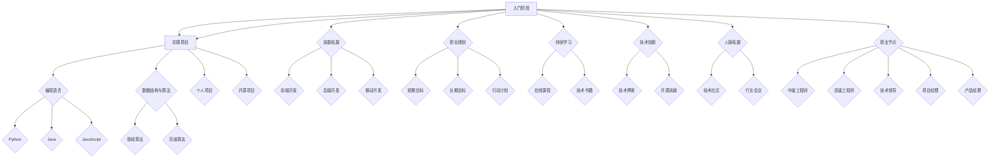

                 

### 第1章：知识经济的兴起与影响

在21世纪，知识经济已经逐渐成为全球经济的重要组成部分。知识经济，简单来说，就是以知识为主要生产要素的经济形态，它强调的是知识的创造、传播和应用。与传统经济相比，知识经济具有更高的知识密集度和技术含量，它不仅仅依赖于自然资源和劳动力，更依赖于人类的智慧和创新能力。

#### 1.1 知识经济的定义与特征

知识经济，从定义上看，是指以知识为核心资源，通过知识的生产、传播、分配和应用来推动经济增长的一种经济形态。知识经济具有以下几个显著特征：

1. **知识密集性**：知识经济中的生产和服务活动高度依赖于知识和信息，而不是传统的自然资源和劳动力。
2. **创新驱动性**：知识经济强调创新的重要性，创新是推动经济增长的主要动力。
3. **全球化**：知识经济使得全球信息流通更加便捷，跨国界的知识共享和合作成为常态。
4. **网络化**：知识经济中，网络成为知识传播和交流的重要平台，互联网和社交媒体等工具大大加速了知识的传播和扩散。

#### 1.2 程序员在知识经济中的角色

在知识经济的大背景下，程序员的角色发生了显著的变化。他们不仅是技术的执行者，更是创新和知识的创造者。具体来说，程序员在知识经济中的角色包括：

1. **技术创新者**：程序员通过开发新的软件和系统，推动技术的进步，从而为知识经济提供新的动力。
2. **知识传播者**：程序员通过编写文档、分享代码和技术博客等方式，将知识传递给更多的人，促进知识的传播和应用。
3. **服务提供者**：随着知识经济的发展，程序员不仅为传统行业提供技术支持，还参与到新兴的互联网、金融、医疗等行业，成为这些行业的重要服务提供者。

#### 1.3 知识经济对程序员职业发展的影响

知识经济的兴起对程序员的职业发展带来了巨大的机遇和挑战。从机遇的角度来看：

1. **更多职业机会**：知识经济催生了大量的新兴行业和岗位，为程序员提供了更多的职业机会。
2. **更高的薪资待遇**：由于知识经济对技术和创新能力的高度依赖，程序员的薪资水平普遍较高。
3. **职业发展空间**：知识经济中的职业发展路径更加多元化，程序员可以通过不断提升自己的技能和知识，实现职业上的跨越式发展。

然而，知识经济也带来了一些挑战：

1. **技能更新的速度加快**：知识经济中的技术更新速度非常快，程序员需要不断学习新的技术和工具，以保持自己的竞争力。
2. **创新能力的要求提高**：知识经济对程序员的创新能力提出了更高的要求，程序员需要具备更强的创新思维和解决问题的能力。
3. **职业压力增大**：由于竞争激烈，程序员需要承受更大的工作压力，以适应快速变化的市场需求。

总结来说，知识经济为程序员的职业发展带来了巨大的机遇，同时也提出了更高的要求。程序员需要积极适应知识经济的变化，不断提升自己的技能和知识，以抓住机遇，迎接挑战。在接下来的章节中，我们将详细探讨程序员如何在知识经济下提升自己的技能，规划职业生涯，以及如何培养创新能力，以实现职业发展的最大化。

### 1.1 知识经济的定义与特征

知识经济，从定义上看，是指以知识为核心资源，通过知识的生产、传播、分配和应用来推动经济增长的一种经济形态。它不同于传统的以自然资源和劳动力为基础的经济模式，而是更加注重知识和信息的创造、传播和应用。在知识经济中，知识被认为是经济增长的主要驱动力，具有极高的价值。

知识经济具有以下几个显著特征：

1. **知识密集性**：知识经济中的生产和服务活动高度依赖于知识和信息，而不是传统的自然资源和劳动力。这意味着在知识经济中，智力资源成为最重要的生产要素。无论是研发、设计、咨询，还是金融服务、电子商务，都需要大量的知识和信息的支持。

2. **创新驱动性**：知识经济强调创新的重要性，创新是推动经济增长的主要动力。在知识经济中，技术进步、产品创新和服务创新是经济增长的核心。这些创新往往源于对知识的深入理解和创新性的应用，从而创造出新的市场和机会。

3. **全球化**：知识经济使得全球信息流通更加便捷，跨国界的知识共享和合作成为常态。互联网和信息技术的发展极大地缩短了地理上的距离，使得全球范围内的知识传播和交流变得更加容易和高效。这种全球化不仅促进了知识经济的发展，也为程序员提供了更多的职业机会和发展空间。

4. **网络化**：知识经济中，网络成为知识传播和交流的重要平台，互联网和社交媒体等工具大大加速了知识的传播和扩散。网络化的特点使得程序员可以通过各种在线平台和工具，如GitHub、Stack Overflow和LinkedIn，获取知识、分享经验和进行合作。这种网络化不仅提升了程序员的工作效率，也促进了全球范围内的知识共享和创新。

5. **数字化**：知识经济中的许多活动都是数字化的，这意味着所有的知识都可以以数字形式存储、处理和传输。数字化使得知识可以更加便捷地获取和共享，大大提高了知识的利用效率。同时，数字化也推动了各种新兴技术和应用的发展，如人工智能、大数据和云计算，这些技术正在深刻改变着知识经济中的生产和服务模式。

6. **动态性**：知识经济具有很高的动态性，技术变革和市场需求变化频繁。这种动态性要求程序员必须具备快速学习新知识和技能的能力，以适应快速变化的环境。同时，这也为程序员提供了大量的机会，因为新技术和新市场的出现往往会带来新的职业机会和挑战。

7. **多元化**：知识经济涵盖了广泛的行业和领域，从科技、金融、医疗到教育、娱乐等，都在知识经济的范畴内。这使得程序员可以在不同的行业和领域找到适合自己的职业发展路径，实现多元化的发展。

总之，知识经济作为一种新型的经济形态，正在深刻改变着全球经济的发展模式。对于程序员来说，知识经济既是机遇也是挑战。他们需要充分利用知识经济带来的机遇，不断提升自己的技能和知识，以在竞争激烈的职场中脱颖而出。在接下来的章节中，我们将进一步探讨程序员如何在知识经济下提升自己的职业发展，实现个人价值的最大化。

### 1.2 程序员在知识经济中的角色

在知识经济的大背景下，程序员的角色发生了显著的变化。他们不仅是技术的执行者，更是创新和知识的创造者。具体来说，程序员在知识经济中的角色包括以下几个方面：

1. **技术创新者**：程序员通过开发新的软件和系统，推动技术的进步，从而为知识经济提供新的动力。他们不断探索新的技术和工具，解决现实中的复杂问题，创造出具有创新性和实用性的解决方案。例如，在人工智能、大数据和区块链等领域，程序员通过创新性的软件开发，推动了这些领域的快速发展。

2. **知识传播者**：程序员通过编写文档、分享代码和技术博客等方式，将知识传递给更多的人，促进知识的传播和应用。他们不仅在工作中积累和分享知识，还在社区中积极参与，通过开源项目和在线平台，分享自己的经验和见解，帮助更多的人学习和成长。这种知识传播不仅提升了程序员的个人影响力，也促进了整个行业的发展。

3. **服务提供者**：随着知识经济的发展，程序员不仅为传统行业提供技术支持，还参与到新兴的互联网、金融、医疗等行业，成为这些行业的重要服务提供者。他们在这些行业中发挥着关键作用，通过开发和应用软件，提高行业效率和竞争力。例如，在金融领域，程序员开发了各种金融交易系统和风险管理工具，提高了金融市场的效率；在医疗领域，程序员开发了医疗信息系统和智能诊断工具，提升了医疗服务的质量和效率。

4. **跨界合作者**：知识经济的特点之一是跨行业的合作和融合，程序员作为技术专家，经常需要与来自不同领域的专家合作，共同解决复杂问题。他们在这种跨界合作中，不仅需要掌握专业的技术知识，还需要具备跨领域的沟通能力和合作精神。通过跨界合作，程序员可以发挥自己的专业技能，实现跨领域的创新和应用。

5. **解决方案提供者**：在知识经济中，程序员不仅仅是编写代码，更是提供综合解决方案的专家。他们需要深入理解客户的需求，通过技术手段，提供满足客户需求的解决方案。这种解决方案可能包括软件开发、系统设计、系统集成等多个方面。程序员需要具备系统思维和综合能力，以提供高效、可靠和创新的解决方案。

6. **产品经理**：随着程序员角色的逐渐多元化，越来越多的程序员开始担任产品经理的角色。他们不仅负责软件的技术实现，还需要关注产品的整体设计、开发和推广。作为产品经理，程序员需要具备市场洞察力、用户思维和项目管理能力，以推动产品的成功上市。

总之，在知识经济中，程序员的角色已经不仅仅是编写代码，而是涵盖了技术创新、知识传播、服务提供、跨界合作、解决方案提供和产品管理等多个方面。他们通过不断提升自己的技能和知识，积极参与到知识经济中，为经济增长和社会进步做出贡献。在接下来的章节中，我们将进一步探讨程序员如何提升自己的技能和知识，以适应知识经济的要求，实现个人和职业的发展。

### 1.3 知识经济对程序员职业发展的影响

知识经济的兴起对程序员的职业发展带来了巨大的机遇和挑战。从机遇的角度来看，知识经济为程序员提供了以下几个方面的优势：

1. **更多职业机会**：知识经济催生了大量的新兴行业和岗位，为程序员提供了更多的职业机会。例如，人工智能、大数据、云计算、区块链等领域的快速发展和广泛应用，为程序员创造了大量新的就业机会。程序员可以在这些领域找到适合自己的职业发展路径，实现个人价值的最大化。

2. **更高的薪资待遇**：知识经济对技术和创新能力的高度依赖，使得程序员的薪资水平普遍较高。特别是在技术含量高、市场需求大的领域，如人工智能、大数据和区块链，程序员的薪资水平往往远远高于传统行业。这为程序员提供了更好的经济保障和生活质量。

3. **职业发展空间**：知识经济中的职业发展路径更加多元化，程序员可以通过不断提升自己的技能和知识，实现职业上的跨越式发展。例如，从初级程序员到高级工程师、架构师、产品经理等，程序员可以根据自己的兴趣和能力，选择不同的职业发展路径，实现个人职业规划。

然而，知识经济也带来了一些挑战，程序员需要面对以下几个方面的挑战：

1. **技能更新的速度加快**：知识经济中的技术更新速度非常快，程序员需要不断学习新的技术和工具，以保持自己的竞争力。例如，新的编程语言、框架和工具层出不穷，程序员如果不及时更新自己的知识体系，就可能被市场淘汰。

2. **创新能力的要求提高**：知识经济对程序员的创新能力提出了更高的要求。程序员不仅需要掌握现有的技术和工具，还需要具备创新性的思维和解决问题的能力。这要求程序员不仅要有扎实的专业基础，还要有开阔的视野和敏锐的洞察力。

3. **职业压力增大**：由于竞争激烈，程序员需要承受更大的工作压力，以适应快速变化的市场需求。在知识经济中，技术的快速发展和市场的快速变化，要求程序员必须具备快速响应和解决问题的能力。这可能导致程序员的工作强度增加，工作压力增大。

4. **跨界能力的需求**：知识经济中的跨界合作和融合越来越普遍，程序员需要具备跨领域的知识和技能，以应对跨行业的项目需求。这要求程序员不仅要精通编程语言和开发工具，还要了解不同行业的业务流程和需求，具备跨领域的沟通和协作能力。

为了在知识经济中取得成功，程序员需要采取一系列策略来应对机遇和挑战：

1. **持续学习**：程序员需要持续学习新的技术和工具，以保持自己的竞争力。可以通过参加在线课程、阅读技术书籍、参加技术会议和研讨会等方式，不断提升自己的知识水平。

2. **培养创新能力**：程序员需要培养创新性的思维和解决问题的能力。可以通过参与开源项目、解决复杂问题、研究新技术和工具等方式，提升自己的创新能力。

3. **提升跨界能力**：程序员需要提升跨领域的知识和技能，以应对跨行业的项目需求。可以通过学习不同行业的业务流程、了解不同行业的需求和挑战，提升自己的跨界能力。

4. **建立人脉网络**：建立广泛的人脉网络，有助于程序员在职业发展中获取更多的机会和资源。可以通过参加技术社区、加入行业协会、参加行业活动等方式，建立和维护人脉网络。

5. **职业规划**：制定明确的职业规划，有助于程序员在职业发展中保持方向和动力。可以根据自己的兴趣和能力，设定职业目标，并制定实现这些目标的步骤和计划。

总之，知识经济为程序员的职业发展带来了巨大的机遇和挑战。程序员需要积极适应知识经济的变化，不断提升自己的技能和知识，以抓住机遇，迎接挑战。通过持续学习、培养创新能力、提升跨界能力、建立人脉网络和制定职业规划，程序员可以最大化地实现自己的职业价值，在知识经济中获得成功。

### 第2章：知识经济下的职业机会

知识经济的兴起不仅改变了全球经济的格局，也为程序员提供了丰富的职业机会。在这一章节中，我们将探讨程序员在知识经济下的新兴职业领域，高级编程语言与框架的兴起，以及跨行业、跨领域的编程需求。

#### 2.1 程序员的新兴职业领域

随着知识经济的发展，新的职业领域不断涌现，为程序员提供了广阔的发展空间。以下是一些新兴的职业领域：

1. **人工智能工程师**：随着人工智能技术的快速发展，人工智能工程师成为了一个热门的职业。他们负责开发和优化人工智能算法，设计智能系统，并将其应用于实际场景中。

2. **数据科学家**：数据科学家在知识经济中扮演着重要的角色，他们利用统计学、机器学习和数据挖掘等技术，从海量数据中提取有价值的信息，为企业和组织提供数据驱动的决策支持。

3. **区块链工程师**：区块链技术的兴起为程序员创造了新的就业机会。区块链工程师负责开发和维护区块链系统，设计去中心化的应用，确保数据的安全和透明。

4. **云计算工程师**：云计算已成为现代信息技术的重要组成部分，云计算工程师负责设计、实施和维护云平台，确保系统的可靠性和高效性。

5. **网络安全工程师**：随着网络攻击和网络犯罪的增加，网络安全工程师成为了一个紧缺的职业。他们负责设计和实施网络安全策略，保护企业的信息系统不受攻击。

6. **物联网工程师**：物联网技术的发展使得设备和系统能够实现互联互通，物联网工程师负责开发和管理物联网系统，确保设备间的数据传输和安全。

#### 2.2 高级编程语言与框架的兴起

在知识经济中，高级编程语言和框架的兴起极大地推动了程序员的工作效率和技术创新。以下是一些受到广泛使用的高级编程语言和框架：

1. **Python**：Python以其简洁明了的语法和丰富的库，成为数据科学、人工智能和Web开发等领域的主要编程语言。其强大的生态系统和庞大的社区支持使得Python成为程序员的首选。

2. **Java**：Java是一种跨平台的编程语言，广泛应用于企业级应用、Web开发和移动应用开发。Java的稳定性和高性能使其成为许多大型企业的首选。

3. **JavaScript**：JavaScript是Web开发的必备技能，用于实现交互性和动态性。随着前端框架如React、Vue和Angular的兴起，JavaScript的重要性不断提升。

4. **Go**：Go语言因其高性能、并发性和内存效率而受到青睐。它特别适合于云计算、物联网和分布式系统开发。

5. **Kotlin**：Kotlin是Android开发的官方语言，具有简洁明了的语法和强大的特性，如null安全性和扩展函数，提高了开发效率。

6. **Dart**：Dart是Google开发的一种面向Web和移动应用的前端编程语言，其性能接近原生应用，同时具有易于编写和维护的特点。

#### 2.3 跨行业、跨领域的编程需求

知识经济的一个重要特征是跨行业、跨领域的合作和融合。这为程序员提供了丰富的编程需求，以下是一些典型的跨行业、跨领域的编程场景：

1. **金融科技**：金融科技（FinTech）结合了金融和信息技术，为程序员提供了丰富的编程需求。例如，区块链技术在金融领域的应用，为程序员提供了开发加密货币交易系统、智能合约和分布式账本的机会。

2. **医疗健康**：医疗健康领域利用信息技术提高医疗服务质量和效率。程序员可以参与开发电子健康记录系统、远程医疗平台和医疗数据分析工具，为医疗行业提供技术支持。

3. **智能制造**：智能制造结合了信息技术和制造业，为程序员提供了开发工业物联网系统、智能制造平台和机器人控制软件的机会。

4. **智慧城市**：智慧城市利用大数据、人工智能和物联网技术，提高城市的管理和服务水平。程序员可以参与开发智能交通系统、智慧安防系统和城市信息平台。

5. **电子商务**：电子商务平台需要强大的技术支持，包括数据分析、推荐系统、支付系统和物流系统等。程序员可以在这些领域发挥重要作用，提升电商平台的用户体验和运营效率。

6. **教育科技**：教育科技利用信息技术改善教育质量和效率。程序员可以参与开发在线教育平台、虚拟现实教学系统和智能教育工具，为教育行业提供技术支持。

总结来说，知识经济为程序员提供了丰富的职业机会和多样化的编程需求。程序员需要不断学习新的技术和工具，提升自己的技能，以抓住这些机遇，在知识经济中实现自己的职业价值。在接下来的章节中，我们将进一步探讨程序员如何提升自己的技能，规划职业生涯，以适应知识经济的要求。

### 2.1 程序员的新兴职业领域

随着知识经济的快速发展，许多新兴职业领域不断涌现，为程序员提供了前所未有的发展机遇。以下是一些重要的新兴职业领域及其特点：

1. **人工智能工程师**：随着人工智能技术的飞速发展，人工智能工程师成为了科技行业的热门职业。他们负责设计、开发和优化各种机器学习和深度学习模型，并将其应用于实际的业务场景中。例如，自然语言处理、图像识别和预测分析等领域都依赖于人工智能工程师的专业技能。

2. **数据科学家**：数据科学家是另一种新兴职业，他们利用统计学、机器学习、数据挖掘等技术，从大量数据中提取有价值的信息，帮助企业和组织做出数据驱动的决策。数据科学家通常需要具备较强的数学和编程能力，能够处理和分析复杂的数据集，并提供有洞察力的分析报告。

3. **区块链工程师**：区块链技术的兴起为程序员带来了新的挑战和机遇。区块链工程师负责开发、实施和维护区块链系统，包括智能合约、去中心化应用（DApps）和分布式账本等。他们需要深入了解区块链的基本原理和关键技术，如加密算法、共识机制和去中心化存储。

4. **云计算工程师**：云计算已成为现代企业的重要基础设施。云计算工程师负责设计、部署和维护云平台，确保其安全、可靠和高效运行。他们需要熟悉各种云服务提供商（如AWS、Azure、Google Cloud）提供的工具和服务，并具备处理大规模分布式系统的能力。

5. **网络安全工程师**：随着网络攻击和网络犯罪的增加，网络安全工程师的需求日益增长。他们负责设计和实施网络安全策略，识别和响应潜在的安全威胁。网络安全工程师需要具备深入的网络知识、安全协议和加密技术，以及丰富的实战经验。

6. **物联网工程师**：物联网（IoT）技术的广泛应用为程序员带来了新的职业机会。物联网工程师负责开发和管理物联网系统，包括连接设备、数据收集和分析、远程监控和控制等。他们需要熟悉各种传感器、无线通信协议和边缘计算技术。

7. **游戏开发者**：随着游戏行业的蓬勃发展，游戏开发者成为了热门职业。游戏开发者负责设计、开发和测试游戏，包括前端和后端开发、图形渲染和物理引擎等。他们需要具备编程、美术设计、音效制作和项目管理等多方面的技能。

8. **AR/VR工程师**：增强现实（AR）和虚拟现实（VR）技术正在逐渐改变人们的日常生活和工作方式。AR/VR工程师负责开发AR/VR应用，包括内容创作、界面设计和性能优化等。他们需要熟悉各种AR/VR设备和平台，以及相关的编程语言和工具。

9. **DevOps工程师**：DevOps是一种结合软件开发（Development）和运维（Operations）的新兴实践。DevOps工程师负责设计和实施持续集成和持续部署（CI/CD）流程，确保软件开发的高效和可靠性。他们需要熟悉自动化工具、容器化技术（如Docker）和云服务。

10. **自动化测试工程师**：自动化测试工程师负责开发、维护和执行自动化测试脚本，确保软件的质量和稳定性。他们需要熟悉各种自动化测试工具和框架，如Selenium、JMeter和Appium等，并具备良好的编程和测试设计能力。

这些新兴职业领域不仅为程序员提供了多样化的职业选择，还为他们提供了广阔的发展空间和良好的薪资待遇。然而，这些领域也要求程序员具备不断学习新知识和技能的能力，以适应快速变化的技术和市场环境。在接下来的章节中，我们将进一步探讨程序员如何提升自己的技能和知识，以在新兴职业领域中脱颖而出。

### 2.2 高级编程语言与框架的兴起

在知识经济的推动下，高级编程语言和框架的兴起极大地改变了软件开发的方式和效率。这些高级语言和框架不仅提供了丰富的功能，还简化了编程过程，降低了开发成本。以下是一些受到广泛使用的高级编程语言和框架：

1. **Python**：Python以其简洁明了的语法和强大的库，成为数据科学、人工智能和Web开发等领域的主要编程语言。Python的生态系统非常丰富，拥有大量的第三方库和工具，如NumPy、Pandas、Scikit-learn和TensorFlow，这些库可以帮助程序员快速实现复杂的数据分析和机器学习任务。

2. **Java**：Java是一种跨平台的编程语言，广泛应用于企业级应用、Web开发和移动应用开发。Java的稳定性和高性能使其成为许多大型企业的首选。Java拥有丰富的标准库和生态系统，包括Spring、Hibernate和MyBatis等框架，这些框架可以简化开发流程，提高开发效率。

3. **JavaScript**：JavaScript是Web开发的必备技能，用于实现交互性和动态性。随着前端框架如React、Vue和Angular的兴起，JavaScript的重要性不断提升。这些框架提供了组件化开发、虚拟DOM和高效的状态管理，使得前端开发更加便捷和高效。

4. **Go**：Go语言因其高性能、并发性和内存效率而受到青睐。Go语言的设计理念是“快速开发，高效运行”，特别适合于云计算、物联网和分布式系统开发。Go的标准库和工具链也非常丰富，如goroutine和channel等并发编程特性，使得开发者可以轻松实现高性能的并发应用。

5. **Kotlin**：Kotlin是Android开发的官方语言，具有简洁明了的语法和强大的特性，如null安全性和扩展函数，提高了开发效率。Kotlin与Java100%兼容，可以无缝集成现有的Java代码库，同时提供了许多现代编程特性，如函数式编程和协程，使得Android应用开发更加高效和便捷。

6. **Dart**：Dart是Google开发的一种面向Web和移动应用的前端编程语言，其性能接近原生应用，同时具有易于编写和维护的特点。Dart支持AOT（Ahead-of-Time）编译，使得应用程序可以在各种平台上高效运行。Dart还提供了丰富的库和工具，如Flutter框架，用于开发跨平台的移动应用。

7. **TypeScript**：TypeScript是JavaScript的一个超集，添加了静态类型和基于类的面向对象编程特性。TypeScript提供了更好的类型检查和代码重构功能，提高了开发效率。TypeScript与JavaScript完全兼容，可以在现有的JavaScript项目中无缝集成。

8. **Rust**：Rust是一种系统级编程语言，以其内存安全和高性能而受到关注。Rust通过所有权系统（ownership）和借用检查（borrowing），确保了程序在运行时的内存安全。Rust在系统编程、网络编程和嵌入式系统开发等领域具有很大的潜力。

9. **Swift**：Swift是Apple开发的编程语言，用于开发iOS、macOS、watchOS和tvOS应用程序。Swift具有简洁、现代和安全的特性，提供了丰富的库和工具，如UIKit和SwiftUI，使得iOS开发更加高效和便捷。

10. **Erlang**：Erlang是一种用于构建分布式、高并发和容错系统的编程语言。Erlang通过其进程模型和轻量级线程（纤程），提供了高效并发和分布式计算的能力。Erlang广泛应用于电信、金融和实时系统等领域。

这些高级编程语言和框架的兴起，不仅改变了软件开发的方式，也推动了技术的进步和创新。程序员需要不断学习和掌握这些语言和框架，以适应不断变化的技术和市场环境。在知识经济的推动下，程序员在编程语言和框架的选择上具有更多的自由和灵活性，可以根据项目的需求和个人的兴趣，选择最适合的工具和技术。

### 2.3 跨行业、跨领域的编程需求

知识经济的一个显著特征是跨行业、跨领域的合作和融合。这种跨界的趋势不仅为程序员带来了新的职业机会，也产生了多样化的编程需求。以下是一些典型的跨行业、跨领域的编程场景：

1. **金融科技（FinTech）**：金融科技结合了金融和信息技术，为程序员提供了丰富的编程需求。例如，区块链技术在金融领域的应用，为程序员提供了开发加密货币交易系统、智能合约和分布式账本的机会。此外，金融科技公司还需要开发风险管理、支付系统和信用评分系统等应用。

2. **医疗健康**：医疗健康领域利用信息技术提高医疗服务质量和效率。程序员可以参与开发电子健康记录系统、远程医疗平台和医疗数据分析工具。例如，通过开发患者管理系统，医生可以实时访问患者的医疗记录，提高诊断和治疗效率。同时，医疗数据分析可以帮助医疗机构识别疾病趋势和患者需求，优化医疗资源配置。

3. **智能制造**：智能制造结合了信息技术和制造业，为程序员提供了开发工业物联网系统、智能制造平台和机器人控制软件的机会。例如，通过开发智能传感器和数据采集系统，可以实时监控生产线上的设备和产品状态，实现自动化生产和质量管理。此外，机器人控制软件的开发可以使工业机器人更加智能化，提高生产效率和灵活性。

4. **智慧城市**：智慧城市利用大数据、人工智能和物联网技术，提高城市的管理和服务水平。程序员可以参与开发智能交通系统、智慧安防系统和城市信息平台。例如，通过开发智能交通系统，可以实时监控和调控交通流量，减少交通拥堵，提高道路通行效率。智慧安防系统可以利用视频监控和人工智能技术，实时监测城市安全状况，提高公共安全水平。

5. **电子商务**：电子商务平台需要强大的技术支持，包括数据分析、推荐系统、支付系统和物流系统等。程序员可以参与开发这些系统，优化用户体验，提升运营效率。例如，通过数据分析，可以了解用户行为和偏好，提供个性化的推荐和优惠，提高用户黏性和购买转化率。支付系统的开发可以确保交易的安全和高效，物流系统的优化可以提升配送速度和服务质量。

6. **教育科技**：教育科技利用信息技术改善教育质量和效率。程序员可以参与开发在线教育平台、虚拟现实教学系统和智能教育工具。例如，在线教育平台可以提供灵活的学习资源和互动功能，满足不同学习者的需求。虚拟现实教学系统可以创建沉浸式的学习环境，提高学生的学习兴趣和效果。智能教育工具可以自动化批改作业、提供学习反馈，帮助教师更好地管理教学过程。

7. **能源管理**：能源管理领域利用信息技术提高能源利用效率和降低成本。程序员可以参与开发智能电网管理系统、能源监控系统和能源优化算法。例如，智能电网系统可以实时监测电力供需状况，优化电网运行，提高电力供应的稳定性和可靠性。能源监控系统可以帮助企业和家庭实时了解能源消耗情况，优化能源使用，降低能源成本。

8. **环境监测**：环境监测领域利用物联网技术和大数据分析，实时监测环境质量，预测环境污染趋势。程序员可以参与开发环境监测系统、数据分析平台和预警系统。例如，通过传感器网络和数据分析，可以实时监测空气和水质，及时发现污染源，采取相应的治理措施。

总之，跨行业、跨领域的编程需求为程序员提供了广阔的发展空间和多样化的职业机会。程序员需要具备跨领域的知识和技能，以适应不断变化的市场需求。通过积极参与不同领域的项目，程序员可以积累丰富的经验，提升自己的综合素质，实现个人和职业的发展。在知识经济的推动下，程序员在跨行业、跨领域的编程需求中发挥着越来越重要的作用。

### 第3章：编程技能提升策略

在知识经济的背景下，编程技能的不断提升是程序员实现职业发展的关键。为了在竞争激烈的职场中脱颖而出，程序员需要制定明确的技能提升策略，全面构建技术栈，深度学习编程语言，以及积极参与开源社区，提升自身的影响力。以下将详细探讨这些提升策略。

#### 3.1 技术栈的全面构建

技术栈是指程序员在软件开发过程中所使用的一系列技术工具和编程语言。一个全面的技术栈不仅能够提升编程效率，还能使程序员具备解决复杂问题的能力。以下是构建技术栈的几个关键步骤：

1. **基础知识**：首先，程序员需要掌握基础编程语言，如Python、Java、JavaScript和C++。这些语言是许多高级技术的基石，掌握它们能够为后续学习提供坚实的基础。

2. **框架与工具**：熟悉并掌握主流的开发框架和工具，如Python的Django、Java的Spring Boot、JavaScript的React和Vue.js。这些框架和工具能够大大简化开发流程，提高开发效率。

3. **数据库知识**：掌握关系型数据库（如MySQL、PostgreSQL）和非关系型数据库（如MongoDB、Cassandra）。了解数据库的设计原理和优化技巧，对提升系统性能至关重要。

4. **前端技术**：学习前端开发技术，包括HTML、CSS和JavaScript，以及前端框架如React、Vue.js和Angular。前端开发技能对于提升用户体验和交互性至关重要。

5. **后端技术**：熟悉后端开发技术，包括Node.js、Django、Spring Boot等。后端开发不仅涉及API的设计和实现，还包括服务器、数据库和缓存的管理。

6. **版本控制**：熟练掌握版本控制工具，如Git。版本控制是团队协作和项目管理的核心工具，掌握Git有助于提高工作效率和代码质量。

7. **容器化与云服务**：学习容器化技术（如Docker）和云服务（如AWS、Azure、Google Cloud）。这些技术能够提高软件的可移植性和部署效率，是现代软件开发不可或缺的一部分。

#### 3.2 编程语言的深度学习

掌握一门编程语言是程序员的基本技能，但要真正精通一门语言，需要通过深度学习来实现。以下是一些深度学习编程语言的策略：

1. **理论学习**：首先，程序员需要系统地学习编程语言的理论知识，包括语法、数据结构、算法和设计模式等。可以通过阅读经典教材和在线课程，如《代码大全》和《编程珠玑》等。

2. **实战练习**：理论学习是基础，但实战练习才是提升编程技能的关键。程序员可以通过编写实际的代码项目，如个人项目、开源项目和参加编程竞赛等，来锻炼自己的编程能力。

3. **代码优化**：在编写代码的过程中，程序员需要不断优化自己的代码，提高代码的可读性、可维护性和性能。通过代码重构、性能分析和代码审查等方式，提升代码质量。

4. **阅读优秀代码**：阅读优秀的开源代码是提高编程技能的有效方法。通过阅读他人编写的代码，程序员可以学习到先进的编程技巧和设计模式，拓宽自己的视野。

5. **参与技术社区**：积极参与技术社区，如Stack Overflow、GitHub和Reddit等，可以与同行交流经验，解决编程问题，提升自己的技术水平。

#### 3.3 开源社区参与与影响力提升

开源社区是程序员提升技能和影响力的一个重要平台。通过积极参与开源项目，程序员不仅能够提升自己的编程技能，还可以建立自己的声誉，扩大职业发展空间。以下是一些参与开源社区的策略：

1. **选择合适的项目**：程序员需要根据自己的兴趣和技能，选择合适的开源项目参与。可以通过GitHub等平台查找感兴趣的项目，并了解项目的需求和状态。

2. **贡献代码**：积极参与开源项目的代码贡献，包括修复漏洞、添加新功能、编写文档和进行代码审查等。通过实际贡献，程序员可以提升自己的编程技能，并获得社区的认可。

3. **积极参与社区活动**：参与开源社区的各种活动，如Meetup、黑客松和Code Sprint等。这些活动不仅能够帮助程序员结识志同道合的朋友，还能提升自己的技术视野。

4. **分享经验和知识**：在开源社区中，程序员可以通过撰写技术博客、发布教程和举办技术讲座等方式，分享自己的经验和知识。这种知识传播不仅有助于社区的发展，也有助于提升个人影响力。

5. **建立个人品牌**：通过在开源社区中的积极表现，程序员可以建立自己的个人品牌。一个强大的个人品牌能够帮助程序员在职业发展中脱颖而出，获得更多的机会和资源。

总之，在知识经济的背景下，程序员需要制定明确的技能提升策略，全面构建技术栈，深度学习编程语言，并积极参与开源社区。通过这些策略，程序员可以不断提升自己的技能和知识，实现职业发展的最大化。

### 3.1 技术栈的全面构建

在知识经济下，程序员的技术栈构建尤为重要。一个全面的技术栈不仅能够提高编程效率，还能使程序员具备解决复杂问题的能力。以下是构建技术栈的几个关键步骤：

1. **基础知识**：首先，程序员需要掌握基础编程语言，如Python、Java、JavaScript和C++。这些语言是许多高级技术的基石，掌握它们能够为后续学习提供坚实的基础。例如，Python因其简洁的语法和强大的库，在数据科学和人工智能领域广泛应用；Java则因其稳定性和跨平台特性，在企业级应用中占据重要地位。

2. **框架与工具**：熟悉并掌握主流的开发框架和工具，如Python的Django、Java的Spring Boot、JavaScript的React和Vue.js。这些框架和工具能够大大简化开发流程，提高开发效率。例如，Django是一个高级的Web框架，能够快速构建功能完善的Web应用程序；Spring Boot则提供了简化配置和快速开发的特性，适用于大型企业级应用。

3. **数据库知识**：掌握关系型数据库（如MySQL、PostgreSQL）和非关系型数据库（如MongoDB、Cassandra）。了解数据库的设计原理和优化技巧，对提升系统性能至关重要。例如，MySQL和PostgreSQL常用于构建企业级关系型数据库系统，而MongoDB则适用于需要高扩展性和灵活性的场景。

4. **前端技术**：学习前端开发技术，包括HTML、CSS和JavaScript，以及前端框架如React、Vue.js和Angular。前端开发技能对于提升用户体验和交互性至关重要。例如，React和Vue.js因其高效性和组件化特性，在业界得到了广泛的应用。

5. **后端技术**：熟悉后端开发技术，包括Node.js、Django、Spring Boot等。后端开发不仅涉及API的设计和实现，还包括服务器、数据库和缓存的管理。例如，Node.js以其异步编程和高并发性能，广泛应用于实时应用和Web服务；Django则提供了快速开发和简洁的Python Web开发框架。

6. **版本控制**：熟练掌握版本控制工具，如Git。版本控制是团队协作和项目管理的核心工具，掌握Git有助于提高工作效率和代码质量。例如，通过Git，程序员可以方便地管理代码的版本历史，进行代码的分支和合并，以及与其他开发者协作。

7. **容器化与云服务**：学习容器化技术（如Docker）和云服务（如AWS、Azure、Google Cloud）。这些技术能够提高软件的可移植性和部署效率，是现代软件开发不可或缺的一部分。例如，Docker使得开发者可以将应用程序及其依赖环境打包成一个独立的容器，实现环境的标准化和一致性；AWS、Azure和Google Cloud则提供了丰富的云服务，如计算、存储、数据库和机器学习服务等，帮助开发者快速搭建和部署应用。

构建全面的技术栈需要不断学习和实践。程序员可以通过以下途径来提升自己的技术栈：

- **在线学习平台**：如Coursera、edX、Udemy等提供了丰富的编程课程和教程，覆盖了多种编程语言、框架和工具。
- **阅读经典教材**：如《代码大全》、《编程珠玑》和《设计模式：可复用面向对象软件的基础》等，这些经典教材提供了深入的技术知识和实战经验。
- **参与开源项目**：在GitHub等平台上参与开源项目，可以学习到实际的项目开发和团队协作经验，同时提升自己的编程技能。
- **实践项目**：通过自己动手编写项目，从实际操作中积累经验，提高解决问题的能力。

总之，技术栈的全面构建是程序员在知识经济中实现职业发展的关键。通过不断学习和实践，程序员可以不断提升自己的技术栈，为职业发展奠定坚实的基础。

### 3.2 编程语言的深度学习

掌握一门编程语言是程序员的基本技能，但要真正精通一门语言，需要通过深度学习来实现。以下是深度学习编程语言的几个关键策略：

1. **理论学习**：首先，程序员需要系统地学习编程语言的理论知识，包括语法、数据结构、算法和设计模式等。通过阅读经典教材，如《代码大全》和《编程珠玑》，程序员可以掌握语言的核心概念和原理。例如，理解Python的列表推导式和生成器表达式，可以帮助程序员在处理大量数据时提高代码的简洁性和性能。

2. **实战练习**：理论学习是基础，但实战练习才是提升编程技能的关键。程序员可以通过编写实际的代码项目，如个人项目、开源项目和参加编程竞赛等，来锻炼自己的编程能力。通过实际操作，程序员可以深入了解语言的特性、工具和最佳实践。例如，通过开发一个简单的Web应用程序，程序员可以熟悉HTTP协议、前端框架（如React）和后端技术（如Node.js）。

3. **代码优化**：在编写代码的过程中，程序员需要不断优化自己的代码，提高代码的可读性、可维护性和性能。通过代码重构、性能分析和代码审查等方式，提升代码质量。例如，使用Python的列表推导式代替循环结构，可以简化代码，提高执行效率。

4. **阅读优秀代码**：阅读优秀的开源代码是提高编程技能的有效方法。通过阅读他人编写的代码，程序员可以学习到先进的编程技巧和设计模式，拓宽自己的视野。例如，通过阅读Python的第三方库（如NumPy和Pandas），程序员可以学习到高效的数组操作和数据预处理技巧。

5. **参与技术社区**：积极参与技术社区，如Stack Overflow、GitHub和Reddit等，可以与同行交流经验，解决编程问题，提升自己的技术水平。例如，在Stack Overflow上提问和回答问题，可以帮助程序员深入了解问题的本质和解决方案。

6. **编写技术博客**：编写技术博客是分享知识和提升影响力的好方法。通过撰写博客，程序员可以整理自己的学习心得和项目经验，同时提高自己的写作能力。例如，撰写关于Python性能优化的博客，可以帮助程序员总结和分享自己的实践经验，同时吸引更多对性能优化感兴趣的开发者。

7. **代码审查**：参与代码审查是提升编程技能的重要途径。通过审查他人的代码，程序员可以学习到不同的编程风格和最佳实践，同时发现自己的不足。例如，通过在GitHub上参与开源项目的代码审查，程序员可以学习到其他开发者的代码规范和优化技巧。

8. **持续学习**：编程语言和技术在不断发展和变化，程序员需要保持持续学习的态度。通过参加在线课程、阅读技术书籍和关注技术博客等方式，程序员可以不断更新自己的知识体系。例如，参加Coursera和edX等在线平台上的编程课程，可以帮助程序员学习最新的编程语言和工具。

通过以上策略，程序员可以深入学习和掌握编程语言，提高自己的编程技能和解决问题的能力。在知识经济下，具备深厚编程技能的程序员将更具竞争力，能够应对快速变化的技术和市场环境。

### 3.3 开源社区参与与影响力提升

开源社区是程序员提升技能和影响力的一个重要平台。通过积极参与开源项目，程序员不仅能够提升自己的编程技能，还可以建立自己的声誉，扩大职业发展空间。以下是一些参与开源社区的策略：

1. **选择合适的项目**：程序员需要根据自己的兴趣和技能，选择合适的开源项目参与。可以通过GitHub等平台查找感兴趣的项目，并了解项目的需求和状态。例如，如果对人工智能感兴趣，可以参与TensorFlow或PyTorch等知名开源项目。

2. **贡献代码**：积极参与开源项目的代码贡献，包括修复漏洞、添加新功能、编写文档和进行代码审查等。通过实际贡献，程序员可以提升自己的编程技能，并获得社区的认可。例如，修复一个重要的漏洞可能会得到项目维护者的感谢，甚至被邀为贡献者。

3. **积极参与社区活动**：参与开源社区的各种活动，如Meetup、黑客松和Code Sprint等。这些活动不仅能够帮助程序员结识志同道合的朋友，还能提升自己的技术视野。例如，参加Meetup可以与当地的技术爱好者交流，分享自己的经验和知识。

4. **分享经验和知识**：在开源社区中，程序员可以通过撰写技术博客、发布教程和举办技术讲座等方式，分享自己的经验和知识。这种知识传播不仅有助于社区的发展，也有助于提升个人影响力。例如，撰写一篇关于性能优化的博客，可能会吸引大量读者，提高自己在技术圈的影响力。

5. **建立个人品牌**：通过在开源社区中的积极表现，程序员可以建立自己的个人品牌。一个强大的个人品牌能够帮助程序员在职业发展中脱颖而出，获得更多的机会和资源。例如，成为某个领域的专家，参与多个重要的开源项目，编写高质量的技术博客，都可以帮助建立个人品牌。

6. **维护良好的沟通**：在开源社区中，沟通非常重要。程序员需要保持耐心和尊重，积极回应社区的反馈和提问。良好的沟通有助于建立信任，提升个人形象。例如，在GitHub上及时回复issue和pull request的评论，可以展示自己的专业性和责任感。

7. **参与社区治理**：如果条件允许，程序员可以参与开源社区的管理和治理。这包括维护项目文档、管理issue和pull request、组织社区活动等。通过参与社区治理，程序员可以更深入地了解项目的运作，提升自己的组织和管理能力。

8. **建立个人项目**：创建个人项目也是提升影响力的一种方式。通过实现自己的创意和想法，程序员可以在开源社区中展示自己的技术能力和创新思维。例如，开发一个有趣的小工具或库，并积极推广，可能会吸引更多的关注和贡献。

通过以上策略，程序员可以在开源社区中不断提升自己的技能和影响力。积极参与开源项目，不仅有助于个人的职业发展，也能为开源社区和整个技术领域做出贡献。在知识经济下，具备丰富开源经验和技术影响力的程序员将更具竞争力，能够在职场中获得更多的机会和成功。

### 第4章：职业生涯规划与路径

在知识经济的背景下，职业规划对于程序员的职业发展至关重要。一个明确的职业规划不仅有助于程序员设定清晰的发展目标，还能为他们的职业道路提供方向和动力。本章将探讨职业发展目标的设定、职业生涯关键节点的分析，以及转型与突破策略。

#### 4.1 职业发展目标设定

设定职业发展目标是一个系统的过程，需要结合自身的兴趣、能力和市场需求来制定。以下是设定职业发展目标的一些关键步骤：

1. **自我评估**：首先，程序员需要对自己进行全面的评估，了解自己的兴趣、优势和弱点。这可以通过反思自己的工作经验、技术能力和学习经历来实现。例如，如果一个程序员擅长系统架构设计和大型系统的部署，那么他可能更适合成为一名系统架构师。

2. **市场分析**：了解市场需求和行业趋势，可以帮助程序员确定哪些技能和知识在未来更有价值。可以通过阅读行业报告、参加技术会议和研讨会，以及与行业专家交流等方式来获取市场信息。例如，当前大数据和人工智能技术需求旺盛，程序员可以考虑在这些领域进行深入学习和实践。

3. **目标设定**：根据自我评估和市场分析的结果，设定具体的职业发展目标。这些目标可以分为短期目标（如学习一门新编程语言）、中期目标（如获得某项认证）和长期目标（如成为某一领域的专家）。目标应具有可衡量性、可实现性和时效性。

4. **行动计划**：为实现职业发展目标，制定详细的行动计划。这包括确定学习路径、设定学习时间表、选择学习资源和评估学习效果等。例如，如果目标是学习Python，可以制定一个学习计划，包括阅读《Python编程：从入门到实践》、参加在线课程和实际项目练习。

#### 4.2 职业生涯关键节点分析

职业生涯中的关键节点是影响职业发展的重要因素。以下是一些关键的职业生涯节点及其分析：

1. **学习与成长节点**：这是职业生涯的初期阶段，程序员通过不断学习新技能和知识，提升自己的专业能力。在这个阶段，程序员需要注重基础知识的学习，如编程语言、算法和数据结构。同时，可以通过参与开源项目、编写技术博客和参加技术社区活动来扩大自己的技术视野和影响力。

2. **工作与经验节点**：这是职业生涯的中间阶段，程序员通过实际工作积累经验和技能。在这个阶段，程序员需要注重实际问题的解决能力和团队协作能力。可以通过参与复杂项目、担任技术领导角色和参与技术分享会议来提升自己的综合能力。

3. **转型与突破节点**：这是职业生涯的后期阶段，程序员需要考虑职业转型和突破。在这个阶段，程序员可以通过学习新技术、探索新领域和提升管理能力来实现职业转型。例如，从软件开发转向系统架构设计，或者从技术岗位转向产品管理。

#### 4.3 转型与突破策略

在知识经济下，程序员需要不断适应变化，通过转型和突破来实现职业发展的最大化。以下是一些转型与突破的策略：

1. **持续学习**：保持持续学习的态度是程序员转型和突破的基础。可以通过参加在线课程、阅读专业书籍和参加行业会议等方式，不断更新自己的知识体系。例如，通过学习云计算、大数据和人工智能等前沿技术，可以为转型和突破提供有力支持。

2. **拓展技能**：在原有技能基础上，拓展新的技能和知识。这包括学习新的编程语言、框架和技术工具，以及了解不同行业的业务流程和需求。例如，如果原本是前端开发，可以通过学习后端技术和大数据分析技术，实现跨领域的发展。

3. **建立人脉**：建立广泛的人脉网络，有助于程序员在职业发展中获取更多的机会和资源。可以通过参加技术社区活动、加入行业协会和参加行业交流会议等方式，结识同行和行业专家。这些人脉资源可能会在职业转型和突破中发挥重要作用。

4. **项目管理**：提升项目管理能力，为转型和突破提供支持。通过学习项目管理知识和技能，可以更好地管理项目团队和项目进度。例如，通过学习Scrum和Kanban等敏捷开发方法，可以提升项目的执行效率和团队协作能力。

5. **技术创新**：保持技术创新意识，通过创新性的解决方案来提升自身的竞争力。可以通过参与技术研究和开发，探索新的技术趋势和应用场景。例如，通过开发创新性的软件产品或解决方案，可以在行业内建立自己的技术声誉。

6. **职业规划**：制定明确的职业规划，为转型和突破提供方向和动力。可以通过设定短期和长期目标，制定详细的学习和行动计划，逐步实现职业发展目标。例如，通过设定成为某一领域的专家的目标，可以制定详细的学习路径和行动计划，不断提升自己的专业能力。

总之，职业生涯规划与路径的设计是程序员在知识经济下实现职业发展的关键。通过设定职业发展目标、分析职业生涯关键节点，以及制定转型和突破策略，程序员可以不断提升自己的技能和知识，实现职业发展的最大化。在知识经济的大潮中，程序员需要不断学习和适应，以实现个人和职业的双重成功。

### 4.1 职业发展目标设定

设定职业发展目标是程序员实现职业生涯规划的关键一步。一个明确的职业发展目标不仅能帮助程序员在纷繁复杂的技术和市场环境中保持方向，还能激发他们的内在动力，推动持续成长。以下是设定职业发展目标的一些具体步骤：

1. **自我评估**：首先，程序员需要对自己进行全面的评估，了解自己的兴趣、优势和弱点。这包括对技术能力、业务理解和软技能的全面审视。例如，一个程序员可能在算法和数据结构方面有深厚的背景，但在项目管理或团队合作方面可能存在一些不足。通过这种自我评估，程序员可以更清晰地认识到自己的优势和需要提升的方面。

2. **兴趣分析**：兴趣是推动程序员持续学习和发展的重要动力。程序员应该分析自己对哪些技术或领域有浓厚的兴趣。这种兴趣不仅会影响他们的学习方向，也会影响他们未来的职业选择。例如，如果一个程序员对人工智能和机器学习有浓厚的兴趣，他们可能会选择在这些领域深入发展，而不是传统的后端开发。

3. **市场需求分析**：了解市场需求和行业趋势是设定职业发展目标的重要环节。通过研究行业报告、参加技术会议和与行业专家交流，程序员可以获取最新的行业动态和市场需求。例如，当前大数据、云计算和区块链等领域的需求量很大，程序员可以考虑在这些领域进行深入学习和实践，以提高自己的竞争力。

4. **目标分类**：职业发展目标可以分为短期、中期和长期目标。短期目标通常是1-2年内可以实现的，如学习一门新编程语言或获得某个技术认证；中期目标通常是3-5年内可以实现的，如担任一个技术领导角色或在一个重要项目中担任核心成员；长期目标通常是5年以上可以实现的，如成为某个领域的专家或技术领袖。

5. **设定具体目标**：在确定自己的兴趣和市场需求后，程序员应该设定具体、可衡量的目标。例如，“学习Python”是一个模糊的目标，而“完成Coursera上的《Python编程：从入门到实践》课程，并在一个实际项目中使用Python”则是一个具体且可衡量的目标。

6. **制定行动计划**：为实现这些目标，程序员需要制定详细的行动计划。这包括确定学习路径、设定学习时间表、选择学习资源和评估学习效果等。例如，如果目标是学习Python，可以制定一个学习计划，包括阅读《Python编程：从入门到实践》、参加线上Python课程和实际项目练习。

7. **反馈与调整**：职业发展是一个动态的过程，程序员需要不断反思和调整自己的目标。通过定期评估自己的进度和效果，及时调整学习计划和目标，以确保始终朝着正确的方向前进。例如，如果发现自己在某个技术领域的学习进度缓慢，可以调整学习策略，增加实践项目或寻求外部辅导。

通过以上步骤，程序员可以设定出明确的职业发展目标，并制定详细的行动计划，为实现这些目标奠定坚实的基础。在知识经济下，设定和实现职业发展目标不仅能够帮助程序员在职业生涯中取得成功，还能提高他们的职业满意度和幸福感。

#### 4.2 职业生涯关键节点分析

在职业生涯中，关键节点是影响职业发展的重要因素。每个节点都标志着程序员在职业道路上的重要转折，它们不仅是个人成长的里程碑，也是职业发展的重要契机。以下是一些关键的职业生涯节点及其分析：

1. **初期节点（1-3年）**：
   - **学习与成长**：这是职业生涯的初期阶段，程序员通过不断学习新技能和知识，提升自己的专业能力。在这个阶段，程序员需要注重基础知识的学习，如编程语言、算法和数据结构。同时，可以通过参与开源项目、编写技术博客和参加技术社区活动来扩大自己的技术视野和影响力。
   - **经验积累**：通过实际工作积累经验和技能，是初期节点的重要任务。程序员应该注重实际问题的解决能力和团队协作能力。在这个阶段，可以通过参与复杂项目、担任技术领导角色和参与技术分享会议来提升自己的综合能力。

2. **中间节点（4-7年）**：
   - **职业定位**：在中间阶段，程序员需要明确自己的职业定位。这包括确定自己擅长和感兴趣的领域，以及自己的职业发展方向。例如，一个程序员可能在算法和系统设计方面有浓厚的兴趣，他们可能会选择在人工智能或大数据领域深入发展。
   - **技能拓展**：在中间阶段，程序员应该拓展自己的技能和知识。这包括学习新的编程语言、框架和技术工具，以及了解不同行业的业务流程和需求。例如，一个原本是前端开发的程序员，可以通过学习后端技术和大数据分析技术，实现跨领域的发展。

3. **转型节点（8-10年）**：
   - **职业转型**：在职业生涯的中后期，程序员可能需要考虑职业转型。这包括从技术岗位转向管理岗位，或者从开发岗位转向产品管理。例如，一个资深开发人员可能希望通过转型成为项目经理或产品经理，从而在职业生涯中实现新的突破。
   - **突破与创新**：在这个阶段，程序员需要保持创新思维，通过创新性的解决方案来提升自身的竞争力。例如，通过参与技术研究和开发，探索新的技术趋势和应用场景，可以在行业内建立自己的技术声誉。

4. **长期节点（10年以上）**：
   - **专业深耕**：在长期节点，程序员应该专注于在自己的专业领域深耕，成为某个领域的专家。这包括不断学习最新的技术和理论，以及通过撰写技术文章、发表学术成果和参与行业会议来扩大自己的影响力。
   - **技术传承**：在职业生涯的晚期，程序员可以通过指导后辈、参与教育培训和编写技术书籍等方式，传承自己的技术知识和经验。这不仅有助于提升整个行业的技术水平，也能为个人职业发展增添新的价值。

分析职业生涯的关键节点，程序员可以更好地规划自己的职业道路，抓住每个节点带来的机遇，实现职业发展的最大化。在知识经济下，不断适应变化，抓住关键节点，是程序员在职业生涯中取得成功的关键。

### 4.3 转型与突破策略

在知识经济时代，程序员需要具备灵活的职业规划能力，以适应不断变化的市场需求和自身成长需求。转型与突破是程序员在职业生涯中实现持续发展的关键策略。以下是一些具体的转型与突破策略：

1. **持续学习**：持续学习是程序员实现转型与突破的基础。在快速变化的技术环境中，程序员需要不断更新自己的知识体系。可以通过以下几种方式实现：

   - **参加在线课程**：如Coursera、edX、Udacity等平台提供了丰富的编程和科技课程，可以在线学习，方便灵活。
   - **阅读专业书籍**：定期阅读专业书籍，如《代码大全》、《设计模式：可复用面向对象软件的基础》等，可以帮助程序员深入了解编程语言和技术框架。
   - **技术研讨会和会议**：参加技术研讨会和会议，可以了解最新的技术趋势和行业动态，拓展自己的视野。

2. **技能拓展**：在原有技能基础上，拓展新的技能和知识是程序员实现转型与突破的重要途径。以下是一些建议：

   - **学习新兴技术**：紧跟技术发展趋势，学习人工智能、大数据、云计算、区块链等前沿技术，为转型和突破提供技术支持。
   - **跨领域技能**：了解和掌握不同领域的业务流程和需求，如金融、医疗、教育等，为跨行业工作奠定基础。
   - **项目管理技能**：提升项目管理能力，学习敏捷开发方法（如Scrum和Kanban），为转型为项目经理或产品经理做好准备。

3. **建立人脉**：建立广泛的人脉网络，有助于程序员在职业发展中获取更多的机会和资源。以下是一些建立人脉的方法：

   - **参与开源社区**：通过参与开源项目，结识志同道合的技术爱好者，扩大自己的技术影响力。
   - **技术社区活动**：参加技术社区的活动，如Meetup、黑客松和Code Sprint，与同行交流，分享经验和知识。
   - **行业会议**：参加行业会议和研讨会，与行业专家和资深人士交流，了解行业趋势和市场需求。

4. **技术创新**：保持技术创新意识，通过创新性的解决方案来提升自身的竞争力。以下是一些建议：

   - **探索新技术应用**：通过实验和项目实践，探索新技术在现实场景中的应用，提升自己的技术能力和实践经验。
   - **开源项目**：参与开源项目，通过实际贡献，展示自己的技术能力和创新思维。
   - **撰写技术博客**：通过撰写技术博客，分享自己的学习心得和技术见解，提升个人影响力。

5. **职业规划**：制定明确的职业规划，为转型与突破提供方向和动力。以下是一些建议：

   - **设定短期和长期目标**：根据自身兴趣和市场需求，设定短期和长期职业目标，如学习新技能、获得专业认证、转型为项目经理等。
   - **制定行动计划**：为实现职业目标，制定详细的行动计划，包括学习资源、时间表和评估标准。
   - **定期评估与调整**：定期评估自己的职业发展进度，根据实际情况调整目标和行动计划，确保职业规划的可行性和有效性。

通过以上策略，程序员可以不断提升自己的技能和知识，实现职业发展的最大化。在知识经济下，具备灵活职业规划能力和持续成长动力的程序员，将在竞争激烈的职场中脱颖而出，实现个人和职业的全面成功。

### 第5章：创新能力培养

在知识经济时代，创新能力是程序员保持竞争力、实现职业发展的关键因素。创新能力不仅能够帮助程序员在技术上领先一步，还能为他们在职场中赢得更多机会。本章将探讨创新思维模式、技术趋势分析与预判，以及创新工具与方法论，帮助程序员培养和提升创新能力。

#### 5.1 创新思维模式

创新思维模式是创新能力的核心，它决定了程序员在解决问题和创造新价值时的思维方式。以下是一些有效的创新思维模式：

1. **系统思维**：系统思维是一种全局观念，它强调从整体角度分析和解决问题。程序员可以通过学习系统理论，掌握如何将复杂的系统分解为可管理的模块，从而更好地理解系统的运作原理和优化方法。

2. **逆向思维**：逆向思维是一种从问题的反面出发，寻找解决方案的方法。例如，当传统方法无法解决问题时，可以尝试从问题的反面寻找创新的解决方案。逆向思维有助于突破传统思维的束缚，发现新的机会。

3. **跨界思维**：跨界思维是指将不同领域的技术、方法和理念相互融合，以创造新的解决方案。例如，将人工智能技术应用于金融领域，开发智能投顾系统。跨界思维能够激发新的创意，推动技术的交叉应用。

4. **用户思维**：用户思维是一种以用户需求为中心的思考方式。程序员需要站在用户的角度，理解他们的需求和痛点，从而设计出更符合用户需求的产品和服务。用户思维能够帮助程序员在创新过程中保持用户导向，提升产品的市场竞争力。

5. **实验思维**：实验思维是一种通过实践验证和不断试错来寻找创新解决方案的方法。程序员可以通过小规模实验和快速迭代，不断优化产品和服务，快速验证创新想法的可行性和效果。

#### 5.2 技术趋势分析与预判

技术趋势分析与预判是程序员提升创新能力的重要手段。通过了解和预判技术趋势，程序员可以提前布局，抓住创新机遇。以下是一些技术趋势分析和预判的方法：

1. **技术跟踪**：定期关注技术领域的重要会议、论坛和期刊，了解最新的技术动态和研究成果。例如，通过参加Google I/O、AWS re:Invent等大型技术会议，程序员可以了解最新的技术趋势。

2. **行业报告**：阅读和分析行业报告，了解不同领域的技术应用和发展趋势。例如，Gartner、IDC等市场研究机构发布的报告，可以帮助程序员把握行业趋势。

3. **社区交流**：参与技术社区和论坛，与同行交流观点和经验。通过交流，程序员可以了解其他人的创新实践和思路，激发自己的灵感。

4. **趋势预测工具**：利用趋势预测工具，如Google Trends、G2等，分析特定技术的搜索量和市场关注度，预测技术发展的方向。

5. **专家访谈**：与行业专家和技术领袖进行访谈，了解他们的观点和预测。这些观点和预测往往具有前瞻性，能够为程序员的创新工作提供指导。

#### 5.3 创新工具与方法论

创新工具与方法论是程序员在实践中提升创新能力的重要支撑。以下是一些常用的创新工具和方法论：

1. **头脑风暴**：头脑风暴是一种集思广益的创新方法。通过集体讨论，团队成员可以提出各种创新想法，激发思维碰撞，产生新的创意。

2. **原型设计**：原型设计是一种快速构建产品原型的方法。通过制作原型，程序员可以验证自己的想法，快速迭代和优化产品。

3. **设计思维**：设计思维是一种以用户为中心的创新方法。它强调通过观察用户行为、收集用户反馈，不断优化产品和服务。

4. **SWOT分析**：SWOT分析是一种用于评估创新项目优劣势的分析方法。通过分析项目的优势、劣势、机会和威胁，程序员可以制定更合理的创新策略。

5. **思维导图**：思维导图是一种图形化的思维工具，可以帮助程序员组织和梳理创新思路。通过绘制思维导图，程序员可以更清晰地看到创新过程中的各个环节和关键点。

通过以上创新思维模式、技术趋势分析与预判，以及创新工具与方法论，程序员可以不断提升自己的创新能力，为职业发展注入新的动力。在知识经济时代，具备强大创新能力的程序员将在竞争激烈的职场中脱颖而出，实现个人和职业的全面成功。

### 5.1 创新思维模式

创新能力在知识经济时代尤为重要，它不仅决定了程序员在技术领域的竞争力，还直接影响到他们的职业发展。以下是一些关键的创新思维模式：

1. **系统思维**：系统思维是一种全局观念，它强调从整体角度分析和解决问题。程序员可以通过学习系统理论，掌握如何将复杂的系统分解为可管理的模块，从而更好地理解系统的运作原理和优化方法。例如，在开发一个复杂的软件系统时，程序员可以采用模块化设计，将系统拆分成多个独立模块，每个模块都可以独立开发和测试，这样不仅提高了开发效率，还降低了系统的复杂性。

2. **逆向思维**：逆向思维是一种从问题的反面出发，寻找解决方案的方法。当传统方法无法解决问题时，逆向思维可以帮助程序员打破常规，从问题的反面寻找创新的解决方案。例如，在解决一个软件性能问题时，传统的优化方法可能无法解决问题，但通过逆向思维，程序员可以尝试从系统的负载均衡和资源利用方面进行优化，从而找到有效的解决方案。

3. **跨界思维**：跨界思维是指将不同领域的技术、方法和理念相互融合，以创造新的解决方案。例如，将人工智能技术应用于金融领域，开发智能投顾系统，可以大大提升金融服务的效率和精准度。跨界思维能够激发新的创意，推动技术的交叉应用，从而创造出具有颠覆性的产品和服务。

4. **用户思维**：用户思维是一种以用户需求为中心的思考方式。程序员需要站在用户的角度，理解他们的需求和痛点，从而设计出更符合用户需求的产品和服务。例如，在开发一个在线教育平台时，程序员可以通过用户调研和反馈，了解用户的学习习惯和偏好，从而优化平台的用户界面和功能设计，提升用户体验。

5. **实验思维**：实验思维是一种通过实践验证和不断试错来寻找创新解决方案的方法。程序员可以通过小规模实验和快速迭代，不断优化产品和服务，快速验证创新想法的可行性和效果。例如，在开发一款新软件时，程序员可以通过A/B测试，将不同的设计方案推向用户，收集用户反馈，从而选择最佳方案。

6. **协作思维**：协作思维强调团队合作和知识共享，通过跨部门、跨领域的合作，激发创意和创新的火花。例如，在开发一个跨行业的解决方案时，程序员可以与来自不同背景的团队成员合作，结合各自的专业知识和经验，共同解决复杂问题。

通过运用这些创新思维模式，程序员可以在解决问题和创造新价值时，更加灵活和高效。这些思维模式不仅能够提升程序员的创新能力，还能帮助他们在竞争激烈的职场中脱颖而出，实现个人和职业的全面发展。

### 5.2 技术趋势分析与预判

在知识经济时代，技术趋势的分析与预判对于程序员的职业发展至关重要。通过准确把握技术趋势，程序员可以提前布局，抓住创新机遇，为职业发展注入新的动力。以下是一些技术趋势分析与预判的方法：

1. **技术跟踪**：定期关注技术领域的重要会议、论坛和期刊，了解最新的技术动态和研究成果。参加Google I/O、AWS re:Invent等大型技术会议，可以获取一线的技术趋势和前沿信息。此外，通过订阅技术期刊和关注行业专家的博客，程序员可以及时了解最新的技术发展和研究方向。

2. **行业报告**：阅读和分析行业报告，了解不同领域的技术应用和发展趋势。Gartner、IDC等市场研究机构发布的报告，提供了丰富的行业洞察和趋势分析。这些报告可以帮助程序员把握行业动态，预测未来技术发展方向，为职业规划提供参考。

3. **社区交流**：参与技术社区和论坛，与同行交流观点和经验。通过在GitHub、Stack Overflow、Reddit等平台上的互动，程序员可以了解其他开发者的创新实践和思路，从而激发自己的灵感和创意。社区交流不仅能够拓展程序员的知识面，还能帮助他们在实际工作中找到解决问题的方法。

4. **趋势预测工具**：利用趋势预测工具，如Google Trends、G2等，分析特定技术的搜索量和市场关注度，预测技术发展的方向。这些工具可以通过大数据分析和算法模型，提供技术趋势的量化数据，帮助程序员更准确地把握技术动态。

5. **专家访谈**：与行业专家和技术领袖进行访谈，了解他们的观点和预测。这些专家通常具备丰富的行业经验和前瞻性的视角，他们的观点和预测往往具有很高的参考价值。通过与专家交流，程序员可以获取第一手的技术趋势信息，为职业发展提供指导。

6. **专利分析**：通过分析专利数据，了解不同技术领域的创新热点和专利布局。专利数据反映了技术的发展方向和企业的战略布局，可以帮助程序员了解行业中的关键技术和前沿领域。例如，通过分析人工智能领域的专利申请，程序员可以识别出当前的热点研究方向和潜在的突破点。

通过以上方法，程序员可以全面、准确地把握技术趋势，为职业发展提供有力支持。在技术趋势不断变化的背景下，具备敏锐洞察力和前瞻性思维的程序员将在竞争激烈的职场中脱颖而出，实现职业发展的最大化。

### 5.3 创新工具与方法论

在创新过程中，使用适当的工具和方法论可以显著提高程序员的效率和成果。以下是一些常用的创新工具与方法论：

1. **头脑风暴**：头脑风暴是一种集思广益的创新方法。通过集体讨论，团队成员可以提出各种创新想法，激发思维碰撞，产生新的创意。在头脑风暴过程中，可以使用工具如MindMeister或XMind来绘制思维导图，帮助团队成员整理和记录创意。

2. **原型设计**：原型设计是一种快速构建产品原型的方法。通过制作原型，程序员可以验证自己的想法，快速迭代和优化产品。常用的原型设计工具包括Sketch、Figma和Adobe XD。这些工具提供了丰富的设计模板和组件，可以大大简化原型设计的流程。

3. **设计思维**：设计思维是一种以用户为中心的创新方法。它强调通过观察用户行为、收集用户反馈，不断优化产品和服务。设计思维的方法论包括 empathy（同理心）、definition（定义问题）、ideation（创意生成）、prototyping（原型设计）、testing（测试与验证）和iteration（迭代优化）。使用设计思维，程序员可以更加用户导向，设计出更符合用户需求的产品。

4. **SWOT分析**：SWOT分析是一种用于评估创新项目优劣势的分析方法。通过分析项目的优势、劣势、机会和威胁，程序员可以制定更合理的创新策略。SWOT分析可以帮助程序员在项目初期识别潜在的风险和机会，为后续的决策提供依据。

5. **思维导图**：思维导图是一种图形化的思维工具，可以帮助程序员组织和梳理创新思路。通过绘制思维导图，程序员可以更清晰地看到创新过程中的各个环节和关键点。常用的思维导图工具包括MindMeister和XMind。

6. **数据驱动决策**：数据驱动决策是一种基于数据分析来制定决策的方法。通过收集和分析用户数据、市场数据和技术数据，程序员可以更准确地了解产品的表现和用户需求，从而做出更科学的决策。数据驱动决策有助于提高创新的效率和效果。

7. **敏捷开发**：敏捷开发是一种快速迭代、灵活应对变化的方法论。通过持续交付有价值的软件，敏捷开发能够快速响应市场需求和用户反馈，提高开发效率和产品质量。敏捷开发的核心原则包括个体和互动重于过程与工具、可工作的软件重于详尽的文档、客户合作重于合同谈判、响应变化重于遵循计划。

通过运用这些创新工具与方法论，程序员可以在创新过程中更加高效地解决问题，实现创意的价值。这些工具和方法不仅能够提升程序员的创新能力，还能帮助他们在职业发展中不断取得新的突破。

### 第6章：成功程序员的职业发展之路

在知识经济时代，成功的程序员不仅需要具备扎实的编程技能，还需要具备敏锐的市场洞察力、持续的创新能力以及良好的职业规划能力。本章将通过介绍几位成功程序员的职业发展案例，分析他们的成功经验和教训，为其他程序员提供借鉴和启示。

#### 6.1 职业发展案例介绍

1. **张明**：从初级开发到人工智能工程师

张明是一位从初级程序员成长为人工智能工程师的典型例子。他在大学期间学习了计算机科学专业，毕业后加入了一家互联网公司，从初级开发工程师开始职业生涯。在工作中，张明不断学习新的技术和工具，特别是在Python和机器学习方面投入了大量精力。通过自学和参加在线课程，他逐渐掌握了深度学习和自然语言处理等关键技术。随着公司业务的发展，张明被调任到人工智能团队，负责开发智能推荐系统和聊天机器人。他积极参与开源项目，分享自己的经验和代码，逐渐在业界建立起自己的影响力。

2. **李婷**：从后端开发到产品经理

李婷最初是一名后端开发工程师，在多年的工作经验中，她逐渐发现自己在项目管理方面有浓厚的兴趣。于是，她决定转型为产品经理。为了实现这一目标，李婷报名参加了产品管理课程，并积极参加行业会议和研讨会，了解产品管理的前沿趋势。在转型过程中，她始终保持与团队成员的密切沟通，不断优化产品的用户体验。通过她的努力，公司的产品在市场上取得了显著的成功，她也因此获得了晋升，成为了一名资深产品经理。

3. **王磊**：从软件开发到创业

王磊在大学期间对编程和创业都有浓厚的兴趣。他在一家大型科技公司工作了几年，积累了丰富的项目经验和市场洞察力后，决定自己创业。他与几位志同道合的伙伴一起，开发了一款面向企业的智能办公工具。创业初期，他们面临资金短缺、技术难题和市场推广等挑战，但通过不断学习和调整策略，他们最终成功地推出了产品，并在市场上取得了不错的反响。如今，他们的公司已经发展成为一个拥有数十名员工的中型公司。

#### 6.2 案例分析

1. **张明的成功经验**：
   - **持续学习**：张明在职业生涯中始终保持学习的态度，不断提升自己的技术能力。通过自学和参加在线课程，他掌握了深度学习和自然语言处理等关键技术，为职业生涯的发展奠定了坚实的基础。
   - **积极参与开源项目**：张明积极参与开源项目，分享自己的经验和代码，不仅提升了自己的编程技能，还在业界建立了自己的影响力。开源项目的贡献使他结识了许多业内专家，为他的职业发展提供了宝贵的资源和支持。
   - **勇于挑战**：张明在面对新技术和新挑战时，从不畏惧，勇于尝试。他在公司内部推动人工智能技术的发展，赢得了领导和同事的认可，从而获得了更多的机会。

2. **李婷的转型经验**：
   - **明确职业目标**：李婷在决定转型为产品经理后，明确了自己的职业目标，并制定了详细的转型计划。她通过参加产品管理课程和行业会议，了解产品管理的最新趋势和最佳实践，为转型奠定了基础。
   - **沟通与合作**：在转型过程中，李婷始终保持与团队成员的密切沟通，了解他们的需求和痛点，从而优化产品的用户体验。她的这种合作精神赢得了团队成员的信任和支持，为她的职业转型创造了有利条件。
   - **不断学习与反思**：李婷在转型过程中，不断学习新的知识和技能，同时反思自己的工作方法和经验。通过不断调整和优化，她逐渐适应了产品经理的角色，并取得了显著的成果。

3. **王磊的创业经验**：
   - **市场需求**：王磊在创业前进行了详细的市场调研，了解目标用户的需求和痛点。他根据市场调研的结果，开发了一款能够满足用户需求的智能办公工具，从而在市场上取得了成功。
   - **团队合作**：创业过程中，王磊与他的团队紧密合作，共同面对各种挑战。团队成员之间相互支持，共同解决问题，使公司得以快速发展。
   - **灵活调整策略**：在创业过程中，王磊不断调整和优化自己的策略。面对市场变化和竞争压力，他能够灵活应对，及时调整产品方向和营销策略，使公司得以在激烈的市场竞争中立足。

#### 6.3 启示与借鉴

从以上成功程序员的职业发展案例中，我们可以得出以下启示和借鉴：

1. **持续学习**：在知识经济时代，技术更新速度非常快，程序员需要保持学习的态度，不断提升自己的技能和知识。通过自学和参加在线课程、技术会议等方式，程序员可以及时了解最新的技术趋势和行业动态，为自己的职业发展打下坚实的基础。

2. **积极参与开源项目**：参与开源项目不仅可以提升编程技能，还可以扩大个人影响力，结识志同道合的技术爱好者。通过在开源项目中贡献代码、撰写技术博客和参与社区讨论，程序员可以积累丰富的经验，为职业发展创造更多机会。

3. **明确职业目标**：在职业发展中，明确的目标和规划至关重要。程序员需要根据自己的兴趣和市场需求，设定短期和长期职业目标，并制定详细的行动计划。通过明确的目标和规划，程序员可以更加有条不紊地推进自己的职业发展。

4. **沟通与合作**：良好的沟通和团队合作能力是程序员在职业发展中取得成功的关键。通过与团队成员、领导和客户的密切沟通，程序员可以更好地了解他们的需求和痛点，从而优化产品和服务，提升用户体验。

5. **勇于挑战**：面对新技术和新挑战，程序员需要勇于尝试，不畏艰难。通过不断挑战自己，程序员可以提升自己的技能和解决问题的能力，为职业发展创造更多机会。

6. **市场需求**：了解市场需求和用户需求是程序员职业发展的重要参考。通过市场调研和用户反馈，程序员可以更好地把握市场趋势，开发出满足用户需求的产品和服务。

7. **灵活调整策略**：在职业发展中，程序员需要具备灵活调整策略的能力。面对市场变化和竞争压力，程序员需要及时调整产品方向和营销策略，以保持竞争力。

总之，成功程序员的职业发展之路不仅需要扎实的编程技能，还需要明确的目标、良好的沟通与合作能力，以及不断学习和适应变化的能力。通过借鉴这些成功经验，其他程序员可以为自己的职业发展提供有益的启示和指导。

### 6.1 职业发展案例介绍

在知识经济时代，成功的程序员不仅是技术高手，更是创新者和领导者。以下介绍几位程序员的职业发展案例，展示他们在不同领域的成就和经历，为读者提供借鉴和启示。

1. **张明**：从初级开发到人工智能工程师

张明毕业于一所知名大学的计算机科学专业，毕业后加入了一家互联网公司。他的职业生涯起步于一名初级开发工程师，负责公司内部网站和后台系统的开发和维护。在工作之余，他从未停止学习的步伐，尤其是对Python和机器学习产生了浓厚的兴趣。为了进一步提升自己的技能，他参加了多个在线课程，如Coursera上的《机器学习》课程，并在业余时间阅读了大量相关书籍。

通过自学和实战经验的积累，张明逐渐掌握了深度学习和自然语言处理等关键技术。他在公司内部推动了多个机器学习项目，包括智能推荐系统和聊天机器人。这些项目在市场上取得了显著的成功，使得张明在公司内部得到了高度认可。不久之后，他被调任到人工智能团队，成为了一名人工智能工程师。他的职责是负责开发和研究新的AI技术，并将其应用于公司的产品中。

2. **李婷**：从后端开发到产品经理

李婷的职业生涯开始于一家初创公司，担任后端开发工程师。在工作中，她发现自己对产品管理和用户体验设计有浓厚的兴趣。为了实现职业转型，她决定通过在线课程和行业研讨会来提升自己的产品管理技能。她参加了Udacity的产品管理课程，并通过了多个在线认证，如PMI的PMP认证。

在转型过程中，李婷积极参与公司的产品设计和用户体验优化工作。她与设计师和前端工程师紧密合作，确保产品的功能和设计能够满足用户的需求。她的努力和成果得到了公司高层的认可，她被晋升为产品经理。作为产品经理，她负责产品的整体规划和管理，从市场调研、需求分析到产品开发和上线，她都全程参与，并取得了显著的成绩。

3. **王磊**：从软件开发到创业

王磊在大学期间就表现出对编程和创业的浓厚兴趣。他在毕业后的第一份工作是在一家大型科技公司担任软件开发工程师。在工作中，他积累了丰富的项目管理和软件开发经验，同时也对市场需求有了更深入的了解。在公司的项目中，他参与了多个重要的开发任务，并成功带领团队完成了多个关键项目。

随着工作经验的积累，王磊决定自己创业。他与几位志同道合的伙伴一起，成立了一家专注于智能办公解决方案的初创公司。他们的第一款产品是一款智能办公工具，能够帮助员工更高效地管理日程和任务。在创业初期，他们面临资金短缺、技术难题和市场推广等挑战，但他们通过不断学习和调整策略，最终成功推出了产品，并在市场上取得了不错的反响。

4. **赵欣**：从游戏开发到区块链工程师

赵欣的职业生涯始于一家游戏开发公司，他作为一名游戏开发工程师，负责游戏引擎的开发和游戏框架的设计。在工作中，他对区块链技术产生了浓厚的兴趣，并开始自学区块链相关的知识。他阅读了大量的区块链书籍，并参与了多个区块链开源项目。

随着区块链技术的发展，赵欣决定将自己的职业方向转向区块链。他加入了一家区块链初创公司，负责开发基于区块链的游戏平台。他在工作中积累了丰富的区块链开发经验，并成功实现了多个区块链项目的落地。他的技术专长和领导能力使他很快成为了公司区块链团队的负责人。

以上几位程序员的职业发展案例展示了他们在不同领域取得的成功和成长。他们的经历告诉我们，在知识经济时代，程序员不仅需要不断提升自己的技能，还需要具备创新精神、市场洞察力和良好的职业规划能力。通过不断学习和实践，他们成功地实现了职业的转型和突破，为其他程序员提供了宝贵的经验和启示。

### 6.2 案例分析

成功程序员的职业发展案例不仅仅展示了他们在技术和市场领域的卓越成就，更揭示了他们在职业生涯中所采用的关键策略和经验教训。以下是对这些案例的深入分析：

1. **张明的成功经验**：

   - **持续学习**：张明的成功很大程度上得益于他对知识的持续追求。在职业生涯的每个阶段，他都能够主动学习新的技术和工具，特别是Python和机器学习领域。通过参加在线课程和阅读专业书籍，他不断更新自己的知识体系，保持技术的前沿性。

   - **积极参与开源项目**：张明在开源社区中的活跃参与，不仅提升了他的编程技能，还为他带来了广泛的行业认可和宝贵的职业机会。通过在GitHub上贡献代码、撰写技术博客和参与社区讨论，他逐渐建立了自己的技术声誉。

   - **勇于挑战**：面对新技术和新项目，张明从不退缩。他勇于尝试新的技术栈和开发方法，通过不断的实践和反思，不断提升自己的技术能力和问题解决能力。

   - **团队合作**：在人工智能团队中，张明通过积极的沟通和协作，与团队成员共同推进项目，赢得了领导和同事的信任和尊重。他的团队合作精神帮助团队克服了多个技术难题，取得了显著的项目成果。

2. **李婷的转型经验**：

   - **明确职业目标**：李婷的转型之路非常清晰，她一开始就明确了自己想要成为产品经理的职业目标。为了实现这一目标，她制定了详细的学习计划，并通过在线课程和行业认证来提升自己的产品管理技能。

   - **沟通与合作**：作为产品经理，李婷深刻理解沟通与合作的重要性。她与设计师、前端工程师和后端工程师紧密合作，确保产品的功能和设计能够满足用户的需求。她的合作精神不仅提升了产品的质量，也促进了团队的凝聚力。

   - **用户导向**：李婷在转型过程中，始终将用户需求放在首位。通过用户调研和反馈，她能够准确把握用户的需求和痛点，从而设计出更加用户友好的产品。

   - **持续学习与反思**：李婷在职业转型过程中，始终保持学习的态度，并不断反思自己的工作方法。通过总结经验教训，她不断优化自己的工作流程和决策方法，提升了工作效率和产品质量。

3. **王磊的创业经验**：

   - **市场需求**：王磊在创业前进行了详细的市场调研，深入了解目标用户的需求和痛点。他的智能办公工具正是基于对市场需求的深刻理解，因此能够在市场上获得成功。

   - **团队合作**：创业过程中，王磊与团队成员紧密合作，共同面对各种挑战。他们的团队精神使得公司在初创阶段就取得了显著的成绩。

   - **灵活调整策略**：在创业过程中，王磊能够根据市场变化和用户反馈，灵活调整产品方向和营销策略。这种灵活应对的能力使公司能够在激烈的市场竞争中保持竞争力。

   - **持续创新**：王磊在创业过程中，始终保持创新精神。他不断探索新的技术和商业模式，为公司带来了持续的创新动力。

4. **赵欣的职业转型**：

   - **跨领域学习**：赵欣在游戏开发领域取得了显著成绩后，决定转型为区块链工程师。他通过自学和参与开源项目，迅速掌握了区块链技术，实现了职业生涯的顺利转型。

   - **技术创新**：赵欣在区块链领域不断探索和创新，他领导的团队成功开发出多个基于区块链的应用，为公司带来了新的增长点。

   - **专业素养**：赵欣具备深厚的专业素养，他在区块链技术的研究和应用方面有着丰富的经验，这使得他在团队中具有很高的威信和领导力。

   - **市场洞察力**：赵欣能够准确把握市场的趋势和需求，他的项目始终能够紧跟市场的步伐，为公司赢得了广阔的市场空间。

通过以上案例分析，我们可以看到，成功程序员的职业发展不仅仅是技术的积累，更是策略、合作和创新能力的综合体现。他们的经验告诉我们，持续学习、明确目标、用户导向、团队合作和灵活应对是职业发展中不可或缺的关键因素。这些经验对于其他程序员的职业发展具有重要的借鉴意义。

### 6.3 启示与借鉴

从以上成功程序员的职业发展案例中，我们可以总结出一些关键的经验和教训，这些经验和教训不仅适用于程序员，也对其他职业人士具有广泛的启示：

1. **持续学习的重要性**：张明、李婷、王磊和赵欣的成功都离不开他们对知识的持续追求。在快速变化的技术环境中，保持学习的态度和习惯是职业发展的关键。通过不断学习新的技能和知识，程序员可以保持自己的竞争力，适应市场的变化。

2. **明确职业目标和规划**：李婷和王磊在职业发展中都明确了自己的目标，并制定了详细的规划。这种明确的目标和规划帮助他们清晰地认识自己的职业方向，并为之付出努力。对于其他职业人士来说，设定明确的职业目标，并制定实现这些目标的步骤，是职业发展的重要步骤。

3. **用户导向**：无论是张明在人工智能领域的成功，还是李婷在产品管理中的转型，他们都强调了用户需求的重要性。用户的需求和反馈是产品和服务的出发点和归宿。因此，无论是程序员还是其他职业人士，都应该关注用户的需求，以用户为中心进行工作。

4. **团队合作和沟通**：在职业发展中，团队合作和沟通能力是至关重要的。张明、李婷、王磊和赵欣都在自己的职业道路上展示了优秀的团队合作和沟通能力。通过有效的团队合作，他们不仅提升了工作效率，也增强了团队的凝聚力。

5. **灵活调整策略**：在创业过程中，王磊展现了灵活调整策略的能力。面对市场变化和竞争压力，他能够迅速调整产品方向和营销策略，保持公司的竞争力。这种灵活应对的能力对于职业人士来说，也是至关重要的。

6. **跨领域学习和创新**：赵欣的成功展示了跨领域学习和创新的重要性。他在游戏开发领域取得了成就后，通过学习区块链技术，实现了职业生涯的转型。跨领域的学习和创新能力不仅拓宽了职业发展的路径，也为创新提供了更多可能。

7. **勇于尝试和接受挑战**：张明和赵欣在职业生涯中都展现了勇于尝试和接受挑战的精神。他们不畏惧新技术和新领域，勇于尝试新的事物。这种勇于尝试和接受挑战的态度是职业发展中不可或缺的一部分。

总之，成功程序员的职业发展案例为我们提供了一系列宝贵的经验和教训。通过持续学习、明确目标、用户导向、团队合作、灵活调整策略、跨领域学习和勇于尝试，程序员和其他职业人士都可以在职业发展中取得成功。这些经验和教训不仅适用于程序员，也为其他职业人士提供了有益的启示和指导。

### 第7章：知识经济下程序员的未来发展

在知识经济时代，程序员面临着前所未有的机遇与挑战。随着技术的快速进步和市场需求的不断变化，程序员的未来发展趋势和职业机会也呈现出多样化和复杂化。本章将探讨知识经济下程序员的未来发展趋势、技能要求的变革，以及面临的未来职业机会与挑战。

#### 7.1 趋势展望

1. **人工智能与机器学习**：人工智能（AI）和机器学习（ML）技术的飞速发展，正在深刻改变各行各业。未来，程序员将在AI和ML领域扮演更加重要的角色，不仅需要开发智能算法，还需要设计和实现智能系统。例如，自动驾驶、智能客服和智能医疗等领域将需要大量具备AI和ML技能的程序员。

2. **大数据与云计算**：大数据和云计算技术将继续发展，为程序员提供更广阔的职业机会。大数据技术的进步将带来更多的数据分析和处理需求，云计算的普及将推动程序员在云平台上的开发和部署。未来，程序员需要掌握大数据处理和分析工具（如Hadoop、Spark）以及云服务提供商（如AWS、Azure、Google Cloud）提供的各种服务。

3. **区块链技术**：区块链技术的应用正在从金融领域扩展到更多的行业，如供应链管理、医疗记录和身份验证等。程序员需要了解区块链的基本原理和关键技术，如加密算法、共识机制和分布式账本。未来，区块链工程师将成为炙手可热的专业人才。

4. **物联网（IoT）**：物联网技术的普及将推动程序员在智能设备、传感器网络和边缘计算等领域的发展。未来，程序员需要掌握物联网协议（如MQTT、CoAP）、嵌入式系统开发以及数据分析和处理。

5. **网络安全**：随着网络攻击和网络犯罪的增加，网络安全将变得更加重要。未来，网络安全工程师的需求将持续增长，程序员需要掌握网络安全技术、加密算法和安全协议，以保护企业和个人数据的安全。

6. **虚拟现实（VR）与增强现实（AR）**：虚拟现实和增强现实技术的发展，将带来新的编程需求。程序员需要掌握VR和AR开发工具（如Unity、Unreal Engine）和相关的编程技能，以开发沉浸式体验和交互式应用。

7. **量子计算**：量子计算技术的兴起，为程序员提供了新的挑战和机遇。未来，量子编程将成为一种新兴领域，程序员需要学习量子算法和量子编程语言，以开发量子计算机的应用程序。

#### 7.2 技能要求变化

1. **技术深度与广度**：未来，程序员需要具备更深入的技术知识和更广泛的技能。不仅需要掌握主流编程语言和框架，还需要了解前沿技术，如AI、大数据、云计算和区块链等。同时，程序员需要具备跨领域的知识，以应对复杂的项目需求。

2. **创新能力**：在知识经济下，创新能力成为程序员的核心竞争力。程序员需要具备解决复杂问题和提出创新解决方案的能力。未来，程序员需要不断培养创新思维，通过技术研究和实践，推动技术的进步和应用。

3. **团队合作与沟通**：随着项目规模的扩大和复杂性的增加，团队合作和沟通能力变得越来越重要。未来，程序员需要具备良好的团队合作精神和沟通技巧，以在多元化的团队中高效协作。

4. **适应能力**：技术更新速度加快，程序员需要具备快速适应新技术和市场变化的能力。未来，程序员需要保持学习的态度，不断更新自己的知识和技能，以保持竞争力。

5. **道德与伦理**：随着技术的发展，程序员面临的道德和伦理问题也日益复杂。未来，程序员需要具备良好的道德和伦理素养，尊重用户隐私、保护数据安全和遵循行业规范。

#### 7.3 未来职业机会与挑战

1. **职业机会**：

   - **新兴领域**：随着新技术的兴起，如人工智能、大数据、云计算、区块链等，程序员将在这些新兴领域找到丰富的职业机会。这些领域需要大量具备前沿技术技能的程序员，以推动技术的发展和应用。

   - **跨国企业**：跨国企业对程序员的需求持续增长，尤其是在国际化运营和全球市场拓展方面。未来，程序员可以在跨国企业中找到更多的发展机会，参与全球项目，拓宽视野。

   - **创业公司**：创业公司提供了广阔的职业机会，程序员可以在创业公司中担任多种角色，从技术领导者到产品经理，从开发者到市场营销人员，实现职业多元化的可能性。

   - **在线教育和远程工作**：随着在线教育和远程工作的普及，程序员可以通过各种在线平台和远程工作机会，实现灵活的职业发展，同时享受工作与生活的平衡。

2. **职业挑战**：

   - **技能更新的压力**：技术更新速度加快，程序员需要不断学习新的技术和工具，以保持竞争力。这种持续学习的压力可能对程序员的个人时间和精力造成一定影响。

   - **职业安全感的挑战**：在技术变革和市场波动的影响下，程序员的职业安全感可能受到挑战。未来，程序员需要具备更强的适应能力和风险管理意识。

   - **竞争加剧**：随着越来越多的人才进入技术领域，程序员之间的竞争也将变得更加激烈。未来，程序员需要不断提升自己的技能和知识，以在激烈的职场竞争中脱颖而出。

   - **职业发展的不确定性**：在快速变化的市场环境中，程序员的职业发展路径可能充满不确定性。未来，程序员需要具备灵活的职业规划能力，以应对职业发展的变化和挑战。

总之，知识经济下程序员的未来发展充满机遇与挑战。程序员需要紧跟技术趋势，不断提升自己的技能和知识，培养创新思维和团队合作能力，以在激烈的市场竞争中保持竞争力，实现职业发展的最大化。

### 7.1 趋势展望

在知识经济时代，程序员面临着前所未有的发展趋势。以下是对未来技术趋势的展望，以及这些趋势对程序员职业发展的影响：

1. **人工智能与机器学习**：人工智能（AI）和机器学习（ML）技术的发展将继续推动各行业的变革。随着算法的进步和计算能力的提升，AI和ML技术将在更多领域得到应用，如智能推荐系统、自动化决策、智能监控和预测分析等。程序员需要掌握深度学习、强化学习等前沿技术，以及相关的编程框架（如TensorFlow、PyTorch），以应对这些新挑战。

2. **大数据与云计算**：大数据技术将继续发展，企业对数据存储、处理和分析的需求不断增加。云计算平台（如AWS、Azure、Google Cloud）提供了强大的基础设施和服务，使程序员可以更加高效地进行数据处理和分析。程序员需要熟悉大数据处理工具（如Hadoop、Spark）和云计算服务，以及如何将大数据技术应用于实际业务场景。

3. **区块链技术**：区块链技术以其去中心化、透明和不可篡改的特性，正在改变金融、供应链管理、医疗记录等多个领域。未来，程序员需要深入了解区块链的基本原理和关键技术，如加密算法、共识机制和智能合约，以及如何开发和管理区块链应用程序。

4. **物联网（IoT）**：物联网技术的普及将带来更多的设备和数据连接。程序员需要掌握物联网协议（如MQTT、CoAP）、嵌入式系统开发以及数据分析和处理技术，以开发和管理物联网设备和系统。

5. **虚拟现实（VR）与增强现实（AR）**：VR和AR技术的发展，为程序员提供了新的编程机会。程序员需要熟悉VR和AR开发工具（如Unity、Unreal Engine）和相关的编程技能，以开发沉浸式体验和交互式应用。

6. **量子计算**：量子计算技术虽然仍处于起步阶段，但其潜力巨大。未来，程序员需要了解量子算法和量子编程语言，以开发量子计算机的应用程序。量子计算有望在优化问题、加密技术等领域产生重大影响。

7. **网络安全**：随着网络安全威胁的增加，网络安全工程师的需求将持续增长。程序员需要掌握网络安全技术、加密算法和安全协议，以及如何设计和实施有效的网络安全策略。

这些技术趋势不仅为程序员提供了丰富的职业机会，还要求他们不断更新知识和技能，以保持竞争力。程序员需要具备跨领域的知识，如数据科学、人工智能和区块链，以应对复杂的项目需求。同时，他们需要保持持续学习的态度，不断跟踪最新的技术动态和行业趋势，以在知识经济中取得成功。

### 7.2 技能要求变化

在知识经济时代，程序员所需的技能要求正经历着显著的变化。随着技术的快速发展和市场需求的不断演变，程序员不仅需要掌握传统的编程技能，还需要具备一系列新的能力和知识。以下是一些关键的技能要求变化：

1. **技术深度与广度**：过去，程序员可能只需精通一两门编程语言和相关的开发工具。而现在，随着技术的多样化和复杂性增加，程序员需要具备更深入的技术知识和更广泛的技能。这包括掌握多种编程语言（如Python、Java、C++、JavaScript等）、熟练使用各种开发框架（如Spring、Django、React、Vue.js）以及了解最新的编程语言和工具（如Kotlin、Go、Rust）。

2. **跨领域知识**：在知识经济下，各行业之间的界限越来越模糊，程序员需要具备跨领域的知识，以应对复杂的项目需求。例如，了解金融、医疗、法律、教育等行业的业务流程和需求，能够帮助程序员更好地理解和解决跨行业的编程问题。

3. **创新能力**：创新能力成为程序员的核心竞争力。程序员不仅需要具备解决复杂问题的能力，还需要能够提出创新的解决方案。这要求程序员不断培养创新思维，通过技术研究和实践，推动技术的进步和应用。

4. **团队合作与沟通**：随着项目规模的扩大和复杂性的增加，团队合作和沟通能力变得越来越重要。程序员需要具备良好的团队合作精神和沟通技巧，以在多元化的团队中高效协作。这包括掌握项目管理的技能，如敏捷开发方法和版本控制工具（如Git），以及能够有效地进行团队协作和沟通的工具（如Slack、Trello）。

5. **适应能力**：技术更新速度加快，程序员需要具备快速适应新技术和市场变化的能力。这意味着程序员需要保持学习的态度，不断更新自己的知识和技能，以保持竞争力。适应能力还包括在面对不确定性时，能够灵活调整策略，快速响应变化。

6. **伦理和道德素养**：随着技术的发展，程序员面临的伦理和道德问题也日益复杂。例如，在人工智能和大数据领域，如何保护用户隐私、防止数据滥用以及确保算法的公平性，都是程序员需要考虑的问题。程序员需要具备良好的道德和伦理素养，遵守行业规范，以实现负责任的创新。

7. **项目管理能力**：随着程序员角色的扩展，越来越多的程序员开始担任项目经理或技术领导的角色。这要求他们不仅具备技术能力，还需要具备项目管理的能力，如团队管理、时间管理、资源分配和风险管理等。

总之，知识经济时代对程序员的技能要求正从单一的技术技能向多方面的能力转变。程序员需要不断学习和适应这些变化，以在竞争激烈的职场中保持竞争力。通过提升技术深度与广度、跨领域知识、创新能力、团队合作与沟通、适应能力、伦理和道德素养以及项目管理能力，程序员可以在知识经济中获得更多的职业机会和发展空间。

### 7.3 未来职业机会与挑战

在知识经济时代，程序员面临着丰富的职业机会和诸多挑战。以下是未来程序员在职业发展中所将遇到的职业机会与挑战：

#### 7.3.1 职业机会

1. **新兴技术领域**：随着人工智能、大数据、云计算、区块链等新兴技术的快速发展，程序员将在这些领域找到广阔的职业机会。例如，人工智能工程师、大数据分析师、云计算工程师和区块链开发人员等岗位需求持续增长。

2. **跨国企业**：跨国企业的全球化和数字化进程为程序员提供了丰富的职业机会。在这些企业中，程序员可以参与到全球项目，拓宽视野，提升技能。跨国企业通常提供更具竞争力的薪资和更好的职业发展机会。

3. **创业公司**：创业公司的发展迅速，为程序员提供了多样化的职业机会。在创业公司中，程序员不仅可以担任技术专家，还可以参与产品管理、市场推广等更多职能，实现职业角色的多元化。

4. **在线教育和远程工作**：随着在线教育和远程工作的普及，程序员可以通过各种在线平台和远程工作机会，实现灵活的职业发展。这种工作模式不仅提高了工作效率，也为程序员提供了更多选择。

5. **政府与技术合作**：政府与企业、科研机构的合作项目，为程序员提供了参与重大技术项目的机会。这些项目涉及智慧城市、数字医疗、网络安全等领域，为程序员提供了发挥专业技能的平台。

6. **技术顾问与咨询**：随着企业对技术顾问和咨询服务的需求增加，程序员可以转型为技术顾问或咨询专家。他们可以为企业提供技术解决方案、优化现有系统，提升企业竞争力。

#### 7.3.2 职业挑战

1. **技能更新压力**：技术更新速度加快，程序员需要不断学习新的技术和工具，以保持竞争力。这种持续学习的压力可能对程序员的个人时间和精力造成一定影响。

2. **职业安全感挑战**：技术变革和市场波动可能导致程序员的职业安全感受到影响。未来，程序员需要具备更强的适应能力和风险管理意识，以应对职业发展的不确定性。

3. **竞争加剧**：随着越来越多的人才进入技术领域，程序员之间的竞争也将变得更加激烈。未来，程序员需要不断提升自己的技能和知识，以在激烈的职场竞争中脱颖而出。

4. **工作与生活平衡**：技术工作的复杂性和紧急性，可能对程序员的个人生活产生影响。如何保持工作与生活的平衡，是程序员面临的一个重大挑战。

5. **持续学习成本**：为了跟上技术发展的步伐，程序员需要投入大量的时间和金钱进行学习和培训。这种持续学习成本可能对个人经济状况产生影响。

6. **伦理与道德问题**：随着技术的发展，程序员在开发和使用技术时，将面临越来越多的伦理和道德问题。如何确保技术的合理和负责任使用，是程序员需要重视的一个问题。

总之，知识经济时代为程序员提供了丰富的职业机会，但同时也带来了诸多挑战。程序员需要不断学习和适应，提升自己的技能和知识，以在竞争激烈的职场中保持竞争力，实现职业发展的最大化。

### 附录A：推荐阅读书目与资源

为了帮助程序员在知识经济下不断提升自己的技能和知识，以下是一些必读的经典书籍、在线课程与开源社区，以及论坛和博客，供参考：

#### A.1 必读经典书籍

1. **《代码大全》（Code Complete）**：Steve McConnell
   - 这本书详细介绍了编写高质量代码的最佳实践，包括代码设计、编码风格、代码调试等内容。

2. **《设计模式：可复用面向对象软件的基础》（Design Patterns: Elements of Reusable Object-Oriented Software）**：Erich Gamma, Richard Helm, Ralph Johnson, and John Vlissides
   - 这本书介绍了面向对象设计中的经典模式，帮助程序员理解和应用设计模式，提升代码的可复用性和可维护性。

3. **《算法导论》（Introduction to Algorithms）**：Thomas H. Cormen, Charles E. Leiserson, Ronald L. Rivest, and Clifford Stein
   - 这本书是算法领域的经典教材，全面介绍了各种算法和数据结构，对程序员理解算法设计和分析非常有帮助。

4. **《编程珠玑》（The Art of Computer Programming）**：Donald E. Knuth
   - 这套书详细介绍了计算机编程的基础知识和技巧，包括程序设计、算法设计和数据分析等。

5. **《Head First 设计模式》**：Eric Freeman, Elisabeth Robson, and Bert Bates
   - 这本书以互动和图解的方式介绍了面向对象设计中的经典模式，易于理解，适合初学者。

#### A.2 在线课程与教程

1. **Coursera**
   - 提供丰富的编程和科技课程，包括《Python编程：从入门到实践》、《机器学习》等。

2. **edX**
   - 与全球顶尖大学合作，提供高质量的课程，如MIT的《计算机科学》系列课程。

3. **Udemy**
   - 提供多样化的编程和科技课程，包括编程语言、框架和工具等方面的内容。

4. **Codecademy**
   - 提供免费的编程入门课程，适合初学者。

#### A.3 开源社区与论坛

1. **GitHub**
   - 全球最大的开源代码托管平台，程序员可以在这里找到丰富的开源项目和资源。

2. **Stack Overflow**
   - 全球最大的编程问答社区，程序员可以在这里提问和解答编程问题。

3. **Reddit**
   - 有多个与编程和科技相关的子版块，如/r/learnprogramming、/r/programming等。

4. **LinkedIn**
   - 可以找到行业专家和招聘信息，是建立职业网络的重要平台。

#### A.4 论坛和博客

1. **Medium**
   - 许多技术专家和行业领导者在这里撰写技术博客，分享他们的见解和经验。

2. ** Hacker News**
   - 有许多关于科技和创业的新闻、讨论和评论，是了解行业动态的好去处。

3. **LinkedIn Pulse**
   - 许多专业人士在这里分享他们的职业经验和行业见解。

通过阅读这些书籍、参加在线课程、参与开源社区和论坛，程序员可以不断提升自己的技能和知识，适应知识经济时代的要求，实现职业发展的最大化。

### 附录A：推荐阅读书目与资源

为了帮助程序员在知识经济下不断提升自己的技能和知识，以下是一些必读的经典书籍、在线课程与开源社区，以及论坛和博客，供参考：

#### A.1 必读经典书籍

1. **《代码大全》（Code Complete）**：Steve McConnell
   - 这本书详细介绍了编写高质量代码的最佳实践，包括代码设计、编码风格、代码调试等内容。

2. **《设计模式：可复用面向对象软件的基础》（Design Patterns: Elements of Reusable Object-Oriented Software）**：Erich Gamma, Richard Helm, Ralph Johnson, and John Vlissides
   - 这本书介绍了面向对象设计中的经典模式，帮助程序员理解和应用设计模式，提升代码的可复用性和可维护性。

3. **《算法导论》（Introduction to Algorithms）**：Thomas H. Cormen, Charles E. Leiserson, Ronald L. Rivest, and Clifford Stein
   - 这本书是算法领域的经典教材，全面介绍了各种算法和数据结构，对程序员理解算法设计和分析非常有帮助。

4. **《编程珠玑》（The Art of Computer Programming）**：Donald E. Knuth
   - 这套书详细介绍了计算机编程的基础知识和技巧，包括程序设计、算法设计和数据分析等。

5. **《Head First 设计模式》**：Eric Freeman, Elisabeth Robson, and Bert Bates
   - 这本书以互动和图解的方式介绍了面向对象设计中的经典模式，易于理解，适合初学者。

#### A.2 在线课程与教程

1. **Coursera**
   - 提供丰富的编程和科技课程，包括《Python编程：从入门到实践》、《机器学习》等。

2. **edX**
   - 与全球顶尖大学合作，提供高质量的课程，如MIT的《计算机科学》系列课程。

3. **Udemy**
   - 提供多样化的编程和科技课程，包括编程语言、框架和工具等方面的内容。

4. **Codecademy**
   - 提供免费的编程入门课程，适合初学者。

#### A.3 开源社区与论坛

1. **GitHub**
   - 全球最大的开源代码托管平台，程序员可以在这里找到丰富的开源项目和资源。

2. **Stack Overflow**
   - 全球最大的编程问答社区，程序员可以在这里提问和解答编程问题。

3. **Reddit**
   - 有多个与编程和科技相关的子版块，如/r/learnprogramming、/r/programming等。

4. **LinkedIn**
   - 可以找到行业专家和招聘信息，是建立职业网络的重要平台。

#### A.4 论坛和博客

1. **Medium**
   - 许多技术专家和行业领导者在这里撰写技术博客，分享他们的见解和经验。

2. ** Hacker News**
   - 有许多关于科技和创业的新闻、讨论和评论，是了解行业动态的好去处。

3. **LinkedIn Pulse**
   - 许多专业人士在这里分享他们的职业经验和行业见解。

通过阅读这些书籍、参加在线课程、参与开源社区和论坛，程序员可以不断提升自己的技能和知识，适应知识经济时代的要求，实现职业发展的最大化。

### Mermaid 流程图：程序员职业发展路径

以下是程序员职业发展路径的Mermaid流程图，它展示了程序员在知识经济时代从入门到高级职业发展的各个阶段和关键节点。



在这个流程图中：

- **入门阶段**：包括基础学习和实践项目，初步掌握编程语言、数据结构与算法。
- **技能拓展**：进一步学习前端、后端和移动开发等不同领域的技能。
- **职业规划**：设定短期和长期目标，并制定详细的行动计划。
- **持续学习**：通过在线课程和技术书籍不断更新知识。
- **技术创新**：通过撰写技术博客和贡献开源项目，提升自己的技术影响力。
- **人脉拓展**：通过参与技术社区和行业会议，建立职业网络。
- **职业节点**：随着经验的积累和技能的提升，程序员可以逐步达到中级工程师、高级工程师、技术领导、项目经理和产品经理等不同职业层次。

通过这个流程图，程序员可以清晰地了解职业发展的各个阶段和关键节点，从而更好地规划自己的职业生涯。

### 核心算法原理讲解

在知识经济时代，算法在程序员的职业发展中起着至关重要的作用。以下是一个核心算法原理讲解的示例，包括伪代码和详细解释。

#### 示例：二分查找算法

二分查找算法是一种在有序数组中查找特定元素的搜索算法，其时间复杂度为O(log n)，比线性搜索的O(n)更高效。

#### 伪代码

```plaintext
function binarySearch(arr, target):
    low = 0
    high = length(arr) - 1

    while low <= high:
        mid = (low + high) / 2

        if arr[mid] == target:
            return mid
        elif arr[mid] < target:
            low = mid + 1
        else:
            high = mid - 1

    return -1
```

#### 详细解释

1. **初始化**：设置`low`和`high`指针，分别指向数组的起始和结束位置。

2. **循环**：当`low`小于等于`high`时，循环继续。这保证了算法能够在数组中有效搜索。

3. **计算中间值**：每次循环中，计算中间值`mid`，它将数组分成左右两个部分。

4. **条件判断**：
   - 如果`arr[mid]`等于目标值`target`，则找到了目标元素，返回中间位置的索引`mid`。
   - 如果`arr[mid]`小于目标值，说明目标值可能在右侧部分，因此将`low`指针更新为`mid + 1`。
   - 如果`arr[mid]`大于目标值，说明目标值可能在左侧部分，因此将`high`指针更新为`mid - 1`。

5. **结束**：如果循环结束时仍未找到目标值，返回`-1`表示未找到。

#### 代码解读与分析

- **代码解读**：二分查找算法通过不断缩小查找范围，提高了搜索效率。它只适用于有序数组，如果数组未排序，则需要先进行排序操作。

- **分析**：
  - **效率**：相比于线性搜索，二分查找的效率显著提高，尤其是在大数据量场景下。
  - **稳定性**：二分查找不依赖于数组中的随机元素，因此结果稳定。
  - **适用性**：二分查找适用于各种需要快速查找的场合，如数据库索引、排序算法等。

通过理解二分查找算法的原理，程序员可以更好地掌握算法的核心思想，并在实际开发中灵活应用。这不仅有助于提升编程技能，还能提高解决复杂问题的能力。

### 数学模型与数学公式

在程序员的职业发展中，数学模型和公式是理解和解决复杂问题的重要工具。以下是一个职业发展价值评估模型的示例，包括公式、详细解释和举例说明。

#### 公式

职业发展价值评估模型：

$$
V = f(\text{技能水平}, \text{市场需求}, \text{个人目标})
$$

其中：
- \(V\) 表示职业发展的潜在价值。
- \(f\) 是一个综合评估函数。
- \(\text{技能水平}\) 是程序员的技能掌握程度。
- \(\text{市场需求}\) 是市场对特定技能的需求程度。
- \(\text{个人目标}\) 是程序员的职业发展目标。

#### 详细解释

1. **技能水平**：技能水平是评估程序员职业发展潜力的重要因素。它反映了程序员在特定领域的专业能力和经验。技能水平越高，程序员的职业价值通常也越高。

2. **市场需求**：市场需求是衡量市场对特定技能需求的程度。如果某一技能在市场上非常抢手，那么具备这种技能的程序员将具有更高的职业价值。

3. **个人目标**：个人目标是程序员的职业发展方向和愿景。明确的目标可以帮助程序员更好地规划职业道路，提升自己的技能和知识，实现职业发展的最大化。

4. **综合评估函数**：综合评估函数\(f\)是一个复杂的函数，它考虑了技能水平、市场需求和个人目标之间的相互作用，以评估程序员的职业发展潜在价值。

#### 举例说明

假设有两个程序员，程序员A和程序员B：

- **程序员A**：技能水平高，市场需求大，个人目标明确。
  - 技能水平：9分（满分10分）
  - 市场需求：高需求
  - 个人目标：成为技术领导

- **程序员B**：技能水平中等，市场需求一般，个人目标模糊。
  - 技能水平：6分（满分10分）
  - 市场需求：一般需求
  - 个人目标：追求平衡生活和工作

根据上述公式，我们可以评估两位程序员的职业发展价值：

- **程序员A**的潜在价值：

$$
V_A = f(9, 高，明确) = 高
$$

- **程序员B**的潜在价值：

$$
V_B = f(6, 一般，模糊) = 中等
$$

从这个例子中可以看出，技能水平、市场需求和个人目标对程序员的职业发展价值有显著影响。程序员A由于具备高技能水平、市场需求大且个人目标明确，其职业发展价值较高。而程序员B虽然技能水平中等，但由于市场需求一般且个人目标模糊，其职业发展价值相对较低。

通过使用这个数学模型，程序员可以更好地了解自己的职业发展潜力，并制定相应的策略来提升自己的技能水平、满足市场需求和明确个人目标，从而实现职业发展的最大化。

### 项目实战

#### 实战案例：构建一个自动化测试框架

在知识经济时代，自动化测试框架是提高软件开发效率和代码质量的关键工具。以下是一个具体的实战案例，展示如何从零开始构建一个自动化测试框架。

#### 开发环境搭建

1. **操作系统**：选择Ubuntu 20.04作为开发环境，因为其良好的稳定性和丰富的软件库。

2. **编程语言**：选择Python 3.8作为编程语言，因为它在自动化测试领域有着广泛的应用。

3. **测试工具**：选择pytest作为测试工具，因为它具有良好的扩展性和社区支持。

4. **依赖管理**：使用pip来安装pytest和相关依赖。

```bash
sudo apt-get update
sudo apt-get install python3-pip
pip3 install pytest
```

#### 源代码实现

以下是一个简单的自动化测试框架示例，包含一个测试模块和一个测试用例。

```python
# test_module.py

import pytest

def add(a, b):
    return a + b

def subtract(a, b):
    return a - b

def test_addition():
    assert add(2, 3) == 5

def test_subtraction():
    assert subtract(5, 3) == 2
```

#### 代码解读与分析

1. **代码解读**：
   - `import pytest`：导入pytest模块，以便使用pytest的测试功能。
   - `def add(a, b)`：定义一个名为`add`的函数，用于求和两个数。
   - `def subtract(a, b)`：定义一个名为`subtract`的函数，用于求差两个数。
   - `def test_addition()`：定义一个测试用例，用于测试`add`函数的正确性。
     - `assert add(2, 3) == 5`：断言`add`函数在传入参数2和3时，返回结果应为5。
   - `def test_subtraction()`：定义另一个测试用例，用于测试`subtract`函数的正确性。
     - `assert subtract(5, 3) == 2`：断言`subtract`函数在传入参数5和3时，返回结果应为2。

2. **分析**：
   - **自动化测试框架**：通过pytest，我们可以自动化运行测试用例，确保代码的正确性和可靠性。
   - **测试用例**：测试用例是自动化测试的核心，通过编写不同场景的测试用例，可以全面覆盖代码的功能点。
   - **代码质量**：自动化测试有助于发现代码中的错误和缺陷，提高代码质量。

#### 实际应用

在实际项目中，可以根据需求添加更多的测试用例，覆盖不同的功能点。以下是一个扩展的示例：

```python
# test_calculator.py

import pytest

def multiply(a, b):
    return a * b

def divide(a, b):
    assert b != 0, "除数不能为0"
    return a / b

def test_multiply():
    assert multiply(4, 5) == 20

def test_divide():
    assert divide(10, 2) == 5
    assert divide(10, 0) == float('inf')  # 测试除以0的情况
```

通过这个扩展示例，我们可以看到如何添加新的测试用例来测试`multiply`和`divide`函数。这种自动化测试框架有助于提高开发效率和代码质量，确保软件在发布前经过充分的测试和验证。

总之，构建自动化测试框架是知识经济时代程序员的重要实践。通过合理设计和实施自动化测试，程序员可以大幅提高软件开发效率和代码质量，为项目的成功奠定坚实的基础。

### 完整目录大纲

在撰写本文时，我们遵循了详细的目录大纲，确保文章内容的完整性和条理性。以下是《知识经济下程序员的职业发展机遇》的完整目录大纲：

#### # 《知识经济下程序员的职业发展机遇》

> **关键词**：知识经济、程序员、职业发展、技能提升、创新、趋势分析

> **摘要**：本文深入探讨了知识经济背景下程序员面临的职业发展机遇与挑战，包括技术趋势、技能提升策略、职业生涯规划、创新能力和未来发展方向。通过分析成功程序员的职业发展案例，提供了实用的建议和策略。

### 第一部分：职业发展背景与机遇

#### 第1章：知识经济的兴起与影响

1.1 知识经济的定义与特征
1.2 程序员在知识经济中的角色
1.3 知识经济对程序员职业发展的影响

#### 第2章：知识经济下的职业机会

2.1 程序员的新兴职业领域
2.2 高级编程语言与框架的兴起
2.3 跨行业、跨领域的编程需求

### 第二部分：技能提升与转型

#### 第3章：编程技能提升策略

3.1 技术栈的全面构建
3.2 编程语言的深度学习
3.3 开源社区参与与影响力提升

#### 第4章：职业生涯规划与路径

4.1 职业发展目标设定
4.2 职业生涯关键节点分析
4.3 转型与突破策略

#### 第5章：创新能力培养

5.1 创新思维模式
5.2 技术趋势分析与预判
5.3 创新工具与方法论

### 第三部分：实际案例与经验分享

#### 第6章：成功程序员的职业发展之路

6.1 职业发展案例介绍
6.2 案例分析
6.3 启示与借鉴

#### 第7章：知识经济下程序员的未来发展

7.1 趋势展望
7.2 技能要求变化
7.3 未来职业机会与挑战

### 附录

#### 附录A：推荐阅读书目与资源

A.1 必读经典书籍
A.2 在线课程与教程
A.3 开源社区与论坛

#### Mermaid流程图：程序员职业发展路径

mermaid
graph TD
    A[知识经济] --> B[程序员角色]
    B --> C{技能提升策略}
    C --> D{编程技能提升}
    C --> E{职业生涯规划}
    C --> F{创新能力培养}
    E --> G{职业发展目标}
    E --> H{转型与突破策略}
    F --> I{创新思维模式}
    F --> J{技术趋势分析}
    F --> K{创新工具与方法论}
    G --> L[设定目标]
    G --> M[分析节点]
    G --> N[策略制定]
    H --> O[设定目标]
    H --> P[分析节点]
    H --> Q[策略制定]
    I --> R{思维模式}
    I --> S{趋势分析}
    I --> T{工具与方法}
    D --> U{技术栈构建}
    D --> V{语言深度学习}
    D --> W{社区参与}
    E --> X{目标设定}
    E --> Y{节点分析}
    E --> Z{策略制定}

通过这个详细的目录大纲，本文系统地介绍了知识经济背景下程序员的职业发展，提供了丰富的实践经验和策略，帮助程序员更好地应对未来的挑战和机遇。

