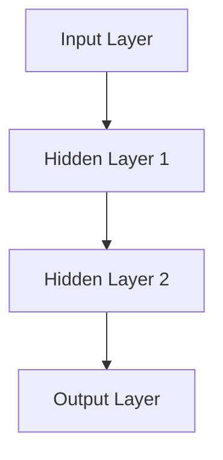
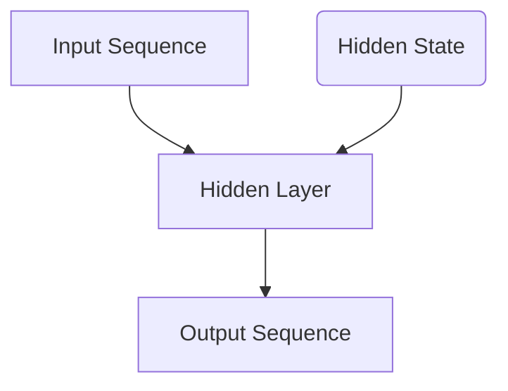
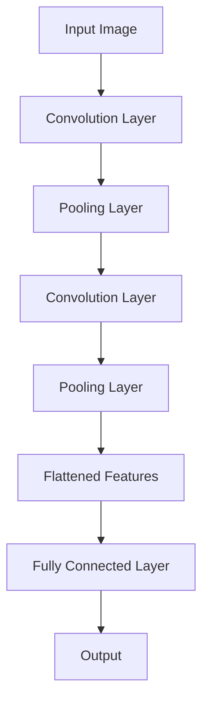
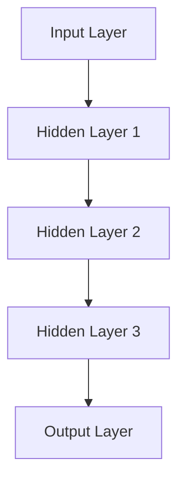
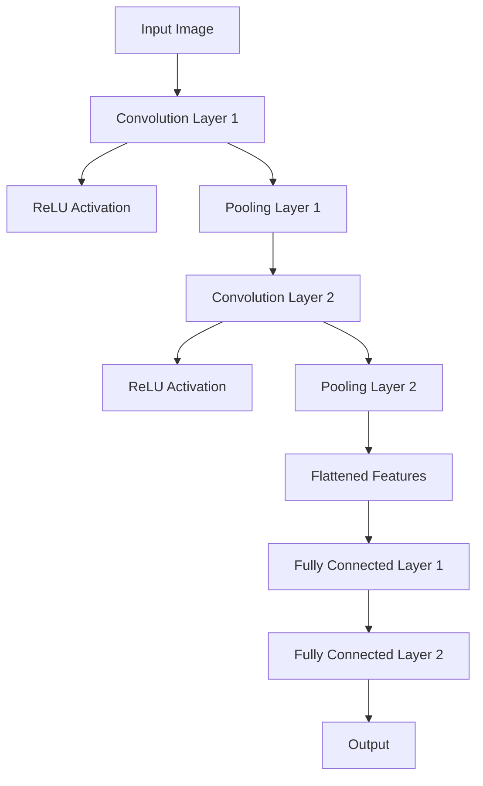
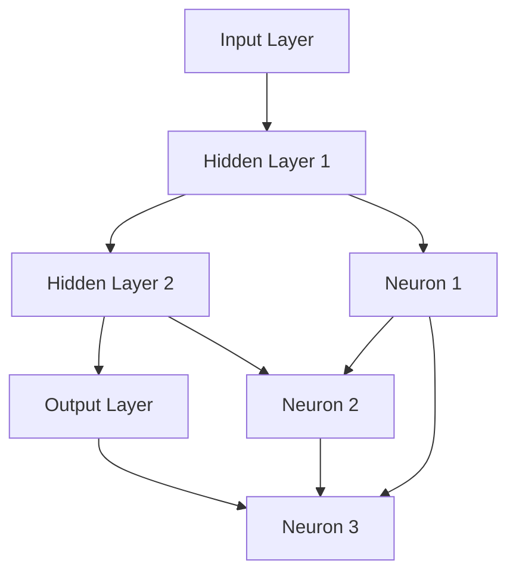
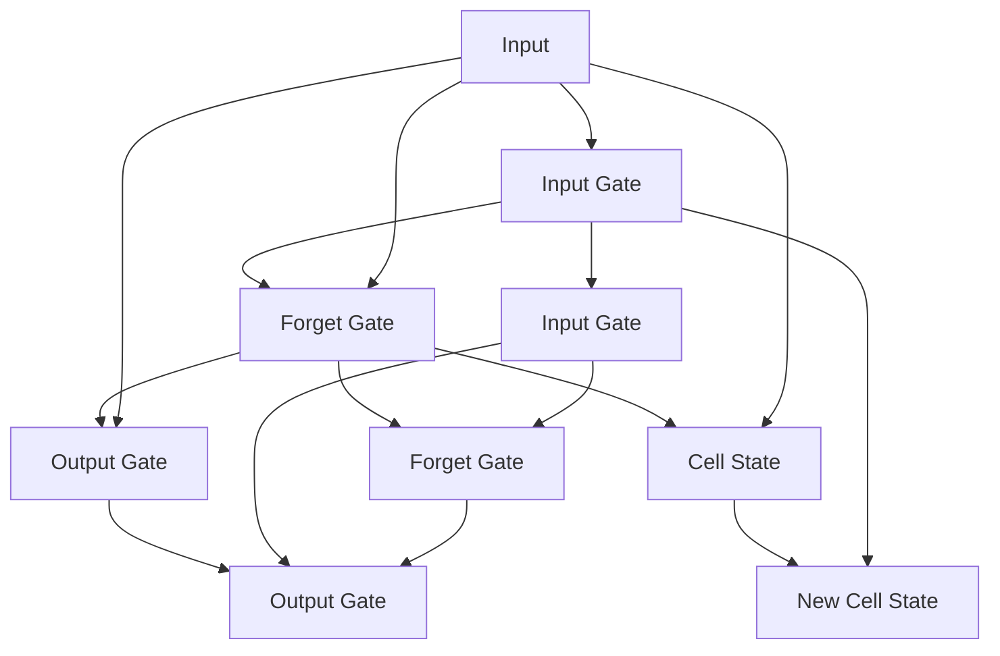
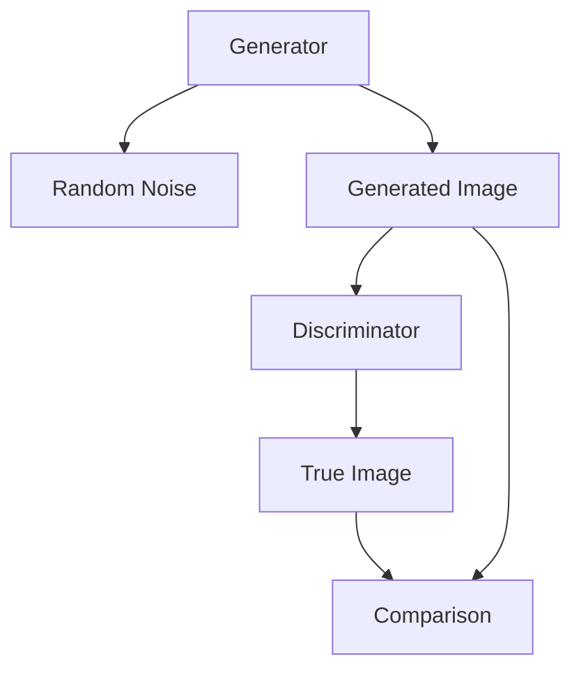

                 

# 《神经网络：人工智能的基石》

> **关键词**：神经网络，人工智能，深度学习，激活函数，优化算法，应用案例

> **摘要**：本文深入探讨了神经网络作为人工智能基石的理论基础、架构设计、算法优化及其实际应用。通过详细的步骤分析和实例讲解，帮助读者全面理解神经网络的工作原理，掌握其应用技能。

## 《神经网络：人工智能的基石》目录大纲

### 第一部分：神经网络基础

#### 第1章：神经网络的起源与发展

#### 第2章：神经网络的数学基础

#### 第3章：神经网络的分类

#### 第4章：前馈神经网络

#### 第5章：激活函数与优化算法

#### 第6章：神经网络的学习过程

#### 第7章：深度神经网络

#### 第8章：循环神经网络

#### 第9章：卷积神经网络

### 第二部分：神经网络的扩展与应用

#### 第10章：神经网络与强化学习

#### 第11章：生成对抗网络

#### 第12章：神经网络的未来发展趋势

### 附录

#### 附录A：神经网络开发工具和框架

#### 附录B：神经网络学习资源

#### 附录C：神经网络架构与算法的Mermaid流程图

#### 附录D：神经网络伪代码与算法解释

#### 附录E：神经网络项目实战案例

## 神经网络：人工智能的基石

神经网络是人工智能领域最为核心的基础技术之一，它不仅在理论上具有深远的意义，也在实际应用中展现了巨大的潜力。本文将带领读者深入神经网络的世界，从基础理论到实际应用，逐步解析神经网络的奥秘。

### **关键词**：神经网络，人工智能，深度学习，激活函数，优化算法，应用案例

### **摘要**：本文深入探讨了神经网络作为人工智能基石的理论基础、架构设计、算法优化及其实际应用。通过详细的步骤分析和实例讲解，帮助读者全面理解神经网络的工作原理，掌握其应用技能。

### 第一部分：神经网络基础

#### 第1章：神经网络的起源与发展

本章将回顾神经网络的起源和发展历程，探讨其在人工智能领域的地位和作用。通过历史视角，读者可以更好地理解神经网络的理论基础和发展脉络。

#### 第2章：神经网络的数学基础

数学基础是理解神经网络不可或缺的部分。本章将介绍神经网络的数学模型，包括激活函数、梯度下降算法等，为后续章节的深入分析打下坚实的基础。

#### 第3章：神经网络的分类

神经网络种类繁多，根据其结构和功能可以分为前馈神经网络、循环神经网络、卷积神经网络等。本章将分类介绍这些神经网络的特点和应用场景。

#### 第4章：前馈神经网络

前馈神经网络是神经网络家族中最基础的一员。本章将详细分析前馈神经网络的架构、训练过程和实际应用，如手写数字识别和图像分类。

#### 第5章：激活函数与优化算法

激活函数和优化算法是神经网络训练过程中不可或缺的组成部分。本章将深入探讨激活函数的类型及其选择原则，以及常见的优化算法如随机梯度下降（SGD）和Adam优化器的原理和应用。

#### 第6章：神经网络的学习过程

学习过程是神经网络的核心环节。本章将介绍神经网络的学习过程，包括数据预处理、模型训练、验证和评估。通过实例讲解，读者可以了解神经网络如何通过学习获取知识并应用于实际问题。

#### 第7章：深度神经网络

深度神经网络（DNN）是当前人工智能领域的研究热点。本章将探讨深度神经网络的架构、优势、挑战和实际应用，如自然语言处理和计算机视觉。

#### 第8章：循环神经网络

循环神经网络（RNN）在序列数据处理方面具有独特的优势。本章将介绍循环神经网络的原理、训练和优化方法，以及其在语音识别和机器翻译等领域的应用。

#### 第9章：卷积神经网络

卷积神经网络（CNN）在图像处理领域取得了显著的成果。本章将详细讲解卷积神经网络的原理、架构和训练过程，以及其在图像识别和视频处理等领域的应用。

### 第二部分：神经网络的扩展与应用

#### 第10章：神经网络与强化学习

强化学习与神经网络的结合为人工智能带来了新的发展机遇。本章将探讨神经网络在强化学习中的应用，如游戏控制和机器人控制。

#### 第11章：生成对抗网络

生成对抗网络（GAN）是当前人工智能领域的热门研究方向。本章将介绍GAN的基本原理、变体和改进，以及其在图像生成和视频生成等领域的应用。

#### 第12章：神经网络的未来发展趋势

随着技术的不断进步，神经网络在人工智能领域的发展也面临着新的机遇和挑战。本章将探讨神经网络的研究方向、未来发展趋势以及在社会中的应用前景。

### 附录

#### 附录A：神经网络开发工具和框架

本章将介绍常用的神经网络开发工具和框架，如TensorFlow、PyTorch和Keras等，帮助读者了解如何在实际项目中应用神经网络。

#### 附录B：神经网络学习资源

本章将推荐神经网络的学习资源，包括经典论文、在线课程和教程，以及推荐阅读的书单，供读者进一步学习和研究。

#### 附录C：神经网络架构与算法的Mermaid流程图

本章将使用Mermaid语言绘制神经网络架构和算法的流程图，帮助读者直观地理解神经网络的工作原理和流程。

#### 附录D：神经网络伪代码与算法解释

本章将使用伪代码详细解释神经网络的主要算法，如前馈神经网络训练、循环神经网络训练和卷积神经网络训练，帮助读者掌握算法实现的细节。

#### 附录E：神经网络项目实战案例

本章将通过实际项目案例，如手写数字识别、图像分类和自然语言处理项目，介绍神经网络在实际开发中的应用，并提供详细的代码实现和解读。

## 结语

神经网络作为人工智能的基石，正引领着人工智能技术的发展。本文通过逐步分析推理，从基础理论到实际应用，全面解析了神经网络的工作原理和应用技能。希望读者能够通过本文的学习，深入理解神经网络的奥秘，掌握其应用技巧，为人工智能领域的发展贡献自己的力量。

**作者：AI天才研究院/AI Genius Institute & 禅与计算机程序设计艺术 /Zen And The Art of Computer Programming**

---

### 第一部分：神经网络基础

#### 第1章：神经网络的起源与发展

神经网络（Neural Network，简称NN）作为人工智能（Artificial Intelligence，简称AI）的核心技术之一，其历史可以追溯到20世纪40年代。当时，心理学家McCulloch和数学家Pitts提出了一种基于神经元模型的理论，这种模型后来被称为“McCulloch-Pitts神经元”。这一理论奠定了神经网络的基础，标志着神经网络概念的诞生。

**1.1 人工智能的兴起与神经网络的历史背景**

人工智能的起源可以追溯到20世纪50年代，当时科学家们开始探讨如何让计算机模拟人类智能。神经网络在这一背景下得到了迅速发展。20世纪80年代，Hopfield网络和 Boltzmann机等神经网络模型的提出，为神经网络在模式识别和优化问题中的应用奠定了基础。进入21世纪，随着计算能力的提升和大数据技术的发展，神经网络迎来了新的发展机遇，特别是深度神经网络（Deep Neural Network，简称DNN）在图像识别、语音识别和自然语言处理等领域的突破，使得神经网络成为人工智能的核心技术。

**1.2 神经网络的基本概念**

神经网络是由大量简单但可重复的神经元（或称为节点）组成的复杂网络。每个神经元都接收多个输入信号，通过加权求和处理后，产生一个输出信号。神经网络的工作原理类似于人脑中的神经元，因此被称为“人工神经网络”。

**1.2.1 神经元的结构**

一个基本的神经元包括以下几个部分：

- **输入层**：接收外部信号的输入。
- **加权层**：对输入信号进行加权处理。
- **求和层**：将加权后的输入信号求和。
- **激活层**：对求和结果应用激活函数，产生输出信号。

**1.2.2 神经网络的工作原理**

神经网络通过以下几个步骤工作：

1. **信号传递**：输入信号通过神经元网络的输入层进入网络。
2. **加权求和处理**：每个输入信号通过加权层与相应的权重相乘。
3. **求和**：将加权后的信号求和，得到一个中间结果。
4. **激活**：中间结果通过激活函数进行处理，产生输出信号。
5. **输出**：输出信号可以是一个具体的数值，也可以是一个分类结果。

**1.3 神经网络的数学基础**

神经网络的数学基础主要包括两部分：激活函数和优化算法。

**1.3.1 激活函数**

激活函数是神经网络中的一个关键组件，它用于将神经元的线性输出转换为非线性输出。常见的激活函数包括：

- **Sigmoid函数**：将输入值映射到(0,1)区间。
  
  $$
  \sigma(x) = \frac{1}{1 + e^{-x}}
  $$

- **ReLU函数**：常用于隐藏层，可以加快神经网络的训练速度。

  $$
  \text{ReLU}(x) = \max(0, x)
  $$

**1.3.2 优化算法**

优化算法用于调整神经网络中的权重，以最小化损失函数。常见的优化算法包括：

- **随机梯度下降（SGD）**：每次迭代使用一个样本的梯度进行权重更新。

  $$
  \theta = \theta - \alpha \cdot \nabla_{\theta} J(\theta)
  $$

- **Adam优化器**：结合了SGD和动量法的优点，适应性强。

  $$
  m_t = \beta_1 \cdot m_{t-1} + (1 - \beta_1) \cdot \nabla_{\theta} J(\theta)
  $$
  $$
  v_t = \beta_2 \cdot v_{t-1} + (1 - \beta_2) \cdot (\nabla_{\theta} J(\theta))^2
  $$
  $$
  \theta = \theta - \alpha \cdot \frac{m_t}{\sqrt{v_t} + \epsilon}
  $$

**1.4 神经网络的分类**

神经网络根据结构和功能的不同，可以分为以下几类：

- **前馈神经网络（Feedforward Neural Network）**：信息流从输入层流向输出层，中间不形成循环。
- **循环神经网络（Recurrent Neural Network，RNN）**：信息流在神经元之间形成循环，适合处理序列数据。
- **卷积神经网络（Convolutional Neural Network，CNN）**：通过卷积操作和池化操作，对图像数据进行特征提取。

在后续章节中，我们将逐一深入探讨这些神经网络的基本概念、架构设计和实际应用。

#### 第2章：神经网络的数学基础

神经网络的数学基础是其能够有效学习、预测和分类的核心。本章将详细介绍神经网络中使用的数学工具，包括激活函数、损失函数、梯度下降算法等。

**2.1 激活函数**

激活函数是神经网络中用于引入非线性的关键组件。它将线性组合的输入值映射到输出值，使得神经网络能够处理复杂的问题。常见的激活函数有：

**2.1.1 Sigmoid函数**

Sigmoid函数是最早被广泛使用的激活函数之一，它将输入值压缩到(0,1)区间，常用于二分类问题。

$$
\sigma(x) = \frac{1}{1 + e^{-x}}
$$

Sigmoid函数的导数很容易计算，这在梯度下降算法中至关重要。

$$
\sigma'(x) = \sigma(x) \cdot (1 - \sigma(x))
$$

**2.1.2 ReLU函数**

ReLU（Rectified Linear Unit）函数是一种简单而有效的激活函数，它在输入小于0时返回0，输入大于等于0时返回输入值。ReLU函数在训练深层网络时特别有效，因为它可以避免神经元“死掉”（即所有输入都是负数，输出为0）。

$$
\text{ReLU}(x) = \max(0, x)
$$

ReLU函数的导数很简单，对于所有输入，导数都是1或0。

$$
\text{ReLU}'(x) =
\begin{cases}
1 & \text{if } x \ge 0 \\
0 & \text{if } x < 0
\end{cases}
$$

**2.1.3 Tanh函数**

Tanh（双曲正切）函数是另一种常用的激活函数，它将输入值压缩到(-1,1)区间。

$$
\tanh(x) = \frac{e^x - e^{-x}}{e^x + e^{-x}}
$$

Tanh函数的导数与Sigmoid函数类似，但更容易处理。

$$
\tanh'(x) = 1 - \tanh^2(x)
$$

**2.2 损失函数**

损失函数是评估神经网络预测值与实际值之间差异的指标。在训练过程中，通过最小化损失函数来调整网络的权重。

**2.2.1 均方误差（MSE）**

均方误差（Mean Squared Error，MSE）是最常用的损失函数之一，它计算预测值与实际值之间的平均平方误差。

$$
MSE = \frac{1}{n} \sum_{i=1}^{n} (y_i - \hat{y}_i)^2
$$

其中，$y_i$是实际值，$\hat{y}_i$是预测值，$n$是样本数量。

MSE的导数如下：

$$
\frac{\partial MSE}{\partial \theta} = 2 \cdot (y - \hat{y})
$$

**2.2.2 交叉熵（Cross-Entropy）**

交叉熵损失函数常用于分类问题，它计算实际分布与预测分布之间的差异。

$$
CE = - \sum_{i=1}^{n} y_i \cdot \log(\hat{y}_i)
$$

其中，$y_i$是实际标签，$\hat{y}_i$是预测概率。

交叉熵的导数如下：

$$
\frac{\partial CE}{\partial \theta} = -y \cdot \hat{y}
$$

**2.3 梯度下降算法**

梯度下降算法是一种用于最小化损失函数的优化算法。在神经网络中，通过计算损失函数关于权重的梯度来更新权重。

**2.3.1 随机梯度下降（SGD）**

随机梯度下降（Stochastic Gradient Descent，SGD）是在每个训练样本上计算一次梯度并更新权重。SGD具有较高的方差，但能够快速跳出局部最小值。

$$
\theta = \theta - \alpha \cdot \nabla_{\theta} J(\theta)
$$

其中，$\alpha$是学习率，$J(\theta)$是损失函数。

**2.3.2 批量梯度下降（BGD）**

批量梯度下降（Batch Gradient Descent，BGD）是在整个训练集上计算一次梯度并更新权重。BGD能够得到全局最小值，但计算成本较高。

$$
\theta = \theta - \alpha \cdot \frac{1}{n} \sum_{i=1}^{n} \nabla_{\theta} J(\theta)
$$

**2.3.3 小批量梯度下降（MBGD）**

小批量梯度下降（Mini-Batch Gradient Descent，MBGD）是批量梯度下降和随机梯度下降的折中方案。它每次在部分训练样本上计算梯度并更新权重。

$$
\theta = \theta - \alpha \cdot \frac{1}{m} \sum_{i=1}^{m} \nabla_{\theta} J(\theta)
$$

其中，$m$是小批量的大小。

**2.4 优化算法**

为了提高梯度下降算法的收敛速度，减少陷入局部最小值的风险，可以采用一些优化算法。

**2.4.1 动量法**

动量法通过引入动量项来加速梯度的方向，减少在平坦区域的振荡。

$$
v_t = \beta \cdot v_{t-1} + (1 - \beta) \cdot \nabla_{\theta} J(\theta)
$$

$$
\theta = \theta - v_t
$$

其中，$v_t$是动量项，$\beta$是动量系数。

**2.4.2 Adam优化器**

Adam优化器结合了动量法和自适应学习率的方法，能够自适应调整学习率。

$$
m_t = \beta_1 \cdot m_{t-1} + (1 - \beta_1) \cdot \nabla_{\theta} J(\theta)
$$

$$
v_t = \beta_2 \cdot v_{t-1} + (1 - \beta_2) \cdot (\nabla_{\theta} J(\theta))^2
$$

$$
\theta = \theta - \alpha \cdot \frac{m_t}{\sqrt{v_t} + \epsilon}
$$

其中，$\beta_1$和$\beta_2$是动量系数，$\alpha$是学习率，$\epsilon$是常数项。

通过以上数学工具，神经网络能够有效地学习、优化和预测。在下一章中，我们将探讨神经网络的分类及其应用。

### 第3章：神经网络的分类

神经网络根据其结构和功能的不同，可以分为多种类型。每种类型的神经网络都有其独特的架构和应用场景。本章将介绍几种常见的神经网络类型，包括前馈神经网络、循环神经网络和卷积神经网络。

#### 第3章.1 前馈神经网络

前馈神经网络（Feedforward Neural Network，FFNN）是最简单和最常见的一种神经网络结构。它的信息流是单向的，从输入层流向输出层，中间没有循环。前馈神经网络由多个层次组成，包括输入层、一个或多个隐藏层以及输出层。

**3.1.1 前馈神经网络的架构**

- **输入层**：接收外部输入数据。
- **隐藏层**：一个或多个隐藏层，每个隐藏层由多个神经元组成。隐藏层用于提取和转换输入特征。
- **输出层**：产生最终的输出结果，可以是分类标签或回归值。

前馈神经网络的每个神经元都接收来自前一层的所有神经元的输出，并应用加权求和以及激活函数。下面是一个简单的前馈神经网络架构的Mermaid流程图：



**3.1.2 前馈神经网络的训练过程**

前馈神经网络的训练过程包括以下步骤：

1. **前向传播**：将输入数据传递到神经网络的输入层，然后逐层传递到输出层，得到预测输出。
2. **计算损失**：计算预测输出与实际输出之间的差异，通常使用均方误差（MSE）或交叉熵损失函数。
3. **反向传播**：计算每个层的梯度，并使用梯度下降算法更新网络的权重。
4. **迭代更新**：重复前向传播和反向传播，直到满足停止条件（如达到指定迭代次数或损失低于阈值）。

下面是前馈神经网络训练过程的伪代码：

```python
for epoch in range(num_epochs):
    for input, target in dataset:
        # 前向传播
        output = forward_pass(input)
        loss = calculate_loss(target, output)
        
        # 反向传播
        gradients = backward_pass(output, target)
        
        # 更新权重
        update_weights(gradients, learning_rate)
```

**3.1.3 前馈神经网络的实际应用**

前馈神经网络在图像识别、语音识别、情感分析等领域有广泛的应用。以下是一些实际应用示例：

- **图像识别**：使用前馈神经网络进行手写数字识别和面部识别。
- **语音识别**：将语音信号转换为文本，如智能语音助手。
- **情感分析**：分析文本情感，如情感分类和情感极性判断。

#### 第3章.2 循环神经网络

循环神经网络（Recurrent Neural Network，RNN）是一种能够处理序列数据的神经网络。与前馈神经网络不同，RNN具有反馈连接，允许信息在神经元之间循环，从而记住前面的输入。

**3.2.1 循环神经网络的架构**

- **输入层**：接收序列的当前输入。
- **隐藏层**：一个或多个隐藏层，每个隐藏层包含一个状态向量，用于存储序列信息。
- **输出层**：产生序列的输出。

RNN的每个隐藏层状态不仅依赖于当前输入，还依赖于前一层的隐藏状态。下面是循环神经网络架构的Mermaid流程图：



**3.2.2 循环神经网络的训练过程**

循环神经网络的训练过程与前馈神经网络类似，但引入了序列的时间维度。以下是其主要步骤：

1. **前向传播**：将序列的每个输入传递到隐藏层，更新隐藏状态，并产生输出。
2. **计算损失**：计算输出与实际输出之间的差异，使用损失函数（如均方误差或交叉熵）。
3. **反向传播**：通过时间步反向传播误差，计算每个时间步的梯度。
4. **权重更新**：使用梯度下降算法更新网络权重。

以下是循环神经网络训练过程的伪代码：

```python
for epoch in range(num_epochs):
    for sequence, target in dataset:
        # 前向传播
        hidden_state, output = forward_pass(sequence)
        loss = calculate_loss(target, output)
        
        # 反向传播
        gradients = backward_pass(hidden_state, output, sequence)
        
        # 更新权重
        update_weights(gradients, learning_rate)
```

**3.2.3 循环神经网络的实际应用**

循环神经网络在处理序列数据方面具有优势，以下是一些实际应用示例：

- **语音识别**：将语音信号转换为文本。
- **自然语言处理**：文本分类、情感分析、机器翻译。
- **时间序列预测**：股票价格预测、天气预测。

#### 第3章.3 卷积神经网络

卷积神经网络（Convolutional Neural Network，CNN）是一种特别适合处理图像数据的神经网络。它通过卷积操作和池化操作提取图像特征，从而实现图像分类、目标检测等任务。

**3.3.1 卷积神经网络的架构**

- **卷积层**：通过卷积操作提取图像特征。
- **池化层**：用于降低特征图的尺寸，减少参数数量。
- **全连接层**：将卷积特征映射到最终输出。

CNN的架构可以包含多个卷积层和池化层，最后通过全连接层产生输出。下面是卷积神经网络架构的Mermaid流程图：



**3.3.2 卷积神经网络的训练过程**

卷积神经网络的训练过程与前馈神经网络类似，但包括卷积操作和池化操作。以下是其主要步骤：

1. **前向传播**：输入图像通过卷积层和池化层，提取特征，最后通过全连接层产生输出。
2. **计算损失**：计算输出与实际输出之间的差异，使用损失函数（如交叉熵）。
3. **反向传播**：通过卷积层和池化层反向传播误差，计算每个层的梯度。
4. **权重更新**：使用梯度下降算法更新网络权重。

以下是卷积神经网络训练过程的伪代码：

```python
for epoch in range(num_epochs):
    for image, target in dataset:
        # 前向传播
        features = forward_pass(image)
        output = fully_connected(features)
        loss = calculate_loss(target, output)
        
        # 反向传播
        gradients = backward_pass(output, target, features)
        
        # 更新权重
        update_weights(gradients, learning_rate)
```

**3.3.3 卷积神经网络的实际应用**

卷积神经网络在图像处理领域有广泛的应用，以下是一些实际应用示例：

- **图像分类**：对图像进行分类，如ImageNet比赛。
- **目标检测**：检测图像中的目标物体，如YOLO算法。
- **人脸识别**：识别人脸图像，如OpenFace库。

通过本章的介绍，读者应该对前馈神经网络、循环神经网络和卷积神经网络有了基本的了解。在下一章中，我们将进一步探讨激活函数和优化算法，这些是神经网络训练和优化的关键。

### 第4章：前馈神经网络

前馈神经网络（Feedforward Neural Network，FFNN）是最基本和最常用的神经网络类型之一，它通过多层神经元的层层传递，实现输入到输出的映射。本章将详细探讨前馈神经网络的架构、训练过程及其在实际应用中的优势。

#### 4.1 前馈神经网络的架构

前馈神经网络由多个层次组成，包括输入层、隐藏层和输出层。每个层次中的神经元都按顺序排列，信息从前一层传递到下一层，因此被称为“前馈”。

**4.1.1 输入层（Input Layer）**

输入层接收外部输入数据，这些数据可以是数值、文本或图像等。每个输入神经元对应一个特征，如图像中的像素值。

**4.1.2 隐藏层（Hidden Layers）**

隐藏层位于输入层和输出层之间，用于提取和转换输入特征。隐藏层的数量和每个层中的神经元数量可以根据问题的复杂度进行调整。每层的神经元接收来自前一层所有神经元的输入，并应用加权求和处理和激活函数。

**4.1.3 输出层（Output Layer）**

输出层产生最终的输出结果，这些结果可以是分类标签、概率分布或回归值。输出层的神经元数量和类型取决于具体的应用场景。

**4.1.4 神经元结构**

每个神经元包括以下几个部分：

- **输入**：接收来自前一层的所有神经元的输出。
- **权重**：每个输入都与一个权重相乘。
- **偏置**：用于引入非线性。
- **求和**：对加权输入求和，加上偏置。
- **激活函数**：对求和结果进行非线性变换，产生输出。

下面是一个简单的三层前馈神经网络架构的Mermaid流程图：


#### 4.2 前馈神经网络的训练过程

前馈神经网络的训练过程包括以下几个步骤：前向传播、计算损失、反向传播和权重更新。

**4.2.1 前向传播（Forward Propagation）**

前向传播是将输入数据传递到神经网络的输入层，然后逐层传递到输出层，得到预测输出。每个神经元按照以下步骤计算：

1. **加权求和**：每个输入值与相应的权重相乘，然后求和。
2. **应用激活函数**：使用激活函数（如Sigmoid或ReLU）将求和结果转换为输出值。

前向传播的伪代码如下：

```python
def forward_pass(input_data):
    output = input_data
    for layer in hidden_layers:
        output = layer.forward(output)
    return output
```

**4.2.2 计算损失（Calculate Loss）**

计算损失是评估预测输出与实际输出之间的差异。常用的损失函数有均方误差（MSE）和交叉熵（Cross-Entropy）。均方误差适用于回归问题，而交叉熵适用于分类问题。

均方误差的公式如下：

$$
MSE = \frac{1}{n} \sum_{i=1}^{n} (y_i - \hat{y}_i)^2
$$

交叉熵的公式如下：

$$
CE = - \sum_{i=1}^{n} y_i \cdot \log(\hat{y}_i)
$$

**4.2.3 反向传播（Backpropagation）**

反向传播是计算损失函数关于网络权重的梯度，并用于更新权重。反向传播分为两个阶段：前向阶段和后向阶段。

1. **前向阶段**：计算每个神经元的输出值和误差。
2. **后向阶段**：从输出层开始，反向计算每个神经元的梯度。

反向传播的伪代码如下：

```python
def backward_pass(output, target):
    gradients = []
    for layer in reversed(hidden_layers):
        gradient = layer.backward(output, target)
        gradients.append(gradient)
    return gradients
```

**4.2.4 权重更新（Weight Update）**

权重更新是通过梯度下降算法进行的。梯度下降算法使用计算得到的梯度来更新权重，以最小化损失函数。

梯度下降的公式如下：

$$
\theta = \theta - \alpha \cdot \nabla_{\theta} J(\theta)
$$

其中，$\theta$是权重，$\alpha$是学习率，$J(\theta)$是损失函数。

权重更新的伪代码如下：

```python
def update_weights(gradients, learning_rate):
    for layer in hidden_layers:
        layer.update_weights(gradients, learning_rate)
```

#### 4.3 前馈神经网络的优势

前馈神经网络具有以下优势：

- **简单性**：前馈神经网络的结构简单，易于理解和实现。
- **灵活性**：可以通过调整层数和神经元数量来适应不同的任务。
- **广泛适用性**：前馈神经网络可以用于多种类型的问题，包括回归、分类和特征提取。
- **高效的计算**：现代计算机和图形处理器（GPU）使得前馈神经网络的计算效率大幅提升。

#### 4.4 前馈神经网络的实际应用

前馈神经网络在许多实际应用中都有成功应用，以下是一些例子：

- **图像识别**：前馈神经网络可以用于手写数字识别、面部识别和物体分类。
- **语音识别**：前馈神经网络可以用于语音信号的处理和文本转换。
- **自然语言处理**：前馈神经网络可以用于文本分类、情感分析和机器翻译。

通过本章的讨论，读者应该对前馈神经网络的架构、训练过程和实际应用有了更深入的理解。在下一章中，我们将探讨激活函数和优化算法，这些是神经网络训练和优化的关键组成部分。

### 第5章：激活函数与优化算法

激活函数和优化算法是神经网络训练过程中至关重要的组成部分。本章将详细介绍几种常见的激活函数和优化算法，包括Sigmoid函数、ReLU函数、随机梯度下降（SGD）和Adam优化器。

#### 5.1 激活函数

激活函数用于引入非线性特性，使得神经网络能够处理复杂的问题。以下是几种常用的激活函数：

**5.1.1 Sigmoid函数**

Sigmoid函数是最早被广泛使用的激活函数之一。它将输入值压缩到(0,1)区间，使得神经元输出能够表示概率。

$$
\sigma(x) = \frac{1}{1 + e^{-x}}
$$

Sigmoid函数的优点是其导数容易计算，但缺点是当输入值很大或很小时，梯度接近0，容易导致梯度消失问题。

$$
\sigma'(x) = \sigma(x) \cdot (1 - \sigma(x))
$$

**5.1.2 ReLU函数**

ReLU函数（Rectified Linear Unit）是一种简单而有效的激活函数，它在输入小于0时返回0，输入大于等于0时返回输入值。ReLU函数可以加快神经网络的训练速度，并且不容易出现梯度消失问题。

$$
\text{ReLU}(x) = \max(0, x)
$$

ReLU函数的导数非常简单：

$$
\text{ReLU}'(x) =
\begin{cases}
1 & \text{if } x \ge 0 \\
0 & \text{if } x < 0
\end{cases}
$$

**5.1.3 Tanh函数**

Tanh函数（双曲正切函数）将输入值压缩到(-1,1)区间，与Sigmoid函数类似，但更容易处理。

$$
\tanh(x) = \frac{e^x - e^{-x}}{e^x + e^{-x}}
$$

Tanh函数的导数如下：

$$
\tanh'(x) = 1 - \tanh^2(x)
$$

**5.1.4 Leaky ReLU函数**

Leaky ReLU函数是ReLU函数的一个变种，它解决了ReLU函数中的“死亡神经元”问题，即当输入为负值时，ReLU函数的导数为0。Leaky ReLU函数引入一个很小的常数来避免这种情况。

$$
\text{Leaky ReLU}(x) = \max(0.01x, x)
$$

Leaky ReLU函数的导数如下：

$$
\text{Leaky ReLU}'(x) =
\begin{cases}
0.01 & \text{if } x < 0 \\
1 & \text{if } x \ge 0
\end{cases}
$$

#### 5.2 优化算法

优化算法用于调整神经网络中的权重，以最小化损失函数。以下是几种常见的优化算法：

**5.2.1 随机梯度下降（SGD）**

随机梯度下降（Stochastic Gradient Descent，SGD）是在每个训练样本上计算一次梯度并更新权重。SGD的优点是计算速度快，缺点是方差较大，可能导致训练结果不稳定。

$$
\theta = \theta - \alpha \cdot \nabla_{\theta} J(\theta)
$$

其中，$\alpha$是学习率。

**5.2.2 批量梯度下降（BGD）**

批量梯度下降（Batch Gradient Descent，BGD）是在整个训练集上计算一次梯度并更新权重。BGD能够得到全局最小值，但计算成本较高。

$$
\theta = \theta - \alpha \cdot \frac{1}{n} \sum_{i=1}^{n} \nabla_{\theta} J(\theta)
$$

其中，$n$是样本数量。

**5.2.3 小批量梯度下降（MBGD）**

小批量梯度下降（Mini-Batch Gradient Descent，MBGD）是批量梯度下降和随机梯度下降的折中方案。它每次在部分训练样本上计算梯度并更新权重。

$$
\theta = \theta - \alpha \cdot \frac{1}{m} \sum_{i=1}^{m} \nabla_{\theta} J(\theta)
$$

其中，$m$是小批量的大小。

**5.2.4 动量法**

动量法通过引入动量项来加速梯度的方向，减少在平坦区域的振荡。

$$
v_t = \beta \cdot v_{t-1} + (1 - \beta) \cdot \nabla_{\theta} J(\theta)
$$

$$
\theta = \theta - v_t
$$

其中，$v_t$是动量项，$\beta$是动量系数。

**5.2.5 Adam优化器**

Adam优化器结合了动量法和自适应学习率的方法，能够自适应调整学习率。

$$
m_t = \beta_1 \cdot m_{t-1} + (1 - \beta_1) \cdot \nabla_{\theta} J(\theta)
$$

$$
v_t = \beta_2 \cdot v_{t-1} + (1 - \beta_2) \cdot (\nabla_{\theta} J(\theta))^2
$$

$$
\theta = \theta - \alpha \cdot \frac{m_t}{\sqrt{v_t} + \epsilon}
$$

其中，$\beta_1$和$\beta_2$是动量系数，$\alpha$是学习率，$\epsilon$是常数项。

通过本章的讨论，读者应该对激活函数和优化算法有了更深入的理解。这些工具使得神经网络能够有效地学习、优化和预测，为人工智能的应用奠定了基础。在下一章中，我们将探讨神经网络的学习过程。

### 第6章：神经网络的学习过程

神经网络的学习过程是其核心环节，涉及到数据预处理、模型训练和验证、模型评估等多个步骤。本章将详细介绍神经网络的学习过程，以及如何优化这一过程以获得更好的性能。

#### 6.1 数据预处理

数据预处理是神经网络学习过程中的重要步骤，它包括数据清洗、归一化、特征提取等。

**6.1.1 数据清洗**

数据清洗是确保数据质量的过程，包括去除噪声、填充缺失值、去除异常值等。对于图像数据，可能还需要进行图像增强，如旋转、缩放、剪裁等，以提高模型的泛化能力。

**6.1.2 数据归一化**

数据归一化是将数据缩放到同一尺度，以防止某些特征对模型的影响过大。常用的归一化方法包括最小-最大缩放和标准缩放。

- **最小-最大缩放**：

$$
x_{\text{normalized}} = \frac{x - x_{\text{min}}}{x_{\text{max}} - x_{\text{min}}}
$$

- **标准缩放**：

$$
x_{\text{normalized}} = \frac{x - \mu}{\sigma}
$$

其中，$x_{\text{min}}$和$x_{\text{max}}$分别是特征的最小值和最大值，$\mu$和$\sigma$分别是特征的均值和标准差。

**6.1.3 特征提取**

特征提取是从原始数据中提取有助于模型学习的关键特征。对于图像数据，常用的特征提取方法包括边缘检测、纹理分析、颜色特征等。

#### 6.2 训练与验证

训练和验证是神经网络学习过程的关键步骤。训练过程通过调整网络权重，使模型能够对训练数据进行准确的预测。验证过程用于评估模型的泛化能力。

**6.2.1 训练集与验证集**

训练集用于训练模型，验证集用于评估模型的性能。通常，训练集和验证集是从原始数据中随机划分的。

**6.2.2 超参数调整**

超参数是影响模型性能的关键参数，如学习率、批次大小、隐藏层神经元数量等。调整超参数是优化模型性能的重要手段。常用的方法包括网格搜索和随机搜索。

**6.2.3 训练过程**

训练过程包括以下几个步骤：

1. **前向传播**：将输入数据传递到神经网络的输入层，然后逐层传递到输出层，得到预测输出。
2. **计算损失**：计算预测输出与实际输出之间的差异，使用损失函数（如均方误差或交叉熵）。
3. **反向传播**：计算每个层的梯度，并使用梯度下降算法更新网络的权重。
4. **迭代更新**：重复前向传播和反向传播，直到满足停止条件（如达到指定迭代次数或损失低于阈值）。

以下是神经网络训练过程的伪代码：

```python
for epoch in range(num_epochs):
    for input, target in dataset:
        # 前向传播
        output = forward_pass(input)
        loss = calculate_loss(target, output)
        
        # 反向传播
        gradients = backward_pass(output, target, input)
        
        # 更新权重
        update_weights(gradients, learning_rate)
```

#### 6.3 模型评估

模型评估是评估神经网络性能的重要步骤。常用的评估指标包括准确率、召回率、F1值等。

**6.3.1 准确率（Accuracy）**

准确率是预测正确的样本数量占总样本数量的比例。

$$
\text{Accuracy} = \frac{\text{预测正确数}}{\text{总样本数}}
$$

**6.3.2 召回率（Recall）**

召回率是预测正确的正样本数量与实际正样本数量的比例。

$$
\text{Recall} = \frac{\text{预测正确的正样本数}}{\text{实际正样本数}}
$$

**6.3.3 F1值（F1 Score）**

F1值是准确率和召回率的调和平均值，用于平衡这两个指标。

$$
\text{F1 Score} = 2 \cdot \frac{\text{准确率} \cdot \text{召回率}}{\text{准确率} + \text{召回率}}
$$

#### 6.4 跨度与过拟合问题

跨度（Overfitting）是神经网络学习过程中常见的问题，即模型在训练数据上表现良好，但在未见过的数据上表现不佳。为了解决跨度问题，可以采用以下方法：

- **正则化**：通过引入正则化项，如L1正则化和L2正则化，限制权重的大小。
- **交叉验证**：使用交叉验证方法，如K折交叉验证，评估模型的泛化能力。
- **数据增强**：通过数据增强方法，如旋转、缩放、剪裁等，增加训练数据的多样性。

通过本章的讨论，读者应该对神经网络的学习过程有了更深入的理解。在下一章中，我们将探讨深度神经网络，这是一种具有多个隐藏层的神经网络，能够处理更加复杂的任务。

### 第7章：深度神经网络

深度神经网络（Deep Neural Network，DNN）是一种具有多个隐藏层的神经网络，相较于传统的单层神经网络，它能够更好地捕捉输入数据的复杂结构和特征。本章将详细探讨深度神经网络的架构、优势、挑战和实际应用。

#### 7.1 深度神经网络的架构

深度神经网络由多个层次组成，包括输入层、隐藏层和输出层。每个层次中的神经元都按顺序排列，信息从前一层传递到下一层。深度神经网络的隐藏层数量通常远远超过单层神经网络，以实现更复杂的特征提取和模式识别。

一个简单的深度神经网络架构可以表示为：



**7.1.1 层与节点的组织结构**

- **输入层**：接收外部输入数据，如图像、文本或数值。
- **隐藏层**：一个或多个隐藏层，每个隐藏层由多个神经元组成。隐藏层用于提取和转换输入特征。
- **输出层**：产生最终的输出结果，如分类标签、概率分布或回归值。

**7.1.2 深度神经网络的工作原理**

深度神经网络的工作原理与前馈神经网络类似，但具有以下特点：

1. **多层特征提取**：通过多个隐藏层，深度神经网络能够逐层提取输入数据的特征，从简单的低级特征到复杂的高级特征。
2. **非线性变换**：在每个隐藏层，神经元通过激活函数进行非线性变换，使得网络能够处理复杂的非线性问题。
3. **权重共享**：在某些架构中，同一层的神经元可能共享相同的权重，以减少参数数量，提高模型的泛化能力。

#### 7.2 深度学习的优势与挑战

**7.2.1 优势**

- **更好的特征提取**：通过多层特征提取，深度神经网络能够自动发现数据中的复杂模式和特征，从而提高模型的准确性和泛化能力。
- **更强的泛化能力**：深度神经网络能够处理大量数据和复杂问题，从而具有更好的泛化能力。
- **自适应学习能力**：深度神经网络可以通过大量的数据自动学习，并适应不同的任务和数据集。

**7.2.2 挑战**

- **计算资源需求**：深度神经网络需要大量的计算资源和存储空间，特别是在训练过程中，这可能导致训练时间延长。
- **参数调优**：深度神经网络具有大量的参数，需要精细调优，如学习率、批次大小、隐藏层数量等，以获得最佳性能。
- **过拟合风险**：深度神经网络容易过拟合，即模型在训练数据上表现良好，但在未见过的数据上表现不佳。为了防止过拟合，可以采用正则化、交叉验证和数据增强等方法。

#### 7.3 深度神经网络的实际应用

深度神经网络在许多实际应用中取得了显著的成果，以下是一些例子：

- **图像识别**：深度神经网络可以用于图像分类、目标检测和图像生成等任务，如卷积神经网络（CNN）在ImageNet竞赛中的成功。
- **语音识别**：深度神经网络可以用于语音信号的转换和文本识别，如基于循环神经网络（RNN）的语音识别系统。
- **自然语言处理**：深度神经网络可以用于文本分类、情感分析和机器翻译等任务，如基于长短期记忆网络（LSTM）和Transformer的文本处理模型。
- **医疗诊断**：深度神经网络可以用于医疗图像的分析和诊断，如基于CNN的肿瘤检测和基于RNN的医学文本分析。

#### 7.4 深度学习的挑战与未来方向

尽管深度神经网络在许多领域取得了巨大成功，但仍然面临一些挑战：

- **可解释性**：深度神经网络的内部决策过程通常难以解释，这限制了其在某些领域的应用，如医疗诊断和金融分析。
- **数据需求**：深度神经网络需要大量的训练数据，这可能导致数据隐私和公平性问题。
- **计算资源**：深度神经网络需要大量的计算资源，尤其是在训练过程中，这可能对环境产生负面影响。

未来，深度神经网络的研究方向可能包括：

- **神经架构搜索**：通过自动搜索最优的网络架构，以减少人工干预。
- **可解释性**：开发可解释的深度学习模型，以增加模型的可信度和透明度。
- **高效训练**：研究更高效的训练算法和优化方法，以减少训练时间和资源需求。
- **多模态学习**：结合不同类型的数据（如图像、文本和声音），以实现更复杂的任务。

通过本章的讨论，读者应该对深度神经网络有了更深入的理解。深度神经网络作为人工智能的核心技术，正不断推动着人工智能的发展和应用。在下一章中，我们将探讨循环神经网络，这是一种专门用于处理序列数据的神经网络。

### 第8章：循环神经网络

循环神经网络（Recurrent Neural Network，RNN）是一种能够处理序列数据的神经网络，它在时间序列预测、语音识别和自然语言处理等任务中具有广泛应用。本章将详细介绍循环神经网络的原理、训练和优化方法，以及其实际应用。

#### 8.1 循环神经网络的原理

循环神经网络与传统的前馈神经网络不同，它的信息流在神经元之间形成循环，使得网络能够记住之前的输入信息。循环神经网络的基本架构包括输入层、隐藏层和输出层。

**8.1.1 LSTM（长短期记忆）**

LSTM（Long Short-Term Memory）是循环神经网络的一种变体，专门设计来解决长期依赖问题。LSTM通过引入记忆单元和门控机制，能够有效地记住和遗忘长期信息。

LSTM单元的组成部分包括：

- **输入门**：决定哪些信息将被存储在记忆单元中。
- **遗忘门**：决定哪些信息将从记忆单元中遗忘。
- **输出门**：决定哪些信息将从记忆单元中输出。

LSTM单元的工作原理可以用以下公式表示：

$$
i_t = \sigma(W_{ix}x_t + W_{ih}h_{t-1} + b_i) \quad \text{（输入门）}$$
$$
f_t = \sigma(W_{fx}x_t + W_{fh}h_{t-1} + b_f) \quad \text{（遗忘门）}$$
$$
g_t = \tanh(W_{gx}x_t + W_{gh}h_{t-1} + b_g) \quad \text{（输入门控制）}$$
$$
o_t = \sigma(W_{ox}x_t + W_{oh}h_{t-1} + b_o) \quad \text{（输出门）}$$
$$
h_t = o_t \cdot \tanh(W_{hh}h_{t-1} + b_h) \quad \text{（隐藏层输出）}$$
$$
c_t = f_t \odot c_{t-1} + i_t \odot g_t \quad \text{（记忆单元更新）}$$

其中，$i_t$、$f_t$、$o_t$分别是输入门、遗忘门和输出门的激活值；$c_t$是记忆单元的激活值；$h_t$是隐藏层的输出。

**8.1.2 GRU（门控循环单元）**

GRU（Gated Recurrent Unit）是LSTM的简化版本，通过合并输入门和遗忘门，减少了参数数量，但仍然保持了良好的性能。

GRU单元的组成部分包括：

- **重置门**：决定如何更新隐藏状态。
- **更新门**：决定如何从上一个隐藏状态更新当前隐藏状态。

GRU单元的工作原理可以用以下公式表示：

$$
z_t = \sigma(W_{zx}x_t + W_{zh}h_{t-1} + b_z) \quad \text{（更新门）}$$
$$
r_t = \sigma(W_{rx}x_t + W_{rh}h_{t-1} + b_r) \quad \text{（重置门）}$$
$$
h_t' = \tanh(W_{gh} \odot (r_t \odot h_{t-1}) + W_{gx}x_t + b_g) \quad \text{（候选隐藏状态）}$$
$$
h_t = (1 - z_t) \odot h_{t-1} + z_t \odot h_t' \quad \text{（当前隐藏状态）}$$

#### 8.2 循环神经网络的训练与优化

**8.2.1 前向传播**

循环神经网络的训练过程包括前向传播和反向传播。在前向传播过程中，将序列的每个时间步输入到网络中，逐层计算隐藏状态和输出。

**8.2.2 反向传播**

反向传播是计算损失函数关于网络权重的梯度，并使用梯度下降算法更新权重。循环神经网络的反向传播过程较为复杂，因为梯度需要沿着时间步反向传播。

**8.2.3 优化算法**

为了提高训练效率和模型性能，循环神经网络常采用以下优化算法：

- **随机梯度下降（SGD）**：每次迭代使用一个样本的梯度更新权重。
- **Adam优化器**：结合了SGD和动量法的优点，自适应调整学习率。
- **RMSprop**：基于均方误差的优化算法，能够快速收敛。

#### 8.3 循环神经网络的实际应用

**8.3.1 语音识别**

语音识别是循环神经网络最成功的应用之一。通过LSTM或GRU，循环神经网络可以捕捉语音信号的序列特征，实现高精度的语音识别。

**8.3.2 机器翻译**

机器翻译是另一个重要的应用领域。循环神经网络可以处理输入语言的序列，通过编码器-解码器架构实现跨语言的翻译。

**8.3.3 情感分析**

情感分析是分析文本中的情感倾向。通过循环神经网络，可以提取文本的序列特征，实现情感分类和情感极性判断。

**8.3.4 股票价格预测**

股票价格预测是利用循环神经网络进行时间序列预测的一个例子。通过LSTM或GRU，可以捕捉市场的动态变化，实现股票价格的预测。

通过本章的讨论，读者应该对循环神经网络的原理、训练和优化方法以及实际应用有了更深入的理解。循环神经网络在处理序列数据方面具有独特的优势，将继续推动人工智能的发展和应用。在下一章中，我们将探讨卷积神经网络，这是一种专门用于处理图像数据的神经网络。

### 第9章：卷积神经网络

卷积神经网络（Convolutional Neural Network，CNN）是一种特别适合处理图像数据的神经网络。通过卷积操作和池化操作，CNN能够自动提取图像特征，从而实现图像分类、目标检测和图像生成等任务。本章将详细探讨卷积神经网络的原理、架构和实际应用。

#### 9.1 卷积神经网络的原理

卷积神经网络的基本思想是通过卷积操作提取图像特征，然后通过全连接层进行分类。卷积操作类似于滤波器在图像上滑动，计算相邻像素之间的相关性。

**9.1.1 卷积操作**

卷积操作包括以下几个步骤：

1. **卷积核（Kernel）**：卷积核是一个小的矩阵，用于在图像上滑动，计算局部相关性。
2. **步长（Stride）**：步长决定了卷积核每次移动的像素数。
3. **填充（Padding）**：填充是为了保持图像的大小不变，通常使用0填充。
4. **激活函数**：在卷积操作之后，使用激活函数（如ReLU）引入非线性。

卷积操作的数学表示如下：

$$
\text{Output}(i, j) = \sum_{k} \sum_{l} \text{Kernel}(k, l) \cdot \text{Input}(i - k, j - l) + \text{Bias}
$$

其中，$(i, j)$是输出位置，$(k, l)$是卷积核位置，$\text{Input}$是输入图像，$\text{Kernel}$是卷积核，$\text{Bias}$是偏置项。

**9.1.2 池化操作**

池化操作用于减少特征图的尺寸，减少参数数量。常见的池化操作包括最大池化和平均池化。

1. **最大池化（Max Pooling）**：在局部区域中选择最大值。
2. **平均池化（Average Pooling）**：在局部区域中选择平均值。

最大池化的数学表示如下：

$$
\text{Output}(i, j) = \max_{k \leq K, l \leq L} \text{Input}(i - k + 1, j - l + 1)
$$

其中，$K$和$L$分别是池化窗口的大小。

#### 9.2 卷积神经网络的架构

卷积神经网络通常由多个卷积层、池化层和全连接层组成。以下是一个典型的卷积神经网络架构：



**9.2.1 卷积层**

卷积层通过卷积操作提取图像特征，通常包含多个卷积核，以提取不同类型的特征。

**9.2.2 池化层**

池化层用于减少特征图的尺寸，降低模型的复杂性。

**9.2.3 全连接层**

全连接层将卷积特征映射到最终的输出，如分类标签或回归值。

#### 9.3 卷积神经网络的实际应用

卷积神经网络在图像处理领域有广泛的应用，以下是一些实际应用示例：

**9.3.1 图像分类**

图像分类是卷积神经网络最典型的应用之一。通过训练，卷积神经网络可以识别和分类图像中的物体。经典的图像分类任务包括ImageNet竞赛，其中卷积神经网络实现了超越人类的分类准确率。

**9.3.2 目标检测**

目标检测是识别图像中的多个对象及其位置。常见的目标检测算法包括R-CNN、Fast R-CNN、Faster R-CNN和YOLO。卷积神经网络在这些算法中起到了关键作用，通过提取图像特征和位置信息，实现高精度的目标检测。

**9.3.3 图像生成**

图像生成是利用卷积神经网络生成新的图像。生成对抗网络（GAN）是图像生成的重要工具，通过生成器和判别器的对抗训练，卷积神经网络能够生成逼真的图像。

**9.3.4 视频处理**

卷积神经网络在视频处理领域也有重要应用，包括视频分类、视频分割和视频生成。通过处理连续的图像帧，卷积神经网络可以捕捉视频中的动态变化。

通过本章的讨论，读者应该对卷积神经网络的原理、架构和实际应用有了更深入的理解。卷积神经网络在图像处理和视频处理领域具有广泛的应用前景，将继续推动人工智能的发展。在下一章中，我们将探讨神经网络与强化学习的结合。

### 第10章：神经网络与强化学习

神经网络与强化学习的结合为人工智能领域带来了新的发展机遇。强化学习是一种通过试错和奖励反馈进行决策和学习的方法，而神经网络则提供了强大的特征提取和模型学习能力。本章将探讨神经网络在强化学习中的应用，包括值函数网络和策略网络，以及强化学习在实际场景中的应用案例。

#### 10.1 强化学习的基本概念

强化学习（Reinforcement Learning，RL）是一种通过试错和奖励反馈进行决策和学习的方法。在强化学习中，智能体（Agent）通过执行动作（Action）与环境（Environment）进行交互，并通过获得的奖励（Reward）来学习最优策略（Policy）。强化学习的主要目标是找到一种策略，使得智能体在长期内获得最大的累积奖励。

**10.1.1 强化学习的主要组件**

- **状态（State）**：描述环境的当前情况。
- **动作（Action）**：智能体可执行的动作。
- **奖励（Reward）**：每个动作带来的即时奖励，用于评价动作的好坏。
- **策略（Policy）**：描述智能体如何选择动作的函数。

**10.1.2 强化学习的目标**

强化学习的目标是学习一个最优策略，使得智能体在执行动作时能够最大化累积奖励。通常，强化学习使用价值函数（Value Function）或策略梯度（Policy Gradient）等方法来优化策略。

#### 10.2 神经网络在强化学习中的应用

神经网络在强化学习中的应用主要体现在两个方向：值函数网络和价值函数网络。值函数网络用于评估状态的价值，而策略网络用于直接学习最优策略。

**10.2.1 值函数网络（Value Function Network）**

值函数网络是一种神经网络模型，用于评估给定状态的价值。通过训练值函数网络，智能体可以学习到哪些状态具有更高的价值，从而更好地进行决策。值函数网络通常用于解决具有值函数的问题，如Q-Learning和 SARSA。

值函数网络的训练过程如下：

1. **前向传播**：将状态输入到值函数网络，得到状态的价值估计。
2. **计算损失**：使用实际获得的奖励和预测的价值估计计算损失。
3. **反向传播**：使用梯度下降算法更新网络的权重。

**10.2.2 策略网络（Policy Network）**

策略网络是一种神经网络模型，用于直接学习最优策略。通过训练策略网络，智能体可以学习到在给定状态下应该采取的最佳动作。策略网络通常用于解决具有策略梯度的问题，如REINFORCE和PPO。

策略网络的训练过程如下：

1. **前向传播**：将状态输入到策略网络，得到动作的概率分布。
2. **计算损失**：使用实际获得的奖励和策略梯度计算损失。
3. **反向传播**：使用梯度下降算法更新网络的权重。

#### 10.3 强化学习案例研究

**10.3.1 游戏控制**

强化学习在游戏控制领域取得了显著成果。通过训练强化学习模型，智能体可以在Atari游戏、电子竞技游戏和棋类游戏中实现超越人类的水平。DQN（Deep Q-Network）和A3C（Asynchronous Advantage Actor-Critic）是两个经典的强化学习算法，在游戏控制中表现突出。

**10.3.2 机器人控制**

强化学习在机器人控制领域也有广泛应用。通过训练强化学习模型，机器人可以学会在复杂环境中执行任务，如行走、抓取和导航。例如，深度强化学习算法在机器人行走和平衡控制中取得了显著成果。

**10.3.3 自动驾驶**

自动驾驶是强化学习的另一个重要应用领域。通过训练强化学习模型，自动驾驶汽车可以学会在复杂的交通环境中进行决策，如行驶路径规划和避障。深度强化学习算法在自动驾驶领域表现突出，如Google的Waymo自动驾驶系统。

#### 10.4 神经网络与强化学习的结合优势

神经网络与强化学习的结合具有以下优势：

- **强大的特征提取能力**：神经网络可以自动提取输入数据的特征，从而提高强化学习的效率和效果。
- **非线性表示能力**：神经网络能够通过多层非线性变换表示复杂的决策函数，从而实现更精确的决策。
- **自适应学习能力**：神经网络可以自适应地调整权重，以适应不同的环境和任务。

通过本章的讨论，读者应该对神经网络与强化学习的结合及其应用有了更深入的理解。神经网络与强化学习的结合为人工智能领域带来了新的机遇和挑战，将继续推动人工智能的发展和应用。

### 第11章：生成对抗网络

生成对抗网络（Generative Adversarial Network，GAN）是近年来人工智能领域的一项重大突破。GAN通过两个对抗性神经网络的相互博弈，实现了高质量数据的生成。本章将详细介绍GAN的基本原理、改进方法及其实际应用。

#### 11.1 GAN的基本原理

GAN由两个主要组件组成：生成器（Generator）和判别器（Discriminator）。生成器的目标是生成尽可能真实的数据，而判别器的目标是区分生成器生成数据和真实数据。

**11.1.1 生成器和判别器的架构**

- **生成器**：生成器的输入通常是随机噪声，通过多个隐含层转换，最终生成与真实数据相似的数据。
- **判别器**：判别器接收生成器生成的数据和真实数据，通过比较二者的相似度来评估生成器的性能。

**11.1.2 GAN的训练过程**

GAN的训练过程是一个零和博弈，可以表示为以下优化问题：

1. **生成器的优化目标**：最大化判别器对生成数据的判断为真实数据的概率。
2. **判别器的优化目标**：最大化判别器对真实数据和生成数据的区分能力。

训练过程通过交替更新生成器和判别器的参数来实现上述目标。

#### 11.2 GAN的变体与改进

为了提高GAN的性能和稳定性，研究人员提出了许多GAN的变体和改进方法。以下是一些常见的GAN变体：

- **条件GAN（cGAN）**：cGAN引入条件信息，如类别标签，以生成更加具体的图像。cGAN的生成器和判别器的输入中包含条件信息。
- **改进GAN（wGAN）**：wGAN通过引入权重函数（如Lipschitz约束）来稳定GAN的训练过程。
- **感知GAN（ perceptual GAN）**：感知GAN强调生成图像的感知质量，而不是仅仅追求图像的像素级相似性。
- **循环一致GAN（cicGAN）**：cicGAN通过循环一致性损失来生成能够相互转换的数据。

#### 11.3 GAN的实际应用

GAN在图像生成、视频生成和自然语言生成等领域有广泛的应用。

**11.3.1 图像生成**

GAN在图像生成方面表现出色。通过训练，GAN可以生成逼真的图像，如人脸、风景和艺术作品。GAN还被用于图像超分辨率、图像修复和图像风格转换等任务。

**11.3.2 视频生成**

GAN在视频生成方面也有显著应用。通过训练，GAN可以生成连续的、逼真的视频序列，如人类动作、自然景象和动画。视频生成技术在电影制作、游戏开发等领域有重要应用。

**11.3.3 自然语言生成**

GAN在自然语言生成方面也有研究，通过生成对话、文章和故事等。GAN在机器翻译、文本摘要和生成对抗性文本生成等方面有广泛应用。

#### 11.4 GAN的挑战与未来方向

尽管GAN在图像和视频生成方面取得了显著成果，但仍面临一些挑战：

- **训练不稳定**：GAN的训练过程容易陷入局部最小值，导致生成器性能不佳。
- **计算资源需求**：GAN的训练过程需要大量的计算资源，特别是在处理高分辨率图像和视频时。
- **可解释性**：GAN的内部机制复杂，难以解释和验证生成数据的真实性和可靠性。

未来，GAN的研究方向可能包括：

- **训练稳定性**：研究更加稳定的训练方法，如平衡生成器和判别器的训练过程。
- **计算效率**：开发更高效的训练算法和优化方法，以减少计算资源需求。
- **可解释性**：提高GAN的可解释性，使其更易于理解和应用。
- **跨领域生成**：研究GAN在跨领域数据生成中的应用，如图像到视频、文本到图像等。

通过本章的讨论，读者应该对生成对抗网络的基本原理、改进方法及其实际应用有了更深入的理解。生成对抗网络作为一种强大的人工智能技术，将继续推动图像和视频生成等领域的发展。

### 第12章：神经网络的未来发展趋势

随着人工智能技术的不断发展，神经网络作为其核心基础技术之一，也在不断演进和扩展。本章将探讨神经网络在未来可能的发展趋势，包括研究方向、应用前景以及面临的挑战。

#### 12.1 神经网络的研究方向

**12.1.1 神经架构搜索（Neural Architecture Search，NAS）**

神经架构搜索是一种通过自动化搜索最优神经网络结构的方法。NAS可以通过搜索算法在大量可能的网络结构中找到最优或次优结构，从而提高模型的性能。未来的研究将集中在如何更高效地搜索复杂的网络结构，以及如何处理大规模数据集。

**12.1.2 脑机接口（Brain-Computer Interface，BCI）**

脑机接口是一种直接将大脑信号转换为计算机指令的技术。随着神经网络在信号处理和模式识别方面的进展，BCI技术有望实现更加高效的脑信号解码，从而帮助残障人士恢复运动能力和感觉功能。

**12.1.3 跨模态学习（Cross-Modal Learning）**

跨模态学习是指神经网络在不同类型的数据（如图像、文本、音频等）之间进行信息转换和学习。未来的研究将集中在如何有效地融合不同模态的信息，以实现更强大的多模态任务处理能力。

**12.1.4 小样本学习（Few-Shot Learning）**

小样本学习是研究如何在数据量非常有限的情况下训练有效的神经网络模型。未来的研究将集中在如何设计新的模型结构和训练策略，以降低对大量数据的依赖。

**12.1.5 强化学习与神经网络结合**

强化学习与神经网络的结合在许多领域取得了显著成果。未来的研究将集中在如何设计更有效的强化学习算法，以及如何将神经网络更好地应用于动态和不确定的环境中。

#### 12.2 神经网络在社会中的应用

**12.2.1 个性化服务**

神经网络在个性化服务领域具有广泛应用。通过分析用户的行为数据，神经网络可以推荐个性化的产品、内容和服务，从而提高用户体验和满意度。

**12.2.2 医疗诊断**

神经网络在医疗诊断领域具有巨大的潜力。通过分析医学图像和患者数据，神经网络可以辅助医生进行早期诊断、疾病预测和治疗方案推荐。

**12.2.3 自动驾驶**

自动驾驶是神经网络的重要应用领域。通过处理传感器数据和图像，神经网络可以辅助自动驾驶系统进行环境感知、路径规划和决策。

**12.2.4 金融分析**

神经网络在金融分析领域也有广泛的应用。通过分析市场数据和交易行为，神经网络可以预测股票价格、发现市场趋势和进行风险管理。

#### 12.3 神经网络面临的挑战

**12.3.1 可解释性**

神经网络作为“黑箱”模型，其内部决策过程通常难以解释。未来研究将集中在如何提高神经网络的可解释性，以便更好地理解模型的行为和决策过程。

**12.3.2 数据隐私和安全**

随着神经网络在各个领域的应用，数据隐私和安全问题日益突出。如何保护用户数据的隐私，防止数据泄露和滥用，是神经网络面临的重要挑战。

**12.3.3 资源消耗**

神经网络特别是深度神经网络在训练过程中需要大量的计算资源和存储空间。如何优化神经网络的结构和算法，以减少计算资源的消耗，是未来的研究重点。

**12.3.4 法律和伦理问题**

随着神经网络技术的广泛应用，其可能引发的法律和伦理问题也日益凸显。如何确保神经网络技术的合规性和伦理性，是未来需要关注的重要议题。

通过本章的讨论，读者应该对神经网络未来的发展趋势和应用前景有了更深入的了解。神经网络作为一种强大的人工智能技术，将继续推动人工智能领域的发展和创新。

### 附录A：神经网络开发工具和框架

在神经网络开发过程中，选择合适的工具和框架对于提高开发效率和实现高性能模型至关重要。以下介绍几种常用的神经网络开发工具和框架，包括TensorFlow、PyTorch和Keras。

#### A.1 TensorFlow

TensorFlow是Google开发的开源机器学习框架，支持各种神经网络模型的设计和训练。TensorFlow具有以下特点：

- **灵活性**：TensorFlow提供丰富的API，支持定义复杂的神经网络结构。
- **高性能**：TensorFlow利用计算图（Computational Graph）进行计算，可以实现高效的计算。
- **广泛支持**：TensorFlow支持多种硬件平台，如CPU、GPU和TPU。

**安装与配置**

要在Python环境中安装TensorFlow，可以使用以下命令：

```shell
pip install tensorflow
```

**基础使用**

以下是一个简单的TensorFlow示例，创建一个简单的全连接神经网络进行MNIST手写数字识别：

```python
import tensorflow as tf
from tensorflow.keras import layers

model = tf.keras.Sequential([
    layers.Dense(128, activation='relu', input_shape=(784,)),
    layers.Dense(10, activation='softmax')
])

model.compile(optimizer='adam',
              loss='sparse_categorical_crossentropy',
              metrics=['accuracy'])

model.fit(x_train, y_train, epochs=5)
```

#### A.2 PyTorch

PyTorch是Facebook AI Research（FAIR）开发的另一个流行的开源机器学习框架。PyTorch以其灵活的动态计算图和强大的GPU支持而闻名。PyTorch具有以下特点：

- **动态计算图**：PyTorch支持动态计算图，便于调试和实验。
- **易于使用**：PyTorch提供了简单直观的API，使得神经网络设计更加直观。
- **强大的GPU支持**：PyTorch可以利用NVIDIA GPU进行加速计算。

**安装与配置**

要在Python环境中安装PyTorch，可以使用以下命令：

```shell
pip install torch torchvision
```

**基础使用**

以下是一个简单的PyTorch示例，创建一个简单的全连接神经网络进行MNIST手写数字识别：

```python
import torch
import torch.nn as nn
import torch.optim as optim

# 定义神经网络结构
class NeuralNetwork(nn.Module):
    def __init__(self):
        super(NeuralNetwork, self).__init__()
        self.fc1 = nn.Linear(784, 128)
        self.fc2 = nn.Linear(128, 10)

    def forward(self, x):
        x = torch.relu(self.fc1(x))
        x = self.fc2(x)
        return x

# 创建模型实例、优化器和损失函数
model = NeuralNetwork()
optimizer = optim.Adam(model.parameters(), lr=0.001)
criterion = nn.CrossEntropyLoss()

# 训练模型
for epoch in range(5):
    for inputs, targets in data_loader:
        optimizer.zero_grad()
        outputs = model(inputs)
        loss = criterion(outputs, targets)
        loss.backward()
        optimizer.step()
```

#### A.3 Keras

Keras是一个高级神经网络API，它构建在TensorFlow和Theano之上，提供了一个简单而强大的接口用于快速实验和模型开发。Keras具有以下特点：

- **简单易用**：Keras提供了直观的API，使得神经网络设计更加简单。
- **模块化**：Keras支持模块化设计，便于复用和组合模型组件。
- **支持多种后端**：Keras支持多个后端，包括TensorFlow、Theano和Microsoft Cognitive Toolkit。

**安装与配置**

要在Python环境中安装Keras，可以使用以下命令：

```shell
pip install keras
```

**基础使用**

以下是一个简单的Keras示例，创建一个简单的全连接神经网络进行MNIST手写数字识别：

```python
from keras.models import Sequential
from keras.layers import Dense, Activation

model = Sequential()
model.add(Dense(128, input_dim=784))
model.add(Activation('relu'))
model.add(Dense(10))
model.add(Activation('softmax'))

model.compile(loss='categorical_crossentropy',
              optimizer='adam',
              metrics=['accuracy'])

model.fit(x_train, y_train, epochs=5, batch_size=128)
```

通过使用这些神经网络开发工具和框架，开发者可以轻松地构建、训练和部署神经网络模型。在下一章中，我们将提供一些推荐的学习资源，帮助读者进一步探索神经网络的世界。

### 附录B：神经网络学习资源

对于想要深入了解神经网络的学习者来说，拥有丰富的学习资源是非常有帮助的。以下是一些经典的论文、在线课程、教程和书籍推荐，帮助读者全面掌握神经网络的知识。

#### B.1 研究论文

1. **“A Learning Algorithm for Continually Running Fully Recurrent Neural Networks” (1991) by Sepp Hochreiter and Jürgen Schmidhuber**
   - 论文详细介绍了长短期记忆网络（LSTM）的原理，LSTM在处理长时间依赖问题上取得了显著成果。

2. **“Deep Learning” (2015) by Yoshua Bengio, Ian Goodfellow, and Aaron Courville**
   - 该论文综述了深度学习领域的主要进展，包括深度神经网络的理论基础和应用。

3. **“Generative Adversarial Nets” (2014) by Ian Goodfellow et al.**
   - 论文首次提出了生成对抗网络（GAN）的概念，为图像生成等任务提供了新的解决方案。

4. **“Effective Methods for Training Deep Neural Networks” (2012) by Quoc V. Le et al.**
   - 论文探讨了深度神经网络训练的优化方法，包括动量法和自适应学习率策略。

#### B.2 在线课程与教程

1. **“Deep Learning Specialization” (Udacity)**
   - 由深度学习领域的知名学者Andrew Ng主讲，涵盖深度学习的基础知识、神经网络架构和优化算法。

2. **“Neural Networks and Deep Learning” (Coursera)**
   - 由斯坦福大学教授Andrew Ng主讲，介绍神经网络和深度学习的基本概念和实现方法。

3. **“Learning from Data” (MIT OpenCourseWare)**
   - MIT提供的免费在线课程，深入探讨机器学习和深度学习的理论基础和算法实现。

4. **“Practical Deep Learning for Coders” (fast.ai)**
   - fast.ai提供的免费教程，适合初学者入门深度学习，包括实用技巧和案例分析。

#### B.3 书籍推荐

1. **《深度学习》（Deep Learning）**
   - 作者：Yoshua Bengio, Ian Goodfellow, and Aaron Courville
   - 本书是深度学习领域的经典教材，详细介绍了深度学习的理论基础、算法实现和应用实例。

2. **《神经网络与深度学习》**
   - 作者：邱锡鹏
   - 本书全面介绍了神经网络和深度学习的基本概念、算法和实际应用，适合中国读者阅读。

3. **《生成对抗网络：原理、实现与应用》**
   - 作者：唐杰，高阳
   - 本书详细讲解了生成对抗网络（GAN）的基本原理、实现方法和在实际应用中的案例。

4. **《神经网络：一种现代方法》**
   - 作者：Christopher M. Bishop
   - 本书是神经网络领域的一部权威著作，涵盖了神经网络的理论基础、算法实现和应用。

通过这些论文、在线课程、教程和书籍，读者可以系统地学习神经网络的理论知识，掌握实际应用技能，为在人工智能领域的发展奠定坚实的基础。

### 附录C：神经网络架构与算法的Mermaid流程图

Mermaid是一种简洁的文本格式，用于生成结构化的图表，如流程图、时序图和甘特图等。以下是一些神经网络架构和算法的Mermaid流程图示例，帮助读者更直观地理解神经网络的结构和工作原理。

#### C.1 前馈神经网络架构



#### C.2 LSTM神经网络架构



#### C.3 GAN神经网络架构



通过这些Mermaid流程图，读者可以直观地了解前馈神经网络、LSTM神经网络和生成对抗网络（GAN）的基本架构和操作流程。

### 附录D：神经网络伪代码与算法解释

为了更好地理解神经网络的基本算法和实现，以下提供了前馈神经网络、循环神经网络（RNN）和卷积神经网络（CNN）的训练过程伪代码，并对每个步骤进行解释。

#### D.1 前馈神经网络训练伪代码

```python
# 前馈神经网络训练伪代码

# 初始化神经网络结构
input_layer = Input(shape=(input_size,))
hidden_layer = Dense(hidden_size, activation='relu')(input_layer)
output_layer = Dense(output_size, activation='softmax')(hidden_layer)

# 构建模型
model = Model(inputs=input_layer, outputs=output_layer)

# 编译模型
model.compile(optimizer='adam', loss='categorical_crossentropy', metrics=['accuracy'])

# 训练模型
model.fit(x_train, y_train, epochs=epochs, batch_size=batch_size, validation_data=(x_val, y_val))
```

**解释：**

1. **初始化神经网络结构**：定义输入层、隐藏层和输出层的结构，以及每个层的神经元数量和激活函数。
2. **构建模型**：使用定义的层构建完整的神经网络模型。
3. **编译模型**：指定优化器、损失函数和评估指标，为模型训练做好准备。
4. **训练模型**：使用训练数据对模型进行迭代训练，并使用验证数据评估模型性能。

#### D.2 循环神经网络（RNN）训练伪代码

```python
# 循环神经网络训练伪代码

# 初始化神经网络结构
input_layer = Input(shape=(timesteps, input_size,))
hidden_layer = LSTM(hidden_size)(input_layer)
output_layer = Dense(output_size, activation='softmax')(hidden_layer)

# 构建模型
model = Model(inputs=input_layer, outputs=output_layer)

# 编译模型
model.compile(optimizer='adam', loss='categorical_crossentropy', metrics=['accuracy'])

# 训练模型
model.fit(x_train, y_train, epochs=epochs, batch_size=batch_size, validation_data=(x_val, y_val))
```

**解释：**

1. **初始化神经网络结构**：定义输入层、循环层（LSTM）和输出层的结构，以及每个层的神经元数量和激活函数。
2. **构建模型**：使用定义的层构建完整的神经网络模型。
3. **编译模型**：指定优化器、损失函数和评估指标，为模型训练做好准备。
4. **训练模型**：使用训练数据对模型进行迭代训练，并使用验证数据评估模型性能。

#### D.3 卷积神经网络（CNN）训练伪代码

```python
# 卷积神经网络训练伪代码

# 初始化神经网络结构
input_layer = Input(shape=(height, width, channels))
conv1 = Conv2D(filters=32, kernel_size=(3, 3), activation='relu')(input_layer)
pool1 = MaxPooling2D(pool_size=(2, 2))(conv1)
conv2 = Conv2D(filters=64, kernel_size=(3, 3), activation='relu')(pool1)
pool2 = MaxPooling2D(pool_size=(2, 2))(conv2)
flat = Flatten()(pool2)
hidden = Dense(hidden_size, activation='relu')(flat)
output_layer = Dense(output_size, activation='softmax')(hidden)

# 构建模型
model = Model(inputs=input_layer, outputs=output_layer)

# 编译模型
model.compile(optimizer='adam', loss='categorical_crossentropy', metrics=['accuracy'])

# 训练模型
model.fit(x_train, y_train, epochs=epochs, batch_size=batch_size, validation_data=(x_val, y_val))
```

**解释：**

1. **初始化神经网络结构**：定义输入层、卷积层、池化层、全连接层和输出层的结构，以及每个层的参数和激活函数。
2. **构建模型**：使用定义的层构建完整的神经网络模型。
3. **编译模型**：指定优化器、损失函数和评估指标，为模型训练做好准备。
4. **训练模型**：使用训练数据对模型进行迭代训练，并使用验证数据评估模型性能。

通过这些伪代码示例，读者可以清晰地看到神经网络训练的基本流程，包括初始化网络结构、编译模型、训练模型和评估模型性能。这些伪代码为实际编程实现提供了清晰的指导。

### 附录E：神经网络项目实战案例

为了帮助读者将所学知识应用于实际项目中，以下提供了三个神经网络项目实战案例：手写数字识别、图像分类和自然语言处理项目。每个项目将包括开发环境搭建、源代码实现和代码解读与分析。

#### E.1 手写数字识别项目

**项目背景：** 手写数字识别是神经网络应用的一个经典案例，常用于数字输入识别，如图形识别、电子书写和数字输入设备等。

**开发环境搭建：**

1. 安装Python（3.7或更高版本）。
2. 安装TensorFlow或PyTorch。
3. 安装NumPy、Matplotlib等常用库。

**源代码实现：**

以下是使用TensorFlow实现手写数字识别项目的示例代码：

```python
import tensorflow as tf
from tensorflow.keras import layers, models
from tensorflow.keras.datasets import mnist

# 加载MNIST数据集
(x_train, y_train), (x_test, y_test) = mnist.load_data()

# 预处理数据
x_train = x_train.reshape((-1, 28, 28)).astype('float32') / 255.0
x_test = x_test.reshape((-1, 28, 28)).astype('float32') / 255.0
y_train = tf.keras.utils.to_categorical(y_train)
y_test = tf.keras.utils.to_categorical(y_test)

# 构建模型
model = models.Sequential([
    layers.Conv2D(32, (3, 3), activation='relu', input_shape=(28, 28, 1)),
    layers.MaxPooling2D((2, 2)),
    layers.Conv2D(64, (3, 3), activation='relu'),
    layers.MaxPooling2D((2, 2)),
    layers.Flatten(),
    layers.Dense(128, activation='relu'),
    layers.Dense(10, activation='softmax')
])

# 编译模型
model.compile(optimizer='adam', loss='categorical_crossentropy', metrics=['accuracy'])

# 训练模型
model.fit(x_train, y_train, epochs=10, batch_size=32, validation_data=(x_test, y_test))

# 评估模型
test_loss, test_acc = model.evaluate(x_test, y_test)
print('Test accuracy:', test_acc)
```

**代码解读与分析：**

1. **数据预处理**：将MNIST数据集进行重塑和归一化，便于模型处理。
2. **构建模型**：使用卷积层、池化层和全连接层构建简单的卷积神经网络。
3. **编译模型**：指定优化器、损失函数和评估指标。
4. **训练模型**：使用训练数据进行模型训练。
5. **评估模型**：使用测试数据评估模型性能。

#### E.2 图像分类项目

**项目背景：** 图像分类是将图像划分为预定义的类别，如动物、植物和交通工具等。

**开发环境搭建：**

1. 安装Python（3.7或更高版本）。
2. 安装TensorFlow或PyTorch。
3. 安装OpenCV、Pillow等图像处理库。

**源代码实现：**

以下是使用TensorFlow实现图像分类项目的示例代码：

```python
import tensorflow as tf
from tensorflow.keras.preprocessing.image import ImageDataGenerator
from tensorflow.keras.applications import MobileNetV2
from tensorflow.keras.layers import GlobalAveragePooling2D, Dense
from tensorflow.keras.models import Model

# 加载ImageNet数据集
train_datagen = ImageDataGenerator(rescale=1./255, shear_range=0.2, zoom_range=0.2, horizontal_flip=True)
test_datagen = ImageDataGenerator(rescale=1./255)

train_generator = train_datagen.flow_from_directory(
    'data/train', target_size=(224, 224), batch_size=32, class_mode='categorical')

validation_generator = test_datagen.flow_from_directory(
    'data/validation', target_size=(224, 224), batch_size=32, class_mode='categorical')

# 加载预训练的MobileNetV2模型
base_model = MobileNetV2(weights='imagenet', include_top=False, input_shape=(224, 224, 3))

# 添加全局平均池化层和全连接层
x = base_model.output
x = GlobalAveragePooling2D()(x)
x = Dense(1024, activation='relu')(x)
predictions = Dense(num_classes, activation='softmax')(x)

# 构建模型
model = Model(inputs=base_model.input, outputs=predictions)

# 编译模型
model.compile(optimizer='adam', loss='categorical_crossentropy', metrics=['accuracy'])

# 训练模型
model.fit(train_generator, epochs=10, validation_data=validation_generator)

# 评估模型
test_loss, test_acc = model.evaluate(validation_generator)
print('Validation accuracy:', test_acc)
```

**代码解读与分析：**

1. **数据预处理**：使用ImageDataGenerator对图像进行数据增强，提高模型泛化能力。
2. **加载预训练模型**：使用MobileNetV2作为基础模型，利用预训练权重。
3. **添加自定义层**：添加全局平均池化层和全连接层，实现图像分类。
4. **编译模型**：指定优化器、损失函数和评估指标。
5. **训练模型**：使用增强后的训练数据进行模型训练。
6. **评估模型**：使用验证数据评估模型性能。

#### E.3 自然语言处理项目

**项目背景：** 自然语言处理项目常用于文本分类、情感分析和机器翻译等任务。

**开发环境搭建：**

1. 安装Python（3.7或更高版本）。
2. 安装TensorFlow或PyTorch。
3. 安装NLTK、spaCy等自然语言处理库。

**源代码实现：**

以下是使用TensorFlow实现自然语言处理项目的示例代码：

```python
import tensorflow as tf
from tensorflow.keras.preprocessing.sequence import pad_sequences
from tensorflow.keras.layers import Embedding, LSTM, Dense
from tensorflow.keras.models import Sequential

# 加载IMDB数据集
imdb = tf.keras.datasets.imdb
max_features = 10000
maxlen = 80

(x_train, y_train), (x_test, y_test) = imdb.load_data(num_words=max_features)

# 预处理数据
x_train = pad_sequences(x_train, maxlen=maxlen)
x_test = pad_sequences(x_test, maxlen=maxlen)

# 构建模型
model = Sequential()
model.add(Embedding(max_features, 128))
model.add(LSTM(128, dropout=0.2, recurrent_dropout=0.2))
model.add(Dense(1, activation='sigmoid'))

# 编译模型
model.compile(optimizer='adam', loss='binary_crossentropy', metrics=['accuracy'])

# 训练模型
model.fit(x_train, y_train, epochs=10, validation_data=(x_test, y_test))

# 评估模型
test_loss, test_acc = model.evaluate(x_test, y_test)
print('Test accuracy:', test_acc)
```

**代码解读与分析：**

1. **数据预处理**：使用pad_sequences将序列数据填充到同一长度，便于模型处理。
2. **构建模型**：使用嵌入层、LSTM层和全连接层构建简单的文本分类模型。
3. **编译模型**：指定优化器、损失函数和评估指标。
4. **训练模型**：使用预处理后的训练数据进行模型训练。
5. **评估模型**：使用测试数据评估模型性能。

通过这些项目实战案例，读者可以实际操作并体验神经网络的应用，加深对神经网络理论的理解。希望这些案例能为读者提供实用的指导和启发。

