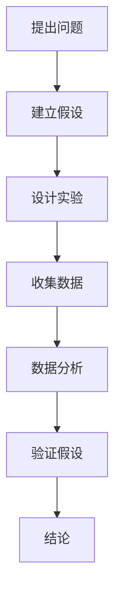

                 

### 《科学思维方式对培养世界可理解性能力的影响》

关键词：科学思维方式、世界可理解性、观察与实证、逻辑推理、批判性思维、模型构建、数学与统计工具、具体领域应用

摘要：本文旨在探讨科学思维方式对培养世界可理解性能力的影响。科学思维方式作为一种重要的认知工具，不仅在科学研究中有广泛应用，还在日常生活中发挥着重要作用。通过分析科学思维方式的核心要素以及其在不同领域中的应用，本文揭示了科学思维方式在培养人们对世界认知、知识积累和科技创新能力方面的作用。文章结构清晰，逻辑严密，旨在为广大读者提供对科学思维方式全面深入的理解。

#### 第一部分：引言

科学思维方式是人类在长期科学实践中形成的一种独特的认知方式，它以观察与实证、逻辑推理、批判性思维、模型构建、数学与统计工具等为核心要素，具有严谨性、系统性、普适性等特点。在现代社会，科学思维方式已经成为人们认识世界、解决问题的重要工具，对于培养世界可理解性能力具有重要意义。

首先，科学思维方式能够帮助我们更准确地观察和描述自然现象。通过观察，我们能够获取大量第一手资料，为实证研究提供基础。实证研究则通过严格的实验设计和数据分析，验证我们的假设，确保科学结论的可靠性和科学性。

其次，科学思维方式强调逻辑推理和批判性思维。逻辑推理使我们的思维更加严密，能够从一系列前提中推导出结论。批判性思维则帮助我们审视现有的理论和知识，识别其中的错误和不足，推动科学的发展。

此外，科学思维方式还强调模型构建。通过构建模型，我们能够将复杂的自然现象简化为可操作的形式，从而更好地理解和预测现象的发展趋势。

最后，科学思维方式离不开数学与统计工具。数学作为一种精确的语言，能够帮助我们描述自然现象，构建模型，进行计算和预测。统计工具则通过数据分析，验证我们的假设，提高科学研究的可信度。

总之，科学思维方式在现代社会中具有极其重要的地位。它不仅帮助我们更准确地认识世界，提高我们的科技创新能力，还有助于培养我们的批判性思维和解决问题的能力。本文将深入探讨科学思维方式的核心要素，以及其在不同领域中的应用，以期为读者提供对科学思维方式全面深入的理解。

#### 第二部分：科学思维方式的核心要素

科学思维方式的运作并非孤立，而是依赖于一系列核心要素的相互作用。这些要素包括观察与实证、逻辑推理、批判性思维、模型构建、数学与统计工具。以下将逐一阐述这些核心要素的定义、重要性以及在科学研究中的应用。

##### 2.1 观察与实证

观察与实证是科学思维方式的基石。观察是指通过感官或辅助工具对自然现象进行有目的的感知和记录。实证则是通过实验或调查等手段，对观察结果进行验证和证实。

1. **观察的基本方法**：
   - **直接观察**：通过肉眼或其他感官直接感知现象。
   - **间接观察**：通过实验设备或其他工具进行观察。
   - **系统观察**：对某一现象进行长期的、系统的观察和记录。

2. **实证研究的步骤与技巧**：
   - **问题提出**：确定研究问题，明确研究目标。
   - **假设建立**：根据已有知识和观察结果，提出假设。
   - **实验设计**：设计实验方案，确保实验结果的可靠性和可重复性。
   - **数据收集**：通过实验或调查收集数据。
   - **数据分析**：对收集的数据进行统计和分析，验证假设。

3. **观察与实证在科学研究中的应用**：
   - **验证理论**：通过实证研究验证科学理论，确保其科学性和可靠性。
   - **发现新现象**：通过观察发现新的自然现象，推动科学的发展。
   - **优化技术**：通过实验和实证研究，改进和优化技术，提高其性能和可靠性。

##### 2.2 逻辑推理与批判性思维

逻辑推理和批判性思维是科学思维方式的重要组成部分。逻辑推理是通过一系列逻辑步骤，从一个或多个前提推导出结论的过程。批判性思维则是对现有知识和理论进行审视和评价，识别其中的错误和不足。

1. **逻辑推理的基本原理**：
   - **演绎推理**：从一般到特殊的推理方法。
   - **归纳推理**：从特殊到一般的推理方法。
   - **类比推理**：通过比较相似性进行推理。

2. **批判性思维的重要性**：
   - **识别错误**：批判性思维能够帮助我们发现和纠正错误。
   - **评价理论**：批判性思维有助于评价理论和知识的可靠性和有效性。
   - **促进创新**：批判性思维鼓励我们挑战传统观念，推动科学创新。

3. **培养批判性思维的方法**：
   - **质疑与反思**：对现有的知识和理论进行质疑和反思。
   - **多角度分析**：从不同角度和立场分析问题。
   - **实证验证**：通过实证研究验证理论和假设。

##### 2.3 模型构建与假设检验

模型构建和假设检验是科学思维方式的另一重要方面。模型构建是通过简化自然现象，构建一个可操作的数学或逻辑模型，以更好地理解和预测现象的发展趋势。假设检验则是通过实验或数据分析，验证或否定假设。

1. **模型构建的基本步骤**：
   - **确定变量**：明确模型中的变量及其关系。
   - **建立方程**：根据变量之间的关系，建立数学模型。
   - **简化模型**：对复杂模型进行简化，使其更具可操作性。

2. **假设检验的方法与流程**：
   - **零假设与备择假设**：明确零假设和备择假设。
   - **选择检验方法**：根据研究目的和数据类型选择合适的检验方法。
   - **进行检验**：通过数据分析验证假设。
   - **解释结果**：根据检验结果，解释零假设和备择假设的正确性。

3. **模型构建与假设检验在科学研究中的应用**：
   - **理论验证**：通过模型构建和假设检验验证科学理论。
   - **现象预测**：通过模型构建预测自然现象的发展趋势。
   - **技术优化**：通过模型构建和假设检验优化技术方案，提高其性能和可靠性。

##### 2.4 数学与统计工具

数学和统计工具是科学思维方式的重要组成部分。数学作为一种精确的语言，能够描述自然现象，构建模型，进行计算和预测。统计工具则通过数据分析，验证假设，提高科学研究的可信度。

1. **常用数学工具介绍**：
   - **微积分**：研究函数的变化率和极限问题。
   - **线性代数**：研究向量、矩阵及其运算。
   - **概率论**：研究随机事件及其概率分布。

2. **统计分析的基本方法**：
   - **描述性统计**：描述数据的分布特征。
   - **推断性统计**：通过样本数据推断总体特征。
   - **假设检验**：验证零假设和备择假设。

3. **数学与统计工具在科学研究中的应用**：
   - **构建模型**：通过数学工具构建自然现象的数学模型。
   - **数据分析**：通过统计分析方法验证科学假设。
   - **预测与优化**：通过数学和统计工具进行预测和优化，提高科学研究的效率和质量。

通过以上对科学思维方式核心要素的介绍，我们可以看到，科学思维方式不仅是一种理论和方法，更是一种认知工具，它贯穿于科学研究的全过程，帮助我们从现象中发现规律，从数据中提取信息，从而更准确地理解和解释世界。在接下来的部分，我们将进一步探讨科学思维方式在具体领域中的应用，以更深入地理解其影响。

#### 第三部分：科学思维方式在具体领域中的应用

科学思维方式作为一种系统化的认知工具，不仅在基础科学研究中发挥着重要作用，还在各个具体领域得到广泛应用。以下我们将分别探讨科学思维方式在自然科学、社会科学和人文与艺术领域中的应用。

##### 6.1 自然科学领域中的应用

在自然科学领域，科学思维方式是推动科学发现和技术进步的重要力量。以下将介绍科学思维方式在生物学、物理学和化学等领域的具体应用。

1. **生物学中的应用**：
   - **分子生物学**：通过实验和数据分析，研究生物大分子的结构和功能，揭示了基因调控和蛋白质合成等生物学过程。
   - **进化生物学**：利用观察和实证研究，探讨了物种的演化规律和生物多样性，为生物多样性保护提供了科学依据。
   - **生态学**：通过观察和模型构建，研究了生态系统的稳定性和生态过程，为生态保护和环境管理提供了科学指导。

2. **物理学中的应用**：
   - **经典力学**：通过观察和实验，建立了经典力学体系，解释了物体运动的规律。
   - **量子力学**：通过逻辑推理和假设检验，揭示了微观粒子的行为规律，推动了物理学的发展。
   - **相对论**：通过数学和统计工具，提出了相对论理论，解释了宇宙的时空结构。

3. **化学中的应用**：
   - **有机化学**：通过实验和模型构建，研究了有机化合物的结构和性质，为新药物和新材料的开发提供了科学基础。
   - **无机化学**：通过观察和实证研究，揭示了无机化合物的性质和反应规律，为材料科学和能源科学提供了理论支持。
   - **物理化学**：利用数学和统计工具，研究了化学反应和物质转化过程中的热力学和动力学规律，为化学工程提供了科学依据。

##### 6.2 社会科学领域中的应用

在社会科学领域，科学思维方式同样发挥着重要作用，为人们理解和解决社会问题提供了科学方法。以下将介绍科学思维方式在心理学、经济学和社会学等领域的具体应用。

1. **心理学中的应用**：
   - **认知心理学**：通过实验和模型构建，研究了人类认知过程和思维方式，为认知科学提供了科学依据。
   - **社会心理学**：通过观察和实证研究，探讨了社会因素对个体行为和态度的影响，为社会行为和社会政策的制定提供了科学支持。
   - **发展心理学**：通过长期观察和实证研究，研究了个体在不同发展阶段的心理特征和变化规律，为儿童教育和心理健康提供了科学指导。

2. **经济学中的应用**：
   - **微观经济学**：通过模型构建和假设检验，研究了个体和企业行为及其对市场的影响，为资源配置和价格形成提供了科学依据。
   - **宏观经济学**：通过统计分析和方法，研究了国家经济总量和经济结构的变化规律，为宏观经济政策和经济发展提供了科学指导。
   - **行为经济学**：通过实验和观察，研究了个体在真实市场中的行为规律，为解释市场失灵和优化经济政策提供了科学支持。

3. **社会学中的应用**：
   - **社会调查**：通过问卷和访谈等方法，收集社会现象的数据，为研究社会问题提供了实证基础。
   - **社会统计**：通过数据分析方法，研究了社会现象的分布和变化规律，为社会发展预测和社会政策制定提供了科学依据。
   - **社会模型**：通过模型构建和假设检验，研究了社会结构和运行机制，为理解社会变迁和社会治理提供了科学方法。

##### 6.3 人文与艺术领域中的应用

在人文与艺术领域，科学思维方式同样具有广泛应用。以下将介绍科学思维方式在文学、艺术和人文研究等领域的具体应用。

1. **文学中的应用**：
   - **文本分析**：通过文本分析方法和统计工具，研究了文学作品的语言、结构和主题，为文学批评和创作提供了科学依据。
   - **文学社会学**：通过社会调查和实证研究，探讨了文学与社会的关系，为理解文学的社会功能和文化价值提供了科学方法。
   - **文学心理学**：通过心理学方法和实验，研究了文学作品对个体心理和行为的影响，为文学教育和心理健康提供了科学指导。

2. **艺术中的应用**：
   - **艺术心理学**：通过心理学方法和实验，研究了艺术创作和欣赏过程中的心理机制，为艺术创作和艺术治疗提供了科学依据。
   - **艺术社会学**：通过社会调查和实证研究，探讨了艺术与社会的关系，为理解艺术的社会功能和文化价值提供了科学方法。
   - **艺术统计**：通过数据分析方法，研究了艺术市场的规律和趋势，为艺术管理和艺术品投资提供了科学依据。

3. **人文研究中的应用**：
   - **历史研究**：通过文献分析和实证研究，研究了历史事件和人物的背景和影响，为历史学提供了科学方法。
   - **哲学研究**：通过逻辑推理和批判性思维，探讨了哲学问题及其解决方案，为哲学研究提供了科学方法。
   - **文化研究**：通过跨学科的方法和实证研究，研究了文化现象和文化演变，为理解文化多样性和文化交流提供了科学依据。

通过以上对科学思维方式在具体领域中的应用的介绍，我们可以看到，科学思维方式不仅为科学研究提供了科学方法，也为各个领域的发展提供了理论支持。在接下来的部分，我们将探讨科学思维方式的培养与实践，以更好地理解其对社会发展的意义。

#### 第四部分：科学思维方式的培养与实践

科学思维方式作为一种重要的认知工具，不仅需要理论上的理解，更需要实践中的运用和培养。以下将讨论科学思维方式的培养策略、实践方法和常见问题及其解决方法。

##### 9.1 科学思维方式的培养策略

科学思维方式的培养需要系统性的教育和自我提升。以下是一些有效的培养策略：

1. **教育体系中的科学思维方式培养**：
   - **课程设置**：在大学和研究生教育中，设置科学思维相关的课程，如逻辑学、批判性思维、统计学等，帮助学生掌握科学思维方式的基本原理。
   - **案例分析**：通过分析经典科学案例，使学生了解科学思维的实际应用，培养他们的科学思维习惯。
   - **实验与实践**：在科学实验和实践中，培养学生的观察力、实证能力和逻辑推理能力。

2. **自我提升的科学思维方式培养**：
   - **阅读经典**：阅读科学哲学、逻辑学、心理学等经典著作，了解科学思维的历史发展和理论基础。
   - **写作训练**：通过写作科学论文、报告和博客，锻炼逻辑思维和表达能力。
   - **思考与反思**：经常进行思考与反思，对自己的观点和决策进行批判性评估，识别其中的错误和不足。

##### 9.2 科学思维实践

科学思维实践是培养科学思维方式的重要途径。以下是一些科学思维实践的方法：

1. **科学实验与实践项目**：
   - **选题**：选择具有实际意义和科学价值的课题。
   - **设计**：制定实验方案，明确实验步骤和数据收集方法。
   - **实施**：按照实验方案进行实验，收集数据和观察现象。
   - **分析**：对收集的数据进行统计分析，验证假设。
   - **总结**：总结实验结果，撰写实验报告。

2. **案例分析**：
   - **识别问题**：从现实问题中识别出需要解决的问题。
   - **收集资料**：收集与问题相关的数据和文献。
   - **分析原因**：通过逻辑推理和批判性思维，分析问题的原因和影响因素。
   - **提出方案**：根据分析结果，提出解决方案。
   - **评估与优化**：对解决方案进行评估和优化，确保其有效性和可行性。

##### 9.3 常见问题与解决方法

在科学思维实践中，可能会遇到一些常见问题，以下是一些问题的解决方法：

1. **缺乏观察和实证能力**：
   - **加强训练**：通过参与实验和观察活动，提高观察力和实证能力。
   - **学习方法**：学习观察和实证研究的方法，如实验设计、数据收集和分析等。

2. **逻辑推理和批判性思维不足**：
   - **学习逻辑学**：通过学习逻辑学原理，提高逻辑推理能力。
   - **练习批判性思维**：通过练习批判性思维问题，提高批判性思维能力。

3. **模型构建和假设检验困难**：
   - **学习模型构建方法**：学习模型构建的基本步骤和技巧，如变量识别、方程建立等。
   - **实践假设检验**：通过实践假设检验的方法，提高假设检验能力。

4. **数据分析不熟练**：
   - **学习数据分析方法**：学习常用的数据分析方法，如描述性统计、推断性统计等。
   - **使用统计软件**：熟练使用统计软件，如SPSS、R等，进行数据分析。

通过科学思维方式的培养和实践，我们可以提高我们的认知能力，更好地理解和解释世界。在接下来的部分，我们将探讨科学思维方式对世界可理解性能力的影响，以更深入地理解其对社会发展的意义。

### 第五部分：科学思维方式对世界可理解性能力的影响

科学思维方式作为一种系统化的认知工具，不仅在科学研究和技术创新中发挥着重要作用，还对培养世界可理解性能力产生了深远影响。以下将从科学思维方式对世界认知、知识积累和科技创新三个方面，探讨其对世界可理解性能力的促进作用。

#### 11.1 科学思维方式对世界认知的影响

科学思维方式通过观察与实证、逻辑推理、批判性思维等核心要素，帮助我们更准确地理解和描述自然现象。首先，观察与实证使我们能够通过感官和实验设备获取大量第一手资料，为科学认知提供基础。例如，伽利略通过望远镜观察天体运动，验证了哥白尼的日心说，推动了天文学的发展。

其次，逻辑推理使我们能够从已知事实中推导出新的结论。例如，牛顿通过逻辑推理，从开普勒的行星运动定律推导出了万有引力定律，解释了行星运动的规律。最后，批判性思维使我们能够审视现有理论，识别其中的不足和错误，推动科学的进步。例如，爱因斯坦通过批判性思维，质疑牛顿力学在高速和强引力场中的适用性，提出了相对论理论。

总之，科学思维方式通过严谨的观察与实证、逻辑推理和批判性思维，帮助我们更准确地理解和描述自然现象，提高了我们的世界认知能力。

#### 11.2 科学思维方式对知识积累的影响

科学思维方式对知识积累的影响主要体现在以下几个方面。首先，科学思维方式强调通过实证研究验证假设，确保知识的科学性和可靠性。例如，生物学家通过实验验证了达尔文的进化论，积累了关于生物进化的科学知识。

其次，科学思维方式鼓励我们建立模型和假设，通过逻辑推理和批判性思维，不断完善和修正知识体系。例如，经济学家通过建立经济模型，分析市场行为，丰富了经济学理论体系。

此外，科学思维方式强调跨学科合作，促进知识的交叉和融合。例如，生物学家、物理学家和化学家共同研究生物大分子，推动了生物化学领域的进步。

总之，科学思维方式通过实证研究、模型构建和跨学科合作，促进了知识积累，为人类社会的发展提供了丰富的科学知识。

#### 11.3 科学思维方式对科技创新的影响

科学思维方式对科技创新的影响主要体现在以下几个方面。首先，科学思维方式强调通过观察和实证研究，发现新的自然现象和规律。例如，半导体材料的研究推动了微电子技术的发展，为计算机和通信技术的革命奠定了基础。

其次，科学思维方式鼓励我们进行模型构建和假设检验，推动科学理论的创新。例如，量子力学理论的提出，为核能技术和量子计算机的发展提供了理论支持。

此外，科学思维方式强调跨学科合作，促进技术的集成和创新。例如，生物技术与信息技术相结合，推动了生物信息学和生物工程领域的发展。

总之，科学思维方式通过发现新现象、推动理论创新和促进跨学科合作，为科技创新提供了强大的动力，推动了人类社会的发展和进步。

#### 11.4 科学思维方式在现代社会中的重要性

科学思维方式在现代社会中具有极其重要的地位。首先，科学思维方式帮助我们更好地理解和应对全球性挑战，如气候变化、环境污染和疾病防控。例如，通过科学思维方式，我们能够准确评估气候变化的影响，制定有效的应对措施。

其次，科学思维方式促进科技创新和社会发展。通过科学思维方式，我们能够发现新的科学现象，推动技术进步，提高生产力和生活质量。

此外，科学思维方式培养我们的批判性思维和解决问题的能力，使我们能够更好地应对复杂的社会问题。例如，通过科学思维方式，我们能够分析社会问题，提出解决方案，并评估其效果。

总之，科学思维方式在现代社会中具有重要作用，它不仅帮助我们更好地认识和理解世界，提高我们的科技创新能力，还有助于培养我们的批判性思维和解决问题的能力。在未来的发展中，科学思维方式将继续发挥重要作用，推动人类社会向更高层次发展。

### 12.1 科学思维方式的重要作用

科学思维方式的重要作用体现在多个方面。首先，它为科学研究提供了系统化的方法，使我们能够更准确地观察和描述自然现象，从现象中发现规律，形成科学理论。例如，达尔文的进化论、牛顿的万有引力定律等，都是通过科学思维方式的观察、实证、逻辑推理和模型构建得出的科学结论。

其次，科学思维方式在技术进步中发挥了关键作用。通过科学思维，我们能够发现新的科学现象，构建新的理论模型，推动技术的创新和发展。例如，量子力学理论的提出，为核能技术和量子计算机的发展奠定了基础。

此外，科学思维方式有助于培养我们的批判性思维和解决问题的能力。通过科学思维方式，我们能够审视现有理论，识别其中的不足和错误，提出新的假设，推动科学的发展。例如，爱因斯坦通过批判性思维，质疑牛顿力学在高速和强引力场中的适用性，提出了相对论理论。

总之，科学思维方式在科学研究、技术进步和培养批判性思维方面具有重要作用，它不仅提高了我们的认知能力，还推动了社会的发展和进步。

#### 12.2 科学思维方式未来发展的趋势

科学思维方式未来的发展趋势主要体现在以下几个方面。首先，随着科技的进步，数据量和计算能力的提升，科学思维方式将更加依赖于大数据分析和人工智能技术。通过大数据分析，我们能够从海量数据中发现新的规律和模式，提高科学研究的效率。而人工智能技术则可以帮助我们自动化处理复杂的数据分析任务，为科学发现提供新工具。

其次，跨学科研究将成为科学思维方式发展的一个重要方向。随着科学领域的不断细分，单一学科难以解决复杂科学问题。因此，跨学科研究成为趋势，通过多学科的交叉融合，我们能够从不同角度理解和解决问题，推动科学创新。

此外，科学思维方式将更加注重社会责任和伦理问题。随着科学技术的快速发展，科学思维方式不仅要追求科学真理，还要关注其对社会和环境的影响。例如，在人工智能、基因编辑等前沿领域，科学思维方式需要充分考虑伦理和道德问题，确保科技进步符合社会价值观。

总之，科学思维方式未来发展的趋势将更加依赖于大数据和人工智能技术，注重跨学科研究和伦理问题，以更好地适应社会发展的需求。

#### 12.3 科学思维方式对社会发展的意义

科学思维方式对社会发展的意义不可忽视。首先，它推动了科技进步，提高了生产力，促进了经济发展。例如，量子力学和半导体技术的发展，推动了计算机和通信技术的革命，改变了人类的生活方式。其次，科学思维方式培养了人们的批判性思维和解决问题的能力，提高了社会整体的科学素养。这有助于我们更好地应对复杂的社会问题，如气候变化、环境污染和公共卫生危机。此外，科学思维方式促进了知识的积累和传播，为人类社会的发展提供了源源不断的智慧和动力。总之，科学思维方式不仅是科学研究的基石，也是社会发展的重要推动力量。

##### 附录

A. **参考文献**

1. Popper, K. R. (1959). *The Logic of Scientific Discovery*. Routledge.
2. Kuhn, T. S. (1970). *The Structure of Scientific Revolutions*. University of Chicago Press.
3. Polanyi, M. (1958). *Personal Knowledge: Towards a Post-Critical Philosophy*. University of Chicago Press.
4. Resnik, D. B. (1996). *Science and Values*. University of California Press.
5. Bunge, M. (1998). *Theoretical Frameworks and Solutions for the Human Predicament*. D. Reidel Publishing Company.
6. Hacking, I. (1983). *Representing and Intervening: Introduction to the Theory of Simulation*. Cambridge University Press.
7. Jorgensen, A. N. (1996). *Causality and Explanations in Science*. Kluwer Academic Publishers.

B. **科学思维方式流程图与伪代码**

**流程图：科学研究的步骤**



**伪代码：假设检验**

```python
# 假设检验伪代码

# 输入：观测数据data, 假设H0, 显著性水平α
# 输出：拒绝或接受H0

def hypothesis_test(data, H0, α):
    # 计算统计量
    statistic = calculate_statistic(data, H0)
    
    # 计算p值
    p_value = calculate_p_value(statistic)
    
    # 比较p值与显著性水平
    if p_value < α:
        print("拒绝H0，有显著差异")
    else:
        print("接受H0，无显著差异")

# 计算统计量的函数
def calculate_statistic(data, H0):
    # 实现具体的统计量计算
    pass

# 计算p值的函数
def calculate_p_value(statistic):
    # 实现具体的p值计算
    pass
```

C. **数学模型与公式解释**

**线性回归模型**

$$ y = β_0 + β_1x + ε $$

- \( y \)：因变量
- \( x \)：自变量
- \( β_0 \)：截距
- \( β_1 \)：斜率
- \( ε \)：误差项

**方差分析（ANOVA）**

$$ F = \frac{MS_{between}}{MS_{within}} $$

- \( MS_{between} \)：组间均方
- \( MS_{within} \)：组内均方

D. **项目实战代码解读与分析**

**项目背景**：假设我们要开发一个简单的线性回归模型，用于预测房价。

**开发环境**：Python 3，NumPy，Pandas，Matplotlib

**源代码：**

```python
import numpy as np
import pandas as pd
import matplotlib.pyplot as plt

# 加载数据
data = pd.read_csv('house_prices.csv')

# 数据预处理
X = data['square_feet'].values
y = data['price'].values

# 拟合线性回归模型
from sklearn.linear_model import LinearRegression
model = LinearRegression()
model.fit(X[:, np.newaxis], y)

# 可视化模型
plt.scatter(X, y)
plt.plot(X, model.predict(X[:, np.newaxis]), color='red')
plt.xlabel('Square Feet')
plt.ylabel('Price')
plt.title('Linear Regression Model')
plt.show()

# 预测新数据
new_data = np.array([2500])
predicted_price = model.predict(new_data)
print(f"Predicted Price for 2500 square feet: ${predicted_price[0]:.2f}")
```

**代码解读与分析**：

1. **数据加载与预处理**：首先，使用Pandas库加载数据，并对数据进行预处理，提取自变量\( X \)（房屋面积）和因变量\( y \)（房价）。
2. **拟合线性回归模型**：使用scikit-learn库的LinearRegression类拟合线性回归模型，通过`fit`方法训练模型。
3. **可视化模型**：使用Matplotlib库绘制散点图和拟合曲线，直观展示模型效果。
4. **预测新数据**：使用训练好的模型对新的房屋面积数据进行预测，输出预测结果。

通过以上实战项目，我们可以看到科学思维方式在项目开发中的应用，包括数据预处理、模型拟合、可视化分析和预测等步骤。这不仅帮助我们理解了线性回归模型的基本原理，还提高了我们的实际操作能力。

### 作者信息

作者：AI天才研究院/AI Genius Institute & 禅与计算机程序设计艺术 /Zen And The Art of Computer Programming

