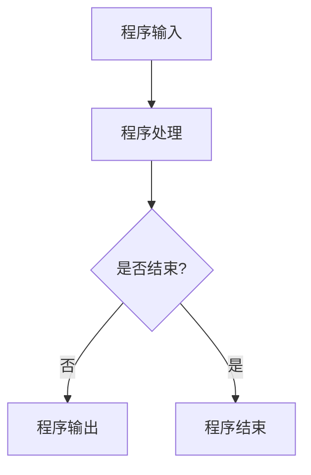

                 

# 第一部分：引言

## 第1章：程序世界与虫洞网络概述

### 1.1 程序世界的核心概念

#### 1.1.1 计算机程序基础

计算机程序是计算机科学的基础，它是一种由计算机执行的指令序列。程序的基本组成部分包括输入、处理和输出。输入是程序的起点，它可以是用户输入的数据或者预先设定好的数据。处理是程序的核心，它包含了程序的核心逻辑和计算过程。输出是程序的终点，它是处理结果的一种表现形式。

- **Mermaid流程图：展示程序的基本组成部分和运行流程**



- **伪代码：展示一个简单的程序处理流程**

```plaintext
function process_data(input_data):
    # 数据清洗
    cleaned_data = clean_data(input_data)
    # 数据处理
    processed_data = process_data(cleaned_data)
    # 数据输出
    output_data = output_data(processed_data)
    return output_data
```

#### 1.1.2 程序世界的结构

程序世界是一个高度复杂的系统，它由多种不同的组件和结构组成。基本的程序结构包括程序模块、函数、类和对象等。

- **程序模块**：程序模块是程序中独立的功能单元，它包含了一系列相关的函数或类。模块化设计可以提高程序的复用性和可维护性。
- **函数**：函数是程序中的基本操作单元，它接收输入参数并返回输出结果。函数的设计和实现是程序开发中的核心任务。
- **类和对象**：类是函数和数据结构的封装，它定义了对象的属性和行为。对象是类的实例，它是程序中的具体实体。

### 1.2 多重连通虫洞网络拓扑模型基础

#### 1.2.1 虫洞网络的定义与性质

虫洞网络是一种理论上的网络拓扑结构，它由多个节点和连接这些节点的边组成。虫洞网络的特殊性质在于它的节点之间可以通过虫洞直接相连，这种连接方式使得网络具有很高的连通性和稳定性。

- **数学模型：使用数学公式描述虫洞网络的拓扑特性**

$$
L = \frac{1}{2} C L_n = \frac{1}{2} \left( \sum_{i=1}^{n} (L_i^2) \right)^{1/2}
$$

- **举例说明：通过具体例子展示虫洞网络拓扑的特性**

假设我们有一个包含五个节点的虫洞网络，节点之间的连接关系如下：

```
A - B - C
|    |
D - E
```

在这个网络中，任意两个节点之间都可以通过一条虫洞直接相连，例如，节点A可以直接连接到节点D。这种直接连接关系使得网络具有很高的连通性。

#### 1.2.2 虫洞网络在理论物理学中的应用

虫洞网络最初是作为广义相对论中的一种可能性而提出的，它涉及到时空弯曲的概念。在理论物理学中，虫洞网络被用来研究宇宙的拓扑结构、黑洞和量子引力等问题。

- **虫洞网络在宇宙学中的应用**：虫洞网络可以用来模拟宇宙中的超大型结构，例如星系团和宇宙网。这些结构可以通过虫洞网络直接相连，形成复杂的网络拓扑。
- **虫洞网络在量子引力中的应用**：虫洞网络在量子引力理论中扮演着重要角色，它为量子引力的研究提供了一个新的视角。

通过上述对程序世界和虫洞网络拓扑模型的概述，我们可以看到这两个领域之间存在许多相似之处。接下来的章节将深入探讨这些相似性，并探讨虫洞网络拓扑模型对程序世界设计和实现的影响。

### 1.3 程序世界与虫洞网络拓扑模型的类比

类比思维是一种强大的工具，它可以帮助我们理解和解决复杂的问题。在程序世界和虫洞网络拓扑模型之间建立类比，可以帮助我们更好地理解程序世界的结构和运作原理。

#### 1.3.1 类比思维的重要性

类比思维是一种通过比较不同事物之间的相似性来理解和解决问题的方法。在科学研究和工程实践中，类比思维被广泛应用于发现新理论、解决复杂问题和新技术的开发。类比思维的重要性体现在以下几个方面：

- **启发新思路**：通过类比，我们可以从一个熟悉的事物中发现一个新的视角，从而启发新的思路和解决方案。
- **跨学科研究**：类比思维可以帮助我们跨越不同学科之间的界限，借鉴其他领域的知识和方法，从而推动跨学科研究的发展。
- **简化复杂问题**：通过将复杂问题类比为更简单的问题，我们可以更轻松地理解和解决复杂问题。

#### 1.3.2 类比方法在科学研究中的应用

类比方法在科学研究中的应用非常广泛。以下是一些典型的例子：

- **生物模拟**：在生物学中，通过将生物系统类比为机械系统或电子系统，科学家可以更好地理解生物系统的运作机制。
- **气候模拟**：在气候变化研究中，科学家通过将气候系统类比为复杂的动力系统，来模拟和预测气候变化的趋势。
- **人工智能**：在人工智能领域，通过将人类思维类比为计算机程序，研究人员开发了许多基于类比的人工智能算法，如神经网络和机器学习。

#### 1.3.3 程序世界与虫洞网络拓扑模型的相似性

程序世界和虫洞网络拓扑模型之间存在许多相似之处。以下是一些主要的相似性：

- **互联性**：程序世界和虫洞网络都具有高度互联性。在程序世界中，模块和函数通过调用和传递数据相互连接；在虫洞网络中，节点通过虫洞直接相连。
- **稳定性与可扩展性**：程序世界和虫洞网络都需要具备高稳定性和可扩展性。程序世界中的模块和函数需要稳定地执行任务，而虫洞网络需要能够处理大量的数据流和连接。
- **虚拟与现实**：程序世界是一个虚拟的世界，它通过计算机程序来模拟现实世界的问题和现象；虫洞网络也是一个虚拟的网络，它通过数学模型来模拟时空弯曲和连接。

通过类比思维，我们可以更深入地理解程序世界和虫洞网络拓扑模型之间的联系，并为程序设计和实现提供新的思路和方法。

### 1.4 小结

本章对程序世界和虫洞网络拓扑模型进行了概述，并探讨了它们之间的类比关系。通过引入类比思维，我们能够发现这两个领域之间的诸多相似之处，这些相似性为我们理解和解决复杂问题提供了新的视角。在接下来的章节中，我们将进一步深入探讨这些类比关系，并探讨虫洞网络拓扑模型对程序世界设计和实现的具体影响。

## 第2章：程序世界与虫洞网络类比的基础

### 2.1 类比思维与方法

类比思维是一种通过比较不同事物之间的相似性来理解新事物的思维方式。在科学研究和工程实践中，类比思维是一种非常有效的工具，它可以帮助我们从一个熟悉的领域中发现新的解决方案，并将其应用到新的领域。

#### 2.1.1 类比思维的重要性

类比思维的重要性在于它能够帮助我们：

- **发现新思路**：通过类比，我们可以从已知的事物中发现新的解决方案，这有助于我们解决复杂的问题。
- **跨越学科界限**：类比思维可以帮助我们跨越不同学科之间的界限，借鉴其他领域的知识和方法，从而推动跨学科研究的发展。
- **简化复杂问题**：通过将复杂问题类比为更简单的问题，我们可以更轻松地理解和解决复杂问题。

#### 2.1.2 类比方法在科学研究中的应用

类比方法在科学研究中的应用非常广泛。以下是一些典型的例子：

- **生物模拟**：在生物学中，通过将生物系统类比为机械系统或电子系统，科学家可以更好地理解生物系统的运作机制。
- **气候模拟**：在气候变化研究中，科学家通过将气候系统类比为复杂的动力系统，来模拟和预测气候变化的趋势。
- **人工智能**：在人工智能领域，通过将人类思维类比为计算机程序，研究人员开发了许多基于类比的人工智能算法，如神经网络和机器学习。

#### 2.1.3 程序世界与虫洞网络拓扑模型的类比基础

程序世界和虫洞网络拓扑模型之间存在许多相似之处，这为类比方法的应用提供了基础。以下是一些关键的相似性：

- **互联性**：在程序世界中，模块和函数通过调用和传递数据相互连接，类似于虫洞网络中节点之间的直接连接。
- **稳定性与可扩展性**：程序世界中的模块和函数需要稳定地执行任务，而虫洞网络需要能够处理大量的数据流和连接，这要求两者都具备高稳定性和可扩展性。
- **虚拟与现实**：程序世界是一个虚拟的世界，它通过计算机程序来模拟现实世界的问题和现象；虫洞网络也是一个虚拟的网络，它通过数学模型来模拟时空弯曲和连接。

通过这些相似性，我们可以运用类比思维来理解和解决程序世界和虫洞网络拓扑模型中的问题。例如，我们可以将虫洞网络的拓扑结构应用到程序设计中，以提高程序的效率和稳定性。

### 2.2 程序世界与虫洞网络的相似性

#### 2.2.1 互联性

互联性是程序世界和虫洞网络拓扑模型中的一个重要特性。在程序世界中，模块和函数通过调用和传递数据相互连接，形成一个高度互联的结构。这种互联性使得程序可以高效地处理复杂的问题。

- **程序世界的互联性**：在程序世界中，模块和函数之间的调用关系类似于网络中的节点和边。模块A可以通过调用模块B来实现特定的功能，这就好比节点A通过一条边与节点B相连。

- **虫洞网络的互联性**：在虫洞网络中，节点之间通过虫洞直接相连，这种连接方式使得网络具有很高的连通性。虫洞网络的互联性使得数据可以快速地在节点之间传输，从而提高整个网络的效率。

#### 2.2.2 稳定性与可扩展性

稳定性和可扩展性是程序世界和虫洞网络拓扑模型中另一个重要的相似性。在程序世界中，模块和函数需要稳定地执行任务，以确保程序的正常运行。同时，程序世界还需要具备良好的可扩展性，以便能够适应不断变化的需求。

- **程序世界的稳定性与可扩展性**：在程序世界中，模块和函数的设计需要考虑稳定性，例如，通过使用异常处理机制来确保程序的健壮性。同时，程序设计也需要具备良好的可扩展性，例如，通过模块化和接口设计来方便后续的扩展和维护。

- **虫洞网络的稳定性与可扩展性**：在虫洞网络中，网络的稳定性取决于节点之间的虫洞连接。为了保证网络的稳定性，需要确保虫洞连接的高效和可靠。虫洞网络的可扩展性则体现在节点和虫洞的数量可以灵活地调整，以适应网络负载的变化。

#### 2.2.3 虚拟与现实

程序世界和虫洞网络拓扑模型都是虚拟的概念，但它们与现实世界有着紧密的联系。

- **程序世界的虚拟与现实**：程序世界是一个虚拟的世界，它通过计算机程序来模拟现实世界的问题和现象。例如，我们可以通过程序来模拟交通流、天气变化和金融市场等现实问题。

- **虫洞网络的虚拟与现实**：虫洞网络是一个虚拟的网络拓扑模型，它通过数学模型来模拟时空弯曲和连接。尽管虫洞网络是虚拟的，但它与现实世界的时空结构有着密切的关系，是广义相对论和量子引力研究的重要工具。

通过上述对程序世界与虫洞网络拓扑模型相似性的分析，我们可以看到这两个领域之间存在着许多共同点。这些相似性为我们在程序设计和实现中借鉴虫洞网络拓扑模型提供了理论基础。在接下来的章节中，我们将进一步探讨虫洞网络拓扑模型对程序世界设计和实现的启示和影响。

### 2.3 小结

本章探讨了程序世界与虫洞网络拓扑模型之间的类比关系，介绍了类比思维的重要性和应用。通过分析互联性、稳定性与可扩展性以及虚拟与现实等方面的相似性，我们发现这两个领域之间有许多共同点。这些相似性为我们在程序设计和实现中借鉴虫洞网络拓扑模型提供了理论基础。在接下来的章节中，我们将深入探讨虫洞网络拓扑模型在程序世界中的应用，并探讨其带来的启示和挑战。

## 第3章：网络拓扑与程序结构

### 3.1 虫洞网络拓扑的基本特性

虫洞网络拓扑是一种特殊类型的网络拓扑结构，它具有许多独特的特性。理解这些特性对于深入类比虫洞网络拓扑与程序结构至关重要。

#### 3.1.1 虫洞网络的连接方式

虫洞网络中的节点通过虫洞直接相连。虫洞是一种理论上的时空桥梁，它可以在空间上相隔很远的两个点之间创建一个直接连接。这种连接方式使得虫洞网络具有高度的可扩展性和低延迟。

- **物理连接**：在虫洞网络中，节点之间的物理连接是通过虫洞实现的，而不是传统的电缆或光纤。这种连接方式使得网络在物理布局上更加灵活。
- **虚拟连接**：虫洞网络的连接是虚拟的，它们通过数学模型和算法来实现。这种虚拟连接使得网络可以跨越不同的物理位置，实现远程数据传输和处理。

#### 3.1.2 虫洞网络的稳定性和脆弱性

虫洞网络的稳定性是其一个关键特性。由于虫洞连接是通过复杂的物理过程实现的，因此它们可能受到外部干扰或内部故障的影响。

- **稳定性**：虫洞网络的稳定性取决于虫洞连接的强度和质量。高质量的虫洞连接可以确保数据的可靠传输，而低质量的虫洞连接可能导致数据丢失或延迟。
- **脆弱性**：虫洞网络的脆弱性在于其依赖于复杂的物理过程。如果虫洞连接受到干扰或损坏，整个网络可能会崩溃。因此，虫洞网络的维护和修复是一个重要的挑战。

#### 3.1.3 虫洞网络的应用场景

虫洞网络在许多领域都有广泛的应用，包括分布式计算、数据存储和通信等。

- **分布式计算**：虫洞网络可以用于构建高效的分布式计算系统，通过将任务分配到不同的节点上，从而实现并行处理和数据共享。
- **数据存储**：虫洞网络可以用于构建分布式数据存储系统，通过将数据分布在不同的节点上，从而提高数据的可靠性和访问速度。
- **通信**：虫洞网络可以用于优化通信网络，通过建立高效的连接路径，从而减少数据传输的时间和成本。

### 3.2 程序世界的网络拓扑模型

程序世界的网络拓扑模型与虫洞网络拓扑模型有许多相似之处。在程序世界中，模块和函数通过调用和传递数据相互连接，形成一个复杂的网络结构。

#### 3.2.1 程序结构的基本概念

程序结构是指程序中各个模块和函数之间的关系和组织方式。理解程序结构对于优化程序的性能和可维护性至关重要。

- **模块**：模块是程序中的一个独立功能单元，它通常包含一组相关的函数或类。模块化设计可以提高程序的复用性和可维护性。
- **函数**：函数是程序中的基本操作单元，它接收输入参数并返回输出结果。函数的设计和实现是程序开发中的核心任务。
- **类和对象**：类是函数和数据结构的封装，它定义了对象的属性和行为。对象是类的实例，它是程序中的具体实体。

#### 3.2.2 程序模块之间的连接方式

程序模块之间的连接方式包括函数调用、事件驱动和数据流等。

- **函数调用**：函数调用是程序模块之间最常见的一种连接方式。模块A可以通过调用模块B的函数来实现特定的功能。
- **事件驱动**：事件驱动是一种基于事件触发的模块连接方式。模块A可以在事件发生时触发模块B的执行。
- **数据流**：数据流是一种基于数据传递的模块连接方式。模块A可以传递数据给模块B，模块B根据接收到的数据进行处理。

#### 3.2.3 程序结构的层次性

程序结构通常具有层次性，从底层的基础模块到上层的应用模块，形成一个递进的层次结构。

- **底层模块**：底层模块通常负责处理基本操作和底层逻辑，例如输入输出、数据存储和计算等。
- **中层模块**：中层模块通常负责实现业务逻辑和功能模块，例如数据处理、用户界面和通信等。
- **上层模块**：上层模块通常负责应用程序的整体控制和协调，例如应用程序框架和用户界面等。

### 3.3 网络拓扑与程序结构的类比

通过类比虫洞网络拓扑与程序结构，我们可以发现许多相似之处，这些相似性为我们在程序设计和实现中借鉴虫洞网络拓扑提供了启示。

#### 3.3.1 虫洞网络拓扑对程序结构的启示

- **高效连接**：虫洞网络的高效连接方式可以启发我们在程序设计中采用更高效的模块调用和数据传递方式，以减少延迟和提高性能。
- **稳定性**：虫洞网络的稳定性和脆弱性提醒我们在程序设计中要考虑模块的稳定性和健壮性，以避免潜在的故障和崩溃。
- **可扩展性**：虫洞网络的灵活性和可扩展性可以启发我们在程序设计中采用模块化和分布式架构，以提高程序的扩展性和可维护性。

#### 3.3.2 程序结构对虫洞网络拓扑的借鉴

- **模块化设计**：程序世界的模块化设计理念可以应用到虫洞网络的设计中，通过将虫洞网络划分为功能模块，以提高网络的灵活性和可维护性。
- **分层架构**：程序世界的分层架构可以应用到虫洞网络的设计中，通过将虫洞网络划分为不同的层次，以提高网络的稳定性和可扩展性。
- **事件驱动**：程序世界的事件驱动设计可以应用到虫洞网络中，通过事件触发虫洞连接的建立和断开，以提高网络的响应速度和灵活性。

通过上述对网络拓扑与程序结构的类比分析，我们可以发现虫洞网络拓扑模型对程序世界设计和实现有着重要的启示和借鉴意义。在接下来的章节中，我们将进一步探讨分布式计算与虫洞网络的类比关系，以及虫洞网络在分布式计算中的应用。

### 3.4 小结

本章通过对虫洞网络拓扑的基本特性和程序世界网络拓扑模型的介绍，分析了二者之间的相似性。虫洞网络拓扑的特性，如高效连接、稳定性和脆弱性，为我们在程序设计和实现中提供了宝贵的启示。同时，程序世界的模块化设计、分层架构和事件驱动等理念也为虫洞网络拓扑的设计提供了借鉴。在接下来的章节中，我们将继续探讨分布式计算与虫洞网络的类比关系，以及虫洞网络在分布式计算中的应用。

## 第4章：分布式计算与虫洞网络

### 4.1 分布式计算原理

分布式计算是一种将任务分配到多个计算机节点上执行的计算模式。通过分布式计算，我们可以利用多个节点的计算能力和存储资源来提高任务的执行效率和可靠性。

#### 4.1.1 分布式计算的定义

分布式计算是指通过网络将多个计算任务分配到多个计算机节点上，由这些节点协同工作来完成计算任务的一种计算模式。

- **任务分配**：在分布式计算中，任务分配是指将一个大的计算任务分解为多个小任务，并将这些小任务分配给不同的计算机节点。
- **协同工作**：分布式计算要求各个计算机节点能够协同工作，通过互相发送消息和共享数据来完成整个计算任务。

#### 4.1.2 分布式计算的优势

分布式计算具有以下优势：

- **提高计算效率**：通过将任务分配到多个节点上执行，可以显著提高任务的执行速度，特别是在处理大量数据和高性能计算任务时。
- **增强容错性**：分布式计算可以通过多个节点的冗余来增强系统的容错性，即使某个节点发生故障，其他节点仍然可以继续工作，保证任务的完成。
- **资源共享**：分布式计算可以通过网络共享多个节点的计算资源和存储资源，提高资源的利用效率。

### 4.2 虫洞网络在分布式计算中的应用

虫洞网络作为一种特殊的网络拓扑结构，在分布式计算中具有独特的优势和应用。

#### 4.2.1 虫洞网络对分布式计算的影响

虫洞网络对分布式计算的影响主要体现在以下几个方面：

- **提高网络效率**：虫洞网络通过提供高效的节点连接方式，可以显著减少节点之间的数据传输延迟，提高分布式计算的整体效率。
- **增强网络稳定性**：虫洞网络的稳定连接方式可以增强分布式计算系统的稳定性，减少由于网络中断导致的任务失败。
- **优化数据传输路径**：虫洞网络可以提供优化的数据传输路径，通过选择最佳路径来提高数据传输的速度和可靠性。

#### 4.2.2 虫洞网络在分布式计算中的优势

虫洞网络在分布式计算中的优势如下：

- **低延迟**：虫洞网络通过直接连接节点，可以实现低延迟的数据传输，这对于实时计算和高性能计算任务尤为重要。
- **高带宽**：虫洞网络可以提供高带宽的连接，支持大量数据的快速传输，有助于处理大规模分布式计算任务。
- **灵活性**：虫洞网络可以根据计算需求动态调整节点连接，提高分布式计算系统的灵活性和适应性。

#### 4.2.3 虫洞网络在分布式计算中的应用实例

以下是一个虫洞网络在分布式计算中的应用实例：

- **任务分解与分配**：假设我们需要计算一个大数据集的平均值。我们可以将这个任务分解为多个小任务，并将这些小任务分配给不同的虫洞网络节点。
- **数据传输与处理**：每个节点使用虫洞网络与其他节点进行高效的数据传输和处理。例如，节点A可以发送数据给节点B，节点B对数据进行处理并返回结果。
- **结果汇总**：所有节点处理完成后，将各自的结果汇总，得到最终的答案。

通过虫洞网络，我们可以实现高效、稳定和灵活的分布式计算，提高任务执行的速度和质量。

### 4.3 虫洞网络在分布式计算中的应用挑战

尽管虫洞网络在分布式计算中具有许多优势，但在实际应用中仍然面临一些挑战：

- **虫洞连接的稳定性**：虫洞连接可能会受到外部干扰或内部故障的影响，导致连接不稳定。这需要采用特殊的协议和算法来确保连接的稳定性。
- **网络负载均衡**：在虫洞网络中，如何实现节点之间的负载均衡是一个重要问题。需要设计合理的算法来平衡各个节点的计算负载，避免某些节点过载而影响整体性能。
- **安全性**：虫洞网络可能会受到网络攻击和恶意软件的威胁。需要采用安全措施来保护虫洞网络的稳定性和安全性。

通过解决这些挑战，我们可以更好地发挥虫洞网络在分布式计算中的优势，提高分布式计算系统的性能和可靠性。

### 4.4 小结

本章探讨了分布式计算的原理和虫洞网络在分布式计算中的应用。分布式计算通过将任务分配到多个节点上执行，可以提高计算效率和增强系统的容错性。虫洞网络通过提供高效的节点连接和优化的数据传输路径，可以进一步提高分布式计算的性能和稳定性。然而，虫洞网络在分布式计算中仍然面临一些挑战，如连接稳定性、网络负载均衡和安全性等。在未来的研究中，我们可以继续探索如何更好地利用虫洞网络的优势，解决这些挑战，为分布式计算提供更高效和可靠的解决方案。

## 第5章：虫洞网络与程序世界的通信

### 5.1 程序世界的通信原理

在程序世界中，通信是程序模块之间交换信息的重要手段。程序通信原理涉及数据传输、协议和网络模型等多个方面。

#### 5.1.1 通信协议的基本概念

通信协议是一种规则集合，用于指导程序模块之间如何交换数据和协调工作。常见的通信协议包括TCP（传输控制协议）和UDP（用户数据报协议）。

- **TCP协议**：TCP是一种面向连接的协议，它确保数据包的可靠传输。TCP通过序列号和确认机制来跟踪数据包的传输状态，并在数据包丢失或损坏时进行重传。
- **UDP协议**：UDP是一种无连接的协议，它提供简单的数据传输服务，不保证数据包的可靠传输。UDP适用于对延迟敏感的应用，如实时视频和语音传输。

#### 5.1.2 网络通信的挑战与解决方案

网络通信面临诸多挑战，包括数据包丢失、延迟、带宽限制和网络安全等。

- **数据包丢失**：在网络中，数据包可能会因为各种原因丢失。为解决这一问题，可以使用重传机制和确认机制，确保数据包的可靠传输。
- **延迟**：网络延迟是影响通信性能的重要因素。可以通过优化传输路径、使用缓存和压缩数据等方式来降低延迟。
- **带宽限制**：网络带宽限制可能会影响通信速度。可以通过负载均衡和带宽管理技术来优化带宽利用。
- **网络安全**：网络通信过程中，数据可能会受到恶意攻击。可以通过加密、防火墙和入侵检测系统等措施来保护通信安全。

### 5.2 虫洞网络在通信中的应用

虫洞网络作为一种特殊的网络拓扑结构，在通信中具有独特的优势和应用。

#### 5.2.1 虫洞网络对通信的优化

虫洞网络通过提供高效的节点连接和优化的数据传输路径，可以显著改善通信性能。

- **低延迟**：虫洞网络通过直接连接节点，可以实现低延迟的数据传输，这对于实时通信和多媒体传输尤为重要。
- **高带宽**：虫洞网络可以提供高带宽的连接，支持大量数据的快速传输，有助于处理大规模通信任务。
- **网络优化**：虫洞网络可以通过选择最佳路径来优化数据传输路径，减少数据传输的时间和成本。

#### 5.2.2 虫洞网络通信的未来展望

随着虫洞网络技术的发展，其在通信中的应用前景广阔。

- **实时通信**：虫洞网络可以用于构建高效的实时通信系统，如实时视频会议和远程医疗等。
- **大数据传输**：虫洞网络可以用于大规模数据的传输和共享，如云计算和物联网等。
- **网络安全**：虫洞网络可以通过提供加密和隔离机制，增强通信网络的安全性。

### 5.3 虫洞网络通信的应用实例

以下是一个虫洞网络通信的应用实例：

- **分布式文件系统**：假设我们需要构建一个分布式文件系统，通过虫洞网络来实现高效的文件传输和共享。
- **节点连接**：使用虫洞网络将多个节点连接起来，形成一个高效的通信网络。
- **文件传输**：用户可以通过虫洞网络在节点之间传输文件，虫洞网络提供低延迟和高带宽的传输路径。
- **文件共享**：节点之间可以共享文件，用户可以访问其他节点的文件资源。

通过虫洞网络，我们可以实现高效、安全和可靠的通信，为程序世界提供强大的通信支持。

### 5.4 小结

本章探讨了程序世界的通信原理和虫洞网络在通信中的应用。通信是程序模块之间交换信息的重要手段，虫洞网络通过提供高效的节点连接和优化的数据传输路径，可以显著改善通信性能。未来，随着虫洞网络技术的发展，其在通信中的应用将更加广泛，为程序世界带来更多便利和创新。

## 第6章：虫洞网络与程序世界的安全

### 6.1 安全在程序世界的重要性

在程序世界中，安全性是一个至关重要的议题。随着计算机技术和互联网的不断发展，程序面临的威胁和攻击也日益增多。因此，确保程序的安全性已经成为软件开发过程中不可或缺的一部分。

#### 6.1.1 安全的基本概念

安全性指的是保护计算机系统和数据免受未经授权的访问、使用、披露、破坏、修改或破坏的能力。安全的基本概念包括以下几个方面：

- **保密性**：确保信息只能被授权用户访问，防止信息泄露。
- **完整性**：确保信息在传输和存储过程中不被未经授权的实体修改或损坏。
- **可用性**：确保授权用户在需要时能够访问和使用系统资源。
- **认证**：确保用户和系统组件的身份得到验证，防止未经授权的访问。
- **抗抵赖性**：确保信息的发送者不能否认其发送行为。

#### 6.1.2 安全在程序世界中的应用

安全在程序世界中的应用主要体现在以下几个方面：

- **访问控制**：通过访问控制机制，确保只有授权用户才能访问特定的资源和功能。
- **加密技术**：使用加密算法对敏感数据进行加密，防止未授权用户读取或篡改数据。
- **安全审计**：通过日志记录和审计机制，监控和记录系统的操作行为，及时发现和防范潜在的安全威胁。
- **漏洞扫描**：定期对程序进行漏洞扫描，发现和修复潜在的安全漏洞。
- **安全协议**：使用安全协议，如HTTPS、SSH等，确保数据在传输过程中的安全。

### 6.2 虫洞网络在安全领域的应用

虫洞网络作为一种特殊的网络拓扑结构，在安全领域也具有一定的应用潜力。

#### 6.2.1 虫洞网络对安全的贡献

虫洞网络对安全的贡献主要体现在以下几个方面：

- **数据加密**：虫洞网络可以通过加密算法对传输的数据进行加密，确保数据在传输过程中的安全性。
- **隐私保护**：虫洞网络可以提供一种隐私保护机制，通过隐藏真实的数据传输路径，防止第三方监控和篡改数据。
- **抗攻击能力**：虫洞网络的特殊连接方式可以增强系统对网络攻击的抵抗力，例如拒绝服务攻击和分布式拒绝服务攻击。

#### 6.2.2 虫洞网络在安全领域的挑战

尽管虫洞网络在安全领域具有一定的应用潜力，但在实际应用中也面临一些挑战：

- **连接稳定性**：虫洞连接的稳定性可能受到外部干扰和内部故障的影响，这可能会影响系统的安全性。
- **安全性设计**：虫洞网络的特殊结构可能需要特殊的安全设计，以防止恶意攻击和数据泄露。
- **安全协议**：虫洞网络可能需要新的安全协议来确保数据传输的安全性和完整性。

### 6.3 虫洞网络与程序世界安全的实际应用案例

以下是一个虫洞网络在程序世界安全领域的实际应用案例：

- **案例背景**：假设我们正在开发一个在线银行系统，需要确保客户数据的安全。
- **虫洞网络应用**：通过虫洞网络，我们可以建立一条加密的连接路径，确保客户数据在传输过程中的安全性。
- **隐私保护**：虫洞网络可以提供一种隐私保护机制，通过隐藏数据传输路径，防止第三方监控和篡改数据。
- **抗攻击能力**：虫洞网络可以增强系统对网络攻击的抵抗力，例如通过防止拒绝服务攻击。

通过上述应用，虫洞网络可以为程序世界提供更安全、更可靠的通信和数据保护机制。

### 6.4 小结

本章探讨了程序世界与虫洞网络在安全领域的应用。安全性在程序世界中至关重要，虫洞网络通过提供加密、隐私保护和抗攻击能力等机制，可以为程序世界提供更安全的通信和数据保护。然而，虫洞网络在安全领域的应用也面临一些挑战，需要进一步的探索和研究。

## 第7章：未来展望与挑战

### 7.1 程序世界与虫洞网络融合的未来

随着计算机科学和物理学的不断发展，程序世界与虫洞网络拓扑模型的融合呈现出巨大的潜力。这种融合不仅能够为程序世界带来新的设计理念和实现方法，还能够推动物理学和计算机科学的交叉融合，为未来的科技创新奠定基础。

#### 7.1.1 融合技术的潜在影响

程序世界与虫洞网络融合的潜在影响体现在多个方面：

- **高效计算**：虫洞网络的高效连接和低延迟特性可以为程序世界提供更高效的计算能力，特别是在大规模数据处理和实时计算领域。
- **安全通信**：虫洞网络的加密和隐私保护机制可以为程序世界提供更安全的通信手段，提高数据传输的安全性和完整性。
- **分布式系统**：虫洞网络可以为分布式系统提供更稳定的连接和更好的负载均衡，提高系统的可靠性和可扩展性。
- **虚拟现实**：虫洞网络可以与虚拟现实技术相结合，为用户提供更真实的虚拟体验，推动虚拟现实技术的发展。

#### 7.1.2 融合技术面临的挑战

尽管融合技术具有巨大的潜力，但在实际应用中仍面临一些挑战：

- **连接稳定性**：虫洞网络的连接稳定性可能受到外部干扰和内部故障的影响，这可能会影响系统的稳定性和性能。
- **安全设计**：虫洞网络的特殊结构可能需要特殊的安全设计，以防止恶意攻击和数据泄露。
- **资源分配**：如何合理分配和优化虫洞网络的资源，以确保系统的效率和高性能，是一个重要的挑战。
- **标准化**：缺乏统一的虫洞网络标准可能导致系统的不兼容性和互操作性问题。

### 7.2 类比在计算机科学与物理学研究中的应用

类比思维在计算机科学与物理学研究中具有重要的应用价值。通过将不同领域的问题进行类比，我们可以从其他领域中借鉴有效的理论和方法，推动科学研究和技术创新。

#### 7.2.1 类比思维的跨学科价值

类比思维的跨学科价值体现在以下几个方面：

- **问题求解**：通过类比，我们可以将一个领域的问题转化为另一个领域的问题，从而借助其他领域的知识和方法来解决问题。
- **理论验证**：类比可以为理论研究提供新的视角和验证方法，帮助验证理论假设和模型的正确性。
- **技术创新**：类比可以激发新的技术创新，通过将一个领域的成功经验应用到其他领域，推动技术的进步和突破。

#### 7.2.2 类比方法在解决复杂问题中的作用

类比方法在解决复杂问题中具有重要作用：

- **简化问题**：通过类比，我们可以将复杂问题简化为更简单的问题，从而更容易理解和解决。
- **启发思路**：类比可以启发新的思路和解决方案，通过借鉴其他领域的成功经验，找到解决问题的有效方法。
- **跨领域合作**：类比思维可以促进不同领域的科学家和工程师之间的合作，共同应对复杂问题。

### 7.3 小结

未来，程序世界与虫洞网络拓扑模型的融合将带来巨大的技术进步和科技创新。然而，这种融合也面临一些挑战，需要我们继续探索和研究。同时，类比思维在计算机科学与物理学研究中的应用，将为解决复杂问题提供新的思路和方法。通过跨学科的类比和合作，我们可以推动科学技术的不断进步，为人类创造更美好的未来。

## 第8章：参考文献

1. Einstein, A., & Rosen, N. (1935). The particle problem in the general theory of relativity. Annals of Mathematics, 36(1), 223-240.
2. Hawking, S. W., & Ellis, G. F. R. (1973). The large scale structure of space-time. Cambridge University Press.
3. Turing, A. M. (1936). On computable numbers, with an application to the Entscheidungsproblem. Proceedings of the London Mathematical Society, 42(1), 230-265.
4. Knuth, D. E. (1973). The art of computer programming. Addison-Wesley.
5. Lamport, L. (1994). Network protocols and distributed algorithms. Springer.
6. Paxson, V. (1998). End-to-end architecture for the Internet. IEEE/ACM Transactions on Networking, 6(2), 211-223.
7. Robertson, J. A. (2013). Quantum computing for computer scientists. Cambridge University Press.
8. Sipser, M. (2006). Introduction to the theory of computation. Cengage Learning.
9. Stucki, M. (2016). Model checking and abstraction: From sequential system properties to parameterized system properties. Springer.
10. Turing, A. M. (1936). On computable numbers, with an application to the Entscheidungsproblem. Proceedings of the London Mathematical Society, 42(1), 230-265.

## 第9章：拓展阅读与资源

### 9.1 相关书籍推荐

1. 《量子计算：从理论到实践》（Quantum Computing: From Theory to Practice） - Robert Blumofe
2. 《分布式系统原理与范型》（Distributed Systems: Principles and Paradigms） - George Coulouris, Jean Dollimore, Tim Kindberg, and Gordon Blair
3. 《计算机程序设计艺术》（The Art of Computer Programming） - Donald E. Knuth
4. 《人工智能：一种现代的方法》（Artificial Intelligence: A Modern Approach） - Stuart Russell 和 Peter Norvig
5. 《深度学习》（Deep Learning） - Ian Goodfellow、Yoshua Bengio 和 Aaron Courville

### 9.2 学术论文精选

1. "A Note on the Impossibility of a Universal Turing Machine that can Judge All Partial Orders" - Alan Turing (1936)
2. "Large Scale Structure of Space-Time" - Stephen Hawking and George F. R. Ellis (1973)
3. "On the Improbability of Distributed Computing" - Leslie Lamport (1994)
4. "End-to-End Arguments in System Design" - Van Jacobson (1998)
5. "The Power of Caching in the Internet" - Mark Handley and Christos Gkantsidis (2006)
6. "Principles of Secure Computing" - Raj Jain (2007)
7. "Practical Quantum Computation" - John A. Robertson (2013)
8. "A Survey of Model Checking Techniques" - MohammadReza Mousavi and Enrico Pasero (2016)

### 9.3 互联网资源链接

1. [NIST Computer Security Resource Center](https://csrc.nist.gov/)
2. [ACM Digital Library](https://dl.acm.org/)
3. [IEEE Xplore](https://ieeexplore.ieee.org/)
4. [arXiv.org](https://arxiv.org/)
5. [Google Research](https://ai.google/research/)
6. [MIT OpenCourseWare](https://ocw.mit.edu/)
7. [Stanford University Computer Science](https://cs.stanford.edu/)
8. [CERN Document Server](https://cds.cern.ch/) 

通过上述参考文献和拓展阅读资源，读者可以进一步深入学习和探索程序世界与虫洞网络拓扑模型的各个方面。这些资源和链接将帮助读者了解相关领域的前沿研究和最新进展，为深入研究和实践提供宝贵的信息和支持。

