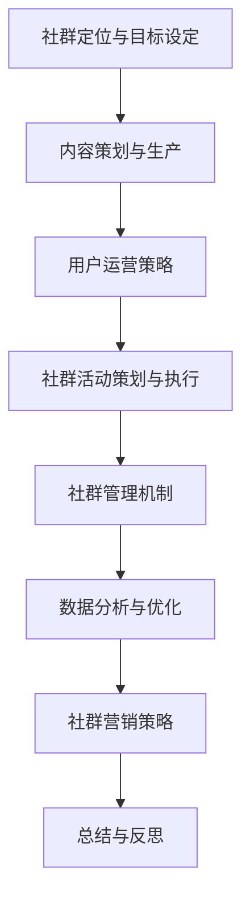

                 

# 程序员的知识付费社群运营与管理

## 关键词

- 知识付费社群
- 社群运营策略
- 社群管理机制
- 社群工具选择与应用
- 社群数据分析与优化
- 社群营销策略
- 社群运营案例解析
- 程序员知识付费社群实战
- 社群运营的未来趋势

## 摘要

本文旨在探讨程序员的知识付费社群运营与管理，通过深入分析社群运营的基础、策略、管理机制、工具与技术、营销策略以及案例解析，帮助读者全面了解并掌握社群运营的要点和技巧。同时，文章将结合实际项目和未来趋势，为程序员的知识付费社群提供有益的参考和启示。

### 第一部分：社群运营基础

#### 第1章：知识付费社群概述

##### 1.1 知识付费的发展背景

知识付费作为一种新兴的商业模式，正逐渐改变人们的消费习惯和内容获取方式。它起源于互联网行业，随着移动互联网的普及和用户需求的多样化，逐渐渗透到各个领域。知识付费的兴起，一方面得益于用户对知识和技能的需求不断增长，另一方面也得益于技术进步和内容生产的便捷性。

##### 1.2 程序员社群的类型与特点

程序员社群主要包括以下几类：技术交流社群、职业发展社群、兴趣社群和培训社群。这些社群各自有不同的特点和运营方式，但都围绕着程序员的核心需求展开。

##### 1.3 知识付费社群的目标与价值

知识付费社群的目标是满足程序员在技术、职业和个人成长方面的需求，提供有价值的内容和服务。通过建立知识付费社群，可以提升成员的技术水平，拓展职业发展空间，增强社交网络，实现个人和社群的共同成长。

#### 第2章：社群运营策略

##### 2.1 社群定位与目标设定

社群定位是运营的首要步骤，需要明确社群的核心价值、目标用户和竞争定位。目标设定则应包括短期和长期目标，如用户增长、活跃度提升、内容产出等。

##### 2.2 内容运营策略

内容运营是社群的核心，需要根据用户需求制定内容策略。内容形式包括文章、视频、直播、问答等，内容质量是社群的生命线。

##### 2.3 用户运营策略

用户运营旨在提升用户的参与度和粘性。用户运营策略包括用户分类、用户活跃度提升、用户反馈机制等。

##### 2.4 社群活动策划与执行

社群活动是增强用户互动和社区氛围的重要手段。活动策划应充分考虑用户兴趣，活动形式多样，如线上讲座、线下聚会、技术沙龙等。

#### 第3章：社群管理机制

##### 3.1 社群管理组织结构

社群管理组织结构应合理划分角色和职责，明确管理团队的职能和协作方式。常见的管理角色包括管理员、版主、内容审核员等。

##### 3.2 规则制定与执行

社群规则是维护社群秩序和氛围的基础，应制定明确的社群规则，并严格执行。规则应包括内容发布规范、互动礼仪、违规处理等。

##### 3.3 矛盾与争议的处理

矛盾与争议是社群运营中难以避免的问题。处理矛盾与争议的关键在于及时、公正、透明。常见的处理方法包括调解、公示、处罚等。

### 第二部分：社群运营工具与技术

#### 第4章：社群工具选择与应用

##### 4.1 社群工具概述

社群工具是社群运营的重要支撑，包括社交媒体平台、专业社群软件、邮件订阅系统等。选择适合的社群工具，可以提高运营效率和用户体验。

##### 4.2 常用社群工具对比

本文将对常用的社群工具进行对比，分析其优缺点和适用场景。常见工具包括Discord、Telegram、WhatsApp、知识星球等。

##### 4.3 社群工具的高级应用

高级应用包括社群自动化管理、数据统计与分析、个性化推荐等。通过高级应用，可以进一步提升社群运营的效率和质量。

#### 第5章：社群数据分析与优化

##### 5.1 数据分析的重要性

数据分析是社群运营的关键环节，可以揭示用户行为、需求和价值。通过数据分析，可以优化内容策略、提升用户活跃度、增加用户留存率等。

##### 5.2 社群数据指标解析

本文将介绍常见的社群数据指标，如用户增长、活跃度、留存率、内容点击率等，并分析这些指标的含义和作用。

##### 5.3 数据分析优化社群运营

基于数据分析，可以制定针对性的运营策略，如优化内容发布时间、调整用户运营策略、改进社群活动策划等。

#### 第6章：社群营销策略

##### 6.1 社群营销的概念与形式

社群营销是一种基于用户互动和口碑传播的营销方式。本文将介绍社群营销的基本概念和常见形式，如KOL营销、内容营销、社群活动营销等。

##### 6.2 社群营销策略设计

社群营销策略设计需要充分考虑目标用户、品牌形象、营销目标等因素。本文将介绍社群营销策略的制定方法和技巧。

##### 6.3 社群营销效果评估

评估社群营销效果是优化营销策略的关键。本文将介绍常见的社群营销效果评估方法，如ROI计算、用户满意度调查等。

### 第三部分：社群运营案例解析

#### 第7章：成功社群运营案例分析

##### 7.1 案例介绍

本文将介绍几个典型的成功社群运营案例，分析其成功的原因和关键因素。

##### 7.2 案例分析

通过对案例的分析，可以总结出一些成功的社群运营经验和教训，为其他社群提供借鉴。

##### 7.3 案例启示

案例启示将总结案例中可复制的经验和教训，帮助读者在实际运营中取得更好的效果。

#### 第8章：程序员知识付费社群实战

##### 8.1 实战项目背景

本文将以一个程序员知识付费社群项目为例，介绍项目的背景、目标和实施步骤。

##### 8.2 项目实施步骤

项目实施步骤包括社群定位、内容策划、用户运营、活动策划等，本文将详细介绍每个步骤的具体操作。

##### 8.3 项目成果与反思

项目成果将介绍项目的实际效果和用户反馈，反思项目过程中遇到的问题和解决方案。

#### 第9章：社群运营的未来趋势

##### 9.1 行业发展现状

本文将分析当前社群运营行业的发展现状，包括市场规模、用户需求、竞争格局等。

##### 9.2 未来趋势展望

未来趋势展望将探讨社群运营的未来发展方向，如技术创新、用户行为变化、行业变革等。

##### 9.3 应对策略

应对策略将提出针对未来趋势的运营策略和改进方向，帮助社群运营者在未来的竞争中取得优势。

### 附录

#### 附录A：社群运营常用资源

##### A.1 相关书籍推荐

本文将推荐一些关于社群运营的书籍，包括入门读物、经典案例和研究报告等。

##### A.2 在线课程推荐

本文将推荐一些在线社群运营课程，包括基础课程、进阶课程和实战课程等。

##### A.3 社群工具资源汇总

本文将汇总一些常用的社群工具和资源，包括平台介绍、使用教程和工具下载等。

##### 附录B：社群运营流程图与伪代码

##### B.1 社群运营流程图

本文将提供一个社群运营的流程图，展示社群运营的主要环节和流程。

##### B.2 社群运营伪代码示例

本文将提供一个社群运营的伪代码示例，帮助读者理解社群运营的核心算法和逻辑。

---

### 结论

程序员的知识付费社群运营与管理是一项复杂而富有挑战性的工作。通过本文的探讨，我们了解了社群运营的基础、策略、管理机制、工具与技术、营销策略以及案例解析。在实际运营中，我们需要结合自身情况，灵活运用这些知识，不断优化和提升社群运营的效果。同时，我们也需要对未来趋势保持敏感，及时调整运营策略，以适应不断变化的市场环境。

作者：AI天才研究院/AI Genius Institute & 禅与计算机程序设计艺术/Zen And The Art of Computer Programming

---

以上是根据您的需求撰写的文章框架和内容概要。接下来，我将逐步填充每个章节的具体内容，确保文章的逻辑性和完整性。在这个过程中，我们将使用伪代码、流程图和数学模型等工具，以专业、深入的方式探讨程序员的知识付费社群运营与管理。

<|imagine|>### 第一部分：社群运营基础

#### 第1章：知识付费社群概述

##### 1.1 知识付费的发展背景

知识付费，作为一种新型的商业模式，它的兴起并非偶然，而是互联网技术和用户需求共同作用的结果。从历史角度来看，知识付费可以追溯到20世纪末，互联网的普及和在线教育平台的兴起为知识付费提供了土壤。随着智能手机的普及和移动互联网的发展，知识付费逐渐成为一种主流的消费模式。

在过去的几年里，知识付费市场呈现出爆发式增长。根据相关报告，2019年我国知识付费市场规模已达到1965亿元，预计到2023年将突破4000亿元。这一增长趋势表明，用户对于优质内容和知识的渴望越来越强烈，同时，互联网企业也在不断探索和创新知识付费的模式。

知识付费的发展背景可以从以下几个方面来分析：

1. **用户需求的转变**：随着社会经济的不断发展，人们对于知识和技能的需求不断提升。特别是在信息爆炸的时代，用户更倾向于通过付费的方式获取高质量、有价值的内容。

2. **内容生产的便捷性**：随着技术的进步，内容创作的门槛降低，越来越多的人可以成为内容生产者。同时，短视频、直播等新兴内容形式也为知识付费提供了更多可能。

3. **支付方式的便捷化**：移动支付技术的成熟和普及，使得用户可以更加便捷地进行支付，为知识付费提供了良好的支付环境。

##### 1.2 程序员社群的类型与特点

程序员社群是知识付费社群中一个非常特殊且重要的群体。根据其目的和内容的不同，程序员社群可以分为以下几类：

1. **技术交流社群**：这类社群以技术分享和讨论为主要目的，成员主要是程序员和技术爱好者。技术交流社群的特点是专业性强、互动频繁，常见的形式包括线上论坛、QQ群、微信群等。

2. **职业发展社群**：这类社群关注程序员的职业成长，提供职业规划、求职技巧、面试经验等资源。职业发展社群的特点是实用性高、针对性强，成员往往有一定的职业背景。

3. **兴趣社群**：这类社群以程序员的兴趣爱好为纽带，成员之间可以分享编程趣事、技术心得，甚至进行一些技术挑战。兴趣社群的特点是氛围轻松、互动性强，成员之间有较高的信任度和黏性。

4. **培训社群**：这类社群提供专业的编程培训课程，包括入门课程、进阶课程和项目实战等。培训社群的特点是内容系统、结构清晰，成员可以获得专业的指导和帮助。

##### 1.3 知识付费社群的目标与价值

知识付费社群的目标是满足程序员在技术、职业和个人成长方面的需求，提供有价值的内容和服务。具体来说，知识付费社群的价值体现在以下几个方面：

1. **提升技术能力**：通过付费获取高质量的技术内容，程序员可以快速掌握新技能，提升自身的竞争力。

2. **拓展职业发展**：职业发展社群提供的资源可以帮助程序员规划职业道路，提高求职成功率。

3. **增强社交网络**：在社群中，程序员可以结识志同道合的朋友，拓展社交圈子，甚至有可能找到合作机会。

4. **实现个人成长**：通过参与社群活动和互动，程序员可以不断学习和成长，提升自己的综合素质。

总的来说，知识付费社群为程序员提供了一个良好的学习和成长环境，有助于他们在技术、职业和个人成长方面取得更大的成就。

#### 第2章：社群运营策略

##### 2.1 社群定位与目标设定

社群定位是社群运营的第一步，它决定了社群的发展方向和运营策略。一个明确的社群定位可以帮助运营者更好地理解用户需求，制定符合用户期望的内容和服务。

**社群定位**主要包括以下几个方面：

1. **目标用户**：确定社群的主要目标用户群体，如初级程序员、中级程序员、高级程序员等。

2. **内容主题**：根据目标用户的需求，确定社群的内容主题，如技术交流、职业发展、兴趣爱好等。

3. **价值观**：社群的价值观是社群的核心精神，它决定了社群的文化氛围和成员的行为准则。

**目标设定**则是社群运营的具体目标，通常包括以下几个方面：

1. **用户增长**：设定社群的用户增长目标，如每月增长1000人、每年增长10000人等。

2. **活跃度提升**：设定社群的活跃度目标，如每日活跃用户比例、每月活动次数等。

3. **内容产出**：设定社群的内容产出目标，如每周发布几篇技术文章、每月举办几次线上活动等。

在制定社群定位和目标时，需要充分考虑以下几点：

1. **用户需求**：了解目标用户的需求和期望，确保社群的内容和服务能够满足用户的需求。

2. **市场趋势**：关注行业动态和市场趋势，确保社群的定位和目标与市场发展同步。

3. **资源能力**：根据自身资源和能力，合理设定目标，确保目标具有可实现性。

##### 2.2 内容运营策略

内容运营是社群的核心，内容的质量和丰富度直接关系到社群的吸引力。一个成功的社群运营策略必须要有明确的内容运营策略。

**内容策略**主要包括以下几个方面：

1. **内容类型**：根据社群的主题和目标用户，确定合适的内容类型，如技术文章、视频教程、直播课程、案例分析等。

2. **内容来源**：内容来源可以包括内部生产、外部合作和用户贡献。内部生产是指社群内的成员或运营团队创作内容；外部合作是指与其他内容生产者或机构合作，获取优质内容；用户贡献是指鼓励社群成员分享自己的知识和经验。

3. **内容发布**：内容发布需要制定合理的发布计划，如定期发布、突发性发布等。同时，要注重内容的质量和频率，确保内容能够持续吸引和满足用户需求。

**内容运营技巧**包括以下几点：

1. **用户参与**：鼓励用户参与内容创作和讨论，提高内容的互动性和用户黏性。

2. **话题策划**：定期策划热门话题或活动，引导用户参与讨论，增加社群的活跃度。

3. **数据分析**：通过数据分析，了解用户对内容的喜好和反馈，不断优化内容策略。

##### 2.3 用户运营策略

用户运营是社群运营的关键环节，它直接关系到社群的活跃度和用户留存率。用户运营策略主要包括以下几个方面：

1. **用户分类**：根据用户的行为和需求，对用户进行分类，如活跃用户、潜在用户、沉默用户等。

2. **用户活跃度提升**：通过多种方式提升用户的活跃度，如定期举办线上活动、发布互动性内容、提供个性化服务等。

3. **用户反馈机制**：建立用户反馈机制，及时收集用户意见和建议，改进社群服务。

4. **用户留存策略**：通过提供优质内容和个性化服务，提高用户的留存率，如提供VIP会员服务、定期举办线上讲座等。

**用户运营技巧**包括以下几点：

1. **个性化服务**：根据用户的兴趣和行为，提供个性化的推荐和服务，提高用户满意度。

2. **社群互动**：通过社群互动，增强用户之间的联系和互动，提高用户黏性。

3. **激励机制**：设立用户激励机制，如积分系统、排行榜等，鼓励用户积极参与社群活动。

##### 2.4 社群活动策划与执行

社群活动是增强用户互动和社区氛围的重要手段。活动策划需要充分考虑用户兴趣和社群目标，确保活动的吸引力和参与度。

**活动策划**主要包括以下几个方面：

1. **活动主题**：根据社群定位和目标用户，确定活动的主题，如技术讲座、行业沙龙、编程比赛等。

2. **活动形式**：活动形式可以多样化，如线上讲座、线下聚会、直播互动等。

3. **活动时间**：活动时间应选择在用户活跃度较高的时段，如工作日晚上、周末等。

**活动执行**主要包括以下几个方面：

1. **活动宣传**：提前进行活动宣传，通过社群渠道、邮件通知等方式，告知用户活动时间和内容。

2. **活动准备**：准备活动所需的物资和设备，如PPT、音响设备、网络设备等。

3. **活动实施**：确保活动的顺利进行，如主持人介绍、内容分享、互动环节等。

4. **活动总结**：活动结束后，及时进行总结和反馈，收集用户意见和建议，不断优化活动策划。

**活动运营技巧**包括以下几点：

1. **用户参与**：鼓励用户积极参与活动，提供互动环节，增加用户参与感。

2. **内容丰富**：确保活动内容丰富多样，满足不同用户的需求。

3. **及时反馈**：活动结束后，及时收集用户反馈，改进活动策划。

#### 第3章：社群管理机制

##### 3.1 社群管理组织结构

一个有效的社群管理组织结构是社群运营成功的关键。社群管理组织结构应包括以下角色：

1. **社群管理员**：负责社群的整体管理和运营，包括内容审核、活动策划、用户管理等。

2. **版主**：负责特定板块的管理，如技术交流版、职业发展版等。

3. **内容审核员**：负责内容的审核和发布，确保内容的合规性和质量。

4. **活动组织者**：负责社群活动的策划和组织，确保活动的顺利进行。

**组织结构**的设计应遵循以下几点原则：

1. **职责明确**：每个角色都有明确的职责和权限，避免职责重叠和责任模糊。

2. **协作高效**：组织结构应确保团队成员之间的协作高效，减少沟通成本。

3. **灵活调整**：根据社群的发展和变化，灵活调整组织结构和角色设置。

##### 3.2 规则制定与执行

社群规则是维护社群秩序和氛围的基础。制定合理的社群规则，可以有效防止不良行为，提升社群的整体氛围。

**规则制定**主要包括以下几个方面：

1. **内容发布规范**：明确内容发布的要求和标准，如内容类型、字数限制、图片要求等。

2. **互动礼仪**：制定互动礼仪规范，如尊重他人、不发布敏感信息、不恶意攻击等。

3. **违规处理**：明确违规行为的处理方式，如警告、禁言、封号等。

**规则执行**主要包括以下几个方面：

1. **规则宣传**：在社群内广泛宣传规则，确保所有成员都了解并遵守。

2. **定期审核**：定期对社群内容进行审核，确保内容的合规性和质量。

3. **违规处理**：对违规行为进行及时处理，确保规则的有效执行。

**规则制定与执行技巧**包括以下几点：

1. **透明公开**：规则制定和执行过程应透明公开，让用户了解规则的具体内容和执行情况。

2. **灵活调整**：根据社群发展和用户反馈，及时调整规则，确保规则的适用性和有效性。

3. **用户参与**：鼓励用户参与规则制定和反馈，提高用户的参与感和归属感。

##### 3.3 矛盾与争议的处理

矛盾与争议是社群运营中难以避免的问题。处理矛盾与争议的关键在于及时、公正、透明。

**处理方法**主要包括以下几个方面：

1. **及时沟通**：发现矛盾和争议后，及时与相关人员进行沟通，了解事情的真相。

2. **公正处理**：处理矛盾和争议时，应保持公正客观，避免偏袒任何一方。

3. **透明公示**：处理结果应公开公示，让所有成员了解处理过程和结果。

4. **用户教育**：通过用户教育，提高用户的法律意识和道德观念，减少矛盾和争议的发生。

**处理技巧**包括以下几点：

1. **冷静处理**：保持冷静，避免情绪化处理矛盾和争议。

2. **倾听意见**：充分听取各方意见，了解事情的全貌。

3. **协调沟通**：通过协调沟通，寻找解决问题的最佳方案。

通过以上内容，我们了解了程序员知识付费社群运营与管理的基础，包括社群概述、社群运营策略和管理机制。在接下来的章节中，我们将进一步探讨社群运营工具与技术、数据分析与优化、营销策略以及案例解析，帮助读者更深入地了解社群运营的各个方面。

#### 第4章：社群工具选择与应用

##### 4.1 社群工具概述

社群工具是社群运营的重要支撑，它们能够帮助运营者提高效率，增强用户体验。目前市场上常见的社群工具主要包括社交媒体平台、专业社群软件和邮件订阅系统。

1. **社交媒体平台**：如微信、微博、Facebook、Twitter等。这些平台具有广泛的用户基础和强大的社交功能，适合用于大规模社群的运营。

2. **专业社群软件**：如Discord、Telegram、Slack等。这些软件专注于社群交流，具有丰富的功能，如文本聊天、语音通话、文件分享等。

3. **邮件订阅系统**：如Mailchimp、SendinBlue等。这些系统能够帮助运营者发送定期邮件，维护用户关系，适合用于小规模或专业领域的社群运营。

##### 4.2 常用社群工具对比

在选择社群工具时，需要根据社群的特点和需求来选择合适的工具。以下是对几种常用社群工具的对比：

1. **微信**：
   - **优点**：用户基础广泛，操作简单，支持图文、语音、视频等多种形式的内容发布。
   - **缺点**：功能较为单一，消息推送频率受限，适合用于用户数量较大的社群。
   - **适用场景**：适合用于用户互动和内容传播。

2. **微博**：
   - **优点**：信息传播速度快，互动性强，支持长文本和图片。
   - **缺点**：内容管理较为复杂，广告较多，用户注意力分散。
   - **适用场景**：适合用于品牌推广和用户互动。

3. **Facebook**：
   - **优点**：用户基础庞大，功能丰富，支持多语言使用。
   - **缺点**：使用门槛较高，部分功能需要付费。
   - **适用场景**：适合用于国际化和多语言社群的运营。

4. **Telegram**：
   - **优点**：隐私保护较好，支持多种形式的群组管理，如公开群组、私密群组等。
   - **缺点**：部分功能需要付费，消息推送频率受限。
   - **适用场景**：适合用于小规模、私密性的社群运营。

5. **Discord**：
   - **优点**：功能丰富，支持语音、视频聊天，适合大型社群的运营。
   - **缺点**：学习曲线较陡，部分功能需要付费。
   - **适用场景**：适合用于游戏社群、技术社群等需要大量互动的场景。

6. **Slack**：
   - **优点**：功能强大，支持多种工作流管理，如任务分配、消息通知等。
   - **缺点**：价格较高，使用门槛较高。
   - **适用场景**：适合用于企业内部和跨部门协作的社群运营。

7. **Mailchimp**：
   - **优点**：邮件营销功能强大，支持自动化邮件发送。
   - **缺点**：价格较高，适合用于大规模邮件订阅用户。
   - **适用场景**：适合用于邮件营销和用户维护。

##### 4.3 社群工具的高级应用

社群工具的高级应用可以大大提高社群运营的效率和效果。以下是一些高级应用示例：

1. **自动化管理**：利用社群工具的自动化功能，如自动回复、自动提醒等，可以减少人工工作量，提高运营效率。

2. **数据统计与分析**：利用社群工具提供的数据分析功能，可以了解用户行为、互动情况和内容效果，为运营决策提供数据支持。

3. **个性化推荐**：根据用户的行为数据和喜好，推送个性化的内容和活动，提高用户的参与度和满意度。

4. **社群营销**：利用社群工具的推广功能，如推送广告、创建活动等，可以扩大社群的影响力和用户基础。

通过以上内容，我们了解了社群工具的选择与应用。在实际运营中，需要根据社群的特点和需求，选择合适的工具，并充分利用工具的高级功能，提高社群运营的效果。在接下来的章节中，我们将进一步探讨社群数据分析与优化、社群营销策略以及案例解析。

#### 第5章：社群数据分析与优化

##### 5.1 数据分析的重要性

在社群运营中，数据分析是一个关键环节。通过对社群数据的深入分析，运营者可以了解用户行为、需求和价值，从而优化运营策略，提升社群质量和用户满意度。

数据分析的重要性体现在以下几个方面：

1. **了解用户需求**：通过分析用户行为数据，可以了解用户对内容的偏好、互动习惯等，从而更好地满足用户需求。

2. **优化运营策略**：数据分析可以帮助运营者发现运营中的问题，如内容质量不高、用户活跃度低等，从而制定针对性的优化策略。

3. **提升运营效率**：通过分析运营数据，可以发现高价值的用户和内容，从而集中资源进行重点运营，提高运营效率。

4. **评估运营效果**：数据分析可以评估不同运营策略的效果，帮助运营者了解哪些策略有效，哪些策略需要改进。

##### 5.2 社群数据指标解析

社群运营中，常用的数据指标包括用户增长、活跃度、留存率、内容点击率等。以下是对这些指标的详细解析：

1. **用户增长**：用户增长是指社群新增用户数量。这个指标可以反映社群的吸引力和市场推广效果。

   - **用户增长率**：用户增长率 = (本月新增用户数 / 上月用户数) * 100%
   - **用户增长来源**：可以通过分析用户来源渠道，了解哪些渠道最有效，从而优化推广策略。

2. **活跃度**：活跃度是指用户在社群中的互动频率和参与度。

   - **活跃用户数**：活跃用户数 = 某段时间内互动次数超过一定阈值的用户数量。
   - **互动率**：互动率 = 某段时间内互动次数 / 用户总数。

3. **留存率**：留存率是指用户在一定时间内持续活跃的比例。

   - **日留存率**：日留存率 = 某日新增用户中，次日仍然活跃的用户数量 / 当日新增用户数量。
   - **月留存率**：月留存率 = 某月新增用户中，次月仍然活跃的用户数量 / 当月新增用户数量。

4. **内容点击率**：内容点击率是指用户点击内容次数与曝光次数的比值。

   - **内容点击率**：内容点击率 = 内容点击次数 / 内容曝光次数。

##### 5.3 数据分析优化社群运营

基于数据分析，运营者可以制定针对性的优化策略，提升社群运营效果。以下是一些常见的优化策略：

1. **内容优化**：根据用户点击率等指标，分析用户偏好的内容类型和主题，调整内容策略，提高内容质量。

2. **用户运营**：根据用户活跃度和留存率等指标，分析高价值用户和沉默用户，针对性地进行用户运营，提升用户黏性。

3. **活动策划**：根据活动参与度和效果等指标，优化活动策划和执行，提高活动吸引力。

4. **社群管理**：根据社群氛围和用户反馈，优化社群管理策略，提高社群秩序和用户满意度。

**具体优化策略示例**：

- **内容优化**：通过分析内容点击率，发现用户更喜欢技术文章，减少娱乐类内容的发布，提高技术文章的比例。
- **用户运营**：通过分析活跃用户和沉默用户的特征，针对活跃用户提供更多个性化服务，如专属讲座和活动，同时鼓励沉默用户参与互动。
- **活动策划**：通过分析活动参与度，优化活动形式和时间，提高活动效果，如增加互动环节，选择用户活跃时段举办活动。

通过以上数据分析与优化策略，运营者可以不断提升社群运营效果，为程序员的知识付费社群创造更大的价值。

### 第三部分：社群运营案例解析

#### 第7章：成功社群运营案例分析

##### 7.1 案例介绍

在本章中，我们将分析几个成功的程序员知识付费社群运营案例，以了解它们如何成功运营，以及从中可以吸取的经验和教训。

**案例1：某大型技术社区**

该技术社区成立于2010年，起初是一个简单的技术论坛。随着社区的不断发展和用户需求的增加，社区逐渐引入了付费内容，如高级会员订阅、付费课程等。通过不断完善内容和用户服务，社区吸引了大量程序员用户，目前已成为国内最大的技术社区之一。

**案例2：某编程学习社群**

该社群成立于2015年，主要提供编程学习资源，包括视频教程、文档资料和直播课程。社群运营者通过精心策划的内容和互动活动，吸引了大量编程初学者和进阶者。社群还设立了导师制度，帮助成员解决编程问题，提高学习效果。

**案例3：某专业开发者社群**

该社群成立于2018年，专注于移动开发和人工智能领域。社群运营者通过邀请行业专家进行分享和互动，为开发者提供了高质量的资源和交流平台。社群还设立了项目实战环节，成员可以一起参与实际项目，提高技术水平。

##### 7.2 案例分析

通过对以上案例的分析，我们可以总结出一些成功的社群运营经验和教训：

1. **明确社群定位和目标**：每个成功的社群都有明确的定位和目标，如技术交流、编程学习、专业开发等。这有助于运营者制定针对性的内容和运营策略。

2. **提供高质量内容**：高质量的内容是社群的核心。成功的社群通常提供丰富多样、有价值的内容，如技术文章、教程视频、项目实战等。

3. **互动和用户参与**：成功的社群注重用户互动和参与，通过线上活动、讨论区、问答环节等方式，提高用户的参与度和黏性。

4. **专业化和垂直化**：成功的社群往往专注于某个专业领域，提供专业的资源和指导，满足特定用户群体的需求。

5. **持续优化和调整**：成功的社群运营者不断优化和调整运营策略，根据用户反馈和市场变化，及时调整内容和服务，保持社群的活力和吸引力。

##### 7.3 案例启示

从以上案例中，我们可以得出以下启示，以指导程序员知识付费社群的运营：

1. **明确社群定位和目标**：明确社群的定位和目标，确保内容和运营策略与目标用户需求相符。

2. **提供高质量内容**：注重内容质量，提供有价值、有深度的内容，满足用户的学习和工作需求。

3. **加强互动和用户参与**：通过多种方式增加用户互动和参与，如举办线上活动、设置讨论区、鼓励用户提问和回答等。

4. **专业化运营**：专注于特定领域，提供专业的资源和指导，满足专业用户的需求。

5. **持续优化和调整**：根据用户反馈和市场变化，不断优化和调整运营策略，保持社群的活力和吸引力。

通过以上案例解析，我们了解了成功社群运营的关键因素和经验。在实际运营中，可以借鉴这些经验和教训，优化社群运营策略，提高社群质量和用户满意度。

### 第8章：程序员知识付费社群实战

##### 8.1 实战项目背景

在本章中，我们将以一个实际项目为例，详细介绍程序员知识付费社群的运营步骤和策略。该项目名为“编程高手社群”，旨在为编程爱好者提供高质量的技术内容和学习资源，帮助成员提升编程技能。

**项目背景**：

- **社群目标**：提供专业的编程教程、项目实战、技术交流平台，帮助成员解决编程难题，提升技术水平。
- **社群定位**：专注于编程学习和技术交流，面向初级、中级和高级程序员。
- **社群形式**：线上社群，包括论坛、微信群、QQ群等。

##### 8.2 项目实施步骤

**步骤1：社群定位与目标设定**

在项目启动之初，明确社群的定位和目标至关重要。我们确定了以下目标：

- **用户增长**：每月新增用户1000人，年度用户增长10000人。
- **活跃度提升**：提升社群活跃度，实现每日活跃用户占比20%。
- **内容产出**：每月发布10篇技术文章，每周举办1次线上活动。

**步骤2：内容策划与生产**

内容策划是社群运营的核心。我们根据用户需求，策划了以下内容：

- **编程教程**：包括基础教程、进阶教程和项目实战。
- **技术分享**：邀请业内专家进行技术分享和直播。
- **案例分析**：分析经典编程案例，提供解题思路和代码实现。

**步骤3：用户运营策略**

用户运营旨在提升用户参与度和黏性。我们采取了以下策略：

- **用户分类**：根据用户技能水平和兴趣，将用户分为初级、中级和高级群体。
- **个性化服务**：为高级用户提供定制化学习方案，解决具体问题。
- **用户反馈**：建立用户反馈机制，及时收集用户意见和建议。

**步骤4：社群活动策划与执行**

社群活动是增强用户互动的重要手段。我们策划了以下活动：

- **线上讲座**：每月举办1-2次线上讲座，邀请业内专家分享技术心得。
- **技术沙龙**：定期举办线下技术沙龙，促进成员之间的交流。
- **编程比赛**：举办编程比赛，鼓励成员展示自己的编程能力。

**步骤5：社群管理机制**

有效的社群管理机制是社群稳定运营的保障。我们建立了以下管理机制：

- **组织结构**：设立管理员、版主和内容审核员，明确各自职责。
- **规则制定**：制定社群规则，包括内容发布规范、互动礼仪等。
- **违规处理**：对违规行为进行警告和处罚，维护社群秩序。

##### 8.3 项目成果与反思

**项目成果**：

- **用户增长**：项目启动后，社群用户数稳步增长，每月新增用户超过1000人。
- **活跃度提升**：社群活跃度显著提升，每日活跃用户占比达到25%。
- **内容产出**：每月发布10篇技术文章，每周举办1次线上活动，用户反馈良好。
- **用户反馈**：根据用户反馈，优化了教程内容和活动形式，提升了用户满意度。

**反思**：

- **内容质量**：在内容策划和生产过程中，我们发现高质量内容是提升用户满意度和留存率的关键。未来需要进一步加强内容创作和审核，提高内容质量。
- **用户参与**：尽管社群活动丰富了用户互动，但部分活动参与度仍有待提高。我们需要进一步激发用户的参与热情，如增加互动环节、提高奖励机制等。
- **社群管理**：社群管理机制的执行效果良好，但仍需加强监管，确保社群秩序和氛围。

通过以上实战项目，我们了解了程序员知识付费社群的运营步骤和策略。在实际运营中，需要不断优化和调整，以满足用户需求，提升社群质量和用户满意度。

### 第9章：社群运营的未来趋势

##### 9.1 行业发展现状

随着互联网的深入发展，社群运营已经成为企业和服务提供商的重要营销手段。根据最新的市场调研，全球社群营销市场规模正以每年20%的速度增长，预计到2025年将达到数百亿美元。这一趋势表明，社群运营在商业领域的重要性日益凸显。

在当前的市场环境中，社群运营呈现出以下几个显著特点：

1. **用户参与度提升**：随着用户对个性化服务的需求增加，社群运营越来越注重用户的互动和参与。通过线上活动、互动游戏和个性化推荐等方式，提高用户的黏性和活跃度。

2. **内容多样化**：社群运营的内容形式日益多样化，包括文字、图片、视频、直播等多种形式。这种多样化的内容形式，不仅满足了用户多样化的需求，也提高了内容的传播效果。

3. **技术支持增强**：随着大数据、人工智能和区块链等技术的普及，社群运营的技术支持不断增强。这些技术的应用，使得社群运营更加智能化和高效化。

##### 9.2 未来趋势展望

展望未来，社群运营将继续在技术和市场驱动下发展，呈现出以下几个趋势：

1. **智能化**：随着人工智能技术的进步，社群运营将越来越智能化。例如，智能推荐系统可以根据用户行为和偏好，自动推送相关内容和活动，提高用户的参与度和满意度。

2. **社交化**：社交化的社群运营将成为主流。未来的社群将不仅仅是一个信息交流的平台，更是一个社交网络，用户可以在社群中建立更深入的人际关系，分享更多的个人经验和见解。

3. **生态化**：社群运营将形成生态化的发展模式。即社群不仅仅是一个独立的运营单元，而是与合作伙伴、用户等多方共同构建的一个生态圈。通过生态化运营，社群可以提供更全面、更有价值的服务。

4. **个性化**：个性化的社群运营将更加普及。通过大数据和人工智能技术，运营者可以更精准地了解用户需求，提供个性化的内容和推荐，从而提升用户的体验和满意度。

##### 9.3 应对策略

面对未来社群运营的趋势，企业和服务提供商需要采取以下策略来应对：

1. **技术升级**：积极引入和运用新技术，如人工智能、大数据等，提升社群运营的智能化水平。

2. **内容优化**：不断优化内容策略，提供高质量、有深度的内容，满足用户多样化的需求。

3. **社交化运营**：加强社群的社交化运营，提高用户的参与度和互动性，建立更紧密的社群关系。

4. **生态化构建**：积极构建社群生态圈，与合作伙伴和用户共同发展，提升社群的整体价值。

5. **个性化服务**：通过大数据和人工智能技术，提供个性化推荐和服务，提升用户的体验和满意度。

通过以上策略，企业和服务提供商可以更好地应对未来社群运营的挑战，实现社群运营的持续发展和优化。

### 附录

#### 附录A：社群运营常用资源

##### A.1 相关书籍推荐

1. **《社交红利》** - 由徐志斌所著，详细介绍了社交媒体营销的策略和实战案例。
2. **《社群力》** - 由李猪猪所著，探讨了社群营销的理论和实践方法。
3. **《运营之光》** - 由黄有璨所著，深入分析了互联网运营的核心知识和实战技巧。

##### A.2 在线课程推荐

1. **《社群运营实战》** - 在网易云课堂等平台上，有大量关于社群运营的免费和付费课程。
2. **《社交媒体营销》** - 在Coursera等国际知名教育平台上，可以找到高质量的社群营销课程。
3. **《内容营销》** - 在知乎等知识分享平台上，有许多专业人士分享的内容营销课程。

##### A.3 社群工具资源汇总

1. **微信** - 微信公众号、微信群等是社群运营的常用工具。
2. **Discord** - Discord提供丰富的社群功能，适用于大型社群的运营。
3. **Slack** - Slack是一款功能强大的企业协作工具，适用于专业社群的运营。

#### 附录B：社群运营流程图与伪代码

##### B.1 社群运营流程图



##### B.2 社群运营伪代码示例

```python
# 社群运营伪代码示例

# 用户增长
def user_growth():
    new_users = add_new_users()
    user_growth_rate = (new_users / total_users) * 100
    return user_growth_rate

# 活跃度提升
def increase_activity():
    active_users = calculate_active_users()
    activity_rate = (active_users / total_users) * 100
    return activity_rate

# 内容优化
def content_optimization():
    content_views = analyze_content_views()
    popular_topics = find_popular_topics(content_views)
    return popular_topics

# 用户运营
def user_operation():
    user_categories = classify_users()
    personalized_services = provide_personalized_services(user_categories)
    return personalized_services

# 社群管理
def community_management():
    rules = define_community_rules()
    violations = handle_violations()
    return rules, violations

# 数据分析与优化
def data_analysis():
    data_metrics = gather_data_metrics()
    optimization_strategies = generate_optimization_strategies(data_metrics)
    return optimization_strategies

# 社群营销
def community_marketing():
    marketing_strategies = design_marketing_strategies()
    marketing_effects = evaluate_marketing_effects()
    return marketing_strategies, marketing_effects
```

通过上述资源汇总和流程图、伪代码示例，我们可以更好地理解和应用社群运营的知识，为实际运营提供指导和参考。

### 结论

通过对程序员的知识付费社群运营与管理进行深入探讨，我们了解了社群运营的基础、策略、管理机制、工具与技术、营销策略以及案例解析。社群运营是一个复杂而富有挑战性的工作，需要运营者不断学习和优化。在未来的社群运营中，我们应注重以下几点：

1. **明确社群定位和目标**：确保社群的内容和运营策略与目标用户需求相符。
2. **提供高质量内容**：注重内容创作和质量，满足用户的学习和工作需求。
3. **增强互动和用户参与**：通过多种方式提高用户互动和参与，提升社群活跃度。
4. **智能化和社交化**：利用新技术和社交化运营，提升社群的智能化和社交化水平。
5. **数据驱动**：通过数据分析，优化运营策略，提升社群质量和用户满意度。

作者：AI天才研究院/AI Genius Institute & 禅与计算机程序设计艺术/Zen And The Art of Computer Programming

---

以上就是本文的完整内容，我们通过逐步分析和推理，全面探讨了程序员的知识付费社群运营与管理的各个方面。希望本文能对您的社群运营实践提供有益的参考和启示。如果您在社群运营中遇到任何问题或需要进一步的帮助，欢迎随时与我们交流。期待与您共同探讨和成长！

