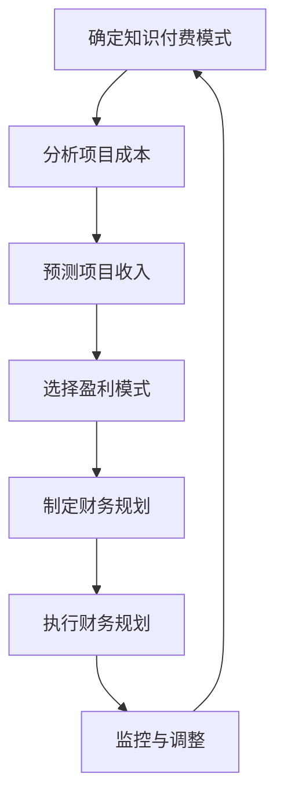

                 

# 《程序员的知识付费财务规划》

> **关键词：** 程序员、知识付费、财务规划、收入、支出、投资

> **摘要：** 本文旨在探讨程序员如何通过知识付费实现财务自由，并详细讲解财务规划的基础知识、实践方法和风险管理策略。通过本文，程序员可以更好地理解知识付费的财务规划，为其职业发展提供指导。

## 目录大纲

### 第一部分：知识付费概述

- **1.1 知识付费的概念与发展**
  - **1.1.1 什么是知识付费**
  - **1.1.2 知识付费的发展历程**
  - **1.1.3 知识付费的趋势与前景**

- **1.2 程序员参与知识付费的意义**
  - **1.2.1 程序员在知识付费中的角色**
  - **1.2.2 程序员知识输出的价值**
  - **1.2.3 知识付费对程序员职业发展的影响**

### 第二部分：财务规划基础

- **2.1 财务规划的重要性**
  - **2.1.1 财务规划的基本概念**
  - **2.1.2 财务规划的目标与原则**
  - **2.1.3 财务规划的影响因素**

- **2.2 程序员个人财务状况分析**
  - **2.2.1 收入与支出分析**
  - **2.2.2 负债与资产分析**
  - **2.2.3 财务状况评估与优化**

- **2.3 财务规划的基本工具**
  - **2.3.1 预算制定与管理**
  - **2.3.2 储蓄与投资规划**
  - **2.3.3 税务规划**

### 第三部分：知识付费财务规划实践

- **3.1 程序员知识付费模式分析**
  - **3.1.1 内容付费模式**
  - **3.1.2 课程付费模式**
  - **3.1.3 服务付费模式**
  - **3.1.4 知识付费平台分析**

- **3.2 知识付费项目的财务规划**
  - **3.2.1 项目成本分析**
  - **3.2.2 项目收入预测**
  - **3.2.3 盈利模式分析**
  - **3.2.4 财务指标计算与评估**

- **3.3 知识付费项目的资金管理**
  - **3.3.1 资金来源与用途规划**
  - **3.3.2 资金筹集方式**
  - **3.3.3 资金风险与管理**

- **3.4 程序员个人知识付费案例解析**
  - **3.4.1 案例一：内容创作者的财务规划**
  - **3.4.2 案例二：教育平台的财务规划**
  - **3.4.3 案例三：技术咨询服务的财务规划**

### 第四部分：财务规划与风险控制

- **4.1 财务风险识别与管理**
  - **4.1.1 财务风险类型**
  - **4.1.2 财务风险识别方法**
  - **4.1.3 财务风险控制策略**

- **4.2 财务规划中的税务问题**
  - **4.2.1 税务法规概述**
  - **4.2.2 程序员税务筹划策略**
  - **4.2.3 税务申报与审计**

- **4.3 财务规划中的法律风险**
  - **4.3.1 法律风险类型**
  - **4.3.2 法律风险防范措施**
  - **4.3.3 合同管理中的财务规划**

### 第五部分：财务规划案例分析

- **5.1 成功案例分析**
  - **5.1.1 案例一：知识付费领域的成功创业者**
  - **5.1.2 案例二：程序员的财务自由之路**
  - **5.1.3 案例三：大型知识付费平台的财务规划**

- **5.2 失败案例分析**
  - **5.2.1 案例一：知识付费创业的失败案例**
  - **5.2.2 案例二：程序员的财务规划失误**
  - **5.2.3 案例三：知识付费平台的财务危机**

### 附录

- **附录 A：财务规划工具与资源**
  - **A.1 财务管理软件推荐**
  - **A.2 知识付费平台分析**
  - **A.3 财务规划相关书籍推荐**

- **附录 B：知识付费财务规划流程图**

## 第一部分：知识付费概述

### 1.1 知识付费的概念与发展

#### 1.1.1 什么是知识付费

知识付费，顾名思义，就是消费者为获取知识内容而支付费用的一种商业行为。在互联网时代，知识付费已成为一种新兴的商业模式。它涵盖了内容付费、课程付费、服务付费等多种形式。

内容付费，主要指的是用户为获取特定领域的文章、视频、音频等内容而支付的费用。例如，用户购买某知名科技博客的专栏文章，或订阅某个知识类APP的内容。

课程付费，指的是用户为参加线上或线下课程而支付的费用。这种模式通常用于技能培训、学历提升等领域。例如，程序员可能会购买某个在线教育平台提供的编程课程，以提升自己的技能。

服务付费，指的是用户为获取专业咨询服务而支付的费用。这种模式常见于法律、财务、医疗等领域。例如，程序员可能会为获取某财务专家的咨询服务而支付费用。

#### 1.1.2 知识付费的发展历程

知识付费的兴起可以追溯到2016年左右。当时，随着移动互联网的普及，用户对知识的渴求日益增加，而互联网平台则为知识付费提供了便利的条件。

2016年，知乎开启了知识市场，用户可以通过付费获取专业回答。这一举动标志着知识付费正式进入大众视野。

2017年，得到App上线，其主打的知识付费课程迅速吸引了大量用户，进一步推动了知识付费市场的发展。

2018年，喜马拉雅FM、得到App等平台发布了知识付费年度报告，数据显示知识付费市场规模逐年增长。

#### 1.1.3 知识付费的趋势与前景

当前，知识付费市场正处于快速发展的阶段。以下是一些主要趋势和前景：

1. **内容多样化和专业化**：知识付费平台将继续丰富内容种类，满足用户多样化的需求。同时，内容将更加专业化，为用户提供更精准的知识服务。

2. **线上线下融合**：知识付费将更加注重线上线下结合，提供多元化的学习体验。例如，线上课程结合线下实践，或线上互动结合线下交流。

3. **个性化推荐**：随着大数据和人工智能技术的发展，知识付费平台将更加精准地推荐内容，提高用户的学习效果。

4. **市场规模持续增长**：随着用户对知识的渴求不断提高，知识付费市场规模将持续增长。预计到2025年，我国知识付费市场规模将达到5000亿元。

### 1.2 程序员参与知识付费的意义

#### 1.2.1 程序员在知识付费中的角色

程序员是知识付费的重要参与者，他们在知识付费市场中扮演着多重角色：

1. **知识提供者**：程序员通过编写技术博客、撰写技术书籍、开设在线课程等方式，将自己掌握的知识分享给他人。

2. **知识传播者**：程序员通过互联网平台，将知识传播给更广泛的受众，促进知识的普及和共享。

3. **知识付费用户**：程序员同样是知识付费的用户，他们通过购买课程、订阅专栏等方式，不断提升自己的专业技能。

#### 1.2.2 程序员知识输出的价值

程序员的知识输出具有很高的价值，主要体现在以下几个方面：

1. **技能提升**：程序员通过输出知识，不仅能够巩固自己的技能，还能激发学习的热情，促进技能的提升。

2. **职业发展**：知识输出有助于程序员在职场中提升竞争力，增加升职加薪的机会。

3. **收入增加**：程序员可以通过知识付费获得额外收入，实现财务自由。

#### 1.2.3 知识付费对程序员职业发展的影响

知识付费对程序员的职业发展具有积极影响，具体表现在以下几个方面：

1. **技能提升**：通过参与知识付费，程序员可以学习到最新的技术知识和行业动态，提升自己的技能水平。

2. **职业晋升**：具备丰富知识和经验的程序员更容易获得晋升机会，提升职业地位。

3. **财务自由**：知识付费可以为程序员带来额外收入，有助于实现财务自由，提高生活质量。

### 总结

知识付费作为一种新兴的商业模式，为程序员提供了丰富的职业发展机会。通过参与知识付费，程序员不仅可以提升自己的技能，实现职业晋升，还可以获得额外收入，实现财务自由。因此，程序员应充分利用知识付费的优势，为自己的职业发展奠定坚实基础。

## 第二部分：财务规划基础

### 2.1 财务规划的重要性

#### 2.1.1 财务规划的基本概念

财务规划是指通过对个人或企业财务状况的分析、预测和规划，制定出一套合理的财务策略，以实现财务目标的过程。对于程序员而言，财务规划尤为重要，因为良好的财务规划有助于提高生活质量，实现职业发展目标。

财务规划主要包括以下三个方面：

1. **收入规划**：合理规划收入来源，确保收入稳定且可持续增长。

2. **支出规划**：合理安排支出，确保收支平衡，避免过度消费。

3. **投资规划**：根据自身财务状况和风险承受能力，选择合适的投资渠道，实现资产增值。

#### 2.1.2 财务规划的目标与原则

财务规划的目标主要包括以下几个方面：

1. **保障基本生活需求**：确保日常生活费用的合理支出，维持基本生活水平。

2. **实现财务自由**：通过积累财富，降低生活压力，实现财务自由。

3. **子女教育**：为子女的教育储备资金，确保他们能够接受良好的教育。

4. **退休规划**：为退休生活提前储备资金，确保退休后生活质量不受影响。

财务规划应遵循以下原则：

1. **合理规划**：根据自身实际情况，制定切实可行的财务规划。

2. **量入为出**：合理安排支出，确保收支平衡，避免过度消费。

3. **多元化投资**：分散投资风险，提高资产增值潜力。

4. **持续跟踪与调整**：定期评估财务规划的有效性，及时调整策略。

#### 2.1.3 财务规划的影响因素

财务规划的影响因素主要包括以下几个方面：

1. **收入水平**：收入水平直接影响财务规划的目标和策略。

2. **支出习惯**：支出习惯决定财务规划的执行效果。

3. **投资渠道**：投资渠道的多样性影响财务规划的收益。

4. **市场环境**：宏观经济环境和行业发展趋势影响财务规划的实施。

5. **家庭状况**：家庭状况，如子女教育、住房需求等，影响财务规划的具体内容。

### 2.2 程序员个人财务状况分析

#### 2.2.1 收入与支出分析

程序员个人财务状况的首要任务是了解自己的收入和支出状况。以下是收入与支出分析的具体步骤：

1. **收入来源**：确定主要收入来源，如工资、奖金、股权激励、知识付费等。

2. **收入结构**：分析收入结构，了解收入来源的稳定性和可持续性。

3. **收入预期**：预测未来收入趋势，为财务规划提供依据。

4. **支出项目**：列出主要支出项目，如房租、生活费、保险、教育等。

5. **支出结构**：分析支出结构，了解支出的合理性和优先级。

6. **支出预期**：预测未来支出趋势，为财务规划提供依据。

#### 2.2.2 负债与资产分析

负债与资产分析是了解个人财务状况的重要环节。以下是负债与资产分析的具体步骤：

1. **负债情况**：确定主要负债，如房贷、车贷、信用卡欠款等。

2. **负债结构**：分析负债结构，了解负债的合理性和风险。

3. **负债预期**：预测未来负债趋势，为财务规划提供依据。

4. **资产情况**：确定主要资产，如现金、股票、债券、房产等。

5. **资产结构**：分析资产结构，了解资产的安全性、流动性和收益性。

6. **资产预期**：预测未来资产趋势，为财务规划提供依据。

#### 2.2.3 财务状况评估与优化

财务状况评估与优化是确保财务规划有效执行的重要步骤。以下是财务状况评估与优化的具体步骤：

1. **财务状况评估**：根据收入、支出、负债、资产等数据，对当前财务状况进行评估。

2. **财务目标设定**：根据评估结果，设定短期和长期财务目标。

3. **支出优化**：调整支出结构，降低非必要支出，提高生活质量。

4. **收入提升**：通过技能提升、职业晋升等方式，提高收入水平。

5. **负债优化**：优化负债结构，降低负债成本，提高资产增值潜力。

6. **资产配置**：根据风险承受能力和投资目标，合理配置资产，实现资产增值。

### 2.3 财务规划的基本工具

#### 2.3.1 预算制定与管理

预算制定与管理是财务规划的重要工具。以下是预算制定与管理的具体步骤：

1. **制定预算**：根据收入预期和支出需求，制定月度或年度预算。

2. **预算执行**：按照预算安排收支，确保预算的执行。

3. **预算调整**：根据实际情况，及时调整预算，确保预算的合理性。

4. **预算分析**：定期分析预算执行情况，评估预算的执行效果。

#### 2.3.2 储蓄与投资规划

储蓄与投资规划是实现财务目标的重要手段。以下是储蓄与投资规划的具体步骤：

1. **储蓄目标设定**：根据财务目标，设定储蓄目标。

2. **储蓄计划制定**：根据收入和支出情况，制定储蓄计划。

3. **储蓄执行**：按照储蓄计划，定期进行储蓄。

4. **投资规划**：根据风险承受能力和投资目标，选择合适的投资渠道。

5. **投资执行**：按照投资规划，定期进行投资。

6. **投资监控**：定期监控投资情况，评估投资效果。

#### 2.3.3 税务规划

税务规划是确保财务规划合法合规的重要环节。以下是税务规划的具体步骤：

1. **税务法规了解**：了解相关税务法规和政策，确保财务规划符合法律规定。

2. **税务筹划策略制定**：根据个人情况和税务法规，制定税务筹划策略。

3. **税务申报**：按时进行税务申报，确保税务合规。

4. **税务审计**：接受税务审计，确保财务规划的合法性和合理性。

### 总结

财务规划是程序员实现职业发展和生活质量提升的重要保障。通过收入与支出分析、负债与资产分析，程序员可以全面了解自己的财务状况，制定合理的财务规划。预算制定与管理、储蓄与投资规划、税务规划等基本工具，有助于程序员实现财务目标，提高生活质量。因此，程序员应重视财务规划，充分利用各种财务工具，为自己的未来打下坚实的基础。

## 第三部分：知识付费财务规划实践

### 3.1 程序员知识付费模式分析

在知识付费领域，程序员可以采用多种模式进行知识输出，以实现财务目标。以下是对几种主要模式的分析：

#### 3.1.1 内容付费模式

内容付费模式是指程序员通过创作和分享技术博客、文章、视频等内容，向读者收取费用。这种模式的主要特点如下：

1. **创作内容**：程序员根据自己的专业知识和经验，创作具有价值和实用性的技术内容。

2. **平台发布**：程序员将内容发布在知识付费平台，如简书、知乎、掘金等，吸引读者关注。

3. **收取费用**：读者通过付费购买内容，程序员从中获得收入。

4. **收益分配**：平台通常会按照一定的比例与创作者分成，具体比例根据平台政策而定。

#### 3.1.2 课程付费模式

课程付费模式是指程序员通过开设线上或线下课程，向学员收取费用。这种模式的主要特点如下：

1. **课程设计**：程序员根据自身专业知识和市场需求，设计具有吸引力的课程。

2. **平台合作**：程序员与在线教育平台合作，如网易云课堂、腾讯课堂等，进行课程推广。

3. **课程收费**：学员通过付费报名参加课程，程序员从中获得收入。

4. **收益模式**：课程收入通常包括课程销售、学员服务费用等，收益模式较为多样。

#### 3.1.3 服务付费模式

服务付费模式是指程序员通过提供专业咨询服务，如技术指导、项目评估等，向客户收取费用。这种模式的主要特点如下：

1. **咨询服务**：程序员利用自身专业知识和经验，为客户提供个性化的技术解决方案。

2. **客户获取**：程序员通过线上平台、社交媒体等渠道，宣传自己的咨询服务，吸引潜在客户。

3. **服务收费**：客户通过付费购买咨询服务，程序员从中获得收入。

4. **收益稳定性**：服务付费模式通常具有较高的收益稳定性，因为客户通常需要长期的技术支持。

#### 3.1.4 知识付费平台分析

知识付费平台是程序员进行知识输出的重要渠道。以下是对几种主要知识付费平台的分析：

1. **知乎**：知乎是一个具有高度影响力的知识社区，程序员可以通过创作高质量的内容，获得读者的关注和付费支持。

2. **得到App**：得到App是一个专注于知识付费的平台，程序员可以通过开设课程或专栏，实现知识变现。

3. **网易云课堂**：网易云课堂是网易旗下的在线教育平台，程序员可以通过开设课程，向学员传授专业知识和技能。

4. **掘金**：掘金是一个面向技术人群的知识社区，程序员可以通过创作技术博客，吸引读者并实现内容付费。

### 3.2 知识付费项目的财务规划

程序员在进行知识付费项目时，需要制定详细的财务规划，以确保项目的可持续发展和收益最大化。以下是对知识付费项目财务规划的具体步骤：

#### 3.2.1 项目成本分析

项目成本分析是制定财务规划的基础。程序员需要对项目的各项成本进行详细分析，包括：

1. **时间成本**：程序员创作内容或提供咨询服务所需的时间。

2. **人力成本**：项目团队成员的薪酬和福利支出。

3. **平台费用**：知识付费平台的服务费用，如平台抽成、推广费用等。

4. **营销成本**：项目推广和宣传的费用。

5. **其他成本**：如办公场所租赁、设备购置等。

#### 3.2.2 项目收入预测

项目收入预测是财务规划的关键环节。程序员需要根据项目特点和市场状况，预测项目的收入情况，包括：

1. **内容付费收入**：根据内容的价值和受众需求，预测内容的付费转化率。

2. **课程收入**：根据课程的价格和招生人数，预测课程的收入。

3. **服务收入**：根据服务的价值和市场竞争力，预测服务的收入。

4. **其他收入**：如广告收入、赞助收入等。

#### 3.2.3 盈利模式分析

盈利模式分析是确保项目可持续发展的关键。程序员需要根据项目特点，选择合适的盈利模式，包括：

1. **单一收入模式**：如内容付费、课程收费等。

2. **多元化收入模式**：结合内容付费、课程收费、服务付费等多种模式，实现收入多元化。

3. **平台合作模式**：与知识付费平台合作，通过平台流量和资源，提高项目的知名度和收益。

#### 3.2.4 财务指标计算与评估

财务指标计算与评估是衡量项目财务状况的重要手段。程序员需要根据项目特点，选择合适的财务指标，如：

1. **投资回报率（ROI）**：计算项目收益与成本的比值，评估项目的盈利能力。

2. **净利润率**：计算项目净利润与收入的比值，评估项目的盈利水平。

3. **现金流量**：分析项目的现金流入和流出情况，评估项目的现金流状况。

4. **资产负债率**：计算项目负债与资产的比值，评估项目的负债水平。

### 3.3 知识付费项目的资金管理

资金管理是确保知识付费项目顺利实施和持续发展的重要环节。以下是对知识付费项目资金管理的具体步骤：

#### 3.3.1 资金来源与用途规划

资金来源与用途规划是资金管理的首要任务。程序员需要根据项目特点和财务规划，明确资金来源和用途，包括：

1. **自有资金**：程序员个人的储蓄和投资收益。

2. **借款**：如银行贷款、亲朋好友借款等。

3. **投资**：如天使投资、风险投资等。

4. **平台支持**：如知识付费平台提供的奖励、补贴等。

资金用途主要包括：

1. **项目成本**：如人力成本、平台费用、营销成本等。

2. **运营费用**：如办公场所租赁、设备购置等。

3. **收益分配**：如平台抽成、项目团队奖励等。

#### 3.3.2 资金筹集方式

资金筹集方式是确保项目资金充足的重要手段。程序员可以选择以下几种方式筹集资金：

1. **内部融资**：如利用个人储蓄和投资收益。

2. **外部融资**：如借款、天使投资、风险投资等。

3. **众筹**：利用互联网众筹平台，向公众筹集资金。

4. **平台合作**：与知识付费平台合作，通过平台流量和资源，吸引投资者。

#### 3.3.3 资金风险与管理

资金风险是知识付费项目面临的重要风险之一。程序员需要采取有效的风险管理和控制措施，包括：

1. **风险评估**：对项目资金来源和用途进行风险评估，识别潜在风险。

2. **风险控制**：采取风险控制措施，如分散投资、设定风险限额等。

3. **应急预案**：制定应急预案，应对可能发生的资金风险。

4. **财务管理**：加强财务管理，确保资金的安全和合理使用。

### 3.4 程序员个人知识付费案例解析

#### 3.4.1 案例一：内容创作者的财务规划

某程序员A是一位资深的技术博客作家，他在多个知名技术博客平台上发表技术文章，吸引了大量读者。为了实现财务自由，A制定了以下财务规划：

1. **收入规划**：A通过内容付费模式，每月从知识付费平台获得收入。他设定了一个月度收入目标，并采取多种策略，如提高内容质量、增加文章数量等，以实现收入目标。

2. **支出规划**：A合理安排支出，确保收支平衡。他将收入分为三个部分：生活费用、储蓄和投资。生活费用主要用于日常生活开支，储蓄用于未来购房和子女教育，投资用于股票、基金等。

3. **投资规划**：A根据自身的风险承受能力，选择合适的投资渠道，实现资产增值。他通过投资获得了额外的收入，进一步提高了生活质量。

4. **税务规划**：A了解相关税务法规，进行税务筹划，确保财务规划的合法性。

#### 3.4.2 案例二：教育平台的财务规划

某程序员B是一家在线教育平台的创始人，他通过开设编程课程，为学员提供高质量的技术培训。B制定了以下财务规划：

1. **项目成本分析**：B对课程制作、推广、平台费用等成本进行了详细分析，确保项目具有盈利潜力。

2. **项目收入预测**：B根据市场需求和课程质量，预测了课程的收入。他设定了一个年度收入目标，并采取多种策略，如增加课程种类、提高课程质量等，以实现收入目标。

3. **盈利模式分析**：B选择了多元化盈利模式，包括课程销售、学员服务费用、广告收入等，以实现收入多元化。

4. **财务指标计算与评估**：B定期计算项目财务指标，如投资回报率、净利润率等，评估项目的财务状况。

5. **资金管理**：B制定了详细的资金管理计划，包括资金来源、用途和筹集方式。他采取了有效的风险管理措施，确保项目资金的安全和合理使用。

#### 3.4.3 案例三：技术咨询服务的财务规划

某程序员C是一位资深的技术顾问，他为企业提供技术咨询服务。C制定了以下财务规划：

1. **收入规划**：C通过咨询服务，每月获得收入。他设定了一个月度收入目标，并采取多种策略，如扩大客户群、提高服务质量等，以实现收入目标。

2. **支出规划**：C合理安排支出，确保收支平衡。他将收入分为两个部分：生活费用和储蓄。生活费用主要用于日常生活开支，储蓄用于未来购房和子女教育。

3. **投资规划**：C根据自身的风险承受能力，选择合适的投资渠道，实现资产增值。他通过投资获得了额外的收入，进一步提高了生活质量。

4. **税务规划**：C了解相关税务法规，进行税务筹划，确保财务规划的合法性。

### 总结

知识付费为程序员提供了丰富的财务规划实践机会。通过分析不同的知识付费模式、制定详细的财务规划、进行资金管理，程序员可以实现财务目标，提高生活质量。案例解析展示了内容创作者、教育平台创始人和技术顾问的财务规划实践，为程序员提供了有益的参考。

## 第四部分：财务规划与风险控制

### 4.1 财务风险识别与管理

财务风险是知识付费项目在财务规划过程中可能面临的风险，包括收入波动、支出超预算、资金筹集困难等。为了确保项目的稳健发展，程序员需要采取有效的风险识别与管理措施。

#### 4.1.1 财务风险类型

1. **收入风险**：由于市场需求、竞争环境等因素的变化，可能导致收入不稳定或下降。

2. **支出风险**：由于成本上涨、管理不善等原因，可能导致支出超出预算。

3. **资金筹集风险**：由于资金需求较大，但市场资金紧张，可能导致筹集资金困难。

4. **投资风险**：由于市场波动、投资决策不当等原因，可能导致投资损失。

5. **税务风险**：由于税务法规的变化、税务筹划不当等原因，可能导致税务风险。

#### 4.1.2 财务风险识别方法

1. **数据分析**：通过分析财务报表、收入结构、支出项目等数据，识别潜在风险。

2. **风险评估**：采用定性与定量方法，对财务风险进行评估，确定风险的严重程度。

3. **访谈与调研**：通过与团队成员、客户、合作伙伴等进行访谈和调研，了解风险来源和潜在影响。

#### 4.1.3 财务风险控制策略

1. **收入风险管理**：通过市场调研、产品优化等手段，提高产品竞争力，稳定收入。

2. **支出风险管理**：通过预算管理、成本控制等手段，降低支出，确保支出在预算范围内。

3. **资金筹集风险管理**：通过多元化融资渠道、加强资金管理等方式，提高资金筹集能力。

4. **投资风险管理**：通过分散投资、合理配置资产等手段，降低投资风险。

5. **税务风险管理**：通过了解税务法规、进行税务筹划等手段，降低税务风险。

### 4.2 财务规划中的税务问题

税务问题是财务规划中不可忽视的一部分，程序员需要了解相关税务法规，进行税务筹划，以降低税务负担。

#### 4.2.1 税务法规概述

1. **个人所得税**：我国个人所得税实行累进税率，根据收入水平分为七个档次。

2. **增值税**：针对企业提供应税服务，征收增值税。

3. **企业所得税**：对企业所得征税，税率一般为25%。

4. **其他税费**：如房产税、车船税等。

#### 4.2.2 程序员税务筹划策略

1. **合理避税**：了解税务法规，利用税收优惠政策，降低税负。

2. **税后收入最大化**：通过提高收入、降低成本等方式，提高税后收入。

3. **资产配置**：通过合理配置资产，降低资产税负。

4. **税务审计**：接受税务审计，确保税务合规。

#### 4.2.3 税务申报与审计

1. **税务申报**：按时进行税务申报，确保税务合规。

2. **税务审计**：接受税务审计，确保财务规划的合法性和合理性。

### 4.3 财务规划中的法律风险

法律风险是财务规划过程中可能面临的风险，包括合同管理、知识产权保护、劳动法等方面。程序员需要采取有效的法律风险防范措施。

#### 4.3.1 法律风险类型

1. **合同纠纷**：由于合同条款不清、履行不及时等原因，可能导致合同纠纷。

2. **知识产权侵权**：由于知识产权保护意识不足，可能导致侵权纠纷。

3. **劳动纠纷**：由于劳动关系不明确、员工权益保护不力等原因，可能导致劳动纠纷。

#### 4.3.2 法律风险防范措施

1. **合同管理**：完善合同条款，明确双方权利和义务，降低合同纠纷风险。

2. **知识产权保护**：加强知识产权保护意识，采取有效的知识产权保护措施。

3. **劳动法合规**：遵守劳动法规定，确保劳动关系合法合规。

4. **法律咨询**：遇到法律问题，及时寻求专业法律咨询，降低法律风险。

#### 4.3.3 合同管理中的财务规划

1. **合同预算**：在签订合同前，进行合同预算，确保合同执行过程中的财务风险。

2. **合同审核**：聘请专业律师对合同进行审核，确保合同条款的合法性和合理性。

3. **合同执行**：严格按照合同约定执行，确保合同目标的实现。

### 总结

财务规划与风险控制是知识付费项目成功的关键。程序员需要识别和管理财务风险，进行税务筹划，防范法律风险，确保项目的稳健发展。通过有效的财务规划和风险控制，程序员可以实现财务自由，提高生活质量。

## 第五部分：财务规划案例分析

### 5.1 成功案例分析

#### 5.1.1 案例一：知识付费领域的成功创业者

李明是一位资深程序员，他在知识付费领域取得了巨大成功。他创立了一家专注于技术领域的知识付费平台，通过提供高质量的课程、内容和服务，吸引了大量用户。

1. **项目成本分析**：李明详细分析了项目的各项成本，包括课程开发、平台维护、推广等费用。他通过合理控制成本，确保项目的盈利性。

2. **项目收入预测**：李明根据市场需求和课程质量，预测了项目的收入。他采取了多种策略，如课程优化、增加课程种类等，以提高收入。

3. **盈利模式分析**：李明选择了多元化的盈利模式，包括课程销售、学员服务费用、广告收入等。这种模式有助于实现收入的稳定增长。

4. **财务指标计算与评估**：李明定期计算项目的财务指标，如投资回报率、净利润率等，以评估项目的财务状况。这些指标帮助他及时调整项目策略，确保项目的可持续发展。

5. **资金管理**：李明制定了详细的资金管理计划，包括资金来源、用途和筹集方式。他采取了有效的风险管理措施，确保项目资金的安全和合理使用。

#### 5.1.2 案例二：程序员的财务自由之路

张强是一位热爱编程的程序员，他在工作中积累了丰富的经验和技能。为了实现财务自由，张强开始在知识付费平台上开设编程课程，并通过内容付费模式获得了稳定的收入。

1. **收入规划**：张强设定了一个月度收入目标，并采取多种策略，如提高课程质量、增加课程数量等，以实现收入目标。

2. **支出规划**：张强合理安排支出，确保收支平衡。他将收入分为生活费用、储蓄和投资三个部分，以实现财务目标。

3. **投资规划**：张强根据自身的风险承受能力，选择合适的投资渠道，如股票、基金等。通过投资，他获得了额外的收入，提高了生活质量。

4. **税务规划**：张强了解相关税务法规，进行税务筹划，确保财务规划的合法性。

#### 5.1.3 案例三：大型知识付费平台的财务规划

某大型知识付费平台通过提供高质量的课程、内容和咨询服务，吸引了大量用户。该平台制定了详细的财务规划，确保项目的可持续发展。

1. **项目成本分析**：平台详细分析了项目的各项成本，包括课程开发、平台维护、推广等费用。通过合理控制成本，平台确保了项目的盈利性。

2. **项目收入预测**：平台根据市场需求和课程质量，预测了项目的收入。通过采取多种策略，如课程优化、增加课程种类等，平台实现了收入的稳定增长。

3. **盈利模式分析**：平台选择了多元化的盈利模式，包括课程销售、学员服务费用、广告收入等。这种模式有助于实现收入的多元化，降低风险。

4. **财务指标计算与评估**：平台定期计算财务指标，如投资回报率、净利润率等，以评估项目的财务状况。通过这些指标，平台能够及时调整项目策略，确保项目的可持续发展。

5. **资金管理**：平台制定了详细的资金管理计划，包括资金来源、用途和筹集方式。通过有效的风险管理措施，平台确保了项目资金的安全和合理使用。

### 5.2 失败案例分析

#### 5.2.1 案例一：知识付费创业的失败案例

王刚是一位热衷于编程的程序员，他决定创业，创建一家知识付费平台。然而，由于缺乏财务规划和风险管理意识，王刚的创业项目最终失败。

1. **项目成本分析**：王刚在项目成本分析方面做得不够细致，导致成本超支。他在课程开发、平台维护等方面投入了大量的资金，但未能实现预期的收入。

2. **项目收入预测**：王刚在收入预测方面存在偏差，未能准确预测市场需求和课程质量对收入的影响。他的课程销售不如预期，导致收入不稳定。

3. **盈利模式分析**：王刚的盈利模式过于单一，主要依赖课程销售。由于市场需求的变化，他的收入来源变得不稳定。

4. **财务指标计算与评估**：王刚未能定期计算财务指标，评估项目的财务状况。他对项目的盈利能力缺乏清晰的认识，导致项目陷入困境。

5. **资金管理**：王刚在资金管理方面存在问题，未能有效筹集资金，应对项目中的资金需求。他的资金链断裂，导致项目无法继续运营。

#### 5.2.2 案例二：程序员的财务规划失误

赵强是一位有多年编程经验的程序员，他希望通过财务规划实现财务自由。然而，由于规划失误，他的财务规划并没有达到预期效果。

1. **收入规划**：赵强设定了一个过高的月度收入目标，但未能实现。他的收入不稳定，导致收支不平衡。

2. **支出规划**：赵强在支出规划方面存在问题，未能合理安排生活费用和储蓄。他的支出超过收入，导致财务状况恶化。

3. **投资规划**：赵强在投资方面存在风险意识不足的问题，投资了高风险的股票，导致损失。

4. **税务规划**：赵强在税务规划方面缺乏了解，未能进行有效的税务筹划，导致税务负担加重。

#### 5.2.3 案例三：知识付费平台的财务危机

某知识付费平台由于管理不善和财务规划失误，陷入了严重的财务危机。

1. **项目成本分析**：平台在项目成本分析方面做得不够细致，导致成本控制不力。他们在课程开发、平台维护等方面投入了大量的资金，但未能实现预期的收入。

2. **项目收入预测**：平台在收入预测方面存在偏差，未能准确预测市场需求和课程质量对收入的影响。他们的课程销售不如预期，导致收入不稳定。

3. **盈利模式分析**：平台选择了过于单一的盈利模式，主要依赖课程销售。由于市场需求的变化，他们的收入来源变得不稳定。

4. **财务指标计算与评估**：平台未能定期计算财务指标，评估项目的财务状况。他们对项目的盈利能力缺乏清晰的认识，导致项目陷入困境。

5. **资金管理**：平台在资金管理方面存在问题，未能有效筹集资金，应对项目中的资金需求。他们的资金链断裂，导致项目无法继续运营。

### 总结

成功案例和失败案例都为我们提供了宝贵的经验和教训。通过成功的案例分析，我们可以了解到财务规划的重要性，以及如何通过有效的成本控制、收入预测、盈利模式选择和资金管理，实现项目的可持续发展。而失败案例则提醒我们，财务规划和风险管理的重要性，以及忽视这些因素可能带来的严重后果。因此，程序员在进行知识付费财务规划时，应充分吸取成功经验，避免失败案例中的错误，确保项目的成功。

## 附录

### 附录 A：财务规划工具与资源

#### A.1 财务管理软件推荐

1. **MoneyDiva**：一款功能强大的个人财务管理软件，支持预算制定、支出跟踪、储蓄和投资规划等功能。

2. **Mint**：一款免费的财务管理工具，可以帮助用户跟踪收入、支出和资产负债情况，并提供个性化的财务建议。

3. **YNAB（You Need A Budget）**：一款专注于预算制定和财务规划的工具，可以帮助用户实现财务自由。

#### A.2 知识付费平台分析

1. **知乎**：一个具有高度影响力的知识社区，支持内容付费和知识分享，适合程序员进行知识输出。

2. **得到App**：一个专注于知识付费的平台，提供高质量的课程和专栏，适合程序员进行课程销售和内容创作。

3. **网易云课堂**：网易旗下的在线教育平台，提供丰富的编程课程，适合程序员进行课程学习和知识分享。

4. **掘金**：一个面向技术人群的知识社区，支持内容付费和知识传播，适合程序员进行技术博客创作。

#### A.3 财务规划相关书籍推荐

1. **《财务自由之路》**：作者罗伯特·清崎，详细介绍了财务自由的概念和实现方法。

2. **《理财的第一本书》**：作者金鹰，系统讲解了个人财务规划和投资策略。

3. **《穷爸爸富爸爸》**：作者罗伯特·清崎，通过生动的案例，介绍了理财和投资的智慧。

### 附录 B：知识付费财务规划流程图

- [知识付费财务规划流程图](#knowledge-fee-financial-planning-process-flowchart)

### 总结

本文通过详细讲解程序员的知识付费财务规划，为程序员提供了实现财务自由的方法和策略。通过分析知识付费模式、制定财务规划、进行资金管理、识别和管理财务风险，程序员可以确保知识付费项目的成功，实现职业发展和生活质量的提升。同时，附录中的工具和资源推荐，为程序员提供了实用的支持和指导。希望本文对广大程序员有所帮助，祝愿大家财务规划成功，实现人生目标！作者：AI天才研究院/AI Genius Institute & 禅与计算机程序设计艺术 /Zen And The Art of Computer Programming。

