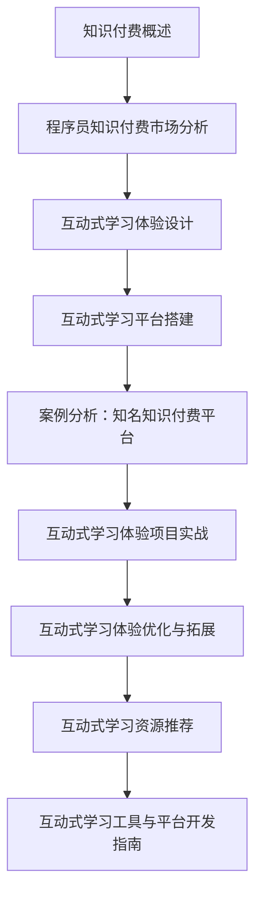

                 

# 《程序员知识付费：打造互动式学习体验》

## 关键词
知识付费、程序员、互动式学习、用户体验、技术博客

## 摘要
本文旨在探讨程序员知识付费领域，通过分析市场现状与趋势，深入讨论互动式学习体验的设计与实现。文章结构清晰，包括知识付费背景分析、互动式学习体验设计方法、案例分析及项目实战等内容。通过伪代码、数学模型和实际代码实例的详细讲解，为读者提供深入了解和实际操作的指导。

## 目录大纲

### 第一部分：知识付费背景与市场分析

#### 1. 知识付费概述

1.1 知识付费的定义与现状

1.2 知识付费的发展历程

1.3 知识付费的主要模式与平台

#### 2. 程序员知识付费市场分析

2.1 程序员知识付费需求分析

2.2 程序员知识付费市场现状

2.3 程序员知识付费未来趋势

### 第二部分：互动式学习体验设计

#### 3. 互动式学习体验概述

3.1 互动式学习的定义与优势

3.2 互动式学习与知识付费的结合点

3.3 互动式学习体验的设计原则

#### 4. 互动式学习体验设计方法

4.1 用户画像与需求分析

4.2 学习路径规划

4.3 互动元素设计

4.4 学习效果评估与反馈机制

#### 5. 互动式学习平台搭建

5.1 平台架构设计

5.2 技术选型与开发环境

5.3 数据分析与处理

### 第三部分：互动式学习案例解析

#### 6. 案例分析：知名知识付费平台

6.1 案例背景介绍

6.2 平台特点与优势

6.3 案例解析

#### 7. 互动式学习体验项目实战

7.1 项目背景与需求

7.2 项目规划与实施

7.3 项目成果与评估

### 第四部分：互动式学习体验优化与拓展

#### 8. 互动式学习体验优化与拓展

8.1 市场反馈与迭代优化

8.2 新技术应用与拓展

8.3 互动式学习体验的未来发展趋势

### 第五部分：附录

#### 9. 互动式学习资源推荐

9.1 学习资源分类与推荐

9.2 知识付费平台推荐

#### 10. 互动式学习工具与平台开发指南

10.1 开发工具与环境配置

10.2 开发流程与规范

10.3 常见问题与解决方案

#### 附录 A: Mermaid 流�程图



#### 附录 B: 核心算法原理讲解（伪代码）

```python
# 伪代码：推荐系统算法原理
function recommendation_algorithm(user_profile, item_features, user_item_history):
    # 计算用户与物品的相似度
    similarity_score = calculate_similarity(user_profile, item_features)

    # 根据相似度得分推荐物品
    recommended_items = []

    for item in item_features:
        if similarity_score[item] > threshold:
            recommended_items.append(item)

    return recommended_items
```

#### 附录 C: 数学模型和数学公式

```latex
\section{数学模型与公式}
\subsection{线性回归模型}
$$
y = \beta_0 + \beta_1x_1 + \beta_2x_2 + ... + \beta_nx_n
$$

\subsection{逻辑回归模型}
$$
P(y=1|x) = \frac{1}{1 + e^{-(\beta_0 + \beta_1x_1 + \beta_2x_2 + ... + \beta_nx_n)}}
$$
```

#### 附录 D: 项目实战代码解读

```python
# 实战代码：用户行为分析（假设）
def user_behavior_analysis(user_data):
    """
    用户行为分析函数，对用户行为数据进行处理，提取行为特征。
    :param user_data: 用户行为数据（列表）
    :return: 用户行为特征字典
    """
    behavior_features = {}

    # 提取用户登录次数
    behavior_features['login_count'] = len(user_data)

    # 提取用户平均访问时长
    total_duration = sum([data['duration'] for data in user_data])
    behavior_features['average_duration'] = total_duration / len(user_data)

    # 提取用户最常访问的模块
    modules = [data['module'] for data in user_data]
    most_frequent_module = max(set(modules), key=modules.count)
    behavior_features['most_frequent_module'] = most_frequent_module

    return behavior_features

# 代码解读
# 1. 函数定义：定义了用户行为分析的功能。
# 2. 变量提取：从用户行为数据中提取登录次数、平均访问时长和最常访问模块。
# 3. 返回值：将提取的行为特征作为字典形式返回。
```

### 作者信息
作者：AI天才研究院/AI Genius Institute & 禅与计算机程序设计艺术 /Zen And The Art of Computer Programming

接下来，我们将按照目录大纲逐步深入探讨每一部分的内容。首先，我们从知识付费的背景与市场分析开始。

