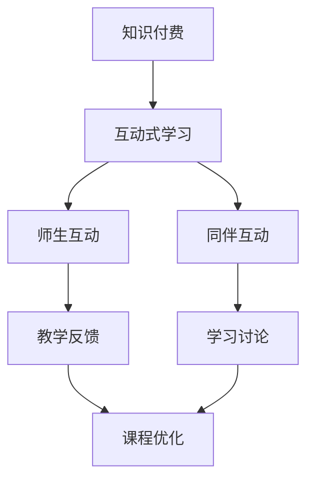

                 

# 《程序员知识付费：打造互动式学习体验》

## 关键词：
- 程序员知识付费
- 互动式学习体验
- 课程设计
- 教学平台
- 技术应用
- 评估与改进

## 摘要：
本文深入探讨程序员知识付费领域的互动式学习体验设计。通过对知识付费的兴起、互动式学习的基础、主流工具与平台、课程设计、互动机制、学习环境设计、技术应用、评估与改进以及成功案例的分析，旨在为程序员提供一套系统、实用的知识付费解决方案，助力其不断提升专业技能。

## 第一部分：知识付费与互动式学习基础

### 第1章：知识付费概述

#### 1.1 知识付费的兴起与发展

知识付费作为互联网时代的一种新兴商业模式，起源于20世纪末。随着互联网技术的迅猛发展，知识传播的方式逐渐从传统的大规模教育向个性化、定制化、互动化的方向发展。知识付费的兴起，不仅满足了人们对高质量知识内容的需求，也促进了知识产业的繁荣。

知识付费的兴起主要受到以下几个因素的推动：

1. **用户需求变化**：随着社会经济的发展，人们对终身学习的需求日益增长，愿意为高质量的知识内容付费。
2. **互联网技术的进步**：大数据、云计算、人工智能等技术的应用，使得知识内容的获取、传播、分享变得更加便捷和高效。
3. **知识共享平台的发展**：以知乎、得到、喜马拉雅等为代表的在线知识共享平台，为知识付费提供了广阔的空间。

#### 1.2 知识付费对程序员的影响

知识付费对程序员的影响主要体现在以下几个方面：

1. **学习资源的获取**：程序员可以通过付费的方式获取到高质量的学习资源，包括技术文档、视频教程、在线课程等。
2. **职业发展的助力**：知识付费可以帮助程序员不断提升专业技能，增强竞争力，为职业发展提供有力支持。
3. **收入来源的多样化**：程序员可以通过知识付费平台，将自己的知识、技能转化为收入来源，实现经济收入的多元化。

#### 1.3 互动式学习的基本概念

互动式学习是指通过教师与学生、学生与学生之间的互动，促进学习者主动参与学习过程，提高学习效果的一种学习方式。互动式学习具有以下基本特点：

1. **主动性**：学习者主动参与学习过程，积极提出问题、解决问题。
2. **互动性**：学习者与教师、同伴之间进行交流互动，分享学习经验和知识。
3. **多样性**：学习方式多样化，包括线上讨论、互动问答、小组合作等。

互动式学习与传统学习相比，具有更高的参与度和互动性，能够更好地满足程序员的个性化学习需求。

### 第2章：互动式学习的理论基础

#### 2.1 互动式学习的定义与特点

互动式学习是一种基于互动和合作的学习方式，强调学习者在学习过程中的主动性和互动性。其定义和特点如下：

1. **定义**：互动式学习是一种通过教师与学生、学生与学生之间的互动，促进学习者主动参与学习过程，提高学习效果的学习方式。
2. **特点**：
   - **主动性**：学习者主动参与学习过程，积极提出问题、解决问题。
   - **互动性**：学习者与教师、同伴之间进行交流互动，分享学习经验和知识。
   - **多样性**：学习方式多样化，包括线上讨论、互动问答、小组合作等。

#### 2.2 互动式学习与传统学习的比较

互动式学习与传统学习在多个方面存在差异：

1. **学习方式**：传统学习以教师为中心，以知识传授为主；互动式学习以学习者为中心，强调主动学习和互动交流。
2. **学习效果**：互动式学习能够更好地调动学习者的积极性和主动性，提高学习效果；传统学习效果相对较低。
3. **适应对象**：互动式学习更适合具有较强自主学习能力和互动意愿的学习者；传统学习适应范围更广。

#### 2.3 互动式学习的设计原则

为了提高互动式学习的有效性，设计时应遵循以下原则：

1. **以学习者为中心**：关注学习者的需求，设计符合学习者特点的教学内容和互动方式。
2. **多样化互动方式**：结合线上讨论、互动问答、小组合作等多种互动方式，提高学习者的参与度和积极性。
3. **及时反馈与互动**：确保学习者能够及时获得反馈，并通过互动交流解决问题，促进学习效果。

### 第3章：互动式学习工具与平台

#### 3.1 主流互动式学习工具介绍

在互动式学习过程中，工具的选择至关重要。目前主流的互动式学习工具有以下几种：

1. **在线课堂**：如Zoom、Microsoft Teams等，支持实时视频会议、互动问答等功能。
2. **学习管理系统（LMS）**：如Moodle、Canvas等，提供课程管理、作业提交、互动讨论等功能。
3. **互动式编程平台**：如Codecademy、freeCodeCamp等，提供编程练习、代码审查、讨论区等功能。
4. **社交媒体平台**：如知乎、微博、微信等，支持用户提问、回答、分享知识等功能。

#### 3.2 互动式学习平台的搭建

搭建一个互动式学习平台需要考虑以下几个关键因素：

1. **技术选型**：根据需求选择合适的编程语言、框架和数据库。
2. **功能设计**：包括课程管理、用户管理、互动讨论、作业提交与批改等功能。
3. **用户体验**：设计简洁、易用的界面，提供丰富的互动功能，提高用户满意度。
4. **安全性**：确保用户数据的安全，采用加密技术、身份验证等手段。

#### 3.3 程序员知识付费平台的案例分析

以某大型编程社区的知识付费平台为例，其成功要素如下：

1. **优质内容**：邀请行业专家、技术大牛进行授课，确保课程质量。
2. **互动机制**：提供实时互动、讨论区、问答等功能，增强用户参与感。
3. **个性化推荐**：根据用户学习记录和兴趣，推荐合适的课程。
4. **激励机制**：设置积分、勋章等激励措施，鼓励用户积极参与学习。

### 第4章：互动式学习课程设计

#### 4.1 课程目标与学习路径规划

课程设计是互动式学习的核心环节。首先需要明确课程目标，包括知识目标、能力目标和情感目标。然后根据课程目标设计学习路径，包括：

1. **基础知识铺垫**：为学习者提供必要的背景知识，帮助其更好地理解课程内容。
2. **核心技能训练**：设计具有挑战性的练习和项目，培养学习者的核心技能。
3. **拓展与深化**：提供拓展性内容，帮助学习者深入理解课程主题。

#### 4.2 教学内容与互动方式的结合

教学内容与互动方式的结合是提高学习效果的关键。以下几种方式值得尝试：

1. **实时互动**：通过在线课堂、直播等方式，实现教师与学生的实时互动。
2. **讨论区**：设置讨论区，鼓励学习者提问、回答问题，分享学习心得。
3. **作业与批改**：布置实践性作业，并提供在线批改服务，帮助学习者及时纠正错误。
4. **小组合作**：组织学习者进行小组讨论、合作完成任务，培养团队协作能力。

#### 4.3 课程评估与反馈机制

课程评估与反馈是互动式学习的重要组成部分。以下几种方法可提高评估与反馈的有效性：

1. **过程性评估**：通过学习日志、作业完成情况等过程性指标，评估学习者的学习进展。
2. **终结性评估**：通过考试、项目展示等方式，评估学习者的学习成果。
3. **互动式反馈**：鼓励教师、同伴之间进行互动式反馈，帮助学习者发现和解决问题。
4. **数据分析**：利用大数据技术，分析学习者的学习行为和效果，为课程改进提供依据。

### 第5章：互动式学习中的互动机制

#### 5.1 互动式学习中的师生互动

师生互动是互动式学习的重要组成部分。以下策略有助于提高师生互动的效果：

1. **实时互动**：通过在线课堂、直播等方式，实现教师与学生的实时互动。
2. **个性化辅导**：根据学生的学习需求，提供个性化的辅导和指导。
3. **教学反馈**：鼓励学生提出问题，教师及时给予解答和反馈。
4. **情感关怀**：关注学生的情感需求，建立良好的师生关系。

#### 5.2 互动式学习中的同伴互动

同伴互动有助于学习者之间的知识共享和技能提升。以下策略可促进同伴互动：

1. **小组讨论**：组织学习者进行小组讨论，分享学习心得和经验。
2. **项目合作**：通过项目合作，培养学习者的团队合作能力。
3. **互相评价**：鼓励学习者之间互相评价作业和项目，促进共同进步。
4. **互动式反馈**：通过互动式反馈，帮助学习者发现和解决问题。

#### 5.3 互动式学习中的技术支持

技术支持是互动式学习成功的关键。以下技术手段可提高互动式学习的效果：

1. **在线课堂**：采用实时视频会议软件，实现教师与学生的实时互动。
2. **学习管理系统**：采用学习管理系统，实现课程管理、作业提交、互动讨论等功能。
3. **社交媒体平台**：利用社交媒体平台，鼓励学习者进行在线交流和分享。
4. **大数据分析**：利用大数据分析技术，分析学习者的学习行为和效果，为课程改进提供依据。

### 第6章：互动式学习环境设计

#### 6.1 互动式学习环境的搭建

搭建一个互动式学习环境需要考虑以下关键因素：

1. **硬件设施**：包括计算机、网络设备、音响设备等。
2. **软件平台**：包括在线课堂、学习管理系统、互动式编程平台等。
3. **教学资源**：包括课件、视频、书籍等。

#### 6.2 互动式学习环境的优化

优化互动式学习环境可以从以下几个方面入手：

1. **用户体验**：优化界面设计，提高软件的易用性。
2. **技术支持**：提供专业的技术支持和故障排查服务。
3. **功能完善**：不断更新和完善学习平台的各项功能。
4. **安全性**：确保用户数据的安全，采用加密技术、身份验证等手段。

#### 6.3 环境的可持续性和可扩展性

互动式学习环境的可持续性和可扩展性是长期发展的重要保障。以下策略可提高环境的可持续性和可扩展性：

1. **模块化设计**：采用模块化设计，方便后续的功能扩展和升级。
2. **开源技术**：采用开源技术，降低开发成本，提高系统的灵活性。
3. **社区支持**：建立学习社区，促进用户之间的交流和合作。
4. **持续迭代**：根据用户反馈和市场需求，不断优化和改进学习平台。

### 第7章：互动式学习中的技术应用

#### 7.1 现代技术的应用场景

现代技术在互动式学习中的应用场景非常广泛，以下是一些常见的应用：

1. **人工智能**：用于智能推荐、自动批改、个性化辅导等。
2. **大数据**：用于学习行为分析、课程效果评估等。
3. **虚拟现实（VR）**：用于模拟真实场景，提高学习体验。
4. **增强现实（AR）**：用于增强学习内容的互动性，提高学习兴趣。
5. **云计算**：用于实现大规模在线教学，提高系统的可扩展性和可靠性。

#### 7.2 技术在互动式学习中的作用

技术为互动式学习提供了强有力的支持，主要体现在以下几个方面：

1. **提高学习效果**：通过智能推荐、自动批改等技术，提高学习效率。
2. **优化学习体验**：通过VR、AR等新技术，提供更加丰富的学习体验。
3. **降低成本**：通过云计算等技术的应用，降低教学成本。
4. **提升教学质量**：通过大数据分析，为教师提供更加科学的教学建议。

#### 7.3 技术选择的考虑因素

在选择互动式学习技术时，需要考虑以下几个因素：

1. **需求匹配**：技术要满足教学需求，解决实际问题。
2. **稳定性**：技术要具备良好的稳定性，确保教学过程的顺利进行。
3. **安全性**：技术要确保用户数据的安全，防止信息泄露。
4. **易用性**：技术要简单易用，方便教师和学生操作。
5. **成本**：技术要具备合理的成本，降低教学负担。

### 第8章：互动式学习的评估与改进

#### 8.1 评估方法与指标

评估互动式学习的效果是确保学习质量的重要手段。以下是一些常见的评估方法和指标：

1. **过程性评估**：通过学习日志、作业完成情况等过程性指标，评估学习者的学习进展。
2. **终结性评估**：通过考试、项目展示等方式，评估学习者的学习成果。
3. **满意度调查**：通过问卷调查、访谈等方式，收集学习者对学习过程的满意度。
4. **学习行为分析**：通过大数据技术，分析学习者的学习行为和效果。

#### 8.2 数据分析与应用

数据分析是互动式学习评估的重要组成部分。以下是一些常见的数据分析方法与应用：

1. **数据收集**：通过学习管理系统、在线课堂等平台，收集学习者的学习数据。
2. **数据清洗**：对收集到的数据进行清洗、去噪，确保数据质量。
3. **数据可视化**：通过数据可视化工具，将数据分析结果以图表、报告等形式展示。
4. **数据挖掘**：通过数据挖掘技术，发现学习者学习行为中的规律和趋势。

#### 8.3 互动式学习的持续改进

基于评估结果，互动式学习需要不断进行改进。以下是一些建议：

1. **课程调整**：根据学习者的反馈和评估结果，调整课程内容、教学方式。
2. **教师培训**：提高教师的教学水平和互动能力，确保教学效果。
3. **技术优化**：根据技术应用的评估结果，优化学习平台的功能和性能。
4. **用户参与**：鼓励学习者积极参与学习过程，提供反馈和建议，共同改进学习体验。

### 第9章：成功案例分享

#### 9.1 案例一：某大型编程社区的知识付费实践

某大型编程社区通过知识付费模式，为程序员提供了丰富的学习资源。以下是该案例的成功要素：

1. **优质内容**：邀请行业专家、技术大牛进行授课，确保课程质量。
2. **互动机制**：提供实时互动、讨论区、问答等功能，增强用户参与感。
3. **个性化推荐**：根据用户学习记录和兴趣，推荐合适的课程。
4. **激励机制**：设置积分、勋章等激励措施，鼓励用户积极参与学习。

#### 9.2 案例二：某互动式编程教学平台的建设与运营

某互动式编程教学平台通过构建互动式学习环境，为程序员提供了良好的学习体验。以下是该案例的成功要素：

1. **技术选型**：采用开源技术，降低开发成本，提高系统的灵活性。
2. **功能完善**：提供在线课堂、学习管理系统、互动讨论等功能，满足教学需求。
3. **用户体验**：优化界面设计，提高软件的易用性。
4. **持续迭代**：根据用户反馈和市场需求，不断优化和改进学习平台。

#### 9.3 案例三：程序员知识付费的个性化服务探索

某知识付费平台通过个性化服务，满足程序员多样化的学习需求。以下是该案例的成功要素：

1. **个性化推荐**：根据用户的学习记录和兴趣，推荐合适的课程。
2. **个性化辅导**：为用户制定个性化的学习计划，提供专业辅导。
3. **定制化课程**：根据用户需求，定制开发特定领域的课程。
4. **学习社群**：建立学习社群，促进用户之间的交流和合作。

### 第10章：实践指南与建议

#### 10.1 程序员知识付费项目的策划与实施

策划与实施程序员知识付费项目需要遵循以下步骤：

1. **需求分析**：了解目标用户的需求，明确项目目标。
2. **内容规划**：设计课程内容，确保课程质量。
3. **平台搭建**：选择合适的工具和技术，搭建学习平台。
4. **推广运营**：制定推广策略，吸引目标用户。
5. **持续优化**：根据用户反馈和市场变化，持续优化课程和平台。

#### 10.2 互动式学习环境的建设与维护

建设与维护互动式学习环境需要关注以下几个方面：

1. **硬件设施**：确保硬件设备的稳定运行，提供良好的学习环境。
2. **软件平台**：不断更新和完善学习平台的功能，提高用户体验。
3. **技术支持**：提供专业的技术支持和故障排查服务，确保教学过程的顺利进行。
4. **数据安全**：确保用户数据的安全，防止信息泄露。

#### 10.3 知识付费与互动式学习的未来发展

随着互联网技术的不断进步，知识付费和互动式学习将呈现以下发展趋势：

1. **个性化**：基于大数据和人工智能技术，实现个性化学习推荐和辅导。
2. **智能化**：利用人工智能技术，实现自动批改、智能问答等功能。
3. **多元化**：打破传统学习模式，探索更多样化的互动式学习方式。
4. **全球化**：打破地域限制，实现全球范围内的知识共享和交流。

### 附录

#### 附录A：互动式学习工具与资源推荐

以下是一些实用的互动式学习工具和资源推荐：

1. **互动式学习工具**：
   - **在线课堂**：Zoom、Microsoft Teams、Google Meet等。
   - **学习管理系统**：Moodle、Canvas、Blackboard等。
   - **互动式编程平台**：Codecademy、freeCodeCamp、LeetCode等。

2. **互动式学习资源**：
   - **在线课程**：Coursera、edX、Udemy等。
   - **电子书库**：亚马逊Kindle、京东读书、多看阅读等。
   - **开源社区**：GitHub、GitLab、Stack Overflow等。

#### 附录B：互动式学习项目案例代码解析

以下是一个简单的互动式学习项目案例代码解析：

**项目描述**：一个基于Python和Django的互动式学习平台，提供课程管理、用户管理、作业提交与批改等功能。

**技术选型**：Python 3.8、Django 3.2、MySQL 8.0。

**源代码实现**：

```python
# models.py
from django.db import models

class Course(models.Model):
    title = models.CharField(max_length=100)
    description = models.TextField()

class Lesson(models.Model):
    course = models.ForeignKey(Course, on_delete=models.CASCADE)
    title = models.CharField(max_length=100)
    content = models.TextField()

class Student(models.Model):
    username = models.CharField(max_length=100)
    course = models.ForeignKey(Course, on_delete=models.CASCADE)
    progress = models.FloatField()

def update_progress(student, lesson):
    # 更新学生的学习进度
    student.progress += 0.1
    student.save()
```

**代码解读与分析**：

- **Course 模型**：定义了课程的基本信息，如标题和描述。
- **Lesson 模型**：定义了课程中的每个小节，包含标题和内容。
- **Student 模型**：定义了学生信息，包含用户名、所属课程和学习进度。
- **update_progress 函数**：用于更新学生的学习进度，每次完成一个小节后，进度增加 0.1。

通过这个简单的案例，我们可以看到如何使用Django框架搭建一个基本的互动式学习平台，并实现学习进度的管理。在实际应用中，还需要添加更多功能，如用户互动、课程评估等。

### 核心概念与联系

以下是一个Mermaid流程图，展示了互动式学习中的核心概念和它们之间的关系：



### 核心算法原理讲解

#### 互动式学习的反馈循环

互动式学习中的反馈循环是确保学习效果的重要机制。以下是一个简单的伪代码，用于描述反馈循环的原理：

```python
function interactive_learning_loop(course_content, student_input):
    for each lesson in course_content:
        display(lesson)
        student_response = get_student_input()
        while not is_response_complete(student_response):
            student_response = get_student_input()
        feedback = evaluate_response(student_response)
        update_course_content(feedback)
    return course_content
```

在这个反馈循环中，学习者首先学习课程内容，然后通过互动方式（如作业、讨论等）提交学习成果。教师或系统对学习成果进行评估，并提供反馈。学习者根据反馈调整学习策略，进入下一轮学习。这个过程不断循环，直到达到预定的学习目标。

### 数学模型和数学公式 & 详细讲解 & 举例说明

#### 学习曲线模型

学习曲线模型描述了学习者在学习过程中对知识掌握程度的变化。以下是一个学习曲线的数学模型：

$$
L(t) = \frac{1}{1 + e^{-rt}}
$$

其中，$L(t)$ 是在时间 $t$ 时对知识点的掌握程度，$r$ 是学习速率常数。

**详细讲解**：

- $L(t)$ 表示学习者在时间 $t$ 对知识点的掌握程度，取值范围为 [0, 1]。
- $e$ 是自然对数的底数，约等于 2.718。
- $r$ 是学习速率常数，决定了学习者在单位时间内对知识点的掌握速度。

**举例说明**：

假设一个程序员在学习算法知识，初始时对算法的掌握程度为 0.5，学习速率常数 $r$ 为 0.1。那么在第一个小时后，他的掌握程度计算如下：

$$
L(1) = \frac{1}{1 + e^{-0.1 \times 1}} = \frac{1}{1 + e^{-0.1}} \approx 0.632
$$

这意味着一个小时后，程序员的算法掌握程度从 0.5 提高到了约 0.632。

### 项目实战

#### 互动式编程教学平台案例

**开发环境搭建**：

- **Python 3.8**：下载并安装 Python 3.8 版本。
- **Django 3.2**：通过 pip 工具安装 Django 3.2。
- **MySQL 8.0**：下载并安装 MySQL 8.0。

**源代码实现**：

```python
# models.py
from django.db import models

class Course(models.Model):
    title = models.CharField(max_length=100)
    description = models.TextField()

class Lesson(models.Model):
    course = models.ForeignKey(Course, on_delete=models.CASCADE)
    title = models.CharField(max_length=100)
    content = models.TextField()

class Student(models.Model):
    username = models.CharField(max_length=100)
    course = models.ForeignKey(Course, on_delete=models.CASCADE)
    progress = models.FloatField()

def update_progress(student, lesson):
    # 更新学生的学习进度
    student.progress += 0.1
    student.save()
```

**代码解读与分析**：

- **Course 模型**：定义了课程的基本信息，如标题和描述。
- **Lesson 模型**：定义了课程中的每个小节，包含标题和内容。
- **Student 模型**：定义了学生信息，包含用户名、所属课程和学习进度。
- **update_progress 函数**：用于更新学生的学习进度，每次完成一个小节后，进度增加 0.1。

通过这个简单的案例，我们可以看到如何使用 Django 框架搭建一个基本的互动式编程教学平台，并实现学习进度的管理。在实际应用中，还需要添加更多功能，如学生互动、课程评估等。

### 总结与展望

本文系统地阐述了程序员知识付费和互动式学习体验的设计与实践。通过对知识付费的兴起、互动式学习的基础、工具与平台、课程设计、互动机制、学习环境设计、技术应用、评估与改进以及成功案例的分析，我们为程序员提供了一套全面、实用的知识付费解决方案。

未来，随着人工智能、大数据等技术的不断进步，知识付费和互动式学习将呈现出更加智能化、个性化、多元化的趋势。我们期待，通过不断创新和优化，程序员知识付费能够更好地满足学习者的需求，助力其实现职业发展和个人成长。

