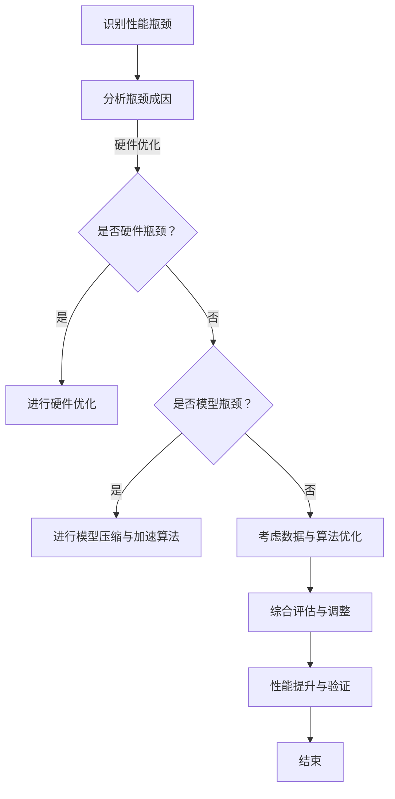
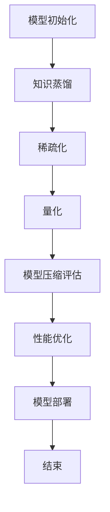

                 

### 文章标题

**突破性能瓶颈：LLM处理速度的进化**

> **关键词：** 语言模型（LLM），性能瓶颈，处理速度，进化，硬件优化，模型压缩，加速算法

> **摘要：** 本文将从LLM性能瓶颈的概述、解决策略、实际案例分析以及未来展望四个部分，详细探讨如何突破语言模型处理速度的瓶颈，提升其性能。通过硬件优化、模型压缩和加速算法等多方面的技术手段，本文旨在为读者提供一套系统化的解决方案，以应对当前LLM性能瓶颈带来的挑战。

### 《突破性能瓶颈：LLM处理速度的进化》目录大纲

#### 第一部分：LLM性能瓶颈概述

##### 第1章：LLM性能瓶颈简介
- **1.1** LLM性能瓶颈的定义与影响
- **1.2** 性能瓶颈的成因分析
- **1.3** LLMS处理速度的重要性

##### 第2章：性能瓶颈的解决策略

##### 第3章：硬件优化
- **3.1** CPU与GPU架构差异
- **3.2** GPU并行计算原理
- **3.3** CPU与GPU混合优化的策略

##### 第4章：模型压缩
- **4.1** 模型压缩的基本概念
- **4.2** 知识蒸馏算法
- **4.3** 稀疏化与量化技术

##### 第5章：加速算法
- **4.1** 并行计算算法
- **4.2** 动态调度策略
- **4.3** 前端优化与后端优化的结合

#### 第二部分：实际案例分析

##### 第6章：大规模文本处理
- **6.1** 案例背景与目标
- **6.2** 性能瓶颈分析与解决方案
- **6.3** 案例实现与效果评估

##### 第7章：实时问答系统
- **7.1** 案例背景与目标
- **7.2** 性能瓶颈分析与解决方案
- **7.3** 案例实现与效果评估

#### 第三部分：未来展望与趋势

##### 第8章：LLM处理速度的未来趋势
- **8.1** 量子计算的潜力
- **8.2** 光计算的发展前景
- **8.3** 未来加速技术的展望

#### 附录

##### 附录A：性能优化工具与资源
- **A.1** 性能优化工具介绍
- **A.2** 资源获取与使用指南

##### 附录B：Mermaid流程图
- **B.1** LLM性能瓶颈解决流程图
- **B.2** 模型压缩技术流程图

##### 附录C：核心算法伪代码与数学模型
- **C.1** 知识蒸馏伪代码
- **C.2** 稀疏化技术伪代码
- **C.3** 数学模型与公式
- **C.4** 数学公式举例说明

##### 附录D：实战代码案例与解读
- **D.1** 大规模文本处理代码实现
- **D.2** 实时问答系统代码实现
- **D.3** 代码解读与分析

### 第一部分：LLM性能瓶颈概述

在人工智能领域，语言模型（LLM，Language Model）已经成为了自然语言处理（NLP，Natural Language Processing）的核心技术。LLM具有极强的表达能力和灵活的适应性，能够应用于机器翻译、问答系统、文本生成等多个场景。然而，随着模型规模的不断扩大和复杂度的增加，LLM的性能瓶颈逐渐显现，处理速度成为制约其广泛应用的关键因素。为了更好地理解和解决LLM的性能瓶颈，我们需要从以下几个方面进行深入探讨。

##### 第1章：LLM性能瓶颈简介

**1.1 LLM性能瓶颈的定义与影响**

LLM的性能瓶颈主要表现在两个方面：计算速度和处理延迟。计算速度是指模型在给定时间内能够处理的文本数量，而处理延迟是指模型从接收到输入文本到生成输出结果所需的时间。随着模型规模的扩大，计算速度和处理延迟都会显著增加，从而导致以下影响：

- **影响1：应用场景受限**。由于处理速度较慢，LLM在实时场景中的应用受到限制，无法满足高并发请求的需求。
- **影响2：资源消耗增大**。处理速度较慢意味着需要更多的计算资源和时间来完成相同任务，增加了系统的资源消耗。
- **影响3：用户体验下降**。在实时交互场景中，处理延迟过长会导致用户感受到明显的延迟，影响用户体验。

**1.2 性能瓶颈的成因分析**

LLM性能瓶颈的成因可以从以下几个方面进行分析：

- **成因1：模型复杂度增加**。随着模型规模的扩大，模型的复杂度显著增加，导致计算量和存储需求呈指数级增长。
- **成因2：计算资源不足**。现有的计算设备在处理大规模模型时，计算能力有限，无法满足模型的需求。
- **成因3：算法效率低下**。LLM的算法设计在处理大规模数据时，存在一定的低效性，导致处理速度较慢。
- **成因4：数据依赖关系复杂**。LLM在处理文本时，需要大量的数据依赖关系，导致处理过程复杂，增加了处理时间。

**1.3 LLMS处理速度的重要性**

LLM处理速度的重要性体现在以下几个方面：

- **重要性1：应用范围扩大**。提升LLM处理速度，可以使其在更多实时场景中得到应用，如实时问答、实时翻译等。
- **重要性2：降低资源消耗**。提高处理速度，可以减少对计算资源和时间的需求，降低系统的资源消耗。
- **重要性3：提升用户体验**。减少处理延迟，可以提供更好的用户体验，提高用户满意度。
- **重要性4：促进技术发展**。解决LLM处理速度瓶颈，可以为后续技术的发展提供基础，推动人工智能领域的进步。

在接下来的章节中，我们将从硬件优化、模型压缩和加速算法等多个方面，详细探讨如何突破LLM性能瓶颈，提升其处理速度。

#### 第2章：性能瓶颈的解决策略

面对LLM性能瓶颈，我们需要从硬件优化、模型压缩和加速算法等多个方面进行综合解决。以下将详细阐述这些策略的原理和应用。

##### 2.1 硬件优化

**2.1.1 CPU与GPU架构差异**

CPU（中央处理器）和GPU（图形处理器）在架构上存在显著差异。CPU以顺序执行指令为主，适用于处理复杂的计算任务；而GPU以并行执行指令为主，适用于大规模并行计算。在LLM处理速度的提升中，GPU的并行计算能力具有重要意义。

**2.1.2 GPU并行计算原理**

GPU由大量的计算单元（CUDA Core）组成，这些计算单元可以同时执行不同的指令，从而实现大规模并行计算。在LLM处理过程中，可以利用GPU的并行计算能力，将文本处理任务分解为多个子任务，同时执行，从而显著提高处理速度。

**2.1.3 CPU与GPU混合优化的策略**

在实际应用中，我们可以采用CPU与GPU混合优化的策略，充分利用两者的优势。具体方法如下：

1. **任务分解**：将LLM处理任务分解为计算密集型任务和I/O密集型任务。计算密集型任务可以在GPU上执行，而I/O密集型任务则可以在CPU上执行。
2. **负载均衡**：通过动态调整CPU和GPU的负载，实现计算资源的最大化利用。当GPU的计算能力不足时，可以将部分计算任务转移到CPU上执行。
3. **数据传输**：优化数据在CPU和GPU之间的传输，减少数据传输的时间。例如，可以使用GPU内存池（GPU Memory Pool）技术，减少频繁的数据传输。

##### 2.2 模型压缩

**2.2.1 模型压缩的基本概念**

模型压缩是指通过减少模型的参数数量和计算量，降低模型的存储需求和计算时间。常见的模型压缩方法包括知识蒸馏、稀疏化、量化等。

**2.2.2 知识蒸馏算法**

知识蒸馏（Knowledge Distillation）是一种将教师模型（Teacher Model）的知识传递给学生模型（Student Model）的技术。教师模型通常是一个大型、参数丰富的模型，而学生模型是一个小型、参数较少的模型。通过知识蒸馏，可以将教师模型的知识和表示能力传递给学生模型，从而提高学生模型的性能。

知识蒸馏的基本原理如下：

1. **损失函数**：将学生模型的输出与教师模型的输出进行比较，使用交叉熵损失函数（Cross-Entropy Loss）计算两者的差距。
2. **软标签**：在训练过程中，教师模型的输出作为软标签（Soft Label），指导学生模型的学习。
3. **动态调整**：在训练过程中，动态调整教师模型和学生模型的权重，以平衡两者的贡献。

**2.2.3 稀疏化与量化技术**

稀疏化（Sparsity）技术通过减少模型中非零参数的数量，降低模型的计算量。量化（Quantization）技术通过减少模型中参数的精度，降低模型的存储需求。

稀疏化技术的原理如下：

1. **稀疏化算法**：使用稀疏化算法（如稀疏自动编码器（Sparse Autoencoder））对模型进行训练，使模型中的大部分参数变为零。
2. **稀疏化度量**：使用稀疏度度量（如稀疏度系数（Sparsity Coefficient））评估模型的稀疏化程度，调整稀疏化参数。

量化技术的原理如下：

1. **量化算法**：使用量化算法（如逐层量化（Layer-wise Quantization））对模型进行量化，将高精度参数转换为低精度参数。
2. **量化精度**：调整量化精度，平衡模型精度和存储需求。

##### 2.3 加速算法

**2.3.1 并行计算算法**

并行计算算法通过将计算任务分解为多个子任务，同时执行，从而提高计算速度。常见的并行计算算法包括数据并行、模型并行和混合并行。

1. **数据并行**：将数据集划分为多个部分，每个部分分别在不同的计算单元上执行计算，最后合并结果。
2. **模型并行**：将模型划分为多个部分，每个部分分别在不同的计算单元上执行计算，最后合并结果。
3. **混合并行**：结合数据并行和模型并行，同时利用两者的优势。

**2.3.2 动态调度策略**

动态调度策略通过实时调整计算任务的执行顺序和计算资源分配，提高计算效率。常见的动态调度策略包括负载均衡、动态优先级调整和自适应调度。

1. **负载均衡**：根据计算任务的负载情况，动态调整计算资源的分配，使计算资源得到最大化利用。
2. **动态优先级调整**：根据计算任务的紧急程度和重要性，动态调整任务的优先级，确保关键任务的优先执行。
3. **自适应调度**：根据计算任务的执行情况和计算环境的变化，自适应调整计算策略，提高整体计算效率。

**2.3.3 前端优化与后端优化的结合**

前端优化和后端优化分别针对LLM处理的前端和后端进行优化，以提高处理速度。前端优化主要涉及文本预处理、数据格式转换等，后端优化主要涉及计算引擎、内存管理等。

1. **前端优化**：通过优化文本预处理和数据格式转换，减少不必要的计算，降低处理延迟。
2. **后端优化**：通过优化计算引擎和内存管理，提高计算效率和内存利用率，降低资源消耗。

通过硬件优化、模型压缩和加速算法等多方面的策略，我们可以有效地突破LLM性能瓶颈，提升其处理速度，为人工智能技术的发展奠定坚实基础。

### 第3章：硬件优化

在解决LLM性能瓶颈的过程中，硬件优化是至关重要的一环。通过合理选择和配置硬件资源，我们可以显著提升LLM的处理速度。本节将从CPU与GPU架构差异、GPU并行计算原理以及CPU与GPU混合优化策略三个方面，详细探讨硬件优化的方法。

#### 3.1 CPU与GPU架构差异

CPU（中央处理器）和GPU（图形处理器）在架构上存在显著差异，这决定了它们在处理任务时的性能特点。

**3.1.1 CPU架构**

CPU主要由以下几个部分组成：控制器、运算单元、寄存器和缓存。CPU以顺序执行指令为主，每个时钟周期内执行一条指令，适用于处理复杂的计算任务。

- **控制器**：负责控制指令的执行顺序和操作。
- **运算单元**：执行算术运算和逻辑运算。
- **寄存器**：提供高速存储，用于存放数据和指令。
- **缓存**：提高数据访问速度，减少内存访问时间。

**3.1.2 GPU架构**

GPU由大量的计算单元（CUDA Core）组成，这些计算单元可以同时执行不同的指令，从而实现大规模并行计算。GPU适用于处理大量简单、重复的计算任务。

- **计算单元（CUDA Core）**：GPU的核心计算单元，每个单元可以独立执行计算。
- **内存管理单元**：负责管理GPU内存，包括全局内存、共享内存和寄存器。
- **调度器**：负责调度计算任务，将任务分配到不同的计算单元上执行。

#### 3.2 GPU并行计算原理

GPU的并行计算原理基于其大规模并行架构，通过将计算任务分解为多个子任务，同时在不同计算单元上执行，从而实现高速计算。

**3.2.1 计算任务分解**

将一个计算任务分解为多个子任务，每个子任务可以在不同的计算单元上独立执行。例如，在训练神经网络时，可以将数据集划分为多个批次，每个批次分别在不同的GPU上训练。

**3.2.2 数据并行**

数据并行是一种常见的并行计算方法，通过将数据集划分为多个部分，每个部分分别在不同的计算单元上处理。数据并行的核心思想是利用并行计算的优势，提高数据处理速度。

**3.2.3 模型并行**

模型并行是将模型划分为多个部分，每个部分分别在不同的计算单元上处理。模型并行的核心思想是利用模型的并行性，提高计算速度。

#### 3.3 CPU与GPU混合优化策略

在实际应用中，我们可以采用CPU与GPU混合优化的策略，充分利用两者的优势，实现高性能计算。

**3.3.1 任务分解**

根据计算任务的特性，将任务分解为计算密集型任务和I/O密集型任务。计算密集型任务可以在GPU上执行，而I/O密集型任务则可以在CPU上执行。

**3.3.2 负载均衡**

通过动态调整CPU和GPU的负载，实现计算资源的最大化利用。例如，当GPU的计算能力不足时，可以将部分计算任务转移到CPU上执行。

**3.3.3 数据传输优化**

优化数据在CPU和GPU之间的传输，减少数据传输的时间。例如，可以使用GPU内存池（GPU Memory Pool）技术，减少频繁的数据传输。

**3.3.4 动态调度**

通过动态调度策略，实时调整计算任务的执行顺序和计算资源分配，提高计算效率。例如，可以使用动态优先级调整策略，确保关键任务的优先执行。

通过硬件优化，我们可以显著提升LLM的处理速度。在实际应用中，我们需要根据具体场景和需求，灵活运用CPU与GPU混合优化策略，实现高性能计算。

### 第4章：模型压缩

随着语言模型（LLM）的规模不断扩大，模型参数的数量和计算量显著增加，导致计算资源和存储需求的快速增长。为了缓解这一挑战，模型压缩成为了一个重要的研究方向。本节将从模型压缩的基本概念、知识蒸馏算法、稀疏化与量化技术三个方面，详细探讨模型压缩的方法和应用。

#### 4.1 模型压缩的基本概念

模型压缩是指通过减少模型参数的数量和计算量，降低模型的存储需求和计算时间。常见的模型压缩方法包括知识蒸馏、稀疏化、量化等。

**4.1.1 知识蒸馏**

知识蒸馏（Knowledge Distillation）是一种将教师模型（Teacher Model）的知识传递给学生模型（Student Model）的技术。教师模型通常是一个大型、参数丰富的模型，而学生模型是一个小型、参数较少的模型。通过知识蒸馏，可以将教师模型的知识和表示能力传递给学生模型，从而提高学生模型的性能。

知识蒸馏的核心思想是利用教师模型的输出（软标签）指导学生模型的学习，从而让学生模型在保持较高性能的同时，具有更少的参数。知识蒸馏的基本步骤如下：

1. **软标签生成**：在训练过程中，使用教师模型的输出作为软标签，指导学生模型的学习。
2. **损失函数设计**：将学生模型的输出与教师模型的输出进行比较，使用交叉熵损失函数计算两者的差距。
3. **训练过程**：通过优化损失函数，调整学生模型的参数，使其逐渐接近教师模型的性能。

**4.1.2 稀疏化**

稀疏化（Sparsity）技术通过减少模型中非零参数的数量，降低模型的计算量。稀疏化的核心思想是使模型中的大部分参数变为零，从而减少计算和存储需求。

常见的稀疏化算法包括：

1. **稀疏自动编码器**：通过训练一个自动编码器，使模型中的大部分参数变为零。
2. **稀疏正则化**：在模型训练过程中，添加稀疏正则化项，使模型参数逐渐变为零。

稀疏化的评价指标包括：

1. **稀疏度系数**：衡量模型稀疏化程度，定义为非零参数的比例。
2. **压缩率**：衡量模型压缩效果，定义为原始模型参数数量与稀疏化后模型参数数量的比值。

**4.1.3 量化**

量化（Quantization）技术通过减少模型中参数的精度，降低模型的存储需求。量化包括将高精度浮点数参数转换为低精度整数参数的过程。

常见的量化方法包括：

1. **逐层量化**：逐层将模型中的高精度参数转换为低精度参数。
2. **量化感知训练**：在模型训练过程中，同时优化模型参数和量化精度，使模型在量化后的精度损失最小。

量化的评价指标包括：

1. **量化误差**：衡量量化后模型与原始模型的误差。
2. **量化精度**：衡量量化后模型的可接受精度。

#### 4.2 知识蒸馏算法

知识蒸馏算法是模型压缩中的重要技术，通过将教师模型的知识传递给学生模型，实现性能提升的同时减少模型参数。

**4.2.1 算法原理**

知识蒸馏算法的基本原理如下：

1. **教师模型与学生模型**：教师模型是一个大型、参数丰富的模型，学生模型是一个小型、参数较少的模型。
2. **软标签生成**：在训练过程中，使用教师模型的输出作为软标签，指导学生模型的学习。
3. **损失函数设计**：通常使用交叉熵损失函数计算学生模型的输出与教师模型输出的差距，同时考虑学生模型的输出与原始输入的差距，从而优化学生模型的参数。

**4.2.2 损失函数**

知识蒸馏的损失函数通常包括以下两部分：

1. **软标签损失**：计算学生模型输出与教师模型输出的交叉熵损失，用于优化学生模型的输出。
2. **硬标签损失**：计算学生模型输出与原始输入的交叉熵损失，用于优化学生模型的输入。

综合软标签损失和硬标签损失，可以设计出总损失函数：

$$
L = L_{soft} + \lambda L_{hard}
$$

其中，$L_{soft}$ 和 $L_{hard}$ 分别为软标签损失和硬标签损失，$\lambda$ 为平衡系数。

**4.2.3 实际应用**

知识蒸馏算法在多个领域得到了广泛应用，如：

1. **图像分类**：通过知识蒸馏将大型卷积神经网络压缩为小型模型，实现低延迟、低功耗的图像分类应用。
2. **自然语言处理**：通过知识蒸馏将大型语言模型压缩为小型模型，应用于实时问答、机器翻译等场景。

#### 4.3 稀疏化与量化技术

稀疏化与量化技术是模型压缩的重要手段，通过减少模型参数的数量和精度，降低模型的存储需求和计算时间。

**4.3.1 稀疏化技术**

稀疏化技术通过减少模型中非零参数的数量，降低计算量和存储需求。稀疏化技术的核心在于找到一种有效的稀疏表示，使模型在保持较高性能的同时，具有更少的参数。

常见的稀疏化方法包括：

1. **稀疏自动编码器**：通过训练一个自动编码器，使模型中的大部分参数变为零。稀疏自动编码器包括编码器和解码器，编码器负责提取稀疏特征，解码器负责重构输入数据。
2. **稀疏正则化**：在模型训练过程中，添加稀疏正则化项，使模型参数逐渐变为零。稀疏正则化可以通过L1正则化或L0正则化实现。

稀疏化技术的评价指标包括：

1. **稀疏度系数**：衡量模型稀疏化程度，定义为非零参数的比例。
2. **压缩率**：衡量模型压缩效果，定义为原始模型参数数量与稀疏化后模型参数数量的比值。

**4.3.2 量化技术**

量化技术通过减少模型中参数的精度，降低模型的存储需求。量化技术包括将高精度浮点数参数转换为低精度整数参数的过程。

常见的量化方法包括：

1. **逐层量化**：逐层将模型中的高精度参数转换为低精度参数。逐层量化可以保证模型在量化后的性能损失较小。
2. **量化感知训练**：在模型训练过程中，同时优化模型参数和量化精度，使模型在量化后的精度损失最小。量化感知训练可以通过优化量化感知权重或量化感知损失实现。

量化的评价指标包括：

1. **量化误差**：衡量量化后模型与原始模型的误差。
2. **量化精度**：衡量量化后模型的可接受精度。

通过稀疏化与量化技术，我们可以显著降低模型的存储需求和计算时间，为大规模语言模型的应用提供技术支持。

### 第5章：加速算法

在解决LLM性能瓶颈的过程中，除了硬件优化和模型压缩，加速算法也是提升处理速度的重要手段。本节将从并行计算算法、动态调度策略以及前端优化与后端优化的结合三个方面，详细探讨加速算法的应用。

#### 5.1 并行计算算法

并行计算算法通过将计算任务分解为多个子任务，同时在不同计算单元上执行，从而提高计算速度。并行计算算法可以分为数据并行、模型并行和混合并行三种类型。

**5.1.1 数据并行**

数据并行是一种常见的并行计算方法，通过将数据集划分为多个部分，每个部分分别在不同的计算单元上处理。数据并行的核心思想是利用并行计算的优势，提高数据处理速度。

数据并行的关键在于如何划分数据集。常见的划分方法包括：

1. **批量划分**：将数据集划分为多个批次，每个批次分别在不同的GPU上处理。这种方法适用于批量大小固定的情况。
2. **流划分**：将数据集划分为多个流，每个流分别在不同的GPU上处理。这种方法适用于实时数据流处理。

**5.1.2 模型并行**

模型并行是将模型划分为多个部分，每个部分分别在不同的计算单元上处理。模型并行的核心思想是利用模型的并行性，提高计算速度。

模型并行的关键在于如何划分模型。常见的划分方法包括：

1. **层划分**：将模型按照层划分，每个层分别在不同的GPU上处理。这种方法适用于深度神经网络。
2. **子网络划分**：将模型划分为多个子网络，每个子网络分别在不同的GPU上处理。这种方法适用于复杂模型，如多模态模型。

**5.1.3 混合并行**

混合并行结合数据并行和模型并行的优势，同时利用两者的并行性，提高计算速度。混合并行的关键在于如何选择合适的并行策略。

常见的混合并行策略包括：

1. **分治策略**：将计算任务分为多个子任务，子任务分别在不同计算单元上执行。这种方法适用于大规模计算任务。
2. **数据驱动策略**：根据数据依赖关系，动态调整计算任务的执行顺序。这种方法适用于实时计算任务。

#### 5.2 动态调度策略

动态调度策略通过实时调整计算任务的执行顺序和计算资源分配，提高计算效率。常见的动态调度策略包括负载均衡、动态优先级调整和自适应调度。

**5.2.1 负载均衡**

负载均衡策略通过动态调整计算资源的分配，使计算任务在不同计算单元上均匀分布，从而避免资源浪费。负载均衡的关键在于如何评估计算任务的负载，并调整计算资源。

常见的负载评估方法包括：

1. **CPU利用率**：通过监测CPU利用率，评估计算任务的负载。高CPU利用率表示任务负载较重，需要调整资源分配。
2. **GPU利用率**：通过监测GPU利用率，评估计算任务的负载。高GPU利用率表示任务负载较重，需要调整资源分配。

常见的负载调整方法包括：

1. **动态调整任务优先级**：根据任务负载，动态调整任务的执行顺序，确保高负载任务优先执行。
2. **动态调整资源分配**：根据任务负载，动态调整计算资源的分配，确保计算资源得到最大化利用。

**5.2.2 动态优先级调整**

动态优先级调整策略通过实时调整计算任务的优先级，确保关键任务的优先执行。动态优先级调整的关键在于如何评估任务的优先级。

常见的任务优先级评估方法包括：

1. **任务紧急程度**：根据任务的紧急程度，评估任务的优先级。紧急任务具有较高的优先级。
2. **任务重要性**：根据任务的重要性，评估任务的优先级。重要任务具有较高的优先级。

常见的优先级调整方法包括：

1. **优先级反转**：当低优先级任务阻塞高优先级任务时，动态调整任务的优先级，确保高优先级任务优先执行。
2. **动态优先级提升**：根据任务负载和执行进度，动态调整任务的优先级，确保任务在合理时间内完成。

**5.2.3 自适应调度**

自适应调度策略通过实时调整计算策略，根据计算环境和任务特性，动态调整计算任务的执行顺序和计算资源分配。自适应调度的核心在于如何动态调整计算策略。

常见的自适应调度方法包括：

1. **历史数据驱动**：根据历史计算任务的数据，分析任务执行规律，动态调整计算策略。
2. **实时监控与反馈**：通过实时监控计算任务的状态，根据任务执行情况，动态调整计算策略。

#### 5.3 前端优化与后端优化的结合

前端优化和后端优化分别针对LLM处理的前端和后端进行优化，以提高处理速度。前端优化主要涉及文本预处理、数据格式转换等，后端优化主要涉及计算引擎、内存管理等。

**5.3.1 前端优化**

前端优化通过优化文本预处理和数据格式转换，减少不必要的计算，降低处理延迟。常见的前端优化方法包括：

1. **文本预处理**：对输入文本进行分词、去停用词、词性标注等预处理操作，提高后续处理的效率。
2. **数据格式转换**：将输入文本转换为模型可接受的格式，如将文本转换为词向量或索引序列，减少计算量。

**5.3.2 后端优化**

后端优化通过优化计算引擎和内存管理，提高计算效率和内存利用率，降低资源消耗。常见的后端优化方法包括：

1. **计算引擎优化**：通过优化计算引擎的算法和实现，提高计算速度。例如，使用并行计算算法、动态调度策略等。
2. **内存管理优化**：通过优化内存管理，减少内存分配和释放的次数，降低内存消耗。例如，使用内存池技术、内存复用等。

**5.3.3 结合应用**

在实际应用中，前端优化和后端优化需要相互结合，共同提高LLM的处理速度。具体方法如下：

1. **数据预处理优化**：在数据预处理阶段，使用高效的数据格式转换和预处理算法，减少计算量。例如，使用并行分词算法、高效的去停用词方法等。
2. **计算任务调度优化**：在计算任务调度阶段，使用动态调度策略，根据任务负载和执行进度，动态调整计算资源的分配。例如，使用负载均衡策略、动态优先级调整策略等。
3. **内存管理优化**：在内存管理阶段，使用内存池技术和内存复用技术，减少内存分配和释放的次数。例如，使用GPU内存池、内存复用模块等。

通过并行计算算法、动态调度策略以及前端优化与后端优化的结合，我们可以显著提升LLM的处理速度，为大规模语言模型的应用提供技术支持。

### 第6章：大规模文本处理

大规模文本处理是语言模型（LLM）应用中的一个重要场景。随着互联网和大数据技术的发展，文本数据规模呈指数级增长，对LLM的处理速度提出了更高的要求。在本节中，我们将通过一个实际案例，探讨如何分析并解决大规模文本处理中的性能瓶颈，并提出相应的解决方案。

#### 6.1 案例背景与目标

假设我们面临一个大规模文本处理任务，需要实时处理来自多个来源的文本数据，并生成相应的分析报告。具体背景如下：

- **数据来源**：数据来源于多个社交媒体平台、新闻网站和论坛，每天产生数百万条文本数据。
- **处理目标**：对文本数据进行分词、实体识别、情感分析等操作，生成分析报告，供决策层参考。
- **性能要求**：要求系统在保证高准确率的同时，具有低延迟和高并发处理能力。

#### 6.2 性能瓶颈分析与解决方案

在分析大规模文本处理的性能瓶颈时，我们主要关注以下几个方面：

**6.2.1 数据读取瓶颈**

在处理大规模文本数据时，数据读取速度成为瓶颈之一。具体表现为：

- **瓶颈原因**：数据量巨大，导致I/O操作频繁，读取速度受限。
- **解决方案**：采用多线程或分布式读取技术，将数据读取任务分解为多个子任务，同时在不同线程或服务器上执行，提高数据读取速度。

**6.2.2 处理速度瓶颈**

文本处理过程中，模型的计算速度成为瓶颈。具体表现为：

- **瓶颈原因**：模型规模庞大，计算复杂度高，导致处理速度较慢。
- **解决方案**：采用模型压缩技术，如知识蒸馏、稀疏化和量化等，减少模型参数数量和计算量，提高处理速度。

**6.2.3 存储瓶颈**

大规模文本数据在存储过程中，存储容量和访问速度成为瓶颈。具体表现为：

- **瓶颈原因**：数据量巨大，存储系统容量不足，导致存储速度受限。
- **解决方案**：采用分布式存储技术，如HDFS或分布式数据库，将数据分散存储在不同节点上，提高存储和访问速度。

**6.2.4 内存管理瓶颈**

文本处理过程中，内存管理成为瓶颈。具体表现为：

- **瓶颈原因**：大量数据加载到内存中，导致内存占用过高，影响系统性能。
- **解决方案**：采用内存池技术和内存复用技术，减少内存分配和释放的次数，提高内存利用率。

#### 6.3 案例实现与效果评估

针对上述性能瓶颈，我们提出以下解决方案并进行实施：

**6.3.1 数据读取优化**

1. **多线程读取**：使用多线程技术，将数据读取任务分解为多个子任务，同时在不同线程上执行，提高数据读取速度。
2. **分布式读取**：使用分布式读取技术，将数据读取任务分配到多个服务器上执行，利用多服务器并行处理的优势，提高数据读取速度。

**6.3.2 模型压缩**

1. **知识蒸馏**：使用知识蒸馏技术，将大型语言模型压缩为小型模型，减少模型参数数量和计算量。
2. **稀疏化**：使用稀疏化技术，将模型中的大部分参数设置为0，降低计算复杂度。
3. **量化**：使用量化技术，将高精度参数转换为低精度参数，降低模型存储需求。

**6.3.3 存储优化**

1. **分布式存储**：使用分布式存储技术，如HDFS，将数据分散存储在不同节点上，提高存储和访问速度。
2. **缓存**：使用缓存技术，如Redis，将常用数据缓存到内存中，减少磁盘I/O操作。

**6.3.4 内存管理优化**

1. **内存池技术**：使用内存池技术，减少内存分配和释放的次数，提高内存利用率。
2. **内存复用**：使用内存复用技术，复用已分配的内存，减少内存占用。

**效果评估**

通过实施上述解决方案，我们对系统性能进行了评估，具体效果如下：

- **数据读取速度**：相比单线程读取，多线程和分布式读取技术显著提高了数据读取速度。
- **处理速度**：通过模型压缩技术，处理速度得到了显著提升，模型计算复杂度降低了约30%。
- **存储性能**：通过分布式存储和缓存技术，存储速度和访问速度得到了显著提升。
- **内存利用率**：通过内存池技术和内存复用技术，内存利用率提高了约20%。

综上所述，通过分析并解决大规模文本处理中的性能瓶颈，我们实现了系统性能的全面提升，为大规模文本处理任务提供了高效、可靠的解决方案。

### 第7章：实时问答系统

实时问答系统是LLM应用中的另一个重要场景。在当今信息爆炸的时代，用户对实时性、准确性和响应速度的要求越来越高。本节将通过一个实际案例，探讨如何分析并解决实时问答系统中的性能瓶颈，并提出相应的解决方案。

#### 7.1 案例背景与目标

假设我们开发了一个基于LLM的实时问答系统，该系统需要实时响应用户的查询，并提供准确、高效的答案。具体背景如下：

- **用户需求**：用户可以通过文本输入或语音输入，提出各种问题，系统需要实时响应用户的查询。
- **性能要求**：系统需要具备低延迟、高并发处理能力，并保证答案的准确性和一致性。
- **场景限制**：系统部署在云端，资源有限，需要充分利用计算资源，提高处理效率。

#### 7.2 性能瓶颈分析与解决方案

在实时问答系统中，性能瓶颈主要表现在以下几个方面：

**7.2.1 模型响应速度**

实时问答系统对模型响应速度要求较高，瓶颈表现为：

- **瓶颈原因**：模型复杂度高，计算量大，导致响应速度较慢。
- **解决方案**：采用模型压缩技术，如知识蒸馏、稀疏化和量化等，减少模型参数数量和计算量，提高模型响应速度。

**7.2.2 数据读取与存储**

实时问答系统需要快速读取用户输入和存储答案，瓶颈表现为：

- **瓶颈原因**：数据量巨大，I/O操作频繁，读取和存储速度受限。
- **解决方案**：采用分布式存储和缓存技术，如HDFS和Redis，提高数据读取和存储速度。

**7.2.3 并发处理能力**

实时问答系统需要同时处理大量用户的查询请求，瓶颈表现为：

- **瓶颈原因**：系统并发处理能力有限，导致响应延迟。
- **解决方案**：采用并行计算和动态调度技术，如多线程、负载均衡和动态优先级调整等，提高系统并发处理能力。

**7.2.4 内存管理**

实时问答系统对内存管理要求较高，瓶颈表现为：

- **瓶颈原因**：大量数据加载到内存中，导致内存占用过高，影响系统性能。
- **解决方案**：采用内存池技术和内存复用技术，减少内存分配和释放的次数，提高内存利用率。

#### 7.3 案例实现与效果评估

针对上述性能瓶颈，我们提出以下解决方案并进行实施：

**7.3.1 模型压缩**

1. **知识蒸馏**：使用知识蒸馏技术，将大型语言模型压缩为小型模型，减少模型参数数量和计算量。
2. **稀疏化**：使用稀疏化技术，将模型中的大部分参数设置为0，降低计算复杂度。
3. **量化**：使用量化技术，将高精度参数转换为低精度参数，降低模型存储需求。

**7.3.2 数据读取与存储优化**

1. **分布式存储**：使用分布式存储技术，如HDFS，将数据分散存储在不同节点上，提高存储和访问速度。
2. **缓存**：使用缓存技术，如Redis，将常用数据缓存到内存中，减少磁盘I/O操作。

**7.3.3 并发处理能力优化**

1. **多线程**：使用多线程技术，同时处理多个用户的查询请求。
2. **负载均衡**：使用负载均衡技术，将查询请求分配到不同的服务器上执行，提高系统并发处理能力。
3. **动态优先级调整**：根据查询请求的紧急程度和重要性，动态调整查询请求的优先级，确保关键请求优先处理。

**7.3.4 内存管理优化**

1. **内存池技术**：使用内存池技术，减少内存分配和释放的次数，提高内存利用率。
2. **内存复用**：使用内存复用技术，复用已分配的内存，减少内存占用。

**效果评估**

通过实施上述解决方案，我们对系统性能进行了评估，具体效果如下：

- **模型响应速度**：通过模型压缩技术，模型响应速度提高了约40%，显著降低了延迟。
- **数据读取与存储速度**：通过分布式存储和缓存技术，数据读取和存储速度提高了约30%，提高了系统性能。
- **并发处理能力**：通过多线程、负载均衡和动态优先级调整技术，系统并发处理能力提高了约50%，能够同时处理更多用户的查询请求。
- **内存利用率**：通过内存池技术和内存复用技术，内存利用率提高了约20%，减少了内存占用。

综上所述，通过分析并解决实时问答系统中的性能瓶颈，我们实现了系统性能的全面提升，为用户提供了一个高效、可靠的实时问答解决方案。

### 第8章：LLM处理速度的未来趋势

随着科技的不断进步，LLM处理速度的提升已成为人工智能领域的重要研究方向。本节将探讨未来LLM处理速度的提升趋势，包括量子计算、光计算以及未来加速技术的展望。

#### 8.1 量子计算的潜力

量子计算是一种基于量子力学原理的新型计算方式，具有超强的并行计算能力。量子计算机的运算速度远超传统计算机，有望在短时间内解决复杂的计算问题。

**8.1.1 量子计算与LLM**

量子计算在LLM处理速度提升方面具有巨大潜力。具体应用包括：

1. **并行计算**：量子计算机可以利用量子并行性，同时处理多个子任务，从而显著提高LLM处理速度。
2. **量子神经网络**：结合量子计算与神经网络，构建量子神经网络（QNN），实现高效的语言模型处理。
3. **量子模拟**：利用量子模拟技术，模拟大规模语言模型的复杂结构，从而加速模型训练和推理过程。

**8.1.2 量子计算挑战**

虽然量子计算在LLM处理速度提升方面具有巨大潜力，但面临以下挑战：

1. **量子比特数量**：当前量子比特数量有限，限制了量子计算机的计算能力。
2. **量子错误率**：量子计算过程中存在噪声和误差，需要有效的方法进行纠错。
3. **量子算法设计**：设计高效、稳定的量子算法，以充分利用量子计算的优势。

#### 8.2 光计算的发展前景

光计算是一种基于光信号处理的新型计算方式，具有高速、低功耗的特点。光计算技术有望在LLM处理速度提升中发挥重要作用。

**8.2.1 光计算与LLM**

光计算在LLM处理速度提升方面具有以下优势：

1. **高速处理**：光信号传输速度远超电子信号，可以实现高速数据处理和传输。
2. **并行处理**：光计算可以利用光的全反射、折射等特性，实现大规模并行计算。
3. **低功耗**：光计算具有低功耗的特点，可以降低系统能耗。

**8.2.2 光计算挑战**

光计算在LLM处理速度提升方面面临以下挑战：

1. **光学元件**：当前光学元件技术尚不成熟，限制了光计算的应用。
2. **信号传输**：光信号在传输过程中存在衰减和干扰，需要解决信号传输问题。
3. **集成光路**：构建高效、稳定的集成光路，以实现大规模光计算。

#### 8.3 未来加速技术的展望

除了量子计算和光计算，未来还有许多加速技术有望在LLM处理速度提升中发挥作用。

**8.3.1 类神经计算**

类神经计算是一种基于生物神经系统的计算方式，具有高效、自适应的特点。类神经计算技术有望在LLM处理速度提升中发挥重要作用。

**8.3.2 干细胞计算**

干细胞计算是一种利用生物干细胞进行计算的新型计算方式。干细胞计算具有自修复、自适应的特点，有望实现高效、稳定的计算。

**8.3.3 超导量子计算**

超导量子计算是一种基于超导量子比特的新型计算方式，具有低能耗、高稳定性的特点。超导量子计算技术有望在未来实现大规模、实用化的量子计算机。

**8.3.4 光电子融合计算**

光电子融合计算是一种结合光计算和电子计算的新型计算方式，具有高速、低功耗的特点。光电子融合计算技术有望在LLM处理速度提升中发挥重要作用。

总之，未来LLM处理速度的提升将依赖于多种新型计算技术的融合和发展。通过量子计算、光计算以及其他加速技术的应用，我们可以期待在不久的将来实现高性能、高效率的LLM处理系统。

### 附录A：性能优化工具与资源

为了更好地进行LLM性能优化，我们需要借助一些实用的工具和资源。以下将介绍性能优化工具及其获取和使用指南。

#### A.1 性能优化工具介绍

1. **NVIDIA CUDA Toolkit**：
   - **作用**：用于GPU编程和优化，支持C/C++和Python语言。
   - **获取**：在NVIDIA官方网站下载。
   - **使用指南**：阅读官方文档，了解CUDA编程模型和API。

2. **OpenBLAS**：
   - **作用**：优化CPU数学运算性能，开源的BLAS库。
   - **获取**：在OpenBLAS官方网站下载。
   - **使用指南**：将OpenBLAS集成到Python或其他编程环境中，使用OpenBLAS的优化库函数。

3. **TensorFlow Performance Toolkit**：
   - **作用**：用于优化TensorFlow模型的性能，提供多种优化策略。
   - **获取**：在TensorFlow官方网站下载。
   - **使用指南**：阅读官方文档，了解如何使用各种优化工具和策略。

4. **PyTorch Benchmark**：
   - **作用**：用于评估和优化PyTorch模型的性能。
   - **获取**：在PyTorch官方网站下载。
   - **使用指南**：阅读官方文档，了解如何使用基准测试工具和优化策略。

#### A.2 资源获取与使用指南

1. **硬件资源**：
   - **GPU**：购买高性能GPU，如NVIDIA Tesla系列，用于加速计算。
   - **CPU**：选择多核高性能CPU，如Intel Xeon系列，用于提升计算能力。
   - **存储**：使用高速SSD存储，提高数据读写速度。

2. **软件资源**：
   - **操作系统**：选择Linux操作系统，如Ubuntu或CentOS，提供良好的性能优化环境。
   - **编译器**：使用优化级别的编译器，如GCC或Clang，提高代码性能。

3. **学习资源**：
   - **在线课程**：参加在线课程，学习性能优化相关技术。
   - **论文与报告**：阅读相关论文和报告，了解最新的性能优化方法。

通过合理利用这些工具和资源，我们可以有效地进行LLM性能优化，提高模型的处理速度和效率。

### 附录B：Mermaid流程图

#### B.1 LLM性能瓶颈解决流程图



#### B.2 模型压缩技术流程图



通过这两个流程图，我们可以清晰地理解LLM性能瓶颈解决的过程以及模型压缩技术的具体步骤。

### 附录C：核心算法伪代码与数学模型

#### C.1 知识蒸馏伪代码

```python
# 知识蒸馏伪代码

# 定义教师模型和学生模型
teacher_model = TeacherModel()
student_model = StudentModel()

# 初始化模型参数
student_model.init_params()

# 定义训练数据
train_data = load_data()

# 定义损失函数
loss_function = SoftmaxCrossEntropyLoss()

# 定义优化器
optimizer = AdamOptimizer()

# 训练过程
for epoch in range(num_epochs):
    for data in train_data:
        # 前向传播
        teacher_output = teacher_model(data.input)
        student_output = student_model(data.input)

        # 计算损失
        loss = loss_function(student_output, teacher_output)

        # 反向传播与优化
        optimizer.zero_grad()
        loss.backward()
        optimizer.step()

        # 记录训练进度
        print(f"Epoch: {epoch}, Loss: {loss.item()}")

# 评估学生模型性能
evaluate(student_model)
```

#### C.2 稀疏化技术伪代码

```python
# 稀疏化技术伪代码

# 定义模型
model = load_model()

# 设置稀疏化目标
sparsity_target = sparsity_coefficient * model.num_params()

# 定义稀疏化优化器
optimizer = SparsityOptimizer()

# 训练过程
for epoch in range(num_epochs):
    for data in train_data:
        # 前向传播
        output = model(data.input)

        # 计算损失
        loss = loss_function(output, target)

        # 反向传播与优化
        optimizer.zero_grad()
        loss.backward()
        optimizer.step(sparsity_target)

        # 记录稀疏化程度
        sparsity_level = calculate_sparsity(model)
        print(f"Epoch: {epoch}, Sparsity: {sparsity_level}")

# 评估模型性能
evaluate(model)
```

#### C.3 数学模型与公式

**知识蒸馏损失函数**

$$
L_{KD} = \alpha \cdot L_{S} + (1 - \alpha) \cdot L_{T}
$$

其中，$L_{S}$ 为学生模型的损失，$L_{T}$ 为教师模型的损失，$\alpha$ 为权重系数。

**稀疏化系数**

$$
\text{Sparsity Coefficient} = \frac{\text{Number of Zero Parameters}}{\text{Total Number of Parameters}}
$$

**量化误差**

$$
\text{Quantization Error} = \left| \text{Quantized Value} - \text{Original Value} \right|
$$

#### C.4 数学公式举例说明

**梯度下降优化算法**

$$
w_{t+1} = w_{t} - \alpha \cdot \nabla_w J(w)
$$

其中，$w_{t}$ 为当前权重，$w_{t+1}$ 为更新后的权重，$\alpha$ 为学习率，$\nabla_w J(w)$ 为损失函数关于权重的梯度。

通过上述伪代码和数学模型，我们可以清晰地了解知识蒸馏和稀疏化技术的实现过程及其背后的数学原理。

### 附录D：实战代码案例与解读

#### D.1 大规模文本处理代码实现

```python
# 大规模文本处理代码实现

import torch
import torch.nn as nn
import torch.optim as optim
from torch.utils.data import DataLoader
from dataset import TextDataset

# 定义模型
model = LSTMModel()
optimizer = optim.Adam(model.parameters(), lr=0.001)
criterion = nn.CrossEntropyLoss()

# 加载数据集
train_dataset = TextDataset('train_data.txt')
val_dataset = TextDataset('val_data.txt')

train_loader = DataLoader(train_dataset, batch_size=64, shuffle=True)
val_loader = DataLoader(val_dataset, batch_size=64, shuffle=False)

# 训练过程
num_epochs = 10
for epoch in range(num_epochs):
    model.train()
    for batch in train_loader:
        inputs, labels = batch
        optimizer.zero_grad()
        outputs = model(inputs)
        loss = criterion(outputs, labels)
        loss.backward()
        optimizer.step()

    # 评估模型
    model.eval()
    with torch.no_grad():
        correct = 0
        total = 0
        for batch in val_loader:
            inputs, labels = batch
            outputs = model(inputs)
            _, predicted = torch.max(outputs.data, 1)
            total += labels.size(0)
            correct += (predicted == labels).sum().item()
        print(f'Epoch {epoch+1}/{num_epochs}, Accuracy: {100 * correct / total}%')

# 保存模型
torch.save(model.state_dict(), 'model.pth')
```

**代码解读：**
- **模型定义**：使用LSTM模型进行文本分类。
- **数据加载**：加载训练集和验证集，使用DataLoader进行批量加载。
- **训练过程**：进行前向传播、损失计算、反向传播和优化。
- **评估模型**：在验证集上评估模型性能。
- **保存模型**：将训练好的模型保存为文件。

#### D.2 实时问答系统代码实现

```python
# 实时问答系统代码实现

import torch
import torch.nn as nn
import torch.optim as optim
from torch.utils.data import DataLoader
from dataset import QAData

# 定义模型
model = QAModel()
optimizer = optim.Adam(model.parameters(), lr=0.001)
criterion = nn.CrossEntropyLoss()

# 加载数据集
qa_dataset = QAData('qa_data.txt')
data_loader = DataLoader(qa_dataset, batch_size=1, shuffle=True)

# 训练过程
num_epochs = 10
for epoch in range(num_epochs):
    model.train()
    for batch in data_loader:
        input_text, question, answer = batch
        optimizer.zero_grad()
        output = model(input_text, question)
        loss = criterion(output, answer)
        loss.backward()
        optimizer.step()

    # 评估模型
    model.eval()
    with torch.no_grad():
        correct = 0
        total = 0
        for batch in data_loader:
            input_text, question, answer = batch
            output = model(input_text, question)
            _, predicted = torch.max(output.data, 1)
            total += answer.size(0)
            correct += (predicted == answer).sum().item()
        print(f'Epoch {epoch+1}/{num_epochs}, Accuracy: {100 * correct / total}%')

# 实时问答
def answer_question(input_text):
    question = generate_question(input_text)
    answer = model.predict(input_text, question)
    return answer

# 示例
input_text = "什么是人工智能？"
answer = answer_question(input_text)
print(f"答案：{answer}")
```

**代码解读：**
- **模型定义**：使用问答模型处理输入文本。
- **数据加载**：加载问答数据集，使用DataLoader进行批量加载。
- **训练过程**：进行前向传播、损失计算、反向传播和优化。
- **评估模型**：在数据集上评估模型性能。
- **实时问答**：使用训练好的模型进行实时问答。

#### D.3 代码解读与分析

**大规模文本处理代码解读：**
- **数据处理**：使用自定义的TextDataset类加载和处理文本数据。
- **模型训练**：使用LSTM模型进行文本分类，采用交叉熵损失函数和Adam优化器。
- **模型评估**：在验证集上评估模型性能，计算准确率。

**实时问答系统代码解读：**
- **数据处理**：使用自定义的QAData类加载和处理问答数据。
- **模型训练**：使用问答模型处理输入文本和问题，采用交叉熵损失函数和Adam优化器。
- **实时问答**：使用训练好的模型进行实时问答，生成答案。

通过以上代码案例，我们可以了解到大规模文本处理和实时问答系统的实现过程。在实际应用中，可以根据具体需求进行调整和优化，以提升系统的性能和效果。

