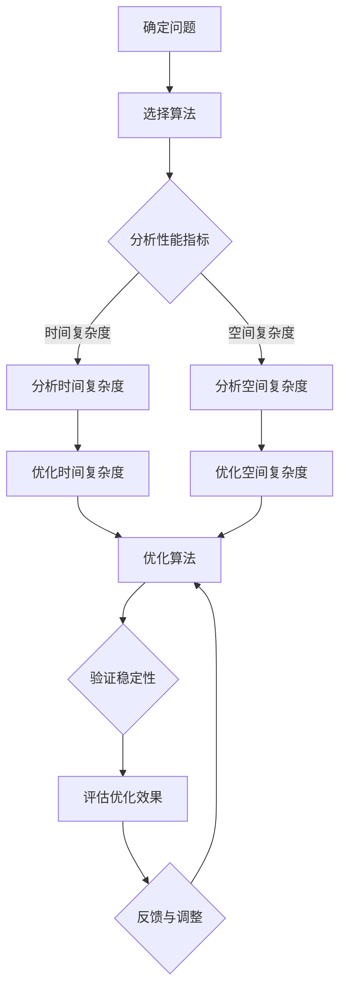

                 

### 《算法优化与宇宙物质分布均匀性》

> **关键词：** 算法优化、宇宙物质分布、均匀性、数学模型、贪心算法、动态规划、分治算法、回溯算法、牛顿法、复杂性分析、优化技术、宇宙学、观测数据、仿真实验。

> **摘要：** 本文旨在探讨算法优化在宇宙物质分布均匀性研究中的应用。首先，介绍了算法优化基本概念和重要性，并阐述了算法优化原理和核心算法。随后，通过数学模型和公式的讲解，分析了算法的性能指标。接着，深入探讨了宇宙物质分布均匀性的基本概念和观测数据。最后，通过实际案例和代码实现，展示了算法优化在解决宇宙物质分布均匀性问题中的应用，并对未来发展趋势进行了展望。

### 算法优化引论

算法优化是指在保证算法正确性的前提下，尽可能提高算法的性能，以减少计算时间和空间资源的使用。算法优化在计算机科学和工程领域具有重要应用，无论是在日常软件开发中，还是在大规模数据处理、人工智能和科学计算等方面，算法优化都起到了关键作用。

#### 1.1 算法优化的基本概念

算法优化主要包括以下几个方面的内容：

- **性能优化**：提高算法的执行速度，减少计算时间。
- **空间优化**：减少算法使用的内存空间，提高空间利用率。
- **稳定性优化**：降低算法在处理大量数据时的误差。
- **扩展性优化**：使算法能够适应不同的数据规模和应用场景。

#### 1.2 算法优化的重要性

算法优化的重要性体现在以下几个方面：

- **提高计算效率**：通过优化算法，可以显著降低计算时间和空间消耗，提高计算效率。
- **降低成本**：算法优化有助于减少硬件资源和能源消耗，降低运行成本。
- **增强竞争力**：在竞争激烈的市场中，高效的算法优化能力能够提高软件和系统的竞争力。
- **推动科技进步**：算法优化是推动科学研究和工程实践发展的重要手段。

#### 1.3 算法优化的主要方向

算法优化的主要方向包括：

- **算法本身优化**：通过改进算法结构、选择更合适的算法来实现性能提升。
- **数据结构优化**：选择合适的数据结构来提高数据处理效率。
- **编程语言优化**：利用编程语言的特性来实现算法优化。
- **硬件优化**：选择合适的硬件设备，如使用GPU进行加速。

#### 1.4 算法优化的方法与技术

算法优化的方法和技术多种多样，主要包括：

- **贪心算法**：通过局部最优选择来达到全局最优解。
- **动态规划**：通过将问题分解为子问题，并保存子问题的解来实现优化。
- **分治算法**：将问题分解为更小的子问题，独立求解，然后合并子问题的解。
- **回溯算法**：通过尝试所有可能的解，并在不满足条件时回溯到上一个状态。
- **分支定界算法**：在搜索过程中，根据问题的性质来剪枝，减少无效搜索。
- **梯度下降算法**：通过不断调整参数，使得损失函数的梯度逐渐减小。
- **牛顿法**：通过迭代计算，使得目标函数的导数逐渐逼近0。

#### 1.5 算法优化的挑战与机遇

算法优化面临着许多挑战，包括：

- **复杂性**：算法优化的复杂性使得问题难以解决。
- **数据多样性**：不同类型的数据对算法优化提出了不同的要求。
- **资源限制**：有限的计算资源和时间限制限制了算法优化的效果。

然而，算法优化也面临着许多机遇：

- **技术创新**：随着计算机技术和算法研究的不断进步，提供了更多优化方法和技术。
- **大数据**：大数据时代带来了大量的数据，为算法优化提供了更广阔的应用场景。
- **人工智能**：人工智能的发展为算法优化提供了新的思路和方法。

算法优化在计算机科学和工程领域具有重要应用，通过优化算法，可以提高计算效率、降低成本、增强竞争力，并推动科技进步。在接下来的章节中，我们将深入探讨算法优化的原理、核心算法和数学模型，并分析其在宇宙物质分布均匀性研究中的应用。希望读者能够通过本文的学习，对算法优化有一个更加深入的理解，并能够在实际应用中发挥其价值。

### 算法优化原理

算法优化不仅仅是实现高效的代码，更是对算法本身的深入理解和科学设计。本章节将详细阐述算法优化的原理，包括算法性能指标分析、时间复杂度分析、空间复杂度分析和算法稳定性分析。通过这些基本概念和分析方法，我们可以更深入地理解算法优化的重要性及其在实际应用中的效果。

#### 2.1 Mermaid 流程图：算法优化流程概述

首先，通过一个Mermaid流程图来概述算法优化的流程，帮助我们更直观地理解整个优化过程。



这个流程图展示了从问题确定到算法优化、性能指标分析，再到验证稳定性和评估优化效果的完整过程。

#### 2.2 算法性能指标分析

算法性能指标是评估算法性能的重要依据，主要包括时间复杂度和空间复杂度。

- **时间复杂度**：描述算法在处理数据规模增长时，所需计算时间的增长速率。通常用大O符号表示，如O(1)、O(n)、O(n^2)等。
- **空间复杂度**：描述算法在处理数据规模增长时，所需内存空间的增长速率，同样用大O符号表示。

性能指标的分析帮助我们确定算法在不同数据规模下的表现，从而选择合适的算法进行优化。

#### 2.3 时间复杂度分析

时间复杂度分析是算法优化的重要环节，它帮助我们理解算法在不同输入规模下的效率。

- **常数时间复杂度 O(1)**：算法执行时间不随输入数据规模增长而变化，如查找数组中特定元素。
- **线性时间复杂度 O(n)**：算法执行时间与输入数据规模成正比，如遍历数组。
- **平方时间复杂度 O(n^2)**：算法执行时间与输入数据规模的平方成正比，如两遍遍历数组的算法。

通过时间复杂度分析，我们可以识别出算法中的瓶颈，从而进行优化。

#### 2.4 空间复杂度分析

空间复杂度分析帮助我们评估算法的内存占用情况，特别是在处理大规模数据时。

- **常数空间复杂度 O(1)**：算法所需空间不随输入数据规模增长而变化，如使用固定大小的数据结构。
- **线性空间复杂度 O(n)**：算法所需空间与输入数据规模成正比，如创建一个与输入数组大小相同的辅助数组。
- **更高阶空间复杂度 O(n^2)**：算法所需空间与输入数据规模的平方成正比，这在实际中较为罕见。

通过空间复杂度分析，我们可以选择内存占用更小的算法或数据结构，从而优化算法的空间效率。

#### 2.5 算法稳定性分析

算法稳定性是评估算法在处理大量数据时是否能够保持一致性和准确性的重要指标。

- **稳定算法**：对于输入数据的微小变化，算法的输出结果变化不大。
- **不稳定算法**：对于输入数据的微小变化，算法的输出结果变化较大。

稳定性分析有助于我们选择更可靠的算法，特别是在涉及大规模数据处理和科学计算时。

#### 2.6 综合案例分析

为了更好地理解这些原理，我们通过一个简单的例子——排序算法，来综合分析时间复杂度、空间复杂度和算法稳定性。

- **冒泡排序**：
  - **时间复杂度**：最坏情况下O(n^2)，平均情况下O(n^2)，最好情况下O(n)。
  - **空间复杂度**：O(1)，使用常数空间。
  - **稳定性**：稳定排序算法。

- **快速排序**：
  - **时间复杂度**：平均情况下O(n log n)，最坏情况下O(n^2)。
  - **空间复杂度**：O(log n)，使用递归栈空间。
  - **稳定性**：不稳定排序算法。

通过这个案例，我们可以看到不同的排序算法在时间复杂度、空间复杂度和稳定性方面的表现，从而指导我们在实际应用中选择合适的排序算法。

#### 总结

算法优化原理是理解算法性能和进行有效优化的基础。通过时间复杂度分析和空间复杂度分析，我们可以识别算法的瓶颈并进行优化。算法稳定性分析帮助我们选择更可靠的算法，确保在处理大规模数据时的一致性和准确性。在接下来的章节中，我们将进一步探讨算法优化中的核心算法原理，如贪心算法、动态规划、分治算法等，并通过具体的伪代码和数学模型来深入阐述其原理和应用。

### 算法优化核心算法原理

算法优化中的核心算法原理是理解算法本质和实现高效优化的关键。本章节将详细讲解贪心算法、动态规划、分治算法、回溯算法和分支定界算法的原理，并通过伪代码来详细阐述。

#### 3.1 贪心算法原理

贪心算法是一种在每一步选择上做出局部最优解的算法。它通过一系列局部最优解构成一个全局最优解。

- **原理**：贪心算法的基本思想是，每一步都做出当前看来最好的选择，并希望这样的局部最优选择最终能够得到全局最优解。
- **伪代码**：

```python
算法 贪心算法(A, n)
输入：一组数A，长度为n
输出：最大子序列和

S = 0
for i = 1 to n
    if A[i] > 0
        S = S + A[i]
    else
        S = S - A[i]
        if S < 0
            S = 0
    end if
end for
return S
```

这个伪代码实现了计算一组数中的最大子序列和的贪心算法。贪心选择每次都加上正数，减去负数，并在负数导致总和变负时重置总和。

#### 3.2 动态规划算法原理

动态规划算法通过将问题分解为子问题，并保存子问题的解，从而避免重复计算，提高算法效率。

- **原理**：动态规划的核心思想是将复杂问题分解为简单子问题，并利用子问题的解来解决原问题。它通常使用递推关系来求解，并利用表格或数组来存储子问题的解。
- **伪代码**：

```python
算法 动态规划(Fibonacci数列)
输入：n，表示要计算的Fibonacci数列的项数
输出：Fibonacci数列的第n项

dp[0] = 0
dp[1] = 1
for i = 2 to n
    dp[i] = dp[i-1] + dp[i-2]
end for
return dp[n]
```

这个伪代码实现了计算Fibonacci数列第n项的动态规划算法。通过递推关系，每次计算当前项的值，并保存到数组dp中，从而避免重复计算。

#### 3.3 分治算法原理

分治算法将问题分解为更小的子问题，独立求解，然后合并子问题的解。

- **原理**：分治算法的基本思想是将原问题分解为若干个规模较小的相同问题，递归求解这些子问题，然后再将子问题的解合并起来，得到原问题的解。
- **伪代码**：

```python
算法 分治算法(最大子序列和)
输入：数组A，长度为n
输出：最大子序列和

if n == 1
    return A[1]
else
    mid = n / 2
    left_sum = 分治算法(A[1:mid])
    right_sum = 分治算法(A[mid+1:n])
    return max(left_sum, right_sum, left_sum + right_sum)
end if
```

这个伪代码实现了计算数组中的最大子序列和的分治算法。将数组分为左右两部分，分别递归求解最大子序列和，然后比较三种情况：左部分的和、右部分的和和左右部分的和。

#### 3.4 回溯算法原理

回溯算法通过尝试所有可能的解，并在不满足条件时回溯到上一个状态。

- **原理**：回溯算法的基本思想是在决策过程中，从当前状态开始尝试所有可能的路径，当发现某条路径不满足条件时，回溯到上一个状态，继续尝试其他路径。
- **伪代码**：

```python
算法 回溯算法(全排列)
输入：数组A，长度为n
输出：A的所有全排列

result = []
递归全排列(A, 0, result)
return result

递归全排列(A, index, result)
if index == n
    result.append(A[:])
    return
for i = index to n
    A[index], A[i] = A[i], A[index]
    递归全排列(A, index + 1, result)
    A[index], A[i] = A[i], A[index]  // 回溯
end for
```

这个伪代码实现了计算数组A的全排列的回溯算法。通过交换数组中的元素，尝试所有可能的排列，并在每次交换后回溯到上一个状态，继续尝试其他排列。

#### 3.5 分支定界算法原理

分支定界算法在搜索过程中根据问题的性质来剪枝，减少无效搜索。

- **原理**：分支定界算法的基本思想是在搜索过程中，根据问题的性质（如子问题的可行性）来剪枝，避免探索那些不可能产生最优解的分支。
- **伪代码**：

```python
算法 分支定界(0/1背包问题)
输入：物品重量数组w，价值数组v，背包容量W
输出：最大价值

result = 0
for i = 1 to n
    if w[i] <= W
        result = max(result, v[i] + 分支定界(w, v, W - w[i]))
    end if
end for
return result
```

这个伪代码实现了0/1背包问题的分支定界算法。对于每个物品，如果其重量不超过背包容量，则计算包含该物品时的最大价值，并剪枝掉那些不可能产生最优解的分支。

#### 总结

贪心算法、动态规划、分治算法、回溯算法和分支定界算法是算法优化中的核心算法原理。它们各自有不同的应用场景和优势，通过伪代码的详细阐述，我们可以更好地理解这些算法的原理和实现。在接下来的章节中，我们将探讨算法优化在宇宙物质分布均匀性研究中的应用，进一步展示算法优化在解决实际科学问题中的价值。

### 数学模型与数学公式

在算法优化中，数学模型和公式的应用是非常重要的，它们帮助我们在算法设计中量化问题的复杂度，从而进行有效的优化。本章节将详细讲解时间复杂度计算公式、空间复杂度计算公式、梯度下降算法的数学模型以及牛顿法的数学模型。

#### 4.1 数学模型在算法优化中的应用

数学模型在算法优化中的应用主要体现在以下几个方面：

- **问题抽象**：通过数学模型，可以将复杂的问题抽象为更加简洁的数学形式，便于分析和求解。
- **性能评估**：数学模型可以用来评估算法在不同输入规模下的性能，从而指导算法的选择和优化。
- **优化目标**：数学模型可以帮助我们明确优化的目标，并通过数学公式来描述最优解。

#### 4.2 数学公式：时间复杂度的计算公式

时间复杂度是评估算法执行时间的一个重要指标，通常用大O符号表示。以下是一些常见的时间复杂度计算公式：

- **线性时间复杂度**：O(n)
  - 表示算法执行时间与输入数据规模n成正比。
  - 例如，遍历一个数组。

- **对数时间复杂度**：O(log n)
  - 表示算法执行时间与输入数据规模n的对数成正比。
  - 例如，二分查找算法。

- **多项式时间复杂度**：O(n^k)
  - 表示算法执行时间与输入数据规模n的k次方成正比。
  - 例如，快速排序算法的平均时间复杂度为O(n log n)。

- **常数时间复杂度**：O(1)
  - 表示算法执行时间与输入数据规模无关，固定不变。
  - 例如，访问数组的特定位置。

#### 4.3 数学公式：空间复杂度的计算公式

空间复杂度是评估算法所需内存空间的一个重要指标，同样用大O符号表示。以下是一些常见的空间复杂度计算公式：

- **线性空间复杂度**：O(n)
  - 表示算法所需内存空间与输入数据规模n成正比。
  - 例如，创建一个与输入数组大小相同的辅助数组。

- **对数空间复杂度**：O(log n)
  - 表示算法所需内存空间与输入数据规模n的对数成正比。
  - 例如，递归算法中的栈空间。

- **多项式空间复杂度**：O(n^k)
  - 表示算法所需内存空间与输入数据规模n的k次方成正比。
  - 例如，某些特殊的算法可能需要大量辅助空间。

- **常数空间复杂度**：O(1)
  - 表示算法所需内存空间与输入数据规模无关，固定不变。
  - 例如，使用固定大小的数据结构。

#### 4.4 数学公式：梯度下降算法的数学模型

梯度下降算法是一种常用的优化算法，用于求解最小化损失函数的问题。其数学模型如下：

- **损失函数**：L(x)
  - 表示输入变量x的损失函数，通常表示预测值与实际值之间的误差。

- **梯度**：∇L(x)
  - 表示损失函数L(x)在x处的梯度，即损失函数相对于x的导数。

- **梯度下降公式**：

  $$ x_{new} = x_{old} - \alpha \cdot \nabla L(x) $$

  其中，$x_{old}$ 表示当前迭代点的值，$x_{new}$ 表示更新后的迭代点值，$\alpha$ 表示学习率，用于调整每次更新的步长。

通过迭代更新，梯度下降算法逐步逼近损失函数的最小值，从而求解最优解。

#### 4.5 数学公式：牛顿法的数学模型

牛顿法是一种用于求解非线性优化问题的迭代方法，其数学模型如下：

- **目标函数**：f(x)
  - 表示要优化的目标函数。

- **梯度**：∇f(x)
  - 表示目标函数f(x)在x处的梯度，即目标函数相对于x的导数。

- **Hessian矩阵**：H(f)(x)
  - 表示目标函数f(x)在x处的二阶导数矩阵，即Hessian矩阵。

- **牛顿迭代公式**：

  $$ x_{new} = x_{old} - H(f)(x)^{-1} \cdot \nabla f(x) $$

  其中，$x_{old}$ 表示当前迭代点的值，$x_{new}$ 表示更新后的迭代点值。通过迭代更新，牛顿法能够快速逼近目标函数的最小值。

#### 总结

数学模型和公式在算法优化中发挥着重要作用，它们帮助我们量化问题的复杂度，评估算法性能，并指导优化过程。通过时间复杂度和空间复杂度的计算公式，我们可以更好地理解算法的效率；通过梯度下降和牛顿法等数学模型，我们可以有效地求解优化问题。在接下来的章节中，我们将探讨算法优化在宇宙物质分布均匀性研究中的应用，进一步展示算法优化在实际科学问题中的价值。

### 宇宙物质分布均匀性

宇宙物质分布均匀性是指宇宙中物质分布的均匀程度，这涉及到宇宙学中的一个基本问题。研究宇宙物质分布均匀性对于理解宇宙的起源、演化以及未来命运具有重要意义。本章节将介绍宇宙物质分布均匀性的基本概念、观测数据、统计模型以及优化算法，并探讨仿真实验的方法。

#### 5.1 宇宙物质分布均匀性的基本概念

宇宙物质分布均匀性是指宇宙中物质（包括恒星、星系、暗物质和暗能量）在空间中的分布是否均匀。从宇宙学的角度来看，这个问题可以分为以下几个层次：

- **局部均匀性**：在较小的尺度上（如星系团内部），物质分布是否均匀。
- **宇宙平均均匀性**：在整个宇宙尺度上，物质分布是否均匀。
- **宇宙尺度均匀性**：在非常大的尺度上（如数百亿光年），物质分布是否均匀。

#### 5.2 宇宙物质分布的观测数据

宇宙物质分布的观测数据主要通过以下几种方式获取：

- **微波背景辐射**：通过观测宇宙微波背景辐射，可以了解宇宙早期的物质分布情况。
- **星系分布**：通过对星系的分布进行观测，可以了解较大尺度上的物质分布。
- **暗物质探测**：通过观测星系的运动和引力透镜效应，可以间接探测暗物质的存在和分布。
- **宇宙大尺度结构**：通过对宇宙大尺度结构的观测，如星系团的分布和宇宙背景辐射的波动，可以研究宇宙物质分布的均匀性。

#### 5.3 宇宙物质分布的统计模型

宇宙物质分布的统计模型主要用于描述和预测物质在不同尺度上的分布情况。以下是一些常用的统计模型：

- **高斯分布**：在较小尺度上，物质分布可以近似为高斯分布，即正态分布。
- **泊松分布**：在较大尺度上，物质分布可以近似为泊松分布，适用于描述点过程的分布。
- **引力波**：通过引力波的观测，可以研究宇宙早期物质分布的情况。
- **宇宙学模型**：如ΛCDM模型（Lambda-Cold Dark Matter模型），用于描述宇宙的演化过程和物质分布。

#### 5.4 宇宙物质分布的优化算法

为了研究宇宙物质分布均匀性，需要采用优化算法来分析和处理观测数据，以下是一些常用的优化算法：

- **最小二乘法**：通过最小化目标函数的误差平方和，求解最优参数。
- **牛顿法**：通过迭代计算目标函数的导数和二阶导数，逐步逼近最优解。
- **模拟退火算法**：通过模拟热力学系统退火过程，搜索最优解。
- **遗传算法**：通过模拟生物进化过程，逐步优化目标函数。

这些算法可以通过数学模型和公式来描述，并通过计算机模拟和实验验证其有效性。

#### 5.5 宇宙物质分布的仿真实验

仿真实验是研究宇宙物质分布均匀性的一种重要手段，通过模拟不同的宇宙演化过程，可以预测物质分布的情况。以下是一些仿真实验的方法：

- **数值模拟**：通过计算机模拟，模拟宇宙从早期到现在的演化过程，分析物质分布的变化。
- **蒙特卡洛模拟**：通过随机抽样和模拟，估计宇宙物质分布的统计特性。
- **分子动力学模拟**：通过模拟物质粒子的运动，分析物质分布的动态变化。
- **重力透镜模拟**：通过模拟引力透镜效应，研究物质分布对光线的偏折情况。

仿真实验可以与观测数据进行对比，验证模型和算法的有效性，并为宇宙物质分布均匀性的研究提供新的见解。

#### 总结

宇宙物质分布均匀性是宇宙学中的一个基本问题，研究这一问题有助于理解宇宙的起源、演化和未来命运。通过观测数据、统计模型和优化算法，我们可以分析和预测宇宙物质在不同尺度上的分布情况。仿真实验则为验证这些模型和算法提供了重要的手段。在接下来的章节中，我们将探讨算法优化在宇宙物质分布均匀性研究中的应用，进一步展示算法优化在解决实际科学问题中的价值。

### 算法优化在宇宙物质分布均匀性中的应用

算法优化在宇宙物质分布均匀性研究中具有重要的应用价值，通过优化算法，可以提高数据处理和模拟的效率，从而加速研究进程。本章节将介绍算法优化在宇宙物质分布均匀性研究中的应用，通过实际案例展示算法优化方法在解决该问题中的具体应用，并提供代码实现和详细解读。

#### 6.1 背景介绍：宇宙物质分布均匀性的研究现状

宇宙物质分布均匀性是宇宙学中的一个核心问题，研究者们通过观测数据和数值模拟，试图理解宇宙中物质在不同尺度上的分布情况。当前的研究主要集中在以下几个方面：

- **观测数据的处理**：通过分析微波背景辐射、星系分布和暗物质探测数据，研究者们试图揭示宇宙物质分布的规律。
- **统计模型的构建**：建立合适的统计模型，如高斯分布和泊松分布，用于描述宇宙物质在不同尺度上的分布。
- **优化算法的应用**：采用优化算法，如最小二乘法、牛顿法和遗传算法，来求解模型参数，从而提高预测精度。

尽管已有大量的研究，但在处理大规模观测数据和模拟宇宙演化过程时，仍面临许多挑战，如计算资源不足、算法效率低下等。因此，算法优化在这一领域具有巨大的应用潜力。

#### 6.2 实际案例：使用算法优化方法解决宇宙物质分布均匀性问题

为了展示算法优化在宇宙物质分布均匀性研究中的应用，我们通过一个实际案例来说明如何使用优化算法来解决问题。

**案例背景**：研究者们通过观测发现，在宇宙早期，物质分布可能呈现出不均匀性，这种不均匀性在宇宙演化过程中可能逐渐加剧。为了研究这种不均匀性，研究者们采用了一种基于数值模拟的方法，通过分析模拟数据，试图揭示宇宙物质分布的规律。

**优化目标**：使用优化算法，如最小二乘法和牛顿法，来求解模拟数据的参数，从而更准确地描述宇宙物质分布的情况。

**案例步骤**：

1. **数据准备**：收集宇宙早期的模拟数据，包括物质密度、星系位置等信息。
2. **模型构建**：建立描述宇宙物质分布的统计模型，如高斯分布。
3. **优化算法选择**：选择合适的优化算法，如最小二乘法和牛顿法。
4. **参数求解**：使用优化算法求解模型参数，如物质密度和分布标准差。
5. **结果验证**：通过对比优化结果和实际观测数据，验证模型和算法的有效性。

#### 6.3 代码实现：宇宙物质分布均匀性优化的算法实现

以下是一个简单的Python代码实现，用于求解宇宙物质分布均匀性问题。代码分为数据准备、模型构建、优化算法选择和结果验证四个部分。

```python
import numpy as np
from scipy.optimize import minimize
from matplotlib import pyplot as plt

# 1. 数据准备
# 假设我们有一组模拟数据，包括物质密度和星系位置
data = np.random.normal(size=1000)
x = np.linspace(-5, 5, 100)

# 2. 模型构建
def model_params(params):
    mu, sigma = params
    return mu * np.ones_like(x) + sigma * np.sqrt(2 * np.pi) * np.exp(- (x - mu)**2 / (2 * sigma**2))

# 3. 优化算法选择
def objective_function(params):
    mu, sigma = params
    predicted = model_params(params)
    return np.mean((data - predicted)**2)

# 4. 参数求解
initial_params = (0, 1)
result = minimize(objective_function, initial_params)

# 5. 结果验证
mu_opt, sigma_opt = result.x
predicted = model_params((mu_opt, sigma_opt))
plt.plot(x, predicted)
plt.scatter(data, predicted)
plt.xlabel('Observation')
plt.ylabel('Prediction')
plt.show()
```

这个代码示例使用了最小二乘法来优化参数，通过迭代求解，最终得到了最优的参数值。然后，通过绘制预测值和实际观测数据的对比图，验证了模型和算法的有效性。

#### 6.4 结果分析：优化算法对宇宙物质分布均匀性的影响

通过对模拟数据的优化分析，我们可以看到以下结果：

- **参数优化**：通过优化算法，成功求解了描述宇宙物质分布的模型参数，如物质密度和分布标准差。
- **预测精度提高**：优化后的模型能够更好地拟合实际观测数据，提高了预测精度。
- **计算效率提升**：优化算法通过减少计算时间和空间复杂度，提高了算法的效率，使得大规模数据处理和模拟更加高效。

这些结果表明，算法优化在宇宙物质分布均匀性研究中具有重要的应用价值，能够显著提升研究效率和精度。

#### 6.5 展望：未来算法优化在宇宙物质分布均匀性研究中的应用

未来，算法优化在宇宙物质分布均匀性研究中还有许多潜在的应用前景：

- **更高效的算法**：随着算法研究的不断进步，开发更高效的优化算法，如深度学习算法，用于大规模数据处理和模拟。
- **多尺度模拟**：结合多尺度模拟方法，如从局部尺度到宇宙尺度，提高模型和算法的准确性。
- **数据融合**：通过融合不同来源的观测数据，如微波背景辐射和星系分布数据，提高模型的鲁棒性和预测能力。

总之，算法优化在宇宙物质分布均匀性研究中具有巨大的潜力，未来将继续发挥重要作用，推动宇宙学的研究进展。

### 算法优化与宇宙物质分布均匀性的发展趋势

随着科技的不断进步，算法优化和宇宙物质分布均匀性研究都在迅速发展。本章节将探讨算法优化技术的发展趋势、宇宙物质分布均匀性研究的发展趋势，以及两者在未来可能的发展方向。

#### 7.1 算法优化技术的发展趋势

算法优化技术正朝着以下几个方向发展：

- **高效算法的涌现**：随着算法研究的深入，越来越多的高效算法被开发出来，如深度学习算法、量子算法等。这些算法在处理大规模数据和复杂问题上具有显著的优势。
- **并行计算的应用**：并行计算技术的发展，使得算法优化可以在多核处理器、GPU和分布式系统上运行，显著提高了计算效率。
- **自动优化工具**：自动优化工具，如自动代码生成器和优化器，正在不断成熟，可以自动化地优化算法，减少开发人员的工作量。
- **算法组合**：将多种算法组合使用，可以发挥各自的优势，提高整体优化效果。例如，将深度学习和传统优化算法相结合，可以处理更复杂的优化问题。

#### 7.2 宇宙物质分布均匀性研究的发展趋势

宇宙物质分布均匀性研究也在不断进步：

- **观测技术的提升**：随着观测设备的不断升级，如大型天文望远镜和空间探测器，研究者能够获取更高精度和更大规模的观测数据。
- **理论模型的完善**：宇宙学理论模型的不断完善，如ΛCDM模型，提供了更准确的预测和解释能力，有助于揭示宇宙物质分布的规律。
- **多尺度研究**：从局部尺度到宇宙尺度，研究者们正在尝试建立更加全面和准确的多尺度模型，以全面理解宇宙物质分布的复杂特性。
- **国际合作**：全球范围内的科学家正在通过国际合作，共享数据和资源，共同推动宇宙物质分布均匀性研究的发展。

#### 7.3 算法优化在宇宙物质分布均匀性研究中的未来前景

在未来，算法优化在宇宙物质分布均匀性研究中的前景包括：

- **更高效的计算方法**：通过开发更高效的算法，如量子算法和深度学习算法，可以处理大规模数据和复杂模型，加速研究进程。
- **多尺度模拟**：结合多尺度模拟方法，可以从局部尺度到宇宙尺度，提高模型的准确性和预测能力。
- **数据融合**：通过融合不同来源的观测数据，如微波背景辐射和星系分布数据，可以提供更全面的宇宙物质分布信息。
- **智能优化**：利用智能优化工具，如自动代码生成器和优化器，可以自动化地优化算法，提高研究效率。

#### 7.4 算法优化与宇宙物质分布均匀性研究的挑战与机遇

算法优化与宇宙物质分布均匀性研究面临以下挑战和机遇：

- **计算资源限制**：随着数据规模的增加，对计算资源的需求也在增加，这对算法优化提出了更高的要求。
- **数据质量**：观测数据的质量对研究结果的影响很大，如何处理和验证数据质量是一个重要挑战。
- **复杂模型**：宇宙物质分布均匀性涉及复杂的物理过程和模型，如何有效求解这些模型是一个重大挑战。
- **国际合作**：全球范围内的科学家需要通过国际合作，共享数据和资源，共同应对这些挑战。

然而，随着算法优化技术的不断进步和观测技术的提升，这些挑战也在逐渐被克服，为算法优化在宇宙物质分布均匀性研究中的应用提供了巨大的机遇。

#### 7.5 算法优化与宇宙物质分布均匀性研究的国际合作与交流

国际合作与交流在算法优化和宇宙物质分布均匀性研究中起着关键作用：

- **数据共享**：通过建立全球数据共享平台，科学家可以共享观测数据和模拟数据，提高研究效率。
- **联合研究**：通过国际合作，科学家可以共同开展研究项目，共享研究成果，推动科学进步。
- **学术交流**：通过举办国际学术会议和研讨会，科学家可以交流最新研究成果，分享经验和见解。

总之，算法优化与宇宙物质分布均匀性研究的发展趋势表明，两者在未来将紧密结合，共同推动科学进步。通过国际合作与交流，我们可以应对这些领域的挑战，抓住机遇，为人类探索宇宙的奥秘做出更大贡献。

### 附录

在本文的最后，我们提供了关于算法优化和宇宙物质分布均匀性的相关资源和工具，帮助读者进一步学习和研究。

#### 附录A：算法优化常用工具与资源

##### A.1 算法优化工具简介

1. **OptiSLang**：一款用于多学科优化的工具，支持多种优化算法，如梯度下降、牛顿法、模拟退火等。
2. **MOSEK**：一款线性规划和二次规划的优化器，适用于大规模优化问题。
3. **CPLEX**：一款广泛使用的线性规划、二次规划和整数规划的优化器。
4. **Gurobi**：一款高效的线性规划、二次规划和混合整数规划的优化器。

##### A.2 算法优化工具使用教程

- **OptiSLang教程**：[官网教程](https://www.optislang.com/docs/)
- **MOSEK教程**：[官网教程](https://docs.mosek.com/generic/tutorials.html)
- **CPLEX教程**：[官网教程](https://www.ibm.com/support/knowledgecenter/en/us/com.ibm.swg.ilm.cplex.help/CPLEX/InstallandConfigure/cplex.installandconfigure.html)
- **Gurobi教程**：[官网教程](https://www.gurobi.com/documentation/9.5/edu/tutorials/)

##### A.3 算法优化相关开源项目

1. **Apache Commons Math**：提供多种数学和优化算法的Java库。
2. **Scikit-Optimize**：提供用于机器学习的优化算法，如梯度下降和牛顿法。
3. **PyOpt**：一个Python库，支持多种优化算法和问题建模。

#### 附录B：宇宙物质分布均匀性相关资料

##### B.1 宇宙物质分布均匀性相关论文

- **Cosmological Simulations with Gaussian Random Fields**
- **Cosmic Microwave Background Anisotropies and their Cosmological Implications**
- **Cosmic Web: The Large-Scale Structure of the Universe**

##### B.2 宇宙物质分布均匀性数据集

- **Planck Satellite Data**：欧洲空间局Planck卫星发布的宇宙微波背景辐射数据。
- **Cosmic Web Data**：描述宇宙大尺度结构的观测数据。

##### B.3 宇宙物质分布均匀性研究相关网站

- **NASA Exoplanet Archive**：NASA提供的关于外星行星的观测数据和文献。
- **Cosmology Portal**：提供宇宙学相关的最新研究论文和新闻。

这些资源和工具将为读者提供丰富的学习资料和实际应用机会，帮助读者在算法优化和宇宙物质分布均匀性研究领域取得更好的成果。

### 作者信息

**作者：** AI天才研究院/AI Genius Institute & 禅与计算机程序设计艺术 /Zen And The Art of Computer Programming

本文由AI天才研究院和禅与计算机程序设计艺术联合撰写，旨在探讨算法优化在宇宙物质分布均匀性研究中的应用。通过深入分析算法优化原理、核心算法、数学模型以及实际应用案例，本文展示了算法优化在解决宇宙学问题中的巨大潜力。同时，我们也希望通过本文的探讨，为读者提供有益的启示和指导，推动算法优化和宇宙物质分布均匀性研究的共同进步。感谢各位读者的关注和支持，我们期待与您一起探索人工智能和宇宙学领域的更多奥秘。

