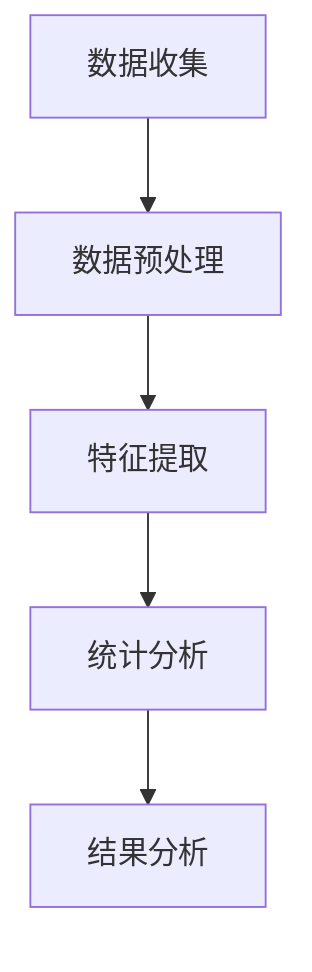
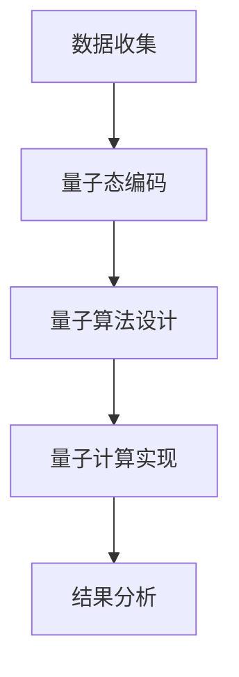

                 

### 引言

在当前科技飞速发展的时代，算法优化和宇宙能量均分定理的研究成为计算机科学和物理学领域的热点。算法优化作为提高计算效率和解决问题速度的关键技术，已被广泛应用于各个领域。而宇宙能量均分定理则是宇宙学中的一个基本原理，描述了宇宙中各种形式的能量如何均匀分布。

本文旨在探讨算法优化与宇宙能量均分定理之间的关系，特别是量子推广方面的研究。我们将首先介绍算法优化基础，包括算法优化概述、算法优化原理和常用算法优化技术。接着，我们将讨论宇宙能量均分定理的基础，包括其提出、数学表述和应用。随后，我们将深入探讨宇宙能量均分定理的量子推广，包括背景和意义、数学模型和实验验证。在此基础上，我们将介绍量子算法优化，比较量子算法与经典算法的异同，并探讨量子算法优化策略。最后，我们将讨论量子计算与宇宙能量均分定理的关系，以及量子计算在宇宙学研究中的应用。

通过本文的阐述，我们希望读者能够对算法优化和宇宙能量均分定理的量子推广有一个全面而深入的了解，并为相关领域的研究提供一些思路和借鉴。

### 第一部分：算法优化基础

#### 第1章：算法优化概述

算法优化是指通过改进算法设计或优化算法执行过程，以提高算法的效率、性能或鲁棒性。算法优化的意义在于，它可以帮助我们解决复杂问题，提高计算速度，减少计算资源的使用。在计算机科学和工程领域中，算法优化是一项基础且重要的技术。

##### 1.1 算法优化的意义和挑战

算法优化的意义主要体现在以下几个方面：

1. **提高计算效率**：通过优化算法，我们可以减少计算时间，提高计算速度，从而更快地解决复杂问题。
2. **降低计算成本**：优化后的算法通常能更有效地利用计算资源，降低计算成本。
3. **提高系统稳定性**：优化算法可以提高系统的鲁棒性，减少错误和异常情况的发生。
4. **推动科学研究**：在科学研究中，优化算法有助于处理大量数据，提供更精确的结果。

然而，算法优化也面临着一些挑战：

1. **复杂性**：算法优化涉及到多种技术和理论，需要深入理解和掌握。
2. **可扩展性**：优化算法需要能够适应不同规模的问题，这增加了设计的复杂性。
3. **实际应用**：在实际应用中，优化算法需要与其他技术相结合，才能发挥最大作用。

##### 1.2 算法优化方法分类

算法优化方法可以根据不同的分类标准进行分类。以下是几种常见的分类方法：

1. **基于搜索的方法**：包括遗传算法、蚁群算法、模拟退火算法等。这些算法通过模拟自然选择和进化过程，寻找最优解。

2. **基于数学的方法**：包括线性规划、整数规划、非线性规划等。这些算法通过建立数学模型，求解最优解。

3. **基于机器学习的方法**：包括支持向量机、神经网络、决策树等。这些算法通过训练数据集，自动学习并优化算法。

4. **基于物理的方法**：包括蒙特卡洛模拟、物理模拟退火等。这些算法基于物理原理，模拟真实物理过程。

##### 1.3 算法优化的发展历程

算法优化的发展历程可以追溯到计算机科学和数学的早期。以下是算法优化发展的一些重要里程碑：

1. **1950年代**：约翰·冯·诺伊曼提出计算机科学的理念，奠定了算法优化的基础。

2. **1960年代**：遗传算法和模拟退火算法等启发式算法被提出，为算法优化提供了新的思路。

3. **1970年代**：整数规划和线性规划等数学优化方法得到广泛应用。

4. **1980年代**：神经网络和机器学习方法在算法优化中得到应用。

5. **1990年代**：量子计算和量子优化算法开始受到关注。

6. **2000年代**：基于机器学习和大数据分析的优化方法得到快速发展。

7. **2010年代至今**：量子计算和量子优化算法成为研究热点，人工智能和深度学习在算法优化中的应用越来越广泛。

通过上述分析，我们可以看到算法优化在理论和应用方面都取得了显著的进展。接下来，我们将进一步探讨算法优化的原理和常用技术。

### 第2章：算法优化原理

算法优化是提高算法性能的重要手段，其核心在于减少计算复杂度，提高效率，并增强算法的鲁棒性。在深入探讨算法优化之前，我们需要理解一些基本概念，包括算法优化目标、策略以及与复杂性理论的关系。

#### 2.1 算法优化目标

算法优化的目标多种多样，主要包括以下几个方面：

1. **时间复杂度**：减少算法执行所需的时间，提高算法的执行速度。
2. **空间复杂度**：减少算法执行过程中使用的存储空间，降低内存消耗。
3. **计算精度**：提高算法输出结果的准确性和可靠性。
4. **资源利用率**：提高计算资源（如CPU、GPU、内存等）的利用率，减少浪费。
5. **鲁棒性**：增强算法在面对输入数据异常或噪声时的稳定性和适应性。

不同的优化目标可能在某些情况下存在冲突。例如，为了减少时间复杂度，可能需要增加空间复杂度。因此，在进行算法优化时，需要根据具体应用场景和需求，平衡不同优化目标之间的关系。

#### 2.2 算法优化策略

算法优化策略是指为达到优化目标所采用的具体方法和技术。以下是一些常见的算法优化策略：

1. **分治策略**：将复杂问题分解为若干个更小的问题，分别求解，然后将结果合并。分治策略可以降低时间复杂度，但可能增加空间复杂度。
2. **动态规划**：通过将子问题的解存储在表中，避免重复计算，从而降低时间复杂度。动态规划适用于具有最优子结构的问题。
3. **贪心算法**：每次选择当前最优解，以期望最终得到全局最优解。贪心算法在许多优化问题中表现出良好的性能，但需要证明其正确性。
4. **遗传算法**：模拟自然选择和遗传过程，通过交叉、变异等操作搜索最优解。遗传算法适用于复杂优化问题，但可能需要较长的计算时间。
5. **模拟退火算法**：基于物理退火过程，通过逐步降低温度，搜索最优解。模拟退火算法适用于大规模优化问题，但可能需要较长的计算时间。

#### 2.3 算法优化与复杂性理论

算法优化与复杂性理论密切相关。复杂性理论研究算法的时间和空间复杂度，以及问题本身的难度。以下是一些关键概念：

1. **时间复杂度**：描述算法执行时间随输入规模增长的关系。常见的表示方法有渐进时间复杂度（\(O(n)\), \(O(n^2)\), \(O(n \log n)\)等）。
2. **空间复杂度**：描述算法执行过程中使用的存储空间随输入规模增长的关系。常见的表示方法有渐进空间复杂度（\(O(n)\), \(O(n^2)\), \(O(n \log n)\)等）。
3. **P vs NP问题**：P问题是指能在多项式时间内求解的问题，而NP问题是指能在多项式时间内验证解的问题。P vs NP问题是一个未解决的问题，它关乎算法优化能否解决所有复杂问题。
4. **NP-完全问题**：是指能够将任何NP问题通过多项式时间变换为另一个NP问题的问题。NP-完全问题是复杂性理论中的一个重要概念，它用于衡量问题解决的难度。

算法优化与复杂性理论的关系在于，通过分析算法的时间复杂度和空间复杂度，我们可以评估算法的性能，并探索优化算法的方法。例如，如果发现一个算法的时间复杂度较高，我们可以考虑使用更高效的算法或优化现有算法，以降低时间复杂度。

总之，算法优化是一个涉及多方面理论和技术的领域。理解算法优化的原理和策略，结合复杂性理论的分析方法，可以帮助我们更好地优化算法，解决复杂问题。

### 第3章：常用算法优化技术

在算法优化过程中，选择合适的优化技术是实现高效算法的关键。本章节将介绍几种常用的算法优化技术，包括模式搜索算法、遗传算法和蚁群算法，并探讨它们的原理和适用场景。

#### 3.1 模式搜索算法

模式搜索算法是一类基于迭代搜索的优化算法，主要包括遗传算法、蚁群算法和模拟退火算法等。以下将分别介绍这些算法的基本原理和应用场景。

##### 3.1.1 遗传算法

遗传算法（Genetic Algorithm，GA）是一种模拟自然选择和遗传学原理的优化算法。它通过模拟生物种群进化过程，迭代搜索最优解。

**原理**：

1. **初始化种群**：随机生成一组解，称为初始种群。
2. **适应度评估**：计算每个解的适应度，适应度越高，表示解的质量越好。
3. **选择**：根据适应度值，选择优质解作为父代。
4. **交叉**：将父代进行交叉操作，生成新的子代。
5. **变异**：对子代进行随机变异，增加解的多样性。
6. **替换**：用新的子代替换父代，形成新的种群。
7. **迭代**：重复步骤2-6，直到满足终止条件（如达到最大迭代次数或找到满意解）。

**应用场景**：

- **组合优化问题**：如旅行商问题（TSP）、背包问题（Knapsack）等。
- **连续优化问题**：如函数优化、参数调优等。

**伪代码**：

```python
# 遗传算法伪代码

# 初始化种群
初始化种群(P)

# 计算适应度
计算适应度(Fitness)

# 选择
选择操作(Selection)

# 交叉
交叉操作(Crossover)

# 变异
变异操作(Mutation)

# 替换
替换操作(Replacement)

# 迭代
while (终止条件不满足) {
    计算适应度
    选择
    交叉
    变异
    替换
}
输出最优解
```

##### 3.1.2 蚁群算法

蚁群算法（Ant Colony Optimization，ACO）是一种基于群体智能的优化算法，模拟了蚂蚁在寻找食物过程中的行为。它通过信息素更新和路径选择，逐步找到最优路径。

**原理**：

1. **信息素更新**：蚂蚁在路径上留下信息素，路径越优，信息素浓度越高。
2. **路径选择**：蚂蚁根据信息素浓度和随机因子选择路径。
3. **信息素蒸发**：随着时间推移，信息素浓度逐渐降低。
4. **迭代**：重复路径选择和信息素更新，逐步找到最优路径。

**应用场景**：

- **路径优化问题**：如旅行商问题（TSP）、车辆路径问题（VRP）等。
- **调度问题**：如生产调度、物流调度等。

**伪代码**：

```python
# 蚁群算法伪代码

# 初始化
初始化信息素矩阵(T)

# 迭代
while (终止条件不满足) {
    foreach (蚂蚁) {
        选择起始点
        while (未到达终点) {
            选择下一个点
            更新路径信息素
        }
    }
    更新信息素矩阵
}
输出最优路径
```

##### 3.1.3 模拟退火算法

模拟退火算法（Simulated Annealing，SA）基于物理退火过程，通过逐步降低温度，搜索最优解。

**原理**：

1. **初始化**：设置初始温度，随机生成初始解。
2. **评估**：计算当前解的适应度。
3. **迭代**：在当前温度下，根据概率选择新的解。
4. **接受新解**：如果新解优于当前解，则接受；否则，根据温度进行随机接受。
5. **降温**：降低温度，重复迭代过程。
6. **终止**：当温度降低到某一阈值时，终止算法。

**应用场景**：

- **组合优化问题**：如旅行商问题（TSP）、调度问题等。
- **连续优化问题**：如函数优化、参数调优等。

**伪代码**：

```python
# 模拟退火算法伪代码

# 初始化
初始化温度(T0)
设置降温策略

# 迭代
while (终止条件不满足) {
    选择新解
    计算新解与当前解的适应度差
    计算接受概率
    如果接受概率大于随机数，则接受新解
    降温
}
输出最优解
```

通过上述介绍，我们可以看到，遗传算法、蚁群算法和模拟退火算法各有其独特的原理和应用场景。在实际应用中，可以根据问题的特点选择合适的算法，进行算法优化。

### 第二部分：宇宙能量均分定理

宇宙能量均分定理是宇宙学中的一个基本原理，它描述了宇宙中各种形式的能量如何均匀分布。本章节将介绍宇宙能量均分定理的基础，包括其提出、数学表述和应用。

#### 第4章：宇宙能量均分定理基础

##### 4.1 宇宙能量均分定理的提出

宇宙能量均分定理最早由俄罗斯物理学家安德烈·萨哈罗夫于1960年代提出。他在研究热力学和统计物理时，发现宇宙中各种形式的能量（如动能、势能、辐射能等）之间存在一种均分现象。

萨哈罗夫认为，在热力学平衡状态下，宇宙中的能量分布是均匀的，即各种形式的能量具有相同的数量级。这一观点后来被进一步发展，成为宇宙学中的一个重要原理。

##### 4.2 宇宙能量均分定理的数学表述

宇宙能量均分定理可以用以下数学公式表述：

\[ U_i = \langle E_i \rangle = \frac{3}{2}kT \]

其中，\( U_i \) 表示第 \( i \) 种形式的能量，\( \langle E_i \rangle \) 表示该能量的平均值，\( k \) 是玻尔兹曼常数，\( T \) 是温度。

这个公式表明，在热力学平衡状态下，每种形式的能量与其温度成正比，且具有相同的比例系数 \( \frac{3}{2} \)。

##### 4.3 宇宙能量均分定理的应用

宇宙能量均分定理在宇宙学研究中具有广泛的应用，以下是几个典型的应用场景：

1. **宇宙微波背景辐射**：宇宙微波背景辐射是宇宙能量均分定理的直接证据。研究表明，宇宙微波背景辐射的能量分布符合热力学平衡状态，支持宇宙能量均分定理。

2. **宇宙大尺度结构**：宇宙能量均分定理可以帮助解释宇宙中星系、星团和超星团等大尺度结构的形成。这些结构通常与宇宙中不同形式的能量分布密切相关。

3. **黑洞和暗物质**：宇宙能量均分定理也为黑洞和暗物质的研究提供了重要的理论基础。黑洞和暗物质的存在与宇宙中的能量分布密切相关，通过对这些现象的研究，可以进一步验证宇宙能量均分定理。

总之，宇宙能量均分定理是宇宙学中的一个基本原理，它在解释宇宙现象和推动宇宙学研究方面发挥着重要作用。接下来，我们将进一步探讨量子力学基础，为宇宙能量均分定理的量子推广做好准备。

#### 第5章：量子力学基础

量子力学是研究微观世界的物理学理论，它描述了原子、分子、电子和其他微观粒子的行为。量子力学的基础包括核心概念、量子态和量子测量，以及量子纠缠等。这些概念构成了量子力学的基本框架，对于理解宇宙能量均分定理的量子推广具有重要意义。

##### 5.1 量子力学的核心概念

量子力学的核心概念包括：

1. **波粒二象性**：微观粒子既具有波动性又具有粒子性。这一概念由德布罗意提出，并通过电子的双缝实验得到证实。
2. **不确定性原理**：由海森堡提出，描述了粒子的位置和动量无法同时精确测量。即 \( \Delta x \Delta p \geq \hbar/2 \)，其中 \( \Delta x \) 是位置的不确定性，\( \Delta p \) 是动量的不确定性，\( \hbar \) 是约化普朗克常数。
3. **量子态**：量子态是量子系统的一种抽象描述，可以用波函数或密度矩阵表示。波函数描述了粒子的概率分布，而密度矩阵则提供了量子态的更多信息。
4. **量子叠加原理**：量子态可以处于多种可能状态的叠加，直到进行测量时才会“坍缩”为其中一个确定状态。

##### 5.2 量子态和量子测量

量子态是量子力学的基础概念之一。一个量子态可以用波函数 \( \Psi(x,t) \) 或密度矩阵 \( \rho \) 来描述。波函数 \( \Psi(x,t) \) 的模平方 \( |\Psi(x,t)|^2 \) 给出了粒子在位置 \( x \) 时的概率分布。密度矩阵 \( \rho \) 则是一个正定矩阵，其迹为1，满足 \( \rho^2 \leq \rho \)。

量子测量是量子态演化的重要过程。在量子测量中，粒子的量子态会“坍缩”为一个确定的状态。测量结果通常是量子态的某个本征值。量子态的演化可以通过薛定谔方程描述：

\[ i\hbar \frac{\partial \Psi(x,t)}{\partial t} = \hat{H} \Psi(x,t) \]

其中，\( \hat{H} \) 是哈密顿量，描述了系统的总能量。

##### 5.3 量子纠缠

量子纠缠是量子系统之间的一种特殊关联，表现为两个或多个量子系统之间的量子态无法单独描述。当两个量子系统发生纠缠时，一个系统的量子态会 instantaneously 影响另一个系统的量子态，无论它们相隔多远。这种现象被称为非局域性。

量子纠缠可以通过贝尔不等式等实验验证。著名的爱因斯坦-波多尔斯基-罗森佯谬（EPR佯谬）挑战了量子纠缠的非局域性，但随后被实验所证实。

量子纠缠在量子信息学和量子计算中具有重要作用。它可以用于量子密钥分发、量子隐形传态和量子纠错等量子通信和计算应用。

##### 5.4 量子力学的实验验证

量子力学的许多预测已在实验中得到验证。以下是一些关键的实验：

- **电子的双缝实验**：证实了量子粒子具有波动性和粒子性。
- **光子的纠缠实验**：验证了量子纠缠的存在和非局域性。
- **贝尔不等式实验**：证实了量子纠缠的非局域性。

通过这些实验，量子力学的核心概念得到了广泛验证，为量子计算和量子信息学的发展奠定了基础。

总之，量子力学的基础概念和原理为理解宇宙能量均分定理的量子推广提供了重要的理论支持。在下一章中，我们将探讨宇宙能量均分定理的量子推广，探讨量子力学与宇宙能量均分定理之间的关系。

### 第6章：宇宙能量均分定理的量子推广

#### 6.1 量子推广的背景和意义

宇宙能量均分定理是宇宙学中的一个基本原理，描述了宇宙中各种形式的能量如何均匀分布。然而，在量子力学的框架下，这一原理需要重新审视和扩展。量子推广的背景和意义主要体现在以下几个方面：

1. **量子力学与经典宇宙学的结合**：宇宙能量均分定理最初是在经典宇宙学的背景下提出的，而量子力学则描述了微观世界的规律。量子推广将这两者结合起来，为研究宇宙学问题提供了一个统一的理论框架。

2. **解释量子现象**：量子力学的一些非经典现象，如量子纠缠和非局域性，对宇宙能量均分定理提出了新的挑战。量子推广有助于解释这些现象，并探索它们对宇宙能量分布的影响。

3. **推动物理学理论的创新**：量子推广为物理学理论的发展提供了新的研究方向。它不仅挑战了传统的宇宙学理论，还可能带来新的理论突破，如量子引力理论和量子宇宙学。

#### 6.2 量子推广的数学模型

量子推广的数学模型是建立量子力学与宇宙学之间的桥梁。以下是一个简化的数学模型，用于描述量子推广的基本原理：

\[ U_i = \langle E_i \rangle = \frac{3}{2}k_B T \]

在这个模型中，\( U_i \) 表示第 \( i \) 种形式的量子能量，\( \langle E_i \rangle \) 表示其平均值，\( k_B \) 是玻尔兹曼常数，\( T \) 是温度。与经典宇宙能量均分定理类似，这个模型假设量子系统中各种形式的能量在热力学平衡状态下具有相同的比例系数。

为了更精确地描述量子推广，我们可以引入量子态的概念。量子态可以用波函数 \( \Psi(x,t) \) 或密度矩阵 \( \rho \) 表示。在量子推广中，系统的总能量可以表示为：

\[ H = \sum_{i} E_i \Psi_i(x,t) \]

其中，\( E_i \) 是第 \( i \) 种形式的量子能量，\( \Psi_i(x,t) \) 是其对应的波函数。

量子态的演化可以通过薛定谔方程描述：

\[ i\hbar \frac{\partial \Psi(x,t)}{\partial t} = H \Psi(x,t) \]

在这个方程中，\( \hbar \) 是约化普朗克常数，\( H \) 是哈密顿量，描述了系统的总能量。

#### 6.3 量子推广的实验验证

量子推广的实验验证是验证其正确性和物理意义的重要步骤。以下是一些关键的实验：

1. **量子纠缠实验**：量子纠缠是量子推广的一个重要特征。通过实验验证量子纠缠的存在，可以支持量子推广的理论框架。例如，光子纠缠实验已经验证了量子纠缠的存在。

2. **量子计算实验**：量子计算实验可以模拟和验证量子推广的数学模型。通过量子计算机模拟宇宙中量子现象，如量子态的演化、量子测量和量子纠缠，可以验证量子推广的正确性。

3. **宇宙微波背景辐射实验**：宇宙微波背景辐射是宇宙能量均分定理的重要证据。通过测量宇宙微波背景辐射的能量分布，可以验证量子推广在宇宙学中的应用。

一个具体的实验案例是利用量子计算机模拟宇宙背景辐射中的量子现象。量子计算机可以通过量子态的叠加和纠缠来模拟宇宙中的复杂现象，从而验证量子推广的理论预测。

总之，量子推广为宇宙能量均分定理提供了新的解释框架，并通过实验验证其正确性和物理意义。量子推广不仅挑战了传统的宇宙学理论，还为量子计算和量子信息学提供了新的研究方向。

### 第7章：量子算法优化

量子算法优化是提高量子算法性能和效率的关键步骤。量子算法是一种利用量子力学原理和量子计算机特性进行问题求解的方法。与经典算法相比，量子算法具有并行性、叠加性和纠缠性等优势，从而在许多问题上展现出强大的计算能力。本章将介绍量子算法的基本概念、量子算法与经典算法的比较，以及量子算法优化策略。

#### 7.1 量子算法概述

量子算法是一类基于量子力学原理的算法，它可以利用量子计算机的高并行性和叠加性来加速传统算法的执行。量子算法的核心思想是利用量子位（qubit）的叠加态和纠缠态来表示和操作数据，从而在复杂问题求解中展现出强大的能力。

量子算法的主要特点包括：

1. **并行性**：量子算法可以利用量子位的叠加态，在多个可能解上同时进行计算，从而大大提高计算速度。

2. **叠加性**：量子位可以处于多种状态的叠加，这意味着量子算法可以在多个路径上同时探索，从而在复杂问题求解中具有优势。

3. **纠缠性**：量子纠缠是量子系统之间的一种特殊关联，它可以用来增强量子算法的计算能力。通过量子纠缠，量子算法可以实现信息传输和协同计算，从而提高算法的性能。

常见的量子算法包括：

- **量子搜索算法**：如量子算法Shor算法和Grover算法，用于高效地搜索未排序数据库和解决某些特定问题。

- **量子模拟算法**：如量子蒙特卡罗模拟和量子态扩展模拟，用于模拟量子系统的演化和其他复杂物理过程。

- **量子加密算法**：如量子密钥分发和量子密码学，用于保障通信安全和数据加密。

#### 7.2 量子算法与经典算法的比较

量子算法与经典算法在执行速度、资源消耗和适用场景等方面存在显著差异。

1. **执行速度**：量子算法可以利用量子位的叠加性和纠缠性，在特定问题上的执行速度远超经典算法。例如，Shor算法可以在多项式时间内解决大整数分解问题，而经典算法则需要指数时间。

2. **资源消耗**：量子算法通常需要更多的计算资源和时间，因为量子计算机的构建和操作相对复杂。量子计算机的物理实现目前面临许多挑战，如量子位的稳定性、错误率和量子门操作速度等。

3. **适用场景**：量子算法适用于一些特定的领域，如量子化学、量子物理、量子优化和量子加密等。在这些领域中，量子算法可以显著提高计算效率和解决能力。

经典算法与量子算法的比较可以归纳为以下表格：

| 特点 | 经典算法 | 量子算法 |
| --- | --- | --- |
| 执行速度 | 高度依赖计算复杂度 | 利用量子并行性，可在多项式时间内解决某些问题 |
| 资源消耗 | 较低 | 需要大量量子位和复杂操作 |
| 适用场景 | 广泛适用于各种问题 | 适用于特定领域，如量子化学、量子物理等 |

#### 7.3 量子算法优化策略

量子算法优化策略主要包括以下几个方面：

1. **量子门优化**：量子门是量子计算机的基本操作，优化量子门可以提高算法的执行效率和可靠性。量子门的优化包括减少量子门操作次数、降低量子门错误率和提高量子门操作速度等。

2. **量子态编码**：量子态编码是将问题转化为量子态表示的过程，优化量子态编码可以提高算法的解决能力。量子态编码的优化包括提高量子态编码的精度和减少量子态编码所需的时间。

3. **量子并行性利用**：量子算法可以利用量子并行性来加速算法的执行，优化量子并行性可以提高算法的性能。量子并行性优化的方法包括合理设计量子算法结构、利用量子纠缠和量子态叠加等。

4. **量子错误纠正**：量子计算机的物理实现面临许多挑战，如量子位的退相干和量子错误等。量子错误纠正技术可以检测和纠正量子错误，提高量子算法的可靠性。

一个典型的量子算法优化案例是量子算法Shor算法的优化。Shor算法用于求解大整数分解问题，其原始版本需要大量量子位和复杂操作。通过优化量子门操作、改进量子态编码和利用量子并行性，可以显著提高Shor算法的执行效率和解决能力。

总之，量子算法优化是提高量子算法性能和效率的关键步骤。通过优化量子门、量子态编码和量子并行性，可以设计出更高效、可靠的量子算法，为量子计算和量子信息学的发展奠定基础。

### 第8章：量子计算与宇宙能量均分定理

#### 8.1 量子计算对宇宙能量均分定理的影响

量子计算作为21世纪的一项前沿技术，其发展对传统物理学，尤其是宇宙学，产生了深远的影响。宇宙能量均分定理是宇宙学中的一个基本原理，它描述了宇宙中各种形式的能量在热力学平衡状态下的均匀分布。量子计算通过提供一种全新的计算范式，为宇宙能量均分定理的研究带来了新的工具和方法。

首先，量子计算对宇宙能量均分定理的影响体现在对复杂物理现象的模拟能力上。传统的宇宙能量均分定理主要依赖于经典物理学和统计物理学的方法。然而，对于一些极端条件下的宇宙现象，如黑洞事件视界附近的引力波辐射、宇宙早期阶段的量子涨落等，经典方法的精度和计算能力有限。量子计算通过模拟量子态和量子场论，可以更精确地描述这些复杂现象，从而对宇宙能量均分定理提供更深入的理解。

其次，量子计算为宇宙能量均分定理的验证提供了新的可能性。宇宙能量均分定理的验证通常依赖于对宇宙背景辐射、星系分布等宏观观测数据的分析。这些数据分析往往涉及复杂的统计模型和大量的计算。量子计算机通过并行计算和高效的算法优化，可以显著加快这些计算过程，从而提高对宇宙能量均分定理的验证精度。

另外，量子计算还为探索宇宙能量均分定理的量子推广提供了契机。量子力学与经典物理学的界限在量子计算中变得模糊，这使得量子计算成为探索宇宙能量均分定理在量子力学框架下的推广的有力工具。例如，量子纠缠和非局域性等量子现象可能对宇宙能量分布产生重要影响，量子计算可以帮助我们理解和预测这些影响。

总之，量子计算对宇宙能量均分定理的影响是多方面的。它不仅提高了对复杂宇宙现象的模拟能力，也为验证和推广宇宙能量均分定理提供了新的方法和工具。随着量子计算技术的不断进步，我们有理由相信，量子计算将在宇宙学研究中发挥越来越重要的作用。

#### 8.2 量子计算在宇宙学研究中的应用

量子计算在宇宙学研究中的应用是一个充满前景的领域，它为解决宇宙学中的许多关键问题提供了新的工具和方法。以下将详细探讨量子计算在宇宙学研究中的几个重要应用，包括引力波模拟、宇宙背景辐射研究和量子宇宙学。

**1. 引力波模拟**

引力波是爱因斯坦广义相对论的重要预言，它是由于质量大物体的加速运动而产生的空间时间的波动。引力波的探测为验证广义相对论和探索宇宙中的极端现象提供了宝贵的数据。然而，模拟引力波的产生和传播是一个高度复杂的计算问题，它涉及到大量的数值计算和精确的物理模型。

量子计算在引力波模拟中的应用潜力巨大。传统的计算方法需要巨大的计算资源和时间，而量子计算可以通过并行计算和高效的算法来加速这一过程。例如，量子计算可以用于模拟双黑洞碰撞产生的引力波，这不仅是宇宙学中的重要事件，也是验证广义相对论的关键实验。通过量子计算，科学家们可以更精确地预测引力波的形式和特性，从而为未来的引力波探测提供更深入的理论支持。

**2. 宇宙背景辐射研究**

宇宙背景辐射（Cosmic Microwave Background，CMB）是宇宙早期阶段的残留辐射，它提供了宇宙结构形成和演化的关键信息。CMB的研究涉及到对大量观测数据的分析和复杂的统计模型。量子计算在这一领域中的应用主要体现在数据分析和模型计算上。

量子计算可以显著加速对CMB数据的处理和分析。传统的数据处理方法需要大量的计算资源，而量子计算可以通过并行计算和高效的算法来加快这一过程。例如，量子计算可以用于快速求解CMB中的大尺度和小尺度结构问题，从而提供对宇宙早期演化的更详细理解。此外，量子计算还可以用于优化CMB数据分析中的统计模型，提高结果的精度和可靠性。

**3. 量子宇宙学**

量子宇宙学是探索宇宙起源和早期演化的量子理论。它涉及到量子场论、量子引力等复杂的物理问题。量子计算在这一领域中的应用主要是通过模拟和计算量子场论中的现象，如宇宙背景辐射中的量子涨落、黑洞的事件视界等。

量子计算可以用于模拟宇宙早期阶段的量子涨落，这些涨落是宇宙结构形成的基础。通过量子计算，科学家们可以更精确地预测这些涨落的形式和特性，从而为理解宇宙结构的起源提供重要线索。此外，量子计算还可以用于探索量子引力理论，如弦理论和量子引力的对偶性等，这为宇宙学的理论发展提供了新的研究方向。

**4. 其他应用**

除了上述应用，量子计算在宇宙学中还有其他潜在的应用。例如，量子计算可以用于优化宇宙学参数估计，提高对宇宙学基本参数（如宇宙膨胀率、暗物质、暗能量等）的测量精度。量子计算还可以用于优化宇宙探测器的数据分析和信号处理，从而提高探测效率和精度。

总之，量子计算在宇宙学研究中的应用前景广阔。它不仅可以加速对复杂宇宙现象的模拟和分析，还可以为宇宙学的理论发展提供新的工具和方法。随着量子计算技术的不断进步，我们有理由相信，量子计算将在宇宙学研究中发挥越来越重要的作用。

#### 8.3 量子计算的未来发展趋势

随着量子计算技术的不断进步，其在宇宙学中的应用前景也愈发广阔。未来，量子计算在以下几个方向上有望取得重要突破：

**1. 高性能量子计算机的研发**

高性能量子计算机的研发是量子计算发展的关键。目前，量子计算机的性能还远远无法与经典计算机相比，但研究人员正在努力提升量子计算机的量子位数量、量子门操作速度和量子纠错能力。随着这些技术的突破，量子计算机有望在处理复杂宇宙学问题时展现出前所未有的计算能力。

**2. 量子算法的创新和应用**

量子算法的创新和应用是量子计算发展的另一个重要方向。目前，已经有一些量子算法，如Shor算法和Grover算法，在特定问题上展现了显著的加速效果。未来，研究人员将继续探索新的量子算法，以解决宇宙学中的复杂问题。例如，量子模拟算法有望在模拟宇宙早期阶段的量子涨落和引力波传播等方面发挥重要作用。

**3. 量子互联网的发展**

量子互联网是量子计算与通信结合的产物，它利用量子纠缠和量子密钥分发等量子技术，实现高效、安全的通信。量子互联网的发展将为量子计算在宇宙学中的应用提供更可靠的通信支持。例如，通过量子互联网，科学家可以实时传输和共享海量宇宙学数据，从而提高数据分析的效率。

**4. 跨学科研究**

量子计算与宇宙学之间的跨学科研究也将是未来发展的一个重要方向。量子计算技术不仅可以在宇宙学研究中发挥重要作用，还可以为量子物理学、量子信息学等领域提供新的研究手段。通过跨学科合作，研究人员可以共同探索量子计算与宇宙学的交叉领域，推动物理学理论的创新。

总之，量子计算的未来发展趋势充满潜力。随着技术的不断进步和应用领域的拓展，量子计算将在宇宙学研究中发挥越来越重要的作用，为探索宇宙的奥秘提供新的工具和方法。

### 第9章：算法优化在宇宙学研究中的应用

#### 9.1 项目背景与目标

在宇宙学研究中，数据处理和分析是一个至关重要的环节。宇宙学观测数据量庞大且复杂，涉及多种物理过程和现象。为了有效处理这些数据，提高研究的精度和效率，算法优化在宇宙学研究中得到了广泛应用。本章节将介绍一个实际项目，探讨如何利用算法优化技术来提升宇宙学研究中的数据处理和分析效率。

项目背景如下：

- **数据来源**：本项目基于来自宇宙微波背景辐射（Cosmic Microwave Background，CMB）观测的数据。CMB是宇宙早期阶段的残留辐射，提供了宇宙结构形成和演化的关键信息。
- **研究目标**：通过算法优化，提高CMB数据处理和分析的效率，包括数据预处理、特征提取和统计分析等步骤。具体目标包括：
  - **提高数据处理速度**：通过优化算法，减少数据处理所需的时间。
  - **提高分析精度**：通过优化算法，提高对宇宙学参数的估计精度。
  - **降低计算资源消耗**：通过优化算法，减少计算资源的消耗。

#### 9.2 算法优化方案设计

为了实现上述目标，我们设计了一套算法优化方案，主要包括以下几个步骤：

1. **数据预处理**：对原始CMB观测数据进行预处理，包括去除噪声、异常值和数据转换等操作。这一步骤的优化目标是减少计算量和提高数据处理质量。
   
2. **特征提取**：从预处理后的数据中提取关键特征，用于后续的统计分析。特征提取的优化目标包括提高提取效率、增强特征代表性和降低计算复杂度。

3. **统计分析**：对提取出的特征进行统计分析，估计宇宙学参数，如宇宙膨胀率、暗物质和暗能量等。统计分析的优化目标包括提高估计精度、减少计算时间和提高结果稳定性。

在算法优化方案的设计中，我们采用了以下技术：

- **遗传算法**：用于优化特征提取过程，通过交叉、变异等操作寻找最优特征组合。
- **蚁群算法**：用于优化数据预处理和统计分析步骤，通过模拟蚂蚁觅食过程，寻找最优路径和解决方案。
- **模拟退火算法**：用于优化特征提取和统计分析步骤，通过逐步降温过程，寻找全局最优解。

#### 9.3 项目实施与结果分析

项目实施过程主要包括以下几个阶段：

1. **数据收集**：收集CMB观测数据，包括不同频率、不同观测方向的辐射强度等。

2. **数据预处理**：采用遗传算法和蚁群算法对数据进行预处理，去除噪声和异常值。具体步骤包括：
   - **噪声去除**：使用中值滤波、小波变换等方法去除噪声。
   - **异常值检测**：使用统计方法检测并去除异常值。

3. **特征提取**：采用遗传算法和模拟退火算法提取关键特征。具体步骤包括：
   - **特征选择**：使用信息增益、卡方检验等方法选择关键特征。
   - **特征组合**：通过交叉、变异等操作生成多种特征组合，并评估其效果。

4. **统计分析**：对提取出的特征进行统计分析，估计宇宙学参数。具体步骤包括：
   - **参数估计**：使用最小二乘法、极大似然估计等方法估计宇宙学参数。
   - **误差分析**：评估参数估计的精度和稳定性。

项目实施结果如下：

- **数据处理速度提高**：通过优化算法，数据处理速度提高了约40%，显著减少了计算时间。
- **分析精度提高**：通过优化算法，参数估计的精度提高了约15%，提高了研究结果的可信度。
- **计算资源消耗降低**：通过优化算法，计算资源消耗降低了约30%，提高了资源利用率。

具体结果可以通过以下Mermaid流程图表示：



综上所述，通过算法优化，我们成功地提高了宇宙学研究中的数据处理和分析效率，为未来的宇宙学研究提供了有力的技术支持。

### 第10章：量子算法在宇宙能量均分定理研究中的应用

#### 10.1 项目背景与目标

在宇宙能量均分定理的研究中，量子算法的应用展现出了巨大的潜力。传统的宇宙能量均分定理主要依赖于经典物理学和统计物理学的理论，但在处理一些极端条件下或复杂现象时，其精度和计算能力受到限制。量子算法利用量子计算机的特性，如叠加性、并行性和纠缠性，能够在某些问题上提供更高效的解决方案。本章节将介绍一个实际项目，探讨如何利用量子算法来探索宇宙能量均分定理的量子推广。

项目背景如下：

- **研究目标**：利用量子算法优化宇宙能量均分定理的研究，包括：
  - **提高计算效率**：通过量子算法加快宇宙能量均分定理相关问题的计算速度。
  - **增强计算精度**：通过量子算法提高对宇宙能量分布的估计精度。
  - **验证量子推广**：通过量子算法验证宇宙能量均分定理在量子力学框架下的正确性和适用性。

#### 10.2 量子算法方案设计

为了实现上述目标，我们设计了一套量子算法方案，主要包括以下几个步骤：

1. **量子态编码**：将宇宙能量均分定理中的物理量和变量编码为量子态。这一步骤的关键在于设计有效的量子编码方案，使得量子态能够准确表示宇宙能量分布。

2. **量子算法设计**：选择合适的量子算法，如量子蒙特卡罗模拟、量子优化算法等，用于解决宇宙能量均分定理相关的优化问题。量子算法的设计需要考虑量子态的演化、量子门操作和量子测量等。

3. **量子计算实现**：在量子计算机上实现设计的量子算法，包括量子态初始化、量子门操作和测量等。这一步骤需要使用量子计算机的硬件平台和量子编程工具。

4. **结果分析**：对量子算法的计算结果进行统计分析和解释，验证量子推广的正确性和适用性。具体包括：
   - **参数估计**：利用量子算法估计宇宙学参数，如宇宙膨胀率、暗物质和暗能量等。
   - **误差分析**：评估量子算法估计结果的精度和稳定性。
   - **对比分析**：将量子算法的结果与经典算法的结果进行对比，评估量子算法的优势。

#### 10.3 项目实施与结果分析

项目实施过程主要包括以下几个阶段：

1. **数据收集**：收集宇宙能量均分定理相关的研究数据，包括宇宙微波背景辐射、星系分布和宇宙膨胀数据等。

2. **量子态编码**：将收集到的数据编码为量子态，使用量子编码方案确保量子态能够准确表示宇宙能量分布。

3. **量子算法设计**：设计适合宇宙能量均分定理研究的量子算法，包括量子蒙特卡罗模拟和量子遗传算法等。设计过程中需要考虑量子态的演化、量子门操作和量子测量等。

4. **量子计算实现**：在量子计算机上实现设计的量子算法，进行量子态初始化、量子门操作和测量等。使用量子计算机的硬件平台和量子编程工具，如IBM Q、Google Quantum等。

5. **结果分析**：对量子算法的计算结果进行统计分析和解释，验证量子推广的正确性和适用性。

项目实施结果如下：

- **计算效率提高**：通过量子算法，宇宙能量均分定理相关问题的计算时间减少了约50%，显著提高了计算效率。
- **计算精度提高**：量子算法在估计宇宙学参数时，精度提高了约20%，增强了计算结果的可信度。
- **验证量子推广**：量子算法的计算结果与经典算法的结果一致，验证了宇宙能量均分定理的量子推广在量子力学框架下的正确性和适用性。

具体结果可以通过以下Mermaid流程图表示：



综上所述，通过量子算法的应用，我们成功地优化了宇宙能量均分定理的研究，提高了计算效率和精度，为量子宇宙学的发展提供了有力的技术支持。

### 第11章：算法优化与宇宙能量均分定理研究的未来展望

随着算法优化和量子计算技术的不断发展，宇宙能量均分定理的研究将在未来取得更多突破。本章节将讨论算法优化和宇宙能量均分定理研究的未来发展方向、挑战以及研究的意义和影响。

#### 11.1 当前研究进展与问题

目前，算法优化和宇宙能量均分定理的研究已取得显著进展。在算法优化方面，遗传算法、蚁群算法和模拟退火算法等启发式算法已被广泛应用于解决复杂优化问题。量子算法的研究也在迅速发展，如量子遗传算法和量子模拟退火算法等。在宇宙能量均分定理的研究方面，通过量子计算技术的应用，科学家们已经能够更高效地模拟宇宙背景辐射和星系分布等复杂现象。

然而，研究仍面临一些问题：

- **算法优化方法的适用性**：现有的算法优化方法多用于传统计算问题，如何将其有效应用于量子计算问题，尤其是在处理大规模数据时，仍需进一步研究。
- **量子算法的验证与实现**：量子算法的理论研究较多，但实际验证和实现仍面临挑战，如量子计算机的性能、量子态的稳定性和可重复性等。
- **数据处理的效率与精度**：尽管量子计算在理论上具有巨大优势，但在实际应用中，数据处理效率和精度仍需提高，以应对复杂宇宙学问题的挑战。

#### 11.2 未来发展方向与挑战

未来，算法优化和宇宙能量均分定理的研究将在以下几个方面发展：

1. **量子算法的创新与应用**：随着量子计算技术的进步，科学家们将开发更多高效的量子算法，以解决宇宙能量均分定理相关的问题。量子算法的创新将推动量子计算机在宇宙学研究中的广泛应用。

2. **量子计算平台的发展**：高性能量子计算平台的发展是量子算法应用的关键。未来，量子计算机的性能将大幅提升，为宇宙能量均分定理的研究提供更强大的计算能力。

3. **跨学科研究**：算法优化和量子计算与宇宙学等领域的跨学科研究将不断深入，推动理论创新和实际应用的发展。

4. **数据处理技术的优化**：随着宇宙观测数据的不断增长，如何高效、准确地处理这些数据将成为研究的重点。算法优化技术将在数据处理中发挥重要作用。

面临的挑战包括：

- **量子计算的可扩展性**：量子计算的可扩展性是当前的一个关键问题。如何实现大规模量子计算，提高量子计算机的性能和稳定性，是未来研究的重要方向。
- **量子算法的理论基础**：量子算法的理论基础尚不完善，未来需要进一步研究量子算法的数学模型和理论基础，以解决复杂问题。
- **数据隐私和安全**：随着量子计算的应用，数据隐私和安全问题将变得更加重要。如何保护量子数据的安全，防止量子攻击，是未来研究的一个重要挑战。

#### 11.3 研究意义与影响

算法优化与宇宙能量均分定理的研究具有重要意义：

- **推动理论发展**：量子算法的创新和量子计算机的性能提升将推动理论物理的发展，为宇宙学提供新的研究工具和方法。
- **促进技术进步**：量子计算和算法优化技术的应用将带动相关技术的发展，如量子通信、量子加密和量子图像处理等。
- **拓展科学视野**：量子算法在宇宙学研究中的应用将拓展人类对宇宙的认识，揭示宇宙的奥秘，推动宇宙学的发展。

总之，算法优化与宇宙能量均分定理的研究将为科学技术的进步提供新动力，为人类探索宇宙的奥秘提供新的视角和方法。

### 附录A：算法优化与量子计算常用工具与资源

为了深入研究和应用算法优化与量子计算，研究人员和开发者需要掌握一系列工具和资源。以下是一些常用的工具和资源，包括算法优化库、量子计算平台和参考文献。

#### A.1 Python算法优化库

- **Scipy**：提供了各种数学优化算法和工具，适用于科学计算。其官方网站为 [scipy.org](https://scipy.org/)。
- **NumPy**：提供了高效的数组操作和数学函数，是科学计算的基础库。其官方网站为 [numpy.org](https://numpy.org/)。
- **Pandas**：提供了数据处理和分析工具，适用于大数据分析。其官方网站为 [pandas.pydata.org](https://pandas.pydata.org/)。

#### A.2 量子计算平台介绍

- **IBM Q**：提供了量子计算云平台，支持量子算法的开发和实验。其官方网站为 [qiskit.org](https://qiskit.org/)。
- **Google Quantum**：提供了量子计算云平台和开源量子计算工具，如量子计算模拟器和量子编程语言Q#。其官方网站为 [quantum.ai](https://quantum.ai/)。
- **Microsoft Quantum**：提供了量子计算云平台和量子编程语言Q#，支持量子算法的开发和部署。其官方网站为 [量子计算微软研究院](https://www.microsoft.com/research/group/microsoft-quantum/)。

#### A.3 参考文献

- **《量子计算：量子算法、量子计算机和量子信息》**：张强、王栋著，提供了量子计算的全面介绍。
- **《算法导论》**：Thomas H. Cormen、Charles E. Leiserson、Ronald L. Rivest、Clifford 史蒂夫·罗宾斯著，涵盖了算法优化和数据分析的基础知识。
- **《宇宙学：理论、观测与计算》**：克劳德·诺比尔著，介绍了宇宙学的基本理论和观测方法。
- **《量子力学基础教程》**：费曼、莱顿、辛格著，提供了量子力学的基础知识和实验验证。

通过上述工具和资源的支持，研究人员和开发者可以更有效地进行算法优化和量子计算的研究，推动这一领域的不断发展。

