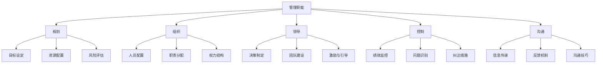

                 

## 管理的智慧：激发团队潜能

### 关键词

- 管理
- 团队建设
- 激励理论
- 绩效评估
- 沟通技巧
- 领导力
- 战略管理

### 摘要

本文将深入探讨管理的智慧，特别是如何激发团队潜能。通过分析管理的核心概念与原则、团队管理与协作、以及激励与绩效管理等关键领域，我们将揭示提升团队效率和创新能力的方法。同时，通过实际项目实战，读者将获得直接可操作的管理经验和技巧，从而在实际工作中实现团队的最大潜能。

### 目录大纲

#### 第一部分：管理的核心概念与原则

##### 第1章：管理的基本概念

###### 1.1 管理的定义与重要性
- 管理的定义
- 管理在组织中的作用
- 管理的基本目标

###### 1.2 管理的五大职能
- 规划（Planning）
- 组织（Organizing）
- 领导（Leading）
- 控制（Controlling）
- 沟通（Communicating）

##### 第2章：管理理论与原则

###### 2.1 经典管理理论
- 泰勒科学管理理论
- 法约尔一般管理理论
- 马克斯·韦伯的官僚组织理论

###### 2.2 现代管理理论
- 人本主义管理理论
- 系统管理理论
- 战略管理理论

###### 2.3 管理的基本原则
- 目标一致性原则
- 职责权利对等原则
- 组织整体性原则
- 动态适应性原则
- 因才适用原则

#### 第二部分：团队管理与协作

##### 第3章：团队构建与角色分配

###### 3.1 团队构建的步骤
- 明确团队目标
- 选择合适成员
- 建立团队规范
- 进行团队沟通

###### 3.2 团队角色与职责
- 领导者角色与职责
- 成员角色与职责
- 支持角色与职责

##### 第4章：团队沟通与协作

###### 4.1 团队沟通的重要性
- 沟通在团队管理中的作用
- 沟通的重要性与障碍

###### 4.2 有效沟通技巧
- 积极倾听
- 清晰表达
- 避免误解
- 建立信任

###### 4.3 团队协作与冲突解决
- 团队协作模式
- 冲突的类型与原因
- 冲突解决策略

#### 第三部分：激发团队潜能与提升绩效

##### 第5章：激励理论与实践

###### 5.1 激励原理
- 弗鲁姆的期望理论
- 美斯洛的需求层次理论
- 斯金纳的强化理论

###### 5.2 激励方法
- 薪酬激励
- 荣誉激励
- 成长激励
- 工作激励

##### 第6章：绩效管理与反馈

###### 6.1 绩效管理的流程
- 绩效计划
- 绩效监控
- 绩效评估
- 绩效反馈

###### 6.2 绩效评估方法
- 定量评估方法
- 定性评估方法
- 综合评估方法

###### 6.3 反馈技巧
- 正面反馈
- 负面反馈
- 反馈的技巧与策略

##### 第7章：领导力与团队成长

###### 7.1 领导力的重要性
- 领导力在团队管理中的作用
- 领导力的本质

###### 7.2 领导风格
- 集权式领导
- 民主式领导
- 放任式领导

###### 7.3 团队成长与发展
- 团队发展的阶段
- 团队学习与知识共享
- 团队文化建设

##### 第8章：案例分析与管理实践

###### 8.1 案例分析
- 成功的团队管理案例
- 团队管理中的挑战与解决方案

###### 8.2 管理实践
- 实际工作中遇到的管理问题
- 解决方案与经验分享

#### 第四部分：附录

##### 附录A：管理工具与资源

###### A.1 管理工具介绍
- 项目管理工具
- 团队协作工具
- 绩效评估工具

###### A.2 管理资源推荐
- 管理书籍推荐
- 管理文章与研究报告
- 管理实践社区与论坛

### Mermaid 流�程图



### 核心算法原理讲解（伪代码）

```python
# 伪代码：期望理论激励模型
def motivation(期望, 效价, 力量):
    # 计算激励水平
    motivation = 期望 * 效价 * 力量
    return motivation

# 示例：员工A的期望为0.8，效价为0.9，力量为0.75
motivation_level = motivation(0.8, 0.9, 0.75)
print("员工A的激励水平为：", motivation_level)
```

### 数学模型和数学公式（LaTeX）

$$
M = E \times V \times I
$$

其中，\(M\) 表示激励水平，\(E\) 表示期望，\(V\) 表示效价，\(I\) 表示力量。

### 项目实战

#### 实战1：团队绩效评估系统搭建

**开发环境搭建：**

- 后端技术：Java Spring Boot
- 数据库技术：MySQL
- 前端技术：HTML/CSS/JavaScript

**源代码实现：**

**后端：**

```java
// Java Spring Boot REST接口
@RestController
@RequestMapping("/api/绩效评估")
public class PerformanceEvaluationController {
    @Autowired
    private PerformanceService performanceService;

    @PostMapping("/评估")
    public ResponseEntity<?> evaluatePerformance(@RequestBody PerformanceRequest request) {
        PerformanceResponse response = performanceService.evaluatePerformance(request);
        return new ResponseEntity<>(response, HttpStatus.OK);
    }
}
```

**前端：**

```html
<!-- HTML 表单 -->
<form action="/api/绩效评估/评估" method="post">
    <label for="employeeId">员工ID:</label>
    <input type="text" id="employeeId" name="employeeId" required>
    <label for="performanceScore">绩效评分:</label>
    <input type="text" id="performanceScore" name="performanceScore" required>
    <button type="submit">提交评估</button>
</form>
```

**代码解读与分析：**

- 后端使用了Spring Boot REST接口接收前端发送的绩效评估数据，并调用服务层进行评估处理。
- 服务层通过业务逻辑计算绩效评估结果，并将结果返回给前端。

#### 实战2：团队沟通平台搭建

**开发环境搭建：**

- 消息队列：RabbitMQ
- 客户端：WebSocket

**源代码实现：**

**消息队列：**

```python
# Python RabbitMQ 生产者
import pika

connection = pika.BlockingConnection(pika.ConnectionParameters('localhost'))
channel = connection.channel()

channel.queue_declare(queue='团队沟通')

def send_message(message):
    channel.basic_publish(exchange='', routing_key='团队沟通', body=message)

send_message('大家好，今天的团队沟通开始啦！')
connection.close()
```

**客户端：**

```javascript
// JavaScript WebSocket 客户端
const socket = new WebSocket('ws://localhost:8080/socket');

socket.onopen = function(event) {
    socket.send('大家好，我上线了！');
};

socket.onmessage = function(event) {
    console.log('收到消息：', event.data);
};
```

**代码解读与分析：**

- 使用RabbitMQ作为消息队列，实现消息的异步传输。
- 客户端通过WebSocket与服务器保持实时通信，接收消息队列中的消息。

以上是《管理的智慧：激发团队潜能》这本书的目录大纲。每个章节都包含了详细的内容描述、伪代码、数学公式以及项目实战，旨在帮助读者全面掌握管理知识并应用于实践。在接下来的内容中，我们将逐步深入探讨管理的各个层面，并通过具体案例和实践，让管理智慧真正成为激发团队潜能的有力工具。

---

### 管理的基本概念

#### 管理的定义

管理是一种系统化的过程，旨在通过规划、组织、领导、控制和沟通等活动，协调人力、物力、财力和信息等资源，以实现组织的目标。管理不仅仅局限于企业，它广泛应用于各个领域，包括政府、非营利组织、教育机构等。

#### 管理在组织中的作用

1. **资源整合**：管理通过有效的资源配置，使得组织内的各种资源得到最佳利用，从而提升整体效率。

2. **目标达成**：管理通过设定明确的目标，并制定可行的计划，确保组织能够按照预定方向前进。

3. **团队协作**：管理通过建立良好的团队协作机制，使得团队成员能够协同工作，共同完成任务。

4. **决策制定**：管理在组织内发挥决策中心的作用，通过分析信息，制定合理的决策，引导组织的发展方向。

5. **绩效评估**：管理通过建立绩效评估体系，对组织成员的工作表现进行客观评价，激励团队成员提升自身能力。

#### 管理的基本目标

1. **效率最大化**：通过优化流程、提高资源利用率，实现组织效率的最大化。

2. **质量保证**：确保组织提供的产品或服务质量符合预期，满足客户需求。

3. **创新能力**：鼓励团队成员进行创新，推动组织不断发展，保持市场竞争力。

4. **员工满意度**：提高员工的工作满意度，增强团队的凝聚力和战斗力。

#### 管理的五大职能

1. **规划（Planning）**：规划是管理过程的起点，包括设定组织目标、制定实现目标的策略和计划。

2. **组织（Organizing）**：组织是指根据规划，对资源进行合理配置，建立组织结构，明确权责分工。

3. **领导（Leading）**：领导是管理者通过沟通、激励和指导，引领团队朝着目标前进的过程。

4. **控制（Controlling）**：控制是指通过监控和评估，确保组织的活动按照计划进行，并对偏差进行纠正。

5. **沟通（Communicating）**：沟通是管理过程中不可或缺的一环，通过信息传递，确保团队成员之间的有效协作。

#### 经典管理理论

1. **泰勒科学管理理论**：泰勒认为，通过科学的方法分析工作流程，可以提高生产效率和员工的工作效率。

2. **法约尔一般管理理论**：法约尔提出了管理五大职能，并强调了管理者在组织中的重要性。

3. **马克斯·韦伯的官僚组织理论**：韦伯认为，通过明确的规则和权力结构，可以实现组织的高效运转。

#### 现代管理理论

1. **人本主义管理理论**：人本主义管理强调员工的价值和参与，认为员工是组织最重要的资源。

2. **系统管理理论**：系统管理理论将组织视为一个系统，强调各部分之间的相互关系和协调。

3. **战略管理理论**：战略管理理论关注组织的长期发展，强调通过制定和实施战略规划来实现组织的愿景。

#### 管理的基本原则

1. **目标一致性原则**：组织的各项活动和决策都要与组织目标保持一致。

2. **职责权利对等原则**：每个职位都应该有明确的职责和相应的权利。

3. **组织整体性原则**：组织内部各部门之间应该相互协调，形成整体。

4. **动态适应性原则**：组织需要根据外部环境的变化，不断调整内部结构和运作方式。

5. **因才适用原则**：根据员工的能力和特长，合理分配工作任务。

### 总结

管理的智慧在于通过科学的规划和组织，有效的领导和控制，以及良好的沟通和协作，激发团队的潜能，实现组织的目标。了解管理的核心概念和原则，掌握经典和现代管理理论，是每一位管理者必备的素养。在接下来的章节中，我们将进一步探讨团队构建、沟通技巧、激励理论和绩效管理等关键领域，帮助读者全面掌握管理的智慧。

---

### 管理的五大职能

在深入探讨管理的核心概念后，我们将进一步细化和理解管理的五大基本职能：规划、组织、领导、控制和沟通。这些职能不仅是管理者日常工作的核心内容，也是实现组织目标、提高效率和效能的关键要素。

#### 规划（Planning）

规划是管理过程的起点，也是管理者的一项重要职责。它涉及确定组织的目标、制定实现这些目标的策略和计划。以下是规划过程中需要考虑的关键要素：

1. **目标设定**：明确组织的长远和短期目标，这些目标应该是具体、可衡量的。
2. **策略制定**：为实现目标，需要制定一系列可行的策略。策略应考虑内外部环境、资源限制和竞争情况。
3. **计划执行**：将策略转化为具体的行动计划，并明确时间表、责任人和资源配置。

**示例：** 一个企业的目标是在未来三年内实现销售收入的翻倍。为实现这一目标，管理者需要制定具体的销售策略，如市场拓展、产品创新和品牌推广，并制定详细的实施计划，包括每个季度的销售目标、营销活动安排等。

#### 组织（Organizing）

组织是指根据规划，对组织内的资源进行合理的配置和安排，确保各项活动能够高效、有序地进行。以下是组织过程中需要考虑的关键要素：

1. **资源分配**：合理分配人力、物力、财力和信息等资源，确保资源的充分利用。
2. **结构设计**：建立合适的组织结构，包括部门划分、职责分工和权力分配。
3. **流程优化**：优化工作流程，减少不必要的步骤和环节，提高工作效率。

**示例：** 在一个软件开发团队中，管理者需要根据项目需求，合理分配开发人员、测试人员和设计师等资源，确保每个人都能在其专业领域内发挥最大的价值。同时，设计清晰的项目管理和开发流程，以确保项目进度和质量。

#### 领导（Leading）

领导是管理过程中至关重要的一环，它涉及激励、引导和指导团队成员，使其能够高效地完成工作。以下是领导过程中需要考虑的关键要素：

1. **团队建设**：建立有凝聚力和战斗力的团队，鼓励团队成员之间的沟通和合作。
2. **激励与引导**：通过激励措施，如奖励和晋升，激发团队成员的工作积极性。
3. **决策制定**：在团队面临问题和挑战时，提供明确的指导和决策，帮助团队找到最佳解决方案。

**示例：** 在一个项目开发过程中，项目经理需要定期与团队成员沟通，了解他们的工作进展和遇到的困难，提供必要的支持和帮助。同时，通过制定激励政策，如项目奖金和绩效评估，激励团队成员提升工作效率。

#### 控制（Controlling）

控制是确保组织活动按照规划进行的监控和评估过程。它涉及设定绩效标准、监控实际绩效、评估偏差并采取纠正措施。以下是控制过程中需要考虑的关键要素：

1. **绩效标准设定**：根据组织目标，设定具体的绩效标准和指标。
2. **绩效监控**：定期收集和分析绩效数据，与标准进行比较，识别偏差。
3. **评估与纠正**：对绩效评估结果进行分析，识别问题根源，并采取纠正措施。

**示例：** 在一个销售团队中，管理者需要根据销售目标，设定每月的销售指标。通过定期跟踪销售数据，与管理层进行绩效分析，识别销售过程中的问题，并采取相应的策略进行改进。

#### 沟通（Communicating）

沟通是管理过程中不可或缺的一环，它涉及信息在组织内部的传递和交流。良好的沟通可以确保团队协作、提高决策质量和员工满意度。以下是沟通过程中需要考虑的关键要素：

1. **信息传递**：确保信息能够准确、及时地传递到每个相关人员。
2. **反馈机制**：建立有效的反馈机制，鼓励员工提出意见和建议。
3. **沟通技巧**：提升管理者和员工的沟通能力，包括积极倾听、清晰表达和有效沟通。

**示例：** 在一个项目中，项目经理需要定期召开会议，与团队成员讨论项目进展和遇到的问题。通过会议记录和后续跟进，确保每个成员都能了解项目状态，同时鼓励团队成员提出改进建议。

#### 综合运用

在实际管理工作中，这五大职能是相互关联、相互影响的。管理者需要综合运用这些职能，以实现组织的目标。例如：

- **规划**：确定组织目标，制定策略和计划。
- **组织**：根据规划，合理配置资源，建立组织结构。
- **领导**：通过激励和引导，确保团队成员能够有效执行计划。
- **控制**：监控和评估绩效，确保计划顺利进行。
- **沟通**：确保信息传递畅通，提高团队协作效率。

通过综合运用这些职能，管理者可以有效地激发团队的潜能，推动组织实现持续发展。

### 总结

管理的五大职能——规划、组织、领导、控制和沟通，是管理者实现组织目标的重要工具。理解并掌握这些职能，可以提升管理者的领导能力，促进组织的协调和效率。在接下来的章节中，我们将继续探讨现代管理理论，以及如何将这些管理职能应用于实际工作中，以激发团队潜能，提升组织绩效。

---

### 经典管理理论

在管理发展的历史长河中，许多经典管理理论为现代管理实践奠定了基础。这些理论不仅揭示了管理的核心原理，也为实际应用提供了指导。以下将介绍泰勒科学管理理论、法约尔一般管理理论以及马克斯·韦伯的官僚组织理论。

#### 泰勒科学管理理论

泰勒科学管理理论是管理理论的基石之一，由美国管理学家弗雷德里克·泰勒（Frederick Taylor）在20世纪初提出。泰勒主张通过科学方法来提高生产效率，其核心思想包括：

1. **时间与动作研究**：通过对工作流程进行详细分析，确定最有效的工作方法，减少不必要的动作和时间浪费。
2. **标准化作业**：制定标准化的操作规程和工作标准，确保每个工人都能按照最优方法进行工作。
3. **差别计件工资制**：根据工人的表现和效率，支付不同的工资，激励工人提高工作效率。

**示例：** 在一个制造工厂中，管理者可以通过时间与动作研究，确定每个工人在完成任务所需的最优时间。通过制定标准化的作业流程，确保每个工人都能高效完成任务。同时，实行差别计件工资制，奖励那些工作效率高的工人。

#### 法约尔一般管理理论

亨利·法约尔（Henri Fayol）是另一位杰出的管理学家，他在1916年出版的《工业和一般管理》一书中提出了管理五大职能和14条管理原则。法约尔的管理理论强调管理在组织中的核心作用，其核心内容包括：

1. **五大管理职能**：包括规划、组织、指挥、协调和控制。
2. **管理原则**：如分工、授权、纪律、统一指挥、统一领导、个人利益服从整体利益等。

**示例：** 在一个企业中，管理者需要通过规划确定企业的战略方向，通过组织确保资源的合理配置，通过指挥确保员工按照计划执行任务，通过协调确保各部门之间的协同工作，通过控制确保绩效目标的实现。

#### 马克斯·韦伯的官僚组织理论

马克斯·韦伯（Max Weber）是德国社会学家，他在《社会组织与经济组织理论》中提出了官僚组织理论。韦伯认为，通过明确的规则和权力结构，可以建立高效、稳定的组织。

1. **官僚组织的特点**：
   - **明确的权力结构**：从上至下，每个层级都有明确的职责和权限。
   - **正式的规则和制度**：组织内部有一套严格的规章制度，规范员工的行为。
   - **专业化和分工**：每个员工都有明确的职责和工作范围，专业化和分工提高了工作效率。

2. **官僚组织的优势**：
   - **稳定性**：明确的规则和权力结构确保了组织的稳定性。
   - **专业化**：分工和专业化提高了员工的工作效率。
   - **可预测性**：通过明确的规则和程序，组织的运行具有可预测性。

**示例：** 在一个政府机构中，管理者通过制定明确的规章制度，确保各部门之间的协作和协调。通过明确的职责分工，确保每个员工都能在其专业领域内高效工作。同时，通过明确的权力结构，确保决策和执行的顺畅。

#### 综合应用

泰勒科学管理理论、法约尔一般管理理论和马克斯·韦伯的官僚组织理论各有侧重，但它们在实际管理中可以相互补充。例如，在企业管理中，管理者可以通过泰勒的科学管理方法优化工作流程，通过法约尔的管理职能提升团队协作效率，通过韦伯的官僚组织理论建立稳定的组织结构。

**示例：** 在一个制造企业中，管理者可以通过泰勒的科学管理方法，优化生产流程，提高生产效率。通过法约尔的管理原则，明确各部门的职责和权限，确保团队协作。同时，通过韦伯的官僚组织理论，建立明确的规章制度，确保组织的稳定性和可预测性。

### 总结

经典管理理论不仅为我们理解管理提供了理论基础，也为实际应用提供了宝贵的经验。泰勒的科学管理理论、法约尔的一般管理理论和韦伯的官僚组织理论各有特点，但共同的目标是提高组织的效率和效能。通过这些理论的综合应用，管理者可以更好地激发团队潜能，实现组织目标。

在下一章中，我们将探讨现代管理理论，包括人本主义管理理论、系统管理理论和战略管理理论，进一步丰富我们对管理智慧的理解。

---

### 现代管理理论

随着组织环境的复杂性和多样性不断增加，现代管理理论逐渐取代了传统的管理思想，为管理者提供了更加灵活和适应性强的管理方法。现代管理理论包括人本主义管理理论、系统管理理论和战略管理理论，每种理论都有其独特的视角和重点。

#### 人本主义管理理论

人本主义管理理论起源于20世纪中叶，强调人的价值和潜力，认为员工是组织最重要的资源。这一理论的核心思想包括：

1. **员工参与**：鼓励员工参与决策过程，提高其工作积极性和责任感。
2. **个性化管理**：根据员工的特点和能力，提供个性化的管理和发展计划。
3. **员工激励**：通过奖励和晋升等激励措施，激发员工的内在动机和潜力。

**案例：** 在一家科技公司，管理者通过建立开放透明的沟通渠道，鼓励员工提出创新想法和改进建议。同时，根据员工的专业技能和个人兴趣，为其提供个性化的职业发展路径，例如技术专家、项目经理等。

#### 系统管理理论

系统管理理论将组织视为一个复杂的系统，强调各部分之间的相互关系和整体性。这一理论的核心思想包括：

1. **整体性思维**：将组织视为一个整体，关注各个部分之间的协同效应。
2. **反馈机制**：建立有效的反馈机制，确保组织能够适应外部环境的变化。
3. **系统分析**：通过系统分析，识别组织中的关键问题和潜在风险。

**案例：** 在一家大型零售企业，管理者通过系统分析，发现供应链管理是影响公司绩效的关键因素。他们建立了一套综合的供应链管理系统，包括库存管理、采购流程和物流配送等，通过实时监控和数据分析，优化供应链运营，提高整体效率。

#### 战略管理理论

战略管理理论关注组织的长期发展和竞争力。这一理论的核心思想包括：

1. **战略规划**：制定明确的战略目标，并制定实现这些目标的策略和计划。
2. **竞争优势**：通过差异化、低成本等战略，建立组织在市场中的竞争优势。
3. **资源整合**：整合组织内部和外部资源，实现协同效应。

**案例：** 在一家消费品公司，管理者通过战略规划，确定了品牌建设作为核心战略。他们投入大量资源进行市场推广和品牌宣传，同时优化生产流程和供应链管理，以提高产品品质和降低成本，从而在竞争激烈的市场中占据有利地位。

#### 综合应用

现代管理理论不仅各自有其独特性，而且在实际应用中可以相互补充。例如，人本主义管理理论可以与系统管理理论结合，通过建立反馈机制和整体性思维，提高员工参与度和组织效率。战略管理理论则可以与人本主义管理理论结合，通过员工激励和资源整合，实现长期发展目标。

**案例：** 在一家创新型科技公司，管理者通过人本主义管理理论，鼓励员工提出创新想法，并通过系统管理理论，建立反馈机制，对创新项目进行评估和优化。同时，通过战略管理理论，制定明确的长期发展目标，整合内外部资源，推动公司持续创新和成长。

### 总结

现代管理理论为我们提供了更加全面和灵活的管理方法，以应对复杂多变的组织环境。人本主义管理理论关注员工的价值和潜力，系统管理理论强调组织整体的协同效应，战略管理理论则关注组织的长期发展和竞争力。通过综合应用这些理论，管理者可以更好地激发团队潜能，提升组织绩效。

在下一章中，我们将探讨管理的基本原则，包括目标一致性原则、职责权利对等原则、组织整体性原则、动态适应性原则和因才适用原则，为实际管理提供更加具体和实用的指导。

---

### 管理的基本原则

在理解了管理的核心概念和职能后，接下来我们将深入探讨管理的基本原则。这些原则不仅为管理者提供了具体的行为指南，也为组织的稳定发展奠定了基础。以下是管理的基本原则，包括目标一致性原则、职责权利对等原则、组织整体性原则、动态适应性原则和因才适用原则。

#### 目标一致性原则

目标一致性原则是指组织的各项活动和决策都应该与组织的整体目标保持一致。这一原则的核心在于确保组织资源得到合理配置，避免资源浪费和冲突。

1. **制定明确的目标**：组织需要设定明确、具体、可衡量的目标，确保所有成员都了解并致力于实现这些目标。
2. **协调各部门目标**：各部门的目标应该与组织整体目标一致，确保各部门的工作能够协同推进，共同实现组织目标。
3. **监控目标实现情况**：定期对目标实现情况进行监控和评估，确保组织活动始终朝着目标前进。

**示例：** 在一个企业中，如果公司的整体目标是提高市场占有率，那么市场营销部门的目标可能是增加广告投入，研发部门的目标可能是推出新产品的研发，人力资源部门的目标可能是提高员工满意度。通过确保各部门的目标与公司整体目标一致，企业可以有效地实现资源的合理配置和协调。

#### 职责权利对等原则

职责权利对等原则是指每个职位都应该有明确的职责和相应的权利。这一原则旨在确保组织内部权责分明，提高工作效率。

1. **明确职责**：为每个职位设定明确的职责范围，确保员工了解自己的工作任务。
2. **赋予相应的权利**：为履行职责，员工需要拥有相应的权利，如决策权、执行权等。
3. **建立监督机制**：建立有效的监督机制，确保员工在行使权利的同时，能够履行其职责。

**示例：** 在一个项目团队中，项目经理负责项目的整体规划、执行和监控，拥有决策权和资源分配权。团队成员则负责具体的任务执行，拥有执行权。通过明确职责和权利，项目团队可以高效运作，避免职责重叠和冲突。

#### 组织整体性原则

组织整体性原则是指组织的各个部分应该相互协调，形成一个有机整体，以实现整体最优。

1. **明确组织结构**：建立明确的组织结构，确保各部门和岗位之间的职责明确、层次分明。
2. **协同工作**：鼓励各部门和岗位之间的协同工作，形成良好的工作关系，提高整体效率。
3. **资源共享**：通过资源共享，优化资源配置，提高组织整体的资源利用效率。

**示例：** 在一个跨国公司中，不同的部门（如研发、市场、销售）需要相互协作，共同推进公司的整体战略。研发部门开发的新产品需要市场部门进行推广，销售部门负责产品销售。通过协同工作，公司可以实现资源的最佳配置和利用。

#### 动态适应性原则

动态适应性原则是指组织需要具备适应环境变化的能力，以应对外部环境的不确定性和内部变化。

1. **持续监控外部环境**：通过市场调研、行业分析等方式，持续监控外部环境的变化。
2. **内部调整**：根据外部环境的变化，及时调整内部结构和运营策略，确保组织能够应对变化。
3. **持续改进**：通过持续改进和创新，提高组织的适应能力和竞争力。

**示例：** 在一个快速发展的科技公司中，市场竞争激烈，技术更新迅速。公司需要通过持续监控市场动态，及时调整产品研发方向，确保公司能够保持竞争力。同时，通过技术创新和改进，提高产品质量和用户体验。

#### 因才适用原则

因才适用原则是指根据员工的能力和特长，为其安排合适的工作岗位，以充分发挥其潜力。

1. **能力评估**：通过能力评估，了解员工的技能、经验和潜力，为员工提供合适的职位。
2. **职业发展**：为员工提供职业发展路径，鼓励员工不断提升自身能力。
3. **激励机制**：通过激励机制，如晋升、奖金等，激励员工发挥最大潜力。

**示例：** 在一家咨询公司中，公司根据员工的专业技能和经验，为其安排合适的咨询项目。同时，为员工提供培训和发展机会，鼓励其不断提升专业能力。通过激励机制，如项目奖金和晋升机会，激励员工为公司创造更多价值。

#### 总结

管理的基本原则为管理者提供了具体的行为指南，帮助其更好地实现组织目标。目标一致性原则确保组织资源得到合理配置，职责权利对等原则提高工作效率，组织整体性原则确保各部门的协同工作，动态适应性原则应对外部环境的变化，因才适用原则发挥员工潜力。通过综合应用这些原则，管理者可以更好地激发团队潜能，推动组织持续发展。

在下一章中，我们将探讨团队构建与角色分配，了解如何建立一个高效、协作的团队。

---

### 团队构建与角色分配

一个高效团队的建立是管理成功的关键。团队构建不仅涉及人员的挑选，还包括明确团队成员的角色和职责，建立良好的团队规范，并进行有效的沟通。以下将详细探讨团队构建的步骤、团队角色与职责，以及如何建立团队规范和沟通机制。

#### 团队构建的步骤

1. **明确团队目标**：团队构建的第一步是明确团队的目标。这些目标应该是具体、可衡量、可实现的，并且与组织的整体目标保持一致。

   **示例：** 一个项目团队的目标可能是开发一款新软件，并在六个月内完成。

2. **选择合适成员**：根据团队目标和项目需求，选择合适的成员。选择团队成员时，应考虑其技能、经验和性格特点，以确保团队具备完成任务所需的各种能力。

   **示例：** 一个软件开发团队可能需要前端开发人员、后端开发人员、测试人员和项目经理等。

3. **建立团队规范**：团队规范是确保团队高效运作的重要保障。这些规范包括工作流程、沟通方式、决策程序等。

   **示例：** 团队规范可能规定每周进行一次项目进度会议，以及使用特定的工具进行任务管理和代码版本控制。

4. **进行团队沟通**：有效的沟通是团队成功的关键。在团队构建过程中，应建立有效的沟通机制，确保团队成员之间能够顺畅地交流信息。

   **示例：** 团队可以采用日常站会、周会、邮件等方式进行沟通。

#### 团队角色与职责

在一个高效的团队中，每个成员都扮演着特定的角色，并承担相应的职责。以下是常见团队角色的定义和职责：

1. **领导者角色与职责**：
   - **领导力**：指导团队，制定目标和策略，激励团队成员。
   - **决策制定**：在团队面临重要决策时，提供指导和决策。
   - **资源协调**：确保团队获得完成任务所需的资源和支持。

2. **成员角色与职责**：
   - **任务执行**：根据团队目标和任务分配，负责具体工作的执行。
   - **团队协作**：与其他团队成员密切合作，共同完成项目任务。
   - **问题反馈**：及时报告工作进展和遇到的问题，寻求解决方案。

3. **支持角色与职责**：
   - **技术支持**：为团队成员提供技术支持和建议，帮助解决技术难题。
   - **资源管理**：负责团队资源的分配和管理，确保资源高效利用。
   - **团队氛围维护**：营造积极、和谐的团队氛围，促进团队凝聚力。

#### 团队规范的建立

团队规范是确保团队高效运作的基础。以下是一些关键步骤和注意事项：

1. **制定规范内容**：根据团队目标和项目需求，制定具体的团队规范内容。这些内容应包括工作流程、沟通方式、决策程序等。

2. **征求团队成员意见**：在制定团队规范时，应征求团队成员的意见，确保规范内容符合实际需求。

3. **定期更新规范**：团队规范应随着项目进展和团队变化进行定期更新，确保其始终符合团队需求。

4. **培训和宣传**：对团队成员进行规范的培训，确保他们了解并遵守规范。同时，通过宣传和激励，提高团队成员对规范的认同感和遵守度。

#### 团队沟通与协作

有效的沟通是团队协作的基础。以下是一些关键点和技巧：

1. **明确沟通目标**：每次沟通前，应明确沟通的目标和议程，确保沟通有针对性。

2. **积极倾听**：在沟通中，应积极倾听他人的意见和观点，避免打断和误解。

3. **清晰表达**：确保自己的意见和观点表达清晰、准确，避免产生歧义。

4. **建立信任**：通过建立信任，促进团队成员之间的沟通和合作。

5. **利用沟通工具**：使用适当的沟通工具，如邮件、即时通讯、视频会议等，提高沟通效率和效果。

6. **反馈机制**：建立有效的反馈机制，鼓励团队成员对沟通效果进行评价和反馈，不断改进沟通方式。

#### 案例分析

以下是一个团队构建与角色分配的实际案例：

**项目背景：** 一家互联网公司需要开发一款新的社交应用程序，项目团队由项目经理、前端开发人员、后端开发人员、测试人员和支持人员组成。

**团队目标：** 在六个月内完成应用程序的开发和测试，确保软件质量。

**团队成员角色与职责：**

- **项目经理**：负责整体项目规划、任务分配和进度监控，确保项目按时交付。
- **前端开发人员**：负责应用程序的用户界面设计和开发，确保用户体验。
- **后端开发人员**：负责应用程序的后端逻辑和数据处理，确保系统稳定性。
- **测试人员**：负责应用程序的功能测试和性能测试，确保软件质量。
- **支持人员**：提供技术支持和资源管理，确保团队高效运作。

**团队规范：**

- 每周召开一次项目进度会议，讨论工作进展和遇到的问题。
- 使用JIRA进行任务管理和跟踪。
- 使用Slack进行日常沟通和协作。

**团队沟通与协作：**

- 通过JIRA跟踪任务进展，确保每个成员都能了解项目的最新情况。
- 定期召开视频会议，讨论项目进展和解决方案。
- 鼓励团队成员之间进行积极沟通和合作，共同解决问题。

通过以上案例，我们可以看到，有效的团队构建与角色分配、规范建立和沟通协作，对于项目成功至关重要。在下一章中，我们将探讨团队沟通与协作的重要性，以及如何进行有效的沟通。

---

### 团队沟通与协作

在团队管理中，沟通和协作是确保项目成功的关键。良好的团队沟通不仅能提高工作效率，还能增强团队成员之间的信任和凝聚力。以下将详细探讨团队沟通的重要性、有效沟通的技巧，以及团队协作与冲突解决策略。

#### 团队沟通的重要性

1. **提高工作效率**：通过有效沟通，团队成员能够更好地理解任务要求和目标，从而提高工作效率。

2. **增强团队凝聚力**：良好的沟通有助于建立团队成员之间的信任和友谊，增强团队的凝聚力。

3. **促进知识共享**：团队成员通过沟通，可以分享各自的见解和经验，促进知识共享和创新。

4. **解决冲突**：沟通是解决团队内部冲突的重要手段，通过及时沟通和交流，可以避免误解和矛盾的积累。

#### 有效沟通的技巧

1. **积极倾听**：倾听是有效沟通的基础。在沟通中，应积极倾听对方的意见和观点，避免打断和误解。

2. **清晰表达**：确保自己的意见和观点表达清晰、准确，避免产生歧义。可以使用简洁明了的语言，避免使用专业术语或复杂句式。

3. **避免误解**：在沟通中，应注意对方的反应和反馈，及时澄清可能产生的误解。可以通过重复对方观点或提出问题来确认理解。

4. **建立信任**：建立信任是有效沟通的关键。通过诚实、透明和尊重，可以建立团队成员之间的信任。

5. **利用多种沟通方式**：结合使用口头、书面和视觉沟通方式，根据具体情况选择最合适的沟通方式。

#### 团队协作与冲突解决

1. **团队协作模式**：团队协作模式有多种，包括任务型协作、过程型协作、目标型协作等。选择合适的协作模式，可以提高团队协作效率。

2. **冲突的类型与原因**：
   - **任务冲突**：由于任务分配不均或职责不清导致的冲突。
   - **关系冲突**：由于团队成员之间的个人关系或价值观差异导致的冲突。
   - **目标冲突**：由于团队目标不一致或目标设置不明确导致的冲突。

3. **冲突解决策略**：
   - **直接解决**：直接面对冲突，通过谈判和妥协找到双方都能接受的解决方案。
   - **回避**：暂时回避冲突，等待时机成熟再解决。
   - **妥协**：通过妥协，双方都做出一定的让步，达成临时性解决方案。
   - **合作**：通过合作，双方共同努力，寻找最佳解决方案。

#### 案例分析

以下是一个团队沟通与协作的实际案例：

**项目背景：** 一家科技公司需要开发一款新的移动应用，项目团队由产品经理、前端开发人员、后端开发人员、测试人员和设计人员组成。

**团队沟通与协作：**

- **沟通机制**：
  - 每周召开一次项目进度会议，讨论工作进展和遇到的问题。
  - 使用Slack进行日常沟通和协作。
  - 使用Trello进行任务管理和跟踪。

- **协作模式**：
  - 采用任务型协作模式，明确每个团队成员的任务和职责。
  - 使用敏捷开发方法，通过迭代和增量开发，确保项目进度和灵活性。

- **冲突解决**：
  - 对于任务冲突，通过定期会议和任务分配，确保任务分配合理。
  - 对于关系冲突，通过团队建设活动和沟通培训，增强团队成员之间的信任和理解。
  - 对于目标冲突，通过明确项目目标和沟通目标，确保团队成员目标一致。

通过以上案例，我们可以看到，有效的团队沟通与协作是项目成功的关键。在下一章中，我们将探讨激励理论与实践，了解如何通过激励激发团队潜能。

---

### 激励理论与方法

在团队管理中，激励是激发团队成员工作积极性和潜能的关键因素。有效的激励机制能够提高员工的工作满意度、减少流失率，并促进团队的整体绩效。以下将详细探讨几种重要的激励理论，以及在实际工作中如何运用这些理论进行激励。

#### 激励原理

1. **期望理论**：由维克托·弗鲁姆（Victor Vroom）提出，期望理论认为，个体在决策时会考虑三个因素：期望（期望目标能实现）、效价（目标实现后所带来的价值）和力量（个体对实现目标的信心）。公式为：
   $$
   激励 = 期望 \times 效价 \times 力量
   $$
   其中，激励水平取决于这三个因素的乘积。

2. **需求层次理论**：由亚伯拉罕·马斯洛（Abraham Maslow）提出，需求层次理论将人类需求分为五个层次：生理需求、安全需求、社交需求、尊重需求和自我实现需求。管理者应根据员工的不同需求层次，提供相应的激励。

3. **强化理论**：由伯尔赫斯·斯金纳（B.F. Skinner）提出，强化理论认为，通过奖励和惩罚，可以塑造和改变员工的行为。正强化增加员工期望行为的发生频率，负强化减少不良行为的发生。

#### 激励方法

1. **薪酬激励**：薪酬是员工最直接、最关心的激励因素。合理的薪酬体系可以激发员工的工作积极性。薪酬激励包括基本工资、奖金、绩效工资等。

2. **荣誉激励**：通过颁发荣誉证书、表彰大会、荣誉称号等方式，认可员工的贡献，增强其荣誉感和成就感。

3. **成长激励**：提供职业发展机会、培训和学习机会，帮助员工不断提升自身能力和技能。成长激励有助于满足员工的自我实现需求。

4. **工作激励**：通过赋予员工更多的责任和自主权，使其在工作中感到挑战和满足感。工作激励包括工作丰富化、工作轮换等。

#### 实际应用

1. **期望理论应用**：

   - **案例**：一个公司的销售团队，公司设定了高额的销售目标，同时提供了丰厚的奖金奖励。销售人员通过分析，发现达到目标的可能性较高，效价也高（因为奖金数额巨大），同时对自己的能力有信心。因此，他们愿意付出更多努力来实现销售目标。

   - **代码示例**（伪代码）：
     ```python
     # 期望理论应用
     目标可能性 = 0.8
     奖金数额 = 10000
     自信心 = 0.9
     激励水平 = 目标可能性 * 奖金数额 * 自信心
     print("激励水平为：", 激励水平)
     ```

2. **需求层次理论应用**：

   - **案例**：一家科技公司为员工提供多种培训和学习机会，帮助员工提升专业技能和职业素养。这满足了员工的成长需求，使他们感到在公司有发展前途，从而提高了工作积极性和满意度。

3. **强化理论应用**：

   - **案例**：一个项目经理通过设置奖励机制，鼓励团队成员按时完成任务。在项目进度会议中，项目经理会公开表扬按时完成任务的团队成员，并在公司内部公告板上展示他们的成就。这种正强化措施提高了团队成员的工作效率和积极性。

   - **代码示例**（伪代码）：
     ```python
     # 强化理论应用
     if 任务完成：
         表扬团队成员
         显示成就
         增加团队士气
     else：
         提供反馈
         提出改进建议
     ```

#### 总结

激励理论为管理者提供了科学的依据，帮助他们理解员工的行为动机和需求。在实际工作中，通过应用期望理论、需求层次理论和强化理论，管理者可以设计出有效的激励机制，从而激发团队成员的潜能，提高团队绩效。在下一章中，我们将探讨绩效管理与反馈，了解如何通过科学的绩效评估和反馈机制，进一步提升团队效能。

---

### 绩效管理与反馈

绩效管理是团队管理中至关重要的一环，它不仅关系到个人和团队的发展，也直接影响到组织的整体绩效。有效的绩效管理能够激发员工的潜力，提高工作效率，实现组织的战略目标。以下将详细探讨绩效管理的流程、绩效评估方法以及反馈技巧。

#### 绩效管理的流程

1. **绩效计划**：
   - **目标设定**：根据组织的战略目标，设定具体的个人和团队目标。
   - **计划制定**：制定实现目标的行动计划，明确任务、责任人和时间表。

2. **绩效监控**：
   - **实时监控**：通过定期检查和汇报，监控绩效目标的执行情况。
   - **问题识别**：及时发现绩效执行中的问题和障碍，并采取纠正措施。

3. **绩效评估**：
   - **定量评估**：使用具体的指标和数据对绩效进行量化评估。
   - **定性评估**：通过观察、反馈和主观判断，对绩效进行定性分析。

4. **绩效反馈**：
   - **正面反馈**：对表现优秀的员工进行肯定和奖励，增强其工作动力。
   - **负面反馈**：对表现不佳的员工进行指导和建议，帮助其改进。

5. **绩效改进**：
   - **总结经验**：对绩效管理过程进行总结和反思，识别成功经验和改进空间。
   - **持续改进**：根据绩效反馈，调整绩效计划和方法，不断提高绩效管理水平。

#### 绩效评估方法

1. **定量评估方法**：
   - **关键绩效指标（KPI）**：设定具体的绩效指标，如销售额、生产量、客户满意度等，对绩效进行量化评估。
   - **平衡计分卡**：从财务、客户、内部流程、学习与成长四个维度，全面评估绩效。

2. **定性评估方法**：
   - **360度反馈**：收集来自上级、同事、下属和客户的反馈，对绩效进行全面评估。
   - **行为锚定评估法（BARS）**：将绩效指标分解为具体的行为标准，对员工的行为进行评估。

3. **综合评估方法**：
   - **绩效评分制**：结合定量和定性评估方法，对绩效进行全面评估。

#### 反馈技巧

1. **正面反馈**：
   - **肯定成绩**：对员工的表现给予肯定和赞扬，增强其自信心和积极性。
   - **具体明确**：给出具体的正面反馈，让员工明确自己的优点和成功之处。
   - **及时反馈**：在员工表现出色时，及时给予反馈，使其感受到认可和鼓励。

2. **负面反馈**：
   - **事实陈述**：以客观、公正的态度，陈述员工的问题和不足，避免主观情绪。
   - **具体建议**：给出具体的改进建议，帮助员工找到解决问题的方法。
   - **支持与鼓励**：在反馈过程中，表达对员工的信任和支持，鼓励其改进和提升。

#### 案例分析

以下是一个绩效管理与反馈的实际案例：

**项目背景**：一家软件开发公司需要评估其开发团队在过去一年的绩效。

**绩效管理流程**：

1. **绩效计划**：
   - **目标设定**：根据公司的年度目标，为开发团队设定了具体的开发任务和绩效指标，如完成项目数量、代码质量等。
   - **计划制定**：制定了详细的开发计划，明确了每个开发人员的任务和时间表。

2. **绩效监控**：
   - **实时监控**：项目经理通过每周的开发进度会议，监控项目的进展情况，及时发现并解决问题。
   - **问题识别**：在监控过程中，识别出一些潜在的问题，如部分任务进度延迟、代码质量不高。

3. **绩效评估**：
   - **定量评估**：根据项目完成情况和代码质量指标，对开发团队进行了量化评估。
   - **定性评估**：通过360度反馈，收集了来自项目经理、同事和客户的反馈，对开发团队进行了定性评估。

4. **绩效反馈**：
   - **正面反馈**：对表现出色的开发人员给予了肯定和奖励，如晋升机会和绩效奖金。
   - **负面反馈**：对绩效不佳的开发人员进行了指导，提出了具体的改进建议，如参与代码审查和额外的培训。

5. **绩效改进**：
   - **总结经验**：项目经理对绩效管理过程进行了总结，识别出成功经验和改进空间。
   - **持续改进**：根据绩效反馈，调整了开发计划和绩效指标，制定了新的改进措施，如引入敏捷开发方法、加强代码质量检查等。

通过以上案例，我们可以看到，科学的绩效管理与反馈机制能够帮助团队识别问题、改进工作，从而实现持续提升。

### 总结

绩效管理是团队管理的重要组成部分，通过设定明确的绩效目标、进行有效的绩效监控和评估，以及提供及时的反馈，可以激发员工的工作积极性，提高团队的整体绩效。有效的绩效管理不仅能帮助员工实现个人职业发展，也能推动组织的战略目标实现。在下一章中，我们将探讨领导力与团队成长，了解如何通过领导力提升团队绩效。

---

### 领导力与团队成长

领导力是管理中至关重要的一环，它不仅决定了团队的方向和目标，还直接影响团队的整体绩效和成员的个人成长。有效的领导力能够激发团队成员的潜能，推动团队不断进步和发展。以下将详细探讨领导力的重要性、领导风格以及团队成长与发展。

#### 领导力的重要性

1. **指导方向**：领导者为团队设定目标和方向，确保团队成员朝着共同的目标努力。

2. **激发潜能**：通过激励和引导，领导者能够激发团队成员的工作热情和创造力，使其充分发挥潜能。

3. **建立信任**：领导者通过建立信任和尊重，增强团队成员之间的凝聚力和协作精神。

4. **应对挑战**：在面临困难和挑战时，领导者能够为团队提供指导和支持，帮助团队克服困难，实现目标。

5. **传承文化**：领导者通过自身的言行，传承和塑造组织的价值观和文化，推动团队的持续发展。

#### 领导风格

1. **集权式领导**：领导者集中决策权和控制权，对团队成员的日常工作进行严格监督和管理。

   - **优点**：决策迅速，指挥统一。
   - **缺点**：限制团队成员的自主性和创造力。

2. **民主式领导**：领导者鼓励团队成员参与决策，充分听取意见，共同制定决策。

   - **优点**：增强团队凝聚力，激发创新思维。
   - **缺点**：决策过程较慢，容易产生意见分歧。

3. **放任式领导**：领导者给予团队成员高度的自主权，让团队成员自主决策和管理自己的工作。

   - **优点**：提高团队成员的自主性和责任感。
   - **缺点**：缺乏统一的指导，可能导致团队成员的工作方向不一致。

#### 团队成长与发展

1. **团队发展的阶段**：团队发展通常经历形成期、震荡期、规范期和执行期等阶段。每个阶段都有不同的特点和挑战，领导者需要根据团队的发展阶段，采取相应的管理策略。

2. **团队学习与知识共享**：通过定期培训和知识共享活动，提高团队成员的专业能力和知识水平，促进团队整体成长。

3. **团队文化建设**：建立积极、和谐、充满活力的团队文化，增强团队成员的归属感和凝聚力。

#### 案例分析

以下是一个领导力与团队成长的实际案例：

**项目背景**：一家科技公司需要开发一款新的移动应用，项目团队由多名软件开发人员、设计师和产品经理组成。

**领导力实践**：

1. **指导方向**：项目经理在项目启动会上明确了项目的目标、时间表和任务分配，确保团队成员了解项目的整体方向。

2. **激发潜能**：项目经理鼓励团队成员提出创新想法，并组织头脑风暴会议，激发团队的创造力和创新思维。

3. **建立信任**：项目经理通过透明和开放的沟通，建立了团队成员之间的信任。项目过程中，项目经理定期召开团队会议，听取成员的意见和建议，确保团队成员的参与和认可。

4. **应对挑战**：在项目开发过程中，团队遇到了技术难题和进度延误等问题。项目经理积极协调资源，提供技术支持和指导，帮助团队克服困难，确保项目按计划推进。

5. **团队成长与发展**：
   - **团队发展的阶段**：项目经理根据团队的发展阶段，制定了相应的管理策略。在形成期，项目经理通过培训和团队建设活动，帮助团队成员建立团队意识和合作关系。在震荡期，项目经理通过冲突管理和沟通技巧，解决团队成员之间的矛盾和分歧。
   - **团队学习与知识共享**：项目经理组织了多次技术培训和技术分享会，提高了团队成员的专业能力和知识水平。
   - **团队文化建设**：项目经理通过建立积极、和谐的工作氛围，促进了团队的凝聚力和团队精神的形成。

通过以上案例，我们可以看到，有效的领导力不仅能够为团队提供清晰的指导和支持，还能激发团队成员的潜能，促进团队的成长和发展。在下一章中，我们将通过案例分析，深入探讨团队管理的成功经验和挑战。

---

### 案例分析与管理实践

在团队管理实践中，成功的管理经验和有效的解决方案能够为其他组织提供宝贵的借鉴。以下将通过两个具体的案例，分析团队管理中的成功经验和面临的挑战，以及相应的解决方案。

#### 成功的团队管理案例

**案例一：高科技初创公司的敏捷团队**

**背景**：一家高科技初创公司致力于开发一款创新的智能家居应用。由于市场竞争激烈，项目时间紧、任务重，公司决定采用敏捷开发方法，组建一个高效的团队。

**挑战**：
- **项目进度管理**：如何在有限的时间内高效完成复杂的开发任务。
- **团队成员协作**：如何在团队成员分散、沟通不畅的情况下保持高效协作。
- **技术难题**：如何解决开发过程中遇到的技术难题。

**解决方案**：
- **敏捷开发**：公司采用敏捷开发方法，将项目分为多个迭代周期，每个迭代周期都有明确的目标和任务。通过每日站会和迭代评审，确保团队成员保持高效率和紧密协作。
- **分布式团队协作**：公司使用视频会议工具和在线协作平台，确保团队成员能够实时沟通和协作。同时，采用分布式工作模式，允许团队成员在家办公，提高工作灵活性。
- **技术支持与知识共享**：公司建立了技术社区和知识库，鼓励团队成员分享技术心得和解决方案，共同解决开发过程中的技术难题。

**结果**：通过敏捷开发方法、分布式团队协作和技术支持，团队成功在规定时间内完成了智能家居应用的开发，并顺利发布了产品，获得了市场的高度认可。

#### 团队管理中的挑战与解决方案

**案例二：大型跨国公司的多元化团队**

**背景**：一家大型跨国公司在中国区进行业务扩张，组建了一个多元化团队，包括本地员工、外籍员工和实习生。

**挑战**：
- **文化冲突**：团队成员来自不同的文化背景，存在文化差异和沟通障碍。
- **任务分配**：如何合理分配任务，确保每个团队成员都能发挥其特长。
- **团队成员发展**：如何激励和培养多元化的团队成员。

**解决方案**：
- **文化培训与沟通**：公司组织了文化培训和跨文化沟通工作坊，帮助团队成员了解和尊重彼此的文化差异，提高跨文化沟通能力。同时，建立开放、透明的沟通机制，鼓励团队成员积极表达意见和建议。
- **任务合理分配**：项目经理根据团队成员的能力和兴趣，合理分配任务，确保每个团队成员都能在其专业领域内发挥作用。同时，定期评估和调整任务分配，确保团队成员的工作负担均衡。
- **员工发展计划**：公司制定了多元化的员工发展计划，包括职业培训、项目参与和跨部门轮岗等，为团队成员提供多样化的职业发展路径。同时，通过定期的绩效评估和反馈，激励团队成员不断提升自身能力和绩效。

**结果**：通过文化培训、合理任务分配和员工发展计划，团队成功克服了文化冲突和任务分配问题，成员之间的协作和沟通得到了显著改善，团队成员的个人发展和职业成长也得到了有效促进。

### 总结

通过以上案例分析，我们可以看到，成功的团队管理需要综合考虑项目需求、团队成员特点和团队文化。在管理实践中，领导者需要灵活运用不同的管理方法和策略，以应对团队面临的挑战。同时，有效的文化培训、沟通机制和员工发展计划，也是确保团队高效运作和持续发展的重要保障。

在下一章中，我们将探讨管理工具与资源，为读者提供实用的管理工具和资源推荐，帮助读者在团队管理中更加得心应手。

---

### 附录：管理工具与资源

在团队管理中，使用合适的工具和资源可以显著提高工作效率和团队绩效。以下将介绍几种常用的管理工具、推荐的管理书籍、文章与研究报告，以及管理实践社区与论坛。

#### 管理工具介绍

1. **项目管理工具**：
   - **JIRA**：一款功能强大的项目管理工具，适用于敏捷开发团队，支持任务跟踪、进度监控和协作。
   - **Trello**：一个简单直观的任务管理工具，适合小型项目和团队使用，可以通过卡片和看板进行任务管理。

2. **团队协作工具**：
   - **Slack**：一款即时通讯工具，支持多平台和实时消息传递，适合团队内部沟通和协作。
   - **Microsoft Teams**：集成了聊天、视频会议、文件共享等多种功能，适合大型团队和企业使用。

3. **绩效评估工具**：
   - **Greenhouse**：一款招聘和绩效评估工具，支持自动化面试流程和绩效评估，提高招聘和绩效管理的效率。
   - **Lattice**：一款员工绩效评估和反馈工具，提供多维度的绩效评估体系，帮助管理者制定有效的激励政策。

#### 管理资源推荐

1. **管理书籍推荐**：
   - 《管理的实践》（《Practice of Management》）——彼得·德鲁克（Peter Drucker）
   - 《创新与企业家精神》（《Innovation and Entrepreneurship》）——彼得·德鲁克
   - 《领导力的五项修炼》（《The Five Disciplines of a Successful Leader》）——约翰·马特尔（John P. Martin）

2. **管理文章与研究报告**：
   - **哈佛商业评论**：提供高质量的管理文章和案例分析，涵盖企业战略、领导力、创新等多个领域。
   - **麦肯锡全球研究所**：发布关于企业战略、数字化转型、领导力等方面的研究报告，提供深刻的见解和实用的建议。

3. **管理实践社区与论坛**：
   - **领英**：全球最大的职业社交平台，提供丰富的管理资源和职业机会，适合寻找管理实践经验和建立职业网络。
   - **Facebook管理小组**：各种管理主题的小组，包括领导力、项目管理、人力资源管理等，适合交流和分享管理经验。

#### 总结

有效的团队管理需要借助合适的工具和资源。通过使用项目管理工具、团队协作工具和绩效评估工具，可以提高工作效率和团队绩效。同时，阅读经典的管理书籍和文章，参与管理实践社区与论坛，可以不断丰富管理知识和实践经验。希望这些推荐能够为读者在团队管理中提供有力支持。

---

### 总结与展望

在本文中，我们深入探讨了管理的智慧，从管理的核心概念与原则、团队管理与协作、激励与绩效管理，到领导力与团队成长，以及管理工具与资源，全面阐述了如何激发团队潜能，提升组织绩效。以下是本文的核心要点总结：

1. **管理的核心概念与原则**：理解管理的定义、基本职能和五大原则，是管理者实现组织目标的基础。
2. **团队构建与角色分配**：通过明确团队目标、选择合适成员、建立规范和沟通机制，构建高效团队。
3. **沟通技巧**：积极倾听、清晰表达和建立信任，是有效沟通的关键，有助于团队协作与冲突解决。
4. **激励理论**：期望理论、需求层次理论和强化理论，为管理者提供了科学的激励方法。
5. **绩效管理**：通过设定绩效目标、监控和评估绩效，提供及时反馈，确保团队持续改进。
6. **领导力**：不同的领导风格对团队绩效有显著影响，领导者需要根据团队发展阶段采取相应的管理策略。
7. **管理工具与资源**：推荐了项目管理工具、团队协作工具、绩效评估工具，以及管理书籍、文章和社区，为管理实践提供支持。

展望未来，随着全球化、数字化和智能化的加速发展，管理将面临更多挑战和机遇。管理者需要不断学习新知识、掌握新技能，以应对快速变化的环境。同时，利用先进的管理工具和资源，可以更有效地激发团队潜能，实现组织的战略目标。

最后，感谢读者的耐心阅读。希望本文能为您提供有益的管理知识和实践经验，助力您在团队管理中取得更大成功。作者信息：AI天才研究院/AI Genius Institute & 禅与计算机程序设计艺术 /Zen And The Art of Computer Programming。如果您有任何疑问或建议，欢迎随时与我们联系。祝您工作顺利，前程似锦！

