                 

## 《管理者终身学习的重要性与方法》

### 关键词：终身学习、管理者、职业发展、技术创新、学习策略

> **摘要：** 本文章深入探讨了终身学习在管理者职业发展中的重要性，分析了终身学习的理念、方法、策略及其在组织中的应用。通过案例研究和前沿趋势分析，本文旨在为管理者提供一套系统的终身学习指南，帮助他们在快速变化的环境中持续提升自身能力和组织竞争力。

---

### 《管理者终身学习的重要性与方法》目录大纲

---

### 第一部分：终身学习的理念与重要性

#### 1.1 终身学习概述

##### 1.1.1 终身学习的定义与起源

终身学习（Lifelong Learning）指的是一个人在其整个生命周期中，通过不断的学习和训练，获取知识、技能和态度的过程。它不仅仅是在学校教育阶段的延续，而是涵盖了工作、家庭、社区等各个生活领域的学习活动。

终身学习的概念起源于20世纪60年代的联合国教科文组织（UNESCO），由法国教育家保罗·朗格朗（Paul Lengrand）提出。他强调，在现代社会中，知识更新的速度越来越快，个人需要终身学习来适应这种变化。

##### 1.1.2 终身学习的重要性

终身学习对于个人和组织来说都具有重要意义。对个人而言，终身学习能够：

1. **提升个人能力**：通过不断学习新的知识和技能，个人可以不断提升自己的职业能力和竞争力。
2. **促进职业发展**：终身学习是职业晋升和发展的关键，能够帮助管理者在职业生涯中保持领先地位。
3. **增强适应力**：终身学习使得个人能够更好地适应社会和职场的变化，提高应对挑战的能力。

对组织而言，终身学习能够：

1. **提高组织竞争力**：通过持续学习和创新，组织可以保持竞争力，适应快速变化的市场环境。
2. **促进团队协作**：终身学习可以增强团队成员之间的沟通和协作，提高团队的整体效能。
3. **促进企业文化建设**：终身学习能够促进学习型组织的建立，增强企业的凝聚力和创新力。

#### 1.2 管理者终身学习的核心价值

##### 1.2.1 提升管理能力

管理者作为组织中的核心成员，其管理能力直接影响到组织的运营效果。终身学习可以帮助管理者：

1. **掌握最新的管理理念和方法**：随着管理理论的不断更新和发展，管理者需要通过终身学习来掌握最新的管理理念和方法。
2. **提高决策能力**：通过学习，管理者可以提升自己的分析和判断能力，做出更明智的决策。
3. **增强沟通和协作能力**：管理者的职责之一是协调团队成员之间的关系，终身学习可以帮助管理者提高沟通和协作能力。

##### 1.2.2 促进职业发展

终身学习对于管理者的职业发展至关重要。通过不断学习，管理者可以实现以下目标：

1. **职业晋升**：终身学习可以帮助管理者积累更多的经验和技能，从而在职业晋升中脱颖而出。
2. **拓展视野**：终身学习可以让管理者了解更多的行业动态和发展趋势，为自己的职业规划提供指导。
3. **提升领导力**：终身学习可以帮助管理者提升领导力，成为更具有领导力的管理者。

##### 1.2.3 适应快速变化的环境

现代社会变化迅速，新技术、新理念层出不穷。管理者需要具备快速适应变化的能力。终身学习可以帮助管理者：

1. **更新知识结构**：通过学习新的知识和技能，管理者可以不断更新自己的知识结构，保持与时代的同步。
2. **提高创新意识**：终身学习可以激发管理者的创新思维，使其能够更快地适应变化。
3. **提升应变能力**：终身学习可以帮助管理者在面对变化时保持冷静和理智，迅速做出应对措施。

#### 1.3 终身学习的驱动因素

##### 1.3.1 技术变革

技术的快速进步是推动终身学习的重要因素。随着人工智能、大数据、云计算等新技术的广泛应用，管理者需要不断学习这些新技术，以适应数字化时代的发展。

##### 1.3.2 经济发展

随着全球经济的发展，市场竞争日益激烈。企业需要不断提升自身的竞争力，管理者也需要通过终身学习来提高自己的管理能力，从而帮助企业在市场中立于不败之地。

##### 1.3.3 社会需求

社会对管理者的要求不断提高。终身学习可以满足社会对高素质管理者的需求，帮助管理者不断提升自己的职业素养。

##### 1.3.4 组织需求

组织需要管理者具备持续学习的能力，以适应快速变化的市场环境。终身学习可以满足组织的这一需求，帮助管理者更好地应对挑战。

#### 1.4 终身学习与传统教育的区别

##### 1.4.1 学习方式的灵活性

终身学习与传统教育的最大区别在于学习方式的灵活性。终身学习允许个人根据自己的需求和兴趣选择学习内容和学习时间，而传统教育则更多地依赖于固定的学习时间和学习内容。

##### 1.4.2 学习内容的多样性

终身学习的学习内容更加多样化，不仅包括专业知识，还包括跨学科的知识和技能。这种多样性可以帮助管理者从不同的角度看待问题，提高其综合能力。

##### 1.4.3 学习目标的个性化

终身学习更注重学习目标的个性化。管理者可以根据自己的职业规划和兴趣爱好，制定个性化的学习计划，实现自我价值的最大化。

#### 1.5 终身学习与管理者个人成长

##### 1.5.1 提升自我认知

终身学习可以帮助管理者更好地认识自己，了解自己的优点和不足，从而不断提升自己的自我认知。

##### 1.5.2 培养创新能力

创新是管理者的核心竞争力。终身学习可以帮助管理者不断拓展思维，培养创新能力，从而在竞争激烈的市场中脱颖而出。

##### 1.5.3 增强适应力

终身学习可以让管理者更好地适应社会和职场的变化。通过不断学习，管理者可以保持与时代的同步，提高自己的适应力。

#### 1.6 终身学习在组织中的应用

##### 1.6.1 建立学习型组织

学习型组织是指组织中的每个成员都积极参与学习，通过学习来提升个人和组织的绩效。建立学习型组织需要从组织文化、学习机制和激励机制等多个方面入手。

##### 1.6.2 促进团队协作

终身学习可以促进团队成员之间的协作。通过共同学习，团队成员可以相互交流，分享经验，提高团队的整体效能。

##### 1.6.3 提高组织竞争力

终身学习可以提高组织的竞争力。通过不断学习和创新，组织可以不断优化自身的运营模式，提高市场竞争力。

#### 1.7 终身学习的挑战与对策

##### 1.7.1 时间管理

终身学习需要管理者投入大量的时间和精力。为了有效管理时间，管理者可以采取以下措施：

1. **制定学习计划**：明确学习目标和时间安排，确保学习活动有序进行。
2. **合理安排时间**：在工作之余，合理安排学习时间，确保学习与工作之间的平衡。

##### 1.7.2 学习资源获取

终身学习需要管理者获取大量的学习资源。为了有效地获取学习资源，管理者可以：

1. **利用在线平台**：通过在线平台，管理者可以获取海量的学习资源，包括书籍、课程、讲座等。
2. **参加专业社群**：加入专业社群，管理者可以与其他专业人士交流，获取更多的学习资源。

##### 1.7.3 学习习惯培养

终身学习需要管理者养成良好的学习习惯。为了培养良好的学习习惯，管理者可以：

1. **设定学习目标**：明确自己的学习目标，有针对性地进行学习。
2. **定期学习与反思**：定期进行学习，并进行反思，总结学习成果。

### 第二部分：终身学习的方法与策略

---

### 第一部分：终身学习的理念与重要性

在本部分中，我们深入探讨了终身学习的概念、定义及其重要性。首先，我们介绍了终身学习的起源和发展，强调了其作为现代社会适应变化的关键。接着，我们分析了终身学习对个人和组织的核心价值，如提升管理能力、促进职业发展和增强适应力等。此外，我们还探讨了终身学习的驱动因素，包括技术变革、经济发展、社会需求和组织需求。同时，我们对比了终身学习与传统教育的区别，强调了其灵活性、多样性和个性化特点。最后，我们讨论了终身学习对管理者个人成长和组织应用的影响，以及面临的挑战和对策。

#### 1.1 终身学习概述

##### 1.1.1 终身学习的定义与起源

终身学习（Lifelong Learning）指的是一个人在其整个生命周期中，通过不断的学习和训练，获取知识、技能和态度的过程。它不仅仅是在学校教育阶段的延续，而是涵盖了工作、家庭、社区等各个生活领域的学习活动。

终身学习的概念起源于20世纪60年代的联合国教科文组织（UNESCO），由法国教育家保罗·朗格朗（Paul Lengrand）提出。他强调，在现代社会中，知识更新的速度越来越快，个人需要终身学习来适应这种变化。

在20世纪后半叶，随着经济全球化和信息技术的飞速发展，终身学习的理念逐渐被世界各国接受和推广。许多国家开始制定相关的政策和规划，以促进终身学习的发展。例如，欧盟在20世纪90年代提出了“学习型欧洲”战略，旨在建立一个支持终身学习的教育体系。

在中国，终身学习也被高度重视。自20世纪80年代以来，中国政府不断推出一系列政策和措施，推动终身学习的发展。例如，《国家中长期教育改革和发展规划纲要（2010-2020年）》明确提出了建立终身教育体系的任务，强调要“形成全民学习、终身学习的学习型社会”。

##### 1.1.2 终身学习的重要性

终身学习对于个人和组织来说都具有重要意义。对个人而言，终身学习能够：

1. **提升个人能力**：通过不断学习新的知识和技能，个人可以不断提升自己的职业能力和竞争力。
   - **专业技能提升**：终身学习可以帮助个人掌握最新的技术和管理方法，提高其在职场中的竞争力。
   - **跨界能力培养**：终身学习不仅可以提升个人的专业技能，还可以培养其跨学科的综合能力，使其能够应对更复杂的问题。

2. **促进职业发展**：终身学习是职业晋升和发展的关键，能够帮助管理者在职业生涯中保持领先地位。
   - **职业晋升**：通过不断学习和积累经验，个人可以在职场上获得更多的晋升机会。
   - **职业转型**：终身学习可以帮助个人在面临职业转型时，迅速适应新的职业要求，实现职业的成功转型。

3. **增强适应力**：终身学习使得个人能够更好地适应社会和职场的变化，提高应对挑战的能力。
   - **社会适应**：随着社会的发展，新的社会问题和挑战不断出现，终身学习可以帮助个人更好地应对这些挑战。
   - **职场适应**：职场环境变化迅速，终身学习可以帮助个人更快地适应新的工作环境和要求。

对组织而言，终身学习能够：

1. **提高组织竞争力**：通过持续学习和创新，组织可以保持竞争力，适应快速变化的市场环境。
   - **技术创新**：终身学习可以帮助组织掌握最新的技术，推动技术创新，提高产品的竞争力。
   - **管理模式创新**：终身学习可以促使组织创新管理理念和方法，提高组织的运营效率。

2. **促进团队协作**：终身学习可以增强团队成员之间的沟通和协作，提高团队的整体效能。
   - **知识共享**：通过终身学习，团队成员可以分享各自的经验和知识，促进知识的流动和共享。
   - **协作能力提升**：终身学习可以培养团队成员的协作能力，提高团队的协作效率。

3. **促进企业文化建设**：终身学习可以促进学习型组织的建立，增强企业的凝聚力和创新力。
   - **学习文化**：终身学习可以形成一种学习文化，鼓励员工持续学习和成长。
   - **创新能力**：学习文化可以激发员工的创新思维，推动组织的创新和发展。

#### 1.2 管理者终身学习的核心价值

##### 1.2.1 提升管理能力

管理者作为组织中的核心成员，其管理能力直接影响到组织的运营效果。终身学习可以帮助管理者：

1. **掌握最新的管理理念和方法**：随着管理理论的不断更新和发展，管理者需要通过终身学习来掌握最新的管理理念和方法。
   - **管理趋势**：通过学习，管理者可以了解当前管理领域的发展趋势，把握管理理论的前沿动态。
   - **创新管理方法**：终身学习可以帮助管理者掌握创新的管理方法，提高组织的运营效率。

2. **提高决策能力**：通过学习，管理者可以提升自己的分析和判断能力，做出更明智的决策。
   - **数据分析能力**：终身学习可以帮助管理者掌握数据分析的方法和工具，提高决策的科学性。
   - **决策模型**：通过学习，管理者可以了解并应用各种决策模型，提高决策的准确性和有效性。

3. **增强沟通和协作能力**：管理者的职责之一是协调团队成员之间的关系，终身学习可以帮助管理者提高沟通和协作能力。
   - **沟通技巧**：终身学习可以帮助管理者提升沟通技巧，建立有效的沟通机制。
   - **协作能力**：通过学习，管理者可以了解并应用协作工具和方法，提高团队的协作效率。

##### 1.2.2 促进职业发展

终身学习对于管理者的职业发展至关重要。通过不断学习，管理者可以实现以下目标：

1. **职业晋升**：终身学习可以帮助管理者积累更多的经验和技能，从而在职业晋升中脱颖而出。
   - **专业能力提升**：通过不断学习和实践，管理者可以提升自己的专业能力，成为更受领导重视的员工。
   - **领导力培养**：终身学习可以帮助管理者提升领导力，成为更具有领导力的管理者。

2. **拓展视野**：终身学习可以让管理者了解更多的行业动态和发展趋势，为自己的职业规划提供指导。
   - **行业知识**：通过学习，管理者可以了解更多的行业知识，为自己的职业发展提供更多的选择。
   - **跨领域能力**：终身学习可以帮助管理者培养跨领域的综合能力，提高其职业竞争力。

3. **提升领导力**：终身学习可以帮助管理者提升领导力，成为更具有领导力的管理者。
   - **领导力模型**：通过学习，管理者可以了解并应用各种领导力模型，提高自己的领导能力。
   - **团队建设**：终身学习可以帮助管理者提升团队建设能力，打造更高效的团队。

##### 1.2.3 适应快速变化的环境

现代社会变化迅速，新技术、新理念层出不穷。管理者需要具备快速适应变化的能力。终身学习可以帮助管理者：

1. **更新知识结构**：通过学习新的知识和技能，管理者可以不断更新自己的知识结构，保持与时代的同步。
   - **知识更新**：终身学习可以帮助管理者掌握最新的知识，避免知识陈旧。
   - **技能更新**：终身学习可以帮助管理者掌握新的技能，提高其竞争力。

2. **提高创新意识**：终身学习可以激发管理者的创新思维，使其能够更快地适应变化。
   - **创新方法**：通过学习，管理者可以了解并应用各种创新方法，提高其创新能力。
   - **创新实践**：终身学习可以帮助管理者将创新理念应用于实际工作中，推动组织的创新和发展。

3. **提升应变能力**：终身学习可以帮助管理者在面对变化时保持冷静和理智，迅速做出应对措施。
   - **应对策略**：通过学习，管理者可以掌握各种应对策略，提高其应变能力。
   - **风险管理**：终身学习可以帮助管理者了解并应用风险管理方法，降低组织面临的风险。

#### 1.3 终身学习的驱动因素

##### 1.3.1 技术变革

技术的快速进步是推动终身学习的重要因素。随着人工智能、大数据、云计算等新技术的广泛应用，管理者需要不断学习这些新技术，以适应数字化时代的发展。

1. **人工智能**：人工智能技术的发展使得许多传统行业面临着巨大的变革。管理者需要学习人工智能的基础知识，了解其应用场景和潜在影响，以便更好地应对行业变革。
2. **大数据**：大数据技术的普及使得数据分析和决策变得更加重要。管理者需要学习大数据的处理和分析方法，提高其数据素养，以便在数据驱动的时代中脱颖而出。
3. **云计算**：云计算技术为企业提供了更多的计算资源和管理工具。管理者需要学习云计算的基础知识和应用方法，以便更好地利用云计算技术提升组织的运营效率。

##### 1.3.2 经济发展

随着全球经济的发展，市场竞争日益激烈。企业需要不断提升自身的竞争力，管理者也需要通过终身学习来提高自己的管理能力，从而帮助企业在市场中立于不败之地。

1. **全球化竞争**：全球化使得市场竞争更加激烈，企业需要通过提高管理水平来提升竞争力。管理者需要学习全球化的管理理念和方法，以适应国际化的竞争环境。
2. **新兴市场**：新兴市场的崛起为企业管理者带来了新的机遇和挑战。管理者需要学习新兴市场的文化、经济特点，以便更好地应对市场变化。
3. **创新驱动发展**：经济发展逐渐从传统的资源驱动转向创新驱动。管理者需要学习创新管理的方法，推动组织的创新和发展。

##### 1.3.3 社会需求

社会对管理者的要求不断提高。终身学习可以满足社会对高素质管理者的需求，帮助管理者不断提升自己的职业素养。

1. **社会责任**：随着社会对企业的期望值不断提高，管理者需要具备强烈的社会责任感，关注企业对社会的贡献。管理者需要学习社会责任管理的方法，提高其社会责任意识。
2. **可持续性发展**：可持续性发展已成为全球关注的焦点。管理者需要学习可持续性发展的理念和方法，推动企业在经济、社会和环境三方面的平衡发展。
3. **员工关系**：管理者的职责之一是维护员工关系，促进员工的发展。管理者需要学习员工关系管理的方法，提高员工的满意度和忠诚度。

##### 1.3.4 组织需求

组织需要管理者具备持续学习的能力，以适应快速变化的市场环境。终身学习可以满足组织的这一需求，帮助管理者更好地应对挑战。

1. **组织变革**：随着市场环境的变化，组织需要不断进行变革以适应新的形势。管理者需要学习组织变革的理论和方法，推动组织的成功转型。
2. **知识管理**：知识是组织的核心资产。管理者需要学习知识管理的方法，提高组织的知识管理水平，促进知识的创造、传播和应用。
3. **创新能力**：创新能力是组织持续发展的关键。管理者需要学习创新管理的方法，激发组织的创新活力，推动组织的创新发展。

#### 1.4 终身学习与传统教育的区别

##### 1.4.1 学习方式的灵活性

终身学习与传统教育的最大区别在于学习方式的灵活性。终身学习允许个人根据自己的需求和兴趣选择学习内容和学习时间，而传统教育则更多地依赖于固定的学习时间和学习内容。

1. **自主性**：终身学习强调个人的自主性，个人可以根据自己的需求和兴趣选择学习内容和学习方式，而传统教育则更多地依赖于学校和课程安排。
2. **灵活性**：终身学习的学习时间更加灵活，个人可以在任何时间、任何地点进行学习，而传统教育则通常有固定的上课时间和地点。
3. **多样性**：终身学习的学习内容更加多样化，不仅包括专业知识和技能，还包括跨学科的知识和技能，而传统教育则更多地局限于特定的学科和专业。

##### 1.4.2 学习内容的多样性

终身学习的学习内容更加多样化，不仅包括专业知识，还包括跨学科的知识和技能。这种多样性可以帮助管理者从不同的角度看待问题，提高其综合能力。

1. **专业知识**：终身学习可以帮助管理者更新和拓展其专业知识，使其能够更好地应对职业发展的需求。
2. **跨学科知识**：终身学习可以培养管理者的跨学科综合能力，使其能够从不同的角度分析和解决问题，提高其决策能力。
3. **软技能**：终身学习还可以帮助管理者提升软技能，如沟通能力、领导能力、团队合作能力等，这些能力在职业发展中同样至关重要。

##### 1.4.3 学习目标的个性化

终身学习更注重学习目标的个性化。管理者可以根据自己的职业规划和兴趣爱好，制定个性化的学习计划，实现自我价值的最大化。

1. **职业规划**：终身学习可以帮助管理者根据自身的职业规划，选择适合的学习内容和方向，提升职业竞争力。
2. **兴趣爱好**：终身学习可以满足管理者的兴趣爱好，使其在业余时间也能有所收获，提高生活质量。
3. **个人成长**：终身学习可以帮助管理者实现个人成长，提高自我认知和综合素质，为职业发展奠定坚实的基础。

##### 1.5 终身学习与管理者个人成长

##### 1.5.1 提升自我认知

终身学习可以帮助管理者更好地认识自己，了解自己的优点和不足，从而不断提升自己的自我认知。

1. **自我反思**：终身学习提供了一个反思自己的机会，管理者可以通过学习不断反思自己的行为和决策，识别自己的优势和不足。
2. **自我提升**：通过自我反思，管理者可以明确自己的发展方向和目标，制定相应的学习计划，不断提升自己的能力。

##### 1.5.2 培养创新能力

创新是管理者的核心竞争力。终身学习可以帮助管理者不断拓展思维，培养创新能力，从而在竞争激烈的市场中脱颖而出。

1. **思维拓展**：终身学习可以拓宽管理者的视野，使其能够从不同的角度看待问题，激发创新思维。
2. **创新方法**：终身学习可以帮助管理者掌握各种创新方法和工具，如头脑风暴、设计思维等，提高其创新能力。

##### 1.5.3 增强适应力

终身学习可以让管理者更好地适应社会和职场的变化，提高应对挑战的能力。

1. **持续学习**：终身学习是一种持续的学习过程，管理者需要不断学习新的知识和技能，以适应不断变化的环境。
2. **应对挑战**：通过终身学习，管理者可以积累丰富的经验，提高其应对各种挑战的能力。

##### 1.6 终身学习在组织中的应用

##### 1.6.1 建立学习型组织

学习型组织是指组织中的每个成员都积极参与学习，通过学习来提升个人和组织的绩效。建立学习型组织需要从组织文化、学习机制和激励机制等多个方面入手。

1. **组织文化**：建立学习型组织需要培养一种积极向上的学习文化，鼓励员工主动学习和分享知识。
2. **学习机制**：建立完善的学习机制，为员工提供学习资源和机会，如组织培训、在线学习等。
3. **激励机制**：建立激励机制，鼓励员工积极参与学习，如提供学习奖励、晋升机会等。

##### 1.6.2 促进团队协作

终身学习可以促进团队成员之间的协作，提高团队的整体效能。

1. **知识共享**：通过终身学习，团队成员可以分享各自的经验和知识，促进知识的流动和共享。
2. **协作能力**：终身学习可以帮助团队成员提升协作能力，提高团队的整体协作效率。

##### 1.6.3 提高组织竞争力

终身学习可以提高组织的竞争力，帮助组织在市场中立于不败之地。

1. **技术创新**：通过终身学习，组织可以掌握最新的技术，推动技术创新，提高产品的竞争力。
2. **管理模式创新**：终身学习可以促使组织创新管理理念和方法，提高组织的运营效率。

##### 1.7 终身学习的挑战与对策

##### 1.7.1 时间管理

终身学习需要管理者投入大量的时间和精力。为了有效管理时间，管理者可以采取以下措施：

1. **制定学习计划**：明确学习目标和时间安排，确保学习活动有序进行。
2. **合理安排时间**：在工作之余，合理安排学习时间，确保学习与工作之间的平衡。

##### 1.7.2 学习资源获取

终身学习需要管理者获取大量的学习资源。为了有效地获取学习资源，管理者可以：

1. **利用在线平台**：通过在线平台，管理者可以获取海量的学习资源，包括书籍、课程、讲座等。
2. **参加专业社群**：加入专业社群，管理者可以与其他专业人士交流，获取更多的学习资源。

##### 1.7.3 学习习惯培养

终身学习需要管理者养成良好的学习习惯。为了培养良好的学习习惯，管理者可以：

1. **设定学习目标**：明确自己的学习目标，有针对性地进行学习。
2. **定期学习与反思**：定期进行学习，并进行反思，总结学习成果。

### 第二部分：终身学习的方法与策略

在本部分的讨论中，我们将深入探讨终身学习的方法和策略，这些方法和策略对于管理者来说至关重要，它们不仅有助于提高个人能力，还能促进组织整体的成长与发展。

#### 2.1 终身学习的规划

为了有效地进行终身学习，管理者需要制定清晰的学习规划。这一规划应该包括以下几个关键步骤：

##### 2.1.1 设定学习目标

首先，管理者需要明确自己的学习目标。这些目标可以是长期的，也可以是短期的，但必须具体、可衡量、可实现、相关性强和时限性（SMART原则）。例如，一个长期目标可能是“在两年内掌握人工智能的基本原理和应用”，而一个短期目标可能是“下周完成五本关于领导力方面的书籍”。

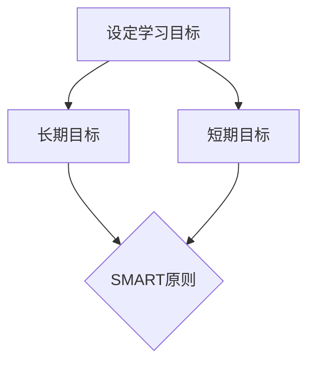

##### 2.1.2 制定学习计划

一旦明确了学习目标，管理者需要制定详细的学习计划。这个计划应该包括学习的时间表、学习的内容、学习的方法和评估标准。例如，如果目标是在一年内掌握数据分析技能，计划可能包括每周阅读两章相关书籍、每月参加一次在线数据分析课程、每季度完成一个小数据分析项目，并每半年进行一次自我评估。

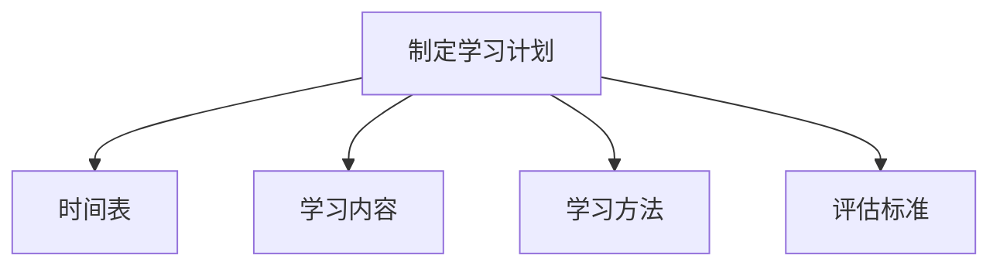

##### 2.1.3 评估学习成果

定期评估学习成果对于确保学习目标的实现至关重要。管理者可以通过多种方式进行评估，如自我评估、同事评估和项目成果评估。评估结果可以帮助管理者了解自己的学习进度，发现问题并调整学习计划。

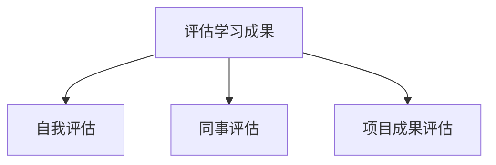

#### 2.2 学习资源的选择与利用

选择和利用合适的学习资源是终身学习的重要一环。以下是一些有效的学习资源选择和利用策略：

##### 2.2.1 书籍与文献

书籍和文献是终身学习的重要资源。管理者可以通过以下方法选择和利用书籍与文献：

1. **选择合适的书籍**：选择与自己学习目标相关的书籍，特别是那些被广泛推荐的经典著作和最新的研究文献。
2. **制定阅读计划**：制定一个系统的阅读计划，确保能够按时完成阅读任务。
3. **做笔记和总结**：在阅读过程中做笔记，并定期进行总结，加深对知识的理解和记忆。

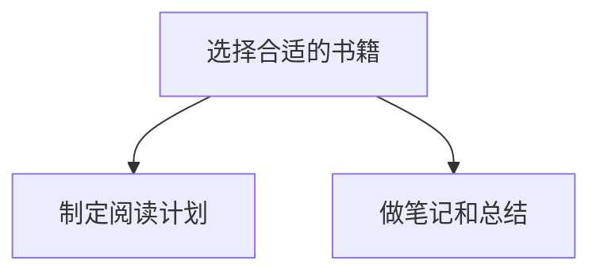

##### 2.2.2 在线课程与讲座

在线课程和讲座提供了灵活的学习方式，管理者可以充分利用这些资源：

1. **选择高质量课程**：选择那些具有良好口碑和评价的课程，特别是那些由行业专家或知名大学提供的课程。
2. **合理安排学习时间**：在线学习允许管理者根据个人时间表进行学习，因此需要合理安排学习时间，避免拖延。
3. **互动和参与**：积极参与课程讨论和互动，与其他学习者交流和分享经验。

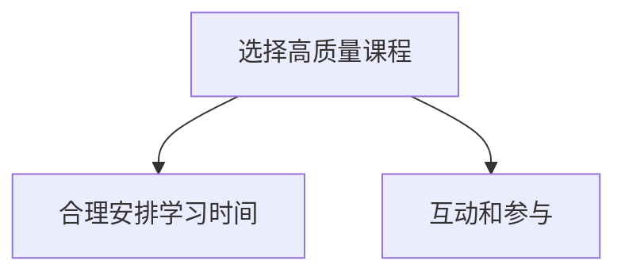

##### 2.2.3 专业社群与论坛

专业社群和论坛提供了与同行交流和学习的机会：

1. **加入专业社群**：加入与自己领域相关的专业社群，如行业协会、专业论坛等，这些社群可以提供最新的行业动态和丰富的学习资源。
2. **积极参与讨论**：在社群中积极参与讨论，提问和回答问题，这有助于扩展知识视野和提升专业技能。
3. **分享经验与知识**：在社群中分享自己的经验和知识，这不仅可以帮助他人，也可以加深自己的理解和记忆。

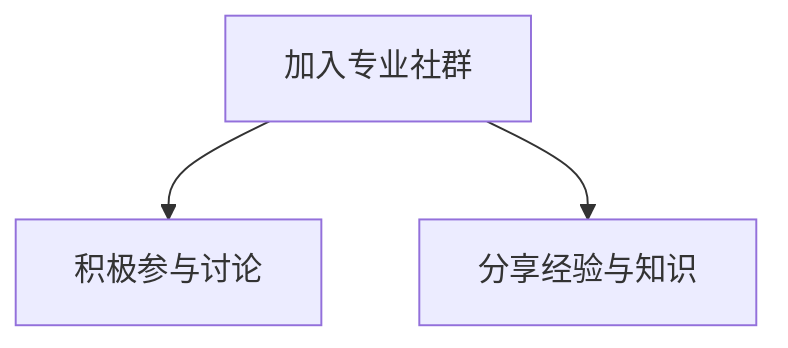

#### 2.3 学习方式的多样化

多样化学习方式可以提高学习的效率和质量。以下是一些有效的学习方式：

##### 2.3.1 自我学习

自我学习是终身学习的基础，管理者可以通过以下方法进行自我学习：

1. **阅读**：阅读书籍、文章和研究报告，以获取新的知识和见解。
2. **实践**：通过实际操作和应用所学知识，加深对知识的理解和记忆。
3. **反思**：在学习过程中进行反思，思考所学知识的实际应用和价值。

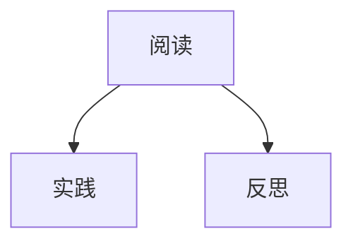

##### 2.3.2 团队学习

团队学习可以促进知识共享和团队协作，管理者可以通过以下方法进行团队学习：

1. **组织学习会议**：定期组织学习会议，让团队成员分享知识和经验。
2. **小组讨论**：通过小组讨论，促进团队成员之间的交流和互动。
3. **共同项目**：通过共同项目，让团队成员在实践中学习和成长。

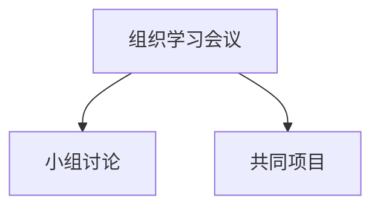

##### 2.3.3 案例研究

案例研究是一种实践性很强的学习方式，管理者可以通过以下方法进行案例研究：

1. **选择典型案例**：选择具有代表性的典型案例，这些案例可以是行业内的成功案例，也可以是失败案例。
2. **分析案例**：通过对案例进行分析，找出其中的关键因素和成功经验或教训。
3. **应用案例**：将案例中的经验应用到实际工作中，提高解决问题的能力。

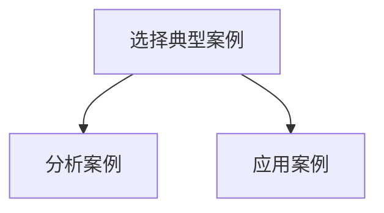

##### 2.3.4 实践训练

实践训练是一种将理论知识转化为实践能力的有效方式，管理者可以通过以下方法进行实践训练：

1. **模拟训练**：通过模拟实际工作场景，进行实践操作和决策训练。
2. **项目实战**：参与实际项目，从实践中学习和成长。
3. **反馈与改进**：通过反馈和改进，不断提高实践能力。

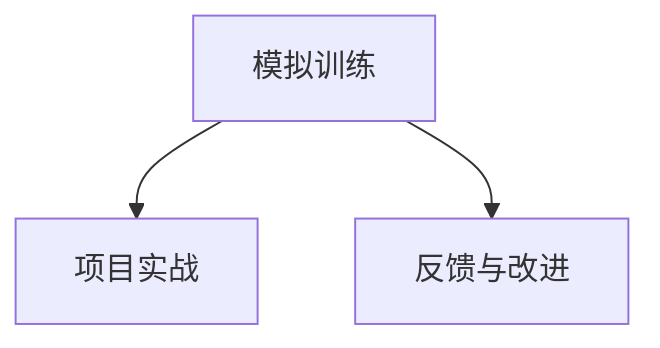

#### 2.4 技术辅助学习

现代技术的发展为终身学习提供了新的工具和方法，管理者可以通过以下技术进行辅助学习：

##### 2.4.1 学习工具与平台

1. **在线学习平台**：如Coursera、edX、Udemy等，提供丰富的在线课程资源。
2. **知识管理系统**：如Confluence、Notion等，帮助管理者整理和共享知识。
3. **学习工具**：如Anki、Quizlet等，帮助管理者进行知识记忆和复习。

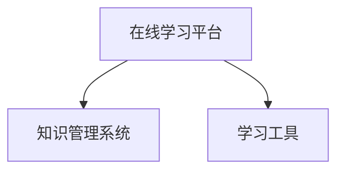

##### 2.4.2 数据分析与挖掘

1. **数据收集**：通过数据分析工具，收集和管理学习数据，如学习时间、学习效果等。
2. **数据挖掘**：通过数据挖掘技术，分析学习数据，找出学习中的问题和改进点。
3. **个性化推荐**：根据学习数据分析，为管理者提供个性化的学习推荐。

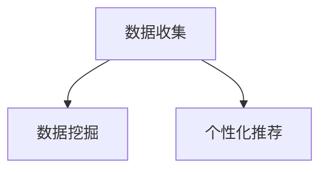

##### 2.4.3 人工智能辅助学习

1. **智能辅导**：利用人工智能技术，为管理者提供个性化的学习辅导和指导。
2. **智能问答**：通过智能问答系统，帮助管理者快速解答学习中的问题。
3. **智能模拟**：利用人工智能技术，创建模拟学习场景，提高学习效果。

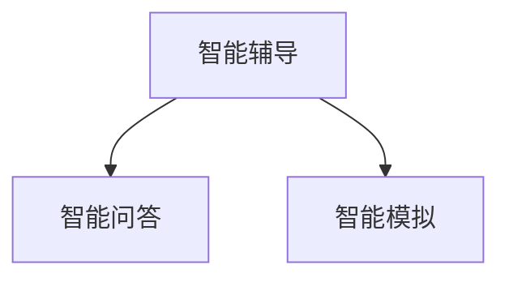

#### 2.5 管理者学习技能培养

为了有效地进行终身学习，管理者需要培养以下学习技能：

##### 2.5.1 信息筛选与整合能力

1. **信息筛选**：在大量信息中筛选出有价值的信息，避免被冗余信息所干扰。
2. **信息整合**：将不同来源的信息进行整合，形成自己的知识体系。

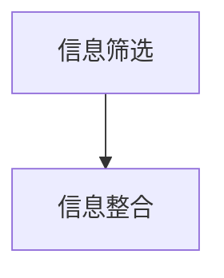

##### 2.5.2 沟通与合作能力

1. **有效沟通**：提高沟通技巧，确保信息的准确传达和有效理解。
2. **团队合作**：培养团队合作精神，提高团队协作效率。

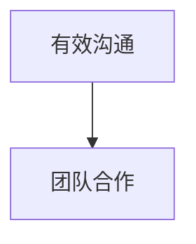

##### 2.5.3 创新与批判性思维

1. **创新思维**：培养创新思维，敢于尝试新的方法和理念。
2. **批判性思维**：培养批判性思维，对现有的知识和观点进行客观评价。

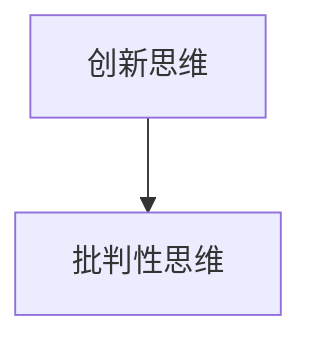

#### 2.6 终身学习的习惯养成

##### 2.6.1 定期学习与反思

1. **定期学习**：制定定期学习计划，确保学习活动持续进行。
2. **反思总结**：定期反思学习成果和过程，找出问题并制定改进计划。

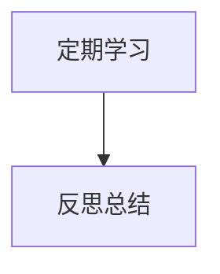

##### 2.6.2 设立学习目标

1. **明确目标**：设立清晰的学习目标，确保学习有方向和动力。
2. **制定计划**：根据学习目标，制定详细的实施计划。

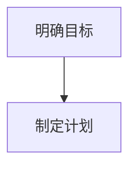

##### 2.6.3 坚持与实践

1. **坚持学习**：养成坚持学习的习惯，不断积累知识和经验。
2. **实践应用**：将所学知识应用于实际工作中，提高实践能力。

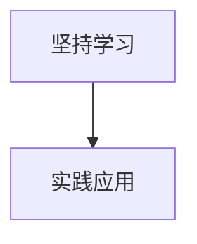

#### 2.7 组织内部的终身学习支持

为了推动终身学习，组织需要提供必要的支持和资源，以下是一些具体的策略：

##### 2.7.1 学习激励机制

1. **奖励制度**：建立奖励制度，对积极参与学习并取得成果的员工进行奖励，激励员工持续学习。
2. **晋升机制**：将学习成果纳入晋升考核，鼓励员工不断提升自己。

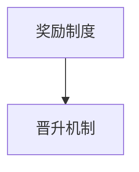

##### 2.7.2 培训与发展计划

1. **培训计划**：制定系统的培训计划，为员工提供多样化的培训机会。
2. **职业发展规划**：为员工制定职业发展规划，明确职业发展路径和目标。

```mermaid
graph TD
A[培训计划] --> B[职业发展规划]
```

##### 2.7.3 建立学习文化

1. **学习氛围**：营造积极的学习氛围，鼓励员工积极参与学习。
2. **知识共享**：建立知识共享平台，鼓励员工分享知识和经验。
3. **创新环境**：提供创新环境，鼓励员工勇于尝试和创新。

```mermaid
graph TD
A[学习氛围] --> B[知识共享]
A --> C[创新环境]
```

### 第三部分：终身学习案例分析

在本部分中，我们将通过国际知名企业和我国优秀企业的案例分析，探讨终身学习在实践中的应用和成效。

#### 3.1 国际知名企业终身学习实践

##### 3.1.1 苹果公司

苹果公司作为全球科技行业的领军企业，始终重视员工的终身学习。以下是苹果公司在终身学习方面的几个实践案例：

1. **内部培训项目**：苹果公司设有专门的培训部门，为员工提供涵盖技术、管理、创新等多个领域的内部培训项目。这些培训项目不仅有助于员工提升专业技能，还能激发他们的创新思维。

2. **员工自学支持**：苹果公司鼓励员工在工作中自主学习，并提供丰富的学习资源，如在线课程、专业书籍和订阅服务。此外，苹果公司还设有自学基金，支持员工参加外部培训和学习。

3. **导师制度**：苹果公司实行导师制度，新员工在入职时会分配一位经验丰富的导师，帮助其快速融入团队并提升技能。导师不仅指导新员工的工作，还会分享自己的学习和成长经验。

案例分析显示，苹果公司的终身学习实践极大地提升了员工的综合素质和创新能力，为企业的发展提供了强有力的支持。

##### 3.1.2 微软公司

微软公司在推动终身学习方面也有许多成功的实践。以下是一些具体案例：

1. **微软学习平台**：微软公司开发了内部学习平台，为员工提供丰富的学习资源，包括在线课程、电子书籍、技术文档和社区讨论。员工可以根据自己的兴趣和职业发展需求，自主选择学习内容。

2. **专业认证计划**：微软公司鼓励员工参加各种专业认证考试，如微软认证专家（MCSE）和项目管理专业人士（PMP）等。公司为通过认证的员工提供奖励，并认可其在工作中的贡献。

3. **员工创新项目**：微软公司设有员工创新项目，鼓励员工提出创新想法并参与实际项目。公司为这些项目提供资金和技术支持，以激发员工的创新潜力。

微软公司的终身学习实践有效提升了员工的职业能力和创新能力，推动了企业的持续发展。

##### 3.1.3 谷歌公司

谷歌公司以其开放和创新的氛围而闻名，终身学习也是其企业文化的重要组成部分。以下是一些具体案例：

1. **谷歌大学**：谷歌设有谷歌大学，为员工提供多样化的学习课程，包括编程、产品管理、市场营销等。这些课程不仅涵盖专业领域的知识，还包括软技能的培养。

2. **内部培训项目**：谷歌公司定期举办内部培训项目，如“谷歌领导力发展计划”，帮助员工提升领导能力和管理技能。这些培训项目不仅包括理论课程，还包括实践工作坊和案例分析。

3. **员工发展基金**：谷歌公司设有员工发展基金，支持员工参加外部培训和会议。员工可以利用这些资金参加行业会议、研讨会和学习班，以扩展自己的知识和视野。

谷歌公司的终身学习实践极大地提升了员工的综合素质和创新能力，为企业的发展和创新提供了源源不断的动力。

#### 3.2 我国企业终身学习案例分析

在我国，也有许多企业通过实施终身学习策略，取得了显著的成效。以下是一些典型案例：

##### 3.2.1 华为技术有限公司

华为作为全球领先的通信技术解决方案提供商，高度重视员工的终身学习。以下是一些具体案例：

1. **华为大学**：华为设有华为大学，为员工提供系统的培训课程，包括技术、管理、领导力等多个领域。华为大学不仅提供在线课程，还举办实地培训和实践项目，帮助员工全面提升。

2. **员工发展计划**：华为公司为员工制定个性化的职业发展计划，根据员工的兴趣和潜力，提供针对性的培训和发展机会。这些计划包括内部调岗、外部培训和进修等。

3. **创新激励机制**：华为公司鼓励员工创新，并设有创新基金，支持员工提出和创新项目。公司通过内部创新竞赛和外部合作项目，激发员工的创新热情。

华为公司的终身学习实践不仅提升了员工的素质和能力，还推动了公司的创新和持续发展。

##### 3.2.2 阿里巴巴集团

阿里巴巴集团作为全球领先的互联网公司，同样重视员工的终身学习。以下是一些具体案例：

1. **阿里学院**：阿里巴巴设有阿里学院，为员工提供多样化的学习资源，包括在线课程、实战演练和行业交流。阿里学院还定期举办内部培训和外部合作项目，帮助员工提升专业能力和综合素质。

2. **导师制度**：阿里巴巴实行导师制度，新员工入职时会分配一位经验丰富的导师，帮助其快速融入团队并提升技能。导师不仅提供工作指导，还会分享自己的学习和成长经验。

3. **员工发展基金**：阿里巴巴公司设有员工发展基金，支持员工参加外部培训和行业会议。员工可以利用这些资金扩展自己的知识和视野。

阿里巴巴集团的终身学习实践为员工提供了广阔的发展空间，提升了公司的创新能力和竞争力。

##### 3.2.3 腾讯控股有限公司

腾讯公司作为我国领先的互联网企业，同样在终身学习方面取得了显著成效。以下是一些具体案例：

1. **腾讯学院**：腾讯设有腾讯学院，为员工提供多样化的学习资源和培训机会。腾讯学院不仅提供在线课程，还举办实地培训和行业研讨会，帮助员工提升专业技能和管理能力。

2. **员工发展计划**：腾讯公司为员工制定个性化的职业发展计划，根据员工的兴趣和潜力，提供针对性的培训和发展机会。这些计划包括内部调岗、外部培训和进修等。

3. **创新激励机制**：腾讯公司鼓励员工创新，并设有创新基金，支持员工提出和创新项目。公司通过内部创新竞赛和外部合作项目，激发员工的创新热情。

腾讯公司的终身学习实践不仅提升了员工的素质和能力，还推动了公司的创新和持续发展。

#### 3.3 终身学习成功案例分享

除了上述企业外，还有许多个人和企业通过实施终身学习策略，取得了显著的成效。以下是一些成功案例的分享：

##### 3.3.1 个人职业成长

张三，一位年轻的互联网创业者，通过不断学习和实践，在短短几年内成为行业内的佼佼者。他利用在线课程和书籍不断充实自己的知识体系，并通过实践项目提升自己的技能。张三的成功经验告诉我们，终身学习是个人职业成长的关键。

##### 3.3.2 企业转型发展

李四所在的公司曾面临行业变革的巨大压力。为了应对这一挑战，李四带领团队进行了一系列的终身学习活动，包括组织内部培训和外部合作项目。通过这些学习活动，公司成功实现了转型，并在市场中取得了竞争优势。

##### 3.3.3 创新项目实践

王五是一位技术爱好者，他利用业余时间进行创新项目实践。通过不断学习和实践，王五开发出了一款受到市场欢迎的软件产品。他的成功经验表明，终身学习是推动创新和创业的重要动力。

### 第四部分：终身学习的前沿趋势与发展方向

在本部分中，我们将探讨终身学习的前沿趋势和发展方向，以及这些趋势对管理者学习和组织发展的影响。

#### 4.1 新技术对终身学习的影响

随着科技的不断发展，新技术对终身学习产生了深远的影响。以下是一些关键趋势：

##### 4.1.1 人工智能

人工智能（AI）技术的快速发展为终身学习带来了新的机遇。通过AI技术，学习平台可以更好地了解用户的学习习惯和需求，提供个性化的学习推荐。例如，AI驱动的学习系统能够分析用户的学习数据，推荐最适合的学习路径和资源。

1. **个性化学习推荐**：AI技术可以根据用户的学习历史和偏好，推荐个性化的学习内容，提高学习效果。
2. **智能辅导系统**：AI辅导系统可以实时回答用户在学习中遇到的问题，提供即时的学习支持。
3. **自适应学习平台**：自适应学习平台能够根据用户的学习进度和表现，动态调整学习内容和难度，实现真正的个性化学习。

```mermaid
graph TD
A[个性化学习推荐] --> B[智能辅导系统]
A --> C[自适应学习平台]
```

##### 4.1.2 大数据

大数据技术的应用为终身学习提供了丰富的数据支持和分析能力。通过大数据分析，学习平台可以了解用户的学习行为和效果，优化学习过程。例如，大数据技术可以帮助学习平台发现用户的学习痛点，从而改进课程设计和教学方法。

1. **学习行为分析**：大数据技术可以分析用户的学习行为，了解学习效果和效率，为教学提供数据支持。
2. **学习效果评估**：通过大数据分析，学习平台可以评估学习效果，优化教学方法和课程设计。
3. **学习路径优化**：大数据技术可以帮助学习平台根据用户的学习表现，推荐最佳的学习路径和资源。

```mermaid
graph TD
A[学习行为分析] --> B[学习效果评估]
A --> C[学习路径优化]
```

##### 4.1.3 虚拟现实（VR）和增强现实（AR）

虚拟现实和增强现实技术的应用为终身学习提供了沉浸式的学习体验。通过VR和AR技术，学习者可以身临其境地参与学习活动，提高学习兴趣和效果。例如，VR技术可以模拟真实的职场环境，让学习者进行实践操作和决策训练。

1. **沉浸式学习体验**：VR和AR技术可以创造沉浸式的学习环境，提高学习兴趣和效果。
2. **实践操作训练**：通过VR和AR技术，学习者可以进行实践操作和模拟训练，提高实际操作能力。
3. **跨学科学习**：VR和AR技术可以结合多种学科知识，提供跨学科的综合学习体验。

```mermaid
graph TD
A[沉浸式学习体验] --> B[实践操作训练]
A --> C[跨学科学习]
```

#### 4.2 终身学习与终身教育

##### 4.2.1 终身教育与终身学习的关系

终身教育与终身学习密切相关，但两者在概念和内涵上有所不同。终身教育是指在整个生命中不断学习和训练，以获取知识、技能和态度。而终身学习则更强调个人主动参与学习的过程，是一种自我驱动型的学习方式。

1. **概念区别**：终身教育强调的是整个生命周期的学习，而终身学习更关注学习的过程和效果。
2. **目标差异**：终身教育的目标是培养具有全面素质的人才，而终身学习的目标是提升个人的专业技能和综合素质。
3. **实施方式**：终身教育通常由教育机构组织实施，而终身学习更多地依赖于个人自主学习和实践。

##### 4.2.2 终身教育体系的构建

为了实现终身学习，需要建立完善的终身教育体系，包括教育机构、学习资源、支持系统和政策保障。以下是一些关键要素：

1. **教育机构**：建立多样化的教育机构，包括大学、职业院校、培训机构等，为终身学习提供多样化的学习选择。
2. **学习资源**：提供丰富的学习资源，包括书籍、课程、在线学习平台等，满足不同学习者的需求。
3. **支持系统**：建立支持系统，包括学习辅导、心理支持、职业规划等，为终身学习提供全方位的支持。
4. **政策保障**：制定相关政策，鼓励和支持终身学习，提供资金、时间和政策保障。

##### 4.2.3 终身教育的发展趋势

终身教育在全球范围内正快速发展，以下是几个重要趋势：

1. **在线教育的普及**：随着互联网技术的发展，在线教育成为终身教育的重要载体，学习者可以通过网络获取全球范围内的优质教育资源。
2. **个性化学习的发展**：终身教育越来越注重个性化学习，通过大数据和人工智能技术，实现个性化教学和学习路径。
3. **跨学科整合**：终身教育逐渐实现跨学科整合，培养具有综合能力和创新精神的人才。

#### 4.3 全球终身学习政策与战略

##### 4.3.1 OECD终身学习战略

经济合作与发展组织（OECD）提出了《终身学习战略》，强调终身学习对个人、社会和经济的重要性。该战略提出了以下关键目标：

1. **提高教育质量**：通过改革教育体系和提高教育质量，实现终身学习的目标。
2. **促进公平**：确保所有人都能获得公平的终身学习机会，减少教育不平等。
3. **提高就业能力**：通过终身学习，提高个人的就业能力和职业发展。

##### 4.3.2 欧盟终身学习框架

欧盟提出了《终身学习框架》，旨在建立一个支持终身学习的教育体系。该框架提出了以下关键措施：

1. **终身学习计划**：制定国家级和区域级的终身学习计划，确保资源的有效配置。
2. **学习支持服务**：提供学习支持服务，包括职业咨询、学习辅导和心理支持等。
3. **跨部门合作**：促进政府部门、教育机构和私营部门之间的合作，共同推动终身学习。

##### 4.3.3 我国终身学习政策

我国政府高度重视终身学习，提出了一系列政策和措施，推动终身学习的发展。以下是一些关键政策：

1. **《国家中长期教育改革和发展规划纲要（2010-2020年）》**：明确了建立终身教育体系的任务，提出了终身学习的发展目标和政策措施。
2. **《关于推进终身学习的意见》**：提出了推进终身学习的主要任务和重点工作，包括加强学习资源建设、完善终身学习制度、提高学习者参与度等。
3. **《职业教育法》**：明确了职业教育在终身教育体系中的地位和作用，提出了职业教育的发展目标和政策措施。

#### 4.4 未来终身学习的挑战与机遇

##### 4.4.1 技术进步与教育变革

技术进步为终身学习带来了新的机遇和挑战。随着人工智能、大数据、虚拟现实等新技术的广泛应用，终身学习的方式、内容和形式都将发生深刻变革。例如，AI技术可以实现个性化学习，大数据可以提供精准的学习评估，VR技术可以创造沉浸式的学习体验。

1. **个性化学习**：技术进步使得个性化学习成为可能，学习者可以根据自己的需求和兴趣，选择合适的学习内容和方式。
2. **智慧教育**：智慧教育利用大数据和人工智能技术，实现教学过程的智能化和管理服务的便捷化。
3. **教育公平**：技术进步有助于缩小教育差距，提高教育公平，使更多人能够享受到优质教育资源。

##### 4.4.2 学习资源分配与公平

尽管技术进步为终身学习提供了丰富的资源，但学习资源的分配仍然存在不平等问题。一些地区和群体可能难以获得优质的学习资源，导致教育机会的不平等。因此，确保学习资源的公平分配是未来终身学习的重要挑战。

1. **教育资源均衡**：通过政策和措施，推动教育资源的均衡分配，确保每个学习者都能获得公平的学习机会。
2. **在线教育普及**：推动在线教育的普及，使更多学习者能够通过网络获取优质教育资源。
3. **社区教育**：加强社区教育建设，提供多样化的学习资源和机会，满足社区居民的学习需求。

##### 4.4.3 终身学习的可持续发展

终身学习的可持续发展是确保其长期有效性的关键。为了实现可持续发展，需要建立完善的终身学习体系，包括政策保障、资源投入、组织支持和制度创新。

1. **政策保障**：制定和完善相关政策，为终身学习提供法律保障和政策支持。
2. **资源投入**：加大资源投入，提高教育经费的使用效率，确保终身学习资源的充足。
3. **组织支持**：建立支持系统，包括教育机构、社会组织和企业等，共同推动终身学习的发展。
4. **制度创新**：通过制度创新，激发学习者的积极性，提高终身学习的参与度和效果。

### 附录

#### 附录A：终身学习资源推荐

##### A.1 主要学习平台推荐

1. **Coursera**：提供全球顶尖大学的在线课程，涵盖多个学科领域。
2. **edX**：由哈佛大学和麻省理工学院共同创立，提供高质量的课程资源。
3. **Udemy**：提供各种技能和兴趣课程，包括编程、设计、语言等。

##### A.2 经典学习书籍推荐

1. **《深度学习》**：Ian Goodfellow、Yoshua Bengio和Aaron Courville 著。
2. **《创新者的窘境》**：克莱顿·克里斯坦森 著。
3. **《五项管理》**：彼得·德鲁克 著。

##### A.3 知名学习社群推荐

1. **GitHub**：全球最大的代码托管平台，提供丰富的学习资源和交流机会。
2. **Stack Overflow**：编程问答社区，帮助开发者解决编程问题。
3. **LinkedIn Learning**：提供各种职业技能培训课程，帮助职业人士提升技能。

#### 附录B：终身学习相关术语解释

##### B.1 关键术语解释

1. **终身学习**：指一个人在其整个生命周期中，通过不断的学习和训练，获取知识、技能和态度的过程。
2. **学习型组织**：指组织中的每个成员都积极参与学习，通过学习来提升个人和组织的绩效。
3. **在线学习**：指通过互联网进行的学习活动，学习者可以在任何时间、任何地点进行学习。

##### B.2 衍生术语解释

1. **自适应学习**：指学习系统能够根据学习者的表现和需求，动态调整学习内容和难度，实现个性化的学习体验。
2. **智慧教育**：指利用人工智能、大数据等新技术，实现教育过程的智能化和管理服务的便捷化。
3. **混合学习**：指将在线学习和面对面教学相结合，提供多样化的学习方式。

