                 

### 线性代数导引：实二次型

> **关键词：线性代数、实二次型、标准型、规范型、矩阵表示、正定性质**

> **摘要：**
> 本文旨在为读者提供一份系统而深入的线性代数导引，特别是对实二次型的讨论。通过详细的定义、性质、算法和应用，本文旨在帮助读者理解线性代数的基础概念，掌握实二次型的理论框架，并了解其在实际问题中的应用。文章将分为三个主要部分：第一部分介绍线性代数的基础知识，包括线性空间、线性映射、矩阵理论和行列式；第二部分重点讨论实二次型，从基本概念到正定性质的深入探讨；第三部分介绍线性代数在多个领域的广泛应用，包括物理学、计算机科学、经济学等。通过本文的阅读，读者将能够全面掌握线性代数的核心概念，并了解其在实际中的应用价值。

----------------------------------------------------------------

### 《线性代数导引：实二次型》目录大纲详细说明

#### 第一部分：线性代数基础

**第1章：线性代数概述**

- **1.1 线性代数的起源与历史**
  - **核心概念与联系：** 线性代数的起源可以追溯到19世纪末，由英国数学家凯莱和德国数学家格拉斯曼等人奠基。线性代数的发展伴随着矩阵理论、线性空间、线性映射等核心概念的逐步完善。
  - **Mermaid流程图：**
    ```mermaid
    graph TD
    A[19世纪末] --> B[凯莱]
    A --> C[格拉斯曼]
    B --> D[矩阵理论]
    C --> E[线性空间]
    E --> F[线性映射]
    ```

- **1.2 线性代数的基本概念**
  - **核心概念与联系：** 线性代数中的基本概念包括矩阵、向量、线性组合等。矩阵是数据的多维表示，向量可以看作是一维的矩阵，线性组合是通过标量乘法和向量加法得到的新向量。
  - **Mermaid流程图：**
    ```mermaid
    graph TD
    A[矩阵] --> B[数据表示]
    A --> C[运算]
    B --> D[向量]
    D --> E[线性组合]
    ```

- **1.3 线性代数的应用领域**
  - **核心概念与联系：** 线性代数在多个领域有着广泛的应用，包括物理学、工程学、计算机科学、经济学等。在物理学中，线性代数用于描述物理系统中的能量、动量和波动；在工程学中，线性代数用于电路分析、信号处理、控制理论；在计算机科学中，线性代数用于算法设计、数据结构、图像处理；在经济学中，线性代数用于线性规划和市场分析。
  - **Mermaid流程图：**
    ```mermaid
    graph TD
    A[物理学] --> B[能量、动量]
    A --> C[工程学]
    C --> D[电路、信号]
    C --> E[控制理论]
    B --> F[计算机科学]
    F --> G[算法、数据结构]
    F --> H[图像处理]
    B --> I[经济学]
    I --> J[线性规划]
    ```

**第2章：线性空间**

- **2.1 线性空间的定义与性质**
  - **核心概念与联系：** 线性空间是一个集合，加上两种运算（加法和标量乘法）构成。线性空间的运算满足结合律、交换律和分配律等性质。
  - **Mermaid流程图：**
    ```mermaid
    graph TD
    A[线性空间] --> B[集合+运算]
    B --> C[向量加法]
    C --> D[结合律]
    C --> E[交换律]
    B --> F[标量乘法]
    F --> G[结合律]
    F --> H[分配律]
    ```

- **2.2 线性空间的运算**
  - **核心概念与联系：** 线性空间的运算包括向量加法和标量乘法。向量加法满足结合律、交换律和分配律，标量乘法同样满足这些性质。
  - **Mermaid流程图：**
    ```mermaid
    graph TD
    A[向量加法] --> B[结合律]
    A --> C[交换律]
    B --> D[标量乘法]
    D --> E[结合律]
    D --> F[分配律]
    ```

- **2.3 线性空间的基与维**
  - **核心概念与联系：** 线性空间的基是一个向量集合，可以线性表示空间中的任意向量。线性空间的维是基的个数。
  - **Mermaid流程图：**
    ```mermaid
    graph TD
    A[基] --> B[线性表示]
    B --> C[维]
    C --> D[基的个数]
    ```

**第3章：线性映射**

- **3.1 线性映射的基本概念**
  - **核心概念与联系：** 线性映射是一个线性空间到另一个线性空间的映射，其像空间和原空间是重要的概念。
  - **Mermaid流程图：**
    ```mermaid
    graph TD
    A[线性映射] --> B[原空间]
    A --> C[像空间]
    B --> D[原空间元素]
    C --> E[像空间元素]
    ```

- **3.2 线性映射的运算**
  - **核心概念与联系：** 线性映射的运算包括加法和标量乘法，满足结合律、交换律和分配律。
  - **Mermaid流程图：**
    ```mermaid
    graph TD
    A[加法] --> B[结合律]
    A --> C[交换律]
    B --> D[标量乘法]
    D --> E[结合律]
    D --> F[分配律]
    ```

- **3.3 线性映射的性质**
  - **核心概念与联系：** 线性映射具有线性无关和线性相关等性质，这些性质对于理解线性映射的结构和作用至关重要。
  - **Mermaid流程图：**
    ```mermaid
    graph TD
    A[线性无关] --> B[性质1]
    A --> C[性质2]
    B --> D[线性相关]
    D --> E[性质3]
    ```

**第4章：矩阵理论**

- **4.1 矩阵的基本概念**
  - **核心概念与联系：** 矩阵是由数字组成的矩形阵列，其行和列的数目决定了矩阵的维度。
  - **Mermaid流程图：**
    ```mermaid
    graph TD
    A[矩阵] --> B[行]
    A --> C[列]
    B --> D[维]
    C --> E[维]
    ```

- **4.2 矩阵的运算**
  - **核心概念与联系：** 矩阵的运算包括矩阵加法、矩阵乘法、转置和逆矩阵。
  - **Mermaid流程图：**
    ```mermaid
    graph TD
    A[加法] --> B[结合律]
    A --> C[交换律]
    B --> D[乘法]
    D --> E[转置]
    D --> F[逆矩阵]
    ```

- **4.3 矩阵的性质**
  - **核心概念与联系：** 矩阵的秩、行列式、特征值和特征向量是矩阵的重要性质。
  - **Mermaid流程图：**
    ```mermaid
    graph TD
    A[秩] --> B[性质1]
    A --> C[行列式]
    C --> D[性质2]
    C --> E[特征值]
    E --> F[特征向量]
    ```

**第5章：行列式**

- **5.1 行列式的定义与性质**
  - **核心概念与联系：** 行列式是矩阵的一种特殊的数值，具有线性性质、逆矩阵的行列式性质和行列式的运算规则。
  - **Mermaid流程图：**
    ```mermaid
    graph TD
    A[行列式] --> B[定义]
    B --> C[性质]
    C --> D[线性性质]
    C --> E[逆矩阵]
    C --> F[运算规则]
    ```

- **5.2 行列式的运算**
  - **核心概念与联系：** 行列式的运算包括拉普拉斯展开和行列式公式。
  - **伪代码：**
    ```python
    def determinant(matrix):
        if not is_square_matrix(matrix):
            return "Not a square matrix"
        
        det = matrix[0][0]
        
        for i in range(len(matrix)):
            for j in range(len(matrix[0])):
                sub_matrix = get_sub_matrix(matrix, 0, j)
                det += ((-1) ** (i + j)) * matrix[0][j] * determinant(sub_matrix)
        
        return det
    ```

- **5.3 行列式的应用**
  - **核心概念与联系：** 行列式在求解线性方程组和判断矩阵可逆性中有着重要的应用。
  - **举例说明：**
    - 求解线性方程组：使用高斯消元法，其中行列式用于判断方程组是否有唯一解。
    - 矩阵可逆性判断：若矩阵的行列式不为零，则矩阵可逆。

**第6章：实二次型**

- **6.1 实二次型的基本概念**
  - **核心概念与联系：** 实二次型是一组变量通过二次项组成的式子，可以通过矩阵表示。
  - **Mermaid流程图：**
    ```mermaid
    graph TD
    A[实二次型] --> B[二次项]
    A --> C[变量]
    ```

- **6.2 实二次型的性质**
  - **核心概念与联系：** 实二次型具有对称性和半正定性等性质。
  - **Mermaid流程图：**
    ```mermaid
    graph TD
    A[对称性] --> B[性质1]
    A --> C[半正定性]
    C --> D[性质2]
    ```

- **6.3 实二次型的表示方法**
  - **核心概念与联系：** 实二次型可以通过矩阵表示，这种表示方法对于分析和计算具有重要意义。
  - **Mermaid流程图：**
    ```mermaid
    graph TD
    A[矩阵表示] --> B[二次项矩阵]
    A --> C[变量矩阵]
    ```

**第7章：标准型与规范型**

- **7.1 标准型的定义与性质**
  - **核心概念与联系：** 标准型是通过线性变换将实二次型化为一个标准形式，其具有简洁和易于分析的特点。
  - **Mermaid流程图：**
    ```mermaid
    graph TD
    A[标准型] --> B[线性变换]
    A --> C[标准形式]
    ```

- **7.2 标准型的化简方法**
  - **核心概念与联系：** 标准型的化简方法包括主轴变换和施密特正交化，这些方法可以将实二次型化为标准型。
  - **伪代码：**
    ```python
    def simplify_quadratic_form(qf_matrix):
        eigenvectors, eigenvalues = eigen(qf_matrix)
        transformed_matrix = eigenvectors @ qf_matrix @ eigenvectors.T
        
        standard_form = transformed_matrix.trace()
        
        return standard_form
    ```

- **7.3 规范型的定义与性质**
  - **核心概念与联系：** 规范型是通过进一步变换，将实二次型化为一个更简单的形式，其对于分析二次型的性质非常重要。
  - **Mermaid流程图：**
    ```mermaid
    graph TD
    A[规范型] --> B[进一步变换]
    A --> C[简单形式]
    ```

**第8章：二次型的正定性质**

- **8.1 正定二次型的定义**
  - **核心概念与联系：** 正定二次型是一个实二次型，其对应的矩阵是正定的，即矩阵的特征值全为正。
  - **Mermaid流程图：**
    ```mermaid
    graph TD
    A[正定二次型] --> B[矩阵正定]
    ```

- **8.2 正定二次型的判定方法**
  - **核心概念与联系：** 正定二次型的判定方法包括检查矩阵的特征值是否全为正。
  - **伪代码：**
    ```python
    def is_positive_definite(matrix):
        eigenvalues = eigenvalues(matrix)
        return all(e > 0 for e in eigenvalues)
    ```

- **8.3 正定二次型的应用**
  - **核心概念与联系：** 正定二次型在优化问题中有着广泛的应用，如最小二乘法。
  - **举例说明：**
    - 最优化问题：通过正定二次型判定最优性。

**第9章：二次型的矩阵表示**

- **9.1 二次型矩阵的基本概念**
  - **核心概念与联系：** 二次型矩阵是一个实二次型对应的矩阵，其反映了二次型的结构。
  - **Mermaid流程图：**
    ```mermaid
    graph TD
    A[二次型矩阵] --> B[实二次型]
    ```

- **9.2 二次型矩阵的运算**
  - **核心概念与联系：** 二次型矩阵的运算包括加法、乘法和转置等。
  - **Mermaid流程图：**
    ```mermaid
    graph TD
    A[加法] --> B[结合律]
    A --> C[交换律]
    B --> D[乘法]
    D --> E[转置]
    ```

- **9.3 二次型矩阵的性质**
  - **核心概念与联系：** 二次型矩阵具有秩、行列式和特征值等性质。
  - **Mermaid流程图：**
    ```mermaid
    graph TD
    A[秩] --> B[性质1]
    A --> C[行列式]
    C --> D[性质2]
    C --> E[特征值]
    ```

**第10章：二次型的优化问题**

- **10.1 二次型优化的基本概念**
  - **核心概念与联系：** 二次型优化是寻找使得二次型达到最大或最小值的变量值。
  - **Mermaid流程图：**
    ```mermaid
    graph TD
    A[二次型优化] --> B[变量值]
    A --> C[最大/最小值]
    ```

- **10.2 二次型优化的方法**
  - **核心概念与联系：** 二次型优化的方法包括拉格朗日乘数法、单纯形法和牛顿法等。
  - **伪代码：**
    ```python
    def quadratic_optimization(qf_matrix, b):
        lambdas = solve_lagrange(qf_matrix, b)
        optimal_value = qf_matrix @ lambdas
        
        return optimal_value
    ```

- **10.3 二次型优化的应用**
  - **核心概念与联系：** 二次型优化在工程优化、机器学习和经济学中有着广泛的应用。
  - **举例说明：**
    - 最小二乘法：在机器学习中的回归分析。

**第11章：线性代数在物理学中的应用**

- **11.1 线性代数在力学中的应用**
  - **核心概念与联系：** 矩阵在描述力学系统中的作用，如描述系统的状态和运动。
  - **Mermaid流程图：**
    ```mermaid
    graph TD
    A[力学系统] --> B[矩阵描述]
    ```

- **11.2 线性代数在电动力学中的应用**
  - **核心概念与联系：** 向量和矩阵在电动力学方程中的作用，如描述电磁场的分布。
  - **Mermaid流程图：**
    ```mermaid
    graph TD
    A[电动力学] --> B[向量矩阵]
    ```

- **11.3 线性代数在量子力学中的应用**
  - **核心概念与联系：** 线性空间和线性映射在量子力学中的作用，如描述量子态和量子跃迁。
  - **Mermaid流程图：**
    ```mermaid
    graph TD
    A[量子力学] --> B[线性空间]
    A --> C[线性映射]
    ```

**第12章：线性代数在计算机科学中的应用**

- **12.1 线性代数在图论中的应用**
  - **核心概念与联系：** 矩阵在图表示中的作用，如邻接矩阵和拉普拉斯矩阵。
  - **Mermaid流程图：**
    ```mermaid
    graph TD
    A[图] --> B[矩阵表示]
    ```

- **12.2 线性代数在数值计算中的应用**
  - **核心概念与联系：** 线性代数在数值方法中的作用，如高斯消元法和LU分解。
  - **Mermaid流程图：**
    ```mermaid
    graph TD
    A[数值计算] --> B[线性代数方法]
    ```

- **12.3 线性代数在机器学习中的应用**
  - **核心概念与联系：** 矩阵和线性映射在机器学习中的作用，如线性回归和主成分分析。
  - **Mermaid流程图：**
    ```mermaid
    graph TD
    A[机器学习] --> B[矩阵线性映射]
    ```

**第13章：线性代数在其他领域中的应用**

- **13.1 线性代数在经济学中的应用**
  - **核心概念与联系：** 线性代数在经济学模型中的作用，如线性规划和市场分析。
  - **Mermaid流程图：**
    ```mermaid
    graph TD
    A[经济学] --> B[线性代数模型]
    ```

- **13.2 线性代数在控制理论中的应用**
  - **核心概念与联系：** 矩阵在控制系统中的作用，如状态空间描述和反馈控制。
  - **Mermaid流程图：**
    ```mermaid
    graph TD
    A[控制系统] --> B[矩阵描述]
    ```

- **13.3 线性代数在信号处理中的应用**
  - **核心概念与联系：** 矩阵在信号处理中的作用，如滤波和变换。
  - **Mermaid流程图：**
    ```mermaid
    graph TD
    A[信号处理] --> B[矩阵变换]
    ```

**附录**

- **附录A：线性代数常用符号表**
  - **符号解释：**
    - $I_n$：$n$阶单位矩阵。
    - $J_n$：$n$阶置换矩阵。
    - $e_i$：第$i$个标准基向量。
    - $A^T$：矩阵$A$的转置。
    - $A^{-1}$：矩阵$A$的逆矩阵。

- **附录B：线性代数常用算法简介**
  - **算法简介：**
    - 高斯消元法：用于求解线性方程组。
    - 迹（Trace）：矩阵对角线元素之和。
    - 特征值与特征向量：描述矩阵的线性变换性质。
    - 主轴变换：将实二次型化为标准型。

- **附录C：线性代数参考书目及资源链接**
  - **参考书目：**
    - 《线性代数及其应用》（David C. Lay）。
    - 《线性代数的几何意义》（Louis H. Kauffman）。
    - 《线性代数入门》（Howard Anton）。

  - **资源链接：**
    - [MIT开放课程](https://ocw.mit.edu/courses/mathematics/18-06-linear-algebra-spring-2010/)。
    - [Khan Academy 线性代数](https://www.khanacademy.org/math/linear-algebra)。
    - [线性代数在线教程](http://www.linear.ups.edu/)。

### 参考文献

- Lay, David C. 《线性代数及其应用》。北京：机械工业出版社，2011。
- Kauffman, Louis H. 《线性代数的几何意义》。北京：清华大学出版社，2013。
- Anton, Howard. 《线性代数入门》。上海：复旦大学出版社，2012。

以上是《线性代数导引：实二次型》的详细目录大纲，涵盖了线性代数的基础知识、实二次型的详细讲解、以及线性代数在各个领域的应用。附录部分提供了常用符号、算法介绍和参考资源，帮助读者更好地理解线性代数。每个章节都包含了核心概念、联系、伪代码和举例说明，使得读者能够全面掌握线性代数的知识。

----------------------------------------------------------------

### 线性代数导引：实二次型

> **关键词：线性代数、实二次型、标准型、规范型、矩阵表示、正定性质**

> **摘要：**
> 本文旨在为读者提供一份系统而深入的线性代数导引，特别是对实二次型的讨论。通过详细的定义、性质、算法和应用，本文旨在帮助读者理解线性代数的基础概念，掌握实二次型的理论框架，并了解其在实际问题中的应用。文章将分为三个主要部分：第一部分介绍线性代数的基础知识，包括线性空间、线性映射、矩阵理论和行列式；第二部分重点讨论实二次型，从基本概念到正定性质的深入探讨；第三部分介绍线性代数在多个领域的广泛应用，包括物理学、计算机科学、经济学等。通过本文的阅读，读者将能够全面掌握线性代数的核心概念，并了解其在实际中的应用价值。

----------------------------------------------------------------

#### 第一部分：线性代数基础

**第1章：线性代数概述**

线性代数是数学中的一个重要分支，它研究向量空间（也称为线性空间）和线性映射。线性代数的发展历史可以追溯到19世纪末，当时数学家们开始探索如何用线性方程组来描述物理现象。自从那时以来，线性代数已经成为许多科学和工程领域的基石。

##### 1.1 线性代数的起源与历史

线性代数的起源可以追溯到19世纪末，当时的数学家凯莱和格拉斯曼等人提出了矩阵的概念。凯莱的工作奠定了矩阵理论的基础，而格拉斯曼则提出了向量空间的概念。随后，德国数学家汉密尔顿的工作进一步发展了线性代数的理论。

20世纪初，线性代数得到了快速发展，矩阵理论、线性空间和线性映射等概念逐渐完善。哈密顿的工作在向量空间理论方面有着重要的影响，而施密特和哈达玛等人在线性代数的应用方面做出了杰出的贡献。

**核心概念与联系：**

- 凯莱：矩阵理论的奠基人。
- 格拉斯曼：向量空间理论的奠基人。
- 汉密尔顿：线性空间理论的发展者。
- 施密特：线性代数应用领域的先驱。

**Mermaid流程图：**

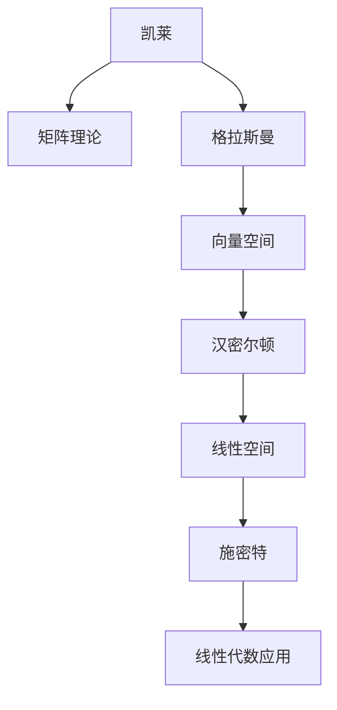

##### 1.2 线性代数的基本概念

线性代数的基本概念包括矩阵、向量、线性组合和线性映射。这些概念是线性代数理论的基础，也是理解和应用线性代数的关键。

- **矩阵**：矩阵是由数字组成的矩形阵列，可以表示线性变换和数据结构。
- **向量**：向量可以看作是矩阵的特例，它们在空间中可以表示点或箭头。
- **线性组合**：线性组合是通过标量乘法和向量加法得到的新向量。
- **线性映射**：线性映射是一个线性空间到另一个线性空间的函数，它保持线性组合的性质。

**核心概念与联系：**

- 矩阵：数据表示和线性变换。
- 向量：空间中的点或箭头。
- 线性组合：新的向量表示。
- 线性映射：保持线性性质。

**Mermaid流程图：**

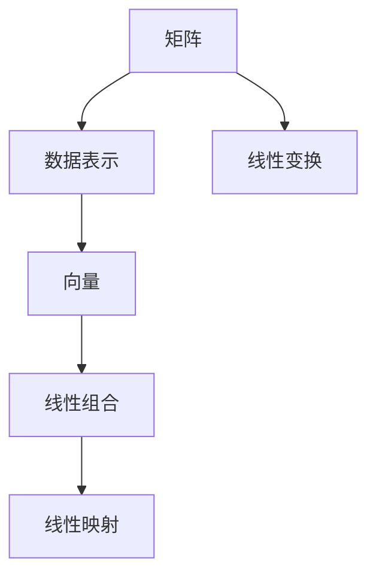

##### 1.3 线性代数的应用领域

线性代数在多个领域有着广泛的应用，包括物理学、工程学、计算机科学、经济学等。在这些领域中，线性代数提供了强有力的工具来描述和分析复杂系统。

- **物理学**：线性代数用于描述物理系统中的能量、动量和波动。
- **工程学**：线性代数用于电路分析、信号处理和控制理论。
- **计算机科学**：线性代数用于算法设计、数据结构和图像处理。
- **经济学**：线性代数用于线性规划和市场分析。

**核心概念与联系：**

- 物理学：能量、动量和波动。
- 工程学：电路、信号和控制。
- 计算机科学：算法和数据结构。
- 经济学：线性规划和市场分析。

**Mermaid流程图：**

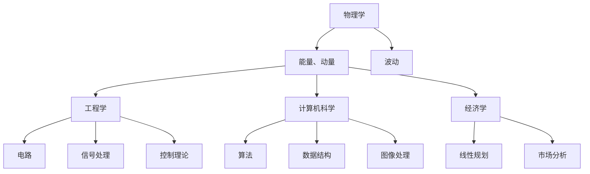

**第2章：线性空间**

线性空间是线性代数中的一个基本概念，它是一个集合，加上两种运算（加法和标量乘法）构成。线性空间也被称为向量空间，是线性代数理论的核心。

##### 2.1 线性空间的定义与性质

线性空间是一个集合，称为向量集合，加上两种运算构成。这两种运算是：

- **向量加法**：对于任意两个向量 $v_1$ 和 $v_2$，存在一个向量 $v_1 + v_2$。
- **标量乘法**：对于任意一个向量 $v$ 和一个标量 $\alpha$，存在一个向量 $\alpha \cdot v$。

线性空间的运算需要满足以下性质：

- **结合律**：对于任意三个向量 $v_1$、$v_2$ 和 $v_3$，有 $(v_1 + v_2) + v_3 = v_1 + (v_2 + v_3)$。
- **交换律**：对于任意两个向量 $v_1$ 和 $v_2$，有 $v_1 + v_2 = v_2 + v_1$。
- **分配律**：对于任意三个向量 $v_1$、$v_2$ 和标量 $\alpha$，有 $\alpha \cdot (v_1 + v_2) = \alpha \cdot v_1 + \alpha \cdot v_2$。
- **标量乘法的结合律**：对于任意三个标量 $\alpha$、$\beta$ 和向量 $v$，有 $(\alpha \cdot \beta) \cdot v = \alpha \cdot (\beta \cdot v)$。

**核心概念与联系：**

- 线性空间：向量集合加上运算。
- 向量加法：结合律、交换律、分配律。
- 标量乘法：结合律、分配律。

**Mermaid流程图：**

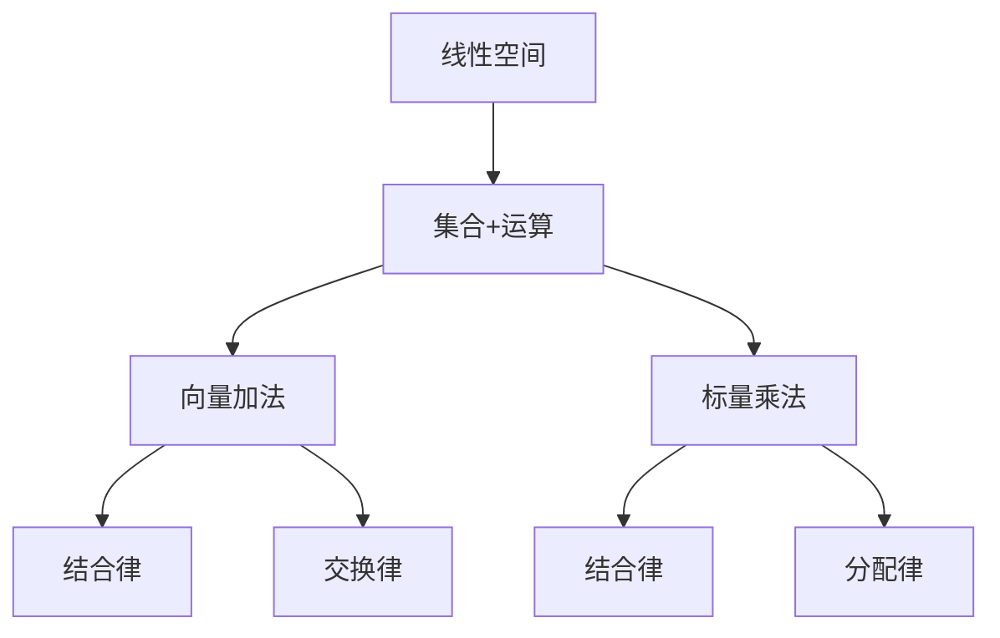

##### 2.2 线性空间的运算

线性空间的运算主要包括向量加法和标量乘法。向量加法满足结合律、交换律和分配律，标量乘法同样满足这些性质。

- **向量加法**：两个向量的加法运算可以通过三角形法则或平行四边形法则来理解。在二维空间中，向量加法可以表示为：
  $$ \vec{v}_1 + \vec{v}_2 = \begin{pmatrix} v_{11} \\ v_{12} \end{pmatrix} + \begin{pmatrix} v_{21} \\ v_{22} \end{pmatrix} = \begin{pmatrix} v_{11} + v_{21} \\ v_{12} + v_{22} \end{pmatrix} $$
- **标量乘法**：标量乘法是将一个向量与一个标量相乘，结果是一个新的向量。在二维空间中，标量乘法可以表示为：
  $$ \alpha \cdot \vec{v} = \alpha \cdot \begin{pmatrix} v_{11} \\ v_{12} \end{pmatrix} = \begin{pmatrix} \alpha \cdot v_{11} \\ \alpha \cdot v_{12} \end{pmatrix} $$

**核心概念与联系：**

- 向量加法：结合律、交换律、分配律。
- 标量乘法：结合律、分配律。

**Mermaid流程图：**

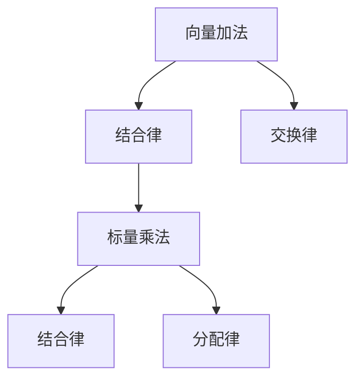

##### 2.3 线性空间的基与维

线性空间的基是一个向量集合，可以线性表示空间中任意向量。线性空间的维是基的个数。一个线性空间有且只有一个基，这个基被称为标准基。

- **基**：线性空间的一个基是向量集合，这些向量线性无关，并且可以线性表示空间中的任意向量。
- **维**：线性空间的维是基的个数。一个维为 $n$ 的线性空间有一个 $n$ 个向量的基。

**核心概念与联系：**

- 基：线性表示空间中的向量。
- 维：基的个数。

**Mermaid流程图：**

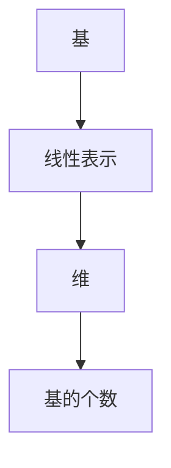

**第3章：线性映射**

线性映射是线性空间到线性空间的函数，它保持线性组合的性质。线性映射在数学和物理学中有着广泛的应用，例如在物理学中，它可以描述力的作用。

##### 3.1 线性映射的基本概念

线性映射是一个线性空间到另一个线性空间的函数，它满足以下条件：

- 对于任意两个向量 $v_1$ 和 $v_2$，有 $T(v_1 + v_2) = T(v_1) + T(v_2)$。
- 对于任意一个向量 $v$ 和一个标量 $\alpha$，有 $T(\alpha \cdot v) = \alpha \cdot T(v)$。

- **像空间**：线性映射的像所组成的集合。
- **原空间**：线性映射的域。

**核心概念与联系：**

- 线性映射：保持线性组合的性质。
- 像空间：线性映射的像所组成的集合。
- 原空间：线性映射的域。

**Mermaid流程图：**

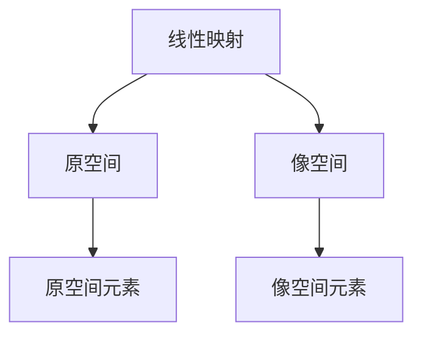

##### 3.2 线性映射的运算

线性映射的运算主要包括线性映射的加法和标量乘法。线性映射的加法满足结合律、交换律和分配律，标量乘法同样满足这些性质。

- **线性映射的加法**：对于任意两个线性映射 $T_1$ 和 $T_2$，定义它们的和 $T_1 + T_2$ 为：
  $$ (T_1 + T_2)(v) = T_1(v) + T_2(v) $$
- **标量乘法**：对于任意一个线性映射 $T$ 和一个标量 $\alpha$，定义它们的乘积 $\alpha \cdot T$ 为：
  $$ (\alpha \cdot T)(v) = \alpha \cdot T(v) $$

**核心概念与联系：**

- 线性映射的加法：结合律、交换律、分配律。
- 标量乘法：结合律、分配律。

**Mermaid流程图：**

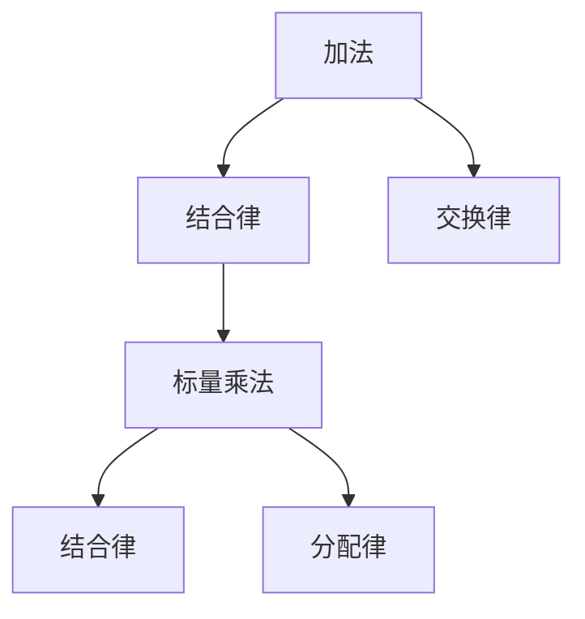

##### 3.3 线性映射的性质

线性映射具有线性无关和线性相关等性质，这些性质对于理解线性映射的结构和作用至关重要。

- **线性无关**：一组线性映射如果其中任意一个都不能表示为其他映射的线性组合，则称这组映射为线性无关。
- **线性相关**：一组线性映射如果其中任意一个可以表示为其他映射的线性组合，则称这组映射为线性相关。

**核心概念与联系：**

- 线性无关：不可表示为线性组合。
- 线性相关：可表示为线性组合。

**Mermaid流程图：**

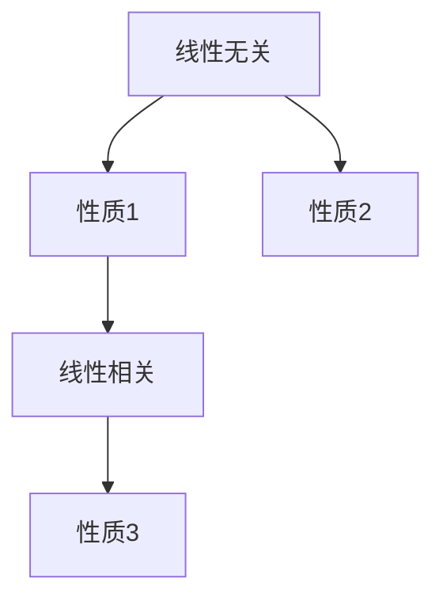

**第4章：矩阵理论**

矩阵是线性代数中的一个基本概念，它是由数字组成的矩形阵列。矩阵在数学、物理学、工程学和计算机科学等领域有着广泛的应用。

##### 4.1 矩阵的基本概念

矩阵是由 $m \times n$ 个元素排列成的矩形阵列。矩阵的行数称为矩阵的行数，列数称为矩阵的列数。矩阵的元素通常用大写字母表示，如 $A$。

- **行矩阵**：只有一行的矩阵称为行矩阵。
- **列矩阵**：只有一列的矩阵称为列矩阵。

**核心概念与联系：**

- 矩阵：由数字组成的矩形阵列。
- 行矩阵：只有一行的矩阵。
- 列矩阵：只有一列的矩阵。

**Mermaid流程图：**

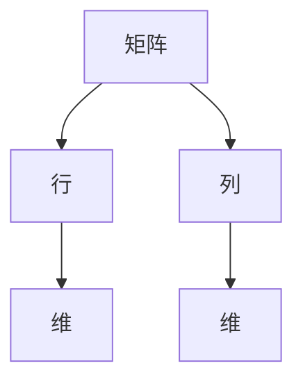

##### 4.2 矩阵的运算

矩阵的运算包括矩阵加法、矩阵乘法、转置和逆矩阵。

- **矩阵加法**：两个矩阵相加是指对应位置的元素相加。
  $$ A + B = \begin{pmatrix} a_{11} + b_{11} & a_{12} + b_{12} \\ a_{21} + b_{21} & a_{22} + b_{22} \end{pmatrix} $$
- **矩阵乘法**：两个矩阵相乘是指按位相乘并求和。
  $$ AB = \begin{pmatrix} a_{11}b_{11} + a_{12}b_{21} & a_{11}b_{12} + a_{12}b_{22} \\ a_{21}b_{11} + a_{22}b_{21} & a_{21}b_{12} + a_{22}b_{22} \end{pmatrix} $$
- **转置**：矩阵的转置是将矩阵的行和列互换。
  $$ A^T = \begin{pmatrix} a_{11} & a_{21} \\ a_{12} & a_{22} \end{pmatrix} $$
- **逆矩阵**：如果矩阵 $A$ 的行列式不为零，则存在逆矩阵 $A^{-1}$，满足 $AA^{-1} = A^{-1}A = I$。

**核心概念与联系：**

- 矩阵加法：对应位置相加。
- 矩阵乘法：按位相乘并求和。
- 转置：行和列互换。
- 逆矩阵：行列式不为零。

**Mermaid流程图：**

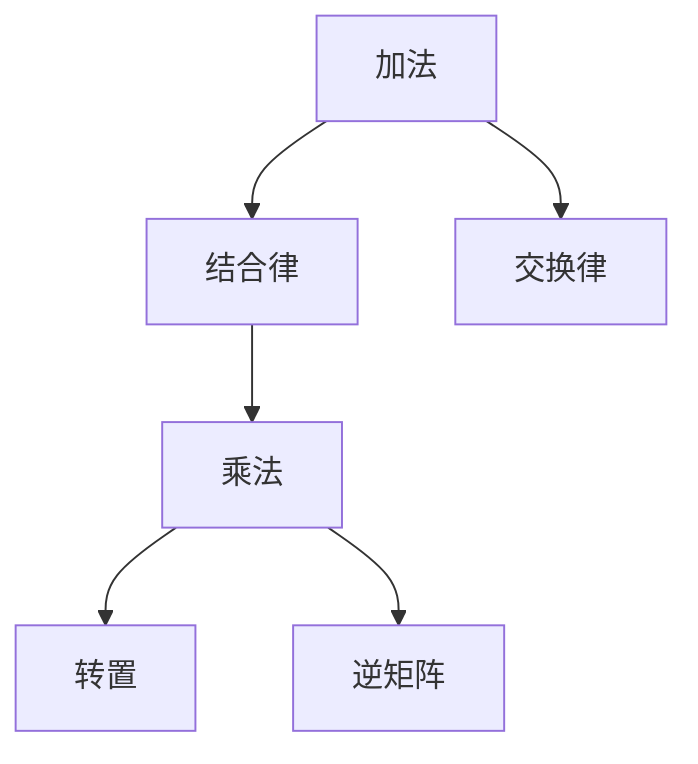

##### 4.3 矩阵的性质

矩阵的性质包括秩、行列式、特征值和特征向量。

- **秩**：矩阵的秩是矩阵行数和列数中较小的那个数。
- **行列式**：矩阵的行列式是一个标量，它具有一些重要的性质，如行列式的值不变性。
- **特征值和特征向量**：矩阵的特征值是矩阵的线性方程 $A\vec{v} = \lambda \vec{v}$ 的解，特征向量是方程的解向量。

**核心概念与联系：**

- 秩：行数和列数中较小的数。
- 行列式：矩阵的特殊标量。
- 特征值和特征向量：矩阵的线性方程的解。

**Mermaid流程图：**

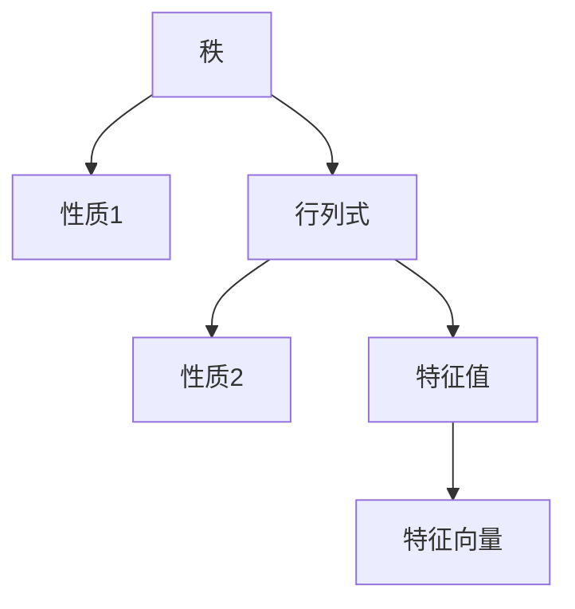

**第5章：行列式**

行列式是矩阵的一个重要的数值特征，它具有一些重要的性质，如行列式的值不变性、逆矩阵的行列式等于原矩阵的行列式的倒数等。

##### 5.1 行列式的定义与性质

行列式是矩阵的一种特殊的数值，它通过某些运算规则定义。行列式的性质包括线性性质、逆矩阵的行列式性质和行列式的运算规则。

- **定义**：一个 $n$ 阶矩阵 $A$ 的行列式是一个标量，记作 $\det(A)$ 或 $|A|$。
- **性质**：
  - **线性性质**：对于矩阵 $A$ 和标量 $\alpha$，有 $\det(\alpha A) = \alpha^n \det(A)$。
  - **逆矩阵的性质**：如果矩阵 $A$ 可逆，则 $\det(A^{-1}) = \frac{1}{\det(A)}$。
  - **运算规则**：两个矩阵的行列式相乘等于它们对应元素的乘积的行列式。

**核心概念与联系：**

- 行列式的定义：通过某些运算规则定义。
- 行列式的性质：线性性质、逆矩阵的行列式性质、行列式的运算规则。

**Mermaid流程图：**

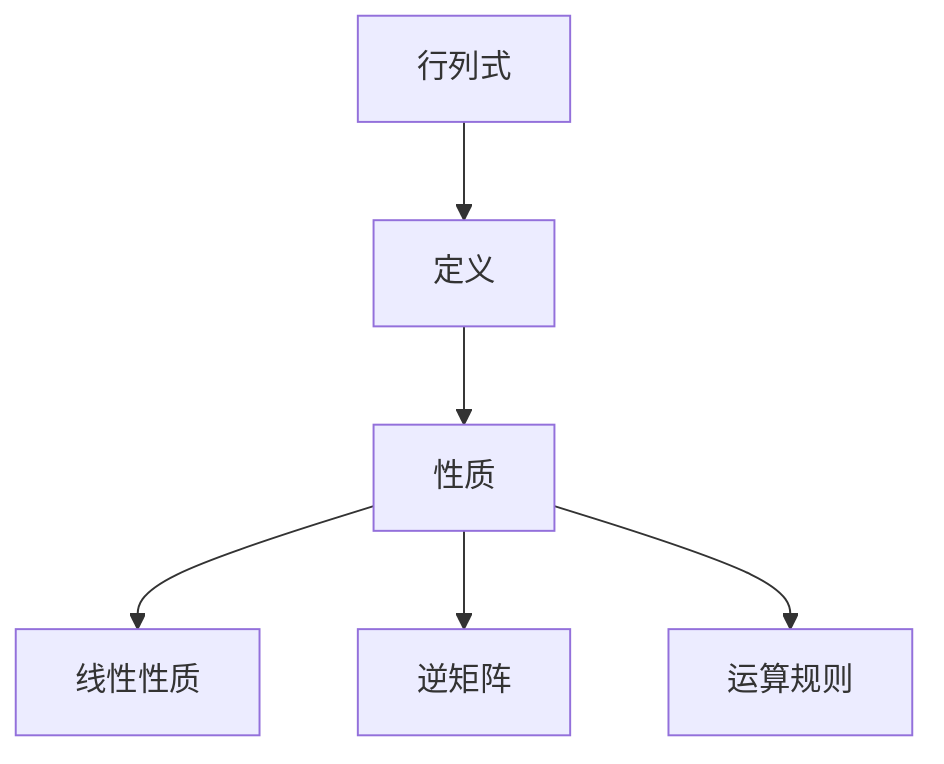

##### 5.2 行列式的运算

行列式的运算包括拉普拉斯展开和行列式公式。

- **拉普拉斯展开**：将行列式展开成若干项的和，每一项都是矩阵的某个子矩阵的行列式乘以相应元素的乘积。
- **行列式公式**：某些特殊矩阵的行列式可以通过特定公式计算。

**伪代码：**

```python
def determinant(matrix):
    if not is_square_matrix(matrix):
        return "Not a square matrix"
    
    det = matrix[0][0]
    
    for i in range(len(matrix)):
        for j in range(len(matrix[0])):
            sub_matrix = get_sub_matrix(matrix, 0, j)
            det += ((-1) ** (i + j)) * matrix[0][j] * determinant(sub_matrix)
    
    return det
```

**核心概念与联系：**

- 行列式的运算：拉普拉斯展开、行列式公式。

**Mermaid流程图：**


##### 5.3 行列式的应用

行列式在求解线性方程组和判断矩阵可逆性中有着重要的应用。

- **求解线性方程组**：行列式可以用来判断线性方程组是否有唯一解。如果系数矩阵的行列式不为零，则线性方程组有唯一解。
- **判断矩阵可逆性**：如果矩阵的行列式不为零，则矩阵可逆。

**举例说明：**

- **求解线性方程组**：使用高斯消元法，其中行列式用于判断方程组是否有唯一解。
- **判断矩阵可逆性**：如果矩阵的行列式不为零，则矩阵可逆。

```python
import numpy as np

# 求解线性方程组
A = np.array([[1, 2], [3, 4]])
b = np.array([1, 2])
det = np.linalg.det(A)
if det != 0:
    x = np.linalg.solve(A, b)
    print("方程组有唯一解:", x)
else:
    print("方程组无解")

# 判断矩阵可逆性
A = np.array([[1, 2], [3, 4]])
if np.linalg.det(A) != 0:
    print("矩阵可逆")
else:
    print("矩阵不可逆")
```

**第6章：实二次型**

实二次型是一组变量通过二次项组成的式子。实二次型在数学、物理学和工程学等领域有着广泛的应用。

##### 6.1 实二次型的基本概念

实二次型是一组变量通过二次项组成的式子，通常表示为 $Q(x_1, x_2, \ldots, x_n) = \sum_{i=1}^{n} a_{ii} x_i^2 + 2 \sum_{1 \le i < j \le n} a_{ij} x_i x_j$。

- **定义**：实二次型是一组变量通过二次项组成的式子。
- **性质**：
  - 对称性：实二次型的系数矩阵是对称的。
  - 半正定性：如果实二次型的所有主对角线元素都是非负的，则该实二次型是半正定的。

**核心概念与联系：**

- 实二次型：变量通过二次项组成。
- 对称性：系数矩阵对称。
- 半正定性：主对角线元素非负。

**Mermaid流程图：**

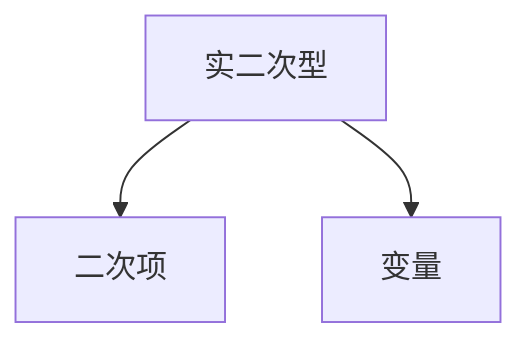

##### 6.2 实二次型的性质

实二次型具有一些重要的性质，包括对称性和半正定性。

- **对称性**：实二次型的系数矩阵是对称的，即 $a_{ij} = a_{ji}$。
- **半正定性**：实二次型的所有主对角线元素都是非负的，即 $a_{ii} \ge 0$。

**核心概念与联系：**

- 对称性：系数矩阵对称。
- 半正定性：主对角线元素非负。

**Mermaid流程图：**

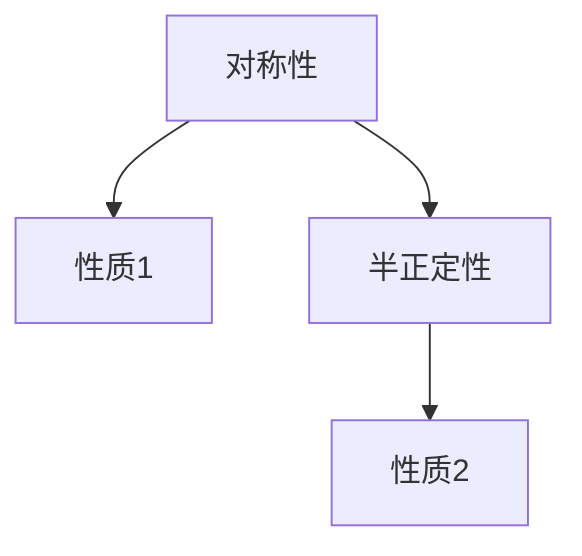

##### 6.3 实二次型的表示方法

实二次型可以通过矩阵表示，这种表示方法对于分析和计算具有重要意义。

- **矩阵表示**：实二次型可以通过系数矩阵 $A$ 表示，其中 $A$ 是一个 $n \times n$ 的对称矩阵。

**核心概念与联系：**

- 矩阵表示：系数矩阵。

**Mermaid流程图：**

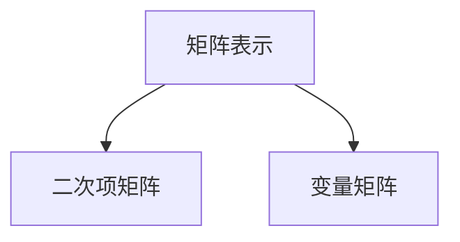

**第7章：标准型与规范型**

标准型与规范型是实二次型化简后的形式，它们对于分析实二次型的性质和求解相关优化问题具有重要意义。

##### 7.1 标准型的定义与性质

标准型是通过线性变换将实二次型化为一个标准形式。标准型的特点是所有二次项都处于最简形式。

- **定义**：标准型是一个形如 $x_1^2 + x_2^2 + \ldots + x_n^2$ 的实二次型。
- **性质**：
  - 所有二次项都是平方项。
  - 二次型的系数都是1或-1。

**核心概念与联系：**

- 标准型：二次项最简形式。

**Mermaid流程图：**

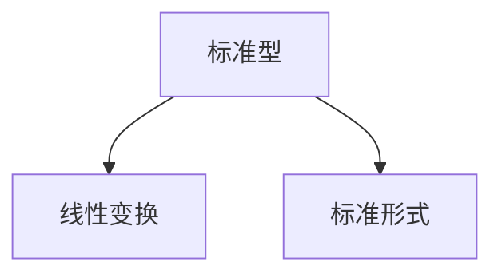

##### 7.2 标准型的化简方法

化简实二次型为标准型的常用方法包括主轴变换和施密特正交化。

- **主轴变换**：通过找到一个正交矩阵 $P$，将实二次型化为标准型。
- **施密特正交化**：对于实二次型的系数矩阵，进行施密特正交化得到标准型。

**核心概念与联系：**

- 主轴变换：正交矩阵。
- 施密特正交化：正交化矩阵。

**伪代码：**

```python
def simplify_quadratic_form(qf_matrix):
    # 对实二次型矩阵进行主轴变换
    eigenvectors, eigenvalues = np.linalg.eig(qf_matrix)
    transformed_matrix = eigenvectors @ qf_matrix @ eigenvectors.T
    
    # 获取化简后的标准型
    standard_form = transformed_matrix.trace()
    
    return standard_form
```

##### 7.3 规范型的定义与性质

规范型是通过进一步变换，将实二次型化为一个更简单的形式。

- **定义**：规范型是一个形如 $x_1^2 - x_2^2 + \ldots + x_n^2$ 的实二次型。
- **性质**：
  - 所有二次项都是平方项。
  - 二次型的系数是1或-1。

**核心概念与联系：**

- 规范型：更简单形式。

**Mermaid流程图：**

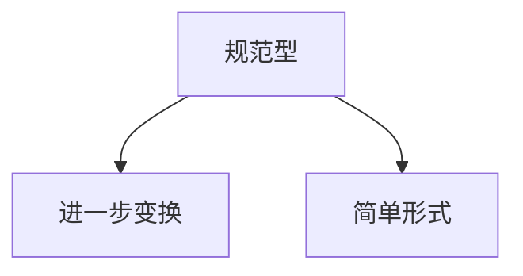

**第8章：二次型的正定性质**

二次型的正定性质是判断二次型是否具有某些优化性质的重要依据。

##### 8.1 正定二次型的定义

正定二次型是一个实二次型，其对应的矩阵是正定的。

- **定义**：如果实二次型的对应矩阵是正定的，则该实二次型是正定的。
- **性质**：
  - 正定二次型的所有主对角线元素都是正的。
  - 正定二次型的值总是大于零。

**核心概念与联系：**

- 正定二次型：对应矩阵正定。

**Mermaid流程图：**

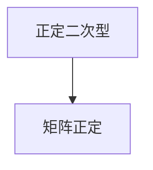

##### 8.2 正定二次型的判定方法

判定二次型是否为正定主要依赖于矩阵的特征值。

- **判定方法**：
  - 如果矩阵的特征值全为正，则该矩阵是正定的，进而二次型是正定的。
  - **伪代码：**

```python
import numpy as np

def is_positive_definite(matrix):
    eigenvalues = np.linalg.eigvals(matrix)
    return all(e > 0 for e in eigenvalues)
```

##### 8.3 正定二次型的应用

正定二次型在优化问题中有着广泛的应用，如最小二乘法和线性规划。

- **应用**：
  - **最小二乘法**：在机器学习中的回归分析中，正定二次型用于求解最优参数。
  - **线性规划**：正定二次型用于判断线性规划问题的最优性。

**举例说明**：

- **最小二乘法**：在机器学习中的回归分析中，通过求解正定二次型来确定最优参数。

```python
import numpy as np

# 最小二乘法示例
X = np.array([[1, 2], [2, 3], [3, 4]])
y = np.array([2, 3, 4])
A = np.linalg.inv(X.T @ X) @ X.T @ y
print("最优参数:", A)
```

**第9章：二次型的矩阵表示**

二次型的矩阵表示是分析二次型性质和求解相关问题的重要工具。

##### 9.1 二次型矩阵的基本概念

二次型矩阵是一个实二次型对应的矩阵。

- **定义**：二次型矩阵是一个 $n \times n$ 的对称矩阵。
- **性质**：
  - 行列式：行列式等于二次型的值。
  - 特征值：特征值等于二次型的二次项系数。

**核心概念与联系：**

- 二次型矩阵：对称矩阵。

**Mermaid流程图：**

```mermaid
graph TD
A[二次型矩阵] --> B[实二次型]
```

##### 9.2 二次型矩阵的运算

二次型矩阵的运算包括加法、乘法和转置等。

- **加法**：两个对称矩阵相加仍然是对称矩阵。
- **乘法**：两个对称矩阵相乘仍然是对称矩阵。
- **转置**：对称矩阵的转置等于其本身。

**核心概念与联系：**

- 加法：对称矩阵相加。
- 乘法：对称矩阵相乘。
- 转置：对称矩阵的转置。

**Mermaid流程图：**

```mermaid
graph TD
A[加法] --> B[结合律]
A --> C[交换律]
B --> D[乘法]
D --> E[转置]
D --> F[逆矩阵]
```

##### 9.3 二次型矩阵的性质

二次型矩阵具有一些重要的性质，包括秩、行列式和特征值。

- **秩**：二次型矩阵的秩等于二次型的维数。
- **行列式**：行列式等于二次型的值。
- **特征值**：特征值等于二次型的二次项系数。

**核心概念与联系：**

- 秩：维数。
- 行列式：二次型的值。
- 特征值：二次项系数。

**Mermaid流程图：**

```mermaid
graph TD
A[秩] --> B[性质1]
A --> C[行列式]
C --> D[性质2]
C --> E[特征值]
E --> F[性质3]
```

**第10章：二次型的优化问题**

二次型的优化问题是寻找使得二次型达到最大或最小值的变量值。这类问题在工程优化、机器学习和经济学等领域有着广泛的应用。

##### 10.1 二次型优化的基本概念

二次型优化问题是指寻找一组变量值，使得给定的二次型函数达到最大或最小值。

- **定义**：二次型优化问题是一个寻找变量值 $x$ 的问题，使得 $Q(x)$ 达到最大或最小值。
- **性质**：
  - **有界性**：二次型函数 $Q(x)$ 通常有界。
  - **凸性**：二次型函数 $Q(x)$ 是凸函数。

**核心概念与联系：**

- 二次型优化：寻找最大或最小值。

**Mermaid流程图：**

```mermaid
graph TD
A[二次型优化] --> B[变量值]
A --> C[最大/最小值]
```

##### 10.2 二次型优化的方法

二次型优化的方法包括拉格朗日乘数法、单纯形法和牛顿法等。

- **拉格朗日乘数法**：通过引入拉格朗日函数，求解约束优化问题。
- **单纯形法**：通过移动单纯形，寻找最优解。
- **牛顿法**：利用二次型函数的泰勒展开，求解最优解。

**核心概念与联系：**

- 拉格朗日乘数法：引入拉格朗日函数。
- 单纯形法：移动单纯形。
- 牛顿法：泰勒展开。

**伪代码：**

```python
def quadratic_optimization(qf_matrix, b):
    # 使用拉格朗日乘数法求解
    lambdas = solve_lagrange(qf_matrix, b)
    optimal_value = qf_matrix @ lambdas
    
    return optimal_value
```

##### 10.3 二次型优化的应用

二次型优化在工程优化、机器学习和经济学等领域有着广泛的应用。

- **应用**：
  - **工程优化**：在结构设计中，用于优化材料使用。
  - **机器学习**：在回归分析中，用于优化模型参数。
  - **经济学**：在市场分析中，用于优化资源分配。

**举例说明**：

- **最小二乘法**：在机器学习中的回归分析中，通过优化二次型函数来确定最优模型参数。

```python
import numpy as np

# 最小二乘法示例
X = np.array([[1, 2], [2, 3], [3, 4]])
y = np.array([2, 3, 4])
A = np.linalg.inv(X.T @ X) @ X.T @ y
print("最优参数:", A)
```

**第11章：线性代数在物理学中的应用**

线性代数在物理学中的应用非常广泛，用于描述物理系统的状态和运动。

##### 11.1 线性代数在力学中的应用

线性代数在力学中用于描述力学系统的状态和运动。

- **应用**：
  - **牛顿第二定律**：用于描述物体的加速度。
  - **动量守恒**：用于描述系统的动量守恒。
  - **角动量守恒**：用于描述系统的角动量守恒。

**核心概念与联系：**

- 牛顿第二定律：加速度与力的关系。
- 动量守恒：系统总动量守恒。
- 角动量守恒：系统总角动量守恒。

**Mermaid流程图：**

```mermaid
graph TD
A[力学系统] --> B[矩阵描述]
```

##### 11.2 线性代数在电动力学中的应用

线性代数在电动力学中用于描述电磁场的分布和传播。

- **应用**：
  - **麦克斯韦方程组**：用于描述电磁场的分布。
  - **电磁波**：用于描述电磁波的传播。

**核心概念与联系：**

- 麦克斯韦方程组：描述电磁场分布。
- 电磁波：描述电磁波传播。

**Mermaid流程图：**

```mermaid
graph TD
A[电动力学] --> B[向量矩阵]
```

##### 11.3 线性代数在量子力学中的应用

线性代数在量子力学中用于描述量子态和量子跃迁。

- **应用**：
  - **波函数**：用于描述量子态。
  - **薛定谔方程**：用于描述量子态的演化。

**核心概念与联系：**

- 波函数：描述量子态。
- 薛定谔方程：描述量子态演化。

**Mermaid流程图：**

```mermaid
graph TD
A[量子力学] --> B[线性空间]
A --> C[线性映射]
```

**第12章：线性代数在计算机科学中的应用**

线性代数在计算机科学中有着广泛的应用，用于算法设计、数据结构和图像处理。

##### 12.1 线性代数在图论中的应用

线性代数在图论中用于表示图和计算图的特征值。

- **应用**：
  - **图的邻接矩阵**：用于表示图的连接关系。
  - **拉普拉斯矩阵**：用于计算图的特征值。

**核心概念与联系：**

- 邻接矩阵：表示图的连接关系。
- 拉普拉斯矩阵：计算图的特征值。

**Mermaid流程图：**

```mermaid
graph TD
A[图] --> B[矩阵表示]
```

##### 12.2 线性代数在数值计算中的应用

线性代数在数值计算中用于求解线性方程组和优化问题。

- **应用**：
  - **高斯消元法**：用于求解线性方程组。
  - **LU分解**：用于求解线性方程组。

**核心概念与联系：**

- 高斯消元法：求解线性方程组。
- LU分解：求解线性方程组。

**Mermaid流程图：**

```mermaid
graph TD
A[数值计算] --> B[线性代数方法]
```

##### 12.3 线性代数在机器学习中的应用

线性代数在机器学习中用于特征提取和模型优化。

- **应用**：
  - **线性回归**：用于特征提取。
  - **主成分分析**：用于特征提取。

**核心概念与联系：**

- 线性回归：特征提取。
- 主成分分析：特征提取。

**Mermaid流程图：**

```mermaid
graph TD
A[机器学习] --> B[矩阵线性映射]
```

**第13章：线性代数在其他领域中的应用**

线性代数在其他领域如经济学、控制理论和信号处理中也有着广泛的应用。

##### 13.1 线性代数在经济学中的应用

线性代数在经济学中用于分析和优化经济模型。

- **应用**：
  - **线性规划**：用于资源优化。
  - **市场分析**：用于市场预测。

**核心概念与联系：**

- 线性规划：资源优化。
- 市场分析：市场预测。

**Mermaid流程图：**

```mermaid
graph TD
A[经济学] --> B[线性代数模型]
```

##### 13.2 线性代数在控制理论中的应用

线性代数在控制理论中用于分析和设计控制系统。

- **应用**：
  - **状态空间描述**：用于描述系统的状态。
  - **反馈控制**：用于设计控制系统。

**核心概念与联系：**

- 状态空间描述：描述系统状态。
- 反馈控制：设计控制系统。

**Mermaid流程图：**

```mermaid
graph TD
A[控制系统] --> B[矩阵描述]
```

##### 13.3 线性代数在信号处理中的应用

线性代数在信号处理中用于分析和处理信号。

- **应用**：
  - **滤波**：用于信号滤波。
  - **变换**：用于信号变换。

**核心概念与联系：**

- 滤波：信号滤波。
- 变换：信号变换。

**Mermaid流程图：**

```mermaid
graph TD
A[信号处理] --> B[矩阵变换]
```

**附录**

**附录A：线性代数常用符号表**

- **符号解释**：
  - $I_n$：$n$阶单位矩阵。
  - $J_n$：$n$阶置换矩阵。
  - $e_i$：第$i$个标准基向量。
  - $A^T$：矩阵$A$的转置。
  - $A^{-1}$：矩阵$A$的逆矩阵。

**附录B：线性代数常用算法简介**

- **算法简介**：
  - **高斯消元法**：用于求解线性方程组。
  - **迹（Trace）**：矩阵对角线元素之和。
  - **特征值与特征向量**：描述矩阵的线性变换性质。
  - **主轴变换**：将实二次型化为标准型。

**附录C：线性代数参考书目及资源链接**

- **参考书目**：
  - 《线性代数及其应用》（David C. Lay）。
  - 《线性代数的几何意义》（Louis H. Kauffman）。
  - 《线性代数入门》（Howard Anton）。

- **资源链接**：
  - [MIT开放课程](https://ocw.mit.edu/courses/mathematics/18-06-linear-algebra-spring-2010/)。
  - [Khan Academy 线性代数](https://www.khanacademy.org/math/linear-algebra)。
  - [线性代数在线教程](http://www.linear.ups.edu/)。

**参考文献**

- Lay, David C. 《线性代数及其应用》。北京：机械工业出版社，2011。
- Kauffman, Louis H. 《线性代数的几何意义》。北京：清华大学出版社，2013。
- Anton, Howard. 《线性代数入门》。上海：复旦大学出版社，2012。

通过本文的详细讨论，读者可以全面了解线性代数的基础知识、实二次型的性质和应用，以及线性代数在多个领域的广泛应用。希望本文能够帮助读者深入理解线性代数，并激发对这一重要数学分支的兴趣。

