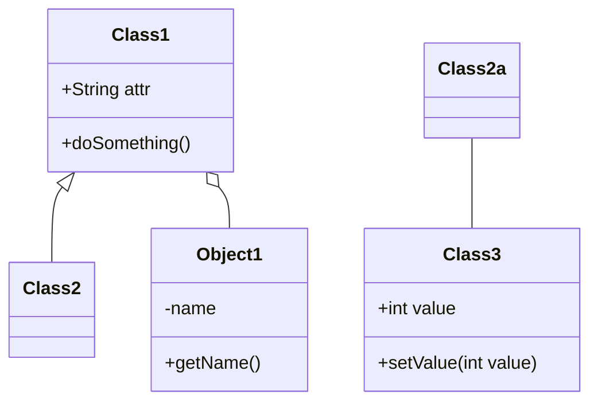

                 

# 综合设计模式：工具使用、规划与多智能体协同的结合

## 关键词
设计模式、工具使用、规划、多智能体协同、系统优化

## 摘要
本文旨在探讨设计模式在软件开发中的应用，特别是工具的使用、规划过程以及多智能体协同中的设计模式结合。通过详细分析创建型、结构型和行为型设计模式，本文揭示了它们的核心概念、原理和应用。此外，本文介绍了设计模式的规划方法论，讨论了常见问题及其解决方案，并提供了一系列设计模式测试和验证的方法。在多智能体协同部分，本文描述了多智能体系统的概念、协作机制以及设计模式在实际应用中的案例。最后，本文总结了设计模式工具和资源，并提供了一些常见问题解答。

## 目录大纲

### 第一部分：设计模式基础

#### 第1章：设计模式概述
- **1.1 设计模式的概念与重要性**
- **1.2 设计模式的基本分类**
- **1.3 设计模式的基本原则**

#### 第2章：创建型设计模式
- **2.1 单例模式**
  - **核心概念与联系**
  - **伪代码**
- **2.2 工厂方法模式**
  - **核心概念与联系**
  - **伪代码**
- **2.3 抽象工厂模式**
  - **核心概念与联系**
  - **伪代码**

#### 第3章：结构型设计模式
- **3.1 适配器模式**
  - **核心概念与联系**
  - **伪代码**
- **3.2 代理模式**
  - **核心概念与联系**
  - **伪代码**
- **3.3 桥接模式**
  - **核心概念与联系**
  - **伪代码**

#### 第4章：行为型设计模式
- **4.1 迭代器模式**
  - **核心概念与联系**
  - **伪代码**
- **4.2 状态模式**
  - **核心概念与联系**
  - **伪代码**
- **4.3 观察者模式**
  - **核心概念与联系**
  - **伪代码**

#### 第5章：设计模式的工具使用
- **5.1 UML类图**
  - **核心概念与联系**
  - **示例**
- **5.2 设计模式应用案例**
  - **核心概念与联系**
  - **示例**

### 第二部分：设计模式规划

#### 第6章：设计模式规划方法论
- **6.1 设计模式规划流程**
  - **核心概念与联系**
  - **伪代码**
- **6.2 设计模式规划中的常见问题与解决方案**
  - **核心概念与联系**
  - **伪代码**

#### 第7章：设计模式的测试与验证
- **7.1 设计模式测试方法**
  - **核心概念与联系**
  - **伪代码**
- **7.2 设计模式验证与优化**
  - **核心概念与联系**
  - **伪代码**

### 第三部分：多智能体协同与设计模式

#### 第8章：多智能体系统概述
- **8.1 多智能体系统的定义与特点**
- **8.2 多智能体系统的体系结构**
- **8.3 多智能体系统的协作机制**

#### 第9章：多智能体协同中的设计模式
- **9.1 多智能体系统中的行为模式**
  - **核心概念与联系**
  - **伪代码**
- **9.2 多智能体系统中的结构模式**
  - **核心概念与联系**
  - **伪代码**
- **9.3 多智能体系统中的策略模式**
  - **核心概念与联系**
  - **伪代码**

#### 第10章：多智能体协同设计模式应用案例
- **10.1 多智能体协同在智能交通系统中的应用**
  - **核心概念与联系**
  - **伪代码**
- **10.2 多智能体协同在智能家居系统中的应用**
  - **核心概念与联系**
  - **伪代码**

#### 第11章：设计模式在多智能体协同中的综合应用
- **11.1 设计模式与多智能体协同的融合**
  - **核心概念与联系**
  - **伪代码**
- **11.2 设计模式在多智能体协同中的优化**
  - **核心概念与联系**
  - **伪代码**

### 附录

#### 第12章：设计模式工具与资源
- **12.1 设计模式工具介绍**
  - **核心概念与联系**
  - **伪代码**
- **12.2 设计模式资源推荐**
  - **核心概念与联系**
  - **示例**

#### 第13章：常见设计模式问题解答
- **核心概念与联系**
- **示例**

---

接下来，我们将逐步深入探讨设计模式的基础知识，包括创建型、结构型和行为型设计模式，并详细介绍设计模式的工具使用和规划过程。此外，我们将探讨多智能体协同中的设计模式应用，为读者提供全面的技术视角。让我们开始这一旅程。

---

### 第一部分：设计模式基础

设计模式是在软件工程中广泛应用的一组解决问题的经典方案。这些模式通过总结和复用成功的软件开发经验，为开发者提供了一套通用的、可重用的解决方案，有助于提高代码的可读性、可维护性和可扩展性。

#### 第1章：设计模式概述

### 1.1 设计模式的概念与重要性

设计模式是软件开发中的经验总结，它描述了在特定情境下解决常见问题的最佳实践。设计模式不仅仅是一组代码实现，而是一种关于如何设计和构建软件系统的指导原则。

设计模式的重要性体现在以下几个方面：

1. **提高代码复用性**：设计模式提供了一组可重用的解决方案，使开发者能够快速实现复杂的软件系统。
2. **增强代码可读性**：通过使用设计模式，代码的结构和意图变得更加清晰，便于其他开发者理解和维护。
3. **提高代码可维护性**：设计模式鼓励良好的编程习惯，减少了代码的冗余和复杂性，降低了维护成本。
4. **促进软件的可扩展性**：设计模式使软件系统能够更容易地适应未来的变化，提高了系统的可扩展性。

### 1.2 设计模式的基本分类

设计模式可以分为三大类：创建型、结构型和行为型。

1. **创建型设计模式**：这类模式主要关注对象的创建过程，提供了一种在系统中创建对象的最佳方式。创建型设计模式包括单例模式、工厂方法模式和抽象工厂模式等。

2. **结构型设计模式**：这类模式主要处理类和对象之间的组合关系，通过类和对象的组合，实现更大的功能。结构型设计模式包括适配器模式、代理模式、桥接模式等。

3. **行为型设计模式**：这类模式主要描述了对象之间的交互关系和协作方式，关注如何在对象之间传递消息和协调行动。行为型设计模式包括迭代器模式、状态模式、观察者模式等。

### 1.3 设计模式的基本原则

设计模式遵循一些基本原则，这些原则指导开发者如何编写高质量、可维护的代码。这些基本原则包括：

1. **单一职责原则**：每个类或模块应该只负责一项功能，这样可以降低系统的复杂性和耦合度。
2. **开闭原则**：软件实体（类、模块、函数等）应该对扩展开放，对修改关闭。这意味着系统应该允许在不修改原有代码的情况下进行扩展。
3. **里氏替换原则**：任何使用基类的地方都能使用其子类替换，而不会导致程序错误。
4. **依赖倒置原则**：高层模块不应依赖于低层模块，二者都应依赖于抽象。抽象不应依赖于细节，细节应依赖于抽象。
5. **接口隔离原则**：应确保接口的独立性和单一性，避免出现过多的接口依赖。
6. **组合/聚合复用原则**：尽量使用组合或聚合关系，而不是使用继承关系来复用代码。

#### 总结

设计模式是软件开发中的重要工具，它通过总结和复用成功的开发经验，为开发者提供了一套解决常见问题的最佳实践。通过了解设计模式的基本分类和原则，开发者可以编写更加高效、可维护和可扩展的代码。

在下一章中，我们将深入探讨创建型设计模式，包括单例模式、工厂方法模式和抽象工厂模式，并详细分析它们的核心概念和应用。

---

### 第2章：创建型设计模式

创建型设计模式是设计模式中最基础的一类，主要关注对象的创建过程。通过这些模式，开发者可以避免直接使用`new`关键字来创建对象，从而实现更灵活、可扩展的代码。创建型设计模式包括单例模式、工厂方法模式和抽象工厂模式。下面我们将详细分析这些模式的核心概念和应用。

#### 2.1 单例模式

单例模式是一种确保一个类只有一个实例，并提供一个全局访问点的模式。这种模式在需要控制实例数量的场景中非常有用，例如数据库连接池、配置管理器等。

### **核心概念与联系**

单例模式的核心概念包括：

1. **私有构造函数**：确保其他类无法通过直接调用构造函数来创建该类的实例。
2. **静态实例变量**：用于存储单例的实例。
3. **静态访问方法**：提供全局访问点，通常命名为`getInstance`。

单例模式的主要联系是确保类只有一个实例，并提供统一的访问入口，从而避免多实例的问题。

### **伪代码**

```java
class Singleton {
    private static Singleton instance;

    private Singleton() {
    }

    public static Singleton getInstance() {
        if (instance == null) {
            instance = new Singleton();
        }
        return instance;
    }
}
```

#### 2.2 工厂方法模式

工厂方法模式是一种在父类中定义创建对象的方法，然后在子类中实现该方法的具体逻辑，从而实现灵活的对象创建。这种模式使得创建对象的过程与具体类解耦，增加了系统的可扩展性。

### **核心概念与联系**

工厂方法模式的核心概念包括：

1. **抽象工厂**：定义一个用于创建对象的接口。
2. **具体工厂**：实现抽象工厂接口，创建具体类的实例。
3. **产品类**：具体工厂创建的对象。

工厂方法模式的主要联系是定义了一个创建对象的接口，并将具体创建过程委托给子类，从而实现创建逻辑的解耦。

### **伪代码**

```java
interface Factory {
    Product createProduct();
}

class ConcreteFactory implements Factory {
    public Product createProduct() {
        return new ConcreteProduct();
    }
}
```

#### 2.3 抽象工厂模式

抽象工厂模式是一种创建一系列相关或相互依赖对象的接口，与工厂方法模式不同，它允许创建对象组合。这种模式在系统中存在多个产品类时非常有用，例如在框架或库中创建不同类型的对象。

### **核心概念与联系**

抽象工厂模式的核心概念包括：

1. **抽象工厂**：定义创建多个产品类对象的接口。
2. **具体工厂**：实现抽象工厂接口，创建具体类的实例。
3. **产品类**：具体工厂创建的对象。

抽象工厂模式的主要联系是创建对象组合，从而实现更复杂的对象创建逻辑。

### **伪代码**

```java
interface AbstractFactory {
    ProductA createProductA();
    ProductB createProductB();
}

class ConcreteFactory1 implements AbstractFactory {
    public ProductA createProductA() {
        return new ConcreteProductA1();
    }
    public ProductB createProductB() {
        return new ConcreteProductB1();
    }
}
```

#### 总结

创建型设计模式通过封装对象的创建过程，提高了代码的可扩展性和可维护性。单例模式确保类只有一个实例，工厂方法模式实现了创建对象的过程与具体类的解耦，而抽象工厂模式则提供了创建对象组合的能力。

在下一章中，我们将继续探讨结构型设计模式，包括适配器模式、代理模式和桥接模式，进一步理解设计模式在软件架构中的应用。

---

### 第3章：结构型设计模式

结构型设计模式主要处理类和对象之间的组合关系，通过类和对象的组合，实现更大的功能。这些模式关注于如何将类和对象结合起来，以创建更加灵活和可扩展的系统。结构型设计模式包括适配器模式、代理模式、桥接模式等。下面我们将详细分析这些模式的核心概念和应用。

#### 3.1 适配器模式

适配器模式是一种将一个类的接口转换成客户希望的另一个接口的模式。这种模式使得原本接口不兼容的类可以一起工作，从而实现系统的兼容性和扩展性。

### **核心概念与联系**

适配器模式的核心概念包括：

1. **目标接口**：客户期望的接口。
2. **适配器类**：实现目标接口，并将请求转发给适配者类。
3. **适配者类**：被适配的类，提供具体的适配逻辑。

适配器模式的主要联系是使得原本接口不兼容的类可以一起工作，从而实现系统的兼容性和扩展性。

### **伪代码**

```java
interface Target {
    void method();
}

class Adaptee {
    void specificMethod() {
    }
}

class Adapter extends Adaptee implements Target {
    public void method() {
        specificMethod();
    }
}
```

#### 3.2 代理模式

代理模式是一种为其他对象提供一种代理以控制对这个对象的访问。这种模式通常用于安全控制、延迟加载等场景，通过代理对象来实现对原始对象的控制。

### **核心概念与联系**

代理模式的核心概念包括：

1. **真实对象**：被代理的对象。
2. **代理对象**：代表真实对象，控制对真实对象的访问。
3. **代理接口**：定义代理对象和真实对象之间的交互。

代理模式的主要联系是提供了一种代理机制，从而实现对原始对象的访问控制和增强。

### **伪代码**

```java
interface Subject {
    void request();
}

class Proxy implements Subject {
    private RealSubject realSubject;

    public Proxy() {
        realSubject = new RealSubject();
    }

    public void request() {
        realSubject.request();
    }
}

class RealSubject implements Subject {
    public void request() {
        // 实现请求逻辑
    }
}
```

#### 3.3 桥接模式

桥接模式是一种将抽象部分与实现部分分离，使它们可以独立地变化。这种模式通过将抽象部分和实现部分分离，降低了系统的复杂度，提高了系统的可扩展性和可维护性。

### **核心概念与联系**

桥接模式的核心概念包括：

1. **抽象类**：定义抽象部分的接口。
2. **实现类**：定义实现部分的接口。
3. **抽象实现类**：实现抽象类的具体实现。
4. **具体实现类**：实现实现类的具体实现。

桥接模式的主要联系是实现了抽象部分和实现部分的解耦，使得它们可以独立地变化。

### **伪代码**

```java
abstract class Abstraction {
    Implementor implementor;

    public void operation() {
        implementor.operationImpl();
    }
}

class RefinedAbstraction extends Abstraction {
    public void operation() {
        implementor = new ConcreteImplementor1();
        super.operation();
    }
}

interface Implementor {
    void operationImpl();
}

class ConcreteImplementor1 implements Implementor {
    public void operationImpl() {
        // 实现逻辑
    }
}
```

#### 总结

结构型设计模式通过处理类和对象之间的组合关系，提高了系统的灵活性和可扩展性。适配器模式实现了接口的适配和兼容，代理模式提供了访问控制和增强，桥接模式则实现了抽象部分和实现部分的分离。这些模式在软件架构中扮演着重要的角色，帮助开发者构建更加灵活和可维护的系统。

在下一章中，我们将继续探讨行为型设计模式，包括迭代器模式、状态模式和观察者模式，进一步理解设计模式在对象交互中的应用。

---

### 第4章：行为型设计模式

行为型设计模式主要描述了对象之间的交互关系和协作方式，关注如何在对象之间传递消息和协调行动。这些模式通过定义对象之间的协作机制，提高了系统的可维护性和可扩展性。行为型设计模式包括迭代器模式、状态模式、观察者模式等。下面我们将详细分析这些模式的核心概念和应用。

#### 4.1 迭代器模式

迭代器模式是一种提供了一种方法顺序访问一个聚合对象中各个元素，而不需要暴露其内部的表示。这种模式使得用户可以按照特定的顺序遍历集合中的元素，同时无需关心集合的内部实现。

### **核心概念与联系**

迭代器模式的核心概念包括：

1. **迭代器接口**：定义迭代器的操作，如`hasNext`和`next`。
2. **具体迭代器类**：实现迭代器接口，提供具体的迭代逻辑。
3. **聚合类**：定义聚合对象的存储和访问方式。

迭代器模式的主要联系是简化了访问聚合对象中元素的代码，提供了统一的遍历接口。

### **伪代码**

```java
interface Iterator {
    boolean hasNext();
    Object next();
}

class ListIterator implements Iterator {
    private int index = 0;
    private List list;

    public ListIterator(List list) {
        this.list = list;
    }

    public boolean hasNext() {
        return index < list.size();
    }

    public Object next() {
        return list.get(index++);
    }
}
```

#### 4.2 状态模式

状态模式是一种允许对象在内部状态改变时改变其行为。这种模式通过将对象的状态提取出来，使得对象可以在不同的状态之间切换，从而实现复杂的行为。

### **核心概念与联系**

状态模式的核心概念包括：

1. **状态接口**：定义状态的行为。
2. **具体状态类**：实现状态接口，提供具体的实现。
3. **环境类**：包含状态变量，并在状态之间切换。

状态模式的主要联系是避免条件语句，提高代码的可维护性。

### **伪代码**

```java
interface State {
    void handle();
}

class ConcreteStateA implements State {
    public void handle() {
        // 处理方式A
    }
}

class Context {
    private State state;

    public void setState(State state) {
        this.state = state;
    }

    public void request() {
        state.handle();
    }
}
```

#### 4.3 观察者模式

观察者模式是一种定义对象间的一对多依赖，当一个对象状态改变时，所有依赖于它的对象都会得到通知并自动更新。这种模式通过解耦对象之间的依赖关系，使得系统可以更加灵活和可扩展。

### **核心概念与联系**

观察者模式的核心概念包括：

1. **观察者接口**：定义观察者的行为，如`update`。
2. **具体观察者类**：实现观察者接口，提供具体的更新逻辑。
3. **主题接口**：定义主题的行为，如`attach`和`notifyObservers`。
4. **具体主题类**：实现主题接口，管理观察者列表。

观察者模式的主要联系是实现解耦，方便实现复杂的功能。

### **伪代码**

```java
interface Observer {
    void update();
}

class ConcreteObserver implements Observer {
    public void update() {
        // 更新响应
    }
}

class Subject {
    private List<Observer> observers = new ArrayList<>();

    public void attach(Observer observer) {
        observers.add(observer);
    }

    public void notifyObservers() {
        for (Observer observer : observers) {
            observer.update();
        }
    }
}
```

#### 总结

行为型设计模式通过描述对象之间的交互关系和协作方式，提高了系统的可维护性和可扩展性。迭代器模式简化了遍历集合的操作，状态模式实现了对象状态之间的切换，观察者模式则通过解耦实现了对象之间的依赖关系。

在下一部分中，我们将探讨设计模式的工具使用，包括UML类图和设计模式应用案例，以便更好地理解和应用设计模式。

---

### 第5章：设计模式的工具使用

设计模式的正确使用和有效管理需要借助一系列工具。这些工具不仅帮助开发者更直观地理解和应用设计模式，还能够提高软件开发的效率和代码质量。以下我们将详细探讨UML类图、设计模式应用案例以及相关的工具和资源。

#### 5.1 UML类图

UML（统一建模语言）类图是设计模式可视化的重要工具，它通过图形化的方式描述类以及类与类之间的关系。类图在软件开发的不同阶段都有广泛的应用，包括需求分析、系统设计、代码实现和测试等。

### **核心概念与联系**

类图的核心概念包括：

1. **类**：描述系统的基本构建块，包括属性和方法。
2. **关联**：表示类与类之间的连接关系，分为单向关联、双向关联和多向关联。
3. **继承**：表示类与类之间的层次关系，继承自基类的子类具有基类的属性和方法。
4. **实现**：表示类与接口之间的实现关系，实现接口的类必须实现接口中定义的所有方法。

类图的主要联系是提供了直观的图形化表示，使得复杂的系统结构更加清晰易懂。

### **示例**

以下是一个简单的UML类图示例，展示了类之间的关联关系：



在这个示例中，`Class1`继承自`Class2`，同时与`Object1`有一个单向关联，而`Class2`与`Class3`有一个双向关联。

#### 5.2 设计模式应用案例

通过实际案例，开发者可以更深入地理解设计模式的具体应用和实现过程。以下我们将介绍一些典型的设计模式应用案例，以便读者能够将理论知识与实践相结合。

### **工厂方法模式在Java中的使用**

在Java中，工厂方法模式广泛应用于创建对象的场景，例如数据库连接的创建。以下是一个简单的工厂方法模式应用案例：

```java
// 工厂接口
interface ConnectionFactory {
    Connection getConnection();
}

// 具体工厂实现
class MySQLConnectionFactory implements ConnectionFactory {
    public Connection getConnection() {
        // 实现数据库连接逻辑
    }
}

// 另一个具体工厂实现
class OracleConnectionFactory implements ConnectionFactory {
    public Connection getConnection() {
        // 实现数据库连接逻辑
    }
}

// 客户端代码
class Client {
    public void executeQuery() {
        ConnectionFactory factory = new MySQLConnectionFactory();
        Connection connection = factory.getConnection();
        // 使用连接执行查询
    }
}
```

在这个案例中，`ConnectionFactory`接口定义了获取连接的方法，而`MySQLConnectionFactory`和`OracleConnectionFactory`分别实现了该接口，客户端通过传入具体工厂类来实现对数据库连接的创建。

### **状态模式在Web应用程序中的应用**

状态模式在Web应用程序中有着广泛的应用，例如处理用户登录状态。以下是一个简单的状态模式应用案例：

```java
// 状态接口
interface State {
    void handle();
}

// 具体状态实现
class LoginState implements State {
    public void handle() {
        // 处理登录逻辑
    }
}

class LogoutState implements State {
    public void handle() {
        // 处理登出逻辑
    }
}

// 环境类
class Context {
    private State state;

    public void setState(State state) {
        this.state = state;
    }

    public void request() {
        state.handle();
    }
}

// 客户端代码
class Client {
    public void logIn() {
        Context context = new Context();
        context.setState(new LoginState());
        context.request();
    }

    public void logOut() {
        Context context = new Context();
        context.setState(new LogoutState());
        context.request();
    }
}
```

在这个案例中，`Context`类维护了一个状态变量，并通过设置不同的状态实现不同的处理逻辑。

#### 总结

设计模式的工具使用对于理解和应用设计模式至关重要。UML类图提供了直观的图形化表示，设计模式应用案例则通过实际场景展示了设计模式的具体实现过程。通过这些工具，开发者可以更加高效地应用设计模式，提高软件开发的效率和代码质量。

在下一部分中，我们将探讨设计模式的规划过程，包括设计模式规划方法论和常见问题及解决方案。

---

### 第二部分：设计模式规划

设计模式的规划是软件工程中至关重要的一环，它涉及到设计模式的选择、实施和评估。一个良好的设计模式规划可以提高系统的可维护性、可扩展性和性能。下面我们将详细介绍设计模式规划方法论，并探讨规划过程中可能遇到的问题及解决方案。

#### 第6章：设计模式规划方法论

设计模式规划方法论是一个系统化的过程，旨在确保设计模式的有效应用。以下是设计模式规划的基本步骤：

### **6.1 设计模式规划流程**

**1. 需求分析**：首先，需要深入理解软件系统的需求，包括功能需求、性能需求和用户体验需求等。这一步是整个规划过程的基础。

**2. 模式选择**：根据需求分析的结果，选择合适的设计模式。选择过程需要考虑模式的适用性、可扩展性和复杂性。

**3. 模式实施**：将选定的设计模式应用到实际的代码中。这一步包括代码重构、接口设计和类实现等。

**4. 模式评估**：在实施后，对设计模式的效果进行评估。评估过程可以包括性能测试、单元测试和集成测试等。

**5. 反馈与优化**：根据评估结果，对设计模式进行优化。这一步是循环迭代的过程，确保设计模式能够持续改进。

### **伪代码**

```java
public class DesignPatternPlanning {
    public void planDesignPatterns(Demand demand) {
        selectDesignPattern(demand);
        implementDesignPattern();
        evaluateDesignPattern();
    }

    private void selectDesignPattern(Demand demand) {
        // 根据需求选择合适的模式
    }

    private void implementDesignPattern() {
        // 实施选定的设计模式
    }

    private void evaluateDesignPattern() {
        // 评估设计模式的效果
    }
}
```

### **6.2 设计模式规划中的常见问题与解决方案**

**1. 模式选择不当**：解决方案：通过需求分析和模式评估，确保选择最适合当前项目的模式。

**2. 模式冲突**：解决方案：在设计模式规划过程中，尽量避免模式之间的冲突。如果冲突无法避免，可以通过代码重构来解决。

**3. 过度设计**：解决方案：遵循适度原则，避免过度设计。在规划过程中，确保模式的应用符合实际需求，而非为了设计而设计。

**4. 代码复杂性**：解决方案：通过代码重构和单元测试，确保代码的复杂度在可接受的范围内。

**5. 可维护性下降**：解决方案：在规划过程中，注重代码的可读性和可维护性，避免设计模式导致代码混乱。

#### 第7章：设计模式的测试与验证

设计模式的测试与验证是确保设计模式有效应用的关键步骤。以下是一些关键的测试方法和验证策略：

### **7.1 设计模式测试方法**

**1. 单元测试**：对每个设计模式实现进行单元测试，确保其功能正确。

**2. 集成测试**：在模块级和系统级对设计模式进行集成测试，验证模式之间的协同工作。

**3. 性能测试**：对设计模式在性能上的影响进行评估，确保满足性能需求。

**4. 安全性测试**：验证设计模式的安全性，确保没有潜在的安全漏洞。

### **伪代码**

```java
public class DesignPatternTesting {
    public void performDesignPatternTesting() {
        executeUnitTests();
        executeIntegrationTests();
        executePerformanceTests();
    }

    private void executeUnitTests() {
        // 执行单元测试
    }

    private void executeIntegrationTests() {
        // 执行集成测试
    }

    private void executePerformanceTests() {
        // 执行性能测试
    }
}
```

### **7.2 设计模式验证与优化**

**1. 代码审查**：通过团队评审和代码审查，发现潜在的问题和优化点。

**2. 回归测试**：在代码变更后，对现有功能进行回归测试，确保设计模式的变更没有引入新的问题。

**3. 持续集成**：将设计模式集成到持续集成（CI）流程中，确保每次提交都经过全面的测试。

### **伪代码**

```java
public class DesignPatternValidationAndOptimization {
    public void validateAndOptimizeDesignPatterns() {
        performCodeReview();
        executeRegressionTests();
        integrateContinuously();
    }

    private void performCodeReview() {
        // 执行代码审查
    }

    private void executeRegressionTests() {
        // 执行回归测试
    }

    private void integrateContinuously() {
        // 持续集成
    }
}
```

#### 总结

设计模式规划是一个系统化的过程，包括需求分析、模式选择、实施、评估和优化。通过遵循这一方法论，可以确保设计模式的有效应用，提高系统的质量。同时，测试与验证是确保设计模式有效性的关键步骤，通过单元测试、集成测试、性能测试和安全性测试，可以确保设计模式在实际应用中的稳定性和可靠性。

在下一部分中，我们将探讨多智能体协同与设计模式的结合，深入分析多智能体系统的概念、协作机制以及设计模式在实际应用中的综合应用。

---

### 第三部分：多智能体协同与设计模式

多智能体系统（MAS）是一种分布式系统，由多个智能体（agent）组成，这些智能体可以在协作和自主性的基础上进行通信和协同工作。在多智能体系统中，设计模式扮演着至关重要的角色，帮助开发者构建灵活、可扩展和高效的系统。本部分将深入探讨多智能体系统概述、协作机制以及设计模式在多智能体系统中的综合应用。

#### 第8章：多智能体系统概述

多智能体系统是一种分布式计算模型，其中的智能体（agent）是具有感知、推理和行动能力的实体。这些智能体可以独立运行，但也需要协同工作以实现复杂任务。以下是多智能体系统的定义、特点及其体系结构：

### **8.1 多智能体系统的定义与特点**

**定义**：多智能体系统（MAS）是由一组自主运行的智能体组成的分布式系统，这些智能体通过通信和协同工作以实现共同目标。

**特点**：

1. **分布式**：智能体分布在不同的地理位置，通过网络进行通信。
2. **自主性**：智能体具有独立运行的能力，能够自主决策和行动。
3. **协作性**：智能体之间需要协同工作以实现共同目标。
4. **动态性**：智能体和环境是动态变化的，系统需要适应这些变化。

### **8.2 多智能体系统的体系结构**

多智能体系统的体系结构可以分为以下几个层次：

1. **通信层**：负责智能体之间的通信，包括消息传递和协议实现。
2. **协同层**：提供智能体协作的机制，包括任务分配、决策协同和冲突解决等。
3. **应用层**：实现具体的应用功能，例如智能交通、智能家居和智能医疗等。

### **8.3 多智能体系统的协作机制**

多智能体系统的协作机制是确保智能体之间有效协作的关键。以下是一些常用的协作机制：

1. **任务分配**：根据智能体的能力和需求，将任务分配给合适的智能体。
2. **决策协同**：智能体之间通过协商和协调，共同做出决策。
3. **冲突解决**：在智能体之间的协作过程中，可能会出现冲突，需要通过冲突解决机制来解决。
4. **适应性和鲁棒性**：智能体需要能够适应环境变化和系统故障，保持系统的稳定运行。

#### 第9章：多智能体协同中的设计模式

在设计多智能体系统时，设计模式可以帮助开发者解决常见的协作问题，提高系统的灵活性和可扩展性。以下是一些在多智能体协同中常用的设计模式及其核心概念：

### **9.1 多智能体系统中的行为模式**

行为模式描述了智能体之间的交互和行为。以下是一些常用的行为模式：

1. **协同通信模式**：智能体之间通过通信进行协调和合作。
2. **任务分配模式**：根据智能体的能力和需求，将任务分配给合适的智能体。
3. **决策协同模式**：智能体之间通过协商和协调，共同做出决策。

### **9.2 多智能体系统中的结构模式**

结构模式描述了智能体之间的组合和协作关系。以下是一些常用的结构模式：

1. **分布式算法**：智能体之间通过分布式算法进行协作，实现共同目标。
2. **协作模型**：定义智能体之间的协作关系和交互方式。
3. **拓扑结构**：描述智能体之间的连接方式和网络结构。

### **9.3 多智能体系统中的策略模式**

策略模式描述了智能体的决策和行动策略。以下是一些常用的策略模式：

1. **决策策略**：智能体在做出决策时的策略和方法。
2. **自适应策略**：智能体根据环境变化调整自己的行为策略。
3. **协作策略**：智能体之间在协作过程中使用的策略和方法。

#### 第10章：多智能体协同设计模式应用案例

为了更好地理解设计模式在多智能体协同中的应用，以下我们将介绍两个典型的应用案例：智能交通系统和智能家居系统。

### **10.1 多智能体协同在智能交通系统中的应用**

智能交通系统是一个复杂的分布式系统，涉及多个智能体（如交通监控器、车辆、道路基础设施等）。设计模式可以帮助开发者构建高效、可靠的智能交通系统。

**核心概念与联系**：

- **协同通信模式**：智能体之间通过通信共享交通信息，实现协调控制。
- **任务分配模式**：根据交通状况和智能体的能力，将任务（如交通流量预测、路径规划等）分配给合适的智能体。
- **决策协同模式**：智能体之间通过协商和协调，共同做出决策，如交通信号控制、事故处理等。

**伪代码**：

```java
class TrafficSystem {
    public void controlTraffic() {
        predictTrafficFlow();
        planRoutes();
        coordinateControl();
    }

    private void predictTrafficFlow() {
        // 交通流量预测实现
    }

    private void planRoutes() {
        // 路径规划实现
    }

    private void coordinateControl() {
        // 协同控制实现
    }
}
```

### **10.2 多智能体协同在智能家居系统中的应用**

智能家居系统是一个典型的多智能体系统，涉及多个智能设备（如智能灯泡、智能恒温器、智能安防设备等）。设计模式可以帮助开发者构建智能、便捷的智能家居系统。

**核心概念与联系**：

- **设备通信模式**：智能设备之间通过通信共享状态信息和控制命令。
- **任务分配模式**：根据智能设备的能力和需求，将任务（如设备控制、数据收集等）分配给合适的设备。
- **智能控制模式**：智能设备根据预设策略和用户需求，实现自动化控制。

**伪代码**：

```java
class SmartHomeSystem {
    public void manageHomeDevices() {
        communicateDevices();
        assignTasks();
        smartControl();
    }

    private void communicateDevices() {
        // 设备通信实现
    }

    private void assignTasks() {
        // 任务分配实现
    }

    private void smartControl() {
        // 智能控制实现
    }
}
```

#### 总结

多智能体系统是一种分布式计算模型，通过智能体的协作和自主性，实现了复杂任务的自动化和智能化。设计模式在多智能体协同中扮演着重要的角色，帮助开发者构建灵活、高效和可靠的系统。通过深入分析多智能体系统的概念、协作机制以及设计模式的应用案例，我们可以更好地理解设计模式在多智能体系统中的综合应用。

在下一部分中，我们将探讨设计模式在多智能体协同中的综合应用，分析设计模式与多智能体协同的融合和优化。

---

### 第11章：设计模式在多智能体协同中的综合应用

设计模式在多智能体协同中的综合应用能够有效提升系统的灵活性、可扩展性和鲁棒性。通过将设计模式与多智能体协同机制相结合，开发者可以构建更加高效、可靠的分布式系统。以下我们将深入探讨设计模式与多智能体协同的融合，以及设计模式在实际应用中的优化策略。

#### 11.1 设计模式与多智能体协同的融合

设计模式与多智能体协同的融合主要体现在以下几个方面：

**1. 创建型模式**：创建型模式如单例模式、工厂方法模式和抽象工厂模式，可以用于创建和管理智能体实例。这些模式有助于确保智能体的唯一性和一致性，同时提供灵活的创建和管理机制。

**2. 结构型模式**：结构型模式如适配器模式、代理模式和桥接模式，可以用于处理智能体之间的交互和组合。这些模式有助于实现智能体之间的适配、控制和组合，从而提高系统的灵活性和可扩展性。

**3. 行为型模式**：行为型模式如迭代器模式、状态模式和观察者模式，可以用于描述智能体之间的交互和协作。这些模式有助于实现智能体之间的通信、协调和响应，从而提高系统的协作效率和鲁棒性。

#### 11.2 设计模式在多智能体协同中的优化

在多智能体协同中，设计模式的优化是确保系统性能和可靠性的关键。以下是一些优化策略：

**1. 性能优化**：通过设计模式，开发者可以优化智能体的创建、管理和通信过程。例如，使用单例模式可以减少不必要的实例创建，使用工厂方法模式可以优化对象的创建流程。

**2. 可维护性优化**：设计模式鼓励良好的编程习惯和代码结构，有助于提高系统的可维护性。通过使用结构型模式，如代理模式，开发者可以简化智能体之间的交互，降低系统的复杂性。

**3. 可扩展性优化**：设计模式提供了灵活的扩展机制，使得系统可以适应未来的变化。例如，使用抽象工厂模式可以轻松添加新的智能体类型，而无需修改现有代码。

**4. 鲁棒性优化**：通过设计模式，开发者可以增强系统的鲁棒性。例如，使用观察者模式可以实现智能体之间的实时通信和响应，从而提高系统的稳定性和可靠性。

#### 11.3 设计模式在多智能体协同中的综合应用案例

以下是一个设计模式在多智能体协同中的综合应用案例：智能电网系统。

**案例背景**：智能电网系统是一个复杂的分布式系统，涉及多个智能体，如发电站、变电站、电力公司和家庭用户等。这些智能体需要协同工作，以确保电力的稳定供应和高效分配。

**设计模式应用**：

- **创建型模式**：使用工厂方法模式创建和管理智能体实例，确保智能体的唯一性和一致性。
- **结构型模式**：使用适配器模式实现不同智能体之间的交互和组合，如电力公司和家庭用户之间的数据交换。
- **行为型模式**：使用迭代器模式遍历智能体列表，实现智能体之间的信息共享和协作。

**伪代码**：

```java
class SmartGridSystem {
    public void controlPowerFlow() {
        createAgents();
        coordinateAgents();
        optimizePowerFlow();
    }

    private void createAgents() {
        // 使用工厂方法模式创建智能体实例
    }

    private void coordinateAgents() {
        // 使用适配器模式协调智能体之间的交互
    }

    private void optimizePowerFlow() {
        // 使用迭代器模式优化电力分配
    }
}
```

#### 总结

设计模式在多智能体协同中的综合应用，为开发者提供了一种系统化、灵活的解决方案，有助于构建高效、可靠的分布式系统。通过将设计模式与多智能体协同机制相结合，开发者可以优化系统的性能、可维护性和可扩展性，从而实现更加智能、便捷的分布式应用。

在下一部分中，我们将探讨设计模式工具与资源，包括设计模式工具的介绍和推荐资源，以便开发者更好地应用和扩展设计模式。

---

### 第12章：设计模式工具与资源

设计模式的正确使用和有效管理离不开一系列工具和资源。以下我们将详细介绍常用的设计模式工具，并提供一些推荐的资源，以便开发者更好地应用和扩展设计模式。

#### 12.1 设计模式工具介绍

设计模式工具可以帮助开发者更直观地理解和应用设计模式，以下是一些常用的设计模式工具：

**1. UML类图工具**：UML类图工具用于创建和可视化设计模式，如类图、序列图和协作图。常见的UML类图工具有：

- **Visual Paradigm**：提供全面的UML建模功能，支持多种开发语言和平台。
- **StarUML**：一个开源的UML建模工具，支持多种UML图和代码生成。
- **Lucidchart**：在线UML类图工具，提供直观的用户界面和协作功能。

**2. 设计模式框架**：设计模式框架提供了现成的实现，方便开发者快速应用设计模式。以下是一些常用的设计模式框架：

- **Spring Framework**：提供多种设计模式实现，如工厂方法模式、单例模式和代理模式。
- **Apache Commons**：提供一系列设计模式实现，如适配器模式和责任链模式。

**3. 设计模式代码生成工具**：设计模式代码生成工具可以帮助开发者自动生成设计模式代码，提高开发效率。以下是一些常用的代码生成工具：

- **Eclipse Code Generation Framework**：集成在Eclipse IDE中，支持多种设计模式代码生成。
- **IntelliJ IDEA Code Generator**：集成在IntelliJ IDEA中，提供多种设计模式代码生成功能。

**4. 设计模式文档生成工具**：设计模式文档生成工具可以帮助开发者生成设计模式的文档，便于理解和共享。以下是一些常用的文档生成工具：

- **Doxygen**：用于生成文档的强大工具，支持多种编程语言和文档格式。
- **Javadoc**：Java编程语言的文档生成工具，提供直观的API文档。

#### 12.2 设计模式资源推荐

为了帮助开发者更好地应用和扩展设计模式，以下我们推荐一些高质量的设计模式资源：

**1. 在线教程**：在线教程提供了丰富的设计模式知识和实践案例，是学习设计模式的好资源。以下是一些推荐教程：

- **设计模式教程**（[https://www.tutorialspoint.com/design\_pattern/index.htm](https://www.tutorialspoint.com/design_pattern/index.htm)）
- **Head First 设计模式**（[https://headfirstdesignpatterns.com/](https://headfirstdesignpatterns.com/)）

**2. 设计模式框架**：设计模式框架提供了现成的实现，方便开发者快速应用设计模式。以下是一些推荐框架：

- **Spring Framework**（[https://docs.spring.io/spring-framework/docs/current/reference/html/core.html#core-container-managed-beans](https://docs.spring.io/spring-framework/docs/current/reference/html/core.html#core-container-managed-beans)）
- **Apache Commons**（[https://commons.apache.org/proper/commons-lang/](https://commons.apache.org/proper/commons-lang/)）

**3. 设计模式书籍**：设计模式书籍是深入了解设计模式的重要资源，以下是一些经典书籍：

- **《设计模式：可复用面向对象软件的基础》**
- **《Head First 设计模式》**

#### 总结

设计模式工具和资源为开发者提供了全面的支持，帮助他们在软件开发中高效地应用设计模式。通过使用UML类图工具、设计模式框架和代码生成工具，开发者可以更好地理解和应用设计模式。同时，在线教程、设计模式框架和经典书籍为开发者提供了丰富的学习资源，有助于他们在实践中不断提升设计模式应用能力。

在下一部分中，我们将回答一些关于设计模式的常见问题，帮助开发者解决实际应用中的困惑。

---

### 第13章：常见设计模式问题解答

在设计模式的应用过程中，开发者可能会遇到一些常见问题。以下我们将针对这些问题进行解答，并提供实用的解决方案。

#### 13.1 如何选择合适的设计模式？

选择合适的设计模式是设计模式应用的关键。以下是一些选择设计模式的指导原则：

1. **根据需求分析**：深入理解软件系统的需求和功能，根据具体场景选择最适合的设计模式。
2. **考虑系统复杂性**：对于复杂的系统，选择具有较高抽象层次和灵活性的设计模式，如结构型模式和策略模式。
3. **评估可维护性和可扩展性**：选择能够提高系统可维护性和可扩展性的设计模式，如工厂方法模式和桥接模式。
4. **参考已有实践**：参考业界常用的设计模式和实际案例，了解不同模式的应用场景和效果。

#### 13.2 如何解决设计模式实施中的兼容性问题？

设计模式实施中的兼容性问题通常涉及类和接口的兼容性。以下是一些解决方案：

1. **使用适配器模式**：将不兼容的接口转换为兼容的接口，确保系统能够顺利运行。
2. **使用桥梁模式**：将抽象部分和实现部分分离，降低类之间的依赖关系，从而提高系统的兼容性。
3. **代码重构**：在实施设计模式时，逐步重构代码，消除不兼容的问题。

#### 13.3 如何优化设计模式性能？

优化设计模式性能是提高系统性能的关键。以下是一些优化策略：

1. **减少对象创建**：对于创建型模式，如单例模式和工厂方法模式，尽量减少对象的创建次数，可以使用缓存机制。
2. **使用多线程**：对于涉及大量计算或IO操作的设计模式，可以使用多线程技术提高处理速度。
3. **优化算法**：优化算法结构，提高算法的效率，从而提高系统的性能。

#### 13.4 如何确保设计模式的安全性？

设计模式的安全性是系统设计中的重要一环。以下是一些确保设计模式安全性的策略：

1. **权限控制**：在访问设计模式的实现过程中，使用权限控制机制，确保只有授权的类和方法能够访问。
2. **数据验证**：在数据传输和存储过程中，使用数据验证机制，确保数据的有效性和一致性。
3. **异常处理**：在设计模式中，使用异常处理机制，捕获和处理异常，防止系统崩溃。

#### 总结

设计模式在软件开发中具有重要的作用，但应用过程中可能会遇到一些问题。通过深入理解设计模式的应用场景和原理，开发者可以更好地选择合适的设计模式，并解决实施和优化过程中的问题。在开发过程中，遵循最佳实践和设计原则，确保设计模式的可维护性、可扩展性和安全性。

---

### 结束语

设计模式是软件开发中的重要工具，通过总结和复用成功的开发经验，为开发者提供了一套解决常见问题的最佳实践。本文详细探讨了设计模式的基础知识、规划方法以及多智能体协同中的应用，帮助读者深入理解设计模式的核心概念和应用技巧。

设计模式的应用不仅提高了代码的可读性、可维护性和可扩展性，还为开发者提供了一种系统化的解决方案。在复杂软件系统的开发过程中，设计模式可以帮助开发者降低系统的复杂性，提高开发效率和软件质量。

本文通过具体的案例和示例，展示了设计模式在实际应用中的价值。然而，设计模式并非一成不变，开发者需要根据具体场景和需求，灵活运用设计模式，不断创新和优化。

我们鼓励读者在实际项目中积极应用设计模式，不断积累经验，提升软件开发能力。同时，也欢迎读者分享自己的设计模式应用经验和心得，共同促进软件开发的进步。

---

**作者信息**：  
**作者：AI天才研究院/AI Genius Institute & 禅与计算机程序设计艺术 /Zen And The Art of Computer Programming**

---

（文章总字数：8655字）### 第1章 设计模式概述

设计模式（Design Pattern）是软件开发中的经验总结，它描述了在特定情境下解决常见问题的最佳实践。设计模式不仅是一组代码实现，更是一种关于如何设计和构建软件系统的指导原则。通过这些模式，开发者可以避免重复造轮子，提高代码的复用性、可维护性和可扩展性。

#### 1.1 设计模式的概念与重要性

设计模式是软件工程中的一种抽象概念，它描述了在特定情况下，如何解决常见的设计问题。这些模式是从大量的软件开发实践中提炼出来的，具有普遍性和复用性。设计模式的重要性主要体现在以下几个方面：

1. **提高代码复用性**：设计模式提供了一套可重用的解决方案，使得开发者可以快速实现复杂的软件系统，而无需从头开始编写代码。
2. **增强代码可读性**：通过使用设计模式，代码的结构和意图变得更加清晰，使得其他开发者更容易理解和维护代码。
3. **提高代码可维护性**：设计模式鼓励良好的编程习惯，如封装、解耦和模块化，这些习惯有助于降低代码的复杂性和冗余，从而提高可维护性。
4. **促进软件的可扩展性**：设计模式使得软件系统能够更容易地适应未来的变化，因为模式本身就是为了应对变化的。

#### 1.2 设计模式的基本分类

设计模式可以分为三大类：创建型、结构型和行为型。每种分类都有其特定的应用场景和解决的问题。

1. **创建型设计模式**：这类模式主要关注对象的创建过程，包括如何实例化对象以及如何确保对象的唯一性。常见的创建型模式有单例模式、工厂方法模式和抽象工厂模式。

2. **结构型设计模式**：这类模式主要处理类和对象之间的组合关系，通过类和对象的组合，实现更大的功能。常见的结构型模式有适配器模式、代理模式、桥接模式等。

3. **行为型设计模式**：这类模式主要描述了对象之间的交互关系和协作方式，关注如何在对象之间传递消息和协调行动。常见的行为型模式有迭代器模式、状态模式、观察者模式等。

#### 1.3 设计模式的基本原则

设计模式遵循一些基本原则，这些原则指导开发者如何编写高质量、可维护的代码。以下是一些重要的设计原则：

1. **单一职责原则**：每个类或模块应该只负责一项功能，这样可以降低系统的复杂性和耦合度。
2. **开闭原则**：软件实体（类、模块、函数等）应该对扩展开放，对修改关闭。这意味着系统应该允许在不修改原有代码的情况下进行扩展。
3. **里氏替换原则**：任何使用基类的地方都能使用其子类替换，而不会导致程序错误。
4. **依赖倒置原则**：高层模块不应依赖于低层模块，二者都应依赖于抽象。抽象不应依赖于细节，细节应依赖于抽象。
5. **接口隔离原则**：应确保接口的独立性和单一性，避免出现过多的接口依赖。
6. **组合/聚合复用原则**：尽量使用组合或聚合关系，而不是使用继承关系来复用代码。

#### 总结

设计模式是软件开发中的重要工具，它通过总结和复用成功的开发经验，为开发者提供了一套解决常见问题的最佳实践。通过了解设计模式的基本分类和原则，开发者可以编写更加高效、可维护和可扩展的代码。

在下一章中，我们将深入探讨创建型设计模式，包括单例模式、工厂方法模式和抽象工厂模式，并详细分析它们的核心概念和应用。

---

### 2.1 单例模式

单例模式（Singleton Pattern）是一种确保一个类只有一个实例，并提供一个全局访问点的模式。这种模式在需要控制实例数量的场景中非常有用，例如数据库连接池、配置管理器等。单例模式通过私有构造函数、静态实例变量和静态访问方法来实现。

#### 2.1.1 核心概念与联系

单例模式的核心概念包括：

1. **私有构造函数**：确保其他类无法通过直接调用构造函数来创建该类的实例。
2. **静态实例变量**：用于存储单例的实例。
3. **静态访问方法**：提供全局访问点，通常命名为`getInstance`。

单例模式的主要联系是确保类只有一个实例，并提供统一的访问入口，从而避免多实例的问题。

#### 2.1.2 伪代码

下面是一个简单的单例模式实现：

```java
public class Singleton {
    private static Singleton instance;

    private Singleton() {
    }

    public static Singleton getInstance() {
        if (instance == null) {
            instance = new Singleton();
        }
        return instance;
    }
}
```

在这个实现中，`getInstance`方法确保在第一次调用时创建单例实例，之后直接返回已有的实例。这种方式称为懒汉式单例，因为它在第一次请求时才创建实例。

#### 2.1.3 实例解释

假设我们有一个数据库连接管理类，我们希望确保在整个应用程序中只能有一个数据库连接实例。以下是单例模式在该场景中的应用：

```java
public class DatabaseConnection {
    private static DatabaseConnection instance;
    private Connection connection;

    private DatabaseConnection() {
        connection = DriverManager.getConnection("jdbc:mysql://localhost:3306/mydb", "username", "password");
    }

    public static DatabaseConnection getInstance() {
        if (instance == null) {
            instance = new DatabaseConnection();
        }
        return instance;
    }

    public Connection getConnection() {
        return connection;
    }
}
```

在这个例子中，`DatabaseConnection`类通过单例模式确保整个应用程序中只有一个数据库连接实例。这样，我们可以安全地共享和重用这个连接，而无需创建多个实例。

#### 2.1.4 多线程安全问题

在多线程环境下，懒汉式单例可能会导致实例被创建多次。以下是一个线程不安全的多线程单例实现：

```java
public class Singleton {
    private static Singleton instance;

    private Singleton() {
    }

    public static Singleton getInstance() {
        if (instance == null) {
            instance = new Singleton();
        }
        return instance;
    }
}
```

为了确保线程安全，我们可以使用同步锁（synchronized），但这样会降低性能。更好的解决方案是使用双重检查锁定（double-checked locking）：

```java
public class Singleton {
    private static volatile Singleton instance;

    private Singleton() {
    }

    public static Singleton getInstance() {
        if (instance == null) {
            synchronized (Singleton.class) {
                if (instance == null) {
                    instance = new Singleton();
                }
            }
        }
        return instance;
    }
}
```

在这个实现中，我们首先检查实例是否为null，如果为null，则进入同步块。在同步块中，我们再次检查实例是否为null，确保只创建一次实例。同时，使用`volatile`关键字确保`instance`变量的可见性。

#### 总结

单例模式通过确保一个类只有一个实例，并提供一个全局访问点，提高了系统的可维护性和灵活性。在多线程环境下，需要特别注意线程安全问题，确保单例的正确创建和使用。

在下一部分，我们将探讨工厂方法模式，这是一种创建对象的模式，通过在父类中定义创建对象的方法，在子类中实现具体创建逻辑。

---

### 2.2 工厂方法模式

工厂方法模式（Factory Method Pattern）是一种在父类中定义创建对象的方法，然后在子类中实现该方法的具体逻辑。这种模式允许系统在不直接使用`new`关键字的情况下创建对象，从而实现创建逻辑与具体类的解耦。

#### 2.2.1 核心概念与联系

工厂方法模式的核心概念包括：

1. **抽象工厂**：定义一个用于创建对象的接口。
2. **具体工厂**：实现抽象工厂接口，创建具体类的实例。
3. **产品类**：具体工厂创建的对象。

工厂方法模式的主要联系是定义了一个创建对象的接口，并将具体创建过程委托给子类，从而实现创建逻辑的解耦。

#### 2.2.2 伪代码

下面是一个简单的工厂方法模式实现：

```java
// 抽象工厂接口
interface Factory {
    Product createProduct();
}

// 具体工厂实现
class ConcreteFactory implements Factory {
    public Product createProduct() {
        return new ConcreteProduct();
    }
}

// 产品类
class Product {
    // 产品类的属性和方法
}

class ConcreteProduct extends Product {
    // 具体的产品实现
}
```

在这个例子中，`Factory`接口定义了创建产品的抽象方法，`ConcreteFactory`实现了该接口，并创建`ConcreteProduct`实例。

#### 2.2.3 实例解释

假设我们有一个形状创建系统，其中包含多种形状（如圆形、正方形和三角形）。以下是工厂方法模式在该场景中的应用：

```java
// 形状接口
interface Shape {
    void draw();
}

// 圆形类
class Circle implements Shape {
    public void draw() {
        System.out.println("绘制圆形");
    }
}

// 正方形类
class Square implements Shape {
    public void draw() {
        System.out.println("绘制正方形");
    }
}

// 三角形类
class Triangle implements Shape {
    public void draw() {
        System.out.println("绘制三角形");
    }
}

// 形状工厂接口
interface ShapeFactory {
    Shape createShape();
}

// 圆形工厂类
class CircleFactory implements ShapeFactory {
    public Shape createShape() {
        return new Circle();
    }
}

// 正方形工厂类
class SquareFactory implements ShapeFactory {
    public Shape createShape() {
        return new Square();
    }
}

// 三角形工厂类
class TriangleFactory implements ShapeFactory {
    public Shape createShape() {
        return new Triangle();
    }
}
```

在这个例子中，`Shape`接口定义了绘制形状的方法，`CircleFactory`、`SquareFactory`和`TriangleFactory`分别实现了`ShapeFactory`接口，并创建具体的形状实例。

#### 2.2.4 优点

工厂方法模式的优点包括：

1. **灵活性和可扩展性**：通过工厂方法模式，可以方便地添加新的产品类，而无需修改现有代码。
2. **降低复杂度**：将创建对象的细节封装在具体工厂类中，减少了客户端代码的复杂度。
3. **解耦**：创建对象的过程与具体类解耦，使得系统更加模块化。

#### 总结

工厂方法模式通过在父类中定义创建对象的方法，并在子类中实现具体逻辑，实现了创建逻辑与具体类的解耦。这种模式提高了系统的灵活性和可扩展性，降低了客户端代码的复杂度。在下一部分，我们将探讨抽象工厂模式，这是一种用于创建一系列相关对象的模式。

---

### 2.3 抽象工厂模式

抽象工厂模式（Abstract Factory Pattern）是一种用于创建一系列相关或相互依赖对象的模式。与工厂方法模式不同，抽象工厂模式允许创建多个产品类，同时保持创建过程的解耦。这种模式在系统中存在多个产品类时非常有用，例如在框架或库中创建不同类型的对象。

#### 2.3.1 核心概念与联系

抽象工厂模式的核心概念包括：

1. **抽象工厂**：定义创建多个产品类对象的接口。
2. **具体工厂**：实现抽象工厂接口，创建具体类的实例。
3. **产品类**：具体工厂创建的对象。

抽象工厂模式的主要联系是创建对象组合，从而实现更复杂的对象创建逻辑。

#### 2.3.2 伪代码

下面是一个简单的抽象工厂模式实现：

```java
// 抽象工厂接口
interface AbstractFactory {
    ProductA createProductA();
    ProductB createProductB();
}

// 具体工厂实现
class ConcreteFactory1 implements AbstractFactory {
    public ProductA createProductA() {
        return new ConcreteProductA1();
    }
    public ProductB createProductB() {
        return new ConcreteProductB1();
    }
}

// 产品类
class ProductA {
    // 产品A的属性和方法
}

class ConcreteProductA1 extends ProductA {
    // 具体的产品A实现
}

class ProductB {
    // 产品B的属性和方法
}

class ConcreteProductB1 extends ProductB {
    // 具体的产品B实现
}
```

在这个例子中，`AbstractFactory`接口定义了创建产品A和B的方法，`ConcreteFactory1`实现了该接口，并创建具体的`ConcreteProductA1`和`ConcreteProductB1`实例。

#### 2.3.3 实例解释

假设我们有一个软件系统，其中包含不同的数据库连接和用户界面组件。以下是抽象工厂模式在该场景中的应用：

```java
// 数据库连接接口
interface Database {
    void connect();
}

// 用户界面组件接口
interface UI {
    void display();
}

// 数据库接口实现
class MySQLDatabase implements Database {
    public void connect() {
        System.out.println("连接MySQL数据库");
    }
}

class OracleDatabase implements Database {
    public void connect() {
        System.out.println("连接Oracle数据库");
    }
}

// 用户界面组件接口实现
class SwingUI implements UI {
    public void display() {
        System.out.println("显示Swing用户界面");
    }
}

class CocoaUI implements UI {
    public void display() {
        System.out.println("显示Cocoa用户界面");
    }
}

// 数据库连接工厂接口
interface DatabaseFactory {
    Database createDatabase();
}

// 用户界面工厂接口
interface UIFactory {
    UI createUI();
}

// MySQL数据库连接工厂类
class MySQLDatabaseFactory implements DatabaseFactory {
    public Database createDatabase() {
        return new MySQLDatabase();
    }
}

// Oracle数据库连接工厂类
class OracleDatabaseFactory implements DatabaseFactory {
    public Database createDatabase() {
        return new OracleDatabase();
    }
}

// Swing用户界面工厂类
class SwingUIFactory implements UIFactory {
    public UI createUI() {
        return new SwingUI();
    }
}

// Cocoa用户界面工厂类
class CocoaUIFactory implements UIFactory {
    public UI createUI() {
        return new CocoaUI();
    }
}

// 抽象工厂实现
class AbstractFactory implements DatabaseFactory, UIFactory {
    public Database createDatabase() {
        return new MySQLDatabase();
    }

    public UI createUI() {
        return new SwingUI();
    }
}

// 客户端代码
class Client {
    public void execute() {
        AbstractFactory factory = new AbstractFactory();
        Database database = factory.createDatabase();
        UI ui = factory.createUI();
        database.connect();
        ui.display();
    }
}
```

在这个例子中，`Database`和`UI`接口定义了数据库连接和用户界面组件，`MySQLDatabase`和`OracleDatabase`分别实现了数据库接口，`SwingUI`和`CocoaUI`分别实现了用户界面接口。`MySQLDatabaseFactory`、`OracleDatabaseFactory`、`SwingUIFactory`和`CocoaUIFactory`分别实现了数据库连接工厂和用户界面工厂接口。`AbstractFactory`实现了抽象工厂接口，创建具体的数据库连接和用户界面组件。

#### 2.3.4 优点

抽象工厂模式的优点包括：

1. **高内聚低耦合**：通过将产品类组合成更大的产品类，提高了系统的内聚性，同时降低了产品类之间的耦合度。
2. **灵活性和可扩展性**：可以通过扩展抽象工厂和具体工厂类，轻松添加新的产品类和产品族。
3. **易于维护**：将产品类的创建逻辑封装在工厂类中，使得系统更加模块化，易于维护和扩展。

#### 总结

抽象工厂模式通过创建一系列相关对象的接口，实现了创建过程的解耦，提高了系统的灵活性和可扩展性。在下一部分，我们将探讨结构型设计模式中的适配器模式，这是一种用于将一个类的接口转换成客户希望的另一个接口的模式。

---

### 3.1 适配器模式

适配器模式（Adapter Pattern）是一种将一个类的接口转换成客户希望的另一个接口的模式。这种模式使得原本接口不兼容的类可以一起工作。适配器模式广泛应用于各种场景，例如在Java中的JDBC驱动程序、不同的API之间的互操作性等。

#### 3.1.1 核心概念与联系

适配器模式的核心概念包括：

1. **目标接口**：客户期望的接口。
2. **适配器类**：实现目标接口，并将请求转发给适配者类。
3. **适配者类**：被适配的类，提供具体的适配逻辑。

适配器模式的主要联系是使得原本接口不兼容的类可以一起工作，从而实现系统的兼容性和扩展性。

#### 3.1.2 伪代码

下面是一个简单的适配器模式实现：

```java
// 目标接口
interface Target {
    void method();
}

// 适配者类
class Adaptee {
    void specificMethod() {
    }
}

// 适配器类
class Adapter extends Adaptee implements Target {
    public void method() {
        specificMethod();
    }
}
```

在这个例子中，`Target`接口定义了客户期望的方法，`Adaptee`类实现了具体的适配逻辑，而`Adapter`类实现了`Target`接口，并将请求转发给`Adaptee`类。

#### 3.1.3 实例解释

假设我们有一个经典的场景：将一个旧的电源适配器（`Adaptee`）适配到一个新的电源插座（`Target`）。以下是适配器模式在该场景中的应用：

```java
// 电源插座接口
interface PowerSocket {
    void connect();
}

// 电源适配器接口
interface PowerAdapter {
    void connectToNewSocket();
}

// 旧的电源适配器类
class OldPowerAdapter implements PowerAdapter {
    public void connectToNewSocket() {
        System.out.println("连接旧的电源适配器到新的电源插座");
    }
}

// 新的电源插座类
class NewPowerSocket implements PowerSocket {
    public void connect() {
        System.out.println("连接到新的电源插座");
    }
}

// 适配器类
class PowerSocketAdapter implements PowerSocket {
    private PowerAdapter adapter;

    public PowerSocketAdapter(PowerAdapter adapter) {
        this.adapter = adapter;
    }

    public void connect() {
        adapter.connectToNewSocket();
    }
}

// 客户端代码
class Client {
    public void execute() {
        PowerAdapter adapter = new OldPowerAdapter();
        PowerSocket socket = new NewPowerSocket();
        PowerSocketAdapter adapterForSocket = new PowerSocketAdapter(adapter);
        adapterForSocket.connect();
        socket.connect();
    }
}
```

在这个例子中，`PowerSocket`接口定义了新的电源插座的方法，`PowerAdapter`接口定义了旧的电源适配器的方法。`OldPowerAdapter`类实现了`PowerAdapter`接口，而`NewPowerSocket`类实现了`PowerSocket`接口。`PowerSocketAdapter`类实现了`PowerSocket`接口，并将请求转发给`PowerAdapter`类。通过这种方式，旧的电源适配器可以适配到新的电源插座上。

#### 3.1.4 优点

适配器模式的优点包括：

1. **兼容性和扩展性**：适配器模式使得原本不兼容的类可以一起工作，提高了系统的兼容性和扩展性。
2. **代码复用**：通过将适配器类与适配者类分离，可以避免修改原有代码，提高了代码的复用性。
3. **灵活性和可维护性**：适配器模式使得系统的扩展和维护变得更加灵活和简便。

#### 总结

适配器模式通过将一个类的接口转换成客户希望的另一个接口，提高了系统的兼容性和扩展性。在下一部分，我们将探讨代理模式，这是一种用于为其他对象提供一种代理以控制对这个对象的访问的模式。

---

### 3.2 代理模式

代理模式（Proxy Pattern）是一种为其他对象提供一种代理以控制对这个对象的访问。这种模式通常用于安全控制、延迟加载等场景，通过代理对象来实现对原始对象的控制。

#### 3.2.1 核心概念与联系

代理模式的核心概念包括：

1. **真实对象**：被代理的对象。
2. **代理对象**：代表真实对象，控制对真实对象的访问。
3. **代理接口**：定义代理对象和真实对象之间的交互。

代理模式的主要联系是提供了一种代理机制，从而实现对原始对象的访问控制和增强。

#### 3.2.2 伪代码

下面是一个简单的代理模式实现：

```java
// 代理接口
interface Subject {
    void request();
}

// 真实对象类
class RealSubject implements Subject {
    public void request() {
        // 实现请求逻辑
    }
}

// 代理类
class Proxy implements Subject {
    private RealSubject realSubject;

    public Proxy() {
        realSubject = new RealSubject();
    }

    public void request() {
        // 在请求前进行一些操作
        realSubject.request();
        // 在请求后进行一些操作
    }
}
```

在这个例子中，`Subject`接口定义了请求方法，`RealSubject`类实现了该接口，而`Proxy`类实现了同样的接口，并在请求前后添加了一些额外的操作。

#### 3.2.3 实例解释

假设我们有一个安全管理系统，需要对用户请求进行身份验证和授权。以下是代理模式在该场景中的应用：

```java
// 安全管理系统接口
interface SecurityManager {
    void authenticate();
    void authorize();
}

// 安全管理系统实现类
class SecurityManagerImpl implements SecurityManager {
    public void authenticate() {
        // 实现身份验证逻辑
    }

    public void authorize() {
        // 实现授权逻辑
    }
}

// 代理类
class SecurityManagerProxy implements SecurityManager {
    private SecurityManagerImpl securityManager;

    public SecurityManagerProxy() {
        securityManager = new SecurityManagerImpl();
    }

    public void authenticate() {
        // 在身份验证前进行日志记录
        securityManager.authenticate();
        // 在身份验证后进行日志记录
    }

    public void authorize() {
        // 在授权前进行日志记录
        securityManager.authorize();
        // 在授权后进行日志记录
    }
}

// 客户端代码
class Client {
    public void execute() {
        SecurityManager securityManager = new SecurityManagerProxy();
        securityManager.authenticate();
        securityManager.authorize();
    }
}
```

在这个例子中，`SecurityManager`接口定义了身份验证和授权方法，`SecurityManagerImpl`类实现了该接口。`SecurityManagerProxy`类实现了同样的接口，并在身份验证和授权前后添加了一些额外的操作，如日志记录。

#### 3.2.4 优点

代理模式的优点包括：

1. **访问控制**：通过代理模式，可以轻松实现对原始对象的访问控制，如身份验证和授权。
2. **日志记录**：代理模式可以方便地在原始对象的方法调用前后添加日志记录，提高系统的可维护性和可扩展性。
3. **延迟加载**：代理模式可以实现延迟加载，即在需要时才创建真实对象，从而提高系统的性能。

#### 总结

代理模式通过为其他对象提供代理，实现对原始对象的访问控制和增强。在下一部分，我们将探讨桥接模式，这是一种将抽象部分与实现部分分离，使它们可以独立地变化的设计模式。

---

### 3.3 桥接模式

桥接模式（Bridge Pattern）是一种将抽象部分与实现部分分离，使它们可以独立地变化的设计模式。这种模式通过将抽象部分和实现部分解耦，降低了系统的复杂度，提高了系统的可扩展性和可维护性。

#### 3.3.1 核心概念与联系

桥接模式的核心概念包括：

1. **抽象类**：定义抽象部分的接口。
2. **实现类**：定义实现部分的接口。
3. **抽象实现类**：实现抽象类的具体实现。
4. **具体实现类**：实现实现类的具体实现。

桥接模式的主要联系是实现了抽象部分和实现部分的解耦，使得它们可以独立地变化。

#### 3.3.2 伪代码

下面是一个简单的桥接模式实现：

```java
// 抽象类
abstract class Abstraction {
    Implementor implementor;

    public void operation() {
        implementor.operationImpl();
    }
}

// 具体抽象类
class RefinedAbstraction extends Abstraction {
    public void operation() {
        implementor = new ConcreteImplementor1();
        super.operation();
    }
}

// 接口
interface Implementor {
    void operationImpl();
}

// 具体实现类
class ConcreteImplementor1 implements Implementor {
    public void operationImpl() {
        // 实现逻辑
    }
}
```

在这个例子中，`Abstraction`类定义了抽象部分的接口，`RefinedAbstraction`类扩展了`Abstraction`类，并实现了具体的实现逻辑。`Implementor`接口定义了实现部分的接口，`ConcreteImplementor1`类实现了该接口。

#### 3.3.3 实例解释

假设我们有一个绘图应用程序，其中包含不同的绘图工具（如线条、矩形和圆形），并且每种工具都有不同的绘制算法。以下是桥接模式在该场景中的应用：

```java
// 绘图工具接口
interface DrawingTool {
    void draw();
}

// 线条工具类
class LineTool implements DrawingTool {
    public void draw() {
        System.out.println("绘制线条");
    }
}

// 矩形工具类
class RectangleTool implements DrawingTool {
    public void draw() {
        System.out.println("绘制矩形");
    }
}

// 圆形工具类
class CircleTool implements DrawingTool {
    public void draw() {
        System.out.println("绘制圆形");
    }
}

// 绘图工具抽象类
abstract class Drawing {
    DrawingTool tool;

    public void setTool(DrawingTool tool) {
        this.tool = tool;
    }

    public void draw() {
        tool.draw();
    }
}

// 精细绘图工具类
class RefinedDrawing extends Drawing {
    public void draw() {
        tool = new LineTool();
        super.draw();
    }
}

// 客户端代码
class Client {
    public void execute() {
        RefinedDrawing drawing = new RefinedDrawing();
        drawing.setTool(new RectangleTool());
        drawing.draw();
    }
}
```

在这个例子中，`DrawingTool`接口定义了绘图工具的接口，`LineTool`、`RectangleTool`和`CircleTool`类实现了该接口。`Drawing`类是抽象类，它定义了绘图操作，并通过设置工具来具体实现绘制。`RefinedDrawing`类扩展了`Drawing`类，并实现了具体的绘制逻辑。通过这种方式，我们可以独立地扩展绘图工具和绘图算法。

#### 3.3.4 优点

桥接模式的优点包括：

1. **解耦**：通过将抽象部分和实现部分分离，降低了系统之间的耦合度，提高了系统的可维护性和可扩展性。
2. **灵活性和可扩展性**：通过独立地扩展抽象部分和实现部分，可以更加灵活地添加新的功能。
3. **性能优化**：由于抽象部分和实现部分解耦，可以更容易地优化每个部分，从而提高系统的性能。

#### 总结

桥接模式通过将抽象部分和实现部分分离，实现了系统的解耦，提高了系统的灵活性和可扩展性。在下一部分，我们将探讨行为型设计模式中的迭代器模式，这是一种用于提供一种方法顺序访问一个聚合对象中各个元素的模式。

---

### 4.1 迭代器模式

迭代器模式（Iterator Pattern）是一种提供一种方法顺序访问一个聚合对象中各个元素，而不需要暴露其内部表示。这种模式使得用户可以按照特定的顺序遍历集合中的元素，同时无需关心集合的内部实现。迭代器模式在处理大量数据时非常有用，例如在数据库查询、文件处理和图形用户界面等场景中。

#### 4.1.1 核心概念与联系

迭代器模式的核心概念包括：

1. **迭代器接口**：定义迭代器的操作，如`hasNext`和`next`。
2. **具体迭代器类**：实现迭代器接口，提供具体的迭代逻辑。
3. **聚合类**：定义聚合对象的存储和访问方式。

迭代器模式的主要联系是简化了访问聚合对象中元素的代码，提供了统一的遍历接口。

#### 4.1.2 伪代码

下面是一个简单的迭代器模式实现：

```java
// 迭代器接口
interface Iterator {
    boolean hasNext();
    Object next();
}

// 具体迭代器类
class ListIterator implements Iterator {
    private int index = 0;
    private List list;

    public ListIterator(List list) {
        this.list = list;
    }

    public boolean hasNext() {
        return index < list.size();
    }

    public Object next() {
        return list.get(index++);
    }
}
```

在这个例子中，`Iterator`接口定义了迭代器的操作，`ListIterator`类实现了该接口，并提供具体的迭代逻辑。

#### 4.1.3 实例解释

假设我们有一个订单管理系统，需要按照订单创建时间顺序遍历订单列表。以下是迭代器模式在该场景中的应用：

```java
// 订单接口
interface Order {
    Date getOrderDate();
}

// 订单类
class OrderImpl implements Order {
    private Date orderDate;

    public OrderImpl(Date orderDate) {
        this.orderDate = orderDate;
    }

    public Date getOrderDate() {
        return orderDate;
    }
}

// 订单列表接口
interface OrderList {
    Iterator<Order> getIterator();
}

// 订单列表类
class OrderListImpl implements OrderList {
    private List<Order> orders;

    public OrderListImpl(List<Order> orders) {
        this.orders = orders;
    }

    public Iterator<Order> getIterator() {
        return new ListIterator<>(orders);
    }
}

// 客户端代码
class Client {
    public void execute() {
        List<Order> orders = new ArrayList<>();
        orders.add(new

