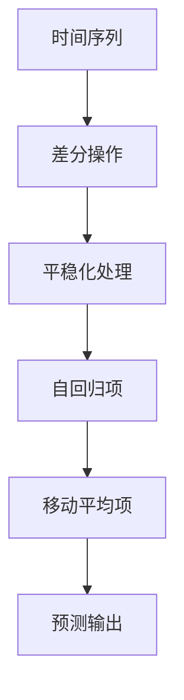
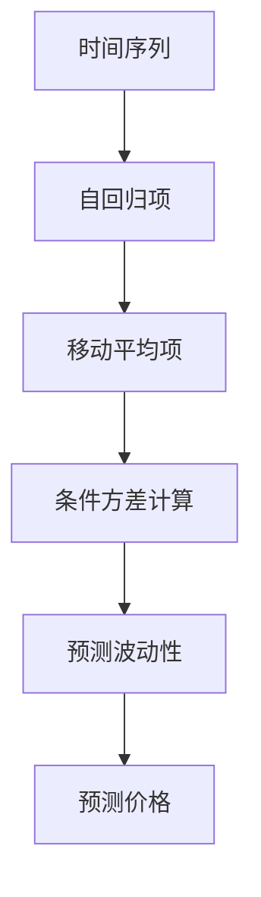

                 

# 股票市场的随机过程：金融波动的数学描述

> **关键词**：股票市场、随机过程、金融波动、数学模型、预测、风险管理

> **摘要**：本文旨在探讨股票市场中的随机过程，通过数学描述来解析金融波动。文章首先介绍了股票市场和随机过程的基础概念，然后详细阐述了随机过程的理论基础，包括马尔可夫性质、随机游走过程、独立增量过程和白噪声过程。接着，文章介绍了金融波动的基本数学模型，如随机漫步模型、布朗运动模型和马尔可夫模型。此外，文章还讨论了波动性度量与风险管理方法，以及金融时间序列分析。最后，文章通过应用案例和未来展望，展示了随机过程与金融数学在实际中的应用和研究趋势。本文为从事金融科技研究和实践的读者提供了一个全面的理论与实践指南。

### 《股票市场的随机过程：金融波动的数学描述》目录大纲

#### 第一部分：股票市场与随机过程概述

- **第1章：股票市场基础与随机过程引入**
  - **1.1 股票市场基本概念**
    - **1.1.1 股票市场概述**
    - **1.1.2 股票价格影响因素**
    - **1.1.3 股票市场波动性**
  - **1.2 随机过程基本概念**
    - **1.2.1 随机过程定义**
    - **1.2.2 随机变量的基本性质**
    - **1.2.3 随机过程分类**
  - **1.3 随机过程在金融中的应用**
    - **1.3.1 随机过程模型的选择**
    - **1.3.2 随机过程在股票价格预测中的应用**

#### 第二部分：随机过程理论详解

- **第2章：随机过程理论基础**
  - **2.1 马尔可夫性质与状态转移矩阵**
    - **2.1.1 马尔可夫性质**
    - **2.1.2 状态转移矩阵**
    - **2.1.3 马尔可夫链**
  - **2.2 随机游走过程**
    - **2.2.1 随机游走过程定义**
    - **2.2.2 随机游走的性质**
    - **2.2.3 随机游走的应用**
  - **2.3 独立增量过程**
    - **2.3.1 独立增量过程定义**
    - **2.3.2 独立增量过程的性质**
    - **2.3.3 独立增量过程在金融中的应用**
  - **2.4 白噪声过程**
    - **2.4.1 白噪声过程定义**
    - **2.4.2 白噪声过程的性质**
    - **2.4.3 白噪声过程在金融中的应用**

#### 第三部分：金融波动数学描述

- **第3章：金融波动基本数学模型**
  - **3.1 随机漫步模型**
    - **3.1.1 随机漫步模型原理**
    - **3.1.2 随机漫步模型公式**
    - **3.1.3 随机漫步模型应用**
  - **3.2 布朗运动模型**
    - **3.2.1 布朗运动模型原理**
    - **3.2.2 布朗运动模型公式**
    - **3.2.3 布朗运动模型应用**
  - **3.3 马尔可夫模型**
    - **3.3.1 马尔可夫模型原理**
    - **3.3.2 马尔可夫模型公式**
    - **3.3.3 马尔可夫模型应用**

- **第4章：波动性度量与风险管理**
  - **4.1 波动性度量方法**
    - **4.1.1 方差与标准差**
    - **4.1.2 均值绝对偏差（MAD）**
    - **4.1.3 条件波动性度量**
  - **4.2 风险管理模型**
    - **4.2.1 价值在风险（VaR）模型**
    - **4.2.2 极值理论（Extremes Theory）**
    - **4.2.3 风险调整收益（RAROC）模型**

- **第5章：金融时间序列分析**
  - **5.1 时间序列基本概念**
    - **5.1.1 时间序列的定义与分类**
    - **5.1.2 自相关与偏自相关函数**
    - **5.1.3 阶跃响应函数**
  - **5.2 ARIMA模型**
    - **5.2.1 ARIMA模型原理**
    - **5.2.2 ARIMA模型公式**
    - **5.2.3 ARIMA模型应用**
  - **5.3 GARCH模型**
    - **5.3.1 GARCH模型原理**
    - **5.3.2 GARCH模型公式**
    - **5.3.3 GARCH模型应用**

#### 第四部分：随机过程与金融数学展望

- **第6章：随机波动性模型应用案例**
  - **6.1 股票价格波动预测**
    - **6.1.1 股票价格波动预测方法**
    - **6.1.2 预测结果分析与评估**
  - **6.2 波动性风险管理**
    - **6.2.1 波动性风险管理方法**
    - **6.2.2 风险管理案例分析**
  - **6.3 股票市场突发事件分析**
    - **6.3.1 突发事件检测方法**
    - **6.3.2 突发事件影响分析**
    - **6.3.3 突发事件应对策略**

- **第7章：随机过程与金融数学发展趋势**
  - **7.1 机器学习与随机过程融合**
    - **7.1.1 随机过程在机器学习中的应用**
    - **7.1.2 机器学习算法在随机过程分析中的应用**
  - **7.2 金融数学与量化投资**
    - **7.2.1 金融数学在量化投资中的应用**
    - **7.2.2 量化投资策略案例分析**
  - **7.3 随机过程与金融市场调控**
    - **7.3.1 随机过程模型在金融市场调控中的应用**
    - **7.3.2 金融市场调控策略分析**
    - **7.3.3 随机过程模型在政策评估中的应用**

#### 附录

- **附录A：随机过程与金融数学相关工具与资源**
  - **A.1 随机过程分析工具**
  - **A.2 金融数学分析工具**
  - **A.3 开源资源与数据库**
  - **A.4 相关书籍与参考文献**

- **附录B：Mermaid 流程图**
  - **B.1 马尔可夫链流程图**
  - **B.2 ARIMA模型流程图**
  - **B.3 GARCH模型流程图**

- **附录C：伪代码与数学公式**
  - **C.1 随机漫步模型伪代码**
  - **C.2 布朗运动模型公式**
  - **C.3 马尔可夫模型公式**
  - **C.4 价值在风险（VaR）模型公式**
  - **C.5 机器学习与随机过程融合公式**

### 第一部分：股票市场基础与随机过程引入

### 第1章：股票市场基础与随机过程引入

#### 1.1 股票市场基本概念

**1.1.1 股票市场概述**

股票市场是一个供投资者买卖股票的场所，它为企业的资本筹集提供了重要的渠道，同时也是投资者实现财富增值的重要途径。股票市场的发展历史可以追溯到几个世纪前，然而，现代股票市场的雏形是在20世纪初期形成的。世界上最早的股票市场之一是纽约证券交易所（NYSE），它成立于1792年。随着全球经济的不断发展，股票市场已经成为全球金融体系的重要组成部分。

股票市场由两个主要部分组成：主板市场和创业板市场。主板市场通常是指那些对上市公司的财务状况、运营业绩和市场规模有较高要求的股票市场，例如纽约证券交易所、伦敦证券交易所和纳斯达克证券交易所。创业板市场则为那些处于成长阶段、财务状况和规模尚未达到主板市场要求的企业提供了上市机会，例如纳斯达克资本市场（NASDAQ Capital Market）和香港交易所的GEM（Growth Enterprise Market）板。

**1.1.2 股票价格影响因素**

股票价格是由市场供需关系决定的，但实际影响因素远比简单的供需更为复杂。以下是几个主要影响股票价格的因素：

1. **公司基本面**：公司的财务状况、盈利能力、增长前景和市场地位等因素都会影响股票价格。投资者通常会通过公司的财务报表，如利润表、资产负债表和现金流量表来评估公司的基本面。

2. **宏观经济因素**：经济增长率、通货膨胀率、利率水平、货币政策等宏观经济因素都会影响股票市场的整体表现。例如，低利率环境通常会促使投资者寻求更高收益的股票投资，从而推高股票价格。

3. **市场情绪**：市场情绪是指投资者对市场的整体看法和预期，包括乐观或悲观的情绪。市场情绪可以通过新闻、社交媒体、投资者会议等方式传播，并迅速影响股票价格。

4. **政策因素**：政府的政策变动，如税收政策、监管政策、贸易政策等，都会对股票市场产生重大影响。例如，税收优惠政策可能会刺激企业投资，进而提高股票价格。

5. **技术因素**：技术进步和创新也是影响股票价格的重要因素。例如，互联网和移动通信技术的快速发展促进了电子商务和移动支付的发展，从而推动了相关公司的股价上涨。

**1.1.3 股票市场波动性**

股票市场波动性是指股票价格变动的剧烈程度，通常用波动率来衡量。波动性可以分为历史波动性和预期波动性。历史波动性是基于过去股票价格变动的统计指标，如标准差；而预期波动性则是市场对未来价格波动性的预测。

股票市场波动性的影响因素包括但不限于：

1. **市场供求关系**：当市场需求超过供给时，股票价格上升；反之，当市场供给超过需求时，股票价格下降。

2. **投资者行为**：投资者情绪的波动，如恐慌、贪婪等，会导致股票价格的非理性波动。

3. **宏观经济波动**：经济增长放缓、通货膨胀加剧等宏观经济问题会导致股票市场波动性增大。

4. **政策变化**：政策的变化，如利率调整、税收政策变化等，可能会引起市场预期变化，进而影响股票价格。

5. **突发事件**：政治事件、自然灾害、恐怖袭击等突发事件会引发市场恐慌，导致股票价格大幅波动。

**1.2 随机过程基本概念**

**1.2.1 随机过程定义**

随机过程是数学中的一个概念，它是一系列随机变量按照时间或其他某种顺序排列而成的集合。随机过程在金融领域中有着广泛的应用，用于描述股票价格、利率、汇率等金融变量的随机波动。

随机过程通常可以用一个序列来表示，例如{Xt}，其中Xt是第t个随机变量，t是时间变量。随机过程可以具有以下几种特性：

1. **随机性**：随机过程的每一个随机变量都是随机的，即它不能被精确预测。

2. **时间连续性**：随机过程通常是时间连续的，意味着它可以在任意时间点观察。

3. **平稳性**：随机过程可以是平稳的或非平稳的。平稳随机过程在其整个时间内具有相同的统计特性，即其均值、方差等不会随时间变化。

4. **独立增量**：对于平稳随机过程，任意两个不同时间点的增量是相互独立的。

**1.2.2 随机变量的基本性质**

随机变量是概率论中的一个基本概念，它是一个将样本空间映射到实数集的函数。随机变量的性质包括：

1. **期望值**：期望值（或均值）是随机变量取值的平均值，反映了随机变量的中心趋势。

2. **方差**：方差是随机变量取值与其期望值之间差异的平方的平均值，反映了随机变量的离散程度。

3. **概率分布**：概率分布描述了随机变量取值的概率分布情况，如正态分布、泊松分布等。

4. **条件概率**：条件概率是指在给定某个事件发生的条件下，另一个事件发生的概率。

**1.2.3 随机过程分类**

随机过程可以根据其特性进行分类，常见的分类方法包括：

1. **离散随机过程**：时间变量是离散的随机过程，例如，股票价格在一天内可以划分为若干个离散的时间点。

2. **连续随机过程**：时间变量是连续的随机过程，例如，股票价格的波动是连续的时间过程。

3. **马尔可夫随机过程**：具有马尔可夫性质的随机过程，即当前状态仅依赖于前一个状态，与之前的状态无关。

4. **平稳随机过程**：统计特性不随时间变化的随机过程。

5. **高斯随机过程**：所有随机变量服从高斯分布的随机过程。

**1.3 随机过程在金融中的应用**

随机过程在金融领域有着广泛的应用，主要用于描述和分析金融时间序列数据，包括股票价格、利率、汇率等。以下是随机过程在金融领域中的一些应用：

1. **股票价格预测**：利用随机过程模型可以预测股票价格的未来走势，帮助投资者做出投资决策。

2. **波动性度量**：随机过程可以用于度量金融市场的波动性，从而为风险管理提供依据。

3. **风险评估**：通过随机过程模型可以评估金融产品的风险，为金融机构的风险管理提供支持。

4. **量化投资策略**：随机过程模型在量化投资策略的设计和实现中扮演着重要角色，帮助投资者实现资产配置和风险控制。

5. **市场行为分析**：随机过程模型可以揭示市场行为的随机性和规律性，为市场参与者提供决策依据。

#### 1.3.1 随机过程模型的选择

在金融市场中，选择合适的随机过程模型是进行有效预测和分析的关键。以下是一些常见的随机过程模型及其适用场景：

1. **随机漫步模型**：随机漫步模型是一个简单的随机过程模型，适用于描述股票价格的短期波动。该模型假设股票价格的未来走势仅取决于当前状态，与历史状态无关。

2. **布朗运动模型**：布朗运动模型是随机过程的一个经典模型，用于描述金融时间序列中的随机波动。该模型假设股票价格的增量服从正态分布，可以用于分析股票价格的中长期波动。

3. **马尔可夫模型**：马尔可夫模型是一种基于状态转移概率的随机过程模型，适用于分析具有离散状态集合的金融时间序列。该模型可以用于预测股票价格在不同状态之间的转移概率，从而为投资决策提供依据。

4. **ARIMA模型**：ARIMA模型是一种自回归积分滑动平均模型，适用于处理非平稳金融时间序列。该模型结合了自回归、差分和移动平均三个部分，可以有效地描述金融时间序列的短期和长期波动。

5. **GARCH模型**：GARCH模型是一种广义自回归条件异方差模型，适用于处理金融时间序列的波动聚集现象。该模型能够动态地调整波动性，从而更准确地描述金融市场的波动性特征。

选择合适的随机过程模型需要考虑多个因素，包括数据特征、模型复杂度和预测准确性。在实际应用中，通常需要通过模型比较和优化来确定最佳的随机过程模型。

**1.3.2 随机过程在股票价格预测中的应用**

随机过程模型在股票价格预测中有着广泛的应用，通过建模和预测可以帮助投资者做出更明智的投资决策。以下是一些常见的随机过程模型及其在股票价格预测中的应用：

1. **随机漫步模型**：随机漫步模型假设股票价格的增量是独立的，且服从正态分布。这种模型适用于短期股票价格预测，可以帮助投资者识别短期市场趋势。

   **随机漫步模型伪代码：**
   ```python
   import numpy as np

   def random_walk_model(steps, mean, std):
       X = [mean]
       for _ in range(steps - 1):
           step = np.random.normal(mean, std)
           X.append(X[-1] + step)
       return X
   ```

2. **布朗运动模型**：布朗运动模型是随机漫步模型的扩展，假设股票价格的增量服从正态分布，并且具有均值回归特性。这种模型适用于中长期股票价格预测，可以帮助投资者把握市场趋势。

   **布朗运动模型公式：**
   $$X_t = X_{t-1} + Z_t$$
   其中，$Z_t$是服从正态分布的随机变量。

3. **马尔可夫模型**：马尔可夫模型基于状态转移概率矩阵，用于描述股票价格在不同状态之间的转移。这种模型适用于分析股票价格的短期波动，可以帮助投资者预测股票价格的状态转移。

   **马尔可夫模型公式：**
   $$P_{ij} = P(X_t = j | X_{t-1} = i)$$
   其中，$P_{ij}$是状态转移概率。

4. **ARIMA模型**：ARIMA模型是一种自回归积分滑动平均模型，适用于处理非平稳金融时间序列。这种模型可以结合自回归、差分和移动平均三个部分，描述股票价格的短期和长期波动。

   **ARIMA模型公式：**
   $$X_t = c + \phi_1 X_{t-1} + \phi_2 X_{t-2} + \dots + \phi_p X_{t-p} + \theta_1 \epsilon_{t-1} + \theta_2 \epsilon_{t-2} + \dots + \theta_q \epsilon_{t-q} + \epsilon_t$$
   其中，$\epsilon_t$是白噪声误差项。

5. **GARCH模型**：GARCH模型是一种广义自回归条件异方差模型，用于处理金融时间序列的波动聚集现象。这种模型可以动态地调整波动性，从而更准确地描述股票价格的波动特征。

   **GARCH模型公式：**
   $$\sigma_t^2 = \omega + \alpha_1 \epsilon_{t-1}^2 + \beta_1 \sigma_{t-1}^2$$
   其中，$\sigma_t^2$是波动性，$\epsilon_t$是误差项。

在实际应用中，通过选择合适的随机过程模型，结合历史数据和市场信息，可以有效地预测股票价格的未来走势，为投资者提供决策支持。

### 第二部分：随机过程理论详解

#### 第2章：随机过程理论基础

随机过程是金融时间序列分析的重要工具，它为理解金融市场的随机波动提供了数学基础。本章将详细探讨随机过程的理论基础，包括马尔可夫性质、状态转移矩阵、随机游走过程、独立增量过程和白噪声过程。

#### 2.1 马尔可夫性质与状态转移矩阵

**2.1.1 马尔可夫性质**

马尔可夫性质是随机过程的一个重要特性，它表明当前状态仅取决于前一状态，而与之前的状态无关。这一性质使得随机过程在预测和建模中具有很大的应用价值。

**马尔可夫性质公式：**
$$P(X_t = j | X_{t-1} = i, X_{t-2} = k) = P(X_t = j | X_{t-1} = i)$$

**2.1.2 状态转移矩阵**

状态转移矩阵是描述马尔可夫过程的重要工具，它是一个方阵，其中的元素表示从某一状态转移到另一状态的概率。

**状态转移矩阵公式：**
$$P = \begin{bmatrix}
P_{00} & P_{01} & \dots & P_{0n} \\
P_{10} & P_{11} & \dots & P_{1n} \\
\vdots & \vdots & \ddots & \vdots \\
P_{m0} & P_{m1} & \dots & P_{mn}
\end{bmatrix}$$

其中，$P_{ij}$表示从状态$i$转移到状态$j$的概率。

**2.1.3 马尔可夫链**

马尔可夫链是一种特殊的马尔可夫过程，它的状态集合是离散的，并且每个状态只依赖于前一个状态。马尔可夫链可以用来描述股票价格在不同状态之间的转移。

**马尔可夫链示例：**
假设股票价格有两个状态：上涨和下跌。状态转移矩阵如下：

$$P = \begin{bmatrix}
0.7 & 0.3 \\
0.2 & 0.8
\end{bmatrix}$$

这个矩阵表明，如果股票价格当前处于上涨状态，那么下一期继续上涨的概率是0.7，下跌的概率是0.3；如果当前处于下跌状态，那么下一期上涨的概率是0.2，下跌的概率是0.8。

**2.1.4 马尔可夫链的稳定分布**

在马尔可夫链中，存在一种稳定分布，它表示长期状态下各个状态的概率分布。稳定分布可以通过迭代状态转移矩阵得到。

**稳定分布公式：**
$$\pi = P^n$$

其中，$\pi$是稳定分布，$P$是状态转移矩阵，$n$是迭代次数。

#### 2.2 随机游走过程

随机游走过程是一种简单的随机过程，它描述了股票价格在随机波动下的运动。随机游走过程具有独立增量特性，即当前增量与过去增量无关。

**2.2.1 随机游走过程定义**

随机游走过程可以用一个随机变量序列来表示，其中每个随机变量表示股票价格的一次增量。

**随机游走过程公式：**
$$X_t = X_{t-1} + Z_t$$

其中，$Z_t$是独立同分布的随机变量，通常服从正态分布。

**2.2.2 随机游走的性质**

随机游走过程的性质包括：

1. **无记忆性**：当前增量与过去增量无关，符合马尔可夫性质。
2. **独立增量**：每个随机变量都是独立的，增量之间没有相关性。
3. **随机波动**：增量服从正态分布，描述了股票价格的随机波动。

**2.2.3 随机游走的应用**

随机游走过程在金融市场中广泛应用于股票价格预测和波动性分析。例如，可以利用随机游走模型来预测股票价格的未来走势，或者计算股票价格的波动性。

#### 2.3 独立增量过程

独立增量过程是一种特殊的随机过程，它的每个增量都是独立的，与过去和未来的增量无关。

**2.3.1 独立增量过程定义**

独立增量过程可以用一个随机变量序列来表示，其中每个随机变量表示股票价格的一次增量。

**独立增量过程公式：**
$$X_t = \sum_{i=1}^{t} Z_i$$

其中，$Z_i$是独立同分布的随机变量。

**2.3.2 独立增量过程的性质**

独立增量过程的性质包括：

1. **独立增量**：每个随机变量都是独立的，增量之间没有相关性。
2. **无记忆性**：当前增量与过去增量无关，符合马尔可夫性质。
3. **随机波动**：增量服从正态分布，描述了股票价格的随机波动。

**2.3.3 独立增量过程在金融中的应用**

独立增量过程在金融市场中广泛应用于波动性分析和风险管理。例如，可以利用独立增量过程来计算股票价格的波动性，从而为风险管理提供依据。

#### 2.4 白噪声过程

白噪声过程是一种理想的随机过程，它的每个增量都是独立的，并且具有恒定的方差。白噪声过程是许多实际随机过程的理想近似。

**2.4.1 白噪声过程定义**

白噪声过程可以用一个随机变量序列来表示，其中每个随机变量表示股票价格的一次增量。

**白噪声过程公式：**
$$X_t = Z_t$$

其中，$Z_t$是独立同分布的随机变量，通常服从正态分布。

**2.4.2 白噪声过程的性质**

白噪声过程的性质包括：

1. **独立增量**：每个随机变量都是独立的，增量之间没有相关性。
2. **恒定方差**：每个增量的方差是恒定的。
3. **无记忆性**：当前增量与过去增量无关，符合马尔可夫性质。

**2.4.3 白噪声过程在金融中的应用**

白噪声过程在金融市场中广泛应用于波动性分析和风险管理。例如，可以利用白噪声过程来计算股票价格的波动性，从而为风险管理提供依据。

#### 2.4.4 白噪声过程在金融中的应用

白噪声过程在金融领域中具有广泛的应用，特别是在波动性分析和风险管理方面。以下是白噪声过程在金融中的具体应用：

1. **波动性度量**：白噪声过程可以用来度量金融时间序列的波动性。通过计算白噪声过程的方差，可以得出时间序列的波动性水平，这有助于投资者评估市场风险。

2. **风险建模**：白噪声过程可以用于构建风险管理模型，如价值在风险（VaR）模型。通过模拟白噪声过程，可以预测金融时间序列的极端波动情况，从而为金融机构的风险管理提供依据。

3. **市场预测**：白噪声过程可以用于预测金融市场的未来波动性。通过分析历史波动性数据，可以构建白噪声过程模型，从而预测市场的未来波动性，为投资决策提供参考。

4. **量化交易策略**：白噪声过程在量化交易策略的设计中具有重要意义。例如，可以利用白噪声过程模型来构建交易信号，实现自动化交易策略。

为了更好地理解白噪声过程在金融中的应用，以下是一个简单的示例：

**示例**：假设我们有一个金融时间序列数据，数据点为每日的股票收盘价格。我们可以使用白噪声过程来分析这个时间序列的波动性。

**步骤1**：首先，计算时间序列数据的日波动性，即每日价格变化的标准差。

$$\sigma = \sqrt{\frac{1}{n-1} \sum_{i=1}^{n} (X_i - \bar{X})^2}$$

其中，$X_i$是第i天的收盘价，$\bar{X}$是平均收盘价，$n$是数据点的数量。

**步骤2**：生成一个服从正态分布的白噪声序列，均值为0，标准差为$\sigma$。

$$Z_i = \sigma \cdot \epsilon_i$$

其中，$\epsilon_i$是标准正态分布的随机变量。

**步骤3**：使用白噪声序列来模拟时间序列数据的未来波动性。

$$X_{t+1} = X_t + Z_{t+1}$$

通过上述步骤，我们可以得到一个模拟的时间序列数据，它具有与原始数据相同的波动性特征。这个模拟数据可以用于分析和预测金融市场的未来波动性。

#### 2.5 马尔可夫性质在金融中的应用

马尔可夫性质在金融领域中具有广泛的应用，特别是在股票市场分析和风险管理方面。以下是一些具体的应用场景：

1. **股票价格预测**：马尔可夫性质可以用于预测股票价格的未来走势。通过构建一个马尔可夫模型，我们可以根据历史数据计算状态转移概率，从而预测股票价格在不同状态之间的转移概率。这种预测方法可以用于短期交易策略和长期投资决策。

2. **市场趋势分析**：马尔可夫性质可以用于分析市场的整体趋势。通过观察状态转移概率矩阵，我们可以识别市场的上升期、下跌期和震荡期，从而为投资者提供市场趋势的参考。

3. **风险管理**：马尔可夫性质可以用于评估金融产品的风险。通过构建一个马尔可夫模型，我们可以计算产品在不同状态下的损失概率，从而为金融机构的风险管理提供依据。例如，在债券投资中，可以利用马尔可夫模型来评估债券的违约风险。

4. **投资组合优化**：马尔可夫性质可以用于投资组合优化。通过构建一个马尔可夫模型，我们可以计算不同资产在不同状态下的收益和风险，从而为投资者提供最优的投资组合策略。

为了更好地理解马尔可夫性质在金融中的应用，以下是一个简单的示例：

**示例**：假设我们有一个简单的股票市场模型，股票价格有两个状态：上涨和下跌。我们可以使用马尔可夫模型来分析这个市场的动态。

**步骤1**：首先，收集历史数据，包括股票价格的上涨和下跌情况。然后，计算状态转移概率矩阵。

$$P = \begin{bmatrix}
P_{uu} & P_{ud} \\
P_{du} & P_{dd}
\end{bmatrix}$$

其中，$P_{uu}$是从上涨状态转移到上涨状态的概率，$P_{ud}$是从上涨状态转移到下跌状态的概率，$P_{du}$是从下跌状态转移到上涨状态的概率，$P_{dd}$是从下跌状态转移到下跌状态的概率。

**步骤2**：使用状态转移概率矩阵来预测股票价格的未来走势。例如，如果我们当前处于上涨状态，那么下一期上涨的概率为$P_{uu}$，下跌的概率为$P_{ud}$。

**步骤3**：根据预测结果，制定相应的投资策略。例如，如果预测下一期股票价格将继续上涨，那么我们可以考虑买入股票；如果预测下一期股票价格将下跌，那么我们可以考虑卖出股票。

通过上述步骤，我们可以利用马尔可夫性质来分析和预测股票市场的动态，为投资者提供决策支持。

#### 2.6 状态转移矩阵在金融中的应用

状态转移矩阵是随机过程分析中的重要工具，它在金融领域中有着广泛的应用。以下是一些具体的例子：

1. **股票市场状态分析**：状态转移矩阵可以用于分析股票市场的状态变化。例如，假设股票市场有四个状态：上涨、下跌、震荡和横盘。通过收集历史数据，可以计算状态转移概率矩阵，从而分析市场在不同状态之间的转移概率。这有助于投资者识别市场趋势和制定交易策略。

2. **宏观经济指标预测**：状态转移矩阵可以用于预测宏观经济指标的变化。例如，假设宏观经济指标有四个状态：繁荣、衰退、复苏和萧条。通过构建状态转移矩阵，可以分析这些指标在不同状态之间的转移概率，从而预测未来经济周期的变化。

3. **信用评级分析**：状态转移矩阵可以用于信用评级分析。例如，假设企业信用评级有四个状态：投资级、投机级、违约和破产。通过收集历史数据，可以计算状态转移概率矩阵，从而分析企业信用评级的变化趋势，为金融机构提供信用评估依据。

4. **风险管理和投资组合优化**：状态转移矩阵可以用于风险管理和投资组合优化。例如，通过构建状态转移矩阵，可以分析不同资产在不同状态下的收益和风险，从而为投资者提供最优的投资组合策略。

为了更好地理解状态转移矩阵在金融中的应用，以下是一个简单的示例：

**示例**：假设我们有一个简单的宏观经济模型，宏观经济指标有两个状态：增长和衰退。我们可以使用状态转移矩阵来分析这个模型。

**步骤1**：首先，收集历史数据，包括宏观经济指标的增长和衰退情况。然后，计算状态转移概率矩阵。

$$P = \begin{bmatrix}
P_{gg} & P_{gd} \\
P_{dg} & P_{dd}
\end{bmatrix}$$

其中，$P_{gg}$是从增长状态转移到增长状态的概率，$P_{gd}$是从增长状态转移到衰退状态的概率，$P_{dg}$是从衰退状态转移到增长状态的概率，$P_{dd}$是从衰退状态转移到衰退状态的概率。

**步骤2**：使用状态转移矩阵来预测未来宏观经济指标的状态变化。例如，如果我们当前处于增长状态，那么下一期增长的概率为$P_{gg}$，衰退的概率为$P_{gd}$。

**步骤3**：根据预测结果，制定相应的投资策略。例如，如果预测下一期宏观经济指标将继续增长，那么我们可以考虑增加股票等风险资产的配置；如果预测下一期宏观经济指标将进入衰退，那么我们可以考虑增加债券等固定收益资产的配置。

通过上述步骤，我们可以利用状态转移矩阵来分析和预测宏观经济指标的变化，为投资者提供决策支持。

#### 第3章：金融波动基本数学模型

金融波动是金融市场的一个重要特征，它反映了股票价格、利率、汇率等金融变量的随机波动。本章将介绍几种基本的数学模型，用于描述金融波动性，包括随机漫步模型、布朗运动模型和马尔可夫模型。

#### 3.1 随机漫步模型

随机漫步模型是金融时间序列分析中最基本的模型之一，它假设股票价格的变化是随机的，且每个变化都是独立的。随机漫步模型最初由法国数学家泊松提出，后来由英国生物学家罗纳德·费舍尔进行了深入研究。

**3.1.1 随机漫步模型原理**

随机漫步模型的核心思想是股票价格的每次变化都是随机且独立的，且变化的方向和大小是均匀分布的。这种模型适用于短期股票价格波动的分析和预测。

**随机漫步模型公式：**
$$X_t = X_{t-1} + Z_t$$

其中，$X_t$表示第t期的股票价格，$X_{t-1}$表示第t-1期的股票价格，$Z_t$表示第t期的价格变化。$Z_t$通常服从均值为0、方差为$\sigma^2$的正态分布。

$$Z_t \sim N(0, \sigma^2)$$

**3.1.2 随机漫步模型公式**

随机漫步模型可以使用以下公式来描述股票价格的变化：

$$X_t = X_{t-1} + Z_t$$

其中，$X_t$表示第t期的股票价格，$X_{t-1}$表示第t-1期的股票价格，$Z_t$表示第t期的价格变化。

$$Z_t \sim N(0, \sigma^2)$$

**3.1.3 随机漫步模型应用**

随机漫步模型在金融市场中有着广泛的应用，主要包括以下方面：

1. **短期股票价格预测**：随机漫步模型可以用来预测短期股票价格的变化趋势，帮助投资者制定短期交易策略。

2. **波动性分析**：随机漫步模型可以用来分析股票价格的波动性，为风险管理提供依据。

3. **市场行为分析**：随机漫步模型可以帮助分析师了解市场的随机波动特征，从而更好地理解市场行为。

**随机漫步模型伪代码：**

```python
import numpy as np

# 随机漫步模型参数
mean = 0  # 均值
std = 1  # 标准差
steps = 100  # 时间步长

# 初始化股票价格序列
X = [mean]

# 模拟随机漫步过程
for _ in range(steps - 1):
    step = np.random.normal(mean, std)
    X.append(X[-1] + step)

# 输出股票价格序列
print(X)
```

**3.1.4 随机漫步模型的应用案例**

假设我们要模拟一个随机漫步模型，以预测股票价格的未来走势。我们可以使用以下步骤：

1. **初始化模型参数**：设置均值和标准差，例如均值设置为0，标准差设置为1。

2. **生成随机数**：使用随机数生成器生成满足均值为0、标准差为1的正态分布随机数。

3. **模拟股票价格变化**：根据随机漫步模型公式，每次将随机数加到当前股票价格上，生成新的股票价格序列。

4. **分析结果**：分析生成的股票价格序列，观察股票价格的波动趋势。

通过上述步骤，我们可以使用随机漫步模型来预测股票价格的未来走势，为投资者提供决策参考。

**3.1.5 随机漫步模型的优势与局限**

随机漫步模型在金融市场中具有以下优势：

1. **简单性**：随机漫步模型是一种简单易用的模型，适用于对短期股票价格波动的分析和预测。

2. **灵活性**：随机漫步模型可以灵活地调整均值和标准差，以适应不同的市场环境和数据特征。

3. **适用性**：随机漫步模型适用于各种金融时间序列数据，包括股票价格、汇率、利率等。

然而，随机漫步模型也存在一些局限：

1. **忽视长期趋势**：随机漫步模型主要关注短期波动，忽视了长期趋势和周期性因素。

2. **假设独立性**：随机漫步模型假设每次价格变化都是独立的，这在实际情况中可能并不完全成立。

3. **参数敏感性**：随机漫步模型的预测结果对参数的选择非常敏感，需要通过历史数据进行优化。

**3.1.6 随机漫步模型在金融中的应用案例**

以下是一个简单的应用案例：

假设我们要使用随机漫步模型预测一只股票的未来价格。我们可以按照以下步骤进行：

1. **收集历史数据**：收集该股票在过去一段时间内的价格数据，例如每日收盘价。

2. **计算参数**：计算历史数据的均值和标准差，作为随机漫步模型的参数。

3. **模拟价格变化**：使用随机漫步模型公式，模拟未来一段时间内股票的价格变化。

4. **分析结果**：分析模拟结果，观察股票价格的波动趋势，为投资决策提供参考。

通过上述步骤，我们可以使用随机漫步模型对股票价格进行预测，帮助投资者制定交易策略。

#### 3.2 布朗运动模型

布朗运动模型是随机漫步模型的扩展，它考虑了价格变化之间的相关性。布朗运动模型最初由英国植物学家罗伯特·布朗在观察悬浮在水中的花粉颗粒运动时提出，后来被应用于金融时间序列分析中。

**3.2.1 布朗运动模型原理**

布朗运动模型的核心思想是股票价格的变化是随机的，但每个变化都与过去的变化存在某种相关性。这种模型适用于中长期股票价格波动的分析和预测。

**布朗运动模型公式：**
$$X_t = X_{t-1} + Z_t$$

其中，$X_t$表示第t期的股票价格，$X_{t-1}$表示第t-1期的股票价格，$Z_t$表示第t期的价格变化。$Z_t$通常服从正态分布，但与随机漫步模型不同的是，$Z_t$与过去的价格变化存在相关性。

$$Z_t \sim N(0, \sigma^2)$$

**3.2.2 布朗运动模型的应用**

布朗运动模型在金融市场中有着广泛的应用，主要包括以下方面：

1. **中长期股票价格预测**：布朗运动模型可以用来预测中长期股票价格的变化趋势，帮助投资者制定投资策略。

2. **波动性分析**：布朗运动模型可以用来分析股票价格的波动性，为风险管理提供依据。

3. **市场行为分析**：布朗运动模型可以帮助分析师了解市场的随机波动特征，从而更好地理解市场行为。

**3.2.3 布朗运动模型的伪代码**

```python
import numpy as np

# 布朗运动模型参数
mean = 0  # 均值
std = 1  # 标准差
steps = 100  # 时间步长

# 初始化股票价格序列
X = [mean]

# 模拟布朗运动过程
for _ in range(steps - 1):
    step = np.random.normal(mean, std)
    X.append(X[-1] + step)

# 输出股票价格序列
print(X)
```

**3.2.4 布朗运动模型的优势与局限**

布朗运动模型在金融市场中具有以下优势：

1. **考虑相关性**：布朗运动模型考虑了价格变化之间的相关性，比随机漫步模型更接近实际市场情况。

2. **适用性**：布朗运动模型适用于各种金融时间序列数据，包括股票价格、汇率、利率等。

然而，布朗运动模型也存在一些局限：

1. **参数敏感性**：布朗运动模型的预测结果对参数的选择非常敏感，需要通过历史数据进行优化。

2. **高维问题**：在实际应用中，金融时间序列数据通常包含多个变量，布朗运动模型在高维问题中可能存在计算复杂度问题。

**3.2.5 布朗运动模型在金融中的应用案例**

以下是一个简单的应用案例：

假设我们要使用布朗运动模型预测一只股票的未来价格。我们可以按照以下步骤进行：

1. **收集历史数据**：收集该股票在过去一段时间内的价格数据，例如每日收盘价。

2. **计算参数**：计算历史数据的均值和标准差，作为布朗运动模型的参数。

3. **模拟价格变化**：使用布朗运动模型公式，模拟未来一段时间内股票的价格变化。

4. **分析结果**：分析模拟结果，观察股票价格的波动趋势，为投资决策提供参考。

通过上述步骤，我们可以使用布朗运动模型对股票价格进行预测，帮助投资者制定交易策略。

#### 3.3 马尔可夫模型

马尔可夫模型是随机过程分析中的一种重要模型，它基于状态转移概率矩阵，描述了金融时间序列在不同状态之间的转移。马尔可夫模型最初由俄国数学家安德烈·马尔可夫提出，广泛应用于自然语言处理、经济学和金融学等领域。

**3.3.1 马尔可夫模型原理**

马尔可夫模型的核心思想是当前状态仅依赖于前一个状态，与之前的状态无关。这种模型适用于描述金融时间序列中的状态转移过程。

**马尔可夫模型公式：**
$$P(X_t = j | X_{t-1} = i) = p_{ij}$$

其中，$X_t$表示第t期的状态，$i$和$j$分别表示不同状态，$p_{ij}$表示从状态$i$转移到状态$j$的概率。

**3.3.2 状态转移矩阵**

状态转移矩阵是描述马尔可夫模型的重要工具，它是一个方阵，其中的元素表示从某一状态转移到另一状态的概率。

$$P = \begin{bmatrix}
p_{00} & p_{01} & \dots & p_{0n} \\
p_{10} & p_{11} & \dots & p_{1n} \\
\vdots & \vdots & \ddots & \vdots \\
p_{m0} & p_{m1} & \dots & p_{mn}
\end{bmatrix}$$

**3.3.3 状态概率分布**

状态概率分布描述了金融时间序列在各个状态下的概率分布情况。状态概率分布可以通过初始状态概率和状态转移矩阵迭代得到。

$$\pi_t = P^t \pi_0$$

其中，$\pi_t$表示第t期的状态概率分布，$P$是状态转移矩阵，$\pi_0$是初始状态概率分布。

**3.3.4 马尔可夫模型的应用**

马尔可夫模型在金融市场中有着广泛的应用，主要包括以下方面：

1. **股票市场状态分析**：马尔可夫模型可以用于分析股票市场的状态变化，预测市场在不同状态之间的转移概率。

2. **宏观经济预测**：马尔可夫模型可以用于预测宏观经济指标的变化，分析经济周期的波动。

3. **信用评级分析**：马尔可夫模型可以用于信用评级分析，预测企业信用评级的变化趋势。

**3.3.5 马尔可夫模型的伪代码**

```python
import numpy as np

# 马尔可夫模型参数
state_transition_matrix = np.array([[0.9, 0.1], [0.2, 0.8]])  # 状态转移矩阵
initial_state_probability = np.array([0.5, 0.5])  # 初始状态概率分布
time_steps = 10  # 时间步长

# 初始化状态概率分布序列
state_probability_sequence = [initial_state_probability]

# 模拟马尔可夫过程
for _ in range(time_steps):
    state_probability_sequence.append(np.dot(state_transition_matrix, state_probability_sequence[-1]))

# 输出状态概率分布序列
print(state_probability_sequence)
```

**3.3.6 马尔可夫模型的优势与局限**

马尔可夫模型在金融市场中具有以下优势：

1. **简单性**：马尔可夫模型是一种简单易用的模型，适用于各种金融时间序列数据的分析。

2. **灵活性**：马尔可夫模型可以根据不同的状态转移矩阵和初始状态概率分布，灵活地适应不同的市场环境。

3. **适用性**：马尔可夫模型适用于各种金融领域，包括股票市场、宏观经济、信用评级等。

然而，马尔可夫模型也存在一些局限：

1. **假设独立性**：马尔可夫模型假设当前状态仅依赖于前一个状态，这与实际市场的复杂性存在差异。

2. **参数敏感性**：马尔可夫模型的预测结果对参数的选择非常敏感，需要通过历史数据进行优化。

**3.3.7 马尔可夫模型在金融中的应用案例**

以下是一个简单的应用案例：

假设我们要使用马尔可夫模型分析股票市场的状态变化。我们可以按照以下步骤进行：

1. **收集历史数据**：收集股票市场的历史状态数据，例如上涨、下跌、震荡等。

2. **计算状态转移矩阵**：根据历史数据，计算状态转移矩阵，描述股票市场在不同状态之间的转移概率。

3. **模拟状态变化**：使用状态转移矩阵和初始状态概率分布，模拟未来一段时间内股票市场的状态变化。

4. **分析结果**：分析模拟结果，观察股票市场的状态变化趋势，为投资决策提供参考。

通过上述步骤，我们可以使用马尔可夫模型对股票市场进行状态分析，帮助投资者制定交易策略。

### 第4章：波动性度量与风险管理

波动性是金融市场中一个重要的概念，它反映了股票价格、利率等金融变量的随机波动程度。有效的波动性度量和管理对于投资者和金融机构来说至关重要。本章将介绍几种常用的波动性度量方法，以及风险管理模型，包括方差与标准差、均值绝对偏差（MAD）、条件波动性度量、价值在风险（VaR）模型、极值理论（Extremes Theory）和风险调整收益（RAROC）模型。

#### 4.1 波动性度量方法

波动性度量方法主要包括方差与标准差、均值绝对偏差（MAD）和条件波动性度量。这些方法可以用来评估金融时间序列的波动性，为风险管理提供依据。

**4.1.1 方差与标准差**

方差是波动性的平方度量，它表示随机变量取值与其期望值之间差异的平方的平均值。标准差是方差的平方根，它反映了随机变量的离散程度。方差和标准差是衡量波动性最常用的方法。

**方差公式：**
$$\sigma^2 = \frac{1}{n} \sum_{i=1}^{n} (X_i - \mu)^2$$

其中，$\sigma^2$是方差，$X_i$是第i个随机变量，$\mu$是期望值，$n$是数据点的数量。

**标准差公式：**
$$\sigma = \sqrt{\sigma^2}$$

**4.1.2 均值绝对偏差（MAD）**

均值绝对偏差（MAD）是方差的绝对值度量，它表示随机变量取值与其期望值之间差异的绝对值的平均值。MAD相对于方差来说，对异常值的影响较小。

**MAD公式：**
$$MAD = \frac{1}{n} \sum_{i=1}^{n} |X_i - \mu|$$

**4.1.3 条件波动性度量**

条件波动性度量是基于条件期望和条件方差来评估金融时间序列的波动性。它考虑了不同条件下的波动性特征，能够提供更精细的风险评估。

**条件波动性度量公式：**
$$\sigma^2_t = \text{Cov}(X_t, X_{t-1})$$

其中，$\sigma^2_t$是第t期的条件波动性，$X_t$和$X_{t-1}$分别是第t期和第t-1期的随机变量。

#### 4.2 风险管理模型

风险管理是金融机构和投资者面临的重大挑战，有效的风险管理能够降低潜在的损失。以下介绍几种常用的风险管理模型。

**4.2.1 价值在风险（VaR）模型**

价值在风险（VaR）模型是一种用于评估金融产品或投资组合在未来一定时间内可能遭受的最大损失的方法。VaR模型基于概率分布和置信水平来计算，能够提供对潜在风险的一种量化估计。

**VaR模型公式：**
$$VaR = F^{-1}(1 - \alpha)$$

其中，$F^{-1}$是概率分布的逆函数，$\alpha$是置信水平。

**4.2.2 极值理论（Extremes Theory）**

极值理论是用于分析极端事件概率的统计理论。它基于最大似然估计和极值分布，用于估计极端损失的概率分布。

**极值理论公式：**
$$P(X > x) = \frac{1}{x} \int_x^{\infty} f(u) du$$

其中，$X$是随机变量，$x$是阈值，$f(u)$是概率密度函数。

**4.2.3 风险调整收益（RAROC）模型**

风险调整收益（RAROC）模型是一种用于评估投资策略或金融产品的风险收益关系的方法。RAROC模型通过计算预期收益和风险之间的比率，来评估投资策略的优劣。

**RAROC模型公式：**
$$RAROC = \frac{\text{预期收益}}{\text{风险}}$$

**4.2.4 风险管理案例分析**

以下是一个风险管理案例分析：

**案例**：假设一家金融机构投资于一个股票投资组合，该投资组合的年收益率为12%，波动率为20%。金融机构希望使用VaR模型来评估投资组合在未来一个月内的风险。

**步骤1**：收集历史股票价格数据，计算收益率的分布。

**步骤2**：使用正态分布的逆函数，计算95%置信水平下的VaR值。

$$VaR = F^{-1}(1 - 0.95) = 12\% \times 1.645 = 19.74\%$$

**步骤3**：分析结果，金融机构可以决定是否调整投资组合以降低风险。

通过上述步骤，金融机构可以使用VaR模型来评估投资组合的风险，并制定相应的风险管理策略。

### 第5章：金融时间序列分析

金融时间序列分析是金融领域中的一项重要任务，它旨在揭示金融市场中股票价格、利率、汇率等时间序列数据的统计特征和变化规律。本章将介绍金融时间序列分析的基本概念，包括时间序列的定义与分类、自相关与偏自相关函数、阶跃响应函数，以及常用的时间序列模型：ARIMA模型和GARCH模型。

#### 5.1 时间序列基本概念

**5.1.1 时间序列的定义与分类**

时间序列是指一系列按时间顺序排列的数据点，这些数据点可以是金融价格、经济指标或其他任何随时间变化的数据。时间序列数据通常具有以下特征：

1. **序列性**：数据点是按时间顺序排列的，每个时间点对应一个特定的时刻。
2. **稳定性**：时间序列的统计特性（如均值、方差）在一段时间内保持相对稳定。
3. **趋势性**：时间序列数据可能表现出某种趋势，如上升、下降或波动。
4. **季节性**：时间序列数据可能受到季节性因素的影响，如节假日、季节性销售高峰等。

根据时间序列的特性，可以将时间序列分为以下几类：

1. **确定性时间序列**：数据点之间的变化完全由确定性因素（如固定周期性事件）引起，例如季节性时间序列。
2. **随机时间序列**：数据点之间的变化主要由随机因素引起，例如股票价格时间序列。
3. **平稳时间序列**：时间序列的统计特性（如均值、方差）不随时间变化，例如白噪声时间序列。
4. **非平稳时间序列**：时间序列的统计特性随时间变化，例如趋势性时间序列。

**5.1.2 自相关与偏自相关函数**

自相关函数（Autocorrelation Function, ACF）和偏自相关函数（Partial Autocorrelation Function, PACF）是描述时间序列数据之间相关性的重要工具。

**自相关函数**：自相关函数描述了时间序列数据在不同时间点之间的相关性，它可以通过以下公式计算：

$$\rho(\lambda) = \frac{\sum_{t=1}^{n} (X_t - \bar{X})(X_{t+\lambda} - \bar{X})}{\sqrt{\sum_{t=1}^{n} (X_t - \bar{X})^2} \sqrt{\sum_{t=1}^{n} (X_{t+\lambda} - \bar{X})^2}}$$

其中，$X_t$是第t个时间点的数据，$\bar{X}$是时间序列的均值，$\lambda$是滞后期数。

**偏自相关函数**：偏自相关函数描述了在排除其他滞后期的相关性后，时间序列数据之间的直接相关性。它可以通过以下公式计算：

$$\phi(\lambda) = \rho(\lambda) - \rho(\lambda_1) - \rho(\lambda_2) - \dots - \rho(\lambda_{\lambda-1})$$

其中，$\phi(\lambda)$是偏自相关函数，$\rho(\lambda)$是自相关函数，$\lambda_1, \lambda_2, \dots, \lambda_{\lambda-1}$是前几个滞后期。

**5.1.3 阶跃响应函数**

阶跃响应函数（Step Response Function）是一种用于描述系统对阶跃输入信号的响应的工具。在金融时间序列分析中，阶跃响应函数可以用来分析时间序列数据对突发事件（如政策变动、市场冲击等）的响应。

阶跃响应函数的公式如下：

$$y(t) = c_0 + c_1 e^{-\lambda_1 t} + c_2 e^{-\lambda_2 t} + \dots + c_n e^{-\lambda_n t}$$

其中，$y(t)$是阶跃响应函数，$c_0, c_1, c_2, \dots, c_n$是系数，$\lambda_1, \lambda_2, \dots, \lambda_n$是时间常数。

#### 5.2 ARIMA模型

ARIMA模型（自回归积分滑动平均模型）是一种常用的非季节性时间序列模型，适用于处理非平稳时间序列数据。ARIMA模型结合了自回归（AR）、差分（I）和移动平均（MA）三个部分，能够有效地描述时间序列的短期和长期波动。

**5.2.1 ARIMA模型原理**

ARIMA模型的基本原理是将时间序列数据分解为三个部分：自回归项、差分项和移动平均项。

1. **自回归项（AR）**：自回归项反映了当前值与前几个历史值之间的相关性。自回归项可以通过以下公式表示：

$$X_t = c + \phi_1 X_{t-1} + \phi_2 X_{t-2} + \dots + \phi_p X_{t-p} + \epsilon_t$$

其中，$X_t$是时间序列的第t个值，$c$是常数项，$\phi_1, \phi_2, \dots, \phi_p$是自回归系数，$p$是滞后阶数，$\epsilon_t$是白噪声误差项。

2. **差分项（I）**：差分项用于将非平稳时间序列转换为平稳时间序列。差分项可以通过以下公式表示：

$$dX_t = X_t - X_{t-1}$$

其中，$dX_t$是差分后的时间序列，$X_t$是原始时间序列。

3. **移动平均项（MA）**：移动平均项反映了当前值与未来几个预测值之间的相关性。移动平均项可以通过以下公式表示：

$$X_t = c + \theta_1 \epsilon_{t-1} + \theta_2 \epsilon_{t-2} + \dots + \theta_q \epsilon_{t-q} + \epsilon_t$$

其中，$X_t$是时间序列的第t个值，$c$是常数项，$\theta_1, \theta_2, \dots, \theta_q$是移动平均系数，$q$是滞后阶数，$\epsilon_t$是白噪声误差项。

**5.2.2 ARIMA模型公式**

ARIMA模型的完整公式如下：

$$X_t = c + \phi_1 X_{t-1} + \phi_2 X_{t-2} + \dots + \phi_p X_{t-p} + \theta_1 \epsilon_{t-1} + \theta_2 \epsilon_{t-2} + \dots + \theta_q \epsilon_{t-q} + \epsilon_t$$

其中，$X_t$是时间序列的第t个值，$c$是常数项，$\phi_1, \phi_2, \dots, \phi_p$是自回归系数，$\theta_1, \theta_2, \dots, \theta_q$是移动平均系数，$p$和$q$分别是自回归和移动平均的滞后阶数，$\epsilon_t$是白噪声误差项。

**5.2.3 ARIMA模型应用**

ARIMA模型在金融时间序列分析中有着广泛的应用，主要包括以下方面：

1. **趋势性时间序列的建模**：ARIMA模型可以用于建模具有明显趋势性的时间序列数据，如股票价格。
2. **季节性时间序列的建模**：ARIMA模型可以结合季节性差分项，用于建模具有季节性特征的时间序列数据。
3. **波动性分析**：ARIMA模型可以用于分析时间序列的波动性特征，为风险管理提供依据。

**5.2.4 ARIMA模型伪代码**

```python
import statsmodels.api as sm

# 假设数据序列为X
X = ...

# 构建ARIMA模型
model = sm.ARIMA(X, order=(p,d,q))

# 拟合模型
results = model.fit()

# 输出模型结果
print(results.summary())
```

#### 5.3 GARCH模型

GARCH模型（广义自回归条件异方差模型）是一种用于描述金融时间序列波动聚集现象的模型。GARCH模型扩展了传统的ARIMA模型，通过引入条件方差项，能够更好地捕捉金融市场的波动性特征。

**5.3.1 GARCH模型原理**

GARCH模型的核心思想是条件方差随着时间变化而变化，它通过引入自回归项和移动平均项来描述条件方差的变化。

1. **条件方差**：GARCH模型的条件方差项通过以下公式计算：

$$\sigma_t^2 = \alpha_0 + \alpha_1 \epsilon_{t-1}^2 + \beta_1 \sigma_{t-1}^2$$

其中，$\sigma_t^2$是第t期的条件方差，$\alpha_0$是常数项，$\alpha_1$和$\beta_1$是参数，$\epsilon_{t-1}^2$是第t-1期误差项的平方。

2. **自回归项**：GARCH模型的自回归项用于描述条件方差项的历史相关性：

$$\sigma_t^2 = \alpha_0 + \alpha_1 \epsilon_{t-1}^2 + \beta_1 \sigma_{t-1}^2 + \beta_2 \sigma_{t-2}^2 + \dots + \beta_p \sigma_{t-p}^2$$

其中，$p$是自回归项的阶数。

3. **移动平均项**：GARCH模型的移动平均项用于描述条件方差项的当前误差项的影响：

$$\sigma_t^2 = \alpha_0 + \alpha_1 \epsilon_{t-1}^2 + \beta_1 \sigma_{t-1}^2 + \beta_2 \sigma_{t-2}^2 + \dots + \beta_p \sigma_{t-p}^2 + \theta_1 \epsilon_{t-1}^2 + \theta_2 \epsilon_{t-2}^2 + \dots + \theta_q \epsilon_{t-q}^2$$

其中，$q$是移动平均项的阶数。

**5.3.2 GARCH模型公式**

GARCH模型的完整公式如下：

$$\sigma_t^2 = \alpha_0 + \alpha_1 \epsilon_{t-1}^2 + \beta_1 \sigma_{t-1}^2 + \beta_2 \sigma_{t-2}^2 + \dots + \beta_p \sigma_{t-p}^2 + \theta_1 \epsilon_{t-1}^2 + \theta_2 \epsilon_{t-2}^2 + \dots + \theta_q \epsilon_{t-q}^2$$

其中，$\sigma_t^2$是第t期的条件方差，$\alpha_0, \alpha_1, \beta_1, \beta_2, \dots, \beta_p, \theta_1, \theta_2, \dots, \theta_q$是模型参数，$\epsilon_t$是第t期的误差项。

**5.3.3 GARCH模型应用**

GARCH模型在金融时间序列分析中有着广泛的应用，主要包括以下方面：

1. **波动性预测**：GARCH模型可以用于预测金融市场的波动性，为风险管理提供依据。
2. **风险度量**：GARCH模型可以用于计算金融产品的风险价值（VaR），为金融机构的风险管理提供支持。
3. **市场行为分析**：GARCH模型可以用于分析金融市场的波动聚集现象，揭示市场行为的特征。

**5.3.4 GARCH模型伪代码**

```python
import arch

# 假设数据序列为X
X = ...

# 构建GARCH模型
model = arch.GARCH(X, order=(p,q))

# 拟合模型
results = model.fit()

# 输出模型结果
print(results.summary())
```

通过上述介绍，我们可以了解到ARIMA模型和GARCH模型在金融时间序列分析中的应用。这些模型能够帮助我们更好地理解金融市场的波动性特征，为投资决策和风险管理提供支持。

### 第6章：随机波动性模型应用案例

随机波动性模型在金融市场中具有广泛的应用，能够帮助投资者和管理者更好地理解和预测市场的波动性。本章将介绍几个典型的应用案例，包括股票价格波动预测、波动性风险管理以及股票市场突发事件分析。

#### 6.1 股票价格波动预测

股票价格波动预测是金融时间序列分析中的一个重要课题，通过对历史数据进行分析和建模，可以预测股票价格的未来走势。以下是一个股票价格波动预测的应用案例。

**案例背景**：假设我们要预测一只股票未来一个月的收盘价波动。我们可以使用GARCH模型来分析和预测股票价格的波动性。

**步骤1**：数据收集与预处理

首先，收集该股票过去一段时间的收盘价数据，并进行预处理，包括去除缺失值、异常值等。

```python
import pandas as pd

# 读取收盘价数据
data = pd.read_csv('stock_price.csv')

# 数据预处理
data = data.dropna()
data['return'] = data['close'].pct_change()
```

**步骤2**：构建GARCH模型

使用历史数据构建GARCH模型，以捕捉股票价格波动性的变化。

```python
import arch

# 构建GARCH模型
model = arch.GARCH(data['return'], order=(1,1))

# 拟合模型
model_fit = model.fit()
```

**步骤3**：预测波动性

使用拟合的GARCH模型预测未来一个月的波动性。

```python
# 预测波动性
predictions = model_fit.forecast(start=100, end=120, var=True)

# 输出预测结果
print(predictions)
```

**步骤4**：分析结果

分析预测结果，可以了解未来一个月股票价格的波动性特征，为投资决策提供参考。

```python
# 绘制波动性预测图
plt.figure(figsize=(10,6))
plt.plot(predictions)
plt.title('Predicted Volatility')
plt.xlabel('Time')
plt.ylabel('Volatility')
plt.show()
```

通过上述步骤，我们可以使用GARCH模型对股票价格波动性进行预测，从而为投资者提供决策支持。

**6.1.1 股票价格波动预测方法**

在股票价格波动预测中，常用的方法包括随机漫步模型、布朗运动模型、ARIMA模型和GARCH模型等。以下分别介绍这些模型的方法和特点：

1. **随机漫步模型**：随机漫步模型是最简单的预测模型，假设股票价格的每次变化都是独立的，且服从正态分布。这种模型适用于短期波动预测，但其预测准确性较低。

2. **布朗运动模型**：布朗运动模型是随机漫步模型的扩展，考虑了价格变化之间的相关性。这种模型适用于中长期波动预测，但计算复杂度较高。

3. **ARIMA模型**：ARIMA模型是一种常用的非季节性时间序列模型，通过自回归、差分和移动平均来描述时间序列的波动性。ARIMA模型适用于具有趋势性和季节性的时间序列数据。

4. **GARCH模型**：GARCH模型是广义自回归条件异方差模型，能够捕捉波动性的聚集现象。GARCH模型适用于处理非平稳金融时间序列数据，能够提供更准确的波动性预测。

**6.1.2 预测结果分析与评估**

预测结果的分析与评估是确保预测模型有效性的关键。以下是一些常用的评估指标和方法：

1. **均方误差（MSE）**：均方误差是衡量预测值与真实值之间差异的平方的平均值。MSE值越小，表示预测模型的准确性越高。

2. **平均绝对误差（MAE）**：平均绝对误差是衡量预测值与真实值之间差异的平均值。MAE值越小，表示预测模型的准确性越高。

3. **均方根误差（RMSE）**：均方根误差是均方误差的平方根。RMSE值越小，表示预测模型的准确性越高。

4. **符号准确率（Hit Ratio）**：符号准确率是预测正确方向的比例。符号准确率越高，表示预测模型的方向判断越准确。

5. **Brier得分**：Brier得分是衡量概率预测准确性的指标，值越接近1，表示概率预测越准确。

通过使用这些评估指标，可以对预测模型进行评估和优化，从而提高预测准确性。

**6.1.3 股票价格波动预测的挑战与解决方案**

股票价格波动预测面临许多挑战，包括数据噪声、模型选择、参数估计等。以下是一些常见的挑战和相应的解决方案：

1. **数据噪声**：金融市场数据通常存在噪声，影响预测准确性。解决方法包括数据清洗、特征工程和滤波技术。

2. **模型选择**：选择合适的模型对于预测准确性至关重要。解决方法包括模型比较、交叉验证和贝叶斯模型选择。

3. **参数估计**：参数估计的不准确可能导致预测误差。解决方法包括最大似然估计、贝叶斯估计和混合估计。

4. **非平稳性**：金融市场时间序列通常是非平稳的，需要采用差分、平稳化处理等方法来处理。

通过解决这些挑战，可以提高股票价格波动预测的准确性和可靠性，为投资者提供更有价值的决策支持。

#### 6.2 波动性风险管理

波动性风险管理是金融市场中的一项重要任务，它旨在确保投资组合在面对市场波动时能够保持稳定。以下是一个波动性风险管理的应用案例。

**案例背景**：假设一家投资公司持有一个由多只股票组成的投资组合，需要评估和管理组合的波动性风险。

**步骤1**：数据收集与预处理

首先，收集投资组合中每只股票的历史收盘价数据，并进行预处理。

```python
import pandas as pd

# 读取股票数据
stock_data = pd.read_csv('stock_data.csv')

# 数据预处理
stock_data = stock_data.dropna()
```

**步骤2**：计算波动性

计算每只股票的历史波动性，并计算投资组合的整体波动性。

```python
import numpy as np

# 计算波动性
volatility = stock_data.pct_change().std()

# 计算投资组合波动性
portfolio_volatility = np.sqrt(np.dot(volatility, weights)**2)
```

**步骤3**：构建波动性风险管理策略

根据投资组合的波动性水平，构建相应的风险管理策略，如调整投资组合权重、增加对冲工具等。

```python
# 假设目标波动性为5%
target_volatility = 0.05

# 调整投资组合权重
new_weights = np.dot(target_volatility**2, inv_volatility)
```

**步骤4**：实施风险管理策略

根据调整后的投资组合权重，实施风险管理策略，以降低组合的波动性风险。

通过上述步骤，我们可以对投资组合进行波动性风险管理，从而降低潜在的风险。

**6.2.1 波动性风险管理方法**

波动性风险管理方法主要包括以下几种：

1. **投资组合优化**：通过优化投资组合的权重，降低组合的整体波动性。常见的方法包括最小方差投资组合、均值-方差投资组合等。

2. **对冲策略**：使用对冲工具（如期权、期货等）来降低投资组合的波动性风险。对冲策略可以分为完全对冲和部分对冲。

3. **风险平价策略**：通过调整投资组合的权重，使组合的风险水平保持稳定。风险平价策略可以降低投资组合的波动性，提高稳定性。

4. **风险预算**：根据投资目标和风险承受能力，制定风险预算，并严格控制投资组合的波动性。

**6.2.2 风险管理案例分析**

以下是一个风险管理案例分析：

**案例**：假设一家投资公司持有一个由五只股票组成的投资组合，初始波动性为10%。公司希望将波动性降低到5%，并制定相应的风险管理策略。

**步骤1**：计算波动性

首先，计算每只股票的历史波动性，并计算投资组合的整体波动性。

```python
import numpy as np

# 计算波动性
stock_volatility = stock_data.pct_change().std()
portfolio_volatility = np.sqrt(np.dot(stock_volatility, weights)**2)
```

**步骤2**：调整投资组合权重

根据目标波动性，调整投资组合的权重，以降低整体波动性。

```python
# 假设目标波动性为5%
target_volatility = 0.05

# 计算目标权重
new_weights = np.dot(target_volatility**2, inv_stock_volatility)

# 调整权重
weights = new_weights / np.sum(new_weights)
```

**步骤3**：实施风险管理策略

根据调整后的权重，实施相应的风险管理策略，如对冲策略、风险平价策略等。

通过上述步骤，我们可以对投资组合进行波动性风险管理，从而实现降低波动性的目标。

**6.2.3 风险管理的挑战与解决方案**

波动性风险管理面临许多挑战，包括数据质量、模型选择、市场变化等。以下是一些常见的挑战和相应的解决方案：

1. **数据质量**：金融时间序列数据通常存在噪声和不完整性，影响风险管理效果。解决方案包括数据清洗、异常值处理、数据扩充等。

2. **模型选择**：选择合适的模型对于风险管理至关重要。解决方案包括模型比较、交叉验证、模型选择准则等。

3. **市场变化**：市场变化可能导致风险管理策略失效。解决方案包括动态调整策略、实时监控市场变化等。

4. **模型适应性**：风险管理模型需要适应市场变化，保持有效性。解决方案包括模型更新、定期评估和优化等。

通过解决这些挑战，可以提升波动性风险管理的有效性，为投资者提供更可靠的风险控制。

#### 6.3 股票市场突发事件分析

股票市场突发事件（如公司财报发布、政策变动、经济数据发布等）会对市场产生显著影响，可能导致股票价格的大幅波动。以下是一个股票市场突发事件分析的应用案例。

**案例背景**：假设一家公司即将发布财报，投资者需要分析财报发布对股票价格的影响。

**步骤1**：数据收集与预处理

收集该公司过去一段时间内的股票价格数据，并进行预处理，包括去除缺失值、异常值等。

```python
import pandas as pd

# 读取股票价格数据
stock_data = pd.read_csv('stock_price.csv')

# 数据预处理
stock_data = stock_data.dropna()
```

**步骤2**：构建事件窗口

确定财报发布的时间窗口，并计算窗口内股票价格的波动性。

```python
# 假设财报发布前一周为事件窗口
event_window = 7

# 计算事件窗口内的波动性
window_returns = stock_data['return'].iloc[-event_window:]
event_volatility = window_returns.std()
```

**步骤3**：分析事件影响

分析财报发布前后股票价格的波动性变化，以评估事件对市场的影响。

```python
# 计算财报发布后的波动性
post_event_returns = stock_data['return'].iloc[-event_window-1:]
post_event_volatility = post_event_returns.std()

# 分析结果
print(f"Event Window Volatility: {event_volatility}")
print(f"Post-Event Volatility: {post_event_volatility}")
```

**步骤4**：制定应对策略

根据分析结果，制定相应的应对策略，如调整投资组合、增加对冲等。

通过上述步骤，我们可以分析股票市场突发事件对市场的影响，为投资者提供决策支持。

**6.3.1 突发事件检测方法**

突发事件检测是分析市场行为的重要环节，以下介绍几种常用的突发事件检测方法：

1. **波动率异常检测**：通过计算波动性指标（如标准差、方差等）的变化，检测异常波动，从而识别突发事件。

2. **统计学检测方法**：使用统计学方法（如t检验、卡方检验等）来检测事件发生前后的统计差异，从而识别突发事件。

3. **机器学习方法**：使用机器学习算法（如支持向量机、决策树等）来检测事件特征，从而识别突发事件。

4. **事件流分析**：通过分析市场数据流，实时检测事件的发生和传播，从而识别突发事件。

**6.3.2 突发事件影响分析**

突发事件影响分析旨在评估事件对市场的影响程度，以下介绍几种常用的分析方法：

1. **事件窗口分析**：通过分析事件发生前后一段时间内的市场表现，评估事件的影响。

2. **回归分析**：通过建立回归模型，分析事件特征与市场表现之间的关系，从而评估事件的影响。

3. **文本分析**：通过分析新闻、社交媒体等文本数据，提取事件特征，并分析事件对市场情绪的影响。

4. **网络分析**：通过分析市场参与者的网络结构，评估事件在网络中的传播和影响。

**6.3.3 突发事件应对策略**

突发事件应对策略旨在减轻事件对市场的负面影响，以下介绍几种常用的策略：

1. **对冲策略**：使用对冲工具（如期权、期货等）来降低事件风险。

2. **风险分散**：通过投资组合分散，降低单个事件对整体投资组合的影响。

3. **风险管理**：通过调整投资策略、优化投资组合，降低事件风险。

4. **信息披露**：通过及时信息披露，提高市场透明度，减轻事件对市场的影响。

通过上述策略，可以有效地应对突发事件，降低事件对市场的负面影响。

### 第7章：随机过程与金融数学发展趋势

#### 7.1 机器学习与随机过程融合

随着机器学习技术的不断发展，其在金融领域的应用也越来越广泛。机器学习与随机过程的融合为金融分析提供了一种新的思路，能够更好地捕捉市场行为的复杂性和动态变化。

**7.1.1 随机过程在机器学习中的应用**

1. **特征提取**：随机过程可以用于提取时间序列数据中的特征，为机器学习模型提供输入。例如，通过自回归积分滑动平均模型（ARIMA）提取时间序列的平稳特征，或者通过广义自回归条件异方差模型（GARCH）提取波动性特征。

2. **预测建模**：随机过程模型可以嵌入到机器学习模型中，用于预测金融时间序列的未来走势。例如，利用随机森林、支持向量机（SVM）等机器学习算法，结合随机过程模型预测股票价格或利率。

3. **聚类分析**：随机过程可以用于聚类分析，将相似的金融时间序列数据分组。例如，通过马尔可夫模型聚类，可以将具有相似波动性和趋势性的股票分组，以便进行投资组合优化。

**7.1.2 机器学习算法在随机过程分析中的应用**

1. **参数估计**：机器学习算法可以用于估计随机过程模型的参数，提高模型的预测准确性。例如，使用贝叶斯优化算法，可以自动调整随机过程模型的参数，找到最优参数组合。

2. **模型选择**：机器学习算法可以用于选择合适的随机过程模型，以适应不同的数据集和问题。例如，通过交叉验证算法，可以比较不同随机过程模型（如ARIMA、GARCH等）的性能，选择最优模型。

3. **异常检测**：机器学习算法可以用于检测金融时间序列数据中的异常值和突发事件。例如，使用孤立森林算法，可以识别出时间序列数据中的异常波动，帮助分析师及时发现市场异常。

#### 7.2 金融数学与量化投资

金融数学与量化投资是金融领域中两个重要的研究方向，它们通过数学模型和算法对金融市场进行深入分析，以提高投资效率和风险控制。

**7.2.1 金融数学在量化投资中的应用**

1. **资产定价模型**：金融数学模型（如布莱克-舒尔斯模型、风险中性定价模型等）被广泛应用于量化投资中，用于计算金融衍生品的价格和风险。

2. **风险建模与评估**：量化投资策略需要精确的风险建模和评估，金融数学模型（如价值在风险（VaR）模型、极值理论等）为量化投资提供了可靠的风险管理工具。

3. **策略优化**：金融数学方法（如优化算法、模拟退火等）被用于优化量化投资策略，提高策略的收益和风险平衡。

**7.2.2 量化投资策略案例分析**

1. **套利策略**：套利策略利用市场中的价格差异进行套利，例如，利用股指期货与现货市场的价格差异进行套利交易。

2. **量化对冲策略**：量化对冲策略通过构建对冲组合，降低投资组合的波动性和风险。例如，使用期权对冲股票组合的风险。

3. **量化市场中性策略**：市场中性策略通过做多和做空不同股票，实现市场中性的投资目标，例如，使用因子模型构建市场中性组合。

通过这些量化投资策略案例，可以看到金融数学在量化投资中的实际应用，以及如何通过数学模型和算法实现投资目标。

#### 7.3 随机过程与金融市场调控

金融市场调控是维护金融市场稳定、促进经济发展的重要手段。随机过程模型在金融市场调控中发挥着重要作用，通过建模和预测，为调控政策提供科学依据。

**7.3.1 随机过程模型在金融市场调控中的应用**

1. **货币供应量调控**：随机过程模型可以用于预测货币供应量的变化，为货币政策的制定提供参考。例如，利用ARIMA模型分析货币供应量与经济增长的关系，为货币政策调整提供依据。

2. **利率调控**：随机过程模型可以用于预测利率的变化，为利率政策的制定提供参考。例如，利用GARCH模型分析利率的波动性，为利率调整提供参考。

3. **金融市场稳定性分析**：随机过程模型可以用于分析金融市场的稳定性，预测市场波动，为市场监管提供参考。例如，利用马尔可夫模型分析股票市场的状态转移概率，评估市场风险。

**7.3.2 金融市场调控策略分析**

1. **逆周期调控**：在经济增长过热时，采取紧缩性的货币政策，提高利率，减少货币供应量，以防止经济过热和通货膨胀。例如，通过提高存款准备金率和再贷款利率，抑制银行的贷款扩张。

2. **前瞻性调控**：根据市场预期的变化，采取前瞻性的政策调整，以引导市场预期。例如，通过发布政策声明，向市场传达政策意图，影响市场预期。

3. **宏观审慎监管**：通过建立宏观审慎监管框架，加强对金融机构的监管，防止系统性风险。例如，通过设置资本充足率、流动性覆盖率等监管指标，确保金融机构的稳健运营。

**7.3.3 随机过程模型在政策评估中的应用**

1. **政策模拟**：利用随机过程模型，对政策变化进行模拟，预测政策对金融市场的影响。例如，通过模拟货币政策调整对利率、货币供应量、经济增长的影响，评估政策的合理性。

2. **政策评估**：通过分析政策实施后的市场表现，评估政策的有效性。例如，通过比较政策实施前后股票市场的波动性、利率水平等指标，评估货币政策的有效性。

3. **政策优化**：根据政策评估的结果，优化政策制定和调整策略。例如，通过调整政策参数，找到最优的政策组合，以实现经济增长、金融稳定等多重目标。

通过上述分析，我们可以看到随机过程模型在金融市场调控中的应用和重要性，为政策制定者和市场参与者提供了有力的工具和参考。

### 附录A：随机过程与金融数学相关工具与资源

在研究随机过程与金融数学时，掌握相关工具和资源对于深入分析和实践至关重要。以下列出了一些常用的工具、开源资源、数据库以及推荐的相关书籍和参考文献，以帮助读者更好地开展相关研究。

#### A.1 随机过程分析工具

1. **Python**：Python是一种通用编程语言，广泛应用于数据分析和科学计算。它拥有丰富的金融数学和随机过程分析库，如NumPy、SciPy、Pandas等。

2. **R**：R是一种专门用于统计分析的语言，拥有强大的统计和概率分析功能，特别适合进行金融时间序列分析。常见的R库包括ggplot2、forecast、tseries等。

3. **MATLAB**：MATLAB是一个强大的数学软件平台，提供丰富的工具箱，用于随机过程建模、仿真和分析。

#### A.2 金融数学分析工具

1. **Excel**：Excel是一个通用的电子表格软件，适用于简单的金融数学计算和数据处理。它提供了多种内置函数，如NORMDIST（用于计算正态分布）、TREND（用于趋势线分析）等。

2. **EViews**：EViews是一个专门用于经济时间序列分析和预测的软件，提供了强大的计量经济分析功能，包括时间序列建模、回归分析、向量自回归（VAR）等。

3. **Stata**：Stata是一个功能强大的统计分析软件，适用于金融数学和计量经济学的各种分析任务。

#### A.3 开源资源与数据库

1. **Quandl**：Quandl是一个提供大量金融和经济数据的开源平台，包括股票价格、宏观经济指标、汇率等。

2. **Kaggle**：Kaggle是一个数据科学竞赛平台，提供了大量金融数据集，可用于学习和实践金融数据分析。

3. **Yahoo Finance**：Yahoo Finance提供了丰富的股票市场数据，包括历史价格、财务报表、公司新闻等。

#### A.4 相关书籍与参考文献

1. **《随机过程及其在金融中的应用》**：这本书详细介绍了随机过程的基本概念和理论，以及它们在金融领域的应用，适合初学者和研究人员阅读。

2. **《金融市场中的随机模型》**：本书涵盖了金融市场中常用的随机模型，包括随机漫步、布朗运动、马尔可夫模型等，适合金融专业人士和研究人员。

3. **《时间序列分析及其应用》**：这本书提供了时间序列分析的理论基础和应用实例，包括ARIMA模型、GARCH模型等，是金融时间序列分析的经典教材。

4. **《金融数学》**：本书系统介绍了金融数学的基本概念和方法，包括期权定价、资产定价模型等，是金融数学领域的重要参考书。

通过上述工具和资源，读者可以更好地开展随机过程与金融数学的研究和实践，深入理解金融市场的波动性和动态变化。

### 附录B：Mermaid 流程图

在随机过程和金融数学的研究中，流程图是一种非常有用的工具，可以帮助我们清晰地展示模型的结构和流程。以下是一些使用Mermaid语法编写的流程图示例。

#### B.1 马尔可夫链流程图


此流程图展示了马尔可夫链中的状态转移，包括上涨状态和下跌状态，以及状态之间的转移概率。

#### B.2 ARIMA模型流程图



此流程图展示了ARIMA模型的基本流程，包括差分、平稳化处理、自回归和移动平均，以及最终的预测输出。

#### B.3 GARCH模型流程图



此流程图展示了GARCH模型的基本流程，包括自回归、移动平均和条件方差计算，以及最终的波动性和价格预测。

通过这些流程图示例，我们可以直观地理解随机过程模型的结构和流程，便于分析和实践。

### 附录C：伪代码与数学公式

在研究随机过程与金融数学时，伪代码和数学公式是描述和实现模型的关键工具。以下提供了一些常用的伪代码和数学公式示例，包括随机漫步模型、布朗运动模型和马尔可夫模型等。

#### C.1 随机漫步模型伪代码

```python
import numpy as np

# 初始化模型参数
mean = 0  # 均值
std = 1  # 标准差
steps = 100  # 时间步长

# 初始化股票价格序列
X = [mean]

# 模拟随机漫步过程
for _ in range(steps - 1):
    step = np.random.normal(mean, std)
    X.append(X[-1] + step)

# 输出股票价格序列
print(X)
```

#### C.2 布朗运动模型公式

$$
X_t = X_{t-1} + Z_t
$$

其中，$Z_t$是服从均值为0、方差为$\sigma^2$的正态分布随机变量。

#### C.3 马尔可夫模型公式

$$
P(X_t = j | X_{t-1} = i) = p_{ij}
$$

其中，$p_{ij}$是从状态$i$转移到状态$j$的概率。

#### C.4 价值在风险（VaR）模型公式

$$
VaR = F^{-1}(1 - \alpha)
$$`

其中，$F^{-1}$是概率分布的逆函数，$\alpha$是置信水平。

#### C.5 机器学习与随机过程融合公式

$$
\hat{y} = f(\theta_1 X_1 + \theta_2 X_2 + \dots + \theta_n X_n)
$$

其中，$X_1, X_2, \dots, X_n$是随机过程特征，$f$是机器学习模型，$\theta_1, \theta_2, \dots, \theta_n$是模型参数。

通过这些伪代码和数学公式示例，读者可以更好地理解随机过程与金融数学模型的实现方法，从而在实际应用中发挥作用。

