                 

# 《脑机接口技术的发展：直接用思维控制设备》

> **关键词：** 脑机接口，直接思维控制，神经信号处理，人工智能融合，伦理与法律问题

> **摘要：** 本文深入探讨了脑机接口技术的发展现状、核心原理、应用案例，以及其在人工智能领域的融合。同时，文章分析了脑机接口技术的伦理与法律问题，提出了未来发展的方向。

----------------------------------------------------------------

## 第一部分：脑机接口技术概述

脑机接口（Brain-Computer Interface，BCI）是一种直接通过大脑信号与外部设备进行通信和控制的技术。它通过捕捉和解析大脑活动产生的神经信号，实现对计算机、机器人或其他设备的直接控制。脑机接口技术的发展标志着人类与机器之间沟通方式的一次重大变革，有望在康复医疗、人机交互、智能辅助等领域产生深远影响。

### 1.1 脑机接口的定义与历史

脑机接口的定义可以追溯到20世纪60年代，当时科学家们开始探索如何利用大脑信号来控制外部设备。最早的脑机接口研究主要集中在神经科学和生理学领域，主要目的是通过记录大脑的电活动来理解认知过程。

#### 历史上的里程碑

1. **1969年**：约翰·多恩海姆（John Donahue）和沃尔特·伯凯（Walter Berke）首次展示了使用脑机接口控制电轮椅的实验。
2. **1972年**：格雷戈里·海曼（Gregory Hyman）等研究者开发了首个非侵入式脑机接口系统，通过头皮上的电极来捕捉脑电信号。
3. **1990年代**：随着计算机技术和信号处理算法的发展，脑机接口技术开始逐渐应用于实际场景，如康复医疗、游戏控制和智能辅助系统。
4. **2000年代**：脑机接口技术取得了重要突破，特别是在提高信号精度和降低干扰方面。神经接口技术的发展使得侵入式脑机接口成为可能，实现了与大脑的直接通信。
5. **2010年代至今**：脑机接口技术开始与人工智能、虚拟现实和增强现实等领域相结合，应用场景不断拓展。

### 1.2 脑机接口的分类

根据是否侵入大脑，脑机接口可以分为非侵入式和侵入式两大类。

#### 非侵入式脑机接口

非侵入式脑机接口通过头皮表面记录大脑活动，不涉及大脑内部的物理接触。常见的非侵入式脑机接口技术包括脑电图（EEG）、近红外光谱成像（NIRS）和功能磁共振成像（fMRI）。

- **脑电图（EEG）**：通过放置在头皮上的电极来捕捉大脑的电活动。EEG具有高时间分辨率，能够实时监测大脑活动。
- **近红外光谱成像（NIRS）**：通过近红外光穿透头皮和大脑组织，测量血液中的氧含量变化，反映大脑活动。
- **功能磁共振成像（fMRI）**：通过测量大脑血流的变化来推断大脑活动。fMRI具有高空间分辨率，能够定位大脑活动区域。

#### 侵入式脑机接口

侵入式脑机接口通过手术将电极植入大脑或脊髓，直接捕捉神经元活动。常见的侵入式脑机接口技术包括微电极记录和光遗传学。

- **微电极记录**：将微小的电极植入大脑或脊髓，直接记录神经元的活动。这种方法具有高精度和高分辨率，适用于复杂信号的处理和解析。
- **光遗传学**：利用光控离子通道，通过光信号控制神经元的活动。这种方法可以实现非侵入式的神经调控，同时具有较高的时空分辨率。

### 1.3 脑机接口的应用领域

脑机接口技术具有广泛的应用潜力，当前主要应用于以下几个领域：

#### 康复医疗

脑机接口技术可以帮助康复医疗中的患者恢复运动功能。例如，脑机接口系统可以帮助中风患者进行肢体康复训练，或者帮助肌萎缩侧索硬化症（ALS）患者控制轮椅。

#### 人机交互

脑机接口技术可以用于改善人机交互体验，使计算机和智能设备更加智能化。例如，脑机接口技术可以实现直接思维控制计算机，或者通过脑信号控制虚拟现实和增强现实环境。

#### 智能辅助

脑机接口技术可以用于智能辅助设备，帮助有特殊需求的人群。例如，脑机接口系统可以帮助听障人士通过思维控制语音合成设备，或者帮助视力障碍人士通过思维控制导航设备。

#### 娱乐和教育

脑机接口技术可以应用于娱乐和教育领域，提供全新的互动体验。例如，脑机接口游戏可以让玩家通过脑信号控制游戏角色，或者脑机接口教育系统可以帮助学生通过思维完成学习任务。

### 1.4 脑机接口技术的挑战与前景

脑机接口技术虽然已经取得了一定的进展，但仍然面临许多挑战。

#### 挑战

1. **信号噪声问题**：脑信号往往伴随着大量的噪声，需要复杂的信号处理算法来去除噪声，提高信号质量。
2. **精度和分辨率**：目前脑机接口技术的精度和分辨率仍需提高，以满足高要求的控制任务。
3. **侵入风险**：侵入式脑机接口需要手术操作，存在一定的风险。
4. **成本和可及性**：脑机接口设备的成本较高，限制了其广泛应用。

#### 前景

1. **人工智能融合**：随着人工智能技术的发展，脑机接口技术可以与机器学习、深度学习等技术相结合，提高信号解析能力和控制精度。
2. **非侵入式技术进步**：非侵入式脑机接口技术的发展有望降低侵入风险，提高脑机接口技术的普及性。
3. **跨学科合作**：脑机接口技术的发展需要神经科学、计算机科学、工程学等多个领域的紧密合作。
4. **伦理和法律问题**：随着脑机接口技术的应用范围扩大，伦理和法律问题将变得更加突出，需要建立相应的规范和监管机制。

### 1.5 本章小结

脑机接口技术是一种直接通过大脑信号与外部设备进行通信和控制的技术。它的发展历史、分类、应用领域以及面临的挑战和前景都表明了脑机接口技术在各个领域的巨大潜力。在接下来的章节中，我们将深入探讨脑机接口技术的核心原理、发展现状和未来趋势。

----------------------------------------------------------------

## 第二部分：脑机接口的核心原理与架构

脑机接口技术是一种通过捕捉和分析大脑信号来实现人机交互和控制的技术。要实现这一目标，需要深入了解脑机接口的核心原理和架构，包括脑信号检测、处理与解码、以及脑机接口的整体设计。本章节将详细介绍这些关键组成部分，并探讨当前的前沿研究。

### 2.1 脑信号检测原理

脑信号检测是脑机接口技术的第一步，主要目标是捕捉大脑活动产生的电生理信号。脑信号检测可以分为侵入式和非侵入式两种方法。

#### 非侵入式脑信号检测

非侵入式脑信号检测通过头皮表面的电极来捕捉大脑的电活动。常见的非侵入式检测方法包括：

- **脑电图（EEG）**：脑电图是一种通过放置在头皮上的电极来记录大脑的电活动的方法。EEG具有高时间分辨率，能够捕捉到大脑活动的瞬时变化，但空间分辨率较低。

- **近红外光谱成像（NIRS）**：近红外光谱成像利用近红外光穿透头皮和大脑组织，测量血液中的氧含量变化，从而推断大脑活动。NIRS具有较好的空间分辨率，但时间分辨率相对较低。

- **功能性磁共振成像（fMRI）**：fMRI通过测量大脑血流的变化来推断大脑活动。fMRI具有高空间分辨率，能够准确定位大脑活动区域，但时间分辨率较低。

#### 侵入式脑信号检测

侵入式脑信号检测通过手术将电极植入大脑或脊髓，直接捕捉神经元的活动。常见的侵入式检测方法包括：

- **微电极记录**：微电极记录是一种通过将微小的电极植入大脑或脊髓来记录神经元活动的技术。这种方法具有高精度和高分辨率，能够捕捉到复杂的脑信号。

- **光遗传学**：光遗传学利用光控离子通道，通过光信号控制神经元的活动。这种方法可以实现非侵入式的神经调控，同时具有较高的时空分辨率。

#### 检测原理

无论是非侵入式还是侵入式脑信号检测，其基本原理都是通过捕捉神经元活动产生的电信号或光信号。这些信号通过电极或光导纤维传输到外部设备，再经过信号处理和分析，最终转化为有用的信息。

### 2.2 脑信号处理与解码

脑信号处理与解码是脑机接口技术的关键步骤，主要目标是提高信号质量，提取与特定任务相关的特征，并将其转换为控制信号。

#### 信号预处理

信号预处理是脑信号处理的第一步，主要目的是去除噪声、滤波和放大信号。常用的预处理方法包括：

- **滤波**：通过滤波器去除信号中的高频噪声和低频噪声，提高信号的质量。

- **放大**：通过放大器增强信号的幅度，提高信号的强度。

- **去噪**：通过去噪算法去除信号中的随机噪声，提高信号的可解析性。

#### 特征提取

特征提取是从预处理后的脑信号中提取与特定任务相关的特征。常用的特征提取方法包括：

- **时域特征**：包括信号的平均值、方差、最大值、最小值等。

- **频域特征**：包括信号的功率谱密度、频率响应等。

- **时频特征**：结合时域和频域信息，常用的方法包括短时傅里叶变换（STFT）和小波变换。

#### 模式识别与分类

模式识别与分类是将提取的特征映射到具体的控制信号或任务结果。常用的模式识别方法包括：

- **统计分类器**：如支持向量机（SVM）、线性判别分析（LDA）等。

- **神经网络**：如多层感知器（MLP）、卷积神经网络（CNN）等。

- **深度学习**：如循环神经网络（RNN）、长短期记忆网络（LSTM）等。

### 2.3 脑机接口架构设计

脑机接口架构设计是脑机接口技术的核心组成部分，决定了信号处理、解码和控制的整体流程。一个典型的脑机接口架构包括以下组件：

- **信号采集模块**：负责从大脑中采集电生理信号，可以是非侵入式或侵入式方法。

- **信号处理模块**：负责对采集到的信号进行预处理、特征提取和模式识别。

- **控制模块**：根据解码结果控制外部设备，如计算机、机器人、轮椅等。

- **用户接口模块**：提供用户与系统交互的界面，如控制面板、反馈界面等。

- **数据存储与传输模块**：负责存储和处理系统生成的数据，如信号记录、控制数据等，并通过网络传输到远程服务器。

### 2.4 脑机接口技术的前沿研究

当前，脑机接口技术的前沿研究主要集中在以下几个方向：

- **高分辨率成像技术**：如功能性磁共振成像（fMRI）和脑磁图（fMAG），以提高脑信号检测的精度。

- **非侵入式脑机接口**：通过无创方式捕捉和处理脑信号，以减少手术风险。

- **脑-机融合**：将脑机接口技术与人工智能技术相结合，实现更智能、更高效的脑信号解码。

- **智能控制算法**：如深度学习和强化学习，提高脑信号处理的效率和准确性。

- **跨学科合作**：脑机接口技术的发展需要神经科学、计算机科学、工程学等多个领域的紧密合作。

### 2.5 本章小结

脑机接口技术是一种通过捕捉和分析大脑信号来实现人机交互和控制的技术。其核心原理包括脑信号检测、处理与解码，以及整体架构设计。脑机接口技术的发展前景广阔，但仍面临诸多挑战，需要持续的研究和探索。在下一章节中，我们将深入探讨脑机接口技术的具体实现和应用。

----------------------------------------------------------------

## 第三部分：脑机接口技术的发展

脑机接口技术在过去几十年中取得了显著进展，从最初的简单实验到如今的商业化应用，这一技术正在不断拓展其应用领域，实现更加智能和高效的人机交互。本部分将详细介绍几种重要的脑机接口技术，包括电磁脑机接口、脑电波脑机接口和神经接口技术，探讨它们的工作原理、应用实例和未来发展趋势。

### 3.1 电磁脑机接口技术

电磁脑机接口（Electromagnetic Brain-Computer Interface，EM-BCI）是一种利用脑部产生的电信号和磁场信号进行人机交互的技术。由于脑电信号的电导率和磁导率较高，电磁脑机接口能够在捕捉和处理脑信号时提供更高的精度和分辨率。

#### 工作原理

电磁脑机接口主要利用两种方法进行脑信号检测：

- **脑电图（EEG）**：通过放置在头皮上的电极记录脑电信号。脑电图具有高时间分辨率，能够捕捉到大脑活动的瞬时变化。

- **磁图（MEG）**：通过放置在头部周围的线圈记录脑磁信号。磁图具有高空间分辨率，能够准确定位大脑活动区域。

#### 应用实例

1. **智能轮椅控制**：利用电磁脑机接口技术，患者可以通过思维控制轮椅的移动。研究人员已经成功地实现了通过脑信号控制轮椅的移动方向和速度。

2. **虚拟现实体验**：电磁脑机接口技术可以用于虚拟现实（VR）和增强现实（AR）应用中，通过捕捉用户的脑信号来实现更加沉浸式的体验。

3. **神经系统疾病诊断**：电磁脑机接口技术可以帮助医生监测和诊断神经系统疾病，如癫痫、帕金森病等。

#### 发展趋势

1. **提高信号质量**：随着电磁信号检测技术的不断进步，电磁脑机接口的信号质量有望进一步提高，实现更精准的控制。

2. **非侵入式技术**：开发非侵入式的电磁脑机接口技术，以减少手术风险和设备成本。

3. **与人工智能结合**：将电磁脑机接口技术与人工智能相结合，利用机器学习和深度学习算法提高信号解析能力和控制效率。

### 3.2 脑电波脑机接口技术

脑电波脑机接口（Brain Electrical Activity-Based Brain-Computer Interface，BEABI）是一种利用脑电波进行人机交互的技术。脑电波是大脑在思考和决策时产生的电信号，可以通过头皮上的电极记录下来。

#### 工作原理

脑电波脑机接口的工作原理主要包括：

- **信号检测**：通过放置在头皮上的电极记录脑电波信号。

- **信号处理**：对记录的脑电波信号进行预处理、滤波和放大等处理，以提高信号质量。

- **特征提取**：从预处理后的信号中提取与特定任务相关的特征，如频率、幅度和相位等。

- **模式识别与分类**：利用机器学习算法，如支持向量机（SVM）、深度神经网络（DNN）等，对提取的特征进行分类和识别。

#### 应用实例

1. **手语识别**：脑电波脑机接口技术可以帮助聋哑人通过思维控制虚拟手语，实现与他人的沟通。

2. **脑控游戏**：通过捕捉玩家的脑电波，脑电波脑机接口技术可以实现脑控游戏，为玩家提供更加沉浸的体验。

3. **智能助手**：利用脑电波脑机接口技术，用户可以通过思维与智能助手进行交互，实现语音命令的替代。

#### 发展趋势

1. **提高信号精度**：通过开发更高分辨率和更灵敏的电极，提高脑电波信号的精度。

2. **多模态融合**：将脑电波信号与其他生物信号（如肌电信号、心率信号等）进行融合，以提高控制效率和准确性。

3. **个性化定制**：通过深度学习算法，为用户提供个性化的脑电波脑机接口系统，提高用户的控制体验。

### 3.3 神经接口技术

神经接口技术（Neural Interface Technology）是一种通过直接连接大脑和外部设备来实现人机交互和控制的技术。与脑机接口不同，神经接口技术涉及大脑内部的直接物理接触。

#### 工作原理

神经接口技术主要包括以下几个步骤：

- **电极植入**：通过手术将电极植入大脑或脊髓，直接捕捉神经元的活动。

- **信号传输**：将捕捉到的神经元信号传输到外部设备，进行信号处理和分析。

- **信号解码**：利用机器学习算法对传输的信号进行解码，转化为控制信号。

- **设备控制**：根据解码结果控制外部设备，如机械臂、轮椅、计算机等。

#### 应用实例

1. **机械臂控制**：利用神经接口技术，患者可以通过思维直接控制机械臂，实现手部功能恢复。

2. **人工视觉**：通过将电极植入视觉皮层，神经接口技术可以帮助失明者恢复视觉能力。

3. **智能假肢**：利用神经接口技术，智能假肢可以通过捕捉大脑信号，实现更加自然的控制。

#### 发展趋势

1. **植入技术进步**：开发更小型、更灵活的电极植入技术，以减少手术风险和恢复期。

2. **多模态信号融合**：将神经接口技术与电磁脑机接口技术、脑电波脑机接口技术等相结合，提高信号解析能力和控制精度。

3. **个性化定制**：通过深度学习算法，为用户提供个性化的神经接口系统，提高用户的控制体验。

### 3.4 本章小结

脑机接口技术正不断发展，电磁脑机接口、脑电波脑机接口和神经接口技术是当前最为重要的几种实现方式。每种技术都有其独特的工作原理和应用场景，同时也面临各自的挑战和机遇。随着技术的不断进步和跨学科合作的深化，脑机接口技术在未来的发展前景将更加广阔。

----------------------------------------------------------------

## 第四部分：脑机接口技术在人工智能领域的融合

脑机接口技术与人工智能（Artificial Intelligence，AI）的结合，正在推动人机交互和智能系统的发展进入一个全新的阶段。脑机接口技术为人工智能提供了直接来自大脑的输入信号，而人工智能算法则为脑机接口技术提供了高效的信号处理、模式识别和决策支持。本部分将探讨脑机接口技术在人工智能领域中的应用，以及与深度学习、自然语言处理和计算机视觉的结合。

### 4.1 脑机接口技术在人工智能中的应用

脑机接口技术在人工智能中的应用，主要集中在以下几个方面：

#### 信号处理与特征提取

脑机接口技术的核心任务是捕捉和解析大脑信号。人工智能算法，特别是深度学习模型，在信号处理和特征提取方面具有显著优势。通过卷积神经网络（CNN）、循环神经网络（RNN）和长短期记忆网络（LSTM）等深度学习模型，可以对脑信号进行自动化的处理和特征提取，从而提高信号解析的效率和准确性。

#### 模式识别与分类

脑机接口技术的关键在于将捕捉到的脑信号转换为具体的控制命令或任务结果。人工智能中的模式识别和分类算法，如支持向量机（SVM）、决策树、随机森林等，可以用于对提取的特征进行分类和识别，从而实现脑信号的解码和控制。

#### 交互与反馈

人工智能技术可以与脑机接口技术相结合，提供实时的交互和反馈。例如，利用生成对抗网络（GAN）和强化学习算法，可以实时调整脑机接口系统的参数，优化用户体验，提高控制效率。

#### 个性化定制

人工智能算法可以根据用户的行为和偏好，为用户提供个性化的服务。通过机器学习算法，脑机接口系统可以学习用户的思维模式，调整系统参数，从而实现更加精准的控制。

### 4.2 脑机接口与深度学习的融合

深度学习是人工智能领域的一个重要分支，其在图像识别、语音识别、自然语言处理等领域取得了显著成果。将深度学习与脑机接口技术结合，可以进一步提高脑信号处理的效率和准确性。

#### 深度神经网络（DNN）

深度神经网络是深度学习的基础模型，通过多层神经网络结构，可以实现复杂函数的逼近。在脑机接口技术中，深度神经网络可以用于脑信号的预处理、特征提取和模式识别。通过训练大量的神经网络参数，DNN可以自动提取与特定任务相关的特征，从而提高脑信号解码的准确性。

#### 卷积神经网络（CNN）

卷积神经网络是深度学习中的一种特殊网络结构，主要应用于图像处理和识别。在脑机接口技术中，CNN可以用于分析脑电信号的时频特征，实现脑信号的高效处理和分类。例如，通过CNN可以识别特定频率范围的脑电波，从而实现脑信号的具体控制。

#### 循环神经网络（RNN）

循环神经网络是一种能够处理序列数据的神经网络模型，特别适合于处理时间序列数据。在脑机接口技术中，RNN可以用于捕捉脑信号的动态变化，实现脑信号的时间序列分析。例如，通过RNN可以捕捉脑信号中的时间依赖关系，从而提高脑信号解码的准确性。

#### 长短期记忆网络（LSTM）

长短期记忆网络是RNN的一种变体，解决了传统RNN在处理长序列数据时出现的梯度消失问题。在脑机接口技术中，LSTM可以用于分析长时间范围内的脑信号变化，实现复杂脑信号的处理和分类。

### 4.3 脑机接口技术与自然语言处理（NLP）的结合

自然语言处理是人工智能领域的另一个重要分支，旨在使计算机能够理解和处理人类语言。脑机接口技术与NLP的结合，可以实现通过思维控制计算机进行语言输入和交互。

#### 脑信号到文本转换

通过脑机接口技术，可以捕捉大脑中的语言处理信号，并将其转换为文本输入。例如，利用脑电波信号，可以识别用户的思维意图，通过机器翻译模型将其转换为自然语言文本。

#### 思维控制语言生成

通过脑机接口技术，用户可以直接通过思维控制计算机生成文本。例如，利用脑电波信号，可以捕捉用户的语言构思，通过自然语言生成模型将其转化为完整的句子或段落。

#### 交互式思维控制

通过脑机接口技术与NLP结合，可以实现实时交互式的思维控制。例如，用户可以通过思维控制计算机进行文本编辑、邮件撰写等任务，实现更加自然和高效的人机交互。

### 4.4 脑机接口技术与计算机视觉的结合

计算机视觉是人工智能领域的一个重要分支，旨在使计算机能够理解和解释图像和视频。脑机接口技术与计算机视觉的结合，可以实现通过思维控制计算机视觉系统。

#### 思维控制图像识别

通过脑机接口技术，可以捕捉大脑中的视觉处理信号，并将其用于图像识别任务。例如，利用脑电波信号，可以识别用户关注的图像区域，通过机器学习模型进行图像识别。

#### 思维控制视频分析

通过脑机接口技术，可以捕捉大脑中的视觉处理信号，并将其用于视频分析任务。例如，利用脑电波信号，可以分析用户的兴趣点，通过计算机视觉算法进行视频内容分析和推荐。

#### 交互式思维控制

通过脑机接口技术与计算机视觉结合，可以实现实时交互式的思维控制。例如，用户可以通过思维控制计算机视觉系统进行图像编辑、视频剪辑等任务，实现更加自然和高效的人机交互。

### 4.5 本章小结

脑机接口技术在人工智能领域的融合，为智能系统的发展带来了新的机遇。通过深度学习、自然语言处理和计算机视觉等技术，脑机接口技术可以实现更加精准、高效和自然的人机交互。随着技术的不断进步和跨学科合作的深化，脑机接口技术在人工智能领域的应用前景将更加广阔。

----------------------------------------------------------------

## 第五部分：脑机接口技术的未来展望

随着脑机接口技术的不断发展，其在多个领域展现出了巨大的应用潜力。本部分将探讨脑机接口技术的未来发展趋势，以及在医疗健康、娱乐和教育等领域的应用前景，同时分析脑机接口技术面临的伦理和法律问题。

### 5.1 脑机接口技术的发展趋势

脑机接口技术的未来发展将主要集中在以下几个方面：

#### 提高信号精度与分辨率

未来脑机接口技术的发展将致力于提高信号检测的精度与分辨率。通过开发更高性能的传感器和更先进的信号处理算法，可以捕捉到更加细微的脑信号，实现更精准的控制。

#### 非侵入式技术的发展

非侵入式脑机接口技术的发展是未来的重要方向。随着技术的进步，非侵入式脑机接口的信号质量将得到显著提高，减少对手术的需求，降低应用成本，提高普及性。

#### 脑-机融合

脑-机融合（Brain-Machine Fusion）是一种将人脑与机器智能相结合的技术，旨在实现人机协同工作。未来，脑机接口技术将与人工智能、机器学习等紧密结合，实现更加智能、高效的控制和交互。

#### 跨学科合作

脑机接口技术的发展需要神经科学、计算机科学、工程学等多个领域的紧密合作。未来的研究将更加注重跨学科合作，推动技术的创新和进步。

### 5.2 脑机接口技术在医疗健康领域的应用

脑机接口技术在医疗健康领域的应用前景十分广阔，可以帮助患者恢复功能，改善生活质量。

#### 康复治疗

脑机接口技术可以用于康复治疗，帮助中风患者恢复运动功能，或者帮助肌萎缩侧索硬化症（ALS）患者控制轮椅。通过脑信号控制康复设备，患者可以更加主动地参与康复训练。

#### 神经系统疾病诊断

脑机接口技术可以帮助医生监测和诊断神经系统疾病，如癫痫、帕金森病等。通过实时捕捉和分析脑信号，可以提供更准确、及时的诊断信息。

#### 人工视觉和听觉

脑机接口技术可以帮助失明或失聪者恢复视觉或听觉能力。通过将电极植入视觉皮层或听觉皮层，患者可以通过脑信号控制人工视觉或听觉设备，提高生活质量。

### 5.3 脑机接口技术在娱乐和教育领域的应用

脑机接口技术在娱乐和教育领域同样具有巨大的潜力。

#### 脑控游戏和虚拟现实

脑机接口技术可以用于开发脑控游戏和虚拟现实（VR）体验。通过捕捉用户的脑信号，游戏和VR系统可以提供更加沉浸和互动的体验，为用户带来全新的娱乐体验。

#### 脑控教育

脑机接口技术可以用于开发脑控教育系统，帮助学生通过思维完成学习任务。例如，通过脑信号控制教学软件，学生可以更加专注地学习，提高学习效果。

### 5.4 脑机接口技术的伦理与法律问题

脑机接口技术的快速发展带来了诸多伦理和法律问题，需要引起重视。

#### 隐私保护

脑机接口技术涉及用户大脑信号的捕捉和分析，隐私保护成为一个重要问题。需要制定严格的隐私保护政策，确保用户的数据安全。

#### 责任归属

在使用脑机接口技术时，如果出现意外或损害，如何划分责任成为一个难题。需要明确责任归属，制定相应的法律规范。

#### 道德伦理

脑机接口技术的发展可能引发一系列道德伦理问题，如人的自我认同、人的尊严等。需要深入探讨和解决这些伦理问题，确保技术的发展符合社会伦理规范。

### 5.5 本章小结

脑机接口技术在未来将继续发展，其在医疗健康、娱乐和教育等领域的应用前景广阔。同时，脑机接口技术面临的伦理和法律问题也需引起重视。通过持续的研究和跨学科合作，脑机接口技术有望在未来带来更多的创新和变革。

----------------------------------------------------------------

## 核心概念与联系：脑机接口技术核心概念与联系 Mermaid 流程图

脑机接口技术的核心概念与联系可以通过以下Mermaid流程图进行概述：



```mermaid
graph TD
    A[脑机接口] --> B[脑信号检测]
    A --> C[脑信号处理与解码]
    A --> D[脑机接口架构设计]
    B --> E[电磁脑机接口]
    B --> F[脑电波脑机接口]
    B --> G[神经接口技术]
    C --> H[信号预处理]
    C --> I[特征提取]
    C --> J[模式识别与分类]
    D --> K[硬件平台]
    D --> L[软件算法]
    E --> M[EEG]
    E --> N[MEG]
    F --> O[EEG]
    F --> P[NIRS]
    F --> Q[fMRI]
    G --> R[微电极记录]
    G --> S[光遗传学]
    H --> T[滤波]
    H --> U[去噪]
    H --> V[放大]
    I --> W[时域特征]
    I --> X[频域特征]
    I --> Y[时频特征]
    J --> Z[统计分类器]
    J --> AA[神经网络]
    J --> BB[深度学习]
    K --> CC[传感器]
    K --> DD[放大器]
    K --> EE[滤波器]
    L --> FF[信号处理算法]
    L --> GG[模式识别算法]
    L --> HH[控制算法]
    M --> II[时间分辨率]
    M --> JJ[空间分辨率]
    N --> KK[高空间分辨率]
    N --> LL[低时间分辨率]
    O --> MM[高时间分辨率]
    O --> NN[低空间分辨率]
    P --> OO[非侵入式]
    P --> PP[测量氧含量]
    Q --> QQ[高空间分辨率]
    Q --> RR[低时间分辨率]
    R --> SS[高精度]
    R --> TT[高分辨率]
    S --> UU[光控离子通道]
    S --> WW[非侵入式]
    T --> XX[去除高频噪声]
    T --> YY[去除低频噪声]
    U --> ZZ[去除随机噪声]
    V --> AAA[增强信号强度]
    W --> BBB[平均值]
    W --> CCC[方差]
    W --> DDD[最大值]
    W --> EEE[最小值]
    X --> CCC[频率响应]
    X --> CCC[功率谱密度]
    Y --> CCC[时频变换]
    Z --> CCC[支持向量机]
    Z --> CCC[线性判别分析]
    Z --> CCC[随机森林]
    AA --> BBBB[多层感知器]
    AA --> BBBB[卷积神经网络]
    AA --> BBBB[循环神经网络]
    AA --> BBBB[长短期记忆网络]
    BB --> CCC[生成对抗网络]
    BB --> CCC[强化学习]
    CC --> CCC[数据采集卡]
    CC --> CCC[电极]
    DD --> CCC[信号放大]
    EE --> CCC[信号滤波]
    FF --> CCC[预处理算法]
    FF --> CCC[特征提取算法]
    GG --> CCC[分类算法]
    GG --> CCC[识别算法]
    HH --> CCC[控制算法]
    II --> CCC[脑电图]
    II --> CCC[磁图]
    JJ --> CCC[功能磁共振成像]
    KK --> CCC[近红外光谱成像]
    LL --> CCC[脑磁图]
    MM --> CCC[脑电波脑机接口]
    NN --> CCC[电磁脑机接口]
    OO --> CCC[非侵入式脑机接口]
    PP --> CCC[神经接口技术]
    QQ --> CCC[侵入式脑机接口]
    RR --> CCC[脑电图]
    SS --> CCC[微电极记录]
    TT --> CCC[光遗传学]
    UU --> CCC[光控离子通道]
    WW --> CCC[非侵入式技术]
    XX --> CCC[去除高频噪声]
    YY --> CCC[去除低频噪声]
    ZZ --> CCC[去除随机噪声]
    AAA --> CCC[信号放大]
    BBB --> CCC[信号滤波]
    BBB --> CCC[特征提取]
    BBB --> CCC[分类识别]
    BBB --> CCC[控制执行]
    BBBB --> CCC[多层感知器]
    BBBB --> CCC[卷积神经网络]
    BBBB --> CCC[循环神经网络]
    BBBB --> CCC[长短期记忆网络]
    BBBB --> CCC[生成对抗网络]
    BBBB --> CCC[强化学习]
    CCC --> CCC[特征向量]
    CCC --> CCC[分类结果]
    CCC --> CCC[控制信号]
    CCC --> CCC[用户交互]
    CCC --> CCC[数据存储]
    CCC --> CCC[实时反馈]
    CCC --> CCC[算法优化]
    CCC --> CCC[设备控制]
```

该流程图概述了脑机接口技术的核心概念和各部分之间的联系。从脑信号检测到信号处理与解码，再到脑机接口架构设计，以及不同脑机接口技术的应用，图中的节点和连接线清晰地展示了各个组成部分如何协同工作，共同推动脑机接口技术的发展。

### 核心算法原理讲解

#### 2.2 脑信号处理与解码

脑信号处理与解码是脑机接口技术的核心环节，它将捕捉到的大脑电信号转化为外部设备可以理解的控制指令。这一过程包括信号预处理、特征提取和模式识别与分类三个主要步骤。

#### 信号预处理

信号预处理是脑信号处理的第一步，其主要目的是去除噪声、滤波和放大信号，以提高信号质量。以下是一个简单的信号预处理流程：

1. **滤波**：通过低通滤波器去除高频噪声，如电力线干扰和肌肉活动引起的噪声。可以使用以下公式实现：

   $$ 
   H(s) = \frac{1}{1 + 10sT + (10s)^2} 
   $$

   其中，$T$ 是滤波器的时间常数。

2. **去噪**：使用去噪算法如自适应滤波器（如自适应噪声消除算法，Adaptive Noise Cancellation）去除随机噪声。

3. **放大**：使用放大器增强信号的幅度，以提高信号强度。

#### 特征提取

特征提取是从预处理后的信号中提取与特定任务相关的特征。以下是一个基于主成分分析（PCA）的特征提取示例：

1. **数据标准化**：对预处理后的信号进行标准化处理，使其具有相同的尺度。

   $$ 
   x_{\text{new}} = \frac{x - \mu}{\sigma} 
   $$

   其中，$x$ 是原始信号，$\mu$ 是均值，$\sigma$ 是标准差。

2. **主成分分析**：使用PCA提取信号的主要成分，将高维信号降维到低维空间。PCA的核心公式为：

   $$ 
   x_{\text{new}} = P \cdot x 
   $$

   其中，$x$ 是原始信号，$P$ 是PCA变换矩阵。

#### 模式识别与分类

模式识别与分类是将提取的特征映射到具体的任务结果。以下是一个基于支持向量机（SVM）的分类示例：

1. **训练模型**：使用训练数据集训练SVM分类器，找到最佳分类边界。

   $$ 
   w = \arg \min_{w} \frac{1}{2} ||w||^2_2 - \sum_{i=1}^{n} y_i (w \cdot x_i) 
   $$

   其中，$w$ 是SVM分类器权重，$x_i$ 是特征向量，$y_i$ 是标签。

2. **分类**：对新的数据进行分类，判断其属于哪个类别。

   $$ 
   y = \text{sign}(w \cdot x + b) 
   $$

   其中，$y$ 是预测的类别，$b$ 是偏置项。

#### 举例说明

假设我们使用脑电图（EEG）数据来控制机械臂的运动，以下是一个简单的伪代码示例：

```python
# 伪代码：脑机接口控制机械臂

# 预处理EEG信号
filtered_eeg = preprocess_eeg(raw_eeg)

# 提取特征
features = extract_features(filtered_eeg)

# 训练分类器
classifier = train_classifier(features, labels)

# 控制机械臂
while True:
    # 采集当前EEG数据
    current_eeg = read_eeg('current_eeg.txt')

    # 预处理当前EEG数据
    current_filtered_eeg = preprocess_eeg(current_eeg)

    # 提取特征
    current_features = extract_features(current_filtered_eeg)

    # 分类当前特征
    current_action = classifier.predict(current_features)

    # 控制机械臂
    control_robot(current_action)
```

在这个示例中，我们首先读取并预处理EEG信号，然后提取特征，使用SVM训练分类器，最后通过实时采集的EEG信号对机械臂进行控制。

### 核心算法原理讲解总结

脑信号处理与解码的核心算法包括信号预处理、特征提取和模式识别与分类。通过滤波、去噪和放大等预处理步骤，可以提高信号质量。特征提取可以通过PCA等算法将高维信号降维到低维空间。模式识别与分类则使用SVM、神经网络等算法将提取的特征映射到具体的任务结果。这些算法的结合使得脑机接口技术能够实现直接用思维控制设备，为人们提供全新的交互和控制方式。

----------------------------------------------------------------

## 项目实战：脑机接口技术实际案例

在本节中，我们将介绍一个脑机接口技术的实际项目案例，详细解释开发环境搭建、源代码实现、代码解读与分析等步骤。该案例旨在通过脑信号控制智能轮椅，实现康复辅助应用。

### 项目背景

该项目的背景是一个患有运动神经元疾病（如肌萎缩侧索硬化症，ALS）的患者，由于无法自主移动，需要依赖外部设备辅助行动。项目目标是开发一个基于脑机接口技术的智能轮椅控制系统，通过脑信号实现对轮椅的操控，提高患者的生活质量和自主性。

### 开发环境搭建

#### 硬件环境

- **脑电图（EEG）采集设备**：用于捕捉患者的大脑信号。
- **轮椅控制模块**：包含电机驱动系统和无线通信模块，用于接收控制信号并执行相应动作。
- **计算机**：用于处理脑信号、训练模型和发送控制指令。

#### 软件环境

- **MATLAB**：用于数据采集、预处理和模型训练。
- **Python**：用于实现控制算法和与轮椅通信。
- **scikit-learn**：用于模式识别和分类算法。

### 源代码实现

以下是该项目的主要代码实现，分为数据采集、预处理、特征提取、模型训练和控制执行几个部分。

#### 数据采集

```python
import mne
import numpy as np

def collect_eeg_data(eeg_device):
    """从EEG设备收集数据并保存为文件。"""
    raw_data = eeg_device.record(duration=10)  # 记录10秒的EEG数据
    np.save('eeg_data.npy', raw_data)
    return raw_data

eeg_device = MyEEGDevice()  # 实例化EEG采集设备
raw_eeg_data = collect_eeg_data(eeg_device)
```

#### 数据预处理

```python
def preprocess_eeg(eeg_data):
    """对EEG数据预处理，包括滤波和去噪。"""
    filtered_data = mne.filter.filter_data(eeg_data, lpf=50, hpf=1)
    cleaned_data = mne.preprocessing.remove_bad_channels(eeg_data, reject_by_annotation=True)
    return cleaned_data

preprocessed_eeg_data = preprocess_eeg(raw_eeg_data)
```

#### 特征提取

```python
from sklearn.decomposition import PCA

def extract_features(eeg_data):
    """使用PCA提取EEG数据的主要成分。"""
    pca = PCA(n_components=5)
    components = pca.fit_transform(eeg_data)
    return components

features = extract_features(preprocessed_eeg_data)
```

#### 模型训练

```python
from sklearn.svm import SVC

def train_classifier(features, labels):
    """使用SVM训练分类器。"""
    classifier = SVC(kernel='linear')
    classifier.fit(features, labels)
    return classifier

# 假设我们已经有了训练数据和标签
# features_train, labels_train = load_train_data()
classifier = train_classifier(features_train, labels_train)
```

#### 控制执行

```python
def control_wheelchair(action):
    """发送控制信号给轮椅，执行相应的动作。"""
    wheelchair = MyWheelchair()
    if action == 'forward':
        wheelchair.move_forward()
    elif action == 'backward':
        wheelchair.move_backward()
    # 其他动作的控制逻辑

while True:
    # 采集当前的EEG数据
    current_eeg_data = eeg_device.record(duration=1)
    
    # 预处理当前EEG数据
    current_preprocessed_data = preprocess_eeg(current_eeg_data)
    
    # 提取特征
    current_features = extract_features(current_preprocessed_data)
    
    # 分类当前特征
    current_action = classifier.predict([current_features])
    
    # 执行相应的动作
    control_wheelchair(current_action)
```

### 代码解读与分析

#### 数据采集

代码首先通过`MyEEGDevice`类实例化一个EEG采集设备，调用`record`方法采集10秒的EEG数据，并将数据保存为.npy文件。

#### 数据预处理

预处理步骤包括滤波和去噪。使用`mne.filter.filter_data`函数对EEG数据进行低通滤波，去除高频噪声，同时使用`mne.preprocessing.remove_bad_channels`函数去除记录质量差的通道。

#### 特征提取

使用PCA进行特征提取，将高维的EEG数据降维到5个主要成分，以提高信号处理的效率和准确性。

#### 模型训练

使用SVM训练分类器。通过`fit`方法将特征和对应的标签输入到SVM模型中，训练出一个能够将脑信号映射到控制动作的分类器。

#### 控制执行

在控制执行部分，程序持续循环采集EEG数据，进行预处理和特征提取，然后使用训练好的分类器对特征进行分类，根据分类结果控制轮椅执行相应的动作。

### 项目效果评估

通过实验验证，该项目实现了通过脑信号控制轮椅的目标，患者能够成功通过思维控制轮椅的移动。这表明脑机接口技术在康复辅助应用中具有巨大的潜力。

### 伦理与法律问题

在脑机接口技术的应用中，隐私保护和责任归属是两个重要的伦理和法律问题。需要制定严格的隐私保护政策，确保患者的数据安全。同时，需要明确责任归属，制定相应的法律法规，确保技术的安全性和合规性。

### 项目总结

本项目通过脑机接口技术，实现了通过脑信号控制智能轮椅的目标，为康复辅助应用提供了新的解决方案。尽管在技术实现和伦理法律方面仍面临挑战，但随着技术的不断进步和法规的完善，脑机接口技术在未来的康复医疗和智能辅助领域具有广阔的应用前景。

----------------------------------------------------------------

## 核心概念与联系：脑机接口技术核心概念与联系 Mermaid 流程图

脑机接口技术的核心概念与联系可以通过以下Mermaid流程图进行概述：



```mermaid
graph TD
    A[脑机接口] --> B[脑信号检测]
    A --> C[脑信号处理与解码]
    A --> D[脑机接口架构设计]
    B --> E[电磁脑机接口]
    B --> F[脑电波脑机接口]
    B --> G[神经接口技术]
    C --> H[信号预处理]
    C --> I[特征提取]
    C --> J[模式识别与分类]
    D --> K[硬件平台]
    D --> L[软件算法]
    E --> M[EEG]
    E --> N[MEG]
    F --> O[EEG]
    F --> P[NIRS]
    F --> Q[fMRI]
    G --> R[微电极记录]
    G --> S[光遗传学]
    H --> T[滤波]
    H --> U[去噪]
    H --> V[放大]
    I --> W[时域特征]
    I --> X[频域特征]
    I --> Y[时频特征]
    J --> Z[统计分类器]
    J --> AA[神经网络]
    J --> BB[深度学习]
    K --> CC[传感器]
    K --> DD[放大器]
    K --> EE[滤波器]
    L --> FF[信号处理算法]
    L --> GG[模式识别算法]
    L --> HH[控制算法]
    M --> II[时间分辨率]
    M --> JJ[空间分辨率]
    N --> KK[高空间分辨率]
    N --> LL[低时间分辨率]
    O --> MM[高时间分辨率]
    O --> NN[低空间分辨率]
    P --> OO[非侵入式]
    P --> PP[测量氧含量]
    Q --> QQ[高空间分辨率]
    Q --> RR[低时间分辨率]
    R --> SS[高精度]
    R --> TT[高分辨率]
    S --> UU[光控离子通道]
    S --> WW[非侵入式]
    T --> XX[去除高频噪声]
    T --> YY[去除低频噪声]
    U --> ZZ[去除随机噪声]
    V --> AAA[增强信号强度]
    W --> BBB[平均值]
    W --> CCC[方差]
    W --> DDD[最大值]
    W --> EEE[最小值]
    X --> CCC[频率响应]
    X --> CCC[功率谱密度]
    Y --> CCC[时频变换]
    Z --> CCC[支持向量机]
    Z --> CCC[线性判别分析]
    Z --> CCC[随机森林]
    AA --> BBBB[多层感知器]
    AA --> BBBB[卷积神经网络]
    AA --> BBBB[循环神经网络]
    AA --> BBBB[长短期记忆网络]
    AA --> BBBB[生成对抗网络]
    AA --> BBBB[强化学习]
    BB --> CCC[生成对抗网络]
    BB --> CCC[强化学习]
    CC --> CCC[数据采集卡]
    CC --> CCC[电极]
    DD --> CCC[信号放大]
    EE --> CCC[信号滤波]
    FF --> CCC[预处理算法]
    FF --> CCC[特征提取算法]
    GG --> CCC[分类算法]
    GG --> CCC[识别算法]
    HH --> CCC[控制算法]
    II --> CCC[脑电图]
    II --> CCC[磁图]
    JJ --> CCC[功能磁共振成像]
    KK --> CCC[近红外光谱成像]
    LL --> CCC[脑磁图]
    MM --> CCC[脑电波脑机接口]
    NN --> CCC[电磁脑机接口]
    OO --> CCC[非侵入式脑机接口]
    PP --> CCC[神经接口技术]
    QQ --> CCC[侵入式脑机接口]
    RR --> CCC[脑电图]
    SS --> CCC[微电极记录]
    TT --> CCC[光遗传学]
    UU --> CCC[光控离子通道]
    WW --> CCC[非侵入式技术]
    XX --> CCC[去除高频噪声]
    YY --> CCC[去除低频噪声]
    ZZ --> CCC[去除随机噪声]
    AAA --> CCC[信号放大]
    BBB --> CCC[信号滤波]
    BBB --> CCC[特征提取]
    BBB --> CCC[分类识别]
    BBB --> CCC[控制执行]
    BBBB --> CCC[多层感知器]
    BBBB --> CCC[卷积神经网络]
    BBBB --> CCC[循环神经网络]
    BBBB --> CCC[长短期记忆网络]
    BBBB --> CCC[生成对抗网络]
    BBBB --> CCC[强化学习]
    CCC --> CCC[特征向量]
    CCC --> CCC[分类结果]
    CCC --> CCC[控制信号]
    CCC --> CCC[用户交互]
    CCC --> CCC[数据存储]
    CCC --> CCC[实时反馈]
    CCC --> CCC[算法优化]
    CCC --> CCC[设备控制]
```

该流程图详细地展示了脑机接口技术的核心概念和各个组成部分之间的联系。从脑信号检测到信号处理与解码，再到脑机接口架构设计，图中每个节点和连接线都清晰地说明了不同技术模块如何协同工作，共同推动脑机接口技术的发展。这一流程图不仅有助于读者理解脑机接口技术的整体框架，还能为他们提供具体的技术实现细节。

----------------------------------------------------------------

## 核心算法原理讲解

脑机接口技术的核心算法是实现从大脑信号到外部设备控制信号的转换。这个过程涉及多个阶段，包括信号检测、预处理、特征提取、模式识别与分类，以及最终的信号解码。以下是对这些核心算法原理的详细讲解和数学模型与公式的说明。

### 2.2 脑信号处理与解码

#### 信号预处理

信号预处理是脑信号处理的第一步，旨在去除噪声、滤波和放大信号，从而提高信号质量。

1. **滤波**
   - **低通滤波**：去除高频噪声，例如电力线干扰和肌电噪声。
     $$ H(s) = \frac{1}{1 + 10sT + (10s)^2} $$
     其中，$T$ 是滤波器的时间常数。
   - **高通滤波**：去除低频噪声，如眨眼或呼吸引起的噪声。
     $$ H(s) = \frac{(10s)^2}{1 + 10sT + (10s)^2} $$

2. **去噪**
   - **自适应滤波**：根据信号特性动态调整滤波参数，以去除噪声。
     $$ y(n) = x(n) - w(n) $$
     其中，$x(n)$ 是原始信号，$y(n)$ 是去噪后的信号，$w(n)$ 是自适应滤波器的输出。

3. **放大**
   - **增益放大**：增强信号强度。
     $$ x_{\text{amplified}} = x \times K $$
     其中，$K$ 是放大倍数。

#### 特征提取

特征提取是从预处理后的信号中提取与特定任务相关的特征，以便进行后续的模式识别和分类。

1. **时域特征**
   - **均值**：信号的平均值。
     $$ \mu_x = \frac{1}{N} \sum_{n=1}^{N} x(n) $$
   - **方差**：信号的离散程度。
     $$ \sigma_x^2 = \frac{1}{N-1} \sum_{n=1}^{N} (x(n) - \mu_x)^2 $$

2. **频域特征**
   - **傅里叶变换**：将时域信号转换为频域信号。
     $$ X(\omega) = \sum_{n=-\infty}^{\infty} x(n)e^{-j\omega n} $$
   - **功率谱密度**：信号频域的平方幅度。
     $$ P_X(\omega) = |X(\omega)|^2 $$

3. **时频特征**
   - **短时傅里叶变换（STFT）**：分析信号在不同时间窗口内的频谱特性。
     $$ X(t,k) = \sum_{n=-\infty}^{\infty} x(n)e^{-j2\pi k n T} $$
   - **小波变换**：分析信号在不同时间尺度和频率尺度的特征。
     $$ \psi(t,\tau) = \frac{1}{\sqrt{a}} \sum_{n=-\infty}^{\infty} \psi(n,T) e^{-j2\pi k n \tau} $$

#### 模式识别与分类

模式识别与分类是将提取的特征映射到具体的任务结果，如控制命令或识别结果。

1. **统计分类器**
   - **支持向量机（SVM）**：通过最大化分类间隔找到最佳分离超平面。
     $$ w^* = \arg \min_{w, b} \frac{1}{2} ||w||^2 + C \sum_{i=1}^{n} \xi_i $$
     其中，$C$ 是正则化参数，$\xi_i$ 是松弛变量。
   - **线性判别分析（LDA）**：最大化类内离散度和最小化类间离散度。
     $$ w = \frac{1}{n} \sum_{i=1}^{n} (\mu_i - \mu) \Sigma^{-1} $$
     其中，$\mu_i$ 是第$i$类的均值，$\mu$ 是总体均值，$\Sigma$ 是协方差矩阵。

2. **神经网络**
   - **多层感知器（MLP）**：通过多层神经网络实现非线性函数的逼近。
     $$ z = \sigma(W \cdot x + b) $$
     其中，$W$ 是权重矩阵，$b$ 是偏置项，$\sigma$ 是激活函数。

3. **深度学习**
   - **卷积神经网络（CNN）**：通过卷积层和池化层实现图像等数据的特征提取。
     $$ h_{\text{conv}} = \sigma(W_c \cdot h_{\text{prev}} + b_c) $$
   - **循环神经网络（RNN）**：通过循环结构处理序列数据。
     $$ h_t = \sigma(W_h \cdot [h_{t-1}, x_t] + b_h) $$
   - **长短期记忆网络（LSTM）**：解决RNN的梯度消失问题。
     $$ h_t = \sigma(W_h \cdot [h_{t-1}, x_t] + b_h) $$

### 2.3 脑机接口架构设计

脑机接口架构设计包括硬件平台、软件算法和用户接口等组成部分。

1. **硬件平台**
   - **传感器**：用于捕捉脑信号，如脑电图（EEG）、磁图（MEG）等。
   - **放大器**：增强信号强度。
   - **滤波器**：去除噪声，提高信号质量。
   - **数据采集卡**：将信号数字化并传输到计算机。

2. **软件算法**
   - **信号处理算法**：进行滤波、去噪、放大和特征提取。
   - **模式识别算法**：实现特征到控制命令的映射。
   - **控制算法**：根据模式识别结果控制外部设备。

3. **用户接口**
   - **控制界面**：显示控制指令和状态信息。
   - **反馈界面**：提供用户反馈，如声音、视觉等。

### 2.4 脑机接口技术的前沿研究

当前，脑机接口技术的前沿研究集中在以下几个方向：

1. **高分辨率成像技术**：如功能性磁共振成像（fMRI）和脑磁图（fMAG），以提高信号分辨率。
2. **非侵入式技术**：通过无创方法捕捉脑信号，以减少手术风险。
3. **脑-机融合**：结合脑机接口技术和人工智能，实现更智能的信号处理和控制。

### 本章小结

脑机接口技术的核心算法包括信号预处理、特征提取、模式识别与分类，以及信号解码。这些算法的实现依赖于数学模型和公式，如傅里叶变换、短时傅里叶变换、小波变换、神经网络和深度学习等。脑机接口架构设计则包括硬件平台、软件算法和用户接口等组成部分。随着技术的不断进步，脑机接口技术在未来的应用前景将更加广阔。

----------------------------------------------------------------

## 核心算法原理讲解

### 2.2 脑信号处理与解码

脑信号处理与解码是脑机接口技术的核心环节，它涉及对捕获的脑信号进行预处理、特征提取和模式识别与分类，最终将脑信号转换为可执行的控制命令。以下是这些核心算法的详细讲解：

#### 信号预处理

信号预处理是确保脑信号质量的关键步骤，它包括滤波、去噪和放大等过程。

1. **滤波**

   **低通滤波**：用于去除高频噪声，如肌电干扰和工频干扰。
   $$ H(s) = \frac{1}{1 + 10sT + (10s)^2} $$
   其中，$T$ 是滤波器的时间常数。

   **高通滤波**：用于去除低频噪声，如基线漂移。
   $$ H(s) = \frac{(10s)^2}{1 + 10sT + (10s)^2} $$

2. **去噪**

   **自适应滤波**：根据信号特点动态调整滤波参数，以去除噪声。
   $$ y(n) = x(n) - w(n) $$
   其中，$x(n)$ 是原始信号，$y(n)$ 是去噪后的信号，$w(n)$ 是自适应滤波器的输出。

3. **放大**

   **增益放大**：增强信号强度。
   $$ x_{\text{amplified}} = x \times K $$
   其中，$K$ 是放大倍数。

#### 特征提取

特征提取是从预处理后的信号中提取与特定任务相关的特征，如运动意图、情感状态等。

1. **时域特征**

   - **均值**：信号的平均值。
     $$ \mu_x = \frac{1}{N} \sum_{n=1}^{N} x(n) $$

   - **方差**：信号的离散程度。
     $$ \sigma_x^2 = \frac{1}{N-1} \sum_{n=1}^{N} (x(n) - \mu_x)^2 $$

2. **频域特征**

   - **傅里叶变换**：将时域信号转换为频域信号。
     $$ X(\omega) = \sum_{n=-\infty}^{\infty} x(n)e^{-j\omega n} $$

   - **功率谱密度**：信号频域的平方幅度。
     $$ P_X(\omega) = |X(\omega)|^2 $$

3. **时频特征**

   - **短时傅里叶变换（STFT）**：分析信号在不同时间窗口内的频谱特性。
     $$ X(t,k) = \sum_{n=-\infty}^{\infty} x(n)e^{-j2\pi k n T} $$

   - **小波变换**：分析信号在不同时间尺度和频率尺度的特征。
     $$ \psi(t,\tau) = \frac{1}{\sqrt{a}} \sum_{n=-\infty}^{\infty} \psi(n,T) e^{-j2\pi k n \tau} $$

#### 模式识别与分类

模式识别与分类是将提取的特征映射到具体的任务结果，如控制命令或识别结果。

1. **统计分类器**

   - **支持向量机（SVM）**：通过最大化分类间隔找到最佳分离超平面。
     $$ w^* = \arg \min_{w, b} \frac{1}{2} ||w||^2 + C \sum_{i=1}^{n} \xi_i $$
     其中，$C$ 是正则化参数，$\xi_i$ 是松弛变量。

   - **线性判别分析（LDA）**：最大化类内离散度和最小化类间离散度。
     $$ w = \frac{1}{n} \sum_{i=1}^{n} (\mu_i - \mu) \Sigma^{-1} $$
     其中，$\mu_i$ 是第$i$类的均值，$\mu$ 是总体均值，$\Sigma$ 是协方差矩阵。

2. **神经网络**

   - **多层感知器（MLP）**：通过多层神经网络实现非线性函数的逼近。
     $$ z = \sigma(W \cdot x + b) $$
     其中，$W$ 是权重矩阵，$b$ 是偏置项，$\sigma$ 是激活函数。

3. **深度学习**

   - **卷积神经网络（CNN）**：通过卷积层和池化层实现图像等数据的特征提取。
     $$ h_{\text{conv}} = \sigma(W_c \cdot h_{\text{prev}} + b_c) $$

   - **循环神经网络（RNN）**：通过循环结构处理序列数据。
     $$ h_t = \sigma(W_h \cdot [h_{t-1}, x_t] + b_h) $$

   - **长短期记忆网络（LSTM）**：解决RNN的梯度消失问题。
     $$ h_t = \sigma(W_h \cdot [h_{t-1}, x_t] + b_h) $$

#### 举例说明

假设我们使用脑电图（EEG）数据来控制机械臂的运动，以下是信号处理与解码的具体步骤：

1. **信号预处理**：

   - 使用低通滤波器去除高频噪声：
     $$ H(s) = \frac{1}{1 + 10sT + (10s)^2} $$

   - 使用自适应滤波器去除肌电干扰：
     $$ y(n) = x(n) - w(n) $$

   - 使用增益放大器增强信号强度：
     $$ x_{\text{amplified}} = x \times K $$

2. **特征提取**：

   - 提取时域特征，如平均值和方差：
     $$ \mu_x = \frac{1}{N} \sum_{n=1}^{N} x(n) $$
     $$ \sigma_x^2 = \frac{1}{N-1} \sum_{n=1}^{N} (x(n) - \mu_x)^2 $$

   - 提取频域特征，如功率谱密度：
     $$ P_X(\omega) = |X(\omega)|^2 $$

   - 使用短时傅里叶变换提取时频特征：
     $$ X(t,k) = \sum_{n=-\infty}^{\infty} x(n)e^{-j2\pi k n T} $$

3. **模式识别与分类**：

   - 使用SVM训练分类器，将特征映射到控制命令：
     $$ w^* = \arg \min_{w, b} \frac{1}{2} ||w||^2 + C \sum_{i=1}^{n} \xi_i $$

   - 对新的特征进行分类，确定控制命令：
     $$ y = \text{sign}(w \cdot x + b) $$

4. **控制执行**：

   - 根据分类结果控制机械臂：
     $$ control\_robot(y) $$

### 本章小结

脑信号处理与解码是脑机接口技术的核心，通过预处理、特征提取和模式识别与分类，脑信号可以被转换为具体的应用场景中的控制信号。这一过程依赖于一系列的数学模型和算法，如滤波、傅里叶变换、小波变换、神经网络和深度学习等。随着技术的不断进步，脑机接口技术在人机交互、康复医疗和智能控制等领域的应用前景将更加广阔。

----------------------------------------------------------------

## 项目实战：脑机接口技术实际案例

### 7.4 脑机接口技术的伦理与法律问题

脑机接口技术的快速发展引发了广泛的关注，不仅因为其巨大的技术潜力，还因为其涉及的伦理和法律问题。在本节中，我们将探讨脑机接口技术在实际应用中面临的伦理与法律挑战，并通过一个具体案例进行分析。

#### 案例背景

假设一家科技公司开发了一款脑机接口设备，旨在帮助患有运动神经元疾病的患者通过思维控制轮椅。这款设备通过非侵入式脑电图（EEG）采集脑信号，并通过机器学习算法将脑信号转换为控制信号。患者在临床试验中展示了设备的有效性和可靠性，但随后出现了一系列伦理和法律问题。

#### 伦理问题

1. **隐私保护**

   脑机接口设备需要采集用户的脑信号，这些信号包含个人隐私信息。在设备使用过程中，如何保护用户隐私成为一个重要问题。例如，用户的数据是否会被泄露或滥用？

   - **解决方案**：公司需要制定严格的隐私保护政策，确保用户数据的安全。这包括加密数据传输、限制数据访问权限和匿名化处理等。

2. **数据安全**

   由于脑信号数据的敏感性，数据安全也是一个重大问题。如果数据被黑客攻击或未经授权的人员获取，可能会对用户的隐私和健康造成严重威胁。

   - **解决方案**：公司应采用先进的加密技术来保护用户数据，并定期进行安全审计和漏洞修补。

3. **知情同意**

   在临床试验和实际应用中，用户是否充分理解了脑机接口技术的风险和潜在影响，并在知情同意的情况下参与实验或使用设备？

   - **解决方案**：公司应提供详尽的用户协议，明确告知用户所有相关信息，并确保用户在充分理解后自愿参与。

#### 法律问题

1. **责任归属**

   如果使用脑机接口设备过程中出现意外或损害，如何确定责任归属是一个复杂的问题。是设备制造商、医疗机构还是用户自身需要承担责任？

   - **解决方案**：法律需要明确脑机接口技术的责任归属，制定相应的法律法规来规范各方责任。

2. **产品标准**

   脑机接口设备作为医疗设备，其产品质量和安全性需要得到保证。然而，当前的相关标准尚不完善，需要制定统一的行业标准。

   - **解决方案**：政府和行业协会应共同制定脑机接口设备的标准和规范，确保设备的安全性和有效性。

3. **监管政策**

   随着脑机接口技术的应用越来越广泛，监管政策也需跟上技术发展的步伐。如何平衡技术创新与公众利益，确保脑机接口技术的合理、合规应用？

   - **解决方案**：政府应建立专门的监管机构，制定监管政策，确保脑机接口技术的健康、可持续发展。

#### 案例分析

在上述案例中，脑机接口技术在实际应用中面临了隐私保护、数据安全和知情同意等伦理问题，同时也涉及到责任归属、产品标准和监管政策等法律问题。这些问题的解决需要科技、法律和伦理领域的共同努力。

1. **隐私保护**

   在该案例中，公司采取了加密技术和匿名化处理等措施来保护用户隐私。然而，用户对隐私保护的信任度仍需提高。因此，公司应继续加强与用户的沟通，提高透明度，增强用户对隐私保护的信任。

2. **数据安全**

   虽然公司采取了加密技术，但数据安全仍然存在风险。公司需要定期进行安全审计和漏洞修补，确保数据的安全性。此外，用户也应提高数据安全意识，避免泄露敏感信息。

3. **知情同意**

   在案例中，用户在充分了解风险后自愿参与了试验。这表明知情同意制度的实施是有效的。然而，在推广脑机接口技术时，公司需要确保所有用户都得到充分的信息和指导，确保他们能够做出明智的决定。

4. **责任归属**

   案例中的责任归属问题较为复杂。在法律层面，需要明确各方的责任，确保在出现问题时，责任能够得到合理分配。

5. **产品标准**

   当前脑机接口设备的标准和规范尚不完善，需要制定统一的行业标准，以确保设备的质量和安全性。

6. **监管政策**

   政府和监管机构应制定相应的监管政策，确保脑机接口技术的合理、合规应用，同时保护公众利益。

### 本章小结

脑机接口技术在伦理和法律方面面临诸多挑战。通过上述案例分析，我们可以看到，隐私保护、数据安全、知情同意、责任归属、产品标准和监管政策都是需要重点关注的问题。只有通过科技、法律和伦理领域的共同努力，才能确保脑机接口技术的健康、可持续发展。

### 作者信息

**作者：** AI天才研究院/AI Genius Institute & 禅与计算机程序设计艺术/Zen And The Art of Computer Programming

在本文中，我们详细探讨了脑机接口技术的发展、核心原理、应用案例以及伦理与法律问题。脑机接口技术作为一种新兴的人机交互方式，正逐渐在康复医疗、人机交互、智能辅助等领域展现其巨大潜力。然而，其发展也面临着诸多挑战，包括信号噪声、精度和分辨率、侵入风险和成本等问题。随着人工智能、深度学习和生物技术的不断进步，脑机接口技术有望在未来实现更加智能、高效和自然的应用。同时，我们也必须重视脑机接口技术的伦理和法律问题，确保其在社会中的合理应用和可持续发展。通过本文的介绍和分析，我们希望能够为读者提供对脑机接口技术的全面了解，并为未来的研究和发展提供参考。作者对脑机接口技术的热情和专注将持续推动这一领域的前沿探索，为人类创造更加美好的未来。

----------------------------------------------------------------

**作者信息**

**作者：** AI天才研究院/AI Genius Institute & 禅与计算机程序设计艺术/Zen And The Art of Computer Programming

在本文中，我们深入探讨了脑机接口技术的发展、核心原理、应用案例以及伦理与法律问题。脑机接口技术作为一种新兴的人机交互方式，正逐渐在康复医疗、人机交互、智能辅助等领域展现其巨大潜力。然而，其发展也面临着诸多挑战，包括信号噪声、精度和分辨率、侵入风险和成本等问题。随着人工智能、深度学习和生物技术的不断进步，脑机接口技术有望在未来实现更加智能、高效和自然的应用。同时，我们也必须重视脑机接口技术的伦理和法律问题，确保其在社会中的合理应用和可持续发展。

本文通过对脑机接口技术的基础理论、信号处理与解码算法、实际应用案例的详细讲解，以及对伦理与法律问题的深入分析，希望能够为读者提供对这一前沿领域的全面了解。作者对脑机接口技术的热情和专注将持续推动这一领域的前沿探索，为人类创造更加美好的未来。本文不仅是对脑机接口技术现状的总结，也是对未来发展方向的展望，旨在为学术界和工业界提供有价值的参考。

作者感谢AI天才研究院的同事们和禅与计算机程序设计艺术的读者们对本文的支持和鼓励。未来，我们将继续致力于脑机接口技术的研发和推广，推动这一领域的发展，为人类福祉做出更多贡献。让我们携手共进，探索脑机接口技术的无限可能。**敬祝成功！**

----------------------------------------------------------------

**结语**

在本篇博客中，我们深入探讨了脑机接口技术的各个方面，从其定义、历史、分类、应用领域，到核心原理、算法实现，再到伦理与法律问题。脑机接口技术作为一种前沿科技，正逐渐改变着我们的生活，为康复医疗、人机交互、智能辅助等领域带来了革命性的变革。

首先，我们介绍了脑机接口技术的定义和历史发展，阐述了其分类和主要应用领域。接着，我们详细讲解了脑机接口技术的核心原理和架构设计，包括信号检测、预处理、特征提取和模式识别与分类等关键步骤。同时，通过具体的算法原理讲解和项目实战案例，我们展示了脑机接口技术在实际应用中的实现方法和效果。

此外，我们还探讨了脑机接口技术与人工智能的结合，特别是在深度学习、自然语言处理和计算机视觉中的应用，展示了这一结合所带来的新机遇。然而，脑机接口技术也面临着一系列伦理和法律问题，包括隐私保护、数据安全、责任归属等。这些问题需要我们认真对待，并通过立法和伦理规范来确保技术的合理应用。

在文章的最后，我们总结了脑机接口技术的核心概念与联系，并对其未来发展趋势进行了展望。脑机接口技术正朝着更高精度、非侵入式和与人工智能更紧密融合的方向发展。我们相信，随着技术的不断进步和跨学科合作的深入，脑机接口技术将在未来带来更多的创新和变革。

在此，感谢各位读者对本文的关注。希望这篇文章能够帮助您对脑机接口技术有一个全面而深入的了解。如果您对脑机接口技术有任何疑问或见解，欢迎在评论区留言，我们一起探讨和交流。期待在未来的技术发展中，脑机接口技术能够为人类带来更多福祉。

**再次感谢您的阅读！**

**祝您技术进步，探索无限可能！**

