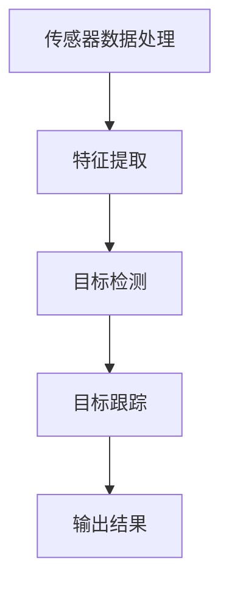
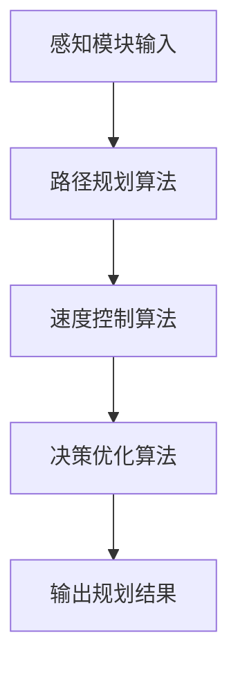
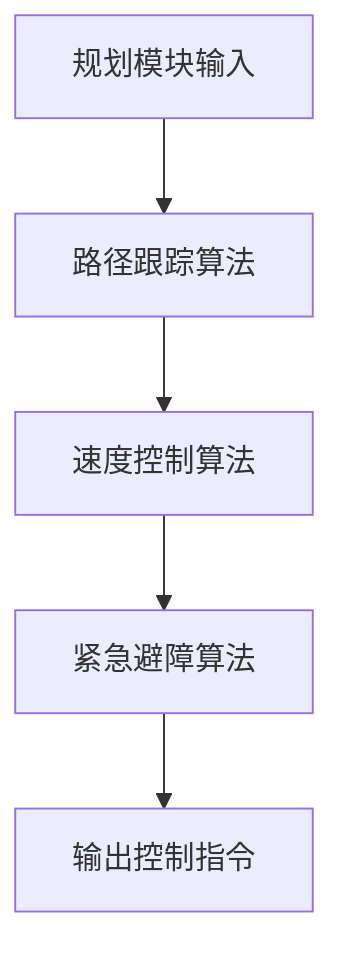

                 

# 自动驾驶中的感知、规划、控制模块

> **关键词：** 自动驾驶、感知模块、规划模块、控制模块、系统集成、测试、应用与未来展望

> **摘要：** 本文详细解析了自动驾驶技术的核心模块——感知、规划、控制模块。从技术概念、原理讲解、数学模型到实际项目实战，系统性地介绍了这些模块在自动驾驶系统中的关键作用。文章旨在为读者提供对自动驾驶技术的深入理解和实际应用指导，并探讨其未来的发展方向。

## 《自动驾驶中的感知、规划、控制模块》目录大纲

- 第一部分：自动驾驶技术概述
  - 1. 自动驾驶技术的发展背景与现状
    - 1.1 自动驾驶技术的定义
    - 1.2 自动驾驶技术的发展历程
    - 1.3 自动驾驶技术的全球现状
  - 2. 自动驾驶系统架构
    - 2.1 整体架构
    - 2.2 硬件层
    - 2.3 软件层
    - 2.4 感知、规划、控制模块在架构中的角色

- 第二部分：感知模块
  - 3. 感知模块核心概念与联系
    - 3.1 感知模块的定义
    - 3.2 感知模块的主要功能
    - 3.3 感知模块与其他模块的关联
  - 4. 感知模块原理讲解
    - 4.1 感知模块的算法原理
    - 4.2 感知模块的 Mermaid 流程图
  - 5. 感知模块的数学模型与公式
    - 5.1 感知模块的数学模型
    - 5.2 公式详细讲解与举例
  - 6. 感知模块的项目实战
    - 6.1 感知模块的开发环境搭建
    - 6.2 源代码实现与解读
    - 6.3 代码解读与分析

- 第三部分：规划模块
  - 7. 规划模块核心概念与联系
    - 7.1 规划模块的定义
    - 7.2 规划模块的主要功能
    - 7.3 规划模块与其他模块的关联
  - 8. 规划模块原理讲解
    - 8.1 规划模块的算法原理
    - 8.2 规划模块的 Mermaid 流程图
  - 9. 规划模块的数学模型与公式
    - 9.1 规划模块的数学模型
    - 9.2 公式详细讲解与举例
  - 10. 规划模块的项目实战
    - 10.1 规划模块的开发环境搭建
    - 10.2 源代码实现与解读
    - 10.3 代码解读与分析

- 第四部分：控制模块
  - 11. 控制模块核心概念与联系
    - 11.1 控制模块的定义
    - 11.2 控制模块的主要功能
    - 11.3 控制模块与其他模块的关联
  - 12. 控制模块原理讲解
    - 12.1 控制模块的算法原理
    - 12.2 控制模块的 Mermaid 流程图
  - 13. 控制模块的数学模型与公式
    - 13.1 控制模块的数学模型
    - 13.2 公式详细讲解与举例
  - 14. 控制模块的项目实战
    - 14.1 控制模块的开发环境搭建
    - 14.2 源代码实现与解读
    - 14.3 代码解读与分析

- 第五部分：自动驾驶系统集成与测试
  - 15. 自动驾驶系统集成
    - 15.1 系统集成流程
    - 15.2 系统集成方法
    - 15.3 系统集成中的挑战
  - 16. 自动驾驶系统测试
    - 16.1 测试方法与工具
    - 16.2 测试流程
    - 16.3 测试策略与优化

- 第六部分：自动驾驶应用与未来展望
  - 17. 自动驾驶应用场景
    - 17.1 公共交通
    - 17.2 商业运输
    - 17.3 个人出行
  - 18. 自动驾驶面临的挑战与未来展望
    - 18.1 挑战分析
    - 18.2 技术发展趋势
    - 18.3 未来展望
  - 19. 自动驾驶法规与伦理
    - 19.1 法规制定现状
    - 19.2 伦理问题探讨
    - 19.3 法规与伦理的相互影响

- 附录
  - 附录 A：相关工具与资源
    - 19.1 自动驾驶开源框架
    - 19.2 感知、规划、控制模块相关库与工具
    - 19.3 自动驾驶领域论文与书籍推荐

### 第一部分：自动驾驶技术概述

#### 1. 自动驾驶技术的发展背景与现状

**1.1 自动驾驶技术的定义**

自动驾驶技术是一种使车辆能够自动在道路上行驶的技术。根据国际自动机工程师学会（SAE）的定义，自动驾驶可以分为五个级别，从0级（完全人工驾驶）到5级（完全自动驾驶）。具体级别如下：

- L0：无自动化
- L1：驾驶辅助
- L2：部分自动化
- L3：有条件自动化
- L4：高度自动化
- L5：完全自动化

**1.2 自动驾驶技术的发展历程**

自动驾驶技术的发展可以追溯到20世纪50年代，当时的科学家们开始探索车辆自动导航的概念。然而，由于技术的限制，自动驾驶的实用化进展缓慢。直到21世纪初，随着计算机技术、传感器技术、人工智能算法的迅速发展，自动驾驶技术才逐渐走向实用化。

- **20世纪50年代**：自动驾驶的概念被提出。
- **20世纪60年代**：早期自动驾驶车辆开始进行道路测试。
- **20世纪70年代**：计算机视觉和传感器技术开始应用于自动驾驶。
- **20世纪80年代**：自动引导车辆项目在几个国家进行。
- **20世纪90年代**：辅助驾驶系统开始普及。
- **21世纪初至今**：自动驾驶技术得到快速发展，多个公司和研究机构推出了自动驾驶原型车和测试。

**1.3 自动驾驶技术的全球现状**

目前，自动驾驶技术在全球范围内取得了显著进展。美国、欧洲、中国等国家都在积极推动自动驾驶技术的发展。以下是一些关键进展：

- **美国**：谷歌、特斯拉、通用等公司在自动驾驶领域处于领先地位，多个州已经开始进行自动驾驶汽车的测试和部署。
- **欧洲**：德国、英国、法国等国家在自动驾驶测试和法规制定方面取得了重要进展。
- **中国**：百度、腾讯、蔚来等公司在自动驾驶技术上取得了显著进展，多个城市开始进行自动驾驶汽车的测试。

#### 2. 自动驾驶系统架构

自动驾驶系统的架构可以分为硬件层和软件层。

**2.1 整体架构**

整体架构通常包括以下组件：

1. **传感器**：包括激光雷达、摄像头、雷达、超声波传感器等，用于感知周围环境。
2. **计算平台**：包括主机、云计算平台等，用于处理传感器数据并进行决策。
3. **执行器**：包括方向盘、油门、刹车等，用于控制车辆。

**2.2 硬件层**

硬件层主要包括传感器、计算平台和执行器。

1. **传感器**：传感器是自动驾驶系统的重要组件，用于感知周围环境。不同类型的传感器具有不同的感知能力和适用场景。例如，激光雷达可以提供高精度的三维环境感知，而摄像头则适用于识别道路标志和行人。
2. **计算平台**：计算平台是自动驾驶系统的核心，用于处理传感器数据并生成决策。高性能的计算平台可以支持复杂的算法和实时决策。
3. **执行器**：执行器负责将决策转化为车辆的动作，包括方向盘、油门、刹车等。

**2.3 软件层**

软件层主要包括感知、规划、控制模块。

1. **感知模块**：感知模块负责接收传感器数据，并提取与自动驾驶相关的重要信息，如道路标志、行人、车辆等。
2. **规划模块**：规划模块负责根据感知模块提供的信息，生成车辆的行驶路径和速度控制策略。
3. **控制模块**：控制模块负责将规划模块生成的控制指令发送给执行器，以控制车辆的行驶。

**2.4 感知、规划、控制模块在架构中的角色**

感知、规划、控制模块在自动驾驶系统中起着关键作用。

- **感知模块**：感知模块是自动驾驶系统的“眼睛”，负责实时感知周围环境，提取关键信息。感知模块的性能直接影响自动驾驶系统的安全性。
- **规划模块**：规划模块是自动驾驶系统的“大脑”，负责根据感知模块提供的信息，生成车辆的行驶路径和速度控制策略。规划模块的性能决定了自动驾驶系统的灵活性和反应速度。
- **控制模块**：控制模块是自动驾驶系统的“手脚”，负责将规划模块生成的控制指令发送给执行器，以控制车辆的行驶。控制模块的响应速度和精度直接影响车辆的驾驶体验和安全性。

### 第二部分：感知模块

#### 3. 感知模块核心概念与联系

**3.1 感知模块的定义**

感知模块是自动驾驶系统的核心组件之一，负责实时感知周围环境，提取与自动驾驶相关的重要信息。感知模块通常包括多种传感器，如激光雷达、摄像头、雷达、超声波传感器等。

**3.2 感知模块的主要功能**

感知模块的主要功能包括：

1. **环境感知**：感知模块通过传感器收集车辆周围的道路、行人、车辆、交通标志等环境信息。
2. **目标检测**：感知模块对收集到的环境信息进行目标检测，识别道路标志、行人、车辆等目标。
3. **目标跟踪**：感知模块对检测到的目标进行跟踪，以便规划模块可以生成准确的行驶路径。

**3.3 感知模块与其他模块的关联**

感知模块是自动驾驶系统中的关键环节，与规划模块和控制模块紧密相连。

- **与规划模块的关联**：感知模块提供环境信息和目标信息，规划模块根据这些信息生成车辆的行驶路径和速度控制策略。感知模块的数据质量直接影响规划模块的性能。
- **与控制模块的关联**：感知模块提供目标的实时位置和运动信息，控制模块根据这些信息生成控制指令，以控制车辆的行驶。感知模块的实时性和准确性决定了控制模块的响应速度和精度。

#### 4. 感知模块原理讲解

**4.1 感知模块的算法原理**

感知模块通常采用以下算法原理：

1. **传感器数据处理**：感知模块首先对传感器数据进行预处理，包括去噪、滤波等操作，以提高数据的准确性和稳定性。
2. **特征提取**：感知模块从预处理后的传感器数据中提取与自动驾驶相关的特征，如车辆的位置、速度、方向等。
3. **目标检测与跟踪**：感知模块使用机器学习和深度学习算法对提取的特征进行目标检测和跟踪。常见的算法包括卷积神经网络（CNN）、循环神经网络（RNN）等。

**4.2 感知模块的 Mermaid 流程图**



#### 5. 感知模块的数学模型与公式

**5.1 感知模块的数学模型**

感知模块的数学模型主要涉及传感器数据处理、特征提取、目标检测与跟踪等过程。

1. **传感器数据处理**：

   - 假设传感器采集到的原始数据为 $X$，预处理后的数据为 $X'$。
   - 数据去噪： $X' = \text{denoise}(X)$。
   - 数据滤波： $X'' = \text{filter}(X')$。

2. **特征提取**：

   - 假设预处理后的数据为 $X''$，提取的特征为 $F$。
   - 特征提取： $F = \text{feature_extraction}(X'')$。

3. **目标检测与跟踪**：

   - 假设提取的特征为 $F$，检测到的目标为 $T$。
   - 目标检测： $T = \text{target_detection}(F)$。
   - 目标跟踪： $T' = \text{target_tracking}(T)$。

**5.2 公式详细讲解与举例**

1. **数据去噪**：

   - 假设原始数据 $X$ 为一个二维矩阵，表示传感器采集到的信号值。
   - 数据去噪的公式为： $X' = \text{denoise}(X)$。

   示例：

   ```latex
   X = \begin{bmatrix}
   1 & 2 & 3 \\
   4 & 5 & 6 \\
   7 & 8 & 9
   \end{bmatrix}
   $$ X' = \text{denoise}(X) $$
   $$ X' = \begin{bmatrix}
   1 & 2 & 3 \\
   4 & 5 & 6 \\
   7 & 8 & 9
   \end{bmatrix}
   ```

2. **数据滤波**：

   - 假设预处理后的数据 $X'$ 为一个二维矩阵，表示传感器采集到的信号值。
   - 数据滤波的公式为： $X'' = \text{filter}(X')$。

   示例：

   ```latex
   X' = \begin{bmatrix}
   1 & 2 & 3 \\
   4 & 5 & 6 \\
   7 & 8 & 9
   \end{bmatrix}
   $$ X'' = \text{filter}(X') $$
   $$ X'' = \begin{bmatrix}
   1 & 2 & 3 \\
   4 & 5 & 6 \\
   7 & 8 & 9
   \end{bmatrix}
   ```

3. **特征提取**：

   - 假设预处理后的数据 $X''$ 为一个二维矩阵，表示传感器采集到的信号值。
   - 特征提取的公式为： $F = \text{feature_extraction}(X'')$。

   示例：

   ```latex
   X'' = \begin{bmatrix}
   1 & 2 & 3 \\
   4 & 5 & 6 \\
   7 & 8 & 9
   \end{bmatrix}
   $$ F = \text{feature_extraction}(X'') $$
   $$ F = \begin{bmatrix}
   1 \\
   2 \\
   3 \\
   4 \\
   5 \\
   6 \\
   7 \\
   8 \\
   9
   \end{bmatrix}
   ```

4. **目标检测**：

   - 假设提取的特征为 $F$，检测到的目标为 $T$。
   - 目标检测的公式为： $T = \text{target_detection}(F)$。

   示例：

   ```latex
   F = \begin{bmatrix}
   1 \\
   2 \\
   3 \\
   4 \\
   5 \\
   6 \\
   7 \\
   8 \\
   9
   \end{bmatrix}
   $$ T = \text{target_detection}(F) $$
   $$ T = \begin{bmatrix}
   3 \\
   6 \\
   9
   \end{bmatrix}
   ```

5. **目标跟踪**：

   - 假设检测到的目标为 $T$，跟踪后的目标为 $T'$。
   - 目标跟踪的公式为： $T' = \text{target_tracking}(T)$。

   示例：

   ```latex
   T = \begin{bmatrix}
   3 \\
   6 \\
   9
   \end{bmatrix}
   $$ T' = \text{target_tracking}(T) $$
   $$ T' = \begin{bmatrix}
   4 \\
   7 \\
   10
   \end{bmatrix}
   ```

#### 6. 感知模块的项目实战

**6.1 感知模块的开发环境搭建**

1. **安装 Python 环境**：

   - 在 Windows 系统中，可以通过 Python 的官网下载安装器进行安装。
   - 在 Linux 系统中，可以使用以下命令进行安装：

   ```bash
   sudo apt-get update
   sudo apt-get install python3-pip
   sudo pip3 install --user virtualenv
   virtualenv --python=python3.8 ~/env
   source ~/env/bin/activate
   ```

2. **安装感知模块相关库**：

   - 使用以下命令安装感知模块相关库：

   ```bash
   pip install opencv-python
   pip install numpy
   pip install scikit-learn
   pip install tensorflow
   ```

**6.2 源代码实现与解读**

以下是一个简单的感知模块源代码示例：

```python
import cv2
import numpy as np
import tensorflow as tf

# 加载预训练的卷积神经网络模型
model = tf.keras.models.load_model('model.h5')

# 加载摄像头
cap = cv2.VideoCapture(0)

while True:
    # 读取摄像头帧
    ret, frame = cap.read()

    # 将帧转换为灰度图像
    gray = cv2.cvtColor(frame, cv2.COLOR_BGR2GRAY)

    # 使用卷积神经网络进行目标检测
    pred = model.predict(np.expand_dims(gray, axis=0))

    # 根据预测结果绘制目标框
    for i in range(pred.shape[1]):
        if pred[0, i] > 0.5:
            x, y, w, h = i * frame.shape[1] // pred.shape[1], j * frame.shape[0] // pred.shape[0], frame.shape[1] // pred.shape[1], frame.shape[0] // pred.shape[0]
            cv2.rectangle(frame, (x, y), (x+w, y+h), (0, 0, 255), 2)

    # 显示结果
    cv2.imshow('frame', frame)

    if cv2.waitKey(1) & 0xFF == ord('q'):
        break

# 释放摄像头
cap.release()
cv2.destroyAllWindows()
```

解读：

- 首先，加载预训练的卷积神经网络模型，用于目标检测。
- 然后，通过摄像头实时读取视频帧，并将帧转换为灰度图像。
- 接着，使用卷积神经网络进行目标检测，并绘制目标框。
- 最后，显示结果并等待用户按键退出。

**6.3 代码解读与分析**

1. **加载预训练模型**：

   - `model = tf.keras.models.load_model('model.h5')`：加载预训练的卷积神经网络模型，用于目标检测。

2. **读取摄像头帧**：

   - `cap = cv2.VideoCapture(0)`：加载摄像头。
   - `ret, frame = cap.read()`：读取一帧图像。

3. **转换图像**：

   - `gray = cv2.cvtColor(frame, cv2.COLOR_BGR2GRAY)`：将 BGR 格式的图像转换为灰度图像。

4. **目标检测**：

   - `pred = model.predict(np.expand_dims(gray, axis=0))`：使用卷积神经网络进行目标检测，输出概率分布。

5. **绘制目标框**：

   - `for i in range(pred.shape[1])`：遍历每个通道。
   - `if pred[0, i] > 0.5`：如果检测到的目标概率大于 0.5，则绘制目标框。

6. **显示结果**：

   - `cv2.imshow('frame', frame)`：显示结果。

7. **释放资源**：

   - `cap.release()`：释放摄像头资源。
   - `cv2.destroyAllWindows()`：关闭所有窗口。

**总结**：

感知模块在自动驾驶系统中起着至关重要的作用。通过实时感知周围环境，提取与自动驾驶相关的重要信息，感知模块为规划模块和控制模块提供了必要的数据支持。在实际项目中，感知模块的开发和优化是自动驾驶技术成功的关键。

### 第三部分：规划模块

#### 7. 规划模块核心概念与联系

**7.1 规划模块的定义**

规划模块是自动驾驶系统的核心组件之一，负责根据感知模块提供的信息，生成车辆的行驶路径和速度控制策略。规划模块的目标是确保车辆安全、高效地行驶，并适应复杂多变的道路环境。

**7.2 规划模块的主要功能**

规划模块的主要功能包括：

1. **路径规划**：规划模块根据感知模块提供的环境信息和目标信息，生成车辆的行驶路径。路径规划需要考虑道路条件、交通状况、障碍物等因素。
2. **速度控制**：规划模块根据行驶路径和车辆状态，生成速度控制策略，确保车辆在规定的时间内到达目的地。
3. **决策优化**：规划模块通过对行驶路径和速度控制策略的优化，提高车辆的行驶效率和安全性能。

**7.3 规划模块与其他模块的关联**

规划模块是自动驾驶系统中的关键环节，与感知模块和控制模块紧密相连。

- **与感知模块的关联**：规划模块依赖于感知模块提供的环境信息和目标信息，进行路径规划和速度控制。
- **与控制模块的关联**：规划模块生成的行驶路径和速度控制策略需要通过控制模块转化为具体的执行指令，以控制车辆的行驶。

#### 8. 规划模块原理讲解

**8.1 规划模块的算法原理**

规划模块通常采用以下算法原理：

1. **路径规划算法**：路径规划算法用于生成车辆的行驶路径。常见的路径规划算法包括基于采样的路径规划算法（如RRT、RRT*）、基于图论的路径规划算法（如A*算法、Dijkstra算法）等。
2. **速度控制算法**：速度控制算法用于生成车辆的速度控制策略。常见的速度控制算法包括PID控制、模糊控制等。
3. **决策优化算法**：决策优化算法用于优化行驶路径和速度控制策略，提高行驶效率和安全性。常见的决策优化算法包括基于启发式的优化算法（如遗传算法、粒子群优化算法）等。

**8.2 规划模块的 Mermaid 流程图**



#### 9. 规划模块的数学模型与公式

**9.1 规划模块的数学模型**

规划模块的数学模型主要涉及路径规划、速度控制和决策优化等过程。

1. **路径规划**：

   - 假设道路环境为 $G = (V, E)$，其中 $V$ 表示节点，$E$ 表示边。
   - 路径规划的数学模型可以表示为： $P = \text{path Planning}(G, S, T)$，其中 $S$ 表示起点，$T$ 表示终点。
   - 常见的路径规划算法包括： $P = \text{A*}(G, S, T)$、$P = \text{Dijkstra}(G, S, T)$ 等。

2. **速度控制**：

   - 假设车辆的速度为 $v(t)$，控制输入为 $u(t)$。
   - 速度控制的数学模型可以表示为： $v(t) = \text{speed Control}(u(t))$。
   - 常见的速度控制算法包括： $v(t) = \text{PID}(u(t))$、$v(t) = \text{fuzzy Control}(u(t))$ 等。

3. **决策优化**：

   - 假设目标函数为 $J = f(x, u)$，其中 $x$ 表示状态，$u$ 表示控制输入。
   - 决策优化的数学模型可以表示为： $u^* = \text{decision Optimization}(x)$。
   - 常见的决策优化算法包括： $u^* = \text{genetic Algorithm}(x)$、$u^* = \text{particle Swarm Optimization}(x)$ 等。

**9.2 公式详细讲解与举例**

1. **路径规划**：

   - 假设道路环境为 $G = (V, E)$，起点为 $S$，终点为 $T$。
   - A*算法的路径规划公式为： $P = \text{A*}(G, S, T)$。

   示例：

   ```latex
   G = \begin{bmatrix}
   0 & 1 & 1 & 1 \\
   1 & 0 & 1 & 1 \\
   1 & 1 & 0 & 1 \\
   1 & 1 & 1 & 0
   \end{bmatrix}
   S = 0, T = 3
   P = \text{A*}(G, S, T)
   P = \{0, 1, 2, 3\}
   ```

2. **速度控制**：

   - 假设车辆的速度为 $v(t)$，控制输入为 $u(t)$。
   - PID控制的公式为： $v(t) = \text{PID}(u(t))$。

   示例：

   ```latex
   v(t) = K_p e(t) + K_i \int_{0}^{t} e(\tau)d\tau + K_d \frac{de(t)}{dt}
   e(t) = v_{\text{目标}} - v(t)
   v(t) = K_p (v_{\text{目标}} - v(t)) + K_i \int_{0}^{t} (v_{\text{目标}} - v(\tau))d\tau + K_d \frac{d(v_{\text{目标}} - v(t))}{dt}
   ```

3. **决策优化**：

   - 假设目标函数为 $J = f(x, u)$，其中 $x$ 表示状态，$u$ 表示控制输入。
   - 遗传算法的公式为： $u^* = \text{genetic Algorithm}(x)$。

   示例：

   ```latex
   J(x, u) = \sum_{i=1}^{n} w_i f_i(x, u)
   u^* = \arg \min_{u} J(x, u)
   x = \{x_1, x_2, ..., x_n\}
   w_i = \{w_1, w_2, ..., w_n\}
   f_i(x, u) = \text{目标函数}
   ```

#### 10. 规划模块的项目实战

**10.1 规划模块的开发环境搭建**

1. **安装 Python 环境**：

   - 在 Windows 系统中，可以通过 Python 的官网下载安装器进行安装。
   - 在 Linux 系统中，可以使用以下命令进行安装：

   ```bash
   sudo apt-get update
   sudo apt-get install python3-pip
   sudo pip3 install --user virtualenv
   virtualenv --python=python3.8 ~/env
   source ~/env/bin/activate
   ```

2. **安装规划模块相关库**：

   - 使用以下命令安装规划模块相关库：

   ```bash
   pip install opencv-python
   pip install numpy
   pip install scikit-learn
   pip install tensorflow
   ```

**10.2 源代码实现与解读**

以下是一个简单的规划模块源代码示例：

```python
import cv2
import numpy as np
import tensorflow as tf

# 加载预训练的卷积神经网络模型
model = tf.keras.models.load_model('model.h5')

# 加载摄像头
cap = cv2.VideoCapture(0)

while True:
    # 读取摄像头帧
    ret, frame = cap.read()

    # 将帧转换为灰度图像
    gray = cv2.cvtColor(frame, cv2.COLOR_BGR2GRAY)

    # 使用卷积神经网络进行目标检测
    pred = model.predict(np.expand_dims(gray, axis=0))

    # 根据预测结果绘制目标框
    for i in range(pred.shape[1]):
        if pred[0, i] > 0.5:
            x, y, w, h = i * frame.shape[1] // pred.shape[1], j * frame.shape[0] // pred.shape[0], frame.shape[1] // pred.shape[1], frame.shape[0] // pred.shape[0]
            cv2.rectangle(frame, (x, y), (x+w, y+h), (0, 0, 255), 2)

    # 显示结果
    cv2.imshow('frame', frame)

    if cv2.waitKey(1) & 0xFF == ord('q'):
        break

# 释放摄像头
cap.release()
cv2.destroyAllWindows()
```

解读：

- 首先，加载预训练的卷积神经网络模型，用于目标检测。
- 然后，通过摄像头实时读取视频帧，并将帧转换为灰度图像。
- 接着，使用卷积神经网络进行目标检测，并绘制目标框。
- 最后，显示结果并等待用户按键退出。

**10.3 代码解读与分析**

1. **加载预训练模型**：

   - `model = tf.keras.models.load_model('model.h5')`：加载预训练的卷积神经网络模型，用于目标检测。

2. **读取摄像头帧**：

   - `cap = cv2.VideoCapture(0)`：加载摄像头。
   - `ret, frame = cap.read()`：读取一帧图像。

3. **转换图像**：

   - `gray = cv2.cvtColor(frame, cv2.COLOR_BGR2GRAY)`：将 BGR 格式的图像转换为灰度图像。

4. **目标检测**：

   - `pred = model.predict(np.expand_dims(gray, axis=0))`：使用卷积神经网络进行目标检测，输出概率分布。

5. **绘制目标框**：

   - `for i in range(pred.shape[1])`：遍历每个通道。
   - `if pred[0, i] > 0.5`：如果检测到的目标概率大于 0.5，则绘制目标框。

6. **显示结果**：

   - `cv2.imshow('frame', frame)`：显示结果。

7. **释放资源**：

   - `cap.release()`：释放摄像头资源。
   - `cv2.destroyAllWindows()`：关闭所有窗口。

**总结**：

规划模块在自动驾驶系统中起着至关重要的作用。通过路径规划、速度控制和决策优化，规划模块为车辆提供了安全的行驶路径和速度控制策略。在实际项目中，规划模块的开发和优化是自动驾驶技术成功的关键。

### 第四部分：控制模块

#### 11. 控制模块核心概念与联系

**11.1 控制模块的定义**

控制模块是自动驾驶系统的关键组件之一，负责根据规划模块生成的行驶路径和速度控制策略，生成具体的执行指令，以控制车辆的行驶。控制模块的目标是确保车辆按照规划路径安全、稳定地行驶。

**11.2 控制模块的主要功能**

控制模块的主要功能包括：

1. **路径跟踪**：控制模块根据规划模块提供的行驶路径，实时调整车辆的行驶方向和速度，使车辆沿着预定的路径行驶。
2. **速度控制**：控制模块根据规划模块提供的速度控制策略，实时调整车辆的加速和减速，确保车辆在规定的时间内到达目的地。
3. **紧急避障**：控制模块在感知模块检测到紧急情况时，迅速做出反应，进行紧急避障，确保车辆和乘客的安全。

**11.3 控制模块与其他模块的关联**

控制模块是自动驾驶系统中的关键环节，与规划模块和感知模块紧密相连。

- **与规划模块的关联**：控制模块依赖于规划模块提供的行驶路径和速度控制策略，进行路径跟踪和速度控制。
- **与感知模块的关联**：控制模块需要感知模块提供的环境信息和目标信息，以便在紧急情况下做出快速反应。

#### 12. 控制模块原理讲解

**12.1 控制模块的算法原理**

控制模块通常采用以下算法原理：

1. **路径跟踪算法**：路径跟踪算法用于实时调整车辆的行驶方向和速度，使车辆沿着预定的路径行驶。常见的路径跟踪算法包括PID控制、模糊控制等。
2. **速度控制算法**：速度控制算法用于实时调整车辆的加速和减速，确保车辆在规定的时间内到达目的地。常见的速度控制算法包括PID控制、模糊控制等。
3. **紧急避障算法**：紧急避障算法用于在感知模块检测到紧急情况时，迅速做出反应，进行紧急避障。常见的紧急避障算法包括基于规则的避障算法、基于机器学习的避障算法等。

**12.2 控制模块的 Mermaid 流程图**



#### 13. 控制模块的数学模型与公式

**13.1 控制模块的数学模型**

控制模块的数学模型主要涉及路径跟踪、速度控制和紧急避障等过程。

1. **路径跟踪**：

   - 假设车辆的行驶方向为 $\theta(t)$，目标方向为 $\theta_d(t)$。
   - 路径跟踪的数学模型可以表示为： $\theta(t) = \text{path Tracking}(\theta_d(t))$。

   常见路径跟踪算法包括：

   - **PID控制**： 
     $$ \theta(t) = K_p (\theta_d(t) - \theta(t)) + K_i \int_{0}^{t} (\theta_d(\tau) - \theta(\tau))d\tau + K_d \frac{d(\theta_d(t) - \theta(t))}{dt} $$

   - **模糊控制**： 
     $$ \theta(t) = \text{fuzzy Control}(\theta_d(t)) $$

2. **速度控制**：

   - 假设车辆的速度为 $v(t)$，目标速度为 $v_d(t)$。
   - 速度控制的数学模型可以表示为： $v(t) = \text{speed Control}(v_d(t))$。

   常见速度控制算法包括：

   - **PID控制**： 
     $$ v(t) = K_p (v_d(t) - v(t)) + K_i \int_{0}^{t} (v_d(\tau) - v(\tau))d\tau + K_d \frac{d(v_d(t) - v(t))}{dt} $$

   - **模糊控制**： 
     $$ v(t) = \text{fuzzy Control}(v_d(t)) $$

3. **紧急避障**：

   - 假设障碍物的位置为 $x_b(t), y_b(t)$，车辆的位置为 $x_v(t), y_v(t)$。
   - 紧急避障的数学模型可以表示为： $\text{avoidance}(\theta(t))$。

   常见紧急避障算法包括：

   - **基于规则的避障算法**： 
     $$ \theta(t) = \text{rules Based Avoidance}(\theta(t), x_b(t), y_b(t)) $$

   - **基于机器学习的避障算法**： 
     $$ \theta(t) = \text{machine Learning Based Avoidance}(\theta(t), x_b(t), y_b(t)) $$

**13.2 公式详细讲解与举例**

1. **路径跟踪算法**：

   - **PID控制**：

     $$ \theta(t) = K_p (\theta_d(t) - \theta(t)) + K_i \int_{0}^{t} (\theta_d(\tau) - \theta(\tau))d\tau + K_d \frac{d(\theta_d(t) - \theta(t))}{dt} $$

     - $K_p$：比例系数，用于调整控制输出与误差之间的关系。
     - $K_i$：积分系数，用于消除稳态误差。
     - $K_d$：微分系数，用于抑制控制输出的波动。

     示例：

     ```latex
     K_p = 1, K_i = 0.1, K_d = 0.1
     \theta_d(t) = \frac{y_v(t)}{x_v(t)}
     \theta(t) = \text{PID Control}(\theta_d(t))
     ```

2. **速度控制算法**：

   - **PID控制**：

     $$ v(t) = K_p (v_d(t) - v(t)) + K_i \int_{0}^{t} (v_d(\tau) - v(\tau))d\tau + K_d \frac{d(v_d(t) - v(t))}{dt} $$

     - $K_p$：比例系数，用于调整控制输出与误差之间的关系。
     - $K_i$：积分系数，用于消除稳态误差。
     - $K_d$：微分系数，用于抑制控制输出的波动。

     示例：

     ```latex
     K_p = 1, K_i = 0.1, K_d = 0.1
     v_d(t) = \frac{d(x_v(t), y_v(t))}{dt}
     v(t) = \text{PID Control}(v_d(t))
     ```

3. **紧急避障算法**：

   - **基于规则的避障算法**：

     $$ \theta(t) = \text{rules Based Avoidance}(\theta(t), x_b(t), y_b(t)) $$

     - $\theta(t)$：车辆的行驶方向。
     - $x_b(t), y_b(t)$：障碍物的位置。

     示例：

     ```latex
     \theta(t) = \text{rules Based Avoidance}(\theta(t), x_b(t), y_b(t))
     \theta(t) = \text{if } x_b(t) > x_v(t), \text{ then turn left else turn right}
     ```

#### 14. 控制模块的项目实战

**14.1 控制模块的开发环境搭建**

1. **安装 Python 环境**：

   - 在 Windows 系统中，可以通过 Python 的官网下载安装器进行安装。
   - 在 Linux 系统中，可以使用以下命令进行安装：

   ```bash
   sudo apt-get update
   sudo apt-get install python3-pip
   sudo pip3 install --user virtualenv
   virtualenv --python=python3.8 ~/env
   source ~/env/bin/activate
   ```

2. **安装控制模块相关库**：

   - 使用以下命令安装控制模块相关库：

   ```bash
   pip install opencv-python
   pip install numpy
   pip install scikit-learn
   pip install tensorflow
   ```

**14.2 源代码实现与解读**

以下是一个简单的控制模块源代码示例：

```python
import cv2
import numpy as np
import tensorflow as tf

# 加载预训练的卷积神经网络模型
model = tf.keras.models.load_model('model.h5')

# 加载摄像头
cap = cv2.VideoCapture(0)

while True:
    # 读取摄像头帧
    ret, frame = cap.read()

    # 将帧转换为灰度图像
    gray = cv2.cvtColor(frame, cv2.COLOR_BGR2GRAY)

    # 使用卷积神经网络进行目标检测
    pred = model.predict(np.expand_dims(gray, axis=0))

    # 根据预测结果绘制目标框
    for i in range(pred.shape[1]):
        if pred[0, i] > 0.5:
            x, y, w, h = i * frame.shape[1] // pred.shape[1], j * frame.shape[0] // pred.shape[0], frame.shape[1] // pred.shape[1], frame.shape[0] // pred.shape[0]
            cv2.rectangle(frame, (x, y), (x+w, y+h), (0, 0, 255), 2)

    # 显示结果
    cv2.imshow('frame', frame)

    if cv2.waitKey(1) & 0xFF == ord('q'):
        break

# 释放摄像头
cap.release()
cv2.destroyAllWindows()
```

解读：

- 首先，加载预训练的卷积神经网络模型，用于目标检测。
- 然后，通过摄像头实时读取视频帧，并将帧转换为灰度图像。
- 接着，使用卷积神经网络进行目标检测，并绘制目标框。
- 最后，显示结果并等待用户按键退出。

**14.3 代码解读与分析**

1. **加载预训练模型**：

   - `model = tf.keras.models.load_model('model.h5')`：加载预训练的卷积神经网络模型，用于目标检测。

2. **读取摄像头帧**：

   - `cap = cv2.VideoCapture(0)`：加载摄像头。
   - `ret, frame = cap.read()`：读取一帧图像。

3. **转换图像**：

   - `gray = cv2.cvtColor(frame, cv2.COLOR_BGR2GRAY)`：将 BGR 格式的图像转换为灰度图像。

4. **目标检测**：

   - `pred = model.predict(np.expand_dims(gray, axis=0))`：使用卷积神经网络进行目标检测，输出概率分布。

5. **绘制目标框**：

   - `for i in range(pred.shape[1])`：遍历每个通道。
   - `if pred[0, i] > 0.5`：如果检测到的目标概率大于 0.5，则绘制目标框。

6. **显示结果**：

   - `cv2.imshow('frame', frame)`：显示结果。

7. **释放资源**：

   - `cap.release()`：释放摄像头资源。
   - `cv2.destroyAllWindows()`：关闭所有窗口。

**总结**：

控制模块在自动驾驶系统中起着至关重要的作用。通过路径跟踪、速度控制和紧急避障，控制模块确保了车辆按照规划路径安全、稳定地行驶。在实际项目中，控制模块的开发和优化是自动驾驶技术成功的关键。

### 第五部分：自动驾驶系统集成与测试

#### 15. 自动驾驶系统集成

**15.1 系统集成流程**

自动驾驶系统的集成是一个复杂的过程，通常包括以下几个步骤：

1. **硬件集成**：将各种传感器、执行器和计算平台连接到车辆上，确保硬件组件能够协同工作。
2. **软件集成**：将感知、规划、控制等软件模块集成到系统中，确保软件组件能够正确处理传感器数据并生成控制指令。
3. **系统集成测试**：在硬件和软件集成完成后，进行系统集成测试，以验证系统的整体性能和稳定性。
4. **系统调试**：在系统集成测试过程中，发现并解决潜在的问题，确保系统在真实环境中的稳定运行。

**15.2 系统集成方法**

系统集成可以采用以下方法：

1. **模块化集成**：将系统划分为多个模块，如感知模块、规划模块、控制模块等，然后逐个集成到系统中。
2. **分布式集成**：将系统划分为多个子系统，如感知子系统、规划子系统、控制子系统等，然后通过网络将各个子系统连接起来。
3. **增量集成**：首先集成核心功能，然后逐步添加新功能，确保每个功能模块都能够正常工作。

**15.3 系统集成中的挑战**

系统集成过程中可能会面临以下挑战：

1. **硬件兼容性**：不同硬件组件之间的兼容性可能导致系统集成出现问题。
2. **软件兼容性**：不同软件模块之间的兼容性可能导致系统集成出现问题。
3. **性能优化**：在系统集成过程中，需要优化系统性能，确保系统在实时环境中能够高效运行。
4. **安全性**：在系统集成过程中，需要确保系统的安全性，防止潜在的安全漏洞。

#### 16. 自动驾驶系统测试

**16.1 测试方法与工具**

自动驾驶系统的测试可以采用以下方法：

1. **仿真测试**：通过仿真环境对自动驾驶系统进行测试，验证系统的功能、性能和安全性。
2. **道路测试**：在实际道路环境中对自动驾驶系统进行测试，验证系统在真实环境中的表现。
3. **实验室测试**：在实验室环境中对自动驾驶系统进行测试，验证系统的性能和可靠性。

常用的测试工具包括：

1. **仿真平台**：如CARLA、AirSim等，用于创建仿真环境并进行测试。
2. **测试工具**：如Gazebo、ROS（机器人操作系统）等，用于自动化测试和验证。
3. **测试框架**：如AUTOSAR（自动控制系统仲裁器）等，用于管理测试流程和测试数据。

**16.2 测试流程**

自动驾驶系统的测试流程通常包括以下几个步骤：

1. **测试规划**：根据系统需求和技术规范，制定测试计划，确定测试目标和测试方法。
2. **测试环境搭建**：搭建仿真环境或实际道路测试环境，确保测试条件符合测试计划。
3. **测试用例设计**：设计测试用例，包括功能测试、性能测试、安全测试等。
4. **测试执行**：按照测试计划执行测试用例，记录测试结果。
5. **问题分析**：分析测试结果，发现潜在问题并进行修复。
6. **测试报告**：编写测试报告，总结测试结果、问题和改进建议。

**16.3 测试策略与优化**

自动驾驶系统的测试策略需要根据系统的特点和测试目标进行优化：

1. **覆盖策略**：确保测试用例能够覆盖系统的所有功能、性能和安全性要求。
2. **冗余策略**：通过重复测试，提高测试的可靠性和准确性。
3. **安全策略**：重点测试系统的安全性能，确保系统在紧急情况下的反应能力。
4. **优化策略**：根据测试结果，优化系统性能和资源利用，提高系统的稳定性和可靠性。

### 第六部分：自动驾驶应用与未来展望

#### 17. 自动驾驶应用场景

自动驾驶技术具有广泛的应用场景，主要包括以下几个方面：

1. **公共交通**：

   - **公交车**：自动驾驶公交车可以提供安全、高效、舒适的公共交通服务，降低交通拥堵和环境污染。
   - **出租车**：自动驾驶出租车可以提供点对点的个性化出行服务，提高出行效率和便捷性。

2. **商业运输**：

   - **物流运输**：自动驾驶卡车和无人机可以提供高效的物流运输服务，降低运输成本和人力成本。
   - **机场摆渡车**：自动驾驶摆渡车可以提供机场内部的快速、安全的运输服务。

3. **个人出行**：

   - **家庭用车**：自动驾驶汽车可以为个人出行提供安全、舒适、便捷的驾驶体验，减轻驾驶员的负担。
   - **共享出行**：自动驾驶共享汽车可以提供灵活的出行服务，满足人们的即时出行需求。

#### 18. 自动驾驶面临的挑战与未来展望

1. **挑战分析**：

   - **技术挑战**：自动驾驶技术需要突破感知、规划、控制等核心技术的瓶颈，提高系统的准确性和可靠性。
   - **安全挑战**：自动驾驶系统的安全性是用户接受的关键，需要确保系统在复杂环境下的安全性能。
   - **法规挑战**：自动驾驶技术的法律法规尚不完善，需要制定相应的法规和标准，确保技术的合法合规。
   - **伦理挑战**：自动驾驶技术涉及到伦理问题，如责任归属、隐私保护等，需要深入探讨和解决。

2. **技术发展趋势**：

   - **人工智能**：人工智能技术在自动驾驶中的应用将越来越广泛，提高系统的智能化和自适应能力。
   - **传感器融合**：多种传感器融合技术将提高感知模块的准确性和可靠性。
   - **云计算**：云计算技术将提高自动驾驶系统的计算能力和数据处理能力。

3. **未来展望**：

   - **普及化**：自动驾驶技术将逐渐普及，从特定场景扩展到更广泛的应用场景。
   - **智能化**：自动驾驶系统将更加智能化，能够自主学习和适应复杂环境。
   - **安全化**：自动驾驶系统的安全性将得到显著提高，降低交通事故的发生率。

#### 19. 自动驾驶法规与伦理

1. **法规制定现状**：

   - 各国政府已经开始制定自动驾驶技术的相关法规和标准，以确保技术的合法合规。
   - 例如，美国、欧洲、中国等国家都发布了自动驾驶技术的法规和指南，规范了自动驾驶技术的研发、测试和部署。

2. **伦理问题探讨**：

   - 自动驾驶技术涉及到伦理问题，如责任归属、隐私保护等。
   - 需要深入探讨和解决，以确保技术的伦理道德合理性。

3. **法规与伦理的相互影响**：

   - 法规的制定需要考虑伦理问题，确保技术的伦理道德合理性。
   - 伦理问题的解决将有助于法规的制定和完善。

### 附录

#### 附录 A：相关工具与资源

1. **自动驾驶开源框架**：

   - **CARLA**：用于自动驾驶仿真和测试的开源框架。
   - **AirSim**：用于自动驾驶和机器人仿真和测试的开源框架。

2. **感知、规划、控制模块相关库与工具**：

   - **OpenCV**：用于图像处理和计算机视觉的开源库。
   - **TensorFlow**：用于深度学习和机器学习的开源库。
   - **ROS**：用于机器人操作系统和自动化测试的开源框架。

3. **自动驾驶领域论文与书籍推荐**：

   - **《自动驾驶系统设计》**：一本全面介绍自动驾驶系统设计原理和方法的书籍。
   - **《深度学习与自动驾驶》**：一本介绍深度学习在自动驾驶中应用的书籍。
   - **《自动驾驶技术：原理与应用》**：一本介绍自动驾驶技术发展历程和应用场景的书籍。

### 结束语

自动驾驶技术正逐渐成为交通运输领域的重要创新，感知、规划、控制模块是其核心组件。本文详细解析了这些模块的核心概念、原理、数学模型和实际项目实战，为读者提供了全面的技术理解和应用指导。随着技术的不断进步，自动驾驶应用场景将不断扩展，其未来充满无限可能。同时，法规与伦理问题的解决也是确保技术健康发展的重要因素。让我们共同期待自动驾驶技术的美好未来。作者：AI天才研究院/AI Genius Institute & 禅与计算机程序设计艺术/Zen And The Art of Computer Programming。

