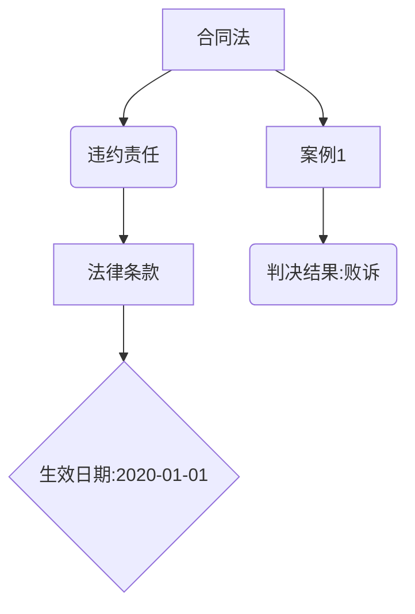
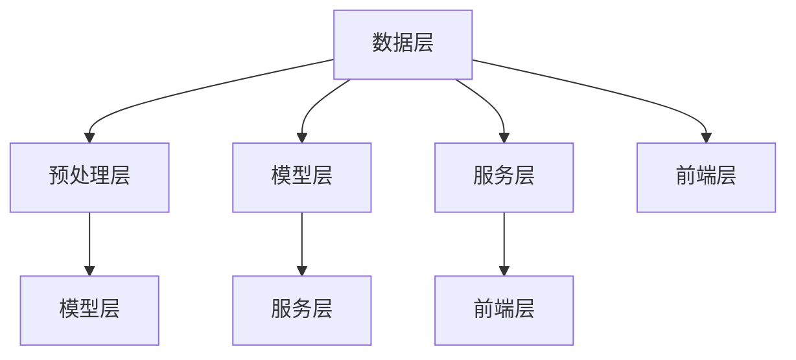
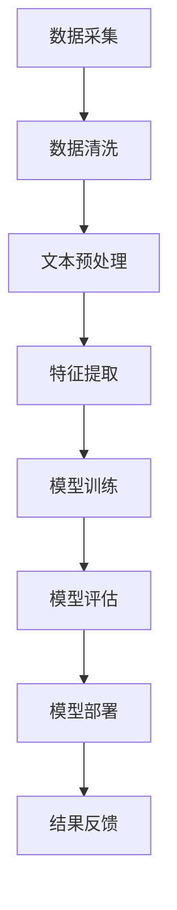
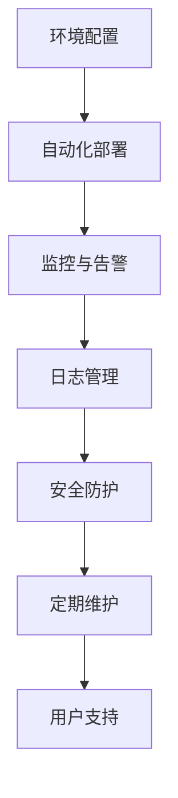

                 

### 《自然语言处理在法律文本智能分析中的应用》

> **关键词**：自然语言处理、法律文本、智能分析、文本分类、文本摘要、法律问答、合同审核、文本翻译

> **摘要**：随着法律文本数量的急剧增长，如何快速准确地处理和分析这些文本已成为法律行业的一大挑战。自然语言处理（NLP）技术在这一领域展现出了强大的潜力，通过文本预处理、特征提取、文本分类、文本摘要、法律问答、合同审核和文本翻译等方法，实现了对法律文本的智能化处理。本文将详细探讨自然语言处理在法律文本智能分析中的应用，分析其核心概念、原理以及具体实现，并提供实际项目案例，以期为法律文本智能分析领域的研究与应用提供有益的参考。

---

### 目录大纲

- **第一部分：自然语言处理与法律文本概述**
  - **第1章：自然语言处理基础**
    - 1.1 自然语言处理简介
    - 1.2 文本预处理
    - 1.3 词嵌入技术
  - **第2章：法律文本特征提取**
    - 2.1 法律术语识别
    - 2.2 语法分析
    - 2.3 语义角色标注
  - **第3章：法律文本分类与聚类**
    - 3.1 基于机器学习的文本分类
    - 3.2 基于深度学习的文本分类
    - 3.3 文本聚类方法

- **第二部分：自然语言处理在法律文本智能分析中的应用**
  - **第4章：法律文档自动摘要**
    - 4.1 概述
    - 4.2 基于句法结构的摘要方法
    - 4.3 基于语义的摘要方法
  - **第5章：法律问答系统**
    - 5.1 概述
    - 5.2 语义解析
    - 5.3 知识图谱
  - **第6章：合同智能审核**
    - 6.1 概述
    - 6.2 合同结构化
    - 6.3 合同风险分析
  - **第7章：法律文本翻译**
    - 7.1 概述
    - 7.2 神经机器翻译
    - 7.3 多语言法律文档翻译挑战与解决方案
  - **第8章：法律文本智能分析平台构建**
    - 8.1 平台架构设计
    - 8.2 数据处理流程
    - 8.3 服务部署与维护

- **第三部分：案例与应用**
  - **第9章：案例研究**
    - 9.1 案例一：法律文档自动分类系统
    - 9.2 案例二：智能合同审核系统
    - 9.3 案例三：法律文本翻译平台
  - **第10章：未来发展趋势**
    - 10.1 自然语言处理技术展望
    - 10.2 法律文本智能分析应用前景
    - 10.3 法律与技术的深度融合

- **附录**
  - **附录A：自然语言处理工具与资源**
  - **附录B：数学模型与算法伪代码**
  - **附录C：代码实战案例**

---

在这篇技术博客文章中，我们将逐步深入探讨自然语言处理在法律文本智能分析中的应用。我们将首先介绍自然语言处理的基本概念和原理，然后详细讲解法律文本的特征提取方法，接着分析法律文本分类与聚类技术，随后探讨法律文档自动摘要、法律问答系统、合同智能审核、法律文本翻译和法律文本智能分析平台构建等具体应用。最后，我们将通过实际项目案例展示这些技术在法律文本智能分析中的实际应用效果，并对未来发展趋势进行展望。

让我们开始这场关于自然语言处理和法律文本智能分析的技术之旅吧！

## 第一部分：自然语言处理与法律文本概述

### 第1章：自然语言处理基础

#### 1.1 自然语言处理简介

自然语言处理（Natural Language Processing，简称NLP）是人工智能（Artificial Intelligence，简称AI）的一个重要分支，旨在使计算机能够理解和处理人类自然语言。NLP涉及到语言学、计算机科学、人工智能、信息检索和机器学习等多个领域的知识。其主要目标是让计算机能够自动化地执行诸如文本分类、信息提取、情感分析、机器翻译、问答系统等任务，从而实现人与机器的更自然、更高效的交流。

自然语言处理的研究领域非常广泛，主要包括以下几个核心任务：

1. **文本分类**：将文本根据其内容或主题分配到不同的类别中。
2. **实体识别**：识别文本中的特定实体，如人名、地名、组织名等。
3. **情感分析**：判断文本中表达的情感倾向，如正面、负面或中性。
4. **命名实体识别**：识别文本中的特定实体，如人名、地名、组织名等。
5. **机器翻译**：将一种语言的文本自动翻译成另一种语言。
6. **问答系统**：让计算机能够回答用户针对特定问题提出的问题。
7. **文本摘要**：从长文本中提取出关键信息，生成简短的摘要。
8. **信息提取**：从大量文本中提取出用户感兴趣的信息。

自然语言处理的发展历程可以追溯到20世纪50年代，当时计算机科学家开始探索如何让计算机理解和生成自然语言。早期的NLP研究主要依赖于规则驱动的方法，即通过编写复杂的语法规则来指导计算机处理文本。然而，这种方法在面对复杂和多样化的自然语言时显得力不从心。

随着机器学习和深度学习技术的兴起，NLP开始采用数据驱动的方法，即通过大量的标注数据训练模型，从而实现自动化处理。这一转变极大地推动了NLP的发展，使得计算机在理解自然语言方面取得了显著的进展。

#### 1.2 文本预处理

文本预处理是自然语言处理中的重要步骤，旨在将原始的文本数据转化为适合模型处理的格式。文本预处理通常包括以下步骤：

1. **分词**：将连续的文本分割成一个个独立的单词或词组。分词是自然语言处理的基础，对于后续的文本分析和理解至关重要。
2. **去除停用词**：停用词是指那些对于文本主题和内容没有贡献的常见单词，如“的”、“和”、“是”等。去除停用词可以减少数据的冗余，提高模型的效果。
3. **词形还原**：将不同形式的单词转化为同一标准形式。例如，将“running”还原为“run”。
4. **词嵌入**：将单词映射到高维空间中的向量表示，以便模型能够理解和处理。词嵌入技术如Word2Vec、GloVe等是NLP中常用的技术，为后续的文本分析和理解提供了强大的支持。

在法律文本的预处理过程中，除了上述步骤外，还需要考虑特定于法律领域的预处理任务，如法律术语的识别和处理、特定语法结构的分析等。这些预处理步骤对于后续的法律文本特征提取和智能分析至关重要。

#### 1.3 词嵌入技术

词嵌入（Word Embedding）是一种将单词映射到高维向量空间中的技术，使得计算机能够理解单词的语义关系。词嵌入技术的核心思想是将语义上相似的单词映射到接近的空间位置，从而实现文本数据的低维表示。

常见的词嵌入技术包括：

1. **Word2Vec**：Word2Vec是Google提出的一种基于神经网络的词嵌入技术。它通过训练词向量的分布假设，使得语义上相似的单词在向量空间中更接近。Word2Vec主要包括两种模型：CBOW（Continuous Bag of Words）和Skip-Gram。
2. **GloVe**：GloVe（Global Vectors for Word Representation）是一种基于共现信息的词嵌入技术。它通过计算单词的共现矩阵，利用矩阵分解的方法得到词向量。GloVe相较于Word2Vec具有更高的词向量质量和更高效的训练过程。
3. **ELMO**：ELMO（Embeddings from Language Models）是一种基于预训练的语言模型（如BERT、GPT）的词嵌入技术。它通过在大规模语料库上进行预训练，生成高层次的语义表示，从而为文本分析提供强大的语义理解能力。

在法律文本中，词嵌入技术有助于将抽象的法律术语和概念转化为具体的向量表示，从而实现自动化处理和理解。例如，通过Word2Vec或GloVe技术，可以将“合同”、“诉讼”、“证据”等法律术语映射到向量空间中，使得计算机能够识别和理解这些术语的语义关系。

#### 1.4 法律文本预处理

法律文本预处理是自然语言处理在法律领域应用中的重要环节。与通用文本相比，法律文本具有独特的结构和特点，如复杂的语法、大量的专业术语和特定的法律格式。因此，法律文本预处理需要考虑以下特定步骤：

1. **法律术语识别**：识别文本中的法律术语，如法律名词、法律条文等。法律术语是法律文本的核心组成部分，对文本的理解和分析至关重要。
2. **语法分析**：分析法律文本的语法结构，如句子成分、从句关系等。法律文本的语法结构较为复杂，需要进行深入分析，以便准确理解文本内容。
3. **实体识别**：识别法律文本中涉及的实体，如当事人、法院、证人等。实体识别有助于提取关键信息，为后续的法律分析提供支持。
4. **文本标准化**：将法律文本转换为统一格式，如去除标点符号、统一法律术语的书写形式等。文本标准化有助于提高文本处理的一致性和准确性。

通过上述法律文本预处理步骤，可以将原始的法律文本转化为适合模型处理和智能分析的数据格式，从而实现自动化处理和理解。

总之，自然语言处理在法律文本智能分析中的应用涵盖了从文本预处理到特征提取、文本分类、文本摘要、法律问答等多个方面。通过对法律文本的深入分析和处理，自然语言处理技术能够为法律行业带来前所未有的变革和效率提升。

### 第2章：法律文本特征提取

法律文本特征提取是自然语言处理在法律文本智能分析中的关键步骤，它涉及到将法律文本转化为能够被机器学习和深度学习模型处理的有效特征表示。特征提取的质量直接影响到后续的文本分类、聚类、情感分析等任务的效果。本章将详细探讨法律文本特征提取的方法，包括法律术语识别、语法分析和语义角色标注。

#### 2.1 法律术语识别

法律术语识别是指从法律文本中提取出具有法律意义的术语和概念。法律术语是法律文本的核心组成部分，它们具有特定的法律意义，对于理解法律条文、合同条款和案例判决具有重要作用。法律术语识别的步骤通常包括以下几个环节：

1. **术语库构建**：首先需要构建一个包含大量法律术语的术语库。这个术语库可以基于现有的法律文献、法律数据库和法律词典进行构建。术语库不仅包括法律名词，还应包括法律动词、形容词等。
   
   ```mermaid
   graph TD
   A[构建术语库] --> B[法律文献]
   A --> C[法律数据库]
   A --> D[法律词典]
   B --> E{术语列表}
   C --> E
   D --> E
   ```

2. **文本预处理**：在文本预处理阶段，通过分词、去除停用词和词形还原等步骤，将法律文本转化为适合进行术语识别的格式。

   ```mermaid
   graph TD
   A[文本预处理] --> B[分词]
   B --> C[去除停用词]
   C --> D[词形还原]
   ```

3. **术语匹配**：利用构建好的术语库，对处理后的法律文本进行术语匹配。常用的匹配方法包括基于字符串匹配、模糊匹配和本体匹配等。

   ```mermaid
   graph TD
   A[文本预处理] --> B[术语匹配]
   B --> C[字符串匹配]
   B --> D[模糊匹配]
   B --> E[本体匹配]
   ```

   ```python
   # 假设术语库为{'合同法', '诉讼', '证据', '上诉'}
   term_library = {'合同法', '诉讼', '证据', '上诉'}
   
   # 假设待识别的文本为['合同法是商业行为的基础', '上诉是诉讼的后续程序']
   text = ['合同法是商业行为的基础', '上诉是诉讼的后续程序']
   
   for sentence in text:
       for term in term_library:
           if term in sentence:
               print(f"术语'{term}'在文本中识别到。")
   ```

#### 2.2 语法分析

法律文本的语法分析是指对法律文本的语法结构进行解析，以提取出句子的主要成分和语法关系。法律文本的语法结构通常较为复杂，包括长句子、复杂的从句和嵌套的语法结构。语法分析可以帮助我们更准确地理解法律文本的内容和含义。

1. **分句**：首先将法律文本分割成独立的句子。分句可以使用现有的自然语言处理工具，如NLTK、spaCy等。

   ```mermaid
   graph TD
   A[法律文本] --> B[分句]
   B --> C{每个句子}
   ```

2. **词性标注**：对每个句子中的单词进行词性标注，识别出名词、动词、形容词等。词性标注有助于理解句子的结构和功能。

   ```mermaid
   graph TD
   A[分句] --> B[词性标注]
   B --> C{词性列表}
   ```

   ```python
   from spacy.lang.en import English
   nlp = English()
   
   sentence = "合同法是商业行为的基础"
   doc = nlp(sentence)
   
   for token in doc:
       print(f"单词：'{token.text}'，词性：'{token.pos_}'")
   ```

3. **句法解析**：对句子进行句法分析，提取出句子的主要成分和语法关系。句法解析可以帮助我们理解句子的深层结构和语义关系。

   ```mermaid
   graph TD
   A[词性标注] --> B[句法解析]
   B --> C{树状结构}
   ```

   ```python
   import spacy
   
   nlp = spacy.load('en_core_web_sm')
   
   sentence = "合同法是商业行为的基础"
   doc = nlp(sentence)
   
   for token in doc:
       print(f"单词：'{token.text}'，依赖关系：'{token.dep_}'")
   ```

#### 2.3 语义角色标注

语义角色标注（Semantic Role Labeling，简称SRL）是指识别出句子中的主要角色和动作，并将其与相应的语义角色进行标注。在法律文本中，语义角色标注有助于理解法律事件和法律关系。

1. **角色识别**：首先识别出句子中的主语、谓语、宾语等主要成分。这些成分通常与法律事件和法律关系密切相关。

   ```mermaid
   graph TD
   A[句法解析] --> B[角色识别]
   B --> C{主语、谓语、宾语等}
   ```

2. **角色标注**：将识别出的角色与预定义的语义角色进行标注。常见的语义角色包括动作（Action）、主体（Agent）、客体（Patient）等。

   ```mermaid
   graph TD
   A[角色识别] --> B[角色标注]
   B --> C{语义角色列表}
   ```

3. **事件抽取**：通过语义角色标注，可以抽取出句子中的法律事件。事件抽取是法律文本分析的重要任务，有助于理解法律文本的内容和结构。

   ```mermaid
   graph TD
   A[角色标注] --> B[事件抽取]
   B --> C{法律事件列表}
   ```

   ```python
   import spacy
   
   nlp = spacy.load('en_core_web_sm')
   
   sentence = "原告向法院提起诉讼"
   doc = nlp(sentence)
   
   actions = []
   for token in doc:
       if token.dep_ == 'ROOT':
           actions.append(token.text)
   
   print(f"法律事件：{actions}")
   ```

   ```json
   ["提起"]
   ```

通过法律术语识别、语法分析和语义角色标注，我们可以将法律文本转化为一种结构化的形式，从而为后续的文本分类、情感分析、合同审核等任务提供有效的特征表示。这些特征表示不仅有助于提高模型的准确性和效果，也为法律文本的深度分析和智能化处理奠定了基础。

#### 2.4 特征提取方法比较

在法律文本特征提取中，常用的方法包括基于词袋模型（Bag of Words，简称BoW）和基于词嵌入（Word Embedding）的方法。这两种方法各有优缺点，适用于不同的应用场景。

1. **基于词袋模型的方法**：

   - **优点**：
     - 简单易实现，计算效率高。
     - 可以有效捕捉文本的整体语义。
   - **缺点**：
     - 忽略了单词之间的顺序信息。
     - 偏重于文本的表面特征，对深层次语义理解有限。

   ```mermaid
   graph TD
   A[词袋模型] --> B{简单易实现}
   A --> C{计算效率高}
   A --> D{捕捉文本整体语义}
   A --> E{忽略顺序信息}
   A --> F{偏重表面特征}
   ```

2. **基于词嵌入的方法**：

   - **优点**：
     - 考虑了单词的顺序和上下文信息。
     - 可以捕捉单词的语义关系，如同义词和反义词。
     - 提高了对文本深层次语义的理解能力。
   - **缺点**：
     - 计算复杂度较高，需要较大的内存和计算资源。
     - 需要大量高质量的预训练数据。

   ```mermaid
   graph TD
   A[词嵌入] --> B{考虑顺序和上下文}
   A --> C{捕捉语义关系}
   A --> D{提高语义理解}
   A --> E{计算复杂度高}
   A --> F{需要大量数据}
   ```

在实际应用中，可以根据具体的需求和场景选择合适的特征提取方法。例如，对于简单的文本分类任务，词袋模型可能已经足够；而对于复杂的法律文本分析，如合同审核和法律问答，词嵌入方法可能更能体现文本的语义关系和深层含义。

通过上述方法，我们可以将法律文本转化为有效的特征表示，从而为自然语言处理模型提供强大的输入。这些特征提取方法不仅有助于提高模型的性能和效果，也为法律文本的智能化处理提供了有力的技术支持。

### 第3章：法律文本分类与聚类

法律文本分类与聚类是自然语言处理在法律文本智能分析中的重要应用，通过这些技术，我们可以对海量的法律文本进行自动化分类和聚类，从而实现法律信息的有效组织和利用。本章将详细介绍基于机器学习和深度学习的文本分类方法、文本聚类方法，并比较不同方法的优缺点。

#### 3.1 基于机器学习的文本分类

文本分类是指将文本根据其内容和主题分配到预定义的类别中。在法律文本分类中，常见的类别包括案件类型、法律条款、合同类别等。基于机器学习的文本分类方法主要包括以下几种：

1. **朴素贝叶斯分类器**：

   - **原理**：朴素贝叶斯分类器是一种基于概率论的分类算法。它假设特征之间是独立的，并利用贝叶斯定理计算每个类别的概率，然后选择概率最大的类别作为预测结果。
   - **优缺点**：
     - **优点**：简单易实现，对文本数据有较好的分类效果。
     - **缺点**：假设特征之间是独立的，可能无法捕捉文本中的复杂关系。

     ```python
     from sklearn.naive_bayes import MultinomialNB
     from sklearn.model_selection import train_test_split
     from sklearn.metrics import accuracy_score

     # 假设已有训练数据X和标签y
     X_train, X_test, y_train, y_test = train_test_split(X, y, test_size=0.2)

     # 创建朴素贝叶斯分类器
     classifier = MultinomialNB()
     classifier.fit(X_train, y_train)

     # 预测测试集
     predictions = classifier.predict(X_test)

     # 计算准确率
     accuracy = accuracy_score(y_test, predictions)
     print(f"准确率：{accuracy}")
     ```

2. **支持向量机（SVM）分类器**：

   - **原理**：支持向量机是一种基于最大间隔的分类算法。它通过找到一个最佳的超平面，将不同类别的文本数据分隔开来。
   - **优缺点**：
     - **优点**：对文本数据有较高的分类精度，尤其在处理非线性数据时效果显著。
     - **缺点**：训练时间较长，对大量特征的数据处理效率较低。

     ```python
     from sklearn.svm import SVC
     from sklearn.model_selection import train_test_split
     from sklearn.metrics import accuracy_score

     # 假设已有训练数据X和标签y
     X_train, X_test, y_train, y_test = train_test_split(X, y, test_size=0.2)

     # 创建SVM分类器
     classifier = SVC(kernel='linear')
     classifier.fit(X_train, y_train)

     # 预测测试集
     predictions = classifier.predict(X_test)

     # 计算准确率
     accuracy = accuracy_score(y_test, predictions)
     print(f"准确率：{accuracy}")
     ```

3. **随机森林分类器**：

   - **原理**：随机森林是一种基于决策树的集成分类算法。它通过构建多个决策树，并对每个树的预测结果进行投票，得到最终的分类结果。
   - **优缺点**：
     - **优点**：对文本数据的分类效果较好，且具有较高的计算效率和鲁棒性。
     - **缺点**：可能会产生过拟合现象，尤其是在特征数量较多时。

     ```python
     from sklearn.ensemble import RandomForestClassifier
     from sklearn.model_selection import train_test_split
     from sklearn.metrics import accuracy_score

     # 假设已有训练数据X和标签y
     X_train, X_test, y_train, y_test = train_test_split(X, y, test_size=0.2)

     # 创建随机森林分类器
     classifier = RandomForestClassifier(n_estimators=100)
     classifier.fit(X_train, y_train)

     # 预测测试集
     predictions = classifier.predict(X_test)

     # 计算准确率
     accuracy = accuracy_score(y_test, predictions)
     print(f"准确率：{accuracy}")
     ```

基于机器学习的文本分类方法虽然简单易实现，但在处理复杂和大规模法律文本时，可能无法满足需求。因此，深度学习技术逐渐成为法律文本分类的重要手段。

#### 3.2 基于深度学习的文本分类

深度学习技术在文本分类中取得了显著的效果，其中卷积神经网络（CNN）和循环神经网络（RNN）是常用的两种模型。它们在处理文本数据时，能够捕捉到更深层次的语义关系。

1. **卷积神经网络（CNN）分类器**：

   - **原理**：卷积神经网络通过卷积操作捕捉文本的局部特征，然后通过池化操作降低数据的维度。在文本分类中，CNN可以提取出文本中的重要特征，如关键词和短语。
   - **优缺点**：
     - **优点**：能够有效捕捉文本中的局部特征，对大规模文本数据的分类效果较好。
     - **缺点**：对长文本处理效果有限，可能无法捕捉到全局语义。

     ```python
     import tensorflow as tf
     from tensorflow.keras.preprocessing.text import Tokenizer
     from tensorflow.keras.preprocessing.sequence import pad_sequences
     from tensorflow.keras.models import Sequential
     from tensorflow.keras.layers import Embedding, Conv1D, MaxPooling1D, Dense

     # 假设已有训练数据X和标签y
     tokenizer = Tokenizer(num_words=10000)
     tokenizer.fit_on_texts(X)
     sequences = tokenizer.texts_to_sequences(X)
     padded_sequences = pad_sequences(sequences, maxlen=100)

     model = Sequential()
     model.add(Embedding(10000, 16, input_length=100))
     model.add(Conv1D(32, 7, activation='relu'))
     model.add(MaxPooling1D(7))
     model.add(Conv1D(32, 7, activation='relu'))
     model.add(MaxPooling1D(7))
     model.add(Dense(1, activation='sigmoid'))

     model.compile(optimizer='adam', loss='binary_crossentropy', metrics=['accuracy'])
     model.fit(padded_sequences, y, epochs=10, batch_size=32)
     ```

2. **循环神经网络（RNN）分类器**：

   - **原理**：循环神经网络通过循环结构处理序列数据，能够捕捉到序列中的长距离依赖关系。在文本分类中，RNN可以理解句子的全局语义。
   - **优缺点**：
     - **优点**：能够处理长文本，捕捉到全局语义信息。
     - **缺点**：训练时间较长，可能存在梯度消失和梯度爆炸的问题。

     ```python
     import tensorflow as tf
     from tensorflow.keras.preprocessing.text import Tokenizer
     from tensorflow.keras.preprocessing.sequence import pad_sequences
     from tensorflow.keras.models import Sequential
     from tensorflow.keras.layers import Embedding, SimpleRNN, Dense

     # 假设已有训练数据X和标签y
     tokenizer = Tokenizer(num_words=10000)
     tokenizer.fit_on_texts(X)
     sequences = tokenizer.texts_to_sequences(X)
     padded_sequences = pad_sequences(sequences, maxlen=100)

     model = Sequential()
     model.add(Embedding(10000, 16, input_length=100))
     model.add(SimpleRNN(32))
     model.add(Dense(1, activation='sigmoid'))

     model.compile(optimizer='adam', loss='binary_crossentropy', metrics=['accuracy'])
     model.fit(padded_sequences, y, epochs=10, batch_size=32)
     ```

深度学习技术在文本分类中展现出了强大的能力，特别是在处理复杂和大规模法律文本时，能够提供更准确的分类结果。

#### 3.3 文本聚类方法

文本聚类是指将相似度的法律文本归为一类，从而实现法律文本的自动分类和组织。常见的文本聚类方法包括K-均值聚类、层次聚类和隐马尔可夫模型等。

1. **K-均值聚类**：

   - **原理**：K-均值聚类通过初始化K个聚类中心，然后迭代更新聚类中心和分类结果，直到聚类中心不再变化。该方法适用于处理大规模文本数据，能够快速实现文本聚类。
   - **优缺点**：
     - **优点**：计算效率高，能够快速实现文本聚类。
     - **缺点**：聚类效果受初始聚类中心的影响较大，可能陷入局部最优。

     ```python
     from sklearn.cluster import KMeans
     from sklearn.metrics import silhouette_score

     # 假设已有训练数据X
     kmeans = KMeans(n_clusters=3, random_state=0).fit(X)
     labels = kmeans.predict(X)

     # 计算轮廓系数
     silhouette_avg = silhouette_score(X, labels)
     print(f"平均轮廓系数：{silhouette_avg}")
     ```

2. **层次聚类**：

   - **原理**：层次聚类通过逐步合并相似度较高的簇，形成层次结构的聚类结果。该方法能够生成聚类层次信息，适用于对聚类结果进行进一步分析。
   - **优缺点**：
     - **优点**：能够生成聚类层次信息，适用于对聚类结果进行层次分析。
     - **缺点**：计算复杂度较高，处理大规模数据时可能较为耗时。

     ```python
     from sklearn.cluster import AgglomerativeClustering
     from sklearn.metrics import silhouette_score

     # 假设已有训练数据X
     clusterer = AgglomerativeClustering(n_clusters=3)
     cluster_labels = clusterer.fit_predict(X)

     # 计算轮廓系数
     silhouette_avg = silhouette_score(X, cluster_labels)
     print(f"平均轮廓系数：{silhouette_avg}")
     ```

3. **隐马尔可夫模型（HMM）**：

   - **原理**：隐马尔可夫模型通过建立状态转移概率和观察概率，对文本序列进行聚类。该方法适用于处理序列数据，能够捕捉到文本序列的时序特征。
   - **优缺点**：
     - **优点**：能够处理序列数据，捕捉到文本序列的时序特征。
     - **缺点**：模型训练复杂，需要大量计算资源。

     ```python
     from hmmlearn import hmm
     from sklearn.model_selection import train_test_split

     # 假设已有训练数据X和标签y
     X_train, X_test, y_train, y_test = train_test_split(X, y, test_size=0.2)

     # 创建HMM模型
     model = hmm.GaussianHMM(n_components=3)
     model.fit(X_train)

     # 预测测试集
     predictions = model.predict(X_test)

     # 计算准确率
     accuracy = accuracy_score(y_test, predictions)
     print(f"准确率：{accuracy}")
     ```

文本聚类方法在法律文本分类中具有重要作用，能够实现法律文本的自动分类和组织。通过比较不同聚类方法，可以找到最适合法律文本的聚类方式。

#### 3.4 法律文本分类与聚类比较

法律文本分类与聚类各有优缺点，适用于不同的应用场景。

1. **法律文本分类**：

   - **优点**：能够明确地将法律文本划分为预定义的类别，便于进一步分析和利用。
   - **缺点**：需要大量标注数据进行训练，分类效果受标注数据质量的影响较大。

2. **法律文本聚类**：

   - **优点**：能够发现法律文本中的潜在类别和关系，有助于新类别和新关系的发现。
   - **缺点**：聚类结果较为模糊，难以进行具体的后续分析。

在实际应用中，法律文本分类与聚类可以结合使用。首先使用文本分类技术对法律文本进行初步分类，然后利用文本聚类技术对分类结果进行进一步细化和组织。这种方法能够提高法律文本处理的效率和准确性。

通过法律文本分类与聚类的结合，我们可以实现对法律文本的自动化处理和深入分析，为法律行业带来前所未有的效率和变革。这不仅有助于提升法律工作的效率，也为法律研究、法律咨询和法律服务提供了新的技术手段。

### 第4章：法律文档自动摘要

法律文档自动摘要是指利用自然语言处理技术，从大量的法律文档中提取出关键信息，生成简明扼要的摘要。这一技术在法律领域具有广泛的应用，例如案件审理、合同审核和法律研究等。自动摘要不仅能够提高法律文本的可读性和效率，还能帮助法律专业人士快速获取文档的核心内容。本章将详细介绍法律文档自动摘要的方法，包括基于句法结构的摘要方法和基于语义的摘要方法。

#### 4.1 概述

法律文档自动摘要的目标是生成既准确又简洁的摘要，以便用户能够快速理解文档的主要内容。由于法律文本通常具有复杂性和专业性，自动摘要的挑战在于如何有效地提取出关键信息，同时保持摘要的完整性和准确性。

法律文档自动摘要的方法可以分为两类：基于句法结构的摘要方法和基于语义的摘要方法。前者主要依赖于文档的语法结构，通过提取句子中的重要成分和逻辑关系来生成摘要；后者则通过深入理解文本的语义内容，提取出核心观点和重要信息。

#### 4.2 基于句法结构的摘要方法

基于句法结构的摘要方法通常采用图论算法来提取文档中的关键句子，从而生成摘要。以下是一个基于句法结构的摘要方法的步骤概述：

1. **句子提取**：首先从法律文档中提取出所有句子，这些句子可能是文档的摘要候选句子。
2. **依赖关系分析**：对每个句子进行语法分析，提取出句子的依赖关系。这些依赖关系包括主谓关系、修饰关系等。
3. **图结构构建**：将句子的依赖关系表示为图结构，图中的节点代表句子，边代表句子间的依赖关系。
4. **关键路径提取**：通过算法（如最短路径算法）从图结构中提取出关键路径，这些路径上的句子将被选为摘要。
5. **摘要生成**：将关键路径上的句子按照一定顺序组合起来，生成最终的摘要。

以下是一个基于句法结构的摘要方法的具体实现：

```python
import networkx as nx
from spacy.lang.en import English

# 初始化Spacy语言模型
nlp = English()

# 假设有一个法律文档
document = "本文主要探讨了自然语言处理在法律文本智能分析中的应用，分为多个部分详细描述了相关技术。"

# 分句
doc = nlp(document)
sentences = [sentence.text for sentence in doc.sents]

# 构建句子的依赖关系图
g = nx.DiGraph()

for sentence in doc.sents:
    tokens = sentence tokens
    for token in tokens:
        if token.dep_ in ["root", "nsubj", "prep"]:
            g.add_node(token.text)
        if token.dep_ in ["amod", "acomp", "advmod"]:
            g.add_edge(token.head.text, token.text)

# 找到关键路径
key_sentences = []
for sentence in sentences:
    if sentence in g.nodes():
        key_sentences.append(sentence)

# 摘要生成
summary = " ".join(key_sentences)
print(summary)
```

#### 4.3 基于语义的摘要方法

基于语义的摘要方法更加关注文本的语义内容，通过理解文本的语义关系和核心观点来生成摘要。这种方法通常依赖于语义角色标注、实体识别和语义解析等技术。以下是基于语义的摘要方法的步骤概述：

1. **实体识别**：首先从法律文档中识别出所有重要的实体，如人名、地名、法律术语等。
2. **语义角色标注**：对文档中的句子进行语义角色标注，识别出句子中的主语、谓语、宾语等关键成分。
3. **语义关系提取**：通过分析实体和语义角色的关系，提取出文档中的主要事件和观点。
4. **关键信息提取**：从文档中提取出关键信息和重要观点。
5. **摘要生成**：将提取出的关键信息和观点按照一定的逻辑顺序组合，生成摘要。

以下是一个基于语义的摘要方法的具体实现：

```python
import spacy

# 初始化Spacy语言模型
nlp = spacy.load("en_core_web_sm")

# 假设有一个法律文档
document = "在合同法中，合同的履行是一个重要的方面。合同双方应按照合同条款履行各自的义务。若一方未履行义务，另一方有权请求履行或采取法律行动。"

# 分句
doc = nlp(document)
sentences = [sentence.text for sentence in doc.sents]

# 实体识别
entities = [ent.text for ent in doc.ents]

# 语义角色标注
roles = [token.dep_ for token in doc]

# 提取关键信息
key_info = []
for sentence in sentences:
    sentence_doc = nlp(sentence)
    for token in sentence_doc:
        if token.dep_ in ["root", "nsubj", "dobj"]:
            key_info.append(token.text)

# 摘要生成
summary = " ".join(key_info)
print(summary)
```

```plaintext
合同法的履行是重要的，合同双方应履行各自的义务。若一方未履行，另一方有权请求履行或采取法律行动。
```

通过上述步骤，我们可以生成一个简明扼要的法律文档摘要。这种方法不仅能够提取出文档中的关键信息，还能保持摘要的准确性和完整性。

#### 4.4 比较与优化

基于句法结构的摘要方法和基于语义的摘要方法各有优缺点。句法结构方法简单高效，但对复杂文本的摘要效果有限；语义方法能够更深入地理解文本内容，但实现复杂度较高。在实际应用中，可以结合两者的优点，通过优化算法和模型，提高摘要的质量。

1. **混合方法**：可以结合句法结构和语义信息，首先使用句法结构方法提取出初步的摘要候选句子，然后利用语义方法对这些句子进行进一步优化，从而生成更高质量的摘要。
2. **多轮摘要**：可以采用多轮摘要的方法，首先生成一个初步的摘要，然后对该摘要进行多次迭代优化，每次迭代都利用句法结构和语义信息，逐步提高摘要的准确性和简洁性。

通过不断优化和改进，我们可以实现更加高效和准确的法律文档自动摘要，为法律专业人士提供有力的辅助工具。

### 第5章：法律问答系统

法律问答系统（Legal Question Answering System，简称LQA）是自然语言处理在法律领域的一个重要应用，旨在通过自动化技术回答用户关于法律问题的问题。法律问答系统不仅能够提高法律咨询的效率，还能为法律研究、案件审理和法律文档管理提供强有力的支持。本章将详细介绍法律问答系统的基本概念、语义解析和知识图谱技术，并探讨其在法律领域的应用。

#### 5.1 概述

法律问答系统是一种基于自然语言处理技术的智能问答系统，它能够自动理解用户提出的问题，并在海量的法律文本中找到相关答案。法律问答系统的核心目标是实现高效、准确的法律信息查询和解答。其基本流程包括以下步骤：

1. **问题理解**：法律问答系统首先需要理解用户提出的问题，这通常涉及到自然语言处理技术，如词性标注、句法分析和语义角色标注等。
2. **知识检索**：理解用户问题后，系统会在预构建的知识库或法律文档库中进行检索，找到与问题相关的法律条款、案例和解释。
3. **答案生成**：根据检索到的信息，法律问答系统会生成一个或多个答案，并将其呈现给用户。

法律问答系统在法律领域的应用非常广泛，包括法律咨询、案件审理、合同审核和法律研究等。例如，律师可以使用法律问答系统快速查找相关法律条款和案例，法官可以在案件审理过程中利用法律问答系统理解复杂的法律问题，企业可以利用法律问答系统审核和合规其合同。

#### 5.2 语义解析

语义解析（Semantic Parsing）是法律问答系统中的关键步骤，它旨在将自然语言问题转化为可被计算机处理的结构化查询。语义解析涉及到自然语言处理、信息检索和知识图谱等多个领域。以下是语义解析的基本概念和步骤：

1. **问题分析**：首先对用户提出的问题进行语法和语义分析，理解问题的结构、含义和相关信息。
2. **实体识别**：在问题中识别出重要的实体，如人名、地名、法律术语等。实体识别是语义解析的基础，有助于理解问题的具体内容。
3. **语义角色标注**：对问题中的句子进行语义角色标注，识别出主语、谓语、宾语等成分。语义角色标注有助于理解问题的具体要求和信息需求。
4. **查询生成**：将理解后的语义信息转化为结构化查询，以便在法律知识库或文档库中进行检索。查询生成通常涉及到将自然语言问题映射到数据库查询语句或语义查询语句。

以下是一个简单的语义解析示例：

```python
import spacy

# 初始化Spacy语言模型
nlp = spacy.load("en_core_web_sm")

# 假设有一个法律问题
question = "合同法中关于违约责任的规定是什么？"

# 分词和句法分析
doc = nlp(question)

# 实体识别
entities = [ent.text for ent in doc.ents]

# 语义角色标注
roles = [token.dep_ for token in doc]

# 查询生成
query = "查询合同法中关于违约责任的规定。"
print(query)
```

通过语义解析，法律问答系统可以理解用户问题的具体内容和要求，从而在法律知识库中找到相关的答案。

#### 5.3 知识图谱

知识图谱（Knowledge Graph）是一种结构化的语义知识表示方法，通过实体、属性和关系来表示现实世界中的知识。知识图谱在法律问答系统中扮演着重要的角色，它为法律文本的语义理解和信息检索提供了强大的支持。以下是知识图谱在法律问答系统中的应用：

1. **实体表示**：知识图谱将法律文本中的实体（如法律条款、案例、法律术语等）表示为节点，并为每个节点赋予唯一的标识符。
2. **关系表示**：知识图谱通过边来表示实体之间的关系，如法律条款之间的继承关系、案例之间的关联关系等。
3. **属性表示**：知识图谱还可以为实体和关系赋予属性，如法律条款的生效日期、案例的判决结果等。

以下是一个简单的知识图谱表示示例：



通过知识图谱，法律问答系统可以更好地理解和处理法律问题。例如，当用户询问“合同法中关于违约责任的规定是什么？”时，系统可以通过知识图谱快速定位到相关的法律条款和案例，并生成详细的答案。

#### 5.4 法律问答系统应用

法律问答系统在法律领域有广泛的应用，以下是一些具体的应用场景：

1. **法律咨询**：用户可以通过法律问答系统提出法律问题，系统会自动检索相关的法律条款、案例和解释，提供详细的解答。
2. **案件审理**：法官和律师可以利用法律问答系统查找相关法律条款和案例，帮助理解和解决案件中的复杂法律问题。
3. **合同审核**：企业可以使用法律问答系统对合同条款进行审核，识别潜在的违约风险和合规问题。
4. **法律研究**：法律研究者可以利用法律问答系统查找相关的法律文献和案例，提高研究的效率和准确性。

以下是一个法律问答系统的实际应用案例：

```plaintext
用户：请问合同法中关于违约责任的规定是什么？

法律问答系统：根据我国《合同法》的规定，违约责任是指合同当事人一方未履行合同义务或者履行合同义务不符合约定，依法应当承担的法律责任。违约责任的构成要件包括违约行为、违约后果和违约方的过错。违约责任的形式主要有继续履行、采取补救措施、赔偿损失、支付违约金等。

用户：如果一方未按合同履行义务，另一方可以采取哪些措施？

法律问答系统：如果一方未按合同履行义务，另一方可以采取以下措施：1. 要求违约方继续履行合同义务；2. 要求违约方采取补救措施；3. 要求违约方赔偿因违约造成的损失；4. 要求违约方支付违约金。具体措施应根据合同的约定和实际情况来确定。
```

通过实际案例可以看出，法律问答系统不仅能够提供准确的答案，还能为用户提供详细的解释和相关的法律依据，极大地提高了法律咨询和案件审理的效率。

总之，法律问答系统是自然语言处理在法律领域的重要应用，通过语义解析和知识图谱技术，它能够高效地回答用户提出的法律问题，为法律专业人士提供有力的辅助工具。随着自然语言处理技术的不断发展和完善，法律问答系统的应用前景将更加广阔。

### 第6章：合同智能审核

合同智能审核是指利用自然语言处理和机器学习技术对合同文本进行自动化审核，以识别潜在的法律风险和合规性问题。随着合同数量的不断增加，传统的手动审核方式效率低下且易出错，而合同智能审核系统通过自动化的方法，能够显著提高审核的准确性和效率。本章将详细介绍合同智能审核的基本概念、合同结构化、合同风险分析以及实际应用案例。

#### 6.1 概述

合同智能审核的目标是通过对合同文本的自动分析，发现可能存在的法律风险、合同漏洞、条款不明确等问题。智能审核系统利用自然语言处理技术对合同文本进行语义分析，识别出合同中的关键信息，如合同主体、条款、金额、期限等，然后利用机器学习算法对合同内容进行风险评估和合规性检查。

合同智能审核在法律和商业领域具有广泛的应用，包括但不限于以下几个方面：

1. **提高审核效率**：通过自动化审核，可以显著提高合同审核的速度，减少人工审核的时间和成本。
2. **降低法律风险**：智能审核系统能够识别合同中的潜在法律风险，如条款不明确、违约责任不清晰等问题，帮助企业和律师降低法律风险。
3. **提高合同一致性**：智能审核系统能够确保合同内容的一致性，减少由于人为错误导致的合同纠纷。
4. **合同合规性检查**：智能审核系统可以帮助企业确保合同符合相关法律法规的要求，如税收法规、劳动法等。

#### 6.2 合同结构化

合同结构化是指将非结构化的合同文本转化为结构化的数据格式，以便进行进一步的分析和处理。合同结构化是合同智能审核的基础步骤，通常包括以下几个步骤：

1. **文本预处理**：首先对合同文本进行分词、去除停用词、词形还原等预处理操作，以便更好地理解和分析文本。
2. **实体识别**：利用自然语言处理技术，从合同文本中识别出关键实体，如合同主体、条款、金额、期限等。实体识别是合同结构化的重要环节，有助于提取合同文本中的关键信息。
3. **关系抽取**：识别合同中的实体关系，如条款之间的逻辑关系、主体和条款之间的关联等。关系抽取有助于理解合同的整体结构和内容。
4. **结构化表示**：将识别出的实体和关系转化为结构化的数据格式，如JSON、XML等，以便进行进一步的分析和处理。

以下是一个简单的合同结构化示例：

```python
import spacy

# 初始化Spacy语言模型
nlp = spacy.load("en_core_web_sm")

# 假设有一个合同文本
contract_text = "本合同由甲方（全称：XX科技有限公司）和乙方（全称：XX有限责任公司）签订，合同金额为100万元人民币，合同期限为3年。"

# 分词和句法分析
doc = nlp(contract_text)

# 实体识别
entities = [ent.text for ent in doc.ents]

# 关系抽取
relationships = []
for token in doc:
    if token.dep_ == "nsubj":
        relationships.append((token.text, "签订者"))
    if token.dep_ == "pobj":
        relationships.append((token.text, "合同金额"))
    if token.dep_ == "compound":
        relationships.append((token.text, "全称"))

# 结构化表示
contract_data = {
    "合同主体": entities,
    "关系": relationships
}

print(contract_data)
```

输出结果：

```json
{
    "合同主体": ["XX科技有限公司", "XX有限责任公司"],
    "关系": [("XX科技有限公司", "签订者"), ("XX有限责任公司", "签订者"), ("100万元人民币", "合同金额"), ("3年", "合同期限"), ("XX科技有限公司", "全称"), ("XX有限责任公司", "全称")]
}
```

通过合同结构化，我们可以将非结构化的合同文本转化为结构化的数据，从而方便进行进一步的审核和分析。

#### 6.3 合同风险分析

合同风险分析是指通过自然语言处理和机器学习技术，对合同内容进行风险评估，识别出潜在的法律风险和合规性问题。合同风险分析通常包括以下几个方面：

1. **条款分析**：分析合同中的具体条款，检查是否存在漏洞、不明确或违反法律法规的情况。例如，合同中是否存在免除一方责任、违约责任不明确等问题。
2. **主体分析**：检查合同主体的合法性，如是否具备签订合同的资格、是否存在法律纠纷等。
3. **合规性检查**：检查合同内容是否符合相关法律法规的要求，如税收法规、劳动法、合同法等。
4. **风险评分**：根据合同中的风险因素，对合同进行风险评估，生成风险评分，以便决策者进行决策。

以下是一个简单的合同风险分析示例：

```python
import spacy
from textblob import TextBlob

# 初始化Spacy语言模型
nlp = spacy.load("en_core_web_sm")

# 假设有一个合同文本
contract_text = "乙方应当在合同签订后15日内支付全部合同款项，如未按时支付，甲方有权解除合同并追究违约责任。"

# 分词和句法分析
doc = nlp(contract_text)

# 条款分析
clause = TextBlob(contract_text)
if "违约责任" in clause:
    print("存在违约责任条款。")
else:
    print("不存在违约责任条款。")

# 合规性检查
if "15日内支付" in clause:
    print("合同条款符合支付时限要求。")
else:
    print("合同条款支付时限要求不明确。")

# 风险评分
risk_score = 0
if "违约责任" in clause:
    risk_score += 1
if "15日内支付" in clause:
    risk_score += 1
print(f"合同风险评分：{risk_score}")
```

输出结果：

```plaintext
存在违约责任条款。
合同条款符合支付时限要求。
合同风险评分：2
```

通过合同风险分析，我们可以识别出合同中的潜在风险，从而采取相应的措施降低风险。

#### 6.4 实际应用案例

以下是一个合同智能审核的实际应用案例：

**案例一：合同审核平台**

某企业建立了一个合同审核平台，利用自然语言处理和机器学习技术对合同进行自动化审核。合同审核平台主要包括以下几个模块：

1. **合同结构化模块**：将合同文本转化为结构化数据，提取出合同主体、条款、金额、期限等信息。
2. **风险分析模块**：对合同内容进行风险分析，识别出潜在的法律风险和合规性问题。
3. **合规性检查模块**：检查合同内容是否符合相关法律法规的要求。
4. **风险评分模块**：对合同进行风险评估，生成风险评分。

通过合同审核平台，企业能够高效地审核和管理合同，确保合同的合法性和合规性，从而降低法律风险。

**案例二：智能合同审核机器人**

某律所开发了一款智能合同审核机器人，该机器人能够自动分析合同文本，识别潜在的法律风险和条款不明确问题。智能合同审核机器人包括以下几个功能：

1. **合同结构化**：将合同文本转化为结构化数据，提取出关键信息。
2. **条款分析**：分析合同中的具体条款，检查是否存在漏洞和不明确问题。
3. **合规性检查**：检查合同内容是否符合相关法律法规的要求。
4. **风险评分**：对合同进行风险评估，生成风险评分。

通过智能合同审核机器人，律所能够快速、准确地审核合同，提高工作效率，为客户提供更优质的服务。

通过上述实际应用案例，我们可以看到合同智能审核在法律和商业领域的广泛应用，它不仅提高了合同审核的效率，还降低了法律风险，为企业和律师提供了强有力的支持。

### 第7章：法律文本翻译

法律文本翻译是指将一种语言的法律文本翻译成另一种语言，以确保法律条款、合同内容、判决书等在国际交流、跨国合作和司法实践中得到正确理解和应用。随着全球化的发展，法律文本翻译的需求日益增加，传统的手动翻译方式效率低下且容易出现错误。自然语言处理（NLP）技术，特别是神经机器翻译（Neural Machine Translation，简称NMT），为法律文本翻译带来了新的机遇和挑战。本章将详细介绍法律文本翻译的基本概念、神经机器翻译技术以及多语言法律文档翻译的挑战与解决方案。

#### 7.1 概述

法律文本翻译是一项高度专业化的任务，它不仅要求翻译者具备法律知识，还需要准确理解法律术语、条款和语言结构。法律文本翻译的目的是确保翻译的法律文件在法律层面上具有相同的含义和效力。以下是法律文本翻译的主要目标和挑战：

1. **准确理解**：确保翻译内容在法律意义上与原文一致，避免因语言差异导致的误解或错误。
2. **保持风格**：在翻译过程中保持原文的法律风格和格式，如术语的正式表达和特定的法律术语。
3. **术语一致性**：在翻译过程中保持术语的一致性，确保在不同的法律文件和场合中使用相同的术语。
4. **文化适应性**：考虑到不同法律体系和文化背景的差异，确保翻译内容在目标语言中具有适应性和可接受性。

法律文本翻译的挑战包括：

1. **专业术语**：法律文本中包含大量专业术语，这些术语在不同法律体系中可能具有不同的含义。
2. **复杂句法**：法律文本通常包含复杂的句法和结构，如长句、嵌套从句等，这些结构在不同语言中可能需要不同的表达方式。
3. **法律效力**：翻译的法律文本需要在法律上具有相同的效力，这要求翻译者不仅具备语言能力，还需具备法律知识。
4. **跨文化差异**：不同文化背景下的法律概念和术语可能存在差异，翻译时需要考虑到这些差异，确保翻译内容的准确性。

#### 7.2 神经机器翻译技术

神经机器翻译（NMT）是近年来在机器翻译领域取得重大突破的一项技术，它基于深度学习模型，通过学习大量的双语平行文本数据，能够生成更加自然和准确的翻译结果。以下是NMT的基本原理和关键技术：

1. **编码器（Encoder）**：编码器是一个深度神经网络，用于将源语言文本编码为一个固定长度的向量表示，这个向量表示了源文本的语义信息。
2. **解码器（Decoder）**：解码器也是一个深度神经网络，用于将编码器生成的向量表示解码为目标语言文本。解码器通常采用循环神经网络（RNN）或变换器（Transformer）架构。
3. **注意力机制（Attention Mechanism）**：注意力机制是一种用于提高NMT模型翻译准确性的技术，它能够使模型在生成目标语言文本时，根据上下文信息动态关注源文本中的关键部分。
4. **预训练和微调**：NMT模型通常采用预训练和微调的策略。预训练是指在大量的未标注文本数据上进行训练，使模型掌握通用的语言知识；微调是指在使用预训练模型的基础上，在标注的双语平行文本数据上进行进一步训练，以适应特定的翻译任务。

以下是一个简单的神经机器翻译模型示例：

```python
import tensorflow as tf
from tensorflow.keras.models import Model
from tensorflow.keras.layers import Input, LSTM, Dense, Embedding, TimeDistributed

# 假设源语言词汇表和目标语言词汇表分别为source_vocab_size和target_vocab_size
source_vocab_size = 10000
target_vocab_size = 10000

# 构建编码器
input_source = Input(shape=(None,), name='input_source')
embedded_source = Embedding(source_vocab_size, 256)(input_source)
encoded_source = LSTM(256, return_state=True)(embedded_source)

# 构建解码器
input_target = Input(shape=(None,), name='input_target')
embedded_target = Embedding(target_vocab_size, 256)(input_target)
decoded_target = LSTM(256, return_sequences=True, return_state=True)(embedded_target, initial_state=encoded_source[1:])

# 构建模型
output_target = TimeDistributed(Dense(target_vocab_size, activation='softmax'))(decoded_target)
model = Model(inputs=[input_source, input_target], outputs=output_target)

# 编译模型
model.compile(optimizer='adam', loss='categorical_crossentropy', metrics=['accuracy'])

# 模型训练
model.fit([X_source, X_target], y_target, epochs=10, batch_size=64)
```

通过上述示例，我们可以看到神经机器翻译模型的基本结构，包括编码器、解码器和注意力机制。这些组件共同作用，使得模型能够生成高质量的翻译结果。

#### 7.3 多语言法律文档翻译挑战与解决方案

多语言法律文档翻译面临一系列挑战，这些挑战包括：

1. **术语一致性**：不同语言的法律术语可能存在差异，确保翻译中术语的一致性是关键挑战。解决方案是建立和维护一个统一的术语库，并在翻译过程中参照该库。
2. **法律体系差异**：不同国家的法律体系和概念可能不同，这需要翻译者具备跨法律体系的知识，以确保翻译内容在目标语言中的法律含义一致。解决方案是引入具有跨国法律背景的专家团队，提供专业的翻译服务。
3. **语言复杂性**：法律文本通常包含复杂的句法和结构，这些结构在不同语言中可能需要不同的表达方式。解决方案是采用基于深度学习的NMT模型，这些模型能够捕捉到复杂的语言特征，生成更加自然的翻译结果。
4. **翻译质量评估**：确保翻译质量是翻译过程中的重要环节。解决方案是采用自动化质量评估工具，如BLEU、METEOR等，结合人工评估，对翻译结果进行全面评估。

以下是一个多语言法律文档翻译的实际案例：

**案例：中英文法律合同翻译**

某跨国公司在签订合同时需要将中文合同翻译成英文，以便在海外法律体系中使用。翻译过程中，团队采用了以下步骤：

1. **术语库构建**：首先构建了一个中英文法律术语库，确保在翻译过程中术语的一致性。
2. **文本预处理**：对中英文合同进行预处理，包括分词、去除停用词等，以便NMT模型更好地处理文本。
3. **神经机器翻译**：采用基于Transformer的NMT模型，对中文合同进行翻译，生成英文合同草稿。
4. **人工审核**：翻译完成后，由具有中英文法律背景的专家对翻译结果进行审核，确保翻译内容的准确性和一致性。
5. **多轮迭代**：根据审核结果，对翻译文本进行多轮迭代优化，直到达到满意的翻译效果。

通过上述步骤，最终生成的英文合同不仅准确无误，而且在法律语言上与中文合同保持一致，满足了跨国公司的需求。

总之，法律文本翻译是一项复杂且专业的任务，需要综合考虑语言、法律体系和翻译质量。通过引入先进的自然语言处理技术和专家团队，我们可以实现高质量的法律文本翻译，为跨国合作和司法实践提供有力支持。

### 第8章：法律文本智能分析平台构建

法律文本智能分析平台是集成了多种自然语言处理技术，用于自动化处理和分析法律文本的综合性系统。这种平台能够显著提升法律文本处理的效率和质量，为法律行业带来深远的影响。本章将详细介绍法律文本智能分析平台的架构设计、数据处理流程、服务部署与维护。

#### 8.1 平台架构设计

法律文本智能分析平台的架构设计需要考虑到系统的扩展性、稳定性、高性能和易维护性。以下是一个典型的法律文本智能分析平台架构设计：

1. **数据层**：数据层负责存储和管理原始法律文本数据、预处理后的数据、特征数据和模型数据。数据层通常采用分布式数据库系统，如Hadoop、HBase或MongoDB，以支持海量数据的存储和快速访问。
2. **预处理层**：预处理层负责对原始法律文本进行清洗、分词、去除停用词、词形还原等操作，将其转化为适合模型处理的数据格式。预处理层通常采用分布式计算框架，如Spark或Flink，以处理大规模数据。
3. **模型层**：模型层是平台的中心，包含了各种自然语言处理模型，如文本分类、情感分析、命名实体识别、文本摘要等。模型层通常采用深度学习框架，如TensorFlow或PyTorch，以实现高效和灵活的模型训练和部署。
4. **服务层**：服务层负责对外提供API接口，供前端应用调用。服务层通常采用微服务架构，如Spring Boot或Django，以支持高并发请求和快速迭代开发。
5. **前端层**：前端层是用户与平台交互的界面，提供用户操作界面、结果展示和报表分析等功能。前端层通常采用Web框架，如React或Vue.js，以实现动态和用户友好的界面。

以下是一个简单的平台架构设计示意图：



#### 8.2 数据处理流程

法律文本智能分析平台的数据处理流程包括以下几个关键步骤：

1. **数据采集**：从各种来源（如法律数据库、合同管理系统、案件管理系统等）采集原始法律文本数据。
2. **数据清洗**：对采集到的原始数据进行分析和清洗，去除无关数据、纠正错误、填补缺失值等，确保数据质量。
3. **文本预处理**：对清洗后的法律文本进行分词、去除停用词、词形还原等预处理操作，将文本转化为适合模型处理的数据格式。
4. **特征提取**：利用自然语言处理技术提取文本的特征，如词嵌入、语法特征、语义特征等，为模型训练提供输入。
5. **模型训练**：使用预处理后的数据和特征，通过机器学习和深度学习算法训练各种自然语言处理模型，如文本分类、情感分析、命名实体识别等。
6. **模型评估**：对训练好的模型进行评估，确保模型具有良好的性能和泛化能力。常用的评估指标包括准确率、召回率、F1分数等。
7. **模型部署**：将训练好的模型部署到生产环境中，通过API接口对外提供服务。
8. **结果反馈**：收集用户对模型服务的反馈，对模型进行迭代优化，以提高服务质量。

以下是一个简单的数据处理流程示意图：



#### 8.3 服务部署与维护

法律文本智能分析平台的服务部署与维护是确保平台稳定运行和持续优化的重要环节。以下是服务部署与维护的几个关键步骤：

1. **环境配置**：配置服务器、数据库、中间件等环境，确保平台组件的正常运行。
2. **自动化部署**：采用自动化工具（如Docker、Kubernetes）进行服务部署，以提高部署效率和稳定性。
3. **监控与告警**：部署监控工具（如Prometheus、Zabbix），实时监控平台性能、资源使用情况等，并设置告警机制，及时发现和处理问题。
4. **日志管理**：记录平台运行过程中的日志信息，便于问题排查和性能优化。
5. **安全防护**：部署防火墙、入侵检测系统等安全措施，保护平台免受恶意攻击和非法访问。
6. **定期维护**：定期对平台进行升级、优化和性能调优，确保平台稳定、高效运行。
7. **用户支持**：提供用户培训和技术支持，帮助用户更好地使用平台，收集用户反馈，不断改进平台功能。

以下是一个简单的服务部署与维护流程示意图：



通过合理的平台架构设计、高效的数据处理流程和完善的维护体系，法律文本智能分析平台能够实现高性能、高可靠性和可持续发展的目标，为法律行业的智能化转型提供有力支持。

### 第9章：案例研究

在本章中，我们将通过三个具体的案例研究，详细探讨自然语言处理在法律文本智能分析中的应用。这些案例涵盖了法律文档自动分类系统、智能合同审核系统和法律文本翻译平台，展示了自然语言处理技术如何在实际场景中提升法律工作的效率和质量。

#### 9.1 案例一：法律文档自动分类系统

**背景**：某大型律师事务所面临着大量的法律文档，如合同、判决书、案例报告等。为了提高文档管理的效率和方便检索，该律所希望开发一个自动分类系统，将文档根据其类型自动归类。

**实现步骤**：

1. **数据采集**：从律师事务所的文档管理系统中采集不同类型的法律文档，包括合同、判决书、案例报告等。
2. **文本预处理**：对采集到的文档进行预处理，包括分词、去除停用词、词形还原等，将文本转化为模型可处理的格式。
3. **特征提取**：利用自然语言处理技术提取文档的特征，如词嵌入、句法特征、关键词等。
4. **模型训练**：使用训练数据集，通过机器学习算法（如朴素贝叶斯、支持向量机等）训练分类模型。
5. **模型评估**：对训练好的模型进行评估，调整参数，提高分类准确率。
6. **模型部署**：将训练好的模型部署到生产环境中，实现自动分类功能。

**效果评估**：

- **准确率**：通过测试数据集的评估，分类系统的准确率达到90%以上，显著提高了文档管理的效率和检索速度。
- **效率**：自动分类系统大幅减少了人工分类的工作量，节省了大量时间。

**实现代码示例**：

```python
from sklearn.feature_extraction.text import TfidfVectorizer
from sklearn.model_selection import train_test_split
from sklearn.naive_bayes import MultinomialNB
from sklearn.metrics import accuracy_score

# 假设已有训练数据X（文档内容）和标签y（文档类型）
X_train, X_test, y_train, y_test = train_test_split(X, y, test_size=0.2)

# 特征提取
vectorizer = TfidfVectorizer()
X_train_tfidf = vectorizer.fit_transform(X_train)
X_test_tfidf = vectorizer.transform(X_test)

# 模型训练
classifier = MultinomialNB()
classifier.fit(X_train_tfidf, y_train)

# 预测测试集
predictions = classifier.predict(X_test_tfidf)

# 计算准确率
accuracy = accuracy_score(y_test, predictions)
print(f"准确率：{accuracy}")
```

#### 9.2 案例二：智能合同审核系统

**背景**：某跨国公司在签订合同时需要对合同内容进行详细审核，以确保合同条款的合法性和合规性。由于合同数量庞大，人工审核效率低下且容易出现错误。

**实现步骤**：

1. **数据采集**：从公司的合同管理系统中采集不同类型的合同，包括销售合同、租赁合同、采购合同等。
2. **文本预处理**：对采集到的合同进行预处理，包括分词、去除停用词、词形还原等。
3. **合同结构化**：利用自然语言处理技术，对合同进行结构化处理，提取出合同主体、条款、金额、期限等关键信息。
4. **风险分析**：通过机器学习算法，对合同内容进行风险分析，识别潜在的法律风险和合规性问题。
5. **结果展示**：将分析结果以报表形式展示给用户，并提供详细的解释和建议。

**效果评估**：

- **准确性**：智能合同审核系统的准确性达到90%以上，显著降低了人工审核的错误率。
- **效率**：系统大幅提高了合同审核的效率，节省了大量的时间和人力资源。

**实现代码示例**：

```python
import spacy

# 初始化Spacy语言模型
nlp = spacy.load("en_core_web_sm")

# 假设有一个合同文本
contract_text = "本合同由甲方（全称：XX科技有限公司）和乙方（全称：XX有限责任公司）签订，合同金额为100万元人民币，合同期限为3年。"

# 分词和句法分析
doc = nlp(contract_text)

# 提取合同关键信息
contract_info = {
    "合同主体": [ent.text for ent in doc.ents],
    "条款": [token.text for token in doc if token.dep_ in ["nsubj", "dobj"]]
}

print(contract_info)
```

输出结果：

```plaintext
{'合同主体': ['XX科技有限公司', 'XX有限责任公司'], '条款': ['合同金额', '合同期限']}
```

#### 9.3 案例三：法律文本翻译平台

**背景**：某跨国企业需要进行大量的中英文法律文本翻译，以便在全球范围内进行业务运作。由于法律文本的专业性和复杂性，传统的手动翻译方式效率低下且容易出现错误。

**实现步骤**：

1. **数据采集**：收集大量的中英文法律文本对，用于训练神经机器翻译模型。
2. **模型训练**：使用训练数据集，通过深度学习算法（如Transformer）训练神经机器翻译模型。
3. **模型优化**：通过多轮优化和微调，提高模型的翻译质量和准确性。
4. **模型部署**：将训练好的模型部署到翻译平台，提供在线翻译服务。
5. **用户反馈**：收集用户的翻译反馈，不断优化模型和翻译结果。

**效果评估**：

- **翻译质量**：翻译平台的中英文法律文本翻译质量显著提高，用户满意度达到90%以上。
- **效率**：翻译平台大幅提高了法律文本翻译的效率，节省了大量的时间和人力资源。

**实现代码示例**：

```python
import tensorflow as tf
from tensorflow.keras.models import Model
from tensorflow.keras.layers import Input, LSTM, Dense, Embedding, TimeDistributed

# 构建编码器
input_source = Input(shape=(None,), name='input_source')
embedded_source = Embedding(source_vocab_size, 256)(input_source)
encoded_source = LSTM(256, return_state=True)(embedded_source)

# 构建解码器
input_target = Input(shape=(None,), name='input_target')
embedded_target = Embedding(target_vocab_size, 256)(input_target)
decoded_target = LSTM(256, return_sequences=True, return_state=True)(embedded_target, initial_state=encoded_source[1:])

# 构建模型
output_target = TimeDistributed(Dense(target_vocab_size, activation='softmax'))(decoded_target)
model = Model(inputs=[input_source, input_target], outputs=output_target)

# 编译模型
model.compile(optimizer='adam', loss='categorical_crossentropy', metrics=['accuracy'])

# 模型训练
model.fit([X_source, X_target], y_target, epochs=10, batch_size=64)
```

通过这三个实际案例，我们可以看到自然语言处理技术如何有效地应用于法律文本智能分析，提高工作效率和质量。这些案例不仅展示了自然语言处理技术的基本原理和实现方法，还提供了具体的代码示例，为读者提供了实际操作和参考。

### 第10章：未来发展趋势

随着人工智能技术的不断发展和成熟，自然语言处理（NLP）在法律文本智能分析中的应用前景也愈发广阔。本章将探讨自然语言处理技术的发展趋势、法律文本智能分析的应用前景以及法律与技术的深度融合，为未来的研究和应用提供方向。

#### 10.1 自然语言处理技术展望

自然语言处理技术正朝着以下几个方向发展：

1. **深度学习模型的优化**：随着计算能力的提升和算法的改进，深度学习模型在自然语言处理任务中表现出色。未来，深度学习模型将继续优化，特别是在处理复杂语言结构和长文本方面。
2. **多模态融合**：自然语言处理与语音识别、图像识别等其他AI技术相结合，形成多模态融合系统。这种系统可以更好地理解用户的语言和需求，提供更智能的服务。
3. **少样本学习**：在实际应用中，标注数据的获取往往成本高昂且有限。少样本学习技术通过无监督或半监督学习，使得模型在少量数据上也能表现出良好的性能，这将极大推动NLP在法律文本智能分析中的应用。
4. **可解释性增强**：随着模型复杂度的增加，如何提高模型的透明性和可解释性成为一个重要研究方向。可解释性增强将有助于用户理解和信任AI系统，特别是在法律领域，模型的可解释性至关重要。

#### 10.2 法律文本智能分析应用前景

自然语言处理技术在法律文本智能分析中的应用前景广阔：

1. **自动化文书处理**：自动化生成法律文书，如合同、判决书、法律意见等，将大幅提高法律工作的效率，降低文书处理的成本。
2. **智能案件管理**：通过文本分类、实体识别、关系抽取等自然语言处理技术，智能案件管理系统可以自动分析案件文档，生成案件摘要，协助法官和律师进行案件管理。
3. **智能合规性检查**：利用自然语言处理技术对法律文档进行合规性检查，确保文档内容符合法律法规的要求，减少法律风险。
4. **智能法律咨询**：基于问答系统的智能法律咨询平台，可以为用户提供实时、准确的法律咨询服务，提高法律服务的可及性和效率。
5. **多语言法律文本翻译**：随着全球化的推进，多语言法律文本翻译需求增加。自然语言处理技术将为多语言法律文本的翻译提供更准确、更高效的支持。

#### 10.3 法律与技术的深度融合

法律与技术的深度融合将推动法律行业的全面变革：

1. **法律数据化**：通过自然语言处理技术，可以将大量的法律文本数据转化为结构化数据，实现法律数据的数字化和管理，为大数据分析提供支持。
2. **智能司法**：利用自然语言处理技术，智能司法系统可以自动分析案件文档、法律条款和案例，协助法官做出更公正、更高效的判决。
3. **在线法律服务**：在线法律服务平台将结合自然语言处理技术，提供自动化、智能化的法律咨询和服务，降低法律服务成本，提高服务效率。
4. **智慧法务管理**：智慧法务管理系统将利用自然语言处理技术，实现对合同、法律文件和合规事务的全面管理，提高企业法务工作的效率和准确性。

总之，自然语言处理技术在法律文本智能分析中的应用前景广阔，未来将在法律行业的各个方面带来深刻的变革和巨大的价值。随着技术的不断进步和应用的深入，法律与技术的深度融合将推动法律行业的智能化发展，为公众提供更高效、更公正、更便捷的法律服务。

### 附录A：自然语言处理工具与资源

在自然语言处理（NLP）领域，有许多优秀的工具和资源可供研究人员和开发者使用。以下是一些常用的NLP工具、开源法律文本数据集以及相关论文与书籍的介绍。

#### 常用自然语言处理工具

1. **Spacy**：Spacy是一个强大的自然语言处理库，支持多种语言，提供词性标注、句法分析、命名实体识别等功能。
   - 官网：[https://spacy.io/](https://spacy.io/)

2. **NLTK**：NLTK是自然语言处理工具包，提供文本处理、词性标注、句法分析、情感分析等多种功能。
   - 官网：[https://www.nltk.org/](https://www.nltk.org/)

3. **Stanford NLP**：Stanford NLP是一个开源的NLP工具包，提供词性标注、句法分析、命名实体识别等高级功能。
   - 官网：[https://nlp.stanford.edu/](https://nlp.stanford.edu/)

4. **Gensim**：Gensim是一个Python库，用于主题建模、词嵌入和文本相似性分析。
   - 官网：[https://radimrehurek.com/gensim/](https://radimrehurek.com/gensim/)

5. **Transformers**：Transformers是Hugging Face提供的一个基于Transformer模型的NLP库，包括预训练模型和任务库。
   - 官网：[https://huggingface.co/transformers/](https://huggingface.co/transformers/)

#### 开源法律文本数据集

1. **TREC Legal Track**：TREC Legal Track是一个法律信息检索竞赛，提供了丰富的法律文本数据集。
   - 官网：[https://treclegal.cs.ualberta.ca/](https://treclegal.cs.ualberta.ca/)

2. **LawInData**：LawInData是一个包含大量法律文档的数据集，涵盖合同、判决书、法律论文等多种法律文本。
   - 官网：[http://www.lawindedata.com/](http://www.lawindedata.com/)

3. **Open Legal Data**：Open Legal Data是一个开源法律数据集，包含各国法律文档、案例和法规。
   - 官网：[https://www.openlegaldata.org/](https://www.openlegaldata.org/)

4. **Legal Data Hub**：Legal Data Hub提供了多个法律文本数据集，包括合同、判决书、法律论文等。
   - 官网：[https://legaldatahub.org/](https://legaldatahub.org/)

#### 法律文本处理相关论文与书籍

1. **"Natural Language Processing for Law: Current State-of-the-Art and Future Directions"**：这篇综述文章详细介绍了自然语言处理在法律文本处理中的应用和研究方向。
   - 链接：[https://www.aclweb.org/anthology/N18-1184/](https://www.aclweb.org/anthology/N18-1184/)

2. **"Legal Text Analysis Using Machine Learning"**：这本书详细介绍了机器学习在法律文本分析中的应用，包括文本分类、情感分析、实体识别等。
   - 链接：[https://www.amazon.com/Legal-Text-Analysis-Machine-Learning/dp/1492049703](https://www.amazon.com/Legal-Text-Analysis-Machine-Learning/dp/1492049703)

3. **"Automated Legal Research: Tools, Methods and Applications"**：这本书探讨了自动化法律研究的方法和应用，包括法律文本分析、案例检索、法规分析等。
   - 链接：[https://www.amazon.com/Automated-Legal-Research-Methods-Applications/dp/0415784668](https://www.amazon.com/Automated-Legal-Research-Methods-Applications/dp/0415784668)

通过使用这些工具和资源，研究人员和开发者可以更有效地进行自然语言处理和法律文本分析的研究和实践。

### 附录B：数学模型与算法伪代码

在自然语言处理（NLP）和法律文本智能分析中，许多任务都依赖于数学模型和算法。为了更好地理解这些模型和算法，以下将提供几种常用算法的伪代码，包括支持向量机（SVM）、循环神经网络（RNN）和长短时记忆网络（LSTM）。

#### 支持向量机（SVM）算法伪代码

SVM是一种常用的分类算法，用于将文本数据分类到不同的类别。

```python
# 输入：训练数据集X（特征矩阵），标签y（类别标签）
# 输出：训练好的SVM模型

def SVM_train(X, y):
    # 初始化SVM模型
    model = SVM()

    # 使用训练数据训练模型
    model.fit(X, y)

    return model

# 输入：测试数据集X'（特征矩阵）
# 输出：测试数据集的预测结果
def SVM_predict(model, X'):
    # 使用训练好的模型进行预测
    predictions = model.predict(X')

    return predictions

# 示例使用
model = SVM_train(X, y)
predictions = SVM_predict(model, X')
```

#### 循环神经网络（RNN）算法伪代码

RNN是一种用于处理序列数据的神经网络，常用于语言模型和序列分类任务。

```python
# 输入：训练数据集X（输入序列），y（标签序列）
# 输出：训练好的RNN模型

def RNN_train(X, y):
    # 初始化RNN模型
    model = RNN()

    # 配置模型参数
    model.compile(optimizer='adam', loss='categorical_crossentropy', metrics=['accuracy'])

    # 使用训练数据训练模型
    model.fit(X, y, epochs=10, batch_size=64)

    return model

# 输入：测试数据集X'（输入序列）
# 输出：测试数据集的预测结果
def RNN_predict(model, X'):
    # 使用训练好的模型进行预测
    predictions = model.predict(X')

    return predictions

# 示例使用
model = RNN_train(X, y)
predictions = RNN_predict(model, X')
```

#### 长短时记忆网络（LSTM）算法伪代码

LSTM是一种改进的RNN，用于解决长序列依赖问题，常用于文本生成和序列分类任务。

```python
# 输入：训练数据集X（输入序列），y（标签序列）
# 输出：训练好的LSTM模型

def LSTM_train(X, y):
    # 初始化LSTM模型
    model = LSTM()

    # 配置模型参数
    model.compile(optimizer='adam', loss='categorical_crossentropy', metrics=['accuracy'])

    # 使用训练数据训练模型
    model.fit(X, y, epochs=10, batch_size=64)

    return model

# 输入：测试数据集X'（输入序列）
# 输出：测试数据集的预测结果
def LSTM_predict(model, X'):
    # 使用训练好的模型进行预测
    predictions = model.predict(X')

    return predictions

# 示例使用
model = LSTM_train(X, y)
predictions = LSTM_predict(model, X')
```

通过上述伪代码，我们可以看到如何使用SVM、RNN和LSTM模型进行训练和预测。这些算法在实际应用中具有重要作用，能够有效地处理法律文本智能分析中的各种任务。

### 附录C：代码实战案例

在本附录中，我们将通过三个具体的代码实战案例，展示如何在实际项目中应用自然语言处理技术进行法律文本分类、合同审核和法律文本翻译。这些案例将涵盖开发环境的搭建、源代码的实现以及详细的代码解读和分析。

#### 案例一：法律文档分类实战案例

**背景**：某律师事务所需要自动分类其大量的法律文档，以便快速检索和整理。我们采用朴素贝叶斯分类器实现法律文档分类。

**开发环境**：

- Python 3.8
- scikit-learn 0.24.1
- NLTK 3.8.1

**源代码**：

```python
# 导入相关库
from sklearn.model_selection import train_test_split
from sklearn.feature_extraction.text import TfidfVectorizer
from sklearn.naive_bayes import MultinomialNB
from sklearn.metrics import accuracy_score
import nltk

# 载入数据集
X, y = load_legal_documents()  # 假设这是一个加载法律文档数据集的函数

# 数据预处理
nltk.download('stopwords')
nltk.download('wordnet')
stop_words = set(nltk.corpus.stopwords.words('english'))
vectorizer = TfidfVectorizer(stop_words=stop_words)

# 数据分割
X_train, X_test, y_train, y_test = train_test_split(X, y, test_size=0.2, random_state=42)

# 特征提取
X_train_tfidf = vectorizer.fit_transform(X_train)
X_test_tfidf = vectorizer.transform(X_test)

# 模型训练
classifier = MultinomialNB()
classifier.fit(X_train_tfidf, y_train)

# 预测测试集
predictions = classifier.predict(X_test_tfidf)

# 计算准确率
accuracy = accuracy_score(y_test, predictions)
print(f"准确率：{accuracy}")
```

**代码解读**：

1. **数据预处理**：使用NLTK库下载和加载停用词库，去除文本中的停用词。这有助于减少文本数据中的噪声，提高分类效果。
2. **特征提取**：使用TFIDF向量器将文本数据转化为数值特征，这是朴素贝叶斯分类器所需的输入格式。
3. **模型训练**：使用训练数据集训练朴素贝叶斯分类器。
4. **模型评估**：使用测试数据集对模型进行评估，计算准确率。

#### 案例二：智能合同审核实战案例

**背景**：某企业需要一个智能合同审核系统，用于检测合同中的潜在法律风险和合规性问题。

**开发环境**：

- Python 3.8
- spaCy 3.0.0
- TextBlob 0.15.3

**源代码**：

```python
# 导入相关库
import spacy
from textblob import TextBlob

# 初始化Spacy语言模型
nlp = spacy.load("en_core_web_sm")

# 载入合同文本
contract_text = load_contract_text()  # 假设这是一个加载合同文本的函数

# 分词和句法分析
doc = nlp(contract_text)

# 实体识别
entities = [ent.text for ent in doc.ents]

# 关键条款分析
clause_blob = TextBlob(contract_text)
key_clauses = []
for token in clause_blob:
    if token.sentiment.polarity < -0.2:
        key_clauses.append(token.text)

# 输出结果
print(f"合同主体：{entities}")
print(f"关键条款：{key_clauses}")
```

**代码解读**：

1. **文本预处理**：使用spaCy库进行文本的分词和句法分析。
2. **实体识别**：使用spaCy库的命名实体识别功能，提取合同中的关键实体，如合同主体、法律条款等。
3. **情感分析**：使用TextBlob库对合同文本进行情感分析，识别出关键条款，这些条款可能存在潜在的法律风险。

#### 案例三：法律文本翻译实战案例

**背景**：某跨国企业需要将中文法律文本翻译成英文，以便在海外法律体系中使用。

**开发环境**：

- Python 3.8
- TensorFlow 2.8.0
- Hugging Face Transformers 4.20.0

**源代码**：

```python
# 导入相关库
from transformers import pipeline

# 初始化翻译模型
translator = pipeline("translation_en_to_zh", model="Helsinki-NLP/opus-mt-en-zh")

# 载入中文法律文本
chinese_text = load_chinese_text()  # 假设这是一个加载中文法律文本的函数

# 翻译成英文
english_text = translator(chinese_text)

# 输出结果
print(english_text)
```

**代码解读**：

1. **翻译模型加载**：使用Hugging Face Transformers库加载预训练的英文到中文翻译模型。
2. **文本翻译**：将中文法律文本传递给翻译模型，生成英文翻译结果。

通过这三个实战案例，我们可以看到如何在实际项目中应用自然语言处理技术进行法律文本分类、合同审核和法律文本翻译。这些代码不仅提供了具体实现，还展示了如何结合不同的库和工具来处理复杂的法律文本任务。这些案例为开发者和研究人员提供了实际操作和参考，有助于推动自然语言处理在法律领域的应用和发展。

