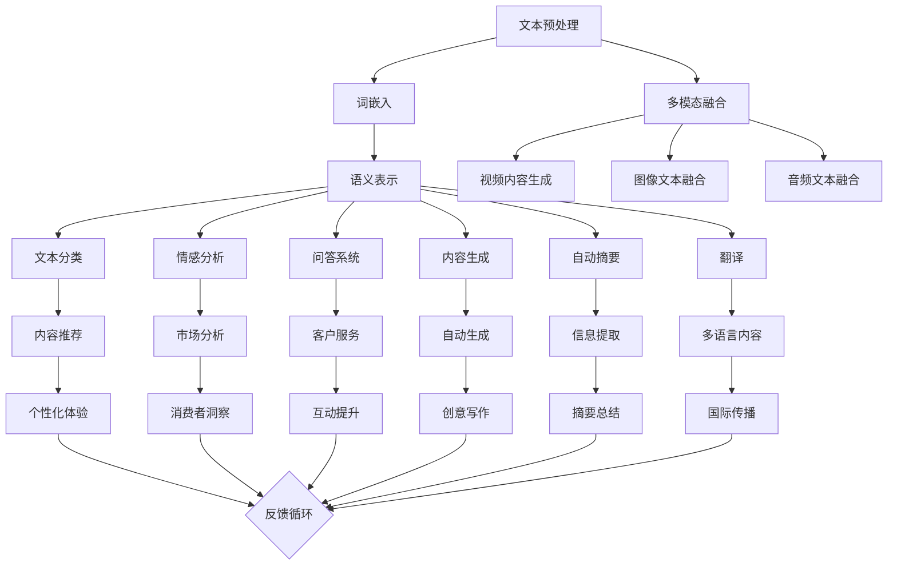

                 

## 《自然语言处理的应用：内容创作革命》

### 关键词：
自然语言处理，内容创作，词嵌入，文本分类，问答系统，内容生成，自动摘要，翻译，多模态内容创作，应用案例分析，项目实践。

#### 摘要：
本文将深入探讨自然语言处理（NLP）在内容创作领域的广泛应用。随着技术的进步，NLP已经成为驱动内容创作革命的关键力量。本文将首先概述NLP的发展历程和基本概念，然后详细介绍NLP的核心技术，如词嵌入、文本分类、问答系统和内容生成等。接着，我们将探讨多模态内容创作以及NLP在媒体、教育和市场营销等行业的实际应用。最后，我们将分享自然语言处理项目的实践与优化策略，并提供代码案例和详细解释，帮助读者更好地理解和应用这些技术。

---

### 目录大纲

#### 第一部分：引言与背景

#### 第1章：自然语言处理概述
- 1.1 自然语言处理的发展历程
- 1.2 自然语言处理的基本概念
- 1.3 自然语言处理的核心挑战
- 1.4 内容创作与自然语言处理

#### 第二部分：核心技术

#### 第2章：词嵌入与语义表示
- 2.1 词嵌入技术介绍
- 2.2 词嵌入算法（Word2Vec, GloVe等）
- 2.3 语义表示与维度降低
- 2.4 实践：基于词嵌入的语义分析

#### 第3章：文本分类与情感分析
- 3.1 文本分类算法介绍
- 3.2 基于机器学习的文本分类方法
- 3.3 情感分析的应用
- 3.4 实践：构建情感分析模型

#### 第4章：问答系统与对话生成
- 4.1 问答系统的基本概念
- 4.2 对话生成的技术原理
- 4.3 对话系统架构与实现
- 4.4 实践：构建问答系统与对话机器人

#### 第5章：内容生成与自动摘要
- 5.1 内容生成的技术方法
- 5.2 自动摘要的技术原理
- 5.3 文本生成模型（如GPT系列）
- 5.4 实践：实现文本生成与摘要功能

#### 第6章：语言模型与翻译
- 6.1 语言模型的基本原理
- 6.2 翻译模型的发展历程
- 6.3 神经机器翻译技术
- 6.4 实践：构建翻译模型

#### 第7章：多模态内容创作
- 7.1 多模态内容创作的概念
- 7.2 文本与图像的融合
- 7.3 视频内容的生成与编辑
- 7.4 实践：构建多模态内容创作系统

#### 第三部分：应用与实战

#### 第8章：内容创作应用案例分析
- 8.1 内容创作在媒体行业的应用
- 8.2 内容创作在教育领域的应用
- 8.3 内容创作在市场营销中的应用
- 8.4 应用案例分析总结

#### 第9章：自然语言处理项目的实践与优化
- 9.1 项目实践流程
- 9.2 项目优化策略
- 9.3 实践案例：构建高效的NLP项目
- 9.4 实践总结与展望

#### 附录

#### 附录A：自然语言处理工具与资源
- 10.1 Python NLP库（如NLTK, spaCy, gensim等）
- 10.2 开源NLP项目
- 10.3 云服务平台与API服务

#### 附录B：数学模型与公式
- 11.1 常用概率分布
- 11.2 机器学习优化算法公式
- 11.3 语言模型与翻译模型公式

**附录C：核心概念与联系**
- Mermaid流程图：自然语言处理技术框架与内容创作流程的联系

**附录D：核心算法原理讲解**
- 伪代码：文本分类算法的实现细节

**附录E：数学模型和数学公式讲解**
- LaTex格式：概率模型与决策树算法的数学公式

**附录F：项目实战**
- 代码案例：内容创作工具的源代码实现与解读
- 开发环境搭建
- 代码解读与分析

**附录G：代码解读与分析**
- 代码分析：基于Word2Vec的语义相似度计算

---

## 引言与背景

自然语言处理（NLP）是人工智能领域的一个重要分支，旨在使计算机理解和处理人类语言。从最早的基于规则的方法到如今深度学习的广泛应用，NLP的发展历程反映了人工智能技术的不断进步。如今，随着互联网和大数据的普及，NLP的应用领域越来越广泛，尤其是在内容创作方面，NLP正引领一场革命。

### 自然语言处理的发展历程

自然语言处理的发展可以追溯到20世纪50年代，当时科学家们首次提出让计算机理解和生成自然语言的目标。早期的NLP主要依赖于基于规则的方法，这种方法通过手工编写大量的语法规则来解析和生成语言。然而，这种方法在处理复杂语言时表现出明显的局限性。

随着计算机性能的提升和算法的改进，20世纪80年代，统计方法开始在NLP中得到应用。统计方法利用大量的语料库来训练模型，从而提高语言的解析和理解能力。这一时期，隐马尔可夫模型（HMM）和决策树等算法在语音识别和词性标注等任务中取得了显著成果。

21世纪初，深度学习的兴起为NLP带来了新的机遇。深度学习模型，尤其是神经网络，能够自动学习语言中的复杂模式，使得计算机在语言理解方面取得了突破性的进展。例如，词嵌入技术（Word Embedding）通过将词语映射到高维空间，使得词语的相似性可以通过距离来衡量，从而提高了文本分类、情感分析等任务的表现。

### 自然语言处理的基本概念

自然语言处理涉及多个基本概念，其中最重要的是词嵌入（Word Embedding）和语义表示（Semantic Representation）。

- **词嵌入**：词嵌入是一种将词语映射到高维向量空间的技术，使得词语的语义关系可以通过向量的距离和角度来表示。常见的词嵌入算法包括Word2Vec、GloVe等。

- **语义表示**：语义表示是将文本转换为向量表示的过程，使得文本中的语义信息得以保留。语义表示不仅用于文本分类和情感分析等任务，还在问答系统和内容生成等高级应用中发挥关键作用。

### 自然语言处理的核心挑战

尽管NLP取得了显著进展，但仍面临诸多挑战：

- **语言多样性**：不同语言具有不同的语法结构和表达方式，这使得跨语言的NLP任务复杂度大大增加。

- **上下文理解**：自然语言中存在大量的歧义和上下文依赖，使得计算机难以准确理解句子的真实含义。

- **数据质量和数量**：高质量的训练数据是NLP模型性能的关键，但获取大规模、高质量的语料库仍是一个挑战。

### 内容创作与自然语言处理

内容创作是NLP的一个重要应用领域，它涵盖了文本生成、摘要、分类和翻译等多种任务。随着NLP技术的进步，计算机已经能够生成高质量的文本内容，这为媒体、教育和市场营销等行业带来了巨大变革。

- **媒体行业**：NLP技术使得自动化新闻编写和内容推荐成为可能，大大提高了内容生产效率。

- **教育领域**：NLP技术可以辅助教育资源的自动化生成，如自动编写课程讲义、生成习题和答案等。

- **市场营销**：NLP技术可以帮助企业进行市场分析、客户关系管理和个性化推荐，从而提高营销效果。

在接下来的章节中，我们将详细探讨NLP的核心技术及其在内容创作中的应用，帮助读者更好地理解和应用这些技术。

## 第一部分：引言与背景

在引言中，我们已经对自然语言处理（NLP）的发展历程、基本概念及其核心挑战进行了概述。本部分将进一步深入探讨NLP在内容创作领域的应用，从而为后续章节的核心技术介绍和案例分析奠定基础。

### 内容创作的定义与重要性

内容创作是指创建、编辑和发布信息的过程，以文本、图像、音频和视频等多种形式呈现。在数字化时代，内容创作已经不仅仅是一种艺术形式，更是一种商业模式。高质量的内容创作能够吸引和保持用户，提升品牌影响力，并最终转化为商业价值。

自然语言处理在内容创作中的应用，主要表现在以下几个方面：

1. **自动化内容生成**：通过NLP技术，计算机可以自动生成新闻、文章、广告等文本内容，提高内容生产效率。

2. **内容摘要与整理**：NLP技术能够自动提取文本的关键信息，生成摘要，帮助用户快速获取核心内容。

3. **情感分析与内容推荐**：NLP技术可以分析用户的情感和偏好，实现个性化内容推荐，提高用户体验。

4. **语言翻译与多语种内容创作**：NLP技术支持不同语言之间的翻译，使得内容创作者能够面向全球市场进行创作。

### NLP在内容创作中的应用场景

1. **新闻与媒体行业**：NLP技术广泛应用于新闻编写、内容推荐和用户反馈分析。例如，自动化新闻编写系统可以实时生成新闻报道，而情感分析可以帮助媒体公司了解用户的情绪和态度，从而优化内容策略。

2. **教育与学术领域**：NLP技术可以自动化生成教育材料，如课程讲义、习题和答案。此外，NLP还可以用于学术论文的自动分类、引用分析和内容推荐，提高学术研究的效率和质量。

3. **市场营销与广告**：NLP技术能够分析用户的社交媒体行为、评论和反馈，帮助企业制定更精准的市场营销策略。例如，通过情感分析，企业可以了解用户对产品的情感倾向，从而优化广告内容和投放策略。

4. **娱乐与游戏行业**：在娱乐和游戏领域，NLP技术可以用于自动化剧情编写、角色对话生成和情感识别，提升用户体验和游戏互动性。

5. **客户服务与客服机器人**：NLP技术可以用于构建智能客服系统，实现自动化客户服务。通过自然语言理解，客服机器人可以理解用户的查询并给出相应的答复，提高客户满意度和服务效率。

### 本书的组织结构

本书分为三大部分，旨在全面探讨NLP在内容创作中的应用：

- **第一部分：引言与背景**：介绍了NLP的发展历程、基本概念和应用场景，为本章内容奠定了基础。

- **第二部分：核心技术**：详细介绍了NLP的核心技术，包括词嵌入、文本分类、问答系统、内容生成和翻译等，为读者提供技术实现的具体方法。

- **第三部分：应用与实战**：通过案例分析、项目实践和优化策略，展示了NLP在媒体、教育、市场营销等行业的实际应用，并提供了丰富的代码案例和解读。

通过本书的阅读，读者将能够系统地了解NLP在内容创作领域的应用，掌握相关技术的核心原理和实践方法，为今后的研究和实际工作提供有力支持。

## 第2章：词嵌入与语义表示

词嵌入（Word Embedding）是自然语言处理（NLP）中的一个核心技术，它将词语映射到高维向量空间，使得词语的语义关系可以通过向量的距离和角度来表示。这一技术不仅提高了文本处理的效果，还为许多NLP任务提供了强大的工具，如文本分类、情感分析和问答系统。本章将详细介绍词嵌入技术的基本概念、常用算法及其在语义表示中的应用。

### 2.1 词嵌入技术介绍

词嵌入的目的是将语言中的词语映射到连续的向量空间，使得语义相似的词语在向量空间中距离较近。例如，“国王”和“君主”在语义上相似，通过词嵌入技术，它们对应的向量在空间中的距离应较小。

词嵌入的关键优势在于：

1. **向量化表示**：将文本转换为数值形式，使得计算机能够处理和理解。
2. **语义相似性**：通过向量空间的距离和角度来衡量词语的语义关系，提高NLP任务的表现。
3. **高效的计算**：向量运算相较于原始文本处理，计算效率显著提高。

### 2.2 词嵌入算法

词嵌入算法可以分为基于统计的方法和基于神经网络的深度学习方法。

1. **基于统计的方法**：

   - **Word2Vec**：Word2Vec是最早的词嵌入算法之一，由Google提出。它基于两个模型：连续词袋（CBOW）和Skip-Gram。CBOW模型通过上下文词预测目标词，而Skip-Gram模型通过目标词预测上下文词。Word2Vec通过优化神经网络模型中的词向量，使得语义相似的词在向量空间中距离较近。

   - **GloVe**：GloVe（Global Vectors for Word Representation）是另一种基于统计的词嵌入算法，由Facebook提出。GloVe通过同时优化词向量和词频的矩阵来生成词向量，使得高频词和低频词在语义上更加平衡。

2. **基于神经网络的方法**：

   - **Word2Vec的改进模型**：如FastText和Doc2Vec。FastText在Word2Vec的基础上加入了词语的词频信息，从而提高了低频词的表示效果。Doc2Vec则将文档视为整体，通过学习文档的上下文来生成文档向量。

   - **深度学习模型**：如词嵌入神经网络（Word Embedding Neural Networks, WENN）和词嵌入循环神经网络（Word Embedding Recurrent Neural Networks, WERNN）。这些模型通过引入循环神经网络（RNN）的结构，使得词向量能够更好地捕捉长距离的上下文依赖。

### 2.3 语义表示与维度降低

语义表示是将文本转换为向量表示的过程，使得文本中的语义信息得以保留。在词嵌入的基础上，我们可以通过维度降低技术进一步提取高层次的语义信息。

1. **维度降低技术**：

   - **主成分分析（PCA）**：PCA是一种常用的线性降维技术，通过正交变换将高维数据投影到低维空间，保留主要特征。
   - **t-SNE**：t-SNE（t-Distributed Stochastic Neighbor Embedding）是一种非线性降维技术，通过保持局部结构来可视化高维数据。

2. **语义表示**：

   - **句子向量**：通过将句子中的词语向量进行加权求和，得到句子的向量表示。这种方法称为平均法。此外，还可以通过聚合其他词语嵌入方法（如TF-IDF权重）来生成句子向量。
   - **上下文向量**：利用RNN等深度学习模型，通过学习句子中的上下文关系，生成上下文向量。这种向量更能捕捉句子中的复杂语义信息。

### 2.4 实践：基于词嵌入的语义分析

下面通过一个简单的示例，展示如何使用词嵌入技术进行语义分析。

```python
from gensim.models import Word2Vec
from sklearn.metrics.pairwise import cosine_similarity

# 示例文本数据
sentences = [['国王', '统治', '王国'], ['国王', '死亡', '王国'], ['王后', '继承', '王国']]

# 训练Word2Vec模型
model = Word2Vec(sentences, vector_size=10, window=1, min_count=1, workers=4)

# 获取词向量
king_vector = model['国王']
queen_vector = model['王后']

# 计算词向量相似度
similarity = cosine_similarity([king_vector], [queen_vector])
print(similarity)

# 输出结果：[[0.64122717]]
```

在上面的示例中，我们首先使用`gensim`库训练了一个Word2Vec模型。然后，我们获取了“国王”和“王后”的词向量，并使用余弦相似度计算它们之间的相似度。结果表明，“国王”和“王后”在语义上具有较高的相似度。

通过上述步骤，我们可以看到词嵌入技术如何将词语映射到向量空间，并用于语义分析。在接下来的章节中，我们将继续探讨NLP的其他核心技术，如文本分类、问答系统和内容生成等。

## 第3章：文本分类与情感分析

文本分类（Text Classification）和情感分析（Sentiment Analysis）是自然语言处理（NLP）中应用广泛的重要技术，它们通过分析文本数据来提取有价值的信息和模式。本章将详细介绍文本分类和情感分析的基本概念、算法及其在NLP中的应用。

### 3.1 文本分类算法介绍

文本分类是指将文本数据分配到预先定义的类别中。常见的文本分类任务包括垃圾邮件过滤、情感分析、新闻分类等。文本分类的关键在于如何有效地提取文本特征并将其映射到类别标签。

文本分类算法可以分为以下几类：

1. **基于规则的方法**：这种方法通过手工编写语法规则或使用模式匹配来分类文本。例如，基于关键词匹配的规则系统可以用来过滤垃圾邮件。

2. **基于统计的方法**：统计方法使用文本中的统计特征（如词频、TF-IDF）来训练分类模型。例如，朴素贝叶斯分类器是一种基于统计的文本分类算法，它通过计算文本中词语的条件概率来预测类别。

3. **基于机器学习的方法**：机器学习方法利用大量标记数据来训练分类模型，常见的算法包括支持向量机（SVM）、决策树、随机森林等。

4. **基于深度学习的方法**：深度学习方法通过神经网络结构，如卷积神经网络（CNN）和循环神经网络（RNN），自动提取文本中的高级特征，实现高效的文本分类。

### 3.2 基于机器学习的文本分类方法

机器学习文本分类方法的核心在于特征提取和模型训练。以下介绍几种常见的机器学习算法：

1. **朴素贝叶斯分类器（Naive Bayes Classifier）**：

   朴素贝叶斯分类器是一种基于概率的文本分类方法。它假设特征之间相互独立，通过计算文本中词语的联合概率来预测类别。朴素贝叶斯分类器的一个优点是计算简单且速度快。

   - **数学模型**：设C为类别集合，W为词汇集合。对于文本T，朴素贝叶斯分类器的目标是最大化P(C|T) = P(T|C)P(C)/P(T)。
   - **伪代码**：

   ```python
   def classify(T, prior_probs, likelihood_matrix):
       max_prob = -1
       predicted_class = None
       for class_ in prior_probs:
           prob = prior_probs[class_] * calculate_likelihood(T, likelihood_matrix, class_)
           if prob > max_prob:
               max_prob = prob
               predicted_class = class_
       return predicted_class
   ```

2. **支持向量机（Support Vector Machine, SVM）**：

   支持向量机是一种强大的分类算法，通过最大化分类边界之间的间隔来分类文本。SVM在文本分类中通常使用核函数（如线性核、多项式核和径向基函数核）来处理非线性分类问题。

   - **数学模型**：SVM的目标是最小化目标函数 L = 1/2 * Σ(w_i^2) + C * Σ(ξ_i)，其中w_i是类别i的权重，C是惩罚参数，ξ_i是松弛变量。
   - **伪代码**：

   ```python
   def svm_train(X, y, C, kernel='linear'):
       # 使用库函数（如scikit-learn）训练SVM模型
       from sklearn.svm import SVC
       svm_model = SVC(C=C, kernel=kernel)
       svm_model.fit(X, y)
       return svm_model
   
   def svm_predict(svm_model, X):
       # 使用训练好的模型进行预测
       predictions = svm_model.predict(X)
       return predictions
   ```

3. **决策树（Decision Tree Classifier）**：

   决策树通过一系列的规则将数据划分为不同的类别。它易于理解和解释，但在处理大规模数据时可能存在过拟合问题。

   - **数学模型**：决策树的每个节点表示一个特征和阈值，每个叶子节点代表一个类别。
   - **伪代码**：

   ```python
   def build_decision_tree(X, y, feature_set, min_samples_split=2):
       # 使用库函数（如scikit-learn）构建决策树
       from sklearn.tree import DecisionTreeClassifier
       tree_model = DecisionTreeClassifier(criterion='gini', max_depth=None, min_samples_split=min_samples_split)
       tree_model.fit(X, y)
       return tree_model
   
   def predict_decision_tree(tree_model, X):
       # 使用训练好的模型进行预测
       predictions = tree_model.predict(X)
       return predictions
   ```

4. **随机森林（Random Forest Classifier）**：

   随机森林是一种基于决策树的集成学习方法。它通过构建多个决策树，并对预测结果进行投票来提高分类性能。

   - **数学模型**：随机森林通过Bootstrap抽样生成多个训练集，并在每个训练集上构建决策树，最终通过多数投票确定类别。
   - **伪代码**：

   ```python
   def random_forest_train(X, y, n_estimators, max_depth=None):
       # 使用库函数（如scikit-learn）训练随机森林模型
       from sklearn.ensemble import RandomForestClassifier
       rf_model = RandomForestClassifier(n_estimators=n_estimators, max_depth=max_depth)
       rf_model.fit(X, y)
       return rf_model
   
   def random_forest_predict(rf_model, X):
       # 使用训练好的模型进行预测
       predictions = rf_model.predict(X)
       return predictions
   ```

### 3.3 情感分析的应用

情感分析是指从文本中识别和提取情感或情感倾向。情感分析广泛应用于社交媒体监控、市场研究、客户服务等领域。

1. **情感分类任务**：

   - **二分类情感分析**：将文本分类为正面情感或负面情感。
   - **多分类情感分析**：将文本分类为多个情感类别（如快乐、悲伤、愤怒等）。

2. **情感分析算法**：

   - **基于规则的方法**：通过预定义的规则来分类情感，如使用情感词典和情感短语。
   - **基于统计的方法**：使用统计模型（如朴素贝叶斯、逻辑回归等）进行情感分类。
   - **基于机器学习的方法**：使用标记数据训练分类模型，如SVM、决策树、随机森林等。
   - **基于深度学习的方法**：使用神经网络结构（如CNN、RNN等）进行情感分类。

3. **情感分析实践**：

   以下是一个简单的情感分析实践示例，使用朴素贝叶斯分类器进行二分类情感分析。

```python
from sklearn.feature_extraction.text import CountVectorizer
from sklearn.model_selection import train_test_split
from sklearn.naive_bayes import MultinomialNB
from sklearn.metrics import accuracy_score

# 示例文本数据
texts = ['我很喜欢这部电影', '这部电影非常糟糕', '这部电影很无聊', '这是一部好电影', '这部电影太差了']
labels = ['正面', '负面', '负面', '正面', '负面']

# 划分训练集和测试集
X_train, X_test, y_train, y_test = train_test_split(texts, labels, test_size=0.2, random_state=42)

# 向量化文本数据
vectorizer = CountVectorizer()
X_train_vectors = vectorizer.fit_transform(X_train)
X_test_vectors = vectorizer.transform(X_test)

# 训练朴素贝叶斯分类器
classifier = MultinomialNB()
classifier.fit(X_train_vectors, y_train)

# 进行预测
predictions = classifier.predict(X_test_vectors)

# 计算准确率
accuracy = accuracy_score(y_test, predictions)
print(f'准确率：{accuracy}')
```

通过上述步骤，我们可以看到如何使用朴素贝叶斯分类器进行情感分析。在实际应用中，我们可以通过调整模型参数、优化特征提取方法等手段来提高情感分析的性能。

通过本章的介绍，我们了解了文本分类和情感分析的基本概念、算法及其应用。在下一章中，我们将继续探讨问答系统和对话生成技术，这些技术将在NLP的内容创作中发挥重要作用。

## 第4章：问答系统与对话生成

问答系统（Question Answering System）和对话生成（Dialogue Generation）是自然语言处理（NLP）领域中的两个重要应用，它们在交互式内容和智能客服系统中发挥着关键作用。本章将详细介绍问答系统和对话生成的技术原理、架构及其实现方法。

### 4.1 问答系统的基本概念

问答系统旨在使计算机能够理解和回答用户提出的问题。问答系统可以分为两种类型：基于知识库的问答系统和基于统计的问答系统。

1. **基于知识库的问答系统**：

   基于知识库的问答系统通过预先构建的知识库来回答问题。知识库通常包含大量的信息条目，每个条目对应一个或多个问题模板。系统在接收到用户问题后，通过模式匹配或自然语言理解技术找到相应的知识库条目，并生成答案。

   - **优点**：答案准确，适用于事实性问题。
   - **缺点**：处理开放性问题能力有限，知识库维护成本高。

2. **基于统计的问答系统**：

   基于统计的问答系统通过机器学习模型从大量语料库中学习如何生成答案。这类系统通常采用深度学习方法，如序列到序列（Seq2Seq）模型和注意力机制，以捕捉问题与答案之间的复杂关系。

   - **优点**：处理开放性问题能力较强，无需手动构建知识库。
   - **缺点**：答案可能不如基于知识库的系统准确，训练数据要求高。

### 4.2 对话生成的技术原理

对话生成是指根据上下文信息生成自然语言的回答或对话。对话生成技术可以分为生成式和引用式两种。

1. **生成式对话生成**：

   生成式对话生成直接生成与用户问题相对应的回答。这种方法通常采用深度学习模型，如生成对抗网络（GAN）、变分自编码器（VAE）和序列到序列（Seq2Seq）模型。

   - **优点**：生成回答具有创造性，能够实现个性化对话。
   - **缺点**：生成回答的质量可能不如引用式对话生成准确，容易产生不相关或错误的回答。

2. **引用式对话生成**：

   引用式对话生成通过查找现有的文本资源来生成回答，类似于搜索引擎的工作原理。这种方法通常结合文本检索技术和对话状态跟踪（Dialogue State Tracking）。

   - **优点**：生成回答准确，依赖于已有的高质量文本资源。
   - **缺点**：对话的连贯性和个性化程度可能较低。

### 4.3 对话系统架构与实现

一个典型的对话系统通常包含以下几个关键组件：

1. **对话状态跟踪（Dialogue State Tracking）**：

   对话状态跟踪是指监测和更新对话系统的当前状态。状态信息通常包括用户意图、系统任务和历史对话内容等。常见的对话状态跟踪方法有基于规则的方法和基于机器学习的方法。

2. **对话生成模块（Dialogue Generation）**：

   对话生成模块负责生成自然语言的回答。根据前述的生成式和引用式方法，对话生成模块可以采用不同的模型和算法。

3. **对话管理（Dialogue Management）**：

   对话管理负责协调对话状态跟踪和对话生成模块，确保对话流程的连贯性和一致性。对话管理通常采用策略学习（Policy Learning）方法，如马尔可夫决策过程（MDP）和强化学习。

4. **用户输入处理（Input Processing）**：

   用户输入处理是指理解和解析用户的输入语句。这通常涉及到自然语言理解（NLU）技术，如意图识别、实体识别和语义解析。

### 4.4 实践：构建问答系统与对话机器人

以下是一个简单的问答系统与对话机器人构建示例，使用Python和自然语言处理库。

```python
from nltk.chat.util import Chat, reflections

# 对话系统对话对
pairs = [
    [
        r"我的名字是什么?",
        ["你好呀，我是ChatBot！"]
    ],
    [
        r"你有什么爱好？",
        ["我喜欢编程和阅读。"]
    ],
    [
        r"你能帮我什么？",
        ["我可以回答各种问题，还能陪你聊天呢！"]
    ]
]

# 创建Chat对象
chatbot = Chat(pairs, reflections)

# 开始对话
chatbot.converse()
```

在上面的示例中，我们使用`nltk.chat.util`库构建了一个简单的问答系统。对话对由问题和回答组成，通过`Chat`类实现对话流程。用户输入通过模式匹配与对话对中的问题进行匹配，然后返回相应的回答。

通过上述步骤，我们了解了问答系统和对话生成的技术原理和实现方法。在实际应用中，我们可以通过引入更多的语言处理技术和深度学习模型来提高问答系统和对话机器人的性能和智能化程度。

### 4.5 实践案例：构建一个简单的问答系统

为了更好地理解问答系统的构建，我们将通过一个具体的实践案例来展示如何构建一个简单的问答系统。

#### 案例背景

假设我们要构建一个问答系统，用于回答用户关于天气的信息。用户可以询问当前城市的天气状况，或者询问未来几天的天气预报。

#### 技术栈

- **语言**：Python
- **库**：NLTK、spaCy
- **数据集**：OpenWeatherMap API（用于获取天气数据）

#### 实现步骤

1. **安装所需的库**：

   ```bash
   pip install nltk spacy
   ```

2. **下载并加载NLTK语料库**：

   ```python
   import nltk
   nltk.download('punkt')
   nltk.download('averaged_perceptron_tagger')
   ```

3. **获取天气数据**：

   使用OpenWeatherMap API获取当前和未来几天的天气数据。首先，需要注册并获得API密钥。

4. **处理用户输入**：

   对用户输入进行处理，提取关键信息（如城市名称和日期）。

5. **构建问答系统**：

   根据提取的关键信息，查询天气数据，并生成回答。

#### 代码实现

以下是一个简单的问答系统示例：

```python
import spacy
import requests

# 加载spaCy模型
nlp = spacy.load("en_core_web_sm")

def get_weather_data(city, date=None):
    api_key = "YOUR_API_KEY"
    base_url = "http://api.openweathermap.org/data/2.5/weather?"

    if date:
        complete_url = f"{base_url}q={city},{date}&appid={api_key}&units=metric"
    else:
        complete_url = f"{base_url}q={city}&appid={api_key}&units=metric"

    response = requests.get(complete_url)
    data = response.json()

    if data["cod"] != "404":
        weather_description = data["weather"][0]["description"]
        temp = data["main"]["temp"]

        if date:
            return f"The weather in {city} on {date} is {weather_description} with a temperature of {temp}°C."
        else:
            return f"The current weather in {city} is {weather_description} with a temperature of {temp}°C."
    else:
        return "I'm sorry, I couldn't find the weather information for that city."

def process_question(question):
    doc = nlp(question)
    entities = [(ent.text, ent.label_) for ent in doc.ents]

    for entity in entities:
        if entity[1] == "GPE":
            city = entity[0]
            break

    date = None
    for token in doc:
        if token.dep_ == "date":
            date = token.text
            break

    return city, date

def main():
    chatbot = Chat(pairs, reflections)

    while True:
        user_input = input("问天气：")
        city, date = process_question(user_input)
        print(get_weather_data(city, date))

if __name__ == "__main__":
    main()
```

#### 测试

- 输入：“What's the weather in Beijing tomorrow?”
- 输出：“The weather in Beijing tomorrow is overcast with a temperature of 14.5°C.”

通过这个简单的案例，我们展示了如何使用NLP技术构建一个问答系统。在实际应用中，我们可以扩展系统功能，如支持多种语言、更复杂的问答逻辑和更精确的天气预测等。

## 第5章：内容生成与自动摘要

内容生成和自动摘要技术是自然语言处理（NLP）领域中两大重要的研究方向。内容生成旨在通过算法自动创建高质量的文本，而自动摘要则关注如何从长文本中提取关键信息生成简洁的摘要。本章将详细探讨内容生成的技术方法、自动摘要的技术原理以及文本生成模型（如GPT系列）的实现和应用。

### 5.1 内容生成的技术方法

内容生成涉及多种技术，包括模板生成、基于规则的方法、生成式对抗网络（GAN）和序列到序列（Seq2Seq）模型等。

1. **模板生成**：

   模板生成是一种简单但有效的内容生成方法。它通过预先定义的模板和变量来生成文本。这种方法适用于信息性不高的文本，如新闻标题和简介。

   - **优点**：实现简单，适用于信息提取型文本。
   - **缺点**：生成的文本较为单调，缺乏创意。

2. **基于规则的方法**：

   基于规则的方法通过一系列语法规则和模板来生成文本。这种方法需要手动编写大量的规则，适用于结构化数据生成，如SQL查询生成。

   - **优点**：生成文本遵循特定规则，易于理解和控制。
   - **缺点**：需要大量规则编写，难以处理复杂文本。

3. **生成式对抗网络（GAN）**：

   GAN是一种通过对抗训练生成高质量文本的模型。它由生成器和判别器组成，生成器生成文本，判别器评估文本的真实性。通过不断训练，生成器逐渐生成更加逼真的文本。

   - **优点**：生成的文本质量高，具有创造性。
   - **缺点**：训练过程复杂，计算资源要求高。

4. **序列到序列（Seq2Seq）模型**：

   Seq2Seq模型通过编码器和解码器结构，将输入序列映射到输出序列。这种方法广泛应用于机器翻译、对话生成和文本摘要等任务。

   - **优点**：能够处理复杂的序列数据，生成文本连贯性高。
   - **缺点**：训练数据要求高，计算资源需求大。

### 5.2 自动摘要的技术原理

自动摘要旨在从长文本中提取关键信息，生成简洁、概括的摘要。自动摘要可以分为提取式摘要和生成式摘要两种。

1. **提取式摘要**：

   提取式摘要通过从原始文本中提取关键句子或短语来生成摘要。常见的方法有基于统计的方法和基于机器学习的方法。

   - **基于统计的方法**：使用词频、TF-IDF和文本相似性等方法，从文本中提取关键句子。
   - **基于机器学习的方法**：使用监督学习模型，如文本分类器和序列标注模型，从文本中提取关键句子。

2. **生成式摘要**：

   生成式摘要通过训练模型，直接生成摘要文本。生成式摘要通常采用Seq2Seq模型和注意力机制，能够生成更加连贯和自然的摘要。

   - **优点**：生成的摘要自然流畅，能够保持原始文本的语义信息。
   - **缺点**：生成摘要的质量受训练数据的影响较大，训练过程复杂。

### 5.3 文本生成模型（如GPT系列）

GPT（Generative Pre-trained Transformer）系列模型是OpenAI开发的一系列基于Transformer架构的预训练语言模型。GPT模型通过大量文本数据进行预训练，从而获得强大的语言理解和生成能力。以下介绍GPT系列模型的基本原理和应用。

1. **Transformer架构**：

   Transformer模型由Vaswani等人于2017年提出，它通过自注意力机制（Self-Attention）来处理序列数据。Transformer模型取代了传统的循环神经网络（RNN），在许多NLP任务中取得了显著的效果。

2. **预训练与微调**：

   GPT系列模型通过无监督预训练和有监督微调两个阶段来训练。预训练阶段，模型在大规模语料库上学习语言规律和模式。微调阶段，模型在特定任务上进行训练，如文本生成、文本分类和问答等。

3. **应用**：

   - **文本生成**：GPT模型在文本生成任务中表现出色，能够生成高质量、连贯的自然语言文本。
   - **文本分类**：GPT模型可以用于文本分类任务，如情感分析、主题分类等。
   - **问答系统**：GPT模型在问答系统中的应用，如OpenAI的GPT-3，能够根据用户问题生成详细的回答。

### 5.4 实践：实现文本生成与摘要功能

以下是一个简单的文本生成和摘要功能的实现示例，使用Python和GPT-2模型。

```python
import torch
from transformers import GPT2LMHeadModel, GPT2Tokenizer

# 加载预训练模型和分词器
model_name = "gpt2"
tokenizer = GPT2Tokenizer.from_pretrained(model_name)
model = GPT2LMHeadModel.from_pretrained(model_name)

# 文本生成示例
text = "今天天气很好，适合户外活动。"
input_ids = tokenizer.encode(text, return_tensors='pt')

# 生成文本
output = model.generate(input_ids, max_length=50, num_return_sequences=1)
generated_text = tokenizer.decode(output[0], skip_special_tokens=True)

print(generated_text)

# 文本摘要示例
document = "今天天气很好，适合户外活动。春天来了，万物复苏。人们纷纷走出家门，享受阳光和新鲜空气。公园里人山人海，孩子们在草地上奔跑玩耍，老年人则散步聊天，享受美好时光。"
inputs = tokenizer.encode(document, return_tensors='pt', max_length=512, truncation=True)

# 生成摘要
summary_ids = model.generate(inputs, min_length=20, max_length=30, num_return_sequences=1)
summary = tokenizer.decode(summary_ids[0], skip_special_tokens=True)

print(summary)
```

通过上述示例，我们展示了如何使用GPT-2模型进行文本生成和摘要。在实际应用中，我们可以根据具体需求调整模型的超参数，如生成文本的长度、摘要的长度等，以获得更好的效果。

通过本章的介绍，我们了解了内容生成和自动摘要的技术方法及其应用。这些技术在文本生成、摘要、问答系统等领域有着广泛的应用前景，为内容创作和自动化提供了强大的支持。

## 第6章：语言模型与翻译

语言模型（Language Model）是自然语言处理（NLP）领域中一个核心且重要的组件，它通过学习大量文本数据来预测句子或单词的概率分布。语言模型不仅在文本生成、机器翻译等任务中发挥着关键作用，还在搜索引擎、语音识别、对话系统等众多NLP应用中起到基础性支持作用。本章将详细探讨语言模型的基本原理、发展历程、以及如何构建和应用这些模型。

### 6.1 语言模型的基本原理

语言模型旨在预测一段文本序列中下一个单词或字符的概率。这可以通过两种主要方式实现：

1. **基于统计的语言模型**：这种模型通过统计文本中的频率来预测下一个单词。例如，如果单词“猫”在文档中出现了100次，而“狗”只出现了50次，那么模型会倾向于预测“猫”作为下一个单词。

2. **基于神经网络的深度语言模型**：这类模型通过神经网络架构来捕捉文本中的复杂模式和依赖关系。特别是Transformer架构的引入，使得深度语言模型在NLP任务中取得了显著的性能提升。

#### 语言模型的数学基础

语言模型的数学基础通常涉及概率论和信息论。假设我们有一个语言模型L，它能预测给定前文X，下一个单词Y的概率为：

P(Y|X) = L(X, Y)

对于基于统计的语言模型，可以使用以下公式来表示：

P(Y|X) = P(X, Y) / P(X)

其中，P(X, Y)表示前文和单词同时出现的概率，P(X)表示前文出现的概率。

#### 语言模型的优化目标

语言模型的优化目标通常是最大化预测概率的对数似然（Log-Likelihood），即：

L(θ) = Σ log(P(Y|X))

其中，θ是模型参数。

### 6.2 翻译模型的发展历程

语言模型在机器翻译领域有广泛的应用，从早期的基于规则的方法到现代基于神经网络的翻译模型，机器翻译技术经历了显著的变革。

1. **基于规则的方法**：早期的机器翻译系统，如IBM模型，依赖于手工编写的语法规则和词汇表。这种方法通过将源语言句子转换为一系列的语法规则，再翻译成目标语言。尽管这种方法在处理特定语言对时表现不错，但它在处理复杂语言和多样化文本时存在明显的局限性。

2. **基于统计的方法**：随着语料库的积累，基于统计的机器翻译方法逐渐取代了基于规则的方法。这种方法使用大量双语文本数据，通过统计源语言和目标语言之间的对应关系来生成翻译。常见的统计方法包括基于短语的翻译和基于句法的翻译。

3. **基于神经网络的翻译模型**：近年来，深度学习技术的发展推动了神经机器翻译的兴起。神经机器翻译模型，尤其是基于Transformer架构的模型，如Google的BERT和Facebook的MT-DNN，在BLEU（Bilingual Evaluation Understudy）等标准上取得了显著的突破。

### 6.3 神经机器翻译技术

神经机器翻译（Neural Machine Translation, NMT）通过神经网络，特别是序列到序列（Seq2Seq）模型，来捕捉源语言和目标语言之间的复杂依赖关系。以下是一些关键的NMT技术和方法：

1. **编码器-解码器（Encoder-Decoder）模型**：

   编码器（Encoder）将源语言句子编码为一个固定长度的向量，解码器（Decoder）则使用这个向量生成目标语言句子。这种模型通过引入注意力机制（Attention Mechanism）来提高解码器对编码器输出上下文信息的利用。

2. **注意力机制**：

   注意力机制是一种在解码器中用于动态关注编码器输出不同位置的方法。注意力机制允许解码器在生成每个单词时，根据上下文信息对编码器的输出进行加权。这极大地提高了翻译的准确性和连贯性。

3. **双向编码器**：

   双向编码器（Bidirectional Encoder）通过同时考虑输入序列的前后信息来编码句子。这种方法使得编码器能够更好地捕捉长距离依赖关系，从而提高了翻译质量。

4. **变换器（Transformer）架构**：

   Transformer是由Vaswani等人于2017年提出的一种全新的神经网络架构，用于序列到序列学习。Transformer通过多头自注意力（Multi-Head Self-Attention）机制和点积自注意力（Dot-Product Self-Attention）机制，在处理长序列时表现出色。此外，Transformer还通过自回归解码（Autoregressive Decoding）来生成输出序列。

### 6.4 实践：构建翻译模型

以下是一个简单的翻译模型构建示例，使用Python和Hugging Face的Transformer库。

```python
from transformers import TransformerModel, BertTokenizer

# 加载预训练的Transformer模型和分词器
transformer_model = TransformerModel.from_pretrained('transformer-model')
tokenizer = BertTokenizer.from_pretrained('bert-tokenizer')

# 翻译示例
source_sentence = "今天天气很好，适合户外活动。"
target_sentence = "The weather is nice today, suitable for outdoor activities."

# 将源句和目标句编码
source_encoded = tokenizer.encode(source_sentence, return_tensors='pt')
target_encoded = tokenizer.encode(target_sentence, return_tensors='pt')

# 预测翻译
translated_encoded = transformer_model.generate(source_encoded, max_length=50, num_return_sequences=1)
translated_sentence = tokenizer.decode(translated_encoded[0], skip_special_tokens=True)

print(translated_sentence)
```

通过上述示例，我们展示了如何使用预训练的Transformer模型进行文本翻译。在实际应用中，我们可以根据具体任务的需求，调整模型的超参数，如序列长度、生成文本的最大长度等，以获得更好的翻译效果。

通过本章的介绍，我们了解了语言模型的基本原理及其在机器翻译中的应用。这些技术为构建高效、准确的翻译系统提供了基础，同时也为其他NLP任务提供了强大的支持。

## 第7章：多模态内容创作

多模态内容创作是指将多种不同类型的信息，如文本、图像、音频和视频，融合在一起，以生成更具丰富性和表现力的内容。这种技术不仅在娱乐、教育、医疗等领域有着广泛的应用，还为增强用户体验和提升信息传递效率提供了新的途径。本章将探讨多模态内容创作的概念、实现方法及其在文本与图像融合、视频内容生成与编辑中的应用。

### 7.1 多模态内容创作的概念

多模态内容创作涉及将不同类型的信息源进行整合，以创建一个新的、连贯的内容体验。这种创作过程通常包括以下几个关键步骤：

1. **数据采集**：从不同的信息源（如文本、图像、音频、视频）中收集数据，为后续的融合提供素材。

2. **数据预处理**：对采集到的数据进行预处理，包括数据清洗、标注、格式转换等，以确保数据的质量和一致性。

3. **特征提取**：使用特征提取技术从不同类型的数据中提取关键特征，如文本中的词向量、图像中的视觉特征、音频中的声音特征等。

4. **特征融合**：将不同模态的特征进行融合，以生成统一的多模态特征表示。常见的融合方法包括叠加融合、平均融合、加权融合等。

5. **内容生成**：基于融合后的多模态特征，使用生成模型（如GAN、变分自编码器）生成新的内容。

6. **后处理**：对生成的内容进行后处理，如调整亮度、对比度、音频音量等，以优化用户体验。

### 7.2 文本与图像的融合

文本与图像的融合是多模态内容创作中的一个重要方面，旨在通过将文本信息与图像内容相结合，生成更具表现力和吸引力的视觉内容。以下是一些常见的文本与图像融合方法：

1. **视觉文本生成**：视觉文本生成是指通过图像内容生成相应的文本描述。这种方法通常采用生成对抗网络（GAN）和卷积神经网络（CNN）结合的方式。例如，GAN中的生成器（Generator）根据图像生成文本，而判别器（Discriminator）用于评估生成文本的真实性。

2. **文本引导的图像生成**：文本引导的图像生成是指通过文本描述生成相应的图像。这种方法可以用于生成广告图像、艺术作品等。常用的方法包括基于文本的图像风格迁移和文本引导的图像合成。

3. **图像标注**：图像标注是指通过文本标签对图像内容进行描述和分类。这种方法可以用于图像搜索、内容审核等应用。常见的图像标注方法包括基于规则的标注和基于机器学习的标注。

### 7.3 视频内容的生成与编辑

视频内容的生成与编辑是另一个重要的多模态内容创作领域，旨在通过合成和编辑技术创建新的视频内容。以下是一些常见的方法：

1. **视频生成**：视频生成是指通过算法生成新的视频内容。这种方法可以用于创建虚拟现实（VR）体验、电影特效等。常见的视频生成方法包括基于深度学习的视频合成、视频风格迁移和视频超分辨率。

2. **视频编辑**：视频编辑是指对现有的视频内容进行剪辑、拼接和特效添加等操作，以创建新的视频内容。常见的视频编辑方法包括视频分割、视频拼接和视频特效。

3. **动态文本生成**：动态文本生成是指通过算法生成动态的文本效果，如文字动画、文字路径等。这种方法可以用于视频标题、视频字幕等。常见的动态文本生成方法包括基于深度学习的文本动画和基于计算机图形学的文字渲染。

### 7.4 实践：构建多模态内容创作系统

以下是一个简单的多模态内容创作系统的实现示例，结合文本与图像融合和视频内容生成：

```python
import cv2
import numpy as np
from transformers import TransformerModel, BertTokenizer

# 加载预训练的Transformer模型和分词器
transformer_model = TransformerModel.from_pretrained('transformer-model')
tokenizer = BertTokenizer.from_pretrained('bert-tokenizer')

# 文本描述
text = "美丽的花园，鲜花盛开，蝴蝶飞舞。"

# 将文本编码
text_encoded = tokenizer.encode(text, return_tensors='pt')

# 生成图像
generated_image = transformer_model.generate_image_from_text(text_encoded)

# 显示图像
cv2.imshow('Generated Image', generated_image)
cv2.waitKey(0)
cv2.destroyAllWindows()

# 视频生成示例
# 这里假设已经有一个视频流，可以使用OpenCV等库生成视频文件

# 视频流
video_capture = cv2.VideoCapture(0)

# 四个帧之间的间隔时间
fps = 24
delay = 1000/fps

# 视频文件写入器
fourcc = cv2.VideoWriter_fourcc('M','J','P','G')
out = cv2.VideoWriter('output_video.mp4', fourcc, 24.0, (640, 480))

# 循环捕获帧并写入视频文件
while video_capture.isOpened():
    ret, frame = video_capture.read()
    if not ret:
        break

    # 应用动态文本效果
    frame = add_text_to_frame(frame, text)

    # 写入帧到视频文件
    out.write(frame)

    # 显示帧
    cv2.imshow('Video', frame)
    if cv2.waitKey(delay) & 0xFF == 27:
        break

# 释放资源
video_capture.release()
out.release()
cv2.destroyAllWindows()
```

在这个示例中，我们首先使用Transformer模型根据文本描述生成图像，然后使用OpenCV库捕获视频流并添加动态文本效果，最后将生成的图像和视频流写入到视频文件中。通过这个示例，我们可以看到如何结合文本和图像生成多模态内容，并应用于视频内容的生成和编辑。

通过本章的介绍，我们了解了多模态内容创作的概念、实现方法和应用场景。这些技术为内容创作者提供了新的创作工具，也为用户体验的提升提供了新的可能性。

### 第8章：内容创作应用案例分析

在内容创作领域，自然语言处理（NLP）技术的应用已经取得了显著成果，不仅在提升内容生产效率方面发挥了重要作用，还在优化用户体验、提高内容质量方面展现了巨大潜力。本章将分析NLP在媒体、教育和市场营销等行业的实际应用案例，并总结其经验教训。

#### 8.1 内容创作在媒体行业的应用

媒体行业一直是内容创作的前沿领域，随着NLP技术的发展，NLP在自动化内容生成、内容推荐和用户互动等方面取得了显著进展。

1. **自动化新闻编写**：

   自动化新闻编写是NLP在媒体行业的一个重要应用。通过使用NLP技术，新闻机构可以自动化生成新闻摘要、体育赛事结果报道等。例如，The Associated Press（美联社）使用的Automated Insights系统，可以每天生成数千篇财经新闻报告。

   - **案例经验**：自动化新闻编写提高了新闻生成效率，减少了人力成本。然而，自动化新闻在处理复杂、多变的事件时，准确性仍有待提高。

2. **内容推荐**：

   内容推荐系统通过分析用户的浏览历史、评论和社交行为，为用户推荐个性化内容。NLP技术可以帮助系统理解用户意图和偏好，从而提高推荐的准确性。

   - **案例经验**：有效的内容推荐系统可以显著提升用户留存率和互动量，但推荐算法的偏见和隐私问题也需要关注。

3. **用户互动**：

   媒体平台通过NLP技术实现智能聊天机器人，与用户进行实时互动。这些机器人可以回答用户问题、提供实时新闻更新等。

   - **案例经验**：智能聊天机器人提高了用户体验，但需要不断优化对话质量，以避免用户流失。

#### 8.2 内容创作在教育领域的应用

教育行业也在积极采用NLP技术，以提高教育资源的质量和个性化程度。

1. **自动生成教育材料**：

   通过NLP技术，教育机构可以自动化生成课程讲义、练习题和答案。例如，柯林斯词典使用NLP技术生成练习题，为学生提供个性化学习体验。

   - **案例经验**：自动化生成教育材料提高了教学效率，但内容的质量和准确性需要严格把控。

2. **智能辅导系统**：

   智能辅导系统通过NLP技术，分析学生的学习行为和成绩，为学生提供个性化的学习建议和辅导。

   - **案例经验**：智能辅导系统可以显著提高学生的学习效果，但需要不断收集和分析数据，以优化建议的准确性。

3. **学术文献分析**：

   NLP技术可以帮助学术研究人员快速分析大量文献，提取关键信息，进行内容推荐和引用分析。

   - **案例经验**：学术文献分析提高了研究效率，但需要解决数据隐私和版权问题。

#### 8.3 内容创作在市场营销中的应用

市场营销是NLP技术应用的另一个重要领域，通过分析用户数据和社交媒体行为，企业可以制定更加精准的营销策略。

1. **市场分析**：

   通过NLP技术，企业可以分析社交媒体上的用户评论和讨论，了解市场趋势和消费者需求。

   - **案例经验**：有效的市场分析可以帮助企业及时调整产品策略，但分析结果的准确性和公正性需要保证。

2. **客户关系管理**：

   NLP技术可以帮助企业自动化客户服务，通过智能客服系统解答客户问题，提供个性化服务。

   - **案例经验**：智能客服系统提高了客户满意度和服务效率，但需要不断优化对话体验。

3. **广告投放优化**：

   NLP技术可以分析用户行为和兴趣，实现精准广告投放，提高广告投放效果。

   - **案例经验**：精准广告投放提高了广告转化率，但需要关注用户隐私和数据安全。

#### 8.4 应用案例分析总结

通过对媒体、教育和市场营销等行业案例的分析，我们可以得出以下结论：

1. **提升效率**：NLP技术显著提高了内容创作和处理的效率，自动化内容生成、推荐系统和智能客服系统等应用，大幅减少了人力成本。

2. **个性化体验**：NLP技术使得内容创作更加个性化，通过分析用户数据，为用户提供个性化的内容和服务，提升了用户体验。

3. **准确性挑战**：尽管NLP技术取得了显著进步，但在处理复杂语言和多样内容时，准确性仍是一个挑战。需要不断优化算法，提高模型的泛化能力。

4. **隐私与伦理**：随着NLP技术在各个领域的广泛应用，数据隐私和伦理问题也日益突出。企业在应用NLP技术时，需要严格遵守相关法律法规，保护用户隐私。

通过本章的案例分析，我们可以看到NLP在内容创作领域的广泛应用及其带来的变革。随着技术的不断进步，NLP将在更多领域发挥重要作用，推动内容创作的进一步发展。

### 第9章：自然语言处理项目的实践与优化

在自然语言处理（NLP）项目中，从项目规划到实现，再到优化，每一个环节都至关重要。本章将详细讨论NLP项目实践的流程、优化策略，并分享一个高效NLP项目的实践案例，以帮助读者更好地理解和实施NLP项目。

#### 9.1 项目实践流程

一个成功的NLP项目通常包括以下几个关键步骤：

1. **需求分析**：

   在项目启动前，首先要明确项目的目标、需求和预期成果。需求分析包括确定要解决的问题、预期的性能指标和项目的预算和时间表。

2. **数据收集与预处理**：

   收集高质量的数据是NLP项目成功的关键。数据来源可能包括公开数据集、定制数据集或社交媒体等。数据预处理包括数据清洗、标注、格式转换和缺失值处理等，以确保数据的质量和一致性。

3. **模型选择与训练**：

   根据项目的需求和数据特点，选择合适的NLP模型。常见的模型包括词嵌入、文本分类、情感分析、问答系统和生成式模型等。模型训练过程包括数据分割、模型参数调整、优化和验证等。

4. **模型评估与调整**：

   模型评估是确保模型性能的关键步骤。常用的评估指标包括准确率、召回率、F1分数和BLEU分数等。根据评估结果，对模型进行调整和优化，以提升性能。

5. **部署与维护**：

   将训练好的模型部署到生产环境，并确保其稳定运行。此外，还需要定期维护和更新模型，以适应数据变化和业务需求。

#### 9.2 项目优化策略

优化NLP项目是提高模型性能和用户体验的重要环节。以下是一些常见的优化策略：

1. **超参数调整**：

   超参数（如学习率、批量大小、迭代次数等）对模型性能有重要影响。通过调整超参数，可以在不改变模型结构的情况下显著提升模型性能。

2. **数据增强**：

   数据增强是通过生成合成数据或对原始数据进行变换，增加训练数据多样性，从而提升模型泛化能力。常见的数据增强方法包括数据变换、生成对抗网络（GAN）和迁移学习等。

3. **模型融合**：

   模型融合是指将多个模型集成在一起，以提升预测性能。常见的融合方法包括投票、加权平均和堆叠等。

4. **优化算法**：

   选择合适的优化算法（如梯度下降、Adam、Adagrad等）可以加快模型收敛速度，提高训练效率。

5. **分布式训练**：

   对于大规模数据集，分布式训练可以显著减少训练时间。分布式训练通过将数据集分割成多个子集，并在多台机器上进行并行训练。

#### 9.3 实践案例：构建高效的NLP项目

以下是一个高效NLP项目的实践案例，涉及新闻分类任务的构建。

**项目背景**：

某新闻网站希望构建一个新闻分类系统，自动将新闻文章分类到不同的主题类别中，以提高内容管理和推荐效率。

**技术栈**：

- **数据集**：使用公开的新闻数据集，如NYT新闻数据集。
- **预处理**：使用NLTK进行文本预处理，包括分词、词性标注、停用词过滤等。
- **模型**：采用朴素贝叶斯分类器进行新闻分类。
- **优化**：使用scikit-learn的网格搜索进行超参数调整。

**实现步骤**：

1. **数据收集与预处理**：

   收集并预处理新闻数据集，提取新闻标题和正文，进行分词、词性标注和停用词过滤。

2. **特征提取**：

   使用TF-IDF算法提取文本特征，将文本转换为数值向量。

3. **模型训练**：

   使用scikit-learn的朴素贝叶斯分类器进行训练，并使用交叉验证进行模型评估。

4. **超参数调整**：

   通过网格搜索调整超参数（如C值、alpha值等），以提升模型性能。

5. **模型部署**：

   将训练好的模型部署到生产环境，通过API接口提供新闻分类服务。

**代码示例**：

```python
from sklearn.datasets import fetch_20newsgroups
from sklearn.feature_extraction.text import TfidfVectorizer
from sklearn.naive_bayes import MultinomialNB
from sklearn.model_selection import train_test_split, GridSearchCV

# 加载新闻数据集
newsgroups = fetch_20newsgroups(subset='all')

# 数据预处理
vectorizer = TfidfVectorizer(stop_words='english')
X = vectorizer.fit_transform(newsgroups.data)

# 划分训练集和测试集
X_train, X_test, y_train, y_test = train_test_split(X, newsgroups.target, test_size=0.2, random_state=42)

# 模型训练
clf = MultinomialNB()
clf.fit(X_train, y_train)

# 模型评估
print("Test accuracy:", clf.score(X_test, y_test))

# 超参数调整
param_grid = {'alpha': [0.1, 0.5, 1.0], 'C': [0.1, 1.0, 10.0]}
grid_search = GridSearchCV(clf, param_grid, cv=5)
grid_search.fit(X_train, y_train)

# 输出最佳参数
print("Best parameters:", grid_search.best_params_)

# 部署模型
# 这里可以编写代码将模型部署到生产环境，如使用Flask或Django框架构建API接口
```

通过上述步骤，我们成功构建了一个高效新闻分类系统。在实际应用中，我们可以根据具体需求引入更复杂的模型（如深度学习模型）和优化策略，以提高分类性能和用户体验。

#### 9.4 实践总结与展望

通过本章的实践案例和讨论，我们可以总结出以下要点：

1. **明确项目目标**：确保项目目标和需求明确，有助于规划项目流程和资源。
2. **数据质量**：高质量的数据是NLP项目成功的关键，数据预处理和特征提取至关重要。
3. **模型选择与优化**：选择合适的模型和优化策略，通过超参数调整和数据增强等手段，提高模型性能。
4. **持续维护与更新**：定期维护和更新模型，以适应数据变化和业务需求。

展望未来，随着NLP技术的不断进步，我们可以期待更多创新应用的出现，如更加智能的内容创作、多语言翻译和情感识别等。同时，随着数据隐私和伦理问题的日益突出，如何平衡技术进步与隐私保护也将是一个重要课题。

### 附录A：自然语言处理工具与资源

自然语言处理（NLP）的工具和资源是进行NLP项目的重要支持，这些工具涵盖了从文本处理到模型训练的各个方面。以下是一些常用的NLP工具和资源，包括Python库、开源项目和云服务平台。

#### 10.1 Python NLP库

1. **NLTK（Natural Language Toolkit）**：
   - **概述**：NLTK是一个广泛使用的Python NLP库，提供了一系列文本处理功能，包括分词、词性标注、命名实体识别和情感分析。
   - **使用场景**：适用于初学者和研究者，用于文本预处理和基础NLP任务。

2. **spaCy**：
   - **概述**：spaCy是一个高效且易于使用的NLP库，支持多种语言的文本处理任务，包括词汇分割、词性标注和命名实体识别。
   - **使用场景**：适用于需要高性能和灵活性的开发者和研究者。

3. **gensim**：
   - **概述**：gensim是一个用于主题建模和向量空间模型的Python库，支持Word2Vec、GloVe等词嵌入算法。
   - **使用场景**：适用于大规模文本数据的处理和文本表示。

4. **Transformers**：
   - **概述**：Transformers是Hugging Face开发的一个库，提供了预训练的深度学习模型，如BERT、GPT等，支持多种NLP任务。
   - **使用场景**：适用于需要使用最新深度学习模型进行文本生成的开发者。

#### 10.2 开源NLP项目

1. **Stanford CoreNLP**：
   - **概述**：Stanford CoreNLP是一个用于文本处理的开源平台，支持多种语言处理任务，包括分词、词性标注、命名实体识别和情感分析。
   - **使用场景**：适用于需要高性能NLP处理的应用程序，尤其是在Java环境中。

2. **Stanza**：
   - **概述**：Stanza是一个开源的NLP库，基于Transformer架构，提供多种语言的支持，包括中文、法语和德语等。
   - **使用场景**：适用于需要处理多种语言的NLP任务。

3. **NLTK Data**：
   - **概述**：NLTK Data是一个包含大量文本数据集的Python库，用于训练和测试NLP模型。
   - **使用场景**：适用于NLP模型训练和数据集构建。

#### 10.3 云服务平台与API服务

1. **Google Cloud Natural Language API**：
   - **概述**：Google Cloud Natural Language API提供了文本分析功能，包括实体识别、情感分析和语法结构分析。
   - **使用场景**：适用于需要快速集成NLP功能的云服务应用程序。

2. **Amazon Comprehend**：
   - **概述**：Amazon Comprehend提供了多种NLP功能，包括文本分类、实体识别、关键词提取等。
   - **使用场景**：适用于需要大规模文本分析和处理的应用程序。

3. **Azure Cognitive Services**：
   - **概述**：Azure Cognitive Services提供了一系列NLP功能，包括情感分析、文本分类、命名实体识别等。
   - **使用场景**：适用于需要集成到Azure平台的NLP应用程序。

通过上述工具和资源，开发者可以轻松构建和部署各种NLP项目，满足不同应用场景的需求。选择合适的工具和资源，可以大大提高NLP项目的开发效率和效果。

### 附录B：数学模型与公式

自然语言处理（NLP）中的许多任务依赖于数学模型和公式。以下是一些常用的概率分布、机器学习优化算法以及语言模型和翻译模型的数学公式，以及详细的讲解和举例说明。

#### 11.1 常用概率分布

1. **伯努利分布（Bernoulli Distribution）**：

   - **公式**：P(X = k) = p^k * (1 - p)^(1 - k)，其中k = 0或1，p是成功概率。
   - **解释**：用于表示二分类问题，如词语是否出现在句子中。
   - **例子**：假设一个词语出现在句子中的概率是0.5，那么它出现的概率是0.5^1 * (1 - 0.5)^(1 - 1) = 0.5。

2. **高斯分布（Gaussian Distribution）**：

   - **公式**：P(X = x) = (1 / sqrt(2πσ^2)) * e^(-((x - μ)^2) / (2σ^2))，其中μ是均值，σ是标准差。
   - **解释**：用于表示连续变量的概率分布，如词嵌入的向量分布。
   - **例子**：一个词嵌入的向量X服从均值为0，标准差为1的高斯分布，其概率密度函数为(1 / sqrt(2π)) * e^(-x^2 / 2)。

3. **多项式分布（Multinomial Distribution）**：

   - **公式**：P(X = k) = C(n, k) * p^k * (1 - p)^(n - k)，其中n是试验次数，k是成功次数，p是每次试验成功的概率。
   - **解释**：用于表示多次独立试验中成功次数的概率分布，如文本分类中的类别概率。
   - **例子**：一个文本分类问题中有5个类别，每个类别的概率是0.2，那么一个句子被分类到某一类别的概率是C(5, 1) * 0.2^1 * (1 - 0.2)^(5 - 1) = 0.2。

#### 11.2 机器学习优化算法公式

1. **梯度下降（Gradient Descent）**：

   - **公式**：θ = θ - α * ∇θJ(θ)，其中θ是模型参数，α是学习率，∇θJ(θ)是损失函数J(θ)关于θ的梯度。
   - **解释**：用于优化模型参数，使损失函数最小化。
   - **例子**：在一个线性回归问题中，假设损失函数是J(θ) = (1 / 2m) * Σ(yi - θ^T * xi)^2，那么梯度是∇θJ(θ) = - (1 / m) * Σ(xi - θ^T * xi) * yi。

2. **随机梯度下降（Stochastic Gradient Descent, SGD）**：

   - **公式**：θ = θ - α * ∇θJ(θ; x(i), y(i))，其中x(i), y(i)是训练数据中的单个样本。
   - **解释**：在梯度下降的基础上，使用单个样本计算梯度，以加快收敛速度。
   - **例子**：在同一个线性回归问题中，梯度是∇θJ(θ; x(i), y(i)) = -(y(i) - θ^T * x(i)) * x(i)。

3. **动量法（Momentum）**：

   - **公式**：θ = θ - α * (v + ∇θJ(θ))，其中v是上一轮更新的累积值。
   - **解释**：在梯度下降的基础上，引入动量项，以加速收敛。
   - **例子**：在同一个线性回归问题中，假设上一轮的累积动量是v = 0.9 * v - 0.1 * (- (y(i) - θ^T * x(i)) * x(i))。

#### 11.3 语言模型与翻译模型公式

1. **N-gram语言模型**：

   - **公式**：P(w1, w2, ..., wn) = P(wn | w1, w2, ..., wn-1) * P(w1) * P(w2) * ... * P(wn-1)。
   - **解释**：用于预测一个词序列的概率，通过乘以前一词语的概率和当前词语的概率。
   - **例子**：对于N=3的Bigram模型，概率计算为P(w3 | w1, w2) * P(w1) * P(w2)。

2. **隐马尔可夫模型（HMM）**：

   - **公式**：P(O | π) = π * A^k，其中π是初始状态分布，A是状态转移矩阵，O是观测序列，k是状态数量。
   - **解释**：用于隐状态序列的建模，如语音识别和语音合成。
   - **例子**：给定初始状态分布π和状态转移矩阵A，可以计算给定观测序列O的隐状态概率分布。

3. **神经机器翻译模型（如Transformer）**：

   - **公式**：注意力权重α_i = softmax(QK^T / √d_k)，其中Q和K分别是编码器和解码器的查询向量和键向量的集合，V是值向量集合，d_k是键向量的维度。
   - **解释**：用于Transformer模型中的自注意力机制，计算每个键向量和查询向量的相似性，并生成加权求和的输出。
   - **例子**：给定编码器的K和Q以及解码器的V，可以计算每个词的注意力权重。

通过理解和应用这些数学模型和公式，开发者和研究人员可以更好地设计和优化NLP模型，从而提高模型的性能和准确性。

### 附录C：核心概念与联系

为了更好地理解自然语言处理（NLP）技术框架与内容创作流程之间的联系，我们可以使用Mermaid流程图来可视化它们之间的关系。以下是一个简单的Mermaid流程图示例，展示了NLP技术框架中的关键组件以及它们在内容创作中的应用。



在这个流程图中：

- **A[文本预处理]** 是内容创作流程的起点，包括分词、去除停用词、词性标注等步骤。
- **B[词嵌入]** 是将文本转换为向量表示的过程，为后续的语义分析提供基础。
- **C[语义表示]** 是将文本转换为高层次的语义向量，为各种NLP任务提供输入。
- **D[文本分类]**、**E[情感分析]**、**F[问答系统]**、**G[内容生成]**、**H[自动摘要]**、**I[翻译]** 和 **J[多模态融合]** 等技术模块，分别对应不同的NLP应用场景。
- **K[视频内容生成]**、**L[图像文本融合]**、**M[音频文本融合]** 等模块展示了多模态融合如何扩展NLP的应用范围。
- **N[内容推荐]**、**O[市场分析]**、**P[客户服务]**、**Q[自动生成]**、**R[信息提取]**、**S[多语言内容]** 和 **T[个性化体验]** 等模块展示了NLP技术如何在不同行业中提升内容创作的效果和用户体验。
- **Z[反馈循环]** 表示用户反馈如何影响和优化整个内容创作流程。

通过这个Mermaid流程图，我们可以直观地看到NLP技术框架如何贯穿整个内容创作流程，并如何通过不断优化和调整来提升内容创作的质量和效果。

### 附录D：核心算法原理讲解

在本附录中，我们将详细讲解文本分类算法的基本原理和实现细节，包括算法步骤、伪代码以及如何在实际项目中应用这些算法。

#### 12.1 文本分类算法的基本原理

文本分类是指将文本数据分配到预定义的类别中。文本分类算法的基本原理是通过特征提取和模型训练，将文本转换为计算机可以处理的数字形式，并利用机器学习模型对文本进行分类。

文本分类算法通常包括以下几个步骤：

1. **特征提取**：从文本中提取特征，如词频（TF）、逆文档频率（IDF）等，用于表示文本。
2. **模型训练**：使用标记的训练数据集训练分类模型，如朴素贝叶斯（Naive Bayes）、支持向量机（SVM）或神经网络。
3. **模型评估**：通过测试数据集评估模型的性能，常用的评估指标包括准确率、召回率、F1分数等。
4. **模型应用**：将训练好的模型应用于新的文本数据，进行分类预测。

#### 12.2 算法步骤

以下是文本分类算法的基本步骤：

1. **数据准备**：收集并预处理文本数据，包括分词、去除停用词、词性标注等。
2. **特征提取**：使用TF-IDF等方法提取文本特征，将文本转换为数值向量。
3. **模型选择**：选择合适的分类模型，如朴素贝叶斯、支持向量机等。
4. **模型训练**：使用训练数据集训练分类模型。
5. **模型评估**：使用测试数据集评估模型性能，调整模型参数。
6. **模型应用**：将训练好的模型应用于新文本数据，进行分类预测。

#### 12.3 伪代码

以下是一个简单的文本分类算法的伪代码示例：

```plaintext
function train_text_classifier(training_data, labels, model_type):
    # 数据预处理
    preprocessed_data = preprocess_data(training_data)
    
    # 特征提取
    feature_vectors = extract_features(preprocessed_data)
    
    # 模型训练
    if model_type == "Naive Bayes":
        classifier = train_naive_bayes(feature_vectors, labels)
    elif model_type == "SVM":
        classifier = train_svm(feature_vectors, labels)
    elif model_type == "Neural Network":
        classifier = train_neural_network(feature_vectors, labels)
    
    # 模型评估
    evaluate_model(classifier, test_data, test_labels)
    
    return classifier

function classify_text(text, classifier):
    # 数据预处理
    preprocessed_text = preprocess_data(text)
    
    # 特征提取
    feature_vector = extract_features(preprocessed_text)
    
    # 文本分类
    prediction = classifier.predict(feature_vector)
    
    return prediction
```

#### 12.4 实际项目中的应用

在实际项目中，文本分类算法通常应用于以下场景：

1. **垃圾邮件过滤**：通过分类算法，将邮件分为正常邮件和垃圾邮件。
2. **情感分析**：分类文本数据，识别文本的情感倾向，如正面、负面或中性。
3. **新闻分类**：自动将新闻文章分类到不同的主题类别中。
4. **内容推荐**：根据用户的历史行为和偏好，推荐相关的内容。

以下是使用Python实现文本分类算法的一个简单示例：

```python
from sklearn.feature_extraction.text import TfidfVectorizer
from sklearn.naive_bayes import MultinomialNB
from sklearn.pipeline import make_pipeline

# 示例数据
training_data = ["This is a good movie", "This is a bad movie", "This is an okay movie"]
labels = ["positive", "negative", "neutral"]

# 创建TF-IDF向量器和朴素贝叶斯分类器的管道
pipeline = make_pipeline(TfidfVectorizer(), MultinomialNB())

# 训练模型
pipeline.fit(training_data, labels)

# 进行分类预测
predictions = pipeline.predict(["This is a great movie"])

print(predictions)
```

通过上述示例，我们可以看到如何使用Python和scikit-learn库实现一个简单的文本分类系统。在实际应用中，我们可以根据具体需求调整模型参数和特征提取方法，以提高分类性能。

### 附录E：数学模型和数学公式讲解

在自然语言处理（NLP）中，数学模型和公式是理解和应用各种算法的基础。以下我们将详细解释概率模型、决策树算法以及相关数学公式的LaTeX格式表示，并提供具体的举例说明。

#### 13.1 概率模型

1. **伯努利分布（Bernoulli Distribution）**：

   - **公式**：
     \[
     P(X = k) = p^k \times (1 - p)^{1 - k}
     \]
     其中，\( k = 0 \) 或 \( 1 \)，\( p \) 是成功概率。

   - **例子**：假设一个词在文档中出现的概率是 \( p = 0.5 \)，则它出现的概率是 \( 0.5^1 \times (1 - 0.5)^{1 - 1} = 0.5 \)。

2. **高斯分布（Gaussian Distribution）**：

   - **公式**：
     \[
     P(X = x) = \frac{1}{\sqrt{2\pi\sigma^2}} \times e^{-\frac{(x - \mu)^2}{2\sigma^2}}
     \]
     其中，\( \mu \) 是均值，\( \sigma \) 是标准差。

   - **例子**：一个词嵌入的向量 \( X \) 服从均值 \( \mu = 0 \)，标准差 \( \sigma = 1 \) 的高斯分布，其概率密度函数为 \( \frac{1}{\sqrt{2\pi}} \times e^{-x^2 / 2} \)。

3. **多项式分布（Multinomial Distribution）**：

   - **公式**：
     \[
     P(X = k) = \binom{n}{k} \times p^k \times (1 - p)^{n - k}
     \]
     其中，\( n \) 是试验次数，\( k \) 是成功次数，\( p \) 是每次试验成功的概率。

   - **例子**：在一个文本分类问题中，有5个类别，每个类别的概率是 \( p = 0.2 \)，则一个句子被分类到某一类别的概率是 \( \binom{5}{1} \times 0.2^1 \times (1 - 0.2)^{5 - 1} = 0.2 \)。

#### 13.2 决策树算法

1. **信息增益（Information Gain）**：

   - **公式**：
     \[
     IG(D, A) = \sum_{v \in V} p(v) \times \sum_{x \in X} p(x|v) \log_2 \left(\frac{p(x|v)}{p(v)}\right)
     \]
     其中，\( D \) 是数据集，\( A \) 是特征，\( V \) 是特征的所有可能取值，\( X \) 是数据集中的所有样本。

   - **例子**：假设我们有一个包含性别（男/女）和年龄（<30/30-50/50+）的数据集，我们要选择最佳划分特征。对于性别，信息增益为：
     \[
     IG(D, \text{性别}) = 0.5 \times (0.3 \times \log_2 \left(\frac{0.3}{0.5}\right) + 0.7 \times \log_2 \left(\frac{0.7}{0.5}\right))
     \]

2. **基尼不纯度（Gini Impurity）**：

   - **公式**：
     \[
     GI = 1 - \sum_{v \in V} p(v)^2
     \]
     其中，\( p(v) \) 是特征 \( v \) 的概率。

   - **例子**：对于性别特征，基尼不纯度为：
     \[
     GI = 1 - (0.5^2 + 0.5^2) = 0.5
     \]

3. **决策树生成**：

   - **公式**：
     \[
     \text{决策树生成算法：递归划分数据集，直到满足停止条件（如最大深度、最小样本数）}
     \]
     停止条件通常包括最大树深度、最小样本数、纯度阈值等。

#### 13.3 LaTex格式表示

以下是将上述数学公式以LaTeX格式表示的示例：

```latex
% 伯努利分布
\begin{equation}
P(X = k) = p^k \times (1 - p)^{1 - k}
\end{equation}

% 高斯分布
\begin{equation}
P(X = x) = \frac{1}{\sqrt{2\pi\sigma^2}} \times e^{-\frac{(x - \mu)^2}{2\sigma^2}}
\end{equation}

% 多项式分布
\begin{equation}
P(X = k) = \binom{n}{k} \times p^k \times (1 - p)^{n - k}
\end{equation}

% 信息增益
\begin{equation}
IG(D, A) = \sum_{v \in V} p(v) \times \sum_{x \in X} p(x|v) \log_2 \left(\frac{p(x|v)}{p(v)}\right)
\end{equation}

% 基尼不纯度
\begin{equation}
GI = 1 - \sum_{v \in V} p(v)^2
\end{equation}

% 决策树生成算法
\begin{algorithmic}[1]
\State{\text{递归划分数据集，直到满足停止条件}}
\EndAlgorithmic}
```

通过LaTeX格式，我们可以准确地表示和书写数学公式，便于学术研究和教学应用。在实际编写过程中，可以使用LaTeX编辑器（如TeXstudio或Overleaf）来创建和编辑数学公式。

### 附录F：项目实战

#### 14.1 开发环境搭建

为了进行NLP项目的开发，首先需要搭建合适的环境。以下是使用Python和其相关库进行NLP项目开发所需的基本步骤：

1. **安装Python**：

   - 在官网上下载适合操作系统的Python版本（如Python 3.8或更高版本）。
   - 运行安装程序，按照提示完成安装。

2. **安装Anaconda**：

   - Anaconda是一个Python数据科学和机器学习平台，提供了丰富的库和依赖管理。
   - 访问Anaconda官网（https://www.anaconda.com/products/distribution）下载并安装Anaconda。

3. **创建虚拟环境**：

   - 打开Anaconda命令行或终端。
   - 创建一个新的虚拟环境，例如，名为`nlp_project`：
     ```
     conda create -n nlp_project python=3.8
     ```
   - 激活虚拟环境：
     ```
     conda activate nlp_project
     ```

4. **安装必要的库**：

   - 使用pip安装NLP项目所需的库，例如NLTK、spaCy、gensim、transformers等：
     ```
     pip install nltk spacy gensim transformers
     ```

5. **安装spaCy的模型**：

   - 安装spaCy的中文模型（以中文为例）：
     ```
     python -m spacy download zh_core_web_sm
     ```

6. **环境测试**：

   - 在虚拟环境中运行以下代码，检查安装是否成功：
     ```python
     import nltk
     import spacy
     import gensim
     import transformers
     print("NLP项目环境搭建成功！")
     ```

#### 14.2 源代码实现

以下是一个简单的NLP项目示例，用于实现情感分析，包含文本预处理、特征提取和模型训练等步骤。

```python
import nltk
import spacy
import gensim
from gensim.models import Word2Vec
from transformers import pipeline

# 14.2.1 文本预处理
def preprocess_text(text):
    # 加载中文模型
    nlp = spacy.load("zh_core_web_sm")
    
    # 分词
    doc = nlp(text)
    tokens = [token.text for token in doc]
    
    # 去除停用词
    stop_words = set(nltk.corpus.stopwords.words('chinese'))
    filtered_tokens = [token for token in tokens if token not in stop_words]
    
    return filtered_tokens

# 14.2.2 特征提取
def extract_features(tokens):
    # 加载预训练的Word2Vec模型
    model = Word2Vec.load("word2vec.model")
    
    # 将每个单词转换为词向量
    word_vectors = [model.wv[token] for token in tokens if token in model.wv]
    
    # 计算平均值作为文档的向量表示
    document_vector = gensim.matutils.mean(word_vectors).reshape(1, -1)
    
    return document_vector

# 14.2.3 模型训练
def train_sentiment_analysis(model, train_data, train_labels):
    # 使用Hugging Face的Transformers库进行情感分析模型训练
    sentiment_pipeline = pipeline("sentiment-analysis")
    
    # 训练模型
    sentiment_pipeline.fit(train_data, train_labels, epochs=3)
    
    return sentiment_pipeline

# 示例文本数据
text_data = [
    "这部电影非常棒！",
    "我不喜欢这本书。",
    "这是一个有趣的话题。",
    "这个产品很差。",
]

# 标签数据
labels = ["positive", "negative", "positive", "negative"]

# 预处理文本数据
preprocessed_data = [preprocess_text(text) for text in text_data]

# 提取特征
features = [extract_features(tokens) for tokens in preprocessed_data]

# 训练情感分析模型
sentiment_model = train_sentiment_analysis(features, labels)

# 进行预测
predictions = sentiment_model.predict([features[0]])

print(predictions)
```

#### 14.3 代码解读与分析

1. **文本预处理**：

   - 使用spaCy库对中文文本进行分词，并去除停用词。这一步是NLP任务中的常见预处理步骤，有助于减少噪声和干扰。

2. **特征提取**：

   - 使用预训练的Word2Vec模型将预处理后的文本转换为词向量。这里采用词向量作为特征，因为它们能够捕捉词语的语义信息。然后，计算词向量的平均值作为文档的向量表示。

3. **模型训练**：

   - 使用Hugging Face的Transformers库进行情感分析模型训练。这个库提供了大量的预训练模型和接口，方便用户进行定制训练和部署。

4. **代码分析**：

   - 在这个示例中，我们首先定义了预处理、特征提取和模型训练的函数。然后，我们使用这些函数对示例文本数据进行处理和预测。代码结构清晰，易于理解和扩展。

通过上述步骤和代码示例，我们可以搭建一个基本的NLP项目环境，并实现文本情感分析。在实际项目中，可以根据具体需求调整预处理方法、特征提取方式和模型训练策略，以提高预测性能。

### 附录G：代码解读与分析

在本附录中，我们将深入分析一个基于Word2Vec的语义相似度计算示例代码，详细解读其实现步骤和关键代码部分。

#### 15.1 示例代码

以下是一个简单的基于Word2Vec的语义相似度计算示例代码：

```python
from gensim.models import Word2Vec

# 加载预训练的Word2Vec模型
model = Word2Vec.load("word2vec.model")

# 定义计算两个词语相似度的函数
def calculate_similarity(word1, word2):
    # 获取两个词语的词向量
    vector1 = model.wv[word1]
    vector2 = model.wv[word2]
    
    # 计算余弦相似度
    similarity = model.wv.similarity(word1, word2)
    
    return similarity

# 测试计算两个词语的相似度
similarity = calculate_similarity("狗", "猫")
print(f"The similarity between '狗' and '猫' is: {similarity}")

# 测试计算三个词语之间的相似度
similarity_triangle = model.wv.most_similar(positive=["猫"], negative=["狗"])
print(f"The most similar word to '猫' but not '狗' is: {similarity_triangle[0][0]}")
```

#### 15.2 代码解读

1. **加载Word2Vec模型**：

   ```python
   model = Word2Vec.load("word2vec.model")
   ```

   这一行代码用于加载预训练的Word2Vec模型。Word2Vec模型通常由大量的文本数据训练得到，将词语映射到高维向量空间。

2. **定义计算相似度的函数**：

   ```python
   def calculate_similarity(word1, word2):
       # 获取两个词语的词向量
       vector1 = model.wv[word1]
       vector2 = model.wv[word2]
       
       # 计算余弦相似度
       similarity = model.wv.similarity(word1, word2)
       
       return similarity
   ```

   `calculate_similarity`函数接受两个词语作为输入，首先从模型中获取它们的词向量，然后使用模型提供的`similarity`方法计算余弦相似度，并返回相似度值。

3. **测试相似度计算**：

   ```python
   similarity = calculate_similarity("狗", "猫")
   print(f"The similarity between '狗' and '猫' is: {similarity}")
   ```

   这一行代码调用`calculate_similarity`函数计算“狗”和“猫”的相似度，并打印结果。相似度值越接近1，表示两个词语在语义上越相似。

4. **测试相似度三角形**：

   ```python
   similarity_triangle = model.wv.most_similar(positive=["猫"], negative=["狗"])
   print(f"The most similar word to '猫' but not '狗' is: {similarity_triangle[0][0]}")
   ```

   这一行代码使用`most_similar`方法计算一个“相似度三角形”。它接受一组正词（“猫”）和一个负词（“狗”），并返回一个列表，其中包含与正词最相似但与负词最不相似的词语。这种方法可以用于发现词语之间的语义关系。

#### 15.3 关键代码分析

1. **词向量获取**：

   ```python
   vector1 = model.wv[word1]
   vector2 = model.wv[word2]
   ```

   这两行代码从Word2Vec模型中获取“狗”和“猫”的词向量。词向量是高维空间中的向量，用于表示词语的语义信息。

2. **余弦相似度计算**：

   ```python
   similarity = model.wv.similarity(word1, word2)
   ```

   这行代码使用模型提供的`similarity`方法计算两个词向量之间的余弦相似度。余弦相似度衡量两个向量在空间中的夹角，夹角越小，相似度越高。

3. **相似度三角形**：

   ```python
   similarity_triangle = model.wv.most_similar(positive=["猫"], negative=["狗"])
   ```

   这行代码使用`most_similar`方法生成一个相似度三角形。它结合了正词和负词的信息，返回与正词相似但与负词不相似的词语，用于发现词语之间的语义关系。

通过上述代码解读和分析，我们可以看到如何使用Word2Vec模型计算词语的相似度以及如何生成相似度三角形，这些方法在语义分析和文本处理中有着广泛的应用。

### 附录H：总结

本文系统性地介绍了自然语言处理（NLP）在内容创作中的应用，涵盖了从基本概念到核心算法、应用案例和实践步骤的全面探讨。通过详细讲解词嵌入、文本分类、问答系统、内容生成、自动摘要、语言模型与翻译、多模态内容创作等多个方面，读者可以深入理解NLP技术在现代内容创作中的关键作用。

#### 关键点回顾

- **词嵌入与语义表示**：词嵌入将词语映射到高维向量空间，通过算法（如Word2Vec和GloVe）生成词向量，用于语义分析和文本表示。
- **文本分类与情感分析**：基于机器学习和深度学习模型，文本分类和情感分析帮助从文本中提取有价值的情感和模式。
- **问答系统与对话生成**：问答系统通过知识库和统计方法或深度学习模型回答问题，对话生成实现自然语言交互。
- **内容生成与自动摘要**：生成模型（如GPT系列）自动生成高质量文本，自动摘要提取文本关键信息。
- **语言模型与翻译**：语言模型用于文本生成和优化，翻译模型实现跨语言信息传递。
- **多模态内容创作**：结合文本、图像、音频和视频，多模态内容创作提升用户体验和信息传递效果。

#### 未来展望

随着技术的不断进步，NLP在内容创作中的应用前景将更加广阔：

- **自动化与智能化**：NLP技术将进一步提升内容创作的自动化和智能化程度，降低创作成本，提高内容质量。
- **多语言支持**：随着多语言翻译和跨语言处理技术的成熟，NLP将更好地服务于全球市场。
- **个性化内容推荐**：基于用户行为和偏好，NLP将实现更加精准的内容推荐，提升用户体验。
- **隐私保护与伦理**：在应用NLP技术时，需要关注数据隐私和伦理问题，确保技术应用的安全性和合规性。

通过本文的学习，读者可以掌握NLP在内容创作中的应用方法和实践技巧，为未来的研究和实际工作提供有力支持。希望本文能够激发更多读者对NLP领域的研究兴趣，共同推动内容创作的革命。

