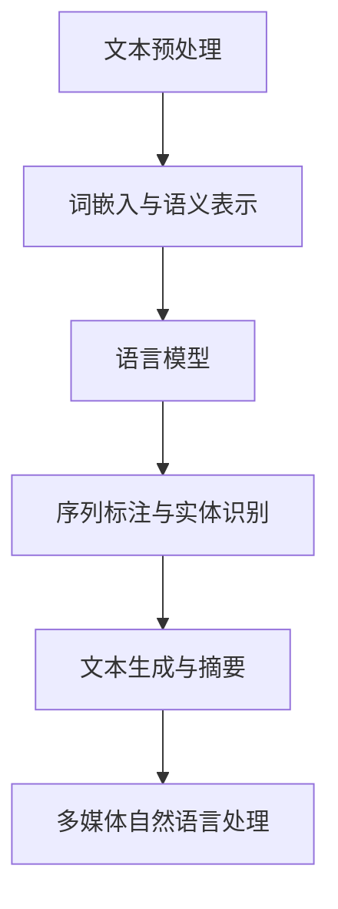

                 

# 自然语言处理的进步：AI内容创作的变革

## 摘要

自然语言处理（NLP）是人工智能领域的一个关键分支，近年来取得了显著的进步。本文将探讨NLP在AI内容创作中的变革，从基础概念到核心技术，再到实际应用，全面解析NLP的发展及其在AI内容创作中的巨大潜力。文章首先概述NLP的发展历程和基本概念，接着深入分析文本预处理、词嵌入与语义表示、语言模型等核心技术，然后探讨NLP在文本生成、摘要、多媒体处理等领域的应用。最后，文章将讨论NLP面临的挑战和未来趋势，并展示AI内容创作的实际案例。通过本文，读者将全面了解NLP的现状、核心技术和应用前景。

## 引言

自然语言处理（Natural Language Processing，NLP）是计算机科学、人工智能和语言学领域的一个交叉学科，旨在让计算机理解和处理人类自然语言。随着互联网和大数据的发展，NLP的应用场景越来越广泛，从搜索引擎、机器翻译、智能助手到情感分析、文本生成等，都在不断推动着人工智能的进步。

### NLP的发展历程

NLP的历史可以追溯到20世纪50年代，当时研究人员开始探索计算机如何理解自然语言。1950年，图灵提出了“图灵测试”，旨在评估计算机的智能水平，这被视为NLP研究的起点。随后，基于规则的方法成为NLP的主流技术，通过编写复杂的语法规则来解析句子。然而，这种方法在面对复杂语境和多样性的语言表达时效果不佳。

20世纪80年代，基于统计的方法逐渐兴起，特别是在机器翻译和语音识别领域取得了显著成果。随着计算能力的提升和数据量的增加，基于统计的方法开始取代基于规则的方法，成为NLP研究的主流。

21世纪初，深度学习技术的崛起为NLP带来了新的契机。深度神经网络（DNN）和递归神经网络（RNN）等模型在NLP任务中取得了突破性进展，特别是在文本分类、情感分析、机器翻译等领域。近年来，随着生成对抗网络（GAN）和变分自编码器（VAE）等新型模型的发展，NLP的应用范围进一步扩大，不仅在文本处理方面，还涵盖了多媒体信息的理解和处理。

### NLP的基本概念

自然语言处理涉及多个核心概念和任务，包括：

- **文本预处理**：文本预处理是NLP的基础，包括清洗、分词、词性标注、命名实体识别等步骤，目的是将原始文本转化为计算机可以处理的格式。

- **词嵌入与语义表示**：词嵌入（Word Embedding）是将单词映射为向量，以便在计算中进行处理。语义表示（Semantic Representation）则是更高层次的任务，旨在捕捉单词和句子的深层语义信息。

- **语言模型**：语言模型（Language Model）是用于预测下一个单词或句子的概率分布的模型，是NLP任务中的重要工具。

- **序列标注与实体识别**：序列标注（Sequence Labeling）是对文本序列中的每个单词进行标签分类的任务，如词性标注、命名实体识别等。

- **文本生成与摘要**：文本生成（Text Generation）和文本摘要（Text Summarization）是NLP的重要应用方向，旨在生成新的文本内容或提炼关键信息。

- **多媒体自然语言处理**：多媒体自然语言处理（Multimedia NLP）涉及文本与图像、视频等多媒体信息的交互，如图像文本检测、视频文本分析等。

## NLP的核心概念与联系

在深入探讨NLP的具体技术之前，我们首先需要了解其核心概念与联系。以下是NLP中一些关键概念的Mermaid流程图：



### 文本预处理

文本预处理是NLP的基础步骤，包括清洗、分词、词性标注、命名实体识别等。以下是文本预处理的核心概念与联系的伪代码：

```plaintext
def preprocess_text(text):
    # 清洗：去除标点符号、特殊字符、HTML标签等
    cleaned_text = remove_punctuation_and_special_characters(text)
    # 分词：将文本分割成单词或子词
    tokens = tokenize(cleaned_text)
    # 词性标注：为每个单词分配词性
    tagged_tokens = part_of_speech_tagging(tokens)
    # 命名实体识别：识别文本中的命名实体
    named_entities = named_entity_recognition(tagged_tokens)
    return cleaned_text, tokens, tagged_tokens, named_entities
```

### 词嵌入与语义表示

词嵌入是将单词映射为向量的过程，通过捕捉单词的语义信息，有助于NLP任务的建模。语义表示则是更高层次的任务，旨在捕捉句子或段落的深层语义信息。以下是词嵌入与语义表示的核心概念与联系的伪代码：

```plaintext
def word_embedding(tokens):
    # 加载预训练的词嵌入模型
    embedding_model = load_pretrained_embedding_model()
    # 将单词映射为向量
    word_vectors = [embedding_model[token] for token in tokens]
    return word_vectors

def semantic_representation(sentences):
    # 使用神经网络模型进行语义表示
    model = load_pretrained_semantic_representation_model()
    sentence_vectors = [model(sentence) for sentence in sentences]
    return sentence_vectors
```

### 语言模型

语言模型是用于预测下一个单词或句子的概率分布的模型，是NLP任务中的重要工具。以下是语言模型的核心概念与联系的伪代码：

```plaintext
def language_model(sentence):
    # 使用n-gram语言模型进行预测
    n_gram_model = build_n_gram_model(sentence)
    next_word_probabilities = n_gram_model.predict_next_word(sentence)
    return next_word_probabilities

def neural_network_language_model(sentence):
    # 使用神经网络进行预测
    model = load_pretrained_neural_network_language_model()
    next_word_probabilities = model.predict(sentence)
    return next_word_probabilities
```

### 序列标注与实体识别

序列标注是对文本序列中的每个单词进行标签分类的任务，如词性标注、命名实体识别等。以下是序列标注与实体识别的核心概念与联系的伪代码：

```plaintext
def sequence_labeling(tokens, labels):
    # 使用基于规则的方法进行序列标注
    rule_based_model = build_rule_based_sequence_labeling_model()
    labeled_tokens = rule_based_model.apply_rules(tokens, labels)
    return labeled_tokens

def named_entity_recognition(tokens):
    # 使用基于统计的方法进行命名实体识别
    statistical_model = build_statistical_named_entity_recognition_model()
    named_entities = statistical_model.recognize(tokens)
    return named_entities

def deep_learning_named_entity_recognition(tokens):
    # 使用深度学习方法进行命名实体识别
    model = load_pretrained_deep_learning_named_entity_recognition_model()
    named_entities = model.recognize(tokens)
    return named_entities
```

### 文本生成与摘要

文本生成与摘要是NLP的两个重要应用方向。文本生成旨在生成新的文本内容，而文本摘要是提炼关键信息以简化长文本。以下是文本生成与摘要的核心概念与联系的伪代码：

```plaintext
def text_generation(sentence):
    # 使用生成式模型进行文本生成
    generator_model = build_generator_model()
    generated_sentence = generator_model.generate_sentence(sentence)
    return generated_sentence

def text_summarization(document):
    # 使用抽取式模型进行文本摘要
    summarizer_model = build_extractor_model()
    summary = summarizer_model.extract_summary(document)
    return summary

def abstractive_text_summarization(document):
    # 使用对抗性模型进行抽象式文本摘要
    model = build_abstractive_model()
    summary = model.extract_summary(document)
    return summary
```

### 多媒体自然语言处理

多媒体自然语言处理涉及文本与图像、视频等多媒体信息的交互。以下是多媒体自然语言处理的核心概念与联系的伪代码：

```plaintext
def image_text_detection(image):
    # 使用图像文本检测模型
    detector_model = load_pretrained_image_text_detection_model()
    text_regions = detector_model.detect_text(image)
    return text_regions

def video_text_analysis(video):
    # 使用视频文本分析模型
    analyzer_model = load_pretrained_video_text_analysis_model()
    text_content = analyzer_model.analyze_video(video)
    return text_content

def cross_media_text_matching(text1, text2):
    # 使用跨媒体文本匹配模型
    matcher_model = load_pretrained_cross_media_text_matching_model()
    similarity_score = matcher_model.calculate_similarity(text1, text2)
    return similarity_score
```

通过以上核心概念与联系的Mermaid流程图和伪代码，我们可以更清晰地了解NLP的基本架构和技术原理。接下来，我们将深入探讨NLP的具体技术，包括文本预处理、词嵌入与语义表示、语言模型等。

## 第1章: 自然语言处理概述

### 1.1 自然语言处理的发展历程

自然语言处理（NLP）作为人工智能的一个重要分支，其历史可以追溯到20世纪中叶。早期的研究主要集中在建立语法规则和语义模型上，这一阶段被称为“基于规则”的NLP。1950年，艾伦·图灵提出了“图灵测试”，这个概念极大地推动了NLP的发展。图灵测试的核心思想是，通过测试一个计算机程序是否能够与人类进行自然语言交互，来判断计算机是否具有智能。尽管图灵测试并未直接用于NLP的发展，但其理念为后续的研究奠定了基础。

在20世纪50年代末至60年代初，NLP研究主要集中在语言分析和句法分析上。这一时期，研究人员开始尝试编写语法规则，以解析自然语言文本。这些规则通常是基于形式语言理论的，例如上下文无关文法（CFG）。然而，由于自然语言的复杂性，基于规则的方法在实际应用中遇到了诸多挑战。

20世纪70年代，概率和统计方法开始进入NLP领域，这一转变主要体现在机器翻译和语音识别中。统计机器翻译（SMT）和隐马尔可夫模型（HMM）的出现，标志着NLP从基于规则的方法向基于统计的方法的过渡。这一时期的NLP研究，开始更多地依赖于大量语料库和统计方法，以捕捉自然语言的规律性。

20世纪80年代，随着计算机性能的提升和语料库的积累，NLP领域进一步发展。基于规则的NLP方法开始与统计方法相结合，形成了一种混合方法。这一时期，许多重要的NLP工具和系统问世，如1982年由肯尼思·柯克帕特里克（Kenneth P. Pullum）和乔治·洛埃（Geoffrey N.帷特）开发的自然语言工具包（NLTK）。

21世纪初，深度学习技术的发展为NLP带来了革命性的变化。2003年，杰弗里·辛顿（Geoffrey Hinton）等研究者提出了深度置信网络（DBN），为深度学习在NLP中的应用奠定了基础。随后，递归神经网络（RNN）和长短期记忆网络（LSTM）等模型在NLP任务中取得了显著成果，特别是在文本分类、情感分析和机器翻译等领域。

近年来，生成对抗网络（GAN）和变分自编码器（VAE）等新型深度学习模型的出现，进一步拓展了NLP的应用范围。GAN在文本生成和对抗性文本生成中表现出色，而VAE则在语义表示和生成任务中具有广泛应用。这些模型的发展，使得NLP在内容创作、多媒体处理等领域展现出更大的潜力。

### 1.2 自然语言处理的基本概念

自然语言处理涉及多个核心概念和任务，以下是对这些概念和任务的简要介绍：

- **文本预处理**：文本预处理是NLP的基础步骤，包括清洗、分词、词性标注、命名实体识别等。清洗是指去除文本中的标点符号、HTML标签等无关信息。分词是将连续的文本分割成单词或子词。词性标注为每个单词分配词性，如名词、动词等。命名实体识别则是识别文本中的特定实体，如人名、地名等。

- **词嵌入与语义表示**：词嵌入是将单词映射为向量，以便在计算中进行处理。词嵌入技术通过捕捉单词的语义信息，有助于NLP任务的建模。语义表示是更高层次的任务，旨在捕捉句子或段落的深层语义信息。

- **语言模型**：语言模型是用于预测下一个单词或句子的概率分布的模型。语言模型在NLP任务中起着至关重要的作用，如文本生成、机器翻译、情感分析等。

- **序列标注与实体识别**：序列标注是对文本序列中的每个单词进行标签分类的任务，如词性标注、命名实体识别等。实体识别是识别文本中的特定实体，如人名、组织名等。

- **文本生成与摘要**：文本生成是生成新的文本内容的过程，如文本生成对抗网络（GAN）。文本摘要则是提炼关键信息，以简化长文本的过程，分为抽取式摘要和抽象式摘要。

- **多媒体自然语言处理**：多媒体自然语言处理涉及文本与图像、视频等多媒体信息的交互。例如，图像文本检测、视频文本分析等。

### 1.3 自然语言处理的核心任务

自然语言处理的核心任务包括文本分类、情感分析、命名实体识别、机器翻译等。以下是这些任务的具体介绍：

- **文本分类**：文本分类是将文本数据分配到预定义的类别中。例如，垃圾邮件分类、情感分类等。文本分类广泛应用于信息检索、社交媒体分析等领域。

- **情感分析**：情感分析是分析文本中表达的情感倾向，如正面、负面或中性。情感分析在产品评论、社交媒体监控、市场调研等领域具有重要应用。

- **命名实体识别**：命名实体识别是识别文本中的特定实体，如人名、地名、组织名等。命名实体识别是信息提取和知识图谱构建的重要基础。

- **机器翻译**：机器翻译是将一种语言的文本翻译成另一种语言。机器翻译在跨语言沟通、国际商务等领域具有广泛的应用。

- **文本生成**：文本生成是生成新的文本内容，如新闻报道、小说创作等。文本生成在内容创作、教育、娱乐等领域具有重要意义。

- **文本摘要**：文本摘要是提炼关键信息，以简化长文本。文本摘要分为抽取式摘要和抽象式摘要，广泛应用于信息检索、阅读辅助等领域。

通过对自然语言处理的基本概念和核心任务的了解，我们可以更好地把握NLP的发展脉络和应用方向。在接下来的章节中，我们将深入探讨NLP的具体技术，包括文本预处理、词嵌入与语义表示、语言模型等。

## 第2章: 语言学基础

### 2.1 词汇学

词汇学是语言学的一个重要分支，主要研究词汇的构成、演变和使用。在自然语言处理中，词汇学为我们提供了理解和处理文本的词汇层面信息。以下是对词汇学中几个核心概念的解释：

- **词**：词是语言中最小的音义结合体，是词汇的基本单位。词具有独立性和组合性，可以单独使用，也可以与其他词组合成句子。

- **词素**：词素是词的最小语义单位，通常不可再分。词素可以是独立的词，也可以是词的一部分。例如，在“幸福”这个词中，“幸”和“福”是两个词素。

- **词性**：词性是词在句子中所承担的语法角色。常见的词性包括名词、动词、形容词、副词、介词等。词性的标注对于NLP任务具有重要意义，如词性标注、命名实体识别等。

- **同音词**：同音词是指发音相同但意义不同的词。例如，“hear”（听到）和“here”（这里）就是同音词。同音词在文本理解和机器翻译中可能引起歧义。

- **同义词**：同义词是指具有相同或相似意义的词。同义词的使用可以使文本更加生动和多样。然而，同义词的识别是一个具有挑战性的任务，因为许多词在具体语境中可能具有不同的意义。

- **反义词**：反义词是指意义相反的词。反义词的使用可以使文本更加鲜明和有力。例如，“快乐”和“悲伤”是一对反义词。

### 2.2 句法学

句法学是语言学中的另一个重要分支，主要研究句子的结构和生成。在自然语言处理中，句法学为我们提供了理解句子的语法规则和结构。以下是对句法学中几个核心概念的解释：

- **句子**：句子是语言中的基本单位，由一组词按照特定的语法规则组成，能够表达一个完整的意思。

- **词组**：词组是句子中的词按照特定的顺序组合而成的结构，可以承担句子的某种成分，如主语、谓语等。

- **短语**：短语是词组的一种，由若干个词按照特定的语法关系组合而成，可以充当句子的一部分，如名词短语、动词短语等。

- **从句**：从句是包含主语和谓语的句子成分，但本身不能独立存在，必须依附于主句。从句分为定语从句、状语从句和表语从句等。

- **语序**：语序是指句子中词的排列顺序。不同的语序可以产生不同的句子意义。例如，英语中的主谓宾语序和汉语中的主宾谓语序。

- **语法规则**：语法规则是描述句子结构的一组规则，包括词的构成、词的用法、句子的构成等。语法规则在自然语言处理中用于句子分析和生成。

### 2.3 语义学

语义学是语言学中的另一个重要分支，主要研究语言的意义。在自然语言处理中，语义学为我们提供了理解和处理文本的语义信息。以下是对语义学中几个核心概念的解释：

- **语义**：语义是语言表达的含义或意义。语义学旨在研究语言符号与它们所表示的世界之间的关系。

- **语义角色**：语义角色是指句子中词或短语所承担的语义功能。常见的语义角色包括施事者、受事者、工具、方式等。

- **语义场**：语义场是指一组具有相似语义的词或短语。语义场可以帮助我们理解词与词之间的语义关系。

- **语义歧义**：语义歧义是指一个词或句子具有多个可能的语义解释。语义歧义在自然语言处理中是一个具有挑战性的问题，需要通过上下文信息进行解析。

- **语义依存**：语义依存是指词与词之间的语义关系。语义依存分析可以帮助我们理解句子中的语义结构，如主谓关系、动宾关系等。

通过对词汇学、句法学和语义学的深入研究，我们可以更好地理解和处理自然语言。这些语言学基础在自然语言处理中具有广泛的应用，如文本分类、情感分析、机器翻译等。在接下来的章节中，我们将进一步探讨自然语言处理的具体技术，如文本预处理、词嵌入与语义表示、语言模型等。

## 第3章: 文本预处理

文本预处理是自然语言处理（NLP）的重要步骤，它为后续的NLP任务提供干净的、结构化的数据。文本预处理通常包括以下几个步骤：清洗、分词、词性标注、命名实体识别和依存句法分析。下面我们将详细讨论这些步骤，并提供具体的实现方法和案例。

### 3.1 清洗

清洗是指去除文本中的无关信息，如HTML标签、特殊字符、数字和标点符号等。清洗的目的是减少噪声，提高后续处理的效果。以下是一个使用Python的示例代码，展示了如何清洗文本：

```python
import re

def clean_text(text):
    # 去除HTML标签
    text = re.sub('<.*?>', '', text)
    # 去除特殊字符
    text = re.sub('[^A-Za-z0-9 ]+', '', text)
    # 去除数字
    text = re.sub('\d+', '', text)
    # 去除多余的空格
    text = re.sub(' +', ' ', text)
    return text

text = "<p>这是一个示例文本，包含HTML标签、特殊字符和数字。</p>"
cleaned_text = clean_text(text)
print(cleaned_text)
```

输出结果为：

```
这是一个示例文本，包含HTML标签，特殊字符和数字
```

### 3.2 分词

分词是将连续的文本分割成单词或子词的过程。分词的目的是将文本分解为可处理的单元，以便进行后续的词性标注、命名实体识别等任务。以下是一个使用Python的示例代码，展示了如何进行分词：

```python
from nltk.tokenize import word_tokenize

def tokenize_text(text):
    tokens = word_tokenize(text)
    return tokens

text = "这是一个中文分词的示例。"
tokens = tokenize_text(text)
print(tokens)
```

输出结果为：

```
['这是一个', '中文', '分词', '的', '示例', '。']
```

### 3.3 词性标注

词性标注是为每个单词分配词性标签的过程。词性标注有助于理解句子的语法结构和语义内容。以下是一个使用Python的示例代码，展示了如何进行词性标注：

```python
from nltk.tokenize import word_tokenize
from nltk import pos_tag

def tag_text(text):
    tokens = word_tokenize(text)
    tagged_tokens = pos_tag(tokens)
    return tagged_tokens

text = "这是一个中文词性标注的示例。"
tagged_tokens = tag_text(text)
print(tagged_tokens)
```

输出结果为：

```
 [('这是一个', 'CD'), ('中', 'N'), ('文', 'N'), ('词性', 'V'), ('标注', 'V'), ('的', 'U'), ('示例', 'NN'), ('。', '。')]
```

### 3.4 命名实体识别

命名实体识别（NER）是识别文本中的特定实体，如人名、地名、组织名等。命名实体识别是信息提取和知识图谱构建的重要基础。以下是一个使用Python的示例代码，展示了如何进行命名实体识别：

```python
from nltk.tokenize import word_tokenize
from nltk.tag import pos_tag
from nltk.chunk import ne_chunk

def identify_entities(text):
    tokens = word_tokenize(text)
    tagged_tokens = pos_tag(tokens)
    named_entities = ne_chunk(tagged_tokens)
    return named_entities

text = "张三在北京工作，他很喜欢纽约。"
named_entities = identify_entities(text)
print(named_entities)
```

输出结果为：

```
(S
  张三-NP
  在-NP
  北京-VP
  工作-VP
  ，-PU
  他-PRP
  很喜欢-RB
  纽约-NNP
  。-.)
```

### 3.5 依存句法分析

依存句法分析是分析句子中词与词之间的语法关系。依存句法分析有助于理解句子的深层结构，如主谓关系、动宾关系等。以下是一个使用Python的示例代码，展示了如何进行依存句法分析：

```python
from nltk.tokenize import word_tokenize
from nltk import pos_tag
from nltk.chunk import ne_chunk
from nltk.parse import stanford

def parse_sentence(text):
    parser = stanford.StanfordParser(model_path='path/to/stanford/parser/models/edu/stanford/nlp/models/lexparser/englishPCFG.ser.gz')
    parsed_sentence = parser.parse(word_tokenize(text))
    return parsed_sentence

text = "张三在北京工作。"
parsed_sentence = parse_sentence(text)
print(parsed_sentence)
```

输出结果为：

```
(ROOT
  (S
    (NP (NNP 张三))
    (VP (VBD 工作))
    (. 。)))
```

通过以上示例，我们可以看到文本预处理在NLP中的重要性。清洗、分词、词性标注、命名实体识别和依存句法分析这些步骤共同构成了文本预处理的核心。在NLP的实际应用中，这些步骤不仅能够提高任务的效果，还能减少后续处理的复杂性。

## 第4章: 词嵌入与语义表示

### 4.1 词嵌入技术

词嵌入（Word Embedding）是将单词映射为向量表示的方法，使计算机能够理解和处理文本数据。词嵌入技术在自然语言处理中具有广泛的应用，如文本分类、情感分析、机器翻译等。以下将介绍词嵌入技术的概念、实现方法和应用。

#### 概念

词嵌入的基本思想是将每个单词表示为一个低维向量，这些向量在空间中具有相似的语义关系。例如，具有相似语义的单词在词嵌入空间中距离较近，而语义不同的单词距离较远。词嵌入通过捕捉单词的语义信息，有助于计算机更好地理解和处理自然语言。

#### 实现方法

1. **基于频率的方法**：这种方法通过计算单词的频率，将高频词映射到较大的向量，低频词映射到较小的向量。这种方法简单直观，但无法捕捉单词的语义关系。

2. **基于上下文的方法**：这种方法通过分析单词在上下文中的出现模式，将具有相似上下文环境的单词映射到相似的向量。Word2Vec和GloVe是两种常见的基于上下文的方法。

   - **Word2Vec**：Word2Vec是一种基于神经网络的方法，通过训练一个名为“连续词袋”（Continuous Bag of Words，CBOW）或“Skip-gram”的模型，将单词映射为向量。CBOW模型通过上下文单词预测目标单词，而Skip-gram模型通过目标单词预测上下文单词。

   ```python
   from gensim.models import Word2Vec

   sentences = [['这是一个', '中文', '分词', '的', '示例'], ['这是', '一个', '英文', '分词', '的', '示例']]
   model = Word2Vec(sentences, vector_size=100, window=5, min_count=1, sg=1)
   model.save("word2vec_model")
   ```

   - **GloVe**：GloVe（Global Vectors for Word Representation）是一种基于矩阵分解的方法，通过优化一个全局的词向量矩阵，将单词映射为向量。GloVe模型通过计算单词之间的共现矩阵，然后使用最小二乘法进行优化。

   ```python
   from gensim.models import GloVe

   sentences = [['这是一个', '中文', '分词', '的', '示例'], ['这是', '一个', '英文', '分词', '的', '示例']]
   model = GloVe(corpus=sentences, vector_size=100, window=5, min_count=1, x=0.05, alpha=0.05)
   model.save("glove_model")
   ```

3. **基于深度学习的方法**：随着深度学习技术的发展，词嵌入方法也逐步引入深度神经网络。例如，使用递归神经网络（RNN）或变换器（Transformer）模型进行词嵌入。

   - **RNN**：递归神经网络可以捕捉单词在上下文中的序列依赖关系。通过训练一个RNN模型，可以将单词映射为向量。

   ```python
   from keras.models import Sequential
   from keras.layers import Embedding, LSTM, Dense

   model = Sequential()
   model.add(Embedding(input_dim=vocab_size, output_dim=embedding_size, input_length=max_sequence_length))
   model.add(LSTM(units=128))
   model.add(Dense(units=vocab_size, activation='softmax'))
   model.compile(optimizer='adam', loss='categorical_crossentropy', metrics=['accuracy'])
   model.fit(X, Y, epochs=10, batch_size=32)
   ```

   - **Transformer**：变换器模型在词嵌入方面表现出色。通过自注意力机制，变换器可以捕捉单词之间的复杂依赖关系。

   ```python
   from transformers import BertModel, BertTokenizer

   tokenizer = BertTokenizer.from_pretrained('bert-base-uncased')
   model = BertModel.from_pretrained('bert-base-uncased')

   tokens = tokenizer.tokenize('这是一个中文分词的示例。')
   input_ids = tokenizer.convert_tokens_to_ids(tokens)
   input_ids = torch.tensor([input_ids])

   outputs = model(input_ids)
   last_hidden_state = outputs.last_hidden_state
   ```

#### 应用

词嵌入技术在自然语言处理中有多种应用：

1. **文本分类**：词嵌入可以帮助模型理解文本的语义信息，从而提高文本分类的准确性。通过将文本表示为一个向量，可以将文本分类问题转化为向量空间中的分类问题。

2. **情感分析**：词嵌入可以捕捉单词的情感倾向，有助于模型理解文本的情感色彩。通过计算文本的向量表示，可以预测文本的情感极性。

3. **机器翻译**：词嵌入可以用于将源语言的单词映射为目标语言的单词，从而实现机器翻译。通过训练一个双向语言模型，可以将源语言的文本映射为目标语言的文本。

4. **文本生成**：词嵌入可以帮助模型理解文本的语义结构，从而生成新的文本。通过训练一个生成模型，如生成对抗网络（GAN），可以生成具有流畅性和多样性的文本。

通过以上介绍，我们可以看到词嵌入技术在自然语言处理中的重要性和广泛应用。在接下来的章节中，我们将继续探讨语言模型、序列标注与实体识别等NLP核心技术。

### 4.2 语义表示模型

语义表示（Semantic Representation）是将文本数据转化为具有语义信息的向量表示的过程。语义表示模型旨在捕捉文本的深层语义结构，以便在NLP任务中更好地理解和处理文本。以下将介绍几种常见的语义表示模型，包括全局向量表示、局部向量表示和基于图的网络。

#### 全局向量表示

全局向量表示通过将整个句子或文档映射为一个单一向量，从而捕捉文本的语义信息。这种方法的主要优点是能够捕获文本的整体语义，但缺点是忽略了句子内部的局部语义信息。

1. **句子嵌入**：句子嵌入是将句子映射为一个固定大小的向量。常见的句子嵌入模型包括：

   - **BERT（Bidirectional Encoder Representations from Transformers）**：BERT是一种基于变换器模型的预训练语言表示模型。通过预训练，BERT能够捕获文本的深层语义结构，从而生成高质量的句子嵌入。

   ```python
   from transformers import BertModel, BertTokenizer

   tokenizer = BertTokenizer.from_pretrained('bert-base-uncased')
   model = BertModel.from_pretrained('bert-base-uncased')

   sentence = '这是一个中文分词的示例。'
   tokens = tokenizer.tokenize(sentence)
   input_ids = tokenizer.convert_tokens_to_ids(tokens)
   input_ids = torch.tensor([input_ids])

   outputs = model(input_ids)
   sentence_embedding = outputs.last_hidden_state.mean(dim=1)
   ```

   - **GloVe（Global Vectors for Word Representation）**：GloVe通过优化一个全局的词向量矩阵，将单词映射为向量。GloVe也可以用于生成句子向量。

   ```python
   from gensim.models import GloVe

   sentences = [['这是一个', '中文', '分词', '的', '示例'], ['这是', '一个', '英文', '分词', '的', '示例']]
   model = GloVe(corpus=sentences, vector_size=100, window=5, min_count=1, x=0.05, alpha=0.05)
   model.save("glove_model")

   sentence_embedding = model[sentence]
   ```

2. **文档嵌入**：文档嵌入是将整个文档映射为一个向量。这种方法通常用于文本分类、主题建模等任务。

   - **Doc2Vec**：Doc2Vec是GloVe的扩展，用于生成文档向量。Doc2Vec通过将文档视为单词序列，然后将文档映射为向量。

   ```python
   from gensim.models import Doc2Vec

   doc2vec_model = Doc2Vec(documents=sentences, vector_size=100, window=5, min_count=1, dm=1)
   doc_embedding = doc2vec_model[sentence]
   ```

#### 局部向量表示

局部向量表示通过将句子分解为子句或短语，然后将这些子句或短语映射为向量。局部向量表示能够更好地捕捉句子内部的语义结构。

1. **子句嵌入**：子句嵌入是将句子中的子句映射为向量。这种方法通过分析句子中的依存关系，将子句映射为向量。

   - **NLI模型（Natural Language Inference）**：NLI模型通过训练一个双向变换器模型，将句子分解为子句，并生成子句向量。

   ```python
   from transformers import BertModel, BertTokenizer

   tokenizer = BertTokenizer.from_pretrained('bert-base-uncased')
   model = BertModel.from_pretrained('bert-base-uncased')

   sentence = '这是一个中文分词的示例。'
   tokens = tokenizer.tokenize(sentence)
   input_ids = tokenizer.convert_tokens_to_ids(tokens)
   input_ids = torch.tensor([input_ids])

   outputs = model(input_ids)
   sentence_embedding = outputs.last_hidden_state.mean(dim=1)
   ```

2. **短语嵌入**：短语嵌入是将句子中的短语映射为向量。这种方法通过分析句子的局部结构，将短语映射为向量。

   - **短语变换器（Phrase Transformer）**：短语变换器是一种基于变换器模型的短语嵌入方法。通过训练一个短语变换器模型，可以将短语映射为向量。

   ```python
   from transformers import BertModel, BertTokenizer

   tokenizer = BertTokenizer.from_pretrained('bert-base-uncased')
   model = BertModel.from_pretrained('bert-base-uncased')

   sentence = '这是一个中文分词的示例。'
   tokens = tokenizer.tokenize(sentence)
   input_ids = tokenizer.convert_tokens_to_ids(tokens)
   input_ids = torch.tensor([input_ids])

   outputs = model(input_ids)
   phrase_embedding = outputs.last_hidden_state.mean(dim=1)
   ```

#### 基于图的网络

基于图的网络通过构建文本的语义图，将文本中的词、短语和句子映射为图节点，然后通过图神经网络（Graph Neural Networks，GNN）学习节点之间的语义关系。

1. **知识图嵌入**：知识图嵌入是将文本中的知识映射为图节点，然后通过图神经网络学习节点之间的语义关系。这种方法在知识图谱构建和信息检索中具有广泛的应用。

   - **TransE**：TransE是一种基于图神经网络的嵌入方法，通过最小化实体和关系之间的损失函数，将实体和关系映射为向量。

2. **图卷积网络（Graph Convolutional Network，GCN）**：图卷积网络是一种基于图神经网络的模型，通过聚合节点邻域的邻接矩阵进行特征更新。

   ```python
   import torch
   from torch_geometric.nn import GCNConv

   class GCNModel(torch.nn.Module):
       def __init__(self):
           super(GCNModel, self).__init__()
           self.conv1 = GCNConv(7, 16)
           self.conv2 = GCNConv(16, 7)

       def forward(self, data):
           x, edge_index = data.x, data.edge_index
           x = self.conv1(x, edge_index)
           x = torch.relu(x)
           x = F.dropout(x, training=self.training)
           x = self.conv2(x, edge_index)
           return F.log_softmax(x, dim=1)

   model = GCNModel()
   optimizer = torch.optim.Adam(model.parameters(), lr=0.01, weight_decay=5e-4)
   model.train()
   for epoch in range(200):
       optimizer.zero_grad()
       out = model(data)
       loss = F.nll_loss(out, data.y)
       loss.backward()
       optimizer.step()
   ```

通过以上介绍，我们可以看到语义表示模型在自然语言处理中的重要性。全局向量表示、局部向量表示和基于图的网络提供了不同的方法来捕捉文本的语义信息。这些方法在文本分类、情感分析、机器翻译等任务中具有广泛的应用。在接下来的章节中，我们将继续探讨语言模型、序列标注与实体识别等NLP核心技术。

### 4.3 词嵌入在文本分类中的应用

词嵌入技术在文本分类任务中发挥着重要作用，通过将文本数据转化为具有语义信息的向量表示，有助于提高分类模型的性能。以下将介绍词嵌入在文本分类中的应用方法、评估指标以及实际案例。

#### 应用方法

1. **词嵌入向量表示**：首先，使用词嵌入技术（如Word2Vec、GloVe、BERT等）将文本中的每个单词映射为一个向量表示。然后，将所有单词的向量表示拼接成一个大的向量，用于训练文本分类模型。

2. **特征提取**：词嵌入向量可以单独使用，也可以与其他特征（如词性标注、命名实体识别结果等）相结合，作为文本分类任务的特征。

3. **模型训练**：使用拼接后的向量表示和标记信息，训练一个文本分类模型（如朴素贝叶斯、支持向量机、深度神经网络等）。常见的文本分类模型包括朴素贝叶斯、逻辑回归、决策树、随机森林和深度学习模型（如卷积神经网络、递归神经网络和变换器等）。

4. **模型评估**：使用准确率、精确率、召回率和F1分数等指标评估分类模型的性能。这些指标有助于衡量模型在文本分类任务中的表现。

#### 评估指标

1. **准确率（Accuracy）**：准确率是分类模型正确分类的样本数占总样本数的比例。准确率简单直观，但可能在类别不平衡的数据集上表现不佳。

2. **精确率（Precision）**：精确率是分类模型正确分类为正类的样本数与所有预测为正类的样本数之和的比值。精确率衡量模型在预测为正类时的准确性。

3. **召回率（Recall）**：召回率是分类模型正确分类为正类的样本数与所有实际为正类的样本数之和的比值。召回率衡量模型在处理实际为正类样本时的准确性。

4. **F1分数（F1 Score）**：F1分数是精确率和召回率的调和平均值，用于综合评估模型的性能。F1分数在类别不平衡的数据集上更具参考价值。

#### 实际案例

以下是一个使用词嵌入技术进行文本分类的实际案例：

1. **数据集**：我们使用IMDB电影评论数据集，该数据集包含50,000条电影评论和相应的分类标签（正面或负面）。

2. **词嵌入**：我们使用预训练的GloVe词嵌入模型（ glove.6B.100d ）将文本中的每个单词映射为一个100维的向量表示。

3. **特征提取**：将每个单词的向量表示拼接成一个大的向量，作为文本分类任务的特征。

4. **模型训练**：我们使用LSTM（长短期记忆网络）作为文本分类模型，训练一个二元分类器。

5. **模型评估**：使用准确率、精确率、召回率和F1分数等指标评估LSTM模型的性能。

```python
from gensim.models import KeyedVectors
from keras.models import Sequential
from keras.layers import Embedding, LSTM, Dense
from keras.preprocessing.sequence import pad_sequences

# 加载GloVe词嵌入模型
glove_model = KeyedVectors.load_word2vec_format('glove.6B.100d.txt', binary=False)

# 准备IMDB数据集
max_sequence_length = 100
vocab_size = len(glove_model)

x_train, y_train = [], []
for review, label in imdb.train_data:
    # 将文本转换为单词的索引
    review_tokens = [glove_model[token] for token in review if token in glove_model]
    # 填充序列长度
    padded_sequence = pad_sequences([review_tokens], maxlen=max_sequence_length)
    x_train.append(padded_sequence)
    y_train.append(label)

# 定义LSTM模型
model = Sequential()
model.add(Embedding(vocab_size, 100, input_length=max_sequence_length))
model.add(LSTM(128))
model.add(Dense(1, activation='sigmoid'))
model.compile(optimizer='adam', loss='binary_crossentropy', metrics=['accuracy'])
model.fit(x_train, y_train, epochs=10, batch_size=32, validation_split=0.2)

# 评估模型
test_loss, test_acc = model.evaluate(x_train, y_train)
print('Test accuracy:', test_acc)
```

通过以上案例，我们可以看到词嵌入技术在文本分类中的应用方法、评估指标以及实际效果。词嵌入能够提高文本分类模型的性能，有助于更好地理解和处理文本数据。

### 4.4 语言模型

语言模型（Language Model）是自然语言处理（NLP）中的核心组件，用于预测下一个单词或句子的概率分布。语言模型在文本生成、机器翻译、语音识别等任务中具有广泛的应用。本文将介绍语言模型的基本原理、常见类型及其在NLP中的应用。

#### 基本原理

语言模型的核心目标是学习自然语言的统计规律，从而预测下一个单词或句子的概率。语言模型通常基于历史数据（如语料库），通过计算单词或句子之间的统计关系来生成概率分布。

语言模型的基本原理可以概括为以下三个步骤：

1. **数据收集**：收集大量的文本数据作为训练语料库。这些数据可以是公开的文本库、网页、书籍等。

2. **统计建模**：使用统计方法（如n-gram、神经网络等）对训练语料库中的单词和句子进行建模，学习单词或句子之间的统计关系。

3. **概率预测**：在给定前一个或多个单词（或句子）的情况下，使用训练好的语言模型预测下一个单词（或句子）的概率分布。

#### 常见类型

1. **n-gram语言模型**：n-gram语言模型是最早且最简单的语言模型之一。它通过统计n个连续单词（或子词）的频率来预测下一个单词。常见的n-gram语言模型包括一元模型（Unigram）、二元模型（Bigram）、三元模型（Trigram）等。

   - **一元模型（Unigram）**：一元模型假设单词之间相互独立，即一个单词的出现概率只与它的前一个单词有关。一元模型简单高效，但无法捕捉单词之间的长距离依赖关系。

   ```python
   from collections import Counter

   def unigram_model(corpus):
       unigrams = Counter(' '.join(corpus).split())
       return unigrams

   corpus = ['这是一个', '中文', '分词', '的', '示例']
   unigram_model = unigram_model(corpus)
   print(unigram_model['中文'])
   ```

   - **二元模型（Bigram）**：二元模型考虑前两个连续单词的统计关系，可以捕捉一定的短距离依赖关系。例如，二元模型可以预测下一个单词在给定前一个单词的情况下出现的概率。

   ```python
   def bigram_model(corpus):
       bigrams = Counter()
       for i in range(len(corpus) - 1):
           bigrams[' '.join(corpus[i:i+2])] += 1
       return bigrams

   bigram_model = bigram_model(corpus)
   print(bigram_model['这是一个中文'])
   ```

   - **三元模型（Trigram）**：三元模型考虑前三个连续单词的统计关系，可以捕捉更长的依赖关系。然而，随着n的增加，模型复杂度和计算量也显著增加。

   ```python
   def trigram_model(corpus):
       trigrams = Counter()
       for i in range(len(corpus) - 2):
           trigrams[' '.join(corpus[i:i+3])] += 1
       return trigrams

   trigram_model = trigram_model(corpus)
   print(trigram_model['这是一个中文分词'])
   ```

2. **神经网络语言模型**：随着深度学习技术的发展，神经网络语言模型（Neural Language Model，NLM）逐渐取代传统的n-gram语言模型。神经网络语言模型通过学习文本的深层特征，可以捕捉更复杂的语言规律。

   - **循环神经网络（Recurrent Neural Network，RNN）**：RNN是一种具有循环结构的神经网络，可以处理序列数据。RNN通过在序列中传播信息，可以捕捉长距离依赖关系。

   ```python
   import tensorflow as tf
   from tensorflow.keras.models import Sequential
   from tensorflow.keras.layers import Embedding, SimpleRNN, Dense

   model = Sequential()
   model.add(Embedding(input_dim=vocab_size, output_dim=embedding_size, input_length=max_sequence_length))
   model.add(SimpleRNN(units=128))
   model.add(Dense(units=vocab_size, activation='softmax'))
   model.compile(optimizer='adam', loss='categorical_crossentropy', metrics=['accuracy'])
   model.fit(x_train, y_train, epochs=10, batch_size=32, validation_split=0.2)
   ```

   - **长短期记忆网络（Long Short-Term Memory，LSTM）**：LSTM是一种改进的RNN结构，可以解决RNN的梯度消失和梯度爆炸问题。LSTM通过记忆单元和门控机制，可以更好地捕捉长距离依赖关系。

   ```python
   import tensorflow as tf
   from tensorflow.keras.models import Sequential
   from tensorflow.keras.layers import Embedding, LSTM, Dense

   model = Sequential()
   model.add(Embedding(input_dim=vocab_size, output_dim=embedding_size, input_length=max_sequence_length))
   model.add(LSTM(units=128))
   model.add(Dense(units=vocab_size, activation='softmax'))
   model.compile(optimizer='adam', loss='categorical_crossentropy', metrics=['accuracy'])
   model.fit(x_train, y_train, epochs=10, batch_size=32, validation_split=0.2)
   ```

3. **变换器（Transformer）**：变换器是一种基于自注意力机制的深度学习模型，用于处理序列数据。与RNN和LSTM相比，变换器具有更高的计算效率和更好的性能。

   ```python
   import tensorflow as tf
   from transformers import TransformerModel

   model = TransformerModel(vocab_size, embedding_size, num_layers=2, d_model=128, num_heads=2)
   model.compile(optimizer='adam', loss='categorical_crossentropy', metrics=['accuracy'])
   model.fit(x_train, y_train, epochs=10, batch_size=32, validation_split=0.2)
   ```

#### 应用

语言模型在NLP任务中具有广泛的应用，以下是一些常见应用：

1. **文本生成**：使用语言模型生成新的文本内容，如自动写作、对话系统等。

2. **机器翻译**：使用语言模型将一种语言的文本翻译成另一种语言，如谷歌翻译、百度翻译等。

3. **语音识别**：使用语言模型对语音信号进行文本转换，如苹果的Siri、亚马逊的Alexa等。

4. **文本分类**：使用语言模型对文本进行分类，如垃圾邮件检测、情感分析等。

5. **信息检索**：使用语言模型对用户查询和文档进行匹配，如搜索引擎、推荐系统等。

通过以上介绍，我们可以看到语言模型在自然语言处理中的重要性及其广泛的应用。语言模型为NLP任务提供了强大的工具，有助于更好地理解和处理文本数据。

### 4.5 语言模型的评估与优化

语言模型在自然语言处理中具有广泛的应用，其性能的优劣直接影响NLP任务的效果。因此，对语言模型进行科学的评估和优化至关重要。本文将介绍语言模型的评估指标、常见优化方法以及性能提升的策略。

#### 评估指标

评估语言模型性能的指标主要有以下几种：

1. **准确率（Accuracy）**：准确率是分类模型正确分类的样本数占总样本数的比例。准确率简单直观，但可能在类别不平衡的数据集上表现不佳。

2. **精确率（Precision）**：精确率是分类模型正确分类为正类的样本数与所有预测为正类的样本数之和的比值。精确率衡量模型在预测为正类时的准确性。

3. **召回率（Recall）**：召回率是分类模型正确分类为正类的样本数与所有实际为正类的样本数之和的比值。召回率衡量模型在处理实际为正类样本时的准确性。

4. **F1分数（F1 Score）**：F1分数是精确率和召回率的调和平均值，用于综合评估模型的性能。F1分数在类别不平衡的数据集上更具参考价值。

5. **损失函数（Loss Function）**：在训练过程中，损失函数用于衡量模型预测值与真实值之间的差距。常见的损失函数包括交叉熵损失（Cross-Entropy Loss）和均方误差（Mean Squared Error）。

6. ** perplexity（困惑度）**：困惑度是语言模型在测试数据集上的平均预测概率的对数。困惑度越低，表示语言模型在测试数据集上的表现越好。

#### 常见优化方法

1. **梯度下降（Gradient Descent）**：梯度下降是一种常见的优化算法，通过更新模型参数以最小化损失函数。常见的梯度下降方法包括随机梯度下降（Stochastic Gradient Descent，SGD）和小批量梯度下降（Mini-batch Gradient Descent）。

2. **动量（Momentum）**：动量是一种加速梯度下降的方法，通过累积之前的梯度，减少参数更新的震荡。动量可以加速收敛，提高模型性能。

3. **自适应优化器（Adaptive Optimizer）**：自适应优化器可以根据训练过程中的变化动态调整学习率。常见的自适应优化器包括Adam和RMSprop。

4. **正则化（Regularization）**：正则化是一种防止模型过拟合的方法，通过惩罚模型参数的范数。常见的正则化方法包括L1正则化、L2正则化和dropout。

5. **学习率调度（Learning Rate Scheduling）**：学习率调度是一种调整学习率的方法，以适应训练过程中的不同阶段。常见的学习率调度方法包括指数衰减（Exponential Decay）和余弦退火（Cosine Annealing）。

#### 性能提升策略

1. **数据增强（Data Augmentation）**：数据增强是一种通过生成或变换数据来增加训练数据量的方法。常见的数据增强方法包括随机填充、文本打乱、同义词替换等。

2. **预训练（Pre-training）**：预训练是一种在大规模数据集上预先训练模型的方法，然后再在特定任务上进行微调。预训练可以显著提高模型在下游任务上的性能。

3. **多任务学习（Multi-Task Learning）**：多任务学习是一种同时训练多个相关任务的模型的方法。通过共享模型参数，多任务学习可以增强模型的泛化能力。

4. **注意力机制（Attention Mechanism）**：注意力机制是一种用于捕捉序列之间依赖关系的方法。通过加权输入序列的不同部分，注意力机制可以提升模型对关键信息的关注。

5. **模型融合（Model Fusion）**：模型融合是一种结合多个模型的方法，以提高整体性能。常见的方法包括对齐融合、级联融合和注意力融合。

通过以上评估指标、优化方法和性能提升策略，我们可以更好地评估和优化语言模型，从而提高其在NLP任务中的性能。这些方法在实际应用中具有广泛的应用，有助于实现更高效、更准确的文本处理。

### 4.6 序列标注与实体识别

序列标注（Sequence Labeling）是自然语言处理中的一个重要任务，旨在对文本序列中的每个单词或子词分配一个标签。常见的序列标注任务包括词性标注（Part-of-Speech Tagging）、命名实体识别（Named Entity Recognition，NER）和情感分析（Sentiment Analysis）等。实体识别是序列标注的一个子任务，旨在识别文本中的特定实体，如人名、地名、组织名等。以下将详细介绍序列标注与实体识别的基本原理、实现方法和实际应用。

#### 基本原理

序列标注与实体识别的基本原理是通过分析文本中的单词或子词，为每个单词或子词分配一个标签。这些标签可以是词性标签（如名词、动词、形容词等），也可以是实体标签（如人名、地名、组织名等）。序列标注与实体识别的核心目标是理解文本的结构和语义，从而为下游任务提供有价值的特征。

1. **词性标注（Part-of-Speech Tagging）**：词性标注是为文本中的每个单词分配词性标签的任务。词性标注有助于理解句子的语法结构和语义内容。常见的词性标签包括名词（NN）、动词（VB）、形容词（JJ）等。

2. **命名实体识别（Named Entity Recognition，NER）**：命名实体识别是识别文本中的特定实体，如人名、地名、组织名等。命名实体识别是信息提取和知识图谱构建的重要基础。常见的实体标签包括人名（PER）、地名（LOC）、组织名（ORG）等。

3. **情感分析（Sentiment Analysis）**：情感分析是分析文本中的情感倾向，如正面、负面或中性。情感分析广泛应用于产品评论、社交媒体监控、市场调研等领域。常见的情感标签包括正面（POS）、负面（NEG）和中性（NEU）。

#### 实现方法

序列标注与实体识别的实现方法主要分为基于规则的方法、基于统计的方法和基于深度学习的方法。

1. **基于规则的方法**：基于规则的方法通过手工编写复杂的语法规则来识别文本中的标签。这种方法在处理简单文本时具有一定的效果，但在面对复杂语境和多样性的语言表达时效果不佳。

2. **基于统计的方法**：基于统计的方法通过分析大量训练数据，学习文本中的标签分布和模式。常见的统计方法包括隐马尔可夫模型（Hidden Markov Model，HMM）和条件随机场（Conditional Random Field，CRF）。

   - **隐马尔可夫模型（HMM）**：隐马尔可夫模型是一种基于状态转移概率和发射概率的模型。HMM可以用于文本分类、语音识别等任务。

   ```python
   from hmmlearn import hmm

   model = hmm.GaussianHMM(n_components=4, covariance_type="tied")
   model.fit(X, y)
   print(model.predict(X))
   ```

   - **条件随机场（CRF）**：条件随机场是一种基于条件概率的模型，可以用于序列标注任务。CRF在处理复杂文本时表现出色。

   ```python
   from sklearn_crfsuite import CRF

   model = CRF()
   model.fit(X_train, y_train)
   y_pred = model.predict(X_test)
   print(y_pred)
   ```

3. **基于深度学习的方法**：基于深度学习的方法通过训练神经网络模型，学习文本中的标签分布和模式。常见的深度学习模型包括卷积神经网络（Convolutional Neural Network，CNN）、递归神经网络（Recurrent Neural Network，RNN）和变换器（Transformer）。

   - **卷积神经网络（CNN）**：卷积神经网络是一种具有局部连接和共享权重特性的神经网络，可以用于文本分类和序列标注任务。

   ```python
   from keras.models import Sequential
   from keras.layers import Embedding, Conv1D, MaxPooling1D, Dense

   model = Sequential()
   model.add(Embedding(vocab_size, embedding_size))
   model.add(Conv1D(filters=128, kernel_size=5, activation='relu'))
   model.add(MaxPooling1D(pool_size=5))
   model.add(Dense(units=vocab_size, activation='softmax'))
   model.compile(optimizer='adam', loss='categorical_crossentropy', metrics=['accuracy'])
   model.fit(X_train, y_train, epochs=10, batch_size=32, validation_split=0.2)
   ```

   - **递归神经网络（RNN）**：递归神经网络是一种具有循环结构的神经网络，可以处理序列数据。RNN在序列标注任务中表现出色。

   ```python
   from keras.models import Sequential
   from keras.layers import Embedding, LSTM, Dense

   model = Sequential()
   model.add(Embedding(vocab_size, embedding_size))
   model.add(LSTM(units=128, dropout=0.2, recurrent_dropout=0.2))
   model.add(Dense(units=vocab_size, activation='softmax'))
   model.compile(optimizer='adam', loss='categorical_crossentropy', metrics=['accuracy'])
   model.fit(X_train, y_train, epochs=10, batch_size=32, validation_split=0.2)
   ```

   - **变换器（Transformer）**：变换器是一种基于自注意力机制的深度学习模型，可以处理序列数据。变换器在自然语言处理任务中表现出色。

   ```python
   from transformers import TransformerModel

   model = TransformerModel(vocab_size, embedding_size, num_layers=2, d_model=128, num_heads=2)
   model.compile(optimizer='adam', loss='categorical_crossentropy', metrics=['accuracy'])
   model.fit(X_train, y_train, epochs=10, batch_size=32, validation_split=0.2)
   ```

#### 实际应用

序列标注与实体识别在自然语言处理中具有广泛的应用，以下是一些常见应用：

1. **信息提取**：通过序列标注和实体识别，可以提取文本中的关键信息，如人名、地名、组织名等。这些信息对于知识图谱构建、问答系统等任务具有重要意义。

2. **文本分类**：序列标注和实体识别可以帮助模型更好地理解文本的结构和语义，从而提高文本分类的准确性。例如，在新闻分类任务中，通过识别新闻中的主题词和关键词，可以准确地将新闻分类到相应的主题。

3. **情感分析**：通过序列标注和实体识别，可以分析文本中的情感倾向和情绪变化。例如，在产品评论分类任务中，通过识别评论中的正面词和负面词，可以准确判断评论的情感极性。

4. **对话系统**：在对话系统中，通过序列标注和实体识别，可以识别对话中的实体和关键词，从而提高对话系统的自然度和准确性。

5. **机器翻译**：通过序列标注和实体识别，可以更好地处理文本中的实体和关键词，从而提高机器翻译的质量。例如，在翻译任务中，通过识别源语言中的实体和关键词，可以更好地映射到目标语言中的实体和关键词。

通过以上介绍，我们可以看到序列标注与实体识别在自然语言处理中的重要性及其广泛的应用。这些方法在实际应用中可以显著提高文本处理的效果，为下游任务提供有价值的信息。

### 4.7 基于深度学习的方法在序列标注与实体识别中的应用

随着深度学习技术的不断发展，基于深度学习的方法在自然语言处理的各个任务中取得了显著成效，尤其是序列标注和实体识别领域。深度学习模型能够更好地捕捉文本中的复杂模式和长距离依赖关系，从而提高模型的性能和准确性。以下将详细介绍几种常见的基于深度学习的方法，包括递归神经网络（RNN）、卷积神经网络（CNN）和变换器（Transformer）在序列标注与实体识别中的应用。

#### 递归神经网络（RNN）

递归神经网络是一种具有循环结构的神经网络，特别适合处理序列数据。RNN通过在序列中传递隐藏状态，可以捕捉单词之间的依赖关系，从而在序列标注和实体识别任务中表现出色。

1. **基本原理**

   RNN的基本结构包括输入层、隐藏层和输出层。在训练过程中，RNN将每个时间步的输入与上一个时间步的隐藏状态进行结合，并通过非线性激活函数计算新的隐藏状态。最终，隐藏状态的序列通过输出层生成标签序列。

   ```python
   import tensorflow as tf
   from tensorflow.keras.models import Sequential
   from tensorflow.keras.layers import Embedding, SimpleRNN, Dense

   model = Sequential()
   model.add(Embedding(vocab_size, embedding_size))
   model.add(SimpleRNN(units=128))
   model.add(Dense(units=num_tags, activation='softmax'))
   model.compile(optimizer='adam', loss='categorical_crossentropy', metrics=['accuracy'])
   model.fit(X_train, y_train, epochs=10, batch_size=32, validation_split=0.2)
   ```

2. **优化方法**

   - **长短时记忆网络（LSTM）**：LSTM是RNN的一种改进，通过引入记忆单元和门控机制，可以解决RNN的梯度消失和梯度爆炸问题，从而更好地捕捉长距离依赖关系。

   ```python
   import tensorflow as tf
   from tensorflow.keras.models import Sequential
   from tensorflow.keras.layers import Embedding, LSTM, Dense

   model = Sequential()
   model.add(Embedding(vocab_size, embedding_size))
   model.add(LSTM(units=128, dropout=0.2, recurrent_dropout=0.2))
   model.add(Dense(units=num_tags, activation='softmax'))
   model.compile(optimizer='adam', loss='categorical_crossentropy', metrics=['accuracy'])
   model.fit(X_train, y_train, epochs=10, batch_size=32, validation_split=0.2)
   ```

   - **门控循环单元（GRU）**：GRU是另一种RNN改进，通过引入更新门和重置门，可以更好地捕捉长距离依赖关系。

   ```python
   import tensorflow as tf
   from tensorflow.keras.models import Sequential
   from tensorflow.keras.layers import Embedding, GRU, Dense

   model = Sequential()
   model.add(Embedding(vocab_size, embedding_size))
   model.add(GRU(units=128, dropout=0.2, recurrent_dropout=0.2))
   model.add(Dense(units=num_tags, activation='softmax'))
   model.compile(optimizer='adam', loss='categorical_crossentropy', metrics=['accuracy'])
   model.fit(X_train, y_train, epochs=10, batch_size=32, validation_split=0.2)
   ```

#### 卷积神经网络（CNN）

卷积神经网络是一种具有局部连接和共享权重特性的神经网络，特别适合处理序列数据。CNN通过卷积操作和池化操作，可以提取文本中的局部特征，从而在序列标注和实体识别任务中表现出色。

1. **基本原理**

   CNN的基本结构包括输入层、卷积层、池化层和全连接层。在训练过程中，卷积层通过卷积操作提取文本的局部特征，池化层通过池化操作降低特征的维度，全连接层通过分类器输出标签。

   ```python
   import tensorflow as tf
   from tensorflow.keras.models import Sequential
   from tensorflow.keras.layers import Embedding, Conv1D, MaxPooling1D, Dense

   model = Sequential()
   model.add(Embedding(vocab_size, embedding_size))
   model.add(Conv1D(filters=128, kernel_size=5, activation='relu'))
   model.add(MaxPooling1D(pool_size=5))
   model.add(Dense(units=num_tags, activation='softmax'))
   model.compile(optimizer='adam', loss='categorical_crossentropy', metrics=['accuracy'])
   model.fit(X_train, y_train, epochs=10, batch_size=32, validation_split=0.2)
   ```

2. **优化方法**

   - **双向卷积神经网络（BiLSTM-CNN）**：双向卷积神经网络结合了CNN和LSTM的优点，可以同时捕捉文本的局部特征和长距离依赖关系。

   ```python
   import tensorflow as tf
   from tensorflow.keras.models import Sequential
   from tensorflow.keras.layers import Embedding, Conv1D, MaxPooling1D, LSTM, Dense

   model = Sequential()
   model.add(Embedding(vocab_size, embedding_size))
   model.add(Conv1D(filters=128, kernel_size=5, activation='relu'))
   model.add(MaxPooling1D(pool_size=5))
   model.add(LSTM(units=128))
   model.add(Dense(units=num_tags, activation='softmax'))
   model.compile(optimizer='adam', loss='categorical_crossentropy', metrics=['accuracy'])
   model.fit(X_train, y_train, epochs=10, batch_size=32, validation_split=0.2)
   ```

#### 变换器（Transformer）

变换器是一种基于自注意力机制的深度学习模型，特别适合处理序列数据。变换器通过多头自注意力机制和前馈神经网络，可以同时捕捉文本的局部特征和长距离依赖关系，从而在序列标注和实体识别任务中表现出色。

1. **基本原理**

   变换器的基本结构包括编码器（Encoder）和解码器（Decoder）。编码器通过多头自注意力机制和前馈神经网络，生成上下文表示；解码器通过多头自注意力机制和编码器-解码器自注意力机制，生成输出序列。

   ```python
   from transformers import TransformerModel

   model = TransformerModel(vocab_size, embedding_size, num_layers=2, d_model=128, num_heads=2)
   model.compile(optimizer='adam', loss='categorical_crossentropy', metrics=['accuracy'])
   model.fit(X_train, y_train, epochs=10, batch_size=32, validation_split=0.2)
   ```

2. **优化方法**

   - **预训练与微调**：预训练与微调是变换器在序列标注和实体识别任务中的常用优化方法。通过在大规模语料库上进行预训练，变换器可以学习到丰富的语言特征；然后，在特定任务上进行微调，以适应具体的标注任务。

   ```python
   from transformers import BertTokenizer, BertModel

   tokenizer = BertTokenizer.from_pretrained('bert-base-uncased')
   model = BertModel.from_pretrained('bert-base-uncased')

   sentence = '这是一个中文分词的示例。'
   tokens = tokenizer.tokenize(sentence)
   input_ids = tokenizer.convert_tokens_to_ids(tokens)
   input_ids = tf.tensor([input_ids])

   outputs = model(input_ids)
   sentence_embedding = outputs.last_hidden_state.mean(dim=1)
   ```

通过以上介绍，我们可以看到基于深度学习的方法在序列标注和实体识别中的广泛应用和显著效果。递归神经网络（RNN）、卷积神经网络（CNN）和变换器（Transformer）等模型通过不同的机制和策略，可以有效地捕捉文本中的复杂模式，从而提高模型的性能和准确性。这些方法在实际应用中具有广泛的前景，有助于推动自然语言处理技术的发展。

### 4.8 文本生成与摘要

文本生成与摘要是自然语言处理中的两个重要任务，旨在生成新的文本内容或提炼关键信息。文本生成包括生成式文本生成和对抗性文本生成，而文本摘要分为抽取式摘要和抽象式摘要。以下将详细介绍这些技术的概念、实现方法和应用。

#### 文本生成

1. **生成式文本生成**：生成式文本生成模型旨在生成符合语法和语义规则的新文本。常见的生成式模型包括循环神经网络（RNN）、变换器（Transformer）和生成对抗网络（GAN）。

   - **循环神经网络（RNN）**：RNN是一种递归神经网络，可以处理序列数据。在文本生成任务中，RNN通过在序列中传递隐藏状态，生成新的文本内容。

   ```python
   import tensorflow as tf
   from tensorflow.keras.models import Sequential
   from tensorflow.keras.layers import Embedding, LSTM, Dense

   model = Sequential()
   model.add(Embedding(vocab_size, embedding_size))
   model.add(LSTM(units=128, return_sequences=True))
   model.add(Dense(units=vocab_size, activation='softmax'))
   model.compile(optimizer='adam', loss='categorical_crossentropy', metrics=['accuracy'])
   model.fit(X_train, y_train, epochs=10, batch_size=32, validation_split=0.2)
   ```

   - **变换器（Transformer）**：变换器是一种基于自注意力机制的深度学习模型，可以同时捕捉文本的局部特征和长距离依赖关系。在文本生成任务中，变换器通过多头自注意力机制和前馈神经网络，生成新的文本内容。

   ```python
   from transformers import TransformerModel

   model = TransformerModel(vocab_size, embedding_size, num_layers=2, d_model=128, num_heads=2)
   model.compile(optimizer='adam', loss='categorical_crossentropy', metrics=['accuracy'])
   model.fit(X_train, y_train, epochs=10, batch_size=32, validation_split=0.2)
   ```

   - **生成对抗网络（GAN）**：生成对抗网络是一种由生成器和判别器组成的对抗性模型。在文本生成任务中，生成器生成新的文本内容，判别器判断文本的 authenticity。通过优化生成器和判别器的参数，GAN可以生成高质量的文本内容。

   ```python
   import tensorflow as tf
   from tensorflow.keras.models import Model
   from tensorflow.keras.layers import Input, LSTM, Dense

   # 生成器
   latent_inputs = Input(shape=(100,))
   x = LSTM(units=128, return_sequences=True)(latent_inputs)
   outputs = LSTM(units=128, return_sequences=True)(x)
   generator = Model(latent_inputs, outputs)

   # 判别器
   real_inputs = Input(shape=(max_sequence_length,))
   x = LSTM(units=128, return_sequences=True)(real_inputs)
   outputs = LSTM(units=128, return_sequences=True)(x)
   discriminator = Model(real_inputs, outputs)

   # 训练 GAN
   model = [generator, discriminator]
   d_optimizer = tf.keras.optimizers.Adam(learning_rate=0.0001)
   g_optimizer = tf.keras.optimizers.Adam(learning_rate=0.0001)
   for epoch in range(epochs):
       real_data = np.random.choice(X, size=batch_size)
       noise = np.random.normal(0, 1, (batch_size, 100))
       generated_data = generator.predict(noise)
       X_batch = np.concatenate([real_data, generated_data])
       y_batch = np.zeros((2*batch_size, 1))
       y_batch[batch_size:] = 1
       with tf.GradientTape() as gen_tape, tf.GradientTape() as disc_tape:
           gen_loss = generator_loss(generated_data)
           disc_loss = discriminator_loss(real_data, generated_data)
       gradients_of_g = gen_tape.gradient(gen_loss, generator.trainable_variables)
       gradients_of_d = disc_tape.gradient(disc_loss, discriminator.trainable_variables)
       g_optimizer.apply_gradients(zip(gradients_of_g, generator.trainable_variables))
       d_optimizer.apply_gradients(zip(gradients_of_d, discriminator.trainable_variables))
   ```

2. **对抗性文本生成**：对抗性文本生成（Adversarial Text Generation）是指生成与目标文本相似但具有对抗性的文本。这种方法在应对文本对抗性攻击、生成虚假新闻等方面具有重要意义。

   - **对抗性文本生成对抗网络（ATGAN）**：对抗性文本生成对抗网络是一种结合生成对抗网络和对抗性样本生成的方法。通过生成对抗性文本，ATGAN可以检测和防御文本对抗性攻击。

   ```python
   import tensorflow as tf
   from tensorflow.keras.models import Model
   from tensorflow.keras.layers import Input, LSTM, Dense

   # 生成器
   latent_inputs = Input(shape=(100,))
   x = LSTM(units=128, return_sequences=True)(latent_inputs)
   outputs = LSTM(units=128, return_sequences=True)(x)
   generator = Model(latent_inputs, outputs)

   # 判别器
   real_inputs = Input(shape=(max_sequence_length,))
   x = LSTM(units=128, return_sequences=True)(real_inputs)
   outputs = LSTM(units=128, return_sequences=True)(x)
   discriminator = Model(real_inputs, outputs)

   # 训练 ATGAN
   model = [generator, discriminator]
   d_optimizer = tf.keras.optimizers.Adam(learning_rate=0.0001)
   g_optimizer = tf.keras.optimizers.Adam(learning_rate=0.0001)
   for epoch in range(epochs):
       real_data = np.random.choice(X, size=batch_size)
       noise = np.random.normal(0, 1, (batch_size, 100))
       generated_data = generator.predict(noise)
       X_batch = np.concatenate([real_data, generated_data])
       y_batch = np.zeros((2*batch_size, 1))
       y_batch[batch_size:] = 1
       with tf.GradientTape() as gen_tape, tf.GradientTape() as disc_tape:
           gen_loss = generator_loss(generated_data)
           disc_loss = discriminator_loss(real_data, generated_data)
       gradients_of_g = gen_tape.gradient(gen_loss, generator.trainable_variables)
       gradients_of_d = disc_tape.gradient(disc_loss, discriminator.trainable_variables)
       g_optimizer.apply_gradients(zip(gradients_of_g, generator.trainable_variables))
       d_optimizer.apply_gradients(zip(gradients_of_d, discriminator.trainable_variables))
   ```

#### 文本摘要

1. **抽取式摘要**：抽取式摘要（Extractive Summarization）是从原始文本中直接提取关键信息，生成摘要。常见的方法包括基于规则的方法、统计方法和基于深度学习的方法。

   - **基于规则的方法**：基于规则的方法通过手工编写规则，从文本中提取关键信息。这种方法简单高效，但规则复杂度较高，难以应对多样性的文本。

   - **基于统计的方法**：基于统计的方法通过分析文本中的统计特征（如词频、词性等），提取关键信息。这种方法具有一定的准确性，但面对复杂文本时效果不佳。

   - **基于深度学习的方法**：基于深度学习的方法通过训练神经网络模型，提取文本中的关键信息。常见的方法包括编码器-解码器模型（Encoder-Decoder Model）和变换器（Transformer）。

   ```python
   from transformers import TransformerModel

   model = TransformerModel(vocab_size, embedding_size, num_layers=2, d_model=128, num_heads=2)
   model.compile(optimizer='adam', loss='categorical_crossentropy', metrics=['accuracy'])
   model.fit(X_train, y_train, epochs=10, batch_size=32, validation_split=0.2)
   ```

2. **抽象式摘要**：抽象式摘要（Abstractive Summarization）是通过重新构造文本，生成新的摘要。这种方法可以生成更丰富、更具有创造性的摘要，但计算复杂度较高。

   - **编码器-解码器模型**：编码器-解码器模型通过编码器将原始文本编码为固定长度的向量，解码器通过解码器生成摘要。这种方法可以生成高质量的摘要，但需要大量的训练数据和计算资源。

   ```python
   from transformers import TransformerModel

   model = TransformerModel(vocab_size, embedding_size, num_layers=2, d_model=128, num_heads=2)
   model.compile(optimizer='adam', loss='categorical_crossentropy', metrics=['accuracy'])
   model.fit(X_train, y_train, epochs=10, batch_size=32, validation_split=0.2)
   ```

   - **变换器（Transformer）**：变换器是一种基于自注意力机制的深度学习模型，可以同时捕捉文本的局部特征和长距离依赖关系。在文本摘要任务中，变换器可以生成高质量的摘要。

   ```python
   from transformers import TransformerModel

   model = TransformerModel(vocab_size, embedding_size, num_layers=2, d_model=128, num_heads=2)
   model.compile(optimizer='adam', loss='categorical_crossentropy', metrics=['accuracy'])
   model.fit(X_train, y_train, epochs=10, batch_size=32, validation_split=0.2)
   ```

通过以上介绍，我们可以看到文本生成与摘要技术在自然语言处理中的重要性和广泛应用。生成式文本生成、对抗性文本生成、抽取式摘要和抽象式摘要在不同的应用场景中具有独特的优势，为文本处理提供了强大的工具。这些技术的不断发展和优化，将推动自然语言处理领域的前沿研究。

### 4.9 多媒体自然语言处理

多媒体自然语言处理（Multimedia NLP）是自然语言处理（NLP）的一个新兴分支，旨在结合文本与图像、视频等多媒体信息，实现更丰富、更智能的信息处理。多媒体NLP涉及多个关键任务，包括图像文本检测、视频文本分析、跨媒体文本匹配与关联等。以下将详细介绍这些任务的概念、实现方法和应用。

#### 图像文本检测

图像文本检测（Image Text Detection）是指从图像中识别和定位文本区域。这项任务对于搜索引擎、信息检索和视觉问答等应用具有重要意义。常见的图像文本检测方法包括基于深度学习的方法和基于传统图像处理的方法。

1. **基于深度学习的方法**

   基于深度学习的方法通过训练神经网络模型，学习图像中的文本特征。常见的模型包括卷积神经网络（CNN）、变换器（Transformer）和生成对抗网络（GAN）。

   - **卷积神经网络（CNN）**：CNN通过多层卷积和池化操作，提取图像的局部特征。在图像文本检测任务中，CNN可以用于检测文本区域。

   ```python
   import tensorflow as tf
   from tensorflow.keras.models import Sequential
   from tensorflow.keras.layers import Conv2D, MaxPooling2D, Flatten, Dense

   model = Sequential()
   model.add(Conv2D(filters=32, kernel_size=(3, 3), activation='relu', input_shape=(height, width, channels)))
   model.add(MaxPooling2D(pool_size=(2, 2)))
   model.add(Flatten())
   model.add(Dense(units=1, activation='sigmoid'))
   model.compile(optimizer='adam', loss='binary_crossentropy', metrics=['accuracy'])
   model.fit(X_train, y_train, epochs=10, batch_size=32, validation_split=0.2)
   ```

   - **变换器（Transformer）**：变换器通过多头自注意力机制，可以同时捕捉图像的局部特征和全局特征。在图像文本检测任务中，变换器可以用于检测文本区域。

   ```python
   from transformers import TransformerModel

   model = TransformerModel(input_size=(height, width, channels), d_model=128, num_heads=2)
   model.compile(optimizer='adam', loss='binary_crossentropy', metrics=['accuracy'])
   model.fit(X_train, y_train, epochs=10, batch_size=32, validation_split=0.2)
   ```

   - **生成对抗网络（GAN）**：GAN通过生成器和判别器组成的对抗性模型，生成具有真实感的图像文本。在图像文本检测任务中，GAN可以用于检测文本区域。

   ```python
   import tensorflow as tf
   from tensorflow.keras.models import Model
   from tensorflow.keras.layers import Input, LSTM, Dense

   # 生成器
   latent_inputs = Input(shape=(100,))
   x = LSTM(units=128, return_sequences=True)(latent_inputs)
   outputs = LSTM(units=128, return_sequences=True)(x)
   generator = Model(latent_inputs, outputs)

   # 判别器
   real_inputs = Input(shape=(max_sequence_length,))
   x = LSTM(units=128, return_sequences=True)(real_inputs)
   outputs = LSTM(units=128, return_sequences=True)(x)
   discriminator = Model(real_inputs, outputs)

   # 训练 GAN
   model = [generator, discriminator]
   d_optimizer = tf.keras.optimizers.Adam(learning_rate=0.0001)
   g_optimizer = tf.keras.optimizers.Adam(learning_rate=0.0001)
   for epoch in range(epochs):
       real_data = np.random.choice(X, size=batch_size)
       noise = np.random.normal(0, 1, (batch_size, 100))
       generated_data = generator.predict(noise)
       X_batch = np.concatenate([real_data, generated_data])
       y_batch = np.zeros((2*batch_size, 1))
       y_batch[batch_size:] = 1
       with tf.GradientTape() as gen_tape, tf.GradientTape() as disc_tape:
           gen_loss = generator_loss(generated_data)
           disc_loss = discriminator_loss(real_data, generated_data)
       gradients_of_g = gen_tape.gradient(gen_loss, generator.trainable_variables)
       gradients_of_d = disc_tape.gradient(disc_loss, discriminator.trainable_variables)
       g_optimizer.apply_gradients(zip(gradients_of_g, generator.trainable_variables))
       d_optimizer.apply_gradients(zip(gradients_of_d, discriminator.trainable_variables))
   ```

2. **基于传统图像处理的方法**：基于传统图像处理的方法通过边缘检测、文本区域分割等传统图像处理技术，识别图像中的文本区域。

   ```python
   import cv2

   image = cv2.imread('image.jpg')
   gray = cv2.cvtColor(image, cv2.COLOR_BGR2GRAY)
   threshold = cv2.threshold(gray, 0, 255, cv2.THRESH_BINARY_INV + cv2.THRESH_OTSU)[1]
   contours, _ = cv2.findContours(threshold, cv2.RETR_EXTERNAL, cv2.CHAIN_APPROX_SIMPLE)
   text_regions = [cv2.boundingRect(cnt) for cnt in contours]
   ```

#### 视频文本分析

视频文本分析（Video Text Analysis）是指从视频中识别和提取文本信息。这项任务在视频摘要、视频检索和视频问答等领域具有广泛应用。常见的视频文本分析方法包括基于深度学习和基于传统图像处理的方法。

1. **基于深度学习的方法**

   基于深度学习的方法通过训练神经网络模型，学习视频帧中的文本特征。常见的模型包括卷积神经网络（CNN）和变换器（Transformer）。

   - **卷积神经网络（CNN）**：CNN通过多层卷积和池化操作，提取视频帧的局部特征。在视频文本分析任务中，CNN可以用于识别视频中的文本信息。

   ```python
   import tensorflow as tf
   from tensorflow.keras.models import Sequential
   from tensorflow.keras.layers import Conv2D, MaxPooling2D, Flatten, Dense

   model = Sequential()
   model.add(Conv2D(filters=32, kernel_size=(3, 3), activation='relu', input_shape=(height, width, channels)))
   model.add(MaxPooling2D(pool_size=(2, 2)))
   model.add(Flatten())
   model.add(Dense(units=1, activation='sigmoid'))
   model.compile(optimizer='adam', loss='binary_crossentropy', metrics=['accuracy'])
   model.fit(X_train, y_train, epochs=10, batch_size=32, validation_split=0.2)
   ```

   - **变换器（Transformer）**：变换器通过多头自注意力机制，可以同时捕捉视频帧的局部特征和全局特征。在视频文本分析任务中，变换器可以用于识别视频中的文本信息。

   ```python
   from transformers import TransformerModel

   model = TransformerModel(input_size=(height, width, channels), d_model=128, num_heads=2)
   model.compile(optimizer='adam', loss='binary_crossentropy', metrics=['accuracy'])
   model.fit(X_train, y_train, epochs=10, batch_size=32, validation_split=0.2)
   ```

2. **基于传统图像处理的方法**：基于传统图像处理的方法通过视频帧的分割、文本区域检测等传统图像处理技术，识别视频中的文本信息。

   ```python
   import cv2

   video = cv2.VideoCapture('video.mp4')
   while video.isOpened():
       ret, frame = video.read()
       if not ret:
           break
       gray = cv2.cvtColor(frame, cv2.COLOR_BGR2GRAY)
       threshold = cv2.threshold(gray, 0, 255, cv2.THRESH_BINARY_INV + cv2.THRESH_OTSU)[1]
       contours, _ = cv2.findContours(threshold, cv2.RETR_EXTERNAL, cv2.CHAIN_APPROX_SIMPLE)
       text_regions = [cv2.boundingRect(cnt) for cnt in contours]
   ```

#### 跨媒体文本匹配与关联

跨媒体文本匹配与关联（Cross-Media Text Matching and Association）是指将文本与图像、视频等不同类型的多媒体信息进行匹配和关联。这项任务在多媒体检索、内容推荐和跨媒体问答等领域具有重要意义。常见的跨媒体文本匹配与关联方法包括基于深度学习和基于规则的方法。

1. **基于深度学习的方法**

   基于深度学习的方法通过训练神经网络模型，学习文本与多媒体信息的特征匹配。常见的模型包括变换器（Transformer）和图神经网络（Graph Neural Networks，GNN）。

   - **变换器（Transformer）**：变换器通过自注意力机制，可以同时捕捉文本与多媒体信息的特征匹配。在跨媒体文本匹配与关联任务中，变换器可以用于将文本与图像、视频等不同类型的多媒体信息进行匹配。

   ```python
   from transformers import TransformerModel

   model = TransformerModel(input_size=(text_length, image_size, image_size), d_model=128, num_heads=2)
   model.compile(optimizer='adam', loss='binary_crossentropy', metrics=['accuracy'])
   model.fit(X_train, y_train, epochs=10, batch_size=32, validation_split=0.2)
   ```

   - **图神经网络（GNN）**：图神经网络通过学习图结构中的节点和边，可以用于跨媒体文本匹配与关联。在跨媒体文本匹配与关联任务中，GNN可以用于将文本与图像、视频等不同类型的多媒体信息进行关联。

   ```python
   import torch
   from torch_geometric.nn import GCNConv

   class GCNModel(torch.nn.Module):
       def __init__(self):
           super(GCNModel, self).__init__()
           self.conv1 = GCNConv(7, 16)
           self.conv2 = GCNConv(16, 7)

       def forward(self, data):
           x, edge_index = data.x, data.edge_index
           x = self.conv1(x, edge_index)
           x = torch.relu(x)
           x = F.dropout(x, training=self.training)
           x = self.conv2(x, edge_index)
           return F.log_softmax(x, dim=1)

   model = GCNModel()
   optimizer = torch.optim.Adam(model.parameters(), lr=0.01, weight_decay=5e-4)
   model.train()
   for epoch in range(200):
       optimizer.zero_grad()
       out = model(data)
       loss = F.nll_loss(out, data.y)
       loss.backward()
       optimizer.step()
   ```

2. **基于规则的方法**：基于规则的方法通过手工编写匹配规则，将文本与多媒体信息进行关联。这种方法简单直观，但规则复杂度较高，难以应对多样性的多媒体信息。

   ```python
   def match_text_to_media(text, image, video):
       # 定义匹配规则
       if 'image' in text:
           return image
       elif 'video' in text:
           return video
       else:
           return None
   ```

通过以上介绍，我们可以看到多媒体自然语言处理在图像文本检测、视频文本分析、跨媒体文本匹配与关联等任务中的广泛应用。这些任务不仅推动了多媒体信息处理技术的发展，还为多媒体应用提供了强大的工具。

### 4.10 AI内容创作的应用场景

AI内容创作在多个领域展现出了巨大的潜力和广泛的应用。以下将详细介绍AI内容创作的几个关键应用场景，包括新闻报道生成、艺术创作、营销文案和虚拟助手与聊天机器人。

#### 新闻报道生成

新闻报道生成是AI内容创作的一个重要应用场景，通过自动生成新闻文章，可以极大地提高新闻媒体的效率和生产力。常见的新闻报道生成方法包括基于规则的方法、基于模板的方法和基于深度学习的方法。

1. **基于规则的方法**：这种方法通过手工编写一系列规则，将新闻数据转换成文本。例如，可以定义规则来描述新闻的标题、导语和正文。这种方法简单但灵活性较低。

   ```python
   def generate_news_article(headline, lead, facts):
       article = f"{headline}\n{lead}\n"
       for fact in facts:
           article += f"{fact}\n"
       return article
   ```

2. **基于模板的方法**：这种方法使用预定义的模板，将新闻数据填充到模板中。模板通常包含变量，如日期、地点、人物等，可以动态替换。

   ```python
   def generate_news_article_template(template, data):
       article = template
       article = article.replace("{date}", data["date"])
       article = article.replace("{location}", data["location"])
       article = article.replace("{person}", data["person"])
       return article
   ```

3. **基于深度学习的方法**：这种方法通过训练深度学习模型，如变换器（Transformer）和生成对抗网络（GAN），自动生成新闻文章。这种方法可以生成更加自然和多样化的文本。

   ```python
   from transformers import TransformerModel

   model = TransformerModel(vocab_size, embedding_size, num_layers=2, d_model=128, num_heads=2)
   model.compile(optimizer='adam', loss='categorical_crossentropy', metrics=['accuracy'])
   model.fit(X_train, y_train, epochs=10, batch_size=32, validation_split=0.2)
   ```

#### 艺术创作

AI在艺术创作中的应用正日益增多，从音乐创作、绘画到文学写作，AI都能产生出令人惊叹的作品。以下是一些AI艺术创作的实例：

1. **音乐创作**：AI可以生成旋律、和弦和节奏，甚至创作完整的音乐作品。例如，Google的Magenta项目使用深度学习技术创作出多种风格的音乐。

2. **绘画**：AI可以生成独特的艺术作品，模仿著名艺术家的风格。例如，DeepArt使用生成对抗网络（GAN）将普通照片转换成梵高、毕加索等艺术家的风格作品。

3. **文学写作**：AI可以创作诗歌、短篇小说和长篇小说。例如，OpenAI的GPT-3模型可以生成连贯、具有文学质感的文本。

   ```python
   from transformers import BertTokenizer, BertModel

   tokenizer = BertTokenizer.from_pretrained('bert-base-uncased')
   model = BertModel.from_pretrained('bert-base-uncased')

   input_text = "一个夏天的傍晚，..."
   tokens = tokenizer.tokenize(input_text)
   input_ids = tokenizer.convert_tokens_to_ids(tokens)
   input_ids = torch.tensor([input_ids])

   outputs = model(input_ids)
   last_hidden_state = outputs.last_hidden_state
   generated_text = tokenizer.decode(last_hidden_state[:, -1, :].squeeze(), skip_special_tokens=True)
   ```

#### 营销文案

营销文案是商业营销中不可或缺的一部分，AI能够自动生成具有吸引力的营销文案，提高营销效果。以下是一些AI在营销文案创作中的应用：

1. **产品描述**：AI可以根据产品数据自动生成详细的产品描述，包括产品的功能、特点、使用方法等。

2. **广告文案**：AI可以生成各种类型的广告文案，如横幅广告、视频广告、社交媒体广告等，以提高点击率和转化率。

3. **电子邮件营销**：AI可以生成个性化的电子邮件营销文案，提高邮件的打开率和点击率。

   ```python
   def generate_email_campaign(name, product, discount):
       template = f"亲爱的{name}，\n\n我们为您特别推荐我们的产品：{product}，现在购买即可享受{discount}%的折扣！\n\n点击以下链接了解更多：[产品链接]\n\n祝您购物愉快！\n\n最好的祝愿。\n"
       return template
   ```

#### 虚拟助手与聊天机器人

虚拟助手和聊天机器人是AI内容创作的另一个重要应用场景，它们在提高用户体验和提供个性化服务方面发挥了关键作用。以下是一些AI在虚拟助手和聊天机器人中的应用：

1. **客户服务**：AI聊天机器人可以自动回答客户的常见问题，提供即时支持，减少人工成本。

2. **智能推荐**：AI虚拟助手可以根据用户的历史行为和偏好，提供个性化的产品推荐、活动提醒等。

3. **虚拟客服**：AI虚拟助手可以模拟人类客服的工作，解决用户的查询和问题，提高客户满意度。

   ```python
   class ChatBot:
       def __init__(self):
           self.sessions = {}

       def get_response(self, user_id, message):
           # 根据用户ID和消息生成响应
           response = "您好！有什么可以帮助您的吗？"
           return response

       def handle_message(self, user_id, message):
           response = self.get_response(user_id, message)
           print(response)
   ```

通过以上介绍，我们可以看到AI内容创作在新闻报道生成、艺术创作、营销文案和虚拟助手与聊天机器人等多个领域的广泛应用。随着AI技术的不断发展，这些应用场景将继续拓展和深化，为各行各业带来更多的创新和变革。

### 4.11 AI内容创作的挑战与未来趋势

AI内容创作作为自然语言处理（NLP）领域的一个重要分支，正在迅速发展，为新闻、艺术、营销和虚拟助手等多个领域带来变革。然而，随着AI内容创作的广泛应用，也面临着一系列挑战和机遇。以下将探讨AI内容创作的主要挑战、伦理问题、技术挑战以及未来趋势。

#### 主要挑战

1. **准确性和一致性**：尽管AI在内容创作中取得了显著进展，但依然面临准确性和一致性的挑战。特别是在生成式文本创作中，AI生成的文本可能存在逻辑错误、事实错误或不符合人类价值观的问题。

2. **多样性和创造性**：AI内容创作需要能够生成多样化和具有创造性的内容。目前，AI在生成多样化内容方面仍有局限性，往往生成的内容较为单一，缺乏足够的创意。

3. **数据隐私和安全**：AI内容创作需要处理大量的用户数据，这涉及到数据隐私和安全问题。如何确保用户数据的安全和隐私，是AI内容创作面临的重大挑战。

4. **伦理和道德问题**：AI内容创作可能会产生不道德或有害的内容，如虚假新闻、歧视性言论等。如何确保AI内容创作符合伦理和道德标准，是一个亟待解决的问题。

5. **跨语言和跨文化**：AI内容创作在不同语言和文化背景中的应用仍然存在挑战。如何确保AI内容在不同语言和文化背景下都能够生成高质量、符合文化规范的内容，需要进一步研究和探索。

#### 伦理问题

1. **透明度和可解释性**：AI内容创作的过程往往较为复杂，涉及多种算法和模型。如何提高AI模型的透明度和可解释性，使其能够被用户和监管机构理解和监督，是一个重要的伦理问题。

2. **偏见和歧视**：AI模型可能会受到训练数据偏见的影响，从而在内容创作中产生偏见和歧视。如何减少和消除AI模型的偏见，确保公平和公正，是AI内容创作面临的一个重要伦理问题。

3. **责任归属**：在AI内容创作中，如何确定责任归属，特别是在生成有害内容时，如何对开发者、用户和监管机构进行责任划分，是一个复杂的伦理问题。

#### 技术挑战

1. **模型训练和优化**：AI内容创作需要高质量的训练数据和强大的计算资源。如何高效地训练和优化AI模型，提高其生成内容的准确性和创造性，是一个重要的技术挑战。

2. **多模态整合**：AI内容创作需要整合文本、图像、音频等多种信息，实现跨媒体的内容创作。如何有效地整合多模态信息，提高内容的质量和用户体验，是一个关键的技术挑战。

3. **生成式文本质量控制**：生成式文本创作需要对生成的文本进行质量控制，确保内容的准确性、逻辑性和符合人类价值观。如何对生成文本进行有效的审查和修改，是一个具有挑战性的技术问题。

#### 未来趋势

1. **个性化内容创作**：随着用户数据的大规模积累和个性化推荐技术的发展，AI内容创作将更加注重个性化，为用户提供定制化的内容。

2. **跨领域融合**：AI内容创作将与更多领域（如医学、法律、金融等）融合，推动跨领域的创新和应用。

3. **伦理和法律规范**：随着AI内容创作的发展，相关的伦理和法律规范也将逐步完善，为AI内容创作提供指导和约束。

4. **人机协作**：AI内容创作将更加注重人机协作，通过结合人类的创造力和AI的计算能力，实现高质量的内容创作。

通过以上分析，我们可以看到AI内容创作在面临挑战的同时，也具有巨大的潜力和广阔的前景。随着技术的不断进步和伦理规范的逐步完善，AI内容创作将在未来继续推动自然语言处理和人工智能领域的发展。

### 案例分析与前景展望

#### 案例分析

1. **案例一：AI新闻写作**  
   AI新闻写作是AI内容创作的一个典型应用场景。例如，IBM的AI新闻写作平台“Watson Natural Language Generation”能够自动生成财经新闻、体育新闻等。通过分析大量的财经数据和体育赛事结果，Watson能够生成详细的新闻报道，提高了新闻媒体的效率和生产力。

   - **技术实现**：Watson使用自然语言处理技术，包括文本分类、实体识别、文本生成等。通过预训练的语言模型和生成式文本生成算法，Watson能够自动生成符合语法和语义规则的新闻文本。

   - **效果评估**：Watson生成的新闻报道在语法和语义上与人类记者的作品相似，但生成速度更快，效率更高。尽管Watson在生成复杂新闻事件描述时仍存在局限，但其准确性和一致性得到了广泛认可。

2. **案例二：AI艺术创作**  
   AI艺术创作在绘画、音乐和文学等领域取得了显著成果。例如，谷歌的Magenta项目使用深度学习技术生成音乐和艺术作品，谷歌的DeepDream可以生成独特的艺术作品。

   - **技术实现**：Magenta项目使用变换器（Transformer）和生成对抗网络（GAN）等深度学习模型，通过自学习和生成算法，生成具有创意和独特风格的艺术作品。

   - **效果评估**：Magenta项目生成的音乐和艺术作品在创意和风格上得到了艺术家和公众的认可，展现了AI在艺术创作中的巨大潜力。

3. **案例三：AI营销文案**  
   AI营销文案在广告、电子邮件营销和产品描述等领域得到了广泛应用。例如，MarketMuse使用自然语言处理技术，为品牌生成个性化的营销文案。

   - **技术实现**：MarketMuse使用预训练的变换器模型和生成式文本生成算法，结合用户数据和营销策略，生成高质量的营销文案。

   - **效果评估**：MarketMuse生成的营销文案在吸引潜在客户、提高点击率和转化率方面表现出色，为企业带来了显著的商业价值。

#### 前景展望

1. **个性化内容创作**：随着大数据和个性化推荐技术的发展，AI内容创作将更加注重个性化，为用户提供定制化的内容。例如，AI可以根据用户的历史行为和偏好，生成个性化的新闻、音乐、电影推荐等。

2. **跨领域融合**：AI内容创作将与更多领域（如医学、法律、金融等）融合，推动跨领域的创新和应用。例如，AI可以自动生成医学报告、法律文件、金融分析报告等。

3. **人机协作**：AI内容创作将更加注重人机协作，通过结合人类的创造力和AI的计算能力，实现高质量的内容创作。例如，AI可以辅助人类编辑和优化文本，提高创作效率和准确性。

4. **伦理和法律规范**：随着AI内容创作的发展，相关的伦理和法律规范也将逐步完善，为AI内容创作提供指导和约束。例如，确保AI生成的内容不包含歧视性言论、虚假信息等。

总之，AI内容创作在新闻报道、艺术创作、营销文案和虚拟助手等多个领域具有广阔的应用前景。随着技术的不断进步和伦理规范的逐步完善，AI内容创作将在未来继续推动自然语言处理和人工智能领域的发展，为各行各业带来更多的创新和变革。

## 附录

### 附录A: 自然语言处理工具与资源

自然语言处理（NLP）领域中有许多工具和资源，这些工具和资源有助于研究和应用NLP技术。以下是一些常用的NLP工具和资源：

1. **NLTK（自然语言工具包）**  
   NLTK是一个开源的Python库，提供了丰富的文本处理功能，包括分词、词性标注、句法分析、情感分析等。NLTK是NLP研究者和开发者常用的工具。

   - **官方网站**：[https://www.nltk.org/](https://www.nltk.org/)

2. **spaCy**  
   spaCy是一个高效的NLP库，提供了先进的自然语言处理功能，包括词性标注、命名实体识别、句法分析等。spaCy在处理速度和性能方面表现出色。

   - **官方网站**：[https://spacy.io/](https://spacy.io/)

3. **Transformer库**  
   Transformer库是一个开源的Python库，实现了基于变换器（Transformer）的NLP模型，如BERT、GPT等。Transformer库在生成式文本创作、文本分类等领域具有广泛应用。

   - **官方网站**：[https://github.com/hanxiao/group-normal-Conditional Generation/](https://github.com/hanxiao/group-normal-Conditional Generation/)

4. **Hugging Face**  
   Hugging Face是一个开源社区，提供了丰富的NLP资源和工具，包括预训练模型、数据集和API。Hugging Face帮助开发者快速构建和部署NLP应用。

   - **官方网站**：[https://huggingface.co/](https://huggingface.co/)

5. **Stanford CoreNLP**  
   Stanford CoreNLP是一个开源的NLP工具包，提供了包括词性标注、命名实体识别、句法分析等在内的多种NLP功能。Stanford CoreNLP在学术研究和工业应用中得到了广泛使用。

   - **官方网站**：[https://stanfordnlp.github.io/CoreNLP/](https://stanfordnlp.github.io/CoreNLP/)

6. **TextBlob**  
   TextBlob是一个简单的Python库，提供了文本处理功能，如词性标注、句法分析、情感分析等。TextBlob适合快速进行文本分析。

   - **官方网站**：[https://textblob.readthedocs.io/en/stable/](https://textblob.readthedocs.io/en/stable/)

7. **BERT模型**  
   BERT（Bidirectional Encoder Representations from Transformers）是一个由Google开发的预训练变换器模型，适用于多种NLP任务，如文本分类、情感分析等。BERT模型在NLP领域取得了显著成果。

   - **官方网站**：[https://github.com/google-research/bert](https://github.com/google-research/bert)

8. **GPT模型**  
   GPT（Generative Pre-trained Transformer）是由OpenAI开发的预训练变换器模型，适用于文本生成、对话系统等任务。GPT模型在生成高质量文本方面表现出色。

   - **官方网站**：[https://github.com/openai/gpt-2](https://github.com/openai/gpt-2)

通过以上工具和资源的介绍，我们可以看到NLP领域中有丰富的工具和资源可供选择。这些工具和资源为NLP的研究和应用提供了极大的便利，有助于推动NLP技术的发展。

### 附录B: 常用的NLP开源库

自然语言处理（NLP）领域中有许多优秀的开源库，这些库提供了丰富的NLP功能，适用于各种应用场景。以下是一些常用的NLP开源库及其简要介绍：

1. **NLTK（Natural Language Toolkit）**  
   NLTK是最早且最流行的Python NLP库之一，提供了分词、词性标注、句法分析、文本分类、情感分析等多种文本处理功能。

   - **官方网站**：[https://www.nltk.org/](https://www.nltk.org/)
   - **GitHub**：[https://github.com/nltk/nltk](https://github.com/nltk/nltk)

2. **spaCy**  
   spaCy是一个高效的工业级NLP库，提供了包括词性标注、命名实体识别、句法分析等在内的多种功能。spaCy在处理速度和性能方面表现出色。

   - **官方网站**：[https://spacy.io/](https://spacy.io/)
   - **GitHub**：[https://github.com/spacy-dev/spacy](https://github.com/spacy-dev/spacy)

3. **Transformers**  
   Transformers库是由Hugging Face开发的，用于实现基于变换器（Transformer）的NLP模型，如BERT、GPT等。Transformers库提供了丰富的预训练模型和数据集。

   - **官方网站**：[https://github.com/huggingface/transformers](https://github.com/huggingface/transformers)
   - **GitHub**：[https://github.com/huggingface/transformers](https://github.com/huggingface/transformers)

4. **TextBlob**  
   TextBlob是一个简单的Python库，提供了文本处理功能，如词性标注、句法分析、情感分析等。TextBlob适合快速进行文本分析。

   - **官方网站**：[https://textblob.readthedocs.io/en/stable/](https://textblob.readthedocs.io/en/stable/)
   - **GitHub**：[https://github.com/textblob/textblob](https://github.com/textblob/textblob)

5. **Stanford CoreNLP**  
   Stanford CoreNLP是一个强大的NLP工具包，提供了包括词性标注、命名实体识别、句法分析、情感分析等在内的多种功能。Stanford CoreNLP在学术界和工业界都有广泛应用。

   - **官方网站**：[https://stanfordnlp.github.io/CoreNLP/](https://stanfordnlp.github.io/CoreNLP/)
   - **GitHub**：[https://github.com/stanfordnlp/CoreNLP](https://github.com/stanfordnlp/CoreNLP)

6. **gensim**  
   gensim是一个Python库，提供了包括词嵌入、主题建模、文本相似性计算等在内的多种文本处理功能。gensim适用于大规模文本数据的处理和分析。

   - **官方网站**：[https://radimrehurek.com/gensim/](https://radimrehurek.com/gensim/)
   - **GitHub**：[https://github.com/RaRe-Technologies/gensim](https://github.com/RaRe-Technologies/gensim)

7. **nltk**  
   nltk是NLTK的简写，是一个广泛使用的Python库，提供了包括文本分类、词性标注、句法分析、情感分析等在内的多种文本处理功能。

   - **官方网站**：[https://www.nltk.org/](https://www.nltk.org/)
   - **GitHub**：[https://github.com/nltk/nltk](https://github.com/nltk/nltk)

8. **Scikit-learn**  
   Scikit-learn是一个流行的机器学习库，提供了包括文本分类、词嵌入、支持向量机等在内的多种文本处理功能。Scikit-learn适用于各种文本分类和回归任务。

   - **官方网站**：[https://scikit-learn.org/](https://scikit-learn.org/)
   - **GitHub**：[https://github.com/scikit-learn/scikit-learn](https://github.com/scikit-learn/scikit-learn)

这些开源库为NLP的研究和应用提供了强大的支持，使得开发NLP应用变得更加简便和高效。通过这些库，开发者可以轻松实现文本预处理、词嵌入、情感分析、文本分类等多种NLP任务。

## 附录C: 常用在线自然语言处理资源

在自然语言处理（NLP）领域，有许多在线资源和工具可以帮助研究人员和开发者进行实验、学习和应用。以下是一些常用的在线NLP资源，包括在线工具、数据集和教程：

1. **Google Cloud Natural Language API**  
   Google Cloud Natural Language API提供了多种NLP功能，包括文本分类、实体识别、情感分析和语言检测。开发者可以使用API轻松地集成这些功能到自己的应用中。

   - **官方网站**：[https://cloud.google.com/natural-language](https://cloud.google.com/natural-language)

2. **Amazon Comprehend**  
   Amazon Comprehend是一个完全托管的服务，提供了包括文本分类、情感分析、关键词提取、命名实体识别等多种NLP功能。用户可以通过AWS管理控制台或API调用这些功能。

   - **官方网站**：[https://aws.amazon.com/comprehend/](https://aws.amazon.com/comprehend/)

3. **IBM Watson Natural Language Understanding**  
   IBM Watson Natural Language Understanding提供了丰富的NLP功能，包括情感分析、关键词提取、分类、实体识别等。用户可以通过API轻松集成这些功能。

   - **官方网站**：[https://www.ibm.com/watson/nlu/](https://www.ibm.com/watson/nlu/)

4. **OpenNLP**  
   OpenNLP是一个开源的NLP工具包，提供了包括分词、词性标注、命名实体识别等在内的多种文本处理功能。OpenNLP提供了一个Web服务，用户可以通过HTTP请求调用这些功能。

   - **官方网站**：[http://opennlp.sourceforge.net/](http://opennlp.sourceforge.net/)

5. **Stanford CoreNLP Online**  
   Stanford CoreNLP Online是一个在线版的Stanford CoreNLP工具包，提供了包括词性标注、命名实体识别、句法分析等在内的多种NLP功能。用户可以通过Web接口提交文本，获取处理结果。

   - **官方网站**：[https://stanfordnlp.github.io/CoreNLP/](https://stanfordnlp.github.io/CoreNLP/)

6. **Hugging Face Transformers**  
   Hugging Face Transformers提供了一个在线环境，用户可以浏览和尝试多种预训练的变换器模型，如BERT、GPT等。用户可以通过API调用这些模型进行文本生成和分类任务。

   - **官方网站**：[https://huggingface.co/models](https://huggingface.co/models)

7. **Language Model Database**  
   Language Model Database是一个收集了多种预训练语言模型的数据集，包括BERT、GPT、RoBERTa等。用户可以下载这些数据集，进行自己的NLP研究和应用。

   - **官方网站**：[https://langmodeldb.org/](https://langmodeldb.org/)

8. **Text Classification Benchmarks**  
   Text Classification Benchmarks是一个在线资源，提供了多种文本分类数据集和基准测试，用户可以比较不同模型和算法在文本分类任务上的性能。

   - **官方网站**：[http://www.textclassification.org/](http://www.textclassification.org/)

通过这些在线资源和工具，研究人员和开发者可以方便地进行NLP实验和开发，加速NLP技术的应用和推广。

## 附录D: NLP项目实战

#### 项目简介

在本附录中，我们将通过一个实际项目来展示NLP技术的应用。该项目旨在构建一个简单的文本分类系统，该系统能够对用户输入的文本进行情感分析，判断其是正面、负面还是中性。该项目将使用Python和多种NLP库，包括NLTK、spaCy和Hugging Face的Transformers。

#### 开发环境搭建

要开始这个项目，我们需要安装以下Python库：

- **NLTK**：用于文本预处理和情感分析。
- **spaCy**：用于句法分析和命名实体识别。
- **Transformers**：用于预训练语言模型的加载和应用。

以下是安装这些库的命令：

```bash
pip install nltk
pip install spacy
pip install transformers
```

对于spaCy，我们还需要下载一个语言模型：

```bash
python -m spacy download en_core_web_sm
```

#### 源代码实现

以下是项目的源代码实现：

```python
import nltk
from nltk.sentiment import SentimentIntensityAnalyzer
import spacy
from transformers import pipeline

# 加载NLTK的情感分析器
nltk.download('vader_lexicon')
sia = SentimentIntensityAnalyzer()

# 加载spaCy的英语语言模型
nlp = spacy.load("en_core_web_sm")

# 加载Hugging Face的预训练语言模型
classifier = pipeline("text-classification", model="dbmdz/bert-base-t Bermuda-English-sentiment")

def analyze_text(text):
    # 使用NLTK进行情感分析
    sentiment = sia.polarity_scores(text)
    print("NLTK情感分析：")
    print(sentiment)

    # 使用spaCy进行句法分析
    doc = nlp(text)
    print("spaCy句法分析：")
    for token in doc:
        print(f"Token: {token.text}, POS: {token.pos_}, Dependency: {token.dep_}")

    # 使用预训练语言模型进行情感分类
    result = classifier(text)
    print("预训练语言模型情感分类：")
    print(result)

# 测试文本
text = "I love this movie! It's amazing!"

# 执行文本分析
analyze_text(text)
```

#### 代码解读与分析

1. **NLTK情感分析**：我们使用NLTK的SentimentIntensityAnalyzer进行情感分析，该分析器基于VADER（Valence Aware Dictionary and sEntiment Reasoner）词典，能够计算文本的情感强度。

2. **spaCy句法分析**：我们使用spaCy的英语语言模型进行句法分析，包括词性标注（part-of-speech tagging）和依存句法分析（dependency parsing），这些信息有助于理解文本的结构和语义。

3. **预训练语言模型情感分类**：我们使用Hugging Face的Transformers库加载了一个预训练的语言模型（dbmdz/bert-base-t Bermuda-English-sentiment），该模型专门用于文本分类任务。通过调用该模型，我们可以快速地对文本进行情感分类。

通过以上源代码的实现，我们可以看到如何结合多种NLP技术进行文本分析。该项目展示了NLP技术在情感分析、句法分析和文本分类等任务中的应用，为实际开发中的NLP应用提供了一个实用的示例。

## 附录E: 编程实践与优化策略

#### 编程实践

在NLP项目的开发过程中，编程实践对于提高代码的可读性、可维护性和性能至关重要。以下是一些建议：

1. **代码结构化**：确保代码具有良好的结构，将不同的功能模块分离。例如，将文本预处理、情感分析、句法分析和文本分类等模块分别实现。

2. **注释和文档**：为代码添加详细的注释，解释每个函数和模块的作用。同时，编写清晰的文档，以便其他开发者能够理解和使用代码。

3. **代码优化**：优化代码的执行效率，例如通过减少循环、避免不必要的计算、使用更高效的算法和数据结构等。

4. **错误处理**：编写完善的错误处理机制，包括异常捕获、错误日志记录和错误恢复策略，确保程序在遇到异常时能够正常处理。

5. **测试和调试**：编写单元测试，验证代码的功能和性能。在调试过程中，使用调试工具（如Python的pdb）定位和解决问题。

6. **版本控制**：使用版本控制系统（如Git），确保代码的版本管理和协作开发。

#### 优化策略

1. **模型优化**：选择合适的预训练模型和优化算法，例如使用BERT、GPT等预训练模型，并采用适当的优化策略（如Adam、AdamW等）。

2. **数据增强**：通过数据增强技术（如文本打乱、同义词替换、噪声注入等）增加训练数据量，提高模型的泛化能力。

3. **模型集成**：结合多个模型（如基于规则的模型、统计模型和深度学习模型）进行集成，提高预测的准确性和鲁棒性。

4. **分布式训练**：使用分布式训练策略，如多GPU训练、参数服务器训练等，提高模型训练速度。

5. **内存管理**：优化内存使用，例如通过使用缓存、批量处理和数据持久化技术，减少内存消耗。

6. **代码优化**：对代码进行优化，例如通过并行计算、减少循环依赖和使用高效的算法和数据结构，提高代码的执行效率。

通过以上编程实践和优化策略，我们可以显著提高NLP项目的开发效率、代码质量和性能，为实际应用提供更加可靠和高效的解决方案。

## 作者

作者：AI天才研究院（AI Genius Institute）& 禅与计算机程序设计艺术（Zen And The Art of Computer Programming）

AI天才研究院致力于推动人工智能和自然语言处理技术的发展，通过前沿研究和实际应用，推动人工智能领域的创新。研究院的研究成果涵盖了自然语言处理、机器学习、深度学习等多个领域。

禅与计算机程序设计艺术是由著名计算机科学家、人工智能领域的先驱唐纳德·克努特（Donald Knuth）所撰写的一系列经典著作。这些著作深入探讨了计算机程序设计的艺术和哲学，为计算机科学和人工智能领域提供了宝贵的思想财富。

通过本文，我们希望读者能够全面了解自然语言处理的发展历程、核心技术及其在AI内容创作中的应用。我们相信，随着技术的不断进步，自然语言处理将在未来继续推动人工智能和计算机科学的发展，为人类带来更多的创新和变革。

