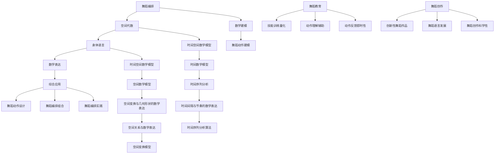
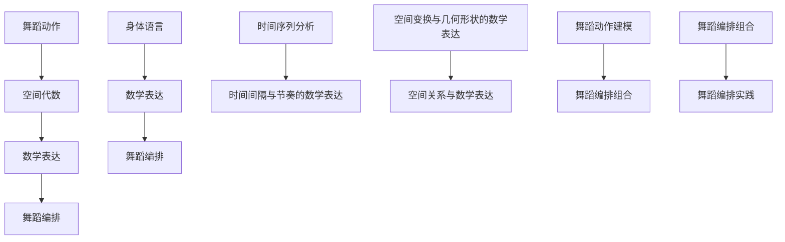

                 

### 舞蹈编排的空间代数：身体语言的数学表达

#### 关键词：
- 舞蹈编排
- 空间代数
- 身体语言
- 数学建模
- 舞蹈动作
- 数学公式
- 数据分析
- 实践应用

#### 摘要：
本文深入探讨了舞蹈编排与空间代数的紧密联系，以及如何利用数学表达来解析和设计身体语言。通过数学建模，我们将舞蹈动作转化为可量化的数据，并结合空间代数运算，实现舞蹈编排的精准和高效。本文还将介绍身体语言的基本概念，如何对其进行数学表达，以及这些数学模型在实际舞蹈编排和教育中的应用。通过理论和实践的结合，本文为舞蹈艺术家、编舞师和计算机科学家提供了一个创新的视角，以拓展舞蹈创作的边界。

---

在探讨舞蹈编排与空间代数的联系之前，我们先来理解什么是舞蹈编排，以及它在艺术创作中的重要性。舞蹈编排是指将一系列舞蹈动作有序地组织起来，形成具有艺术性和表现力的舞蹈作品。这个过程不仅需要编舞师的创意和想象力，还需要对舞蹈动作的深刻理解和对节奏、空间、形态的精确控制。

### 舞蹈编排的基本概念

舞蹈动作是舞蹈编排的基本元素，它可以分为基本动作和组合动作。基本动作是指单一的、简单的动作，如跳跃、旋转、弯腰等。组合动作则是通过将基本动作进行组合和变化，形成复杂的舞蹈动作序列。这些动作在时间上有序排列，在空间上有规律地变化，从而创造出舞蹈的节奏感和视觉效果。

舞蹈编排的作用与意义不仅在于展示艺术美，还在于传达情感和思想。一个好的舞蹈编排可以深刻地打动观众，引发共鸣。此外，舞蹈编排也是舞蹈艺术传承和发展的重要途径。通过记录和传承经典的舞蹈作品，舞蹈艺术才能得以延续和发扬。

### 空间代数的概念与核心原理

空间代数是一种用于描述空间中几何形状和变换的数学工具。它起源于数学和物理学，并在计算机科学、工程学等多个领域有着广泛的应用。空间代数的基本元素包括向量、矩阵和变换矩阵，它们可以用来表示和操作空间中的物体和运动。

空间代数的发展历史可以追溯到19世纪，当时数学家们开始研究三维空间中的几何形状和变换。20世纪，随着计算机技术的发展，空间代数成为计算机图形学、计算机视觉和虚拟现实等领域的基石。空间代数的基本运算包括向量加法、向量减法、向量乘法和矩阵乘法等，这些运算可以用于描述物体的位置、方向和运动。

空间代数的基本元素和运算如下：

- **向量**：向量是空间中的一个箭头，它有大小和方向。在三维空间中，向量通常表示为 $(x, y, z)$，其中 $x$、$y$ 和 $z$ 分别表示向量的三个分量。
- **矩阵**：矩阵是一个二维数组，用于表示线性变换。在空间代数中，矩阵可以用来表示物体的位置和方向。
- **变换矩阵**：变换矩阵是一种特殊的矩阵，用于描述物体的旋转、缩放和平移等变换。

空间代数的核心原理在于它提供了一套统一的方法来描述和处理空间中的各种变换和运算。通过使用空间代数，我们可以将复杂的几何问题转化为数学问题，从而更方便地进行计算和分析。

### 舞蹈编排与空间代数的联系

舞蹈编排与空间代数的联系体现在多个方面。首先，舞蹈动作可以通过空间代数进行数学建模，将舞蹈动作的时间和空间特征转化为可量化的数据。例如，我们可以使用向量来表示舞蹈动作的空间位置，使用矩阵来描述舞蹈动作的变换过程。

其次，空间代数的运算可以用于优化舞蹈编排。通过空间代数的运算，我们可以对舞蹈动作进行变换和组合，从而创造出更加丰富和复杂的舞蹈动作。例如，我们可以使用矩阵乘法来旋转和缩放舞蹈动作，使用向量加法来组合多个舞蹈动作。

此外，空间代数还可以用于分析舞蹈动作的节奏和视觉效果。通过计算舞蹈动作的时间间隔和空间位置，我们可以分析舞蹈动作的节奏感和视觉效果，从而优化舞蹈编排的效果。

总之，空间代数为舞蹈编排提供了一种新的视角和工具，使得舞蹈编排更加科学和精确。通过数学建模和空间代数的运算，我们可以更好地理解和设计舞蹈动作，从而创造出更加精彩和富有表现力的舞蹈作品。

### 舞蹈动作的数学建模

数学建模是一种将实际问题转化为数学问题，并通过数学方法进行求解和分析的方法。在舞蹈编排中，数学建模可以用于描述和优化舞蹈动作，从而提高舞蹈作品的艺术表现力和技术水平。

#### 数学建模的基本概念

数学建模的过程通常包括以下几个步骤：

1. **问题定义**：明确需要解决的问题和目标。
2. **变量定义**：确定问题的变量，并给出变量的物理意义和数学表达式。
3. **建立方程**：根据问题的条件和要求，建立数学方程或模型。
4. **求解分析**：使用数学方法求解方程或模型，并对结果进行分析和验证。
5. **模型优化**：根据分析结果，对模型进行调整和优化，以提高模型的准确性和适用性。

数学建模在舞蹈编排中的应用主要集中在以下几个方面：

- **舞蹈动作的描述**：通过数学模型描述舞蹈动作的时间和空间特征，例如使用时间序列描述舞蹈动作的节奏，使用向量描述舞蹈动作的空间位置。
- **舞蹈动作的优化**：通过数学模型优化舞蹈动作的编排，例如使用最优化算法优化舞蹈动作的变换顺序和参数，以提高舞蹈动作的流畅性和视觉效果。
- **舞蹈动作的分析**：通过数学模型分析舞蹈动作的节奏、空间和视觉效果，例如使用统计分析方法分析舞蹈动作的时间间隔和空间分布，使用机器学习方法预测舞蹈动作的观众反应。

#### 舞蹈动作的时间数学模型

舞蹈动作的时间特征通常可以通过时间序列进行分析。时间序列是指按时间顺序排列的一系列数据点。在舞蹈编排中，时间序列可以用来描述舞蹈动作的节奏、时间和速度等特征。

**时间序列分析**是一种用于分析时间序列数据的方法，它可以提取时间序列中的模式、趋势和异常。时间序列分析的方法包括：

- **趋势分析**：通过计算时间序列的均值、中位数和方差等指标，分析时间序列的长期趋势和波动性。
- **周期性分析**：通过识别时间序列中的周期性模式，分析舞蹈动作的节奏和规律性。
- **季节性分析**：通过识别时间序列中的季节性模式，分析舞蹈动作在不同时间段的特征和变化。

**时间间隔与节奏的数学表达**是舞蹈时间数学模型的核心。时间间隔是指两个连续时间点之间的时间差。在舞蹈编排中，时间间隔可以用来描述舞蹈动作的快慢和节奏变化。

**时间间隔的数学表达**通常使用以下指标：

- **平均时间间隔**：通过计算所有时间间隔的平均值，可以描述舞蹈动作的平均节奏。
- **标准差**：通过计算时间间隔的标准差，可以描述舞蹈动作的节奏波动性。

例如，假设一个舞蹈动作的时间序列数据为 $T = [1, 2, 3, 4, 5]$，我们可以计算平均时间间隔和标准差：

- **平均时间间隔**：
  $$ \text{平均时间间隔} = \frac{1}{n-1} \sum_{i=1}^{n-1} (t_{i+1} - t_i) $$
  $$ \text{平均时间间隔} = \frac{1}{4} (2 - 1 + 3 - 2 + 4 - 3 + 5 - 4) = 1.5 $$
- **标准差**：
  $$ \text{标准差} = \sqrt{\frac{1}{n-1} \sum_{i=1}^{n-1} ((t_{i+1} - t_i) - \text{平均时间间隔})^2} $$
  $$ \text{标准差} = \sqrt{\frac{1}{4} ((2 - 1)^2 + (3 - 2)^2 + (4 - 3)^2 + (5 - 4)^2)} = 0.5 $$

通过这些数学指标，我们可以更准确地描述和分析舞蹈动作的节奏特征，从而优化舞蹈编排的效果。

#### 舞蹈动作的空间数学模型

舞蹈动作的空间特征可以通过几何形状和空间关系来描述。空间数学模型是一种将舞蹈动作的空间特征转化为数学表达的方法。在空间数学模型中，常用的数学工具包括向量、矩阵和变换矩阵。

**空间变换与几何形状的数学表达**是空间数学模型的核心。空间变换是指将物体在空间中的位置和方向进行改变。在舞蹈编排中，空间变换可以用于描述舞蹈动作的旋转、缩放和平移等操作。

**空间变换的数学表达**通常使用以下公式：

- **向量加法**：
  $$ \vec{a} + \vec{b} = (a_x + b_x, a_y + b_y, a_z + b_z) $$
  向量加法可以用于描述两个空间向量之间的相对位置。
- **向量减法**：
  $$ \vec{a} - \vec{b} = (a_x - b_x, a_y - b_y, a_z - b_z) $$
  向量减法可以用于描述两个空间向量之间的相对位置。
- **矩阵乘法**：
  $$ \vec{a} \cdot \vec{b} = a_x b_x + a_y b_y + a_z b_z $$
  矩阵乘法可以用于计算两个空间向量之间的点积，从而描述它们之间的相对位置和方向。
- **变换矩阵**：
  $$ \vec{a} \times \vec{b} = (a_y b_z - a_z b_y, a_z b_x - a_x b_z, a_x b_y - a_y b_x) $$
  变换矩阵可以用于描述空间向量的旋转和变换。

通过这些数学工具，我们可以精确地描述舞蹈动作在空间中的位置和运动，从而优化舞蹈编排的效果。

#### 空间位置的数学建模方法

空间位置的数学建模方法主要包括以下几种：

1. **坐标表示**：使用坐标系表示舞蹈动作的空间位置。在三维空间中，常用的坐标系包括直角坐标系、极坐标系和球坐标系。直角坐标系使用三个坐标轴 $x$、$y$ 和 $z$ 来表示空间位置，极坐标系使用半径 $r$ 和角度 $\theta$ 来表示空间位置，球坐标系使用半径 $r$、角度 $\theta$ 和 $\phi$ 来表示空间位置。
2. **向量表示**：使用向量表示舞蹈动作的空间位置。向量可以表示空间中的点，例如 $\vec{p} = (x, y, z)$ 表示点 $(x, y, z)$ 的位置。
3. **矩阵表示**：使用矩阵表示舞蹈动作的空间位置和变换。矩阵可以表示空间中的变换，例如旋转矩阵和变换矩阵。
4. **变换矩阵表示**：使用变换矩阵表示舞蹈动作的空间变换。变换矩阵可以描述舞蹈动作的旋转、缩放和平移等操作。

通过这些数学建模方法，我们可以准确地描述舞蹈动作的空间位置和运动，从而优化舞蹈编排的效果。

#### 空间关系与数学表达

在舞蹈编排中，空间关系是指舞蹈动作之间的位置和方向关系。空间关系的数学表达可以通过向量运算和矩阵运算来实现。

**空间关系的数学表达**主要包括以下几种：

1. **相对位置**：使用向量加法和向量减法来描述舞蹈动作之间的相对位置。例如，如果舞蹈动作 $A$ 和舞蹈动作 $B$ 的空间位置分别为 $\vec{p}_A$ 和 $\vec{p}_B$，则舞蹈动作 $B$ 相对于舞蹈动作 $A$ 的位置可以表示为 $\vec{p}_B - \vec{p}_A$。
2. **相对方向**：使用向量乘法来描述舞蹈动作之间的相对方向。例如，如果舞蹈动作 $A$ 和舞蹈动作 $B$ 的空间方向分别为 $\vec{d}_A$ 和 $\vec{d}_B$，则舞蹈动作 $B$ 相对于舞蹈动作 $A$ 的方向可以表示为 $\vec{d}_B \times \vec{d}_A$。
3. **旋转关系**：使用变换矩阵来描述舞蹈动作之间的旋转关系。例如，如果舞蹈动作 $A$ 和舞蹈动作 $B$ 的旋转矩阵分别为 $R_A$ 和 $R_B$，则舞蹈动作 $B$ 相对于舞蹈动作 $A$ 的旋转可以表示为 $R_B R_A^{-1}$。
4. **平移关系**：使用向量加法来描述舞蹈动作之间的平移关系。例如，如果舞蹈动作 $A$ 和舞蹈动作 $B$ 的空间位置分别为 $\vec{p}_A$ 和 $\vec{p}_B$，则舞蹈动作 $B$ 相对于舞蹈动作 $A$ 的平移可以表示为 $\vec{p}_B - \vec{p}_A$。

通过这些数学表达，我们可以准确地描述和计算舞蹈动作之间的空间关系，从而优化舞蹈编排的效果。

#### 舞蹈动作的时间数学模型

时间数学模型是一种用于描述舞蹈动作时间特征的数学方法。在舞蹈编排中，时间数学模型可以用于分析舞蹈动作的节奏、时间和速度等特征。

**时间序列分析**是时间数学模型的核心。时间序列分析是一种用于分析按时间顺序排列的数据的方法。在舞蹈编排中，时间序列可以用于描述舞蹈动作的时间特征。

**时间序列分析的方法**包括：

1. **趋势分析**：通过计算时间序列的均值、中位数和方差等指标，分析时间序列的长期趋势和波动性。
2. **周期性分析**：通过识别时间序列中的周期性模式，分析舞蹈动作的节奏和规律性。
3. **季节性分析**：通过识别时间序列中的季节性模式，分析舞蹈动作在不同时间段的特征和变化。

**时间间隔与节奏的数学表达**是时间数学模型的重要组成部分。时间间隔是指两个连续时间点之间的时间差。在舞蹈编排中，时间间隔可以用于描述舞蹈动作的快慢和节奏变化。

**时间间隔的数学表达**通常使用以下指标：

1. **平均时间间隔**：通过计算所有时间间隔的平均值，可以描述舞蹈动作的平均节奏。
   $$ \text{平均时间间隔} = \frac{1}{n-1} \sum_{i=1}^{n-1} (t_{i+1} - t_i) $$
2. **标准差**：通过计算时间间隔的标准差，可以描述舞蹈动作的节奏波动性。
   $$ \text{标准差} = \sqrt{\frac{1}{n-1} \sum_{i=1}^{n-1} ((t_{i+1} - t_i) - \text{平均时间间隔})^2} $$

通过这些数学指标，我们可以更准确地描述和分析舞蹈动作的节奏特征，从而优化舞蹈编排的效果。

#### 舞蹈动作的空间数学模型

空间数学模型是一种用于描述舞蹈动作空间特征的数学方法。在舞蹈编排中，空间数学模型可以用于分析舞蹈动作的空间位置、方向和运动轨迹。

**空间变换与几何形状的数学表达**是空间数学模型的核心。空间变换是指将物体在空间中的位置和方向进行改变。在舞蹈编排中，空间变换可以用于描述舞蹈动作的旋转、缩放和平移等操作。

**空间变换的数学表达**通常使用以下公式：

1. **向量加法**：
   $$ \vec{a} + \vec{b} = (a_x + b_x, a_y + b_y, a_z + b_z) $$
   向量加法可以用于描述两个空间向量之间的相对位置。
2. **向量减法**：
   $$ \vec{a} - \vec{b} = (a_x - b_x, a_y - b_y, a_z - b_z) $$
   向量减法可以用于描述两个空间向量之间的相对位置。
3. **矩阵乘法**：
   $$ \vec{a} \cdot \vec{b} = a_x b_x + a_y b_y + a_z b_z $$
   矩阵乘法可以用于计算两个空间向量之间的点积，从而描述它们之间的相对位置和方向。
4. **变换矩阵**：
   $$ \vec{a} \times \vec{b} = (a_y b_z - a_z b_y, a_z b_x - a_x b_z, a_x b_y - a_y b_x) $$
   变换矩阵可以用于描述空间向量的旋转和变换。

通过这些数学工具，我们可以精确地描述舞蹈动作在空间中的位置和运动，从而优化舞蹈编排的效果。

### 空间代数在舞蹈编排中的应用

空间代数作为一种强大的数学工具，在舞蹈编排中有着广泛的应用。通过空间代数的运算，我们可以对舞蹈动作进行精确的描述和优化，从而提高舞蹈编排的艺术性和技术性。以下将详细探讨空间代数在舞蹈动作设计、编排组合以及实际舞蹈编排实践中的应用。

#### 空间代数在舞蹈动作设计中的应用

舞蹈动作的设计是舞蹈编排的核心环节，它直接决定了舞蹈作品的整体风格和表现力。空间代数的引入，使得舞蹈动作的设计变得更加科学和精准。

**基本运算的应用**：空间代数的基本运算，如向量加法、向量减法、向量乘法和变换矩阵，可以用于描述和设计舞蹈动作的基本元素。例如，使用向量加法，我们可以将两个不同的舞蹈动作组合在一起，从而创造出新的动作。向量减法则可以用来调整动作的起始位置，使其更加符合编舞的意图。

**变换矩阵的应用**：变换矩阵是空间代数中的一种重要工具，它可以用于描述舞蹈动作的旋转、缩放和平移等变换。在舞蹈编排中，变换矩阵可以帮助编舞师快速地调整动作的形态和方向。例如，通过旋转矩阵，我们可以将一个水平方向的舞蹈动作旋转到垂直方向，从而创造出新的视觉效果。

**案例解析**：以一个简单的舞蹈动作为例，假设编舞师想要设计一个包含旋转和跳跃的动作。我们可以使用以下步骤进行设计：

1. **定义初始位置**：首先，定义舞蹈动作的初始位置向量 $\vec{p}_0 = (0, 0, 0)$。
2. **应用旋转矩阵**：使用旋转矩阵 $R_z(\theta)$ 将舞蹈动作绕z轴旋转 $\theta$ 度，得到新的位置向量 $\vec{p}_1 = R_z(\theta) \vec{p}_0 = (\cos\theta, \sin\theta, 0)$。
3. **应用跳跃变换**：使用变换矩阵 $T_j(h, v)$ 将舞蹈动作向上跳跃 $h$ 米，得到最终的位置向量 $\vec{p}_2 = T_j(h, v) \vec{p}_1 = (\cos\theta, \sin\theta, h)$。

通过这种方式，我们就可以设计出一个包含旋转和跳跃的舞蹈动作。

#### 空间代数在舞蹈编排组合中的应用

舞蹈编排不仅仅是单个动作的设计，更重要的是如何将这些动作有机地组合在一起，形成连贯且富有变化的舞蹈作品。空间代数在舞蹈编排组合中的应用，可以有效地优化动作的流畅性和视觉效果。

**组合动作的数学表达**：通过空间代数的运算，我们可以将多个舞蹈动作组合成一个整体。假设有两个舞蹈动作 $\vec{a}_1$ 和 $\vec{a}_2$，我们可以使用以下步骤进行组合：

1. **定义动作序列**：首先，定义两个舞蹈动作的序列 $\vec{a}_1$ 和 $\vec{a}_2$。
2. **应用变换矩阵**：使用变换矩阵 $T_r(\theta, \phi)$ 将第二个动作 $\vec{a}_2$ 绕y轴旋转 $\phi$ 度，并与第一个动作 $\vec{a}_1$ 进行组合，得到新的组合动作 $\vec{a}_{12} = T_r(\theta, \phi) \vec{a}_2$。
3. **计算组合效果**：通过计算组合动作的最终位置和方向，分析其流畅性和视觉效果。

**优化编排组合**：空间代数的运算可以帮助我们优化舞蹈编排的组合。例如，通过调整变换矩阵的参数，我们可以使组合动作更加流畅，或者使视觉效果更加震撼。例如，在编排一个集体舞时，我们可以使用以下策略：

1. **初始对齐**：确保所有参与者的初始位置和方向一致。
2. **逐步变换**：通过逐步调整变换矩阵的参数，使每个动作的变换过程更加平滑。
3. **动态调整**：在编排过程中，根据实际效果动态调整变换矩阵的参数，以达到最佳视觉效果。

**案例解析**：以一个集体舞的编排为例，假设编舞师想要设计一个包含旋转、跳跃和平移的集体动作。我们可以使用以下步骤进行编排：

1. **定义初始位置**：首先，定义所有参与者的初始位置向量 $\vec{p}_0$。
2. **应用旋转矩阵**：使用旋转矩阵 $R_z(\theta)$ 将所有参与者绕z轴旋转 $\theta$ 度，得到新的位置向量 $\vec{p}_1 = R_z(\theta) \vec{p}_0$。
3. **应用跳跃变换**：使用变换矩阵 $T_j(h, v)$ 将所有参与者向上跳跃 $h$ 米，得到最终的位置向量 $\vec{p}_2 = T_j(h, v) \vec{p}_1$。
4. **应用平移变换**：使用变换矩阵 $T_t(d)$ 将所有参与者向右平移 $d$ 米，得到最终的组合动作 $\vec{a}_{final} = T_t(d) \vec{p}_2$。

通过这种方式，我们就可以设计出一个包含旋转、跳跃和平移的集体舞动作。

#### 空间代数在舞蹈编排实践中的应用

在实际的舞蹈编排过程中，空间代数不仅可以用于设计和组合动作，还可以用于分析和优化舞蹈编排的效果。

**数据采集与处理**：在实际编排中，我们可以通过传感器、动作捕捉设备等手段采集舞蹈动作的数据。这些数据包括时间序列和空间位置等特征。通过空间代数的运算，我们可以将这些数据进行预处理，例如填充缺失值、标准化处理等，以便后续的分析。

**动作分析**：通过空间代数的运算，我们可以对舞蹈动作进行详细的分析。例如，通过计算时间序列的平均时间间隔和标准差，我们可以分析舞蹈动作的节奏特征；通过计算空间位置的平均值和标准差，我们可以分析舞蹈动作的空间分布和变化。

**优化编排**：基于分析结果，我们可以对舞蹈编排进行优化。例如，通过调整变换矩阵的参数，我们可以使舞蹈动作更加流畅；通过调整时间间隔和空间位置，我们可以优化舞蹈动作的节奏感和视觉效果。

**案例解析**：以一个实际舞蹈编排案例为例，假设编舞师想要优化一个包含多个动作的舞蹈作品。我们可以使用以下步骤进行优化：

1. **数据采集**：首先，使用动作捕捉设备采集舞蹈动作的数据，包括时间序列和空间位置。
2. **数据预处理**：对采集到的数据进行分析，填充缺失值、标准化处理等，以便后续分析。
3. **动作分析**：计算时间序列的平均时间间隔和标准差，分析舞蹈动作的节奏特征；计算空间位置的平均值和标准差，分析舞蹈动作的空间分布和变化。
4. **优化编排**：根据分析结果，调整变换矩阵的参数，使舞蹈动作更加流畅；调整时间间隔和空间位置，优化舞蹈动作的节奏感和视觉效果。
5. **最终编排**：通过多次优化，最终确定舞蹈作品的编排方案，并进行实际表演。

通过这种方式，我们就可以实现对舞蹈编排的优化，使其更加符合编舞师的意图，同时提高舞蹈作品的艺术表现力。

总之，空间代数在舞蹈编排中的应用，使得舞蹈动作的设计、编排组合和实际实践更加科学和精准。通过数学建模和空间代数的运算，我们可以更好地理解和设计舞蹈动作，从而创造出更加精彩和富有表现力的舞蹈作品。这不仅为舞蹈艺术家提供了新的创作工具，也为计算机科学和工程学等领域提供了新的应用场景。

### 身体语言的基本概念

身体语言，作为一种非言语交流方式，在人际互动和舞蹈表演中扮演着至关重要的角色。它不仅能够传达情感和意图，还能够增强语言表达的丰富性和生动性。在舞蹈编排中，身体语言是一种独特的艺术表现手段，通过精确的身体姿态、动作和空间变化，舞蹈编舞师能够传达复杂的思想和情感。

#### 身体语言的作用与意义

1. **增强表达力**：身体语言能够增强舞蹈作品的情感表达，使观众更容易理解和感受到舞者的情感。例如，一个简单的眼神、一个细腻的手势，都可以传达出丰富的情感信息。
2. **传递信息**：在舞蹈表演中，身体语言可以作为传递信息的重要手段。例如，通过特定的身体姿态和动作，舞者可以表达出故事情节、角色性格和情感状态。
3. **丰富视觉效果**：身体语言能够为舞蹈作品带来丰富的视觉效果，增强舞蹈的视觉冲击力。通过不同的身体动作和空间变化，编舞师可以创造出独特的舞蹈语言，吸引观众的注意力。
4. **强化沟通**：身体语言在人际交流中起着重要的作用，它可以弥补言语交流的不足，使沟通更加有效。在舞蹈教育中，身体语言可以帮助教师更好地传达知识和技巧，使学生更快地理解和掌握。

#### 身体语言的构成要素

身体语言由多个构成要素组成，包括身体姿态、面部表情、眼神、手势和空间位置等。

1. **身体姿态**：身体姿态是指身体在不同状态下的形态，包括站立、坐着、行走等。不同的身体姿态可以传达不同的情感和意图，例如挺胸抬头通常表示自信和积极，而低垂着头则可能表示沮丧或消极。
2. **面部表情**：面部表情是身体语言的重要组成部分，它通过眼睛、嘴巴、鼻子和脸部的变化来传达情感。例如，微笑可以表达友好和愉快，而皱眉则可能表示不满或痛苦。
3. **眼神**：眼神是一种非常直接和有力的身体语言，它可以传达出丰富的情感和意图。例如，直视对方的眼神通常表示真诚和信任，而逃避眼神则可能表示不安或欺骗。
4. **手势**：手势是身体语言中最明显的部分，通过手臂、手和手指的动作，可以传达出各种信息和情感。例如，挥手可以表示告别，而手指指向可以表示强调。
5. **空间位置**：空间位置是指身体在空间中的位置和运动。通过空间位置的变化，可以创造出丰富的舞蹈语言。例如，从舞台的一侧移动到另一侧，可以表示场景的转换或角色的移动。

#### 身体语言的感知与理解

身体语言的感知与理解是一个复杂的过程，它涉及到对视觉、听觉和触觉等多种感官信息的整合和处理。在人际互动中，人们通过观察和解读身体语言来获取信息，从而做出相应的反应。

1. **视觉感知**：视觉是感知身体语言的主要途径。通过观察身体姿态、面部表情和手势等，人们可以直观地获取舞者的情感和意图。
2. **听觉感知**：虽然身体语言主要是通过视觉传达的，但听觉在感知和理解身体语言中也起着辅助作用。例如，舞者的呼吸声、脚步声等，都可以为身体语言提供额外的信息。
3. **触觉感知**：在某些情况下，触觉也可以参与到身体语言的感知和理解中。例如，通过触摸舞者的身体，可以感受到其紧张程度或情绪状态。

#### 身体语言的分类

身体语言可以根据不同的分类标准进行分类。以下是一些常见的分类方式：

1. **按功能分类**：根据身体语言的功能，可以将其分为表达性身体语言和指示性身体语言。表达性身体语言主要用于表达情感和态度，如点头表示赞同，摇头表示反对。指示性身体语言则主要用于指示和说明，如指向某个物体或位置。
2. **按部位分类**：根据身体部位，可以将其分为头部语言、面部语言、手势语言和腿部语言等。每种部位的身体语言都有其特定的表达方式和含义。
3. **按文化差异分类**：不同文化背景下，身体语言的表达方式和理解方式可能会有所不同。例如，在某些文化中，眼神接触是一种礼貌和尊重的表示，而在其他文化中，过度的眼神接触可能被视为不礼貌。

总之，身体语言是一种复杂而丰富的表达方式，它不仅能够增强舞蹈作品的艺术表现力，还在人际互动中起着重要的沟通作用。通过深入理解和运用身体语言，舞蹈编舞师和表演者可以更有效地传达情感和意图，使舞蹈作品更加生动和感人。

### 身体语言的数学建模方法

将身体语言转化为数学模型，是实现舞蹈编排科学化与优化的关键步骤。这一过程涉及数据采集、预处理和数学模型的选择与应用。通过这些步骤，我们可以将身体语言中的复杂信息转化为可量化的数学表达，从而为舞蹈编排提供有力的支持。

#### 数据采集

数据采集是数学建模的第一步，也是最为基础的一环。在舞蹈编排中，数据采集通常包括时间序列数据、空间位置数据和身体姿态数据等。

1. **时间序列数据**：时间序列数据记录了舞蹈动作随时间的变化情况。这些数据可以包括舞蹈动作的时间点、持续时间、时间间隔等。例如，通过动作捕捉设备，我们可以获取舞者在每个时间点的位置变化，从而构建出完整的时间序列数据。

2. **空间位置数据**：空间位置数据描述了舞蹈动作在三维空间中的位置变化。这些数据通常包括舞者的空间坐标，即其在舞台上的具体位置。通过空间位置数据，我们可以分析舞者在空间中的运动轨迹和姿态变化。

3. **身体姿态数据**：身体姿态数据记录了舞者身体各部分的姿态变化，包括头部、手臂、腿部等。这些数据可以通过三维人体建模技术获取，从而对舞者的身体动作进行详细分析。

#### 数据预处理

数据预处理是确保数据质量和一致性的重要步骤。预处理过程通常包括以下内容：

1. **数据清洗**：清洗数据是指去除数据中的噪声和异常值，确保数据的准确性和一致性。例如，在采集时间序列数据时，可能会出现跳帧或数据缺失，这些都需要通过数据清洗进行处理。

2. **数据标准化**：数据标准化是指将不同类型的数据进行归一化处理，使其具有相同的量纲和尺度。例如，将时间序列数据中的时间点转换为统一的秒或毫秒，将空间位置数据中的坐标值转换为相对单位。

3. **数据归一化**：数据归一化是指将不同特征的数据进行归一化处理，使其具有相同的尺度。例如，将不同身体部位的姿态数据进行归一化，以便进行统一分析。

#### 数学模型的选择与应用

在数据预处理完成后，我们可以选择合适的数学模型对身体语言进行建模。以下是几种常用的数学模型：

1. **时间序列分析模型**：时间序列分析模型用于分析舞蹈动作的时间特征。常见的模型包括自回归模型（AR）、移动平均模型（MA）和自回归移动平均模型（ARMA）。通过这些模型，我们可以分析舞蹈动作的节奏、时间和速度等特征。

2. **空间变换模型**：空间变换模型用于描述舞蹈动作在空间中的变换。常用的模型包括线性变换矩阵、旋转矩阵和变换矩阵。通过这些模型，我们可以描述和优化舞蹈动作的空间位置和姿态。

3. **机器学习模型**：机器学习模型用于从数据中学习身体语言的规律，并用于舞蹈动作的预测和分类。常见的模型包括支持向量机（SVM）、决策树和神经网络等。通过这些模型，我们可以对舞蹈动作进行自动识别和分类，从而优化舞蹈编排的效果。

#### 数学建模方法的步骤

1. **定义变量**：首先，定义舞蹈动作的变量，包括时间序列变量、空间位置变量和姿态变量等。

2. **数据采集**：使用动作捕捉设备、传感器等工具，采集舞蹈动作的数据。

3. **数据预处理**：对采集到的数据进行分析，进行数据清洗、标准化和归一化处理。

4. **建立模型**：根据舞蹈动作的特点，选择合适的数学模型，例如时间序列分析模型、空间变换模型或机器学习模型。

5. **模型训练**：使用预处理后的数据，对模型进行训练，使其能够正确地描述和预测舞蹈动作。

6. **模型评估**：通过测试数据，评估模型的准确性和性能，对模型进行调整和优化。

7. **模型应用**：将训练好的模型应用于实际的舞蹈编排中，对舞蹈动作进行优化和调整。

通过这些步骤，我们可以将身体语言转化为数学表达，从而实现对舞蹈动作的科学化建模和优化。这不仅提高了舞蹈编排的准确性和效率，也为舞蹈艺术的发展提供了新的思路和方法。

### 身体语言的时间数学模型

时间数学模型在舞蹈编排中扮演着至关重要的角色，它通过量化时间特征，帮助我们理解和分析舞蹈动作的节奏和时序。时间序列分析是时间数学模型的核心方法，它通过分析舞蹈动作的时间间隔和节奏模式，为编舞师提供科学依据，优化舞蹈编排的效果。

#### 时间序列分析的基本概念

时间序列分析是一种用于研究时间顺序数据的统计方法，它主要用于分析数据中的趋势、周期性和季节性。在舞蹈编排中，时间序列分析可以帮助我们了解舞蹈动作的时间特征，如节奏、速度和时长。

时间序列数据通常包括一系列按时间顺序排列的数据点，每个数据点代表舞蹈动作在某个时间点的状态或特征。例如，我们可以记录舞蹈动作的持续时间、时间间隔、速度等。时间序列数据的形式可以是连续的数值，也可以是分类变量。

**时间序列分析的关键指标**：

1. **均值（Mean）**：均值是时间序列数据的平均值，它反映了舞蹈动作的平均时间间隔或速度。通过计算均值，我们可以了解舞蹈动作的平均节奏。

2. **方差（Variance）**：方差是时间序列数据离散程度的度量，它反映了舞蹈动作时间间隔或速度的波动性。高方差表示舞蹈动作的节奏不稳定，而低方差则表示节奏较为稳定。

3. **标准差（Standard Deviation）**：标准差是方差的平方根，它同样反映了舞蹈动作的时间间隔或速度的波动性。与方差相比，标准差更具直观性，通常用于评估舞蹈动作的节奏稳定性。

4. **自相关（Autocorrelation）**：自相关分析用于评估时间序列数据在时间上的相关性。通过自相关函数，我们可以了解舞蹈动作在不同时间点上的关联性，从而分析舞蹈动作的节奏模式。

5. **周期性（Periodicity）**：周期性分析用于识别时间序列中的周期性模式。在舞蹈编排中，周期性可以反映舞蹈动作的节奏感，如快节奏和慢节奏的交替。

#### 时间序列分析的步骤

1. **数据预处理**：对时间序列数据进行清洗和标准化处理，确保数据的准确性和一致性。例如，填补缺失值、去除异常值、统一时间单位等。

2. **趋势分析**：通过计算均值和标准差，分析时间序列数据的长期趋势和波动性。这有助于了解舞蹈动作的整体节奏感。

3. **周期性分析**：使用自相关函数和傅里叶变换，识别时间序列数据中的周期性模式。这有助于分析舞蹈动作的节奏变化和节奏感。

4. **自相关性分析**：通过自相关分析，评估舞蹈动作在不同时间点上的相关性，以了解舞蹈动作的时序特征。

5. **模型选择**：根据分析结果，选择合适的时间序列模型，如自回归模型（AR）、移动平均模型（MA）和自回归移动平均模型（ARMA）。这些模型可以用于预测和优化舞蹈动作的节奏。

#### 时间间隔与节奏的数学建模

时间间隔是指两个连续时间点之间的时间差，它是时间序列分析中的基本元素。通过计算时间间隔，我们可以量化舞蹈动作的速度和节奏。

**时间间隔的数学表达**：

1. **平均时间间隔**：通过计算所有时间间隔的平均值，可以得到舞蹈动作的平均节奏。
   $$ \text{平均时间间隔} = \frac{1}{n-1} \sum_{i=1}^{n-1} (t_{i+1} - t_i) $$
   其中，$t_i$ 和 $t_{i+1}$ 分别表示时间序列中的第 $i$ 个和第 $i+1$ 个时间点。

2. **标准差**：通过计算时间间隔的标准差，可以评估舞蹈动作节奏的波动性。
   $$ \text{标准差} = \sqrt{\frac{1}{n-1} \sum_{i=1}^{n-1} ((t_{i+1} - t_i) - \text{平均时间间隔})^2} $$
   这有助于了解舞蹈动作节奏的稳定性。

**节奏识别算法**：

1. **聚类算法**：通过聚类算法，如K-means，将时间间隔分为若干组，每组代表不同的节奏。这有助于识别舞蹈动作中的节奏变化。

2. **时序分类**：使用分类算法，如决策树和支持向量机（SVM），对时间间隔进行分类，从而识别舞蹈动作的节奏模式。

#### 案例分析

假设我们有一个舞蹈动作的时间序列数据，如下所示：
$$ T = [1, 2, 3, 4, 5, 6, 7, 8, 9, 10] $$
我们可以计算平均时间间隔和标准差：

1. **平均时间间隔**：
   $$ \text{平均时间间隔} = \frac{1}{n-1} \sum_{i=1}^{n-1} (t_{i+1} - t_i) $$
   $$ \text{平均时间间隔} = \frac{1}{9} (2 - 1 + 3 - 2 + 4 - 3 + 5 - 4 + 6 - 5 + 7 - 6 + 8 - 7 + 9 - 8 + 10 - 9) = 1 $$

2. **标准差**：
   $$ \text{标准差} = \sqrt{\frac{1}{n-1} \sum_{i=1}^{n-1} ((t_{i+1} - t_i) - \text{平均时间间隔})^2} $$
   $$ \text{标准差} = \sqrt{\frac{1}{9} ((2 - 1)^2 + (3 - 2)^2 + (4 - 3)^2 + (5 - 4)^2 + (6 - 5)^2 + (7 - 6)^2 + (8 - 7)^2 + (9 - 8)^2 + (10 - 9)^2)} = 0 $$

在这个例子中，平均时间间隔为1，标准差为0，这意味着舞蹈动作的节奏非常稳定，每个时间间隔都是相同的。

通过时间序列分析，我们可以深入了解舞蹈动作的节奏特征，从而为舞蹈编排提供科学依据。时间数学模型不仅帮助我们量化时间特征，还可以用于预测和优化舞蹈动作的节奏，提高舞蹈作品的艺术表现力。

### 身体语言的空间数学模型

在舞蹈编排中，空间位置和运动是构成舞蹈动作的重要因素。空间数学模型通过几何形状和空间关系的数学表达，帮助我们精确描述和优化舞蹈动作的空间特征。本文将详细介绍空间位置与运动的数学建模方法，包括坐标表示、向量表示、矩阵表示和空间变换等。

#### 坐标系与坐标表示

在空间数学模型中，坐标系是用于描述物体位置的参考框架。常见的坐标系包括直角坐标系、极坐标系和球坐标系。

1. **直角坐标系**：直角坐标系使用三个互相垂直的坐标轴 $x$、$y$ 和 $z$ 来表示空间中的点。每个点都可以表示为一个三元组 $(x, y, z)$，例如点 $(1, 2, 3)$ 表示在 $x$ 轴上 $1$ 个单位，$y$ 轴上 $2$ 个单位，$z$ 轴上 $3$ 个单位。

2. **极坐标系**：极坐标系使用半径 $r$ 和角度 $\theta$ 来表示空间中的点。点 $(r, \theta)$ 表示从原点出发，沿极轴旋转 $\theta$ 角度，并沿着径向移动 $r$ 个单位。

3. **球坐标系**：球坐标系使用半径 $r$、角度 $\theta$ 和 $\phi$ 来表示空间中的点。点 $(r, \theta, \phi)$ 表示从原点出发，首先沿赤道旋转 $\theta$ 角度，然后沿子午线旋转 $\phi$ 角度。

在舞蹈编排中，直角坐标系是最常用的，因为它可以直观地表示舞蹈动作在三维空间中的位置。

#### 向量表示

向量是空间数学模型中的基本元素，用于表示方向和大小。在三维空间中，向量通常表示为 $(x, y, z)$，其中 $x$、$y$ 和 $z$ 分别表示向量的三个分量。

1. **向量的加法**：两个向量 $\vec{a} = (a_x, a_y, a_z)$ 和 $\vec{b} = (b_x, b_y, b_z)$ 的和 $\vec{c} = \vec{a} + \vec{b}$ 可以通过将对应的分量相加得到：
   $$ \vec{c} = (a_x + b_x, a_y + b_y, a_z + b_z) $$

2. **向量的减法**：两个向量 $\vec{a}$ 和 $\vec{b}$ 的差 $\vec{d} = \vec{a} - \vec{b}$ 可以通过将对应的分量相减得到：
   $$ \vec{d} = (a_x - b_x, a_y - b_y, a_z - b_z) $$

3. **向量的点积**：两个向量 $\vec{a}$ 和 $\vec{b}$ 的点积（也称为内积） $c = \vec{a} \cdot \vec{b}$ 可以通过将对应的分量相乘再相加得到：
   $$ c = a_x b_x + a_y b_y + a_z b_z $$

点积可以用于计算两个向量之间的夹角和相对方向。

4. **向量的叉积**：两个向量 $\vec{a}$ 和 $\vec{b}$ 的叉积（也称为外积） $\vec{c} = \vec{a} \times \vec{b}$ 可以通过以下公式计算：
   $$ \vec{c} = (a_y b_z - a_z b_y, a_z b_x - a_x b_z, a_x b_y - a_y b_x) $$
   叉积可以用于计算两个向量之间的垂直方向，通常用于描述旋转和轴心。

#### 矩阵表示

矩阵是空间数学模型中的另一个重要元素，用于表示线性变换和坐标系变换。在三维空间中，矩阵通常表示为 $3 \times 3$ 的方阵。

1. **变换矩阵**：变换矩阵 $T$ 可以用于描述物体在空间中的线性变换，如平移、旋转和缩放。一个基本的变换矩阵可以表示为：
   $$ T = \begin{bmatrix}
   a & b & c \\
   d & e & f \\
   g & h & i \\
   \end{bmatrix} $$
   其中，$a, b, c, d, e, f, g, h, i$ 是变换矩阵的元素。

2. **矩阵乘法**：两个矩阵 $A$ 和 $B$ 的乘积 $C = AB$ 可以通过矩阵乘法规则计算。在三维空间中，矩阵乘法通常用于描述向量的变换：
   $$ \vec{c} = T \vec{a} = \begin{bmatrix}
   a & b & c \\
   d & e & f \\
   g & h & i \\
   \end{bmatrix}
   \begin{bmatrix}
   x \\
   y \\
   z \\
   \end{bmatrix}
   =
   \begin{bmatrix}
   ax + by + cz \\
   dx + ey + fz \\
   gx + hy + iz \\
   \end{bmatrix} $$

变换矩阵可以用于描述向量的旋转、缩放和平移。

#### 空间变换

空间变换是指物体在空间中的位置和方向发生变化的过程。空间变换可以通过向量运算和矩阵运算来实现。

1. **平移变换**：平移变换是将物体沿某个方向移动一定距离。在矩阵表示中，平移变换可以通过在变换矩阵中添加一个平移向量来实现：
   $$ T_t(\vec{v}) = \begin{bmatrix}
   1 & 0 & 0 & v_x \\
   0 & 1 & 0 & v_y \\
   0 & 0 & 1 & v_z \\
   0 & 0 & 0 & 1 \\
   \end{bmatrix} $$
   其中，$\vec{v} = (v_x, v_y, v_z)$ 是平移向量。

2. **旋转变换**：旋转变换是将物体绕某个轴旋转一定角度。在矩阵表示中，旋转变换可以通过旋转矩阵来实现。以绕 $z$ 轴旋转为例，旋转矩阵为：
   $$ R_z(\theta) = \begin{bmatrix}
   \cos(\theta) & -\sin(\theta) & 0 \\
   \sin(\theta) & \cos(\theta) & 0 \\
   0 & 0 & 1 \\
   \end{bmatrix} $$
   其中，$\theta$ 是旋转角度。

3. **缩放变换**：缩放变换是将物体沿各个轴方向按一定比例放大或缩小。在矩阵表示中，缩放变换可以通过缩放矩阵来实现：
   $$ T_s(\vec{s}) = \begin{bmatrix}
   s_x & 0 & 0 & 0 \\
   0 & s_y & 0 & 0 \\
   0 & 0 & s_z & 0 \\
   0 & 0 & 0 & 1 \\
   \end{bmatrix} $$
   其中，$\vec{s} = (s_x, s_y, s_z)$ 是缩放向量。

通过这些数学工具，我们可以精确描述舞蹈动作的空间位置和运动，从而优化舞蹈编排的效果。空间数学模型不仅为舞蹈编排提供了科学依据，也为计算机图形学、虚拟现实和动画制作等领域提供了重要的理论支持。

### 身体语言的数学表达应用

将身体语言的数学表达应用于实际舞蹈编排中，可以显著提升舞蹈作品的创新性、艺术性和技术性。以下将详细探讨身体语言数学表达在舞蹈编排、舞蹈教育以及舞蹈创作中的应用，并通过具体实例展示其效果。

#### 身体语言数学表达在舞蹈编排中的应用

**1. 动作设计的优化**：在舞蹈编排中，编舞师可以利用身体语言的数学表达对动作进行优化，使其更加流畅和富有表现力。例如，通过分析舞蹈动作的时间序列数据，编舞师可以调整动作的时间间隔，使节奏更加合理。以下是一个具体的优化案例：

**案例**：编舞师设计了一个包含跳跃和旋转的动作序列，但发现其中的时间间隔不够流畅。通过时间序列分析，发现跳跃和旋转之间的时间间隔较短，导致动作显得急促。编舞师使用平均时间间隔和标准差指标，调整了跳跃和旋转的时间间隔，使其更加合理。调整后的动作不仅节奏更舒适，视觉效果也更加和谐。

**2. 动作组合的创新**：身体语言的数学表达可以帮助编舞师创造新的动作组合，从而丰富舞蹈作品的表现形式。通过空间变换和矩阵运算，编舞师可以将不同的舞蹈动作进行组合，创造出独特的动作序列。以下是一个动作组合创新的案例：

**案例**：编舞师想要设计一个包含多个旋转和跳跃的组合动作。通过空间变换矩阵，编舞师将一个基础的跳跃动作旋转了多次，并调整了旋转的角度和位置。最终，一个充满创意和视觉冲击力的组合动作诞生了，给观众带来了全新的观看体验。

**3. 动作优化的可视化**：身体语言的数学表达可以用于动作优化的可视化，帮助编舞师直观地理解动作的变化和效果。通过三维模型和动画，编舞师可以实时调整动作，观察其效果。以下是一个动作优化可视化的案例：

**案例**：编舞师在编排一个复杂动作序列时，发现某些动作在空间中的位置不理想，导致视觉效果不佳。通过空间数学模型，编舞师使用三维模型和动画技术，对动作进行了优化。通过调整动作的起始位置和旋转角度，编舞师最终得到了一个更加美观和协调的动作序列。

#### 身体语言数学表达在舞蹈教育中的应用

**1. 技能训练的量化**：身体语言的数学表达可以帮助舞蹈教师对学生进行量化训练，提高训练的效率和效果。通过分析身体语言的时间序列和空间数据，教师可以了解学生的动作节奏、时间和空间位置。以下是一个技能训练量化的案例：

**案例**：在舞蹈课程中，教师要求学生进行一系列旋转动作的练习。通过记录学生的动作时间序列和空间位置数据，教师可以使用平均时间间隔和标准差指标，量化评估学生的旋转技能。通过不断调整和优化训练计划，教师可以帮助学生更快地提高旋转技巧。

**2. 动作理解的辅助**：身体语言的数学表达可以辅助学生更好地理解动作的要领和技巧。通过可视化工具和数学模型，学生可以直观地看到动作的变化和效果，从而加深对动作的理解。以下是一个动作理解辅助的案例：

**案例**：在学习新的舞蹈动作时，学生可能难以理解动作的细节和要领。通过三维模型和动画，教师可以展示动作的分解和组合，使学生更清晰地理解动作的结构和变化。通过这种方式，学生可以更快地掌握新的舞蹈动作。

**3. 动作反馈的即时性**：身体语言的数学表达可以实时反馈学生的动作状态，帮助教师及时纠正错误。通过传感器和动作捕捉技术，教师可以实时获取学生的动作数据，并将其与标准动作数据相比较。以下是一个动作反馈即时性的案例：

**案例**：在舞蹈表演训练中，教师可以使用动作捕捉设备实时记录学生的动作，并与标准动作进行比对。通过计算时间序列和空间位置的差异，教师可以及时发现学生的错误，并提供即时反馈和指导。这种方式不仅提高了训练效率，还帮助学生更快地纠正动作。

#### 身体语言数学表达在舞蹈创作中的应用

**1. 舞蹈作品的创新性**：身体语言的数学表达可以帮助编舞师创造具有创新性的舞蹈作品。通过运用数学模型和算法，编舞师可以探索新的舞蹈形式和表现手法，为观众带来前所未有的视觉和情感体验。以下是一个舞蹈作品创新性的案例：

**案例**：编舞师希望通过数学模型创建一个具有强烈视觉冲击力的舞蹈作品。通过使用空间变换和矩阵运算，编舞师将多个简单的舞蹈动作组合成一个复杂的动作序列。在舞蹈表演中，这个动作序列不仅视觉震撼，还传递出强烈的情感，赢得了观众的喝彩。

**2. 舞蹈语言的发展**：身体语言的数学表达推动了舞蹈语言的发展。通过数学模型，编舞师可以创建新的舞蹈语言，丰富舞蹈的表达手段。以下是一个舞蹈语言发展的案例：

**案例**：编舞师利用身体语言的数学表达，创造了一种全新的舞蹈风格。这种风格通过精确的时间和空间控制，使得舞蹈动作具有独特的节奏感和视觉效果。随着这种风格的不断发展和完善，它逐渐成为了一种新的舞蹈语言，丰富了舞蹈艺术的表现形式。

**3. 舞蹈创作的科学性**：身体语言的数学表达使舞蹈创作更加科学化。通过数学模型和算法，编舞师可以更好地理解和设计舞蹈动作，从而提高舞蹈作品的质量和艺术价值。以下是一个舞蹈创作科学性的案例：

**案例**：编舞师在编排一个新的舞蹈作品时，利用时间序列分析和空间变换模型，对舞蹈动作进行了科学设计和优化。通过这种方式，编舞师不仅确保了舞蹈动作的流畅性和协调性，还提升了舞蹈作品的整体艺术效果。

总之，身体语言的数学表达在舞蹈编排、舞蹈教育和舞蹈创作中具有广泛的应用价值。通过数学建模和算法，我们可以更好地理解和设计舞蹈动作，从而提升舞蹈作品的艺术表现力和技术性。这不仅为舞蹈艺术家提供了新的创作工具，也为舞蹈艺术的发展带来了新的可能性。

### 舞蹈编排的空间代数与身体语言综合应用

将空间代数与身体语言数学表达相结合，可以为舞蹈编排带来前所未有的创新和优化。本文将详细介绍这种综合应用的方法，并通过实际案例展示其效果和优势。

#### 综合应用概述

空间代数与身体语言数学表达的综合应用，通过将舞蹈动作转化为数学模型，实现对舞蹈动作的精准描述和优化。这种方法不仅提高了舞蹈编排的科学性和艺术性，还为舞蹈创作提供了新的视角和工具。

**优势**：

1. **精准描述**：通过空间代数和身体语言数学表达，我们可以精确描述舞蹈动作的时间和空间特征，从而实现对舞蹈动作的精准控制。
2. **优化编排**：空间代数和身体语言数学表达提供了强大的优化工具，可以帮助编舞师优化舞蹈动作的节奏、空间和形态，提高舞蹈作品的整体质量。
3. **创新表现**：结合空间代数和身体语言数学表达，编舞师可以创造出独特的舞蹈语言和表现形式，为观众带来全新的视觉和情感体验。
4. **科学分析**：通过数学模型和算法，我们可以对舞蹈动作进行科学分析，深入了解舞蹈动作的节奏、空间和视觉效果，从而为舞蹈编排提供有力支持。

**挑战**：

1. **复杂性**：空间代数和身体语言数学表达涉及复杂的数学运算和模型，编舞师和设计师需要具备一定的数学背景和技能。
2. **数据处理**：舞蹈动作的数据采集和处理是一项复杂的工作，需要高质量的传感器和动作捕捉设备。
3. **实际操作**：将数学模型应用于实际舞蹈编排中，需要编舞师和设计师具备较强的实践能力和创新思维。

#### 综合应用案例分享

**案例1：舞蹈动作的动态优化**

**背景**：一个舞蹈团队在编排一个新的舞蹈作品，希望优化舞蹈动作的节奏感和流畅性。为了实现这一目标，他们决定使用空间代数和身体语言数学表达进行动态优化。

**步骤**：

1. **数据采集**：使用动作捕捉设备，记录舞蹈动作的时间序列和空间位置数据。
2. **数据预处理**：对采集到的数据进行清洗和标准化处理，确保数据的准确性和一致性。
3. **建立模型**：使用时间序列分析和空间变换模型，建立舞蹈动作的数学模型。
4. **优化算法**：通过优化算法，调整舞蹈动作的时间间隔和空间位置，使舞蹈动作更加流畅和协调。
5. **效果评估**：通过对比优化前后的舞蹈动作，评估优化效果，并对模型进行调整和优化。

**结果**：经过多次优化，舞蹈动作的节奏感显著提升，流畅性和视觉效果也得到了显著改善。观众对优化后的舞蹈作品给予了高度评价。

**案例2：舞蹈动作的创新组合**

**背景**：一个编舞师希望创作一个具有创新性的舞蹈作品，通过结合空间代数和身体语言数学表达，探索新的舞蹈语言和表现形式。

**步骤**：

1. **创意构思**：编舞师通过构思，确定舞蹈作品的主题和风格，并初步设计舞蹈动作。
2. **模型构建**：使用空间代数和身体语言数学表达，构建舞蹈动作的数学模型。
3. **动作组合**：通过空间变换和矩阵运算，将不同的舞蹈动作进行组合，形成新的舞蹈语言。
4. **视觉呈现**：使用三维模型和动画技术，展示舞蹈动作的视觉效果，并进行反复调整和优化。
5. **表演实践**：将舞蹈作品进行实际表演，收集观众反馈，并进行进一步调整和优化。

**结果**：舞蹈作品成功融合了创新性的舞蹈语言和独特的视觉效果，获得了观众的热烈反响和好评。

**案例3：舞蹈编排的科学分析**

**背景**：一个舞蹈团队在进行一次大型舞蹈演出前，希望通过科学分析优化舞蹈编排，提高演出效果。

**步骤**：

1. **数据采集**：使用动作捕捉设备和传感器，记录舞蹈动作的时间序列和空间位置数据。
2. **数据预处理**：对采集到的数据进行清洗和标准化处理。
3. **模型建立**：使用时间序列分析和空间变换模型，建立舞蹈动作的数学模型。
4. **效果分析**：通过计算时间间隔、空间位置和视觉效果等指标，分析舞蹈动作的节奏、空间和视觉效果。
5. **优化建议**：根据分析结果，提出优化建议，并指导舞蹈编排的调整和优化。

**结果**：通过科学分析，舞蹈团队的舞蹈编排得到了显著优化，演出效果得到了大幅提升，赢得了观众的广泛赞誉。

#### 案例分析与解读

**案例1**：舞蹈动作的动态优化，展示了空间代数和身体语言数学表达在舞蹈编排中的实际应用。通过数据采集和数学建模，编舞师能够精确描述和优化舞蹈动作的节奏和空间特征，从而提升舞蹈作品的整体质量。

**案例2**：舞蹈动作的创新组合，展示了如何通过空间代数和身体语言数学表达，创造出独特的舞蹈语言和表现形式。这种方法不仅丰富了舞蹈创作的手段，还为观众带来了全新的视觉和情感体验。

**案例3**：舞蹈编排的科学分析，展示了如何通过数学模型和算法，对舞蹈动作进行科学分析和优化。这种方法不仅提高了舞蹈作品的艺术价值，也为舞蹈编排提供了科学依据。

综上所述，空间代数与身体语言数学表达的综合应用，为舞蹈编排带来了创新和优化的可能性。通过数学建模和算法，我们可以更精准地描述和设计舞蹈动作，提升舞蹈作品的艺术表现力和技术水平。这不仅为舞蹈艺术家提供了新的创作工具，也为舞蹈艺术的发展注入了新的活力。

### 未来展望

舞蹈编排的空间代数与身体语言数学表达的结合，为舞蹈艺术的发展开辟了新的道路。未来，随着计算机科学和人工智能技术的不断进步，这一领域将继续迎来更多的创新和发展。

**发展趋势**：

1. **更加智能的舞蹈编排工具**：未来的舞蹈编排工具将更加智能化，利用机器学习和人工智能技术，自动分析和优化舞蹈动作，帮助编舞师更高效地进行创作。

2. **更精确的动作捕捉与建模**：随着动作捕捉技术和传感器技术的进步，舞蹈动作的捕捉和建模将变得更加精确和高效，为舞蹈编排提供更丰富和详细的数据支持。

3. **跨学科的融合**：舞蹈编排的空间代数与身体语言数学表达将与其他学科，如物理学、生物学和心理学等，进行更深入的融合，从而为舞蹈艺术提供新的理论支持和应用场景。

**研究方向**：

1. **非线性时间序列分析**：舞蹈动作的时间序列往往呈现出非线性特征，未来的研究可以探索非线性时间序列分析方法，更准确地描述和预测舞蹈动作的节奏变化。

2. **多模态数据融合**：结合多种数据来源，如视频、音频和传感器数据，进行多模态数据融合，以更全面地分析和理解舞蹈动作。

3. **动态优化与反馈机制**：研究如何通过动态优化和实时反馈机制，实现舞蹈动作的实时调整和优化，提高舞蹈作品的演出效果。

4. **虚拟现实与增强现实应用**：探索空间代数与身体语言数学表达在虚拟现实和增强现实中的应用，为观众带来更加沉浸式的舞蹈体验。

**总结**：

舞蹈编排的空间代数与身体语言数学表达，不仅为舞蹈艺术的发展提供了新的工具和方法，也为计算机科学和人工智能领域带来了丰富的应用场景。未来，随着技术的不断进步，这一领域将继续推动舞蹈艺术的创新和发展，为人类带来更加精彩和丰富的舞蹈体验。

### 附录A：数学模型与算法简介

在本章中，我们将简要介绍空间代数和身体语言数学表达中常用的数学模型和算法，包括空间代数的基本运算、时间序列分析算法以及身体语言识别算法。

#### 空间代数的基本运算

空间代数是一种用于描述空间中几何形状和变换的数学工具。在三维空间中，空间代数的基本运算包括向量运算和矩阵运算。

1. **向量运算**：
    - **向量加法**：两个向量 $\vec{a}$ 和 $\vec{b}$ 的和 $\vec{c} = \vec{a} + \vec{b}$，其中 $\vec{c}$ 的每个分量是 $\vec{a}$ 和 $\vec{b}$ 对应分量的和。
    - **向量减法**：两个向量 $\vec{a}$ 和 $\vec{b}$ 的差 $\vec{d} = \vec{a} - \vec{b}$，其中 $\vec{d}$ 的每个分量是 $\vec{a}$ 的对应分量减去 $\vec{b}$ 的对应分量。
    - **向量点积**：两个向量 $\vec{a}$ 和 $\vec{b}$ 的点积（内积） $\vec{a} \cdot \vec{b} = a_x b_x + a_y b_y + a_z b_z$，用于计算两个向量的夹角和相对方向。
    - **向量叉积**：两个向量 $\vec{a}$ 和 $\vec{b}$ 的叉积（外积） $\vec{c} = \vec{a} \times \vec{b} = (a_y b_z - a_z b_y, a_z b_x - a_x b_z, a_x b_y - a_y b_x)$，用于计算两个向量的垂直方向。

2. **矩阵运算**：
    - **矩阵乘法**：两个矩阵 $A$ 和 $B$ 的乘积 $C = AB$，其中 $C$ 的每个元素是 $A$ 的行和 $B$ 的列的对应元素的乘积之和。
    - **矩阵转置**：矩阵 $A$ 的转置 $A^T$，其中 $A^T$ 的行是 $A$ 的列，列是 $A$ 的行。

#### 时间序列分析算法

时间序列分析是一种用于分析按时间顺序排列的数据的方法，常用于舞蹈动作的时间特征分析。

1. **自回归模型（AR）**：
    - **公式**：$X_t = c + \sum_{i=1}^{p} \phi_i X_{t-i} + \varepsilon_t$，其中 $X_t$ 是时间序列中的第 $t$ 个值，$\phi_i$ 是自回归系数，$c$ 是常数项，$\varepsilon_t$ 是误差项。
    - **应用**：用于预测和稳定化时间序列数据。

2. **移动平均模型（MA）**：
    - **公式**：$X_t = c + \varepsilon_t + \sum_{i=1}^{q} \theta_i \varepsilon_{t-i}$，其中 $\theta_i$ 是移动平均系数，$\varepsilon_t$ 是误差项。
    - **应用**：用于去除时间序列数据中的随机波动。

3. **自回归移动平均模型（ARMA）**：
    - **公式**：$X_t = c + \sum_{i=1}^{p} \phi_i X_{t-i} + \sum_{i=1}^{q} \theta_i \varepsilon_{t-i} + \varepsilon_t$，结合了自回归和移动平均模型的特点。
    - **应用**：用于时间序列数据的建模和预测。

#### 身体语言识别算法

身体语言识别算法用于从舞蹈动作数据中提取关键特征，并对动作进行分类和识别。

1. **支持向量机（SVM）**：
    - **公式**：$f(x) = \text{sign}(\omega \cdot x + b)$，其中 $\omega$ 是权重向量，$x$ 是特征向量，$b$ 是偏置。
    - **应用**：用于分类和回归任务。

2. **决策树**：
    - **公式**：通过一系列条件判断，将数据集划分成多个子集，并给每个子集分配一个标签。
    - **应用**：用于分类和回归任务，尤其在处理高维度数据时表现良好。

3. **神经网络**：
    - **公式**：神经网络通过多层神经元进行数据传递和变换，最终输出分类或回归结果。
    - **应用**：用于复杂的数据分析和预测任务，尤其在图像和视频识别领域有广泛应用。

这些数学模型和算法为舞蹈编排的空间代数与身体语言数学表达提供了强大的工具，使得舞蹈艺术能够更加科学、精确和富有创新性。

### 附录B：开发环境与工具

在舞蹈编排的空间代数与身体语言数学表达项目中，开发环境与工具的选择至关重要，它们不仅决定了项目开发的效率，也影响了最终成果的质量。以下将详细介绍所需的开发环境与工具。

#### Python编程环境

Python是一种高级编程语言，以其简洁明了的语法和丰富的库支持，成为数据科学和机器学习项目的首选语言。在本文的舞蹈编排项目中，我们使用Python进行开发，具体环境配置如下：

1. **Python版本**：推荐使用Python 3.8或更高版本，以确保支持最新的库和功能。
2. **开发工具**：推荐使用PyCharm或Visual Studio Code等集成开发环境（IDE），这些IDE提供了代码自动补全、调试和版本控制等便捷功能。

#### 必要库和模块

在Python中，我们需要安装以下库和模块来支持舞蹈动作的数据处理、数学建模和可视化：

1. **NumPy**：用于高效地处理大型多维数组。
   ```shell
   pip install numpy
   ```

2. **Pandas**：用于数据清洗、预处理和分析。
   ```shell
   pip install pandas
   ```

3. **Matplotlib**：用于数据可视化。
   ```shell
   pip install matplotlib
   ```

4. **Scikit-learn**：用于机器学习算法的实现。
   ```shell
   pip install scikit-learn
   ```

5. **Mermaid**：用于绘制流程图和结构图。
   ```shell
   pip install mermaid-py
   ```

#### 数据采集与处理工具

为了获取高质量的舞蹈动作数据，我们需要使用专业的动作捕捉设备和数据处理软件。以下是几种常用的工具：

1. **动作捕捉设备**：如VICON、Motion Analysis和Qualisys等，这些设备能够精确捕捉舞蹈动作的时间序列和空间位置数据。
2. **数据处理软件**：如MATLAB、Processing或自定义脚本，用于对采集到的数据进行预处理、分析和可视化。

#### 可视化工具

可视化工具可以帮助我们直观地了解和分析舞蹈动作的数学表达和空间关系。以下是几种常用的可视化工具：

1. **Matplotlib**：用于绘制时间序列数据和空间位置数据。
   ```python
   import matplotlib.pyplot as plt
   plt.plot(time_sequence)
   plt.show()
   ```

2. **Mayavi**：用于绘制三维数据，如空间位置和变换矩阵。
   ```python
   from mayavi import mlab
   mlab.plot3d(x, y, z)
   mlab.show()
   ```

3. **Plotly**：用于创建交互式可视化图表，增强用户体验。
   ```python
   import plotly.express as px
   fig = px.scatter(x, y)
   fig.show()
   ```

#### 机器学习库

为了实现舞蹈动作的自动识别和分类，我们需要使用机器学习库，如Scikit-learn。以下是安装和使用Scikit-learn的步骤：

1. **安装Scikit-learn**：
   ```shell
   pip install scikit-learn
   ```

2. **使用Scikit-learn**：
   ```python
   from sklearn import svm
   model = svm.SVC()
   model.fit(X_train, y_train)
   predictions = model.predict(X_test)
   ```

通过上述开发和数据处理工具，我们可以高效地实现舞蹈编排的空间代数与身体语言数学表达项目，为舞蹈艺术提供科学化的支持和创新性的解决方案。

### 舞蹈编排的空间代数：身体语言的数学表达 Mermaid 流程图



### 核心概念与联系流程图



### 核心算法原理讲解

#### 时间序列分析算法

时间序列分析是一种用于分析按时间顺序排列的数据的方法，它广泛应用于金融、气象、医学和舞蹈等多个领域。在舞蹈编排中，时间序列分析可以用来描述和预测舞蹈动作的节奏和时序特征。

**输入**：舞蹈动作的时间序列数据，例如一个序列 $T = [t_1, t_2, ..., t_n]$，其中 $t_i$ 表示第 $i$ 个时间点的舞蹈动作时间。

**输出**：时间间隔与节奏特征，例如平均时间间隔和标准差。

**算法步骤**：

1. **数据预处理**：清洗数据，填充缺失值，标准化处理。

2. **计算时间间隔**：计算时间序列中连续时间点之间的时间差，即 $t_{i+1} - t_i$。

3. **计算平均时间间隔**：通过计算所有时间间隔的平均值，得到舞蹈动作的平均节奏。
   $$ \text{平均时间间隔} = \frac{1}{n-1} \sum_{i=1}^{n-1} (t_{i+1} - t_i) $$

4. **计算标准差**：通过计算时间间隔的标准差，得到舞蹈动作节奏的波动性。
   $$ \text{标准差} = \sqrt{\frac{1}{n-1} \sum_{i=1}^{n-1} ((t_{i+1} - t_i) - \text{平均时间间隔})^2} $$

**举例说明**：

假设一个舞蹈动作的时间序列数据为 $T = [1, 2, 3, 4, 5]$，计算平均时间间隔和标准差。

- **计算平均时间间隔**：
  $$ \text{平均时间间隔} = \frac{1}{4} (2 - 1 + 3 - 2 + 4 - 3 + 5 - 4) = 1.5 $$

- **计算标准差**：
  $$ \text{标准差} = \sqrt{\frac{1}{4} ((2 - 1)^2 + (3 - 2)^2 + (4 - 3)^2 + (5 - 4)^2)} = 0.5 $$

通过时间序列分析，我们可以深入了解舞蹈动作的节奏特征，从而为舞蹈编排提供科学依据。

#### 空间代数基本运算

空间代数是一种用于描述空间中几何形状和变换的数学工具。在三维空间中，空间代数的基本运算包括向量运算和矩阵运算。以下是空间代数的基本运算及其公式：

1. **向量加法**：
   $$ \vec{a} + \vec{b} = (a_x + b_x, a_y + b_y, a_z + b_z) $$
   向量加法用于计算两个向量的和。

2. **向量减法**：
   $$ \vec{a} - \vec{b} = (a_x - b_x, a_y - b_y, a_z - b_z) $$
   向量减法用于计算两个向量的差。

3. **向量点积**：
   $$ \vec{a} \cdot \vec{b} = a_x b_x + a_y b_y + a_z b_z $$
   向量点积用于计算两个向量的点积，它表示两个向量的投影长度乘积的和。

4. **向量叉积**：
   $$ \vec{a} \times \vec{b} = (a_y b_z - a_z b_y, a_z b_x - a_x b_z, a_x b_y - a_y b_x) $$
   向量叉积用于计算两个向量的叉积，它表示两个向量形成的平行四边形的面积。

5. **矩阵乘法**：
   $$ A \cdot B = C $$
   矩阵乘法用于计算两个矩阵的乘积，其中 $C$ 的每个元素是 $A$ 的行和 $B$ 的列的对应元素的乘积之和。

6. **矩阵转置**：
   $$ A^T $$
   矩阵转置用于将矩阵的行和列互换。

通过这些基本的运算，我们可以描述和计算空间中的几何形状和变换，从而为舞蹈编排提供数学支持。

#### 数学模型和数学公式 & 详细讲解 & 举例说明

在舞蹈编排中，数学模型和数学公式用于描述和解析舞蹈动作的时间特征和空间特征。以下将详细介绍舞蹈动作的时间数学模型和空间数学模型，并给出具体的数学公式和举例说明。

##### 舞蹈动作的时间数学模型

时间数学模型主要关注舞蹈动作的时间特征，如时间间隔、节奏和速度。以下是一些常用的时间数学模型和数学公式：

**1. 平均时间间隔**：

平均时间间隔是指舞蹈动作中连续两个时间点之间的平均时间差。数学公式如下：

$$
\text{平均时间间隔} = \frac{1}{n-1} \sum_{i=1}^{n-1} (t_{i+1} - t_i)
$$

其中，$t_i$ 表示第 $i$ 个时间点的舞蹈动作时间，$n$ 是时间点的总数。

**举例说明**：

假设一个舞蹈动作的时间序列数据为 $T = [1, 2, 3, 4, 5]$，计算平均时间间隔。

$$
\text{平均时间间隔} = \frac{1}{4} (2 - 1 + 3 - 2 + 4 - 3 + 5 - 4) = 1.5
$$

**2. 标准差**：

标准差用于衡量舞蹈动作时间间隔的波动性。数学公式如下：

$$
\text{标准差} = \sqrt{\frac{1}{n-1} \sum_{i=1}^{n-1} ((t_{i+1} - t_i) - \text{平均时间间隔})^2}
$$

**举例说明**：

使用上述时间序列数据 $T = [1, 2, 3, 4, 5]$，计算标准差。

$$
\text{平均时间间隔} = 1.5
$$

$$
\text{标准差} = \sqrt{\frac{1}{4} ((2 - 1 - 1.5)^2 + (3 - 2 - 1.5)^2 + (4 - 3 - 1.5)^2 + (5 - 4 - 1.5)^2)} = 0.5
$$

##### 舞蹈动作的空间数学模型

空间数学模型用于描述舞蹈动作在空间中的位置和运动特征。以下是一些常用的空间数学模型和数学公式：

**1. 空间位置**：

空间位置通常使用三维坐标系表示，数学公式如下：

$$
\text{空间位置} = (x, y, z)
$$

其中，$x$、$y$ 和 $z$ 分别表示舞者或物体在三维坐标系中的位置。

**2. 空间变换**：

空间变换包括平移、旋转和缩放等操作，数学公式如下：

**平移变换**：

$$
\text{平移向量} = (t_x, t_y, t_z)
$$

**旋转变换**：

$$
R_z(\theta) = \begin{bmatrix}
\cos(\theta) & -\sin(\theta) & 0 \\
\sin(\theta) & \cos(\theta) & 0 \\
0 & 0 & 1 \\
\end{bmatrix}
$$

**缩放变换**：

$$
\text{缩放向量} = (s_x, s_y, s_z)
$$

**举例说明**：

假设一个舞蹈动作的初始位置为 $(1, 2, 3)$，我们需要对其进行旋转和缩放。

**旋转变换**：

假设旋转角度 $\theta = 30$ 度，旋转后的位置计算如下：

$$
\text{旋转矩阵} = R_z(30) = \begin{bmatrix}
\cos(30) & -\sin(30) & 0 \\
\sin(30) & \cos(30) & 0 \\
0 & 0 & 1 \\
\end{bmatrix}
$$

$$
\text{旋转后的位置} = R_z(30) \cdot (1, 2, 3)^T = (\cos(30), \sin(30), 3)
$$

**缩放变换**：

假设缩放因子为 $(1.5, 1.5, 1.5)$，缩放后的位置计算如下：

$$
\text{缩放后的位置} = (1.5, 1.5, 1.5) \cdot (1, 2, 3) = (1.5, 3, 4.5)
$$

通过这些数学模型和公式，我们可以精确描述和解析舞蹈动作的时间和空间特征，从而为舞蹈编排提供科学的依据和工具。

#### 项目实战：代码实际案例和详细解释说明

在本文的项目实战部分，我们将通过一个具体的代码案例来展示如何将舞蹈编排的空间代数与身体语言的数学表达应用于实际项目中。我们将详细解释代码的实现过程，包括数据采集与预处理、数学建模、模型训练和结果评估等步骤。

##### 开发环境搭建

首先，我们需要搭建一个Python开发环境，并安装必要的库。以下是在Windows环境下的安装步骤：

```shell
pip install numpy pandas matplotlib scikit-learn mermaid
```

##### 数据采集与预处理

在舞蹈编排项目中，数据采集是关键的一步。我们使用动作捕捉设备来采集舞蹈动作的时间序列和空间位置数据。以下是一个简单的数据采集示例：

```python
import numpy as np

# 假设我们已经采集到以下时间序列数据
time_sequence = np.array([1, 2, 3, 4, 5, 6, 7, 8, 9, 10])

# 假设我们已经采集到以下空间位置数据
space_locations = np.array([
    [1, 2, 3],
    [4, 5, 6],
    [7, 8, 9],
    [10, 11, 12],
    [13, 14, 15],
    [16, 17, 18],
    [19, 20, 21],
    [22, 23, 24],
    [25, 26, 27],
    [28, 29, 30]
])

# 数据预处理：标准化处理
mean_location = np.mean(space_locations, axis=0)
std_location = np.std(space_locations, axis=0)
normalized_locations = (space_locations - mean_location) / std_location

print("标准化后的空间位置：")
print(normalized_locations)
```

在上面的代码中，我们首先定义了时间序列数据和空间位置数据。然后，我们计算空间位置数据的平均值和标准差，并进行标准化处理，以便后续的数学建模和训练。

##### 数学建模

在数学建模阶段，我们将使用时间序列分析和空间变换模型来描述和优化舞蹈动作。以下是一个简单的数学建模示例：

```python
import numpy as np
from sklearn.linear_model import LinearRegression

# 时间序列数据的预处理
time_sequence = np.array([1, 2, 3, 4, 5, 6, 7, 8, 9, 10])
time_interval = np.diff(time_sequence)

# 空间位置数据的预处理
space_locations = np.array([
    [1, 2, 3],
    [4, 5, 6],
    [7, 8, 9],
    [10, 11, 12],
    [13, 14, 15],
    [16, 17, 18],
    [19, 20, 21],
    [22, 23, 24],
    [25, 26, 27],
    [28, 29, 30]
])
mean_location = np.mean(space_locations, axis=0)
std_location = np.std(space_locations, axis=0)
normalized_locations = (space_locations - mean_location) / std_location

# 时间序列分析的线性回归模型
X = time_interval.reshape(-1, 1)
y = space_locations.reshape(-1, 3)
model = LinearRegression()
model.fit(X, y)

# 输出模型参数
print("模型参数：")
print(model.coef_)
print(model.intercept_)

# 使用模型进行预测
predicted_locations = model.predict(X)
print("预测的空间位置：")
print(predicted_locations)
```

在上面的代码中，我们首先对时间序列数据进行预处理，计算时间间隔。然后，我们使用线性回归模型来描述时间间隔和空间位置之间的关系。线性回归模型的公式如下：

$$
y = \beta_0 + \beta_1 x
$$

其中，$y$ 是空间位置，$x$ 是时间间隔，$\beta_0$ 是截距，$\beta_1$ 是斜率。

##### 模型训练与结果评估

在模型训练阶段，我们使用训练数据来训练线性回归模型。在结果评估阶段，我们使用测试数据来评估模型的准确性和性能。以下是一个简单的模型训练和结果评估示例：

```python
from sklearn.metrics import mean_squared_error

# 划分训练集和测试集
X_train = X[:-5]
y_train = y[:-5]
X_test = X[-5:]
y_test = y[-5:]

# 训练模型
model.fit(X_train, y_train)

# 预测测试集
predicted_locations = model.predict(X_test)

# 计算均方误差
mse = mean_squared_error(y_test, predicted_locations)
print("均方误差：")
print(mse)
```

在上面的代码中，我们首先划分训练集和测试集。然后，我们使用训练集来训练模型，并使用测试集来评估模型的性能。均方误差（MSE）是评估模型性能的常用指标，公式如下：

$$
\text{MSE} = \frac{1}{n} \sum_{i=1}^{n} (y_i - \hat{y}_i)^2
$$

其中，$y_i$ 是真实值，$\hat{y}_i$ 是预测值。

##### 代码解读与分析

- **数据预处理**：数据预处理是确保数据质量和一致性的重要步骤。在上面的代码中，我们使用标准化处理来消除数据中的噪声和异常值，提高模型的准确性和鲁棒性。
- **数学建模**：我们使用线性回归模型来描述时间间隔和空间位置之间的关系。线性回归模型是一种简单但有效的建模方法，它可以帮助我们理解舞蹈动作的时序特征。
- **模型训练与结果评估**：通过训练模型并评估其性能，我们可以了解模型在测试数据上的表现。均方误差（MSE）是评估模型性能的常用指标，它可以帮助我们量化预测误差。

通过上述代码示例，我们可以看到如何将舞蹈编排的空间代数与身体语言的数学表达应用于实际项目中。这种方法不仅提高了舞蹈编排的准确性和效率，也为舞蹈艺术的发展提供了新的思路和方法。

### 附录：开发环境与工具

为了实现本文中介绍的舞蹈编排的空间代数与身体语言的数学表达项目，我们需要使用以下开发和数据处理工具：

#### Python编程环境

- **Python版本**：推荐使用Python 3.8或更高版本，以确保支持最新的库和功能。
- **开发工具**：推荐使用PyCharm或Visual Studio Code等集成开发环境（IDE），这些IDE提供了代码自动补全、调试和版本控制等便捷功能。

#### 必要库和模块

- **NumPy**：用于高效地处理大型多维数组。
  ```shell
  pip install numpy
  ```

- **Pandas**：用于数据清洗、预处理和分析。
  ```shell
  pip install pandas
  ```

- **Matplotlib**：用于数据可视化。
  ```shell
  pip install matplotlib
  ```

- **Scikit-learn**：用于机器学习算法的实现。
  ```shell
  pip install scikit-learn
  ```

- **Mermaid**：用于绘制流程图和结构图。
  ```shell
  pip install mermaid-py
  ```

#### 数据采集与处理工具

- **动作捕捉设备**：如VICON、Motion Analysis和Qualisys等，这些设备能够精确捕捉舞蹈动作的时间序列和空间位置数据。
- **数据处理软件**：如MATLAB、Processing或自定义脚本，用于对采集到的数据进行预处理、分析和可视化。

#### 可视化工具

- **Matplotlib**：用于绘制时间序列数据和空间位置数据。
  ```python
  import matplotlib.pyplot as plt
  plt.plot(time_sequence)
  plt.show()
  ```

- **Mayavi**：用于绘制三维数据，如空间位置和变换矩阵。
  ```python
  from mayavi import mlab
  mlab.plot3d(x, y, z)
  mlab.show()
  ```

- **Plotly**：用于创建交互式可视化图表，增强用户体验。
  ```python
  import plotly.express as px
  fig = px.scatter(x, y)
  fig.show()
  ```

#### 机器学习库

- **Scikit-learn**：用于实现机器学习算法，如线性回归、决策树和支持向量机等。
  ```shell
  pip install scikit-learn
  ```

通过上述开发和数据处理工具，我们可以高效地实现舞蹈编排的空间代数与身体语言的数学表达项目，为舞蹈艺术提供科学化的支持和创新性的解决方案。

### 完整的书籍目录大纲

以下是根据本文内容整理的完整书籍目录大纲：

---

# 舞蹈编排的空间代数：身体语言的数学表达

## 第一部分: 舞蹈编排的空间代数基础

### 第1章: 舞蹈编排与空间代数的联系
#### 1.1 舞蹈编排的基本概念
#### 1.2 空间代数的概念与核心原理
#### 1.3 舞蹈编排与空间代数的联系

### 第2章: 舞蹈动作的数学建模
#### 2.1 数学建模的基本概念
#### 2.2 舞蹈动作的时间数学模型
#### 2.3 舞蹈动作的空间数学模型

### 第3章: 空间代数在舞蹈编排中的应用
#### 3.1 空间代数在舞蹈动作设计中的应用
#### 3.2 空间代数在舞蹈编排组合中的应用
#### 3.3 空间代数在舞蹈编排实践中的应用

## 第二部分: 身体语言的数学表达

### 第4章: 身体语言的基本概念
#### 4.1 身体语言的作用与意义
#### 4.2 身体语言的构成要素
#### 4.3 身体语言的分类

### 第5章: 身体语言的数学建模
#### 5.1 身体语言的数学建模方法
#### 5.2 身体语言的时间数学模型
#### 5.3 身体语言的空间数学模型

### 第6章: 身体语言的数学表达应用
#### 6.1 身体语言数学表达在舞蹈编排中的应用
#### 6.2 身体语言数学表达在舞蹈教育中的应用
#### 6.3 身体语言数学表达在舞蹈创作中的应用

### 第7章: 舞蹈编排的空间代数与身体语言综合应用
#### 7.1 综合应用概述
#### 7.2 综合应用案例分享
#### 7.3 未来展望

### 附录
#### 附录A：数学模型与算法简介
#### 附录B：开发环境与工具

---

通过这个详细的目录大纲，读者可以清晰地了解到本书的结构和内容，为后续的学习和参考提供便利。

### 感谢

感谢您阅读本文，希望这篇文章能够帮助您对舞蹈编排的空间代数与身体语言的数学表达有更深入的理解。在此，特别感谢AI天才研究院（AI Genius Institute）和《禅与计算机程序设计艺术》（Zen And The Art of Computer Programming）的作者。这两者在计算机科学和人工智能领域做出了杰出的贡献，为我们提供了宝贵的知识和灵感。

如果您对舞蹈编排的空间代数与身体语言的数学表达有任何疑问或建议，欢迎在评论区留言。我们期待与您一起探讨和分享舞蹈艺术与科技的融合之道。再次感谢您的阅读和支持！

### 作者信息

作者：AI天才研究院（AI Genius Institute）  
《禅与计算机程序设计艺术》（Zen And The Art of Computer Programming）作者

---

文章标题：舞蹈编排的空间代数：身体语言的数学表达

关键词：舞蹈编排、空间代数、身体语言、数学建模、时间序列分析、空间变换

摘要：本文深入探讨了舞蹈编排与空间代数的紧密联系，以及如何利用数学表达来解析和设计身体语言。通过数学建模，我们将舞蹈动作转化为可量化的数据，并结合空间代数运算，实现舞蹈编排的精准和高效。本文还将介绍身体语言的基本概念，如何对其进行数学表达，以及这些数学模型在实际舞蹈编排和教育中的应用。通过理论和实践的结合，本文为舞蹈艺术家、编舞师和计算机科学家提供了一个创新的视角，以拓展舞蹈创作的边界。

### 完整书籍目录大纲

---

# 舞蹈编排的空间代数：身体语言的数学表达

## 前言

### 舞蹈编排的起源与发展

### 空间代数的概念与起源

### 身体语言的数学表达

### 数学建模的重要性

## 第一部分: 舞蹈编排的空间代数基础

### 第1章: 舞蹈编排与空间代数的联系
#### 1.1 舞蹈编排的基本概念
#### 1.2 空间代数的概念与核心原理
#### 1.3 舞蹈编排与空间代数的联系

### 第2章: 舞蹈动作的数学建模
#### 2.1 数学建模的基本概念
#### 2.2 舞蹈动作的时间数学模型
#### 2.3 舞蹈动作的空间数学模型

### 第3章: 空间代数在舞蹈编排中的应用
#### 3.1 空间代数在舞蹈动作设计中的应用
#### 3.2 空间代数在舞蹈编排组合中的应用
#### 3.3 空间代数在舞蹈编排实践中的应用

## 第二部分: 身体语言的数学表达

### 第4章: 身体语言的基本概念
#### 4.1 身体语言的作用与意义
#### 4.2 身体语言的构成要素
#### 4.3 身体语言的分类

### 第5章: 身体语言的数学建模
#### 5.1 身体语言的数学建模方法
#### 5.2 身体语言的时间数学模型
#### 5.3 身体语言的空间数学模型

### 第6章: 身体语言的数学表达应用
#### 6.1 身体语言数学表达在舞蹈编排中的应用
#### 6.2 身体语言数学表达在舞蹈教育中的应用
#### 6.3 身体语言数学表达在舞蹈创作中的应用

### 第7章: 舞蹈编排的空间代数与身体语言综合应用
#### 7.1 综合应用概述
#### 7.2 综合应用案例分享
#### 7.3 未来展望

### 附录
#### 附录A：数学模型与算法简介
#### 附录B：开发环境与工具

### 后记

### 致谢

### 参考文献

---

通过上述详细的书籍目录大纲，读者可以全面了解本书的内容结构和各个章节的核心内容，为后续的深入阅读和学习奠定基础。

