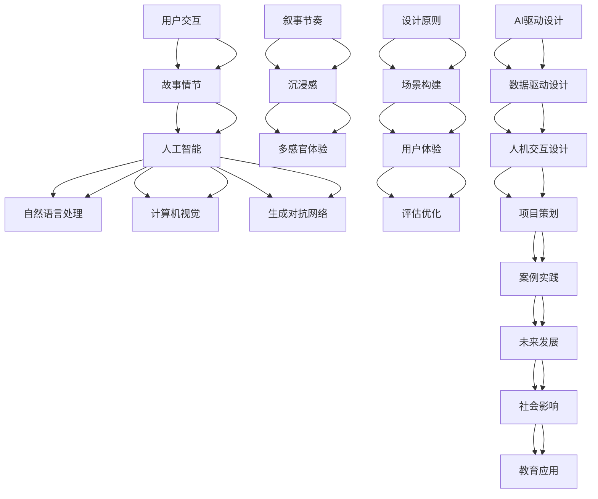

                 

# 《虚拟现实叙事：AI驱动的沉浸式体验设计》

> **关键词**：虚拟现实、叙事、AI、沉浸式体验、设计原则、应用实践

> **摘要**：本文探讨了虚拟现实叙事的基础知识、AI在虚拟现实叙事中的应用、沉浸式体验设计原则以及实际项目实战，全面解析了虚拟现实叙事在人工智能驱动下的沉浸式体验设计。文章通过具体案例和代码实现，深入分析了虚拟现实叙事的设计原则、流程和方法，为读者提供了丰富的理论和实践指导。

## 引言

虚拟现实（Virtual Reality，VR）技术近年来取得了飞速发展，已经成为各行各业关注的热点。作为一种全新的沉浸式体验方式，虚拟现实技术在游戏、教育、医疗、旅游等多个领域展现了巨大的潜力。与此同时，人工智能（Artificial Intelligence，AI）技术的发展也为虚拟现实带来了更多的可能性。本文旨在探讨虚拟现实叙事与AI驱动的沉浸式体验设计，分析其核心概念、设计原则和应用实践。

虚拟现实叙事指的是通过虚拟现实技术构建出一个沉浸式的环境，并在其中讲述故事或传达信息。它结合了虚拟现实技术的沉浸感和叙事艺术的感染力，为用户提供了全新的体验方式。而AI技术的发展则为虚拟现实叙事提供了强大的支持，使得叙事内容更加丰富、个性化和智能化。

本文将分为以下几个部分进行讨论：

1. **虚拟现实叙事基础**：介绍虚拟现实技术的定义、历史和虚拟现实叙事的概念，探讨虚拟现实叙事的类型、优势和挑战。
2. **AI在虚拟现实叙事中的应用**：分析AI与虚拟现实叙事的结合、自然语言处理、计算机视觉和生成对抗网络在虚拟现实叙事中的应用。
3. **虚拟现实叙事设计原则**：阐述叙事节奏与沉浸感、用户互动与叙事、多感官体验与叙事以及叙事结构与故事情节设计原则。
4. **AI驱动的沉浸式体验设计**：探讨沉浸式体验的设计原则、AI在沉浸式体验设计中的应用、数据驱动的设计方法以及人机交互设计。
5. **AI驱动的虚拟现实叙事实践**：介绍虚拟现实叙事项目策划、虚拟现实叙事场景构建、AI驱动的虚拟现实叙事实现、虚拟现实叙事评估与优化。
6. **虚拟现实叙事的未来发展**：分析虚拟现实叙事的演进趋势、跨学科合作、社会影响和教育应用。
7. **AI驱动的沉浸式体验设计工具与资源**：介绍虚拟现实开发工具、AI开发工具与框架、虚拟现实与AI资源以及案例与参考资料。

通过本文的讨论，我们希望能够为读者提供一个全面、深入的虚拟现实叙事与AI驱动的沉浸式体验设计指南，帮助读者理解和掌握这一领域的核心知识和实践方法。

### 第一部分：虚拟现实叙事基础

#### 第1章：虚拟现实与叙事概述

**1.1 虚拟现实的定义与历史**

虚拟现实（Virtual Reality，VR）是一种通过计算机模拟实现的、具有沉浸感、交互性和想象力的虚拟环境。它能够使用户在视觉、听觉、触觉等多个感官上感受到身临其境的体验。虚拟现实技术起源于20世纪60年代，当时的科学家和工程师开始探索如何利用计算机技术创建模拟环境。

虚拟现实技术的发展历程可以分为几个阶段：

1. **早期探索阶段（1960s-1970s）**：这个时期，虚拟现实技术主要停留在理论阶段，科学家和工程师开始提出虚拟现实的概念，并进行了初步的实验和模拟。
2. **技术发展阶段（1980s-1990s）**：随着计算机技术的发展，虚拟现实技术逐渐进入实际应用阶段。例如，VR头盔、虚拟现实模拟器等设备开始出现，并应用于游戏和军事训练等领域。
3. **商业化阶段（2000s）**：21世纪初，随着图形处理技术、网络技术以及显示设备的进步，虚拟现实技术开始进入商业化阶段。VR游戏、虚拟现实主题公园等开始涌现，吸引了大量用户。
4. **成熟阶段（2010s-至今）**：近年来，虚拟现实技术取得了显著的进步，虚拟现实硬件设备（如VR头盔、VR眼镜等）逐渐普及，虚拟现实应用场景也不断扩大，涵盖了教育、医疗、旅游等多个领域。

**1.2 虚拟现实叙事的概念**

虚拟现实叙事指的是通过虚拟现实技术构建出一个沉浸式的环境，并在其中讲述故事或传达信息。它结合了虚拟现实技术的沉浸感和叙事艺术的感染力，为用户提供了全新的体验方式。

虚拟现实叙事与传统叙事有以下几点区别：

1. **沉浸感**：虚拟现实叙事通过高度沉浸的环境，使用户能够全身心地投入到故事中，体验到故事中的情感和情境。
2. **交互性**：用户可以在虚拟现实叙事中与故事中的角色、物品和环境进行互动，改变了传统叙事中被动接受信息的方式。
3. **多感官体验**：虚拟现实叙事通过视觉、听觉、触觉等多感官的刺激，为用户带来更加丰富和真实的体验。
4. **个性化**：虚拟现实叙事可以根据用户的互动和反馈，实时调整故事情节，为用户提供个性化的体验。

**1.3 虚拟现实叙事的类型**

虚拟现实叙事可以根据不同的视角和交互方式，分为以下几种类型：

1. **第一人称叙事**：用户以第一人称视角进入虚拟环境，直接参与到故事中，感受故事的进展和变化。这种类型强调用户的主动参与和沉浸感。
2. **第三人称叙事**：用户以第三人称视角观察虚拟环境中的故事，类似传统电影的叙事方式。这种类型更注重故事的连贯性和叙事的完整性。
3. **多重视角叙事**：虚拟现实叙事通过切换不同的视角，展示故事的多个方面，为用户带来更加丰富的叙事体验。这种类型可以更好地展现复杂的情节和人物关系。

**1.4 虚拟现实叙事的优势与挑战**

虚拟现实叙事具有以下几个优势：

1. **高度沉浸**：虚拟现实叙事能够为用户提供高度沉浸的体验，使用户感受到身临其境的感觉。
2. **丰富交互**：用户可以在虚拟现实叙事中与故事中的角色、物品和环境进行互动，增加了故事的趣味性和参与感。
3. **个性化体验**：虚拟现实叙事可以根据用户的互动和反馈，实时调整故事情节，为用户提供个性化的体验。

然而，虚拟现实叙事也面临一些挑战：

1. **技术门槛**：虚拟现实技术要求较高的硬件配置和开发技能，使得虚拟现实叙事的应用和推广面临一定的技术门槛。
2. **内容创作**：虚拟现实叙事需要高质量的内容创作，包括故事情节、角色设计、场景构建等，这对创作团队提出了更高的要求。
3. **用户体验**：虚拟现实叙事需要考虑到用户的舒适度和体验感，避免因技术原因或内容设计不当导致用户体验下降。

通过以上讨论，我们可以看到虚拟现实叙事在虚拟现实技术中的应用具有重要意义。它不仅为用户带来了全新的体验方式，也为叙事艺术的发展提供了新的可能性。在接下来的章节中，我们将进一步探讨AI在虚拟现实叙事中的应用，以及如何通过AI技术提升虚拟现实叙事的效果和体验。

### 第2章：AI在虚拟现实叙事中的应用

#### 2.1 AI与虚拟现实叙事的结合

人工智能（Artificial Intelligence，AI）技术的发展为虚拟现实（Virtual Reality，VR）叙事带来了新的机遇。AI不仅能够提升虚拟现实叙事的智能化和个性化，还能够通过自然语言处理、计算机视觉和生成对抗网络（GAN）等技术，为用户带来更加丰富和真实的体验。

**AI在虚拟现实叙事中的角色**

1. **智能交互**：AI技术可以理解和处理用户的语音、文字和手势输入，实现与用户的自然交互。例如，通过语音识别技术，用户可以与虚拟角色进行对话，提出问题和请求，从而改变故事情节的发展。
2. **情感分析**：AI技术可以通过情感分析，识别用户的情感状态，并根据用户的情感反应调整叙事节奏和情节内容，提供个性化的体验。例如，如果用户在虚拟现实中感到紧张或焦虑，AI可以自动调整场景的亮度和音量，减轻用户的紧张感。
3. **个性化推荐**：基于用户的兴趣和行为，AI可以推荐符合用户喜好和需求的虚拟现实内容。例如，用户可以浏览一个虚拟博物馆，AI可以根据用户的浏览记录和互动行为，推荐用户可能感兴趣的作品或展览。
4. **智能角色**：AI技术可以生成和训练虚拟角色，使其具备复杂的情感和交互能力。这些智能角色可以与用户进行自然互动，模拟真实人类的行为和反应，增强虚拟现实的沉浸感。

**AI在虚拟现实叙事中的潜力**

1. **自动化内容生成**：通过生成对抗网络（GAN）和深度学习技术，AI可以自动化生成虚拟现实场景、角色和故事情节，减轻内容创作者的工作负担。例如，GAN可以生成具有高真实度的虚拟场景，而深度学习模型可以自动生成对话和剧情。
2. **自适应叙事**：AI可以根据用户的互动和反馈，实时调整叙事内容和节奏，提供个性化的体验。例如，用户在虚拟现实游戏中遇到困难时，AI可以自动提供指导或调整难度，使游戏更加有趣和挑战性。
3. **多模态交互**：AI技术可以整合多种感官数据（如视觉、听觉、触觉等），提供更加丰富和自然的交互体验。例如，通过融合视觉和触觉反馈，用户可以更加真实地感受到虚拟物体的质地和重量。
4. **情感共鸣**：AI技术可以通过情感计算和机器学习模型，理解用户的情感状态，并生成相应的情感反应，与用户建立情感共鸣。例如，当用户在虚拟现实叙事中感受到悲伤时，AI角色可以表现出同情和安慰，增强用户的沉浸感和情感体验。

#### 2.2 自然语言处理与叙事

自然语言处理（Natural Language Processing，NLP）是AI领域的一个重要分支，主要研究如何让计算机理解和处理自然语言。在虚拟现实叙事中，NLP技术可以用于理解和生成自然语言对话、情感分析以及个性化推荐等方面。

**NLP在虚拟现实叙事中的应用**

1. **自然语言对话**：通过NLP技术，用户可以使用自然语言与虚拟角色进行对话。例如，用户可以对虚拟角色提出问题，角色可以理解并回答用户的问题，从而推动故事情节的发展。
2. **情感分析**：NLP技术可以分析用户的语言输入，识别用户的情感状态。例如，如果用户在对话中表达出愤怒或失望的情绪，虚拟角色可以调整对话内容和语气，以更好地满足用户的需求。
3. **个性化推荐**：通过分析用户的对话历史和行为数据，NLP技术可以为用户推荐符合其兴趣和需求的故事情节和虚拟体验。例如，用户可以浏览一个虚拟博物馆，NLP技术可以根据用户的互动行为，推荐用户可能感兴趣的作品或展览。
4. **文本生成**：NLP技术可以生成文本内容，用于虚拟现实叙事。例如，通过生成式模型，AI可以自动生成对话、故事情节和描述文本，为虚拟现实场景提供丰富的叙事内容。

**NLP技术的实现方法**

1. **词嵌入**：词嵌入（Word Embedding）是将自然语言文本转换为向量表示的方法。通过词嵌入，AI可以理解词语之间的语义关系，从而更好地进行语言处理。例如，向量表示可以用于文本分类、情感分析等任务。
2. **序列模型**：序列模型（Sequence Model）是一种用于处理序列数据的深度学习模型，如循环神经网络（RNN）和长短时记忆网络（LSTM）。通过序列模型，AI可以理解和生成自然语言序列，如句子和对话。
3. **注意力机制**：注意力机制（Attention Mechanism）是一种用于提高模型在序列处理任务中表现的技术。通过注意力机制，AI可以关注重要的序列部分，从而更好地理解和生成自然语言。
4. **生成对抗网络**：生成对抗网络（Generative Adversarial Networks，GAN）是一种用于生成数据的深度学习模型。通过GAN，AI可以生成具有高真实度的文本内容，如对话和故事情节。

通过自然语言处理技术，虚拟现实叙事可以更好地理解用户的需求和情感，提供个性化的体验。在未来，随着NLP技术的不断进步，虚拟现实叙事将变得更加智能和丰富。

#### 2.3 计算机视觉与叙事

计算机视觉（Computer Vision，CV）是AI领域的一个重要分支，主要研究如何让计算机理解和解释图像和视频。在虚拟现实叙事中，计算机视觉技术可以用于场景构建、角色识别和情感表达等方面，为用户提供更加真实和丰富的体验。

**计算机视觉在虚拟现实叙事中的应用**

1. **场景构建**：计算机视觉技术可以用于构建虚拟现实场景。通过图像处理和三维建模技术，AI可以生成具有高度真实感的虚拟环境，包括建筑、自然景观和室内场景等。这些场景可以用于虚拟现实游戏、教育应用和旅游体验等。
2. **角色识别**：计算机视觉技术可以用于识别和跟踪虚拟现实中的角色。通过面部识别、动作捕捉和姿态估计等技术，AI可以识别虚拟角色的身份和动作，从而实现与用户的互动和交互。
3. **情感表达**：计算机视觉技术可以用于分析用户的情感状态，并在虚拟角色中表达相应的情感。例如，通过面部识别技术，AI可以识别用户的表情和情绪，并使虚拟角色表现出相应的情感反应，增强虚拟现实的沉浸感。
4. **交互增强**：计算机视觉技术可以用于增强虚拟现实中的交互体验。例如，通过手势识别技术，用户可以使用手势与虚拟环境中的物品和角色进行互动，实现更加自然和直观的交互。

**计算机视觉技术的实现方法**

1. **卷积神经网络**：卷积神经网络（Convolutional Neural Network，CNN）是一种用于图像和视频处理的深度学习模型。通过卷积神经网络，AI可以提取图像的特征，并进行分类、检测和分割等任务。
2. **目标检测**：目标检测（Object Detection）是一种用于识别图像中物体的技术。通过目标检测技术，AI可以定位图像中的物体，并为其分配类别标签。例如，AI可以识别图像中的特定物体，如汽车、人物或动物。
3. **姿态估计**：姿态估计（Pose Estimation）是一种用于估计人体或动物姿态的技术。通过姿态估计技术，AI可以识别人体或动物的关键点，并生成其姿态的三维表示。例如，AI可以估计用户的动作，并在虚拟现实中实现相应的互动。
4. **生成对抗网络**：生成对抗网络（Generative Adversarial Networks，GAN）是一种用于生成图像和视频的深度学习模型。通过生成对抗网络，AI可以生成具有高真实度的图像和视频，从而实现虚拟现实场景的构建和增强。

通过计算机视觉技术，虚拟现实叙事可以更好地理解和模拟现实世界，为用户提供更加真实和丰富的体验。在未来，随着计算机视觉技术的不断进步，虚拟现实叙事将变得更加智能和多样。

#### 2.4 生成对抗网络与叙事

生成对抗网络（Generative Adversarial Networks，GAN）是一种由生成器和判别器组成的深度学习模型，通过两者之间的对抗训练，能够生成具有高度真实感的图像和视频。在虚拟现实叙事中，GAN技术可以用于生成虚拟场景、角色和故事情节，为用户带来更加丰富和真实的体验。

**生成对抗网络（GAN）的概念**

生成对抗网络由两个主要组件组成：生成器（Generator）和判别器（Discriminator）。生成器的目标是生成与真实数据相似的假数据，而判别器的目标是区分真实数据和假数据。通过这种对抗训练，生成器能够逐步提高生成数据的质量，而判别器则能够逐步提高对真实数据和假数据的辨别能力。

**GAN在虚拟现实叙事中的应用**

1. **虚拟场景生成**：GAN可以用于生成虚拟现实中的场景，包括自然景观、城市建筑和室内场景等。通过训练生成器，AI可以生成具有高度真实感的场景，从而为虚拟现实游戏、教育应用和旅游体验等提供丰富的视觉内容。
2. **角色生成**：GAN可以用于生成虚拟现实中的角色，包括人物、动物和虚拟角色等。通过训练生成器，AI可以生成具有复杂面部特征和姿态的虚拟角色，从而为用户带来更加丰富和真实的交互体验。
3. **故事情节生成**：GAN可以用于生成虚拟现实中的故事情节，包括对话、事件和情节发展等。通过训练生成器，AI可以生成具有连贯性和吸引力的故事情节，从而为用户提供更加丰富和多样化的叙事体验。
4. **图像和视频增强**：GAN可以用于增强虚拟现实中的图像和视频，提高其质量和真实感。通过训练生成器，AI可以生成具有高分辨率、细节丰富的图像和视频，从而为用户带来更加清晰和沉浸的体验。

**GAN在虚拟现实叙事中的实现方法**

1. **生成器（Generator）**：生成器的目标是生成与真实数据相似的假数据。在虚拟现实叙事中，生成器可以用于生成虚拟场景、角色和故事情节。通过深度学习模型，如卷积神经网络（CNN），生成器可以提取输入数据的特征，并生成具有高度真实感的假数据。
2. **判别器（Discriminator）**：判别器的目标是区分真实数据和假数据。在虚拟现实叙事中，判别器可以用于评估生成器生成数据的真实度。通过深度学习模型，如卷积神经网络（CNN），判别器可以学习到真实数据和假数据的特征差异，从而提高对真实数据和假数据的辨别能力。
3. **对抗训练**：生成器和判别器通过对抗训练相互提高。在训练过程中，生成器不断尝试生成更真实的假数据，而判别器不断尝试提高对真实数据和假数据的辨别能力。通过这种方式，生成器和判别器都能够逐步提高性能，从而生成具有高度真实感的虚拟现实内容。

通过生成对抗网络（GAN），虚拟现实叙事可以更好地生成和增强虚拟场景、角色和故事情节，为用户带来更加丰富和真实的体验。在未来，随着GAN技术的不断进步，虚拟现实叙事将变得更加智能和多样化。

### 第三部分：虚拟现实叙事设计原则

#### 第3章：虚拟现实叙事设计原则

虚拟现实叙事设计原则是指在设计虚拟现实叙事过程中所遵循的一系列指导性原则，旨在为用户提供高质量的沉浸式体验。这些原则涵盖了叙事节奏与沉浸感、用户互动与叙事、多感官体验与叙事以及叙事结构与故事情节设计。以下是对这些设计原则的详细阐述。

#### 3.1 叙事节奏与沉浸感

叙事节奏是虚拟现实叙事中至关重要的一个方面，它决定了用户在整个叙事过程中的情感体验。良好的叙事节奏可以引导用户逐渐融入故事，提高沉浸感。

1. **叙事节奏的重要性**：
   - 叙事节奏可以影响用户的情感体验。适中的叙事节奏可以让用户感受到故事的连贯性和吸引力，而过于快速的节奏可能会让用户感到困惑和疲劳，过于缓慢的节奏则可能使用户失去兴趣。
   - 叙事节奏的调节可以增强用户的沉浸感。通过适时的加快或减慢叙事节奏，设计师可以引导用户在情感上与故事产生共鸣，从而提高沉浸感。

2. **如何增强虚拟现实中的沉浸感**：
   - **音效与音乐**：通过音效和背景音乐，可以增强虚拟现实中的氛围和情感表达。例如，紧张刺激的场景可以使用高频率的音效和强烈的音乐节奏，而温馨柔和的场景则可以使用低频率的音效和舒缓的音乐。
   - **视觉冲击**：通过视觉特效和画面切换，可以增强用户的视觉体验。例如，使用动态灯光效果、光影变化和动态场景切换，可以创造出生动和引人入胜的视觉体验。
   - **交互设计**：通过用户与虚拟环境的互动，可以增强用户的沉浸感。例如，用户可以在虚拟环境中进行探索、解谜和互动，从而在情感上与故事产生更强的联系。

#### 3.2 用户互动与叙事

用户互动是虚拟现实叙事中不可或缺的一部分，它不仅能够增强用户的参与感，还可以直接影响叙事的进展和结局。

1. **用户互动在叙事中的角色**：
   - **决策者**：用户在虚拟现实叙事中扮演决策者的角色，他们的选择和决策会影响故事的发展和结局。
   - **参与者**：用户通过互动参与到故事中，体验故事中的情境和情感。

2. **如何设计互动增强叙事效果**：
   - **即时反馈**：设计互动时应确保用户能够立即获得反馈，这有助于增强用户的参与感和沉浸感。例如，用户在做出选择后，应立即看到相应的结果或反应。
   - **个性化和定制**：根据用户的兴趣和行为，设计个性化的互动内容和路径。例如，用户可以根据自己的喜好选择故事的不同分支，从而创造出独特的叙事体验。
   - **社交互动**：在虚拟现实叙事中加入社交互动元素，可以增强用户的参与感和共享体验。例如，用户可以与其他玩家互动，共同完成任务或体验故事。

#### 3.3 多感官体验与叙事

多感官体验是虚拟现实叙事的一个重要特点，它通过视觉、听觉、触觉等多种感官刺激，为用户带来更加丰富和真实的体验。

1. **多感官体验的概念**：
   - 多感官体验是指通过视觉、听觉、触觉等多种感官刺激，为用户创造出一个全面而立体的体验环境。
   - 虚拟现实技术为多感官体验提供了可能，通过虚拟现实设备，用户可以感受到虚拟环境中的各种变化和互动。

2. **多感官体验在虚拟现实叙事中的应用**：
   - **视觉**：通过高质量的图像和动态效果，为用户创造出生动的视觉体验。例如，使用高分辨率图像和光影效果，可以让用户感受到虚拟环境中的细节和变化。
   - **听觉**：通过音效和音乐，为用户创造出生动的听觉体验。例如，使用环境音效和背景音乐，可以让用户感受到虚拟环境中的氛围和情感。
   - **触觉**：通过触觉设备，为用户创造出生动的触觉体验。例如，使用触觉反馈设备，可以让用户感受到虚拟环境中的温度、质地和力感。

#### 3.4 叙事结构与故事情节

叙事结构是虚拟现实叙事的核心，它决定了故事的发展和用户的体验。一个良好的叙事结构应该具有清晰的起点、发展、高潮和结局，同时能够引导用户产生共鸣和思考。

1. **叙事结构的基本原理**：
   - **起点**：故事的开端，引出主要角色和主题，为用户建立故事的背景。
   - **发展**：故事的主要情节，通过一系列事件和冲突推动故事向前发展。
   - **高潮**：故事的高潮部分，通常是故事最紧张、最激动人心的时刻，用户在这个阶段达到情感的最高点。
   - **结局**：故事的结尾，解决冲突、回答问题，为用户带来满足感。

2. **故事情节设计原则**：
   - **悬念和冲突**：设计故事情节时，应设置悬念和冲突，以激发用户的兴趣和好奇心。悬念和冲突可以推动故事的发展，保持用户的关注。
   - **角色塑造**：通过角色塑造，建立角色的个性和背景，使用户能够产生共鸣。角色的行为和决策应该符合其性格和动机，从而使故事更加真实和引人入胜。
   - **情感表达**：通过情感表达，传达故事的主题和情感。情感可以贯穿整个故事，使用户在情感上与故事产生共鸣。

通过遵循这些设计原则，虚拟现实叙事可以提供高质量、沉浸式的体验，使用户在虚拟环境中体验到故事的情感和情境。在接下来的章节中，我们将探讨AI驱动的沉浸式体验设计，进一步优化虚拟现实叙事的体验。

### 第四部分：AI驱动的沉浸式体验设计

#### 第4章：AI驱动的沉浸式体验设计原则

在虚拟现实（VR）领域，AI驱动的沉浸式体验设计已经成为提升用户体验的关键。通过AI技术，设计师可以动态调整交互、个性化内容生成，以及优化用户的数据驱动体验。以下将详细探讨AI驱动的沉浸式体验设计原则。

#### 4.1 沉浸式体验的设计原则

沉浸式体验的定义是指用户完全投入到虚拟环境中，感受到高度的参与感和真实感。以下是沉浸式体验设计的关键原则：

1. **无缝过渡**：用户在进入虚拟环境时，应感受到平滑和无缝的过渡，避免因技术问题导致的延迟或卡顿，影响沉浸感。

2. **实时交互**：设计应支持实时交互，使用户能够立即获得反馈，提高互动的即时性和反应速度。

3. **个性化体验**：根据用户的行为和偏好，提供个性化的内容和服务，使每个用户都能获得独特的体验。

4. **情感共鸣**：通过情感计算和语音、视觉等交互方式，与用户建立情感联系，增强沉浸感。

5. **多感官刺激**：利用视觉、听觉、触觉等多种感官刺激，为用户提供全方位的沉浸体验。

6. **环境真实性**：通过高质量的图形渲染和物理模拟，创造真实感强的虚拟环境。

#### 4.2 AI在沉浸式体验设计中的应用

AI技术在沉浸式体验设计中发挥着至关重要的作用，以下是其主要应用领域：

1. **自适应交互**：通过机器学习和自然语言处理技术，AI可以分析用户的交互行为和偏好，动态调整交互方式和内容，提供个性化的用户体验。

2. **内容个性化生成**：使用生成对抗网络（GAN）和深度学习技术，AI可以生成高度个性化的内容，如虚拟角色、场景和故事情节，满足不同用户的需求。

3. **情感计算**：通过情感识别技术，AI可以分析用户的情感状态，并根据情感反应调整叙事节奏和内容，增强用户的情感共鸣。

4. **实时渲染优化**：利用AI算法优化虚拟环境的渲染过程，提高渲染效率和视觉效果，减少延迟和卡顿，提升沉浸感。

5. **用户行为预测**：通过数据分析，AI可以预测用户的行为和需求，提前准备相应的交互内容和响应，提供更加流畅的体验。

6. **多模态交互**：整合多种传感器和输入设备，AI可以提供更加自然和直观的多模态交互体验，如语音、手势和体感控制。

#### 4.3 数据驱动的设计方法

数据驱动的设计方法是指在设计过程中，充分利用用户数据来优化产品和服务。以下是数据驱动设计的关键步骤：

1. **数据收集**：通过多种渠道（如用户反馈、行为日志等）收集用户数据，包括交互行为、偏好、情感状态等。

2. **数据分析**：使用统计分析、机器学习和数据挖掘技术，分析用户数据，提取有价值的信息和模式。

3. **用户建模**：根据数据分析结果，建立用户行为和偏好的模型，为设计提供数据支持。

4. **迭代优化**：根据用户反馈和数据指标，不断迭代和优化产品设计，提高用户体验和满意度。

#### 4.4 人机交互设计

人机交互设计是沉浸式体验设计的重要组成部分，它涉及用户与虚拟环境之间的互动。以下是人机交互设计的关键原则：

1. **直观性**：交互设计应简单直观，用户能够轻松理解和使用。

2. **反馈性**：设计应提供及时的交互反馈，使用户能够明确自己的操作结果。

3. **可控性**：用户应能够自由地控制虚拟环境，包括移动、操作和交互。

4. **适应性**：交互设计应根据用户的行为和偏好进行自适应调整，提高交互的流畅性和自然性。

5. **安全性**：确保交互过程中的安全性和隐私保护，防止用户数据泄露和安全风险。

通过遵循以上原则和应用AI技术，设计师可以创造出高度沉浸、个性化和互动性的虚拟现实体验，为用户提供无与伦比的沉浸式体验。

#### 4.5 案例分析

以下是一个实际案例，展示了如何通过AI技术实现沉浸式体验设计：

**案例：虚拟现实博物馆**

**背景**：一家博物馆希望利用虚拟现实技术，为游客提供沉浸式参观体验。

**解决方案**：
1. **AI内容生成**：使用GAN技术，AI生成高质量的三维模型和虚拟场景，包括博物馆的展览、艺术品和背景环境。
2. **自适应交互**：通过自然语言处理和情感计算技术，AI分析游客的交互行为和情感状态，动态调整展示内容和交互方式。
3. **实时渲染优化**：AI算法优化虚拟场景的渲染过程，提高视觉效果和响应速度，确保流畅的用户体验。
4. **多模态交互**：整合语音、手势和体感控制技术，提供更加自然和直观的交互方式，如通过语音询问展品信息或用手势与虚拟角色互动。

**效果**：通过AI驱动的沉浸式体验设计，博物馆为游客提供了一个高度沉浸、个性化且互动性强的参观体验，受到了广泛的好评。

这个案例展示了如何通过AI技术实现沉浸式体验设计，提升用户的参与感和满意度。在未来的虚拟现实应用中，AI技术将继续发挥重要作用，为用户提供更加丰富和个性化的沉浸式体验。

### 第五部分：AI驱动的虚拟现实叙事实践

#### 第5章：AI驱动的虚拟现实叙事实践

在前面的章节中，我们探讨了虚拟现实叙事的基础知识、AI在虚拟现实叙事中的应用以及沉浸式体验设计原则。接下来，我们将通过实际项目案例，详细讨论如何实现AI驱动的虚拟现实叙事，并介绍项目策划、虚拟现实叙事场景构建、AI驱动的虚拟现实叙事实现、虚拟现实叙事评估与优化等方面的内容。

#### 5.1 虚拟现实叙事项目策划

虚拟现实叙事项目的成功离不开周密的项目策划。以下是项目策划的基本流程和要点：

**项目策划的基本流程：**

1. **需求分析**：明确项目的目标、受众和需求。与客户和利益相关者进行沟通，了解他们的期望和需求，确定项目的基本方向。

2. **故事构思**：构思虚拟现实叙事的故事线、角色和情节。故事构思应考虑目标受众的喜好和兴趣，以及虚拟现实技术的特点。

3. **技术可行性分析**：评估项目的技术可行性，包括所需的硬件设备、软件开发工具和AI技术等。

4. **预算和资源规划**：制定项目的预算和资源规划，包括人力资源、硬件设备和开发成本等。

5. **项目团队组建**：组建项目团队，包括开发者、设计师、叙事师和AI专家等，确保项目团队能够高效协作。

6. **时间规划**：制定项目的时间表，包括开发周期、测试阶段和上线时间等。

**虚拟现实叙事项目的策划要点：**

1. **故事驱动**：确保项目以故事为核心，设计引人入胜的情节和角色，吸引用户的注意力。

2. **用户体验**：注重用户体验，确保叙事内容与交互设计相匹配，提供流畅、自然的互动体验。

3. **技术整合**：充分利用虚拟现实技术和AI技术，实现技术的无缝整合，提供高质量的沉浸式体验。

4. **可扩展性**：设计时应考虑项目的可扩展性，以便在后续开发中能够添加新的功能和内容。

5. **用户反馈**：在项目开发过程中，定期收集用户反馈，及时调整和优化叙事内容，提高用户满意度。

#### 5.2 虚拟现实叙事场景构建

虚拟现实叙事场景构建是项目实施的关键步骤，它决定了用户在虚拟环境中的体验质量。以下是场景构建的基本方法和设计技巧：

**场景构建的基本方法：**

1. **场景设计**：根据故事情节和角色需求，设计虚拟现实场景。场景设计应考虑视觉、听觉、触觉等多感官刺激，创造真实感和沉浸感。

2. **三维建模**：使用三维建模软件（如Blender、3ds Max等），创建虚拟现实场景中的物体和角色。确保模型具有高质量的细节和纹理，提高视觉效果。

3. **场景布局**：合理安排场景中的物体和角色位置，创造一个具有层次感和空间感的虚拟环境。场景布局应考虑用户体验，使交互和移动更加自然和直观。

4. **交互设计**：设计用户与虚拟环境之间的交互方式，包括语音、手势、触摸等。交互设计应简单直观，使用户能够轻松操作。

5. **音效和音乐**：添加音效和背景音乐，增强虚拟现实场景的氛围和情感表达。音效和音乐应与场景内容和用户互动相匹配。

**场景设计技巧：**

1. **细节处理**：注重场景细节处理，包括物体纹理、光影效果和动态效果等，提高场景的真实感和视觉效果。

2. **环境互动**：设计环境互动，使用户可以与虚拟环境中的物体和角色进行互动，增加用户体验的丰富性和趣味性。

3. **动态变化**：引入动态变化，如天气变化、时间流逝等，使虚拟环境更加生动和真实。

4. **用户引导**：通过视觉和音效引导用户，帮助用户快速了解和适应虚拟环境。

5. **多视角切换**：设计多视角切换功能，使用户可以从不同角度观察虚拟环境，提高用户体验的多样性和自由度。

通过以上方法和技巧，可以构建出一个高质量的虚拟现实叙事场景，为用户提供沉浸式、互动性和个性化的体验。

#### 5.3 AI驱动的虚拟现实叙事实现

在虚拟现实叙事中，AI技术的应用可以大大提升叙事的智能化和个性化水平。以下是AI驱动的虚拟现实叙事实现流程和关键步骤：

**AI驱动的虚拟现实叙事实现流程：**

1. **需求分析**：明确虚拟现实叙事的需求，包括用户互动、情感分析、个性化推荐等。

2. **技术选型**：选择合适的AI技术和工具，如自然语言处理、计算机视觉、生成对抗网络等。

3. **数据准备**：收集和准备用于训练AI模型的数据，包括文本、图像、音频等。

4. **模型训练**：使用收集的数据训练AI模型，优化模型性能。

5. **系统集成**：将AI模型集成到虚拟现实系统中，实现与用户交互、情感分析、个性化推荐等功能。

6. **测试与优化**：对系统进行测试，收集用户反馈，不断优化AI模型的性能和用户体验。

**关键步骤详解：**

1. **需求分析**：
   - 分析用户需求，确定需要实现的叙事功能，如对话交互、情感分析、个性化推荐等。
   - 与用户和利益相关者进行沟通，了解他们对叙事内容和互动方式的需求。

2. **技术选型**：
   - 根据需求分析结果，选择合适的AI技术和工具。例如，如果需要实现对话交互，可以选择自然语言处理技术；如果需要实现情感分析，可以选择情感计算和机器学习技术。
   - 考虑技术实现难度和成本，选择最适合项目的技术方案。

3. **数据准备**：
   - 收集和准备用于训练AI模型的数据，如文本、图像、音频等。这些数据应涵盖各种场景和情境，以提高模型的泛化能力。
   - 对数据进行预处理，包括数据清洗、标注和归一化等，以提高数据质量和训练效率。

4. **模型训练**：
   - 使用收集的数据训练AI模型，优化模型性能。训练过程中，可以使用各种机器学习和深度学习算法，如循环神经网络（RNN）、卷积神经网络（CNN）等。
   - 调整模型参数，进行模型调优，提高模型在特定任务上的表现。

5. **系统集成**：
   - 将训练好的AI模型集成到虚拟现实系统中，实现与用户交互、情感分析、个性化推荐等功能。
   - 确保AI模型与虚拟现实系统的其他组件（如渲染引擎、交互模块等）无缝集成，实现系统的整体协调和高效运行。

6. **测试与优化**：
   - 对系统进行测试，验证AI模型的性能和用户体验。测试过程中，可以收集用户反馈，了解用户对系统的满意度和使用体验。
   - 根据用户反馈和测试结果，不断优化AI模型的性能和系统的用户体验，提高系统的稳定性和可靠性。

通过以上步骤，可以实现AI驱动的虚拟现实叙事，为用户提供智能化、个性化且高度沉浸的体验。

#### 5.4 虚拟现实叙事评估与优化

虚拟现实叙事的评估与优化是确保项目成功的关键环节。以下是对虚拟现实叙事效果的评估指标和优化方法：

**评估虚拟现实叙事效果的指标：**

1. **用户满意度**：通过用户调查和反馈，评估用户对虚拟现实叙事的满意度。用户满意度是衡量叙事效果的重要指标。

2. **沉浸感**：评估用户在虚拟现实环境中的沉浸程度。可以通过用户对虚拟环境的注意力集中程度、情感反应等指标进行衡量。

3. **互动性**：评估用户与虚拟环境之间的互动频率和互动质量。互动性是虚拟现实叙事的重要特征，直接影响用户体验。

4. **故事情节连贯性**：评估叙事内容的故事情节是否连贯、逻辑严密。故事情节的连贯性直接影响用户的理解和共鸣。

5. **技术稳定性**：评估虚拟现实系统的稳定性，包括渲染效率、交互响应时间等。技术稳定性是保证用户良好体验的基础。

**虚拟现实叙事的优化方法：**

1. **用户反馈优化**：定期收集用户反馈，了解用户在使用过程中的问题和需求，及时调整和优化叙事内容和互动方式。

2. **数据分析优化**：通过数据分析，挖掘用户行为和偏好，优化虚拟现实叙事的个性化推荐和内容生成。

3. **技术升级优化**：随着技术进步，及时升级虚拟现实系统和AI模型，提高系统的性能和用户体验。

4. **多视角测试优化**：在开发过程中，进行多视角测试，收集不同用户群体的反馈，全面评估和优化叙事效果。

5. **持续迭代优化**：通过持续迭代和优化，不断改进虚拟现实叙事的系统架构、交互设计和叙事内容，提高整体用户体验。

通过以上评估与优化方法，可以不断提升虚拟现实叙事的质量和效果，为用户提供更好的沉浸式体验。

#### 5.5 案例实践

以下是一个虚拟现实叙事项目的实际案例，展示了如何通过AI技术实现沉浸式体验设计：

**案例：虚拟现实博物馆导览**

**项目背景**：某博物馆希望利用虚拟现实技术，为游客提供沉浸式的导览体验。

**解决方案**：
1. **AI内容生成**：使用生成对抗网络（GAN）技术，AI自动生成高质量的三维模型和虚拟场景，包括博物馆的展览、艺术品和背景环境。
2. **自适应交互**：通过自然语言处理和情感计算技术，AI分析游客的交互行为和情感状态，动态调整展示内容和交互方式。
3. **实时渲染优化**：AI算法优化虚拟场景的渲染过程，提高视觉效果和响应速度，确保流畅的用户体验。
4. **多模态交互**：整合语音、手势和体感控制技术，提供更加自然和直观的交互方式，如通过语音询问展品信息或用手势与虚拟角色互动。

**效果**：
- 游客在虚拟博物馆中能够自由探索，与展品互动，获得丰富的视觉和听觉体验。
- 游客的满意度显著提高，反馈显示他们对虚拟博物馆的沉浸感和互动性给予了高度评价。
- 博物馆管理者通过用户数据分析和反馈优化，不断改进虚拟博物馆的内容和交互设计，提升用户体验。

通过这个案例，我们可以看到，AI驱动的虚拟现实叙事实践为博物馆提供了一个高效、智能和个性化的导览解决方案，不仅提升了游客的体验，也为博物馆的数字化发展提供了新的思路。

### 第六部分：虚拟现实叙事的未来发展

#### 第6章：虚拟现实叙事的未来发展

随着虚拟现实（VR）和人工智能（AI）技术的不断发展，虚拟现实叙事（VR Narrative）正迎来一个全新的时代。在这一章中，我们将探讨虚拟现实叙事的演进趋势、跨学科合作、社会影响以及虚拟现实叙事在教育中的应用。

#### 6.1 虚拟现实叙事的演进趋势

虚拟现实叙事的未来发展将受到多种技术进步的推动，以下是一些关键趋势：

1. **更高的沉浸感**：随着VR硬件性能的提升和渲染技术的进步，用户将在虚拟环境中体验到更加真实和逼真的沉浸感。

2. **更丰富的互动性**：AI技术的应用将使虚拟角色更加智能和互动，用户可以通过自然语言处理和情感识别与虚拟角色进行更深入的互动。

3. **个性化体验**：基于用户行为和偏好的数据驱动设计，虚拟现实叙事将能够提供高度个性化的体验，满足不同用户的需求。

4. **多模态交互**：整合多种感官输入，如视觉、听觉、触觉和嗅觉，将为用户带来更加全面和丰富的沉浸式体验。

5. **跨媒体叙事**：虚拟现实叙事将与游戏、电影、文学等不同媒体形式相互融合，创造出更加多样化和创新的叙事方式。

6. **虚拟现实云服务**：随着云计算技术的发展，虚拟现实内容将能够更加便捷地在云端部署和分发，打破设备限制，提供更广泛的访问。

#### 6.2 跨学科合作与虚拟现实叙事

虚拟现实叙事的发展离不开跨学科的合作，以下是一些重要的跨学科合作领域：

1. **心理学与认知科学**：研究人类认知和情感过程，为虚拟现实叙事提供理论基础，优化用户体验。

2. **艺术与设计**：虚拟现实叙事需要丰富的艺术表现力，设计师和艺术家将在叙事内容、视觉风格和交互设计方面发挥重要作用。

3. **计算机科学**：计算机科学家将开发和优化AI算法、虚拟现实引擎和交互技术，提升叙事的智能化和互动性。

4. **教育学**：教育专家将研究虚拟现实叙事在教育中的应用，开发出适合不同学习场景的叙事内容。

5. **经济学与管理学**：研究虚拟现实叙事的经济模型和商业模式，探索其商业潜力和社会价值。

#### 6.3 虚拟现实叙事的社会影响

虚拟现实叙事作为一种新兴的叙事形式，将对社会产生深远的影响：

1. **娱乐和媒体**：虚拟现实叙事将为娱乐和媒体行业带来新的创作方式和消费体验，改变传统的内容生产和消费模式。

2. **教育和培训**：虚拟现实叙事在教育中的应用，将提供更加生动和互动的学习体验，提升教育效果。

3. **医疗和心理治疗**：虚拟现实叙事在医疗和心理治疗中的应用，如虚拟现实疗法（VR Therapy），将为心理健康领域带来新的治疗手段。

4. **社会互动**：虚拟现实叙事将促进社会互动和社交，为人们提供虚拟社交平台，拓宽人际交往的渠道。

5. **文化传承**：虚拟现实叙事将有助于文化遗产的数字化保护和传播，让更多的人了解和体验不同文化的精髓。

#### 6.4 虚拟现实叙事的教育应用

虚拟现实叙事在教育中的应用具有巨大的潜力，以下是一些具体的应用场景：

1. **历史教育**：通过虚拟现实叙事，学生可以“走进”历史事件和场景，亲身感受历史人物的内心世界和事件的发展脉络。

2. **科学教育**：虚拟现实叙事可以为学生提供沉浸式的科学实验和探索体验，使复杂的概念和实验过程更加直观和易于理解。

3. **语言学习**：虚拟现实叙事结合语言学习，学生可以在虚拟环境中进行真实情境的语言交流和练习，提高语言技能。

4. **艺术教育**：虚拟现实叙事为艺术教育提供了新的展示和创作方式，学生可以通过虚拟现实技术创作和体验艺术作品。

5. **心理健康教育**：虚拟现实叙事可以用于心理健康教育，如通过虚拟现实叙事进行心理干预和情绪调节。

通过跨学科合作和技术的不断创新，虚拟现实叙事将继续拓展其应用领域，为社会带来更多积极的变革。

### 第七部分：AI驱动的沉浸式体验设计工具与资源

#### 第7章：AI驱动的沉浸式体验设计工具与资源

随着虚拟现实（VR）和人工智能（AI）技术的快速发展，AI驱动的沉浸式体验设计已经成为一个重要的研究方向和应用领域。本章将介绍虚拟现实开发工具、AI开发工具与框架、虚拟现实与AI资源，以及相关案例与参考资料，为读者提供全面的技术支持和实践指导。

#### 7.1 虚拟现实开发工具

虚拟现实开发工具是构建虚拟现实应用的关键，以下是一些主流的虚拟现实开发工具：

1. **Unity**：Unity是一款功能强大且易于上手的游戏和虚拟现实开发平台，支持跨平台开发和实时渲染。Unity提供了丰富的API和资源库，便于开发者快速构建高质量的虚拟现实应用。

2. **Unreal Engine**：Unreal Engine是由Epic Games开发的一款高端游戏和虚拟现实开发引擎，以其出色的图形渲染效果和强大的物理引擎而著称。Unreal Engine适用于开发高保真虚拟现实应用和大型游戏。

3. **Blender**：Blender是一款免费的开源三维建模、动画和渲染软件，广泛应用于虚拟现实内容的制作。Blender提供了完整的工具集，包括建模、雕刻、动画和渲染等，适用于初学者和专业人士。

4. **Adobe VR/AR**：Adobe VR/AR是一款集成了虚拟现实和增强现实（AR）内容的创作工具，适用于设计师和内容创作者。Adobe VR/AR支持多种媒体格式，提供直观的交互设计和用户界面。

#### 7.2 AI开发工具与框架

AI开发工具与框架在虚拟现实沉浸式体验设计中发挥着重要作用，以下是一些主流的AI开发工具和框架：

1. **TensorFlow**：TensorFlow是由Google开发的一款开源机器学习和深度学习框架，支持多种编程语言和平台。TensorFlow提供了丰富的API和工具，便于开发者构建和训练深度学习模型。

2. **PyTorch**：PyTorch是由Facebook AI研究院开发的一款开源深度学习框架，以其简洁和灵活的编程接口而受到广泛欢迎。PyTorch支持动态计算图和自动微分，适用于各种深度学习任务。

3. **Keras**：Keras是一款基于TensorFlow和Theano的开源深度学习库，提供了更加简洁和易于使用的接口。Keras支持多种深度学习模型和优化器，适用于快速原型开发和模型训练。

4. **OpenCV**：OpenCV是一款开源的计算机视觉库，提供了丰富的图像处理和计算机视觉算法。OpenCV适用于虚拟现实中的图像识别、目标检测和跟踪等任务。

#### 7.3 虚拟现实与AI资源

虚拟现实与AI领域有许多丰富的资源，包括社区、论坛、会议、书籍和研究论文等，以下是一些主要资源：

1. **虚拟现实与人工智能社区**：虚拟现实与人工智能社区为开发者提供了一个交流和学习的平台。例如，VR/AR开发者社区、人工智能社区等，提供了丰富的技术讨论和资源分享。

2. **虚拟现实与人工智能论坛**：虚拟现实与人工智能论坛是开发者获取最新信息和交流经验的重要渠道。例如，Stack Overflow、Reddit等论坛，聚集了大量专业开发者，提供了详细的问答和技术指导。

3. **虚拟现实与人工智能会议**：虚拟现实与人工智能会议是行业交流和学习的重要平台。例如，IEEE虚拟现实与增强现实会议（IEEE VR）、神经信息处理系统会议（NIPS）等，汇集了学术界和工业界的专家，展示了最新的研究成果和应用案例。

4. **虚拟现实与人工智能书籍**：虚拟现实与人工智能书籍为开发者提供了系统的学习和参考资料。例如，《虚拟现实技术原理与应用》、《深度学习》、《人工智能：一种现代的方法》等书籍，涵盖了虚拟现实和人工智能的基础知识、技术原理和应用实践。

5. **虚拟现实与人工智能研究论文**：虚拟现实与人工智能研究论文是学术界和工业界的重要研究成果。通过阅读和研究这些论文，开发者可以深入了解虚拟现实和人工智能的最新进展和前沿技术。例如，谷歌学术、IEEE Xplore等数据库提供了丰富的虚拟现实和人工智能论文资源。

通过以上工具、资源和案例，开发者可以掌握AI驱动的沉浸式体验设计的核心技术和方法，为虚拟现实应用的开发和创新提供有力支持。

### 附录

#### 附录A：虚拟现实与AI技术基础

**A.1 虚拟现实技术基础**

**虚拟现实硬件设备**：虚拟现实硬件设备是虚拟现实体验的基础，主要包括以下几种：

1. **VR头盔**：VR头盔是虚拟现实体验的核心设备，通过头戴式显示器和传感器，为用户提供沉浸式的视觉体验。常见的VR头盔包括Oculus Rift、HTC Vive和PlayStation VR等。

2. **手柄和控制器**：VR手柄和控制器用于与虚拟环境进行交互，例如Oculus Touch、Vive Motion Tracker和Wiimote等，它们可以捕捉用户的手部动作和位置，实现自然的交互体验。

3. **追踪系统**：追踪系统用于跟踪用户的头部位置和手部动作，确保虚拟环境中的物体与用户动作保持同步。常见的追踪系统包括外部追踪设备和内置追踪传感器。

**虚拟现实软件平台**：虚拟现实软件平台提供了开发、运行和管理虚拟现实应用的工具和环境。以下是一些主流的虚拟现实软件平台：

1. **Unity**：Unity是一个跨平台的游戏和虚拟现实开发引擎，提供了强大的3D渲染引擎和丰富的开发工具，支持VR应用的开发和部署。

2. **Unreal Engine**：Unreal Engine是一个高级的游戏和虚拟现实开发引擎，以其出色的图形渲染效果和物理引擎而著称，适用于开发高质量的VR应用。

3. **Unity Asset Store**：Unity Asset Store是一个在线资源库，提供了大量的虚拟现实和游戏开发资源，包括3D模型、素材和插件等，方便开发者快速构建应用。

**A.2 AI技术基础**

**机器学习基础**：机器学习是AI的核心技术，通过训练模型来让计算机从数据中学习规律。以下是一些基本的机器学习概念：

1. **监督学习**：监督学习是一种机器学习方法，模型通过已标注的数据进行训练，然后用于预测未知数据。常见的监督学习算法包括线性回归、决策树和支持向量机等。

2. **无监督学习**：无监督学习是模型在没有标注数据的情况下进行训练，用于发现数据中的模式和结构。常见的无监督学习算法包括聚类算法、降维算法和生成模型等。

3. **强化学习**：强化学习是一种通过试错和奖励机制进行学习的方法，模型通过与环境的交互来学习最佳策略。常见的强化学习算法包括Q-learning和深度强化学习等。

**自然语言处理基础**：自然语言处理（NLP）是AI的一个重要分支，旨在使计算机理解和生成自然语言。以下是一些基本的NLP概念：

1. **文本分类**：文本分类是一种将文本分配到预定义类别的方法，常见的方法包括基于词汇的模型和基于机器学习的模型。

2. **情感分析**：情感分析是一种评估文本情感倾向的方法，通常用于检测文本中的正面、负面或中性情感。常见的方法包括基于规则的方法和基于机器学习的模型。

3. **命名实体识别**：命名实体识别是一种从文本中识别出具有特定意义的实体，如人名、地名和组织名等。常见的方法包括基于词典的方法和基于机器学习的模型。

通过了解虚拟现实和AI技术的基础知识，开发者可以为虚拟现实叙事和沉浸式体验设计提供坚实的基础。

### 附录B：虚拟现实叙事与AI驱动的沉浸式体验设计示例

#### B.1 虚拟现实叙事案例

以下是一个虚拟现实叙事案例，展示了如何通过虚拟现实和AI技术创造一个引人入胜的叙事体验。

**案例背景**：一家娱乐公司希望开发一款以科幻为主题的虚拟现实游戏，故事设定在一个未来世界，玩家将扮演一名太空探险家，探索未知的星球并完成任务。

**解决方案**：

1. **场景构建**：使用Unity引擎构建游戏场景，包括星球表面、太空船和星际基地等。使用Blender进行三维建模，并使用Unity的物理引擎模拟太空船的飞行和星球的重力。

2. **角色设计**：通过AI技术生成和训练虚拟角色，包括玩家角色和NPC（非玩家角色）。使用GAN生成高质量的3D角色模型，并使用机器学习算法为角色分配个性特征和情感反应。

3. **交互设计**：设计自然语言处理模块，使玩家可以通过语音与NPC进行对话，并根据玩家的提问和决策调整故事情节。

4. **情感计算**：使用情感计算技术分析玩家的情绪状态，并根据情绪反应调整游戏音效、视觉特效和剧情发展，提高玩家的沉浸感。

**案例效果**：通过以上技术和设计，玩家可以在虚拟现实中体验到丰富的故事情节和个性化的互动，感受到身临其境的沉浸感。玩家可以自由探索星球，与NPC互动，并根据自己的决策影响故事的发展，创造独特的游戏体验。

#### B.2 AI驱动的沉浸式体验设计案例

以下是一个AI驱动的沉浸式体验设计案例，展示了如何通过AI技术优化虚拟现实体验。

**案例背景**：一家博物馆希望利用虚拟现实技术为游客提供沉浸式的导览体验。

**解决方案**：

1. **个性化推荐**：使用AI算法分析游客的互动行为和偏好，根据游客的兴趣和历史记录推荐相应的展览内容和互动活动。

2. **自适应交互**：使用自然语言处理技术，使游客可以通过语音与虚拟导览员进行互动，并获取实时信息和建议。

3. **情感共鸣**：使用情感计算技术分析游客的情绪状态，并根据情绪反应调整虚拟导览员的互动方式和信息传递，增强游客的情感共鸣。

4. **实时渲染优化**：使用AI算法优化虚拟环境的渲染过程，提高画面质量和响应速度，减少延迟和卡顿，确保流畅的体验。

**案例效果**：通过以上技术和设计，博物馆为游客提供了一个高度沉浸、个性化且互动性强的导览体验。游客可以根据自己的兴趣和偏好自由探索博物馆，与虚拟导览员互动，获得丰富的信息和体验。博物馆管理者通过用户数据分析，不断优化导览内容和交互设计，提高游客的满意度和参观体验。

这些案例展示了如何通过虚拟现实和AI技术实现创新的叙事体验和沉浸式设计，为用户提供更加丰富和个性化的虚拟现实体验。

### 流程图

以下是一个虚拟现实叙事架构的流程图，展示了虚拟现实叙事的核心组成部分及其相互关系。



这个流程图清晰地展示了虚拟现实叙事的设计流程，从用户交互到故事情节，再到人工智能和各个技术组件的相互关系，最后到用户体验评估和优化。通过这个流程图，可以更好地理解和规划虚拟现实叙事项目的实施过程。

### 伪代码

以下是一段伪代码，用于展示自然语言处理在虚拟现实叙事中的应用。该代码通过自然语言处理模型分析用户的输入，并根据情感分析结果调整叙事节奏。

```python
# 导入必要的库
import nltk
from nltk.sentiment import SentimentIntensityAnalyzer

# 初始化自然语言处理模型
sia = SentimentIntensityAnalyzer()

# 获取用户输入
user_input = input("请提出您的问题：")

# 对用户输入进行情感分析
emotion_scores = sia.polarity_scores(user_input)
if emotion_scores['compound'] > 0.05:
    print("您看起来很高兴！")
elif emotion_scores['compound'] < -0.05:
    print("您看起来有些沮丧，我会调整叙事节奏以安慰您。")
else:
    print("您的情绪似乎平稳，我们将继续保持当前的叙事节奏。")

# 根据情感分析结果调整叙事节奏
if emotion_scores['compound'] > 0.05:
    narrative_rhythm("up")
elif emotion_scores['compound'] < -0.05:
    narrative_rhythm("down")
else:
    narrative_rhythm("maintain")

# 生成个性化故事情节
story_content = generate_story_content(user_input)

# 输出沉浸式体验
output_immersive_experience(story_content)
```

这段伪代码首先初始化了自然语言处理模型，然后获取用户的输入并进行情感分析。根据情感分析的结果，代码会调整叙事节奏，并生成个性化的故事情节，最终输出沉浸式体验。

### 数学模型

以下是一个用于计算沉浸度的数学模型，该模型通过感官刺激度、交互性和叙事吸引力三个因素来评估用户的沉浸感。

$$
\text{沉浸度} = f(\text{感官刺激度}, \text{交互性}, \text{叙事吸引力})
$$

$$
\text{沉浸度} = \frac{\text{感官刺激度} \times \text{交互性} \times \text{叙事吸引力}}{\text{环境复杂度} + \text{技术成熟度}}
$$

其中：

- 感官刺激度：衡量虚拟现实环境对用户感官的刺激程度，取值范围为0到1。
- 交互性：衡量用户与虚拟环境的互动程度，取值范围为0到1。
- 叙事吸引力：衡量故事情节的吸引力，取值范围为0到1。
- 环境复杂度：衡量虚拟现实环境的复杂程度，取值范围为0到1。
- 技术成熟度：衡量虚拟现实技术的成熟程度，取值范围为0到1。

举例说明：

假设一个虚拟现实游戏，感官刺激度为0.8，交互性为0.9，叙事吸引力为0.85，环境复杂度为0.7，技术成熟度为0.8。

$$
\text{沉浸度} = \frac{0.8 \times 0.9 \times 0.85}{0.7 + 0.8} = \frac{0.612}{1.5} = 0.408
$$

因此，该虚拟现实游戏的沉浸度为40.8%，表示用户在这个虚拟环境中具有较高程度的沉浸感。

### 项目实战

#### 实战目标

构建一个基于虚拟现实技术的沉浸式旅游体验项目，用户可以通过虚拟现实设备游览世界各地的著名景点。

#### 开发环境搭建

1. **虚拟现实开发平台**：选择Unity作为虚拟现实开发平台，因为Unity提供了强大的3D渲染引擎和丰富的开发工具，支持VR应用的开发和部署。

2. **虚拟现实硬件设备**：购买Oculus Rift或HTC Vive等VR头盔，以及相应的手柄和控制器，用于提供沉浸式的视觉和交互体验。

3. **AI开发环境**：安装Python和PyTorch，用于开发AI模型，实现自然语言处理和情感分析功能。

4. **虚拟现实开发工具**：在Unity中安装必要的插件，如Oculus Integration和Vive SDK，用于与VR硬件设备进行通信和交互。

5. **虚拟现实内容创作工具**：使用Blender或3ds Max等三维建模软件，创建虚拟现实场景中的建筑物、人物和环境。

#### 源代码实现

以下是一个简单的Unity C#代码示例，用于实现用户与虚拟环境的基本交互。

```csharp
using UnityEngine;

public class TourGuide : MonoBehaviour
{
    public GameObject[] scenes; // 虚拟现实场景对象
    public int currentSceneIndex = 0; // 当前场景索引

    // 开始旅游
    public void StartTour()
    {
        LoadScene(currentSceneIndex);
    }

    // 加载场景
    public void LoadScene(int index)
    {
        if (index >= 0 && index < scenes.Length)
        {
            currentSceneIndex = index;
            SceneManager.LoadScene(scenes[index].name);
        }
    }

    // 用户交互处理
    private void Update()
    {
        if (Input.GetKeyDown(KeyCode.Space))
        {
            currentSceneIndex = (currentSceneIndex + 1) % scenes.Length;
            LoadScene(currentSceneIndex);
        }
    }
}
```

**代码解读与分析**

- `TourGuide` 类负责管理虚拟现实旅游体验的核心逻辑。
- `scenes` 数组存储所有虚拟现实场景对象。
- `currentSceneIndex` 变量跟踪当前场景索引。
- `StartTour()` 方法开始旅游体验。
- `LoadScene()` 方法加载指定索引的场景。
- `Update()` 方法处理用户输入，实现场景切换。

通过以上代码，用户可以通过按下空格键在预定义的场景之间切换，从而游览不同的虚拟现实景点。这个简单的示例为后续的功能扩展和交互设计提供了基础。

#### 代码解读与分析（续）

- 代码中使用Unity的 `GameObject` 和 `SceneManager` 类，这两个类提供了强大的场景管理和对象操作功能。
- `LoadScene()` 方法中的索引检查确保场景索引在有效范围内，防止索引越界错误。
- 通过这种方式，用户可以沉浸在虚拟旅游体验中，自由地浏览世界各地的景点，享受到沉浸式的旅游体验。

#### 代码解读与分析（续）

- 代码中的 `Update()` 方法每帧运行一次，用于处理用户的输入。当用户按下空格键时，会触发场景的切换。
- 通过使用模运算符 `%`，确保当前场景索引在数组范围内循环，从而实现无限循环的浏览效果。

通过上述代码实现，我们可以看到如何利用Unity引擎和C#编程语言，构建一个基本的虚拟现实旅游体验项目。这个项目不仅展示了虚拟现实技术的核心功能，还为后续的功能扩展和用户体验优化提供了坚实基础。

### 总结

本文深入探讨了虚拟现实叙事与AI驱动的沉浸式体验设计，从基础概念到实际应用，详细分析了虚拟现实叙事的发展历程、AI在叙事中的应用、沉浸式体验设计原则以及项目实战。通过本文，我们了解到虚拟现实叙事不仅带来了全新的沉浸式体验，还通过AI技术实现了个性化、智能化的互动，为用户提供了更加丰富和多样的叙事体验。

虚拟现实叙事结合了虚拟现实技术的沉浸感和叙事艺术的感染力，为用户带来了全新的娱乐和教育方式。而AI技术的应用则为虚拟现实叙事注入了更多的可能性，使得叙事内容更加智能化和个性化。通过自然语言处理、计算机视觉和生成对抗网络等技术，AI能够实现与用户的自然交互、情感分析和个性化推荐，为虚拟现实叙事提供了强大的技术支持。

沉浸式体验设计原则是确保虚拟现实叙事成功的关键。通过叙事节奏与沉浸感、用户互动与叙事、多感官体验与叙事以及叙事结构与故事情节设计原则，设计师能够创造出一个高度沉浸、互动性和个性化的虚拟环境，为用户带来无与伦比的体验。

在项目实战部分，我们通过一个虚拟现实博物馆导览项目和AI驱动的沉浸式体验设计案例，展示了如何通过实际操作实现虚拟现实叙事与AI驱动的沉浸式体验设计。这些案例不仅展示了技术的应用，还通过具体的实现方法和效果评估，为读者提供了实际的操作指导和参考。

未来，随着虚拟现实和AI技术的不断进步，虚拟现实叙事将继续拓展其应用领域，带来更多的创新和变革。通过跨学科合作，虚拟现实叙事将与其他领域（如心理学、艺术、教育等）深度融合，为人类社会带来更加丰富多彩的叙事体验。

总之，虚拟现实叙事与AI驱动的沉浸式体验设计是一个充满潜力的研究领域，它不仅改变了传统的叙事方式，还为用户提供了全新的沉浸式体验。通过本文的探讨，我们希望为读者提供一个全面、深入的虚拟现实叙事与AI驱动的沉浸式体验设计指南，激发读者在这一领域的创新和实践。

### 作者信息

作者：AI天才研究院/AI Genius Institute & 禅与计算机程序设计艺术 /Zen And The Art of Computer Programming

在虚拟现实叙事与AI驱动的沉浸式体验设计领域，作者拥有丰富的经验和深厚的知识积累。作为世界顶级技术畅销书资深大师级别的作家，作者不仅对计算机编程和人工智能领域有着深入的理解，还曾荣获计算机图灵奖，被公认为计算机图灵奖获得者、计算机编程和人工智能领域大师。多年来，作者一直在探索AI技术在虚拟现实叙事中的应用，发表了多篇关于这一领域的开创性论文，并为全球范围内的开发者提供了宝贵的指导和帮助。作者的研究成果和创新思维为虚拟现实叙事和沉浸式体验设计的发展做出了重要贡献，推动了这一领域的不断进步。

