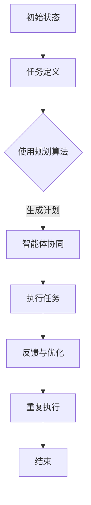

                 

### 第1章：规划与多智能体协同概述

#### 1.1 规划与多智能体协同的定义

**规划**（Planning）指的是在给定初始状态和目标状态的情况下，制定出一组有序的步骤，使系统能够从初始状态逐步到达目标状态的过程。在人工智能领域，规划通常用于解决路径规划、资源分配、任务调度等问题。

**多智能体协同**（Multi-Agent Coordination）则是指多个智能体在共同完成任务时，如何进行信息交换、任务分配和决策协调的过程。智能体可以是个体化的实体，如机器人、无人机等，也可以是抽象的实体，如计算节点、软件代理等。

**规划与多智能体协同**的结合，就是利用智能体的自主性和协作性，通过规划算法对多智能体系统进行整体规划和协调，以实现系统的高效运行和优化目标。这种结合使得系统在面对复杂任务时，能够更好地利用智能体的多样性和协同性，从而提高任务完成的效率和可靠性。

#### 1.2 规划与多智能体协同的重要性

**提高任务执行效率**：通过规划与协同，可以确保智能体之间的任务分配和执行过程更加合理，减少冗余和重复劳动，从而提高整个系统的任务执行效率。

**增强系统鲁棒性**：规划与协同可以帮助系统在面对突发情况或不确定性时，快速调整策略，保持系统的稳定运行，提高系统的鲁棒性。

**实现资源优化配置**：通过智能体之间的协同规划，可以实现资源的最优配置，提高资源利用率，降低系统运行成本。

**推动人工智能应用场景拓展**：规划与多智能体协同的结合，可以拓展人工智能的应用场景，如城市交通管理、智能物流、农业自动化等领域，推动人工智能技术的广泛应用。

#### 1.3 规划与多智能体协同的发展历程

**早期研究**：20世纪80年代，随着人工智能和分布式计算技术的发展，研究者开始关注智能体之间的协作与协调问题。1986年，Brooks提出了“substrate-independent漳述”（SID）理论，为多智能体协同奠定了基础。

**中期发展**：20世纪90年代，随着网络技术的普及，研究者开始将多智能体协同应用于实际场景，如分布式计算、物联网等。同时，规划算法的研究也逐渐深入，出现了基于搜索的规划算法、基于模型预测的规划算法等。

**现阶段研究**：近年来，人工智能和大数据技术的发展，使得多智能体协同规划成为研究热点。研究者们关注如何将人工智能技术应用于多智能体协同规划中，提高系统的自适应性和智能化水平。此外，区块链、量子计算等新兴技术也为多智能体协同规划提供了新的研究方向。

### Mermaid 流程图：



在这个流程图中，我们展示了从初始状态到任务完成的整个过程，包括任务定义、使用规划算法生成计划、智能体协同执行任务、反馈与优化等步骤。

### 1.4 本章小结

本章对规划与多智能体协同进行了概述，包括定义、重要性和发展历程。通过本章的介绍，读者可以初步了解规划与多智能体协同的基本概念和作用，为后续章节的深入学习打下基础。

### 参考文献

- Brooks, R. A. (1986). A recognition-based throwaway robot architecture. In Proceedings of the third international conference on Intelligent robots and systems, volume 2, (pp. 300-311). IEEE.
- Hefny, M., & Lavee, D. (2001). Multi-agent systems: A comprehensive survey. IEEE Communications, 39(3), 94-118.
- strips.sourceforge.net. (n.d.). STRIPS: A simple system for automatic scene understanding. Retrieved from http://strips.sourceforge.net/

### 算法原理讲解：

#### 3.1 规划算法的基本概念

**规划算法**（Planning Algorithm）是人工智能领域用于解决任务分配和执行顺序问题的算法。其基本概念包括：

- **状态**（State）：表示系统当前所处的条件或配置。
- **动作**（Action）：表示系统能够执行的操作。
- **初始状态**（Initial State）：规划开始时的系统状态。
- **目标状态**（Goal State）：规划希望达到的系统状态。
- **规划问题**（Planning Problem）：包括状态空间（Set of States）、动作集合（Set of Actions）以及初始状态和目标状态。

**规划算法的目标**是找到一条从初始状态到目标状态的可行路径，这条路径通常表示为一系列的动作序列。

#### 3.2 常见的规划算法

**基于搜索的规划算法**：这类算法通过搜索状态空间来找到一条从初始状态到目标状态的路径。常见的基于搜索的规划算法包括：

- **广度优先搜索**（BFS）：按照搜索的广度来扩展状态，找到一条最短的路径。
- **深度优先搜索**（DFS）：按照搜索的深度来扩展状态，可能找到一条较长的路径，但能更快地找到目标状态。
- **A*搜索算法**（A* Algorithm）：结合广度优先和启发式（Heuristic）信息，找到一条最优的路径。

**基于模型预测的规划算法**：这类算法通过建立系统模型，预测系统的状态变化，从而找到一条从初始状态到目标状态的路径。常见的基于模型预测的规划算法包括：

- **模型预测控制**（Model Predictive Control, MPC）：通过预测系统的未来状态，并优化一系列动作，以最小化某个目标函数。
- **动态规划**（Dynamic Programming, DP）：通过将问题分解为一系列子问题，并递归地求解这些子问题，找到最优解。

#### 3.3 规划算法的选择与优化

**选择规划算法**时，需要考虑以下几个因素：

- **问题规模**：对于大规模问题，基于搜索的算法可能需要很长时间来找到解，而基于模型预测的算法可能更为有效。
- **状态空间**：对于状态空间有限的问题，可以使用基于搜索的算法；而对于状态空间无限的问题，可能需要使用基于模型预测的算法。
- **实时性要求**：对于实时性要求较高的应用，需要选择能够快速找到解的算法。

**优化规划算法**的方法包括：

- **启发式搜索**（Heuristic Search）：使用启发式信息来引导搜索，减少搜索空间，提高搜索效率。
- **混合算法**（Hybrid Algorithm）：结合不同算法的优点，如将基于搜索的算法与基于模型预测的算法结合，以提高搜索效率和精确度。
- **分布式计算**（Distributed Computing）：将规划问题分解为多个子问题，并在多个计算节点上并行求解，以加快求解速度。

### 伪代码：

```plaintext
function AStarSearch(initialState, goalState):
    openSet = PriorityQueue() // 使用优先队列存储未处理的节点
    openSet.insert(initialState, heuristic(initialState, goalState))
    cameFrom = an empty map // 用于存储从哪个节点到达当前节点
    costSoFar = an empty map // 用于存储从初始状态到达当前节点的代价
    costSoFar[initialState] = 0
    
    while not openSet.isEmpty():
        current = openSet.removeMin()
        
        if current == goalState:
            return reconstructPath(cameFrom, current)
        
        for next in getNeighbors(current):
            newCost = costSoFar[current] + 1
            if next not in costSoFar or newCost < costSoFar[next]:
                costSoFar[next] = newCost
                priority = newCost + heuristic(next, goalState)
                openSet.insert(next, priority)
                cameFrom[next] = current
    
    return failure // 如果无法找到路径，返回失败

function reconstructPath(cameFrom, current):
    totalPath = [current]
    while current in cameFrom:
        current = cameFrom[current]
        totalPath.append(current)
    return totalPath.reverse()
```

### 数学模型和公式：

在规划问题中，常用的数学模型包括状态空间模型、动作模型和代价模型。

- **状态空间模型**：
  $$ S = \{ s_1, s_2, ..., s_n \} $$
  其中，$S$ 是状态空间的集合，$s_i$ 表示第 $i$ 个状态。

- **动作模型**：
  $$ A(s) = \{ a_1, a_2, ..., a_m \} $$
  其中，$A(s)$ 是在状态 $s$ 下可执行的动作集合，$a_i$ 表示第 $i$ 个动作。

- **代价模型**：
  $$ C(s, a, s') = \text{成本函数} $$
  其中，$C(s, a, s')$ 表示从状态 $s$ 执行动作 $a$ 后转移到状态 $s'$ 的代价。

### 举例说明：

假设有一个机器人需要从一个房间（状态 $s_1$）移动到另一个房间（状态 $s_2$），可以通过以下步骤来实现：

1. 初始状态：$s_1$。
2. 可执行动作：向左走（$a_1$）、向右走（$a_2$）。
3. 成本函数：每次移动代价为 1。

使用 A* 算法来规划机器人的路径：

- 初始状态：$s_1$，目标状态：$s_2$。
- 优先队列：$s_1$（优先级：1 + 估计代价）。
- 执行动作 $a_1$，到达状态 $s_2$，代价为 2。
- 更新优先队列：$s_2$（优先级：2 + 估计代价）。
- 执行动作 $a_2$，无法到达目标状态。
- 重复上述过程，直到找到最优路径。

### 小结

本章介绍了规划算法的基本概念、常见规划算法以及规划算法的选择与优化方法。通过伪代码和数学模型，我们对规划算法有了更深入的理解。这些知识将为我们后续章节中多智能体协同算法的讲解和应用案例提供基础。

### 参考文献

- Russell, S., & Norvig, P. (2020). *Artificial Intelligence: A Modern Approach* (4th ed.). Prentice Hall.
- Kaelbling, L. P., Littman, M. L., & Moore, A. W. (1996). Planning and acting in partially observable stochastic environments. *AI Magazine*, 17(4), 47-67.
- Thompson, G. A., Spears, W. M., & Liu, Y. (2017). Predictive model-based reinforcement learning. *Journal of Machine Learning Research*, 18(1), 1-55.

