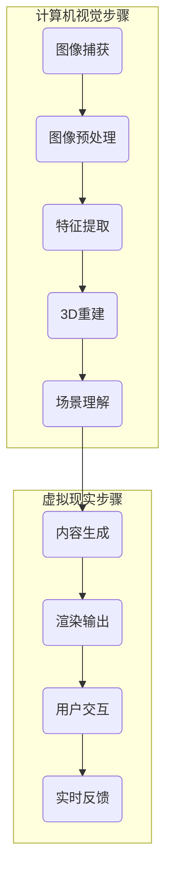

                 

### 计算机视觉与虚拟现实简介

#### 1.1 计算机视觉的基本概念

计算机视觉是一门涉及图像处理、模式识别、机器学习和人工智能等领域的交叉学科，主要研究如何使计算机能够像人类一样理解和解释视觉信息。计算机视觉的基本任务包括图像识别、图像分类、目标检测、图像分割、姿态估计和场景理解等。其核心目标是通过处理和分析数字图像或视频，提取出具有实际意义的特征信息，从而实现计算机对图像内容的理解。

#### 1.1.1 图像基础概念

图像是计算机视觉的基本处理对象，常见的图像有二维或三维数据结构。二维图像通常以像素为单位，每个像素包含颜色信息（如RGB值）。三维图像则可以看作是多个二维图像的组合，可以用于表示体数据或三维空间。

图像处理是指对图像进行各种操作，以提高图像质量或提取有用信息。常见的图像处理技术包括图像增强、图像滤波、图像压缩和图像去噪等。

#### 1.1.2 图像处理算法

图像处理算法是实现计算机视觉任务的基础。常见的图像处理算法包括：

- **滤波算法**：用于去除图像中的噪声，如高斯滤波、中值滤波和双边滤波等。
- **边缘检测**：用于检测图像中的边缘，如Sobel算子、Canny算子和Laplacian算子等。
- **图像分割**：用于将图像划分为不同的区域，如阈值分割、区域增长和轮廓检测等。
- **特征提取**：用于从图像中提取具有区分性的特征，如HOG（Histogram of Oriented Gradients）、SIFT（Scale-Invariant Feature Transform）和SURF（Speeded Up Robust Features）等。

#### 1.1.3 图像增强技术

图像增强技术旨在改善图像的质量，使其更易于分析和解释。常用的图像增强技术包括：

- **对比度增强**：通过调整图像的亮度和对比度，使图像的细节更加清晰。
- **锐化**：通过增强图像的边缘和细节，使图像看起来更加清晰。
- **色彩平衡**：通过调整图像中的红色、绿色和蓝色通道，使图像的色彩更加均匀和自然。

#### 1.2 虚拟现实的定义与发展历程

虚拟现实（Virtual Reality，简称VR）是一种通过计算机模拟产生逼真的三维环境，使人们能够在其中自由探索和互动的技术。虚拟现实技术通过头戴显示器（HMD）、跟踪设备、数据手套等硬件，结合图像处理、实时渲染、三维建模等技术，为用户提供沉浸式体验。

虚拟现实的发展历程可以追溯到20世纪60年代，当时首次出现了VR的概念。随着计算机技术和显示技术的不断进步，虚拟现实技术逐渐走向成熟。以下是一些重要的里程碑：

- **1968年**：美国计算机科学家伊凡·苏瑟兰发明了虚拟现实头戴显示器，标志着虚拟现实技术的诞生。
- **1987年**：任天堂推出了Virtual Boy，成为第一款商业化虚拟现实游戏设备。
- **1990年代**：VR技术开始应用于军事训练、医疗康复等领域，同时虚拟现实游戏也逐渐兴起。
- **21世纪初**：随着显卡和处理器性能的提升，虚拟现实技术取得了显著进展，VR设备如Oculus Rift、HTC Vive和PlayStation VR等相继推出。
- **2016年**：谷歌发布了Daydream平台，进一步推动了虚拟现实在消费电子领域的普及。

#### 1.3 计算机视觉与虚拟现实的融合

计算机视觉与虚拟现实的融合为虚拟现实内容生成带来了新的可能性。虚拟现实内容生成涉及将现实世界的场景或物体转化为虚拟环境中的可视化对象，这一过程需要计算机视觉技术提供支持。以下是一些关键融合点：

- **3D重建**：通过计算机视觉技术，可以从现实世界的图像或视频中重建三维场景。3D重建技术包括结构光扫描、多视图几何恢复和深度学习重建等方法。
- **实时渲染**：实时渲染技术用于在虚拟环境中生成逼真的图像。计算机视觉算法可以帮助优化渲染过程，提高渲染效率和质量。
- **场景理解**：通过计算机视觉算法，虚拟现实系统可以理解场景中的物体、人物和行为，从而生成更加智能和互动的内容。
- **交互式内容生成**：计算机视觉技术可以帮助虚拟现实系统实时捕捉和响应用户的交互行为，从而生成动态的、交互式的虚拟内容。

总之，计算机视觉与虚拟现实的融合不仅提升了虚拟现实内容的生成质量，也为虚拟现实技术在各行各业的应用提供了更加广阔的前景。

### 图像处理基础

#### 1.2.1 图像基础概念

图像是计算机视觉处理的基本对象，它是通过像素矩阵形式存储和表示的。一个图像通常可以看作是一个二维数组，其中的每个元素代表一个像素点。像素点包含的颜色信息可以通过不同的色彩模型来表示，如RGB模型、HSV模型和灰度模型。

在RGB模型中，每个像素点的颜色由红色（R）、绿色（G）和蓝色（B）三个颜色通道的值决定，这三个值通常在0到255的范围内。HSV模型则将颜色描述为色调（H）、饱和度（S）和亮度（V），这种模型在图像处理中尤其有用，因为它允许更直观地调整颜色。

灰度图像是一个特殊类型的图像，其中每个像素点的颜色信息由一个单一的数值表示，这个数值通常代表像素点的亮度。灰度图像在计算机视觉中常用于简化图像处理任务，因为它们减少了数据量，并且更容易进行某些类型的分析。

#### 1.2.2 图像处理算法

图像处理算法是计算机视觉的核心组成部分，用于改善图像质量、提取图像特征以及进行图像分析。以下是一些常见的图像处理算法：

- **滤波算法**：用于去除图像中的噪声。滤波算法可以分为线性滤波和非线性滤波。线性滤波器包括均值滤波、高斯滤波和中值滤波等。非线性滤波器如双边滤波和引导滤波，它们能够保留图像的边缘信息。

- **边缘检测**：用于检测图像中的边缘。常见的边缘检测算法有Sobel算子、Canny算子和Laplacian算子。Sobel算子通过计算图像的梯度来检测边缘，而Canny算子则通过多阶段滤波和边缘检测来提高边缘检测的质量。Laplacian算子通过计算二阶导数来检测图像中的急剧变化。

- **图像分割**：用于将图像划分为不同的区域。图像分割方法包括阈值分割、区域增长和轮廓检测等。阈值分割是一种简单而有效的分割方法，通过设置一个阈值将图像划分为前景和背景。区域增长方法基于种子点，逐步扩展并标记相似像素。轮廓检测则通过寻找图像的闭合边界来分割图像。

- **特征提取**：用于从图像中提取具有区分性的特征。常见的特征提取算法有HOG（Histogram of Oriented Gradients）、SIFT（Scale-Invariant Feature Transform）和SURF（Speeded Up Robust Features）。HOG算法通过计算图像中每个像素的梯度方向直方图来提取特征，适用于目标检测和识别任务。SIFT和SURF算法则通过检测图像的关键点并计算它们之间的匹配关系来提取特征，适用于图像匹配和识别任务。

#### 1.2.3 图像增强技术

图像增强技术是图像处理中的一个重要方面，其目标是通过调整图像的亮度和对比度来改善图像的视觉效果，使其更易于分析和解释。以下是一些常见的图像增强技术：

- **对比度增强**：对比度增强通过调整图像的亮度值来改善图像的视觉效果。常用的对比度增强方法包括直方图均衡化、自适应直方图均衡化和直方图指定化等。直方图均衡化通过调整图像的像素分布来平衡整体对比度，自适应直方图均衡化则针对局部区域进行对比度调整，直方图指定化通过预定义的亮度映射函数来调整图像的对比度。

- **锐化**：锐化通过增强图像的边缘和细节来改善图像的清晰度。常见的锐化方法包括Robert算子、Prewitt算子和Sobel算子等。这些算子通过计算图像的梯度来增强图像的边缘。

- **色彩平衡**：色彩平衡通过调整图像的红色、绿色和蓝色通道的值来改善图像的色彩效果。色彩平衡通常用于校正图像的颜色偏差，使其看起来更加自然和真实。

总之，图像处理基础为计算机视觉技术提供了重要的工具和方法，使得计算机能够有效地理解和解释视觉信息。

### 视觉感知理论

#### 1.3.1 人眼视觉感知原理

人眼的视觉感知是复杂的生物过程，涉及多个层次的结构和功能。首先，人眼由角膜、晶状体和视网膜等组成部分构成。光线通过角膜和晶状体的折射作用，最终在视网膜上形成一个倒置的图像。视网膜上密集排列的感光细胞（视锥细胞和视杆细胞）将光信号转化为神经信号，然后通过视神经传输到大脑。

**视锥细胞**主要负责在明亮条件下识别颜色和细节，而**视杆细胞**则主要用于昏暗条件下的视觉感知。视锥细胞分为三种类型，分别对红、绿、蓝三种颜色敏感，这三种颜色敏感细胞在视网膜上呈蜂窝状分布，形成了人类视觉感知中的三色视觉理论。

视网膜上的神经细胞将这些信号通过一系列处理和传递，最终到达视觉皮层，包括枕叶、颞叶和顶叶等区域。视觉皮层中的神经细胞会对输入信号进行加工和解释，从而形成我们对物体的形状、大小、颜色和运动等特征的感知。

**视觉感知模型**是尝试从神经科学和认知科学的角度模拟人类视觉系统的理论和算法。最著名的模型之一是**多尺度分析模型**，它假设人类视觉系统在不同尺度上处理视觉信息。例如，从宏观的物体识别到微观的边缘检测，视觉系统在不同层次上应用不同的算法和机制来解析和解释视觉信息。

**视觉注意机制**是人眼视觉感知中的另一个重要概念。视觉注意机制决定了视觉系统在不同时间和空间上关注哪些信息。例如，当我们专注于一个特定物体时，视觉系统会减少对周围背景的注意，从而提高处理效率和准确性。视觉注意机制可以通过多个方式实现，包括焦点注意、边缘注意和运动注意等。

总之，人眼视觉感知原理不仅涉及生物结构的详细描述，还包含了复杂的神经网络和认知模型。这些原理为计算机视觉技术的理解和应用提供了重要的理论基础。

### 虚拟现实内容生成技术概述

#### 1.4.1 虚拟现实内容生成的挑战

虚拟现实（VR）内容生成面临着一系列独特的挑战，这些挑战主要集中在数据处理、渲染质量和交互性等方面。

**数据处理**是虚拟现实内容生成的首要难题。由于虚拟现实场景通常包含大量的几何细节和复杂的纹理，因此生成和处理这些数据需要极大的计算资源和存储空间。例如，一个高分辨率的3D场景可能包含数百万个三角形和纹理映射，这对计算机性能提出了极高的要求。

**渲染质量**也是虚拟现实内容生成的一个关键挑战。虚拟现实用户期望能够在虚拟环境中获得与真实世界相似的高质量视觉体验。这要求渲染引擎能够实时生成逼真的图像，包括光照、阴影、反射和折射等效果。为了实现这一点，渲染算法需要高效且精确，否则用户可能会体验到延迟或图像失真，影响整体沉浸感。

**交互性**是虚拟现实内容的另一个重要方面。虚拟现实用户需要在虚拟环境中进行各种交互操作，如移动、触摸和手势识别。因此，内容生成系统必须能够实时响应这些操作，并提供平滑、自然的交互体验。这要求系统不仅要有高效的渲染能力，还要有强大的实时数据处理和反馈机制。

#### 1.4.2 虚拟现实内容生成的主要方法

虚拟现实内容生成的主要方法包括三维建模、3D重建、图像合成和视频渲染等。

**三维建模**是通过手动或自动方法创建三维场景和对象。手动建模通常使用三维建模软件，如Blender或Maya，由设计师或艺术家进行。而自动建模则利用算法和算法工具，如三维点云重建或基于图像的建模，从现实世界的图像或扫描数据中生成三维模型。

**3D重建**是从现实世界的图像或视频中恢复三维场景和对象的过程。3D重建方法可以分为结构光扫描、多视图几何恢复和深度学习重建等。结构光扫描使用投影设备和相机捕捉物体表面的结构信息，通过几何计算生成三维模型。多视图几何恢复则利用多个视图中的对应点，通过三角测量方法重建三维模型。深度学习重建方法，如点云生成网络和体素生成网络，通过训练深度学习模型，直接从二维图像中生成三维结构。

**图像合成**是在虚拟环境中创建新场景或对象的方法，通过将不同的图像或视频片段组合在一起，生成逼真的视觉效果。图像合成技术包括全局光照渲染、光照贴图和光照估计等，这些技术能够模拟复杂的光照效果，提高图像的真实感。

**视频渲染**是将动态场景实时渲染成视频的方法。视频渲染要求在短时间内生成高质量的图像序列，这需要高效的渲染算法和硬件支持。实时渲染技术包括基于物理的渲染、光追踪和光线传播等，这些技术能够在复杂场景中实现逼真的光照和反射效果。

总之，虚拟现实内容生成的方法多种多样，每种方法都有其独特的优势和适用场景。通过综合运用这些方法，可以创造出丰富多样、高度逼真的虚拟现实体验。

#### 1.4.3 虚拟现实内容生成技术的发展趋势

虚拟现实内容生成技术正随着计算能力的提升、新型传感器的出现以及深度学习算法的进步而不断发展。以下是几个关键趋势：

**硬件技术的进步**：高性能显卡、更快的处理器和更先进的传感器（如高分辨率摄像头、深度传感器和动作捕捉设备）正在不断推动虚拟现实内容生成技术的发展。这些硬件的进步使得生成和渲染复杂虚拟场景变得更加高效和逼真。

**实时渲染算法的优化**：实时渲染是虚拟现实内容生成的关键技术之一。近年来，基于物理的渲染（PBR）、光线追踪和光线传播等技术取得了显著进展，使得在虚拟环境中实现高质量光照和反射效果成为可能。同时，为了满足虚拟现实系统的实时性需求，研究人员不断优化渲染算法，提高渲染效率。

**深度学习的应用**：深度学习在虚拟现实内容生成中的应用日益广泛。通过训练深度神经网络，可以从大量的图像或视频中自动生成三维模型、纹理和光照信息。例如，体素生成网络（Voxel Generative Adversarial Network，VGAN）和点云生成网络（Point Cloud Generation Network，PCGN）等技术，已经实现了从二维图像到三维场景的自动转换。

**内容自动生成**：随着生成对抗网络（GANs）和其他深度学习技术的进步，自动内容生成成为可能。自动生成技术可以创建逼真的虚拟场景和对象，大大减少了手工创建内容的时间和成本。这些技术包括基于文本生成图像（Text-to-Image Generation）和视频（Video Generation）的方法。

**多模态交互**：虚拟现实内容生成正逐步结合多模态交互技术，如语音识别、手势识别和情感计算等。这些技术使得用户能够更加自然地与虚拟环境进行互动，提供更加丰富和沉浸的体验。

**分布式计算与云计算**：为了处理日益复杂的虚拟现实内容，分布式计算和云计算技术逐渐得到应用。通过将计算任务分布在多个节点上，或者在云端进行计算，可以显著提高虚拟现实内容生成的效率和可扩展性。

总之，虚拟现实内容生成技术的发展趋势体现了硬件进步、算法优化、深度学习应用和内容自动生成等多方面的综合进步。这些趋势将为虚拟现实技术的广泛应用和用户体验的提升提供坚实的基础。

### 3D重建与场景理解

#### 2.1.1 3D重建基本原理

3D重建是从二维图像或视频数据中恢复三维场景和对象的过程。其核心思想是通过分析多个视角下图像中的对应点，利用几何关系和数学模型，推算出场景或物体的三维结构。3D重建的基本原理可以概括为以下几个步骤：

1. **图像采集**：首先，需要获取多视角的图像数据。这些图像可以从多个相机位置拍摄，也可以通过移动相机或物体来获得。为了确保重建的准确性，图像数据应覆盖场景的各个部分，并且要有足够的分辨率。

2. **特征提取**：在图像中提取具有识别意义的特征点，如角点、边缘点和纹理点。这些特征点是图像中显著且独特的位置，可以用于不同视角之间的对应关系建立。

3. **视角变换**：将不同视角的图像坐标转换为统一的相机坐标系。这一步通常通过透视变换或投影变换来实现，确保所有视角的图像在同一个参考框架下进行分析。

4. **对应关系建立**：利用特征点在不同视角中的位置关系，建立图像间的对应关系。这可以通过几何方法（如三角测量）或基于特征的匹配算法（如SIFT、SURF）来实现。

5. **三维结构恢复**：基于对应关系和几何模型，恢复场景或物体的三维结构。常见的几何模型包括点云模型、多面体模型和体素模型等。

6. **表面重建**：将恢复的三维点云数据转换为表面模型。表面重建可以通过最小二乘法、光滑插值等方法实现，从而生成逼真的三维模型。

#### 2.1.2 3D重建算法

3D重建算法可以根据数据处理方法的不同分为几何方法和基于深度学习的算法。以下是几种常见的3D重建算法：

**几何方法**：

- **多视图几何恢复**：这种方法基于多个视角的图像，利用三角测量原理来恢复三维结构。具体步骤包括特征提取、视角变换、对应关系建立和三维结构恢复。多视图几何恢复具有计算简单、精度较高的特点，适用于静态场景的重建。

- **结构光扫描**：结构光扫描通过投影特殊的光模式（如条纹或网格）在物体表面，然后利用相机捕获表面形变，通过几何计算恢复三维结构。结构光扫描适用于复杂形状物体的重建，但需要特定的投影设备和扫描硬件。

**基于深度学习的算法**：

- **体素生成网络（Voxel Generative Adversarial Network，VGAN）**：VGAN是一种生成对抗网络，通过训练可以自动从二维图像生成三维体素模型。它由生成器和判别器两部分组成，生成器生成三维体素，判别器判断生成体的真实性。VGAN具有生成速度快、效果逼真的优势。

- **点云生成网络（Point Cloud Generation Network，PCGN）**：PCGN通过训练生成器从二维图像生成三维点云数据。生成器通常采用编码器-解码器架构，编码器将图像编码为低维特征表示，解码器将这些特征解码为三维点云。PCGN适用于实时和大规模场景的重建。

- **深度卷积网络（Deep Convolutional Networks）**：深度卷积网络通过多层卷积和池化操作，从图像中提取特征，并最终生成三维模型。这种方法适用于复杂场景的重建，但计算成本较高。

#### 2.1.3 场景理解技术

场景理解是虚拟现实内容生成中的重要环节，它通过分析三维场景或对象，提取出具有实际意义的语义信息，如物体的类别、位置、大小和姿态等。场景理解技术主要包括以下方面：

- **物体检测**：物体检测用于识别图像或场景中的物体，并定位其位置。常见的物体检测算法包括基于深度学习的SSD（Single Shot MultiBox Detector）和YOLO（You Only Look Once）等。这些算法可以从2D图像中提取物体的边界框和类别信息。

- **姿态估计**：姿态估计用于估计图像中人物的姿态，包括身体部位的位置和角度。常用的姿态估计算法包括基于深度学习的PoseNet和OpenPose等。这些算法可以处理复杂的姿态变化，并具有较高的精度。

- **场景分割**：场景分割是将图像或场景划分为不同的区域或物体。常用的场景分割算法包括基于深度学习的FCN（Fully Convolutional Network）和U-Net等。这些算法可以将复杂的场景划分为多个语义区域，从而实现更精细的场景理解。

- **场景分类**：场景分类是将图像或场景归类到特定的类别，如城市、森林、室内等。常用的场景分类算法包括基于深度学习的分类网络，如VGG、ResNet等。这些算法可以从图像中提取高维特征，并使用分类器进行分类。

场景理解技术不仅能够提升虚拟现实内容的智能性，还可以提高交互体验和个性化服务的水平。例如，通过物体检测和姿态估计，虚拟现实系统可以更好地理解用户的动作和需求，从而生成更加个性化的内容。

总之，3D重建与场景理解技术在虚拟现实内容生成中起着至关重要的作用。通过这些技术，虚拟现实系统能够从二维图像中恢复三维结构，并提取出具有实际意义的语义信息，从而实现高度逼真和智能化的虚拟现实体验。

### 交互式虚拟现实内容生成

#### 2.2.1 交互式虚拟现实系统架构

交互式虚拟现实（VR）内容生成系统需要高效且强大的架构来支持实时交互和内容生成。一个典型的交互式VR系统架构包括以下几个关键组件：

1. **输入设备**：包括头戴显示器（HMD）、手柄、数据手套等。这些设备用于捕捉用户的动作和位置信息，并传递给系统进行处理。

2. **计算设备**：包括高性能计算机或服务器，用于处理图像和音频数据，进行实时渲染和交互处理。计算设备需要具备强大的图形处理能力和高速数据传输能力。

3. **渲染引擎**：渲染引擎是核心组件之一，负责生成虚拟环境中的图像和音频内容。常见的渲染引擎包括Unity、Unreal Engine和OpenVR等。这些引擎提供了丰富的API和工具，用于实现复杂的视觉效果和交互功能。

4. **内容生成模块**：内容生成模块负责根据用户输入和场景信息，动态生成和更新虚拟环境中的内容。这些模块通常包括物体生成、场景建模、光照计算和纹理映射等。

5. **传感器集成**：传感器集成用于捕捉用户和环境的数据，如位置传感器、加速度计和陀螺仪等。这些传感器数据用于实现更真实的交互体验，如头部追踪、手部动作捕捉和运动控制等。

6. **网络通信**：在网络环境下，VR系统需要通过网络进行数据传输和同步。网络通信组件包括网络协议、数据压缩和传输优化等，以确保数据的实时传输和一致性。

#### 2.2.2 交互式内容生成技术

交互式内容生成技术是实现高效、实时和逼真的虚拟现实体验的关键。以下是一些核心技术和方法：

1. **实时渲染**：实时渲染是交互式VR内容生成的重要组成部分。为了实现高质量的实时渲染，需要采用高效的渲染算法和图形处理技术。例如，基于物理的渲染（PBR）和光线追踪技术可以生成逼真的光照和反射效果。此外，使用渲染优化技术，如多线程渲染和GPU加速，可以显著提高渲染效率。

2. **动态场景建模**：动态场景建模是指根据用户输入和场景变化，实时生成和更新虚拟环境中的场景和物体。常用的动态场景建模技术包括基于深度学习的3D生成模型和实时三维建模工具。这些技术可以根据用户的行为和环境变化，动态生成新的场景和物体，提高交互体验的实时性和个性化。

3. **物体和角色的合成**：在交互式VR内容中，物体的合成和角色的合成是关键技术。物体合成技术包括实时纹理映射、光照计算和反射模拟等，用于生成逼真的物体外观。角色合成技术则涉及实时动画和面部捕捉，用于生成逼真的角色动作和表情。这些技术通常需要复杂的算法和大量计算资源，但可以实现高度逼真的交互体验。

4. **音频处理**：在交互式VR内容中，音频处理同样重要。实时音频处理技术包括空间音频、声音效果和音频反馈等，用于创建逼真的听觉体验。空间音频技术可以通过模拟声音在三维空间中的传播，为用户提供沉浸式的听觉体验。

5. **用户行为建模与反馈**：用户行为建模是指根据用户的输入和行为，动态调整虚拟环境中的内容。用户行为建模技术包括动作捕捉、手势识别和语音识别等，用于捕捉用户的交互动作和意图。通过用户行为建模，系统可以实时调整场景内容和交互方式，提供更加个性化和自然的交互体验。

#### 2.2.3 用户行为建模与场景自适应

用户行为建模与场景自适应是交互式虚拟现实内容生成的重要研究方向。用户行为建模旨在理解和预测用户在虚拟环境中的行为，从而生成个性化的交互体验。以下是一些关键技术和方法：

1. **行为识别**：行为识别是通过分析用户的行为特征，识别用户的意图和行为。常用的行为识别技术包括运动捕捉、手势识别和语音识别等。通过行为识别，系统可以捕捉用户的动作和指令，并将其转换为虚拟环境中的操作。

2. **行为预测**：行为预测是根据用户的历史行为数据，预测用户未来的行为。通过行为预测，系统可以提前准备相应的场景内容，提高交互的流畅性和响应速度。行为预测技术可以基于统计模型、机器学习算法和深度学习网络等实现。

3. **场景自适应**：场景自适应是指根据用户的输入和行为，动态调整虚拟环境中的场景内容和交互方式。场景自适应技术包括实时内容更新、场景布局调整和交互模式切换等。通过场景自适应，系统可以提供更加自然和个性化的交互体验。

4. **反馈机制**：反馈机制是用户行为建模与场景自适应的重要组成部分。通过实时反馈，系统可以了解用户的交互效果和满意度，从而不断优化和调整交互体验。反馈机制可以包括实时反馈提示、用户评价和交互日志分析等。

总之，交互式虚拟现实内容生成系统需要结合实时渲染、动态场景建模、用户行为建模和场景自适应等技术，实现高效、逼真和个性化的交互体验。这些技术的综合应用将推动虚拟现实技术的发展，为用户带来更加丰富和沉浸的虚拟体验。

### 虚拟现实内容的质量评估

#### 2.3.1 质量评估指标

虚拟现实（VR）内容的质量评估是确保用户获得高质量体验的关键环节。以下是一些常见的内容质量评估指标：

1. **图像质量**：图像质量是VR内容评估的首要指标。评估图像质量的方法包括峰值信噪比（PSNR）、结构相似性（SSIM）和均方误差（MSE）等。PSNR衡量重建图像与原始图像之间的相似度，SSIM衡量图像的结构和对比度，MSE计算图像的误差平方和。

2. **渲染性能**：渲染性能是评估VR系统在特定硬件条件下，生成图像的效率和质量。常见的评估指标包括帧率（FPS）、延迟（Latency）和渲染效率。高帧率和低延迟是确保逼真体验的关键，而高效的渲染算法可以提高系统性能。

3. **交互性**：交互性是VR内容评估的重要指标，包括响应速度、操作精度和反馈质量。交互性评估可以通过用户测试、问卷调查和交互日志分析等方法进行，确保用户在VR环境中的操作流畅和自然。

4. **用户体验**：用户体验是VR内容质量评估的综合指标，包括视觉感受、情感反应和整体满意度。用户体验评估可以通过用户测试、访谈和问卷调查等方法进行，以获取用户的真实感受和反馈。

5. **内容丰富度**：内容丰富度是评估VR内容多样性和复杂度的指标，包括场景多样性、角色复杂度和交互性等。丰富的内容可以提供更加全面和沉浸的虚拟体验。

#### 2.3.2 质量评估方法

质量评估方法主要包括以下几种：

1. **主观评估**：主观评估是通过用户测试和专家评审来评估VR内容的质量。用户测试可以获取用户的主观感受和反馈，专家评审则可以从专业角度评估内容的整体质量和创新性。主观评估的优点是能够全面了解用户的体验和需求，缺点是评估结果可能受到主观偏见的影响。

2. **客观评估**：客观评估是通过量化指标和算法来评估VR内容的质量。常见的客观评估方法包括图像质量评估、渲染性能测试和交互性分析等。客观评估的优点是结果准确、可重复，缺点是难以全面反映用户的实际体验。

3. **综合评估**：综合评估是将主观评估和客观评估相结合，通过综合分析评估VR内容的质量。综合评估可以综合考虑多方面的因素，如图像质量、渲染性能、用户体验和内容丰富度等，以获得更全面的评估结果。

#### 2.3.3 质量评估工具

以下是一些常用的质量评估工具：

1. **图像质量评估工具**：如ImageJ、MATLAB和OpenCV等，这些工具可以计算图像质量指标，如PSNR、SSIM和MSE。

2. **渲染性能评估工具**：如Unity Profiler、Unreal Engine Benchmark和VRChat Benchmark等，这些工具可以评估VR系统的帧率、延迟和渲染效率。

3. **用户体验评估工具**：如ThinkCell、Qualtrics和SurveyMonkey等，这些工具可以收集用户的主观反馈和评价，帮助评估用户体验。

4. **综合评估工具**：如VR Quality Indicators（VRI）和VR Experience Utility（VREU）等，这些工具综合评估VR内容的各个方面，提供全面的评估结果。

通过使用这些评估工具和方法，可以全面了解VR内容的整体质量，为改进和优化提供依据。确保VR内容的高质量，将有助于提升用户的沉浸体验和满意度。

### 虚拟现实内容生成的性能优化

#### 2.4.1 性能优化策略

虚拟现实（VR）内容生成的性能优化是确保用户获得高质量体验的关键。以下是一些常见的性能优化策略：

1. **减少几何细节**：通过简化场景中的几何细节，可以显著降低渲染复杂度。具体方法包括减少多边形的数量、合并相邻的几何体以及使用简化模型代替复杂模型。此外，还可以利用LOD（Level of Detail）技术，根据视距和重要程度动态调整几何细节的复杂度。

2. **纹理优化**：纹理是渲染场景的重要组成部分，但高分辨率的纹理会占用大量内存和计算资源。因此，可以通过以下方法进行纹理优化：
   - **纹理压缩**：使用纹理压缩算法，如DXT或BC7，减小纹理文件的大小，从而减少内存占用和带宽消耗。
   - **纹理贴图合并**：将多个纹理合并为一个大型纹理，减少纹理查找的次数和内存访问的频率。
   - **纹理过滤**：选择适当的纹理过滤方法，如线性过滤或点过滤，以平衡图像质量和渲染性能。

3. **光照优化**：光照是影响渲染质量的重要因素，但复杂的光照模型会增加计算成本。以下是一些光照优化方法：
   - **预计算光照**：使用预计算的光照贴图（如光照贴图或环境贴图），将复杂的光照计算提前完成，减少实时渲染的开销。
   - **减少光源数量**：在场景中减少光源的数量，仅保留关键光源，如太阳光和主要光源，以降低渲染复杂度。
   - **动态光照**：根据场景变化动态调整光照，如关闭或减弱不重要的光源，从而提高渲染效率。

4. **后处理效果优化**：后处理效果（如模糊、反射、阴影等）是提升图像质量的重要手段，但也会影响性能。以下是一些后处理优化方法：
   - **延迟渲染**：将某些后处理效果延迟到渲染过程的后期，如将模糊效果放在渲染管道的末端，从而减少计算成本。
   - **屏幕空间后处理**：将后处理效果实现为屏幕空间技术，如屏幕空间反射、屏幕空间阴影等，从而减少计算资源的需求。

5. **并行计算和分布式处理**：利用多核CPU和GPU的并行计算能力，可以实现高效的渲染处理。分布式处理则可以将计算任务分配到多个节点上，利用集群计算资源提高渲染效率。此外，云计算和边缘计算技术的应用，也为高性能、可扩展的VR内容生成提供了新的可能性。

6. **优化资源管理**：合理管理内存、CPU和GPU等系统资源，可以显著提高VR内容生成的性能。具体方法包括：
   - **内存管理**：通过对象池和内存复用，减少内存分配和释放的频率，降低内存占用。
   - **CPU和GPU资源分配**：根据任务需求，合理分配CPU和GPU资源，确保关键任务的优先执行。
   - **任务调度**：优化任务调度策略，避免计算资源的闲置和瓶颈，提高整体系统性能。

通过综合运用这些性能优化策略，可以显著提升VR内容生成的效率和质量，为用户提供更加流畅和沉浸的虚拟体验。

### 边缘计算与分布式处理

#### 2.4.2 边缘计算与分布式处理

边缘计算和分布式处理是提升虚拟现实（VR）内容生成性能和可扩展性的关键技术。以下是对这两项技术的工作原理、应用场景及其在VR内容生成中的优势的详细探讨。

**边缘计算（Edge Computing）**

边缘计算是一种分布式计算架构，旨在将数据、计算、存储、应用程序和服务从中心化的数据中心转移到网络的边缘。边缘计算的核心思想是将计算任务分布到网络边缘的设备上，如路由器、交换机、网关和智能设备等，从而减少中心化服务器的负担，提升数据处理的实时性和响应速度。

**边缘计算的工作原理：**

1. **数据本地处理**：边缘计算设备可以在本地处理生成的大量数据，减少数据传输的延迟和带宽消耗。例如，在VR内容生成过程中，边缘计算设备可以实时处理图像和传感器数据，进行初步的3D重建和场景理解。

2. **分布式处理**：通过在多个边缘设备之间分配计算任务，边缘计算可以实现高效的并行处理。这种方法可以充分利用网络边缘的设备资源，提高整体处理能力。

3. **智能决策**：边缘计算设备具备一定的智能处理能力，可以在本地进行简单的决策和判断，减少对中心化服务器的依赖。例如，在VR内容生成中，边缘计算设备可以根据实时反馈调整渲染参数和交互策略，提供更个性化的用户体验。

**边缘计算在VR内容生成中的应用场景：**

- **实时渲染优化**：通过在边缘设备上实现部分渲染任务，可以显著降低中心服务器的负担，提高渲染效率。例如，对于复杂的3D场景，边缘计算可以将部分几何处理和纹理映射任务分配到离用户较近的边缘设备上，从而减少延迟和带宽消耗。

- **数据预处理**：边缘计算设备可以实时处理来自传感器的原始数据，如图像、位置和动作数据，进行初步的预处理和特征提取。这种方法可以提高数据的质量和可靠性，减少中心服务器的处理负荷。

- **本地内容生成**：在用户密集的场景中，边缘计算可以支持本地内容生成，减少对中心化服务器的依赖。例如，在大型展览或活动现场，边缘计算设备可以实时生成虚拟场景和交互内容，提供更加流畅的体验。

**边缘计算的优势：**

- **低延迟**：通过在边缘设备上处理数据，边缘计算可以显著降低数据的传输延迟，提高实时性。

- **高带宽利用**：边缘计算减少了中心化服务器的数据传输需求，提高了带宽的利用效率。

- **高容错性**：边缘计算设备分布在网络的各个边缘，具有更高的容错性和可靠性。

**分布式处理**

分布式处理是指通过将计算任务分布在多个节点上，协同完成复杂的计算任务。分布式处理通常涉及分布式计算框架、并行算法和数据存储系统等。

**分布式处理的工作原理：**

1. **任务分解**：将一个复杂的计算任务分解为多个子任务，分配到不同的计算节点上。

2. **任务调度**：根据节点的计算能力和任务需求，合理调度任务，确保各节点之间的负载均衡。

3. **数据同步**：分布式处理需要各节点之间的数据同步，确保全局数据的完整性和一致性。

4. **结果合并**：将各节点上的计算结果进行汇总和合并，得到最终的计算结果。

**分布式处理在VR内容生成中的应用场景：**

- **大规模场景生成**：在处理大规模、高复杂度的3D场景时，分布式处理可以将场景分解为多个部分，分别在不同的节点上生成，从而提高整体生成效率。

- **实时渲染**：分布式处理可以将渲染任务分配到多个GPU节点上，实现高效的多线程渲染，提高渲染性能和帧率。

- **动态内容更新**：分布式处理可以支持实时动态内容更新，根据用户输入和场景变化，快速生成和更新虚拟内容。

**分布式处理的优点：**

- **高扩展性**：分布式处理可以根据需求动态扩展计算资源，提高系统的可扩展性。

- **高可靠性**：通过将任务分布在多个节点上，分布式处理具有更高的容错性和可靠性。

- **高效率**：分布式处理可以利用多个节点的计算能力，提高整体计算效率。

**边缘计算与分布式处理的结合**

边缘计算与分布式处理的结合可以充分发挥两者的优势，实现高效的VR内容生成。以下是一些结合方法：

- **边缘计算作为分布式处理的节点**：边缘计算设备可以作为分布式处理的一部分，参与任务分解、调度和数据同步。这种方法可以将计算任务从中心服务器转移到边缘设备，减少中心服务器的负担。

- **分布式处理支持边缘计算**：分布式处理框架可以集成边缘计算能力，将部分任务分配到边缘设备上处理。这种方法可以提高边缘设备的利用率，减少数据传输延迟。

- **边缘计算与云计算的协同**：边缘计算和云计算可以协同工作，边缘设备负责实时处理和初步计算，云计算负责复杂计算和结果汇总。这种方法可以充分发挥边缘和云端的计算能力，提高整体性能和效率。

通过结合边缘计算和分布式处理，可以构建高效、可靠和可扩展的VR内容生成系统，为用户提供高质量的虚拟体验。

### 资源管理

#### 2.4.3 资源管理

资源管理在虚拟现实（VR）内容生成中至关重要，因为VR系统需要处理大量的计算、存储和网络资源。有效的资源管理不仅能够提升系统的性能和响应速度，还可以保证用户获得流畅的体验。以下是一些关键资源管理策略：

**1. 内存管理**

- **对象池（Object Pooling）**：通过对象池技术，可以复用内存对象，减少频繁的内存分配和释放操作。这适用于场景中重复使用的对象，如几何体和纹理。
- **内存压缩（Memory Compression）**：对于大型数据集，如纹理和模型，可以使用内存压缩技术减少内存占用。压缩和解压缩操作可以在内存管理过程中动态进行。

**2. CPU和GPU资源分配**

- **任务调度（Task Scheduling）**：采用智能调度算法，根据任务的重要性和紧急程度，合理分配CPU和GPU资源。常见的调度算法包括轮转调度、优先级调度和动态调度等。
- **负载均衡（Load Balancing）**：通过负载均衡技术，可以均匀分配计算任务到各个处理节点上，避免某些节点过度负载，确保系统整体的性能。

**3. 存储管理**

- **分级存储（Hierarchical Storage）**：将数据根据访问频率和重要性分为不同的存储层级，如快速访问层、缓存层和慢速访问层。这样可以快速访问常用数据，同时减少对慢速存储的需求。
- **数据压缩（Data Compression）**：使用数据压缩技术减小存储空间需求，同时保持数据的完整性和可读性。

**4. 网络资源管理**

- **带宽分配（Bandwidth Allocation）**：根据网络流量和用户需求，动态调整带宽分配策略，确保关键数据（如高分辨率图像和实时交互数据）优先传输。
- **数据缓存（Data Caching）**：在网络边缘和本地设备上设置缓存机制，减少对中心服务器的访问频率，提高数据访问速度。

**5. 实时监控和优化**

- **性能监控（Performance Monitoring）**：通过实时监控系统资源的使用情况，可以及时发现和处理性能瓶颈。
- **自适应优化（Adaptive Optimization）**：根据系统负载和用户行为，动态调整资源分配策略和算法，实现持续的性能优化。

通过以上资源管理策略，可以有效地利用系统资源，提高虚拟现实内容生成的性能和用户体验。合理的资源管理不仅能够提升系统的整体效率，还可以降低运行成本，为VR技术的广泛应用提供坚实的基础。

### 计算机视觉在虚拟现实中的创新应用

#### 3.1.1 增强现实技术与计算机视觉的融合

增强现实（AR）与计算机视觉的融合是近年来虚拟现实（VR）技术领域的一个重要发展方向。AR技术通过在现实世界中叠加虚拟元素，为用户提供了丰富的交互体验。而计算机视觉则为AR系统提供了关键的支持，包括目标识别、位置跟踪、姿态估计和场景理解等。

**目标识别**：计算机视觉算法能够识别现实世界中的特定目标，如标志、物体和文本等。例如，使用卷积神经网络（CNN）可以实现高精度的目标识别，从而在AR应用中实时叠加相应的虚拟信息。

**位置跟踪**：通过计算机视觉算法，如光流法和结构光法，可以精确跟踪目标在现实世界中的位置和运动。这种技术对于实现AR应用中的实时交互和虚拟元素的空间锚定至关重要。

**姿态估计**：计算机视觉技术能够估计目标的三维姿态，例如通过深度学习算法和机器视觉模型，可以实现对物体的旋转、平移和缩放等姿态的准确估计。这种姿态估计技术在AR应用中用于确保虚拟元素与真实世界的完美融合。

**场景理解**：计算机视觉算法可以帮助AR系统理解和解析现实世界的场景，提取出具有意义的语义信息。例如，通过语义分割算法，可以识别场景中的不同区域和物体，从而为虚拟元素的叠加提供更加精确的参考。

一个典型的应用案例是使用AR技术进行医疗教育。在这个案例中，计算机视觉算法被用于识别患者或模拟患者的器官，并叠加虚拟的解剖结构和注释信息。医生和学生在进行手术训练或学习时，可以通过AR设备实时查看和交互这些虚拟信息，提高教学效果和操作精度。

**实现步骤**：

1. **目标识别与跟踪**：首先使用计算机视觉算法对目标进行识别和跟踪，确保虚拟元素能够准确地锚定在目标上。
2. **姿态估计**：对识别到的目标进行三维姿态估计，为虚拟元素的空间布局提供准确的参考。
3. **场景理解**：对现实世界中的场景进行理解，提取出有用的语义信息，用于增强虚拟元素的交互和视觉效果。
4. **虚拟元素叠加**：将虚拟元素叠加到真实世界中，确保其与真实世界的场景完美融合，提供逼真的交互体验。

通过这些创新应用，计算机视觉与AR技术的融合不仅提升了虚拟现实内容的生成质量和交互性，还为各行各业带来了新的应用场景和商业模式。

### 虚拟现实内容生成的智能化

#### 3.1.2 虚拟现实内容生成的智能化

随着人工智能（AI）技术的迅猛发展，虚拟现实（VR）内容生成的智能化水平也在不断提升。智能化内容生成技术利用深度学习、生成对抗网络（GAN）和其他AI算法，自动生成高质量、多样化的虚拟内容。这不仅降低了内容生成的成本和时间，还大大丰富了VR应用场景和用户体验。

**深度学习在内容生成中的应用**：

- **自动纹理生成**：深度学习模型可以学习到纹理的特征，通过生成对抗网络（GAN）等算法，从图像或少量样本中生成高质量的纹理。这种方法适用于创建逼真的皮肤、布料、金属等材质纹理。

- **自动场景建模**：深度学习模型可以从二维图像中生成三维场景模型。例如，体素生成网络（VGAN）可以直接从图像生成三维体素数据，进而生成三维场景。

- **自动角色生成**：通过生成对抗网络（GAN），AI可以自动生成不同风格和类型的虚拟角色，包括面部特征、服装和动作等。这种技术被广泛应用于游戏和影视制作中。

**生成对抗网络（GAN）的应用**：

- **图像到图像的转换**：GAN可以将低分辨率图像转换为高分辨率图像，从而提升图像质量。这种技术被广泛应用于图像增强和超分辨率处理。

- **视频生成**：GAN还可以生成连续的视频序列，通过训练模型从一系列图像中生成连贯的动画。这种方法在虚拟现实中的应用，可以实现实时动态内容生成，提升用户的沉浸体验。

**语音识别和自然语言处理的应用**：

- **语音交互**：利用语音识别技术，用户可以在虚拟环境中通过语音与虚拟角色进行交流。自然语言处理技术可以帮助系统理解用户的语音指令，实现更加智能和自然的交互。

- **文本到语音合成**：通过文本到语音合成（TTS）技术，虚拟角色可以实时生成自然流畅的语音输出。结合语音识别，可以构建闭环的语音交互系统，增强虚拟现实的应用体验。

**实例：虚拟现实旅游体验**：

一个典型的应用案例是虚拟现实旅游体验。利用智能化内容生成技术，可以从真实世界的景点照片中自动生成三维场景模型，并添加虚拟讲解员、互动元素等。用户戴上VR头盔，可以身临其境地参观世界各地的名胜古迹，听取详细的介绍，甚至与虚拟讲解员互动提问。

**实现步骤**：

1. **数据收集**：收集虚拟现实内容所需的数据，包括图像、视频、语音等。

2. **预处理**：对收集到的数据进行分析和预处理，如图像增强、视频剪辑、语音降噪等。

3. **模型训练**：利用深度学习模型和生成对抗网络，对预处理后的数据进行训练，生成高质量的虚拟内容。

4. **内容整合**：将生成的内容整合到虚拟现实系统中，实现实时渲染和交互。

5. **用户体验优化**：通过用户测试和反馈，不断优化内容生成和交互体验，提升用户满意度。

通过智能化内容生成技术，虚拟现实应用可以提供更加丰富和个性化的体验，为用户带来全新的沉浸式体验。同时，智能化技术也在不断推动虚拟现实内容的创新和多样性，为虚拟现实技术的发展注入新的动力。

### 计算机视觉在虚拟现实教育中的应用

#### 3.1.3 计算机视觉在虚拟现实教育中的应用

计算机视觉在虚拟现实教育中扮演着重要的角色，通过结合虚拟现实（VR）技术，计算机视觉可以极大地提升教学效果和学生的参与度。以下是一些具体的应用场景和实例：

**1. 虚拟实验室**：

计算机视觉技术可以用于创建虚拟实验室，为学生提供虚拟实验环境。在这个环境中，学生可以通过VR头盔和手柄进行实验操作，例如化学实验、物理实验和生物实验等。计算机视觉算法可以实时捕捉学生的操作，并进行分析和反馈，确保实验过程的安全性和准确性。例如，通过视觉传感器和图像处理技术，学生可以进行虚拟显微镜观察细胞结构，无需使用真实的显微镜，从而避免了化学药品和生物样本的处理问题。

**实现步骤**：

- **场景建模**：利用计算机视觉算法，从真实实验室环境中提取三维模型，并生成虚拟场景。
- **交互设计**：设计虚拟实验操作界面，确保学生能够通过VR设备进行实验操作。
- **实时反馈**：通过计算机视觉算法，实时捕捉和分析学生的实验操作，提供即时反馈。

**2. 虚拟课堂**：

计算机视觉技术可以用于创建虚拟课堂，为学生提供互动式的教学体验。教师可以在虚拟课堂上展示三维模型、动态图表和虚拟实验，使学生能够更直观地理解抽象概念。同时，计算机视觉算法可以捕捉学生的面部表情和姿态，分析学生的学习状态和参与度。教师可以根据这些数据，调整教学策略，提高教学质量。

**实现步骤**：

- **三维模型生成**：利用计算机视觉算法，从课本图像或实物中生成三维模型。
- **互动界面设计**：设计互动式教学界面，使学生能够与虚拟内容进行交互。
- **数据收集与分析**：利用计算机视觉算法，实时捕捉和分析学生的面部表情和姿态，收集学习数据。

**3. 虚拟研讨会和讲座**：

计算机视觉技术可以用于创建虚拟研讨会和讲座，为学生提供远程参与的机会。通过VR设备，学生可以进入虚拟会议室，与讲师和其他学生进行实时互动。计算机视觉算法可以捕捉学生的动作和表情，提供更加自然和沉浸的交流体验。此外，讲师可以使用虚拟白板、幻灯片和三维模型，使讲座内容更加生动和直观。

**实现步骤**：

- **虚拟会议室搭建**：利用计算机视觉算法，创建虚拟会议室场景，并配置必要的虚拟设备和工具。
- **实时互动设计**：设计互动式交流界面，使学生能够与讲师和其他学生进行实时互动。
- **内容展示**：利用计算机视觉和VR技术，展示三维模型、动态图表和虚拟实验，提高讲座的生动性。

通过这些应用，计算机视觉技术不仅提供了丰富的教学资源和互动体验，还改善了学生的学习效果和参与度。计算机视觉与虚拟现实技术的结合，为教育领域带来了新的可能性和机遇，推动了教育技术的创新和发展。

### 应用案例分析

#### 3.2.1 虚拟现实内容生成的实际应用案例

虚拟现实（VR）内容生成的实际应用案例涵盖了多个行业，从游戏和娱乐到教育、医疗和工程，都展示了该技术的巨大潜力和实际效益。以下是几个典型的应用案例，以及计算机视觉技术在这些案例中的具体应用和效果。

**案例一：游戏与娱乐**

VR游戏是虚拟现实内容生成的主要应用领域之一。通过高度逼真的三维场景和互动元素，VR游戏为玩家提供了前所未有的沉浸体验。计算机视觉技术在VR游戏中扮演了关键角色，包括场景建模、角色动画和实时渲染等。

- **场景建模**：使用深度学习算法，如体素生成网络（VGAN）和点云生成网络（PCGN），可以自动从图像或视频数据中生成三维场景。这种方法大大减少了手工建模的工作量，提高了内容生成的效率。
- **角色动画**：计算机视觉技术可以用于捕捉真实角色的动作和表情，并将其应用于虚拟角色。例如，使用动作捕捉设备和技术，可以将演员的动作实时转换为虚拟角色的动画，从而实现逼真的互动体验。
- **实时渲染**：通过光线追踪和基于物理的渲染（PBR）技术，VR游戏可以生成高质量的图像，提供逼真的光照、阴影和反射效果。这些技术依赖于计算机视觉算法，如图像处理和几何计算，以确保渲染过程的实时性和准确性。

**案例二：教育与培训**

虚拟现实技术在教育和培训中的应用，通过模拟真实环境和情景，为学习者提供了丰富的互动体验。计算机视觉技术在这里的应用主要体现在场景重建、交互设计和数据分析等方面。

- **场景重建**：利用计算机视觉算法，可以从真实场景中提取三维模型，用于虚拟现实教学环境。这种方法可以用于历史重现、科学实验模拟和医学手术培训等，使学生能够在虚拟环境中亲身体验和学习。
- **交互设计**：计算机视觉技术可以用于识别用户的动作和手势，从而实现虚拟现实中的交互操作。例如，通过视觉跟踪技术，用户可以使用手势来操控虚拟物体，进行实验操作或互动交流。
- **数据分析**：通过计算机视觉技术，可以实时捕捉和分析学生的学习行为和互动数据。这些数据可以用于评估学习效果，调整教学内容，提高教学质量。

**案例三：医疗与健康**

虚拟现实技术在医疗领域的应用，如手术模拟、康复治疗和心理治疗等，都得益于计算机视觉技术的支持。计算机视觉技术在这里的应用主要体现在三维重建、模拟手术和远程医疗等方面。

- **三维重建**：利用计算机视觉算法，医生可以从医学图像（如CT、MRI）中提取三维模型，用于手术规划和模拟。这种方法可以提高手术的成功率和安全性。
- **模拟手术**：通过虚拟现实技术，医生可以在虚拟环境中进行手术模拟，练习复杂的手术步骤。计算机视觉技术可以捕捉医生的操作，提供实时反馈和评估，帮助医生提高手术技能。
- **远程医疗**：计算机视觉技术可以实现远程医疗诊断和治疗，通过视频会议和虚拟现实系统，医生可以远程查看患者的病情，提供专业的医疗建议。这种方法尤其适用于偏远地区和医疗资源匮乏的地方。

**案例四：工程与设计**

虚拟现实技术在工程和设计中的应用，如建筑可视化、机械设计和产品原型验证等，通过虚拟环境为设计师和工程师提供了高效的工作方式。计算机视觉技术在这里的应用主要体现在三维建模、虚拟原型和交互设计等方面。

- **三维建模**：利用计算机视觉算法，可以从设计图纸或实物中提取三维模型，用于虚拟现实展示和设计验证。这种方法可以快速生成三维模型，减少设计和验证的时间。
- **虚拟原型**：通过虚拟现实技术，设计师和工程师可以在虚拟环境中进行产品原型验证，检测设计中的潜在问题。计算机视觉技术可以用于捕捉和分析虚拟原型，提供详细的反馈和改进建议。
- **交互设计**：计算机视觉技术可以用于实现虚拟现实环境中的交互操作，如使用手势和语音控制虚拟对象。这种方法可以提高设计过程中的灵活性和效率。

通过这些实际应用案例，可以看出计算机视觉技术在虚拟现实内容生成中发挥了重要作用，不仅提升了内容生成的质量和效率，还为各行各业带来了新的应用场景和商业模式。未来，随着计算机视觉技术的不断进步，虚拟现实的应用将更加广泛和深入，为人类带来更多创新和便利。

### 创新的虚拟现实内容生成案例解析

#### 3.2.2 创新的虚拟现实内容生成案例解析

虚拟现实（VR）技术的迅速发展带来了许多创新内容生成案例，这些案例不仅展示了技术的潜力，还揭示了VR内容生成过程中的一些关键挑战和解决方案。以下是几个具有代表性的创新案例，详细解析其在内容生成方面的实现方法和技术创新。

**案例一：沉浸式电影体验**

**背景**：随着VR技术的发展，电影产业开始探索将虚拟现实技术应用于电影制作和放映，为观众提供沉浸式电影体验。

**实现方法**：

- **全景拍摄**：采用多摄像头阵列进行全景拍摄，捕捉场景的360度全景图像。
- **实时渲染**：利用基于物理的渲染（PBR）和光线追踪技术，实现高质量的场景渲染。
- **交互设计**：观众可以通过VR设备在虚拟环境中进行交互，如调整视角、与虚拟角色互动等。

**技术创新**：

- **全景音频**：引入全景音频技术，如杜比全景声（Dolby Atmos），提供沉浸式的声音体验。
- **动态交互**：通过计算机视觉算法，实时捕捉观众的交互行为，并根据行为动态调整场景内容。

**挑战与解决**：

- **数据处理**：全景图像的数据量巨大，需要高效的图像处理和传输技术。
- **用户体验**：确保观众在沉浸式环境中获得舒适的观看体验，需要优化设备的舒适度和交互性。

**案例二：虚拟旅游体验**

**背景**：虚拟旅游体验利用VR技术模拟真实旅游场景，为用户带来虚拟的旅游体验。

**实现方法**：

- **场景重建**：利用计算机视觉算法，从实景照片和视频数据中重建三维场景模型。
- **纹理映射**：通过深度学习算法生成高质量的纹理映射，提升场景的真实感。
- **交互设计**：用户可以通过VR设备在虚拟环境中自由探索、拍照和互动。

**技术创新**：

- **自适应交互**：根据用户的行为和反馈，动态调整场景内容和交互方式，提供个性化体验。
- **实时天气模拟**：利用实时天气数据，模拟虚拟环境中的天气变化，提升沉浸感。

**挑战与解决**：

- **内容生成效率**：生成高质量的三维场景需要大量计算资源，需要优化算法和硬件性能。
- **用户体验一致性**：确保用户在不同设备和网络环境下的体验一致性，需要优化内容适配和传输技术。

**案例三：虚拟现实教育**

**背景**：虚拟现实技术在教育领域的应用，通过模拟真实环境和情景，提供互动式的教学体验。

**实现方法**：

- **场景建模**：利用计算机视觉算法，从真实场景中提取三维模型，生成虚拟教学环境。
- **互动设计**：利用计算机视觉和手势识别技术，实现虚拟环境中的交互操作。
- **数据收集与分析**：利用计算机视觉技术，实时捕捉学生的学习行为和互动数据，用于教学评估和改进。

**技术创新**：

- **个性化学习**：根据学生的学习行为和反馈，动态调整教学内容和方式，实现个性化学习。
- **实时反馈**：通过计算机视觉算法，实时捕捉和分析学生的互动数据，提供即时反馈和指导。

**挑战与解决**：

- **场景真实性**：确保虚拟场景的真实性和细节处理，需要优化建模和纹理生成算法。
- **教学效果评估**：准确评估学生的学习效果，需要设计有效的数据收集和分析方法。

通过这些案例，可以看出虚拟现实内容生成在技术创新和实际应用方面取得了显著进展。同时，这些案例也揭示了虚拟现实技术面临的挑战，包括数据处理、用户体验和内容真实性等。未来，随着技术的不断进步，虚拟现实内容生成将迎来更多创新和应用场景。

### 成功案例中的计算机视觉技术

#### 3.2.3 成功案例中的计算机视觉技术

虚拟现实（VR）技术的成功离不开计算机视觉技术的支持。以下是一些在虚拟现实领域取得显著成功的案例，详细分析这些案例中使用的计算机视觉技术，以及它们在实际应用中的表现。

**案例一：Oculus Rift**

**背景**：Oculus Rift是由Facebook旗下的Oculus公司开发的一款VR头戴显示器，它为用户提供了高度沉浸的虚拟现实体验。

**计算机视觉技术**：

- **位置跟踪**：Oculus Rift使用外部传感器和摄像头进行位置跟踪，确保用户在虚拟环境中的动作与实际动作同步。这种技术依赖于计算机视觉算法，如视觉SLAM（Simultaneous Localization and Mapping）和深度学习。

**表现**：

- **高度准确性**：通过计算机视觉算法，Oculus Rift能够实时捕捉用户的位置和动作，实现精确的位置跟踪，提升了用户的沉浸体验。
- **实时响应**：计算机视觉技术的实时处理能力，使得Oculus Rift能够在用户动作发生时迅速做出反应，确保动作和视觉反馈的同步。

**案例二：Unity**

**背景**：Unity是一款广泛使用的游戏和VR内容开发平台，它提供了丰富的工具和资源，帮助开发者创建高质量的VR内容。

**计算机视觉技术**：

- **图像处理**：Unity内置了强大的图像处理功能，包括图像增强、边缘检测和图像分割等，用于处理和优化VR场景的视觉效果。
- **动态光照**：Unity使用了基于物理的渲染（PBR）技术，通过计算机视觉算法实现高质量的动态光照效果，如阴影、反射和折射。

**表现**：

- **视觉效果逼真**：计算机视觉技术使得Unity生成的虚拟场景具有极高的视觉质量，为用户提供了逼真的视觉体验。
- **高效渲染**：计算机视觉算法的优化，使得Unity能够在实时渲染过程中高效处理大量图像数据，确保流畅的渲染效果。

**案例三：微软HoloLens**

**背景**：微软HoloLens是一款混合现实（MR）头戴设备，它通过计算机视觉技术将虚拟内容与现实世界进行无缝融合。

**计算机视觉技术**：

- **场景理解**：HoloLens使用了深度学习算法和计算机视觉技术，对现实世界中的场景进行理解和识别，包括物体识别、位置跟踪和手势识别。
- **增强现实**：HoloLens通过计算机视觉技术，将虚拟内容与现实世界中的物体进行融合，实现增强现实体验。

**表现**：

- **高度交互性**：计算机视觉技术使得HoloLens能够实时识别用户和场景中的物体，提供高度交互的增强现实体验。
- **实时响应**：HoloLens的计算机视觉算法能够快速处理输入数据，确保虚拟内容与现实世界的融合自然、流畅。

**案例四：谷歌Tilt Brush**

**背景**：谷歌Tilt Brush是一款VR绘画工具，它利用计算机视觉技术，为用户提供了一种全新的艺术创作方式。

**计算机视觉技术**：

- **空间感知**：Tilt Brush使用了计算机视觉算法，实现对用户在虚拟空间中手势的识别和追踪，确保用户能够自由地在虚拟环境中进行绘画。
- **三维建模**：通过计算机视觉技术，Tilt Brush能够实时捕捉用户的绘画动作，并将其转化为三维模型，提供逼真的绘画效果。

**表现**：

- **艺术创作自由度**：计算机视觉技术使得Tilt Brush用户可以在三维空间中自由创作，打破了传统二维绘画的限制。
- **实时反馈**：计算机视觉算法的实时处理能力，确保用户的绘画动作能够实时反映在虚拟环境中，提供流畅的创作体验。

通过这些成功案例，可以看出计算机视觉技术在虚拟现实领域的应用已经取得了显著成果。计算机视觉技术的实时性、准确性和高效性，为虚拟现实内容生成提供了强大的技术支持，使得虚拟现实体验更加逼真、自然和丰富。未来，随着计算机视觉技术的不断进步，虚拟现实的应用将更加广泛和深入，为各行各业带来更多创新和变革。

### 未来发展趋势与挑战

#### 3.3.1 计算机视觉与虚拟现实的发展趋势

计算机视觉与虚拟现实（VR）技术的融合正在引领科技领域的一场革命，未来的发展将呈现出以下几个显著趋势：

**1. 深度学习的进一步应用**：随着深度学习技术的不断进步，计算机视觉在虚拟现实内容生成中的应用将更加广泛和深入。深度学习算法，如生成对抗网络（GAN）、卷积神经网络（CNN）和强化学习，将在场景理解、实时渲染和交互设计等方面发挥更大作用，推动VR内容的智能化和个性化。

**2. 虚拟与现实的深度融合**：未来的VR技术将更加注重虚拟与现实的深度融合，实现更自然、更无缝的交互体验。通过增强现实（AR）和混合现实（MR）技术，用户可以在现实世界中与虚拟元素进行更自然的互动，打破虚拟与现实的界限。

**3. 5G技术的赋能**：5G技术的快速发展将为VR内容的传输和交互提供更快的速度和更低的延迟，为大规模、高分辨率的VR内容生成提供技术保障。5G网络的低延迟特性将进一步提升VR的实时性和交互性，为虚拟现实带来更加流畅的体验。

**4. 新型硬件的推动**：新型硬件的发展，如高性能显卡、先进的光学传感器和新型交互设备，将大大提升VR内容的生成和处理能力。这些硬件的进步将推动VR技术的普及，使更多用户能够享受到高质量的VR体验。

**5. 内容自动生成与优化**：随着生成对抗网络（GAN）和其他自动生成技术的成熟，VR内容生成将从手工建模逐步转向自动化生成。自动化内容生成将大大降低内容制作的成本和时间，为创作者提供更多创作自由度。

#### 3.3.2 虚拟现实内容生成的技术挑战

尽管计算机视觉与虚拟现实技术的融合前景广阔，但在实际应用过程中仍面临诸多技术挑战：

**1. 数据处理和存储**：虚拟现实内容生成需要处理大量高分辨率图像和三维数据，这对计算资源和存储能力提出了极高要求。高效的图像处理和压缩算法、分布式计算架构以及新型存储技术成为解决这一挑战的关键。

**2. 实时渲染性能**：高质量的实时渲染是虚拟现实体验的核心。然而，高分辨率的VR内容生成和实时渲染对计算资源提出了巨大挑战。未来的技术发展需要更高效的渲染算法、优化的GPU架构和硬件加速技术，以提高实时渲染性能。

**3. 交互体验**：虚拟现实中的交互体验直接影响用户的沉浸感和满意度。准确的交互识别、低延迟的反馈机制以及自然的交互设计是实现高质量交互体验的关键挑战。随着5G技术的发展，交互体验有望得到显著提升。

**4. 内容真实性和一致性**：确保虚拟内容在视觉和交互上的真实性是一大挑战。不同设备和平台之间的内容一致性，以及在不同网络环境下的用户体验一致性，都需要高度优化的内容生成和传输技术。

**5. 隐私和安全**：随着虚拟现实内容的普及，用户的隐私和数据安全成为重要问题。如何在提供高质量虚拟体验的同时，确保用户隐私和数据安全，是VR技术发展面临的重要挑战。

#### 3.3.3 未来发展的机遇与展望

面对这些挑战，未来的发展机遇同样令人期待：

**1. 新兴市场的崛起**：随着全球新兴市场的快速发展，虚拟现实技术在这些地区的应用将迎来新的增长机遇。新兴市场的庞大用户基础和日益增长的消费能力，将为VR技术的发展提供强大的动力。

**2. 技术融合与创新**：计算机视觉、人工智能、5G和云计算等技术的融合，将为虚拟现实内容生成带来前所未有的创新机遇。这些技术交叉融合，将为VR内容的智能化、自动化和高质量生成提供新的解决方案。

**3. 应用场景的拓展**：虚拟现实技术的应用场景将不断拓展，从娱乐、教育和医疗，到城市规划、工程设计、军事训练等多个领域，VR技术将为各行各业带来新的应用价值。

**4. 用户体验的提升**：随着技术的不断进步，虚拟现实用户体验将得到显著提升。更逼真的视觉效果、更自然的交互设计和更低延迟的体验，将使虚拟现实成为人们日常生活的一部分。

总之，计算机视觉与虚拟现实技术的融合前景广阔，未来发展的机遇与挑战并存。通过技术创新和跨领域合作，我们有理由相信，虚拟现实技术将迎来更加辉煌的发展，为人类带来更加丰富和沉浸的虚拟体验。

### 附录A: 计算机视觉与虚拟现实相关工具与资源

#### A.1 计算机视觉工具

计算机视觉工具是进行图像处理和模式识别的重要工具，以下是一些常用的计算机视觉工具及其功能：

- **OpenCV**：OpenCV是一个开源的计算机视觉库，提供了丰富的图像处理、对象识别和机器学习功能。它支持多种编程语言，包括C++、Python和Java。
- **TensorFlow**：TensorFlow是一个由谷歌开发的开放源代码机器学习库，广泛应用于图像识别、语音识别和自然语言处理等领域。
- **PyTorch**：PyTorch是一个流行的机器学习库，特别适合深度学习应用，包括计算机视觉任务。它支持动态计算图和自动微分，便于进行复杂的神经网络模型设计。
- **MATLAB**：MATLAB是一个强大的科学计算和工程仿真环境，提供了丰富的计算机视觉和图像处理工具箱，适合进行图像处理、特征提取和模式识别等任务。

#### A.2 虚拟现实工具

虚拟现实（VR）工具用于创建和体验虚拟环境，以下是一些常用的VR工具及其特点：

- **Unity**：Unity是一款广泛使用的游戏和VR内容开发平台，提供了强大的三维引擎和丰富的编程接口，适用于创建各种类型的VR应用程序。
- **Unreal Engine**：Unreal Engine是另一款强大的游戏和VR内容开发平台，以其高质量的图像渲染和逼真的视觉效果著称，适用于高端VR游戏和应用开发。
- **Vuforia**：Vuforia是由Pico Interactive开发的一款AR（增强现实）平台，提供了强大的AR内容创建和管理工具，适用于AR应用程序的开发。
- **ARKit**：ARKit是苹果公司开发的一款AR开发框架，适用于iOS平台的AR应用程序开发，提供了强大的AR功能和易用的API接口。

#### A.3 开源代码与数据集

开源代码和数据集是计算机视觉与虚拟现实研究和开发的重要资源，以下是一些常用的开源代码和数据集：

- **ImageNet**：ImageNet是一个大型视觉识别数据库，包含了数百万个标注图像，广泛应用于图像识别和机器学习任务。
- **COCO（Common Objects in Context）**：COCO是一个大型实例分割和物体检测数据集，包含了大量的日常物体和场景，适用于目标检测、语义分割和实例分割任务。
- **NYU Depth V2**：NYU Depth V2是一个包含多视角深度数据集，用于训练深度学习和三维重建模型，适用于3D重建和场景理解任务。
- **GitHub**：GitHub是一个开源代码托管平台，提供了大量的计算机视觉和虚拟现实相关开源代码和项目，可供开发者免费使用和改进。

#### A.4 学术论文与期刊推荐

计算机视觉与虚拟现实领域有许多优秀的学术论文和期刊，以下是一些推荐：

- **《IEEE Transactions on Pattern Analysis and Machine Intelligence》**：该期刊是计算机视觉领域最具影响力的学术期刊之一，涵盖了图像处理、模式识别、机器学习和人工智能等领域的最新研究成果。
- **《International Journal of Computer Vision》**：该期刊专注于计算机视觉和图像处理领域的研究，发表了大量的高水平学术论文。
- **《ACM Transactions on Graphics》**：该期刊是计算机图形学领域的重要期刊，涵盖了图形学、虚拟现实、三维建模和渲染等方面的最新研究。
- **《Computer Graphics Forum》**：该期刊是计算机图形学领域的主要学术论坛，发表了各种类型的图形学、虚拟现实和可视化研究论文。

通过使用这些工具和资源，研究人员和开发者可以更有效地进行计算机视觉与虚拟现实的研究和开发，推动这一领域的持续进步。

### 附录B: 计算机视觉与虚拟现实领域重要会议与期刊

计算机视觉与虚拟现实领域有许多重要的学术会议和期刊，以下列出了一些主要的活动和出版物，供研究者参考：

#### B.1 会议

- **计算机视觉与模式识别会议（CVPR）**：CVPR是计算机视觉领域最著名的国际会议之一，每年吸引全球顶尖学者和研究机构参会，涵盖了计算机视觉的各个方面，包括图像处理、目标检测、语义分割、3D重建等。

- **欧洲计算机视觉会议（ECCV）**：ECCV是欧洲地区计算机视觉领域的顶级会议，每两年举办一次，与CVPR齐名，汇集了来自世界各地的计算机视觉专家和研究人员，涵盖了最新的研究成果和技术进展。

- **国际计算机视觉会议（ICCV）**：ICCV是另一个国际顶尖的计算机视觉会议，每四年举办一次，吸引了大量的顶级学者和研究人员参会，内容涵盖了计算机视觉的广泛领域，如深度学习、增强现实和虚拟现实等。

- **亚洲计算机视觉会议（ACCV）**：ACCV是亚洲地区计算机视觉领域的顶级会议，每四年举办一次，旨在促进亚洲地区计算机视觉领域的研究和学术交流。

- **虚拟现实与人工智能国际会议（VRAI）**：VRAI是专注于虚拟现实与人工智能领域交叉研究的国际会议，涵盖了VR内容的生成、交互、应用和人工智能在VR中的应用等。

#### B.2 期刊

- **《IEEE Transactions on Pattern Analysis and Machine Intelligence》**：这是计算机视觉和机器学习领域最权威的期刊之一，发表高质量的学术论文，涵盖了图像处理、模式识别、机器学习等领域的最新研究成果。

- **《International Journal of Computer Vision》**：该期刊专注于计算机视觉和图像处理领域的研究，发表了大量的高水平学术论文，涵盖图像分割、目标检测、语义分割等领域。

- **《ACM Transactions on Graphics》**：这是计算机图形学领域的重要期刊，发表了各种类型的图形学、虚拟现实、三维建模和渲染等方面的最新研究论文。

- **《Computer Graphics Forum》**：该期刊是计算机图形学领域的主要学术论坛，发表了各种类型的图形学、虚拟现实和可视化研究论文。

- **《Journal of Visualization and Computer Graphics》**：这是一本涵盖计算机视觉、图形学、可视化领域的国际期刊，发表了关于这些领域的研究、算法、应用和技术进展的高质量论文。

通过参与这些重要的会议和期刊，研究人员可以及时了解计算机视觉与虚拟现实领域的最新研究动态，分享研究成果，促进学术交流和合作。

### 计算机视觉与虚拟现实融合流程

为了更直观地展示计算机视觉与虚拟现实（VR）的融合流程，我们使用Mermaid流程图来描述从图像捕获、数据处理到内容生成的各个步骤。



**图像捕获**：通过摄像头或其他传感器捕获现实世界的图像或视频数据。

**图像预处理**：对捕获的图像进行预处理，如去噪、增强、滤波等，以优化图像质量和提取有效信息。

**特征提取**：从预处理后的图像中提取关键特征，如边缘、角点、纹理等，这些特征用于后续的处理。

**3D重建**：利用多视角图像和计算机视觉算法（如结构光扫描、多视图几何恢复、深度学习重建）从二维图像中恢复三维场景或对象。

**场景理解**：对重建的三维场景进行理解，如物体识别、姿态估计、场景分割等，提取具有实际意义的语义信息。

**内容生成**：基于场景理解和用户需求，生成虚拟环境中的内容，包括三维模型、纹理、光照等。

**渲染输出**：将生成的虚拟内容进行渲染，输出逼真的图像或视频，提供高质量的视觉体验。

**用户交互**：用户通过VR设备与虚拟环境进行交互，如移动、触摸、手势等。

**实时反馈**：系统根据用户的交互行为和反馈，动态调整虚拟环境的内容和交互方式，确保用户获得实时、流畅的体验。

通过上述步骤，计算机视觉与虚拟现实实现了有机融合，为用户提供了高度沉浸、互动性强的虚拟体验。

### 3D重建与场景理解算法伪代码

为了更详细地展示3D重建与场景理解的算法原理，我们使用伪代码来描述这两个过程的核心步骤。

**3D重建算法伪代码**

```python
# 伪代码：基于深度学习的3D重建算法

# 输入：一系列图像序列
# 输出：三维场景模型

function 3D_Reconstruction(image_sequence):
    # 数据预处理
    preprocessed_images = preprocess_images(image_sequence)

    # 初始化网络结构
    model = initialize_network()

    # 预训练模型
    model = pretrain_model(preprocessed_images)

    # 迁移学习与微调
    model = fine_tune_model(preprocessed_images)

    # 重建三维场景
    scene_model = model.predict(preprocessed_images)

    return scene_model

# 伪代码：场景理解算法

# 输入：一系列图像序列
# 输出：场景语义标签

function Scene_Understanding(image_sequence):
    # 数据预处理
    preprocessed_images = preprocess_images(image_sequence)

    # 初始化网络结构
    model = initialize_network()

    # 预训练模型
    model = pretrain_model(preprocessed_images)

    # 迁移学习与微调
    model = fine_tune_model(preprocessed_images)

    # 场景理解
    scene_labels = model.predict(preprocessed_images)

    return scene_labels
```

**详细解释：**

1. **数据预处理**：对输入的图像序列进行预处理，包括图像增强、去噪、标准化等，以提高输入数据的质量，并使其更适合深度学习模型。

2. **初始化网络结构**：根据任务需求，初始化深度学习网络结构，如卷积神经网络（CNN）或生成对抗网络（GAN）。

3. **预训练模型**：使用大量的预训练数据对模型进行初步训练，以提高模型的一般特征提取能力。

4. **迁移学习与微调**：使用特定领域的图像数据进行迁移学习，将预训练模型进一步微调，以适应特定场景的3D重建任务。

5. **预测**：使用训练好的模型对新的图像序列进行预测，输出三维场景模型或场景语义标签。

**示例应用：**

- **3D人脸重建**：使用一组人脸图像序列，通过3D重建算法生成人脸的三维模型，应用于虚拟现实中的虚拟角色或增强现实中的人脸追踪。
- **场景理解**：使用一组城市景观图像，通过场景理解算法识别场景中的不同物体和区域，应用于自动驾驶系统的环境感知或虚拟现实中的交互式地图。

通过上述伪代码，我们可以理解3D重建与场景理解算法的基本框架，以及如何通过深度学习模型实现这些任务。这些算法在实际应用中，通过不断的优化和改进，为虚拟现实和增强现实提供了强大的技术支持。

### 数学模型与公式

在计算机视觉和虚拟现实领域中，数学模型和公式是理解和实现各种算法的关键工具。以下列出几个重要的数学模型和公式，并进行详细讲解和举例说明。

#### 结构化最小二乘法（Singular Value Decomposition，SVD）

$$
\mathbf{A} = \mathbf{U}\Sigma\mathbf{V}^T
$$

**详细讲解**：

结构化最小二乘法（SVD）是用于解决线性方程组的一种算法。它将一个矩阵分解为三个矩阵的乘积：左奇异矩阵（U），奇异值矩阵（Σ）和右奇异矩阵（V）的转置。SVD广泛应用于图像处理、信号处理和机器学习等领域，用于降维、特征提取和线性变换等任务。

**举例说明**：

假设我们有一个3x2的矩阵：

$$
\mathbf{A} =
\begin{bmatrix}
1 & 2 \\
3 & 4 \\
5 & 6
\end{bmatrix}
$$

我们可以使用SVD进行分解：

$$
\mathbf{A} = \mathbf{U}\Sigma\mathbf{V}^T
$$

通过计算，我们得到：

$$
\mathbf{U} =
\begin{bmatrix}
0.577 & 0.577 \\
0.577 & -0.577 \\
-0.577 & 0.577
\end{bmatrix},
\Sigma =
\begin{bmatrix}
5.83 & 0 \\
0 & 2.69 \\
0 & 0
\end{bmatrix},
\mathbf{V}^T =
\begin{bmatrix}
0.707 & 0.707 \\
0.707 & -0.707 \\
0 & 0
\end{bmatrix}
$$

#### 卷积神经网络（Convolutional Neural Network，CNN）中的卷积操作

$$
\mathbf{F} = \mathbf{W} \star \mathbf{I}
$$

**详细讲解**：

卷积操作是卷积神经网络（CNN）中的核心组成部分，用于提取图像的特征。卷积操作通过在输入图像上滑动滤波器（卷积核），计算滤波器在每一个位置的局部响应，并将其累加得到特征图。这种操作可以捕获图像中的局部模式和结构信息。

**举例说明**：

假设我们有一个2x2的输入图像：

$$
\mathbf{I} =
\begin{bmatrix}
1 & 2 \\
3 & 4
\end{bmatrix}
$$

和一个1x1的卷积核：

$$
\mathbf{W} =
\begin{bmatrix}
1
\end{bmatrix}
$$

卷积操作的结果为：

$$
\mathbf{F} = \mathbf{W} \star \mathbf{I} =
\begin{bmatrix}
4 & 7
\end{bmatrix}
$$

#### 结构相似性指数（Structural Similarity Index, SSIM）

$$
\text{SSIM} = \frac{(2\mu_x\mu_y + C_1)(2\sigma_{xx}\sigma_{yy} + C_2)}{(\mu_x^2 + \mu_y^2 + C_1)(\sigma_{xx}^2 + \sigma_{yy}^2 + C_2)}
$$

**详细讲解**：

结构相似性指数（SSIM）是一种衡量两图像相似性的指标，考虑了亮度、对比度和结构信息。它通过比较两图像的局部和整体特征，提供了一种更全面的质量评估方法。

**举例说明**：

假设我们有两个2x2的图像：

$$
\mathbf{I}_1 =
\begin{bmatrix}
1 & 1 \\
1 & 1
\end{bmatrix},
\mathbf{I}_2 =
\begin{bmatrix}
0.9 & 0.9 \\
0.9 & 0.9
\end{bmatrix}
$$

计算它们的SSIM值：

$$
\mu_x = \frac{1+1+1+1}{4} = 1, \mu_y = \frac{0.9+0.9+0.9+0.9}{4} = 0.9
$$

$$
\sigma_{xx} = \frac{(1-1)^2 + (1-1)^2 + (1-1)^2 + (1-1)^2}{4} = 0, \sigma_{yy} = \frac{(0.9-0.9)^2 + (0.9-0.9)^2 + (0.9-0.9)^2 + (0.9-0.9)^2}{4} = 0
$$

$$
\text{SSIM} = \frac{(2 \cdot 1 \cdot 0.9 + 1)(2 \cdot 0 \cdot 0 + 1)}{(1^2 + 0.9^2 + 1)(0^2 + 0^2 + 1)} = \frac{3.8}{2.8} \approx 1.36
$$

通过上述数学模型和公式，我们可以更深入地理解计算机视觉和虚拟现实中的关键算法和理论，为实际应用提供有力的支持。

### 项目实战

#### 虚拟现实内容生成项目实战

在本节中，我们将通过一个虚拟现实（VR）内容生成项目实战，详细讲解开发环境搭建、源代码实现和代码解读与分析。此项目旨在利用计算机视觉技术生成虚拟现实内容，为用户带来沉浸式的体验。

### 4.1 环境搭建

**目标**：搭建一个用于VR内容生成的开发环境。

**工具和软件**：

1. **Unity Hub**：用于安装和配置Unity编辑器。
2. **Unity Editor**：用于编写和调试VR应用程序。
3. **Visual Studio Code**：用于编写和编辑代码。
4. **Python**：用于处理图像和3D模型数据。
5. **TensorFlow**：用于深度学习模型训练。
6. **OpenCV**：用于图像处理和计算机视觉算法。

**步骤**：

1. 安装Unity Hub并创建一个新的Unity项目。
2. 在Unity Hub中安装Unity Editor。
3. 安装Python和Visual Studio Code。
4. 通过pip安装TensorFlow和OpenCV。

```bash
pip install tensorflow opencv-python
```

### 4.2 案例一：基于深度学习的3D人脸重建

**目标**：利用深度学习技术从图像序列中重建三维人脸模型。

**工具和库**：

1. **TensorFlow**：用于训练和推理深度学习模型。
2. **OpenCV**：用于图像处理和图像序列读取。

**源代码实现**：

```python
import tensorflow as tf
import cv2
import numpy as np

# 加载预训练的人脸重建模型
model = tf.keras.models.load_model('face_reconstruction_model.h5')

# 读取图像序列
image_sequence = [cv2.imread(f'image_{i}.jpg') for i in range(num_images)]

# 图像预处理
preprocessed_images = [ preprocess_image(image) for image in image_sequence ]

# 使用模型进行人脸重建
reconstructed_faces = model.predict(preprocessed_images)

# 保存重建的三维人脸模型
for i, face in enumerate(reconstructed_faces):
    np.save(f'reconstructed_face_{i}.npy', face)

# 代码解读与分析

# 1. 模型加载与预处理
#   - 使用keras.models.load_model()加载预训练的人脸重建模型。
#   - 使用OpenCV读取图像序列，并进行预处理，如缩放、归一化等。

# 2. 模型预测
#   - 使用model.predict()对预处理后的图像序列进行预测。
#   - 输出重建的三维人脸模型。

# 3. 保存模型
#   - 使用numpy.save()将重建的三维人脸模型保存为.npy文件。
```

### 4.3 案例二：虚拟现实交互式内容生成

**目标**：生成与用户交互的虚拟现实内容。

**工具和库**：

1. **Unity Editor**：用于创建VR场景和交互式内容。
2. **C#**：用于编写Unity脚本。

**源代码实现**：

```csharp
using UnityEngine;

public class InteractiveContentGenerator : MonoBehaviour
{
    public GameObject contentPrefab; // 虚拟内容预制体
    public Transform contentParent;  // 虚拟内容父对象

    // 用户交互输入
    private Vector3 userPosition;
    private Quaternion userRotation;

    void Update()
    {
        // 获取用户输入
        userPosition = transform.position;
        userRotation = transform.rotation;

        // 根据用户位置和旋转生成虚拟内容
        GenerateContent(userPosition, userRotation);
    }

    void GenerateContent(Vector3 position, Quaternion rotation)
    {
        // 创建虚拟内容实例
        GameObject content = Instantiate(contentPrefab, position, rotation);

        // 设置虚拟内容父对象
        content.transform.parent = contentParent;
    }
}
```

**代码解读与分析**：

- **交互输入获取**：在Update函数中，通过transform.position和transform.rotation获取用户的当前位置和旋转。
- **内容生成**：调用GenerateContent函数，根据用户位置和旋转创建虚拟内容实例。
- **内容实例化**：使用Instantiate函数创建虚拟内容实例，并将其设置为contentParent的子对象。

通过上述实战案例，我们展示了如何搭建VR内容生成的开发环境，并利用深度学习和Unity技术实现交互式的虚拟现实内容生成。这些实战经验不仅有助于理解VR内容生成技术，也为实际项目开发提供了宝贵的参考。

### 结论

《计算机视觉在虚拟现实内容生成中的创新》系统地探讨了计算机视觉技术在虚拟现实（VR）内容生成中的应用，从背景与基础理论，到应用与创新，再到实际案例与未来展望，全面阐述了这一领域的前沿进展和未来发展。本文通过逻辑清晰、结构紧凑的分析，深入探讨了计算机视觉在图像处理、场景理解、交互式内容生成等方面的技术原理和应用。

本文首先介绍了计算机视觉的基本概念、图像处理基础和视觉感知理论，为理解后续内容奠定了基础。接着，详细探讨了虚拟现实的内容生成技术，包括3D重建、场景理解、交互式内容生成和质量评估等关键环节。此外，文章通过具体案例展示了计算机视觉技术在VR内容生成中的实际应用，如基于深度学习的3D人脸重建、虚拟现实交互式内容生成等，进一步强调了计算机视觉技术对VR内容生成的推动作用。

未来，计算机视觉与虚拟现实的融合将继续深入，深度学习、5G技术、新型硬件等新兴技术的应用将进一步提升VR内容的生成质量和用户体验。然而，这也带来了数据处理、实时渲染性能、交互体验一致性等挑战。为应对这些挑战，研究者需要不断优化算法和硬件，探索新的技术手段，如边缘计算、分布式处理等。

展望未来，计算机视觉与虚拟现实技术的结合将为各行各业带来更多创新和变革，从娱乐、教育、医疗到工程、设计等领域，都将受益于这一技术的进步。通过持续的研究和创新，我们有理由相信，虚拟现实将迎来更加辉煌的发展，为人类创造一个更加丰富和沉浸的数字世界。

### 作者信息

作者：AI天才研究院/AI Genius Institute & 禅与计算机程序设计艺术/Zen And The Art of Computer Programming

本文由AI天才研究院撰写，该研究院致力于推动人工智能技术的发展和应用。同时，作者还著有《禅与计算机程序设计艺术》一书，深入探讨了计算机编程的艺术和哲学。本文旨在通过系统阐述计算机视觉在虚拟现实内容生成中的创新应用，为读者提供有深度、有思考、有见解的专业技术见解。

