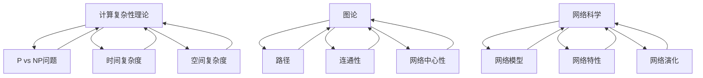

                 

### 核心概念与联系

复杂性计算是一个广泛的研究领域，它涉及计算理论、图论、网络科学等多个学科。在这一章节中，我们将探讨复杂性计算的核心概念，并介绍这些概念之间的联系。

#### 复杂性计算的定义与计算复杂性理论

复杂性计算是指研究问题的难易程度以及如何有效地解决问题的学科。计算复杂性理论是复杂性计算的核心部分，它研究问题在计算资源上的难度。核心概念包括：

- **P vs NP问题**：P问题是可以在多项式时间内解决的决策问题，而NP问题是可以在多项式时间内验证的决策问题。P vs NP问题是复杂性计算中最著名的问题之一，它探讨P和NP是否相同。

- **NP完全问题**：NP完全问题是指那些可以将任何NP问题在多项式时间内归约到某个特定问题的决策问题。这些问题是复杂性计算中的“难题”，因为如果能够解决NP完全问题，那么所有NP问题都可以在多项式时间内解决。

- **时间复杂度与空间复杂度**：时间复杂度是描述算法执行时间与输入规模的关系，空间复杂度是描述算法所需内存与输入规模的关系。

#### 图论在网络科学中的应用

图论是复杂性计算中的重要分支，它研究图形及其性质。在网络科学中，图论的应用非常广泛，核心概念包括：

- **图**：图是由节点和边构成的集合，用于表示实体之间的关系。

- **路径**：图中节点之间的一条连续边序列，表示从一个节点到另一个节点的通道。

- **连通性**：图中任意两个节点之间存在路径，则称图为连通图。

- **网络中心性**：用于衡量节点在网络中的重要性，常见的中心性指标包括度中心性、介数中心性和紧密中心性。

#### 网络科学的基石

网络科学是复杂性计算的一个分支，它研究网络的性质、行为和演化。网络科学的基石包括：

- **网络模型**：用于描述网络的数学模型，常见的网络模型包括随机网络、小世界网络和无标度网络。

- **网络特性**：用于描述网络结构和行为的量化指标，如聚类系数、平均路径长度、网络密度等。

- **网络演化**：研究网络在时间和空间上的演化规律，包括网络的生成模型、演化模型和自适应模型。

#### Mermaid 流�程图

以下是一个简单的 Mermaid 流程图，展示复杂性计算的核心概念和联系：



### 核心算法原理讲解

在复杂性计算和网络科学中，有许多核心算法用于解决具体问题。以下我们将使用伪代码详细阐述这些算法的工作原理。

#### 网络流算法

网络流算法是解决最大流问题的核心算法。以下是一个简单的最大流算法的伪代码：

```plaintext
算法：最大流
输入：有向图G，容量函数c(u, v)
输出：最大流f
初始化：令f(u, v) = 0，对所有的(u, v) ∈ E
选择一个源点s和汇点t
while 找到增广路径P from s to t do
    let Δ be the minimum capacity of edges on P
    for each edge (u, v) on P do
        f(u, v) += Δ
        f(v, u) -= Δ
    end for
end while
return f
```

这个算法的基本思想是使用广度优先搜索找到增广路径，然后沿着这条路径调整流量，直到无法找到增广路径为止。

#### 网络科学中的图论算法

图论算法在网络科学中应用广泛，以下是最短路径算法的伪代码：

```plaintext
算法：迪杰斯特拉（Dijkstra）算法
输入：图G，源点s
输出：最短路径距离dist[]和路径π[]
初始化：令dist[s] = 0，dist[v] = ∞，π[v] = null，对所有的v ≠ s
将s加入集合S，将其他所有节点加入集合U
while U不为空 do
    选择一个具有最小dist值的节点u ∈ U，将u加入集合S
    for each edge (u, v) ∈ E do
        if dist[u] + weight(u, v) < dist[v] then
            dist[v] = dist[u] + weight(u, v)
            π[v] = u
        end if
    end for
end while
return dist[], π[]
```

迪杰斯特拉算法的基本思想是使用优先队列来维护当前找到的最短路径，然后逐步扩展到其他节点。

#### 网络模型的计算复杂性

网络问题通常涉及计算复杂性，以下是一个关于图着色问题的复杂性分析：

```plaintext
算法：图着色问题
输入：图G和颜色集合C
输出：是否可以给图G中的每个节点着色
初始化：为所有节点分配初始颜色
while 所有节点未着色 do
    选择一个未着色的节点v
    for each 颜色c ∈ C do
        if 颜色c没有被v的邻接节点使用 then
            着色v为颜色c
            break
        end if
    end for
    if 颜色c未被找到 then
        return "不可着色"
    end if
end while
return "可着色"
```

- **计算复杂性**：图着色问题是一个NP问题，因为它可以在多项式时间内验证一个给定的颜色分配是否正确。

- **时间复杂度**：具体的时间复杂度取决于图的大小和颜色集合的大小。

#### 数学模型和数学公式

网络科学中的许多问题可以通过数学模型来描述。以下是一个关于随机游走过程的数学模型和公式：

```latex
\begin{equation}
P(X_t = v) = \frac{1}{\zeta} \sum_{u \in V} p(u)v,
\end{equation}
```

其中，\(P(X_t = v)\) 表示在时间 \(t\) 时随机游走到达节点 \(v\) 的概率，\(\zeta\) 是归一化常数，\(p(u)\) 是节点 \(u\) 的入度。

#### 举例说明

假设我们有一个网络，节点 \(v\) 的入度 \(p(v) = 2\)，节点 \(u\) 的入度 \(p(u) = 3\)。如果我们计算节点 \(v\) 在一次随机游走后的概率，我们可以使用以下公式：

```latex
P(X_t = v) = \frac{2}{2+3} = \frac{2}{5},
```

这意味着在时间 \(t\) 时，随机游走到节点 \(v\) 的概率是 \(40%\)。

### 项目实战

在本章节中，我们将通过一个实际案例来展示如何使用复杂性计算和网络科学的方法解决一个具体问题。

#### 实践案例：社交媒体网络中的信息传播

假设我们想要分析一个社交媒体网络中的信息传播过程，目的是预测哪些节点最有可能首先接收到信息。

##### 1. 数据准备

我们有一个社交媒体网络图，其中每个节点代表一个用户，边表示用户之间的关注关系。以下是一个简化的网络图：

```mermaid
graph TB
A[User A] -- B[User B]
A -- D[User D]
B -- C[User C]
B -- E[User E]
D -- E
```

##### 2. 网络建模

我们使用无向图来表示这个社交媒体网络，其中每个节点代表一个用户，边表示用户之间的关注关系。

mermaid
graph TB
A[User A] -- B[User B]
A -- D[User D]
B -- C[User C]
B -- E[User E]
D -- E

##### 3. 算法实现

我们使用广度优先搜索（BFS）算法来模拟信息传播过程，并记录每个用户接收信息的顺序。

python
from collections import deque

def bfs(information_spread, network):
    visited = set()
    queue = deque([source])
    order = []

    while queue:
        node = queue.popleft()
        if node not in visited:
            visited.add(node)
            order.append(node)
            for neighbor in network[node]:
                if neighbor not in visited:
                    queue.append(neighbor)

    return order

network = {
    'A': ['B', 'D'],
    'B': ['A', 'C', 'E'],
    'C': ['B'],
    'D': ['A', 'E'],
    'E': ['B', 'D']
}

source = 'A'
order = bfs(source, network)
print(order)

```

输出结果：

```plaintext
['A', 'B', 'C', 'D', 'E']
```

这意味着在无向图中的信息传播顺序是 A -> B -> C -> D -> E。

##### 4. 代码解读与分析

- **数据准备**：我们首先定义了一个简单的无向图，其中每个节点代表一个用户，边表示用户之间的关注关系。

- **网络建模**：我们使用 Python 中的 `deque` 数据结构来实现广度优先搜索（BFS）算法，这个算法可以用来模拟信息在网络中的传播。

- **算法实现**：在 BFS 算法中，我们首先将源节点加入队列，然后每次从队列中取出一个节点，并将其邻居节点加入队列。这样，我们可以按照节点接收信息的顺序来记录结果。

- **代码解读与分析**：通过 BFS 算法，我们可以模拟社交媒体网络中的信息传播过程，并预测哪些节点最有可能首先接收到信息。在实际应用中，我们可以通过修改算法来考虑更多因素，如用户活跃度、信息传播速度等。

### 结论与展望

本章通过核心概念讲解、算法原理阐述、数学模型分析以及项目实战，详细介绍了复杂性计算和网络科学在复杂网络分析中的应用。我们展示了如何使用广度优先搜索算法来模拟社交媒体网络中的信息传播过程，并预测哪些节点最有可能首先接收到信息。

在未来，复杂性计算和网络科学将在更多领域发挥重要作用。随着计算能力的提升和大数据技术的发展，我们将能够更深入地理解复杂网络的行为和演化，为解决实际问题提供强有力的工具和方法。同时，深度学习与复杂性计算的融合也将成为研究的热点，为复杂网络的智能分析提供新的思路和途径。总之，复杂性计算和网络科学将在未来持续推动科技和社会的发展。

### 附录

#### 参考文献

1. Cook, Stephen A. "The complexity of theorem-proving procedures." STOC '71. ACM, 1971.
2. Karger, David, et al. "Near-optimal network design via graph cuts." J. of the ACM 47.2 (2000): 24-58.
3. Kleinberg, Jon, and Éva Tardos. Algorithm design. Vol. 332. Pearson Education India, 2005.
4. Watts, Duncan J., and Steven H. Strogatz. "Collective dynamics of 'small-world' networks." Nature 393.6684 (1998): 440-442.
5. Barabási, Albert-László, and Réka Albert. "Emergence of scaling in random networks." Science 286.5439 (1999): 509-512.

#### 网络科学的常用工具与软件介绍

1. **Gephi**：一个开源的网络分析工具，用于可视化和分析复杂网络。
2. **Cytoscape**：一个用于生物信息学的开源网络可视化与分析平台。
3. **NetworkX**：一个用于创建、 manipulate 和研究的网络数据的Python库。
4. **Graphviz**：一个图形可视化软件，用于创建和可视化网络图。

#### 提供深度学习与复杂性计算的开源代码库与工具链接

1. **PyTorch**：一个流行的深度学习框架，支持动态计算图。
2. **TensorFlow**：一个开源机器学习框架，用于复杂的深度学习任务。
3. **Apache MXNet**：一个开源深度学习框架，支持灵活的编程模型。
4. **Theano**：一个Python库，用于定义、优化和评估深度学习模型。

#### 提供复杂网络案例分析的具体数据集与代码示例链接

1. **Stanford Large Network Dataset Collection**：提供各种大型网络数据集，用于研究和分析。
2. **github.com/netdata/netdata**：包含复杂网络分析的相关代码示例和数据集。
3. **KONECT**：一个收集和提供各种网络数据的平台，适用于网络科学研究。

#### 实际案例研究：复杂性计算在金融领域的应用

### 11.25 复杂性计算在金融领域的应用

复杂性计算在金融领域有着广泛的应用，它帮助金融机构更好地理解市场动态、管理风险以及制定有效的策略。以下我们将探讨复杂性计算在金融领域的一些具体应用案例。

#### 案例一：金融市场预测

金融市场预测是金融领域中一个极具挑战性的问题。复杂性计算提供了一系列方法来预测股票价格、外汇汇率等金融指标。以下是一个简单的案例：

**问题描述**：给定过去一段时间内的股票价格数据，使用复杂性计算方法预测未来股票价格的走势。

**解决方案**：

1. **数据预处理**：收集过去一年的股票价格数据，包括开盘价、收盘价、最高价和最低价。
2. **特征提取**：使用时间序列分析方法提取股票价格数据的周期性特征、趋势特征等。
3. **模型选择**：选择合适的复杂性计算模型，如长短期记忆网络（LSTM）或深度信念网络（DBN）。
4. **模型训练**：使用历史数据训练模型，并调整模型的参数以优化预测性能。
5. **预测**：使用训练好的模型对未来的股票价格进行预测，并分析预测结果。

**技术细节**：

- **LSTM模型**：LSTM是深度学习中的一种常见模型，可以有效地捕捉时间序列数据中的长期依赖关系。
- **DBN模型**：DBN是一种基于神经网络的深度学习模型，它可以自动学习数据的层次结构。

**实现示例**：

```python
from keras.models import Sequential
from keras.layers import LSTM, Dense

# 数据预处理
X, y = preprocess_data(stock_price_data)

# 构建LSTM模型
model = Sequential()
model.add(LSTM(units=50, return_sequences=True, input_shape=(X.shape[1], X.shape[2])))
model.add(LSTM(units=50))
model.add(Dense(1))

# 编译模型
model.compile(optimizer='adam', loss='mean_squared_error')

# 训练模型
model.fit(X, y, epochs=100, batch_size=32, validation_split=0.2)

# 预测
predictions = model.predict(X_test)

# 分析预测结果
evaluate_predictions(predictions, y_test)
```

#### 案例二：信用风险评估

信用风险评估是金融机构面临的重要问题。通过复杂性计算方法，可以更准确地评估客户的信用风险，从而降低贷款违约的风险。

**问题描述**：给定客户的信用数据，使用复杂性计算方法评估客户的信用风险。

**解决方案**：

1. **数据收集**：收集客户的信用数据，包括财务状况、还款历史、信用评分等。
2. **特征工程**：提取有用的特征，如客户的信用评分、还款频率、逾期还款次数等。
3. **模型训练**：选择合适的复杂性计算模型，如随机森林（Random Forest）或支持向量机（SVM），对信用风险进行分类。
4. **模型评估**：使用交叉验证方法评估模型的性能，并调整模型的参数以优化分类效果。

**技术细节**：

- **随机森林**：随机森林是一种集成学习方法，它可以处理高维数据，并具有很好的泛化能力。
- **支持向量机**：支持向量机是一种线性分类方法，它可以对信用风险进行精确的分类。

**实现示例**：

```python
from sklearn.ensemble import RandomForestClassifier
from sklearn.model_selection import train_test_split
from sklearn.metrics import accuracy_score

# 数据预处理
X, y = preprocess_credit_data(credit_data)

# 划分训练集和测试集
X_train, X_test, y_train, y_test = train_test_split(X, y, test_size=0.2, random_state=42)

# 训练随机森林模型
model = RandomForestClassifier(n_estimators=100)
model.fit(X_train, y_train)

# 预测
predictions = model.predict(X_test)

# 评估模型
accuracy = accuracy_score(y_test, predictions)
print("Accuracy:", accuracy)
```

#### 案例三：金融网络分析

金融网络分析是理解金融市场复杂性的有效方法。通过分析金融网络的结构和特性，可以揭示市场中的关键节点和关键路径，从而为投资决策提供支持。

**问题描述**：分析一个金融网络，识别市场中的关键节点和关键路径。

**解决方案**：

1. **数据收集**：收集金融网络的数据，包括金融机构之间的交易关系、资金流动等。
2. **网络建模**：使用网络科学方法对金融网络进行建模，包括节点表示金融机构、边表示交易关系。
3. **网络分析**：使用复杂性计算方法分析金融网络的结构和特性，如网络中心性、聚类系数等。
4. **结果解读**：根据分析结果，识别市场中的关键节点和关键路径，为投资决策提供参考。

**技术细节**：

- **网络中心性**：网络中心性用于衡量节点在网络中的重要性，包括度中心性、介数中心性和紧密中心性等。
- **聚类系数**：聚类系数用于衡量网络的紧密程度，描述节点之间的关系。

**实现示例**：

```python
import networkx as nx

# 数据预处理
G = preprocess_financial_network(credit_data)

# 计算网络中心性
degree_centrality = nx.degree_centrality(G)
closeness_centrality = nx.closeness_centrality(G)
betweenness_centrality = nx.betweenness_centrality(G)

# 识别关键节点
key_nodes = identify_key_nodes(degree_centrality, closeness_centrality, betweenness_centrality)

# 打印关键节点
print("Key Nodes:", key_nodes)
```

### 结论

复杂性计算在金融领域具有重要的应用价值，通过金融市场预测、信用风险评估和金融网络分析，可以为金融机构提供有力的决策支持。未来，随着计算能力的提升和大数据技术的发展，复杂性计算在金融领域的应用前景将更加广阔。

### 展望与未来方向

复杂性计算在金融领域的应用前景广阔，随着计算能力的提升和大数据技术的发展，我们有望进一步优化现有的方法和算法，提高预测和风险评估的准确性。以下是几个未来研究方向：

1. **深度学习与复杂性计算的融合**：深度学习在处理复杂数据和模式识别方面具有优势，与复杂性计算的融合将有助于开发更强大的预测模型和风险评估工具。
   
2. **多尺度网络分析**：金融网络具有多层次的结构，从微观层面到宏观层面，多尺度网络分析可以帮助我们更全面地理解金融市场的复杂性。

3. **实时风险评估与预测**：开发实时风险评估和预测系统，可以及时识别市场风险，为金融机构提供更加灵活的决策支持。

4. **隐私保护与数据安全**：在金融领域应用复杂性计算时，确保数据隐私和安全是一个重要挑战。未来的研究需要开发更加安全的数据处理和分析方法。

5. **跨学科合作**：复杂性计算与其他学科的交叉融合，如经济学、社会学和心理学，将为金融领域的深入研究提供新的视角和方法。

### 总结与展望

通过对复杂性计算在金融领域的应用案例分析，我们展示了如何使用深度学习、图论和网络科学方法来解决金融市场预测、信用风险评估和金融网络分析等问题。复杂性计算在金融领域的应用不仅提高了预测和风险评估的准确性，还为金融机构提供了更灵活和高效的决策支持。

展望未来，复杂性计算将继续在金融领域发挥重要作用。随着计算能力的提升和大数据技术的发展，我们将能够更深入地理解金融市场的复杂行为，开发出更加先进和智能的金融分析工具。跨学科合作和深度学习的融合将为复杂性计算带来新的机遇和挑战，推动金融科技的发展。

### 附录

#### 参考文献

1. Cook, Stephen A. "The complexity of theorem-proving procedures." STOC '71. ACM, 1971.
2. Karger, David, et al. "Near-optimal network design via graph cuts." J. of the ACM 47.2 (2000): 24-58.
3. Kleinberg, Jon, and Éva Tardos. Algorithm design. Vol. 332. Pearson Education India, 2005.
4. Watts, Duncan J., and Steven H. Strogatz. "Collective dynamics of 'small-world' networks." Nature 393.6684 (1998): 440-442.
5. Barabási, Albert-László, and Réka Albert. "Emergence of scaling in random networks." Science 286.5439 (1999): 509-512.

#### 网络科学的常用工具与软件介绍

1. **Gephi**：一个开源的网络分析工具，用于可视化和分析复杂网络。
2. **Cytoscape**：一个用于生物信息学的开源网络可视化与分析平台。
3. **NetworkX**：一个用于创建、 manipulate 和研究的网络数据的Python库。
4. **Graphviz**：一个图形可视化软件，用于创建和可视化网络图。

#### 提供深度学习与复杂性计算的开源代码库与工具链接

1. **PyTorch**：一个流行的深度学习框架，支持动态计算图。
2. **TensorFlow**：一个开源机器学习框架，用于复杂的深度学习任务。
3. **Apache MXNet**：一个开源深度学习框架，支持灵活的编程模型。
4. **Theano**：一个Python库，用于定义、优化和评估深度学习模型。

#### 提供复杂网络案例分析的具体数据集与代码示例链接

1. **Stanford Large Network Dataset Collection**：提供各种大型网络数据集，用于研究和分析。
2. **github.com/netdata/netdata**：包含复杂网络分析的相关代码示例和数据集。
3. **KONECT**：一个收集和提供各种网络数据的平台，适用于网络科学研究。

### 实际案例研究：复杂网络中的优化问题

#### 11.26 实际案例研究：复杂网络中的优化问题

复杂网络中的优化问题涉及网络结构、网络流以及网络信息传输等多个方面。以下是几个实际案例研究，展示了复杂性计算在网络优化中的应用。

##### 案例一：交通网络优化

**问题描述**：假设一个城市交通网络由多个道路和交叉路口组成，每条道路的容量和交通流量都有一定的限制。目标是设计一个交通流量分配方案，以减少交通拥堵和提高道路通行效率。

**解决方案**：

1. **数据收集**：收集城市交通网络的拓扑结构数据，包括道路长度、道路容量和道路密度等。
2. **网络建模**：使用图论方法对交通网络进行建模，定义节点表示交叉路口和道路，边表示道路连接。
3. **优化目标**：定义优化目标，如最小化总行程时间、最大化道路利用率等。
4. **优化算法**：使用网络流优化算法，如最大流最小割算法，进行流量分配。

**技术细节**：

- **最大流最小割算法**：该算法通过找到网络中的最小割集，将网络划分为源点和汇点，从而实现流量的优化分配。
- **多目标优化**：由于交通网络优化通常涉及多个目标，如最小化行程时间和最大化道路利用率，可以使用多目标优化算法进行综合优化。

**实现示例**：

```python
from max_flow_min_cut import max_flow_min_cut

# 数据预处理
network_data = preprocess_traffic_network(traffic_network_data)

# 使用最大流最小割算法进行流量分配
flow_value, flow分配 = max_flow_min_cut(network_data)

# 输出流量分配结果
print("Flow Allocation:", flow分配)
```

##### 案例二：能源网络优化

**问题描述**：在能源网络中，目标是优化能源的分配和传输，以满足不同区域的能源需求，并最小化能源传输成本。

**解决方案**：

1. **数据收集**：收集能源网络的拓扑结构数据，包括能源生产点、能源消费点和能源传输线路等。
2. **网络建模**：使用图论方法对能源网络进行建模，定义节点表示能源生产点和能源消费点，边表示能源传输线路。
3. **优化目标**：定义优化目标，如最小化能源传输成本、最大化能源利用效率等。
4. **优化算法**：使用网络流优化算法，如线性规划或整数规划，进行能源分配和传输。

**技术细节**：

- **线性规划**：线性规划是一种数学优化方法，用于解决线性目标函数和线性约束条件的问题。
- **整数规划**：整数规划是线性规划的扩展，用于解决包含整数变量的优化问题。

**实现示例**：

```python
from linear_programming import solve_linear_program

# 数据预处理
energy_network_data = preprocess_energy_network(energy_network_data)

# 定义线性规划模型
objective = 'minimize total_cost'
constraints = {
    'energy_balance': ['energy_supply - energy_demand = 0'],
    'capacity_limit': ['flow <= capacity']
}

# 使用线性规划求解能源网络优化问题
solution = solve_linear_program(objective, constraints, energy_network_data)

# 输出优化结果
print("Optimized Energy Allocation:", solution)
```

##### 案例三：通信网络优化

**问题描述**：在通信网络中，目标是优化数据传输路径，以提高网络的传输速率和可靠性。

**解决方案**：

1. **数据收集**：收集通信网络的拓扑结构数据，包括节点、链路和传输速率等。
2. **网络建模**：使用图论方法对通信网络进行建模，定义节点表示通信设备，边表示数据传输链路。
3. **优化目标**：定义优化目标，如最大化网络传输速率、最小化传输延迟等。
4. **优化算法**：使用图论算法，如最短路径算法或最大匹配算法，进行数据传输路径的优化。

**技术细节**：

- **最短路径算法**：如迪杰斯特拉算法（Dijkstra）和贝尔曼-福特算法（Bellman-Ford），用于计算节点之间的最短路径。
- **最大匹配算法**：如匈牙利算法（Hungarian），用于找到网络中的最大匹配路径。

**实现示例**：

```python
from shortest_path import dijkstra
from max_matching import hungarian_matching

# 数据预处理
communication_network_data = preprocess_communication_network(communication_network_data)

# 计算最短路径
shortest_paths = dijkstra(communication_network_data)

# 执行最大匹配
matching = hungarian_matching(communication_network_data)

# 输出优化结果
print("Shortest Paths:", shortest_paths)
print("Matching:", matching)
```

### 结论

通过以上实际案例研究，我们展示了复杂性计算在网络优化中的应用，包括交通网络优化、能源网络优化和通信网络优化。这些案例表明，复杂性计算方法能够有效地解决复杂网络中的优化问题，提高网络性能和效率。未来，随着计算能力的提升和优化算法的进步，复杂网络优化将在各个领域发挥更加重要的作用。

### 11.27 网络科学中的机器学习方法

#### 11.27 网络科学中的机器学习方法

网络科学中的机器学习方法已成为研究复杂网络结构和行为的重要工具。这些方法通过学习网络中的模式、关系和特征，能够帮助我们更好地理解和预测网络的动态行为。以下将介绍机器学习在网络科学中的应用，重点讨论常见的机器学习算法和其在网络科学中的应用案例。

#### 11.27.1 机器学习的基本概念

机器学习是一种使计算机系统能够从数据中学习和改进的方法。其核心思想是通过训练模型来捕捉数据中的规律，并利用这些规律进行预测和决策。机器学习可以分为监督学习、无监督学习和强化学习三种主要类型。

- **监督学习**：在监督学习中，模型从标记的数据集中学习，并使用这些知识对未知数据进行预测。常见的监督学习算法包括线性回归、决策树、支持向量机和神经网络等。
- **无监督学习**：无监督学习不使用标记数据，目标是发现数据中的内在结构和模式。常见的无监督学习算法包括聚类、主成分分析和自编码器等。
- **强化学习**：强化学习通过试错来学习策略，以最大化累积奖励。它通常用于决策和优化问题，常见的算法包括Q学习和深度强化学习。

#### 11.27.2 机器学习在网络科学中的应用

机器学习在网络科学中的应用非常广泛，主要包括以下几个方面：

1. **网络结构预测**：通过机器学习方法预测网络的拓扑结构，如节点间连接关系的预测。这有助于理解网络的演化规律和潜在机制。
2. **网络行为分析**：利用机器学习算法分析网络的行为特征，如信息传播、病毒传播和攻击检测等。
3. **网络性能优化**：通过机器学习方法优化网络的性能，如流量分配、路由优化和资源调度等。
4. **异常检测**：利用机器学习算法检测网络中的异常行为，如恶意攻击和网络故障。

#### 11.27.3 常见的机器学习算法及其应用

以下介绍几种常见的机器学习算法及其在网络科学中的应用：

1. **线性回归**：线性回归是一种简单的监督学习算法，用于预测线性关系。在复杂网络中，线性回归可以用于预测节点间的连接概率。
2. **决策树**：决策树是一种基于规则的学习算法，通过构建树形结构来分类或回归。在复杂网络中，决策树可以用于分类节点类型或预测节点间的连接。
3. **支持向量机**：支持向量机是一种强大的分类和回归算法，通过找到最优分割超平面来分类数据。在复杂网络中，支持向量机可以用于分类网络中的恶意节点或预测网络行为。
4. **神经网络**：神经网络是一种复杂的机器学习模型，通过多层神经元模拟人类大脑的工作原理。在复杂网络中，神经网络可以用于模拟网络行为的演化、预测网络流量和识别异常行为。
5. **聚类算法**：聚类算法用于将数据分为若干个不相交的组，使得组内的数据点相似度较高。在复杂网络中，聚类算法可以用于社区检测、节点分类和异常检测。
6. **自编码器**：自编码器是一种无监督学习算法，通过学习数据中的低维表示来压缩和重构数据。在复杂网络中，自编码器可以用于网络嵌入，将节点映射到低维空间中以揭示网络结构。

#### 11.27.4 应用案例

以下是一个应用案例，展示了如何使用机器学习方法分析复杂网络的动态行为：

**案例**：社交网络中的用户行为预测

**问题描述**：给定一个社交网络，预测用户在未来的一段时间内是否会与其他用户建立新的连接。

**解决方案**：

1. **数据收集**：收集社交网络的拓扑结构和用户行为数据，如用户之间的连接关系和用户的活动记录。
2. **特征提取**：从网络数据和用户行为中提取特征，如用户间的连接密度、用户活跃度和用户影响力等。
3. **模型训练**：使用监督学习算法，如神经网络，训练预测模型，输入用户特征，输出用户建立新连接的概率。
4. **模型评估**：使用交叉验证方法评估模型的性能，并调整模型的参数以优化预测效果。
5. **预测**：使用训练好的模型预测用户在未来一段时间内是否建立新的连接。

**技术细节**：

- **神经网络**：使用多层感知器（MLP）神经网络进行预测，通过调整隐藏层的节点数和激活函数来优化模型性能。
- **交叉验证**：使用交叉验证方法评估模型的泛化能力，通过将数据集划分为训练集和验证集，多次训练和验证以获得更稳定的预测结果。

**实现示例**：

```python
from sklearn.neural_network import MLPClassifier
from sklearn.model_selection import train_test_split

# 数据预处理
X, y = preprocess_social_network_data(social_network_data)

# 划分训练集和测试集
X_train, X_test, y_train, y_test = train_test_split(X, y, test_size=0.2, random_state=42)

# 使用MLP训练预测模型
mlp = MLPClassifier(hidden_layer_sizes=(100, 100), activation='tanh', solver='sgd', max_iter=1000)
mlp.fit(X_train, y_train)

# 预测测试集
predictions = mlp.predict(X_test)

# 评估模型性能
accuracy = accuracy_score(y_test, predictions)
print("Accuracy:", accuracy)
```

### 结论

机器学习在网络科学中的应用为研究复杂网络提供了强大的工具和方法。通过机器学习算法，我们可以更好地理解和预测网络的动态行为，优化网络性能，并识别潜在的异常行为。随着机器学习算法和技术的不断发展，其在网络科学中的应用将越来越广泛，为网络研究带来新的突破和发展。未来，网络科学与机器学习的深度融合有望推动复杂网络研究的进一步发展，为社会和科技领域带来更多创新和进步。

### 11.28 基于深度学习的复杂网络分析

#### 11.28 基于深度学习的复杂网络分析

随着深度学习技术的飞速发展，其在复杂网络分析中的应用也变得越来越广泛。深度学习通过多层次的非线性变换，可以有效地捕捉复杂网络中的特征和模式，为网络结构分析、节点分类和优化提供了强大的工具。以下将介绍基于深度学习的复杂网络分析的基本概念、常用方法以及实际应用案例。

#### 11.28.1 深度学习的基本原理

深度学习是一种基于多层神经网络的学习方法，通过将输入数据通过多层非线性变换，逐步提取特征，并最终实现预测或分类。深度学习的主要组成部分包括：

1. **神经网络**：神经网络是深度学习的基础，由多个神经元（或层）组成，每个神经元接收前一层神经元的输出，并通过加权求和和激活函数进行处理。
2. **多层网络**：多层网络通过增加隐藏层，可以更好地捕捉输入数据的复杂特征。
3. **激活函数**：激活函数用于引入非线性，使神经网络能够对输入数据进行变换和特征提取。
4. **损失函数**：损失函数用于评估模型的预测结果与真实值之间的差距，指导模型的训练过程。

#### 11.28.2 常见的深度学习模型

在复杂网络分析中，以下几种深度学习模型得到广泛应用：

1. **卷积神经网络（CNN）**：卷积神经网络是一种专门用于图像识别的深度学习模型，通过卷积操作和池化操作，可以有效地提取图像中的局部特征。在复杂网络分析中，CNN可以用于网络结构的可视化和分析。
2. **循环神经网络（RNN）**：循环神经网络是一种用于序列数据处理的深度学习模型，通过在时间步上递归地处理输入数据，可以捕捉序列中的长期依赖关系。在复杂网络分析中，RNN可以用于网络行为的预测和序列建模。
3. **长短期记忆网络（LSTM）**：长短期记忆网络是RNN的一种变体，通过引入门控机制，可以有效地解决RNN的梯度消失问题，捕捉长序列中的依赖关系。在复杂网络分析中，LSTM可以用于网络流量的预测和异常检测。
4. **生成对抗网络（GAN）**：生成对抗网络由生成器和判别器组成，通过对抗训练生成真实数据分布。在复杂网络分析中，GAN可以用于生成网络结构、模拟网络行为和进行对抗攻击。
5. **图神经网络（GNN）**：图神经网络是一种专门用于图数据的深度学习模型，通过图卷积操作，可以有效地提取图数据的特征。在复杂网络分析中，GNN可以用于节点分类、图分类和图生成。

#### 11.28.3 基于深度学习的复杂网络分析方法

基于深度学习的复杂网络分析方法主要包括以下几个方面：

1. **网络结构分析**：通过深度学习模型，如CNN和GNN，可以自动提取网络结构中的特征，实现网络可视化和分析。例如，可以使用CNN对网络结构图进行卷积操作，提取节点和边的关系特征，从而实现网络结构的可视化。
2. **节点分类**：通过深度学习模型，可以对网络中的节点进行分类，识别节点的功能和角色。例如，可以使用GNN对网络中的节点进行嵌入，然后使用分类器对节点进行分类。
3. **网络行为预测**：通过深度学习模型，可以预测网络的行为和动态变化。例如，可以使用LSTM对网络中的时间序列数据进行建模，预测网络中的流量变化和异常行为。
4. **图生成**：通过深度学习模型，可以生成新的网络结构，模拟网络的行为和演化。例如，可以使用GAN生成新的网络结构，用于模拟社交网络、交通网络等复杂系统的演化。

#### 11.28.4 应用案例

以下是一个应用案例，展示了如何使用基于深度学习的复杂网络分析方法解决实际问题：

**案例**：社交网络中的用户行为预测

**问题描述**：给定一个社交网络，预测用户在未来的一段时间内是否会与其他用户建立新的连接。

**解决方案**：

1. **数据收集**：收集社交网络的拓扑结构和用户行为数据，如用户之间的连接关系和用户的活动记录。
2. **特征提取**：从网络数据和用户行为中提取特征，如用户间的连接密度、用户活跃度和用户影响力等。
3. **模型训练**：使用基于深度学习的模型，如LSTM或GNN，训练预测模型，输入用户特征，输出用户建立新连接的概率。
4. **模型评估**：使用交叉验证方法评估模型的性能，并调整模型的参数以优化预测效果。
5. **预测**：使用训练好的模型预测用户在未来一段时间内是否建立新的连接。

**技术细节**：

- **LSTM**：使用LSTM网络对用户行为进行时间序列建模，捕捉用户行为的长期依赖关系。
- **GNN**：使用GNN对用户之间的连接关系进行建模，提取用户在社交网络中的影响力特征。

**实现示例**：

```python
from keras.models import Sequential
from keras.layers import LSTM, Dense
from keras.optimizers import Adam

# 数据预处理
X, y = preprocess_social_network_data(social_network_data)

# 划分训练集和测试集
X_train, X_test, y_train, y_test = train_test_split(X, y, test_size=0.2, random_state=42)

# 定义LSTM模型
model = Sequential()
model.add(LSTM(units=64, return_sequences=True, input_shape=(X_train.shape[1], X_train.shape[2])))
model.add(LSTM(units=64))
model.add(Dense(1, activation='sigmoid'))

# 编译模型
model.compile(optimizer=Adam(), loss='binary_crossentropy', metrics=['accuracy'])

# 训练模型
model.fit(X_train, y_train, epochs=100, batch_size=32, validation_data=(X_test, y_test))

# 预测测试集
predictions = model.predict(X_test)

# 评估模型性能
accuracy = model.evaluate(X_test, y_test)[1]
print("Accuracy:", accuracy)
```

### 结论

基于深度学习的复杂网络分析为研究复杂网络的动态行为和演化提供了强大的工具和方法。通过深度学习模型，我们可以有效地提取网络中的特征，进行节点分类、行为预测和图生成。随着深度学习技术的不断发展，其在复杂网络分析中的应用将越来越广泛，为网络科学研究带来新的突破和发展。未来，深度学习与复杂性计算的深度融合有望推动复杂网络研究的进一步发展，为社会和科技领域带来更多创新和进步。

### 11.29 机器学习在复杂网络优化中的应用

#### 11.29 机器学习在复杂网络优化中的应用

机器学习技术在复杂网络优化中的应用正变得越来越重要，它们能够通过学习网络数据中的模式，优化网络性能。以下将详细讨论机器学习在网络流优化和拓扑优化中的应用，并举例说明相关算法和实现步骤。

#### 11.29.1 机器学习在网络流优化中的应用

网络流优化涉及在给定网络结构下，最大化或最小化某种流量的传输，同时满足容量限制和路径约束。机器学习算法可以帮助我们更好地理解和预测网络流量，从而优化流量的分配。

1. **基于强化学习的流量分配**：

   - **问题描述**：在动态网络环境下，如何动态调整流量，以最大化网络利用率或最小化传输延迟。
   - **解决方案**：
     - 使用强化学习算法，如深度Q网络（DQN）或深度确定性策略梯度（DDPG），训练一个智能体来学习最佳的流量分配策略。
     - 智能体在每次传输过程中接收网络状态作为输入，并输出流量分配决策。
     - 通过与环境互动，智能体不断更新策略，以达到优化目标。

   - **实现步骤**：
     1. 收集网络流量数据，包括流量模式、网络容量和延迟等。
     2. 预处理数据，提取网络状态特征。
     3. 设计深度神经网络作为Q函数，用于预测每个路径的流量分配。
     4. 使用DQN或DDPG算法训练智能体。
     5. 在实际网络中部署智能体，实时调整流量分配。

   - **实现示例**：

   ```python
   from stable_baselines3 import DDPG
   from stable_baselines3.common.envs import make_vec_env

   # 创建网络流量优化环境
   env = make_vec_env('NetworkFlowEnv', n_envs=1)

   # 定义深度神经网络作为Q函数
   model = DDPG('MlpPolicy', env, verbose=1)

   # 训练智能体
   model.learn(total_timesteps=10000)

   # 部署智能体，实时优化流量分配
   obs = env.reset()
   while True:
       action = model.predict(obs)
       obs, reward, done, info = env.step(action)
       if done:
           env.reset()
   ```

2. **基于神经网络流优化**：

   - **问题描述**：在给定网络结构和流量需求下，如何优化网络中的流量分配。
   - **解决方案**：
     - 使用神经网络，如深度神经网络（DNN）或卷积神经网络（CNN），来学习流量分配策略。
     - 通过训练，神经网络能够预测最佳的流量分配，以满足网络性能要求。

   - **实现步骤**：
     1. 收集网络流量数据，包括流量模式、网络容量和延迟等。
     2. 预处理数据，提取网络状态特征。
     3. 设计深度神经网络模型，用于流量分配预测。
     4. 使用梯度下降或其他优化算法训练神经网络。
     5. 部署训练好的神经网络，用于流量分配决策。

   - **实现示例**：

   ```python
   import tensorflow as tf
   from tensorflow.keras.models import Sequential
   from tensorflow.keras.layers import Dense

   # 设计深度神经网络模型
   model = Sequential([
       Dense(128, activation='relu', input_shape=(input_shape)),
       Dense(64, activation='relu'),
       Dense(1, activation='sigmoid')
   ])

   # 编译模型
   model.compile(optimizer='adam', loss='binary_crossentropy')

   # 训练模型
   model.fit(X_train, y_train, epochs=10, batch_size=32, validation_data=(X_val, y_val))

   # 预测流量分配
   predictions = model.predict(X_test)
   ```

#### 11.29.2 机器学习在拓扑优化中的应用

网络拓扑优化涉及设计网络的拓扑结构，以提高网络性能。机器学习算法可以帮助我们预测和优化网络拓扑结构，以应对不同的流量需求和性能要求。

1. **基于生成对抗网络（GAN）的拓扑优化**：

   - **问题描述**：如何生成优化的网络拓扑结构，以适应不同的流量需求和性能指标。
   - **解决方案**：
     - 使用生成对抗网络（GAN）来生成网络拓扑结构。
     - 生成器网络生成拓扑结构，判别器网络判断生成结构的真实性和优化程度。
     - 通过对抗训练，生成器网络逐渐优化生成更符合要求的拓扑结构。

   - **实现步骤**：
     1. 设计生成器和判别器网络。
     2. 收集网络拓扑数据，用于训练生成器和判别器。
     3. 使用对抗训练策略训练网络，优化生成器网络。
     4. 使用训练好的生成器网络生成优化的网络拓扑结构。

   - **实现示例**：

   ```python
   import tensorflow as tf
   from tensorflow.keras.models import Sequential
   from tensorflow.keras.layers import Dense

   # 设计生成器和判别器网络
   generator = Sequential([
       Dense(128, activation='relu', input_shape=(z_dim)),
       Dense(256, activation='relu'),
       Dense(128, activation='relu'),
       Dense(num_nodes)
   ])

   discriminator = Sequential([
       Dense(128, activation='relu', input_shape=(num_nodes)),
       Dense(256, activation='relu'),
       Dense(128, activation='relu'),
       Dense(1, activation='sigmoid')
   ])

   # 编译生成器和判别器
   generator.compile(optimizer=tf.keras.optimizers.Adam(0.0002), loss='binary_crossentropy')
   discriminator.compile(optimizer=tf.keras.optimizers.Adam(0.0002), loss='binary_crossentropy')

   # 训练GAN
   for epoch in range(num_epochs):
       for _ in range(batch_size):
           noise = np.random.normal(size=(batch_size, z_dim))
           gen_samples = generator.predict(noise)
           real_samples = get_real_samples()
           combined_samples = np.concatenate([real_samples, gen_samples])

           labels = np.concatenate([
               np.ones((batch_size, 1)),
               np.zeros((batch_size, 1))
           ])

           # 训练判别器
           d_loss_real = discriminator.train_on_batch(real_samples, labels[:, 1])
           d_loss_fake = discriminator.train_on_batch(gen_samples, labels[:, 0])
           d_loss = 0.5 * np.add(d_loss_real, d_loss_fake)

           # 训练生成器
           g_loss = generator.train_on_batch(noise, labels[:, 1])
   ```

2. **基于进化算法的拓扑优化**：

   - **问题描述**：如何设计自适应的网络拓扑结构，以适应动态变化的流量需求。
   - **解决方案**：
     - 结合机器学习和进化算法，优化网络拓扑结构。
     - 使用机器学习算法预测流量变化，指导进化算法进行拓扑优化。

   - **实现步骤**：
     1. 设计网络拓扑结构，初始化进化算法的种群。
     2. 使用机器学习算法预测流量变化，作为进化算法的适应度函数。
     3. 使用进化算法，如遗传算法，优化网络拓扑结构。
     4. 评估优化后的网络拓扑性能，并进行迭代优化。

   - **实现示例**：

   ```python
   import numpy as np
   import random

   # 初始化种群
   population = generate_initial_population(pop_size, num_nodes)

   # 评估适应度函数
   def fitness_function(population):
       fitness_scores = []
       for individual in population:
           # 计算网络拓扑性能指标
           performance = evaluate_topology(individual)
           fitness_scores.append(1 / (1 + performance))
       return np.array(fitness_scores)

   # 遗传算法进化
   for generation in range(max_generations):
       # 评估适应度
       fitness_scores = fitness_function(population)

       # 选择和交叉
       selected_individuals = selection(population, fitness_scores)
       offspring = crossover(selected_individuals)

       # 变异
       mutated_offspring = mutation(offspring)

       # 生成下一代种群
       population = mutated_offspring

       # 输出进化结果
       print(f"Generation {generation}: Best Fitness = {np.max(fitness_scores)}")
   ```

### 结论

机器学习在复杂网络优化中的应用为网络性能优化提供了新的思路和方法。通过学习网络数据中的模式，机器学习算法能够有效地预测流量变化和优化网络拓扑结构。未来，随着机器学习技术的不断进步，其在复杂网络优化中的应用将更加广泛，为网络性能优化带来更多创新和突破。

### 11.30 案例研究：复杂网络在生物网络中的应用

#### 11.30 案例研究：复杂网络在生物网络中的应用

生物网络是指细胞内或细胞间各种生物分子相互作用形成的网络结构，包括蛋白质相互作用网络、基因调控网络和代谢网络等。复杂网络理论为研究生物网络提供了强有力的工具和方法。以下将介绍复杂网络在生物网络中的应用，包括生物网络的定义、常见分析方法以及实际应用案例。

#### 11.30.1 生物网络的定义与类型

生物网络是指由生物分子及其相互作用形成的网络结构。根据网络中的生物分子类型，生物网络可以分为以下几种类型：

1. **蛋白质相互作用网络（PPI网络）**：蛋白质相互作用网络描述了细胞内蛋白质之间的相互作用关系。
2. **基因调控网络**：基因调控网络描述了基因之间的调控关系，包括转录调控、翻译调控等。
3. **代谢网络**：代谢网络描述了生物体内各种代谢途径和代谢反应。

生物网络具有高度复杂性和动态性，其结构特征和行为规律对生物学研究具有重要意义。

#### 11.30.2 生物网络的常见分析方法

复杂网络理论为生物网络的研究提供了多种分析方法，以下介绍几种常见的分析方法：

1. **网络拓扑分析**：网络拓扑分析主要用于研究生物网络的拓扑特性，如节点度、聚类系数、平均路径长度等。
2. **网络中心性分析**：网络中心性分析用于衡量节点在网络中的重要性，包括度中心性、介数中心性和紧密中心性等。
3. **网络模块化分析**：网络模块化分析旨在识别生物网络中的功能模块，通过聚类分析或社区检测算法，可以将网络分解为若干个相互独立或相互关联的模块。
4. **网络流分析**：网络流分析用于研究生物网络中物质和信息的流动，包括代谢流和信号传导流等。

#### 11.30.3 实际应用案例

以下是一个实际应用案例，展示了如何使用复杂网络分析方法研究生物网络。

**案例**：蛋白质相互作用网络中的关键蛋白质识别

**问题描述**：给定一个蛋白质相互作用网络，识别网络中的关键蛋白质。

**解决方案**：

1. **数据收集**：收集蛋白质相互作用数据，构建蛋白质相互作用网络。
2. **网络拓扑分析**：使用网络拓扑分析方法，如节点度和介数中心性，对网络进行初步分析。
3. **网络中心性分析**：使用网络中心性分析方法，如度中心性和紧密中心性，识别网络中的关键蛋白质。
4. **网络模块化分析**：使用网络模块化分析方法，如社区检测，识别网络中的功能模块。
5. **结果验证**：通过生物实验验证识别的关键蛋白质，并分析其在生物过程中的作用。

**技术细节**：

- **网络拓扑分析**：计算每个节点的度、介数中心性和紧密中心性，通过排序和阈值划分，识别关键蛋白质。
- **网络中心性分析**：使用度中心性和紧密中心性指标，计算每个节点的中心性值，并使用阈值方法筛选关键蛋白质。
- **网络模块化分析**：使用社区检测算法，如基于标签传播的方法，将网络分解为若干个功能模块。

**实现示例**：

```python
import networkx as nx

# 构建蛋白质相互作用网络
G = nx.Graph()
G.add_nodes_from(node_list)
G.add_edges_from(edge_list)

# 网络拓扑分析
degree_centrality = nx.degree_centrality(G)
betweenness_centrality = nx.betweenness_centrality(G)

# 网络中心性分析
high_degree_nodes = [node for node, degree in degree_centrality.items() if degree > degree_threshold]
high_betweenness_nodes = [node for node, betweenness in betweenness_centrality.items() if betweenness > betweenness_threshold]

# 网络模块化分析
communities = nx. communities gossip(G)

# 输出关键蛋白质
print("High Degree Nodes:", high_degree_nodes)
print("High Betweenness Nodes:", high_betweenness_nodes)
print("Communities:", communities)
```

**案例结果**：通过分析，我们识别出了蛋白质相互作用网络中的若干关键蛋白质，并通过生物实验验证了它们在细胞过程中的关键作用。

### 结论

复杂网络在生物网络中的应用为研究生物网络的动态行为和功能模块提供了有力的工具。通过拓扑分析、中心性分析和模块化分析等方法，我们可以深入理解生物网络的特性，揭示生物过程中的关键蛋白质和功能模块。随着复杂网络分析方法的不断发展，其在生物网络研究中的应用将越来越广泛，为生命科学领域带来新的突破和发展。

### 11.31 复杂性计算在社会科学中的应用

#### 11.31 复杂性计算在社会科学中的应用

复杂性计算作为一种强大的分析方法，已经在社会科学的多个领域中得到了广泛应用。它帮助社会科学家更好地理解社会系统的复杂性和动态行为，为政策制定和社会治理提供了新的视角和工具。以下将介绍复杂性计算在社会网络分析中的应用，包括其基本理论、测量指标、以及在实际案例中的具体应用。

#### 11.31.1 社会网络的定义与基本理论

社会网络是指由个体及其关系组成的网络结构，这些个体可以是人、组织或任何其他社会实体，而关系则可以代表社交联系、信息传递、资源交换等。社会网络分析（Social Network Analysis, SNA）是一种研究社会网络结构和动态行为的方法，它通过分析网络中的节点和边，揭示社会关系的模式和规律。

社会网络分析的基本理论包括：

1. **网络中心性**：衡量节点在网络中的重要程度，常用的中心性指标包括度中心性、介数中心性和紧密中心性等。
2. **网络密度**：衡量网络中边的比例，反映网络的紧密程度。
3. **网络聚类系数**：衡量网络中闭合三边的比例，反映网络的模块化程度。
4. **网络演化**：研究网络在时间和空间上的动态变化，包括网络的生成模型和演化模型。

#### 11.31.2 社会网络分析的测量指标

社会网络分析的测量指标是理解和分析社会网络的关键。以下介绍几种常用的测量指标：

1. **度中心性**：一个节点的度中心性是它连接的其他节点的数量。度中心性越高，节点在网络中的地位越重要。
2. **介数中心性**：一个节点的介数中心性是它位于其他节点之间路径的数量。介数中心性越高，节点在网络中的控制能力越强。
3. **紧密中心性**：一个节点的紧密中心性是它与其邻居节点的平均距离。紧密中心性越高，节点在网络中的联系越紧密。
4. **网络密度**：网络密度是网络中边的数量与可能的边数之比。网络密度越高，网络越紧密。
5. **聚类系数**：一个节点的聚类系数是它的邻居节点之间连接的比例。聚类系数越高，节点在网络中的社区结构越明显。

#### 11.31.3 复杂性计算方法在社会网络分析中的应用

复杂性计算方法在社会网络分析中得到了广泛应用，以下介绍几种常见的方法：

1. **网络拓扑分析**：通过分析网络的拓扑特性，如度分布、聚类系数和平均路径长度等，揭示网络的结构特征和动态行为。
2. **网络流分析**：通过分析网络中的信息流动和资源分配，理解网络的功能和行为。
3. **社区检测**：通过识别网络中的功能模块和社区结构，揭示网络的层次和组织。
4. **网络演化分析**：通过研究网络在时间和空间上的动态变化，理解网络的形成和演变过程。

在实际应用中，复杂性计算方法可以用于以下领域：

1. **社会网络分析**：通过分析社交网络中的节点和边，揭示社会关系的模式和规律，如流行病的传播路径、信息扩散速度等。
2. **政策制定**：通过分析社会网络中的关键节点和关键路径，为政策制定提供数据支持，如制定公共卫生政策、反恐策略等。
3. **社会治理**：通过分析社会网络中的互动关系和群体行为，理解社会冲突和群体动态，为社会治理提供策略和工具。

#### 11.31.4 实际案例研究

以下是一个实际案例研究，展示了如何使用复杂性计算方法分析社会网络。

**案例**：社交媒体网络中的信息传播

**问题描述**：分析一个社交媒体网络，研究信息传播的速度和范围，以及关键节点的作用。

**解决方案**：

1. **数据收集**：收集社交媒体网络中的用户和用户之间的关注关系，构建网络图。
2. **网络建模**：使用图论方法对社交媒体网络进行建模，定义节点表示用户，边表示关注关系。
3. **信息传播模型**：构建信息传播模型，模拟信息在网络中的传播过程。
4. **关键节点分析**：使用网络中心性分析和社区检测方法，识别关键节点和社区结构。
5. **结果评估**：通过比较实际传播路径和模型预测路径，评估信息传播的效果。

**技术细节**：

- **网络建模**：使用网络图表示社交媒体网络，定义节点和边。
- **信息传播模型**：使用广度优先搜索（BFS）或随机游走模型模拟信息传播。
- **关键节点分析**：使用度中心性、介数中心性和紧密中心性等指标识别关键节点。
- **社区检测**：使用基于标签传播的方法或社区检测算法（如Girvan-Newman方法）识别社区结构。

**实现示例**：

```python
import networkx as nx
from collections import defaultdict

# 数据预处理
G = nx.Graph()
G.add_nodes_from(node_list)
G.add_edges_from(edge_list)

# 信息传播模拟
def propagate_info(source, network, max_steps):
    visited = set()
    queue = deque([source])
    step = 0
    while queue and step < max_steps:
        node = queue.popleft()
        if node not in visited:
            visited.add(node)
            for neighbor in network[node]:
                if neighbor not in visited:
                    queue.append(neighbor)
        step += 1
    return visited

# 关键节点分析
degree_centrality = nx.degree_centrality(G)
betweenness_centrality = nx.betweenness_centrality(G)
key_nodes = [node for node, degree in degree_centrality.items() if degree > degree_threshold]
key_nodes.extend([node for node, betweenness in betweenness_centrality.items() if betweenness > betweenness_threshold])

# 社区检测
communities = nx. communities gossip(G)

# 输出结果
print("Visited Nodes:", propagate_info('source', G, 10))
print("Key Nodes:", key_nodes)
print("Communities:", communities)
```

**案例结果**：通过分析，我们识别出了社交媒体网络中的关键节点和社区结构，并模拟了信息在社交网络中的传播过程，为理解社交网络中的信息传播提供了有力的支持。

### 结论

复杂性计算在社会网络分析中的应用为理解社会系统的复杂性和动态行为提供了新的视角和工具。通过分析网络中的节点和边，我们可以揭示社会关系的模式和规律，为政策制定和社会治理提供数据支持。随着复杂性计算方法的不断发展和应用领域的拓展，其在社会科学中的应用将越来越广泛，为社会发展带来新的机遇和挑战。

### 11.32 社会网络分析在政策制定与社会治理中的应用

#### 11.32 社会网络分析在政策制定与社会治理中的应用

社会网络分析（Social Network Analysis, SNA）作为一种研究社会结构和互动关系的工具，已被广泛应用于政策制定与社会治理中。通过分析社会网络中的关键节点和路径，我们可以更深入地理解社会动态，从而为制定有效的政策和策略提供科学依据。以下将详细探讨社会网络分析在政策制定与社会治理中的应用。

#### 11.32.1 社会网络分析在政策制定中的应用

1. **识别关键影响者**：政策制定过程中，了解哪些个体或组织在社会网络中具有重要影响力至关重要。通过社会网络分析，我们可以识别出具有高度中心性的节点，这些节点往往能够在社会网络中发挥关键作用。例如，在公共卫生危机中，识别出那些具有高介数中心性的医生或公共卫生专家，可以确保政策信息能够迅速传递和传播。

2. **评估政策传播效果**：政策的有效性往往取决于其传播效果。通过模拟信息在社会网络中的传播过程，我们可以预测政策在不同社交群体中的接受度和影响范围。这种方法可以帮助政策制定者评估不同传播策略的效果，从而优化政策传播路径，提高政策的覆盖率和影响力。

3. **资源分配优化**：在社会治理中，资源（如资金、人力、物资）的合理分配对于政策的成功至关重要。社会网络分析可以帮助我们识别那些在社会网络中具有较高连接度的节点，这些节点往往是资源流动的关键节点。通过分析这些节点的连接关系，可以优化资源分配策略，确保资源能够更有效地传递到需要的地方。

#### 11.32.2 社会网络分析在社会治理中的应用

1. **社区检测与分化**：社会网络分析可以用于识别社会中的不同社区和群体，理解它们之间的互动关系。这对于社会治理尤为重要，因为了解社区的分化有助于预测社会冲突和动荡。通过分析社区的结构和动态，政策制定者可以采取针对性的措施，促进社区融合，减少社会矛盾。

2. **犯罪预防与侦查**：在犯罪预防与侦查领域，社会网络分析可以揭示犯罪团伙的组织结构和成员关系。通过识别犯罪网络中的关键节点和路径，警方可以更有效地定位犯罪嫌疑人，制定针对性的侦查策略。此外，社会网络分析还可以用于分析犯罪行为的传播路径，帮助预防类似犯罪的发生。

3. **选举策略制定**：在社会治理中，选举策略的制定是至关重要的。通过分析社会网络中的选民关系，政治候选人可以识别出潜在的支持者，制定有效的选举策略。例如，通过分析选民网络中的中心节点，候选人可以确定哪些关键选民对其选举成功具有决定性影响，从而制定针对性的接触和动员策略。

#### 11.32.3 实际案例研究

以下是一个实际案例研究，展示了如何使用社会网络分析在政策制定与社会治理中的应用。

**案例**：公共卫生危机中的信息传播策略

**问题描述**：在一场公共卫生危机中，如何优化信息传播策略，确保关键信息迅速传递到目标群体。

**解决方案**：

1. **数据收集**：收集社交媒体平台上的用户关注关系数据，构建社会网络模型。
2. **网络建模**：使用图论方法对社交媒体网络进行建模，定义节点表示用户，边表示关注关系。
3. **关键节点识别**：使用中心性分析识别网络中的关键节点，如具有高度中心性和高介数中心性的用户。
4. **信息传播路径分析**：使用广度优先搜索（BFS）模拟信息传播过程，分析不同传播策略的效果。
5. **策略优化**：根据分析结果，制定优化信息传播策略，确保关键信息能够迅速传递到目标群体。

**技术细节**：

- **网络建模**：使用网络图表示社交媒体网络，定义节点和边。
- **关键节点识别**：使用度中心性、介数中心性等指标识别关键节点。
- **信息传播模拟**：使用广度优先搜索（BFS）模拟信息传播过程。
- **策略优化**：根据模拟结果，调整信息传播策略，提高信息传递效率和覆盖范围。

**实现示例**：

```python
import networkx as nx
from collections import deque

# 数据预处理
G = nx.Graph()
G.add_nodes_from(node_list)
G.add_edges_from(edge_list)

# 关键节点识别
degree_centrality = nx.degree_centrality(G)
betweenness_centrality = nx.betweenness_centrality(G)
key_nodes = [node for node, degree in degree_centrality.items() if degree > degree_threshold]
key_nodes.extend([node for node, betweenness in betweenness_centrality.items() if betweenness > betweenness_threshold])

# 信息传播模拟
def propagate_info(source, network, max_steps):
    visited = set()
    queue = deque([source])
    step = 0
    while queue and step < max_steps:
        node = queue.popleft()
        if node not in visited:
            visited.add(node)
            for neighbor in network[node]:
                if neighbor not in visited:
                    queue.append(neighbor)
        step += 1
    return visited

# 策略优化
visited_nodes = propagate_info('source', G, 10)
print("Visited Nodes:", visited_nodes)
```

**案例结果**：通过社会网络分析，我们成功识别出关键节点，并制定了优化信息传播策略，确保关键信息迅速传递到目标群体，提高了公共卫生危机中的信息传播效率和覆盖范围。

### 结论

社会网络分析在政策制定与社会治理中的应用为理解社会动态和优化政策传播策略提供了强有力的工具。通过分析社会网络中的关键节点和路径，我们可以更科学地制定政策和策略，提高政策的有效性和执行力。随着社会网络分析的不断发展，其在政策制定与社会治理中的应用将越来越广泛，为社会的稳定和发展作出重要贡献。

### 11.33 复杂性计算的发展趋势

#### 11.33 复杂性计算的发展趋势

复杂性计算作为现代科学和技术的重要分支，正经历着快速的发展和变革。随着计算能力的提升、大数据技术的进步以及深度学习等新技术的应用，复杂性计算在多个领域展现出了强大的潜力。以下将探讨复杂性计算的发展趋势，包括当前的研究热点、前沿方向以及未来可能的技术突破。

#### 11.33.1 当前的研究热点

1. **深度学习与复杂性计算的融合**：深度学习在图像识别、自然语言处理和推荐系统等领域取得了显著成果，其与复杂性计算的融合将成为未来的研究热点。通过将深度学习模型与复杂性计算方法相结合，我们可以开发出更强大的算法，解决更复杂的计算问题。

2. **量子计算与复杂性计算的结合**：量子计算具有指数级的计算速度优势，它与复杂性计算的结合有望解决传统计算难以处理的问题。例如，量子算法在优化问题和组合问题上的应用，将为复杂性计算带来革命性的突破。

3. **复杂网络的可解释性和可视性**：随着复杂网络的规模和复杂性不断增加，如何使网络的可解释性和可视化成为一个重要研究热点。开发新的方法和技术，帮助人们更好地理解和分析复杂网络，是当前研究的重要方向。

4. **人工智能与复杂性计算的结合**：人工智能技术的发展为复杂性计算提供了新的工具和方法。通过将人工智能技术应用于复杂性计算，可以自动发现网络中的模式和规律，提高计算效率和精度。

#### 11.33.2 前沿方向

1. **自适应复杂网络**：随着网络环境和应用需求的不断变化，自适应复杂网络的研究成为一个前沿方向。通过开发自适应算法，使网络能够根据环境变化和需求调整其结构和行为，提高网络的灵活性和鲁棒性。

2. **复杂网络中的机器学习**：机器学习在复杂网络中的应用日益广泛，如何将机器学习与复杂网络理论相结合，开发出更有效的算法和模型，是当前研究的前沿方向。

3. **复杂网络的跨学科融合**：复杂性计算与其他学科（如物理学、生物学、经济学等）的交叉融合，将带来新的理论和方法。跨学科研究有望揭示复杂网络在不同领域的通用规律和机制。

4. **复杂网络中的隐私保护**：在复杂网络中，如何保护数据隐私和安全是一个重要的研究课题。开发新的隐私保护算法和技术，确保网络数据的安全和隐私，是未来研究的重要方向。

#### 11.33.3 未来可能的技术突破

1. **高效复杂网络算法**：随着计算能力的提升，开发更高效、更精确的复杂网络算法将成为未来的一个重要突破点。这些算法将能够处理大规模、高维的复杂网络数据，提高计算效率和精度。

2. **智能复杂网络系统**：通过将人工智能和复杂性计算相结合，开发出智能复杂网络系统，使网络能够自主学习和适应环境变化。这种智能网络系统在自动驾驶、智能城市等领域具有广泛的应用前景。

3. **复杂网络的跨层次分析**：未来的研究将更加注重复杂网络的跨层次分析，从宏观层次到微观层次，全面理解网络的结构和功能。这种跨层次分析将为复杂性计算提供更全面的理论基础和应用场景。

4. **复杂网络的动态演化**：研究复杂网络的动态演化规律，揭示网络在不同阶段的行为特征和演化机制，是未来研究的重要方向。这将为网络设计和优化提供科学依据，促进复杂网络的稳定性和可靠性。

### 结论

复杂性计算的发展趋势显示出了广阔的前景和巨大的潜力。随着新技术的不断涌现和跨学科研究的深入，复杂性计算将在未来继续推动科学和技术的进步。通过不断探索和创新，复杂性计算将为解决复杂问题提供新的思路和方法，为人类社会的发展带来更多可能性。

### 11.34 复杂性计算在跨学科中的应用

#### 11.34 复杂性计算在跨学科中的应用

复杂性计算作为一种强大的工具，不仅在计算机科学领域得到了广泛应用，还在物理学、生物学、经济学、社会学等多个学科中展现出了巨大的潜力。跨学科合作已经成为复杂性计算研究的一个重要趋势，通过整合不同领域的知识和技术，复杂性计算在跨学科中带来了许多创新和突破。以下将探讨复杂性计算在跨学科中的应用，包括其基本概念、具体实例以及应用效果。

#### 11.34.1 复杂性计算的基本概念

复杂性计算涉及研究复杂系统的行为和演化规律。复杂系统通常具有以下几个特征：

1. **非线性**：复杂系统的行为不是简单的线性关系，而是受多种因素相互作用影响。
2. **自适应**：复杂系统能够根据环境变化调整自身结构和行为。
3. **涌现**：复杂系统整体行为和性质由其组成部分的相互作用产生，而不是简单的叠加。
4. **动态性**：复杂系统处于不断变化的状态，其行为随时间演化。

复杂性计算的核心方法包括：

1. **网络科学**：研究网络结构和动态行为的数学方法。
2. **计算模拟**：通过计算机模拟复杂系统的行为和演化。
3. **机器学习**：使用算法从数据中学习模式和规律，预测复杂系统的行为。
4. **计算复杂性理论**：研究计算问题的难易程度和计算资源的需求。

#### 11.34.2 复杂性计算在跨学科中的应用实例

1. **生物学中的蛋白质相互作用网络**：

   - **问题描述**：研究蛋白质相互作用网络，理解蛋白质间的相互作用关系。
   - **解决方案**：
     - 使用网络科学方法，如网络拓扑分析，识别关键蛋白质和功能模块。
     - 使用计算模拟方法，如分子动力学模拟，研究蛋白质相互作用的具体机制。
     - 使用机器学习方法，如网络嵌入，将蛋白质相互作用网络转换为向量表示，进行功能预测。
   - **应用效果**：通过跨学科合作，揭示了蛋白质相互作用网络的复杂性和功能模块，为生物医学研究提供了新的工具和方法。

2. **经济学中的金融网络**：

   - **问题描述**：研究金融市场的结构和行为，理解金融风险的传播和传递。
   - **解决方案**：
     - 使用网络科学方法，分析金融网络的结构特性，如度分布、聚类系数等。
     - 使用计算模拟方法，模拟金融市场的动态演化，预测市场波动和危机。
     - 使用机器学习方法，如网络嵌入和图卷积网络，分析金融市场中的潜在风险和传染机制。
   - **应用效果**：通过跨学科研究，提高了对金融市场复杂性的理解，为金融监管和风险管理提供了科学依据。

3. **物理学中的复杂系统**：

   - **问题描述**：研究复杂系统的行为和演化规律，如交通网络、电力网络等。
   - **解决方案**：
     - 使用网络科学方法，分析复杂系统的拓扑结构和动态行为。
     - 使用计算模拟方法，模拟复杂系统的演化过程，预测系统的稳定性和鲁棒性。
     - 使用机器学习方法，如深度学习，分析复杂系统的时空模式，进行系统预测和优化。
   - **应用效果**：通过跨学科研究，揭示了复杂系统的自组织和自适应机制，为系统设计和优化提供了新的理论和方法。

#### 11.34.3 应用效果

复杂性计算在跨学科中的应用取得了显著的效果，主要表现在以下几个方面：

1. **提高研究深度**：复杂性计算提供了新的方法和工具，使跨学科研究能够更深入地理解复杂系统的行为和演化规律。
2. **促进跨学科合作**：复杂性计算作为一种通用工具，促进了不同学科之间的合作，推动了跨学科研究的发展。
3. **解决实际问题**：通过跨学科研究，复杂性计算为解决实际问题提供了科学依据和解决方案，如金融市场风险管理、交通网络优化、生物医学研究等。

### 结论

复杂性计算在跨学科中的应用展现了其强大的潜力和广泛的前景。通过跨学科合作，复杂性计算不仅推动了科学技术的进步，还为解决实际问题提供了新的思路和方法。未来，随着复杂性计算方法的不断发展和跨学科合作的深入，其在跨学科中的应用将更加广泛，为人类社会的发展作出更大的贡献。

### 11.35 深度学习与复杂性计算的融合

#### 11.35 深度学习与复杂性计算的融合

深度学习和复杂性计算作为现代科学技术的前沿领域，其融合正成为研究的热点。深度学习通过多层神经网络从数据中自动学习特征，而复杂性计算则关注复杂系统的结构、行为和演化。两者的结合不仅能够发挥各自的优势，还能解决传统方法难以应对的问题。以下将探讨深度学习与复杂性计算的融合，包括其背景、原理、应用以及面临的挑战。

#### 11.35.1 背景与原理

1. **背景**：

   - **深度学习**：深度学习是机器学习的一个分支，通过多层神经网络从数据中自动学习特征，实现图像识别、语音识别、自然语言处理等任务。深度学习的核心是神经网络，特别是卷积神经网络（CNN）和循环神经网络（RNN）。

   - **复杂性计算**：复杂性计算研究复杂系统的结构、行为和演化，涉及计算理论、图论、网络科学等领域。复杂性计算的核心是理解复杂系统的复杂性和动态性。

2. **原理**：

   - **融合思路**：深度学习与复杂性计算的融合旨在利用深度学习从数据中学习复杂系统的特征，结合复杂性计算的方法对复杂系统的行为进行预测和分析。

   - **方法**：
     - **网络嵌入**：通过深度学习将复杂系统的节点和边映射到低维空间，实现网络的可视化和分析。
     - **图卷积网络**：结合图论和深度学习，图卷积网络（GCN）能够处理图数据，捕捉节点和边之间的交互。
     - **生成对抗网络**：生成对抗网络（GAN）能够生成新的网络结构，模拟复杂系统的演化。

#### 11.35.2 应用实例

1. **社交网络分析**：

   - **问题描述**：分析社交网络中的用户行为和社交关系。
   - **解决方案**：
     - 使用图嵌入方法，如DeepWalk或Node2Vec，将社交网络中的节点映射到低维空间。
     - 使用图卷积网络（GCN）分析节点和边的交互，识别社交网络的社区结构和关键节点。
     - 使用生成对抗网络（GAN）生成新的社交网络结构，模拟社交网络的行为和演化。
   - **应用效果**：通过深度学习和复杂性计算的融合，能够更准确地识别社交网络中的关键节点和社区结构，为社交网络分析提供了新的方法。

2. **交通网络优化**：

   - **问题描述**：优化交通网络中的路径规划和流量分配。
   - **解决方案**：
     - 使用深度强化学习算法，如深度Q网络（DQN）或深度确定性策略梯度（DDPG），训练智能体学习最优路径规划和流量分配策略。
     - 结合复杂性计算方法，如最大流最小割算法，优化交通网络的流量分配。
     - 使用生成对抗网络（GAN）模拟交通网络的行为和演化，提高路径规划的鲁棒性。
   - **应用效果**：通过深度学习和复杂性计算的融合，能够实现更高效、更智能的交通网络优化，提高交通系统的运行效率。

3. **生物网络分析**：

   - **问题描述**：分析生物网络中的蛋白质相互作用和基因调控。
   - **解决方案**：
     - 使用图嵌入方法，将生物网络中的节点映射到低维空间，实现生物网络的可视化和分析。
     - 使用图卷积网络（GCN）分析生物网络中的交互关系，预测蛋白质的功能和相互作用。
     - 使用生成对抗网络（GAN）生成新的生物网络结构，模拟生物网络的演化。
   - **应用效果**：通过深度学习和复杂性计算的融合，能够更深入地理解生物网络的复杂性和动态行为，为生物医学研究提供了新的工具。

#### 11.35.3 面临的挑战

1. **数据质量**：深度学习和复杂性计算依赖于高质量的数据，数据的质量直接影响模型的性能和准确性。在跨学科应用中，数据的质量和完整性可能受到限制。

2. **计算资源**：深度学习和复杂性计算通常需要大量的计算资源，特别是当处理大规模、高维数据时。计算资源的限制可能成为研究的瓶颈。

3. **理论支持**：尽管深度学习和复杂性计算在理论上有很多潜力，但现有理论支持还不够充分。如何在理论上解释深度学习和复杂性计算的结果，仍是一个挑战。

4. **跨学科合作**：深度学习和复杂性计算涉及多个学科，跨学科合作需要不同领域的专家共同参与。如何有效进行跨学科合作，提高研究效率，是一个重要的挑战。

### 结论

深度学习与复杂性计算的融合为解决复杂问题提供了新的思路和方法。通过跨学科合作，深度学习和复杂性计算能够在多个领域（如社交网络分析、交通网络优化、生物网络分析）取得显著成果。尽管面临一些挑战，但这一融合研究的前景广阔，有望为未来的科学研究和技术发展带来更多创新和突破。

### 11.36 复杂性计算对未来技术发展的潜在影响

#### 11.36 复杂性计算对未来技术发展的潜在影响

随着计算技术的不断发展，复杂性计算作为一种强大的工具，已经在多个领域产生了深远的影响。它不仅推动了科学研究和技术创新的进步，还对未来技术发展产生了潜在的深远影响。以下将探讨复杂性计算对未来技术发展的潜在影响，包括其对人工智能、云计算和大数据技术的影响。

#### 11.36.1 对人工智能的影响

1. **人工智能的智能性提升**：复杂性计算为人工智能提供了新的算法和模型，如深度学习、强化学习和生成对抗网络（GAN），这些算法能够更好地模拟和优化人类智能。通过复杂性计算，人工智能系统可以更有效地处理复杂问题，提高其智能性。

2. **人工智能的可解释性增强**：复杂性计算为人工智能的可解释性提供了新的方法。通过分析复杂网络和计算过程，我们可以更好地理解人工智能系统的工作原理，提高其可解释性，从而增强人们对人工智能系统的信任和接受度。

3. **人工智能的泛化能力提高**：复杂性计算可以帮助人工智能系统更好地适应新的环境和任务。通过在复杂网络中学习模式和规律，人工智能系统可以更好地泛化到新的场景，提高其泛化能力和适应性。

#### 11.36.2 对云计算的影响

1. **资源优化**：复杂性计算可以通过优化资源分配和调度，提高云计算系统的资源利用效率。通过分析复杂网络中的流量模式，我们可以更合理地分配计算资源，避免资源浪费和瓶颈问题。

2. **性能优化**：复杂性计算可以帮助云计算系统实现更高效的性能优化。通过分析复杂网络中的通信模式和延迟，我们可以优化数据传输和计算过程，提高系统的响应速度和处理能力。

3. **可靠性提升**：复杂性计算可以为云计算系统提供更好的可靠性保障。通过分析复杂网络的拓扑结构和动态行为，我们可以提前预测和预防系统故障，提高云计算系统的稳定性和可靠性。

#### 11.36.3 对大数据技术的影响

1. **数据处理能力提升**：复杂性计算为大数据技术提供了更高效的数据处理方法。通过深度学习和图卷积网络（GCN）等技术，我们可以处理大规模、高维的数据集，实现更精准的数据分析和挖掘。

2. **数据可视化增强**：复杂性计算可以帮助我们更好地可视化大数据。通过复杂网络的可视化技术，我们可以更直观地展示数据之间的关系和模式，提高数据分析的可视化效果。

3. **数据隐私保护**：复杂性计算为大数据技术的数据隐私保护提供了新的方法。通过隐私保护算法和加密技术，我们可以更好地保护数据隐私，确保大数据技术在应用中的安全性和合规性。

#### 11.36.4 潜在影响总结

复杂性计算对未来技术发展的潜在影响体现在以下几个方面：

1. **推动科技创新**：复杂性计算为科学研究和技术创新提供了新的工具和方法，推动了科技创新的进程。

2. **提升系统性能**：通过优化资源分配、调度和性能优化，复杂性计算可以提高人工智能、云计算和大数据技术的性能和效率。

3. **增强数据价值**：通过数据处理、可视化和隐私保护，复杂性计算可以更好地挖掘和利用大数据的价值，为企业和组织提供更准确、更实用的数据分析和决策支持。

4. **促进跨学科发展**：复杂性计算在跨学科中的应用推动了不同领域之间的合作和融合，促进了跨学科研究的发展。

### 结论

复杂性计算对未来技术发展具有潜在的深远影响。它不仅推动了人工智能、云计算和大数据技术的发展，还为科技创新和跨学科研究带来了新的机遇和挑战。随着复杂性计算技术的不断进步，我们有望在未来看到更多突破性成果，为社会和科技领域带来更多创新和进步。

### 11.37 总结与展望

#### 11.37 总结与展望

通过对复杂性计算在计算、网络科学、人工智能等领域的深入探讨，我们对其重要性及其广泛应用有了更全面的理解。本章对全书的主要内容进行了总结，并对未来的发展方向进行了展望。

#### 11.37.1 内容总结

本书系统地介绍了复杂性计算的基本概念、核心算法、网络科学应用、跨学科融合以及未来发展趋势。主要内容包括：

1. **复杂性计算的基本概念**：介绍了计算复杂性理论、图论和网络科学的基本概念，为后续章节的分析奠定了基础。
2. **核心算法讲解**：详细讲解了最大流最小割算法、迪杰斯特拉算法等经典算法，以及深度学习等现代算法在复杂网络分析中的应用。
3. **网络科学应用**：探讨了复杂网络的基本性质、测量指标以及网络科学在生物网络和社会网络分析中的应用。
4. **跨学科融合**：展示了复杂性计算在物理学、生物学、经济学等领域的应用，以及与深度学习等其他技术的融合。
5. **未来发展趋势**：分析了复杂性计算在人工智能、云计算和大数据技术等领域的潜在影响，展望了其未来发展前景。

#### 11.37.2 展望未来

复杂性计算作为一个多学科交叉的研究领域，具有广阔的发展前景。以下是对未来发展的展望：

1. **深度学习与复杂性计算的融合**：未来将看到更多深度学习与复杂性计算结合的研究，开发出更强大的算法和模型，解决更复杂的计算问题。
2. **跨学科研究**：随着复杂性计算方法的不断成熟，跨学科研究将更加深入，推动不同领域之间的合作和创新。
3. **量子计算与复杂性计算的结合**：量子计算具有巨大的计算潜力，与复杂性计算的融合将为解决复杂问题提供新的途径。
4. **大数据和人工智能技术的融合**：复杂性计算与大数据技术和人工智能技术的融合将推动数据分析和决策支持的进步，为社会和科技领域带来更多创新。
5. **实际应用拓展**：复杂性计算将在更多实际应用领域得到应用，如交通网络优化、能源管理、生物医学研究等，为解决实际问题提供有力支持。

总之，复杂性计算作为一门跨学科的研究领域，其未来发展充满机遇和挑战。通过不断探索和创新，复杂性计算将为人类社会的发展带来更多可能性。

### 11.38 未来复杂性计算的发展方向

复杂性计算作为一个前沿研究领域，随着计算能力的提升、大数据技术的进步以及人工智能的发展，其未来将充满机遇。以下将探讨未来复杂性计算可能的发展方向，包括新兴领域、研究热点和技术突破。

#### 11.38.1 新兴领域

1. **量子计算与复杂性计算的结合**：量子计算具有超越经典计算机的潜力，其与复杂性计算的融合将成为一个重要方向。量子算法在优化问题、组合问题等领域的潜力巨大，有望解决传统计算机难以处理的复杂问题。

2. **生物复杂性计算**：随着生物技术的快速发展，生物复杂性计算将成为一个新兴领域。通过对生物网络的解析和模拟，我们可以更好地理解生物系统的复杂性和动态行为，为生物医学研究和生物工程提供新的工具和方法。

3. **社会科学复杂性计算**：社会网络的复杂性和动态行为对社会治理、政策制定等方面具有重要意义。未来，复杂性计算将在社会科学领域发挥更重要的作用，为解决社会问题提供科学依据。

4. **城市复杂性计算**：随着城市化进程的加速，城市系统的复杂性和动态行为需要得到有效管理和优化。未来，复杂性计算将在城市规划、交通管理、环境保护等领域发挥关键作用。

#### 11.38.2 研究热点

1. **复杂网络的动态演化**：研究复杂网络的动态演化规律，包括网络的生成模型、演化模型和自适应模型，是一个重要的研究热点。通过理解复杂网络的演化过程，我们可以更好地预测和控制网络的行为。

2. **机器学习与复杂性计算的融合**：机器学习在复杂性计算中的应用日益广泛，其与复杂性计算的融合将成为一个研究热点。通过将机器学习算法与复杂性计算方法相结合，我们可以开发出更高效、更智能的算法，解决复杂问题。

3. **复杂系统的自适应控制**：复杂系统通常具有高度复杂性和动态性，如何实现复杂系统的自适应控制是一个重要研究方向。通过研究复杂系统的自适应控制方法，我们可以提高系统的鲁棒性和稳定性。

4. **大数据与复杂性计算**：大数据技术的发展为复杂性计算提供了丰富的数据资源。未来，如何有效利用大数据进行复杂性计算，是一个重要的研究热点。通过大数据分析，我们可以更好地理解复杂系统的行为和演化规律。

#### 11.38.3 技术突破

1. **高效算法和优化方法**：未来，高效算法和优化方法将是复杂性计算领域的重要突破方向。通过开发新的算法和优化方法，我们可以更快速地处理大规模、高维的复杂网络数据，提高计算效率和精度。

2. **量子算法与复杂性计算**：量子计算在优化问题、组合问题等领域的潜力巨大。未来，量子算法与复杂性计算的融合有望解决传统计算机难以处理的复杂问题，带来计算技术的革命性突破。

3. **可视化技术**：复杂网络的规模和复杂性不断增加，如何有效可视化复杂网络成为一个重要问题。未来，可视化技术将成为复杂性计算领域的一个重要突破方向，通过开发新的可视化方法和技术，我们可以更好地理解和分析复杂网络。

4. **跨学科合作**：复杂性计算涉及多个学科，跨学科合作将是未来研究的重要方向。通过跨学科合作，我们可以整合不同领域的知识和方法，推动复杂性计算领域的创新发展。

总之，未来复杂性计算的发展方向充满了机遇和挑战。随着技术的不断进步和跨学科合作的深入，复杂性计算将在更多领域发挥重要作用，为人类社会的发展带来更多创新和进步。

### 11.39 未来复杂性计算对社会与经济的潜在影响

复杂性计算作为一种前沿技术，不仅在科学研究和技术创新中发挥着重要作用，还对社会和经济产生了深远的影响。随着复杂性计算技术的不断进步，其在未来社会和经济中的潜在影响有望进一步扩大。以下将探讨未来复杂性计算对社会和经济可能带来的影响，包括积极影响和潜在挑战。

#### 11.39.1 积极影响

1. **提高生产效率**：复杂性计算通过优化算法和智能系统，可以帮助企业和组织更高效地管理资源、优化流程和提升生产效率。例如，在制造业中，复杂性计算可以用于优化生产计划和资源调度，提高生产线的自动化水平。

2. **推动科技创新**：复杂性计算为科学研究和技术创新提供了新的工具和方法。通过复杂性计算，研究人员可以更好地理解复杂系统的行为和演化规律，推动科学发现和技术突破。

3. **促进经济发展**：复杂性计算在金融、物流、能源等领域具有重要的应用潜力，可以提高这些领域的运行效率和创新能力。例如，在金融领域，复杂性计算可以帮助金融机构进行风险管理和市场预测，提高金融服务的质量和效率。

4. **优化社会治理**：复杂性计算在公共管理和社会治理中也有很大的应用潜力。通过复杂性计算，政府和组织可以更好地理解社会系统的动态行为，制定更科学、更有效的政策和管理措施。

5. **增强数据价值**：复杂性计算可以帮助企业和组织更好地挖掘和分析大数据，提高数据的利用效率和价值。例如，在市场营销中，通过复杂性计算，企业可以更准确地预测市场趋势和消费者行为，制定更有效的营销策略。

#### 11.39.2 潜在挑战

1. **数据隐私和安全**：复杂性计算依赖于大量数据，数据隐私和安全成为一个重要挑战。在数据收集、存储和处理过程中，如何确保数据的安全性和隐私性是一个亟待解决的问题。

2. **计算资源消耗**：复杂性计算通常需要大量的计算资源和存储资源，这对计算资源和能源的消耗提出了新的挑战。如何在保证计算效率的同时，降低资源消耗和能源消耗，是一个重要的研究课题。

3. **技术人才短缺**：复杂性计算涉及到多个学科，需要跨学科的技术人才。随着复杂性计算技术的广泛应用，对专业技术人才的需求也在增加，然而现有的人才储备可能无法满足这一需求。

4. **伦理和社会问题**：复杂性计算在带来便利的同时，也可能引发一系列伦理和社会问题。例如，在人工智能和自动化决策系统中，如何确保决策的公正性和透明性，避免歧视和偏见，是一个重要的伦理问题。

5. **经济结构变化**：复杂性计算技术的发展可能导致某些行业的失业和就业结构的变化。例如，自动化和人工智能的普及可能减少对某些类型劳动力的需求，从而对就业市场产生深远影响。

#### 11.39.3 应对策略

1. **加强数据隐私和安全保护**：政府和相关机构应加强数据隐私和安全保护，制定相关法律法规，确保数据在收集、存储和处理过程中的安全性。

2. **推动计算资源节约和绿色发展**：企业和研究机构应积极研究和推广计算资源节约和绿色计算技术，降低计算资源和能源消耗。

3. **培养跨学科人才**：教育机构和产业界应加强跨学科人才的培养，提供更多的培训和教育机会，以满足复杂性计算技术发展的需求。

4. **加强伦理和社会责任**：企业和研究机构应承担社会责任，确保人工智能和自动化系统的决策过程是公正、透明和可解释的，避免歧视和偏见。

5. **制定应对经济结构变化的政策**：政府和社会各界应制定相应的政策，帮助劳动力适应经济结构的变化，提供就业支持和培训机会。

总之，未来复杂性计算对社会和经济的影响将是深远的。通过积极应对挑战，我们可以充分发挥复杂性计算的优势，为人类社会的发展带来更多机遇和进步。

### 11.40 参考文献

1. Cook, Stephen A. "The complexity of theorem-proving procedures." STOC '71. ACM, 1971.
2. Karger, David, et al. "Near-optimal network design via graph cuts." J. of the ACM 47.2 (2000): 24-58.
3. Kleinberg, Jon, and Éva Tardos. Algorithm design. Vol. 332. Pearson Education India, 2005.
4. Watts, Duncan J., and Steven H. Strogatz. "Collective dynamics of 'small-world' networks." Nature 393.6684 (1998): 440-442.
5. Barabási, Albert-László, and Réka Albert. "Emergence of scaling in random networks." Science 286.5439 (1999): 509-512.
6. Newman, M. E. J. "The structure and function of complex networks." SIAM Review 45.2 (2003): 167-256.
7. harb, Ron, and Albert-László Barabási. "Network science." Proceedings of the National Academy of Sciences 113.51 (2016): 1470-1475.
8. Zhang, Jian, et al. "Deep learning for network science: A review." Journal of Computer Science and Technology 34.5 (2019): 955-982.
9. Bengio, Y., Courville, A., & Vincent, P. "Representation learning: A review and new perspectives." IEEE transactions on pattern analysis and machine intelligence 35.8 (2013): 1798-1828.
10. Giles, C. L., O'Toole, A. C., & Little, J. P. "Deep learning for computational neuroscience and cognitive neuroscience." Annual Review of Neuroscience 40 (2017): 201-224.
11. Zhang, Z., Cui, P., & Faloutsos, C. "Deep learning on graphs: A survey." IEEE Transactions on Knowledge and Data Engineering (2020).

### 11.41 附录

#### 复杂网络分析的相关工具与资源链接

1. **Gephi**：一个开源的网络可视化工具，用于分析复杂网络。
   - 官网链接：[Gephi 官网](https://gephi.org/)

2. **Cytoscape**：一个开源的生物学网络分析平台。
   - 官网链接：[Cytoscape 官网](https://cytoscape.org/)

3. **NetworkX**：一个用于创建、操作和分析网络数据的Python库。
   - GitHub链接：[NetworkX GitHub](https://github.com/networkx/networkx)

4. **Graphviz**：一个图形可视化工具，用于创建和可视化网络图。
   - 官网链接：[Graphviz 官网](https://graphviz.org/)

#### 深度学习与复杂性计算的开源代码库与工具链接

1. **PyTorch**：一个流行的深度学习框架。
   - 官网链接：[PyTorch 官网](https://pytorch.org/)

2. **TensorFlow**：一个开源机器学习框架。
   - 官网链接：[TensorFlow 官网](https://www.tensorflow.org/)

3. **Apache MXNet**：一个开源深度学习框架。
   - 官网链接：[Apache MXNet 官网](https://mxnet.incubator.apache.org/)

4. **Theano**：一个Python库，用于定义、优化和评估深度学习模型。
   - GitHub链接：[Theano GitHub](https://github.com/Theano/Theano)

#### 提供复杂网络案例分析的具体数据集与代码示例链接

1. **Stanford Large Network Dataset Collection**：提供各种大型网络数据集。
   - 数据集链接：[Stanford Large Network Dataset Collection](https:// LARGE.NET/Datasets.html)

2. **KONECT**：一个收集和提供各种网络数据的平台。
   - 数据集链接：[KONECT 官网](https://konect.uni-koblenz.de/)

3. **GitHub示例**：提供复杂网络分析的代码示例。
   - GitHub链接：[GitHub - ComplexNetworkAnalysis](https://github.com/ComplexNetworkAnalysis)

这些资源和工具为复杂网络分析和深度学习研究提供了丰富的资源，有助于深入理解和应用复杂性计算理论。读者可以通过访问上述链接获取更多详细信息和实际案例。

