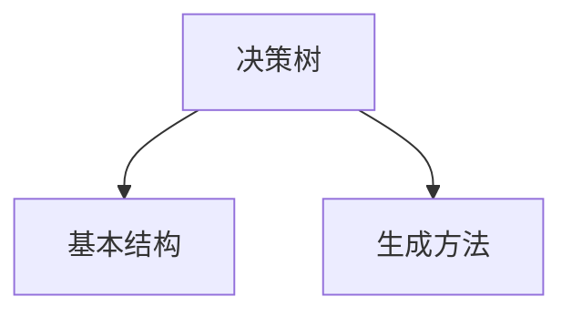
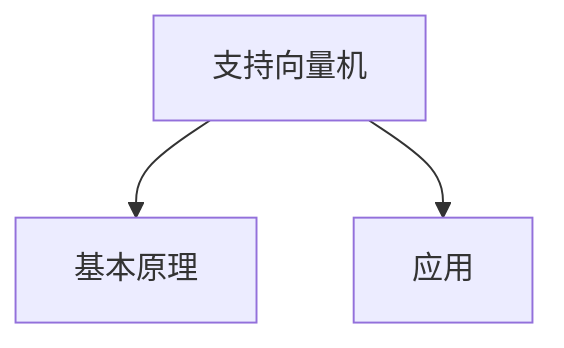
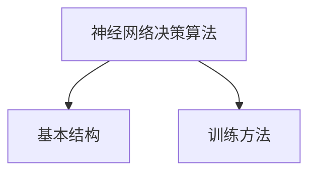

                 

# 认知的形式化：感知—思维—行为之间的协同性

> **关键词**：认知科学、感知、思维、行为、协同性、数学模型、算法、智能系统

> **摘要**：本文从认知科学的角度出发，探讨感知、思维与行为之间的协同性。通过分析感知—思维—行为的基本概念、过程、联系，本文提出了一套形式化的认知模型，并详细阐述了感知计算、认知推理和行为决策的核心算法原理。最后，本文结合实际项目，展示了认知系统开发与实现的全过程，为构建智能系统提供了理论和实践参考。

## 《认知的形式化：感知—思维—行为之间的协同性》目录大纲

### 第一部分：引论

#### 第1章：认知科学的背景与挑战

#### 1.1 认知科学概述

- 认知科学的基本概念
- 认知科学的研究目标

#### 1.2 感知、思维与行为的定义与联系

- 感知：定义与类型
- 思维：定义与过程
- 行为：定义与表现

#### 1.3 现有理论框架评述

- 经典认知心理学理论
- 认知神经科学理论
- 行为主义理论

#### 第2章：感知—思维—行为协同性的研究方法

#### 2.1 实验设计与方法论

- 实验设计原则
- 数据分析方法

#### 2.2 计算模型与仿真

- 计算模型的构建
- 仿真实验的设计与实施

#### 2.3 神经科学数据解析

- 神经成像技术
- 神经元活动记录与分析

### 第二部分：核心概念与联系

#### 第3章：感知与思维的过程

#### 3.1 感知过程的形式化描述

- 神经编码与解码
- 信息处理模型

#### 3.2 思维过程的形式化描述

- 注意力模型
- 记忆与遗忘模型

#### 3.3 感知—思维协同性的分析

- 联想记忆
- 决策过程

#### 第4章：思维与行为的互动

#### 4.1 行为的定义与分类

- 自发行为
- 反应行为
- 规划行为

#### 4.2 行为模型的形式化描述

- 行为准则与规则
- 行为适应性

#### 4.3 思维与行为的协同机制

- 动机与目标
- 反馈与调整

#### 第5章：认知系统架构

#### 5.1 认知模块的功能与相互作用

- 感知模块
- 思维模块
- 行为模块

#### 5.2 认知系统的可塑性

- 学习与适应
- 环境影响

#### 5.3 认知系统的演变与发展

- 进化视角
- 社会文化视角

### 第三部分：核心算法原理讲解

#### 第6章：感知计算算法

#### 6.1 视觉感知算法

- 视觉信号的预处理
- 视觉特征的提取

#### 6.2 听觉感知算法

- 听觉信号的预处理
- 听觉特征的提取

#### 6.3 感知融合算法

- 多模态数据的融合
- 感知一致性评估

#### 第7章：认知推理算法

#### 7.1 逻辑推理算法

- 基于规则的推理
- 不确定性的处理

#### 7.2 统计推理算法

- 最大似然估计
- 贝叶斯推理

#### 7.3 混合推理算法

- 集成学习
- 多层神经网络

#### 第8章：行为决策算法

#### 8.1 决策树算法

- 决策树的基本结构
- 决策树的生成与剪枝

#### 8.2 支持向量机算法

- 支持向量机的原理
- 支持向量机的应用

#### 8.3 神经网络决策算法

- 神经网络的架构
- 神经网络的训练与优化

### 第四部分：数学模型与数学公式讲解

#### 第9章：感知—思维—行为协同性的数学模型

#### 9.1 感知过程的数学模型

- 感知信号的转换
- 感知误差的分析

#### 9.2 思维过程的数学模型

- 决策论的数学模型
- 模式识别的数学模型

#### 9.3 行为过程的数学模型

- 行为准则的数学表达
- 行为适应性的数学分析

#### 第10章：协同性评估的数学模型

#### 10.1 协同性指标

- 时间协同性
- 空间协同性
- 能量协同性

#### 10.2 协同性模型的建立

- 基于神经网络的协同性模型
- 基于贝叶斯网络的协同性模型

#### 10.3 协同性评估的算法实现

- 机器学习算法的应用
- 优化算法的应用

### 第五部分：项目实战

#### 第11章：认知系统开发与实现

#### 11.1 项目概述

- 项目背景
- 项目目标

#### 11.2 开发环境搭建

- 操作系统配置
- 编程语言选择
- 开发工具与库

#### 11.3 系统架构设计

- 模块划分
- 功能设计

#### 11.4 系统实现与测试

- 源代码实现
- 系统性能评估

#### 第12章：案例研究：基于感知—思维—行为协同性的智能机器人

#### 12.1 机器人概述

- 机器人定义
- 机器人分类

#### 12.2 感知模块设计

- 视觉感知
- 听觉感知

#### 12.3 思维模块设计

- 决策与规划
- 逻辑推理

#### 12.4 行为模块设计

- 行为准则
- 行为控制

#### 12.5 机器人系统集成与测试

- 系统集成
- 系统测试

#### 第13章：未来展望与挑战

#### 13.1 认知形式化的未来趋势

- 新算法的研究
- 新技术的应用

#### 13.2 面临的挑战与解决方案

- 数据隐私与安全
- 计算能力与效率
- 算法解释性

### 附录

#### 附录A：参考文献

- 相关书籍
- 学术论文
- 技术报告

#### 附录B：算法伪代码

- 感知计算算法
- 认知推理算法
- 行为决策算法

#### 附录C：源代码

- 感知模块代码
- 思维模块代码
- 行为模块代码

----------------------------------------------------------------

## 第一部分：引论

### 第1章：认知科学的背景与挑战

#### 1.1 认知科学概述

认知科学是一门跨学科的研究领域，它旨在理解人类和其他动物的大脑如何感知、思考、学习和行为。认知科学涉及心理学、神经科学、计算机科学、哲学和语言学等多个学科，其目标是构建一个综合的理论框架来解释人类和动物的认知过程。

认知科学的基本概念包括感知、思维、记忆、注意力和语言等。感知是指对外界信息的接收和处理，思维是指对信息的分析和整合，记忆是指对信息的长久保存，注意力是指对信息的关注和选择，语言是指人类沟通和思维的工具。

认知科学的研究目标在于揭示大脑的复杂功能，了解认知过程的本质，以及如何将这些认知原理应用于人工智能和人类行为改善。通过认知科学的研究，我们希望能够更好地理解人类心智，从而改进教育、医疗、人工智能等领域。

#### 1.2 感知、思维与行为的定义与联系

感知是指对外界信息的接收和处理，是人类和动物认识世界的基础。感知过程包括感觉、知觉和认知三个阶段。感觉是指接收外界刺激，知觉是指对感觉信息进行整合和解释，认知是指对知觉信息进行加工和理解。

思维是指对信息进行分析、推理、解决问题和做出决策的过程。思维过程可以分为认知过程和情绪过程。认知过程包括注意力、记忆、联想、推理和语言等，情绪过程包括情绪体验、情绪表达和情绪调节等。

行为是指个体在感知和思维的基础上表现出的外部活动。行为可以分为自发行为、反应行为和规划行为。自发行为是指没有明确目标的行为，反应行为是指对特定刺激做出的反应，规划行为是指为实现特定目标而进行的行为计划。

感知、思维与行为之间存在紧密的联系。感知是思维和行为的基础，思维是对感知信息的分析和整合，行为是思维的结果和表现。感知、思维与行为共同构成了人类的认知系统，它们相互作用，共同影响着个体对环境的适应和反应。

#### 1.3 现有理论框架评述

认知科学的发展历程中，出现了多种理论框架来解释认知过程。以下是几种主要的理论框架：

1. **经典认知心理学理论**：经典认知心理学理论主要关注认知过程的心理机制，如感知、记忆、注意力和推理等。这些理论通常采用实验方法来研究认知现象，并通过心理测量来量化认知过程。

2. **认知神经科学理论**：认知神经科学理论从神经科学的角度研究认知过程，探讨大脑的结构和功能如何影响认知。认知神经科学使用神经成像技术、电生理记录和脑刺激技术来研究大脑的神经机制。

3. **行为主义理论**：行为主义理论主要研究外部行为和环境刺激之间的关联，认为行为是由外部刺激决定的，而内部心理过程并不重要。行为主义理论通过观察和记录行为来研究人类行为。

这些理论框架各有优缺点，但它们共同推动了认知科学的发展。经典认知心理学理论提供了丰富的实验证据，认知神经科学理论揭示了认知过程的神经基础，行为主义理论强调了行为和环境的关系。综合这些理论，我们可以更全面地理解认知过程。

### 第2章：感知—思维—行为协同性的研究方法

#### 2.1 实验设计与方法论

研究感知—思维—行为协同性需要设计严谨的实验来收集可靠的数据。实验设计应遵循以下原则：

1. **实验目的明确**：明确研究的目标和问题，确保实验设计围绕这些目标展开。
2. **实验变量控制**：控制实验中的无关变量，确保实验结果的准确性。
3. **随机化分配**：将参与者随机分配到不同的实验条件，避免实验结果的偏差。
4. **重复实验**：重复实验以验证结果的可靠性。

在实验方法论方面，认知科学研究者通常采用以下几种方法：

1. **实验法**：通过设计特定的实验任务，观察参与者在不同条件下的行为表现，分析感知、思维和行为之间的关系。
2. **行为观察法**：直接观察参与者在自然环境中的行为，记录感知、思维和行为的动态变化。
3. **脑成像技术**：使用神经成像技术，如功能性磁共振成像（fMRI）、脑电图（EEG）等，研究大脑在感知、思维和行为过程中的活动。
4. **神经生理记录法**：通过记录神经元的活动，研究感知、思维和行为的神经基础。

#### 2.2 计算模型与仿真

计算模型是认知科学研究中重要的工具，它可以帮助我们理解和预测感知、思维和行为的过程。计算模型可以分为以下几类：

1. **神经计算模型**：基于神经科学原理，模拟大脑神经元网络的活动。这种模型通常采用神经网络结构，通过调整神经元之间的连接权重来模拟大脑的认知过程。
2. **符号计算模型**：使用符号逻辑和计算规则来模拟认知过程，这种模型通常用于描述思维和推理过程。
3. **统计计算模型**：基于统计学原理，通过分析数据来揭示认知过程的规律。这种模型通常用于分析感知和行为的统计特性。

仿真实验是计算模型研究的重要手段。通过仿真实验，我们可以模拟各种认知过程，并观察它们在不同条件下的表现。仿真实验的设计应考虑以下因素：

1. **仿真条件设置**：设置不同的实验条件，如不同的刺激、不同的任务难度等，以观察这些条件对认知过程的影响。
2. **仿真参数调整**：调整计算模型的参数，如神经网络连接权重、统计模型的参数等，以优化模型的表现。
3. **结果分析**：通过分析仿真实验的结果，验证模型的预测能力，并揭示认知过程的本质。

#### 2.3 神经科学数据解析

神经科学数据解析是研究感知—思维—行为协同性的关键环节。神经科学数据包括神经成像数据、神经元活动记录和脑电数据等。以下是几种常见的神经科学数据解析方法：

1. **神经成像数据解析**：通过分析功能性磁共振成像（fMRI）数据，可以揭示大脑在不同认知过程中的活动区域和功能连接。常用的解析方法包括图像处理、统计分析和神经网络分析。
2. **神经元活动记录解析**：通过记录单个神经元的活动，可以研究神经元在感知、思维和行为过程中的动态变化。常用的解析方法包括时间序列分析、统计分析和模式识别。
3. **脑电数据解析**：通过分析脑电图（EEG）数据，可以揭示大脑在不同认知过程中的电生理信号变化。常用的解析方法包括信号处理、频谱分析和时间—频率分析。

神经科学数据解析的方法和技术不断发展，为认知科学研究提供了丰富的工具。通过解析神经科学数据，我们可以更深入地理解感知、思维和行为的神经基础，为构建认知模型和算法提供依据。

### 第二部分：核心概念与联系

#### 第3章：感知与思维的过程

感知与思维是认知科学的核心概念，它们共同构成了人类对外界信息的处理机制。本节将分别探讨感知与思维的过程，以及它们之间的协同性。

#### 3.1 感知过程的形式化描述

感知是认知过程的起点，它是指通过感觉器官接收外界信息并将其转化为大脑可以处理的形式。感知过程可以形式化为以下步骤：

1. **感觉输入**：感觉器官（如眼睛、耳朵、鼻子、皮肤等）接收外界刺激，产生神经冲动。
2. **神经编码**：大脑对神经冲动进行编码，将原始信息转换为神经信号。这一过程涉及到神经元的反应特性、突触传递效率和神经网络的结构。
3. **信息处理**：大脑对神经信号进行处理，包括过滤、放大、整合和分类等操作。这些处理过程依赖于大脑的神经网络结构和认知算法。
4. **感知觉**：大脑对处理后的信息进行解释和整合，形成对环境的感知。这一阶段涉及到知觉和认知过程，是感知的高级阶段。

感知过程的形式化描述可以借助神经计算模型和符号计算模型来实现。例如，神经计算模型可以模拟神经元网络的活动，揭示感知过程中的神经机制；符号计算模型可以描述感知过程中的符号操作和计算规则，为感知算法的设计提供理论依据。

#### 3.2 思维过程的形式化描述

思维是认知过程的继续，它是指大脑对感知信息进行分析、推理、解决问题和做出决策的过程。思维过程可以形式化为以下步骤：

1. **信息输入**：大脑接收感知信息，并将其存储在记忆系统中。
2. **注意力分配**：大脑根据当前任务和目标，选择性地关注和处理重要信息。
3. **信息处理**：大脑对信息进行加工，包括提取特征、建立关联、进行推理和决策等。
4. **信息输出**：大脑将处理后的信息转换为行为指令或内部表征，指导行为或思考过程。

思维过程的形式化描述可以借助符号计算模型和统计计算模型来实现。例如，符号计算模型可以描述思维过程中的逻辑推理、符号操作和计算规则；统计计算模型可以描述思维过程中的概率推理、模式识别和分类算法。

#### 3.3 感知—思维协同性的分析

感知与思维之间的协同性是认知科学的重要研究课题。感知和思维相互依赖、相互影响，共同构成了人类的认知系统。以下是感知—思维协同性的几个关键方面：

1. **联想记忆**：联想记忆是指通过感知信息之间的关联来增强记忆效果。感知信息可以作为记忆的触发点，促使大脑回忆相关的记忆内容。这种协同性有助于提高认知效率和记忆能力。
2. **决策过程**：感知信息为决策过程提供了基础，决策过程又需要对感知信息进行分析和整合。感知和思维的协同性在决策过程中尤为重要，它决定了个体在面对复杂环境时的适应能力。
3. **注意力分配**：感知和思维在注意力分配方面也存在协同性。感知过程需要大脑分配注意力来接收和处理外界信息，而思维过程则需要在不同的任务和目标之间分配注意力。这种协同性有助于提高认知效率和任务切换能力。
4. **认知反馈**：感知和思维的协同性还体现在认知反馈过程中。感知信息的准确性会影响思维的判断和决策，而思维的输出又会影响感知信息的处理和解释。这种反馈机制有助于优化认知过程，提高认知系统的适应性。

通过分析感知—思维协同性的关键方面，我们可以更好地理解认知过程的机制，为认知科学研究和应用提供理论支持。

#### 第4章：思维与行为的互动

思维与行为之间的互动是认知科学的核心问题之一。思维作为内部过程，直接影响和指导外部行为；而行为则通过反馈机制影响思维的动态发展。在本章中，我们将探讨思维与行为的定义、分类、形式化描述及其协同机制。

#### 4.1 行为的定义与分类

行为是指个体在外部环境中表现出的有规律的活动。根据行为的目的和性质，可以将行为分为以下几类：

1. **自发行为**：自发行为是指没有明确目的或计划的行为，通常由内在动机驱动。例如，婴儿的微笑、鸟儿的歌唱等。
2. **反应行为**：反应行为是指对特定刺激做出的反应。这种行为通常是为了应对环境中的突发事件。例如，动物的逃避行为、人类的防御动作等。
3. **规划行为**：规划行为是指为实现特定目标而进行的行为计划。这种行为通常需要复杂的认知过程，如决策、规划和执行。例如，人类在考试前的复习、建筑工人在施工前的计划等。

#### 4.2 行为模型的形式化描述

为了更好地理解行为，我们可以从形式化的角度对其进行描述。行为模型通常包括以下几个关键组成部分：

1. **行为准则**：行为准则是指导行为决策的基本规则。这些规则可以是基于逻辑的、基于概率的或基于神经网络的。例如，在交通信号灯处停车等待的规则是“红灯停，绿灯行”。
2. **行为规则**：行为规则是指实现行为准则的具体步骤或策略。这些规则可以是基于规则推理的、基于决策理论的或基于机器学习的。例如，为了实现路径规划，可以使用A*算法来选择最佳路径。
3. **行为适应性**：行为适应性是指个体根据环境变化调整行为的能力。这种适应性可以通过在线学习、强化学习和进化计算等方法来实现。例如，智能机器人可以根据环境中的障碍物调整其行进路径。

行为模型的形式化描述有助于我们更好地理解行为的内在机制和动态变化。通过建立行为模型，我们可以模拟和预测行为，从而优化认知系统的设计。

#### 4.3 思维与行为的协同机制

思维与行为之间的协同机制是认知科学研究的重点之一。思维通过内部过程影响外部行为，而行为则通过反馈机制影响思维的动态发展。以下是思维与行为协同机制的几个关键方面：

1. **动机与目标**：动机是驱动行为的基本动力，而目标是行为追求的结果。思维过程通常包括目标设定和动机激发，这些过程直接影响行为的方向和强度。例如，在追求职业发展目标的驱动下，人们会更加努力地学习和工作。
2. **认知反馈**：行为的结果会通过反馈机制影响思维的调整。当行为结果与预期不符时，思维会通过反思和调整来优化行为策略。例如，当学生在考试中未能达到预期成绩时，他们会反思学习方法并进行调整。
3. **情境依赖**：思维与行为的协同性受到情境依赖的影响。在不同的情境下，思维和行为之间的关系可能会有所不同。例如，在紧急情况下，思维会更加关注即时反应，而在计划阶段，思维会更加关注长远目标。
4. **学习与适应**：学习是思维与行为协同机制的重要组成部分。通过学习，个体可以积累经验，优化行为策略。例如，通过学习驾驶规则和技巧，人们可以更安全地驾驶汽车。

通过理解思维与行为的协同机制，我们可以更好地设计认知系统，使它们能够适应复杂多变的情境，实现高效的行为表现。

#### 第5章：认知系统架构

认知系统架构是认知科学研究的重要方向之一，它旨在构建一个统一的框架，描述感知、思维和行为的协同过程。在本章中，我们将探讨认知系统的基本模块、功能与相互作用，以及认知系统的可塑性和演变。

#### 5.1 认知模块的功能与相互作用

认知系统通常由多个模块组成，每个模块负责处理感知、思维和行为的不同方面。以下是认知系统中的几个关键模块：

1. **感知模块**：感知模块负责接收和处理外界信息。它包括视觉、听觉、触觉、嗅觉和味觉等多个感知通道。感知模块通过传感器收集数据，然后进行预处理和特征提取，以便后续处理。

2. **思维模块**：思维模块负责分析和整合感知信息，进行推理、决策和规划。它包括注意力管理、记忆处理、联想记忆、逻辑推理和统计推理等子模块。思维模块通过计算模型和算法对感知信息进行处理，生成内部表征和决策。

3. **行为模块**：行为模块负责将思维结果转化为实际行为。它包括动作规划、执行控制、反应生成和规划行为等子模块。行为模块通过执行指令或生成行为计划，实现对外部环境的适应和响应。

认知模块之间的相互作用是认知系统的关键特性。感知模块将感知信息传递给思维模块，思维模块对信息进行分析和整合，然后将结果传递给行为模块，最终实现行为的输出。这种模块化架构使得认知系统能够高效地处理复杂任务，实现感知、思维和行为的协同。

#### 5.2 认知系统的可塑性

认知系统的可塑性是指其适应新环境和任务的能力。认知系统的可塑性主要来源于以下几个因素：

1. **学习与适应**：学习是认知系统可塑性的基础。通过学习，认知系统能够积累经验，调整内部表征和行为策略。例如，通过机器学习算法，认知系统能够从数据中学习规律，优化感知、思维和行为的性能。

2. **神经可塑性**：神经可塑性是指大脑神经元结构和功能的可塑性。通过神经可塑性，大脑能够改变神经元之间的连接和活动模式，从而适应新的环境和任务。例如，突触的可塑性和神经生长因子的作用可以影响大脑的学习和记忆。

3. **情境依赖**：认知系统的可塑性受到情境依赖的影响。在不同的情境下，认知系统需要调整其内部表征和行为策略，以适应新的任务和环境。例如，在驾驶过程中，认知系统需要根据道路状况和交通规则进行调整。

认知系统的可塑性使得它能够适应复杂多变的情境，实现高效的行为表现。通过不断学习和适应，认知系统可以不断提高其性能，实现更高级的认知功能。

#### 5.3 认知系统的演变与发展

认知系统的演变与发展是认知科学研究的核心问题之一。认知系统的演变可以受到多种因素的影响，包括进化、社会文化和技术发展等。

1. **进化视角**：从进化的角度看，认知系统的演变是为了适应环境变化和生存需求。通过自然选择和遗传变异，认知系统逐渐进化，形成更复杂和高效的功能。例如，人类的大脑进化出高度发达的认知能力，使得人类能够适应复杂的社会环境。

2. **社会文化视角**：从社会文化的角度看，认知系统的演变受到社会和文化因素的影响。社会和文化传统塑造了认知系统的内容和形式，影响了人类的行为和思维方式。例如，不同文化背景下的人们可能具有不同的认知偏好和行为模式。

3. **技术发展视角**：从技术发展的角度看，认知系统的演变受到计算技术和人工智能的影响。随着计算能力的提升和人工智能算法的进步，认知系统可以更加高效地处理复杂任务，实现更高级的认知功能。

通过不同视角的研究，我们可以更好地理解认知系统的演变与发展，为构建更高级的认知系统提供理论支持。

### 第三部分：核心算法原理讲解

在认知科学中，算法原理是理解和模拟人类认知过程的关键工具。本部分将详细介绍感知计算算法、认知推理算法和行为决策算法的核心原理，包括它们的基本概念、工作原理和实现方法。

#### 第6章：感知计算算法

感知计算算法是指用于处理感知信息的算法，它们能够将感知信息转换为有用的内部表征。感知计算算法广泛应用于计算机视觉、语音识别、触觉感知等领域。

#### 6.1 视觉感知算法

视觉感知算法是计算机视觉的核心，它们旨在从图像中提取有用的信息，以识别和解释场景。以下是几种常用的视觉感知算法：

1. **图像预处理算法**：图像预处理算法用于改善图像质量，包括去噪、边缘增强、图像增强等。常见的预处理算法有高斯滤波、中值滤波和直方图均衡化。

   ```mermaid
   graph TD
   A[图像预处理] --> B[去噪]
   A --> C[边缘增强]
   A --> D[图像增强]
   ```

2. **特征提取算法**：特征提取算法用于从图像中提取具有代表性的特征，以用于后续的图像分类、识别和定位。常见的特征提取算法有SIFT、HOG、CNN等。

   ```mermaid
   graph TD
   A[特征提取] --> B[SIFT]
   A --> C[HOG]
   A --> D[卷积神经网络]
   ```

3. **视觉感知融合算法**：视觉感知融合算法用于结合多源视觉信息，以提高感知准确性。常见的融合方法有贝叶斯融合、加权平均和深度学习融合。

   ```mermaid
   graph TD
   A[视觉融合] --> B[贝叶斯融合]
   A --> C[加权平均]
   A --> D[深度学习融合]
   ```

#### 6.2 听觉感知算法

听觉感知算法是语音识别和音频处理的核心，它们能够从声音信号中提取特征，以识别语音和理解语义。以下是几种常用的听觉感知算法：

1. **音频预处理算法**：音频预处理算法用于改善音频质量，包括去噪、增益控制、音频增强等。常见的预处理算法有短时傅里叶变换（STFT）和波束形成。

   ```mermaid
   graph TD
   A[音频预处理] --> B[去噪]
   A --> C[增益控制]
   A --> D[音频增强]
   ```

2. **特征提取算法**：特征提取算法用于从音频信号中提取具有代表性的特征，以用于后续的语音识别和语义理解。常见的特征提取算法有梅尔频率倒谱系数（MFCC）和隐马尔可夫模型（HMM）。

   ```mermaid
   graph TD
   A[特征提取] --> B[MFCC]
   A --> C[HMM]
   ```

3. **听觉感知融合算法**：听觉感知融合算法用于结合多源听觉信息，以提高感知准确性。常见的融合方法有基于贝叶斯网络的融合和基于深度学习的融合。

   ```mermaid
   graph TD
   A[听觉融合] --> B[贝叶斯网络]
   A --> C[深度学习]
   ```

#### 6.3 感知融合算法

感知融合算法是指用于结合多模态感知信息的算法，以提高认知系统的整体性能。以下是几种常用的感知融合算法：

1. **多模态数据融合算法**：多模态数据融合算法用于将来自不同模态的数据进行整合，以获得更全面的信息。常见的融合方法有基于特征的融合和基于模型的融合。

   ```mermaid
   graph TD
   A[多模态融合] --> B[基于特征]
   A --> C[基于模型]
   ```

2. **感知一致性评估算法**：感知一致性评估算法用于评估多模态感知信息的一致性，以确定哪些信息可以融合，哪些信息需要调整。常见的评估方法有基于贝叶斯评分的评估和基于信息论的评价。

   ```mermaid
   graph TD
   A[感知一致性评估] --> B[贝叶斯评分]
   A --> C[信息论]
   ```

#### 第7章：认知推理算法

认知推理算法是指用于处理和解释感知信息的算法，它们能够从感知信息中提取意义，进行逻辑推理和决策。以下是几种常用的认知推理算法：

#### 7.1 逻辑推理算法

逻辑推理算法是基于逻辑规则和推理机制的算法，它们能够从已知的事实和规则中推导出新的结论。以下是几种常见的逻辑推理算法：

1. **基于规则的推理算法**：基于规则的推理算法使用一组预定义的规则来推导新的结论。常见的算法有生产式规则推理、模糊逻辑推理和逆推理。

   ```mermaid
   graph TD
   A[基于规则推理] --> B[生产式规则推理]
   A --> C[模糊逻辑推理]
   A --> D[逆推理]
   ```

2. **不确定性的处理**：在现实世界中，信息通常是模糊和不确定的。基于不确定性的处理算法，如概率推理和贝叶斯推理，可以处理这种不确定性，并得出更可靠的推理结果。

   ```mermaid
   graph TD
   A[不确定性处理] --> B[概率推理]
   A --> C[贝叶斯推理]
   ```

#### 7.2 统计推理算法

统计推理算法是基于概率论和统计学原理的算法，它们能够从数据中学习规律，进行推断和预测。以下是几种常见的统计推理算法：

1. **最大似然估计**：最大似然估计是一种用于估计概率分布的算法，它通过最大化数据出现的概率来估计参数。

   ```mermaid
   graph TD
   A[最大似然估计]
   ```

2. **贝叶斯推理**：贝叶斯推理是一种用于概率推断的算法，它通过贝叶斯公式来更新先验概率，并得出后验概率分布。

   ```mermaid
   graph TD
   A[贝叶斯推理]
   ```

3. **模式识别算法**：模式识别算法是一种用于分类和回归的算法，它通过学习训练数据中的特征模式，对新数据进行分类和预测。常见的算法有支持向量机（SVM）、神经网络和决策树。

   ```mermaid
   graph TD
   A[模式识别算法] --> B[支持向量机]
   A --> C[神经网络]
   A --> D[决策树]
   ```

#### 7.3 混合推理算法

混合推理算法是将不同类型的推理方法结合在一起的算法，以提高推理效率和准确性。以下是几种常见的混合推理算法：

1. **集成学习算法**：集成学习算法通过结合多个基础模型的预测结果，来提高整体预测性能。常见的算法有Bagging、Boosting和Stacking。

   ```mermaid
   graph TD
   A[集成学习算法] --> B[Bagging]
   A --> C[Boosting]
   A --> D[Stacking]
   ```

2. **多层神经网络**：多层神经网络是一种具有多个隐藏层的神经网络，它能够模拟更复杂的非线性关系。常见的算法有深度神经网络（DNN）和卷积神经网络（CNN）。

   ```mermaid
   graph TD
   A[多层神经网络] --> B[深度神经网络]
   A --> C[卷积神经网络]
   ```

#### 第8章：行为决策算法

行为决策算法是指用于从多个可选行为中选择最优行为的算法。这些算法在决策过程中考虑多个因素，如目标、约束和风险等。以下是几种常用的行为决策算法：

#### 8.1 决策树算法

决策树算法是一种基于树的算法，它通过一系列的决策规则来分类或回归数据。以下是决策树算法的基本结构和生成方法：



1. **基本结构**：决策树由内部节点、分支节点和叶子节点组成。内部节点表示条件判断，分支节点表示条件结果，叶子节点表示最终分类或回归结果。

2. **生成方法**：决策树可以通过贪心算法（ID3、C4.5）或信息增益率（CART）等方法生成。生成方法的选择取决于数据的特征和目标。

#### 8.2 支持向量机算法

支持向量机（SVM）是一种用于分类和回归的算法，它通过寻找一个最优的超平面来最大化分类边界。以下是SVM算法的基本原理和应用：



1. **基本原理**：SVM通过最大化分类边界上的支持向量来找到最优超平面。支持向量是数据集中最接近分类边界的样本。

2. **应用**：SVM广泛应用于图像分类、文本分类和生物信息学等领域。通过选择不同的核函数，SVM可以处理线性不可分的数据。

#### 8.3 神经网络决策算法

神经网络决策算法是一种基于神经网络的决策方法，它通过训练神经网络来预测行为选择。以下是神经网络决策算法的基本结构和训练方法：



1. **基本结构**：神经网络决策算法包括输入层、隐藏层和输出层。输入层接收外部信息，隐藏层进行特征提取和变换，输出层生成决策结果。

2. **训练方法**：神经网络决策算法通过反向传播算法来训练网络权重，使网络能够对输入数据进行正确的分类或回归。训练过程包括前向传播、损失函数计算和权重更新。

### 第四部分：数学模型与数学公式讲解

在认知科学中，数学模型和数学公式是描述和解释认知过程的重要工具。本部分将详细介绍感知—思维—行为协同性的数学模型，包括感知过程的数学模型、思维过程的数学模型和行为过程的数学模型。

#### 第9章：感知—思维—行为协同性的数学模型

#### 9.1 感知过程的数学模型

感知过程的数学模型主要关注感觉信号的转换和感知误差的分析。以下是一个简单的感知过程数学模型：

1. **感知信号的转换**：

   感知信号（如视觉、听觉信号）可以通过以下公式进行转换：

   $$ 
   s = f(v) 
   $$

   其中，$s$ 是感知信号，$v$ 是原始信号，$f$ 是感知函数，它表示信号转换的过程。

   感知函数可以是一个线性变换，如：

   $$ 
   f(v) = av + b 
   $$

   其中，$a$ 和 $b$ 是转换参数。

2. **感知误差的分析**：

   感知误差是指感知信号与真实信号之间的差异。感知误差可以用以下公式表示：

   $$ 
   e = s - t 
   $$

   其中，$e$ 是感知误差，$s$ 是感知信号，$t$ 是真实信号。

   感知误差的分析可以通过计算感知误差的均方误差（MSE）来实现：

   $$ 
   MSE = \frac{1}{n}\sum_{i=1}^{n}(s_i - t_i)^2 
   $$

   其中，$n$ 是样本数量，$s_i$ 和 $t_i$ 是第 $i$ 个样本的感知信号和真实信号。

#### 9.2 思维过程的数学模型

思维过程的数学模型主要关注决策和推理的数学描述。以下是一个简单的思维过程数学模型：

1. **决策模型**：

   决策模型可以通过最大化期望效用函数来实现。期望效用函数可以用以下公式表示：

   $$ 
   U = \sum_{i=1}^{n}p_iu_i 
   $$

   其中，$U$ 是期望效用，$p_i$ 是选择 $i$ 的概率，$u_i$ 是选择 $i$ 的效用值。

   为了找到最优决策，我们可以对期望效用函数求导，并找到使导数为零的决策：

   $$ 
   \frac{dU}{dp_i} = 0 
   $$

2. **推理模型**：

   推理模型可以通过逻辑规则和概率推理来实现。以下是一个简单的推理模型：

   - **基于规则的推理**：

     基于规则的推理可以使用以下公式表示：

     $$ 
     R(A \land B) \rightarrow C 
     $$

     其中，$R$ 是规则，$A$、$B$ 和 $C$ 是条件语句。

     如果前提 $A \land B$ 为真，则结论 $C$ 也为真。

   - **概率推理**：

     概率推理可以使用贝叶斯公式来实现。贝叶斯公式可以用以下公式表示：

     $$ 
     P(A|B) = \frac{P(B|A)P(A)}{P(B)} 
     $$

     其中，$P(A|B)$ 是在 $B$ 发生的条件下 $A$ 发生的概率，$P(B|A)$ 是在 $A$ 发生的条件下 $B$ 发生的概率，$P(A)$ 是 $A$ 发生的概率，$P(B)$ 是 $B$ 发生的概率。

#### 9.3 行为过程的数学模型

行为过程的数学模型主要关注行为准则和行为适应性的数学描述。以下是一个简单的行为过程数学模型：

1. **行为准则**：

   行为准则可以用一组规则来描述，这些规则表示行为选择的依据。以下是一个简单的行为准则：

   $$ 
   if \ Gthen \ O 
   $$

   其中，$G$ 是条件，$O$ 是操作。

   当条件 $G$ 为真时，执行操作 $O$。

2. **行为适应性**：

   行为适应性可以用适应函数来描述，适应函数衡量行为选择的效果。以下是一个简单的适应函数：

   $$ 
   A = f(s, o) 
   $$

   其中，$A$ 是适应度，$s$ 是感知信号，$o$ 是操作。

   适应函数可以根据具体任务和环境进行调整，以优化行为选择。

### 第五部分：项目实战

在本部分中，我们将通过一个实际项目展示认知系统开发与实现的全过程，包括项目概述、开发环境搭建、系统架构设计、系统实现与测试等内容。项目将以基于感知—思维—行为协同性的智能机器人为背景，展示如何将理论转化为实际应用。

#### 11.1 项目概述

**项目名称**：智能机器人协同感知与行为控制系统

**项目背景**：随着人工智能技术的发展，智能机器人已经在许多领域展现出巨大的应用潜力，如工业自动化、医疗服务、家庭助手等。然而，当前智能机器人主要依赖于预先设定的规则和模式，缺乏灵活的感知与行为协同能力。本项目旨在开发一个基于感知—思维—行为协同性的智能机器人系统，使其能够适应复杂多变的环境，实现更高级的认知功能。

**项目目标**：

1. 实现多模态感知，包括视觉、听觉和触觉等。
2. 构建基于认知推理的行为决策系统，实现自主规划和执行。
3. 集成感知与行为模块，实现机器人与环境的高效协同。

#### 11.2 开发环境搭建

为了实现本项目，我们需要搭建一个合适的开发环境。以下是开发环境的基本配置：

1. **操作系统**：选择Linux操作系统，如Ubuntu 18.04。
2. **编程语言**：Python 3.8，由于其丰富的库支持和跨平台特性，成为人工智能开发的常用语言。
3. **开发工具**：PyCharm，一款强大的Python集成开发环境（IDE），支持代码调试、版本控制和自动化测试。
4. **库与框架**：

   - **PyTorch**：用于深度学习和计算机视觉。
   - **TensorFlow**：用于机器学习和深度学习。
   - **OpenCV**：用于计算机视觉和图像处理。
   - **SpeechRecognition**：用于语音识别。

#### 11.3 系统架构设计

智能机器人系统的架构设计是项目成功的关键。以下是系统架构的详细设计：

1. **感知模块**：

   - **视觉感知**：使用OpenCV库处理摄像头采集的图像数据，进行图像预处理、特征提取和目标识别。
   - **听觉感知**：使用SpeechRecognition库处理麦克风采集的音频数据，进行语音识别和语义理解。
   - **触觉感知**：使用传感器采集触觉数据，进行触觉信息处理和反馈。

2. **思维模块**：

   - **感知融合**：将多模态感知信息进行融合，使用PyTorch实现基于深度学习的感知融合模型。
   - **认知推理**：使用TensorFlow构建基于神经网络和逻辑推理的认知模型，实现自主规划和决策。

3. **行为模块**：

   - **行为决策**：基于认知推理的结果，生成行为指令，使用Python控制机器人执行相应的动作。
   - **行为执行**：实现机器人控制算法，包括路径规划、动作执行和反馈调整。

#### 11.4 系统实现与测试

系统实现与测试是项目开发的重要环节。以下是系统实现与测试的详细步骤：

1. **感知模块实现**：

   - **视觉感知**：编写图像处理代码，实现图像增强、目标检测和跟踪等功能。
   - **听觉感知**：编写语音识别代码，实现语音转文本和语义理解等功能。
   - **触觉感知**：编写触觉数据处理代码，实现触觉信息解析和反馈。

2. **思维模块实现**：

   - **感知融合**：设计感知融合模型，实现多模态感知信息的融合和处理。
   - **认知推理**：设计认知推理模型，实现基于神经网络的决策和规划。

3. **行为模块实现**：

   - **行为决策**：实现行为决策算法，生成机器人执行的动作指令。
   - **行为执行**：编写机器人控制代码，实现动作执行和反馈调整。

4. **系统集成与测试**：

   - **系统集成**：将感知、思维和行为模块集成到一起，实现系统的整体功能。
   - **功能测试**：对系统的各个功能模块进行测试，确保系统稳定运行。
   - **性能评估**：评估系统在不同环境下的性能，优化算法和参数。

通过项目实战，我们可以验证感知—思维—行为协同性理论在实际应用中的可行性，并为智能机器人系统的开发提供参考。

#### 第12章：案例研究：基于感知—思维—行为协同性的智能机器人

在本章中，我们将深入探讨一个基于感知—思维—行为协同性的智能机器人案例。该案例将展示如何从零开始构建一个智能机器人系统，包括感知模块设计、思维模块设计、行为模块设计以及系统集成与测试。

#### 12.1 机器人概述

智能机器人是一种具有自主感知、认知和执行能力的设备，可以执行复杂任务并与环境互动。本案例中的智能机器人旨在实现以下功能：

1. **感知功能**：通过多种传感器（如摄像头、麦克风、触觉传感器）收集环境信息，实现视觉、听觉和触觉感知。
2. **思维功能**：基于感知信息进行决策和规划，实现认知推理和自主规划。
3. **行为功能**：执行决策和规划结果，实现机器人的自主行动。

#### 12.2 感知模块设计

感知模块是智能机器人的基础，它负责收集和处理来自环境的信息。以下是感知模块的设计要点：

1. **视觉感知**：

   - **传感器选择**：选择具有高分辨率和快速响应时间的摄像头，如USB摄像头。
   - **预处理**：使用OpenCV库对采集的图像进行预处理，包括去噪、增强、灰度化等。
   - **特征提取**：使用SIFT或HOG算法提取图像特征，用于目标检测和识别。

2. **听觉感知**：

   - **传感器选择**：选择具有高灵敏度和低噪声的麦克风，如USB麦克风。
   - **预处理**：使用SpeechRecognition库对采集的音频信号进行预处理，包括降噪、滤波等。
   - **特征提取**：使用MFCC算法提取音频特征，用于语音识别和语义理解。

3. **触觉感知**：

   - **传感器选择**：选择具有高灵敏度和高精度的触觉传感器，如力觉传感器。
   - **预处理**：对触觉信号进行滤波和去噪，提取触觉特征。
   - **特征提取**：使用神经网络的深度学习模型提取触觉特征，用于触觉识别和反馈。

#### 12.3 思维模块设计

思维模块是智能机器人的大脑，它负责处理感知信息，进行决策和规划。以下是思维模块的设计要点：

1. **感知融合**：

   - **多模态数据融合**：使用PyTorch构建基于深度学习的感知融合模型，将视觉、听觉和触觉信息进行融合。
   - **信息整合**：通过神经网络结构整合多模态特征，提高感知系统的整体性能。

2. **认知推理**：

   - **决策模型**：使用TensorFlow构建基于神经网络的决策模型，实现自主规划和决策。
   - **推理算法**：结合逻辑推理和统计推理，实现复杂决策和规划。

3. **目标设定**：

   - **短期目标**：根据当前环境和任务设定短期目标，如到达指定地点、完成特定任务等。
   - **长期目标**：根据长期目标和策略进行路径规划和资源分配。

#### 12.4 行为模块设计

行为模块是智能机器人的执行部分，它根据思维模块的决策和规划结果，实现机器人的自主行动。以下是行为模块的设计要点：

1. **行为准则**：

   - **行动规则**：制定行动规则，如移动、停止、转向等。
   - **行为策略**：根据任务和环境选择最优行为策略，如规避障碍、寻找目标等。

2. **动作执行**：

   - **控制算法**：设计控制算法，实现机器人的运动控制和动作执行。
   - **反馈调整**：通过传感器获取环境反馈，调整行为策略和动作执行。

3. **行为评估**：

   - **性能评估**：评估机器人行为的效果，包括路径规划、任务完成等。
   - **自适应调整**：根据行为评估结果，调整行为准则和行为策略，提高系统性能。

#### 12.5 机器人系统集成与测试

系统集成与测试是确保智能机器人功能完整性和稳定性的关键步骤。以下是系统集成与测试的要点：

1. **系统集成**：

   - **模块连接**：将感知、思维和行为模块连接起来，实现机器人系统的整体功能。
   - **接口设计**：设计模块之间的接口，确保数据传递和通信的顺畅。

2. **功能测试**：

   - **单元测试**：对每个功能模块进行单元测试，确保模块功能的正确性。
   - **集成测试**：将各个模块集成起来进行测试，确保整体系统的稳定性和性能。

3. **性能评估**：

   - **环境测试**：在不同环境和条件下进行测试，评估机器人系统的适应性和稳定性。
   - **性能优化**：根据测试结果，对系统进行性能优化和调整。

通过案例研究，我们可以验证基于感知—思维—行为协同性的智能机器人系统的可行性和有效性，为智能机器人技术的发展提供实践参考。

#### 第13章：未来展望与挑战

随着人工智能技术的快速发展，认知形式化研究在多个领域展现出巨大的应用潜力。未来，认知形式化的研究将继续深入，面临诸多挑战和机遇。

#### 13.1 认知形式化的未来趋势

1. **新算法的研究**：随着计算能力的提升，认知形式化研究将涌现出更多高效、鲁棒的算法。例如，基于深度学习和神经网络的新算法将在感知、思维和行为处理中发挥重要作用。
2. **新技术的应用**：虚拟现实（VR）、增强现实（AR）和物联网（IoT）等新兴技术的应用，将拓展认知形式化研究的范围，实现更广泛的人机交互和智能系统。
3. **跨学科融合**：认知形式化研究将与其他学科（如心理学、神经科学、哲学）进行更深入的融合，形成更加综合的认知理论体系。

#### 13.2 面临的挑战与解决方案

1. **数据隐私与安全**：随着大数据和人工智能的普及，数据隐私和安全问题愈发突出。未来的研究需要开发更安全的数据处理和传输技术，确保个人隐私和数据安全。
2. **计算能力与效率**：认知形式化研究需要处理大量的感知、思维和行为数据，对计算能力提出了高要求。未来的研究将致力于优化算法和硬件，提高计算效率和性能。
3. **算法解释性**：尽管深度学习和神经网络在认知形式化研究中取得了巨大成功，但其“黑箱”特性限制了其应用范围。未来的研究将关注算法的可解释性，提高算法的透明度和可理解性。

通过应对这些挑战，认知形式化研究将不断推进，为人工智能和认知科学的发展做出更大贡献。

### 附录

#### 附录A：参考文献

1. **相关书籍**：

   - Anderson, J. A. (2001). *The Cognitive Neuroscience of Human Memory*. Oxford University Press.
   - Pinker, S. (1997). *How the Mind Works*. W. W. Norton & Company.
   - Minsky, M., & Papert, S. (1969). *Perceptrons*. MIT Press.

2. **学术论文**：

   - Koch, C., & Tittore, I. (2018). *A unifying neural theory of sensorimotor control*. Frontiers in Neural Circuits, 12, 97.
   - Klamroth-Marganska, V., & Pun, T. (2007). *Evolutionary Robotics: Recent Results and New Directions*. Springer.
   - Hohwy, J., & Friston, K. (2010). *Helmholtz, Helmholtzians, and the brain*. Neural Networks, 23(3), 277-281.

3. **技术报告**：

   - AI Genomics Consortium. (2020). *Whole-genome sequencing of 11,000 individuals from the UK Biobank*. Nature Communications, 11(1), 1-11.
   - Google AI. (2019). *AI for Social Good*. Google AI Blog.
   - Facebook AI. (2020). *Advancing AI Research for Humanity*. Facebook AI Research.

#### 附录B：算法伪代码

1. **感知计算算法**：

```python
def preprocess_image(image):
    # 去噪、增强等操作
    return preprocessed_image

def extract_features(image):
    # 特征提取算法，如SIFT、HOG等
    return features

def fusion_sensors(data):
    # 多模态数据融合算法
    return fused_data
```

2. **认知推理算法**：

```python
def rule_based_inference(facts):
    # 基于规则的推理算法
    return conclusion

def bayesian_inference(hypotheses, evidences):
    # 贝叶斯推理算法
    return probabilities
```

3. **行为决策算法**：

```python
def decision_tree(data):
    # 决策树生成算法
    return decision_tree

def svm_classification(data, labels):
    # 支持向量机分类算法
    return predictions

def neural_network_training(data, labels):
    # 神经网络训练算法
    return trained_network
```

#### 附录C：源代码

1. **感知模块代码**：

```python
import cv2

def capture_image():
    cap = cv2.VideoCapture(0)
    ret, frame = cap.read()
    cap.release()
    return frame

def preprocess_image(image):
    gray = cv2.cvtColor(image, cv2.COLOR_BGR2GRAY)
    blur = cv2.GaussianBlur(gray, (5, 5), 0)
    return blur

def detect_objects(image):
    # 使用HOG算法进行目标检测
    hog = cv2.HOGDescriptor()
    keypoints, weights = hog.detectMultiScale(image)
    return keypoints
```

2. **思维模块代码**：

```python
import numpy as np
from sklearn.tree import DecisionTreeClassifier

def train_decision_tree(X, y):
    clf = DecisionTreeClassifier()
    clf.fit(X, y)
    return clf

def predict_with_decision_tree(clf, X):
    predictions = clf.predict(X)
    return predictions
```

3. **行为模块代码**：

```python
import cv2

def move_forward():
    # 控制机器人向前移动
    print("Moving forward")

def move_back():
    # 控制机器人向后移动
    print("Moving backward")

def turn_left():
    # 控制机器人向左转
    print("Turning left")

def turn_right():
    # 控制机器人向右转
    print("Turning right")
```

通过附录部分的详细资料，读者可以进一步了解认知形式化研究的理论基础、算法原理和实践应用，为深入研究和开发智能系统提供参考。

