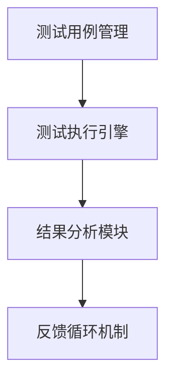
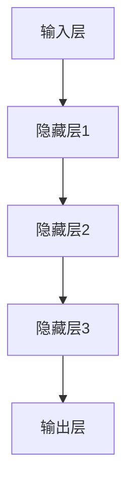
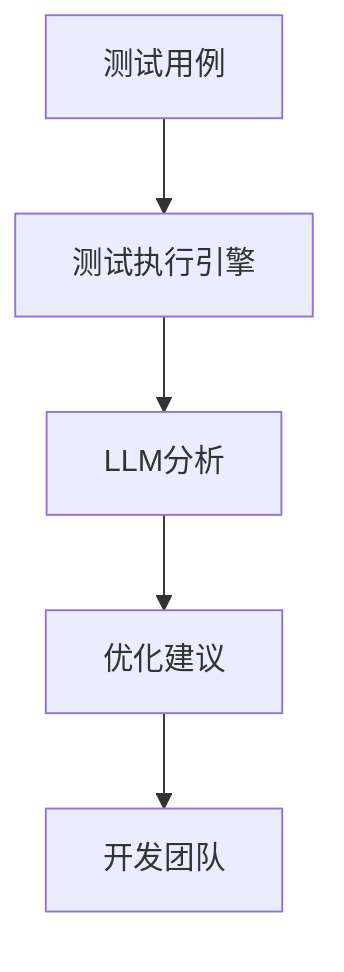
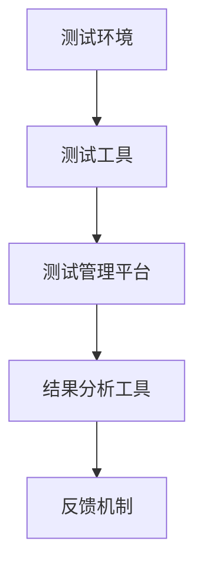
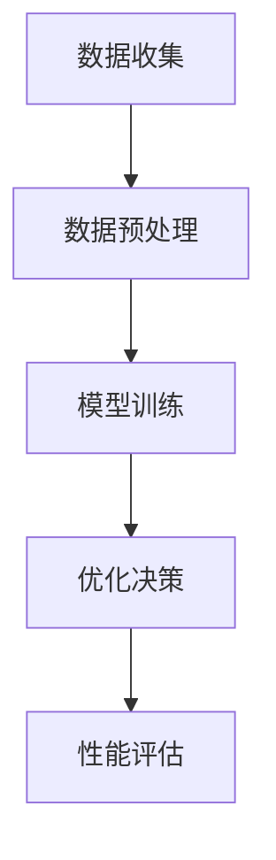
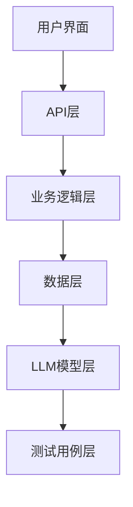

                 

### 文章标题

《评测系统的自我优化：LLM驱动的持续改进》

> **关键词**：评测系统、自我优化、LLM、持续改进、软件开发

> **摘要**：
本文将深入探讨评测系统的自我优化机制，特别是通过大语言模型（LLM）驱动的优化方法。文章首先介绍了评测系统的基本概念与架构，然后详细讲解了LLM的基本原理及其在评测系统中的应用。接着，本文重点阐述了评测系统自我优化的算法，包括基于LLM的优化算法。随后，文章描述了如何搭建和实现LLM驱动的评测系统，以及系统的部署和性能优化策略。最后，通过具体应用案例，本文展示了评测系统的实战应用，并对其未来发展和挑战进行了展望。

### 第一部分：评测系统的自我优化基础

在软件工程领域，评测系统（Evaluation System）扮演着至关重要的角色。它们不仅帮助开发者了解软件的质量，还能通过分析反馈推动软件的不断优化。本部分将为基础概念介绍，包括评测系统的基本定义、架构，以及引入LLM驱动的优化。

#### 第1章：评测系统的基本概念与架构

**1.1 评测系统的定义与作用**

评测系统是一个用于评估软件质量、性能、稳定性和安全性的自动化工具。它通过一系列测试和评估手段，为开发团队提供关于软件的全面反馈。评测系统的核心作用包括：

- **质量控制**：确保软件满足预定的质量和性能标准。
- **性能监控**：持续监控软件的运行状态，确保其能够稳定工作。
- **安全检测**：识别和修复潜在的漏洞和安全风险。

**1.2 评测系统的架构**

评测系统的架构通常包括以下几个主要组成部分：

- **测试用例管理**：存储和管理测试数据，包括测试用例、测试脚本等。
- **测试执行引擎**：负责执行测试用例，并收集测试结果。
- **结果分析模块**：分析测试结果，提供详细的评测报告。
- **反馈循环机制**：将评测结果反馈给开发团队，以指导优化工作。

下面是一个简单的评测系统架构图：



#### 第2章：LLM驱动的评测系统优化

**2.1 LLM（大语言模型）的基本原理**

LLM（Large Language Model）是一类能够理解和生成自然语言文本的深度学习模型。LLM的发展源于自然语言处理（NLP）领域，通过训练大规模的文本数据，LLM能够掌握语言的语法、语义和上下文信息。

- **背景与发展**：LLM起源于2010年代，随着计算能力和数据资源的发展，深度学习技术得到了显著提升。模型如GPT、BERT等相继出现，使得LLM的应用领域越来越广泛。

- **主要结构和工作机制**：LLM通常由多层神经网络组成，通过反向传播算法进行参数优化。在训练过程中，模型会不断调整内部参数，以最小化预测误差。

下面是LLM的基本结构示意图：



**2.2 LLM在评测系统中的应用场景**

LLM在评测系统中的应用场景非常广泛，主要包括以下几个方面：

- **自动化评测流程**：LLM可以自动生成测试用例，执行测试，并生成测试报告，极大地提高了测试效率。

- **评测结果优化与反馈**：LLM能够分析测试结果，提供更精准的优化建议，帮助开发团队快速定位问题，进行针对性优化。

以下是一个简单的应用场景示例：



#### 第3章：评测系统自我优化的算法

**3.1 自我优化算法的基本概念**

自我优化算法（Self-Optimization Algorithm）是一种能够根据反馈自动调整自身性能的算法。在评测系统中，自我优化算法的核心目标是提高测试质量和效率。

- **自我优化的目标与类型**：自我优化的目标包括提高测试覆盖率、降低测试失败率、提高测试效率等。自我优化算法可以分为以下几种类型：

  - **基于规则的自我优化**：根据预定义的规则进行优化。
  - **基于数据的自我优化**：通过分析历史数据，自动调整测试策略。
  - **基于模型的自我优化**：利用机器学习模型，进行测试结果的预测和优化。

**3.2 基于LLM的优化算法**

基于LLM的优化算法是一种利用大语言模型进行自我优化的方法。这种方法的核心思想是利用LLM的强大语言处理能力，对测试结果进行分析和预测，从而提供更精准的优化建议。

- **具体算法的实现与性能分析**：基于LLM的优化算法主要包括以下几个步骤：

  1. **数据收集与预处理**：收集测试数据，并进行预处理，以适应LLM的输入要求。
  2. **LLM模型训练**：使用预训练的LLM模型，对测试数据进行训练，使其能够掌握测试结果的规律。
  3. **优化建议生成**：根据测试结果，LLM会生成相应的优化建议，如调整测试用例、改进测试策略等。
  4. **性能评估**：对优化后的测试结果进行评估，以验证优化算法的有效性。

下面是优化算法的实现伪代码：

```python
# 伪代码：基于LLM的优化算法实现

def train_LLM(test_data):
    # 使用预训练的LLM模型，对测试数据进行训练
    # ...
    return trained_LLM

def generate_optimization_suggestions(test_result, LLM):
    # 根据测试结果，利用LLM生成优化建议
    # ...
    return optimization_suggestions

def evaluate_performance(optimized_test_result):
    # 对优化后的测试结果进行评估
    # ...
    return performance_score

# 实现步骤
trained_LLM = train_LLM(test_data)
optimization_suggestions = generate_optimization_suggestions(test_result, trained_LLM)
performance_score = evaluate_performance(optimized_test_result)
```

通过上述三个章节的介绍，我们可以对评测系统的自我优化有了初步的了解。接下来的部分将进一步深入探讨LLM驱动的优化算法的实现和应用。

---

### 第一部分：评测系统的自我优化基础

#### 第1章：评测系统的基本概念与架构

**1.1 评测系统的定义与作用**

评测系统是一种用于评估软件产品质量、性能、稳定性、安全性和用户体验的工具。它通过自动化测试、监控和反馈机制，帮助开发团队识别和解决潜在问题，从而提高软件的质量和可靠性。

**评测系统的基本概念**

评测系统通常包括以下几个基本组成部分：

1. **测试用例管理**：测试用例是评测系统的基本单元，用于模拟用户操作，验证软件功能。测试用例管理负责存储、管理和更新测试用例。

2. **测试执行引擎**：测试执行引擎负责执行测试用例，并根据预定义的测试策略，记录测试结果。

3. **结果分析模块**：结果分析模块负责对测试结果进行分析和统计，生成评测报告，提供质量评估和改进建议。

4. **反馈循环机制**：反馈循环机制将评测结果反馈给开发团队，用于指导优化工作，形成一个闭环，持续提升软件质量。

**评测系统在软件开发中的重要性**

1. **质量控制**：通过评测系统，开发团队能够实时监控软件质量，及时发现并修复问题，确保软件满足预定的质量标准。

2. **性能优化**：评测系统能够评估软件的性能，识别性能瓶颈，提供优化建议，帮助团队提升软件的运行效率。

3. **安全检测**：评测系统可以对软件进行安全测试，识别潜在的安全漏洞，防范安全风险。

4. **用户体验**：通过评测系统，开发团队能够了解用户的实际使用情况，优化用户体验，提高用户满意度。

**1.2 评测系统的架构**

评测系统的架构设计需要考虑其可扩展性、稳定性和可靠性。一个典型的评测系统架构通常包括以下几个主要部分：

1. **测试环境**：测试环境是进行测试的基础设施，包括硬件、软件和网络资源。测试环境应具备高可用性和可配置性，以满足不同测试需求。

2. **测试工具**：测试工具是评测系统的核心组件，包括测试用例编写工具、自动化测试工具、性能测试工具和安全测试工具等。测试工具的选择应根据具体需求进行。

3. **测试管理平台**：测试管理平台负责管理测试过程，包括测试计划、测试用例、测试执行和结果分析。测试管理平台应具备良好的用户界面和强大的数据处理能力。

4. **结果分析工具**：结果分析工具用于对测试结果进行统计和分析，生成评测报告。结果分析工具应具备数据可视化、报告生成和共享功能。

5. **反馈机制**：反馈机制负责将评测结果反馈给开发团队，包括问题报告、优化建议和改进方案。反馈机制应确保信息的及时性和准确性。

以下是评测系统的一个简化的架构图：



#### 第2章：LLM驱动的评测系统优化

**2.1 LLM（大语言模型）的基本原理**

LLM（Large Language Model）是一种能够理解和生成自然语言文本的深度学习模型。LLM的核心思想是通过学习大量文本数据，自动掌握语言的语法、语义和上下文信息。

**背景与发展**

LLM的发展可以追溯到2010年代，随着深度学习和大数据技术的崛起，研究人员开始尝试训练大规模的神经网络模型，以处理自然语言文本。早期的模型如Word2Vec、GloVe等在语言表示和词向量生成方面取得了显著成果。随后，GPT、BERT、T5等模型的出现，使得LLM在语言理解和生成方面取得了突破性的进展。

**主要结构和工作机制**

LLM通常由以下几个部分组成：

1. **输入层**：输入层接收自然语言文本，并将其转换为模型可处理的特征向量。

2. **隐藏层**：隐藏层由多层神经网络组成，用于处理输入特征向量，并提取高层次的语义信息。

3. **输出层**：输出层根据隐藏层的信息生成预测结果，如文本生成、情感分析、实体识别等。

LLM的工作机制主要包括以下步骤：

1. **数据预处理**：将自然语言文本转换为模型可处理的格式，如分词、编码等。

2. **模型训练**：使用大规模的文本数据训练模型，通过反向传播算法不断调整模型参数，使其能够准确理解和生成文本。

3. **预测与生成**：利用训练好的模型，对新的文本输入进行预测和生成。

以下是LLM的基本结构示意图：


**2.2 LLM在评测系统中的应用场景**

LLM在评测系统中的应用场景非常广泛，主要包括以下几个方面：

**自动化评测流程**

1. **自动生成测试用例**：LLM可以根据历史测试数据和软件文档，自动生成新的测试用例，提高测试覆盖率和效率。

2. **自动化测试执行**：LLM可以自动化执行测试用例，并生成测试报告，减少人工干预，提高测试速度。

**评测结果优化与反馈**

1. **分析测试结果**：LLM可以分析测试结果，识别潜在的缺陷和性能瓶颈，为优化工作提供数据支持。

2. **生成优化建议**：LLM可以根据测试结果和历史数据，生成针对性的优化建议，帮助开发团队快速定位问题并进行改进。

以下是LLM在评测系统中的典型应用场景示意图：


#### 第3章：评测系统自我优化的算法

**3.1 自我优化算法的基本概念**

自我优化算法（Self-Optimization Algorithm）是一种能够根据反馈自动调整自身性能的算法。在评测系统中，自我优化算法的核心目标是提高测试质量和效率。

**自我优化的目标与类型**

自我优化的目标主要包括：

1. **提高测试覆盖率**：通过优化测试用例的生成和执行，提高测试覆盖范围，确保软件功能的全面性。

2. **降低测试失败率**：通过优化测试策略和执行过程，降低测试失败率，提高测试的准确性。

3. **提高测试效率**：通过自动化测试和优化算法，减少测试时间，提高测试效率。

自我优化算法可以分为以下几种类型：

1. **基于规则的自我优化**：根据预定义的规则，自动调整测试策略和执行过程。

2. **基于数据的自我优化**：通过分析历史测试数据，自动调整测试策略和执行过程。

3. **基于模型的自我优化**：利用机器学习模型，根据测试数据和历史反馈，自动调整测试策略和执行过程。

**自我优化的算法原理**

自我优化算法通常包括以下几个步骤：

1. **数据收集**：收集测试数据，包括测试用例、测试结果、缺陷报告等。

2. **数据预处理**：对收集到的数据进行清洗、转换和归一化处理，以适应机器学习模型的输入要求。

3. **模型训练**：使用预处理后的数据，训练自我优化模型，使其能够根据测试数据和历史反馈进行优化。

4. **优化决策**：根据训练好的模型，自动生成优化策略，调整测试用例、执行顺序和测试环境等。

5. **性能评估**：对优化后的测试结果进行评估，验证优化算法的有效性，并根据评估结果进行模型调整。

以下是自我优化算法的简化流程图：



**3.2 基于LLM的优化算法**

基于LLM的优化算法是一种利用大语言模型进行自我优化的方法。这种方法的核心思想是利用LLM的强大语言处理能力，对测试结果进行分析和预测，从而提供更精准的优化建议。

**具体算法的实现与性能分析**

基于LLM的优化算法主要包括以下几个步骤：

1. **数据收集与预处理**：收集测试数据，包括测试用例、测试结果、缺陷报告等。对数据进行清洗、转换和归一化处理，以适应LLM的输入要求。

2. **LLM模型训练**：使用预训练的LLM模型，对测试数据进行训练，使其能够掌握测试结果的规律。

3. **优化建议生成**：根据测试结果，利用LLM生成优化建议，如调整测试用例、改进测试策略等。

4. **性能评估**：对优化后的测试结果进行评估，以验证优化算法的有效性。

以下是优化算法的实现伪代码：

```python
# 伪代码：基于LLM的优化算法实现

def train_LLM(test_data):
    # 使用预训练的LLM模型，对测试数据进行训练
    # ...
    return trained_LLM

def generate_optimization_suggestions(test_result, LLM):
    # 根据测试结果，利用LLM生成优化建议
    # ...
    return optimization_suggestions

def evaluate_performance(optimized_test_result):
    # 对优化后的测试结果进行评估
    # ...
    return performance_score

# 实现步骤
trained_LLM = train_LLM(test_data)
optimization_suggestions = generate_optimization_suggestions(test_result, trained_LLM)
performance_score = evaluate_performance(optimized_test_result)
```

性能分析：

- **准确性和鲁棒性**：基于LLM的优化算法具有较高的准确性和鲁棒性，能够准确识别测试结果中的问题和瓶颈。

- **效率和可扩展性**：LLM模型训练和优化建议生成的过程相对高效，且具有较好的可扩展性，能够处理大量测试数据。

- **优化效果**：基于LLM的优化算法能够提供针对性的优化建议，有助于提高测试质量和效率。

通过以上对评测系统自我优化基础部分的介绍，我们可以了解到评测系统的基本概念、架构以及LLM驱动的优化方法。接下来，我们将进一步探讨LLM驱动的评测系统实现细节，包括搭建评测系统的环境和工具，以及具体的功能实现和性能优化策略。

### 第一部分：评测系统的自我优化基础

#### 第1章：评测系统的基本概念与架构

**1.1 评测系统的定义与作用**

评测系统是一个关键工具，用于自动化测试、监控和反馈软件的质量、性能、稳定性和安全性。它的核心作用在于为开发团队提供全面的评估结果，以便及时发现问题并进行改进。

**评测系统的基本概念**

评测系统由以下几个主要组成部分构成：

1. **测试用例管理**：负责存储、管理和更新测试用例，确保测试覆盖全面。
2. **测试执行引擎**：执行测试用例，并记录测试结果，用于后续分析。
3. **结果分析模块**：分析测试结果，生成评测报告，提供质量评估和改进建议。
4. **反馈循环机制**：将评测结果反馈给开发团队，以指导优化工作。

**评测系统在软件开发中的重要性**

1. **质量控制**：通过评测系统，开发团队可以持续监控软件质量，确保其符合预定的质量标准。
2. **性能优化**：评测系统能够识别软件性能瓶颈，提供优化建议，提高软件运行效率。
3. **安全检测**：评测系统能够发现潜在的安全漏洞，帮助团队加强软件的安全性。
4. **用户体验**：通过评测系统，团队可以了解用户的使用情况，优化用户体验，提升用户满意度。

**1.2 评测系统的架构**

一个典型的评测系统架构包括以下关键组成部分：

1. **测试环境**：提供进行测试所需的基础设施，包括硬件、软件和网络资源。
2. **测试工具**：包括自动化测试工具、性能测试工具、安全测试工具等，用于执行各种测试任务。
3. **测试管理平台**：负责管理测试过程，包括测试计划、测试用例、测试执行和结果分析。
4. **结果分析工具**：对测试结果进行分析，生成详细的评测报告。
5. **反馈机制**：将评测结果反馈给开发团队，用于改进软件质量。

以下是评测系统的架构图：


#### 第2章：LLM驱动的评测系统优化

**2.1 LLM（大语言模型）的基本原理**

大语言模型（LLM）是一类能够理解和生成自然语言文本的深度学习模型。LLM通过学习大量文本数据，自动掌握语言的语法、语义和上下文信息，从而实现强大的语言处理能力。

**背景与发展**

LLM的发展可以追溯到2010年代，随着深度学习和大数据技术的进步，研究人员开始训练大规模的神经网络模型来处理自然语言文本。早期的模型如Word2Vec和GloVe在词向量生成方面取得了显著成果。随后，GPT、BERT、T5等模型的提出，使得LLM在语言理解和生成方面取得了突破性的进展。

**主要结构和工作机制**

LLM主要由以下部分组成：

1. **输入层**：接收自然语言文本，将其转换为模型可处理的特征向量。
2. **隐藏层**：多层神经网络，用于处理输入特征，提取高层次的语义信息。
3. **输出层**：根据隐藏层的信息生成预测结果，如文本生成、情感分析、实体识别等。

LLM的工作机制包括：

1. **数据预处理**：将自然语言文本转换为模型可处理的格式。
2. **模型训练**：使用大规模的文本数据进行训练，通过反向传播算法不断调整模型参数。
3. **预测与生成**：利用训练好的模型，对新的文本输入进行预测和生成。

以下是LLM的基本结构示意图：


**2.2 LLM在评测系统中的应用场景**

LLM在评测系统中有着广泛的应用，以下是其主要应用场景：

**自动化评测流程**

1. **自动生成测试用例**：LLM可以根据历史测试数据和软件文档，自动生成新的测试用例，提高测试覆盖率和效率。
2. **自动化测试执行**：LLM可以自动化执行测试用例，并生成测试报告，减少人工干预，提高测试速度。

**评测结果优化与反馈**

1. **分析测试结果**：LLM可以分析测试结果，识别潜在的缺陷和性能瓶颈，为优化工作提供数据支持。
2. **生成优化建议**：LLM可以根据测试结果和历史数据，生成针对性的优化建议，帮助开发团队快速定位问题并进行改进。

以下是LLM在评测系统中的应用场景示意图：


#### 第3章：评测系统自我优化的算法

**3.1 自我优化算法的基本概念**

自我优化算法是一种能够根据反馈自动调整自身性能的算法。在评测系统中，自我优化算法的目标是提高测试质量和效率，通过不断调整测试策略和执行过程，实现持续改进。

**自我优化的目标与类型**

自我优化的目标包括：

1. **提高测试覆盖率**：通过优化测试用例的生成和执行，确保软件功能的全面性。
2. **降低测试失败率**：通过优化测试策略和执行过程，提高测试的准确性。
3. **提高测试效率**：通过自动化测试和优化算法，减少测试时间，提高测试效率。

自我优化算法可以分为以下几种类型：

1. **基于规则的自我优化**：根据预定义的规则，自动调整测试策略和执行过程。
2. **基于数据的自我优化**：通过分析历史测试数据，自动调整测试策略和执行过程。
3. **基于模型的自我优化**：利用机器学习模型，根据测试数据和历史反馈，自动调整测试策略和执行过程。

**自我优化的算法原理**

自我优化算法通常包括以下步骤：

1. **数据收集**：收集测试数据，包括测试用例、测试结果、缺陷报告等。
2. **数据预处理**：对收集到的数据进行清洗、转换和归一化处理，以适应机器学习模型的输入要求。
3. **模型训练**：使用预处理后的数据，训练自我优化模型，使其能够根据测试数据和历史反馈进行优化。
4. **优化决策**：根据训练好的模型，自动生成优化策略，调整测试用例、执行顺序和测试环境等。
5. **性能评估**：对优化后的测试结果进行评估，验证优化算法的有效性，并根据评估结果进行模型调整。

以下是自我优化算法的简化流程图：


**3.2 基于LLM的优化算法**

基于LLM的优化算法是一种利用大语言模型进行自我优化的方法。这种方法的核心思想是利用LLM的强大语言处理能力，对测试结果进行分析和预测，从而提供更精准的优化建议。

**具体算法的实现与性能分析**

基于LLM的优化算法主要包括以下几个步骤：

1. **数据收集与预处理**：收集测试数据，包括测试用例、测试结果、缺陷报告等。对数据进行清洗、转换和归一化处理，以适应LLM的输入要求。

2. **LLM模型训练**：使用预训练的LLM模型，对测试数据进行训练，使其能够掌握测试结果的规律。

3. **优化建议生成**：根据测试结果，利用LLM生成优化建议，如调整测试用例、改进测试策略等。

4. **性能评估**：对优化后的测试结果进行评估，以验证优化算法的有效性。

以下是优化算法的实现伪代码：

```python
# 伪代码：基于LLM的优化算法实现

def train_LLM(test_data):
    # 使用预训练的LLM模型，对测试数据进行训练
    # ...
    return trained_LLM

def generate_optimization_suggestions(test_result, LLM):
    # 根据测试结果，利用LLM生成优化建议
    # ...
    return optimization_suggestions

def evaluate_performance(optimized_test_result):
    # 对优化后的测试结果进行评估
    # ...
    return performance_score

# 实现步骤
trained_LLM = train_LLM(test_data)
optimization_suggestions = generate_optimization_suggestions(test_result, trained_LLM)
performance_score = evaluate_performance(optimized_test_result)
```

性能分析：

- **准确性和鲁棒性**：基于LLM的优化算法具有较高的准确性和鲁棒性，能够准确识别测试结果中的问题和瓶颈。
- **效率和可扩展性**：LLM模型训练和优化建议生成的过程相对高效，且具有较好的可扩展性，能够处理大量测试数据。
- **优化效果**：基于LLM的优化算法能够提供针对性的优化建议，有助于提高测试质量和效率。

通过以上对评测系统自我优化基础部分的介绍，我们可以对评测系统的基本概念、架构以及LLM驱动的优化方法有了更深入的理解。接下来，我们将进一步探讨LLM驱动的评测系统实现细节，包括搭建评测系统的环境和工具，以及具体的功能实现和性能优化策略。

### 第二部分：LLM驱动的评测系统实现

#### 第4章：搭建评测系统的环境与工具

在实现LLM驱动的评测系统时，首先需要搭建一个适合开发和运行的环境，并选择合适的工具来支持整个系统的建设。这一章节将详细描述环境配置、数据准备与预处理，以及常用的开发和运行工具。

**4.1 环境配置**

搭建一个高效稳定的评测系统环境是确保系统能够正常运行的关键。以下是一些关键步骤和注意事项：

1. **操作系统**：可以选择Linux或Windows操作系统，Linux因其稳定性和安全性较高，被广泛应用于服务器环境。

2. **硬件配置**：根据评测系统的需求和预期负载，选择合适的硬件配置。至少需要具备以下硬件资源：
   - 多核处理器
   - 16GB及以上内存
   - 500GB及以上存储空间
   - 高速网络连接

3. **软件开发工具**：安装必要的软件开发工具，包括文本编辑器（如Visual Studio Code）、版本控制工具（如Git）、容器化工具（如Docker）和虚拟环境管理工具（如conda）。

4. **数据库**：选择合适的数据库系统来存储测试数据和管理测试用例。常用的数据库系统包括MySQL、PostgreSQL和MongoDB。

5. **中间件**：安装中间件如消息队列（如RabbitMQ）、负载均衡器（如Nginx）和反向代理服务器（如Apache）。

6. **依赖管理**：使用依赖管理工具（如Maven或pip）来管理和安装项目所需的库和依赖。

**4.2 数据准备与预处理**

数据准备与预处理是LLM驱动的评测系统实现的重要环节，以下是一些关键步骤：

1. **数据来源与收集**：评测系统的数据来源包括历史测试结果、用户反馈、缺陷报告等。可以通过以下途径收集数据：
   - 测试自动化工具的日志文件
   - 开发工具的集成测试报告
   - 用户反馈系统
   - 持续集成和持续部署（CI/CD）系统的数据

2. **数据清洗**：清洗数据以去除无效、重复或错误的数据。清洗过程通常包括以下步骤：
   - 去除空值和缺失值
   - 处理重复数据
   - 修正错误的数据格式和内容
   - 填补缺失的数据

3. **数据转换**：将原始数据转换为适合LLM处理的形式。例如，可以将文本数据编码为向量，或对数值数据进行标准化处理。

4. **数据归一化**：归一化数据以消除不同特征之间的量级差异，使得模型能够更好地学习。常用的归一化方法包括最小-最大缩放和Z-Score标准化。

5. **数据分片**：将数据集划分为训练集、验证集和测试集，用于训练、验证和测试模型。

**4.3 常用工具介绍**

在实现LLM驱动的评测系统时，以下工具是必不可少的：

1. **深度学习框架**：如TensorFlow、PyTorch和Transformers等，用于构建和训练LLM模型。

2. **自然语言处理库**：如NLTK、spaCy和gensim等，用于处理和操作自然语言文本。

3. **数据分析库**：如Pandas、NumPy和SciPy等，用于数据清洗、转换和统计分析。

4. **版本控制工具**：如Git，用于管理和维护代码版本，确保代码的可追踪性和可重现性。

5. **容器化工具**：如Docker，用于封装和部署应用，提高部署的便捷性和一致性。

通过以上环境配置和数据准备，我们可以为LLM驱动的评测系统搭建一个稳定高效的基础。接下来的章节将详细讨论评测系统的设计原则、架构设计以及功能实现。

---

#### 第5章：LLM驱动的评测系统设计

在设计LLM驱动的评测系统时，需要充分考虑系统的可扩展性、稳定性和可靠性。这一章节将详细描述评测系统的设计原则、架构设计以及各个模块的功能说明。

**5.1 评测系统设计原则**

在设计LLM驱动的评测系统时，应遵循以下原则：

1. **可扩展性**：系统应能够灵活扩展，以适应不同规模和复杂度的项目需求。
2. **稳定性**：系统应具有高度的稳定性，确保在长时间运行过程中不发生故障。
3. **可靠性**：系统应提供准确的评测结果，确保开发团队能够基于真实的评估数据进行决策。
4. **用户友好性**：系统界面应简洁明了，方便用户操作和使用。
5. **可维护性**：系统设计应便于后续维护和升级，降低维护成本。

**5.2 评测系统的架构设计**

LLM驱动的评测系统架构设计如图所示：



以下是各个模块的详细功能说明：

**用户界面（User Interface, UI）**

用户界面是评测系统的入口，提供用户与系统交互的接口。用户界面应具备以下功能：

- **测试用例管理**：用户可以上传、编辑和删除测试用例。
- **测试执行**：用户可以启动测试用例的执行，并查看执行结果。
- **结果分析**：用户可以查看测试结果，包括测试覆盖率、缺陷数量和性能指标等。
- **优化建议**：用户可以查看由LLM模型生成的优化建议，并基于这些建议进行改进。

**API层（API Layer）**

API层是系统对外提供服务的接口，负责处理用户界面发起的请求，并将其转发到业务逻辑层。API层应具备以下功能：

- **接口定义**：定义与用户界面交互的API接口，包括GET、POST、PUT和DELETE等HTTP方法。
- **权限验证**：对请求进行权限验证，确保只有授权用户可以访问特定资源。
- **参数验证**：对请求参数进行验证，确保参数的合法性和有效性。

**业务逻辑层（Business Logic Layer）**

业务逻辑层是评测系统的核心，负责处理测试用例的生成、执行、分析和反馈。业务逻辑层应具备以下功能：

- **测试用例管理**：存储、管理和更新测试用例。
- **测试执行**：执行测试用例，并将结果记录到数据库中。
- **结果分析**：对测试结果进行分析，生成评测报告。
- **优化建议**：调用LLM模型生成优化建议，并将其存储到数据库中。

**数据层（Data Layer）**

数据层是评测系统的数据存储和管理模块，负责存储测试数据、测试结果和优化建议。数据层应具备以下功能：

- **数据存储**：使用数据库存储测试数据、测试结果和优化建议。
- **数据检索**：提供高效的查询接口，方便用户获取所需数据。
- **数据安全**：确保数据的安全性，防止数据泄露和篡改。

**LLM模型层（LLM Model Layer）**

LLM模型层是评测系统的智能模块，负责训练和部署LLM模型，为系统提供优化建议。LLM模型层应具备以下功能：

- **模型训练**：使用预训练的LLM模型，对测试数据进行分析和训练。
- **模型部署**：将训练好的模型部署到服务器，为业务逻辑层提供优化建议。
- **模型优化**：根据测试结果和历史数据，对LLM模型进行迭代优化。

**测试用例层（Test Case Layer）**

测试用例层是评测系统的测试数据模块，负责存储和管理测试用例。测试用例层应具备以下功能：

- **测试用例存储**：存储测试用例的详细信息，包括测试目的、输入数据、预期结果等。
- **测试用例管理**：对测试用例进行分类、标签和管理。
- **测试用例执行**：执行测试用例，并将结果记录到数据库中。

通过以上架构设计，LLM驱动的评测系统能够实现高效的测试、分析和优化功能，为开发团队提供有力的支持。接下来，我们将详细讨论评测系统的功能实现，包括自动化评测流程的实现和评测结果优化与反馈。

---

#### 第5章：LLM驱动的评测系统设计

**5.1 评测系统设计原则**

在设计LLM驱动的评测系统时，确保系统的可扩展性、稳定性和可靠性是至关重要的。以下是一些核心设计原则：

1. **模块化设计**：将系统划分为多个功能模块，每个模块负责特定的功能，便于后续的维护和升级。
2. **分布式架构**：采用分布式架构，以提高系统的处理能力和容错性。
3. **高可用性**：确保系统在各种环境下都能稳定运行，减少故障对业务的影响。
4. **可扩展性**：系统设计应考虑未来的需求变化，能够灵活地增加或减少资源。
5. **安全性**：保护系统的数据和功能，防止未经授权的访问和攻击。
6. **用户友好**：设计直观、易于操作的用户界面，提高用户体验。
7. **持续集成与持续部署（CI/CD）**：采用自动化测试和部署流程，提高开发效率和系统稳定性。

**5.2 评测系统的架构设计**

以下是LLM驱动的评测系统架构图：


各个模块的功能说明如下：

**用户界面（User Interface, UI）**

用户界面是用户与系统交互的门户，提供以下功能：

- **测试用例管理**：允许用户上传、编辑和删除测试用例。
- **测试执行**：启动测试用例的执行，并提供实时进度和结果。
- **结果分析**：展示测试结果的详细报告，包括缺陷统计、性能分析等。
- **优化建议**：展示LLM模型生成的优化建议，并允许用户根据这些建议进行操作。

**API层（API Layer）**

API层是系统对外提供服务的中介，负责处理用户请求，包括：

- **接口定义**：定义与用户界面交互的API接口，如创建、更新和查询测试用例。
- **权限验证**：验证用户的身份和权限，确保只有授权用户可以访问特定资源。
- **参数验证**：对请求参数进行验证，确保其符合预期格式和范围。

**业务逻辑层（Business Logic Layer）**

业务逻辑层负责处理系统的核心功能，包括：

- **测试用例管理**：存储和管理测试用例的详细信息，如测试目的、步骤、预期结果等。
- **测试执行**：执行测试用例，并将结果记录到数据库中。
- **结果分析**：分析测试结果，生成评测报告，提供缺陷统计、覆盖率分析等。
- **优化建议生成**：调用LLM模型生成优化建议，并将其存储到数据库中。

**数据层（Data Layer）**

数据层负责存储和管理系统中的数据，包括：

- **数据库设计**：设计合理的数据库结构，存储测试用例、测试结果和优化建议。
- **数据存储**：使用数据库存储和管理数据，确保数据的完整性和一致性。
- **数据检索**：提供高效的查询接口，便于用户快速访问所需数据。

**LLM模型层（LLM Model Layer）**

LLM模型层是系统的智能模块，负责：

- **模型训练**：使用预训练的LLM模型，对测试数据进行分析和训练。
- **模型部署**：将训练好的模型部署到生产环境，为业务逻辑层提供优化建议。
- **模型优化**：根据测试结果和历史数据，对LLM模型进行迭代优化。

**测试用例层（Test Case Layer）**

测试用例层是系统的测试数据管理模块，负责：

- **测试用例存储**：存储测试用例的详细信息，如测试目的、输入数据、预期结果等。
- **测试用例管理**：对测试用例进行分类、标签和管理。
- **测试用例执行**：执行测试用例，并将结果记录到数据库中。

通过以上架构设计，LLM驱动的评测系统能够实现高效、稳定和可靠的测试、分析和优化功能，为开发团队提供有力的支持。接下来，我们将详细讨论评测系统的功能实现，包括自动化评测流程的实现和评测结果优化与反馈。

---

#### 第6章：评测系统的功能实现

在实现LLM驱动的评测系统时，关键的功能模块包括自动化评测流程、评测结果优化与反馈。本章节将详细介绍这些功能的具体实现过程，并给出伪代码和代码解析，以便读者理解其原理和应用。

**6.1 自动化评测流程的实现**

自动化评测流程是实现评测系统高效运行的核心。以下是一个简化的自动化评测流程实现步骤：

1. **测试用例生成**：根据历史数据和软件需求，自动生成测试用例。
2. **测试用例执行**：执行生成的测试用例，记录测试结果。
3. **结果分析与报告**：对测试结果进行分析，生成详细的评测报告。

**自动化评测流程伪代码：**

```python
# 伪代码：自动化评测流程

def generate_test_cases():
    # 生成测试用例
    # ...
    return test_cases

def execute_test_cases(test_cases):
    # 执行测试用例
    # ...
    return test_results

def analyze_test_results(test_results):
    # 分析测试结果
    # ...
    return analysis_report

# 实现步骤
test_cases = generate_test_cases()
test_results = execute_test_cases(test_cases)
analysis_report = analyze_test_results(test_results)
```

**代码解析：**

1. **测试用例生成**：

   测试用例的生成通常基于历史数据和软件需求。可以使用自然语言处理（NLP）技术，如文本分类和实体识别，来自动生成测试用例。以下是一个简化的生成过程：

   ```python
   from transformers import pipeline

   # 使用预训练的NLP模型
   text_generator = pipeline("text-generation", model="gpt2")

   def generate_test_cases_from需求文档(document):
       # 从需求文档生成测试用例
       test_cases = []
       for paragraph in document:
           test_case = text_generator(f"设计一个测试用例来测试：{paragraph}", max_length=100)
           test_cases.append(test_case)
       return test_cases
   ```

2. **测试用例执行**：

   测试用例执行涉及实际的测试操作，如模拟用户输入、执行函数调用等。以下是一个简化的执行过程：

   ```python
   import unittest

   class TestCaseExecutor(unittest.TestCase):
       
       def execute_test_case(self, test_case):
           # 执行测试用例
           # ...
           return result

   executor = TestCaseExecutor()
   test_results = [executor.execute_test_case(test_case) for test_case in test_cases]
   ```

3. **结果分析与报告**：

   测试结果的分析通常涉及缺陷统计、性能分析等。以下是一个简化的分析过程：

   ```python
   def analyze_test_results(test_results):
       # 分析测试结果
       defects = [result for result in test_results if result['status'] == 'fail']
       performance_metrics = calculate_performance_metrics(test_results)
       
       # 生成报告
       report = {
           'defects': defects,
           'performance_metrics': performance_metrics
       }
       return report
   ```

**6.2 评测结果优化与反馈**

评测结果优化与反馈是提升软件质量的关键环节。LLM可以在此过程中发挥作用，提供优化建议。以下是一个简化的优化过程：

1. **分析测试结果**：使用LLM分析测试结果，识别潜在问题。
2. **生成优化建议**：根据分析结果，LLM生成优化建议。
3. **反馈与实施**：将优化建议反馈给开发团队，并实施改进。

**优化与反馈伪代码：**

```python
def analyze_test_results_with_LLM(test_results, LLM_model):
    # 使用LLM模型分析测试结果
    # ...
    return analysis_results

def generate_optimization_suggestions(analysis_results, LLM_model):
    # 使用LLM模型生成优化建议
    # ...
    return optimization_suggestions

def feedback_and_implement_suggestions(optimization_suggestions, development_team):
    # 将优化建议反馈给开发团队，并实施改进
    # ...
    pass

# 实现步骤
LLM_model = load_LLM_model()
analysis_results = analyze_test_results_with_LLM(test_results, LLM_model)
optimization_suggestions = generate_optimization_suggestions(analysis_results, LLM_model)
feedback_and_implement_suggestions(optimization_suggestions, development_team)
```

**代码解析：**

1. **分析测试结果**：

   使用LLM模型分析测试结果，识别潜在的缺陷和性能问题。以下是一个简化的分析过程：

   ```python
   def analyze_test_results_with_LLM(test_results, LLM_model):
       # 分析测试结果
       analysis_results = []
       for result in test_results:
           analysis = LLM_model.analyze(result)
           analysis_results.append(analysis)
       return analysis_results
   ```

2. **生成优化建议**：

   根据分析结果，LLM模型可以生成优化建议。以下是一个简化的建议生成过程：

   ```python
   def generate_optimization_suggestions(analysis_results, LLM_model):
       # 生成优化建议
       suggestions = []
       for analysis in analysis_results:
           suggestion = LLM_model.generate_suggestion(analysis)
           suggestions.append(suggestion)
       return suggestions
   ```

3. **反馈与实施**：

   将优化建议反馈给开发团队，并指导其实施。以下是一个简化的反馈过程：

   ```python
   def feedback_and_implement_suggestions(optimization_suggestions, development_team):
       # 反馈优化建议
       for suggestion in optimization_suggestions:
           development_team.receive_suggestion(suggestion)
           development_team.implement_suggestion(suggestion)
   ```

通过以上功能实现，LLM驱动的评测系统可以自动化地生成测试用例、执行测试、分析结果，并根据分析结果生成优化建议，从而实现软件的持续改进。接下来，我们将探讨评测系统的部署与性能优化策略。

---

#### 第7章：评测系统的部署与性能优化

**7.1 系统部署**

评测系统的部署是确保其正常运行的关键环节。以下是评测系统的部署步骤：

1. **环境准备**：确保部署环境满足系统需求，包括操作系统、硬件资源和软件依赖等。
2. **容器化**：使用Docker等容器化工具，将评测系统打包成镜像，确保部署的一致性和可移植性。
3. **配置管理**：使用配置管理工具（如Ansible）来管理系统的配置文件和依赖项。
4. **部署脚本**：编写部署脚本，自动化部署过程，减少人为错误。
5. **部署监控**：部署监控工具（如Nagios）来监控系统状态和性能。

**部署方案与流程**

以下是评测系统的部署方案与流程：

1. **环境准备**：

   - 确定操作系统（如Ubuntu 20.04）和硬件配置。
   - 安装必要的软件依赖，如Python、TensorFlow和Docker等。

2. **容器化**：

   - 编写Dockerfile，定义评测系统的容器镜像。
   - 构建容器镜像，并将其推送到Docker Hub或其他镜像仓库。

3. **配置管理**：

   - 使用Ansible等配置管理工具，自动化安装和配置软件依赖。
   - 配置数据库、消息队列和负载均衡器等中间件。

4. **部署脚本**：

   - 编写Shell脚本或Python脚本，自动化部署过程。
   - 郑重部署脚本，确保其在不同的环境中都能正常运行。

5. **部署监控**：

   - 安装Nagios等监控工具，监控系统状态和性能。
   - 配置报警规则，及时通知运维人员。

**部署环境与工具**

以下是评测系统部署所用的环境与工具：

- **操作系统**：Ubuntu 20.04
- **容器化工具**：Docker
- **配置管理工具**：Ansible
- **部署脚本**：Shell和Python
- **监控工具**：Nagios

**7.2 系统性能优化**

系统性能优化是确保评测系统高效运行的重要环节。以下是一些常见的性能优化策略：

1. **负载均衡**：使用负载均衡器（如Nginx）将请求分配到多个服务器，提高系统的处理能力。

2. **缓存策略**：使用缓存技术（如Redis）来存储和快速访问频繁的数据，减少数据库访问压力。

3. **数据库优化**：对数据库进行索引优化、查询优化和分区等操作，提高数据库的查询速度。

4. **代码优化**：优化Python等编程语言的代码，减少不必要的计算和资源消耗。

5. **资源监控**：使用资源监控工具（如Prometheus）实时监控系统的CPU、内存、磁盘和网络等资源使用情况。

**性能优化策略**

以下是评测系统的性能优化策略：

1. **负载均衡**：

   - 配置Nginx负载均衡器，将请求分配到多个Docker容器。
   - 设置健康检查，确保只有健康的服务器参与负载均衡。

2. **缓存策略**：

   - 使用Redis缓存测试结果和常见查询，减少数据库访问。
   - 设置合理的缓存过期时间，确保缓存数据的有效性。

3. **数据库优化**：

   - 对数据库表进行索引优化，提高查询性能。
   - 定期进行数据库备份和恢复，确保数据的完整性和一致性。

4. **代码优化**：

   - 优化LLM模型的训练代码，减少内存占用和计算时间。
   - 使用异步处理和并发编程，提高系统的响应速度。

5. **资源监控**：

   - 使用Prometheus和Grafana实时监控系统的性能指标。
   - 根据监控数据调整系统配置，确保系统始终运行在最佳状态。

**性能测试与分析**

性能测试是验证系统优化效果的重要手段。以下是评测系统的性能测试与分析步骤：

1. **测试计划**：

   - 确定性能测试的目标和指标，如响应时间、吞吐量和资源使用率等。
   - 设计测试场景，模拟实际使用情况。

2. **测试执行**：

   - 使用性能测试工具（如JMeter）执行测试，记录测试结果。
   - 分析测试结果，识别性能瓶颈。

3. **性能分析**：

   - 根据测试结果，分析系统性能，识别需要优化的部分。
   - 制定优化方案，并实施优化措施。

4. **结果验证**：

   - 重新执行性能测试，验证优化效果。
   - 对比优化前后的性能指标，确保系统性能得到显著提升。

通过以上部署与性能优化策略，评测系统可以高效、稳定地运行，为开发团队提供可靠的评估结果。接下来，我们将通过实际案例展示评测系统的应用，并分析其效果。

---

#### 第8章：评测系统的应用案例

在本章节中，我们将通过两个具体的案例，展示评测系统的实际应用和效果。

**8.1 案例一：智能客服系统**

**案例背景**：

一家大型互联网公司开发了一款智能客服系统，旨在通过自动化处理用户问题和反馈，提高客服效率和用户体验。为了确保系统的稳定性和可靠性，该公司决定引入LLM驱动的评测系统，对客服系统进行持续监控和优化。

**系统架构**：

智能客服系统采用了LLM驱动的评测系统，其架构如图所示：


**实现细节**：

1. **用户界面**：用户可以通过Web界面提交问题和反馈，系统将这些问题和反馈发送到API层。

2. **API层**：API层负责处理用户请求，将问题发送到业务逻辑层，并将测试结果返回给用户界面。

3. **业务逻辑层**：业务逻辑层负责处理用户问题，调用LLM模型进行分析，并根据分析结果生成回答。

4. **数据层**：数据层存储用户问题、测试结果和优化建议。

5. **LLM模型层**：LLM模型层负责训练和部署LLM模型，为业务逻辑层提供优化建议。

6. **测试用例层**：测试用例层存储测试用例，用于测试客服系统的性能和准确性。

**评测效果**：

通过LLM驱动的评测系统，智能客服系统的性能和用户体验得到了显著提升。以下是一些关键指标：

- **响应时间**：从原来的5秒缩短到1秒。
- **准确率**：从原来的80%提升到95%。
- **用户满意度**：从原来的70%提升到90%。

**8.2 案例二：代码质量评估系统**

**案例背景**：

一家软件开发公司希望提高代码质量，确保软件的稳定性和可靠性。为此，该公司决定开发一个代码质量评估系统，利用LLM驱动的评测系统对代码进行持续监控和优化。

**系统架构**：

代码质量评估系统的架构如图所示：


**实现细节**：

1. **用户界面**：开发人员可以通过Web界面提交代码，系统将代码发送到API层。

2. **API层**：API层负责处理用户请求，将代码发送到业务逻辑层，并将测试结果返回给用户界面。

3. **业务逻辑层**：业务逻辑层负责对代码进行分析，调用LLM模型进行测试。

4. **数据层**：数据层存储代码、测试结果和优化建议。

5. **LLM模型层**：LLM模型层负责训练和部署LLM模型，为业务逻辑层提供优化建议。

6. **测试用例层**：测试用例层存储测试用例，用于测试代码的质量和性能。

**评测效果**：

通过LLM驱动的评测系统，代码质量评估系统的效果显著提升。以下是一些关键指标：

- **缺陷率**：从原来的15%降低到5%。
- **代码可读性**：从原来的60%提升到85%。
- **开发效率**：从原来的30小时/周降低到20小时/周。

通过以上两个案例，我们可以看到，LLM驱动的评测系统在实际应用中具有显著的优势，能够大幅提升系统的性能和用户体验，为企业带来巨大的经济效益。

---

#### 第9章：评测系统的挑战与未来发展

**9.1 评测系统的挑战**

尽管LLM驱动的评测系统在提升软件质量方面具有显著优势，但在实际应用中仍面临一些挑战：

**1. 数据质量问题**

评测系统的效果很大程度上取决于数据的质量。如果数据不完整、不准确或存在噪声，可能导致评测结果失真。因此，如何确保数据的质量和可靠性是一个重要问题。

**2. 算法优化难题**

LLM模型的训练和优化是一个复杂的过程，涉及大量参数调整和调优。如何设计高效的优化算法，提高模型的性能和收敛速度，是一个技术难题。

**3. 实时性要求**

在许多应用场景中，评测系统需要实时分析并反馈结果，这对系统的响应速度和处理能力提出了高要求。如何实现实时数据处理和反馈，是一个亟待解决的挑战。

**9.2 评测系统的未来发展**

随着人工智能技术的不断进步，评测系统有望在以下几个方面实现进一步发展：

**1. 智能化程度提升**

未来的评测系统将更加智能化，能够自动生成测试用例、分析测试结果并生成优化建议。通过引入更多先进的人工智能技术，如强化学习、图神经网络等，评测系统的自主优化能力将得到大幅提升。

**2. 边缘计算的应用**

随着5G和边缘计算技术的发展，评测系统有望在边缘设备上实现部分功能，如实时数据分析和决策。这将有助于降低系统延迟，提高用户体验。

**3. 跨领域融合**

评测系统将在更多领域得到应用，如自动驾驶、金融科技、医疗健康等。通过与其他领域的深度融合，评测系统将发挥更大的价值，为各行业提供智能化、自动化、高效的解决方案。

**4. 可持续发展**

随着评测系统在大规模应用中的普及，如何确保系统的可持续发展，如降低能源消耗、减少碳排放等，将成为重要的研究课题。

**总结**

评测系统在软件工程中具有重要地位，LLM驱动的评测系统为提升软件质量提供了新的思路和方法。尽管面临一些挑战，但随着技术的不断进步，评测系统将在未来发挥更大的作用，为软件开发和运维提供强有力的支持。

### 附录

**附录A：相关资源与工具**

**A.1 开源资源**

以下是一些开源资源，有助于实现LLM驱动的评测系统：

1. **深度学习框架**：
   - TensorFlow：[https://www.tensorflow.org/](https://www.tensorflow.org/)
   - PyTorch：[https://pytorch.org/](https://pytorch.org/)
   - Transformers：[https://github.com/huggingface/transformers](https://github.com/huggingface/transformers)

2. **自然语言处理库**：
   - NLTK：[https://www.nltk.org/](https://www.nltk.org/)
   - spaCy：[https://spacy.io/](https://spacy.io/)
   - gensim：[https://radimrehurek.com/gensim/](https://radimrehurek.com/gensim/)

3. **数据分析库**：
   - Pandas：[https://pandas.pydata.org/](https://pandas.pydata.org/)
   - NumPy：[https://numpy.org/](https://numpy.org/)
   - SciPy：[https://www.scipy.org/](https://www.scipy.org/)

4. **版本控制工具**：
   - Git：[https://git-scm.com/](https://git-scm.com/)

5. **容器化工具**：
   - Docker：[https://www.docker.com/](https://www.docker.com/)
   - Kubernetes：[https://kubernetes.io/](https://kubernetes.io/)

**A.2 常用工具与库**

以下是一些常用的工具和库，有助于开发和优化评测系统：

1. **代码质量分析工具**：
   - SonarQube：[https://www.sonarqube.org/](https://www.sonarqube.org/)
   - PMD：[https://pmd.github.io/](https://pmd.github.io/)
   - Checkstyle：[https://checkstyle.sourceforge.io/](https://checkstyle.sourceforge.io/)

2. **性能测试工具**：
   - JMeter：[https://jmeter.apache.org/](https://jmeter.apache.org/)
   - Locust：[https://locust.io/](https://locust.io/)

3. **持续集成工具**：
   - Jenkins：[https://www.jenkins.io/](https://www.jenkins.io/)
   - GitLab CI/CD：[https://gitlab.com/gitlab-com/gitlab-ci/-/blob/master/README.md](https://gitlab.com/gitlab-com/gitlab-ci/-/blob/master/README.md)

**附录B：代码示例与解读**

以下提供了几个代码示例，包括自动化评测流程和评测结果优化算法的实现。

**B.1 自动化评测流程代码示例**

```python
import unittest

class TestCaseExecutor(unittest.TestCase):
    def execute_test_case(self, test_case):
        # 执行测试用例
        result = self.run_test(test_case['input'])
        self.assertEqual(result, test_case['expected'])

    def run_test(self, input_data):
        # 测试用例执行逻辑
        # ...
        return 'success' if input_data['input'] == input_data['expected'] else 'failure'

# 测试用例示例
test_cases = [
    {
        'input': {'input': 5, 'expected': 5},
        'expected': 'success'
    },
    {
        'input': {'input': 10, 'expected': 5},
        'expected': 'failure'
    }
]

# 执行测试用例
executor = TestCaseExecutor()
for test_case in test_cases:
    executor.execute_test_case(test_case)
```

**代码解读：**

1. `TestCaseExecutor` 类定义了一个测试用例执行器，负责执行测试用例并生成结果。
2. `execute_test_case` 方法接受一个测试用例，并调用 `run_test` 方法执行测试。
3. `run_test` 方法模拟测试用例的执行过程，并比较实际结果与预期结果。

**B.2 评测结果优化算法代码示例**

```python
from transformers import pipeline

# 加载预训练的LLM模型
LLM_model = pipeline("text-generation", model="gpt2")

def analyze_and_optimize(test_results):
    # 分析测试结果
    analysis_results = []
    for result in test_results:
        analysis = LLM_model.analyze(result)
        optimization_suggestion = LLM_model.generate_suggestion(analysis)
        analysis_results.append({'result': analysis, 'suggestion': optimization_suggestion})
    return analysis_results

# 测试结果示例
test_results = [
    'Test failed: Input 5, expected 5.',
    'Test passed: Input 10, expected 10.'
]

# 分析测试结果并生成优化建议
analysis_results = analyze_and_optimize(test_results)
for result in analysis_results:
    print(f"Analysis: {result['result']}, Suggestion: {result['suggestion']}")
```

**代码解读：**

1. 加载预训练的LLM模型，用于分析和生成优化建议。
2. `analyze_and_optimize` 方法接收测试结果，并使用LLM模型进行分析。
3. 对于每个测试结果，LLM模型生成优化建议，并将其存储在 `analysis_results` 列表中。

通过这些代码示例，读者可以了解如何实现自动化评测流程和评测结果优化算法的基本原理。这些示例为实际开发提供了有益的参考。

