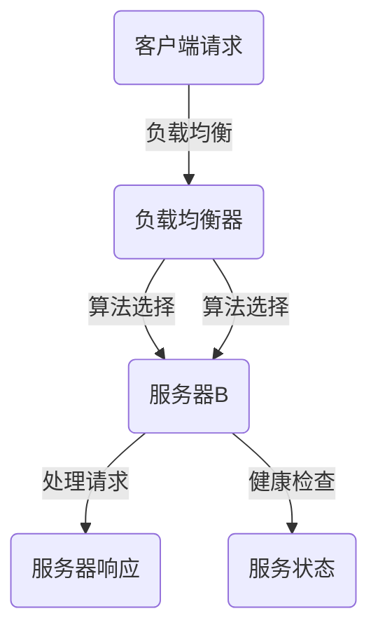

                 

### 《负载均衡技术：从硬件到软件解决方案》

#### 关键词：负载均衡、硬件负载均衡、软件负载均衡、工作原理、性能优化、高可用性设计

#### 摘要：
负载均衡技术是现代网络架构中不可或缺的一环，它能够有效地提升系统的性能、可靠性和扩展性。本文将从硬件到软件，详细探讨负载均衡技术的基本概念、工作原理、解决方案及其在实际应用中的具体实践。通过本文的阅读，读者将全面了解负载均衡技术，掌握其在不同环境中的应用技巧，为构建高效稳定的系统奠定基础。

### 《负载均衡技术：从硬件到软件解决方案》目录大纲

#### 第一部分：负载均衡技术概述

##### 第1章：负载均衡的基本概念
##### 第2章：负载均衡的工作原理

#### 第二部分：硬件负载均衡解决方案

##### 第3章：硬件负载均衡器
##### 第4章：硬件负载均衡器的部署与优化

#### 第三部分：软件负载均衡解决方案

##### 第5章：软件负载均衡器
##### 第6章：软件负载均衡器的部署与优化

#### 第四部分：负载均衡在实践中的应用

##### 第7章：负载均衡在Web服务中的应用
##### 第8章：负载均衡在容器化环境中的应用
##### 第9章：负载均衡在云原生环境中的应用

#### 第五部分：负载均衡技术的发展趋势

##### 第10章：负载均衡技术的发展趋势

#### 附录

##### 附录 A：常用负载均衡器介绍

### 文章正文开始

#### 第一部分：负载均衡技术概述

##### 第1章：负载均衡的基本概念

##### 1.1 负载均衡的定义与重要性

在计算机系统中，负载均衡（Load Balancing）指的是将大量请求分布到多个处理节点上，从而实现系统资源的合理分配和高效利用。负载均衡的基本概念可以概括为以下几点：

- **资源分配**：将网络、计算、存储等资源合理地分配给不同的请求。
- **负载分担**：通过将请求分发到多个节点，实现负载的均衡分配。
- **高可用性**：通过冗余设计，提高系统的可靠性和故障恢复能力。
- **可扩展性**：允许系统在需求增加时动态扩展资源，以应对更高的负载。

在系统设计中，负载均衡技术的重要性主要体现在以下几个方面：

- **提升性能**：通过将请求分配到多个节点，可以有效地提高系统的响应速度和处理能力。
- **增强可靠性**：通过冗余设计，即使某个节点出现故障，系统仍能保持正常运行。
- **支持扩展**：随着业务需求的增长，负载均衡技术可以方便地扩展系统资源。
- **优化资源利用**：通过智能分配负载，可以提高资源的利用效率，降低系统成本。

##### 1.2 负载均衡的分类

根据实现方式的不同，负载均衡可以分为以下几类：

- **硬件负载均衡**：使用专门的硬件设备来实现负载均衡，如F5 BIG-IP、Nginx硬件版本等。
- **软件负载均衡**：使用软件来实现负载均衡，如Nginx、HAProxy等。
- **应用层负载均衡**：在应用层实现负载均衡，如使用反向代理或API网关。
- **网络层负载均衡**：在网络层实现负载均衡，如使用DNS轮询、TCP负载均衡等。

##### 1.3 负载均衡的目标

负载均衡技术的主要目标包括以下几点：

- **最大化资源利用**：通过智能分配负载，最大化地利用系统资源。
- **最小化响应时间**：通过将请求分配到最近的节点，最小化系统的响应时间。
- **高可用性**：通过冗余设计，提高系统的可用性和故障恢复能力。
- **负载均衡**：通过合理分配负载，避免单个节点过载。

##### 第2章：负载均衡的工作原理

##### 2.1 负载均衡器的工作机制

负载均衡器（Load Balancer）是负责实现负载均衡的核心组件。它通过接收客户端的请求，将请求分发到后端的多个服务器上，从而实现负载的均衡分配。负载均衡器的工作机制主要包括以下几个步骤：

1. **接收请求**：负载均衡器接收来自客户端的请求，可以是HTTP请求、TCP请求等。
2. **选择服务器**：根据一定的负载均衡算法，选择一个合适的服务器来处理请求。
3. **转发请求**：将请求转发到选中的服务器上。
4. **响应处理**：接收服务器的响应，并返回给客户端。

##### 2.2 负载均衡算法

负载均衡算法是决定请求分配策略的关键。常见的负载均衡算法包括以下几种：

- **轮询算法**：将请求依次分配到每个服务器上，实现负载的均匀分配。
- **最小连接算法**：选择当前连接数最少的服务器来处理请求。
- **加权轮询算法**：根据服务器的性能或负载情况，为每个服务器分配不同的权重，实现负载的动态分配。
- **最少响应时间算法**：选择当前响应时间最短的服务器来处理请求。

##### 2.3 负载均衡器的性能指标

负载均衡器的性能指标是衡量其工作效果的重要标准。常见的性能指标包括以下几个方面：

- **吞吐量**：负载均衡器能够处理的最大请求量。
- **响应时间**：客户端收到响应的时间。
- **并发连接数**：负载均衡器能够同时处理的连接数。
- **故障恢复时间**：负载均衡器检测到服务器故障后，重新分配请求的时间。

#### 第二部分：硬件负载均衡解决方案

##### 第3章：硬件负载均衡器

##### 3.1 硬件负载均衡器的优势

硬件负载均衡器在性能和可靠性方面具有显著优势，主要表现在以下几个方面：

- **高性能**：硬件负载均衡器具有高速的数据处理能力，能够处理大量并发请求。
- **高可靠性**：硬件负载均衡器采用冗余设计，具有高故障恢复能力。
- **低延迟**：硬件负载均衡器可以减少请求传输过程中的延迟，提高系统响应速度。
- **高安全性**：硬件负载均衡器可以提供丰富的安全特性，如加密、防火墙等。

##### 3.2 硬件负载均衡器的常见类型

常见的硬件负载均衡器包括以下几种：

- **专用负载均衡器**：如F5 BIG-IP、Array Networks等，这些设备专门用于负载均衡任务。
- **网络设备**：如路由器和交换机，这些设备可以集成负载均衡功能。
- **服务器集群**：通过多台服务器实现负载均衡，如LVS（Linux Virtual Server）。

##### 3.3 硬件负载均衡器的配置与管理

硬件负载均衡器的配置与管理主要包括以下几个方面：

- **配置网络接口**：设置负载均衡器的网络接口，实现请求的接收和转发。
- **配置负载均衡算法**：根据需求选择合适的负载均衡算法，实现负载的均衡分配。
- **配置健康检查**：设置健康检查规则，定期检查后端服务器的状态。
- **配置高可用性**：设置负载均衡器的主备模式，实现故障自动切换。

##### 第4章：硬件负载均衡器的部署与优化

##### 4.1 硬件负载均衡器的部署流程

硬件负载均衡器的部署流程主要包括以下几个步骤：

1. **硬件准备**：准备相应的硬件设备，如负载均衡器、服务器等。
2. **软件安装**：在负载均衡器上安装相应的负载均衡软件。
3. **网络配置**：配置负载均衡器的网络接口和IP地址。
4. **负载均衡配置**：配置负载均衡算法、健康检查等参数。
5. **测试验证**：测试负载均衡器的性能和功能，确保正常运行。

##### 4.2 硬件负载均衡器的性能优化

硬件负载均衡器的性能优化主要包括以下几个方面：

- **优化网络配置**：调整网络参数，如MTU（最大传输单元）、TCP窗口大小等，以提高数据传输效率。
- **优化负载均衡算法**：根据实际情况选择合适的负载均衡算法，实现负载的动态调整。
- **优化服务器性能**：提高后端服务器的性能，如升级硬件、优化软件等。
- **缓存策略**：使用缓存技术，减少服务器的响应时间。

##### 4.3 硬件负载均衡器的高可用性设计

硬件负载均衡器的高可用性设计主要包括以下几个方面：

- **主备模式**：设置负载均衡器的主备模式，实现故障自动切换。
- **冗余设计**：采用冗余设计，提高系统的可靠性。
- **故障检测**：定期检测后端服务器的状态，及时处理故障。
- **负载均衡**：在故障发生时，将请求分配到健康的服务器上。

#### 第三部分：软件负载均衡解决方案

##### 第5章：软件负载均衡器

##### 5.1 软件负载均衡器的优势

软件负载均衡器在性能、灵活性和成本方面具有显著优势，主要表现在以下几个方面：

- **高性能**：软件负载均衡器可以利用服务器资源，实现高效的数据处理。
- **灵活性**：软件负载均衡器可以根据需求灵活配置，实现多种负载均衡算法。
- **低成本**：软件负载均衡器无需额外的硬件设备，降低了系统的成本。
- **易扩展**：软件负载均衡器可以方便地集成到现有的系统中，实现快速部署。

##### 5.2 软件负载均衡器的常见类型

常见的软件负载均衡器包括以下几种：

- **开源负载均衡器**：如Nginx、HAProxy、LVS等，这些负载均衡器具有开源、免费的特性。
- **商业负载均衡器**：如F5 BIG-IP、Array Networks等，这些负载均衡器提供专业的支持和功能。
- **云负载均衡器**：如阿里云负载均衡、腾讯云负载均衡等，这些负载均衡器提供云服务支持。

##### 5.3 软件负载均衡器的配置与管理

软件负载均衡器的配置与管理主要包括以下几个方面：

- **配置网络接口**：设置负载均衡器的网络接口和IP地址。
- **配置负载均衡算法**：根据需求选择合适的负载均衡算法。
- **配置健康检查**：设置健康检查规则，定期检查后端服务器的状态。
- **配置高可用性**：设置负载均衡器的主备模式，实现故障自动切换。

##### 第6章：软件负载均衡器的部署与优化

##### 6.1 软件负载均衡器的部署流程

软件负载均衡器的部署流程主要包括以下几个步骤：

1. **环境准备**：准备相应的服务器和操作系统。
2. **软件安装**：在服务器上安装负载均衡器软件。
3. **网络配置**：配置负载均衡器的网络接口和IP地址。
4. **配置负载均衡**：配置负载均衡算法、健康检查等参数。
5. **测试验证**：测试负载均衡器的性能和功能，确保正常运行。

##### 6.2 软件负载均衡器的性能优化

软件负载均衡器的性能优化主要包括以下几个方面：

- **优化服务器性能**：提高服务器的硬件性能，如CPU、内存、磁盘等。
- **优化网络配置**：调整网络参数，如MTU、TCP窗口大小等，以提高数据传输效率。
- **优化负载均衡算法**：根据实际情况选择合适的负载均衡算法。
- **缓存策略**：使用缓存技术，减少服务器的响应时间。

##### 6.3 软件负载均衡器的高可用性设计

软件负载均衡器的高可用性设计主要包括以下几个方面：

- **主备模式**：设置负载均衡器的主备模式，实现故障自动切换。
- **集群部署**：将多个负载均衡器组成集群，提高系统的可靠性。
- **故障检测**：定期检测后端服务器的状态，及时处理故障。
- **负载均衡**：在故障发生时，将请求分配到健康的服务器上。

#### 第四部分：负载均衡在实践中的应用

##### 第7章：负载均衡在Web服务中的应用

##### 7.1 负载均衡在Web服务器中的配置

在Web服务器中，负载均衡可以通过以下方式进行配置：

- **反向代理**：使用反向代理服务器（如Nginx、Apache）实现负载均衡。
- **负载均衡模块**：在Web服务器中集成负载均衡模块，如Apache的mod_proxy。
- **第三方工具**：使用第三方工具（如HAProxy、LVS）实现负载均衡。

##### 7.2 负载均衡在电商平台的应用

在电商平台中，负载均衡主要用于以下方面：

- **流量分发**：将用户请求分配到不同的服务器上，提高系统的处理能力。
- **缓存**：通过缓存技术，减少服务器的响应时间，提高系统的性能。
- **高可用性**：通过冗余设计，提高系统的可靠性和故障恢复能力。

##### 7.3 负载均衡在云计算平台中的应用

在云计算平台中，负载均衡主要用于以下方面：

- **弹性扩展**：根据需求动态调整负载均衡器的配置，实现系统的弹性扩展。
- **负载均衡**：将用户请求分配到不同的云服务器上，提高系统的处理能力。
- **安全性**：通过负载均衡器实现访问控制，提高系统的安全性。

##### 第8章：负载均衡在容器化环境中的应用

##### 8.1 负载均衡在Docker环境中的应用

在Docker环境中，负载均衡可以通过以下方式进行配置：

- **Docker Compose**：使用Docker Compose配置负载均衡器，如Nginx。
- **第三方工具**：使用第三方工具（如HAProxy、LVS）实现负载均衡。
- **服务网格**：使用服务网格（如Istio、Linkerd）实现负载均衡。

##### 8.2 负载均衡在Kubernetes环境中的应用

在Kubernetes环境中，负载均衡可以通过以下方式进行配置：

- **Kubernetes Ingress**：使用Kubernetes Ingress实现负载均衡。
- **第三方工具**：使用第三方工具（如HAProxy、Nginx）实现负载均衡。
- **服务网格**：使用服务网格（如Istio、Linkerd）实现负载均衡。

##### 8.3 负载均衡在微服务架构中的应用

在微服务架构中，负载均衡主要用于以下方面：

- **服务路由**：将用户请求路由到不同的微服务实例上，实现服务的负载均衡。
- **服务发现**：实现微服务实例的动态注册和发现，提高系统的可靠性。
- **流量控制**：根据需求调整流量的分配，实现服务的负载均衡。

##### 第9章：负载均衡在云原生环境中的应用

##### 9.1 负载均衡在云原生架构中的设计

在云原生架构中，负载均衡的设计主要包括以下几个方面：

- **服务网格**：使用服务网格（如Istio、Linkerd）实现服务的负载均衡。
- **容器编排**：使用容器编排工具（如Kubernetes）实现负载均衡。
- **云原生负载均衡器**：使用云原生负载均衡器（如Kubernetes Ingress）实现负载均衡。

##### 9.2 负载均衡在云原生应用中的优化

负载均衡在云原生应用中的优化主要包括以下几个方面：

- **服务发现**：优化服务发现机制，提高系统的可靠性。
- **流量控制**：根据需求调整流量的分配，实现服务的负载均衡。
- **弹性扩展**：根据需求动态调整负载均衡器的配置，实现系统的弹性扩展。

##### 9.3 负载均衡在混合云环境中的应用

在混合云环境中，负载均衡主要用于以下方面：

- **跨云负载均衡**：实现跨云服务的负载均衡，提高系统的可靠性。
- **多云管理**：统一管理多个云服务的负载均衡，提高系统的灵活性。
- **流量优化**：根据流量特点，调整负载均衡策略，提高系统的性能。

#### 第五部分：负载均衡技术的发展趋势

##### 第10章：负载均衡技术的发展趋势

随着云计算、容器化、边缘计算等技术的发展，负载均衡技术也在不断演进。未来，负载均衡技术的发展趋势主要包括以下几个方面：

- **智能化**：通过人工智能技术，实现更智能的负载均衡策略。
- **边缘计算**：将负载均衡延伸到边缘节点，提高系统的响应速度。
- **服务网格**：使用服务网格实现更灵活、更可靠的负载均衡。
- **云原生**：在云原生架构中，负载均衡将更加集成和自动化。

#### 附录

##### 附录 A：常用负载均衡器介绍

- **Nginx**：高性能的Web服务器和反向代理服务器，支持多种负载均衡算法。
- **Apache HTTP Server**：经典的Web服务器，支持负载均衡模块。
- **HAProxy**：高性能的负载均衡器，支持多种负载均衡算法和健康检查机制。
- **LVS**：Linux Virtual Server，基于Linux内核的负载均衡解决方案。
- **其他负载均衡器简介**：如F5 BIG-IP、AWS ELB、Azure Load Balancer等，这些负载均衡器提供丰富的功能和高可靠性。

### 结语

负载均衡技术在现代网络架构中具有至关重要的作用。通过本文的详细探讨，读者可以全面了解负载均衡技术的基本概念、工作原理、解决方案和实际应用。在实际项目中，合理选择和配置负载均衡器，可以有效提高系统的性能、可靠性和扩展性。未来，随着技术的不断发展，负载均衡技术将继续为构建高效稳定的系统提供有力支持。

### 作者

- 作者：AI天才研究院/AI Genius Institute & 禅与计算机程序设计艺术 /Zen And The Art of Computer Programming
<|endoftext|>### 核心概念与联系

#### 负载均衡的基本概念

**负载均衡**是一种将网络请求、任务或工作负载分配到多个服务器或节点上的技术，旨在确保资源的高效利用、系统的性能优化和可靠性的提升。在计算机科学和信息技术领域，负载均衡是一个关键的架构组件，广泛应用于互联网服务、企业应用和云计算环境。

**负载均衡的关键概念包括：**
- **资源分配**：将请求合理分配到服务器或节点上，确保每个资源都能得到均衡使用。
- **负载分担**：通过将请求分散到多个节点，降低单个节点的负载，避免过载。
- **高可用性**：通过冗余设计，保证系统的稳定运行，即使某些节点出现故障，系统仍能继续提供服务。
- **扩展性**：系统可以根据业务需求动态扩展，适应更高的负载。

**核心概念与联系**： 
在系统设计中，负载均衡与以下几个关键概念密切相关：

- **服务器集群**：负载均衡是服务器集群架构的核心组成部分，通过将请求分布到集群中的多个服务器，提高系统的处理能力和可用性。
- **网络拓扑**：负载均衡器通常位于网络架构中的入口层，与网络拓扑紧密相关，影响网络流量和控制平面。
- **容错机制**：负载均衡器需要具备容错能力，能够检测节点故障并自动切换到健康的节点，保证服务的连续性。
- **性能监控**：通过监控系统的性能指标，如吞吐量、延迟和错误率，负载均衡器可以动态调整负载分配策略。

**Mermaid 流程图：**

在这个流程图中，客户端请求通过网络到达负载均衡器，负载均衡器根据设定的算法选择合适的服务器进行处理，处理完成后返回响应。同时，负载均衡器会定期对服务器的健康状态进行检查，确保系统的稳定运行。

### 核心算法原理讲解

#### 负载均衡算法

负载均衡算法是决定请求如何分配到服务器或节点上的关键。以下是几种常见的负载均衡算法：

- **轮询算法**：将请求依次分配到每个服务器，实现简单的负载均衡。
- **最小连接算法**：选择当前连接数最少的服务器来处理请求，确保负载的均衡分配。
- **加权轮询算法**：为每个服务器分配不同的权重，根据权重分配请求，实现动态的负载均衡。
- **最少响应时间算法**：选择当前响应时间最短的服务器来处理请求，减少请求的响应时间。

**轮询算法**：这是一种最简单的负载均衡算法，其基本思想是按照一定顺序将请求分配到各个服务器。轮询算法可以通过线性表、循环队列等数据结构来实现。

**伪代码**：
```python
function round_robin(server_list, request):
    index = 0
    while True:
        server = server_list[index]
        if server.is_available():
            server.handle_request(request)
            index = (index + 1) % len(server_list)
            break
```

**加权轮询算法**：在轮询算法的基础上，加权轮询算法为每个服务器分配一个权重，根据权重分配请求。权重可以根据服务器的性能、负载等因素动态调整。

**伪代码**：
```python
function weighted_round_robin(server_list, request):
    total_weight = sum(server.weight for server in server_list)
    random = random_number(0, total_weight)
    cumulative_weight = 0
    for server in server_list:
        cumulative_weight += server.weight
        if random <= cumulative_weight:
            server.handle_request(request)
            break
```

**最少响应时间算法**：该算法选择当前响应时间最短的服务器来处理请求，以减少系统的平均响应时间。响应时间可以通过监控和测量得到。

**伪代码**：
```python
function least_response_time(server_list, request):
    min_response_time = float('inf')
    best_server = None
    for server in server_list:
        if server.is_available() and server.response_time < min_response_time:
            min_response_time = server.response_time
            best_server = server
    if best_server:
        best_server.handle_request(request)
```

这些算法都有各自的优缺点和适用场景。在实际应用中，可以根据具体的业务需求和系统环境选择合适的算法。

### 数学模型和公式

在某些负载均衡算法中，需要使用数学模型和公式来计算和分配请求。以下是一个简单的数学模型示例：

- **平均响应时间**：假设有多个服务器，每个服务器的处理能力不同，定义每个服务器的处理时间为 $t_i$，请求的到达率为 $\lambda$，则系统的平均响应时间 $T$ 可以通过以下公式计算：

  $$ T = \frac{1}{\lambda} \sum_{i=1}^{n} \frac{t_i}{1 - \lambda \sum_{j=1}^{n} \frac{1}{t_j}} $$

  其中，$n$ 为服务器的数量。

**详细讲解和举例说明**：

假设有一个包含三个服务器的系统，处理时间分别为 $t_1 = 1$ 秒、$t_2 = 2$ 秒和 $t_3 = 3$ 秒，请求的到达率为 $\lambda = 2$。我们可以通过以下步骤计算系统的平均响应时间：

1. 计算每个服务器的处理能力倒数：$\frac{1}{t_1} = 1$、$\frac{1}{t_2} = 0.5$、$\frac{1}{t_3} = 0.333$。
2. 计算总和：$1 + 0.5 + 0.333 = 1.833$。
3. 计算平均响应时间：$T = \frac{1}{2} \times \frac{1 + 0.5 + 0.333}{1 - 2 \times 1.833} = 1.111$ 秒。

通过这个示例，我们可以看到数学模型和公式在计算负载均衡性能指标中的重要作用。

### 项目实战

#### 开发环境搭建

在进行负载均衡项目开发前，需要搭建一个合适的环境。以下是一个基于Nginx的负载均衡项目的环境搭建步骤：

1. **安装Nginx**：在服务器上安装Nginx，可以使用包管理工具，如yum或apt-get。
    ```bash
    # CentOS系统
    yum install nginx
    
    # Ubuntu系统
    apt-get install nginx
    ```
2. **配置Nginx**：编辑Nginx的配置文件，如`/etc/nginx/nginx.conf`，配置负载均衡。
    ```nginx
    user nginx;
    worker_processes  1;
    
    events {
        worker_connections  10240;
    }
    
    http {
        upstream myapp {
            server server1:80;
            server server2:80;
            server server3:80;
            # 使用加权轮询算法，server3权重较高
            server server3:80 weight=3;
        }
        
        server {
            listen       80;
            server_name  localhost;
        
            location / {
                proxy_pass http://myapp;
            }
        }
    }
    ```
3. **启动Nginx服务**：重新加载Nginx配置文件并启动服务。
    ```bash
    systemctl restart nginx
    ```

#### 源代码详细实现

在Nginx配置文件中，`upstream`块定义了负载均衡的后端服务器列表。以下是一个简单的Nginx负载均衡配置的源代码示例：

```nginx
http {
    upstream myapp {
        server server1:80;
        server server2:80;
        server server3:80 weight=3;
    }

    server {
        listen       80;
        server_name  localhost;

        location / {
            proxy_pass http://myapp;
            proxy_connect_timeout 5;
            proxy_read_timeout 90;
            proxy_set_header Host $host;
            proxy_set_header X-Real-IP $remote_addr;
            proxy_set_header X-Forwarded-For $proxy_add_x_forwarded_for;
        }
    }
}
```

#### 代码解读与分析

- **upstream myapp**：定义了一个名为`myapp`的负载均衡池，包含三个服务器。`weight`参数用于设置服务器的权重，权重较高的服务器会接收更多的请求。
- **server server1:80**：配置服务器地址和端口号。每个服务器都有自己的IP地址和端口号。
- **proxy_pass http://myapp**：将客户端请求转发到负载均衡池`myapp`。
- **proxy_connect_timeout 5**：设置连接超时时间为5秒，超过这个时间，Nginx会关闭连接。
- **proxy_read_timeout 90**：设置读取超时时间为90秒，超过这个时间，Nginx会关闭连接。
- **proxy_set_header Host $host**：保留请求的Host头信息。
- **proxy_set_header X-Real-IP $remote_addr**：传递客户端的真实IP地址。
- **proxy_set_header X-Forwarded-For $proxy_add_x_forwarded_for**：传递代理服务器的IP地址。

#### 实际案例分析

在实际应用中，负载均衡系统需要处理大量的请求，以下是负载均衡在电商平台中的应用案例：

- **场景**：一个大型电商平台在双11促销期间，需要处理数以亿计的请求。
- **解决方案**：采用分布式负载均衡架构，使用Nginx作为负载均衡器，将请求转发到多个Web服务器和数据库服务器。同时，使用Redis缓存系统减少数据库的负载。
- **性能优化**：调整Nginx的负载均衡算法和超时参数，确保系统在高并发情况下稳定运行。使用CDN加速静态资源访问，提高页面加载速度。

通过这个案例，我们可以看到负载均衡在应对大规模业务场景中的重要作用。合理设计和配置负载均衡系统，可以有效提升系统的性能和可靠性，确保业务的连续性和稳定性。

### 总结

通过本文的详细分析和讲解，我们全面了解了负载均衡技术的基本概念、工作原理、硬件和软件解决方案，以及其在实际应用中的具体实践。负载均衡技术在提升系统性能、可靠性、扩展性和成本控制方面具有重要作用。随着技术的不断进步，负载均衡技术将继续发展，为构建高效稳定的系统提供更强大的支持。

### 附录

**附录 A：常用负载均衡器介绍**

- **Nginx**：Nginx是一款高性能的Web服务器和反向代理服务器，支持HTTP和HTTPS协议。它支持多种负载均衡算法，如轮询、最少连接、IP哈希等。
- **HAProxy**：HAProxy是一款开源的高性能负载均衡器，支持TCP、HTTP和HTTPS协议。它具有强大的性能和可扩展性，适用于高并发的场景。
- **LVS**：LVS（Linux Virtual Server）是一款基于Linux内核的虚拟服务器解决方案，支持基于IP的负载均衡。它具有高性能、高可靠性和良好的扩展性。
- **F5 BIG-IP**：F5 BIG-IP是一款商业负载均衡器，支持多种协议，如TCP、HTTP、HTTPS等。它具有强大的性能和高级功能，适用于复杂的网络架构。
- **AWS Elastic Load Balancer**：AWS Elastic Load Balancer是一种云负载均衡服务，支持HTTP、HTTPS、TCP和UDP协议。它提供了简单的配置和管理界面，适用于AWS云环境。
- **Azure Load Balancer**：Azure Load Balancer是微软Azure云服务中的一种负载均衡器，支持HTTP、HTTPS、TCP和UDP协议。它提供了灵活的部署选项和强大的性能。

这些负载均衡器各有特点，适用于不同的应用场景和需求。合理选择和配置负载均衡器，可以最大化地发挥其性能和优势，提高系统的稳定性和可靠性。

### 结束语

感谢您阅读本文，希望您能从中获得关于负载均衡技术的深入理解和实践经验。随着技术的发展，负载均衡技术将继续演进，为构建高效稳定的系统提供更强大的支持。如果您有任何疑问或建议，欢迎在评论区留言，我们期待与您共同探讨。

### 作者

**作者：AI天才研究院/AI Genius Institute & 禅与计算机程序设计艺术 /Zen And The Art of Computer Programming**

再次感谢您的阅读和支持，期待我们下次再会！

