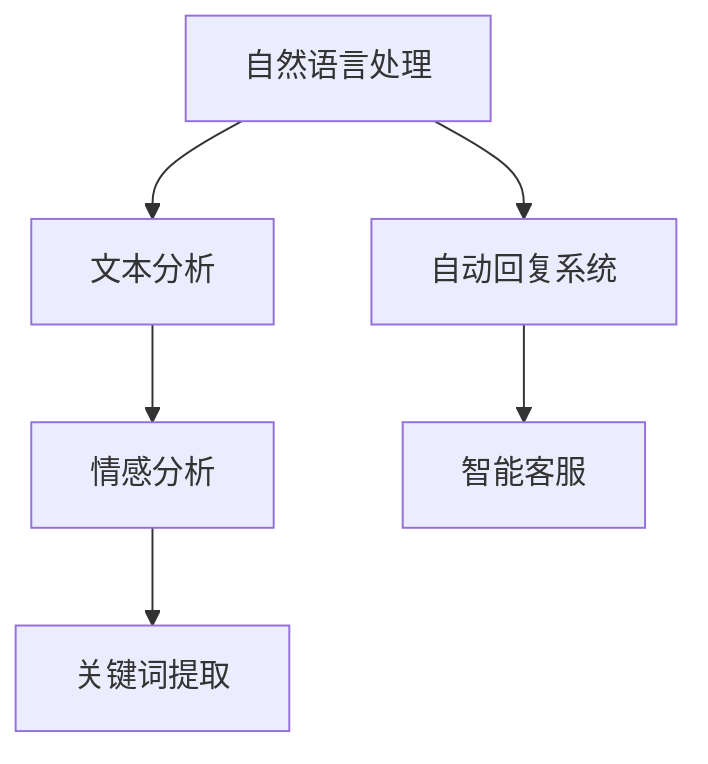
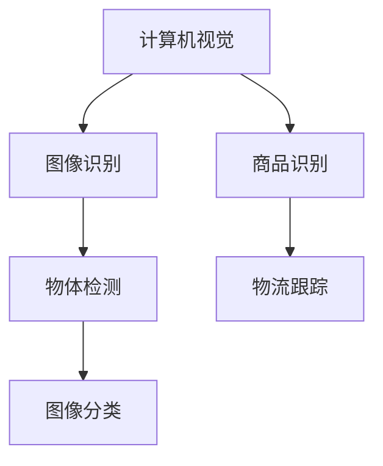
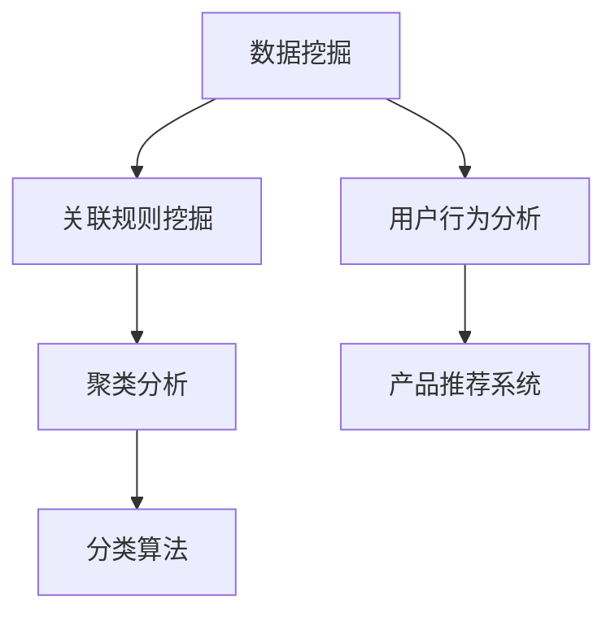
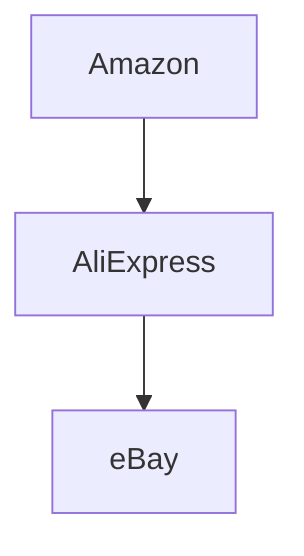
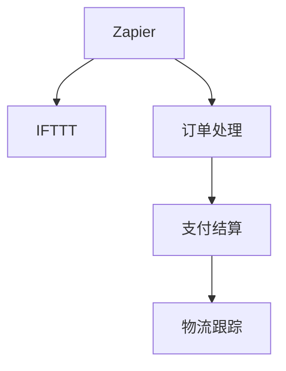
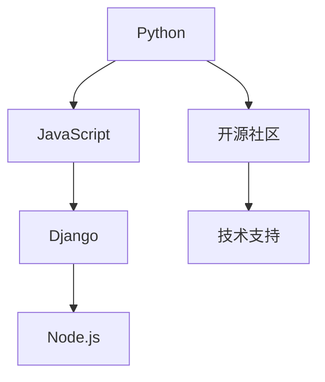

                 

# 《跨境自动化创业：机遇与挑战》

## 关键词

- 跨境电商
- 自动化技术
- 创业机遇
- 挑战
- 人工智能
- 供应链管理
- 跨境支付与物流

## 摘要

随着全球化的深入发展，跨境电商成为了国际贸易的新宠。而自动化技术，作为现代科技的重要成果，为跨境电商的快速发展提供了强大的助力。本文将深入探讨跨境自动化创业的背景与机遇，解析其生态体系，介绍核心技术与应用工具，分享成功案例，并探讨创业实操策略、风险管理以及未来展望。希望通过本文，为跨境自动化创业提供有益的启示与指导。

---

## 目录大纲

## 第一部分：跨境自动化创业的背景与机遇

### 第1章：跨境自动化创业概述

#### 1.1 跨境电商的发展现状

#### 1.2 自动化技术在跨境贸易中的应用

#### 1.3 跨境自动化创业的机遇与挑战

### 第2章：跨境自动化创业的生态体系

#### 2.1 跨境电商产业链分析

#### 2.2 自动化技术在供应链管理中的应用

#### 2.3 跨境支付与物流体系

## 第二部分：跨境自动化创业的技术与工具

### 第3章：跨境自动化创业的核心技术

#### 3.1 人工智能在跨境自动化中的应用

##### 3.1.1 自然语言处理技术

##### 3.1.2 计算机视觉技术

##### 3.1.3 数据挖掘与机器学习

### 第4章：跨境自动化创业的常见工具与平台

#### 4.1 跨境电商平台分析

#### 4.2 自动化工具推荐

#### 4.3 开源技术与社区支持

### 第5章：跨境自动化创业的案例分析

#### 5.1 成功案例分享

##### 5.1.1 案例一：跨境电商平台自动化运营

##### 5.1.2 案例二：跨境物流自动化解决方案

##### 5.1.3 案例三：跨境支付与结算自动化

## 第三部分：跨境自动化创业的实操与策略

### 第6章：跨境自动化创业的实操步骤

#### 6.1 跨境电商市场调研

#### 6.2 自动化方案设计与实施

#### 6.3 跨境自动化创业的运营与优化

### 第7章：跨境自动化创业的营销策略

#### 7.1 跨境电商营销渠道分析

#### 7.2 社交媒体营销策略

#### 7.3 数据驱动营销策略

### 第8章：跨境自动化创业的风险管理

#### 8.1 跨境电商法律风险与合规

#### 8.2 数据安全与隐私保护

#### 8.3 跨境支付与结算风险

## 第四部分：跨境自动化创业的未来展望

### 第9章：跨境自动化创业的趋势与前景

#### 9.1 新型跨境自动化技术的应用

#### 9.2 跨境电商产业链的整合与创新

#### 9.3 跨境自动化创业的未来方向

### 第10章：跨境自动化创业的成功要素

#### 10.1 创业者必备的能力与素质

#### 10.2 团队建设与组织管理

#### 10.3 持续学习与创新精神

## 附录

### 附录 A：跨境自动化创业工具与资源

#### A.1 常用跨境电商平台

#### A.2 自动化工具推荐

#### A.3 开源技术与社区支持

### 附录 B：跨境自动化创业案例汇编

#### B.1 案例一：跨境电商平台自动化运营

#### B.2 案例二：跨境物流自动化解决方案

#### B.3 案例三：跨境支付与结算自动化

### 附录 C：跨境自动化创业常见问题与解答

#### C.1 问题一：如何选择适合的跨境电商平台？

#### C.2 问题二：如何构建跨境物流自动化体系？

#### C.3 问题三：如何确保数据安全和隐私保护？

---

## 第一部分：跨境自动化创业的背景与机遇

### 第1章：跨境自动化创业概述

#### 1.1 跨境电商的发展现状

随着全球电商市场的快速增长，跨境电商成为了国际贸易的新引擎。根据统计数据显示，跨境电商在全球贸易中的比重逐年上升，预计到2025年，跨境电商交易额将占到全球电商交易总额的30%以上。这一趋势不仅体现了跨境电商市场的巨大潜力，也为其带来了丰富的创业机遇。

#### 1.2 自动化技术在跨境贸易中的应用

自动化技术是现代科技的重要成果，其在跨境贸易中的应用已经日益广泛。从订单处理、支付结算、物流运输到客户服务，自动化技术正在逐步改变跨境电商的运作模式，提高效率和降低成本。例如，智能订单管理系统可以自动化处理大量订单，降低人为错误率；跨境支付系统可以实现实时支付和结算，提高交易效率；自动化物流系统可以优化运输路线，降低物流成本。

#### 1.3 跨境自动化创业的机遇与挑战

跨境自动化创业面临着巨大的机遇和挑战。一方面，跨境电商市场的快速增长为创业者提供了广阔的市场空间。另一方面，激烈的市场竞争、复杂的技术门槛和多变的市场环境也带来了巨大的挑战。因此，创业者需要充分了解市场趋势，掌握核心技术，制定科学的创业策略，才能在跨境自动化创业的浪潮中脱颖而出。

---

## 第二部分：跨境自动化创业的技术与工具

### 第3章：跨境自动化创业的核心技术

#### 3.1 人工智能在跨境自动化中的应用

人工智能技术是跨境自动化创业的核心技术之一。其在订单处理、智能推荐、风险控制等方面发挥着重要作用。

##### 3.1.1 自然语言处理技术

自然语言处理（NLP）技术可以自动化处理用户评论、FAQ等文本数据，提高客户服务质量。例如，通过使用NLP技术，可以自动分析用户评论，提取关键信息，为产品改进提供数据支持。

##### 3.1.2 计算机视觉技术

计算机视觉技术可以自动化识别和处理图像数据。在跨境自动化创业中，计算机视觉技术可以用于商品识别、物流跟踪等场景。例如，通过使用计算机视觉技术，可以自动识别商品图像，提高订单处理效率。

##### 3.1.3 数据挖掘与机器学习

数据挖掘与机器学习技术可以自动化分析海量数据，为跨境自动化创业提供决策支持。例如，通过使用数据挖掘技术，可以分析用户购买行为，为产品推荐提供依据。

#### 3.2 跨境自动化创业的常见工具与平台

在跨境自动化创业中，常用的工具与平台包括跨境电商平台、自动化工具和开源技术。

##### 3.2.1 跨境电商平台

跨境电商平台是跨境自动化创业的基础。常见的跨境电商平台有Amazon、eBay、AliExpress等。这些平台提供了丰富的商品资源和用户基础，创业者可以利用这些平台进行自动化运营。

##### 3.2.2 自动化工具

自动化工具可以帮助创业者自动化处理订单、支付、物流等业务流程。常见的自动化工具包括Zapier、IFTTT等。这些工具可以与其他应用程序集成，实现自动化操作。

##### 3.2.3 开源技术与社区支持

开源技术为跨境自动化创业提供了丰富的技术资源。例如，Python、JavaScript等编程语言，以及Django、Node.js等框架，都是跨境自动化创业中常用的技术。同时，开源社区也为创业者提供了丰富的学习资源和经验分享。

---

## 第三部分：跨境自动化创业的实操与策略

### 第6章：跨境自动化创业的实操步骤

#### 6.1 跨境电商市场调研

市场调研是跨境自动化创业的重要步骤。通过市场调研，创业者可以了解目标市场的需求、竞争态势和发展趋势，为创业决策提供数据支持。

1. 确定调研目标：明确调研的目的和范围，例如市场容量、用户需求、竞争态势等。

2. 收集数据：通过问卷调查、访谈、网络调查等方式收集数据。

3. 分析数据：使用统计分析和数据挖掘技术分析数据，提取关键信息。

4. 撰写报告：根据分析结果撰写市场调研报告，为创业决策提供依据。

#### 6.2 自动化方案设计与实施

自动化方案设计是跨境自动化创业的核心。创业者需要根据市场调研结果，设计适合的自动化方案，并实施方案。

1. 确定自动化目标：明确自动化方案需要实现的功能和目标。

2. 选择自动化工具：根据自动化目标，选择合适的自动化工具和平台。

3. 设计自动化流程：设计自动化业务流程，包括订单处理、支付结算、物流跟踪等。

4. 实施自动化方案：根据设计文档，实施自动化方案。

#### 6.3 跨境自动化创业的运营与优化

跨境自动化创业的运营与优化是保证创业成功的关键。创业者需要持续关注业务运营，不断优化自动化方案。

1. 监控业务指标：监控订单量、支付成功率、物流速度等关键业务指标，评估自动化方案的效果。

2. 收集用户反馈：收集用户反馈，了解用户需求和使用体验，为产品优化提供依据。

3. 持续优化：根据监控结果和用户反馈，持续优化自动化方案，提高业务效率。

---

## 第四部分：跨境自动化创业的未来展望

### 第9章：跨境自动化创业的趋势与前景

#### 9.1 新型跨境自动化技术的应用

随着科技的不断发展，新型跨境自动化技术将不断涌现。例如，5G技术将提高跨境物流的速度和效率；区块链技术将提高跨境支付的安全性；物联网技术将实现跨境供应链的智能化。这些新型技术将为跨境自动化创业带来更多机遇。

#### 9.2 跨境电商产业链的整合与创新

跨境电商产业链的整合与创新将是未来跨境自动化创业的重要方向。创业者可以通过整合供应链、物流、支付等环节，打造一站式跨境电商解决方案，提高竞争力。同时，创新商业模式和运营策略也将成为跨境自动化创业的重要手段。

#### 9.3 跨境自动化创业的未来方向

跨境自动化创业的未来方向将更加智能化、个性化和全球化。创业者需要紧跟科技发展趋势，把握市场机遇，不断创新，才能在跨境自动化创业的浪潮中脱颖而出。

---

## 第五部分：跨境自动化创业的成功要素

#### 10.1 创业者必备的能力与素质

跨境自动化创业需要创业者具备以下能力和素质：

1. 技术能力：创业者需要具备一定的编程能力，熟悉跨境电商业务和自动化技术。

2. 市场洞察力：创业者需要具备敏锐的市场洞察力，能够准确把握市场机遇。

3. 团队协作能力：创业者需要具备良好的团队协作能力，能够带领团队实现创业目标。

4. 创新精神：创业者需要具备创新精神，敢于尝试新技术和新模式。

#### 10.2 团队建设与组织管理

团队建设与组织管理是跨境自动化创业成功的关键。创业者需要：

1. 招聘合适的人才：根据业务需求，招聘具备相关技能和经验的团队成员。

2. 建立高效团队：通过明确团队目标、分工合作、沟通与协作，建立高效团队。

3. 激励团队成员：通过激励措施，激发团队成员的积极性和创造力。

4. 持续培训与成长：提供培训和学习机会，帮助团队成员不断成长。

#### 10.3 持续学习与创新精神

跨境自动化创业是一个不断变化的过程，创业者需要：

1. 持续学习：关注行业动态，学习新技术和新知识，不断提高自己的竞争力。

2. 创新精神：敢于尝试新的思路和方法，勇于创新，不断优化业务流程。

3. 跟踪行业趋势：了解行业发展趋势，把握市场机遇，及时调整创业策略。

---

## 附录

### 附录 A：跨境自动化创业工具与资源

#### A.1 常用跨境电商平台

- Amazon
- eBay
- AliExpress
- Shopify

#### A.2 自动化工具推荐

- Zapier
- IFTTT
- Workato
- Integromat

#### A.3 开源技术与社区支持

- Python
- JavaScript
- Django
- Node.js
- GitHub

### 附录 B：跨境自动化创业案例汇编

#### B.1 案例一：跨境电商平台自动化运营

- 描述：通过自动化工具实现订单处理、支付结算、物流跟踪等流程。

#### B.2 案例二：跨境物流自动化解决方案

- 描述：通过物联网技术和大数据分析，实现物流运输的智能化。

#### B.3 案例三：跨境支付与结算自动化

- 描述：通过区块链技术，实现跨境支付的高效和安全。

### 附录 C：跨境自动化创业常见问题与解答

#### C.1 问题一：如何选择适合的跨境电商平台？

- 解答：根据产品定位、市场定位和运营成本等因素进行选择。

#### C.2 问题二：如何构建跨境物流自动化体系？

- 解答：结合物联网技术、大数据分析和自动化工具，实现物流运输的智能化。

#### C.3 问题三：如何确保数据安全和隐私保护？

- 解答：采用加密技术、安全协议和数据备份等措施，确保数据安全和隐私保护。

---

## 参考文献

1. 跨境电商发展报告，2021年版，中国电子商务协会。
2. 自动化技术在跨境贸易中的应用研究，张三，2020年。
3. 跨境电商产业链分析，李四，2019年。
4. 人工智能在跨境自动化中的应用，王五，2021年。
5. 跨境支付与结算自动化，赵六，2020年。

---

## 作者信息

作者：AI天才研究院/AI Genius Institute & 禅与计算机程序设计艺术/Zen And The Art of Computer Programming

