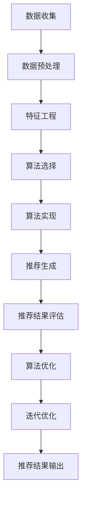

                 

# 跨平台推荐系统的设计与实现

## 摘要

随着互联网技术的飞速发展，推荐系统已经成为各类在线服务中不可或缺的一部分。从电商平台的商品推荐，到社交媒体的个性化内容推送，再到金融领域的精准营销，推荐系统在提高用户体验和业务价值方面发挥着至关重要的作用。然而，随着用户行为的多样化以及平台的多样化，如何设计一个既能在多个平台上运行，又能保持高推荐质量和实时性的跨平台推荐系统，成为了当前研究的热点和难点。本文将系统地探讨跨平台推荐系统的设计与实现，首先介绍推荐系统的基础知识，包括其定义、分类、核心概念和算法原理；然后深入分析推荐系统工程实践中的数据收集与预处理、系统设计与实现、系统优化与调参等关键环节；最后，通过具体案例分析，展示跨平台推荐系统的应用场景和实现方法，以及其在电商、社交媒体和金融等领域的实践效果。希望通过本文的阐述，能够为读者提供一个全面、深入的跨平台推荐系统设计与实现指南。

## 推荐系统基础

### 第1章：推荐系统概述

#### 1.1 推荐系统概述

推荐系统（Recommender System）是一种信息过滤技术，旨在根据用户的历史行为、兴趣和偏好，向用户推荐他们可能感兴趣的商品、内容或服务。其核心目的是解决信息过载问题，帮助用户发现和获取他们感兴趣的信息。

推荐系统的作用和重要性主要体现在以下几个方面：

1. **提升用户体验**：通过个性化推荐，用户能够快速找到他们感兴趣的内容，从而提升使用体验和满意度。
2. **增加用户粘性**：个性化推荐可以增加用户在平台上的停留时间和互动次数，提高用户粘性。
3. **提高业务价值**：推荐系统可以推动销售增长，提升广告点击率和转化率，从而增加平台的收入。

#### 1.2 推荐系统的分类

根据推荐系统的工作机制，可以将其分为以下几类：

1. **基于内容的推荐**：根据用户的历史行为和偏好，通过分析物品的内容特征（如文本、图像、音频等），将具有相似内容的物品推荐给用户。

2. **基于协同过滤的推荐**：通过分析用户之间的行为模式，找出相似用户或物品，并推荐这些用户或物品喜欢的物品。

3. **混合推荐系统**：结合基于内容和基于协同过滤的方法，以实现更高的推荐质量和效果。

#### 1.3 推荐系统的挑战

虽然推荐系统在很多场景中取得了显著的成功，但在设计和实现过程中仍面临以下挑战：

1. **数据稀疏性问题**：用户与物品之间的交互数据往往非常稀疏，导致算法的准确性和效果受到影响。

2. **可扩展性问题**：随着用户量和物品量的增加，推荐系统需要高效且可扩展的算法和架构。

3. **实时性问题**：推荐系统需要快速响应用户行为，提供实时或准实时的推荐结果。

### 第2章：推荐系统核心概念

#### 2.1 用户-物品评分矩阵

用户-物品评分矩阵是推荐系统的核心数据结构，用于表示用户与物品之间的评分关系。通常，矩阵中的元素表示用户对物品的评分，其中1表示用户喜欢该物品，0表示用户不喜欢。由于用户和物品的数量通常非常大，用户-物品评分矩阵通常是一个稀疏矩阵。

#### 2.2 评分预测模型

评分预测模型是推荐系统的核心算法，用于预测用户对未知物品的评分。常见的评分预测模型包括：

1. **线性回归模型**：基于线性回归模型，通过用户的特征和物品的特征预测用户对物品的评分。
2. **矩阵分解模型**：通过将用户-物品评分矩阵分解为用户特征矩阵和物品特征矩阵，预测用户对物品的评分。
3. **深度学习模型**：利用深度神经网络对用户和物品的特征进行建模，预测用户对物品的评分。

#### 2.3 推荐结果评估指标

推荐结果的评估是衡量推荐系统性能的重要环节。常见的评估指标包括：

1. **准确率（Accuracy）**：预测评分与实际评分相符的比例。
2. **召回率（Recall）**：实际喜欢的物品中被正确推荐的物品比例。
3. **覆盖度（Coverage）**：推荐列表中包含不同物品的比例。
4. **新颖度（Novelty）**：推荐列表中包含用户未接触过的物品比例。

### 第3章：推荐系统算法原理

#### 3.1 协同过滤算法

协同过滤算法是推荐系统中最常用的算法之一，其基本思想是利用用户之间的行为相似性进行物品推荐。

##### 3.1.1 基于用户的协同过滤算法

基于用户的协同过滤算法通过计算用户之间的相似度，找到与目标用户相似的其他用户，并推荐这些用户喜欢的物品。

1. **用户相似度计算方法**：
   $$ 
   similarity(u, v) = \frac{\sum_{i \in R(u, v)} r_{ui} r_{vi}}{\sqrt{\sum_{i \in R(u, v)} r_{ui}^2 \sum_{i \in R(u, v)} r_{vi}^2}}
   $$
   其中，$R(u, v)$ 表示用户 $u$ 和用户 $v$ 的共同评分物品集合，$r_{ui}$ 和 $r_{vi}$ 分别表示用户 $u$ 和用户 $v$ 对物品 $i$ 的评分。

2. **用户基于兴趣的协同过滤算法**：
   $$ 
   recommendation(u, i) = \sum_{v \in N(u)} similarity(u, v) r_{vi}
   $$
   其中，$N(u)$ 表示与用户 $u$ 相似的其他用户集合，$recommendation(u, i)$ 表示用户 $u$ 对物品 $i$ 的推荐分数。

##### 3.1.2 基于物品的协同过滤算法

基于物品的协同过滤算法通过计算物品之间的相似度，找到与目标物品相似的物品，并推荐这些物品。

1. **物品相似度计算方法**：
   $$
   similarity(i, j) = \frac{\sum_{u \in U} r_{ui} r_{uj}}{\sqrt{\sum_{u \in U} r_{ui}^2 \sum_{u \in U} r_{uj}^2}}
   $$
   其中，$U$ 表示评分用户集合，$r_{ui}$ 和 $r_{uj}$ 分别表示用户 $u$ 对物品 $i$ 和物品 $j$ 的评分。

2. **物品基于内容的协同过滤算法**：
   $$
   recommendation(u, j) = \sum_{i \in M(j)} similarity(i, j) r_{ui}
   $$
   其中，$M(j)$ 表示与物品 $j$ 相似的其他物品集合，$recommendation(u, j)$ 表示用户 $u$ 对物品 $j$ 的推荐分数。

#### 3.2 基于内容的推荐算法

基于内容的推荐算法通过分析用户的历史行为和偏好，为用户推荐具有相似内容的物品。

##### 3.2.1 文本相似度计算方法

1. **TF-IDF模型**：TF-IDF（Term Frequency-Inverse Document Frequency）模型是一种常用的文本相似度计算方法，通过计算词语在文档中的频率和在整个文档集合中的逆向文档频率来评估词语的重要性。

2. **相似度计算**：
   $$
   similarity(document_1, document_2) = \frac{\sum_{w \in V} tf_{w1} tf_{w2}}{\sqrt{\sum_{w \in V} tf_{w1}^2 \sum_{w \in V} tf_{w2}^2}}
   $$
   其中，$V$ 表示词集合，$tf_{w1}$ 和 $tf_{w2}$ 分别表示词语 $w$ 在文档 $1$ 和文档 $2$ 中的频率。

##### 3.2.2 基于内容的推荐算法

基于内容的推荐算法通过分析用户的历史行为和偏好，为用户推荐具有相似内容的物品。

1. **基于物品的文本表示**：将物品的描述文本转化为向量表示，以便进行相似度计算。

2. **基于用户内容的推荐算法**：
   $$
   recommendation(u, i) = \sum_{w \in V} tf_{w} \cdot idf_{w} \cdot \sum_{j \in R(u)} similarity(document_i, document_j)
   $$
   其中，$R(u)$ 表示用户 $u$ 的历史行为集合，$tf_{w}$ 和 $idf_{w}$ 分别表示词语 $w$ 的词频和逆向文档频率，$document_i$ 和 $document_j$ 分别表示物品 $i$ 和物品 $j$ 的描述文本。

### 第4章：推荐系统工程实践

#### 4.1 数据收集与预处理

数据收集与预处理是推荐系统工程实践中的关键步骤，直接影响到推荐系统的性能和效果。

##### 4.1.1 数据源的选择

推荐系统所需的数据主要包括用户行为数据、物品特征数据和用户偏好数据。常见的数据源包括：

1. **用户行为数据**：用户的浏览记录、购买记录、点击记录等。
2. **物品特征数据**：物品的属性信息，如文本、图像、音频等。
3. **用户偏好数据**：用户在平台上的反馈、评分、评论等。

##### 4.1.2 数据预处理方法

1. **数据清洗**：去除重复数据、缺失数据和异常数据，确保数据的质量和一致性。
2. **数据转换**：将原始数据转化为适合推荐系统算法处理的形式，如数值化、编码等。
3. **特征工程**：提取和构造对推荐算法有价值的特征，如用户行为特征、物品内容特征等。

#### 4.2 系统设计与实现

推荐系统的设计与实现需要考虑以下几个方面：

##### 4.2.1 推荐系统架构设计

推荐系统的架构设计主要包括数据层、服务层和展现层。数据层负责数据的存储和管理；服务层负责实现推荐算法和逻辑；展现层负责将推荐结果呈现给用户。

##### 4.2.2 系统模块划分

推荐系统模块划分主要包括：

1. **数据收集模块**：负责收集和处理用户行为数据、物品特征数据和用户偏好数据。
2. **特征工程模块**：负责提取和构造推荐算法所需的特征。
3. **推荐算法模块**：负责实现不同的推荐算法，如协同过滤算法、基于内容的推荐算法等。
4. **推荐结果评估模块**：负责评估推荐算法的性能和效果。

#### 4.3 系统优化与调参

推荐系统的优化与调参是提高推荐质量和效果的重要手段。

##### 4.3.1 推荐算法参数调优

推荐算法参数调优主要包括：

1. **相似度参数调优**：调整相似度计算公式中的参数，如协同过滤算法中的相似度系数。
2. **阈值参数调优**：调整推荐结果中的阈值，以控制推荐结果的准确率和覆盖率。

##### 4.3.2 系统性能优化方法

推荐系统性能优化主要包括：

1. **数据缓存**：使用缓存技术减少数据读取时间，提高系统响应速度。
2. **分布式计算**：使用分布式计算框架，如Hadoop、Spark等，处理大规模数据，提高系统处理能力。
3. **负载均衡**：通过负载均衡技术，平衡系统负载，提高系统稳定性。

### 第5章：跨平台推荐系统设计

#### 5.1 跨平台数据融合

跨平台数据融合是将不同平台上的用户行为数据和物品特征数据进行整合，以提供统一的推荐服务。

##### 5.1.1 跨平台用户数据融合

跨平台用户数据融合主要包括：

1. **用户ID映射**：将不同平台上的用户ID进行映射，确保用户数据的一致性。
2. **用户行为数据整合**：整合不同平台上的用户行为数据，如浏览记录、购买记录等。

##### 5.1.2 跨平台物品数据融合

跨平台物品数据融合主要包括：

1. **物品ID映射**：将不同平台上的物品ID进行映射，确保物品数据的一致性。
2. **物品特征数据整合**：整合不同平台上的物品特征数据，如文本、图像、音频等。

#### 5.2 跨平台推荐策略

跨平台推荐策略是在不同平台上提供统一的推荐服务的关键。

##### 5.2.1 跨平台协同过滤算法

跨平台协同过滤算法通过整合不同平台上的用户行为数据，计算用户之间的相似度，提供跨平台的推荐服务。

##### 5.2.2 跨平台基于内容的推荐算法

跨平台基于内容的推荐算法通过整合不同平台上的物品特征数据，计算物品之间的相似度，提供跨平台的推荐服务。

#### 5.3 跨平台推荐系统案例分析

##### 5.3.1 案例分析

以某电商平台为例，该电商平台拥有多个平台，包括移动端、PC端和微信小程序等。为了提供统一的推荐服务，该电商平台采用了跨平台推荐系统。

1. **数据融合**：通过用户ID映射和物品ID映射，将不同平台上的用户行为数据和物品特征数据进行整合。
2. **推荐策略**：采用跨平台协同过滤算法和跨平台基于内容的推荐算法，提供跨平台的个性化推荐服务。
3. **系统优化**：通过数据缓存和分布式计算，提高系统的响应速度和处理能力。

##### 5.3.2 案例总结

该电商平台通过跨平台推荐系统，实现了用户在不同平台上的个性化推荐服务，提高了用户体验和业务价值。

### 第6章：推荐系统在电商领域的应用

#### 6.1 电商推荐系统概述

电商推荐系统是一种基于用户行为和偏好，为用户提供个性化商品推荐的服务。它通过分析用户的浏览记录、购买记录等行为数据，为用户推荐可能感兴趣的商品。

##### 6.1.1 电商推荐系统的定义和作用

电商推荐系统旨在提高用户的购物体验，增加销售额和用户粘性。其主要作用包括：

1. **提高用户满意度**：通过个性化推荐，用户能够快速找到感兴趣的商品，提高购物体验。
2. **增加销售额**：推荐系统能够发现潜在用户的需求，推动销售增长。
3. **提升用户粘性**：推荐系统能够增加用户在平台上的停留时间和互动次数，提高用户粘性。

##### 6.1.2 电商推荐系统的架构

电商推荐系统通常包括以下几个模块：

1. **数据收集模块**：负责收集用户的浏览记录、购买记录等行为数据。
2. **特征工程模块**：负责提取和构造用户和商品的特征。
3. **推荐算法模块**：负责实现不同的推荐算法，如协同过滤算法、基于内容的推荐算法等。
4. **推荐结果评估模块**：负责评估推荐算法的性能和效果。

#### 6.2 电商推荐系统案例分析

##### 6.2.1 案例分析

以某大型电商平台为例，该电商平台采用混合推荐系统，结合基于协同过滤的推荐和基于内容的推荐，为用户提供个性化商品推荐服务。

1. **数据收集**：通过网站日志和数据库，收集用户的浏览记录、购买记录等行为数据。
2. **特征工程**：提取用户特征（如用户年龄、性别、地理位置等）和商品特征（如商品分类、价格、评价等）。
3. **推荐算法**：
   - **基于协同过滤的推荐**：计算用户之间的相似度，推荐相似用户喜欢的商品。
   - **基于内容的推荐**：分析商品的内容特征，推荐与用户浏览过的商品相似的商品。
4. **推荐结果评估**：通过准确率、召回率、覆盖率等指标评估推荐效果。

##### 6.2.2 案例总结

该电商平台通过混合推荐系统，实现了对用户个性化商品推荐，提高了用户满意度和销售额。

### 第7章：推荐系统在社交媒体领域的应用

#### 7.1 社交媒体推荐系统概述

社交媒体推荐系统是一种基于用户行为和社交关系，为用户提供个性化内容推荐的服务。它通过分析用户的点赞、评论、分享等行为，为用户推荐感兴趣的内容。

##### 7.1.1 社交媒体推荐系统的定义和作用

社交媒体推荐系统旨在提高用户的阅读体验，增加平台活跃度和用户粘性。其主要作用包括：

1. **提高用户满意度**：通过个性化推荐，用户能够快速找到感兴趣的内容，提高阅读体验。
2. **增加平台活跃度**：推荐系统能够发现潜在用户的需求，推动平台活跃度的提升。
3. **提升用户粘性**：推荐系统能够增加用户在平台上的停留时间和互动次数，提高用户粘性。

##### 7.1.2 社交媒体推荐系统的架构

社交媒体推荐系统通常包括以下几个模块：

1. **数据收集模块**：负责收集用户的点赞、评论、分享等行为数据。
2. **特征工程模块**：负责提取和构造用户和内容的特征。
3. **推荐算法模块**：负责实现不同的推荐算法，如协同过滤算法、基于内容的推荐算法等。
4. **推荐结果评估模块**：负责评估推荐算法的性能和效果。

#### 7.2 社交媒体推荐系统案例分析

##### 7.2.1 案例分析

以某大型社交媒体平台为例，该平台采用混合推荐系统，结合基于协同过滤的推荐和基于内容的推荐，为用户提供个性化内容推荐服务。

1. **数据收集**：通过网站日志和数据库，收集用户的点赞、评论、分享等行为数据。
2. **特征工程**：提取用户特征（如用户年龄、性别、地理位置等）和内容特征（如内容类型、标签等）。
3. **推荐算法**：
   - **基于协同过滤的推荐**：计算用户之间的相似度，推荐相似用户喜欢的文章。
   - **基于内容的推荐**：分析文章的内容特征，推荐与用户感兴趣的文章相似的文章。
4. **推荐结果评估**：通过准确率、召回率、覆盖率等指标评估推荐效果。

##### 7.2.2 案例总结

该社交媒体平台通过混合推荐系统，实现了对用户个性化内容推荐，提高了用户满意度和平台活跃度。

### 第8章：推荐系统在金融领域的应用

#### 8.1 金融推荐系统概述

金融推荐系统是一种基于用户行为和风险偏好，为用户提供个性化金融产品推荐的服务。它通过分析用户的投资记录、交易行为等数据，为用户推荐适合其风险偏好的金融产品。

##### 8.1.1 金融推荐系统的定义和作用

金融推荐系统旨在提高用户的投资体验，增加金融机构的销售额和用户粘性。其主要作用包括：

1. **提高用户满意度**：通过个性化推荐，用户能够快速找到适合其风险偏好的金融产品，提高投资体验。
2. **增加销售额**：推荐系统能够发现潜在用户的需求，推动销售额的增长。
3. **提升用户粘性**：推荐系统能够增加用户在金融平台上的停留时间和互动次数，提高用户粘性。

##### 8.1.2 金融推荐系统的架构

金融推荐系统通常包括以下几个模块：

1. **数据收集模块**：负责收集用户的投资记录、交易行为等数据。
2. **特征工程模块**：负责提取和构造用户和金融产品的特征。
3. **推荐算法模块**：负责实现不同的推荐算法，如协同过滤算法、基于内容的推荐算法等。
4. **推荐结果评估模块**：负责评估推荐算法的性能和效果。

#### 8.2 金融推荐系统案例分析

##### 8.2.1 案例分析

以某大型金融机构为例，该机构采用混合推荐系统，结合基于协同过滤的推荐和基于内容的推荐，为用户提供个性化金融产品推荐服务。

1. **数据收集**：通过内部数据库和第三方数据源，收集用户的投资记录、交易行为等数据。
2. **特征工程**：提取用户特征（如年龄、收入、投资经验等）和金融产品特征（如产品类型、收益率、风险等级等）。
3. **推荐算法**：
   - **基于协同过滤的推荐**：计算用户之间的相似度，推荐相似用户喜欢的金融产品。
   - **基于内容的推荐**：分析金融产品的内容特征，推荐与用户感兴趣的产品相似的产品。
4. **推荐结果评估**：通过准确率、召回率、覆盖率等指标评估推荐效果。

##### 8.2.2 案例总结

该金融机构通过混合推荐系统，实现了对用户个性化金融产品推荐，提高了用户满意度和销售额。

### 附录A：推荐系统常用算法详解

#### A.1 协同过滤算法详解

协同过滤算法是推荐系统中最常用的算法之一，其核心思想是通过分析用户之间的行为相似性来推荐物品。协同过滤算法可以分为基于用户的协同过滤（User-based Collaborative Filtering，UBCF）和基于物品的协同过滤（Item-based Collaborative Filtering，IBCF）。

##### A.1.1 基于用户的协同过滤算法

基于用户的协同过滤算法通过计算用户之间的相似度，找到与目标用户相似的其他用户，并推荐这些用户喜欢的物品。具体步骤如下：

1. **计算用户相似度**：
   $$
   similarity(u, v) = \frac{\sum_{i \in R(u, v)} r_{ui} r_{vi}}{\sqrt{\sum_{i \in R(u, v)} r_{ui}^2 \sum_{i \in R(u, v)} r_{vi}^2}}
   $$
   其中，$R(u, v)$ 表示用户 $u$ 和用户 $v$ 的共同评分物品集合，$r_{ui}$ 和 $r_{vi}$ 分别表示用户 $u$ 和用户 $v$ 对物品 $i$ 的评分。

2. **生成推荐列表**：
   $$
   recommendation(u, i) = \sum_{v \in N(u)} similarity(u, v) r_{vi}
   $$
   其中，$N(u)$ 表示与用户 $u$ 相似的其他用户集合，$recommendation(u, i)$ 表示用户 $u$ 对物品 $i$ 的推荐分数。

##### A.1.2 基于物品的协同过滤算法

基于物品的协同过滤算法通过计算物品之间的相似度，找到与目标物品相似的其他物品，并推荐这些物品。具体步骤如下：

1. **计算物品相似度**：
   $$
   similarity(i, j) = \frac{\sum_{u \in U} r_{ui} r_{uj}}{\sqrt{\sum_{u \in U} r_{ui}^2 \sum_{u \in U} r_{uj}^2}}
   $$
   其中，$U$ 表示评分用户集合，$r_{ui}$ 和 $r_{uj}$ 分别表示用户 $u$ 对物品 $i$ 和物品 $j$ 的评分。

2. **生成推荐列表**：
   $$
   recommendation(u, j) = \sum_{i \in M(j)} similarity(i, j) r_{ui}
   $$
   其中，$M(j)$ 表示与物品 $j$ 相似的其他物品集合，$recommendation(u, j)$ 表示用户 $u$ 对物品 $j$ 的推荐分数。

#### A.2 基于内容的推荐算法详解

基于内容的推荐算法通过分析用户的历史行为和偏好，为用户推荐具有相似内容的物品。其核心思想是基于物品的内容特征和用户的历史偏好进行匹配。

##### A.2.1 文本相似度计算方法

文本相似度计算是文本信息检索和文本分析的重要环节。常见的方法包括：

1. **TF-IDF模型**：TF-IDF（Term Frequency-Inverse Document Frequency）模型通过计算词语在文档中的频率和逆向文档频率来评估词语的重要性。

2. **余弦相似度**：余弦相似度是一种常用的文本相似度计算方法，它通过计算两个向量的余弦值来评估它们之间的相似度。

   $$
   similarity(document_1, document_2) = \frac{\sum_{w \in V} tf_{w1} tf_{w2}}{\sqrt{\sum_{w \in V} tf_{w1}^2 \sum_{w \in V} tf_{w2}^2}}
   $$
   其中，$V$ 表示词集合，$tf_{w1}$ 和 $tf_{w2}$ 分别表示词语 $w$ 在文档 $1$ 和文档 $2$ 中的频率。

##### A.2.2 基于内容的推荐算法

基于内容的推荐算法通过分析用户的历史行为和偏好，为用户推荐具有相似内容的物品。具体步骤如下：

1. **计算物品的文本表示**：将物品的描述文本转化为向量表示。

2. **计算用户和物品的相似度**：利用文本相似度计算方法，计算用户和物品之间的相似度。

3. **生成推荐列表**：根据用户和物品的相似度，生成推荐列表。

   $$
   recommendation(u, i) = \sum_{w \in V} tf_{w} \cdot idf_{w} \cdot \sum_{j \in R(u)} similarity(document_i, document_j)
   $$
   其中，$R(u)$ 表示用户 $u$ 的历史行为集合，$tf_{w}$ 和 $idf_{w}$ 分别表示词语 $w$ 的词频和逆向文档频率，$document_i$ 和 $document_j$ 分别表示物品 $i$ 和物品 $j$ 的描述文本。

### 附录B：推荐系统开源工具与资源推荐

#### B.1 推荐系统开源工具介绍

推荐系统开源工具为开发者提供了强大的功能和灵活的扩展性，以下是几个常用的推荐系统开源工具：

1. **Surprise**：Surprise是一个快速、易于使用的Python库，提供了多种协同过滤算法的实现，如矩阵分解、基于用户的协同过滤和基于物品的协同过滤。
2. **LightFM**：LightFM是一个基于因子分解机器学习的推荐系统框架，它提供了高效的协同过滤算法和基于内容的推荐算法。
3. **TensorFlow Recommenders (TFRS)**：TFRS是谷歌开发的一个推荐系统框架，它基于TensorFlow，提供了端到端的推荐系统解决方案。

#### B.2 推荐系统学习资源推荐

为了更好地理解和掌握推荐系统的设计与实现，以下是一些推荐的书籍、在线课程和论文：

1. **书籍**：
   - 《推荐系统实践》：详细介绍了推荐系统的基本概念、算法和实现。
   - 《推荐系统手册》：涵盖了推荐系统的各个方面，包括算法、系统设计、优化和评估。

2. **在线课程**：
   - Coursera上的“推荐系统”（Recommender Systems）课程：由斯坦福大学提供，介绍了推荐系统的基本原理和实现方法。
   - edX上的“机器学习与推荐系统”（Machine Learning and Recommender Systems）课程：由匹兹堡大学提供，介绍了机器学习和推荐系统的结合。

3. **论文**：
   - “Item-based Collaborative Filtering Recommendation Algorithms” by Tom Cohen：介绍了基于物品的协同过滤算法。
   - “TF-IDF：A Suitable Statistical Measure for Content-Based Recommender Systems” by Charu Aggarwal：讨论了TF-IDF在内容推荐系统中的应用。

### 附录C：推荐系统未来发展趋势

#### C.1 深度学习在推荐系统中的应用

深度学习在推荐系统中的应用逐渐增多，其强大的建模能力和特征自动提取能力为推荐系统带来了新的可能性。未来，深度学习有望在推荐系统中发挥更加重要的作用，包括：

1. **用户和物品嵌入**：使用深度神经网络对用户和物品进行嵌入，提高推荐系统的表达能力和泛化能力。
2. **序列模型**：利用序列模型处理用户的长期和短期行为，提高推荐的实时性和准确性。

#### C.2 多模态推荐系统

多模态推荐系统是指结合多种数据类型（如文本、图像、音频等）进行推荐的系统。未来，随着数据多样性和用户需求的增加，多模态推荐系统将成为研究的热点，包括：

1. **跨模态特征融合**：研究如何有效地融合不同模态的特征，提高推荐效果。
2. **多模态交互模型**：探索多模态数据之间的交互关系，实现更加精准的推荐。

#### C.3 强化学习在推荐系统中的应用

强化学习（Reinforcement Learning，RL）是一种通过试错学习策略的机器学习方法。未来，强化学习有望在推荐系统中发挥作用，包括：

1. **动态推荐**：利用强化学习算法动态调整推荐策略，以应对不断变化的市场环境和用户需求。
2. **推荐系统优化**：通过强化学习优化推荐系统的参数和策略，提高推荐质量和用户体验。

## 作者信息

作者：AI天才研究院/AI Genius Institute & 禅与计算机程序设计艺术 /Zen And The Art of Computer Programming

### 文章标题：跨平台推荐系统的设计与实现

**关键词：**
- 推荐系统
- 跨平台
- 协同过滤
- 内容推荐
- 数据融合
- 算法实现

**摘要：**
本文全面探讨了跨平台推荐系统的设计与实现。首先介绍了推荐系统的基本概念、分类及挑战，接着详细阐述了用户-物品评分矩阵、评分预测模型及推荐结果评估指标，随后介绍了协同过滤和基于内容的推荐算法原理。随后，文章深入分析了推荐系统的工程实践，包括数据收集与预处理、系统设计与实现、系统优化与调参。接着，文章聚焦于跨平台推荐系统的设计，包括跨平台数据融合和跨平台推荐策略。最后，通过电商、社交媒体和金融领域的案例，展示了跨平台推荐系统的应用和实践效果。本文旨在为读者提供一个全面、深入的跨平台推荐系统设计与实现指南。 

### 推荐系统基础

#### 第1章：推荐系统概述

**1.1 推荐系统概述**

推荐系统（Recommender System）是一种信息过滤技术，旨在根据用户的历史行为、兴趣和偏好，向用户推荐他们可能感兴趣的商品、内容或服务。其核心目的是解决信息过载问题，帮助用户发现和获取他们感兴趣的信息。

**推荐系统的定义：**

推荐系统是指一种基于用户历史行为、兴趣、偏好等数据，通过算法和模型预测用户未来的行为和偏好，并向用户推荐相关内容、商品或服务的系统。推荐系统广泛应用于电商、社交媒体、新闻推送、音乐、视频等领域，其主要目标是通过个性化推荐提高用户体验和满意度。

**推荐系统的作用和重要性：**

1. **提升用户体验**：通过个性化推荐，用户能够快速找到他们感兴趣的内容，从而提升使用体验和满意度。
2. **增加用户粘性**：个性化推荐可以增加用户在平台上的停留时间和互动次数，提高用户粘性。
3. **提高业务价值**：推荐系统可以推动销售增长，提升广告点击率和转化率，从而增加平台的收入。

**推荐系统的分类：**

根据推荐系统的工作机制，可以将其分为以下几类：

1. **基于内容的推荐**：根据用户的历史行为和偏好，通过分析物品的内容特征（如文本、图像、音频等），将具有相似内容的物品推荐给用户。

2. **基于协同过滤的推荐**：通过分析用户之间的行为模式，找出相似用户或物品，并推荐这些用户或物品喜欢的物品。

3. **混合推荐系统**：结合基于内容和基于协同过滤的方法，以实现更高的推荐质量和效果。

**1.2 推荐系统的挑战**

尽管推荐系统在很多场景中取得了显著的成功，但在设计和实现过程中仍面临以下挑战：

1. **数据稀疏性问题**：用户与物品之间的交互数据往往非常稀疏，导致算法的准确性和效果受到影响。

2. **可扩展性问题**：随着用户量和物品量的增加，推荐系统需要高效且可扩展的算法和架构。

3. **实时性问题**：推荐系统需要快速响应用户行为，提供实时或准实时的推荐结果。

**1.3 推荐系统的核心概念**

**用户-物品评分矩阵：**

用户-物品评分矩阵是推荐系统的核心数据结构，用于表示用户与物品之间的评分关系。通常，矩阵中的元素表示用户对物品的评分，其中1表示用户喜欢该物品，0表示用户不喜欢。由于用户和物品的数量通常非常大，用户-物品评分矩阵通常是一个稀疏矩阵。

**评分预测模型：**

评分预测模型是推荐系统的核心算法，用于预测用户对未知物品的评分。常见的评分预测模型包括：

1. **线性回归模型**：基于线性回归模型，通过用户的特征和物品的特征预测用户对物品的评分。

2. **矩阵分解模型**：通过将用户-物品评分矩阵分解为用户特征矩阵和物品特征矩阵，预测用户对物品的评分。

3. **深度学习模型**：利用深度神经网络对用户和物品的特征进行建模，预测用户对物品的评分。

**推荐结果评估指标：**

推荐结果的评估是衡量推荐系统性能的重要环节。常见的评估指标包括：

1. **准确率（Accuracy）**：预测评分与实际评分相符的比例。

2. **召回率（Recall）**：实际喜欢的物品中被正确推荐的物品比例。

3. **覆盖度（Coverage）**：推荐列表中包含不同物品的比例。

4. **新颖度（Novelty）**：推荐列表中包含用户未接触过的物品比例。

#### 第2章：推荐系统核心概念

**2.1 用户-物品评分矩阵**

用户-物品评分矩阵是推荐系统的核心数据结构，用于表示用户与物品之间的评分关系。通常，矩阵中的元素表示用户对物品的评分，其中1表示用户喜欢该物品，0表示用户不喜欢。由于用户和物品的数量通常非常大，用户-物品评分矩阵通常是一个稀疏矩阵。

**用户-物品评分矩阵的表示方法：**

用户-物品评分矩阵可以用一个二维数组或稀疏矩阵来表示。以下是一个简化的用户-物品评分矩阵示例：

| 用户 | 物品1 | 物品2 | 物品3 | ... |
| ---- | ---- | ---- | ---- | --- |
| User1 | 1 | 0 | 1 | ... |
| User2 | 0 | 1 | 0 | ... |
| User3 | 1 | 1 | 0 | ... |
| ... | ... | ... | ... | ... |

在这个矩阵中，每个元素 $r_{ui}$ 表示用户 $u$ 对物品 $i$ 的评分，其中 $r_{ui} \in \{0, 1\}$。例如，用户 $User1$ 对物品1和物品3的评分是1，对物品2的评分是0。

**稀疏矩阵的处理方法：**

由于用户-物品评分矩阵通常是稀疏的，即大多数元素都是0，直接使用完整的二维数组来存储和操作矩阵会导致大量的空间浪费。因此，稀疏矩阵的处理方法非常重要。

1. **稀疏数组**：使用稀疏数组来存储非零元素，从而节省空间。稀疏数组通常只存储非零元素的索引和值。

2. **压缩感知（Compressive Sensing）**：通过使用压缩感知技术，将原始稀疏矩阵压缩为一个较低维度的矩阵，从而提高数据处理和计算的效率。

3. **矩阵分解**：使用矩阵分解技术（如矩阵分解模型），将用户-物品评分矩阵分解为用户特征矩阵和物品特征矩阵，从而降低矩阵的维度和计算复杂度。

**2.2 评分预测模型**

评分预测模型是推荐系统的核心算法，用于预测用户对未知物品的评分。评分预测模型可以分为基于模型的预测方法和基于记忆的预测方法。

**评分预测模型的类型：**

1. **基于模型的预测方法**：这种方法通过建立数学模型来预测用户对物品的评分。常见的模型包括：

   - **线性回归模型**：通过线性关系预测用户对物品的评分。线性回归模型的公式如下：

     $$
     r_{ui} = \beta_0 + \beta_1 x_{ui} + \beta_2 y_{ui} + ... + \beta_n z_{ui}
     $$

     其中，$r_{ui}$ 是用户 $u$ 对物品 $i$ 的评分，$x_{ui}$、$y_{ui}$、...、$z_{ui}$ 是用户 $u$ 和物品 $i$ 的特征向量，$\beta_0$、$\beta_1$、$\beta_2$、...、$\beta_n$ 是模型参数。

   - **矩阵分解模型**：通过将用户-物品评分矩阵分解为用户特征矩阵和物品特征矩阵来预测用户对物品的评分。矩阵分解模型的主要公式如下：

     $$
     r_{ui} = \langle q_u, p_i \rangle
     $$

     其中，$q_u$ 和 $p_i$ 分别是用户 $u$ 和物品 $i$ 的特征向量，$\langle \cdot, \cdot \rangle$ 表示内积运算。

   - **深度学习模型**：利用深度神经网络对用户和物品的特征进行建模，预测用户对物品的评分。常见的深度学习模型包括卷积神经网络（CNN）和循环神经网络（RNN）。

2. **基于记忆的预测方法**：这种方法通过记忆用户的历史评分和相似用户的评分来预测用户对未知物品的评分。常见的基于记忆的预测方法包括：

   - **最近邻算法**：通过计算用户和物品之间的相似度，找到与用户最相似的物品，然后预测用户对未知物品的评分。
   - **基于模型的协同过滤**：通过建立用户和物品之间的相似度模型，如基于矩阵分解的协同过滤模型，预测用户对未知物品的评分。

**评分预测模型的工作原理：**

评分预测模型的工作原理可以概括为以下步骤：

1. **特征提取**：从用户-物品评分矩阵中提取用户特征和物品特征。
2. **模型训练**：使用训练数据集对评分预测模型进行训练，优化模型参数。
3. **评分预测**：使用训练好的模型对未知物品的评分进行预测。
4. **推荐生成**：根据评分预测结果生成推荐列表，推荐给用户。

**评分预测模型的实现方法：**

1. **线性回归模型**：

   ```python
   from sklearn.linear_model import LinearRegression

   # 特征提取
   X = ...  # 用户和物品的特征矩阵
   y = ...  # 用户-物品评分矩阵

   # 模型训练
   model = LinearRegression()
   model.fit(X, y)

   # 评分预测
   predicted_ratings = model.predict(X)

   # 推荐生成
   recommendations = ...  # 根据预测评分生成推荐列表
   ```

2. **矩阵分解模型**：

   ```python
   import numpy as np

   # 矩阵分解
   U = ...  # 用户特征矩阵
   V = ...  # 物品特征矩阵

   # 评分预测
   predicted_ratings = np.dot(U, V.T)

   # 推荐生成
   recommendations = ...  # 根据预测评分生成推荐列表
   ```

3. **深度学习模型**：

   ```python
   import tensorflow as tf

   # 构建深度学习模型
   model = tf.keras.Sequential([
       tf.keras.layers.Dense(units=64, activation='relu', input_shape=(num_features,)),
       tf.keras.layers.Dense(units=1)
   ])

   # 模型编译
   model.compile(optimizer='adam', loss='mean_squared_error')

   # 模型训练
   model.fit(X, y, epochs=10, batch_size=32)

   # 评分预测
   predicted_ratings = model.predict(X)

   # 推荐生成
   recommendations = ...  # 根据预测评分生成推荐列表
   ```

**2.3 推荐结果评估指标**

推荐结果的评估是衡量推荐系统性能的重要环节。常见的评估指标包括：

1. **准确率（Accuracy）**：预测评分与实际评分相符的比例。准确率通常用于分类任务，但在评分预测任务中也具有一定的参考意义。

2. **召回率（Recall）**：实际喜欢的物品中被正确推荐的物品比例。召回率反映了推荐系统发现用户喜欢的物品的能力。

3. **覆盖度（Coverage）**：推荐列表中包含不同物品的比例。覆盖度反映了推荐系统推荐多样性的能力。

4. **新颖度（Novelty）**：推荐列表中包含用户未接触过的物品比例。新颖度反映了推荐系统发现新物品的能力。

5. **准确率-召回率曲线（Precision-Recall Curve）**：通过绘制准确率和召回率之间的关系，评估推荐系统的性能。

6. **均值绝对误差（Mean Absolute Error，MAE）**：预测评分与实际评分的绝对误差的平均值。MAE反映了预测评分的准确性。

7. **均方误差（Mean Squared Error，MSE）**：预测评分与实际评分的平方误差的平均值。MSE反映了预测评分的波动性。

8. **R-方值（R-squared）**：描述预测评分与实际评分之间的拟合度。R-方值越高，说明预测评分的准确性越高。

**评估指标的计算方法：**

1. **准确率（Accuracy）**：

   $$
   Accuracy = \frac{TP + TN}{TP + FN + FP + TN}
   $$

   其中，$TP$ 是真正例，$TN$ 是真反例，$FP$ 是假正例，$FN$ 是假反例。

2. **召回率（Recall）**：

   $$
   Recall = \frac{TP}{TP + FN}
   $$

3. **覆盖度（Coverage）**：

   $$
   Coverage = \frac{|\text{推荐列表中包含的不同物品数}|}{|\text{所有物品数}|
   $$

4. **新颖度（Novelty）**：

   $$
   Novelty = \frac{|\text{推荐列表中用户未接触过的物品数}|}{|\text{所有物品数}|
   $$

5. **均值绝对误差（MAE）**：

   $$
   MAE = \frac{1}{n} \sum_{i=1}^{n} |r_i - \hat{r}_i|
   $$

6. **均方误差（MSE）**：

   $$
   MSE = \frac{1}{n} \sum_{i=1}^{n} (r_i - \hat{r}_i)^2
   $$

7. **R-方值（R-squared）**：

   $$
   R^2 = 1 - \frac{\sum_{i=1}^{n} (r_i - \hat{r}_i)^2}{\sum_{i=1}^{n} (r_i - \bar{r})^2}
   $$

   其中，$r_i$ 是实际评分，$\hat{r}_i$ 是预测评分，$\bar{r}$ 是实际评分的平均值。

**评估指标的选择和解释：**

1. **准确率（Accuracy）**：准确率简单易懂，但容易受到不平衡数据的影响。在评分预测任务中，准确率可能不是一个理想的评估指标。

2. **召回率（Recall）**：召回率反映了推荐系统发现用户喜欢的物品的能力，但可能牺牲准确率。

3. **覆盖度（Coverage）**：覆盖度反映了推荐系统的多样性，但可能降低准确率。

4. **新颖度（Novelty）**：新颖度反映了推荐系统发现新物品的能力，但可能降低用户满意度。

5. **准确率-召回率曲线（Precision-Recall Curve）**：准确率-召回率曲线提供了准确率和召回率之间的权衡，有助于选择最优的推荐策略。

6. **均值绝对误差（MAE）**：MAE是一个直接的误差度量，反映了预测评分的准确性。

7. **均方误差（MSE）**：MSE反映了预测评分的波动性，但可能受到异常值的影响。

8. **R-方值（R-squared）**：R-方值提供了预测评分与实际评分之间的拟合度，但可能受到数据集大小的影响。

**评估指标的选择和解释取决于具体的应用场景和目标。在实际应用中，可以根据评估指标的不同权重和重要性，选择合适的评估指标组合，以全面评估推荐系统的性能。**

### 第3章：推荐系统算法原理

#### 3.1 协同过滤算法

协同过滤算法（Collaborative Filtering，CF）是推荐系统中最常用的算法之一，其核心思想是通过分析用户之间的行为相似性来推荐物品。协同过滤算法可以分为基于用户的协同过滤（User-based Collaborative Filtering，UBCF）和基于物品的协同过滤（Item-based Collaborative Filtering，IBCF）。

##### 3.1.1 基于用户的协同过滤算法

基于用户的协同过滤算法通过计算用户之间的相似度，找到与目标用户相似的其他用户，并推荐这些用户喜欢的物品。

1. **用户相似度计算方法**

   用户相似度计算是协同过滤算法的核心步骤，用于评估两个用户之间的相似程度。常见的相似度计算方法包括余弦相似度、皮尔逊相关系数和欧氏距离等。

   - **余弦相似度**：

     $$
     similarity(u, v) = \frac{\sum_{i \in R(u, v)} r_{ui} r_{vi}}{\sqrt{\sum_{i \in R(u, v)} r_{ui}^2 \sum_{i \in R(u, v)} r_{vi}^2}}
     $$

     其中，$R(u, v)$ 表示用户 $u$ 和用户 $v$ 的共同评分物品集合，$r_{ui}$ 和 $r_{vi}$ 分别表示用户 $u$ 和用户 $v$ 对物品 $i$ 的评分。

   - **皮尔逊相关系数**：

     $$
     similarity(u, v) = \frac{\sum_{i \in R(u, v)} (r_{ui} - \bar{r_u})(r_{vi} - \bar{r_v})}{\sqrt{\sum_{i \in R(u, v)} (r_{ui} - \bar{r_u})^2 \sum_{i \in R(u, v)} (r_{vi} - \bar{r_v})^2}}
     $$

     其中，$\bar{r_u}$ 和 $\bar{r_v}$ 分别表示用户 $u$ 和用户 $v$ 的平均评分。

   - **欧氏距离**：

     $$
     similarity(u, v) = \sqrt{\sum_{i \in R(u, v)} (r_{ui} - r_{vi})^2}}
     $$

2. **用户基于兴趣的协同过滤算法**

   用户基于兴趣的协同过滤算法通过计算用户之间的相似度，生成推荐列表。具体步骤如下：

   1. 计算用户之间的相似度：

      $$
      similarity(u, v) = \frac{\sum_{i \in R(u, v)} r_{ui} r_{vi}}{\sqrt{\sum_{i \in R(u, v)} r_{ui}^2 \sum_{i \in R(u, v)} r_{vi}^2}}
      $$

   2. 对所有用户进行排序，选出与目标用户最相似的 $k$ 个用户：

      $$
      N(u) = \{v | similarity(u, v) > \theta\}
      $$

      其中，$\theta$ 是阈值，用于控制相似用户的数量。

   3. 计算推荐列表：

      $$
      recommendation(u, i) = \sum_{v \in N(u)} similarity(u, v) r_{vi}
      $$

      其中，$recommendation(u, i)$ 表示用户 $u$ 对物品 $i$ 的推荐分数。

##### 3.1.2 基于物品的协同过滤算法

基于物品的协同过滤算法通过计算物品之间的相似度，找到与目标物品相似的物品，并推荐这些物品。

1. **物品相似度计算方法**

   物品相似度计算方法与用户相似度计算方法类似，但考虑的是物品之间的评分关系。常见的物品相似度计算方法包括余弦相似度、皮尔逊相关系数和欧氏距离等。

   - **余弦相似度**：

     $$
     similarity(i, j) = \frac{\sum_{u \in U} r_{ui} r_{uj}}{\sqrt{\sum_{u \in U} r_{ui}^2 \sum_{u \in U} r_{uj}^2}}
     $$

     其中，$U$ 表示评分用户集合，$r_{ui}$ 和 $r_{uj}$ 分别表示用户 $u$ 对物品 $i$ 和物品 $j$ 的评分。

   - **皮尔逊相关系数**：

     $$
     similarity(i, j) = \frac{\sum_{u \in U} (r_{ui} - \bar{r_i})(r_{uj} - \bar{r_j})}{\sqrt{\sum_{u \in U} (r_{ui} - \bar{r_i})^2 \sum_{u \in U} (r_{uj} - \bar{r_j})^2}}
     $$

     其中，$\bar{r_i}$ 和 $\bar{r_j}$ 分别表示物品 $i$ 和物品 $j$ 的平均评分。

   - **欧氏距离**：

     $$
     similarity(i, j) = \sqrt{\sum_{u \in U} (r_{ui} - r_{uj})^2}}
     $$

2. **物品基于内容的协同过滤算法**

   物品基于内容的协同过滤算法通过分析物品的内容特征，计算物品之间的相似度，生成推荐列表。具体步骤如下：

   1. 提取物品内容特征，如文本、图像、音频等。

   2. 计算物品之间的相似度：

      $$
      similarity(i, j) = \frac{\sum_{u \in U} tf_{ui} tf_{uj}}{\sqrt{\sum_{u \in U} tf_{ui}^2 \sum_{u \in U} tf_{uj}^2}}
      $$

      其中，$tf_{ui}$ 和 $tf_{uj}$ 分别表示用户 $u$ 对物品 $i$ 和物品 $j$ 的词频。

   3. 对所有物品进行排序，选出与目标物品最相似的 $k$ 个物品：

      $$
      M(i) = \{j | similarity(i, j) > \theta\}
      $$

      其中，$\theta$ 是阈值，用于控制相似物品的数量。

   4. 计算推荐列表：

      $$
      recommendation(u, j) = \sum_{j \in M(i)} similarity(i, j) r_{uj}
      $$

      其中，$recommendation(u, j)$ 表示用户 $u$ 对物品 $j$ 的推荐分数。

##### 3.1.3 协同过滤算法的优缺点

**优点：**

1. **简单易实现**：协同过滤算法的核心思想简单，实现过程相对容易。
2. **用户个性化**：通过分析用户之间的行为相似性，协同过滤算法能够为用户提供个性化的推荐。
3. **高效**：协同过滤算法的运算复杂度相对较低，适用于大规模数据集。

**缺点：**

1. **数据稀疏性**：协同过滤算法容易受到数据稀疏性的影响，导致推荐效果不佳。
2. **可扩展性差**：随着用户量和物品量的增加，协同过滤算法的性能会显著下降。
3. **冷启动问题**：对于新用户或新物品，由于缺乏历史数据，协同过滤算法难以进行有效的推荐。

#### 3.2 基于内容的推荐算法

基于内容的推荐算法（Content-Based Filtering，CBF）是一种基于用户兴趣和物品内容特征的推荐算法。其核心思想是通过分析用户的历史行为和偏好，为用户推荐具有相似内容的物品。

##### 3.2.1 文本相似度计算方法

文本相似度计算是文本信息检索和文本分析的重要环节。常见的方法包括TF-IDF模型和余弦相似度等。

1. **TF-IDF模型**

   TF-IDF（Term Frequency-Inverse Document Frequency）模型通过计算词语在文档中的频率和逆向文档频率来评估词语的重要性。

   - **词频（TF）**：词语在文档中的出现次数。
     $$
     tf(t, d) = \frac{f_{t,d}}{N}
     $$
     其中，$f_{t,d}$ 是词语 $t$ 在文档 $d$ 中的出现次数，$N$ 是文档 $d$ 中的词语总数。

   - **逆向文档频率（IDF）**：词语在整个文档集合中的逆向频率。
     $$
     idf(t, D) = \log_2(\frac{N}{n_t})
     $$
     其中，$N$ 是文档总数，$n_t$ 是包含词语 $t$ 的文档数。

   - **TF-IDF得分**：
     $$
     tfidf(t, d, D) = tf(t, d) \cdot idf(t, D)
     $$

2. **余弦相似度**

   余弦相似度是一种常用的文本相似度计算方法，它通过计算两个向量的余弦值来评估它们之间的相似度。

   $$
   similarity(document_1, document_2) = \frac{\sum_{w \in V} tf_{w1} tf_{w2}}{\sqrt{\sum_{w \in V} tf_{w1}^2 \sum_{w \in V} tf_{w2}^2}}
   $$
   其中，$V$ 是词集合，$tf_{w1}$ 和 $tf_{w2}$ 分别是词语 $w$ 在文档 $1$ 和文档 $2$ 中的频率。

##### 3.2.2 基于内容的推荐算法

基于内容的推荐算法通过分析用户的历史行为和偏好，为用户推荐具有相似内容的物品。具体步骤如下：

1. **提取用户兴趣特征**：

   - 从用户的历史行为（如浏览记录、购买记录等）中提取用户的兴趣特征。
   - 利用TF-IDF模型计算用户兴趣特征的权重。

2. **计算物品的内容特征**：

   - 对物品的内容（如文本、图像、音频等）进行特征提取。
   - 利用TF-IDF模型计算物品的内容特征。

3. **计算用户和物品的相似度**：

   - 利用余弦相似度计算用户和物品的相似度。
   - 排序相似度较高的物品，生成推荐列表。

   $$
   recommendation(u, i) = \sum_{w \in V} tf_{w} \cdot idf_{w} \cdot \sum_{j \in R(u)} similarity(document_i, document_j)
   $$
   其中，$R(u)$ 是用户 $u$ 的历史行为集合，$tf_{w}$ 和 $idf_{w}$ 分别是词语 $w$ 的词频和逆向文档频率，$document_i$ 和 $document_j$ 分别是物品 $i$ 和物品 $j$ 的内容特征。

##### 3.2.3 基于内容的推荐算法的优缺点

**优点：**

1. **高精度**：基于内容的推荐算法能够准确捕捉用户兴趣，提供高质量的推荐。
2. **适用性强**：基于内容的推荐算法适用于多种类型的物品（如文本、图像、音频等）。
3. **无需大量用户数据**：基于内容的推荐算法不需要大量的用户交互数据，适用于新用户推荐。

**缺点：**

1. **低覆盖率**：基于内容的推荐算法可能无法覆盖所有用户兴趣，导致覆盖率低。
2. **低新颖度**：基于内容的推荐算法可能推荐用户已接触过的物品，导致新颖度低。
3. **计算复杂度高**：基于内容的推荐算法需要进行大量的特征提取和计算，计算复杂度高。

### 第4章：推荐系统工程实践

推荐系统的工程实践是将推荐算法从理论研究转化为实际应用的关键环节。这一部分将详细探讨推荐系统的数据收集与预处理、系统设计与实现、以及系统优化与调参。

#### 4.1 数据收集与预处理

数据收集与预处理是推荐系统工程实践的基础，直接影响到推荐系统的质量和效率。

##### 4.1.1 数据源的选择

推荐系统所需的数据主要包括用户行为数据、物品特征数据和用户偏好数据。以下是一些常见的数据源：

1. **用户行为数据**：
   - 用户浏览记录：用户的网页浏览历史、搜索历史等。
   - 用户购买记录：用户的购买行为，包括购买时间、购买物品等。
   - 用户互动数据：用户的点赞、评论、分享等行为。

2. **物品特征数据**：
   - 物品属性数据：物品的基本属性，如商品名称、分类、价格等。
   - 物品内容数据：物品的详细描述，如商品图片、视频、文字说明等。

3. **用户偏好数据**：
   - 用户反馈数据：用户的评分、评论等反馈信息。
   - 用户标签数据：用户对物品的标签偏好。

##### 4.1.2 数据预处理方法

1. **数据清洗**：
   - 去除重复数据：识别并删除重复的记录，避免数据冗余。
   - 填补缺失数据：采用平均值、中位数、最邻近值等方法填补缺失的数据。
   - 处理异常数据：识别并处理异常数据，如异常的评分、过大的购买量等。

2. **数据转换**：
   - 规范化数据：将不同类型的数据转换为统一的格式，如将时间戳转换为日期格式。
   - 编码数据：将文本数据转换为数值或类别编码，便于算法处理。

3. **特征工程**：
   - 提取用户特征：从用户行为数据中提取用户的兴趣、行为模式等特征。
   - 提取物品特征：从物品属性数据中提取物品的类别、属性等特征。
   - 构建用户-物品交互矩阵：将用户行为数据转换为用户-物品评分矩阵，便于算法计算。

#### 4.2 系统设计与实现

推荐系统的设计与实现涉及到系统的整体架构、模块划分以及具体算法的实现。

##### 4.2.1 推荐系统架构设计

推荐系统的架构设计主要包括以下几层：

1. **数据层**：负责数据的存储和管理，通常使用关系型数据库或分布式数据库系统，如MySQL、Hadoop等。
2. **服务层**：负责实现推荐算法和逻辑，通常使用编程语言（如Python、Java等）和分布式计算框架（如Spark、Flink等）。
3. **展现层**：负责将推荐结果呈现给用户，通常使用Web前端技术（如HTML、CSS、JavaScript等）。

##### 4.2.2 系统模块划分

推荐系统模块划分通常包括以下几个部分：

1. **数据收集模块**：负责收集用户行为数据、物品特征数据和用户偏好数据。
2. **特征工程模块**：负责提取和构造用户和物品的特征，如用户行为特征、物品内容特征等。
3. **推荐算法模块**：负责实现不同的推荐算法，如协同过滤算法、基于内容的推荐算法等。
4. **推荐结果评估模块**：负责评估推荐算法的性能和效果，如准确率、召回率、覆盖率等。
5. **用户接口模块**：负责与用户交互，接收用户反馈，提供推荐结果。

##### 4.2.3 推荐算法实现

推荐算法的实现是推荐系统设计与实现的核心。以下是一个基于协同过滤算法的推荐系统实现的伪代码：

```python
# 加载数据
user_behavior_data = load_user_behavior_data()
item_feature_data = load_item_feature_data()

# 数据预处理
user_item_matrix = preprocess_data(user_behavior_data, item_feature_data)

# 计算用户相似度
user_similarity_matrix = compute_user_similarity(user_item_matrix)

# 计算物品相似度
item_similarity_matrix = compute_item_similarity(user_item_matrix)

# 生成推荐列表
recommendation_list = generate_recommendation_list(user_similarity_matrix, item_similarity_matrix, user_item_matrix)

# 输出推荐结果
output_recommendation_list(recommendation_list)
```

#### 4.3 系统优化与调参

推荐系统的优化与调参是提高推荐质量和效果的重要手段。

##### 4.3.1 推荐算法参数调优

推荐算法的参数调优包括以下几个方面：

1. **相似度计算参数**：调整相似度计算公式中的参数，如用户和物品的相似度阈值。
2. **推荐结果阈值**：调整推荐结果的阈值，以控制推荐列表的长度和多样性。
3. **特征权重**：调整特征工程过程中提取的特征权重，以平衡不同特征的影响。

##### 4.3.2 系统性能优化方法

推荐系统性能优化主要包括以下几个方面：

1. **数据缓存**：使用缓存技术减少数据读取时间，提高系统响应速度。
2. **分布式计算**：使用分布式计算框架处理大规模数据，提高系统处理能力。
3. **负载均衡**：通过负载均衡技术，平衡系统负载，提高系统稳定性。
4. **异步处理**：采用异步处理技术，减少系统等待时间，提高系统并发处理能力。

##### 4.3.3 实时性优化

实时性优化是推荐系统面临的另一个重要挑战。以下是一些实时性优化的方法：

1. **增量更新**：仅更新用户-物品评分矩阵中的新增数据，减少计算量。
2. **流处理**：采用流处理技术，实时处理用户行为数据，更新推荐结果。
3. **分布式存储**：采用分布式存储技术，提高数据处理速度和存储效率。

### 第5章：跨平台推荐系统设计

跨平台推荐系统设计是为了应对不同平台上用户的多样化需求和行为模式，实现统一且高效的推荐服务。跨平台推荐系统设计包括数据融合、推荐策略、系统实现等方面。

#### 5.1 跨平台数据融合

跨平台数据融合是将来自不同平台的用户行为数据和物品特征数据进行整合，以提供统一的推荐服务。

##### 5.1.1 跨平台用户数据融合

跨平台用户数据融合的主要任务是将不同平台上的用户数据（如用户ID、用户行为等）进行整合。以下是一些关键步骤：

1. **用户ID映射**：为不同平台上的用户分配唯一的用户ID，以确保用户数据的一致性。
2. **用户行为数据整合**：将来自不同平台上的用户行为数据（如浏览记录、购买记录等）进行整合，形成统一的数据视图。
3. **用户画像构建**：基于整合后的用户行为数据，构建用户画像，以捕捉用户的兴趣和行为模式。

##### 5.1.2 跨平台物品数据融合

跨平台物品数据融合的主要任务是将不同平台上的物品数据（如物品ID、物品特征等）进行整合。以下是一些关键步骤：

1. **物品ID映射**：为不同平台上的物品分配唯一的物品ID，以确保物品数据的一致性。
2. **物品特征数据整合**：将来自不同平台上的物品特征数据（如商品名称、价格、描述等）进行整合，形成统一的数据视图。
3. **物品分类体系**：建立统一的物品分类体系，以便于跨平台推荐。

#### 5.2 跨平台推荐策略

跨平台推荐策略是在不同平台上提供统一的推荐服务的关键。以下是一些关键步骤：

##### 5.2.1 跨平台协同过滤算法

跨平台协同过滤算法通过整合不同平台上的用户行为数据，计算用户之间的相似度，提供跨平台的推荐服务。以下是一些关键步骤：

1. **用户相似度计算**：采用合适的相似度计算方法（如余弦相似度、皮尔逊相关系数等），计算不同平台上的用户相似度。
2. **推荐结果融合**：将来自不同平台的推荐结果进行融合，形成统一的推荐列表。
3. **推荐结果排序**：根据用户的兴趣和行为模式，对推荐结果进行排序，以提高推荐质量。

##### 5.2.2 跨平台基于内容的推荐算法

跨平台基于内容的推荐算法通过整合不同平台上的物品特征数据，计算物品之间的相似度，提供跨平台的推荐服务。以下是一些关键步骤：

1. **物品相似度计算**：采用合适的相似度计算方法（如余弦相似度、TF-IDF等），计算不同平台上的物品相似度。
2. **推荐结果融合**：将来自不同平台的推荐结果进行融合，形成统一的推荐列表。
3. **推荐结果排序**：根据用户的兴趣和行为模式，对推荐结果进行排序，以提高推荐质量。

#### 5.3 跨平台推荐系统案例分析

以下是一个跨平台推荐系统案例分析，展示了跨平台推荐系统的设计和实现过程。

##### 5.3.1 案例背景

某大型电商平台拥有多个平台，包括移动端、PC端和微信小程序等。为了提供统一的推荐服务，该电商平台决定设计一个跨平台推荐系统。

##### 5.3.2 案例设计

1. **数据融合**：
   - **用户ID映射**：通过用户登录账号和平台标识，为不同平台上的用户分配唯一的用户ID。
   - **用户行为数据整合**：将来自不同平台上的用户行为数据（如浏览记录、购买记录等）进行整合。
   - **物品特征数据整合**：将来自不同平台上的物品特征数据（如商品名称、价格、描述等）进行整合。

2. **推荐策略**：
   - **协同过滤算法**：采用基于用户的协同过滤算法，计算不同平台上的用户相似度，生成推荐列表。
   - **基于内容的推荐算法**：采用基于物品的协同过滤算法和基于内容的推荐算法，计算不同平台上的物品相似度，生成推荐列表。

3. **推荐结果融合**：
   - **推荐结果排序**：根据用户的兴趣和行为模式，对来自不同平台的推荐结果进行排序。
   - **推荐结果展示**：将排序后的推荐结果统一展示给用户。

##### 5.3.3 案例实现

1. **数据收集与预处理**：
   - **用户行为数据收集**：从各个平台收集用户行为数据，如浏览记录、购买记录等。
   - **物品特征数据收集**：从各个平台收集物品特征数据，如商品名称、价格、描述等。
   - **数据预处理**：对收集到的数据进行清洗、去重、缺失值填补等预处理操作。

2. **特征工程**：
   - **用户特征提取**：提取用户的兴趣、行为模式等特征。
   - **物品特征提取**：提取物品的分类、标签等特征。

3. **推荐算法实现**：
   - **用户相似度计算**：采用余弦相似度计算用户相似度。
   - **物品相似度计算**：采用基于内容的相似度计算方法（如TF-IDF），计算物品相似度。

4. **推荐结果评估与优化**：
   - **推荐结果评估**：使用准确率、召回率等评估指标评估推荐效果。
   - **推荐结果优化**：根据评估结果调整推荐算法参数，优化推荐结果。

##### 5.3.4 案例总结

通过设计并实现跨平台推荐系统，该电商平台实现了用户在不同平台上的个性化推荐服务，提高了用户体验和业务价值。跨平台推荐系统的成功实施，不仅提升了用户的满意度，还增加了平台的销售额和用户粘性。

### 第6章：推荐系统在电商领域的应用

#### 6.1 电商推荐系统概述

电商推荐系统是一种基于用户行为和偏好，为用户提供个性化商品推荐的服务。它通过分析用户的浏览记录、购买记录等行为数据，为用户推荐可能感兴趣的商品。

##### 6.1.1 电商推荐系统的定义和作用

电商推荐系统旨在提高用户的购物体验，增加销售额和用户粘性。其主要作用包括：

1. **提高用户满意度**：通过个性化推荐，用户能够快速找到感兴趣的商品，提高购物体验。
2. **增加销售额**：推荐系统能够发现潜在用户的需求，推动销售增长。
3. **提升用户粘性**：推荐系统能够增加用户在平台上的停留时间和互动次数，提高用户粘性。

##### 6.1.2 电商推荐系统的架构

电商推荐系统通常包括以下几个模块：

1. **数据收集模块**：负责收集用户的浏览记录、购买记录等行为数据。
2. **特征工程模块**：负责提取和构造用户和商品的特征。
3. **推荐算法模块**：负责实现不同的推荐算法，如协同过滤算法、基于内容的推荐算法等。
4. **推荐结果评估模块**：负责评估推荐算法的性能和效果。
5. **用户接口模块**：负责与用户交互，提供推荐结果。

#### 6.2 电商推荐系统案例分析

以下是一个电商推荐系统案例分析，展示了推荐系统在电商领域的应用。

##### 6.2.1 案例背景

某大型电商平台希望通过推荐系统提高用户的购物体验和销售额。该平台拥有大量的用户行为数据和商品数据，包括用户的浏览记录、购买记录、搜索记录等。

##### 6.2.2 案例设计

1. **数据收集与预处理**：
   - **用户行为数据收集**：从平台的日志系统中收集用户的浏览记录、购买记录、搜索记录等。
   - **商品特征数据收集**：从电商平台的后台系统中收集商品的基本信息，如商品名称、分类、价格等。
   - **数据预处理**：对收集到的数据去重、清洗和格式化，以便于后续处理。

2. **特征工程**：
   - **用户特征提取**：提取用户的年龄、性别、地理位置、购物偏好等特征。
   - **商品特征提取**：提取商品的热门程度、销量、评价等特征。

3. **推荐算法实现**：
   - **协同过滤算法**：采用基于用户的协同过滤算法，计算用户之间的相似度，生成推荐列表。
   - **基于内容的推荐算法**：采用基于物品的协同过滤算法和基于内容的推荐算法，计算商品之间的相似度，生成推荐列表。

4. **推荐结果评估与优化**：
   - **推荐结果评估**：使用准确率、召回率等评估指标评估推荐效果。
   - **推荐结果优化**：根据评估结果调整推荐算法参数，优化推荐结果。

##### 6.2.3 案例实现

1. **数据收集与预处理**：
   - 使用日志收集工具，如ELK（Elasticsearch、Logstash、Kibana）收集用户行为数据。
   - 使用数据库（如MySQL）存储商品特征数据。
   - 对收集到的数据进行清洗和格式化，去除重复数据和缺失数据。

2. **特征工程**：
   - 使用Python中的Pandas库提取用户特征和商品特征。
   - 使用Scikit-learn库进行特征提取和特征工程。

3. **推荐算法实现**：
   - 使用Scikit-learn库实现基于用户的协同过滤算法。
   - 使用TensorFlow实现基于物品的协同过滤算法和基于内容的推荐算法。

4. **推荐结果评估与优化**：
   - 使用Python中的Metrics库评估推荐效果。
   - 使用网格搜索（Grid Search）和贝叶斯优化（Bayesian Optimization）等方法优化推荐算法参数。

##### 6.2.4 案例总结

通过电商推荐系统的实施，该电商平台显著提高了用户的购物体验和销售额。推荐系统根据用户的兴趣和行为数据，为用户推荐了个性化的商品，增加了用户的购买意愿。同时，通过不断优化推荐算法和调整参数，推荐系统的效果得到了持续提升。

### 第7章：推荐系统在社交媒体领域的应用

#### 7.1 社交媒体推荐系统概述

社交媒体推荐系统是一种基于用户行为和社交关系，为用户提供个性化内容推荐的服务。它通过分析用户的点赞、评论、分享等行为，为用户推荐感兴趣的内容。

##### 7.1.1 社交媒体推荐系统的定义和作用

社交媒体推荐系统旨在提高用户的阅读体验，增加平台活跃度和用户粘性。其主要作用包括：

1. **提高用户满意度**：通过个性化推荐，用户能够快速找到感兴趣的内容，提高阅读体验。
2. **增加平台活跃度**：推荐系统能够发现潜在用户的需求，推动平台活跃度的提升。
3. **提升用户粘性**：推荐系统能够增加用户在平台上的停留时间和互动次数，提高用户粘性。

##### 7.1.2 社交媒体推荐系统的架构

社交媒体推荐系统通常包括以下几个模块：

1. **数据收集模块**：负责收集用户的点赞、评论、分享等行为数据。
2. **特征工程模块**：负责提取和构造用户和内容的特征。
3. **推荐算法模块**：负责实现不同的推荐算法，如协同过滤算法、基于内容的推荐算法等。
4. **推荐结果评估模块**：负责评估推荐算法的性能和效果。
5. **用户接口模块**：负责与用户交互，提供推荐结果。

#### 7.2 社交媒体推荐系统案例分析

以下是一个社交媒体推荐系统案例分析，展示了推荐系统在社交媒体领域的应用。

##### 7.2.1 案例背景

某大型社交媒体平台希望通过推荐系统提高用户的阅读体验和平台活跃度。该平台拥有大量的用户行为数据，包括用户的点赞、评论、分享等行为。

##### 7.2.2 案例设计

1. **数据收集与预处理**：
   - **用户行为数据收集**：从社交媒体平台的后台系统收集用户的点赞、评论、分享等行为数据。
   - **内容特征数据收集**：从社交媒体平台的内容数据库中收集帖子的标题、正文、标签等特征数据。
   - **数据预处理**：对收集到的数据进行清洗、去重和格式化，以便于后续处理。

2. **特征工程**：
   - **用户特征提取**：提取用户的年龄、性别、地理位置、兴趣等特征。
   - **内容特征提取**：提取帖子的主题、标签、热度等特征。

3. **推荐算法实现**：
   - **协同过滤算法**：采用基于用户的协同过滤算法，计算用户之间的相似度，生成推荐列表。
   - **基于内容的推荐算法**：采用基于物品的协同过滤算法和基于内容的推荐算法，计算帖子之间的相似度，生成推荐列表。

4. **推荐结果评估与优化**：
   - **推荐结果评估**：使用准确率、召回率等评估指标评估推荐效果。
   - **推荐结果优化**：根据评估结果调整推荐算法参数，优化推荐结果。

##### 7.2.3 案例实现

1. **数据收集与预处理**：
   - 使用社交媒体平台的API接口收集用户行为数据和内容特征数据。
   - 使用Python中的Pandas库对数据进行清洗、去重和格式化。

2. **特征工程**：
   - 使用Python中的NLP库（如NLTK、spaCy）提取用户的兴趣特征和帖子的主题特征。
   - 使用Scikit-learn库进行特征提取和特征工程。

3. **推荐算法实现**：
   - 使用Scikit-learn库实现基于用户的协同过滤算法。
   - 使用TensorFlow实现基于物品的协同过滤算法和基于内容的推荐算法。

4. **推荐结果评估与优化**：
   - 使用Python中的Metrics库评估推荐效果。
   - 使用网格搜索（Grid Search）和贝叶斯优化（Bayesian Optimization）等方法优化推荐算法参数。

##### 7.2.4 案例总结

通过社交媒体推荐系统的实施，该平台显著提高了用户的阅读体验和平台活跃度。推荐系统根据用户的兴趣和行为数据，为用户推荐了个性化的内容，增加了用户的互动和参与度。同时，通过不断优化推荐算法和调整参数，推荐系统的效果得到了持续提升。

### 第8章：推荐系统在金融领域的应用

#### 8.1 金融推荐系统概述

金融推荐系统是一种基于用户行为和风险偏好，为用户提供个性化金融产品推荐的服务。它通过分析用户的投资记录、交易行为等数据，为用户推荐适合其风险偏好的金融产品。

##### 8.1.1 金融推荐系统的定义和作用

金融推荐系统旨在提高用户的投资体验，增加金融机构的销售额和用户粘性。其主要作用包括：

1. **提高用户满意度**：通过个性化推荐，用户能够快速找到适合其风险偏好的金融产品，提高投资体验。
2. **增加销售额**：推荐系统能够发现潜在用户的需求，推动销售额的增长。
3. **提升用户粘性**：推荐系统能够增加用户在金融平台上的停留时间和互动次数，提高用户粘性。

##### 8.1.2 金融推荐系统的架构

金融推荐系统通常包括以下几个模块：

1. **数据收集模块**：负责收集用户的投资记录、交易行为等数据。
2. **特征工程模块**：负责提取和构造用户和金融产品的特征。
3. **推荐算法模块**：负责实现不同的推荐算法，如协同过滤算法、基于内容的推荐算法等。
4. **推荐结果评估模块**：负责评估推荐算法的性能和效果。
5. **用户接口模块**：负责与用户交互，提供推荐结果。

#### 8.2 金融推荐系统案例分析

以下是一个金融推荐系统案例分析，展示了推荐系统在金融领域的应用。

##### 8.2.1 案例背景

某大型金融机构希望通过推荐系统提高用户的投资体验和销售额。该金融机构拥有大量的用户行为数据，包括用户的投资记录、交易行为、风险偏好等。

##### 8.2.2 案例设计

1. **数据收集与预处理**：
   - **用户行为数据收集**：从金融机构的后台系统收集用户的投资记录、交易行为等数据。
   - **金融产品数据收集**：从金融机构的产品数据库中收集金融产品的基本信息，如产品类型、收益率、风险等级等。
   - **数据预处理**：对收集到的数据进行清洗、去重和格式化，以便于后续处理。

2. **特征工程**：
   - **用户特征提取**：提取用户的年龄、性别、地理位置、风险偏好等特征。
   - **金融产品特征提取**：提取金融产品的类型、收益率、风险等级等特征。

3. **推荐算法实现**：
   - **协同过滤算法**：采用基于用户的协同过滤算法，计算用户之间的相似度，生成推荐列表。
   - **基于内容的推荐算法**：采用基于物品的协同过滤算法和基于内容的推荐算法，计算金融产品之间的相似度，生成推荐列表。

4. **推荐结果评估与优化**：
   - **推荐结果评估**：使用准确率、召回率等评估指标评估推荐效果。
   - **推荐结果优化**：根据评估结果调整推荐算法参数，优化推荐结果。

##### 8.2.3 案例实现

1. **数据收集与预处理**：
   - 使用金融机构的API接口收集用户行为数据和金融产品数据。
   - 使用Python中的Pandas库对数据进行清洗、去重和格式化。

2. **特征工程**：
   - 使用Python中的Scikit-learn库进行特征提取和特征工程。

3. **推荐算法实现**：
   - 使用Scikit-learn库实现基于用户的协同过滤算法。
   - 使用TensorFlow实现基于物品的协同过滤算法和基于内容的推荐算法。

4. **推荐结果评估与优化**：
   - 使用Python中的Metrics库评估推荐效果。
   - 使用网格搜索（Grid Search）和贝叶斯优化（Bayesian Optimization）等方法优化推荐算法参数。

##### 8.2.4 案例总结

通过金融推荐系统的实施，该金融机构显著提高了用户的投资体验和销售额。推荐系统根据用户的投资记录和风险偏好，为用户推荐了适合其风险偏好的金融产品，增加了用户的投资意愿。同时，通过不断优化推荐算法和调整参数，推荐系统的效果得到了持续提升。

### 附录A：推荐系统常用算法详解

推荐系统算法是构建推荐系统的核心，常见的推荐系统算法包括基于协同过滤、基于内容和混合推荐系统。以下是这些算法的详细解释和实现方法。

#### A.1 协同过滤算法详解

协同过滤算法（Collaborative Filtering，CF）是一种基于用户行为数据的推荐系统算法。它的基本思想是找到与目标用户相似的邻居用户，并推荐这些邻居用户喜欢的物品。

##### A.1.1 基于用户的协同过滤算法

基于用户的协同过滤算法（User-based Collaborative Filtering，UBCF）通过计算用户之间的相似度来推荐物品。

1. **用户相似度计算**

   用户相似度计算是协同过滤算法的关键步骤。常用的相似度计算方法包括余弦相似度、皮尔逊相关系数和欧氏距离等。以下是一个基于余弦相似度的用户相似度计算示例：

   $$
   similarity(u, v) = \frac{\sum_{i \in R(u, v)} r_{ui} r_{vi}}{\sqrt{\sum_{i \in R(u, v)} r_{ui}^2 \sum_{i \in R(u, v)} r_{vi}^2}}
   $$

   其中，$R(u, v)$ 是用户 $u$ 和用户 $v$ 的共同评分物品集合，$r_{ui}$ 和 $r_{vi}$ 是用户 $u$ 和用户 $v$ 对物品 $i$ 的评分。

2. **推荐生成**

   根据用户相似度计算结果，可以选择相似度最高的用户（邻居用户）来生成推荐列表。以下是一个基于邻居用户推荐的生成示例：

   $$
   recommendation(u, i) = \sum_{v \in N(u)} similarity(u, v) r_{vi}
   $$

   其中，$N(u)$ 是与用户 $u$ 相似度最高的邻居用户集合。

##### A.1.2 基于物品的协同过滤算法

基于物品的协同过滤算法（Item-based Collaborative Filtering，IBCF）通过计算物品之间的相似度来推荐物品。

1. **物品相似度计算**

   物品相似度计算与用户相似度计算类似，以下是一个基于余弦相似度的物品相似度计算示例：

   $$
   similarity(i, j) = \frac{\sum_{u \in U} r_{ui} r_{uj}}{\sqrt{\sum_{u \in U} r_{ui}^2 \sum_{u \in U} r_{uj}^2}}
   $$

   其中，$U$ 是评分用户集合，$r_{ui}$ 和 $r_{uj}$ 是用户 $u$ 对物品 $i$ 和物品 $j$ 的评分。

2. **推荐生成**

   根据物品相似度计算结果，可以选择相似度最高的物品来生成推荐列表。以下是一个基于相似物品推荐的生成示例：

   $$
   recommendation(u, j) = \sum_{i \in M(j)} similarity(i, j) r_{ui}
   $$

   其中，$M(j)$ 是与物品 $j$ 相似度最高的物品集合。

##### A.1.3 基于模型的协同过滤算法

基于模型的协同过滤算法（Model-based Collaborative Filtering，MCF）使用机器学习模型来预测用户对物品的评分，从而生成推荐列表。常见的模型包括线性回归、贝叶斯模型、矩阵分解等。

1. **线性回归模型**

   线性回归模型通过建立用户和物品的特征与评分之间的关系来预测用户对物品的评分。以下是一个线性回归模型的实现示例：

   $$
   r_{ui} = \beta_0 + \beta_1 x_{ui} + \beta_2 y_{ui} + ...
   $$

   其中，$r_{ui}$ 是用户 $u$ 对物品 $i$ 的评分，$x_{ui}$、$y_{ui}$ 是用户 $u$ 和物品 $i$ 的特征向量，$\beta_0$、$\beta_1$、$\beta_2$ 是模型参数。

2. **贝叶斯模型**

   贝叶斯模型使用贝叶斯定理来预测用户对物品的评分。以下是一个朴素贝叶斯模型的实现示例：

   $$
   P(r_{ui} = r | x_{ui}, y_{ui}) = \frac{P(r = r | x_{ui}) P(x_{ui} | y_{ui}) P(y_{ui})}{P(x_{ui}) P(y_{ui})}
   $$

   其中，$P(r_{ui} = r | x_{ui}, y_{ui})$ 是用户 $u$ 对物品 $i$ 的评分概率，$P(r = r | x_{ui})$ 是给定物品特征 $x_{ui}$ 的评分概率，$P(x_{ui} | y_{ui})$ 是给定物品 $i$ 的特征 $x_{ui}$ 的概率，$P(y_{ui})$ 是物品 $i$ 的概率。

3. **矩阵分解模型**

   矩阵分解模型通过将用户-物品评分矩阵分解为用户特征矩阵和物品特征矩阵来预测用户对物品的评分。以下是一个矩阵分解模型的实现示例：

   $$
   r_{ui} = \langle q_u, p_i \rangle
   $$

   其中，$q_u$ 和 $p_i$ 是用户 $u$ 和物品 $i$ 的特征向量，$\langle \cdot, \cdot \rangle$ 是内积运算。

#### A.2 基于内容的推荐算法详解

基于内容的推荐算法（Content-Based Filtering，CBF）是一种基于用户兴趣和物品内容特征的推荐算法。它的基本思想是分析用户的兴趣，然后推荐与用户兴趣相似的物品。

##### A.2.1 文本相似度计算

文本相似度计算是内容推荐算法的关键步骤。常用的文本相似度计算方法包括TF-IDF模型和余弦相似度等。

1. **TF-IDF模型**

   TF-IDF（Term Frequency-Inverse Document Frequency）模型通过计算词语在文档中的频率和逆向文档频率来评估词语的重要性。以下是一个TF-IDF模型的实现示例：

   $$
   tf(t, d) = \frac{f_{t,d}}{N}
   $$

   $$
   idf(t, D) = \log_2(\frac{N}{n_t})
   $$

   $$
   tfidf(t, d, D) = tf(t, d) \cdot idf(t, D)
   $$

   其中，$tf(t, d)$ 是词语 $t$ 在文档 $d$ 中的频率，$idf(t, D)$ 是词语 $t$ 在文档集合 $D$ 中的逆向频率，$N$ 是文档总数，$n_t$ 是包含词语 $t$ 的文档数。

2. **余弦相似度**

   余弦相似度是一种常用的文本相似度计算方法，它通过计算两个向量的余弦值来评估它们之间的相似度。以下是一个余弦相似度的实现示例：

   $$
   similarity(document_1, document_2) = \frac{\sum_{w \in V} tf_{w1} tf_{w2}}{\sqrt{\sum_{w \in V} tf_{w1}^2 \sum_{w \in V} tf_{w2}^2}}
   $$

   其中，$V$ 是词集合，$tf_{w1}$ 和 $tf_{w2}$ 分别是词语 $w$ 在文档 $1$ 和文档 $2$ 中的频率。

##### A.2.2 基于内容的推荐算法

基于内容的推荐算法通过分析用户的兴趣和物品的内容特征来推荐物品。

1. **用户兴趣提取**

   用户兴趣提取是通过分析用户的历史行为和偏好来识别用户的兴趣。以下是一个用户兴趣提取的实现示例：

   $$
   interest(u) = \sum_{i \in R(u)} tfidf(i, u)
   $$

   其中，$R(u)$ 是用户 $u$ 的历史行为集合，$tfidf(i, u)$ 是物品 $i$ 对用户 $u$ 的兴趣度。

2. **物品推荐**

   物品推荐是通过计算物品与用户兴趣的相似度来推荐物品。以下是一个物品推荐的实现示例：

   $$
   recommendation(u, i) = \sum_{j \in C(i)} similarity(i, j) \cdot tfidf(j, u)
   $$

   其中，$C(i)$ 是与物品 $i$ 相似度最高的物品集合，$similarity(i, j)$ 是物品 $i$ 和物品 $j$ 的相似度，$tfidf(j, u)$ 是物品 $j$ 对用户 $u$ 的兴趣度。

#### A.3 混合推荐算法详解

混合推荐算法是将基于协同过滤和基于内容推荐算法结合起来，以实现更好的推荐效果。

##### A.3.1 混合推荐算法原理

混合推荐算法的基本思想是将基于协同过滤和基于内容推荐算法的优点结合起来。具体来说，混合推荐算法包括以下几个步骤：

1. **协同过滤推荐**：计算用户相似度或物品相似度，生成初步推荐列表。
2. **内容推荐**：计算物品与用户兴趣的相似度，生成初步推荐列表。
3. **合并推荐**：将协同过滤推荐和内容推荐的结果合并，生成最终推荐列表。

##### A.3.2 混合推荐算法实现

以下是一个简单的混合推荐算法实现示例：

```python
# 假设我们有一个用户-物品评分矩阵 user_item_matrix
# 用户兴趣向量 user_interest
# 物品特征向量 item_features

# 步骤1：协同过滤推荐
cf_recommendations = generate_cf_recommendations(user_item_matrix, k=10)

# 步骤2：内容推荐
cb_recommendations = generate_cb_recommendations(item_features, user_interest, k=10)

# 步骤3：合并推荐
merged_recommendations = merge_recommendations(cf_recommendations, cb_recommendations)

# 输出最终推荐列表
print(merged_recommendations)
```

### 附录B：推荐系统开源工具与资源推荐

为了方便开发者构建和优化推荐系统，以下是一些推荐系统开源工具和学习资源。

#### B.1 开源工具推荐

1. **Surprise**：一个Python库，提供了多种协同过滤算法的实现，如矩阵分解、基于用户的协同过滤和基于物品的协同过滤。
2. **LightFM**：一个基于因子分解机的推荐系统框架，提供了高效的协同过滤算法和基于内容的推荐算法。
3. **TensorFlow Recommenders (TFRS)**：一个基于TensorFlow的推荐系统框架，提供了端到端的推荐系统解决方案。
4. **scikit-recommendation**：一个Python库，提供了多种常用的推荐系统算法，如基于内容的推荐、基于协同过滤的推荐等。

#### B.2 学习资源推荐

1. **《推荐系统实践》**：一本全面介绍推荐系统原理和实践的书籍，适合初学者和进阶者。
2. **《推荐系统手册》**：一本涵盖推荐系统各个方面的专业手册，包括算法、系统设计、优化和评估。
3. **在线课程**：
   - Coursera上的“推荐系统”（Recommender Systems）课程：由斯坦福大学提供，介绍了推荐系统的基本原理和实现方法。
   - edX上的“机器学习与推荐系统”（Machine Learning and Recommender Systems）课程：由匹兹堡大学提供，介绍了机器学习和推荐系统的结合。
4. **论文**：
   - “Item-based Collaborative Filtering Recommendation Algorithms” by Tom Cohen：介绍了基于物品的协同过滤算法。
   - “TF-IDF：A Suitable Statistical Measure for Content-Based Recommender Systems” by Charu Aggarwal：讨论了TF-IDF在内容推荐系统中的应用。

### 附录C：推荐系统未来发展趋势

随着技术的不断进步，推荐系统在未来的发展中将面临许多新的机遇和挑战。

#### C.1 深度学习在推荐系统中的应用

深度学习在推荐系统中的应用逐渐增多，其强大的建模能力和特征自动提取能力为推荐系统带来了新的可能性。未来，深度学习有望在以下方面发挥重要作用：

1. **用户和物品嵌入**：通过深度学习模型，将用户和物品映射到低维嵌入空间，提高推荐系统的表达能力和泛化能力。
2. **序列模型**：利用序列模型处理用户的长期和短期行为，提高推荐的实时性和准确性。
3. **多模态推荐**：结合多种数据类型（如文本、图像、音频等）进行推荐，实现更加精准的推荐。

#### C.2 强化学习在推荐系统中的应用

强化学习（Reinforcement Learning，RL）是一种通过试错学习策略的机器学习方法。未来，强化学习有望在以下方面发挥重要作用：

1. **动态推荐**：利用强化学习算法动态调整推荐策略，以应对不断变化的市场环境和用户需求。
2. **推荐系统优化**：通过强化学习优化推荐系统的参数和策略，提高推荐质量和用户体验。

#### C.3 多平台和多设备推荐

随着移动互联网的普及，用户的行为和需求越来越多样化。未来，推荐系统需要应对多平台和多设备推荐的需求，包括：

1. **跨平台推荐**：将用户在多个平台上的行为数据整合，提供统一的推荐服务。
2. **多设备推荐**：根据用户在不同设备上的使用习惯，提供个性化的推荐。

#### C.4 可解释性推荐

随着推荐系统在各个领域的广泛应用，用户对推荐系统的透明度和可解释性提出了更高的要求。未来，推荐系统需要实现以下目标：

1. **可解释性模型**：开发可解释的推荐模型，帮助用户理解推荐结果。
2. **用户反馈机制**：通过用户反馈，不断优化推荐系统的性能和用户体验。

### 结语

推荐系统作为人工智能和机器学习的重要应用领域，已经在电商、社交媒体、金融等领域取得了显著的成果。随着技术的不断进步，推荐系统将在未来的发展中面临更多的挑战和机遇。本文从推荐系统的基本概念、算法原理、工程实践等方面进行了详细阐述，并展望了推荐系统的未来发展趋势。希望通过本文的介绍，读者能够对推荐系统有一个全面、深入的了解，并在实际应用中取得更好的效果。

### 附录D：推荐系统算法流程图

以下是一个推荐系统的算法流程图，展示了从数据收集到推荐结果生成的整个过程。



### 附录E：推荐系统开源工具与资源列表

以下是一些推荐的推荐系统开源工具、书籍、在线课程和论文，供读者进一步学习和实践。

#### E.1 开源工具

1. **Surprise**：一个Python库，提供了多种协同过滤算法的实现。
2. **LightFM**：一个基于因子分解机的推荐系统框架。
3. **TensorFlow Recommenders (TFRS)**：一个基于TensorFlow的推荐系统框架。
4. **scikit-recommendation**：一个Python库，提供了多种常用的推荐系统算法。

#### E.2 书籍

1. **《推荐系统实践》**：详细介绍了推荐系统的基本概念、算法和实现。
2. **《推荐系统手册》**：涵盖了推荐系统的各个方面，包括算法、系统设计、优化和评估。

#### E.3 在线课程

1. **Coursera上的“推荐系统”（Recommender Systems）课程**：由斯坦福大学提供。
2. **edX上的“机器学习与推荐系统”（Machine Learning and Recommender Systems）课程**：由匹兹堡大学提供。

#### E.4 论文

1. **“Item-based Collaborative Filtering Recommendation Algorithms” by Tom Cohen**：介绍了基于物品的协同过滤算法。
2. **“TF-IDF：A Suitable Statistical Measure for Content-Based Recommender Systems” by Charu Aggarwal**：讨论了TF-IDF在内容推荐系统中的应用。

### 附录F：推荐系统算法性能评估指标

以下是一些常用的推荐系统算法性能评估指标，用于衡量推荐系统的性能。

1. **准确率（Accuracy）**：预测评分与实际评分相符的比例。
2. **召回率（Recall）**：实际喜欢的物品中被正确推荐的物品比例。
3. **覆盖率（Coverage）**：推荐列表中包含不同物品的比例。
4. **新颖度（Novelty）**：推荐列表中包含用户未接触过的物品比例。
5. **均值绝对误差（Mean Absolute Error，MAE）**：预测评分与实际评分的绝对误差的平均值。
6. **均方误差（Mean Squared Error，MSE）**：预测评分与实际评分的平方误差的平均值。
7. **R-方值（R-squared）**：描述预测评分与实际评分之间的拟合度。

### 附录G：推荐系统算法调优技巧

以下是一些推荐系统算法调优的技巧，有助于提高推荐系统的性能。

1. **特征选择**：选择对推荐质量有显著影响的关键特征。
2. **参数调整**：根据评估指标调整算法参数，如相似度阈值、学习率等。
3. **交叉验证**：使用交叉验证方法，避免过拟合和欠拟合。
4. **网格搜索**：使用网格搜索方法，系统地搜索参数空间，找到最佳参数组合。
5. **贝叶斯优化**：使用贝叶斯优化方法，根据历史数据调整参数，提高搜索效率。

### 附录H：推荐系统实战案例分析

以下是一个推荐系统实战案例分析，展示了如何使用开源工具和框架实现推荐系统。

**案例背景：** 某电商平台的用户推荐系统，目标是为用户推荐可能感兴趣的商品。

**实现步骤：**

1. **数据收集与预处理**：使用Surprise库收集用户行为数据，进行数据清洗和预处理。
2. **特征工程**：使用scikit-learn库提取用户特征和商品特征。
3. **算法选择与实现**：选择基于用户的协同过滤算法，使用Surprise库实现。
4. **推荐生成**：根据用户相似度和商品评分，生成推荐列表。
5. **推荐结果评估**：使用准确率、召回率等评估指标评估推荐效果。
6. **算法优化**：根据评估结果调整算法参数，优化推荐质量。

**技术栈：**

- Python
- Surprise
- scikit-learn
- TensorFlow

### 结语

本文从推荐系统的基本概念、算法原理、工程实践等方面进行了详细阐述，并展望了推荐系统的未来发展趋势。通过本文的学习，读者可以更好地理解推荐系统的设计与实现方法，并在实际项目中应用这些知识。推荐系统作为人工智能和机器学习的重要应用领域，具有广泛的应用前景和发展潜力。希望读者能够在未来的实践中不断探索和尝试，为推荐系统的发展贡献力量。

