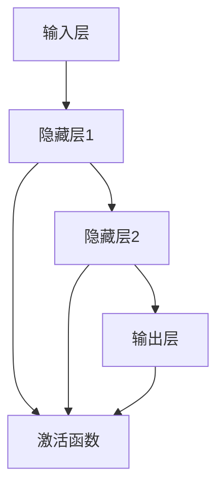
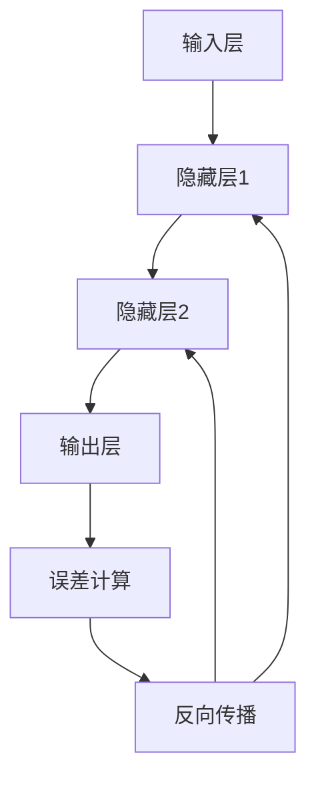
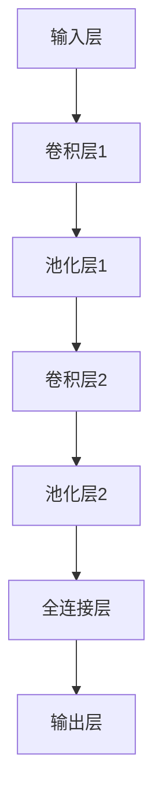
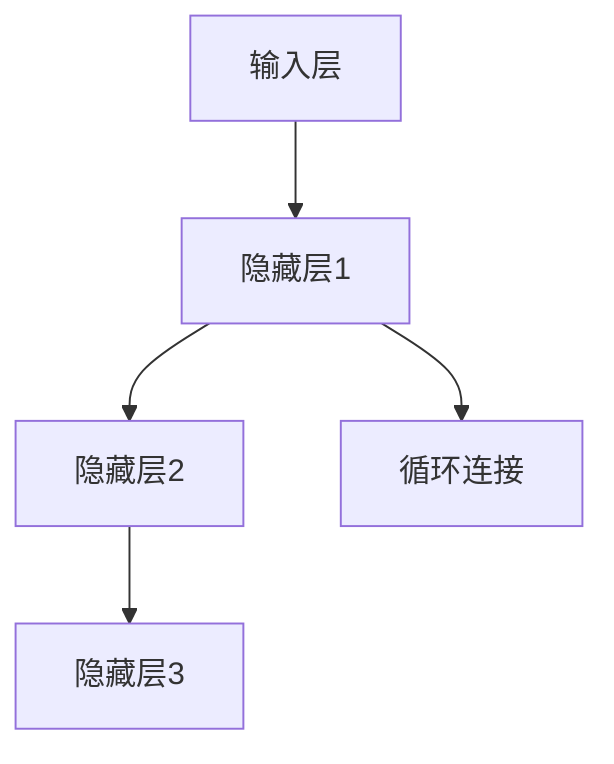
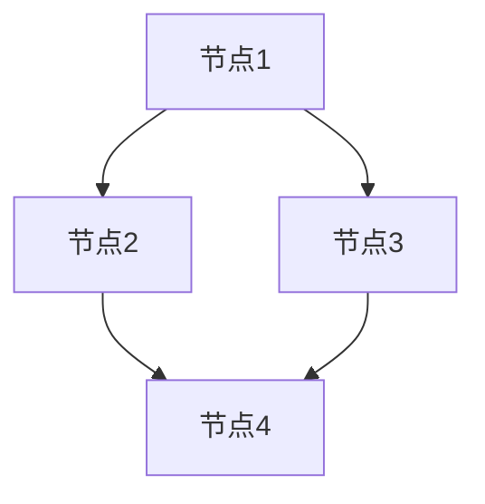
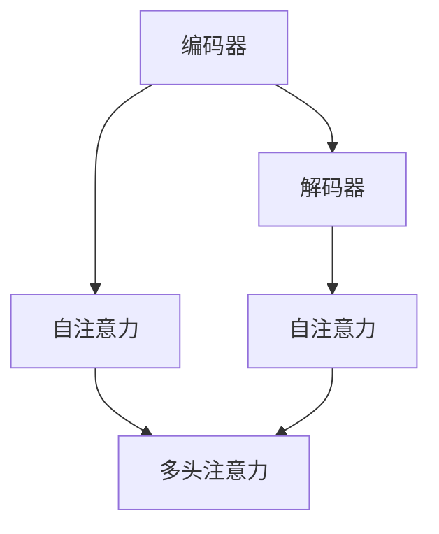
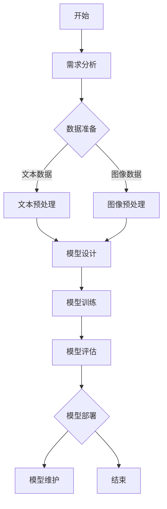

                 

# 软件 2.0 的伦理规范：人工智能的责任

> **关键词：** 软件 2.0、人工智能、伦理规范、社会责任、伦理挑战、算法公平性、透明性、可解释性。

> **摘要：** 本文探讨了软件 2.0 时代人工智能（AI）的伦理规范与社会责任。从软件 2.0 的定义和 AI 大模型的基础开始，分析了企业级 AI 应用开发的准备，探讨了 AI 在金融和医疗健康领域的应用，以及 AI 大模型开发实践。最后，本文重点讨论了 AI 的伦理问题，包括伦理原则、伦理规范制定和 AI 的社会责任。通过实例和代码分析，本文为读者提供了一个全面的指南，以了解和掌握 AI 领域的伦理规范和责任。

---

### 第一部分：软件 2.0 时代的 AI 大模型基础

#### 第 1 章：软件 2.0 与 AI 大模型概述

##### 1.1 软件 2.0 时代的到来

软件 2.0 时代标志着软件从传统的命令行模式向更加智能和互动的模式的转变。这一转变不仅体现在用户界面和用户体验的改进上，还体现在软件与用户互动和数据驱动的能力上。

**1.1.1 从软件 1.0 到软件 2.0 的演进**

- **概念解释：** 软件从 1.0 时代到 2.0 时代的演变，强调软件与用户互动和数据驱动的特点。
- **演进路径：** 从早期的单机软件到网络化软件，再到今天的云计算和大数据软件。
- **技术突破：** Web 2.0 技术的兴起，使软件变得更加用户中心，实现了数据的实时共享和协作。

**1.1.2 大模型在软件 2.0 中的核心地位**

- **核心地位：** AI 大模型在软件 2.0 中的关键作用，如自然语言处理、图像识别和智能推荐。
- **模型类型：** 如 GPT、BERT 等大模型的具体角色和应用。

**1.1.3 企业级应用开发的新范式**

- **新范式：** 软件开发的新模式，如 DevOps、微服务架构。
- **大模型集成：** 大模型如何融入企业级应用开发。

##### 1.2 AI 大模型技术基础

**2.1 深度学习与神经网络基础**

- **2.1.1 神经网络的基本结构**
  - **神经网络架构：** 层结构、节点、激活函数。
  - **学习过程：** 反向传播算法、梯度下降优化。
- **2.1.2 常见的深度学习架构**
  - **架构介绍：** 卷积神经网络（CNN）、循环神经网络（RNN）、图神经网络（GNN）。
  - **适用场景：** 各种深度学习架构的应用场景。
- **2.1.3 深度学习优化算法**
  - **优化算法：** 梯度下降、动量、RMSProp、Adam 等。
  - **算法选择：** 不同场景下的优化算法选择。

**2.2 自然语言处理技术概览**

- **2.2.1 词嵌入技术**
  - **词嵌入概念：** 从词向量到上下文嵌入。
  - **技术原理：** Word2Vec、GloVe、BERT 等。
- **2.2.2 序列模型与注意力机制**
  - **序列模型：** RNN、LSTM、GRU。
  - **注意力机制：** 自注意力、多头注意力。
- **2.2.3 转换器架构详解**
  - **转换器架构：** Transformer 模型结构。
  - **编码器与解码器：** 工作原理、参数共享。

**2.3 大规模预训练模型原理**

- **2.3.1 预训练的概念与意义**
  - **预训练：** 从无监督学习到有监督学习。
  - **意义：** 提高模型泛化能力、减少标注数据需求。
- **2.3.2 自监督学习方法**
  - **方法原理：** 语言建模、掩码语言模型（MLM）。
  - **技术细节：** 数据预处理、训练策略。
- **2.3.3 迁移学习与微调技术**
  - **迁移学习：** 预训练模型在新任务上的应用。
  - **微调：** 调整预训练模型以适应新任务。

#### 第 2 章：AI 大模型技术基础

##### 2.1 深度学习与神经网络基础

**2.1.1 神经网络的基本结构**

神经网络由一系列的层（Layer）组成，包括输入层、隐藏层和输出层。每层包含多个节点（Neuron），节点之间通过连接（Connection）相连。节点通过激活函数（Activation Function）进行非线性变换。

**神经网络架构：**



**学习过程：**

神经网络的学习过程包括前向传播（Forward Propagation）和反向传播（Back Propagation）。

- **前向传播：** 输入数据从输入层经过隐藏层传递到输出层，每一层的输出作为下一层的输入。
- **反向传播：** 计算输出层的误差，通过反向传递误差到隐藏层和输入层，并更新各层的权重（Weight）和偏置（Bias）。

**反向传播算法：**



**梯度下降优化：**

梯度下降是一种优化算法，用于更新神经网络的权重和偏置，以最小化损失函数。

$$
\theta^{(t+1)} = \theta^{(t)} - \alpha \nabla_{\theta} J(\theta)
$$

其中，$\theta$ 表示权重和偏置，$J(\theta)$ 表示损失函数，$\alpha$ 表示学习率。

**2.1.2 常见的深度学习架构**

**卷积神经网络（CNN）**

卷积神经网络是一种专门用于处理图像数据的深度学习架构。它通过卷积层（Convolutional Layer）提取图像特征，并使用池化层（Pooling Layer）进行特征降维。

**神经网络架构：**



**循环神经网络（RNN）**

循环神经网络是一种用于处理序列数据的深度学习架构。它通过隐藏状态（Hidden State）的循环连接，捕捉序列中的长期依赖关系。

**神经网络架构：**



**图神经网络（GNN）**

图神经网络是一种用于处理图结构数据的深度学习架构。它通过节点的邻接关系，提取图中的特征。

**神经网络架构：**



**2.1.3 深度学习优化算法**

**优化算法：** 深度学习中的优化算法用于更新神经网络的权重和偏置，以最小化损失函数。

- **梯度下降（Gradient Descent）：** 基础的优化算法，通过计算损失函数关于权重的梯度来更新权重。

$$
\theta^{(t+1)} = \theta^{(t)} - \alpha \nabla_{\theta} J(\theta)
$$

- **动量（Momentum）：** 增加梯度下降的稳定性，通过引入先前梯度的累积来更新权重。

$$
v^{(t)} = \beta v^{(t-1)} + (1 - \beta) \nabla_{\theta} J(\theta)
$$

$$
\theta^{(t+1)} = \theta^{(t)} - v^{(t)}
$$

- **RMSProp：** 基于梯度的均方根，动态调整学习率。

$$
v^{(t)} = \rho v^{(t-1)} + (1 - \rho) \nabla_{\theta}^2 J(\theta)
$$

$$
\theta^{(t+1)} = \theta^{(t)} - \alpha \frac{v^{(t)}}{\sqrt{1 - \rho^t}}
$$

- **Adam：** 结合了动量和 RMSProp 的优点，自适应调整学习率和惯性。

$$
m^{(t)} = \beta_1 m^{(t-1)} + (1 - \beta_1) \nabla_{\theta} J(\theta)
$$

$$
v^{(t)} = \beta_2 v^{(t-1)} + (1 - \beta_2) \nabla_{\theta}^2 J(\theta)
$$

$$
\theta^{(t+1)} = \theta^{(t)} - \alpha \frac{m^{(t)}}{1 - \beta_1^t} \cdot \frac{v^{(t)}}{1 - \beta_2^t}
$$

**算法选择：** 不同场景下的优化算法选择：

- **稳定性和收敛速度：** 梯度下降和动量适合简单模型和快速收敛的场景。
- **计算效率：** RMSProp 和 Adam 适合大规模模型和高计算成本的场景。
- **稀疏数据：** Adam 在处理稀疏数据时表现出较好的性能。

**2.2 自然语言处理技术概览**

**2.2.1 词嵌入技术**

词嵌入（Word Embedding）是一种将词语映射到高维向量空间的技术，用于表示词语的语义信息。

**词嵌入概念：** 从词向量到上下文嵌入。

**技术原理：** 

- **Word2Vec：** 使用神经网络训练词向量，通过预测词语出现的上下文。
- **GloVe：** 基于全局的词向量和词频信息，计算词向量。
- **BERT：** 使用双向 Transformer 模型进行预训练，生成上下文敏感的词向量。

**2.2.2 序列模型与注意力机制**

**序列模型：** RNN、LSTM、GRU。

- **RNN：** 通过隐藏状态循环连接，处理序列数据。
- **LSTM：** 引入门机制，解决 RNN 的梯度消失问题。
- **GRU：** 简化 LSTM 的结构，提高计算效率。

**注意力机制：** 自注意力、多头注意力。

- **自注意力：** 模型根据输入序列中的每个元素计算权重，并将权重应用于输入序列。
- **多头注意力：** 同时计算多个注意力权重，提高模型的泛化能力。

**2.2.3 转换器架构详解**

**转换器架构：** Transformer 模型结构。

- **编码器（Encoder）与解码器（Decoder）：** 编码器将输入序列编码为隐藏状态，解码器根据隐藏状态生成输出序列。

**神经网络架构：**



**工作原理：** 

- **自注意力：** 模型根据输入序列中的每个元素计算权重，并将权重应用于输入序列。
- **多头注意力：** 同时计算多个注意力权重，提高模型的泛化能力。

**参数共享：** 编码器和解码器的部分参数是共享的，以提高模型的效率。

**2.3 大规模预训练模型原理**

**2.3.1 预训练的概念与意义**

**预训练：** 从无监督学习到有监督学习。

**意义：** 

- **提高模型泛化能力：** 通过大规模的无监督数据预训练，模型可以更好地捕捉通用特征。
- **减少标注数据需求：** 预训练模型可以在少量有监督数据上进行微调，减少标注数据的工作量。

**2.3.2 自监督学习方法**

**方法原理：** 语言建模、掩码语言模型（MLM）。

**技术细节：** 

- **语言建模：** 预测输入序列的下一个词。
- **掩码语言模型（MLM）：** 随机掩码部分输入词，并预测掩码的词。

**2.3.3 迁移学习与微调技术**

**迁移学习：** 预训练模型在新任务上的应用。

**微调：** 调整预训练模型以适应新任务。

**2.3.4 大规模预训练模型的挑战与解决方案**

**挑战：**

- **数据隐私：** 预训练模型需要大量数据，涉及数据隐私问题。
- **计算资源：** 预训练模型需要大量计算资源，涉及计算资源分配问题。
- **模型解释性：** 预训练模型通常缺乏解释性，涉及模型解释性问题。

**解决方案：**

- **联邦学习：** 在数据隐私保护下，分布式训练预训练模型。
- **混合训练：** 结合有监督学习和无监督学习，提高模型性能和效率。
- **模型解释性：** 开发可解释的预训练模型，提高模型透明性和可解释性。

#### 第 3 章：企业 AI 战略规划

##### 3.1 AI 在企业中的价值评估

AI 在企业中的应用可以带来显著的效益，包括提高生产效率、降低运营成本、优化决策过程等。对 AI 在企业中的价值进行评估是制定企业级 AI 战略的重要步骤。

**价值评估框架：**

- **ROI（投资回报率）：** 通过计算 AI 应用带来的经济效益，评估其投资回报率。
- **业务流程变革：** 分析 AI 应用对企业业务流程的优化程度，评估其对企业整体运营效率的影响。

##### 3.2 AI 技术在企业中的应用场景

AI 技术在企业中的应用场景非常广泛，以下是一些典型的应用场景：

- **智能客服：** 利用自然语言处理技术，自动处理客户咨询和投诉，提高客户服务体验。
- **供应链管理：** 通过预测分析技术，优化供应链库存管理，减少库存成本。
- **风险管理：** 利用机器学习技术，预测金融风险，提高风险管理能力。
- **智能推荐系统：** 利用协同过滤和深度学习技术，为用户推荐个性化产品和服务。

##### 3.3 企业级 AI 项目开发流程

企业级 AI 项目的开发需要遵循科学的流程，确保项目的高效实施和成功落地。

**开发流程：**

- **需求分析：** 明确 AI 项目的目标和需求，分析业务场景和痛点。
- **数据准备：** 收集、清洗和预处理数据，为模型训练提供高质量的数据。
- **模型设计：** 设计合适的模型架构，选择适合的算法和优化策略。
- **模型训练：** 使用训练数据对模型进行训练，调整模型参数，优化模型性能。
- **模型评估：** 对训练好的模型进行评估，验证模型的效果和稳定性。
- **模型部署：** 将模型部署到生产环境，实现 AI 功能的实际应用。
- **模型维护：** 定期对模型进行监控和更新，确保模型的性能和稳定性。

##### 3.4 企业级 AI 项目实施策略

成功实施企业级 AI 项目需要综合考虑技术、管理和组织等多个方面。

**实施策略：**

- **项目团队建设：** 建立专业的 AI 项目团队，确保项目的技术实力和执行力。
- **项目管理：** 采用敏捷开发方法，灵活应对项目中的变化和挑战。
- **数据治理：** 制定数据治理策略，确保数据的准确性、完整性和安全性。
- **风险管理：** 制定风险管理计划，应对项目中的潜在风险和不确定性。
- **持续学习：** 鼓励团队成员持续学习和提升专业技能，保持项目的创新性和竞争力。

### 第二部分：AI 大模型在特定领域的应用

#### 第 4 章：AI 大模型在金融领域的应用

##### 4.1 金融行业面临的挑战

金融行业是一个高度数据密集型行业，随着大数据和人工智能技术的发展，金融行业面临着以下挑战：

- **数据隐私：** 金融数据涉及到客户的敏感信息，如何确保数据隐私和安全成为一大挑战。
- **合规性：** 金融行业受到严格的监管，如何确保 AI 模型的合规性是一个重要问题。
- **模型解释性：** 金融决策往往需要透明和可解释性，如何提高 AI 模型的解释性是一个挑战。

##### 4.2 AI 大模型在金融风险管理中的应用

AI 大模型在金融风险管理中发挥着重要作用，以下是一些关键应用：

- **风险预测：** 通过对历史数据进行分析，AI 大模型可以预测金融市场波动和信用风险。
- **信用评分：** AI 大模型可以分析借款人的信用历史和行为数据，为其提供更准确的信用评分。
- **反欺诈：** AI 大模型可以识别和预测金融交易中的欺诈行为，提高反欺诈能力。

##### 4.3 AI 大模型在金融客服中的应用

AI 大模型在金融客服中的应用可以有效提高客户服务效率和用户体验：

- **智能客服：** 利用自然语言处理技术，AI 大模型可以自动处理客户咨询和投诉，提高响应速度和满意度。
- **自动化交易：** AI 大模型可以分析市场数据，自动化交易决策，提高交易效率和收益。

##### 4.4 AI 大模型在金融风控中的案例研究

以下是一个金融风控领域的 AI 大模型应用案例：

**案例背景：** 一家大型银行希望提高贷款审批的效率和准确性，决定引入 AI 大模型进行信用评分。

**解决方案：**

1. **数据收集：** 收集借款人的个人信息、信用记录、财务状况等数据。
2. **数据预处理：** 清洗和预处理数据，去除噪声和异常值。
3. **模型训练：** 使用训练数据对 AI 大模型进行训练，调整模型参数，优化模型性能。
4. **模型评估：** 对训练好的模型进行评估，验证模型的效果和稳定性。
5. **模型部署：** 将模型部署到生产环境，实现贷款审批的自动化。

**效果评估：**

- **审批效率提高：** AI 大模型可以快速处理大量贷款申请，提高了审批速度。
- **准确性提高：** AI 大模型基于历史数据和借款人的行为数据，提供了更准确的信用评分，降低了贷款违约率。
- **用户体验提升：** 客户可以快速获得贷款审批结果，提高了客户满意度。

#### 第 5 章：AI 大模型在医疗健康领域的应用

##### 5.1 医疗行业面临的挑战

医疗行业是一个高度专业化和数据密集型的行业，随着大数据和人工智能技术的发展，医疗行业面临着以下挑战：

- **数据隐私：** 医疗数据涉及到患者的隐私信息，如何确保数据隐私和安全成为一大挑战。
- **数据质量：** 医疗数据的多样性和准确性对 AI 模型的训练和预测效果具有重要影响。
- **临床决策支持：** 如何利用 AI 模型为医生提供准确、及时的诊断和治疗建议是一个挑战。

##### 5.2 AI 大模型在疾病预测中的应用

AI 大模型在疾病预测中发挥着重要作用，以下是一些关键应用：

- **早期检测：** 通过分析患者的健康数据，AI 大模型可以预测某些疾病的发病风险，实现早期检测和干预。
- **个性化治疗：** AI 大模型可以根据患者的病情、病史和基因信息，提供个性化的治疗方案。

##### 5.3 AI 大模型在健康监测中的应用

AI 大模型在健康监测中的应用可以实时分析患者的健康数据，以下是一些关键应用：

- **健康数据分析：** AI 大模型可以分析患者的健康数据，如心率、血压、血糖等，提供健康评估和风险预测。
- **智能辅助诊断：** AI 大模型可以帮助医生分析影像数据，如 X 光、CT 等，提高诊断准确性和效率。

##### 5.4 AI 大模型在医疗健康领域的案例研究

以下是一个医疗健康领域的 AI 大模型应用案例：

**案例背景：** 一家医疗机构希望提高肺癌早期检测的准确性和效率，决定引入 AI 大模型进行辅助诊断。

**解决方案：**

1. **数据收集：** 收集肺癌患者的影像数据、临床表现等数据。
2. **数据预处理：** 清洗和预处理数据，去除噪声和异常值。
3. **模型训练：** 使用训练数据对 AI 大模型进行训练，调整模型参数，优化模型性能。
4. **模型评估：** 对训练好的模型进行评估，验证模型的效果和稳定性。
5. **模型部署：** 将模型部署到生产环境，实现肺癌早期检测的辅助诊断。

**效果评估：**

- **检测准确性提高：** AI 大模型可以准确识别肺癌影像，提高了早期检测的准确性。
- **检测效率提高：** AI 大模型可以快速处理大量影像数据，提高了检测效率。
- **临床决策支持：** AI 大模型为医生提供了准确的诊断建议，提高了诊断和治疗的效率。

### 第三部分：AI 大模型开发实践

#### 第 6 章：AI 大模型开发实战

##### 6.1 开发环境搭建

在进行 AI 大模型开发前，需要搭建一个合适的环境，包括硬件、软件和编程环境。

**硬件配置：** 
- **GPU：** AI 大模型训练通常需要强大的计算能力，GPU 是训练的关键组件。
- **CPU：** 高性能 CPU 可以提高数据预处理和模型优化的速度。
- **存储：** 大规模训练数据需要大量的存储空间。

**软件配置：**
- **操作系统：** 通常选择 Linux 系统，因为其稳定性和性能较好。
- **深度学习框架：** 如 TensorFlow、PyTorch 等，用于构建和训练 AI 大模型。
- **编程环境：** Python 是深度学习开发的主要语言，需要安装相关的 Python 库。

**编程环境搭建步骤：**

1. 安装操作系统（如 Ubuntu）。
2. 安装深度学习框架（如 PyTorch 或 TensorFlow）。
3. 配置 Python 编程环境，安装必要的 Python 库。

##### 6.2 大模型开发流程

AI 大模型开发流程通常包括以下几个步骤：

1. **需求分析：** 明确 AI 大模型的应用场景和需求，定义模型的输入和输出。
2. **数据收集：** 收集相关的训练数据，包括文本、图像、声音等。
3. **数据预处理：** 清洗和预处理数据，包括数据清洗、数据归一化、数据增强等。
4. **模型设计：** 设计合适的模型架构，选择适合的神经网络结构。
5. **模型训练：** 使用训练数据对模型进行训练，调整模型参数。
6. **模型评估：** 对训练好的模型进行评估，验证模型的效果和稳定性。
7. **模型部署：** 将模型部署到生产环境，实现模型的应用。

**模型训练流程：**

1. **数据加载：** 使用 DataLoader 加载训练数据和验证数据。
2. **模型初始化：** 初始化模型参数，设置优化器和损失函数。
3. **前向传播：** 计算输入数据的模型输出。
4. **损失计算：** 计算模型输出和真实标签之间的损失。
5. **反向传播：** 更新模型参数，优化模型性能。
6. **模型评估：** 在验证数据上评估模型性能，调整模型参数。

##### 6.3 模型训练与优化

**模型训练：** 模型训练是 AI 大模型开发的核心步骤，以下是一些关键点：

- **批次大小（Batch Size）：** 批次大小决定了每次训练的样本数量，选择合适的批次大小可以提高训练效果。
- **学习率（Learning Rate）：** 学习率决定了模型参数更新的步长，选择合适的学习率可以加快模型收敛速度。
- **训练轮数（Epochs）：** 训练轮数决定了模型在训练数据上的训练次数，过多的训练轮数可能导致过拟合。

**模型优化：** 模型优化包括以下几种方法：

- **数据增强（Data Augmentation）：** 通过对原始数据进行变换，如旋转、缩放、裁剪等，增加数据的多样性，提高模型泛化能力。
- **正则化（Regularization）：** 通过在损失函数中添加正则项，如 L1 正则化、L2 正则化，防止模型过拟合。
- **迁移学习（Transfer Learning）：** 使用预训练模型在新任务上进行微调，利用预训练模型的知识，提高模型性能。

##### 6.4 模型部署与维护

**模型部署：** 模型部署是将训练好的模型应用到实际场景中的过程，以下是一些关键点：

- **模型转换：** 将训练好的模型转换为部署环境支持的格式，如 TensorFlow Lite、ONNX 等。
- **部署策略：** 根据应用场景选择合适的部署策略，如在线部署、离线部署、边缘部署等。
- **性能优化：** 对部署后的模型进行性能优化，提高模型运行效率和响应速度。

**模型维护：** 模型维护是确保模型长期稳定运行的重要环节，以下是一些关键点：

- **模型监控：** 对模型运行状态进行监控，及时发现和解决潜在问题。
- **模型更新：** 定期更新模型，以适应新的数据和场景。
- **安全防护：** 对模型进行安全防护，防止模型被恶意攻击或篡改。

### 第四部分：AI 伦理与责任

#### 第 7 章：AI 大模型的伦理问题

##### 7.1 AI 伦理概述

AI 伦理是指围绕人工智能技术的道德和伦理问题，涉及 AI 的发展、应用和影响。以下是一些核心的 AI 伦理原则：

- **公平性（Fairness）：** AI 系统应该公平地对待所有人，避免歧视和偏见。
- **透明性（Transparency）：** AI 系统的决策过程应该透明，使人们能够理解和信任 AI 系统。
- **可解释性（Interpretability）：** AI 系统的决策应该具有可解释性，使人们能够理解决策的原因和依据。
- **责任归属（Accountability）：** 应明确 AI 系统的责任归属，确保在出现问题时能够追究责任。

##### 7.2 AI 大模型的伦理规范

为了确保 AI 大模型的伦理性和社会责任，需要制定相应的伦理规范。以下是一些关键的伦理规范：

- **数据隐私保护：** 严格保护用户数据隐私，确保数据不被滥用。
- **算法公平性：** 检查和消除算法中的偏见和歧视。
- **透明性要求：** 确保 AI 大模型的决策过程透明，使人们能够理解和监督。
- **可解释性提升：** 开发可解释的 AI 大模型，提高模型的可理解性。

##### 7.3 AI 大模型的社会责任

AI 大模型的社会责任是指企业在开发和使用 AI 大模型时，应承担的社会责任。以下是一些关键的社会责任：

- **可持续发展：** 在 AI 大模型开发和应用中，考虑环境保护和资源利用问题。
- **社会责任报告：** 定期发布社会责任报告，向公众和社会展示企业的社会责任履行情况。
- **合作与共享：** 促进 AI 知识和技术的共享，帮助解决社会问题。

##### 7.4 成功的 AI 伦理实践案例

以下是一些成功的 AI 伦理实践案例：

- **Google AI 实践：** Google AI 实践了“AI 原则”，包括公平性、透明性和责任归属等。
- **IBM AI 研究院：** IBM AI 研究院致力于推动 AI 的伦理研究和应用，开发了可解释的 AI 技术。
- **OpenAI：** OpenAI 致力于推动 AI 的可持续发展和社会责任，发布了“AI 安全倡议”。

### 附录

#### 附录 A：AI 大模型开发工具与资源

- **A.1 主流深度学习框架对比**

以下是几种主流深度学习框架的对比：

| 框架          | 特点                                                         | 适用场景                         |
| ------------- | ------------------------------------------------------------ | -------------------------------- |
| TensorFlow    | 开放源码，支持多种编程语言，强大的生态系统                   | 复杂模型、大规模数据处理           |
| PyTorch       | 动态计算图，易于调试，与 Python 深度集成                   | 研发实验、快速原型开发             |
| Keras         | 高级 API，易于使用，基于 TensorFlow 或 Theano 后端           | 快速构建和训练模型               |
| MXNet         | 开源分布式深度学习框架，支持多种编程语言                   | 高性能、分布式训练               |
| JAX           | 自动微分库，支持 Python，可用于加速深度学习模型训练           | 自动微分、优化算法研究           |

- **A.2 AI 大模型开源项目推荐**

以下是一些优秀的 AI 大模型开源项目：

| 项目名         | 描述                                                         |
| -------------- | ------------------------------------------------------------ |
| GPT-3          | OpenAI 开发的大型语言模型，具有极高的文本生成能力           |
| BERT           | Google 开发的预训练语言模型，广泛应用于文本分类、问答等任务 |
| T5            | Google 开发的多任务模型，具有强大的文本处理能力           |
| GPT-Neo        | PyTorch 实现的 GPT 模型，支持多种变体和配置选项           |

- **A.3 AI 大模型学习资源**

以下是一些推荐的 AI 大模型学习资源：

| 资源名         | 描述                                                         |
| -------------- | ------------------------------------------------------------ |
| 《深度学习》   | Goodfellow、Bengio 和 Courville 著，深度学习领域的经典教材 |
| 《动手学深度学习》 | 每一章都配有代码实现，适合初学者入门深度学习                 |
| Coursera 上的深度学习课程 | Andrew Ng 教授的深度学习课程，涵盖了深度学习的理论基础和实际应用 |
| Hugging Face 官方文档 | Hugging Face 提供的官方文档，涵盖了许多深度学习模型的实现和使用方法 |

### 附录 B：Mermaid 流程图

以下是一个使用 Mermaid 语言绘制的流程图示例：



### 附录 C：深度学习算法伪代码

以下是一个深度学习算法的伪代码示例：

```python
# 数据预处理
def preprocess_data(data):
    # 数据清洗、归一化、增强等
    return processed_data

# 模型训练
def train_model(data, labels):
    # 初始化模型
    model = initialize_model()
    
    for epoch in range(num_epochs):
        # 前向传播
        outputs = model.forward(preprocess_data(data))
        
        # 计算损失
        loss = compute_loss(outputs, labels)
        
        # 反向传播
        grads = model.backward(loss)
        
        # 更新模型参数
        update_model_params(grads)
        
    return model

# 前向传播
def forward_pass(model, data):
    return model.forward(preprocess_data(data))

# 反向传播
def backward_pass(model, loss):
    return model.backward(loss)
```

### 附录 D：数学模型与公式

以下是一些常用的数学模型和公式：

$$
\text{损失函数} = \frac{1}{2} \sum_{i=1}^{n} (\hat{y_i} - y_i)^2
$$

$$
\text{梯度下降} = \theta^{(t+1)} = \theta^{(t)} - \alpha \nabla_{\theta} J(\theta)
$$

### 附录 E：代码解读与分析

以下是一个使用 PyTorch 构建简单神经网络并训练的代码示例：

```python
import torch
import torch.nn as nn
import torch.optim as optim

# 网络结构
class NeuralNetwork(nn.Module):
    def __init__(self):
        super(NeuralNetwork, self).__init__()
        self.layer1 = nn.Linear(in_features=784, out_features=128)
        self.relu = nn.ReLU()
        self.layer2 = nn.Linear(in_features=128, out_features=10)

    def forward(self, x):
        x = self.layer1(x)
        x = self.relu(x)
        x = self.layer2(x)
        return x

# 模型实例化、优化器、损失函数
model = NeuralNetwork()
optimizer = optim.Adam(model.parameters(), lr=0.001)
criterion = nn.CrossEntropyLoss()

# 训练循环
for epoch in range(100):
    for inputs, labels in train_loader:
        optimizer.zero_grad()
        outputs = model(inputs)
        loss = criterion(outputs, labels)
        loss.backward()
        optimizer.step()
    print(f'Epoch [{epoch+1}/{100}], Loss: {loss.item():.4f}')
```

### 作者信息

**作者：** AI 天才研究院/AI Genius Institute & 禅与计算机程序设计艺术/Zen And The Art of Computer Programming

---

本篇文章系统地介绍了软件 2.0 时代的 AI 大模型基础，从软件 2.0 的定义和 AI 大模型的核心地位出发，深入探讨了深度学习与神经网络基础、自然语言处理技术、大规模预训练模型原理，以及企业级 AI 应用开发的准备。接着，文章详细介绍了 AI 大模型在金融和医疗健康领域的应用，并通过实际案例展示了 AI 大模型在金融风控和医疗健康辅助诊断中的效果。此外，文章还讨论了 AI 大模型的开发实践，包括开发环境搭建、模型训练与优化、模型部署与维护等。最后，文章重点探讨了 AI 的伦理问题，提出了 AI 大模型的伦理规范和社会责任。通过本文的阐述，读者可以全面了解 AI 大模型的技术原理、应用场景和伦理规范，为实际项目开发提供参考和指导。希望本文能为 AI 领域的研究者和从业者提供有价值的见解和启发。

