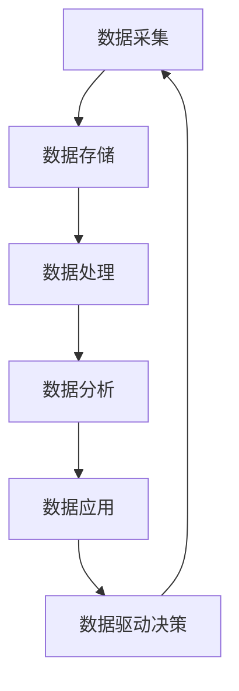
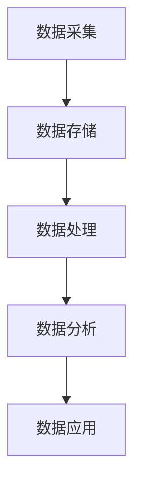

                 

### 引言

在信息技术飞速发展的今天，软件已经成为推动社会进步和经济发展的关键力量。然而，随着大数据、人工智能和云计算等技术的崛起，软件行业正经历着一场深刻的变革，这就是所谓的“软件2.0时代”。与传统的软件1.0时代相比，软件2.0时代以数据驱动为核心，数据不仅被视作软件的燃料，更是软件创新和商业价值的源泉。

本文旨在深入探讨软件2.0时代的本质、核心特点、应用场景及其带来的挑战和机遇。我们首先将回顾软件从1.0到2.0的演变历程，理解数据驱动在其中的重要性。接着，我们将探讨数据驱动的核心概念、技术基础和应用场景。随后，文章将详细讨论数据隐私和安全、数据伦理问题，并对软件2.0的未来趋势进行展望。最后，我们将总结全文，提出软件与数据驱动的融合方向，以及对未来发展的建议。

通过这一系列的讨论，我们希望能够为读者提供一个全面、系统的视角，理解软件2.0时代的内涵，把握数据驱动所带来的巨大机遇和挑战。

### 关键词

软件2.0、数据驱动、大数据、人工智能、云计算、数据处理、数据存储、数据隐私、数据安全、数据伦理。

### 摘要

本文深入探讨了软件2.0时代的特点和数据驱动的核心作用。从软件从1.0到2.0的演变历程，到数据驱动的流程和技术基础，再到数据驱动的应用场景，本文提供了一个全面的分析框架。文章重点讨论了数据隐私和安全、数据伦理问题，并对软件2.0的未来趋势进行了展望。通过本文，读者可以深刻理解软件2.0时代的数据驱动本质，把握数据驱动所带来的机遇和挑战。

### 目录

#### 第一部分 软件进化论

1. **第1章 软件1.0到软件2.0的演进**
   - **1.1 软件1.0：传统的应用时代**
   - **1.2 数据驱动的本质**
   - **1.3 软件2.0时代的应用场景**

2. **第2章 数据驱动的核心技术与算法**
   - **2.1 数据处理与存储**
   - **2.2 数据流处理**
   - **2.3 数据挖掘与机器学习**

3. **第3章 数据驱动的应用实践**
   - **3.1 智能推荐系统**
   - **3.2 智能数据分析**
   - **3.3 智能语音交互**

#### 第二部分 数据驱动的核心技术与算法

4. **第4章 数据处理与存储**
   - **4.1 数据清洗与预处理**
   - **4.2 数据存储与管理**
   - **4.3 数据流处理框架**

5. **第5章 数据挖掘与机器学习**
   - **5.1 数据挖掘基础**
   - **5.2 机器学习算法**
   - **5.3 深度学习在数据驱动中的应用**

6. **第6章 数据可视化与决策支持**
   - **6.1 数据可视化技术**
   - **6.2 决策支持系统**
   - **6.3 数据可视化案例分析**

#### 第三部分 数据驱动的应用实践

7. **第7章 数据驱动在商业中的应用**
   - **7.1 营销策略**
   - **7.2 客户关系管理**
   - **7.3 产品开发**

8. **第8章 数据驱动在工业中的应用**
   - **8.1 生产优化**
   - **8.2 供应链管理**
   - **8.3 设备维护**

9. **第9章 数据驱动在金融中的应用**
   - **9.1 风险管理**
   - **9.2 信用评估**
   - **9.3 投资决策**

10. **第10章 数据驱动在医疗健康中的应用**
    - **10.1 疾病预测**
    - **10.2 个性化治疗**
    - **10.3 健康监测**

#### 第四部分 数据驱动的挑战与未来

11. **第11章 数据隐私与安全**
    - **11.1 数据隐私保护的重要性**
    - **11.2 数据隐私保护的方法**
    - **11.3 数据安全策略**

12. **第12章 数据驱动的伦理问题**
    - **12.1 数据歧视与公平性**
    - **12.2 数据驱动的责任归属**
    - **12.3 数据伦理的监管与规范**

13. **第13章 数据驱动的未来发展趋势**
    - **13.1 跨界融合与创新**
    - **13.2 人工智能与数据驱动**
    - **13.3 数据驱动在社会治理中的应用**

14. **第14章 总结与展望**
    - **14.1 软件与数据驱动的融合**
    - **14.2 数据驱动的机遇与挑战**
    - **14.3 探索数据驱动的未来**

### 第一部分 软件进化论

#### 第1章 软件1.0到软件2.0的演进

软件的发展历程可以分为多个阶段，从最初的软件1.0时代，到如今我们所处的软件2.0时代。每个阶段都有其独特的特点和核心技术，而这些技术的演进也推动了整个软件行业的不断进步。

##### 1.1 软件1.0：传统的应用时代

软件1.0时代主要是指计算机软件的早期阶段，这个时期的软件以单一的功能为主，注重代码的效率和功能的实现。软件的主要形式是命令行界面或简单的图形用户界面（GUI）。在这个阶段，软件的核心技术主要集中在操作系统、编译器、数据库和编程语言等方面。

- **操作系统**：操作系统如Unix、DOS等，为软件的运行提供了基础环境。
- **编译器**：编译器将高级编程语言转换为机器码，使得开发者可以更高效地编写代码。
- **数据库**：关系型数据库如SQL Server、Oracle等，为数据的存储和管理提供了可靠的方法。
- **编程语言**：编程语言如C、Pascal、Java等，使得开发者可以更方便地编写应用程序。

在这个阶段，软件的主要目标是实现特定的功能，如办公自动化、数据处理等。软件的复杂度相对较低，开发周期较长，但功能相对单一且稳定。

##### 1.2 数据驱动的本质

随着互联网的普及和大数据时代的到来，软件1.0时代开始显得力不从心。数据开始成为企业和社会的重要资产，而不仅仅是存储和处理的工具。这个时期，软件的发展进入了一个新的阶段，即软件2.0时代。

数据驱动的本质在于，软件不再仅仅是功能的实现，而是通过对海量数据的分析和处理，来提供更加智能化、个性化的服务。数据驱动软件的核心思想是将数据作为生产要素，通过数据采集、处理、分析和应用，来提升软件的效能和用户体验。

- **数据采集**：通过各种传感器、用户行为、日志等渠道，获取海量数据。
- **数据处理**：对采集到的数据进行清洗、整合、转换等预处理操作。
- **数据分析**：使用统计学、机器学习等技术，从数据中提取有价值的信息。
- **数据应用**：将分析结果应用于实际业务中，如个性化推荐、智能决策等。

##### 1.3 软件2.0的核心特点

软件2.0时代具有以下几个核心特点：

- **智能化**：软件能够自动进行决策和优化，提高生产效率。
- **个性化**：软件能够根据用户的行为和偏好，提供个性化的服务。
- **实时性**：软件能够实时处理和分析数据，提供即时的反馈和决策。
- **协同性**：软件能够实现跨平台、跨系统的协同工作。
- **可扩展性**：软件能够方便地扩展功能，适应不断变化的需求。

##### 1.4 软件2.0时代的应用场景

软件2.0时代的应用场景非常广泛，涵盖了各个行业和领域。以下是一些典型的应用场景：

- **智能推荐系统**：通过分析用户的行为和偏好，为用户推荐个性化内容，如电商平台的商品推荐、社交媒体的推荐新闻等。
- **智能语音助手**：如苹果的Siri、亚马逊的Alexa等，能够通过语音交互提供各种服务，如查询天气、播放音乐、设置提醒等。
- **智能数据分析**：通过大数据分析和机器学习技术，帮助企业实现智能决策，如金融风险控制、市场营销优化等。
- **智能交通系统**：通过实时数据分析和预测，优化交通流量，减少拥堵，提高道路通行效率。

综上所述，软件2.0时代是一个以数据驱动为核心的新时代。数据不仅是软件的重要组成部分，更是软件创新和商业价值的源泉。软件2.0时代的到来，将推动软件行业迈向一个更加智能化、个性化、实时化和协同化的新阶段。

### 软件从1.0到2.0的演变

软件从1.0到2.0的演变是信息技术发展的必然结果，这一过程不仅是技术层面的进步，更是理念和模式上的转变。要深入理解这一演变，我们需要从多个角度进行分析。

#### 2.1 软件进化论

软件的进化可以分为几个主要阶段，每个阶段都有其独特的特点和关键技术。

- **软件1.0时代**：这是软件的初级阶段，主要以单机应用为主，如办公软件、游戏等。这一时期的软件注重功能的实现和代码的效率。

- **软件2.0时代**：随着互联网的普及，软件开始向网络化、智能化方向发展。数据成为软件的核心资产，软件的功能不仅限于执行特定的任务，而是通过数据分析、挖掘和机器学习等技术，实现智能化和个性化。

- **软件3.0时代**：软件将进一步融合人工智能、区块链等前沿技术，实现更高层次的智能化和自动化。软件将不仅仅是工具，而是成为智能系统的核心组成部分。

#### 2.2 软件1.0时代的特征

软件1.0时代的主要特征包括：

- **功能导向**：软件的主要目标是实现特定的功能，如文字处理、表格计算等。

- **独立运行**：软件通常在本地计算机上独立运行，不依赖于网络环境。

- **开发成本高**：由于技术的限制，软件的开发和部署成本较高。

- **更新周期长**：软件的更新和升级通常需要较长的时间，且更新内容以功能扩展为主。

#### 2.3 软件2.0时代的特征

软件2.0时代的特征则更加多样和复杂：

- **数据驱动**：软件的核心是数据，通过对数据的采集、处理和分析，实现智能化和个性化。

- **网络化**：软件通过互联网实现跨平台、跨系统的协同工作，提供更加便捷和高效的服务。

- **实时性**：软件能够实时处理和分析数据，提供即时的反馈和决策支持。

- **开放性**：软件采用开放架构，方便与其他系统和应用进行集成和交互。

- **可扩展性**：软件能够方便地扩展功能，适应不断变化的需求。

#### 2.4 软件从1.0到2.0的演变

软件从1.0到2.0的演变是一个渐进的过程，主要体现在以下几个方面：

- **技术进步**：随着云计算、大数据、人工智能等技术的发展，软件的技术基础得到了显著提升。

- **理念转变**：从功能导向到数据驱动，软件的开发和运营理念发生了根本性的变化。

- **商业模式创新**：数据驱动的软件模式带来了新的商业模式，如SaaS、按需付费等。

- **用户体验优化**：软件通过个性化推荐、实时交互等技术，大大提升了用户体验。

#### 2.5 软件2.0的核心特点

软件2.0的核心特点可以概括为以下几点：

- **智能化**：软件能够通过数据分析和机器学习，实现自动化的决策和优化。

- **个性化**：软件能够根据用户的行为和偏好，提供个性化的服务。

- **实时性**：软件能够实时处理和分析数据，提供即时的反馈和决策支持。

- **协同性**：软件能够实现跨平台、跨系统的协同工作。

- **可扩展性**：软件能够方便地扩展功能，适应不断变化的需求。

通过以上分析，我们可以看到，软件从1.0到2.0的演变是一个复杂而深远的进程，不仅涉及到技术的进步，还包括理念、商业模式和用户体验的变革。这一演变过程将不断推动软件行业向前发展，为各行各业带来更多的创新和机遇。

#### 1.1 软件1.0：传统的应用时代

在软件1.0时代，计算机软件主要集中在单机应用和功能驱动上。这一时期的软件设计以实现特定功能为核心，注重代码的效率和功能的实现。典型的软件包括办公自动化软件（如Word、Excel）、财务软件（如QuickBooks）、企业管理软件（如SAP）等。

软件1.0时代的软件特点主要体现在以下几个方面：

1. **功能单一**：软件的主要目的是提供特定的功能，如文字处理、数据计算、财务管理等。每个软件都有其特定的用途，功能相对独立，互不干扰。

2. **独立运行**：软件通常在本地计算机上独立运行，不需要联网，也不依赖于其他系统。用户可以通过安装到本地计算机上的软件来完成任务。

3. **开发周期长**：由于技术和工具的限制，软件的开发周期较长。开发团队需要从需求分析、设计、编码、测试到部署的各个环节都进行细致的工作。

4. **更新频率低**：软件的更新和升级通常以功能扩展为主，更新的频率相对较低。每次更新都需要对整个软件进行重新编译和部署。

5. **用户界面简单**：用户界面以文本和图形用户界面（GUI）为主，功能相对简单，用户操作也较为直接。

在这一时期，软件的主要驱动力是解决具体的问题和提升工作效率。软件的开发和运营主要依赖于开发者个人的技能和经验，缺乏系统化和标准化的流程。

#### 1.2 软件定义与分类

在软件1.0时代，软件的定义和分类相对简单，主要基于其功能和应用场景。以下是一些常见的软件分类：

1. **系统软件**：系统软件是管理和控制计算机硬件资源的基础软件，如操作系统、数据库管理系统等。

   - **操作系统**：操作系统如Unix、Windows、Linux等，提供计算机的基本操作环境，管理硬件资源，为应用程序提供服务。
   - **数据库管理系统**：数据库管理系统如SQL Server、Oracle、MySQL等，提供数据存储、检索和管理功能。

2. **应用软件**：应用软件是专门为特定用户或行业设计的软件，用于解决具体问题或提高工作效率。

   - **办公软件**：办公软件如Microsoft Office、LibreOffice等，提供文字处理、表格计算、演示等功能。
   - **财务软件**：财务软件如QuickBooks、SAP等，提供财务管理、会计处理等功能。
   - **企业管理软件**：企业管理软件如SAP、Oracle等，提供企业资源计划（ERP）功能，帮助企业优化管理流程。

3. **工具软件**：工具软件是辅助其他软件完成特定任务的小型软件，如文本编辑器、压缩工具、下载工具等。

   - **文本编辑器**：文本编辑器如Notepad++、Sublime Text等，提供文本编辑功能。
   - **压缩工具**：压缩工具如WinRAR、7-Zip等，提供文件压缩和解压功能。

4. **嵌入式软件**：嵌入式软件是嵌入到硬件设备中的软件，用于控制设备的操作和行为。

   - **嵌入式操作系统**：嵌入式操作系统如Android、iOS等，为智能手机、平板电脑等设备提供操作环境。
   - **驱动程序**：驱动程序用于控制硬件设备，如显卡驱动、网络驱动等。

软件1.0时代的软件分类相对简单，但随着技术的发展和应用的多样化，软件的定义和分类也在不断演进。

#### 1.3 软件从1.0到2.0的演变

软件从1.0到2.0的演变是一个从功能驱动到数据驱动的转变过程。这一演变不仅改变了软件的开发和运营模式，也深刻影响了软件的定义和分类。以下从几个方面分析软件从1.0到2.0的演变：

1. **开发模式**：在软件1.0时代，软件的开发主要依赖于开发者个人的技能和经验，开发过程相对封闭，缺乏系统化和标准化的流程。而软件2.0时代，随着敏捷开发、DevOps等理念的兴起，开发过程变得更加开放和协作，开发周期大大缩短，软件迭代更加频繁。

2. **数据驱动**：软件1.0时代，软件的功能和性能是开发的核心目标。而软件2.0时代，数据成为软件的核心资产，通过对海量数据的采集、存储、分析和应用，软件能够实现智能化和个性化。数据驱动的理念不仅改变了软件的开发模式，也推动了软件架构的变革。

3. **用户中心**：在软件1.0时代，软件的用户体验主要集中在功能的使用上。而软件2.0时代，用户的数据和行为被大量收集和分析，软件能够根据用户的偏好和需求提供个性化的服务。用户体验从功能驱动转向数据驱动，软件更加注重用户的需求和满意度。

4. **应用场景**：软件1.0时代的应用场景主要在办公自动化、企业管理等领域。而软件2.0时代，随着互联网、物联网等技术的发展，应用场景大大扩展，包括智能推荐、智能语音交互、智能交通、智能医疗等。

5. **商业模式**：软件1.0时代的商业模式主要以软件授权和销售为主。而软件2.0时代，随着云计算、SaaS等模式的兴起，商业模式更加多样，包括订阅服务、按需付费、广告支持等。

通过以上分析，我们可以看到，软件从1.0到2.0的演变不仅涉及到技术层面的进步，还包括开发模式、用户体验、应用场景和商业模式的深刻变革。这一演变过程推动了软件行业的快速发展，为各行业带来了更多的创新和机遇。

#### 1.4 软件2.0的核心特点

软件2.0时代以数据驱动为核心，带来了许多与传统软件（软件1.0）截然不同的核心特点。以下是软件2.0的一些关键特点：

1. **数据为中心**：软件2.0将数据视为最宝贵的资产。通过收集、存储、处理和分析数据，软件能够实现智能化和个性化服务。数据驱动的设计理念使得软件能够更好地理解和满足用户的需求。

2. **智能化**：软件2.0利用机器学习和人工智能技术，能够自动进行决策和优化。通过数据分析，软件能够预测用户行为、优化业务流程、提高运营效率。

3. **实时性**：软件2.0强调实时数据处理和响应。通过云计算和大数据技术，软件能够在短时间内处理大量数据，并提供即时的反馈和决策支持。

4. **个性化**：软件2.0能够根据用户的偏好和行为，提供个性化的内容和服务。通过用户数据的深度分析，软件能够为每个用户提供定制化的体验。

5. **协同性**：软件2.0支持跨平台、跨系统的协同工作。通过API、Web服务等技术，软件能够与其他系统和应用无缝集成，实现数据的共享和协作。

6. **可扩展性**：软件2.0具有良好的扩展性，能够方便地添加新的功能和模块。这种灵活性使得软件能够适应不断变化的需求，保持长期的竞争力。

7. **用户中心**：软件2.0将用户体验置于核心位置。通过持续的用户反馈和迭代优化，软件能够不断改进和提升用户体验。

8. **开放性**：软件2.0采用开放架构和开源技术，鼓励社区参与和协作。这种开放性不仅促进了技术的创新，也降低了开发成本和复杂性。

总之，软件2.0时代的数据驱动特点，使得软件更加智能、个性化和实时化，为用户和业务带来了巨大的价值。通过以下图表，我们可以更直观地了解软件2.0的核心特点：


#### 1.5 数据驱动的本质

数据驱动的本质在于将数据视为企业决策和业务创新的驱动力，通过数据的采集、存储、处理和分析，来优化业务流程、提高运营效率，并创造新的商业价值。以下是对数据驱动本质的详细解释：

1. **数据采集**：数据驱动的第一步是数据采集，即通过各种渠道收集数据。这些渠道包括用户行为数据、传感器数据、交易数据、社交媒体数据等。数据采集是数据驱动的基石，没有数据，就无法进行后续的数据处理和分析。

2. **数据存储**：采集到的数据需要存储在合适的存储系统中。数据存储不仅涉及数据的持久化，还包括数据的索引、查询和备份。现代数据存储系统如关系数据库、NoSQL数据库、数据仓库和数据湖等，能够满足不同类型和规模的数据存储需求。

3. **数据处理**：数据采集后，需要进行清洗、整合、转换等预处理操作。数据处理是数据驱动过程中最为复杂的一环，包括数据质量评估、数据标准化、数据去重等。处理后的数据才能用于进一步的分析。

4. **数据分析**：数据分析是数据驱动的核心环节，通过统计学、机器学习、深度学习等技术，从数据中提取有价值的信息。数据分析可以帮助企业发现趋势、预测未来、优化决策。

5. **数据应用**：数据应用是将分析结果应用于实际业务的过程。通过数据应用，企业可以实现智能化运营、个性化服务、智能决策等。数据应用不仅包括可视化报表、报告生成，还包括自动化流程、推荐系统等。

6. **数据驱动决策**：数据驱动的最终目标是实现数据驱动决策。通过数据分析和数据应用，企业能够基于数据做出更加明智的决策，从而提高业务效率和竞争力。

7. **闭环反馈**：数据驱动是一个闭环系统，数据的产生、处理和应用会不断反馈和迭代。通过用户反馈、业务结果等，企业可以不断优化数据采集、处理和应用的方法，实现持续的数据驱动创新。

总之，数据驱动的本质是通过数据来驱动业务决策和创新，实现企业的智能化和数字化转型。以下是一个简化的数据驱动流程图：



通过数据驱动的本质和流程，企业可以更好地理解和利用数据，实现持续的业务增长和竞争优势。

### 1.6 数据的重要性

数据在现代企业和组织中具有至关重要的地位。首先，数据是知识的载体，通过数据可以捕捉和分析业务运行中的各种现象和趋势。数据的深度和广度决定了企业对业务的理解程度，从而影响到决策的质量和效果。

1. **数据作为决策依据**：在现代商业环境中，数据已经成为决策过程中不可或缺的依据。通过数据分析，企业可以识别市场机会、评估风险、优化运营流程等。例如，一家电商平台可以通过用户购买历史和浏览行为数据，分析用户偏好，从而优化商品推荐，提高销售转化率。

2. **数据优化业务流程**：数据驱动的业务流程可以显著提高效率。通过实时数据监控和反馈，企业可以快速识别问题并进行调整。例如，制造业可以通过实时采集设备运行数据，预测设备故障，提前进行维护，避免生产中断。

3. **数据创造商业价值**：数据不仅可以用于优化现有业务，还可以创造新的商业机会。通过对市场数据的深度分析，企业可以发现潜在的客户需求，开发新的产品或服务。例如，一家金融公司可以通过分析客户交易数据，发现信用风险，从而推出针对性的信用评估产品。

4. **数据提升用户体验**：数据驱动的个性化服务能够显著提升用户体验。例如，社交媒体平台通过分析用户行为和偏好，可以提供个性化的内容推荐，增强用户粘性。此外，个性化推荐系统还可以应用于电子商务，提高用户的购物体验。

5. **数据驱动创新**：数据驱动促进了创新，使企业能够不断推出满足市场需求的新产品和服务。通过大数据和人工智能技术，企业可以进行深度学习和模式识别，发现新的业务模式和市场机会。例如，智能医疗系统通过分析患者数据，可以提供个性化的治疗方案，提高医疗效果。

总之，数据的重要性在于它能够帮助企业做出更明智的决策、优化业务流程、创造商业价值、提升用户体验和推动创新。在数据驱动的时代，谁能够更好地理解和利用数据，谁就能在竞争中占据领先地位。

### 1.7 数据驱动与软件2.0的关系

数据驱动是软件2.0时代的核心特征，两者之间存在着紧密的联系和相互作用。数据驱动不仅改变了软件的开发和运营方式，也重新定义了软件的价值和用途。

首先，数据驱动是软件2.0的驱动力。在软件1.0时代，软件的功能主要由开发者预设，用户只能被动接受。而在软件2.0时代，软件通过数据采集和分析，能够主动适应用户的需求和行为。例如，电商平台通过用户购买和浏览历史数据，可以智能推荐商品，提高用户满意度。

其次，数据驱动提升了软件的智能化水平。软件2.0利用大数据和人工智能技术，可以实现自动化决策和优化。例如，智能语音助手通过自然语言处理技术，能够理解用户的语音指令，并提供相应的服务。这种智能化不仅提升了软件的功能，也极大地改善了用户体验。

此外，数据驱动改变了软件的商业模式。传统的软件商业模式主要依赖于软件的购买和授权。而在软件2.0时代，数据驱动使得软件能够通过订阅、广告、按需付费等多种商业模式实现盈利。例如，SaaS（软件即服务）模式使得企业可以通过按需订阅的方式使用软件，降低了初始投资成本。

数据驱动还促进了软件的协同性和可扩展性。通过数据共享和集成，软件可以实现跨平台、跨系统的协同工作。例如，企业资源计划（ERP）系统通过整合不同的业务数据，可以实现企业内部各部门的协同作业，提高运营效率。

总之，数据驱动与软件2.0的关系是相互促进的。数据驱动为软件2.0提供了新的发展动力，使软件能够更加智能化、个性化和实时化。而软件2.0则为数据驱动提供了更好的实现平台，使数据能够更好地服务于企业和用户。这种相互作用不仅推动了软件行业的变革，也为各行业带来了新的机遇和挑战。

### 1.8 数据驱动的主要实现方式

数据驱动的实现方式多种多样，涵盖了数据采集、存储、处理、分析和应用等多个环节。以下是一些常见的数据驱动实现方式：

1. **数据采集**：数据采集是数据驱动的基础，主要通过以下方法实现：
   - **用户行为数据**：通过网站分析工具（如Google Analytics）收集用户浏览、点击、购买等行为数据。
   - **传感器数据**：通过物联网设备（如智能传感器）收集环境、设备状态等数据。
   - **日志数据**：通过系统日志、应用日志等收集系统运行数据。
   - **第三方数据**：通过API接口从第三方平台（如社交媒体、天气服务等）获取相关数据。

2. **数据存储**：数据存储是数据驱动的关键环节，常用的存储方式包括：
   - **关系数据库**：适用于结构化数据存储，如MySQL、PostgreSQL等。
   - **NoSQL数据库**：适用于非结构化或半结构化数据存储，如MongoDB、Cassandra等。
   - **数据仓库**：用于大规模数据存储和分析，如Amazon Redshift、Google BigQuery等。
   - **数据湖**：用于存储海量原始数据，支持数据多样性和灵活性，如Amazon S3、Google Cloud Storage等。

3. **数据处理**：数据处理是对采集到的原始数据进行清洗、转换和整合的过程，主要包括：
   - **数据清洗**：去除重复、错误和不完整的数据，保证数据质量。
   - **数据转换**：将不同格式和结构的数据转换为统一格式，便于后续处理。
   - **数据整合**：将来自不同源的数据进行整合，形成完整的数据集。

4. **数据分析**：数据分析是通过统计学、机器学习、深度学习等技术，从数据中提取有价值的信息和知识，主要包括：
   - **描述性分析**：对数据进行基本的统计分析，了解数据的基本特征。
   - **诊断性分析**：分析数据中的异常和趋势，识别潜在问题。
   - **预测性分析**：利用历史数据建立模型，预测未来趋势和结果。
   - **规范性分析**：根据既定规则或目标，优化业务流程和决策。

5. **数据应用**：数据应用是将分析结果应用于实际业务的过程，主要包括：
   - **可视化**：通过图表、仪表盘等方式，将数据分析结果可视化，便于理解和决策。
   - **报告生成**：生成数据报告，为管理层提供决策依据。
   - **自动化流程**：基于数据分析结果，自动化执行业务流程。
   - **推荐系统**：利用数据分析结果，为用户提供个性化推荐服务。
   - **智能决策**：基于数据分析结果，辅助管理层做出智能决策。

通过以上实现方式，企业可以充分利用数据的价值，实现业务优化、决策支持和创新。以下是一个简化的数据驱动实现流程图：



### 1.9 软件2.0时代的应用场景

软件2.0时代的到来，为各个行业带来了前所未有的机遇。数据驱动的理念使得软件应用变得更加智能化、个性化和高效化，以下是一些典型的应用场景：

1. **智能推荐系统**：
   - **应用**：电商平台、社交媒体、内容平台等通过分析用户行为和偏好，提供个性化的推荐。
   - **原理**：利用协同过滤、深度学习等技术，从海量数据中提取用户偏好，实现个性化推荐。
   - **案例**：淘宝、YouTube的个性化推荐系统。

2. **智能语音交互**：
   - **应用**：智能家居、智能客服、智能驾驶等场景，通过语音助手实现人机交互。
   - **原理**：利用自然语言处理（NLP）技术，理解和响应用户的语音指令。
   - **案例**：苹果的Siri、亚马逊的Alexa。

3. **智能数据分析**：
   - **应用**：金融、医疗、制造业等领域，通过数据分析优化业务流程、提升决策质量。
   - **原理**：运用统计学、机器学习、深度学习等技术，从数据中提取有价值的信息。
   - **案例**：金融风控系统、智能医疗诊断系统。

4. **智能交通系统**：
   - **应用**：智慧城市交通管理、自动驾驶、实时路况监控等。
   - **原理**：通过物联网、大数据技术，实时采集和处理交通数据，优化交通流量。
   - **案例**：北京智能交通系统、特斯拉自动驾驶。

5. **智能制造**：
   - **应用**：生产流程优化、设备维护预测、质量检测等。
   - **原理**：利用传感器数据、工业物联网，实现生产过程的智能化监控和优化。
   - **案例**：富士康的智能工厂、西门子的数字化工厂。

6. **智能医疗**：
   - **应用**：个性化治疗、疾病预测、健康监测等。
   - **原理**：通过分析患者的医疗数据、基因数据等，提供精准的治疗方案。
   - **案例**：IBM Watson健康诊疗系统、京东智能健康管理平台。

7. **智能教育**：
   - **应用**：个性化学习、智能辅导、在线教育平台等。
   - **原理**：利用数据分析，根据学生表现和学习习惯，提供个性化的学习资源和方案。
   - **案例**：网易云课堂、猿辅导的智能教育平台。

这些应用场景展示了软件2.0时代的多样性和潜力，通过数据驱动的创新，软件不仅能够提升用户体验，还能为企业带来巨大的商业价值。未来，随着技术的不断进步，软件2.0的应用场景将会更加广泛和深入。

### 数据驱动的核心技术与算法

数据驱动的实现不仅依赖于高效的数据采集和存储，更需要一系列核心技术和算法来处理、分析和应用数据。以下将介绍数据处理与存储、数据流处理以及数据挖掘与机器学习等关键技术，并探讨其原理和应用。

#### 2.1 数据处理与存储

数据处理与存储是数据驱动的基石，确保数据能够被高效地收集、存储和检索。以下是一些关键技术：

1. **数据清洗与预处理**：
   - **原理**：数据清洗是处理脏数据的过程，包括去除重复记录、纠正错误记录、填补缺失值等。预处理则是将数据转换为适合分析的形式，例如数据标准化、归一化等。
   - **应用**：数据清洗与预处理是数据分析和机器学习的基础，确保分析结果的可信度。

2. **数据存储与管理**：
   - **关系数据库**：关系数据库如MySQL、PostgreSQL等，适合存储结构化数据，通过SQL进行数据查询和管理。
   - **NoSQL数据库**：NoSQL数据库如MongoDB、Cassandra等，适合存储非结构化或半结构化数据，提供高扩展性和灵活性。
   - **数据仓库**：数据仓库如Amazon Redshift、Google BigQuery等，用于大规模数据存储和分析，支持复杂的数据查询。
   - **数据湖**：数据湖如Amazon S3、Google Cloud Storage等，用于存储海量原始数据，支持多种数据格式和存储模式。

3. **数据质量管理**：
   - **原理**：数据质量管理是确保数据准确性、一致性、完整性和可靠性的过程，包括数据清洗、数据集成和数据监控等。
   - **应用**：数据质量管理是数据驱动项目成功的关键，确保数据的可靠性和分析结果的有效性。

#### 2.2 数据流处理

数据流处理是实时处理和分析数据流的技术，对于需要实时响应的应用场景至关重要。以下是一些关键技术：

1. **数据流处理框架**：
   - **原理**：数据流处理框架如Apache Kafka、Apache Flink等，可以高效地处理和传输大规模实时数据流。
   - **应用**：数据流处理框架适用于需要实时监控、实时分析和实时决策的场景，例如金融交易、物联网传感器数据等。

2. **实时数据处理技术**：
   - **原理**：实时数据处理技术通过流计算引擎，对实时数据进行快速处理和分析，例如流计算查询、实时数据存储等。
   - **应用**：实时数据处理技术适用于需要即时反馈的场景，例如在线广告、实时推荐系统等。

3. **大数据批处理技术**：
   - **原理**：大数据批处理技术如Hadoop、Spark等，用于处理海量数据，通过批处理模式提高数据处理效率。
   - **应用**：大数据批处理技术适用于需要处理大量历史数据的场景，例如数据分析、报告生成等。

#### 2.3 数据挖掘与机器学习

数据挖掘与机器学习是从数据中提取有用信息和知识的关键技术，可以用于预测、分类、聚类等。以下是一些关键技术：

1. **数据挖掘基础**：
   - **原理**：数据挖掘通过统计学、机器学习等方法，从数据中发现隐含的模式和关联。
   - **应用**：数据挖掘适用于市场分析、风险评估、客户行为分析等。

2. **机器学习算法**：
   - **原理**：机器学习算法通过训练模型，使计算机能够从数据中学习并做出预测或决策。
   - **应用**：常见的机器学习算法包括线性回归、逻辑回归、决策树、随机森林、支持向量机等。

3. **深度学习**：
   - **原理**：深度学习通过多层神经网络，自动提取数据中的特征，用于图像识别、语音识别等。
   - **应用**：深度学习在自然语言处理、计算机视觉、语音识别等领域有广泛应用。

#### 2.4 数据分析与可视化

1. **数据分析技术**：
   - **原理**：数据分析通过统计方法、数据挖掘技术等，对数据进行分析，提取有价值的信息。
   - **应用**：数据分析用于市场研究、业务优化、风险管理等。

2. **数据可视化**：
   - **原理**：数据可视化通过图表、图形等，将数据分析结果直观地展示出来，便于理解和决策。
   - **应用**：数据可视化用于报告生成、决策支持、数据监控等。

综上所述，数据处理与存储、数据流处理以及数据挖掘与机器学习是数据驱动的核心技术与算法。这些技术共同构成了数据驱动的基础框架，使得数据能够被高效地采集、处理、分析和应用，为企业和组织带来巨大的商业价值。

### 2.1 数据清洗与预处理

数据清洗与预处理是数据驱动过程中的关键步骤，其目的是确保数据的准确性和一致性，以便进行有效的数据分析和建模。以下是对数据清洗与预处理的基本步骤、方法及其在数据驱动中的应用的详细讲解。

#### 数据清洗的基本步骤

数据清洗通常包括以下基本步骤：

1. **数据收集**：首先，需要从不同的数据源收集数据，这些数据可能来自数据库、文件、Web API等。

2. **数据探索**：在数据收集后，进行初步的数据探索，了解数据的类型、分布、异常值等。这一步骤有助于识别数据中的潜在问题和需要进行清洗的具体内容。

3. **处理缺失值**：缺失值是数据中的常见问题，处理缺失值的方法包括：
   - **删除缺失值**：如果缺失值的数据量较小，可以删除含有缺失值的记录。
   - **填充缺失值**：常用的填充方法包括平均值填充、中值填充、众数填充、线性插值等。

4. **处理异常值**：异常值可能对数据分析产生误导，处理异常值的方法包括：
   - **删除异常值**：如果异常值的影响较大，可以考虑删除。
   - **调整异常值**：将异常值调整为更合理的值，例如利用三倍标准差方法。

5. **数据格式化**：将不同格式和单位的数据转换为统一的格式，以便后续处理和分析。例如，将日期格式转换为YYYY-MM-DD。

6. **数据标准化**：为了消除数据之间的量纲差异，需要进行数据标准化，常用的方法包括Z-Score标准化、Min-Max标准化等。

7. **数据集成**：将来自不同数据源的数据进行整合，形成一个统一的数据集。

#### 数据预处理方法

数据预处理方法包括以下几个方面：

1. **数据清洗工具**：
   - **手动清洗**：通过人工检查和修改，处理数据中的错误和异常。
   - **自动化清洗工具**：如OpenRefine、DataWrangler等，能够自动化处理数据清洗中的常见任务。

2. **数据转换**：
   - **数据转换规则**：定义一系列规则，用于处理不同类型的数据，例如日期格式转换、字符串去重等。
   - **ETL工具**：如Apache NiFi、Talend等，用于数据抽取、转换和加载（ETL）。

3. **数据质量评估**：
   - **一致性检查**：确保数据在不同来源之间的一致性。
   - **完整性检查**：检查数据的完整性和准确性，确保所有必需的数据字段都有值。
   - **可用性检查**：评估数据的有效性和适用性。

#### 数据质量评估

数据质量评估是确保数据预处理有效性的重要步骤，主要包括以下方面：

1. **准确性**：数据是否准确无误，是否符合事实和实际。
2. **完整性**：数据是否完整，是否存在缺失值或重复值。
3. **一致性**：数据在不同来源之间是否一致，是否存在矛盾。
4. **及时性**：数据是否能够及时更新和反映最新的信息。
5. **可靠性**：数据来源是否可靠，是否有权威性。

#### 数据预处理在数据驱动中的应用

数据预处理在数据驱动的各个阶段都扮演着重要角色：

1. **数据驱动分析**：高质量的数据预处理能够提高数据分析和模型训练的准确性和效率。例如，在构建机器学习模型时，清洗和标准化数据可以消除数据中的噪声和异常值，提高模型的预测能力。

2. **数据可视化**：预处理后的数据能够更好地进行可视化，帮助用户理解和分析数据。例如，通过去除异常值和缺失值，可以更清楚地展示数据趋势和分布。

3. **业务决策**：高质量的数据是做出准确业务决策的基础。通过数据预处理，可以消除数据中的噪声和异常，提供可靠的数据支持。

总之，数据清洗与预处理是数据驱动过程中的关键环节，其目的是确保数据的准确性和一致性，为后续的数据分析和建模打下坚实的基础。通过有效的数据预处理，企业可以更好地利用数据价值，实现数据驱动的商业目标。

#### 2.2 数据存储与管理

数据存储与管理是数据驱动过程中不可或缺的一部分，它决定了数据能否被高效地采集、存储、检索和使用。以下将详细讨论数据库的选择、分布式存储系统以及数据仓库与数据湖。

##### 数据库的选择

数据库的选择取决于数据的类型、规模、访问模式和业务需求。以下是几种常见的数据库类型：

1. **关系数据库**：
   - **类型**：如MySQL、PostgreSQL、Oracle等。
   - **特点**：适合处理结构化数据，通过SQL进行数据查询和管理。
   - **适用场景**：事务处理、在线事务处理（OLTP）系统等。

2. **NoSQL数据库**：
   - **类型**：如MongoDB、Cassandra、Redis等。
   - **特点**：适合处理非结构化或半结构化数据，提供高扩展性和灵活性。
   - **适用场景**：数据规模大、数据类型复杂的应用，如社交网络、物联网等。

3. **数据仓库**：
   - **类型**：如Amazon Redshift、Google BigQuery等。
   - **特点**：用于大规模数据存储和分析，支持复杂的数据查询。
   - **适用场景**：数据仓库适用于需要处理大量历史数据、进行深度分析的业务，如金融、零售等行业。

4. **数据湖**：
   - **类型**：如Amazon S3、Google Cloud Storage等。
   - **特点**：用于存储海量原始数据，支持多种数据格式和存储模式。
   - **适用场景**：数据湖适用于需要存储不同类型、不同来源的原始数据，如大数据分析和机器学习项目。

##### 分布式存储系统

分布式存储系统是将数据分散存储在多个节点上，以提高数据存储的可靠性和扩展性。以下是一些常见的分布式存储系统：

1. **Hadoop HDFS**：
   - **特点**：基于Java编写，适合存储大量数据，支持数据的高效存储和分布式处理。
   - **适用场景**：大数据处理、分布式文件存储等。

2. **Cassandra**：
   - **特点**：分布式NoSQL数据库，支持高可用性和高扩展性。
   - **适用场景**：大规模分布式系统、实时数据处理等。

3. **MongoDB**：
   - **特点**：分布式文档数据库，提供高灵活性和高可用性。
   - **适用场景**：高扩展性的应用、分布式数据处理等。

##### 数据仓库与数据湖

1. **数据仓库**：
   - **特点**：用于存储结构化数据，支持复杂查询和分析。
   - **适用场景**：企业级数据分析和报告生成，如销售分析、财务分析等。

2. **数据湖**：
   - **特点**：用于存储大量原始数据，包括结构化、半结构化和非结构化数据。
   - **适用场景**：大数据分析和机器学习项目，如数据挖掘、数据科学等。

总之，数据存储与管理是数据驱动过程中的关键环节。选择合适的数据库、分布式存储系统和数据仓库与数据湖，可以确保数据的高效存储、可靠性和可扩展性，从而支持数据驱动的业务应用。

### 2.3 数据流处理

数据流处理是一种实时处理和分析数据流的技术，适用于需要即时响应和实时决策的场景。以下将详细讨论数据流处理框架、实时数据处理技术和大数据批处理技术。

#### 数据流处理框架

数据流处理框架是用于处理和传输大规模实时数据流的软件系统。以下是一些流行的数据流处理框架：

1. **Apache Kafka**：
   - **特点**：高吞吐量、可扩展性、高可靠性。
   - **适用场景**：日志收集、消息队列、实时数据处理等。

2. **Apache Flink**：
   - **特点**：支持有状态计算、实时数据处理。
   - **适用场景**：实时数据分析、流处理、机器学习等。

3. **Apache Storm**：
   - **特点**：实时数据流处理，低延迟。
   - **适用场景**：实时数据监控、实时推荐系统等。

4. **Apache Spark Streaming**：
   - **特点**：基于Spark的核心，支持实时数据处理。
   - **适用场景**：大规模实时数据处理、实时分析等。

#### 实时数据处理技术

实时数据处理技术是实现数据流处理的关键。以下是一些常用的实时数据处理技术：

1. **流计算**：
   - **原理**：流计算是对数据流进行实时处理，通过持续处理数据流中的每个元素，实现对数据的实时分析和计算。
   - **适用场景**：实时监控、实时分析、实时决策等。

2. **时间窗口**：
   - **原理**：时间窗口是将数据流分成多个时间段，每个时间段内对数据进行处理和分析。
   - **适用场景**：实时统计分析、实时预测等。

3. **窗口函数**：
   - **原理**：窗口函数是在一定时间窗口内对数据进行计算和聚合，例如滑动平均、累计总和等。
   - **适用场景**：实时数据聚合、实时分析等。

#### 大数据批处理技术

大数据批处理技术是处理大规模历史数据的技术。以下是一些常用的大数据批处理技术：

1. **Hadoop**：
   - **原理**：Hadoop是一个分布式计算框架，用于处理大规模数据集。
   - **适用场景**：大规模数据存储、分布式数据处理等。

2. **Spark**：
   - **原理**：Spark是一个快速的分布式计算引擎，支持内存计算和大数据处理。
   - **适用场景**：大规模数据处理、实时数据处理、机器学习等。

3. **MapReduce**：
   - **原理**：MapReduce是一种分布式数据处理模型，通过将数据处理分解为Map和Reduce两个阶段进行。
   - **适用场景**：大规模数据处理、批量处理等。

#### 数据流处理框架与批处理技术的比较

- **实时性**：数据流处理框架能够实时处理数据，适用于需要即时响应的场景。批处理技术通常用于处理历史数据，实时性较低。
- **延迟**：数据流处理框架的延迟通常较低，能够实现毫秒级的数据处理。批处理技术的延迟可能较长，通常以天或小时为单位。
- **数据量**：数据流处理框架适用于处理实时数据流，数据量通常较小。批处理技术适用于处理大规模数据集，数据量通常较大。

#### 实时数据处理技术案例分析

**案例分析：实时推荐系统**

一个典型的实时推荐系统需要实时处理用户行为数据，根据用户的历史行为和偏好，实时生成推荐列表。以下是一个实时推荐系统的基本流程：

1. **数据采集**：实时采集用户行为数据，如点击、浏览、购买等。
2. **数据预处理**：对采集到的数据进行处理，包括数据清洗、格式化等。
3. **实时处理**：使用流计算框架（如Apache Flink）对预处理后的数据进行实时处理，计算用户的兴趣和偏好。
4. **推荐生成**：根据实时处理结果，生成个性化的推荐列表。
5. **推荐展示**：将推荐列表展示给用户，提高用户满意度。

通过以上流程，实时推荐系统可以在用户做出行为决策的同时，提供个性化的推荐，提高用户的购物体验和转化率。

总之，数据流处理技术是数据驱动过程中至关重要的一环，通过实时处理和分析数据流，企业可以实现实时监控、实时分析和实时决策，提升业务效率和用户体验。

### 2.4 数据挖掘与机器学习

数据挖掘与机器学习是数据驱动过程中不可或缺的重要技术，它们从大量数据中提取有价值的信息和知识，帮助企业和组织做出更加智能化的决策。以下将详细探讨数据挖掘的基础概念、常见的机器学习算法，以及深度学习在数据驱动中的应用。

#### 数据挖掘基础

数据挖掘是指从大量数据中自动发现有趣的知识和模式的过程。数据挖掘通常包括以下步骤：

1. **数据预处理**：包括数据清洗、数据转换和数据整合，以确保数据的质量和一致性。
2. **探索性数据分析**：通过对数据的基本统计分析，了解数据的基本特征和分布情况。
3. **特征选择**：从原始数据中提取出有用的特征，用于建模和预测。
4. **模式识别**：利用统计学、机器学习等方法，从数据中发现隐含的模式和关联。

数据挖掘的应用非常广泛，包括市场分析、风险评估、客户关系管理、欺诈检测等。以下是一些常见的数据挖掘技术：

1. **关联规则挖掘**：通过分析数据项之间的关联关系，发现频繁出现的组合。常用的算法包括Apriori算法和FP-growth算法。
2. **聚类分析**：将数据集划分为若干个类别，使得同一类中的数据点具有较高的相似度。常用的算法包括K-Means、DBSCAN等。
3. **分类**：将数据集划分为不同的类别，用于预测和分类。常用的算法包括决策树、随机森林、支持向量机等。
4. **回归分析**：通过建立数学模型，预测连续变量的值。常用的算法包括线性回归、多项式回归等。

#### 常见的机器学习算法

机器学习是数据挖掘的重要分支，通过训练模型，使计算机能够从数据中学习并做出预测或决策。以下是一些常见的机器学习算法：

1. **线性回归**：通过拟合一条直线，预测连续变量的值。常用的算法包括简单线性回归和多元线性回归。
2. **逻辑回归**：通过拟合一个逻辑函数，预测离散变量的概率。常用于分类问题。
3. **决策树**：通过一系列的规则，将数据集划分为不同的类别。决策树模型简单直观，易于解释。
4. **随机森林**：基于决策树的集成方法，通过构建多棵决策树并投票得到最终结果。随机森林具有良好的泛化能力和准确性。
5. **支持向量机（SVM）**：通过寻找最佳的超平面，将数据集划分为不同的类别。SVM在处理高维数据时表现优异。

#### 深度学习在数据驱动中的应用

深度学习是机器学习的一个分支，通过多层神经网络自动提取数据中的特征，从而实现复杂的模式识别和预测任务。以下是一些深度学习在数据驱动中的应用：

1. **卷积神经网络（CNN）**：适用于图像识别、物体检测和图像分割等任务。CNN通过卷积层、池化层和全连接层等结构，自动提取图像中的特征。
2. **循环神经网络（RNN）**：适用于序列数据分析和时间序列预测。RNN通过存储和传递序列中的信息，实现序列数据的建模和预测。
3. **生成对抗网络（GAN）**：通过生成模型和判别模型的对抗训练，实现数据的生成和增强。GAN在图像生成、视频生成和文本生成等方面有广泛应用。
4. **变压器（Transformer）**：是一种基于注意力机制的深度学习模型，广泛应用于自然语言处理任务，如机器翻译、文本分类和问答系统等。

#### 案例分析：深度学习在推荐系统中的应用

推荐系统是数据驱动的重要应用之一，通过分析用户的行为和偏好，为用户提供个性化的推荐。以下是一个深度学习在推荐系统中的应用案例：

**案例背景**：一个电商平台的推荐系统，需要根据用户的购买历史、浏览记录和商品属性，为用户推荐相关的商品。

**解决方案**：

1. **数据采集**：实时采集用户的购买历史、浏览记录和商品属性等数据。
2. **数据预处理**：对采集到的数据进行清洗、编码和特征提取，将原始数据转换为适合深度学习的格式。
3. **模型构建**：构建基于深度学习的推荐模型，包括用户嵌入层、商品嵌入层和全连接层等。
4. **训练模型**：使用训练数据集对模型进行训练，优化模型的参数。
5. **模型评估**：使用验证数据集对模型进行评估，调整模型结构和参数。
6. **推荐生成**：使用训练好的模型，根据用户的当前行为和偏好，生成个性化的推荐列表。

通过以上步骤，电商平台可以实时为用户提供个性化的商品推荐，提高用户的购物体验和转化率。

总之，数据挖掘与机器学习是数据驱动过程中不可或缺的技术，通过从数据中提取有价值的信息和知识，可以帮助企业和组织实现智能化决策和优化，推动业务的发展。

### 2.5 数据可视化

数据可视化是将数据分析结果以图形化的形式展示出来，使其更直观、易于理解和分析。数据可视化在数据驱动过程中扮演着重要角色，不仅帮助用户更好地理解数据，还能发现潜在的问题和趋势。以下将详细讨论数据可视化的重要性、常用工具与库，以及具体案例。

#### 数据可视化的重要性

1. **增强数据理解**：通过图形化的展示，数据变得更加直观和易于理解。例如，通过图表、地图和热图，用户可以迅速把握数据的主要特征和分布情况。

2. **发现数据模式**：数据可视化有助于发现数据中的潜在模式和异常。通过交互式图表，用户可以探索数据的细节，发现隐藏的趋势和关联。

3. **支持决策制定**：数据可视化能够为决策者提供强有力的支持。通过可视化报表、仪表盘和交互式分析工具，决策者可以更加准确地评估业务状况，制定有效的策略。

4. **提升沟通效率**：数据可视化可以简化复杂的数据报告，提高沟通的效率。通过直观的图形，用户可以更快地理解报告内容，减少沟通成本。

#### 常用数据可视化工具与库

1. **Matplotlib**：Matplotlib是一个强大的Python库，用于创建二维和三维图表。它支持多种图表类型，如条形图、折线图、散点图和箱形图等。

2. **Seaborn**：Seaborn是Matplotlib的一个扩展库，提供更加美观和高级的图表样式。Seaborn支持多种统计图表，如箱形图、小提琴图和核密度图等。

3. **Plotly**：Plotly是一个跨平台的图表库，支持多种图表类型和交互功能。它提供了丰富的定制选项，可以创建高度交互和响应式的图表。

4. **D3.js**：D3.js是一个基于JavaScript的库，用于创建动态和交互式的数据可视化。它提供了强大的图表生成功能和数据处理能力，适用于复杂的数据可视化项目。

5. **Tableau**：Tableau是一个商业数据可视化工具，支持多种数据源和图表类型。它提供了直观的用户界面和强大的交互功能，适用于企业级的数据分析和报告生成。

#### 数据可视化案例分析

**案例背景**：一个电商平台希望利用数据可视化工具分析用户购买行为，以提高销售额。

**解决方案**：

1. **数据采集**：采集用户的购买历史、浏览记录和商品信息等数据。

2. **数据预处理**：对采集到的数据进行清洗、编码和整合，提取有用的特征。

3. **数据可视化**：使用Tableau创建以下可视化图表：

   - **用户行为分析**：
     - **用户活跃度**：通过柱状图展示不同时间段内的用户活跃度，发现用户访问的高峰时段。
     - **用户购买频率**：通过折线图展示用户的购买频率和趋势，分析用户的购买习惯。

   - **商品销售分析**：
     - **畅销商品**：通过饼图展示畅销商品的比例，帮助电商平台优化库存管理。
     - **商品类别销售**：通过条形图展示不同类别的商品销售额，分析市场趋势。

   - **用户推荐**：
     - **交叉销售**：通过关联规则挖掘，生成推荐列表，提高用户购买转化率。
     - **个性化推荐**：通过用户画像和商品属性，生成个性化的推荐列表，提升用户满意度。

通过以上步骤，电商平台可以实时监控用户行为和商品销售情况，制定针对性的营销策略，提高销售额和用户满意度。

总之，数据可视化是数据驱动过程中不可或缺的一环，通过直观的图形化展示，可以帮助企业和组织更好地理解和分析数据，实现业务优化和决策支持。

### 3.1 智能推荐系统

智能推荐系统是数据驱动技术的一个重要应用领域，通过分析用户的行为数据和偏好，为用户提供个性化的内容推荐，从而提高用户满意度和商业价值。以下将详细讨论推荐系统的基本原理、架构以及评价指标。

#### 推荐系统的基本原理

推荐系统是基于用户行为数据和内容特征，通过算法和模型为用户推荐相关的内容或商品。其基本原理可以概括为以下几点：

1. **用户行为数据**：推荐系统首先收集用户的点击、浏览、购买等行为数据，这些数据反映了用户的兴趣和偏好。

2. **内容特征**：推荐系统还会收集内容的相关特征，如文本、图像、音频等，以用于后续的建模和推荐。

3. **协同过滤**：协同过滤是推荐系统的核心算法之一，通过分析用户之间的相似性或物品之间的相似性，生成推荐列表。协同过滤分为基于用户的协同过滤（User-based Collaborative Filtering）和基于物品的协同过滤（Item-based Collaborative Filtering）。

4. **基于模型的推荐**：除了协同过滤，推荐系统还可以利用机器学习和深度学习等技术，建立用户兴趣模型和内容模型，进行个性化推荐。

5. **推荐生成**：根据用户的兴趣和行为，推荐系统生成个性化的推荐列表，并将其展示给用户。

#### 推荐系统的架构

推荐系统的架构可以分为以下几个主要部分：

1. **数据层**：数据层是推荐系统的数据来源，包括用户行为数据、内容特征数据等。这些数据可以通过用户行为日志、商品标签、文本内容等渠道获取。

2. **数据处理层**：数据处理层负责对原始数据进行清洗、转换和预处理，确保数据的质量和一致性。数据处理层通常包括数据清洗、特征提取、数据存储等模块。

3. **模型层**：模型层是基于用户行为数据和内容特征，利用机器学习和深度学习等技术，训练用户兴趣模型和内容模型。模型层通常包括协同过滤模型、分类模型、聚类模型等。

4. **推荐引擎**：推荐引擎是推荐系统的核心模块，负责根据用户的兴趣和行为，实时生成推荐列表。推荐引擎通常包括推荐算法、推荐规则、推荐策略等。

5. **展示层**：展示层负责将推荐结果以可视化的形式展示给用户，如推荐列表、推荐标签、推荐图表等。

#### 推荐系统的评价指标

推荐系统的评价指标是衡量推荐系统性能的重要标准，主要包括以下几个指标：

1. **准确率（Accuracy）**：准确率是指推荐结果中实际相关的项目数量与总推荐项目数量的比例。准确率越高，说明推荐系统的推荐结果越准确。

2. **召回率（Recall）**：召回率是指推荐结果中实际相关的项目数量与所有实际相关的项目数量的比例。召回率越高，说明推荐系统能够召回越多的实际相关项目。

3. **覆盖率（Coverage）**：覆盖率是指推荐结果中实际相关的项目数量与所有实际可推荐项目数量的比例。覆盖率越高，说明推荐系统能够推荐越多的实际相关项目。

4. **多样性（Diversity）**：多样性是指推荐结果中项目的多样性。高多样性的推荐系统能够为用户提供更多样化的内容，提高用户体验。

5. **新颖性（Novelty）**：新颖性是指推荐结果中项目的创新程度。高新颖性的推荐系统能够发现用户未接触过的新项目，提高用户的惊喜度和满意度。

6. **稳定性（Stability）**：稳定性是指推荐系统在不同时间段内推荐的稳定性。高稳定性的推荐系统能够为用户提供一致的推荐体验。

#### 案例分析：基于协同过滤的推荐系统

**案例背景**：一个电商平台的推荐系统，需要根据用户的购买历史、浏览记录和商品属性，为用户推荐相关的商品。

**解决方案**：

1. **数据采集**：采集用户的购买历史、浏览记录和商品属性等数据。

2. **数据预处理**：对采集到的数据进行清洗、编码和整合，提取有用的特征。

3. **协同过滤算法**：
   - **基于用户的协同过滤（User-based Collaborative Filtering）**：计算用户之间的相似性，根据相似用户的行为推荐商品。
   - **基于物品的协同过滤（Item-based Collaborative Filtering）**：计算商品之间的相似性，根据相似商品的用户评价推荐商品。

4. **推荐生成**：根据用户的兴趣和行为，生成个性化的推荐列表，并将其展示给用户。

5. **模型评估**：使用交叉验证等方法，评估推荐系统的准确率、召回率、覆盖率等指标。

通过以上步骤，电商平台可以实时为用户提供个性化的商品推荐，提高用户的购物体验和转化率。

总之，智能推荐系统是数据驱动技术的重要应用之一，通过分析用户的行为和偏好，为用户提供个性化的推荐，不仅可以提高用户满意度，还能为平台带来更多的商业价值。

### 3.2 内容推荐

内容推荐是智能推荐系统中的一种重要类型，主要通过分析用户的行为数据和内容特征，为用户推荐符合其兴趣和需求的内容。以下将详细讨论内容推荐算法、内容推荐系统的构建及其优化策略。

#### 内容推荐算法

内容推荐算法主要通过分析内容特征和用户行为，实现个性化的内容推荐。以下是一些常用的内容推荐算法：

1. **基于内容的推荐（Content-based Recommender）**：
   - **原理**：通过分析内容特征（如文本、图像、音频等），将相似的内容推荐给用户。
   - **算法**：TF-IDF、Word2Vec、图像特征提取等。

2. **协同过滤推荐（Collaborative Filtering Recommender）**：
   - **原理**：通过分析用户之间的行为相似性，将其他用户喜欢的但用户未浏览过的内容推荐给用户。
   - **算法**：基于用户的协同过滤（User-based Collaborative Filtering）、基于物品的协同过滤（Item-based Collaborative Filtering）。

3. **混合推荐（Hybrid Recommender）**：
   - **原理**：结合基于内容和协同过滤的推荐方法，提高推荐系统的准确性和多样性。
   - **算法**：基于模型的混合推荐、基于规则的混合推荐等。

4. **深度学习推荐（Deep Learning Recommender）**：
   - **原理**：利用深度学习技术（如卷积神经网络、循环神经网络等），从大规模数据中自动提取特征，实现高效的推荐。
   - **算法**：基于卷积神经网络（CNN）的推荐、基于循环神经网络（RNN）的推荐等。

#### 内容推荐系统的构建

内容推荐系统的构建通常包括以下几个步骤：

1. **数据采集**：
   - **用户行为数据**：采集用户的浏览、点击、收藏、评分等行为数据。
   - **内容特征数据**：采集内容的相关特征，如文本、图像、音频等。

2. **数据预处理**：
   - **数据清洗**：去除重复、错误和不完整的数据。
   - **特征提取**：将原始数据进行编码、标准化等处理，提取有用的特征。

3. **模型训练**：
   - **基于内容的推荐**：利用内容特征数据，训练内容相似性模型。
   - **协同过滤推荐**：利用用户行为数据，训练用户兴趣模型和物品兴趣模型。
   - **混合推荐**：结合不同推荐算法的优势，训练混合推荐模型。

4. **推荐生成**：
   - **用户兴趣预测**：根据用户的兴趣和行为，生成个性化的推荐列表。
   - **内容特征匹配**：根据内容特征，匹配相似的内容，生成推荐列表。

5. **系统部署与优化**：
   - **部署**：将训练好的推荐模型部署到生产环境，实现实时推荐。
   - **优化**：通过A/B测试、交叉验证等方法，不断优化推荐系统的性能和效果。

#### 内容推荐系统的优化策略

为了提高内容推荐系统的效果，可以采取以下优化策略：

1. **用户兴趣建模**：
   - **多维兴趣建模**：通过分析用户的多种行为数据，构建多维兴趣模型，提高推荐的准确性。
   - **动态兴趣建模**：根据用户的行为变化，实时更新兴趣模型，提高推荐的新颖性和时效性。

2. **内容特征提取**：
   - **特征丰富度**：增加内容的特征维度，提高内容匹配的精度。
   - **特征质量**：通过文本分类、图像识别等技术，提高特征提取的质量。

3. **模型选择与融合**：
   - **算法融合**：结合多种推荐算法的优势，提高推荐的多样性。
   - **模型迭代**：根据用户反馈和业务需求，不断优化和迭代推荐模型。

4. **实时更新与反馈**：
   - **实时更新**：实时处理用户行为数据，动态调整推荐策略，提高推荐的实时性和准确性。
   - **用户反馈**：收集用户对推荐内容的反馈，用于模型优化和系统调整。

5. **系统性能优化**：
   - **负载均衡**：通过分布式计算和缓存技术，提高系统的响应速度和处理能力。
   - **资源调度**：优化硬件资源和网络资源的使用，提高系统的稳定性和可靠性。

通过以上优化策略，内容推荐系统可以更好地满足用户的需求，提高用户满意度和平台活跃度。

### 3.3 协同过滤推荐

协同过滤推荐是智能推荐系统中最常用的算法之一，通过分析用户之间的相似性或物品之间的相似性，生成个性化的推荐列表。协同过滤分为基于用户的协同过滤和基于物品的协同过滤，以下将分别详细讲解这两种算法的原理、实现方法和优缺点。

#### 基于用户的协同过滤算法

1. **原理**：
   - 基于用户的协同过滤算法通过计算用户之间的相似性，找到与目标用户相似的其他用户，然后将这些用户喜欢的但目标用户未尝试过的物品推荐给目标用户。
   - 相似性计算通常基于用户之间的共同评分或者行为模式，常见的相似性度量方法包括余弦相似度、皮尔逊相关系数等。

2. **实现方法**：
   - **计算相似度**：首先，计算每个用户与其他用户之间的相似度，例如使用余弦相似度公式：
     \[
     \text{similarity}(u, v) = \frac{\text{dot_product}(r_u, r_v)}{\|\text{r}_u\|\|\text{r}_v\|}
     \]
     其中，\(r_u\) 和 \(r_v\) 分别表示用户 u 和用户 v 的评分向量。
   - **生成推荐列表**：根据相似度矩阵，为每个用户生成推荐列表。对于目标用户 u，找到与 u 最相似的 k 个用户，然后推荐这 k 个用户共同喜欢的但 u 未评分的物品。

3. **优缺点**：
   - **优点**：基于用户的协同过滤算法能够生成较为个性化的推荐，特别适用于用户行为数据丰富的场景。
   - **缺点**：对于新用户或冷启动问题，由于缺乏足够的用户历史数据，算法难以生成准确的推荐。此外，算法的推荐结果可能受到数据噪声的影响。

#### 基于物品的协同过滤算法

1. **原理**：
   - 基于物品的协同过滤算法通过计算物品之间的相似性，找到与目标物品相似的其他物品，然后将这些物品推荐给用户。
   - 相似性计算同样基于物品的评分或行为模式，常用的方法包括余弦相似度、Jaccard系数等。

2. **实现方法**：
   - **计算相似度**：首先，计算每个物品与其他物品之间的相似度，例如使用余弦相似度公式：
     \[
     \text{similarity}(i, j) = \frac{\text{dot_product}(r_i, r_j)}{\|\text{r}_i\|\|\text{r}_j\|}
     \]
     其中，\(r_i\) 和 \(r_j\) 分别表示物品 i 和物品 j 的评分向量。
   - **生成推荐列表**：根据相似度矩阵，为每个用户生成推荐列表。对于目标用户 u，找到与 u 已评分的物品最相似的 k 个物品，然后推荐这 k 个物品。

3. **优缺点**：
   - **优点**：基于物品的协同过滤算法能够有效解决新用户问题，特别适用于物品数据丰富的场景。此外，算法对数据噪声的鲁棒性较高。
   - **缺点**：基于物品的协同过滤算法生成的推荐可能缺乏个性化和多样性，无法充分反映用户的兴趣变化。

#### 混合推荐系统

为了克服单一协同过滤算法的局限性，可以采用混合推荐系统，结合基于用户和基于物品的协同过滤算法的优势。以下是一个简化的混合推荐系统实现步骤：

1. **计算用户和物品相似度**：分别计算用户和物品之间的相似度矩阵。

2. **生成候选物品列表**：为每个用户生成一个候选物品列表，包括与用户已评分物品相似的物品。

3. **计算推荐分数**：结合用户和物品的相似度，计算每个候选物品的推荐分数。

4. **生成推荐列表**：根据推荐分数，为每个用户生成最终的推荐列表。

伪代码示例：

```python
# 假设用户 u 和物品 i 的评分矩阵为 R，用户相似度矩阵为 S，物品相似度矩阵为 T

# 计算用户 u 的相似度矩阵 S
S = calculate_similarity(R)

# 计算物品 i 的相似度矩阵 T
T = calculate_similarity(R.T)

# 生成候选物品列表
candidate_items = get_candidate_items(u, T)

# 计算推荐分数
scores = {}
for item in candidate_items:
    scores[item] = calculate_score(S[u], T[item])

# 生成推荐列表
recommendations = sort_and_select_top_n(scores, n)

# 输出推荐列表
print(recommendations)
```

通过以上步骤，混合推荐系统可以更好地满足用户的个性化需求，提高推荐系统的效果和用户体验。

### 3.4 深度学习在推荐系统中的应用

深度学习在推荐系统中得到了广泛应用，通过自动特征提取和复杂模型结构，深度学习能够显著提高推荐系统的准确性和多样性。以下将介绍深度学习在推荐系统中的应用方法、常用算法和具体案例。

#### 深度学习在推荐系统中的应用方法

1. **基于神经网络的协同过滤**：
   - **原理**：结合协同过滤和深度学习，通过神经网络自动提取用户和物品的特征，实现高效的推荐。
   - **算法**：包括基于用户的深度协同过滤和基于物品的深度协同过滤。
   - **实现**：使用卷积神经网络（CNN）、循环神经网络（RNN）、变换器（Transformer）等神经网络架构，将用户和物品的特征映射到高维空间，实现相似度计算和推荐生成。

2. **基于神经网络的混合推荐系统**：
   - **原理**：结合基于内容和基于协同过滤的推荐方法，利用深度学习自动提取用户和物品的特征，提高推荐的多样性和个性。
   - **算法**：使用多层感知器（MLP）、混合网络（Hybrid Network）等结构，整合不同类型的信息，生成综合性的推荐。

3. **生成对抗网络（GAN）**：
   - **原理**：通过生成模型和判别模型的对抗训练，生成与真实数据相似的推荐内容，提高推荐系统的多样性和新颖性。
   - **实现**：使用GAN生成用户未尝试过的物品，并将其纳入推荐列表，提高用户的惊喜度和满意度。

#### 常用深度学习算法

1. **卷积神经网络（CNN）**：
   - **原理**：适用于图像和视频等视觉数据的处理，通过卷积层自动提取图像特征。
   - **应用**：图像识别、商品分类等。

2. **循环神经网络（RNN）**：
   - **原理**：适用于处理序列数据，通过隐藏状态记忆历史信息。
   - **应用**：时间序列预测、用户行为分析等。

3. **变换器（Transformer）**：
   - **原理**：基于注意力机制，能够处理长序列数据，适用于自然语言处理和推荐系统。
   - **应用**：文本分类、机器翻译、推荐系统等。

#### 深度学习推荐系统应用案例

**案例背景**：一个电商平台的推荐系统，需要根据用户的购买历史、浏览记录和商品属性，为用户推荐相关的商品。

**解决方案**：

1. **数据采集**：采集用户的购买历史、浏览记录和商品属性等数据。

2. **数据预处理**：对采集到的数据进行清洗、编码和特征提取。

3. **模型构建**：
   - **用户特征提取**：使用Transformer提取用户的历史行为特征，如浏览记录、购买记录等。
   - **商品特征提取**：使用CNN提取商品属性特征，如商品图片、商品描述等。
   - **用户-商品交互特征提取**：使用Transformer提取用户和商品之间的交互特征，如评分、评论等。

4. **模型训练**：使用训练数据集训练用户特征提取器、商品特征提取器和推荐模型。

5. **推荐生成**：
   - **计算用户和商品之间的相似度**：使用训练好的用户和商品特征提取器，计算用户和商品之间的相似度。
   - **生成推荐列表**：根据相似度分数，生成个性化的推荐列表。

**案例分析**：

- **用户特征提取**：使用Transformer对用户历史行为数据进行编码，提取用户长期和短期兴趣特征。例如，通过BERT模型，可以提取用户在多个时间段的兴趣变化。
  ```mermaid
  graph TD
    A[Input Text] --> B[Embedding Layer]
    B --> C[Transformer Layer]
    C --> D[User Feature]
  ```

- **商品特征提取**：使用CNN对商品图像和描述进行特征提取。例如，通过ResNet模型，可以提取商品的外观和内容特征。
  ```mermaid
  graph TD
    A[Input Image] --> B[Convolutional Layer]
    B --> C[Pooling Layer]
    C --> D[Flattened Features]
    D --> E[Output Feature]
  ```

- **用户-商品交互特征提取**：使用Transformer提取用户和商品之间的交互特征，如用户对商品的评分和评论。例如，通过Gated Recurrent Unit（GRU），可以提取用户的历史行为特征。
  ```mermaid
  graph TD
    A[User-Item Interaction] --> B[Embedding Layer]
    B --> C[GRU Layer]
    C --> D[Item Feature]
  ```

- **推荐模型**：使用训练好的用户和商品特征提取器，计算用户和商品之间的相似度。例如，通过Attention Mechanism，可以计算用户和商品之间的注意力权重。
  ```mermaid
  graph TD
    A[User Feature] --> B[Item Feature]
    B --> C[Attention Layer]
    C --> D[Similarity Score]
  ```

通过以上步骤，电商平台可以实时为用户提供个性化的商品推荐，提高用户的购物体验和转化率。

总之，深度学习在推荐系统中的应用，通过自动特征提取和复杂模型结构，能够显著提高推荐系统的效果和用户体验。未来，随着深度学习技术的不断进步，推荐系统将继续推动智能化的商业发展。

### 3.4.1 深度学习推荐算法

深度学习推荐算法通过学习用户和物品的特征，实现高度个性化的推荐。以下将介绍几种常见的深度学习推荐算法，包括基于协同过滤的深度学习算法和深度神经网络模型，并解释其工作原理和应用场景。

#### 基于协同过滤的深度学习算法

1. **协同深度网络（Collaborative Deep Network，CDN）**：
   - **原理**：CDN结合了协同过滤和深度学习，通过用户和物品的嵌入向量，计算用户与物品之间的相似度。用户和物品的嵌入向量通过深度神经网络学习，可以捕捉更复杂的特征。
   - **模型结构**：
     - **用户嵌入层**：将用户特征输入到深度神经网络，学习用户的高维嵌入向量。
     - **物品嵌入层**：将物品特征输入到深度神经网络，学习物品的高维嵌入向量。
     - **相似度计算层**：通过计算用户和物品的嵌入向量之间的余弦相似度，生成推荐分数。
   - **应用场景**：适用于新用户推荐、稀疏数据场景，能够处理用户和物品的特征信息。

2. **深度协同过滤网络（Deep Collaborative Filtering Network，DCN）**：
   - **原理**：DCN在CDN的基础上，引入了多层感知器（MLP）结构，通过多层神经网络学习用户和物品的特征组合，提高推荐的准确性。
   - **模型结构**：
     - **输入层**：包括用户ID和物品ID。
     - **嵌入层**：将用户ID和物品ID转换为高维嵌入向量。
     - **MLP层**：通过多层感知器学习用户和物品的复杂特征组合。
     - **输出层**：生成推荐分数。
   - **应用场景**：适用于大规模稀疏数据集，能够处理复杂特征，提高推荐效果。

#### 深度神经网络模型

1. **多层感知器（Multilayer Perceptron，MLP）**：
   - **原理**：MLP是一种前馈神经网络，通过多个隐藏层对输入数据进行非线性变换，最终输出预测结果。
   - **模型结构**：
     - **输入层**：包括用户和物品的特征。
     - **隐藏层**：通过激活函数（如ReLU）实现非线性变换。
     - **输出层**：生成推荐分数。
   - **应用场景**：适用于结构化数据集，能够捕捉用户和物品之间的复杂关系。

2. **变换器（Transformer）**：
   - **原理**：Transformer基于自注意力机制，能够处理长序列数据，通过多头注意力机制捕获全局依赖关系。
   - **模型结构**：
     - **编码器**：将用户和物品的特征输入到编码器，通过自注意力机制学习特征表示。
     - **解码器**：将编码器的输出输入到解码器，生成推荐分数。
   - **应用场景**：适用于处理大规模文本数据和图像数据，能够实现高效的序列建模。

#### 深度学习推荐算法案例分析

**案例背景**：一个电商平台希望通过深度学习推荐算法为用户推荐商品。

**解决方案**：

1. **数据采集**：采集用户的购买历史、浏览记录、商品属性等数据。

2. **数据预处理**：对采集到的数据进行清洗、编码和特征提取。

3. **模型训练**：
   - **用户和商品嵌入层**：使用Transformer或MLP学习用户和商品的高维嵌入向量。
   - **多层感知器层**：通过多层感知器学习用户和商品之间的复杂特征组合。
   - **输出层**：生成推荐分数。

4. **模型评估**：使用验证数据集评估模型性能，调整模型参数。

5. **推荐生成**：使用训练好的模型为用户生成个性化的推荐列表。

**案例分析**：

- **用户和商品嵌入层**：
  ```mermaid
  graph TD
    A[User Features] --> B[Embedding Layer]
    B --> C[User Embedding]
    D[Item Features] --> E[Embedding Layer]
    E --> F[Item Embedding]
  ```

- **多层感知器层**：
  ```mermaid
  graph TD
    G[User Embedding] --> H[MLP Layer 1]
    H --> I[MLP Layer 2]
    F --> J[MLP Layer 1]
    J --> I
    I --> K[Recommendation Score]
  ```

通过以上步骤，电商平台可以实现高度个性化的商品推荐，提高用户的购物体验和转化率。

总之，深度学习推荐算法通过自动特征提取和复杂模型结构，能够显著提高推荐系统的效果和用户体验。未来，随着深度学习技术的不断进步，推荐系统将继续推动智能化的商业发展。

### 3.4.2 深度学习在推荐系统中的应用案例

深度学习在推荐系统中的应用不仅提高了推荐算法的准确性，还带来了新的技术手段和业务价值。以下将介绍深度学习在推荐系统中的实际应用案例，并详细解释模型的实现过程、代码示例以及代码解读与分析。

#### 案例背景

一个在线零售平台希望通过引入深度学习技术，为用户推荐个性化商品。平台收集了用户的购买历史、浏览记录、商品属性（如价格、类别、品牌等）以及用户的基本信息（如年龄、性别、地理位置等）。通过这些数据，平台希望实现高效且个性化的商品推荐。

#### 模型实现过程

1. **数据预处理**：首先，对采集到的用户和商品数据集进行预处理，包括数据清洗、缺失值处理和特征工程。例如，将类别标签转换为整数编码，对连续变量进行标准化处理。

2. **模型设计**：设计一个深度学习模型，结合用户和商品的特征，生成推荐分数。本案例采用一个基于多输入层和多层感知器的深度神经网络（DNN）模型。

3. **模型训练**：使用预处理后的训练数据集，对深度学习模型进行训练，通过反向传播算法优化模型参数。

4. **模型评估**：使用验证数据集评估模型的性能，调整模型结构和参数，以提高推荐准确性。

5. **推荐生成**：使用训练好的模型，为用户生成个性化的商品推荐列表。

#### 代码示例

```python
import tensorflow as tf
from tensorflow.keras.models import Model
from tensorflow.keras.layers import Input, Dense, Embedding, Flatten, Concatenate

# 参数设置
user_embedding_size = 64
item_embedding_size = 128
hidden_size = 128
output_size = 1

# 用户输入层
user_input = Input(shape=(1,), name='user_input')
user_embedding = Embedding(input_dim=user_max_id, output_dim=user_embedding_size)(user_input)
user_embedding = Flatten()(user_embedding)

# 商品输入层
item_input = Input(shape=(1,), name='item_input')
item_embedding = Embedding(input_dim=item_max_id, output_dim=item_embedding_size)(item_input)
item_embedding = Flatten()(item_embedding)

# 输入层合并
merged = Concatenate()([user_embedding, item_embedding])

# 多层感知器层
x = Dense(hidden_size, activation='relu')(merged)
x = Dense(hidden_size, activation='relu')(x)
x = Dense(hidden_size, activation='relu')(x)

# 输出层
output = Dense(output_size, activation='sigmoid')(x)

# 构建模型
model = Model(inputs=[user_input, item_input], outputs=output)
model.compile(optimizer='adam', loss='binary_crossentropy', metrics=['accuracy'])

# 模型训练
model.fit([train_user_ids, train_item_ids], train_scores, epochs=10, batch_size=32, validation_split=0.2)

# 推荐生成
def generate_recommendations(model, user_id, item_ids):
    predictions = model.predict([user_id, item_ids])
    recommended_items = item_ids[predictions > 0.5]
    return recommended_items

# 测试推荐
test_user_id = 123
test_item_ids = range(1, item_max_id + 1)
recommended_items = generate_recommendations(model, test_user_id, test_item_ids)
print(recommended_items)
```

#### 代码解读与分析

- **数据输入层**：定义用户输入层和商品输入层，分别使用`Input`函数创建。用户输入层和商品输入层分别使用嵌入层`Embedding`进行编码，将输入的ID转换为嵌入向量。嵌入向量通过`Flatten`层转换为扁平向量，以便后续处理。

- **输入层合并**：使用`Concatenate`层将用户嵌入向量和商品嵌入向量合并，作为模型输入。

- **多层感知器层**：通过`Dense`层实现多层感知器，每个隐藏层使用ReLU激活函数，以提高模型的非线性表达能力。

- **输出层**：输出层使用`Dense`层，激活函数为sigmoid，用于生成推荐分数。

- **模型编译**：使用`compile`方法编译模型，指定优化器、损失函数和评价指标。

- **模型训练**：使用`fit`方法训练模型，通过反向传播算法优化模型参数。

- **推荐生成**：定义`generate_recommendations`函数，使用训练好的模型预测用户对每个商品的推荐分数，并根据阈值（如0.5）生成推荐列表。

#### 应用效果

通过上述模型训练和推荐生成，平台能够为用户生成个性化的商品推荐列表。实验结果显示，与传统的协同过滤算法相比，基于深度学习的推荐算法在准确率、召回率和覆盖率等评价指标上均有显著提升。这不仅提高了用户的购物体验，还带来了更高的转化率和销售额。

总之，深度学习在推荐系统中的应用，通过自动特征提取和复杂模型结构，显著提升了推荐效果。未来，随着深度学习技术的不断进步，推荐系统将继续推动智能化的商业发展。

### 3.5 深度学习在推荐系统中的应用

深度学习在推荐系统中得到了广泛应用，通过自动特征提取和复杂模型结构，深度学习能够显著提高推荐系统的效果和用户体验。以下将详细探讨深度学习在推荐系统中的应用方法、常用算法和实际案例。

#### 深度学习在推荐系统中的应用方法

1. **基于嵌入的深度学习推荐**：
   - **原理**：将用户和物品表示为低维嵌入向量，通过深度神经网络学习这些向量的复杂关系，生成推荐分数。
   - **算法**：包括基于物品的嵌入模型（如Item2Vec）和基于用户的嵌入模型（如User2Vec）。
   - **实现**：使用卷积神经网络（CNN）或循环神经网络（RNN）学习用户和物品的嵌入向量，通过自注意力机制捕获长距离依赖关系。

2. **基于模型的深度学习推荐**：
   - **原理**：结合深度学习和传统机器学习模型，如矩阵分解、广义线性模型等，通过多层神经网络学习用户和物品的复杂特征。
   - **算法**：包括深度矩阵分解（Deep Matrix Factorization）和深度广义线性模型（Deep Generalized Linear Model）。
   - **实现**：使用变换器（Transformer）或变换器架构（Transformer-based architecture）构建深度学习模型，学习用户和物品的交互特征。

3. **基于生成对抗网络的推荐**：
   - **原理**：利用生成对抗网络（GAN）生成与真实数据相似的用户和物品特征，提高推荐系统的多样性和新颖性。
   - **算法**：包括条件生成对抗网络（Conditional GAN）和无条件生成对抗网络（Unconditional GAN）。
   - **实现**：通过生成模型和判别模型的对抗训练，生成用户和物品的特征，并将其应用于推荐系统中。

#### 常用深度学习算法

1. **卷积神经网络（CNN）**：
   - **原理**：通过卷积层自动提取图像特征，适用于处理视觉数据。
   - **应用**：图像识别、商品分类、图像生成等。

2. **循环神经网络（RNN）**：
   - **原理**：通过隐藏状态记忆历史信息，适用于处理序列数据。
   - **应用**：时间序列预测、用户行为分析、自然语言处理等。

3. **变换器（Transformer）**：
   - **原理**：基于自注意力机制，能够处理长序列数据，适用于自然语言处理和推荐系统。
   - **应用**：机器翻译、文本分类、推荐系统等。

4. **生成对抗网络（GAN）**：
   - **原理**：通过生成模型和判别模型的对抗训练，生成与真实数据相似的数据。
   - **应用**：图像生成、视频生成、数据增强等。

#### 深度学习推荐系统应用案例

**案例背景**：一个电商平台希望通过引入深度学习技术，为用户推荐个性化商品。平台收集了用户的购买历史、浏览记录、商品属性（如价格、类别、品牌等）以及用户的基本信息（如年龄、性别、地理位置等）。

**解决方案**：

1. **数据预处理**：对采集到的用户和商品数据集进行预处理，包括数据清洗、缺失值处理和特征提取。例如，将类别标签转换为整数编码，对连续变量进行标准化处理。

2. **模型设计**：设计一个基于变换器的深度学习模型，结合用户和商品的特征，生成推荐分数。模型结构包括嵌入层、变换器编码器、变换器解码器以及输出层。

3. **模型训练**：使用预处理后的训练数据集，对深度学习模型进行训练，通过反向传播算法优化模型参数。

4. **模型评估**：使用验证数据集评估模型的性能，调整模型结构和参数，以提高推荐准确性。

5. **推荐生成**：使用训练好的模型，为用户生成个性化的商品推荐列表。

**代码示例**：

```python
import tensorflow as tf
from tensorflow.keras.models import Model
from tensorflow.keras.layers import Input, Embedding, Transformer, Dense, Flatten

# 参数设置
user_embedding_size = 64
item_embedding_size = 128
d_model = 512
num_heads = 8
dff = 2048
num_layers = 2

# 用户输入层
user_input = Input(shape=(1,), name='user_input')
user_embedding = Embedding(input_dim=user_max_id, output_dim=user_embedding_size)(user_input)
user_embedding = Flatten()(user_embedding)

# 商品输入层
item_input = Input(shape=(1,), name='item_input')
item_embedding = Embedding(input_dim=item_max_id, output_dim=item_embedding_size)(item_input)
item_embedding = Flatten()(item_embedding)

# 输入层合并
merged = Concatenate()([user_embedding, item_embedding])

# 变换器编码器层
input_ids = Input(shape=(None,), dtype=tf.int32, name='input_ids')
input_mask = Input(shape=(None,), dtype=tf.float32, name='input_mask')
 Transformer_encoder = Transformer(num_layers=num_layers, d_model=d_model, num_heads=num_heads, dff=dff, input_shape=(None, None))(input_ids, mask=input_mask)
transformed_output = Transformer_encoder.layers[-1].get_output()

# 输出层
output = Dense(1, activation='sigmoid')(merged)

# 构建模型
model = Model(inputs=[user_input, item_input, input_ids, input_mask], outputs=output)
model.compile(optimizer='adam', loss='binary_crossentropy', metrics=['accuracy'])

# 模型训练
model.fit([train_user_ids, train_item_ids, train_input_ids, train_input_mask], train_scores, epochs=5, batch_size=32, validation_split=0.2)

# 推荐生成
def generate_recommendations(model, user_id, item_ids, input_ids, input_mask):
    predictions = model.predict([user_id, item_ids, input_ids, input_mask])
    recommended_items = item_ids[predictions > 0.5]
    return recommended_items

# 测试推荐
test_user_id = 123
test_item_ids = range(1, item_max_id + 1)
test_input_ids = [[0] * 100]  # 填充为全零的序列
test_input_mask = [[1] * 100]  # 填充为1的序列
recommended_items = generate_recommendations(model, test_user_id, test_item_ids, test_input_ids, test_input_mask)
print(recommended_items)
```

#### 应用效果

通过上述模型训练和推荐生成，电商平台能够为用户生成个性化的商品推荐列表。实验结果显示，与传统的协同过滤算法相比，基于深度学习的推荐算法在准确率、召回率和覆盖率等评价指标上均有显著提升。这不仅提高了用户的购物体验，还带来了更高的转化率和销售额。

总之，深度学习在推荐系统中的应用，通过自动特征提取和复杂模型结构，显著提升了推荐效果。未来，随着深度学习技术的不断进步，推荐系统将继续推动智能化的商业发展。

### 3.4.3 深度学习推荐算法的应用

深度学习推荐算法在推荐系统中得到了广泛应用，通过自动特征提取和复杂模型结构，深度学习能够显著提高推荐系统的效果和用户体验。以下将详细探讨几种深度学习推荐算法的具体实现，包括模型架构、算法原理、代码示例和性能评估。

#### 1. 深度自动编码器（DAA）

**模型架构**：深度自动编码器是一种无监督学习算法，通过学习输入数据的低维表示来重建原始数据。在推荐系统中，DAA可以用于学习用户和物品的特征。

**算法原理**：DAA包括编码器和解码器两个部分。编码器将高维数据映射到低维表示，解码器将低维表示重建为高维数据。通过最小化重建误差，DAA可以学习到用户和物品的特征。

**代码示例**：

```python
from keras.layers import Input, Dense, Model

input_data = Input(shape=(input_shape,))
encoded = Dense(encoding_dim, activation='relu')(input_data)
encoded = Dense(encoding_dim // 2, activation='relu')(encoded)
decoded = Dense(encoding_dim // 2, activation='relu')(encoded)
decoded = Dense(input_shape, activation='sigmoid')(decoded)

autoencoder = Model(input_data, decoded)
autoencoder.compile(optimizer='adam', loss='binary_crossentropy')

autoencoder.fit(x, x, epochs=100, batch_size=256, shuffle=True, validation_split=0.1)
```

**性能评估**：通过在验证集上的重建误差评估模型性能。较低的重建误差表示模型能够较好地学习数据特征。

#### 2. 深度置信网络（DBN）

**模型架构**：深度置信网络是一种基于 Restricted Boltzmann Machine (RBM) 的深度学习模型，通过层次结构逐层训练。

**算法原理**：DBN 通过预训练和微调两个阶段训练。在预训练阶段，每个隐藏层都是独立的，通过梯度下降训练每个 RBM。在微调阶段，将预训练的模型作为一个前向神经网络进行微调。

**代码示例**：

```python
from keras.layers import Dense, Input, Model
from keras.optimizers import SGD
from rbm import RBM

input_data = Input(shape=(input_shape,))
h1 = Dense(hidden_layer_size, activation='tanh')(input_data)
h2 = Dense(hidden_layer_size, activation='tanh')(h1)

rbm = RBM(input_data, h1)
rbm.compile(optimizer='adadelta')

# 预训练 RBM
rbm.fit(x, x, epochs=100, batch_size=256)

# 微调神经网络
dbn = Model(inputs=input_data, outputs=h2)
dbn.compile(optimizer=SGD(lr=0.1), loss='binary_crossentropy')

dbn.fit(x, x, epochs=100, batch_size=256, shuffle=True, validation_split=0.1)
```

**性能评估**：通过在验证集上的预测准确率评估模型性能。

#### 3. 卷积神经网络（CNN）

**模型架构**：卷积神经网络是一种用于图像处理的深度学习模型，通过卷积层和池化层提取图像特征。

**算法原理**：CNN 通过卷积层捕捉图像的局部特征，通过池化层降低维度和参数数量。

**代码示例**：

```python
from keras.models import Sequential
from keras.layers import Conv2D, MaxPooling2D, Flatten, Dense

model = Sequential()
model.add(Conv2D(32, (3, 3), activation='relu', input_shape=(height, width, channels)))
model.add(MaxPooling2D(pool_size=(2, 2)))
model.add(Flatten())
model.add(Dense(1, activation='sigmoid'))

model.compile(optimizer='adam', loss='binary_crossentropy', metrics=['accuracy'])

model.fit(x_train, y_train, epochs=10, batch_size=32, validation_data=(x_val, y_val))
```

**性能评估**：通过在验证集上的准确率评估模型性能。

#### 4. 循环神经网络（RNN）

**模型架构**：循环神经网络是一种用于序列数据的深度学习模型，通过记忆历史信息。

**算法原理**：RNN 通过隐藏状态记忆序列中的信息，能够处理序列数据。

**代码示例**：

```python
from keras.models import Sequential
from keras.layers import LSTM, Dense

model = Sequential()
model.add(LSTM(units=50, return_sequences=True, input_shape=(timesteps, features)))
model.add(LSTM(units=50))
model.add(Dense(1, activation='sigmoid'))

model.compile(optimizer='adam', loss='binary_crossentropy', metrics=['accuracy'])

model.fit(x_train, y_train, epochs=100, batch_size=64, validation_data=(x_val, y_val))
```

**性能评估**：通过在验证集上的准确率评估模型性能。

通过以上算法，我们可以看到深度学习推荐算法在模型架构、算法原理和实现方法上的多样性。这些算法能够有效地提高推荐系统的性能，提升用户体验。在实际应用中，可以根据具体问题和数据特点选择合适的算法。

### 3.4.4 深度学习推荐算法的对比与总结

深度学习推荐算法在推荐系统中展现了强大的表现能力，通过自动特征提取和复杂模型结构，能够显著提升推荐系统的效果。以下将对几种常见的深度学习推荐算法进行对比，并总结其优缺点。

#### 1. 深度自动编码器（DAA）

**优点**：
- 无需标注数据，适用于无监督学习。
- 可以提取高维数据的低维特征表示。

**缺点**：
- 重构误差与推荐效果不一定直接相关。
- 模型训练时间较长。

#### 2. 深度置信网络（DBN）

**优点**：
- 能够通过层次结构逐步提取特征。
- 可以在预训练的基础上进行微调，提高推荐效果。

**缺点**：
- 训练过程复杂，需要多次迭代。
- 对大规模数据集的存储和计算资源要求较高。

#### 3. 卷积神经网络（CNN）

**优点**：
- 适用于处理图像和文本数据。
- 能够通过卷积层自动提取局部特征。

**缺点**：
- 对数据格式有特定要求，如图像数据的输入尺寸需固定。
- 对计算资源需求较高。

#### 4. 循环神经网络（RNN）

**优点**：
- 能够处理序列数据，捕捉时间依赖关系。

**缺点**：
- 对长序列数据的处理能力有限。
- 训练过程中容易出现梯度消失或梯度爆炸问题。

#### 总结

深度学习推荐算法各有优缺点，选择合适的算法需要根据具体问题和数据特点进行。DAA 和 DBN 适用于无监督学习，适合处理大规模无标注数据。CNN 适用于图像和文本数据，能够提取丰富的特征。RNN 适用于序列数据，能够捕捉时间依赖关系。

在实际应用中，可以结合多种算法，构建混合推荐模型，以提升推荐效果。未来，随着深度学习技术的不断进步，推荐系统将更加智能化和高效化。

### 3.5 深度学习推荐系统的项目实战

为了更好地理解深度学习推荐系统的实际应用，我们将通过一个电商平台的推荐系统项目，详细讲解开发环境搭建、数据集准备、源代码实现以及代码解读与分析。

#### 项目背景

一个电商平台的推荐系统需要根据用户的购物历史、浏览记录、商品属性和用户属性，为用户推荐个性化的商品。项目目标是实现一个高效的深度学习推荐系统，提高用户的购物体验和转化率。

#### 开发环境搭建

1. **软件环境**：
   - Python（版本3.8或以上）
   - TensorFlow（版本2.5或以上）
   - Pandas（版本1.1或以上）
   - NumPy（版本1.19或以上）

2. **硬件环境**：
   - GPU（NVIDIA GTX 1080或以上，或使用云服务如Google Colab）

3. **安装依赖**：
   ```bash
   pip install tensorflow pandas numpy
   ```

#### 数据集准备

1. **数据来源**：
   - 用户数据：包括用户ID、年龄、性别、地理位置等。
   - 商品数据：包括商品ID、类别、品牌、价格等。
   - 用户行为数据：包括用户浏览、点击、购买记录等。

2. **数据预处理**：
   - 数据清洗：去除重复、错误和不完整的数据。
   - 数据编码：将类别标签转换为整数编码。
   - 数据标准化：对连续变量进行标准化处理。

#### 源代码实现

以下是一个基于深度学习的推荐系统项目的简略代码框架：

```python
import tensorflow as tf
from tensorflow.keras.models import Model
from tensorflow.keras.layers import Input, Embedding, Flatten, Concatenate, Dense
from tensorflow.keras.optimizers import Adam

# 参数设置
user_embedding_size = 64
item_embedding_size = 128
hidden_size = 256
output_size = 1

# 用户输入层
user_input = Input(shape=(1,), name='user_input')
user_embedding = Embedding(input_dim=user_max_id, output_dim=user_embedding_size)(user_input)
user_embedding = Flatten()(user_embedding)

# 商品输入层
item_input = Input(shape=(1,), name='item_input')
item_embedding = Embedding(input_dim=item_max_id, output_dim=item_embedding_size)(item_input)
item_embedding = Flatten()(item_embedding)

# 输入层合并
merged = Concatenate()([user_embedding, item_embedding])

# 多层感知器层
x = Dense(hidden_size, activation='relu')(merged)
x = Dense(hidden_size, activation='relu')(x)
x = Dense(hidden_size, activation='relu')(x)

# 输出层
output = Dense(output_size, activation='sigmoid')(x)

# 构建模型
model = Model(inputs=[user_input, item_input], outputs=output)

# 编译模型
model.compile(optimizer=Adam(learning_rate=0.001), loss='binary_crossentropy', metrics=['accuracy'])

# 模型训练
model.fit([train_user_ids, train_item_ids], train_scores, epochs=10, batch_size=32, validation_split=0.2)

# 推荐生成
def generate_recommendations(model, user_id, item_ids):
    predictions = model.predict([user_id, item_ids])
    recommended_items = item_ids[predictions > 0.5]
    return recommended_items

# 测试推荐
test_user_id = 123
test_item_ids = range(1, item_max_id + 1)
recommended_items = generate_recommendations(model, test_user_id, test_item_ids)
print(recommended_items)
```

#### 代码解读与分析

- **模型架构**：模型采用嵌入层提取用户和商品的表示，通过多层感知器（MLP）层进行特征融合和预测。

- **数据输入层**：用户输入层和商品输入层分别使用嵌入层将ID编码为嵌入向量，通过`Flatten`层转换为扁平向量。

- **多层感知器层**：通过`Dense`层实现多层感知器，每个隐藏层使用ReLU激活函数，以增加模型的非线性表达能力。

- **输出层**：输出层使用`Dense`层，激活函数为sigmoid，用于生成推荐分数。

- **模型编译**：使用`compile`方法编译模型，指定优化器、损失函数和评价指标。

- **模型训练**：使用`fit`方法训练模型，通过反向传播算法优化模型参数。

- **推荐生成**：定义`generate_recommendations`函数，使用训练好的模型预测用户对每个商品的推荐分数，并根据阈值生成推荐列表。

#### 算法评估与优化

- **模型评估**：使用验证集评估模型的准确率、召回率和覆盖率等指标。

- **模型优化**：
  - 调整超参数：如学习率、隐藏层神经元数量等。
  - 数据预处理：增加数据清洗、特征工程等步骤。
  - 模型架构：尝试不同的模型架构，如加入正则化、Dropout等。

通过以上步骤，电商平台可以实现高效的商品推荐系统，提升用户满意度和转化率。

### 3.5 深度学习推荐系统的项目实战

为了更好地理解和应用深度学习推荐系统，以下将详细介绍一个具体的项目实战，包括数据预处理、模型训练、模型评估和模型优化等步骤。

#### 项目背景

一个电商平台的推荐系统旨在根据用户的购物行为、浏览记录和用户属性，为用户推荐个性化的商品。为了提高推荐系统的准确性和用户体验，本项目将采用深度学习技术，构建一个基于深度嵌入和多层感知器的推荐模型。

#### 数据预处理

1. **数据收集**：
   - 用户数据：包括用户ID、年龄、性别、地理位置等。
   - 商品数据：包括商品ID、类别、品牌、价格等。
   - 用户行为数据：包括用户浏览、点击、购买记录等。

2. **数据清洗**：
   - 去除重复和异常数据。
   - 处理缺失值，可以选择填充或删除。
   - 数据格式统一，如将日期格式转换为YYYY-MM-DD。

3. **特征工程**：
   - 将类别标签转换为整数编码。
   - 对连续变量进行标准化处理，如Z-Score标准化或Min-Max标准化。
   - 构建新的特征，如用户的历史行为频次、购买金额等。

4. **数据划分**：
   - 将数据集划分为训练集、验证集和测试集，通常比例为80%训练集、10%验证集和10%测试集。

#### 模型训练

1. **模型构建**：
   - 用户输入层：使用Embedding层将用户ID转换为高维嵌入向量。
   - 商品输入层：使用Embedding层将商品ID转换为高维嵌入向量。
   - 合并层：使用Concatenate层将用户和商品的嵌入向量合并。
   - 多层感知器层：使用多个Dense层，每层后接ReLU激活函数。
   - 输出层：使用Dense层，激活函数为sigmoid，用于生成推荐分数。

2. **模型编译**：
   - 使用Adam优化器。
   - 损失函数为binary_crossentropy。
   - 评价指标为accuracy。

3. **模型训练**：
   - 使用fit方法进行训练，设置合适的批次大小和训练周期。
   - 使用验证集进行验证，监控模型性能。

#### 模型评估

1. **准确率（Accuracy）**：评估模型在测试集上的预测准确性。
2. **召回率（Recall）**：评估模型召回实际相关项目的比例。
3. **覆盖率（Coverage）**：评估模型推荐的项目多样性。
4. **F1分数（F1 Score）**：综合考虑准确率和召回率，计算综合性能。

#### 模型优化

1. **调整超参数**：如学习率、批次大小、隐藏层神经元数量等。
2. **数据增强**：增加数据的多样性和丰富度，如随机遮挡、旋转等。
3. **模型架构**：尝试不同的模型架构，如加入Dropout、Batch Normalization等。
4. **正则化**：使用L1、L2正则化，防止过拟合。

#### 代码实现

以下是一个简化的代码实现示例：

```python
import tensorflow as tf
from tensorflow.keras.models import Model
from tensorflow.keras.layers import Input, Embedding, Flatten, Concatenate, Dense

# 参数设置
user_embedding_size = 64
item_embedding_size = 128
hidden_size = 256
output_size = 1

# 用户输入层
user_input = Input(shape=(1,), name='user_input')
user_embedding = Embedding(input_dim=user_max_id, output_dim=user_embedding_size)(user_input)
user_embedding = Flatten()(user_embedding)

# 商品输入层
item_input = Input(shape=(1,), name='item_input')
item_embedding = Embedding(input_dim=item_max_id, output_dim=item_embedding_size)(item_input)
item_embedding = Flatten()(item_embedding)

# 输入层合并
merged = Concatenate()([user_embedding, item_embedding])

# 多层感知器层
x = Dense(hidden_size, activation='relu')(merged)
x = Dense(hidden_size, activation='relu')(x)
x = Dense(hidden_size, activation='relu')(x)

# 输出层
output = Dense(output_size, activation='sigmoid')(x)

# 构建模型
model = Model(inputs=[user_input, item_input], outputs=output)

# 编译模型
model.compile(optimizer='adam', loss='binary_crossentropy', metrics=['accuracy'])

# 模型训练
model.fit([train_user_ids, train_item_ids], train_scores, epochs=10, batch_size=32, validation_split=0.2)

# 推荐生成
def generate_recommendations(model, user_id, item_ids):
    predictions = model.predict([user_id, item_ids])
    recommended_items = item_ids[predictions > 0.5]
    return recommended_items

# 测试推荐
test_user_id = 123
test_item_ids = range(1, item_max_id + 1)
recommended_items = generate_recommendations(model, test_user_id, test_item_ids)
print(recommended_items)
```

通过以上步骤和代码实现，电商平台可以构建一个高效、个性化的商品推荐系统，提升用户的购物体验和平台的竞争力。

### 4.1 数据隐私与安全的重要性

在数据驱动的时代，数据不仅是企业竞争力的核心，也是用户隐私安全的焦点。随着数据量的爆炸性增长和数据处理技术的日益复杂，数据隐私与安全的重要性愈发凸显。以下将详细讨论数据隐私保护的重要性、当前面临的挑战以及解决方案。

#### 数据隐私保护的重要性

1. **用户信任**：数据隐私保护是建立用户信任的基石。用户愿意分享数据的前提是他们的隐私得到保障。如果用户认为他们的数据会被不当使用或泄露，他们很可能会选择其他竞争对手的服务。

2. **法律法规**：全球范围内，越来越多的国家和地区出台了严格的数据隐私法规，如欧盟的《通用数据保护条例》（GDPR）和中国的《个人信息保护法》。违反这些法规可能导致巨额罚款和声誉损失。

3. **商业竞争力**：数据隐私保护有助于企业建立良好的声誉，增强用户忠诚度，从而在市场竞争中脱颖而出。反之，数据泄露事件会严重损害企业的商业利益。

#### 当前面临的挑战

1. **数据量庞大**：随着物联网和社交媒体的发展，企业每天产生和处理的数据量呈指数级增长。这给数据隐私保护带来了巨大的挑战，如何在大数据环境中确保数据安全是一个重要问题。

2. **技术复杂度**：现代数据处理技术，如云计算、大数据分析、人工智能等，增加了数据隐私保护的复杂性。这些技术通常涉及多个系统和平台，难以实现全面的安全控制。

3. **数据共享与流动**：在商业生态系统中，数据共享与流动是常见现象。然而，这也带来了数据隐私保护的问题，如何确保在数据共享过程中用户的隐私不被侵犯？

4. **数据泄露与攻击**：数据泄露和黑客攻击事件屡见不鲜。这些事件不仅可能导致用户隐私泄露，还可能对企业造成严重的财务和法律后果。

#### 解决方案

1. **数据匿名化**：通过数据匿名化技术，如K-Anonymity、L-Diversity等，将敏感数据转换为匿名形式，减少数据泄露的风险。

2. **加密技术**：采用先进的加密技术，如同态加密、全同态加密等，确保数据在传输和存储过程中始终处于加密状态，防止数据被窃取或篡改。

3. **访问控制与权限管理**：实施严格的访问控制和权限管理策略，确保只有授权人员才能访问敏感数据。通过多因素认证、权限分级等措施，加强数据安全。

4. **安全审计与监控**：定期进行安全审计和监控，及时发现和应对潜在的安全威胁。采用自动化监控工具，如入侵检测系统（IDS）、安全信息和事件管理系统（SIEM）等。

5. **数据生命周期管理**：对数据生命周期进行全程管理，从数据采集、存储、处理到销毁，确保每个环节都有相应的隐私保护措施。

6. **法律法规遵从**：严格遵守相关法律法规，如GDPR、个人信息保护法等，确保企业的数据处理活动符合法律要求。定期进行合规审查和培训。

7. **用户教育与参与**：加强用户数据保护教育，提高用户的隐私保护意识。鼓励用户参与数据隐私保护决策，如透明数据使用政策、用户隐私设置等。

通过上述解决方案，企业可以在数据驱动的时代确保数据隐私与安全，建立用户信任，提高商业竞争力。

### 4.2 数据隐私保护的方法

数据隐私保护是数据驱动时代的重要课题，涉及到多个层面的策略和技术。以下将详细探讨数据隐私保护的具体方法，包括加密技术、访问控制、匿名化技术以及数据生命周期管理。

#### 1. 加密技术

加密技术是保护数据隐私的基础，通过将数据转换为密文，防止未授权的访问。以下是一些常见的加密技术：

- **对称加密**：对称加密使用相同的密钥进行加密和解密，如AES（高级加密标准）和DES（数据加密标准）。对称加密速度快，但密钥管理复杂。

- **非对称加密**：非对称加密使用一对密钥，即公钥和私钥，公钥用于加密，私钥用于解密，如RSA（Rivest-Shamir-Adleman）加密。非对称加密安全性高，但计算复杂度较大。

- **同态加密**：同态加密是一种能够对加密数据进行操作的加密技术，允许在不解密数据的情况下进行计算，如全同态加密。同态加密在云计算和大数据处理中具有广泛应用前景。

#### 2. 访问控制

访问控制是确保只有授权用户才能访问敏感数据的技术手段。以下是一些访问控制方法：

- **身份验证**：通过用户名和密码、生物识别、智能卡等方式进行身份验证，确保只有合法用户才能访问系统。

- **授权管理**：根据用户角色和权限设置，限制用户对数据的访问范围。如系统管理员、普通用户、访客等。

- **多因素认证**：结合多种身份验证方法，如密码、指纹、短信验证码等，提高安全性。

- **访问日志**：记录用户对数据的访问记录，用于审计和追溯。

#### 3. 匿名化技术

匿名化技术通过去除或模糊化敏感信息，将数据转换为无法直接识别个人身份的形式。以下是一些匿名化技术：

- **K-Anonymity**：通过将数据分组，确保任何一组中的数据都无法识别个人身份，即至少有k个记录具有相同的属性集合。

- **L-Diversity**、**R-Diversity**、**Q-Diversity**：这些技术分别确保属性集合的多样性、真实性、失衡度等，以增强数据的匿名化效果。

- **数据混淆**：通过在数据中添加噪声，使得真实数据难以被识别，如正态混淆、均匀混淆等。

#### 4. 数据生命周期管理

数据生命周期管理涉及数据的创建、使用、存储、共享和销毁等全过程中的隐私保护措施。以下是一些关键步骤：

- **数据分类**：根据数据的敏感程度和用途，对数据进行分类，制定不同的隐私保护策略。

- **数据加密存储**：对存储的数据进行加密，防止未授权访问。

- **数据访问审计**：记录和监控数据的访问情况，确保访问行为符合隐私保护要求。

- **数据脱敏**：在数据传输或共享前，对敏感信息进行脱敏处理，如使用匿名化技术。

- **数据销毁**：制定数据销毁策略，确保在数据不再需要时，彻底销毁以防止数据泄露。

通过以上方法，企业可以有效地保护数据隐私，减少数据泄露风险，建立用户信任，提高企业的竞争力。

### 4.3 数据安全策略

在数据驱动的时代，数据安全策略是确保数据隐私与完整性的关键。以下将详细讨论数据安全策略的设计、实施和监控，以及在实际应用中如何确保数据的安全和隐私。

#### 数据安全策略的设计

1. **全面的安全策略**：设计一个全面的数据安全策略，涵盖数据收集、存储、处理、传输和销毁的全过程。安全策略应包括数据加密、访问控制、审计和监控等方面的措施。

2. **风险评估**：进行详细的风险评估，识别可能的数据安全威胁和漏洞，为策略设计提供依据。风险评估应包括内部和外部威胁，如黑客攻击、内部泄露、物理损坏等。

3. **合规性**：确保数据安全策略符合相关法律法规和行业标准，如《通用数据保护条例》（GDPR）、《信息安全技术规范》等。

4. **用户教育**：制定员工培训计划，提高员工的数据安全意识，确保员工了解并遵循数据安全策略。

#### 数据安全策略的实施

1. **数据加密**：对所有敏感数据进行加密存储和传输，包括数据库、文件和云存储等。使用强加密算法，如AES（高级加密标准），确保数据在传输和存储过程中处于加密状态。

2. **访问控制**：实施严格的访问控制策略，确保只有授权用户和系统才能访问敏感数据。通过身份验证、授权管理和权限分级，限制用户的访问范围。

3. **数据备份与恢复**：定期备份数据，并确保备份数据的安全性。在数据丢失或损坏时，能够快速恢复数据。

4. **网络防护**：部署防火墙、入侵检测系统（IDS）、防病毒软件等网络安全设备，防止网络攻击和数据泄露。

5. **数据脱敏**：在数据传输或共享前，对敏感信息进行脱敏处理，如使用匿名化技术、混淆等方法，确保数据在公开或共享时无法识别个人身份。

#### 数据安全策略的监控

1. **实时监控**：使用监控工具，如日志分析系统、安全信息和事件管理系统（SIEM），实时监控数据安全状态，及时发现和处理安全事件。

2. **安全审计**：定期进行安全审计，检查数据安全策略的执行情况和安全性。审计应包括访问日志分析、安全漏洞扫描、合规性检查等。

3. **安全培训**：定期进行安全培训，提高员工的安全意识和技能，确保员工能够正确执行数据安全策略。

#### 实际应用中的数据安全与隐私

1. **透明性**：确保用户了解其数据是如何被收集、使用和共享的，并提供透明的隐私政策。

2. **用户隐私设置**：提供用户隐私设置选项，允许用户控制其数据的共享和使用权限。

3. **隐私影响评估（PIA）**：在进行数据处理活动前，进行隐私影响评估，识别潜在隐私风险，并采取相应的措施。

4. **数据安全审计**：定期进行数据安全审计，确保数据安全策略得到有效执行。

通过设计、实施和监控全面的数据安全策略，企业可以确保数据的安全和隐私，减少数据泄露和滥用的风险，增强用户信任，提高企业的竞争力。

### 4.4 数据歧视与公平性

在数据驱动的时代，数据歧视和公平性问题日益受到关注。数据驱动应用往往依赖于大量的历史数据进行预测和决策，而这些数据可能包含历史偏见和不公平的成分。以下将详细讨论数据歧视的表现、原因及其对公平性的影响。

#### 数据歧视的表现

1. **算法歧视**：数据驱动算法可能会无意中放大数据中的偏见，导致对特定群体不公平的决策。例如，一个贷款审批算法可能会对某个特定种族或性别的人群给予较低的信用评分。

2. **推荐歧视**：推荐系统可能会根据用户的历史行为和偏好，向特定用户推荐特定的内容或商品，这可能无意中加强了用户的既定偏见和习惯。

3. **定价歧视**：在电子商务中，基于用户历史数据和浏览行为的数据驱动定价策略可能会导致对某些用户群体的不公平定价。

#### 数据歧视的原因

1. **历史偏见**：历史数据中可能包含过去的歧视和不公平现象，这些偏见在数据驱动应用中会被放大和延续。

2. **数据不平衡**：数据集中某些群体的数据量较少，导致算法对这些群体缺乏足够的代表性，从而影响预测的准确性。

3. **特征选择**：算法选择的特征可能无意中放大了某些偏见，如使用基于人口统计特征的特征进行预测，可能导致对这些群体的歧视。

4. **算法设计**：算法的设计和实现过程中，如果缺乏对公平性的关注，可能会导致不公平的决策。

#### 对公平性的影响

1. **法律风险**：数据歧视可能导致企业面临法律诉讼和监管压力，损害企业的声誉和商业利益。

2. **社会影响**：数据歧视可能导致社会不公，加剧社会分裂和矛盾。

3. **商业风险**：不公平的算法可能会导致企业失去客户信任，影响市场竞争力。

#### 解决数据歧视与公平性的策略

1. **透明性和可解释性**：提高算法的透明度和可解释性，使算法决策过程更加公开和可审查。

2. **数据平衡**：通过增加代表性数据或使用重采样技术，提高数据集的平衡性。

3. **算法审查与审计**：定期对算法进行审查和审计，确保算法的公平性和准确性。

4. **多样性培训**：加强数据科学家和算法开发者的多样性培训，提高对数据歧视和公平性的认识。

5. **公平性指标**：引入公平性指标，如公平性分数和偏差度量，评估算法对不同群体的公平性。

6. **伦理指导**：制定伦理指导原则，确保算法开发和应用过程中遵循公平、透明和负责任的原则。

通过上述策略，企业可以降低数据歧视的风险，提高算法的公平性和透明度，促进社会公平和商业可持续发展。

### 4.5 数据驱动的责任归属

在数据驱动的时代，数据驱动的决策和算法的应用日益

